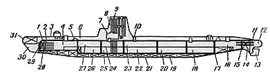
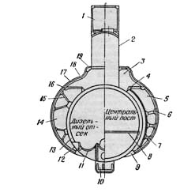

> **Первичный текст.** Российское общество и гибель АПЛ «Курск» 12 августа 2000 года.
> Источник: `Российское общество и гибель АПЛ «Курск» 12 августа 2000 года.doc` sha256 `5de29b0805981f84…`; [страница на dotu.ru](https://dotu.ru/2002/08/18/20020818-apl_kursk_red-2/).
> Автоматическая транскрипция DOC→Markdown; смысл и формулировки не правились.
> Контрольные суммы и статус проверки — в [NOTICE.md](../../NOTICE.md).
> Содержание передаёт позицию авторов; утверждения не верифицированы библиотекой.

---

# Послесловие

Реально Пр. 949А (тем более в части внешнего вида) не является военной и государственной тайной России, которую бы натовцы желали бы выведать для того, чтобы воспроизвести у себя. И потому рассекретить и опубликовать материалы видеосъёмок погибшего “Курска” в том виде, в каком он был сразу же после гибели до начала подъёма с него обломков и уцелевших конструкций, можно без вреда для обороноспособности страны.

Если бы ВМС США хотели иметь лодки такого назначения, такого конструктивного типа, то они бы давно уже воспроизвели его у себя. Они бы сделали это точно также, но на основе своей технологической базы, как это в своё время сделал СССР. Так в 1960‑е гг. под впечатлением от создания в США первых стратегических подводных ракетоносцев с 16 межконтинентальными баллистическими ракетами «Поларис А-1», первый из которых был назван “Джорж Вашингтон”, СССР создал свой аналог — АПЛ Пр. 667. Она получила в натовских кругах прозвище “Джон Вашингтон”, т.е. “Иван Вашингтон” в переводе на русский. Причём советский аналог оказался хуже американского прототипа по параметрам шумности вследствие господства в ВМФ СССР и военном кораблестроении горшковщины, одним из последних проявлений которой и стали АПЛ Пр. 949А.

Необходимость в создании “Ивана Вашингтона” возникла потому, что АПЛ носитель баллистических ракет собственной разработки (Пр. 658, бюро-проектант “Рубин”)[^207], имела примерно 130 тонн водоизмещения на одну тонну ракет в его составе (при общем количестве ракет — 3). А “Джорж Вашингтон” имел около 30 тонн водоизмещения на одну тонну ракет в его составе (при общем количестве ракет 16). К тому же американские ракеты обладали большей дальностью полёта и были предназначены для подводного старта, в то время как первые ракеты, предназначенные для АПЛ Пр. 658, могли быть запущены только из надводного положения, что требовало пребывания лодки в надводном положении в течение 12 минут и достаточно хорошей погоды[^208].

Это позорное для СССР соотношение показателей полезной весовой отдачи и других тактико-технических характеристик проектов первых для каждой из стран стратегических ракетоносцев, однако не является исключительной виной “Рубина”. В оправдание проектантов АПЛ Пр. 658 можно сказать, что они не были полновластны над этим проектом.

Дело в том, что в США создавалась система вооружений «Поларис», в которой разрабатывалась и ракета, и лодка носитель, а программа работ по созданию этой системы координировалась одним «штабом». Так было и в дальнейшем при создании в США систем вооружений «Посейдон» и «Трайдент». А в СССР на протяжении всей истории создания подводных стратегических ракетоносцев лодка и ракеты для неё имели административно независимых разработчиков, вследствие чего система вооружений на основе лодки и ракеты становилась результатом «перетягивания каната» и была такой, какой получится в противоборстве разработчиков, а не такой, какой требовало время. Вследствие этого и возникали такие душераздирающие варианты как отечественные “системы вооружений” на основе лодок Пр. 658 и Пр. 941. Но если Пр. 658 всё же мог возникнуть в результате первоначального отсутствия культуры осуществления многоотраслевых проектов[^209], то Пр. 941 — неоспоримо результат организационной ошибки (независимость разработчиков), возведённой в систему. Полное подводное водоизмещение АПЛ Пр. 941 достигает 48 000 т (под другим данным 49 800 т), а её ракетное вооружение — 20 межконтинентальных баллистических ракет (соответственно 2 400 т водоизмещения на одну ракету, собственная масса ракеты около от 90 до 120 т по разным данным).

После создания “Ивана Вашингтона” С.Н.Ковалев, главный конструктор Пр. 658, вплоть до создания АПЛ Пр. 941 (ещё одного урода, в разные времена известного под названиями «Тайфун» — «Акула») жил тем, что руководил рисованием “Ивана Вашингтона” в новых модификациях, добавляя к номеру проекта 667 всё новые и новые буквы и их комбинации, обслуживая своей деятельностью мафию разработчиков лодочных ракет, деятельность которой вне темы настоящей работы и сокрыта за забором ещё более суровой секретности, чем лодки. И хотя ни одна из этих модификаций Пр. 667 (каждый раз представляемых как новый проект, поскольку водоизмещение выросло от 11 500 т у Пр. 667А до 18 200 у Пр. 667БДРМ) не только не превзошла, но и не достигла уровня акустической скрытности современных ей американских аналогов, С.Н.Ковалёв всё же стал академиком; не смотря на эти “достижения” стал академиком и его начальник — руководитель “Рубина” И.Д.Спасский.

Некогда И.В.Сталин сказал, что ядерное оружие это оружие шантажа, и был прав. Соответственно в ядерную эпоху СССР было необходимо разрабатывать и держать на вооружении ядерное оружие и средства его доставки, но следовало ограничиться количественным минимумом, обеспечивающем нанесение неприемлемого ущерба, при неоспоримо высоком качестве самих вооружений и средств их доставки.

Но если соотноситься с показателями акустики и пройденным отечественными стратегическими ракетоносцами путём от 5 300 т водоизмещения при 3 ракетах (Пр. 658) до 48 000 т при 20 ракетах (Пр. 941), то можно сделать вывод**: “рубиновская” мафия во главе с И.Д.Спасским расцвела на разорении страны в гонке бессмысленных вооружений.**

И хотя лодки недопустимо шумят, горят, тонут, непотопляемость главного рубиновского фигуранта обеспечивается на протяжении десятилетий. И это может быть только результатом и выражением мафиозности глобального масштаба, политически организованной в русле осуществления библейского проекта, т.е. если не прямой принадлежностью к структурам масонства, то опекой со стороны глобальной масонской мафии.

История атомного подводного кораблестроения в порочных традициях горшковщины и научно-технической школы возглавляемого И.Д.Спасским “Рубина”, гибель “Курска”, ход расследования причин гибели, неуклюжая попытка Генпрокуратуры и Госкомиссии убедить общество в том, что ими установлены истинные причины гибели корабля — одно из многих выражений недопустимости мафиозно-бюрократического “элитарно”-масонского правления в наши дни.

Если копнуть другие отрасли деятельности российского общества, то в них картина будет качественно такая же, только будут другие имена и фамилии “выдающихся” деятелей, часть из которых тупые карьеристы-ставленники, а часть из которых посвящена в какой-то степени в деятельность масонских структур.

Но всё это написано не для того, чтобы поставить к стенке бюрократов-мафиози[^210], проявивших свою зловредность в ВМФ и в подводном кораблестроении, а для того, чтобы люди задумались над всем этим и преобразили, прежде всего, сами себя так, чтобы повторение такого в дальнейшем стало невозможно.

Ощущение необходимости этого есть у многих, даже у тех, кто лоялен сложившейся системе мафиозно-бюрократического “элитарного” правления. Ещё в то время, когда “Курск” лежал на грунте и только обсуждался проект его подъёма, в передаче “VIP-zona” Петербургского телевизионного канала «АСТ» председатель петербургского клуба подводников Игорь Кириллович Курдин охарактеризовал расследование причин гибели “Курска” следующими словами:

«Не хотелось бы думать, но всё выглядит как шоу, которым кто-то управляет».

Беда его и многих других как раз в том и состоит, что им не хочется думать, и уж совсем не хочется думать на тему управляемости глобальной политики на протяжении нескольких тысяч лет. Именно поэтому и имеют место «шоу», которыми действительно кто-то управляет, ориентируясь на осуществление своих интересов. Но если подумать, то вывод один:

Без освобождения жизни России от этих зол (концептуальной власти библейской доктрины и бюрократизации) и перехода общества в его самоуправлении к доктрине воплощения в жизнь идеалов человечности, трагедии такого рода и иные будут неизбежны и впредь.

И потому надо наконец-таки пробудиться, очнуться, начать думать и *непреклонно* воплощать благие помыслы в жизнь.

26 июля — 18 августа 2002 г.

Уточнения и добавления: 5 — 7, 24 сентября 2003 г.

\* \* \*

**Ещё одно добавление 2003 года**

В 2003 г. глава ЦКБМТ “Рубин” И.Д.Спасский выпустил книгу “«Курск». После 12 августа 2000 года” (Москва, издательство «Русь»). Книга дорогая по нынешним временам (под 300 рублей), в ней много разных иллюстраций. Но что касается иллюстраций, относящихся к пребыванию АПЛ “Курск” в плавдоке № 50 в посёлке Росляково, то в ней приведена одна единственная иллюстрация — фотография, сделанная в процессе всплытия дока, после того, как “Курск” был установлен на кильблоки, а баржа “Giant-4” выведена из дока. Фотография сделана с носовых ракурсов в тот момент, когда почти всё ограждение выдвижных устройств (рубка) уже над водой, а весь корпус — ещё под водой, вследствие чего область разрушений в носовой оконечности не видна.

В нашем понимании то обстоятельство, что глава ЦКБМТ “Рубин” И.Д.Спасский не пожелал прокомментировать те фотографии, которые в настоящей работе прокомментировали мы, а так же не пожелал привести и прокомментировать те фотографии, которые нам недоступны, тоже ложится в обоснованную нами выше версию: “Курск” потоплен торпедным залпом, и поскольку этот факт официально подтверждать в силу разных причин у Российской стороны желания нет, то И.Д.Спасский не включил в свой трактат фотографии, способные опровергнуть официальную версию о гибели АПЛ в результате взрыва торпеды на её борту по неизвестной причине. Таким образом, он по умолчанию подтвердил несостоятельность официальной версии, и правильность версии, изложенной в настоящей работе.

23 декабря 2003 г.

**Добавления 2004 года**

Не лучше и книга “Правда о «Курске»” (Москва, «Олма-Пресс», 2004 г.), написанная Генеральным прокурором РФ В.Устиновым. Она также обходит молчанием всю проблематику затронутую и рассмотренную в настоящей работе.

20 декабря 2004 г.

**Добавления 2005 года**

О гибели АПЛ “Курск” вышла ещё одна книга, автор которой Борис Аврамович Кузнецов озаглавил её “Она утонула…”[^211], дав ей подзаголовок *«Правда о “Курске”, которую скрыл генпрокурор Устинов»* (Москва, «Де-Факто», 2005 г.), подразумевая упомянутую выше книгу В.Устинова “Правда о «Курске»”. Прежде, чем обратиться к самой книге Б.А.Кузнецова, мы приведём сообщаемые в ней некоторые сведения о её авторе:

«Кузнецов Борис Аврамович, 19 марта 1944 года рождения, с 1962 по 1982-й служил на должностях оперативно-начальствующего состава в Ленинградском и Магаданском уголовном розыске, участвовал в раскрытии краж дуэльных пистолетов из музея-квартиры А.С.Пушкина, краж из Эрмитажа и Русского музея, хищений промышленного золота на приисках Чукотки, сотен других преступлений.

С 1982 года занимался адвокатской практикой, научной и правозащитной деятельностью. С 1989 года советник группы народных депутатов СССР — челнов Межрегиональной депутатской группы[^212]. В июле 1990 года создал адвокатское бюро «Борис Кузнецов и партнёры», которое до 1995 года было в составе Санкт-Петербургской коллегии адвокатов, а с 1995 года — Межреспубликанской коллегии адвокатов» (“Она утонула…”, стр. 3).

Далее в книге следует более чем полуторастраничный список дел, в которых Б.А.Кузнецов представлял интересы тех или иных клиентов. После этого сообщается:

«В настоящее время представляет интересы 50 семей подводников, чьи дети и мужья погибли на апрк[^213] «Курск», защищает научного сотрудника Института США и Канады Игоря Сутягина, обвиняемого в государственной измене, а также память Никиты Сергеевича Хрущёва и его сына Леонида по иску к писателю Владимиру Карпову и бывшему министру обороны СССР Дмитрию Язову[^214], а также руководителя службы собственной безопасности МЧС России генерал-лейтенанта Владимира Ганеева[^215], интересы адмирала Олега Ерофеева и контр-адмирала Юрия Кличугина» (“Она утонула…”, стр. 5).

По опросам журналистов и читателей газеты “Версия” (июль 1999), журналов “Деньги” (июль 1996) включался в пятёрку лучших российских адвокатов. В журнале “Лица” за 2000 — 2004 годы включался в число «Кумиров России» по разделу «Право» (“Она утонула…”, стр. 7).

В “Предисловии к предисловию” (так называется первый раздел книги Б.А.Кузнецова) он пишет:

«Как и в судебном процессе, адвокат выступает последним. (…) Теперь моя книга будет стоять на полках магазинов рядом с книгой Устинова, и заинтересованный читатель всегда может сравнить и оценить, где у Устинова правда, где полуправда, а где ложь».

Далее следует текст предисловия, озаглавленного “Почему вредно врать и зачем нужна эта книга?”

Т.е. из всего, что можно прочитать на первых страницах книги, можно подумать, что мы имеем дело с произведением непреклонного поборника правды и разоблачителя всякой лжи, весьма квалифицированного следователя и юриста с широким кругозором. Однако это не так.

Доходим мы до страницы 176 названного опуса непреклонного “поборника правды” и видим рисунок, — *на первый общий взгляд, если не вдаваться в детали, —* идентичный тому рисунку, который мы привели выше в гл. 9 как схему поражения АПЛ “Курск” торпедным залпом натовской подводной лодки.

На рисунке, приводимом Б.А.Кузнецовым в его книге на стр. 176, присутствуют те же чёрные круги, которыми мы обозначили предполагаемые эпицентры взрывов натовских торпед снаружи корпуса; присутствует обозначение поперечного сечения, по которому была предпринята попытка отделить обломки носовой оконечности перед подъёмом лодки.

Но из взятого Б.А.Кузнецовым в интернете нашего графического файла схемы поражения торпедным залпом “Курска” удалены выноски-указатели на аварийный буй и на люк 9‑го отсека; удалена жирная пунктирная линия, которой мы обозначили зону локализации возможных деформаций корпусных конструкций и повреждений механизмов под воздействием ударной волны неконтактного взрыва торпеды, происшедшего над кормовой оконечностью.

А к чёрному кругу, которым мы обозначили область предполагаемой локализации эпицентра неконтактного взрыва над кормовой оконечностью АПЛ “Курск”, в книге Б.А.Кузнецова сделана выноска с дурацкой по её существу поясняющей надписью: «Пожар в результате попадания масла на пластины для регенерации воздуха».

Т.е. согласно рисунку в книге Б.А.Кузнецова пожар произошёл не в 9‑ом отсеке внутри лодки, а снаружи — пламя якобы полыхало в воде за её бортом. Однако наши пояснительные надписи к двум чёрным кругам в носовой оконечности лодки сохранены автором книги в их оригинальном виде.

Т.е. разоблачитель версии генпрокуратуры и “непреклонный поборник правды” Б.А.Кузнецов в своей книге, если говорить юридическим языком:

- совершил акт плагиата (скачал из интернета графический файл, не дав ссылок на источник, откуда он был заимствован),

- а потом совершил подлог (внёс в файл изменения, которые извращают его вполне определённый смысл).

Либо эти же действия совершил помогавший ему технический редактор, который нашёл подходящий для его целей *графический файл реконструированной нами схемы поражения* и совершил с ним все описанные выше манипуляции, тем самым выставив Б.А.Кузнецова в роли плагиатора и субъекта, совершившего подлог.

При этом Б.А.Кузнецов в своей книге ничего не говорит о несостоятельности версии потопления АПЛ “Курск” торпедным залпом натовской подводной лодки (либо поражения его противолодочным оружием ВМФ России), хотя эта версия не может быть ему неизвестна. Он обязан знать о её существовании из материалов официального расследования, в котором она, как сообщает В.Устинов, была рассмотрена и отвергнута. Т.е. Б.А.Кузнецов обязан знать о ней даже в том случае, если к краже графического файла из настоящего аналитического сборника он непричастен, вследствие чего и не знаком с нашим её обоснованием.

Если же он действительно не согласен с версией потопления, но не желает её обсуждать публично, то ничто не мешало ему (либо его техническому редактору) взять в качестве основы для необходимой в его книге иллюстрации, графический файл с изображением продольного разреза АПЛ “Курск” (рис. 5 в настоящей книге), на котором нет никаких дополнительных изображений и надписей, поясняющих версию потопления “Курска” торпедным залпом. Тем более, что рисунок “Продольный разрез АПЛ проекта 949А” на основе этого же графического файла сам же Б.А.Кузнецов воспроизводит в своей книги на соседней странице 177.

Всё это в совокупности даёт основания утверждать, что и книга Б.А.Кузнецова “Она утонула…” — ещё одна публикация, умышленно направленная на то, чтобы под видом разоблачения официальной лжи (о том, что подводники в 9 отсеке погибли почти сразу же после взрыва торпед в первом отсеке и затопления лодки, а не спустя несколько суток) поддержать официальную версию Генпрокуратуры о самопроизвольном взрыве неисправной перекисьводородной торпеды 65-76, которая, *мягко говоря,* «вызывает большие сомнения», если анализировать те фотографии, что были сделаны в плавдоке в Росляково после подъёма “Курска” и потом осели в интернете.

Работал на эту версию Б.А.Кузнецов сознательно, либо его подставил кто-то из технических помощников, кто помогал в подборе иллюстраций и подготовки их к изданию, — для этого вывода значения не имеет…

17 — 18 апреля 2005 г.

**Ещё одно добавление 2005 года**

В 2005 г. на многих сайтах в интернете обсуждался сериал о подводных лодках, показанный в Канаде, в котором было уделено внимание и гибели “Курска”. Вот один из вариантов изложения версии канадского фильма.

«Сейчас по History Channel в Канаде идёт сериал про подлодки. Две серии из этого сериала посвящено “Курску”. Одна из них уже прошла, сегодня — вторая. Вот описание первой серии передранное из одного топика: Поначалу показывали то, что мы уже видели и знали. Как и когда это случилось, и как наши военные начальники на это реагировали. Обычные кадры. Женщины в истерике и всё такое. Обвинения Путину, что оставался на отдыхе на Чёрном море. Показали Илью Клебанова, если помните, он был тогда вице-премьер министром. Показали как Клебанов стоял молча перед впавшими в истерику женщинами не зная что ответить. Мы уже немного расслабились, ну, мол, будет сейчас: пройдутся от души по нашим.

И тут внезапный поворот. Вы, наверное, помните, что была такая версия в некоторых газетах, что, мол, была рядом иностранная подводная лодка, и было вроде как столкновение, а потом детонировали торпеды на “Курске”. У нас это всё и осталось нелепым вымыслом, и в итоге, после двухлетнего следствия, в 2002 году была озвучена официальная версия, согласно которой самопроизвольно взорвалась торпеда в носовом отсеке, затем по цепной реакции взорвался весь боезапас, что и повлекло гибель подлодки и экипажа.

Теперь о том, что нам тут показали в этом фильме. Показали, что было две американские подводные лодки в районе манёвров. Они были на спецзадании, следя за маневрами. Одна подлодка “Мемфис” шла под прикрытием другой лодки “Толедо” в тени. Вроде, как только одна на экранах всех радаров и сонаров[^216]. Потом “Мемфис” вынырнула из под своей ведущей лодки, чтобы получше исследовать запуск баллистической ракеты с “Курска”, не рассчитав курс и расстояние. Американцы оказались на встречном курсе и столкнулись в лобовом направлении с нашими. Они прошли всем телом по наиболее уязвимому второму отсеку “Курска”. Но самое ужасное случилось потом. На второй американской лодке “Толедо”, наблюдая всю картину, капитан решил, что русские каким то образом атаковали “Мемфис” и не долго думая, выпустил торпеду по “Курску”. Торпеда попала прямо в ослабленную часть на стыке второго и третьего отсеков и разорвалась внутри. В фильме показали компьютерную вариацию с участием всех трёх лодок о том как всё произошло. Нашими самолетами, по свежим следам, были зафиксированы масляные пятна на воде по курсу уходящей с места происшествия чужой подлодки.

В некоторых газетах писали, что была иностранная подлодка, вроде как английская, и мы все про это читали. Теперь о том, что мы точно не знали. Оказывается, наши вели эти две американские подлодки до всех событий и точно знали, что это были американцы на наблюдении. После столкновения и атаки на “Курск” министр обороны Сергеев поднял две противолодочные эскадрильи в воздух. Немедленно доложили на юг Путину. И в тот же момент на связь с Путиным вышли американцы. После связи с американцами Путин отозвал самолеты и, в конце концов, Путин (или его команда) принял решение оставаться на юге, чтобы не провоцировать нагнетание напряжённости. Всё, оказывается, было на краю пропасти. Срочно прибыл в Москву директор ЦРУ для консультаций. Все это время Путин постоянно был на связи с Биллом Клинтоном.

В итоге к лодке никого не подпускали, хотя весь мир предлагал квалифицированную помощь. Все мы ведь думали, что можно спасти кого-нибудь. Через несколько дней наши согласились пустить датчан, но со строжайшим приказом не подплывать к носу лодки. Датчане сумели открыть люк в восьмом отсеке, нашли несколько посмертных записей, и подтвердили, что внутри лодки никто не выжил. После этого шла работа уже наших водолазов. Они уже не заботились о самой лодке, её реакторе и погибших моряках. Оказывается со дна около “Курска”, в срочном порядке убирались куски и обломки американского “Мемфиса”. Те российские газеты, которые все же умудрились опубликовать спутниковые снимки \[подозрительной иностранной\] подлодки на ремонте в норвежском порту были тут же прижаты к ногтю ФСБ. Эта подлодка действительно была американской “Мемфис” и добиралась она до Норвегии 7 дней вместо 2 обычных. Другая американская лодка “Толедо” зигзагами, нестандартным курсом, ушла в США. Двое представителей российского военного и политического руководства Игорь Сергеев и Илья Клебанов, которые не шли на поводу и отстаивали американский след как публичную версию были в итоге отправлены в отставку.

Некоторое время спустя (около двух недель после происшествия) весь предыдущий российский долг США был аннулирован, и Америка предоставила России новый кредит на 10 миллиардов долларов. Каждая семья, погибших на “Курске” моряков, получила немыслимую компенсацию в 25 000 долларов. Путину, тем ни менее, нужно было поднять лодку для поднятия политического имиджа. На подъём “Курска” год спустя, был подписан контракт с голландской компанией, единственной, которая согласилась поднять только среднюю и хвостовую часть. Все остальные компании за много меньшие деньги соглашались поднять весь корпус целиком. Голландцы отпилили два носовых отсека[^217] и вывезли на сушу всё остальное. Вот тут нам и показали кадры лодки крупным планом так сказать по прибытии. Прямо у места отпила зияла огромная круглая дыра и края у этой дыры были вмяты внутрь. У нас этого точно не показывали, потому что немедленно эта часть фюзеляжа была объявлена засекреченной и впоследствии была ликвидирована, как, впрочем, все кинопленки. В фильме были приведены показания экспертов, которые подтвердили, что только американская торпеда нового образца (не помню её точное название), может оставлять такие следы, прожигая наружный слой и врываясь внутри.

Удивительный фильм. Особенно здесь в Канаде. Одно, несомненно, идея американского следа даже не подвергалась сомнению. Фильм был сделан при участии английских, канадских и независимых американских журналистов”.

Добавление: 17 ноября 2005 г.

Далее текст 2004 г.

\* \*\

\*

Однако книги о гибели “Курска”, в которых представители кораблестроительной и военно-морской мафии убеждают читателей, что причиной гибели 118 человек и корабля является дефект торпеды, оказавшейся на борту “Курска”, а не поражение его противолодочным оружием натовской лодки, — купят и прочитают не все. А кроме публикаций такого рода есть и публикации, в которых прямо утверждается, что “Курск” был потоплен торпедным залпом натовской лодки (например упоминавшаяся книга В.Доценко “Кто убил «Курск»”). И это приводит к вопросу: *А как убедить миллионы россиян в том, что ни одна натовская лодка к гибели “Курска” не причастна, что в Военно-Морском флоте и военном кораблестроении всё было в порядке и в советские времена, а тем более сейчас, — в обновляющейся России?*

— Надо отснять, разрекламировать и показать в широком прокате и на телевидении пафосный фильм в котором ***правдоподобно показать,*** как подводники гибнут вместе с кораблём, являя лучшие человеческие качества, а в их гибели никто не виноват: трагическая непредсказуемая случайность. И вот 12 февраля 2004 г. на экраны страны такой фильм о подводниках — “72 метра”, созданный режиссёром Владимиром Ивановичем Хотиненко, — вышел. Как этот фильм решает задачу убеждения миллионов, что в гибели “Курска” нет виновных?

— Он действительно пафосно повествует в художественных образах по принципу аналогии, что если первопричиной гибели “Курска” всё же и был внешний взрыв, а не внутренний, как о том отчиталась Генпрокуратура, то это взорвалась не торпеда, которую выпустила по “Курску” одна из подводных лодок НАТО, скрытно ведшая разведку в районе учений, а мина времён Великой Отечественной войны.

Ассоциативная связь, переносящая видеоряд фильма на гибель реального “Курска”, устанавливается через общность для фильма и реальной трагедии, по крайней мере четырёх обстоятельств: **во-первых**, обе лодки гибнут в ходе учений, **во-вторых**, обеим поставлена боевая задача атаковать торпедами флагманский корабль условного противника, идущий в составе *ордера (т.е. боевого или походного порядка кораблей);* **в-третьих**, на борту присутствует гражданский специалист; **в-четвёртых**, хотя лодка из фильма — не атомоход, подобно “Курску”, но её проектантом тоже является ЦКБМТ “Рубин” возглавляемое И.Д.Спасским.

Соответственно такого рода набору совпадений (как бы случайных и не мотивированных ничем, кроме сюжета — не может же быть фильм о подводниках без подводной лодки) на реальную гибель “Курска” переносится и вымышленная причина гибели лодки из фильма — подрыв на случайно всплывшей мине времён Великой Отечественной войны.

Так В.И.Хотиненко запятнал себя ещё раз. В прошлом он — создатель фильма “Мусульманин”. Этот фильм плох тем, что не показывает мировоззренческих причин несовместимости библейской и коранической культур, хотя должен был бы это показать, что посодействовало бы скорейшему прекращению многих доныне пылающих и тлеющих конфликтов на почве разногласий библейских и коранического вероучений.

А если говорить о том, какие действительно актуальные проблемы в жизни нашего общества мог бы высветить, но не высветил, тот же самый фильм “72 метра” (если бы в него внести одно единственное изменение в сюжете), то истории известны *две наиболее частые причины,* по которым в мирное время подводные лодки гибнут или оказываются на дне с затопленными отсеками:

- **Первая** **причина** — в проектах терпящих аварии и гибнущих в катастрофах лодок допускаются конструктивные ошибки, а кроме того верфи и заводы поставщики корабельного оборудования допускают брак при строительстве и ремонте подводных лодок. Кто-то был недобросовестен в труде на берегу, а экипаж лодки расплачивается за их недобросовестность десятками жизней. А виновных потом большей частью не найти: Кто те мерзавцы, что при строительстве “Курска” не сняли технологическую заглушку в датчике давления в отсеке? В результате их недобросовестности, когда отсек был затоплен, автоматическая система отдания аварийного сигнального буя не сработала, и буй остался в гнезде. К моменту проведения следствия соответствующие архивы завода-строителя были уже уничтожены, а сами подлецы-бракоделы с повинной не явились. А ведь это — не единственный дефект, допущенный при строительстве и техническом обслуживании корабля: были ещё пороки, проистекающие из обыкновенного карьеризма и своекорыстия участников научно-технической и военно-морской мафии, заправляющей военным кораблестроением без страха после того, как в 1953 г. с устранением И.В.Сталина отстрел вредителей-карьеристов в стране прекратился.

  При этом надо понимать, что покрытие должностными лицами ошибок и упущений, злоупотреблений властью[^218] со стороны их подчинённых, обращение с такого рода намёками и просьбами к вышестоящим руководителям[^219] автоматически порождает заговор, который в процессе своего развития обретает характер заговора политического и измены Родине. И одной из жертв такого рода созревшего ещё к началу перестройки заговора стал экипаж “Курска”.

- **Вторая** **причина** — ошибки экипажа или плохая организация службы на самой лодке (или на повредившем её другом корабле, если инцидент с лодкой происходит по его вине).

Но поскольку **задача, за которую В.И.Хотиненко заплатили и создали ему “паблисити”, состояла**:

- Не в том, чтобы высветить актуальную проблему действительно общественной значимости — России необходимо вернуться к непреклонной добросовестности в жизни и соответственно — к бескорыстию в труде.

- А в том, чтобы покрыть ложь, то:

Для того, чтобы лодка в фильме оказалась затопленной на дне, а экипаж начал мужественно бороться за живучесть, проявляя героизм и лучшие человеческие качества, — пришлось высосать из пальца завалявшуюся мину времён Великой Отечественной войны.

И соответственно этим обстоятельствам, на наш взгляд: снятый американцами фильм “К-19” о подвиге её экипажа, жизнями и здоровьем заплатившего за конструктивные ошибки и дефекты, куда честнее и патриотичнее по отношению к России, нежели скрытая за кадром подлость закулисных заказчиков и авторов фильма “72 метра”.

24 марта 2004 г.

ПРИЛОЖЕНИЕ:\

*Устройство подводной лодки*

----------------------------

Этот раздел написан на основе материалов, взятых с сайта  <http://randewy.narod.ru/nk/pl.html> «Интернет-клуб юного моряка», и предназначен для того, чтобы дать общее представление о конструкции и устройстве подводных лодок. Хотя иллюстрации относятся к середине ХХ века, тем не менее они дают представление о конструкции современных подводных лодок, которые отличаются от показанного на рисунках, прежде всего, своими размерами и формой, приспособленной для плавания под водой, а не для плавания по поверхности и «ныряния», как то имело место до появления атомных подводных лодок и развитой противолодочной обороны.

*[В оригинальном издании здесь расположен рисунок/схема. Иллюстрация не включена в данный выпуск: ожидает визуальной и правовой проверки. Файл источника: image54.jpeg]*

Подводные лодки могут быть одного из трёх архитектурно-конструктивных типов. На рисунке выше показаны поперечные сечения лодок различных архитектурно-конструктивных типов *(на нём цифрами обозначены: 1 — прочный корпус, 2 — надстройка, 3 — ограждение рубки и выдвижных устройств, 4 — прочная рубка, 5 — цистерны главного балласта, 6 — лёгкий корпус; 7 — киль; значение этих терминов пояснено далее в тексте):*

- *однокорпусные (а),* имеющие «голый» прочный корпус, который заканчивается в носу и корме хорошо обтекаемыми оконечностями лёгкой конструкции;

- *полуторакорпусные (б),* имеющие кроме прочного корпуса ещё и лёгкий, но часть поверхности прочного корпуса при этом остаётся открытой;

- *двухкорпусные (в),* имеющие два корпуса: внутренний — *прочный* и наружный — *лёгкий.* При этом лёгкий корпус имеет удобообтекаемую форму, полностью охватывает прочный корпус и простирается на всю длину лодки. Междукорпусное пространство используется для размещения различного оборудования и части цистерн.

Подводные лодки СССР и России являются двухкорпусными. Большинство атомных подводных лодок США (дизель-электрических они не строят с начала 1960‑х гг.) являются однокорпусными. Это является выражением первоприоритетности для военно-морских стратегов различных качеств: надводной непотопляемости — для СССР и России и скрытности — для США.

*Прочный корпус* — основной конструктивный элемент подводной лодки, обеспечивающий безопасное нахождение её на глубине. Он образует замкнутый объём, непроницаемый для воды. Внутри прочного корпуса размещаются помещения для личного состава, главные и вспомогательные механизмы, оружие, различные системы и устройства, аккумуляторные батареи, различные запасы и т. Его внутреннее пространство разделяется по длине поперечными водонепроницаемыми переборками на отсеки, которые именуются в зависимости от предназначения и соответственно — характера вооружения и оборудования, в них размещённого.

В вертикальном направлении отсеки разделяются палубами (тянутся на протяжении всей длины корпуса лодки из отсека в отсек) и платформами (в пределах одного отсека или нескольких отсеков). Соответственно помещения лодки имеют многоярусное расположение, что увеличивает количество оборудования, приходящуюся на единицу объёма отсеков. Расстояние между палубами (платформами) «в свету» делается более 2 м, т.е. несколько большим, чем средний рост человека.

Конструктивно прочный корпус состоит из шпангоутов и обшивки. Шпангоуты имеют, как правило, круговую кольцевую, а в оконечностях могут иметь эллиптическую форму и изготовляются из профильной стали. Устанавливаются они один от другого на расстоянии 300 — 700 мм в зависимости от конструкции лодки как с внутренней, так и с наружной стороны обшивки корпуса, а иногда и комбинированно с той и другой стороны.

Обшивка прочного корпуса изготовляется из специальной прокатной листовой стали и приваривается к шпангоутам. Толщина листов обшивки доходит до 35 — 40 мм в зависимости от диаметра прочного корпуса и предельной глубины погружения подводной лодки.

Переборки прочного корпуса бывают прочные и лёгкие.

*Переборки* делят внутренний объём современных подводных лодок на 6 — 10 водонепроницаемых отсеков. *Прочные переборки* выгораживают в нём отсеки-убежища, в которых оставшиеся в живых в ходе аварии члены экипажа могут подготовиться к самостоятельному всплытию из затонувшей лодки на поверхность или дожидаться помощи извне. По расположению прочные переборки бывают внутренними и концевыми; по форме — плоскими и сферическими (сферические несколько легче плоских при одинаковой прочности и внутренние сферические переборки обращены выпуклостью в сторону отсеков-убежищ).

*Лёгкие переборки* предназначены для разделения функционально специализированных помещений и обеспечения надводной непотопляемости корабля (т.е. они при затоплении отсеков выдерживают давление воды только, если лодка находится на поверхности или глубине в пределах 20 — 30 м).

Конструктивно переборки выполняются из набора и обшивки. Набор переборки обычно состоит из нескольких вертикальных и поперечных стоек (балок). Обшивка изготовляется из листовой стали.

Концевые водонепроницаемые переборки прочного корпуса равнопрочны с ним и замыкают его в носовой и кормовой оконечностях. Эти переборки служат на большинстве подводных лодок жёсткими опорами для торпедных аппаратов, валопроводов, приводов рулевых устройств, крепления набора и внутренних конструкций лёгких оконечностей.

Отсеки сообщаются друг с другом через водонепроницаемые двери, имеющие круглую или прямоугольную форму. Эти двери снабжены быстродействующими запирающими устройствами.

В верхней части прочного корпуса устанавливается прочная рубка, сообщающаяся через нижний рубочный люк с центральным постом (внутри прочного корпуса) и через верхний рубочный люк с ходовым мостиком (в верхней части ограждения рубки и выдвижных устройств — перископов, антенн). На большинстве современных подводных лодок прочная рубка выполняется в виде круглого цилиндра с вертикально расположенной осью или представляет собой комбинацию цилиндрической части и усечённых конусов. На некоторых лодках прочная рубка сконструирована так, что может использоваться в качестве всплывающей спасательной камеры, предназначение которой — эвакуация всего экипажа или *некоторой его части (сохранившей после аварии возможность доступа в центральный пост и всплывающую камеру)* с гибнущей или затонувшей подводной лодки.

В настоящее время на большинстве лодок главное назначение прочной рубки — вынести как можно выше над поверхностью воды при плавании в надводном положении вход в прочный корпус. Кроме того, поскольку центральный пост на многих лодках — один из отсеков-убежищ, то прочная рубка предназначена для выполнения функции шлюзовой камеры при выходе людей из затонувшей лодки.

Снаружи прочная рубка и выдвижные устройства, расположенные за ней, для улучшения обтекания при движении в подводном положении закрываются лёгкими конструкциями, которые называются ограждением рубки или ограждением выдвижных устройств. В верхней части ограждения расположен ходовой мостик с полным набором устройств, необходимых для управления лодкой в надводном положении и средствами связи с центральным постом. Из ограждения рубки имеются выходы на верхнюю палубу (фактически вход в прочный корпус через люки прочной рубки является главным, поскольку люки в прочном корпусе руководства по эксплуатации лодок предписывают держать закрытыми в большинстве случаев).

Торпедо-погрузочный и входные люки располагаются в верхней части прочного корпуса и сверху закрыты лёгкими конструкциями, которые называются *надстройкой*. Эти люки в большинстве случаев расположены в отсеках-убежищах и являются спасательными, для какой цели снабжены устройствами шлюзования. В надстройке также расположены устройства, предназначенные для швартовки, буксировки лодки и обеспечения её стоянки на якоре.

*Цистерны* предназначены для погружения, всплытия, вывески и дифферентовки лодки, а также для хранения жидких грузов (топлива, масел и т.п.). В зависимости от назначения цистерны подразделяются на цистерны: главного балласта, вспомогательного балласта, корабельных запасов и специальные. Конструктивно, в зависимости от назначения и характера использования, они выполняются либо прочными, т.е. рассчитанными на предельную глубину погружения, либо лёгкими, способными выдерживать давление 1 — 3 кГ/см2 (кГ — внесистемная единица, килограмм силы, равная весу 1 кг массы при ускорении свободного падения 9,81 м/с2). Они могут быть расположены внутри прочного корпуса, а также в пространстве между прочным и лёгким корпусом в средней части корабля и в лёгких оконечностях в нос и в корму по отношению к прочному корпусу.

*Киль* — сварная (в прошлом клёпаная) балка коробчатого, трапециевидного, Т-образного, а иногда и полуцилиндрического сечения, располагающаяся в днищевой части корпуса лодки. Он предназначен для обеспечения продольной прочности, предохранения корпуса от повреждения при покладке на каменистый грунт и для принятия и перераспределения нагрузки при постановке лодки в док. Может располагаться в междукорпусном пространстве на двухкорпусных лодках, а на полутора- и однокорпусных может располагаться как внутри прочного корпуса, так и снаружи — в зависимости от того, что более значимо для заказчика — хорошая гидродинамика или защита прочного корпуса от механических повреждений, если лодку в тех или иных тактических целях кладут на грунт.

*Лёгкий корпус* — конструктивно включает в себя жёсткий каркас (набор), состоящий из шпангоутов (поперечные рёбра жёсткости), стрингеров (продольные рёбра жёсткости и пластинчатые элементы набора), поперечных непроницаемых переборок; каркас является носителем обшивки лёгкого корпуса. Конструктивно набор лёгкого корпуса связан с находящимся внутри него прочным корпусом. Лёгкий корпус имеет удобообтекаемую форму, обеспечивающую необходимые мореходные качества как в надводном, так и в подводном положении. Лёгкий корпус подразделяется на части: наружный корпус, носовая и кормовая оконечности, надстройка. При этом в его составе оказываются как проницаемые, так и непроницаемые конструкции (цистерны). Кроме лёгкого корпуса в состав конструкции лодки входят отдельные, большей частью проницаемые, конструктивные элементы: ограждение рубки, стабилизаторы, обтекатели разного рода устройств, размещённых вне прочного корпуса и выходящих за контуры «идеальных» форм лёгкого корпуса.

Наружным корпусом называется водонепроницаемая часть лёгкого корпуса, расположенная вдоль прочного корпуса. Он закрывает прочный корпус по периметру поперечного сечения лодки от киля до верхнего водонепроницаемого стрингера и простирается по длине корабля от носовой до кормовой концевых переборок прочного корпуса или цистерн главного балласта. Некоторые лодки имеют ледовый пояс, представляющий собой утолщение обшивки лёгкого корпуса в районе крейсерской ватерлинии.

Оконечности лёгкого корпуса служат для придания обтекаемости обводам носа и кормы подводной лодки; простираются от концевых переборок прочного корпуса до форштевня (в носу) и ахтерштевня (в корме) соответственно. Однако лодки (прежде всего атомные, которые бóльшую часть времени плавания проводят под водой) могут иметь корпус каплевидной формы без форштевня и ахтерштевня (форштевень и ахтерштевень — вертикальные рёбра жёсткости в составе набора корпуса корабля, придающие заострённость носу и корме соответственно, что необходимо для уменьшения сопротивления воды при плавании по поверхности).

В носовой оконечности размещаются: носовые торпедные аппараты, цистерны главного балласта и плавучести, цепной ящик, якорное устройство, приёмники и излучатели основных гидроакустических станций.

В кормовой оконечности размещаются: цистерны главного балласта, горизонтальные и вертикальные рули, стабилизаторы, гребные валы и винты. На некоторых лодках — кормовые торпедные аппараты (на большинстве современных лодок кормовых торпедных аппаратов нет: это обусловлено прежде всего большими размерами гребных винтов и стабилизаторов, а так же и тем, что алгоритмы управления торпедами, позволяют вывести их почти что на любой курс вне зависимости от направления выстрела).

Ниже представлен продольный разрез дизель-электрической подводной лодки середины ХХ века с пояснением элементов конструкции и устройств. (Продольный разрез АПЛ “Курск” с пояснениями представлен на рис. 5 в главе 6).

1\. Прочный корпус. 2. Носовые торпедные аппараты. 3. Лёгкий корпус. 4. Носовой торпедный отсек. 5. Торпедопогрузочный люк. 6. Надстройка. 7. Прочная рубка. 8. Ограждение рубки. 9. Выдвижные устройства. 10. Входной люк. 11. Кормовые торпедные аппараты. 12. Кормовая оконечность. 13. Перо руля. 14. Кормовая дифферентная цистерна, предназначение которой — выравнивание дифферента — продольного наклонения лодки. 15. Кормовая водонепроницаемая переборка. 16. Кормовой торпедный отсек. 17. Внутренняя водонепроницаемая переборка. 18. Отсек главных гребных электродвигателей. 19. Балластная цистерна. 20. Машинный отсек. 21. Топливная цистерна. 22, 26. Кормовая и носовая группы аккумуляторов. 23, 27. Жилые помещения команды. 24. Центральный пост. 25. Трюм центрального поста. 28. Носовая дифферентная цистерна. 29. Носовая водонепроницаемая переборка. 30. Носовая оконечность. 31. Цистерна плавучести (атрибут некоторых дизель-электрических подводных лодок; её предназначение — быть пустой при плавании в надводном положении с целью придания дополнительной плавучести носовой оконечности для того, чтобы лодка легко всходила на волну, а не *зарывалась носом в неё — это снижает скорость хода и ухудшает управляемость*).

На следующем рисунке представлен поперечный разрез по ограждению рубки полуторакорпусной подводной лодки середины ХХ века с указанием элементов конструкции корпуса.

1\. Ходовой мостик. 2. Прочная рубка. 3. Надстройка. 4. Стрингер. 5. Уравнительная цистерна (предназначена для точного уравновешивания силы плавучести и веса лодки в подводном положении). 6. Подкрепляющая стойка (бракет). 7, 9. Кницы (пластины, к которым крепятся элементы набора, они предназначены для распределения нагрузки и устранения концентрации напряжений. 8. Платформа. 10. Коробчатый киль. 11. Фундамент дизелей. 12. Обшивка прочного корпуса. 13. Шпангоуты прочного корпуса. 14. Цистерна главного балласта. 15. Раскосные стойки (бракеты). 16. Крышка цистерны. 17. Обшивка лёгкого корпуса. 18. Шпангоут лёгкого корпуса. 19. Верхняя палуба.

***Материалы к освоению\

Концепции Общественной Безопасности***

1.  **Мёртвая вода** (Концепция общественной безопасности) СПб, 1992; 1998; 2000; 2004

2.  **Краткий курс...** (Основы самоуправления общества) СПб, 1999

3.  **Руслан и Людмила** (Развитие и становление государственности русского народа в глобальном историческом процессе, изложенное в системе образов Первого Поэта России А.С.Пушкина) СПб, 1999

4.  **Вопросы митрополиту Санкт-Петербургскому и Ладожскому Иоанну и иерархии русской православной церкви** СПб, 1999

5.  **К Богодержавию...** СПб, 1998

6.  **Медный всадник — это вам не медный змий...** (О самой древней мафии в системе образов А.С.Пушкина) СПб, 1998

7.  **Провидение — не “алгебра”** (О работах А.Т.Фоменко и Г.В.Носовского по формированию модели реальной хронологии Истории на основе математической обработки повествований хроник) СПб, 1996, 2002

8.  **Чернильный визитёр** (Рецензия на повесть: С.Норка “Инквизитор”) СПб, 1997

9.  **Разгерметизация** (Основы Концепции Истории в её понимании Внутренним Предиктором СССР, часть 1) СПб, 1997

10. **От человекообразия к Человечности** (в первой редакции —От  матриархата к  Человечности...) СПб, 1999

11. **Приди на помощь моему неверью...** (О дианетике и саентологии по существу: взгляд со стороны) СПб, 1998

12. **Печальное наследие Атлантиды** (Троцкизм — это “вчера”, но никак не “завтра”) СПб, 1999

13. **“Грыжу” экономики следует “вырезать”** СПб, 1998

14. **Да притечём и мы ко свету...** СПб, 1998

15. **Принципы кадровой политики государства, “антигосударства”, общественной инициативы** СПб, 1999

16. **Достаточно общая теория управления** (Постановочные материалы учебного курса, прочитанного студентам факультета прикладной математики — процессов управления СПб государственного университета в 1997 — 2003 гг.) СПб, 2-я ред., 2003

17. **О расовых доктринах: несостоятельны, но правдоподобны** СПб, 2000

18. **К пониманию макроэкономики государства и мира** (Тезисы) СПб, 2002

19. **Дело было в Педженте** (Второй смысловой ряд Фильма «Белое солнце пустыни») СПб, 2000

20. **«Мастер и Маргарита»: гимн демонизму? Либо Евангелие беззаветной веры** СПб, 2001

21. **Время: начинаю про Сталина рассказ** СПб, 2001

22. **Об имитационно-провокационной деятельности** (Уроки партийного строительства для простых людей и политических мафий) СПб, 2001

23. **Диалектика и атеизм: две сути несовместны** (О естественном, но “забытом” способе постижения человеком Правды Жизни) СПб, 2001

24. **Матрица “Матрице” — рознь** (О рецепте обретения “свободы” в фильме “Матрица”) СПб, 2001

25. **В.В.Пчеловод «Последний гамбит»** (Мистико-философский политический детектив) СПб 2001, 2002 (вторая редакция)

26. **Старые сценарии на новый лад?** (Сборник аналитических материалов разных лет по политической сценаристике) СПб, 2002

27. **Форд и Сталин: О том, как жить по-человечески** СПб, 2002

28. **Троцкизм–“ленинизм” берёт “власть”** («Разгерметизация», Рукопись 1990 г. Глава 5 § 8. Анализ ошибок большевистской партии перед взятием власти в 1917 г.) СПб, 2002

29. **От корпоративности под покровом идей к соборности в ** **Богодержавии** (О психологической подоплёке личности и её целенаправленном изменении) СПб, 2003

30. **Либерализм — враг свободы** (Миссия России в XXI веке: по Чубайсу… и на самом деле) СПб, 2003

31. **О задачах на будущее Концептуальной партии “Единение” и безпартийных приверженцев Концепции общественной безопасности** СПб, 2004

32. **Язык наш: как объективная данность и как культура речи** СПб, 2004

… и другие книги и текущая аналитика Внутреннего Предиктора СССР

Интернет по Концепции Общественной Безопасности «Мёртвая Вода»:

www.dotu.ru, www.mera.com.ru

[^1]: Сокращённое обозначение проектов кораблей, принятое в СССР и унаследованное Россией, — Пр. 949А, Пр. 68 бис и т.п.

[^2]: По разным сообщениям: численность экипажа в 130 человек называют иностранные военно-морские справочники, а отечественная журналистика верит им без сомнения. Предположить, что на лодке мог быть некомплект личного состава, вследствие чего даже вместе с прикомандированными на её борту было меньше 130 человек, отечественная журналистика не может. **\<**Ко времени написания второй редакции официально названное количество погибших на “Курске” составляет 118 человек, включая членов экипажа и прикомандированных лиц. Из общего числа 118 погибших найдено и опознано 115 тел.**\>**

[^3]: Министром обороны РФ в этот период был Сергеев Игорь Дмитриевич (1938 г. р.), Маршал Российской Федерации (1998 г.). С 1960 на командно-инженерных должностях в Ракетных войсках. С 1989 заместитель главнокомандующего Ракетными войсками. С августа 1992 главнокомандующий Ракетными войсками стратегического назначения Российской Федерации. С мая 1997 министр обороны Российской Федерации.

    Выступая вечером 21 августа 2000 г. в программе “Время” ОРТ (1 канал общероссийского телевидения) И.Д.Сергеев сделал ряд заявлений. По его словам, 13 августа на дне рядом с “Курском” военные обнаружили крупный неопознанный объект. Однако когда к месту аварии прибыло специальное гидрографическое судно, «этот объект обнаружен не был — ушёл». Как утверждал министр обороны, по размерам он был сопоставим с “Курском”.

    Кроме того, по его словам, с борта крейсера “Пётр Великий” и ещё одного судна над этим местом были замечены аварийные буи, что зафиксировано в бортовых журналах кораблей. Однако *вельбот (разновидность шлюпки: наше пояснение),* посланный чтобы снять с них информацию, ничего не обнаружил: буи «были приглублёнными», находились на глубине 2,5 — 3 метра, а волна в это время достигала силы 4 баллов, заявил министр.

    Игорь Сергеев сообщил ещё один новый факт: российские военные корабли зафиксировали, в отличие от норвежских сейсмологических служб, не два, а три взрыва. (2002 г.).

[^4]: Комингс-площадка — кольцо вокруг входных люков на подводных лодках с полированной плоской поверхностью, предназначенное для герметичной стыковки подводных аппаратов и спасательных колоколов (при авариях) с люком подводной лодки, находящейся в подводном положении.

[^5]: За прошедшие два года В.А.Попов ни разу не пояснил в средствах массовой информации, что и кого он имел в виду, произнося эти слова. После ухода с Флота он занял пост представителя Мурманской области в Совете Федерации, и вряд ли это наилучшее место для того, чтобы найти тех, кто эту трагедию организовал, и чтобы посмотреть им в глаза.

    12 августа 2002 г. В.А.Попов принял участие в траурных мероприятиях, посвящённых памяти экипажа “Курска”. Журналисты попытались взять у него интервью и попросили прокомментировать версию гибели корабля, оглашённую Генпрокуратурой. В ответ В.А.Попов отказался комментировать версию Генпрокуратуры и не пожелал огласить какую-либо другую версию.

    Мы расцениваем этот его отказ как выражение несогласия с версией Генпрокуратуры при невозможности в силу каких-то не названных причин публично огласить своё мнение и назвать известные ему факты в обоснование той версии, которую он считает истинной. (2002 г.)

[^6]: Об этом книги: Д.А.Романов “Трагедия подводной лодки «Комсомолец»” (СПб, 1995 г.); Б.А.Каржавин “Тайна гибели линкора «Новороссийск»” (СПб, «Политехника», 1991 г.) и “Гибель линейного корабля «Новороссийск»”.

[^7]: Ныне Российское агентство по судостроению.

[^8]: Здесь и далее фотографии АПЛ “Курск” в плавдоке посёлка Росляково приводятся по публикациям в интернете (2002 г.).

[^9]: В субботу 26 августа **\<**2000 г.**\>** сразу же после взлёта в аэропорту «Шереметьево 2» после возгорания одного из двигателей совершил вынужденную посадку Ил‑86 **\<**рейса Москва — Барселона**\>** более чем с тремястами пассажирами на борту. Но Бог миловал, никто не пострадал. На следующий день вспыхнула Останкинская телебашня (погибло три человека). Отечественные журналисты мерзавцы-некрофилы сразу же сострили: причина пожара на Останкинской телебашне — столкновение с иностранной телебашней, предположительно — с телебашней одной из стран НАТО.

    Этот **\<**злорадный**\>** юмор — выражение их **\<**злонравия,**\>** тупости и невежества, незнания того, что за последние десятилетия накопилась изрядная статистика столкновений подводных лодок США и СССР (России), обусловленная характером боевой службы подводных лодок США (ближнее слежение с целью уничтожения в угрожаемый период) и **качественным отставанием отечественных АПЛ в скрытности и способности к обнаружению высокоскрытных подводных лодок США**. Причиной такого положения дел является разнузданный карьеризм и чинодральство, которыми были охвачены все руководители строительства атомного подводного флота в нашей стране в эпоху, когда главнокомандующим ВМФ был ставленник НАТО — С.Г.Горшков. Вследствие этого, пока не будет вычищено горшковское наследие, повторение аварий и катастроф отечественных ПЛ имеет *неоправданно высокую* вероятностную предопределённость.

    Но о военно-технических аспектах этой проблемы в открытой печати России речь вести не принято: моряки и корабелы, знающие существо этого вопроса, на протяжении более, чем сорока лет большей частью перешёптываются между собой, но в практической деятельности подчиняются в силу должностной дисциплины вышестоящим чинодралам — руководителям строительства подводного флота; тех же, кто не лоялен вышестоящим чинодралам — ограничивали в продвижении по службе, а наиболее “неуправляемых” — изгоняли.

[^10]: Пенял в адрес В.Путина, что тот не вылетел немедленно к месту трагедии. Спрашивается, если бы В.Путин вылетел в район аварии, что: по его президентскому слову “Курск” всплыл бы на поверхность, пробоины затянулись, а мёртвые воскресли? — Каждый должен добросовестно исполнять свои должностные обязанности, страхуя возможные ошибки подчинённых и вышестоящих руководителей, но никто из руководителей не в праве бросить свою должность и подменять своей непрофессиональной распорядительностью действия подчинённых профессионалов.

    В данном случае: командование Северного флота обязано организовать и руководить действиями сил флота в аварийно-спасательных работах; представители центральной власти (в данном случае И.Клебанов), прибывшие к месту работ, обязаны в случае возникновения необходимости привлекать к обеспечению работ ресурсы, не подчинённые командованию флота; глава государства обязан руководить работой всего государственного аппарата, а не суетиться на месте трагедии, поскольку, *когда гибнет военный корабль, то глава государства не в праве исключать и «бредовую» (с точки зрения демократических журналистов) версию: что это не авария, а потопление его боевым оружием вооружённых сил иностранных государств*. Действительная практика проведения учений делает эту версию одной из реальных возможностей, вследствие чего до тех пор, пока не исключена возможность начала и эскалации боевых действий вследствие недоразумений, глава государства просто не в праве бросить всё на самотек и лететь к месту катастрофы.

[^11]: «Работы по спасению экипажа “Курска” запоздали по вине военного руководства России, как минимум, на трое — четверо суток», — оценка И.Хакамадой проведения спасательной операции.

[^12]: «Экипаж атомохода стал заложником тупости и лживости российских адмиралов», — Павел Дроздов, Егор Поскотинов “Тайна гибели «Курска»”, «Питер в “Московском комсомольце”», 24.08 — 31.08.2000.

[^13]: Например, “Час Пик”, № 36 (117), 29.08 — 04.09.2000.

[^14]: Например, обложка “Аргументов и фактов”, № 34, 2000; “Новый Петербург”, 24.08.2000; “Питер в «Московском комсомольце”, 24.08 — 31.08.2000.

[^15]: Об этом факте сообщила “Комсомольская правда” (толстушка), № 161, 1 — 8 сентября 2000 г.: ответы на телефонные звонки по «Прямой линии» Аркадия Мамонтова “Двадцать кораблей, как птицы, кружили над местом аварии” (Во время проведения спасательной операции Аркадий Мамонтов вёл прямые репортажи с борта крейсера “Пётр Великий” из района гибели “Курска”).

[^16]: За что отчасти и поплатились: 27 августа 2000 г. вспыхнул пожар на Останкинской телебашне — одном из символов отечественных СМИ. Прекращено вещание многих теле- и радиопрограмм на Москву и Московскую область. Это не «мистика» случайного и беспричинного невезения: это указание Свыше на принципиально порочный характер освещения событий средствами массовой информации России, но это ещё не расплата за начатую средствами массовой информации в перестройку (с 1985 г.) кампанию некрофилии, бреда и заведомой лжи, одним из эпизодов которой стало освещение трагедии “Курска”. При этом выяснилось, что 39 % опрошенных москвичей — придатки к телевизору, а не люди: они ощущают дискомфорт вследствие невозможности смотреть сериалы.

[^17]: Кто не знает: Годзилла — монстр, динозавр-гигант из одноимённого западного фильма.

[^18]: Смех напрасный: океан не деревенский пруд, есть в морях места, где затонувшее судно **\<**за несколько суток**\>** способно так уйти в донный ил, что \<— в лучшем случае —\> только мачты торчать будут.

[^19]: Так называемая «альтернативная история» нравственно обусловлена: иной состав участников порождает иную алгоритмику коллективной психики. В конкретно рассматриваемом случае при другом составе команды на борту “Курск” мог вернуться в базу после учений как из обыденного плавания. (2002 г.).

[^20]: И это — правильная постановка вопроса. Но она не делает чести уму Б.Немцова и тех, кто с ним согласен.

[^21]: И эта жажда сытного и беззаботного благополучия под «внешним правлением», свойственная многим российским обывателям, и изрядной части правящей интеллигенции, прежде всего, — наглядный показатель того, кто есть враг внутренний, и без того доведший страну до необходимости освободить её от наследия десятилетий по существу правления извне, прошедших после устранения И.В.Сталина.

[^22]: «We all live in *yellow* SUBMARINE…», — пели когда-то «The Beatles». Почему в жёлтой? — это особый вопрос жизни нынешней глобальной, и, прежде всего, — Западной региональной цивилизации.

[^23]: Это было нарушением традиции, заимствованной с Запада: там бутылку шампанского о борт корабля должна разбить женщина, которая после этого становится «крестной матерью», покровительницей корабля и его экипажа. В России же до 1917 г. при спуске военного корабля на воду совершался молебен с водосвятием, и борт корабля не пачкался алкоголем. Так что в церемонии спуска на воду “Курска” выразилось смешение двух взаимоисключающих друг друга традиций и магических ритуалов. (2002 г.)

[^24]: Есть ещё и верующие иных конфессий, для которых гибель лодки и экипажа, осенённых православной обрядностью, — ещё одно подтверждение ложности православной традиции и знак безупречности их собственной. Но и они в своём большинстве отгородились от Бога и жизни верой в благодетельность иной обрядности по существу веры точно так же, как это сделали библейски православные.

[^25]: Непосредственно о таком поведении повествует история пророка Валаама (Числа, гл. 22). (2002 г.)

[^26]: «Никакое богатство не может перекупить влияния обнародованной мысли», — А.С.Пушкин.

[^27]: Соответственно подавление попыток установления сепаратистами рабовладения на территории Чечни не является нарушением каких бы то ни было прав человека, а является созданием основы для восстановления в будущем прав человека в самом же чеченском обществе.

[^28]: В 2000 г. её текст в интернете найти не удалось. В конце 2002 г. её текст находился на официальном сайте московского патриархата: <http://www.russian-orthodox-church.org.ru/sd01r.htm> . (2002 г.).

[^29]: В русском языке это слово содержит слова и «вор», и «ворог».

[^30]: Христианское радио «Мария» процитировало как-то письмо Ф.М.Достоевского: «Если бы кто доказал мне, что Христос стоит вне истины, я бы предпочёл остаться со Христом, а не с истиной».

    Христос — в истине. Но вот представления о Христе, *целенаправленно* культивируемые в обществе, могут быть и вне истины. Но их — представления о Христе — многие отождествляют с *Христом в истине,* и заявляя о своей приверженности <u>Христу по свойственным им представлениям</u> отвергают и Христа, и Истину, даже если им доказать, что их представления о Христе — вне Истины.

    Приведённый “парадокс” Ф.М.Достоевского — одно из наиболее ярких заявлений о холуйстве субъекта перед его же представлениями и о готовности отрицать Истину по слепому, бездумному и бессовестному предубеждению. Таким и должен быть *хороший раб “господ” иудеев:* за эту готовность тупо *служить вопреки истине* культивируемым <u>представлениям о чём бы то ни было</u> раввинат не попрекнёт Ф.М.Достоевского и “Дневниками писателя”, в которых он мусолил «еврейский вопрос» и «еврейско-русские» отношения**\<**, не смея войти в рассмотрение и осмысление их существа**\>**. Полезно также вспомнить, что Ф.М.Достоевский «русскость» отождествлял с библейски-“православной” верой, и это крайне дурно с его стороны.

[^31]: «Таинства» — термин, обычно употребляемый по отношению к последствиям обрядности, признаваемой благодетельной; «мистика» — термин того же смысла, но обычно употребляемый по отношению к обрядности, благодетельность которой не признаётся, либо отправление которой порицается. То есть отнесение одного и того же явления либо к «таинствам», либо к «мистике» магии и колдовства (и наоборот) обусловлено нравственностью, формирующей миропонимание субъекта.

[^32]: «Физика» по-гречески — «природа».

[^33]: От слова «агрегат», имеющего смысл «сборка в единое целое множества функционально различных элементов». То есть ближайший аналог слову «эгрегор» в русском языке — слово «соборность». Слово «индивид» означает «неделимый», т.е. «единичную особь». Латиноязычной паре «индивид — эгрегор» в русском языке соответствует пара «особь — соборность»\<, при этом соборность по умолчанию подразумевает человечный тип строя психики её участников, что качественно отличает её от стадно-стайных и корпоративных эгрегоров, порождаемых носителями нечеловечных типов строя психики. Более обстоятельно см. работы ВП СССР “Диалектика и атеизм: две сути несовместны” и “От корпоративности под покровом идей к соборности в Богодержавии (добавление 2003 г.)\>

[^34]: Алгоритм эгрегора — это многовариантный (в общем случае) сценарий возможных действий эгрегора во взаимодействии с жизненными обстоятельствами его участников.

[^35]: Жертвоприношение — одно из средств переключения эгрегоров из одного режима функционирования в другой; один из способов разрядки матриц нежелательных переходов из одного состояния в другое; один из способов привлечения внимания общества к эгрегору в обход контроля сознания индивидов, что способствует энергетической накачке эгрегора.

    В этой связи полезно вспомнить о взрыве в Москве в подземном переходе на Пушкинской площади 8 августа 2000 г.: с точки зрения магии — это ритуальное всесожжение с целью вызвать энергетическую накачку эгрегора за счет переориентации общественного внимания и перестройки настроения эмоционально не устойчивых людей на «всё плохо», что влечёт за собой порождение новых трагедий под водительством эгрегора (пусть даже анонимного эгрегора), к которому привлекается внимание: см., например, в книге Е.Аноповой “Сезам, откройся!” (Москва, «Присцельс», 1994 г.) гл. 4 «Магия 17‑й Зоны», где речь идёт о некоторых аспектах магии стихии огня.

[^36]: Более обстоятельно вопрос об эгрегориальных религиях, в которых эгрегор, запрограммированный вымыслами людей о Боге, подменяет собой Бога, смотри в работах ВП СССР “К Богодержавию…”, “«Мастер и Маргарита»: гимн демонизму? либо Евангелие беззаветной веры”, “Диалектика и атеизм: две сути несовместны” (2002 г.).

[^37]: Эта версия не столь вздорна, как многим может показаться на первый взгляд: см. далее главу 6. “Самая кошмарная версия” **\<**и главу 8. “Какая же версия истинна?”**\>**.

[^38]: Конструктивно схожих с норманнскими дракарами и запорожскими «чайками»; говоря современным языком, — большими (до 20 м длиной) открытыми лодками, имевшими набор (каркас), к которому крепились доски обшивки, но не имевшими палубы, с веслами и одной (редко двумя) мачтами с прямыми парусами, под которыми могли ходить при попутных ветрах, но не в лавировку против ветра.

[^39]: Так турки называли христиан.

[^40]: Ныне хранится в главном зале Центрального военно-морского музея в Санкт-Петербурге**\<**, на возвращение здания которого в свою собственность в начале приватизации настойчиво посягали вновь появившиеся биржевики-паразиты (Военно-морской музей расположен в здании, где до Великой Октябрьской социалистической революции располагалась фондовая биржа)**\>**.

[^41]: Впоследствии возглавил трибунал, который осудил декабристов (половина проходивших по делу была членами масонских лож).

[^42]: Вообще-то та война должна называться *японско-русской,* поскольку Япония напала на Россию, а не наоборот. (2004 г.).

[^43]: Это обстоятельство говорит как о технической и экономической “мощи” Российской империи до 1913 г., так и о “мудрости” и “дальновидности” её политического руководства: в строительстве боевых кораблей основных классов участвуют государства, с которыми, спустя несколько месяцев после подписания контракта, страна оказывается в состоянии войны. \<Кроме неудачного размещения заказов для строительства линейных крейсеров, Россия профинансировала ещё и строительство двух лёгких крейсеров для Германии, поскольку та конфисковала их с началом войны, достроила и ввела в состав своего флота\>.

[^44]: В силу специфики общего расположения, подчинённого достижению максимальной артиллерийской мощи главного калибра при минимуме водоизмещения, на их палубах не было места, пригодного для размещения зенитной артиллерии, точно так же как и на унаследованных СССР от империи линейных кораблях типа “Петропавловск”.

[^45]: См. об этом наши работы “Краткий курс…”, “Время: начинаю про Сталина рассказ…”, “Оглянись во гневе”, “Форд и Сталин: о том, как жить по-человечески”, “Диалектика и атеизм: две сути несовместны”. (2004 г.).

[^46]: Николай Герасимович Кузнецов — в те годы Нарком ВМФ СССР; Лев Михайлович Галлер — зам. Наркома ВМФ СССР по кораблестроению и вооружению с 1940 г.

[^47]: На эту тему см. книгу: Ю.И.Мухин “Убийство Сталина и Берия”, Москва, «Крымский мост-9Д», «Форум», 2002 г. (2002 г.)

[^48]: Это же касается и его преемника Р.Я.Малиновского.

    Отстранение Г.К.Жукова от должности Министра обороны СССР за “бонопартизм”, хотя и было подлым и лицемерным фарсом, но всё же имело одно знаменательное в настоящем контексте обстоятельство: Г.К.Жукова *отправили (на время осуществления интриги по его отстранению от должности)* в загранкомандировку на крейсере “Куйбышев” с визитом в Югославию. Выдающийся сухопутчик ступил на палубу военного корабля, но вникать в военно-морские дела ему было уже поздно…

[^49]: «Назови корабль “Корыто”, он и плавать будет как корыто, и где-нибудь перевернётся и утонет как корыто», — из пояснений героя детской книжки — капитана дальнего плавания Христофора Бонифатьевича Врунгеля — о выборе имени корабля, которые в данном случае вполне применимы и к назначению С.Г.Горшкова на должность Главнокомандующего ВМФ СССР (ГК ВМФ).

[^50]: В первой редакции ошибочно было дано 11 метров: в действительности осадка корабля составляла 10,5 м и надводный борт в районе полубака, под которым был произведён взрыв, — 7 м. (2002 г.).

[^51]: «КУМУЛЯТИВНЫЙ ЭФФЕКТ (от лат. cumulo — собираю, накапливаю), концентрация действия взрыва в одном направлении» (“Большой энциклопедический словарь”, электронная версия на компакт-диске, 2000 г.).

    Направленность взрыва в кумулятивных боеприпасах обеспечивается особой формой заряда: в нём имеется полость конической формы, вдоль оси которой и происходит выброс кумулятивной струи — потока продуктов взрыва и ударной волны. (2004 г.).

[^52]: Вячеслав Александрович Малышев (1902 — 1957). В народе его звали «главный инженер» Советского Союза, уподобляя СССР большому заводу. Был организатором и руководителем многих отраслей промышленности страны, генерал-полковник инженерно-технической службы, герой Социалистического труда, дважды лауреат государственных премий СССР: с 1939 г. — нарком тяжёлого машиностроения; с 1941 г. — нарком танковой промышленности; с 1946 г. — министр тяжёлого машиностроения, судостроительной промышленности, транспортного и тяжёлого машиностроения, среднего машиностроения (в его ведении было создание вооружений\<, включая ядерные\>), председатель Госкомтехники СССР; одновременно в 1940 — 44, 47 — 53, 54 — 56 гг. зам. пред. СНК — Совмина СССР.

[^53]: **\<**Именно таков был характер повреждений, полученных крейсером “Киров” в упоминавшемся случае его подрыва на донной магнитной мине 17 октября 1945 г.: были затоплены 1‑е котельное отделение, погреб второй башни, и подбашенные отсеки (это около 50 м по длине корабля), на участке с 1 по 155 шпангоуты вышли из строя водоотливные и пожарные насосы, корабль в течение 10 минут принял более 1 000 тонн воды; треснул корпус турбины низкого давления № 1, что впоследствии потребовало замены на новую турбину, треснули лапы крепления турбины низкого давления № 2, были заклинены многие вспомогательные механизмы.

    Характер и область локализации полученных им повреждений могут быть соотнесены со схемой линкора “Новороссийск”, приводимой нами далее. Они качественно отличались от характера и области локализации повреждений, полученных “Новороссийском”, на котором непосредственно после взрыва были целы и сохранили работоспособность главные и вспомогательные механизмы вне зоны распространения струи взрыва и вызванного им первичного затопления**\>**.

    Соответственно **\<**необходимости обеспечения боевой живучести кораблей**\>** после второй мировой войны во всех военных флотах мира одним из расчётных случаев при оценке прочности корпусов кораблей, прочности и работоспособности корабельного оборудования является воздействие ударной волны неконтактного взрыва. Это касается как надводных кораблей, так и подводных лодок.

[^54]: В первой редакции ошибочно было указано до 500 кг. Германская авиационная мина-бомба ВМ‑1000 при полной массе 985 кг содержала 735 кг взрывчатки. (Б.А.Каржавин, “Тайна гибели линкора «Новороссийск»”, СПб, «Политехника», стр. 215). (2002 г.)

[^55]: Траление — поиск и уничтожение морских мин. (2004 г.).

[^56]: Лотковый бомбосбрасыватель представлял собой наклонную плоскость, огороженную бортиками, которая свешивалась с палубы за корму катера или корабля. Предназначенные для них глубинные бомбы по своему внешнему виду походили на обычные стальные цилиндрические бочки для бензина. Бомбы укладывались в лоток бомбосбрасывателя по нескольку штук. Когда стопор бомбосбрасывателя открывался, то глубинные бомбы под собственным весом на ходу корабля скатывались за борт и тонули. На заданной глубине гидростатический взрыватель обеспечивал подрыв заряда. (2004 г.).

[^57]: Эта информация относится и к рассмотрению версии о подрыве АПЛ “Курск” на затерявшейся или дрейфующей мине времён Великой Отечественной войны. (2002 г.).

[^58]: По аналогии с приведённым в одной из предыдущих сносок описанием повреждений, полученных крейсером “Киров” при подрыве на донной магнитной мине 17 октября 1945 г., но с локализацией соответственно эпицентру взрыва под днищем “Новороссийска”.

[^59]: Шпангоут — поперечное ребро жёсткости, к которому крепится бортовая обшивка судна; является частью набора корпуса судна. Набор корпуса — совокупность балок, придающих корпусу заданную форму и вместе с наружной обшивкой обеспечивающих ему жёсткость и прочность.

    Шпангоуты в отечественной традиции нумеруются по направлению от носа к корме. Расположение переборок, устройств, возникновение повреждений по длине корабля обычно характеризуется номером шпангоута. (2004 г.).

[^60]: Один из тезисов в книгах Исаии, доктрину которого мы цитировали ранее, относящийся к завершающему этапу её осуществления, когда всем уцелевшим народам предстоит начать покорно работать на “господ” Мира иудеев. Книга Исаии, гл. 2:

    «1. Слово, которое было в видении к Исаии, сыну Амосову, о Иудее и Иерусалиме. 2. И будет в последние дни, гора дома Господня будет поставлена во главу гор и возвысится над холмами, и потекут к ней все народы. 3. И пойдут многие народы и скажут: придите, и взойдём на гору Господню, в дом Бога Иаковлева, и научит Он нас Своим путям и будем ходить по стезям Его; ибо от Сиона выйдет закон, и слово Господне — из Иерусалима. 4. И будет Он судить народы, и обличит многие племена; и перекуют мечи свои на орала, и копья свои — на серпы: не поднимет народ на народ меча, и не будут более учиться воевать».

    Так что, разоружение разоружению — рознь, мирная жизнь безраздельно утвердившемуся рабству — рознь. Н.С.Хрущёв засвидетельствовал свою верноподданность доктрине Второзакония-Исаии: он подарил ООН скульптурную композицию, выполненную Е.Вучетичем, с названием “Перекуём мечи на орала”, которая ныне стоит перед зданием ООН в Нью-Йорке.

[^61]: В их числе были сохранены крейсера “Киров”, “Молотов” — довоенной постройки; новейшие крейсера Пр. 68 бис и Пр. 82 были порезаны на металлолом, крейсера Пр. 66 не были начаты постройкой.

[^62]: В настоящей работе под авианосцем понимается корабль, длиной не менее 310 метров по ватерлинии, 1) не имеющий трамплина, 2) обеспечивающий катапультный старт самолётов, 3) обеспечивающий посадку самолётов на посадочную полосу на палубе, их последующее торможение специальными системами, называемыми аэрофинишёрами, а в случае незацепления тормозного крюка самолёта за трос корабельного аэрофинишёра — возможность ухода садящегося самолёта на второй круг (для этого посадочная полоса размещается под углом к плоскости симметрии корпуса авианосца так, чтобы за её окончанием было свободное воздушное пространство).

    Вместо полноценных авианосцев, начиная с 1970‑х гг., были последовательно построены 4 ублюдочных «тяжёлых авианесущих крейсера», предназначенные для самолётов с вертикальным (а в последствии с укороченным) взлётом и посадкой: “Киев”, “Минск”, “Новороссийск” (проданы на слом заграницу в 1990‑е гг. по причине невозможности поддерживать в пригодном для эксплуатации состоянии и отсутствия самолётов нового поколения), “Баку” (последний был переименован в “Адмирал Горшков” и ныне предложен для покупки Индии). Кроме них был построен один “недоавианосец” под самолёты со взлётом с трамплина и посадкой на аэрофинишёры (как на настоящих авианосцах): “Тбилиси”, переименованный сначала в “Брежнев”, а ныне плавающий под именем “Адмирал Кузнецов”. Два “недоавианосца” — “Варяг” и “Ульяновск” — не были завершены постройкой, поскольку их строительство за рубежом (на Украине в Николаеве) Россия в ходе реформ не могла ни профинансировать, ни обеспечить оборудованием, ранее производившимся во всём Советском Союзе. После этого Украина мучается в попытках продать “Варяг” **\<**(в 2001 г. всё же продала)**\>** или переоборудовать его под плавучий космодром, а “Ульяновск” был разобран на металл прямо на стапеле.

[^63]: С целью их уничтожения в угрожаемый период или при начале войны **\<**даже**\>** без применения ядерного оружия, как об этом сообщала военно-морская открытая печать США в конце 1980‑х гг.

[^64]: Что касается именно “Курска”, то его аварийный буй не всплыл на поверхность в автоматическом режиме после гибели лодки и затопления третьего отсека (где расположен пульт управления его отдачей, включая и автоматический режим отдачи) потому, что в приёмном отверстии датчика затопления была обнаружена технологическая заглушка, не снятая в процессе монтажа системы управления отдачей буя. Поэтому после того, как отсек был затоплен и лодка погрузилась на глубину более 85 метров, датчик не сработал, и сигнал на автоматическую отдачу буя система не выдала. Об этом сообщила “Российская газета” от 29.08.2002 г. в статье “Антигосударственная тайна”.

    При этом, надо думать, и производители работ, и военпреды расписались в соответствующих актах, что всё сделано так, как того требует технологический процесс монтажа системы на борту корабля. (2002 г.). Однако, найти виновных невозможно, поскольку приёмо-сдаточные и технологические документы на монтаж этого устройства уничтожены по причине истечения нормативных сроков их хранения (лодка может быть в эксплуатации несколько десятилетий, а документы, на основании которых можно выявить виновных в неработоспособности её *устройств, в том числе, и устройств однократного применения,* хранятся лет 5. (2003 г.).

[^65]: В первой редакции этот абзац был вынесен в сноску.

[^66]: Об этой аварии сообщает “Московский комсомолец” 31.08 — 7.09 2000 г. на вкладке «Питер в “Московском комсомольце”», а уже упоминавшийся обзор “Отечественные атомные подводные лодки” причиной аварии называет ошибочные действия экипажа.

    К-429 вернулась с боевой службы и стала в ремонт. Экипаж большей частью разъехался в отпуска. Но контр-адмирал Ерофеев назначил именно К-429 для обеспечения стрельб. 23 июля 1983 г. на лодке организовали сборную команду из представителей 5 экипажей вопреки тому, что при замене 30 % экипажа корабль по действующим нормам считается небоеспособным. Лодка вышла в море, имея на борту некомплект команды: 87 человек вместо 120 по штату. И по выходе в море получила приказ следовать в некий район 21, где глубины до 2 километров. Командир отказался следовать прямо в 21 район, уведомив о том что, зайдёт в бухту Саранная с глубинами до 50 метров для пробного погружения и дифферентовки лодки. Здесь при пробном погружении, через незакрывшуюся вентиляционную шахту был затоплен реакторный отсек и лодка затонула. В реакторном отсеке погибли 14 человек. Перед погружением командир по радио доложил в штаб флота о местонахождении лодки и предстоящем погружении. Однако вопреки тому, что доклада о всплытии после пробного погружения примерно через час не последовало, лодку не начали искать. Поиски начались только после того, как из затонувшей лодки в индивидуальном снаряжении вышли двое мичманов, доплыли до берега и их *живыми* **\<**(а могли бы открыть огонь на поражение по неизвестным субъектам в гидрокомбинезонах)**\>** подобрали пограничники. 12 часов лодка была неизвестно где, но никто из организаторов её выхода никаких мер к выяснению обстановки не принял.

[^67]: Хлеб там оказался судя по всему по следующей причине: проектирование АПЛ “Комсомолец” начиналось как лодки-автомата (подобно Пр. 705) ещё в середине 1960‑х гг., но проектирование затянулось, автоматизацию обеспечить не удалось, как следствие численность экипажа выросла в полтора раза по отношению к начальной численности, а увеличить соответственно новой численности экипажа ёмкость провизионных и прочих кладовых в ограничениях старого проекта было невозможно, вот и распихивали по отсекам, что куда поместится. (2002 г.).

[^68]: В середине 1980‑х гг. ЦНИИ Военного кораблестроения осуществлял научно-техническую политику в отношении “Рубина” под лозунгом:

    *«Мы не можем хлестать Спасского (глава ЦКБ Морской Техники “Рубин”) по щекам потому, что Михал Михалыч (Будаев, тогдашний “директор” ЦНИИ Военного кораблестроения) хочет стать академиком».*

    Это реальные слова, произнесённые одним из научных авторитетов ВМФ в качестве мотивации своего отказа подписать отрицательный отзыв на одно из вздорных технических предложений, поступивших из “Рубина” за подписью академика И.Д.Спасского, и представить этот отзыв на подпись своему начальнику — М.М.Будаеву — для отсылки его И.Д.Спасскому в “Рубин” в качестве официальной позиции ВМФ по тому вопросу. (2002 г.).

[^69]: К-8 — тоже эгрегориально-управляемая катастрофа: в честь столетия со дня рождения В.И.Ленина проводились учения «Океан». На борт К-8, которая должна была уже возвращаться из автономки, 7 апреля 1970 г. в море с надводных кораблей дополнительно был принят запас продуктов и банок с веществом-регенератором кислорода. На следующий день возник пожар. Вследствие того, что дополнительные банки были размещены в нештатных местах, одна из них оказалась повреждённой разрядом короткого замыкания. Пожар был в отсеках управления — центральном посту (3‑й) и посту управления ядерной энергетической установкой (7‑й). В результате пожара вышла из строя вся радиосвязь. После выгорания вводов кабелей в прочный корпус вода стала поступать внутрь, вследствие возникновения дифферента началось стравливание воздуха из балластных цистерн на качке (в нижней части цистерны открыты и сообщаются с забортным пространством; поэтому при плавании лодки в надводном положении они подобны опрокинутому вверх дном пустому стакану, погружённому в воду: при наклонении такого стакана из него будет выходить воздух). В результате лодка затонула от потери продольной остойчивости утром в 06.20 12 апреля. Из 125 членов экипажа лодки погибло 52 человека, остальные были спасены подошедшими судами Болгарии и гидрографическим судном ВМФ СССР в течение того времени, пока лодка находилась на поверхности.

    Одна из вдов видела гибель лодки за полгода до трагедии перед своим внутренним взором и знала, кто персонально погибнет. То есть и в этом случае предзнаменования трагедии были, но на них не прореагировали должным образом.

[^70]: 20 сентября 2000 г.

[^71]: См. нашу записку “Матрица «Матрице» — рознь”, посвящённую фильму “Матрица”, а также работы “Мёртвая вода”, “К Богодержавию…”, “Приди на помощь моему неверью”, “Принципы кадровой политики…”, в которых рассматривается мировоззрение на основе триединства предельно обобщающих категорий «материя-информация-мера». Мера представляет собой матрицу возможных состояний и переходов материи из одного состояния в другие и общевселенскую систему кодирования информации.

[^72]: Единственный случай **\<**(о нём подробно сообщалось в одной из сносок ранее)**\>**, который мог закончиться масштабной “громкой” катастрофой, имел место осенью 1945 г.: крейсер “Киров” (несколько менее 10 000 тонн водоизмещением) совершал переход с выключенной системой размагничивания и подорвался на магнитной мине. Несмотря на обширные по локализации и некоторые тяжёлые повреждения, полученные в результате неконтактного взрыва, его удалось удержать на плаву, и корабль вернулся в Кронштадт. Были жертвы. Виновные в преступной халатности понесли наказание.

[^73]: Как сообщала пресса по горячим следам (это произошло в годы перестройки), в Севастополе при строительстве случайно было обнаружено **\<**забытое**\>** братское захоронение погибших на “Императрице Марии”. И в эпоху начала торжества демократизации и гласности останки погибших моряков были вывезены на свалку вместе с землёй из строительного котлована. Видать с точки зрения демократизаторов России погибшие были не той породы, что жертвы “сталинских” репрессий (в том числе и польские офицеры, не пожелавшие эвакуироваться вместе с лагерем военнопленных и впоследствии расстрелянные гитлеровцами в Катыни: см. Ю.И.Мухин “Катынский детектив”), увековечением памяти которых они обеспокоены на протяжении всех лет реформ.

[^74]: Её в 1970-е годы в беседе за чаем о жизни поведал знакомый — отставник-офицер ВМФ, который утверждал, что служил на “Свердлове” и был участником визита на коронационные торжества **\<**и, соответственно, — очевидцем описываемых им событий**\>**.

[^75]: Рауль Валленберг сотрудничал с разведкой США, если вообще не был эмиссаром «мировой закулисы» от доктрины Второзакония-Исаии.

[^76]: В первой редакции настоящей работы история про пропавшего британского аквалангиста была приведена в том виде, в каком она дошла до нас через устный военно-морской «фольклор». В действительности имевшие место события в их более или менее официальном освещении описываются иначе. Приведём выдержку из статьи Михаила Урусова “Смерть под крейсером”, опубликованную в интернете со ссылками на газету “Московские новости” от 17.09.1996 г.:

    «40 лет назад в апреле 1956 года лёгкий крейсер Балтийского флота бывшего СССР “Орджоникидзе” прибыл с официальным визитом в Великобританию. Корабль доставил партийно-правительственную делегацию в составе тогдашнего Предсовмина Николая Булганина, Первого секретаря ЦК КПСС Никиты Хрущёва и сопровождавших начальство лиц. Тогда, в разгар «холодной войны», взаимная фобия и неоправданная подозрительность даже на уровне правительственного визита привели к трагедии. По неясной до конца причине под корпусом крейсера погиб шеф-водолаз Королевского военно-морского флота Великобритании лейтенант-командер Лайонел Крэбб. (…).

    ЗАГАДКА МИССИИ КРЭББА.

    Внешне атмосфера стоянки в Портсмуте выглядела вполне доброжелательно. В отведенные часы корабли посетило в общей сложности 20 тысяч местных жителей. Почти вся команда осмотрела Лондон. Экскурсионные автобусы незамедлительно подавались под трап, а в день тридцатилетия молодой тогда королевы Елизаветы Второй сигнальные пушки крейсера дали двадцать один залп под восторженную овацию британских подданных. На англичан произвели должное впечатление золото офицерских погон, кортики на чёрных ремнях и строевая выправка статных матросов. Вместе с тем старшие офицеры как бы подспудно ощущали скрытую возню вокруг советских кораблей. Подтверждение не замедлило. Уже 19 апреля верхняя вахта стоявшего рядом эсминца “Смотрящий” заметила: по левому борту крейсера чуть ниже ватерлинии мелькнула голова водолаза в лёгком снаряжении. Пузырьков воздуха на поверхности не было. Более водолаза не замечали. Командир крейсера капитан первого ранга Степанов немедленно отдал приказ водолазной группе на погружение с целью осмотра подводной части корабля. Тогда, в апреле 1956-го, не прошло ещё года после трагической гибели от непонятного взрыва на рейде Севастополя линкора “Новороссийск”. С тех пор в штаты команд крупных боевых кораблей был введен расчёт лёгких водолазов, а проще говоря, аквалангистов — боевых пловцов. Опытного каперанга наверняка обеспокоило отсутствие следов воздуха на поверхности воды. С неизвестной целью под крейсером прошёл явно не ныряльщик-любитель, а боевой пловец, экипированный дыхательной системой замкнутого цикла. Такого рода акваланги только в наши дни можно без проблем приобрести по каталогу за хорошие деньги, а сорок лет назад такие системы дыхания под водой имели исключительно разведдиверсионные формирования военно-морских флотов. Оперативно обследовав днище от пятки руля до среза форштевня и осмотревшись под килем, моряки не обнаружили ничего и никого, кроме образцов флоры, типичной для Северного и Балтийского морей, о чём, поднявшись на борт, и доложили вахтенному офицеру. Многократно отрепетованный лаконичный доклад: «Винторулевая группа и корпус — чисты», — ушёл на мостик командиру корабля и старшему в походе контр-адмиралу Котову. Факт обнаружения водолаза на корабле в открытую не оглашался, а команда в основной своей массе за тысячу человек узнала об этом лишь по возвращении в Балтийск, когда крейсер вне всяких планов поставили в док, а днище исследовали по сантиметрам те, кого сейчас называют представителями спецслужб. Вместе с тем в Англии дело получило огласку ещё до того, как крейсер “Орджоникидзе” вышел из Портсмута. Дело в том, что водолаз, прошедший под килем, не вернулся с задания. Его тело было вынесено на один из безлюдных островков, а точнее — просто скал, в море близ Портсмута. Гидрокостюм и акваланг внешних признаков физического воздействия не имели. Из местных и центральных газет стало ясно, что погибший — шеф-водолаз британского флота лейтенант-командер Лайонелл Крэбб. Именно печать создала тогда так называемое «Дело Крэбба», обросшее со временем беспочвенными домыслами и спекуляциями вплоть до того, что погибший офицер был «советским шпионом». На деле же военно-морская разведка, скорее всего, намеревалась скрытно осмотреть подводную часть советского крейсера нового по тем временам проекта, а водолаз просто задохнулся на каком-то этапе миссии ввиду поломки или несовершенства системы дыхания. Со всей ответственностью можно утверждать лишь то, что никакие механизмы крейсера с приводом на гребные винты в момент обнаружения пловца не проворачивались. Как бы то ни было, а «Дело Крэбба» имело тогда столь широкий резонанс, что премьер-министр Великобритании сэр Антони Иден был вынужден специально выступить в нижней палате парламента с заявлением в том духе, что «правительство Её Величества к данной акции отношения не имеет». Вопреки тексту заявления, Иден фактически принял ответственность за неуклюжую акцию, повлекшую гибель моряка на себя. Дело в том, что, по британской традиции, спецслужбы находятся в непосредственном подчинении главы кабинета, который и отвечает за всю их деятельность. Имя и должность «умного разведчика» в британском Адмиралтействе, что спровадил лейтенант-командера под корпус советского корабля, не удосужившись заглянуть в разведсводки и уяснить себе реальные параметры и боевые возможности лёгкого крейсера ВМФ СССР проекта 68 бис, осталось в тайне, а хранить тайны в Англии умеют».

    Те же самые события в Портсмуте, однако в версии их взаимосвязи с гибелью “Новороссийска”, несколько иначе описывает со ссылками на “Независимое военное обозрение” “Независимой газеты” (однако без указания номера) другая публикация в интернете «СУЭЦ И ПОРТСМУТ В СУДЬБЕ “НОВОРОССИЙСКА”» с подзаголовком «Возможно, флагман Черноморского флота стал жертвой ближневосточной политики Советского Союза. Сергей Васильевич Елагин — капитан 2 ранга запаса, эксперт “Совета родителей военнослужащих России”»:

    «НЕОЖИДАННЫЕ выводы можно сделать из сравнения материалов работы правительственной комиссии СССР (1955 г.) по факту трагической гибели линкора “Новороссийск” и более 600 моряков его экипажа на военно-морской базе Севастополя с результатами и итогами работы комиссии чиновников правительства Великобритании (1956 г.), когда в Портсмуте погиб только один военный моряк из состава 12-й флотилии Королевского флота Великобритании Лайонел Крэбб.

    Можно с уверенностью сказать, что атаку “Новороссийска” проводили настоящие профессионалы, специалисты своего дела. Их в то время было так мало, что не составляло большого труда назвать поименно каждого! Это могли быть только боевые пловцы из итальянской флотилии MAC, британской 12-й флотилии или германского соединения «К». Других специалистов с практическим боевым опытом в Европе и НАТО просто не существовало. Почему правительственная комиссия СССР в 1955 г. только робко потянула и тут же оборвала тонкую ниточку версии, которая тянулась к диверсантам из 12-й флотилии военно-морских сил Великобритании в Портсмуте?

    Версия есть, а неоспоримых фактов в подтверждение на момент работы правительственной комиссии СССР вроде бы и нет. Или комиссии просто не позволили завершить начатое по политическим мотивам в свете “крепнувшей каждый день советско-британской дружбы на вечные времена”?

    18 апреля 1956 г. с официальным визитом в Англию прибыл отряд советских кораблей. На борту одного из них находился 1-й секретарь ЦК КПСС Никита Сергеевич Хрущёв. Корабли пришвартовались у причала британской военно-морской базы Портсмут, которая охранялась особо тщательно. На судах вывели из действия паротурбинные главные энергетические установки, готовность которых к даче хода (началу вращения корабельных гребных винтов) была более 1 часа из холодного состояния. Визит день за днём шёл в строгом соответствии с официальной программой. Внезапно происходит целая серия взаимосвязанных “случайных” событий, в центре которых находится советский флагманский корабль крейсер “Орджоникидзе”. “Случайно” под днищем именно этого корабля оказался водолаз, “случайно” паротурбинная установка крейсера оказалось прогретой и способной к немедленной даче хода, “случайно” механики крейсера получили приказ: «Провернуть гребные винты!», “случайно” водолаза затянуло под крутящиеся гребные винты крейсера. Очень похоже, что команда крейсера заранее знала о плане и времени визита без приглашения водолаза-“диверсанта”, которого она показательно уничтожила без применения какого-либо оружия!

    Советская сторона заявила правительству Великобритании официальный протест. Британское правительство принесло извинения, уверяя, что ему ничего не известно по поводу этой провокации, организованной неизвестными третьими лицами с целью разрыва добрососедских отношений между бывшими союзниками по антигитлеровской коалиции.

    Журналисты достоверно установили, что, трагически погибший и никому неизвестный этот водолаз-“диверсант” был одним из ветеранов суперсекретной 12-й флотилии британского флота, имел чин капитана 2 ранга и звали его Лайонел Крэбб. В годы второй мировой войны он успешно руководил обороной британской военно-морской базы Гибралтар от итальянских боевых пловцов и по праву сам считался одним из лучших \[водолазов\] британского флота. Лайонел Крэбб лично знал многих итальянцев из 10-й флотилии МАС. Пленные итальянские боевые пловцы не только консультировали специалистов из 12-й флотилии, но и выполняли совместные боевые операции.

    Новейшие *(«новейшими» их можно было назвать условно — новее них просто не было, а сам проект представлял собой доработанный с учётом опыта войны довоенный проект, вследствие чего по некоторым характеристикам их оборудования и вооружения это были изначально корабли, отставшие более чем на десятилетие от эпохи ввода их в строй: — наше уточнение при цитировании)* советские крейсера проекта 68 бис многократно повергали в шок британское адмиралтейство. В первой декаде октября 1955 г. крейсер “Свердлов” в составе отряда советских кораблей начал движение в британскую военно-морскую базу Портсмут с дружеским визитом. Следуя проливом Бельт в сопровождении 2-х эсминцев, в густом тумане, он совершил невозможное (по британским меркам). Корабль кратковременно вышел из общего строя, отклонился от глубоководного фарватера и на полном ходу пересек песчаную отмель с глубиной всего около 4 м! Выполнив столь удивительный (для радарных постов наблюдения НАТО) манёвр, корабль возвратился на глубоководный фарватер и точно занял своё место в строю советских кораблей. Грубую ошибку в действиях расчёта ходового мостика “Свердлова” при выполнении поворота специалисты НАТО приняли за «секретные испытания» головного крейсера проекта 68 бис, максимально приближенные к условиям боевого прорыва советских крейсеров-рейдеров в Атлантику из Балтийского моря и приняли решение при первой возможности осмотреть днище крейсера лёгким водолазом (боевым пловцом).

    12 октября 1955 г. во время дружественного визита крейсеров “Свердлов” и “Александр Невский” (оба проекта 68 бис) швартуются у стенки военно-морской базы Портсмут. Но никто даже не пытается произвести водолазный осмотр их днищ — на базе 12-й флотилии в Портсмуте в это время нет боевых пловцов, которым можно поручить столь ответственное задание.

    18 апреля 1956 г. серийный крейсер “Орджоникидзе” швартуется в Портсмуте в ходе официального визита. И именно в этот момент во время выполнения секретного задания гибнет ветеран 12-й флотилии капитан 2 ранга Крэбб!

    Если в октябре 1955 г. лучшие боевые пловцы отсутствуют в Портсмуте, то надо искать “следы” их профессиональной деятельности достаточно далеко за его пределами. Один такой “след” существует — диверсионный подрыв 29 октября 1955 г. советского линкора “Новороссийск” в бухте Севастополя! Все прошедшие годы вину за эту диверсию многочисленные авторы версий причин гибели линкора “Новороссийск” приписывали исключительно профессионалам второй мировой войны из подразделения боевых пловцов Италии — 10-й флотилии MAC! Но кто может серьёзно поверить, что в 1955 г. командование военно-морского флота Италии могло самостоятельно планировать и проводить спецоперации такого масштаба и такого уровня возможных военно-политических последствий без санкции командования НАТО? Можно предположить, что в Севастопольской бухте действовала единая команда британских и итальянских боевых пловцов, проходящих совместную службу в 12-й флотилии Королевского флота.

    Остаётся вопрос о мотивах подрыва “Новороссийска”. Ответ можно найти в истории Суэцкого канала! В феврале 1955 г. Британия инициирует образование военного союза — Багдадского пакта, куда первоначально входят Турция и Ирак. Англия вступает в Багдадский пакт 4 апреля 1955 г., что позволяет ей установить двойной военный контроль (через НАТО и Багдадский пакт) над черноморскими проливами — единственным путем для выхода Черноморского флота СССР в Средиземное море. 14 мая 1955 г. была создана Организация Варшавского договора, в который входит и Албания, что создаёт возможность военно-морского присутствия СССР в Средиземном море, базируясь на албанский порт и военно-морскую базу Дуррес в непосредственной близости от стратегической коммуникации Британской империи через Суэцкий канал!

    В сентябре 1955 г. Египет в ответ на реальную военную угрозу со стороны Великобритании заключает “торговые” соглашения с СССР, Чехословакией и Польшей о поставках современного вооружения. 29 октября 1955 г. происходит таинственный подрыв линкора “Новороссийск” в Севастополе, что реально могло бы уничтожить все боевое ядро Черноморского флота и на длительный период вывести из строя его главную военно-морскую базу. 11 июня 1956 г. зону Суэцкого канала покидает последний британский солдат. В июле 1956 г. правительство Египта национализирует Суэцкий канал. 29 октября 1956 г. Великобритания, Франция и Израиль предпринимают агрессивные действия против Египта в зоне Суэцкого канала. Если задаться вопросом, что объединяет даты 29 октября 1955 г., 29 октября 1956 г., то ответ лежит в плоскости геополитики — Суэцкий канал!»

    \* \* \*

    Вот такие различные, но переплетающиеся друг с другом версии событий в Портсмуте и Севастополе бродят по свету. Вопрос же о том, что произошло на самом деле, — по-прежнему остаётся открытым.

[^77]: Если бы “Новороссийск” был построен по выстраданным в Цусиме кораблестроительным нормам Российской империи, то **\<**при полученных им повреждениях**\>** остался бы наплаву возможно даже безо всякой борьбы за живучесть. Но “Юлия Цезаря” строили итальянцы, которые к моменту начала проектирования этого корабля **\<**(начат постройкой в 1910 г., вступил в строй в 1913 г.)**\>** уже порядком подзабыли, что такое морской бой **\<**и какие повреждения может получить и должен выдержать боевой корабль; а уж к 1933 — 1937 гг., когда “Юлий Цезарь” проходил модернизацию, у них вообще не было никакой памяти об этом**\>**.

[^78]: Был секретный приказ Министра обороны Г.К.Жукова, доведённый до высшего командного состава, о необходимости повышения воинской дисциплины и качества боевой подготовки, в котором среди примеров всевозможных нарушений, приведших к гибели людей, сообщалось о взрыве “Новороссийска”.

[^79]: Кроме того, диверсионный подрыв “Новороссийска” был и намёком на возможность осуществления таким способом ядерного Перл-Харбора. (2002 г.).

[^80]: Пока Зюганов и КО не отчитаются перед народом о том, как правящая КПСС выполняла директивы СНБ США, их можно справедливо считать одним из блоков системы оккупационных политических партий.

[^81]: В 1997 г. за это матрос Сергей Преминин был удостоен звания Герой России посмертно. (2002 г.).

[^82]: Эта авария указывает на то, что необходимо разрабатывать систему расчленения на глубинах до 6000 м (охватывает 90 % площади мирового океана) объектов, проблемных в отношении ядерной безопасности, размерами 350×80×30 метров на заведомо поднимаемые фрагменты (например, атомный авианосец типа “Нимитц” с ядерным оружием на борту, не дай Бог, затонет или стратегический подводный крейсер Пр. 941, фотографиями которого многие издания иллюстрировали свои материалы, посвящённые гибели “Курска”).

    Соответственно должна быть разработана и технология транспортировки и захоронения всей этой грязи в каких-то иных местах помимо вод мирового океана, где возможен гарантирующий экологическую безопасность технический контроль за её состоянием.

[^83]: Кто забыл: в 2000 г. владелец «Медиа-Моста» жид-ростовщик В.Гусинский успел посидеть и в Бутырском СИЗО в Москве, и побывать под домашним арестом на своей вилле в Испании, и посидеть в испанской тюрьме. Некоторые “обществоведы”, к числу которых принадлежали М.С.Горбачёв и его “соратник” по Политбюро А.Н.Яковлев пытались представить это как гонения на свободу слова и посягательства на подрыв демократии.

[^84]: За исключением гибели АПЛ К‑219, о подробностях которой в **\<**известных нам**\>** открытых источниках информации не сообщалось.

[^85]: Старший помощник командира корабля капитан 2 ранга Г.А.Хуршуков 1916 г. рождения после окончания ВВМУ им. М.В.Фрунзе служил преимущественно по штурманской части с 1938 по 1951 г. на Амурской военной флотилии, служил в штурманском отделе, потом на кораблях флотилии, в том числе был командиром мониторов “Свердлов” и “Дальневосточный комсомолец”, командовал дивизионом мониторов, последняя должность на Амуре — флагманский штурман бригады речных кораблей. И вдруг… в 1951 г. перевод на Чёрное море командиром эсминца “Лётный” (бывший итальянский “Ардиментозо”), с 1953 г. — старпом на линкоре “Новороссийск”.

    Спрашивается: чем думали кадровики, назначая старпомом на линкор человека, чей прошлый опыт службы исключал возможность обретения необходимых знаний и практических навыков? Для сведения: в США для того, чтобы стать командиром авианосца, необходимо иметь определённый налёт в палубной авиации в дополнение к опыту чисто корабельной службы. Линкор, конечно, попроще авианосца и конструктивно, и по организации службы и эксплуатации его технических средств, но всё же линкор многократно сложнее эсминца и речного монитора если не по организации службы, то конструктивно и эксплуатационно. Опыт командования эсминцем и речными кораблями не даёт необходимых знаний и навыков для управления линкором, тем более в аварийной ситуации.

    Но именно этот человек с опытом речной службы (возможно бесценным в других обстоятельства) оказался *временно исполняющим обязанности (врио)* командира корабля после ухода командира “Новороссийска” в отпуск; именно Г.А.Хуршудов был первым после Бога на палубе аварийного линкора. И после гибели корабля в Характеристике личного состава “Новороссийска” о нём сказано: «Старший помощник командира корабля капитан 2 ранга Хуршудов Г.А. в должности с декабря 1953 года. Боевую и повседневную организацию изучил. Сдал экзамен на самостоятельное управление. Устройство корабля знал неудовлетворительно. В борьбе за жизнь и спасение людей проявил неорганизованность, нерешительность и неспособность управлять людьми и кораблём» (Б.А.Каржавин “Тайна гибели линкора «Новороссийск»”, стр. 38, 39).

    Но для того, чтобы проявить решительность и дееспособность в такого рода ситуации, надо было не только знать корабль теоретически, а чуять его нутром, что достигается прохождением всей должностной иерархии если не на этом корабле, то на кораблях того же класса или как минимум сходного конструктивного облика. Чем думали кадровики?

    Задним числом ответственность за недееспособность врио командира возложили на самого командира линкора капитана 1 ранга Кухту Александра Павловича: «Боевой подготовке, организации службы и поддержанию дисциплины уделял много внимания. Правильно обучал экипаж корабля, который успешно сдал 6 курсовых задач.

    Однако опыт командования имел недостаточный, требовал контроля над собой и практической помощи. Требовательность к себе и подчинённым проявлял недостаточную. Своего старшего помощника подготовить к полноценному замещению своей должности не сумел» (“Тайна гибели линкора «Новороссийск»”, стр. 38).

    Короче экипаж подготовил, а вот старпома — не сумел. А может просто «не в коня корм»? Что касается возможностей осуществления контроля и оказания практической помощи, то на аварийный линкор с этой целью съехалось высокое начальство Черноморского флота, включая командующего флотом вице-адмирала Пархоменко и исполняющего обязанности командующего эскадрой контр-адмирала Никольского, который по прибытии на корабль якобы принял на себя обязанности командира, а также и зам. прокурора флота. В итоге «осуществления ими контроля и оказания практической помощи» линкор затонул, а ответственность за его гибель они в своих показаниях Госкомиссии переложили на погибших офицеров корабля. (2002 г.)

[^86]: Аббревиатура по первым буквам: Морские правила предупреждения столкновений судов.

[^87]: По результатам моделирования ситуации на навигационном тренажёре в Ленинграде.

    На суде капитан “Васёва” утверждал, что к моменту столкновения локатор показывал, что суда благополучно разошлись. Причина этого успешного «расхождения» по локатору в том, что алгоритм ситуационного моделирования навигационной системы “Васёва” экстраполировал в будущее движение судов с их текущими параметрами и не учитывал их непрестанного “вялого” маневрирования (2002 г.).

[^88]: Балластные цистерны на подводных лодках делятся на две категории: цистерны главного балласта (ЦГБ) и цистерны вспомогательного балласта.

    Для осуществления погружения подводная лодка стравливает воздух из ЦГБ и они заполняются забортной водой. Для осуществления всплытия цистерны главного балласта продуваются сжатым воздухом. При нормальном всплытии это делается на перископной глубине (в целях экономии сжатого воздуха), а при аварийном — на той глубине, где лодку застигнет беда. Для аварийного всплытия с больших глубин на некоторых проектах подводных лодок применяют «пороховые генераторы газов», размещаемые в цистернах главного балласта.

    Цистерны вспомогательного балласта имеют разное специализированное предназначение. Но в общем они служат для уравновешивания силы плавучести и веса подводной лодки при изменении её массы и положения центра тяжести вследствие расходования грузов (снабжения, оружия, топлива и т.п.), а также и при изменении плотности забортной воды и уменьшении объёма корпуса на глубине вследствие его обжатия. (2004 г.).

[^89]: Проверено на практике во всей деятельности ВП СССР.

[^90]: Термин саентологов. Так они понимают смысл жизни человека и общества.

[^91]: Одним из них является освещение СМИ гибели “Курска” на протяжении всего прошедшего после катастрофы времени.

[^92]: «Слава в вышних Богу, мир на Земли, в человецех благоволение», — слова православной молитвы Великое славословие.

[^93]: 1 узел — 1,852 км/час.

[^94]: «Головной» корабль — первый в серии строящихся по одному проекту. (2004 г.).

[^95]: Она впервые появилась на Пр. 705, где по боевой тревоге весь экипаж находился в центральном посту, по какой причине спасательная камера в случае аварии могла бы действительно спасти всех. Но на 705‑х **\<**аварий, связанных с поступлением воды в отсеки прочного корпуса, не было**\>**, и **\<**потому на них**\>** не погиб ни один человек **\<**(хотя следует признать, что аварии не доведённых до совершенства ядерных реакторов с жидкометаллическим теплоносителем, которые произошли на лодках этого проекта, сопровождались облучением членов экипажа, и лучевая болезнь сократила срок жизнь всех получивших дозы облучения)**\>**.

    На всех последующих проектах камеры были, но экипаж был рассредоточен по отсекам, вследствие чего всплывающие камеры стали лишними в конструкции лодки, разделив экипаж на потенциально спасаемых (тех, чьи боевые посты находятся в центральном посту), и на заведомо обречённых.

[^96]: Кавитация — вскипание воды (жидкости вообще) при температуре окружающей среды при падении в ней внутреннего давления вблизи движущегося тела до значений, меньших, чем давление насыщенных паров при данной температуре. Кавитационная каверна представляет собой парогазовый шлейф, тянущийся за движущимся в воде телом (крылом, лопастью винта и т.п.). Кавитация сопровождается резким повышением шумности в ультразвуковом диапазоне частот и сопровождается эрозией поверхности кавитирующего тела, если ему не приданы специальные формы, допускающие его обтекание в режиме развитой кавитации.

[^97]: С точки зрения теоретической гидромеханики «гидроакустический диполь» представляет собой два пульсирующих в противофазе источника: когда одна точка равномерно со всех направлений поглощает в себя жидкость — из парной ей точки равномерно во все стороны изливается точно такое же количество жидкости, а расстояние между парными точками исчезающе мало.

    Дипольное излучение обладает реальным свойством: если, во-первых, размер излучателя мал по отношению к длине излучаемой волны, и, во-вторых, излучатель обладает нулевой плавучестью, то на больших по отношению к размерам излучателя расстояниях дипольное излучение самоподавляется. Происходит это за счет того, что две акустические волны, излучаемые в противофазе двумя компонентами диполя, также в противофазе накладываются друг на друга, подавляя одна другую.

    Дипольное излучение реальных объектов (таких как гребной винт) может быть смоделировано (представлено) методами теоретической гидромеханики как излучение множества диполей различной мощности, распределённых по поверхности шумоизлучающего объекта. Но в шумоизлучении реальных объектов присутствуют и другие составляющие.

[^98]: 1969 г. АПЛ ВМС США “Лэпон” скрытно следит в Атлантике за новеньким советским стратегическим подводным ракетоносцем, спроектированным “Рубином” (по натовской классификации “Янки”), с межконтинентальными баллистическим ракетами на борту:

    «“Лэпон” справлялась с ситуацией, благодаря усовершенствованной акустике, в противном случае обнаружения избежать не удалось бы. Мэк даже рассчитал своеобразный «коэффициент преимущества» в 1,8, используя для этого сравнительный анализ дистанции обнаружения надводных кораблей. Так, если “Лэпон” обычно обнаруживала их на дистанции 18 км, то “Янки” реагировала на тот же корабль с дистанции 10 км» (Е.А.Байков, Г.Л.Зыков, “Разведывательные операции американского подводного флота”, СПб, «Галея Принт», 2000 г., стр. 30). (2002 г)

[^99]: По этой причине противолодочная оборона района, а равно какого-либо объекта в море, требует привлечения разнородных сил и средств поиска и обнаружения подводных лодок. При этом они должны быть рассредоточены в охраняемом районе и на подступах к нему и обладать чувствительностью не только к гидроакустическому, но и к иным физическим полям, излучаемым подводной лодкой и демаскирующим её на естественном фоне природных полей. (2002 г.).

[^100]: Такого рода якобы неспособность американских лодок обнаруживать наши даже при нахождении от них в непосредственной близости, конечно, можно выдать за преодоление отечественным подводным кораблестроением отставания в акустическом проектировании, но шумность отечественных ПЛ от этого объяснения не упадёт ниже уровня шумов моря, а американские лодки по-прежнему будут иметь возможность найти нашу лодку, начать *скрытное* слежение за нею на дистанции нескольких сотен метров, и будет сохраняться возможность столкновений натовских ПЛ с нашими вследствие непредсказуемости манёвров наших лодок или судоводительских ошибок ходовых вахт натовских лодок.

[^101]: Санкт-Петербургский еженедельник “Час Пик” № 36 (1127) от 29 августа — 4 сентября 2000 г. утверждает, что “Курск” потоплен противолодочной ракетой, выпущенной с крейсера “Пётр Великий” 12 августа в ходе проведения испытаний нового комплекса противолодочного оружия, создаваемого на базе противокорабельного комплекса «Гранит». 11 сентября председатель Госкомиссии по расследованию гибели АПЛ “Курск” И.Клебанов официально заявил, что “Курск” не был потоплен ракетой с крейсера “Пётр Великий” (Санкт-Петербургский выпуск газеты “Коммерсантъ”, № 196, от 19 октября 2000 г., в статье В.Доценко “Трагедия была организована”). ВМФ о стрельбах ракетами с борта “Петра Великого” 12 августа **\<**в то время**\>** ничего официально не сообщал, но и не опровергал этих сообщений. **\<**Впоследствии ВМФ утверждал, что 12 августа во время, соответствующее времени гибели “Курска”, никаких стрельб не проводилось.**\>**

    Если эти сообщения соответствуют действительности, то падение ракет в закрытом для плавания районе, где вела разведку натовская подводная лодка, могло повлечь применение ею боевого оружия. Ситуация могла усугубиться ещё и тем, что США не признают 12-мильные территориальные воды, объявленные ещё СССР в некоторых районах. И как сообщается в книге Е.А.Байкова, Г.Л.Зыкова “Разведывательные операции американского подводного флота”, ещё в конце 1960‑х гг. командиры американских лодок при совершении разведывательных действий в 12-мильной зоне не признаваемых США советских территориальных вод имели приказ применять оружие в целях самообороны, в случае возникновения угрозы их безопасности (стр. 36 и повторно 37). Нет оснований полагать, что это приказ отменён ныне.

    И этот приказ — не пустые слова. После того, как глухая К-19 (стратегический ракетоносец СССР, аж с тремя ракетами на борту) ударила в борт ошибшуюся в манёвре АПЛ “Гэтоу”, осуществлявшую ближнее слежение за К-19, офицер управления оружием на “Гэтоу” кинулся в торпедный отсек, но советская лодка не проявляла признаков агрессивности, экстренно всплыла и начала работать эхолотом, продолжая оставаться в неведении о нахождении в районе чужой АПЛ. Факт столкновения с чужой лодкой был установлен советской стороной только при доковом осмотре повреждений К‑19 спустя несколько дней после происшествия (“Разведывательные операции…”, стр. 37).

[^102]: Эта точка зрения наиболее ярко выражена в книге бывшего советника президентов США З.Бжезинского “Великая шахматная доска. Господство Америки и его геостратегические императивы”. — М.: Международные отношения. 1998. (Brzezinski Z. «The Grand Chessboard. American Primacy and Its Geostrategic Imperatives». Basic Books.) Наш комментарий к ней см. в аналитической записке 1998 г. “Эгоист подобен давно сидящему в колодце”.

[^103]: Буи могли быть и не аварийными, а гидроакустическими буями противолодочных самолётов НАТО “Орион” (внешне похожи на наши турбовинтовые самолёты 1960‑х гг. Ил-18), при помощи которых ведётся разведка подводной обстановки. Такие буи самоликвидируются по завершении работы, вследствие чего, если по обнаружении его своевременно не поднять на борт, то после самоликвидации искать на поверхности будет нечего. “Орион” мог первым доложить командованию НАТО об инциденте, дабы политики не допустили перерастание инцидента в войну.

[^104]: Либо в четырёх: если на борту были две учебные торпеды — одна противокорабельная для стрельбы по надводным целям, а другая противолодочная. (2004 г.).

[^105]: Например, адмирал А.П.Михайловский в книге “Рабочая глубина. Записки подводника” (СПб, «Наука», 1996 г.) на стр. 127 — 128 описывает эпизод, имевший место в 1973 г., когда атомная подводная лодка К‑1 Пр. 675 (лодка первого поколения с 6 крылатыми ракетами с надводным стартом, водоизмещение 7 400 тонн, длина 115 м), находясь на боевой службе в Карибском море, на глубине 120 м при скорости хода 16 узлов напоролась на юго-восточный склон банки Хогуа (грунт скально-кораловый). Как показало обследование на Кубе, куда лодка зашла после аварии, торпедные аппараты левого борта и находящиеся в них торпеды были повреждены. Поскольку одна из повреждённых торпед была снаряжена ядерной боевой частью, а на Кубе не было условий и средств обеспечения для проведения работ с аварийными ядерными боеприпасами, лодка совершила переход на Северный флот своим ходом в сопровождении спасательного судна. Обследование в своей гавани показало, что «передние крышки, трубы левых торпедных аппаратов и боевые зарядные отделения обеих торпед вмяты в прочный корпус и значительно деформированы. Извлечь торпеды невозможно». Однако и после такого страшного удара торпеды в смятых аппаратах не взорвались.

    Было принято и осуществлено решение: вырезать из корпуса повреждённые аппараты вместе с торпедами. Работы были выполнены в бухте Малая Лопатка в течение нескольких суток без ввода лодки в док. Лодка наплаву была сдифферентована на корму, вследствие чего район повреждений поднялся над действующей ватерлинией. После вырезки из корпуса лодки аппаратов боевые отделения торпед, также отрезанные от торпед, были уничтожены подрывом: обычное в сопках по близости, а ядерное — в шахте на полигоне на Новой Земле, куда оно было доставлено со всеми необходимыми предосторожностями.

    В рубрике “Новости” на сайте газеты “Известия” 24 октября 2000 г. было опубликовано следующее сообщение: «**Детонации боеприпасов на АПЛ “Курск” не было».**

    «Специалисты, которые по поручению госкомиссии провели испытания торпед и ракет, которыми была оснащена АПЛ “Курск”, доказали, что боеприпасы не могли сдетонировать при ударе субмарины о морское дно. Экспертное заключение было сделано после проведения ряда испытаний на военном полигоне в Подмосковье недалеко от города Красноармейск. Полученные данные будут направлены в госкомиссию по расследованию причин катастрофы “Курска” и правительству».

[^106]: «С первого по четвертый отсек разрушения катастрофические», — было сказано монополистом на распространение информации И.Клебановым в одном из выступлений.

    Кстати, интересно узнать, как прокомментирует доктрину Второзакония-Исаии И.Клебанов: и как еврей, которым в доктрине предложена роль расы “господ”; и как государственный деятель России, народы которой не только не способны жить под властью этой мерзости, но и очистят от неё Землю и её Дух («ноосферу»).

[^107]: «ОРДЕР, регламентированное командующим (командиром) по направлениям, интервалам и дистанциям взаимное расположение кораблей (судов) и действующих с ними самолётов (вертолетов) при выполнении задачи. Может быть походным или боевым» (“Большой энциклопедический словарь”, электронная версия на компакт-диске, 2000 г.). (2004 г.).

[^108]: Собственно для потопления всякой из существующих подводных лодок достаточно её поражения одной торпедой или глубинной бомбой, и никакими конструктивными мерами уровень боевой живучести подводной лодки при поражении её торпедами повысить невозможно: даже если она сумеет всплыть, то будет добита в надводном положении. Для сопоставления: авианосец способен выдержать попадания до 10 — 15 торпед и оставаться на плаву, а при 5 — 6 попаданиях, может быть, даже не потеряет способности двигаться и выполнять взлётно-посадочные операции; тяжёлый крейсер водоизмещением около 25 — 30 тыс. тонн способен выдержать попадания до 4 — 6 торпед и остаться на плаву и вести бой (речь идёт о торпедах с неядерными боеголовками), возможно потеряв ход. Поэтому и в качестве платформы для размещения противокорабельного ракетного оружия целесообразность строительства АПЛ Пр. 949 и его модификаций — вопрос дискуссионный.

    Кроме того и сама возможность занятия АПЛ Пр. 949 позиции для поражения авианосца ракетами в некоторых тактических ситуациях не обеспечивается, поскольку при сопровождении авианосных соединений, перемещающихся со скоростями 20 и более узлов, скрытность этих лодок на таких скоростях сопоставима со скрытностью соединения надводных кораблей при комплексной оценке вероятности обнаружения (учитывается не только шумность и возможность визуального обнаружения) при катастрофически низкой боевой устойчивости лодки и практически полной её неспособности к освещению на таких скоростях хода в подводном положении тактической обстановки. Возможность обнаружения и поражения цели для лодок такого назначения с самого начала появления класса лодок с противокорабельными крылатыми ракетами в начале 1960‑х гг. во многом обусловлена внешними авиационными и космическими средствами освещения обстановки и целеуказания, боевая устойчивость которых также является предметом дискуссий на протяжении всего времени их существования.

[^109]: Не говоря уж о дизель-электрических ПЛ (ДЭПЛ), чья относительная дешевизна прямо делает эту задачу одной из главных в их предназначении. Кроме того, следует иметь в виду, что реальный анализ прямого ущерба, нанесённого подводными лодками их противникам в войнах, показывает, что господствующие оценки боевой эффективности подводных лодок носят во многом мифологизировано завышенный характер.

    Это не значит, что следует отказаться от АПЛ и ДЭПЛ в принципе. Но не следует подменять подводными лодками весь Флот, в частности потому, что лодки самим фактом своего существования наносят косвенный ущерб, выражающийся в дороговизне создания достаточно эффективных противолодочных сил и стоимости обеспечения функционирования противолодочной обороны. (2002 г.).

[^110]: Так более ранние лодки Пр. 670М с полным подводным водоизмещением 5 500 т разработки ЦКБ “Лазурит” имели на вооружении 8 противокорабельных крылатых ракет с дальностью стрельбы до 150 км на основе целеуказания бортовой гидроакустики подводной лодки. АПЛ Пр. 661 разработки “Рубина” с полным подводным водоизмещением 8 000 т имели на вооружении 10 противокорабельных крылатых ракет. При близком составе вооружения обеих лодок разница в водоизмещении в 2 500 т ушла главным образом в обеспечение рекордной скорости подводного хода АПЛ Пр. 661 — при 80 % мощности энергетической установки развила скорость в 42 узла, при 100-процентной мощности достигла на мерной миле скорости 44,7 узла. Однако, кроме рекордной скорости хода, Пр. 661 отличался низкой надёжностью оборудования и высокой шумностью, вследствие чего была построена только одна лодка. (2002 г.).

[^111]: Лёгкий фронтовой истребитель рубежа ХХ — XXI веков имеет взлётную массу примерно 10 т. Иными словами “Гранит” достиг тех размеров, при которых встаёт вопрос об обеспечении его прикрытия авиацией на пути к цели от атак авиации противника. Сноска добавлена при цитировании.

[^112]: Пояснение сокращений: ПКР ОН — противокорабельная крылатая ракета оперативного назначения, т.е. большой дальности; ТРД — турбореактивный двигатель; НК — надводный корабль; РКР — ракетный крейсер; АВ — авианосец; АУС — авианосное ударное соединение; ЗРК — зенитный ракетный комплекс; УРС — управляемый реактивный снаряд; РЛС — радиолокационная станция; самолёт РЛД — самолёт радиолокационного дозора, на который обычно возлагаются задачи освещения обстановки и целеуказания, задачи управления боем.

[^113]: «Барражирование» — пребывание авиации в воздухе в определённом районе в целях прикрытия своих объектов от ударов авиации противника или нанесения удара по силам противника по получении соответствующего приказа. С 1960‑х гг. наряду с термином «барражирование» употребляется термин «дежурство в воздухе». (2004 г.).

[^114]: Тяжёлый авианесущий крейсер “Адмирал Кузнецов” не является авианосцем вообще, а не то что полноразмерным, поскольку не обеспечивает катапультный взлёт; при этом трамплин является помехой для сосредоточения на полётной палубе авиационной группировки, подготовленной к экстренному вылету по требованию. На полноразмерных авианосцах США часть самолётов в таком режиме боевого дежурства стоит в носовой оконечности там, где расположены две носовые катапульты. При необходимости самолёты поднимают в воздух двумя другими катапультами, расположенными на посадочной полосе (на левом спонсоне авианосца: спонсон — наделка на корпусе выше конструктивной ватерлинии, предназначенная для расширения верхней палубы или размещения каких-либо технических средств и оружия вне обводов корпуса). На “Адмирале Кузнецове” необходимость иметь трамплин и подходы к нему свободными вынужденно сокращает численность авиационной группировки в таких ситуациях. Кроме того, из-за меньшего водоизмещения его мореходность (по параметрам продольной качки, которая не поддаётся успокоению) существенно хуже, чем полноразмерных авианосцев. Вследствие этого одинаковый с полноразмерными авианосцами уровень аварийности при выполнении прежде всего посадочных операций на нём может быть достигнут только за счет существенно более высокой квалификации летчиков, что весьма проблематично. Строительство такого рода недоавианосцев — ещё одна беда, унаследованная ВМФ России от С.Г.Горшкова. Это ещё одна акция расточительства средств с признаками измены Родине.

[^115]: О некоторых аспектах этой проблемы см. П.Дроздов, Е.Поскотинов “Тайна гибели «Курска»” (“Питер в «Московском комсомольце»” 24.08 — 31.08.2000) и книгу, на которую ссылаются авторы названной статьи: В.Кузин, В.Никольский “Военно-морской флот СССР. 1941 — 1991”, за издание которой руководство ВМФ устроило гонение на авторов и в ЦНИИ кораблестроения ВМФ имел место скандал вокруг этой книги.

[^116]: Ядерная энергетика, оставляющая после себя технически не уничтожимые отходы, — одна из самых больших ошибок нынешней глобальной цивилизации. А атомная подводная лодка, будучи сочетание ядерной энергетики и ядерного “оружия” — наиболее яркое и концентрированное выражение этой трагической ошибки.

    Соответственно, адмирал Хаймен Риковер, руководитель программы создания атомного подводного флота США в 1982 г. в своей прощальной речи перед конгрессом США сказал:

    *«Мы все впали в забытье, чреватое всемирной катастрофой… Нет, теперь я не горжусь своей многолетней службой на флоте».*

    Но комментарий к его словам газета “Секретные материалы” (№ 18 (37) 2000), по которой мы процитировали мысль Риковера, даёт просто идиотский:

    *«Нация с пониманием отнеслась к горю человека, не простившего себе гибели двух субмарин (имеются в виду гибель АПЛ “Трешер” в 1963, и АПЛ “Скорпион” в 1968 г.)».*

    Дело в другом: создатель подводного флота США, досконально зная устройство и возможности атомных подводных лодок, прекрасно понимал, что это уже не оружие, а глобальная — и к тому же плохо управляемая — опасность. “Секретные материалы” продолжили свой комментарий: *«Конгресс похлопал адмиралу, но военно-морской доктрины не изменил. Как не изменил её и после окончания “холодной войны”»,* — но это свидетельствует лишь о глупости конгрессменов, которые очень плохо представляют, с чем имеют дело в лице всевозможных АПЛ и авианосцев с ядерными энергетическим установками. И это же обвинение может быть предъявлено многим нашим соотечественникам, мнящим себя патриотами.

    Риковер не одинок в своих оценках. Один из создателей отечественных атомных крейсеров Пр. 1144 (того типа, к которому принадлежит “Пётр Великий”) держал на рабочем столе фотографию своего детища с надписью *«Победа техники над здравым смыслом».*

    Роберт Мак-Намара, министр обороны США в годы вьетнамской войны, оставив этот пост, написал книгу о военном противостоянии двух систем, которую назвал “Путем ошибок к катастрофе”.

    Эти примеры говорят о том, что военные — реально представляющее, с чем они имеют дело, — честнее и умнее, нежели большинство **гражданских политиков, идущих упрямо — хуже, чем ослы — *путём ошибок к катастрофе****,* **\<**и потому**\>** весьма иронично относящихся к тому, что одна из стратегических ракет России называется просто: «Сатана». Для того, чтобы в России так называть своё же оружие, надо быть мерзавцем-провокатором, даже в том случае, если это наименование ввели в оборот натовские аналитики.

    С этого сатанинского пути к самоубийству цивилизации необходимо свернуть и найти методы культурного сотрудничества в разрешении возникающих проблем международных отношений, обезопасив себя от невежественных дураков-политиков. Они готовы и далее под прикрытием всевозможных слов о миролюбии создавать военно-технический потенциал всемирной катастрофы, от которой предостерегали многие, и среди них выдающиеся военные руководители ХХ века Риковер и Мак-Намара. Хотя эти военные руководители и не смогли выработать альтернативы этому пути ошибок к катастрофе, но они честно предупредили всех. И потому выработать альтернативу — долг всех остальных, кто в здравом уме и благонравии.

[^117]: Если не нормально, то стремление подменить одним кораблём целое соединение выражается в весьма причудливом наборе средств и вооружения, которое может оказаться на одном корабле. Однако подменить одним кораблём целое соединение не удастся, но эта якобы достигнутая “универсальность” реально снизит боевой потенциал корабля при действии в составе соединения, а тем самым снизит и потенциал соединения. Максимальный боевой потенциал соединения достигается при сочетании в нём функционально достаточно специализированных кораблей и судов, хотя безусловно есть общие для всех задачи, которые должен успешно решать каждый корабль соединения. (2002 г.).

[^118]: О морально-психологическом состоянии обычного американского офицера в повседневных условиях говорит следующий факт. На ввод контингента советских войск в Афганистан 30 декабря 1979 г. ВВС США ответили двухнедельным всплеском аварийности. **\<**Списать этот всплеск на «послерождественское похмелье» (Рождество в США отмечают 25 декабря) не удастся потому, что это был не ежегодный сезонный всплеск аварийности, а разовый.**\>**

[^119]: После доклада о начале решения тактической задачи «стрельба торпедами по соединению надводных кораблей» лодка должна была хранить радиомолчание, чтобы её не обнаружило это самое соединение, которому в то же самое время наверняка была поставлена задача обнаружить подводную лодку на пути следования.

[^120]: И, прежде всего, те, кто поставил эту задачу на стадии разработки тактико-технического задания на проектирование. (2002 г.).

[^121]: Две своих лодки в одном районе играть в прятки не могут: в этом случае для того, чтобы посмотреть в глаза организатору трагедии, В.А.Попову достаточно было бы встретиться с офицерами штаба своего флота. Это же касается и версии о потоплении “Курска” противолодочным оружием российских боевых кораблей, на чём настаивает “Час Пик” № 36 (117), 29.08 — 04.09.2000 г.

[^122]: Специфическое название оси, на которой вращается руль.

[^123]: Для сопоставления глубина конструктивной противоторпедной защиты линкоров и авианосцев, представляющей собой пакет тянущихся вдоль борта продольных переборок, разделяющих пустые и частично заполненные камеры, составляет 8 — 10 метров. И на этом расстоянии их конструкции полностью поглощают и рассеивают энергию взрыва у борта одной тяжёлой противокорабельной торпеды или авиабомбы с массой боевого заряда в тротиловом эквиваленте до 600 — 700 кг (расчётные случаи для кануна второй мировой войны). В случае “Курска” имел место внутренний взрыв не одной торпеды, но и расстояние, разделяющее 1‑й (торпедный) и 9‑й отсеки, не 10 метров.

[^124]: В разных публикациях приводятся разные размеры пробоины: 1,5×2 метра назвал В.В.Путин в своём интервью 8 сентября 2000 г. американскому телеобозревателю CNN Ларри Кингу во время встречи глав государств в ООН на саммите “Тысячелетие”.

[^125]: При двухкорпусном архитектурно-конструктивном типе лодки прочный корпус находится внутри обтекаемого лёгкого корпуса, а шпангоуты прочного корпуса размещаются на наружной поверхности прочного корпуса в межкорпусном пространстве (2002 г.).

[^126]: Уже после опубликования первой редакции настоящей работы 9 февраля 2001 г. в результате столкновения с АПЛ ВМС США “Greeneville” в Тихом океане в районе Гавайских островов затонуло японское учебное судно “Эхиме Мару”. Спасательные команды береговой охраны США ещё в течение нескольких дней продолжали поиск 9 японцев, пропавших без вести. Среди них — 4 школьника, 2 учителя и 3 члена команды траулера “Эхиме Мару”.

    Как сказал репортёрам старшина ВМС США Майкл Карр, который опросил спасённых японских моряков и подростков, удар подлодки пришёлся по машинному отделению судна. Образовалась огромная пробоина, в которую хлынула вода. Траулер затонул в течение 10 минут. «Бóльшая часть людей в это время находилась в разных отсеках судна, — отметил Карр. — После того как погас свет, со всех сторон стали раздаваться крики, что в судно поступает вода, и только потом люди бросились спасаться».

    Те, кто успел выбраться наружу, а их оказалось 26 человек, взобрались на три спасательных плота. Их подобрали подошедшие патрульные катера береговой охраны. «Они все были в шоке, многие покрыты дизельным топливом, ни у кого из них не было спасательного жилета», — подчеркнул старшина Томас Крон. Спасшихся японцев доставили на базу береговой охраны в Гонолулу. Примерно 14 из них оказали необходимую медицинскую помощь. По словам лейтенанта Фордрэна, серьёзных ранений нет, в основном ушибы и царапины. Морякам и школьникам была предоставлена возможность связаться по телефону со своими родными в Японии. Капитан затонувшего японского судна утверждал, что в течение часа после столкновения и до прибытия спасателей АПЛ “Greeneville” продолжала оставаться в районе потопления ею судна, не оказывая помощи людям, находившимся в воде.

    12 февраля Госсекретарь США Колин Пауэлл принёс извинения Японии за этот трагический инцидент. Командир АПЛ по сообщениям прессы сначала был отстранён от командования, а потом отправлен в отставку.

    По одной из версий, причиной инцидента явилось нарушение норм хорошей морской практики — «лихачество» командира АПЛ: на борту находились некие прикомандированные лица (15 гражданских лиц и 1 иностранный наблюдатель, — по данным CNN), которым командир решил продемонстрировать эффектное всплытие (возможно, что с выполнением пресловутого манёвра «прыжок касатки», при котором разогнанная при всплытии с большим дифферентом на корму лодка почти полностью «выпрыгивает» из воды, а потом плюхается в воду). (2002 г.)

[^127]: Обычно и при задраенных переборочных дверях отсеки подводной лодки не изолированы герметично друг от друга: через переборки проходят трубопроводы системы работающей общесудовой вентиляции, ряд трубопроводов работающей энергетической установки и некоторых других корабельных систем. Эти трубопроводы перекрываются в случае возникновения аварийной ситуации либо дистанционно автоматически с главного командного пункта (ГКП), либо вручную личным составом в отсеках по команде с ГКП. В случае утраты связи с ГКП решение принимается личным составом в отсеке самостоятельно соответственно требованиям эксплуатационной документации, в частности при поступлении в отсек через трубопроводы систем воды и технологических сред ПЛ.

[^128]: Впоследствии сообщалось по результатам докового обследования, что даже носовая переборка реакторного отсека (5-го) сохранила непроницаемость. (2002 г.).

[^129]: Т.е. лодки шли друг за другом колонной. (2004 г.).

[^130]: Точную библиографическую ссылку дать затрудняемся, поскольку это сообщалось в одной из книг, прочитанной нами ещё в 1970‑е гг.**\<**, и тогда даже в мыслях не было, что эта ссылка потребуется через 30 лет**\>**.

[^131]: Более чем через два месяца после гибели лодки Санкт-Петербургский выпуск газеты “Коммерсантъ” (№ 196, от 19 октября 2000 г.) опубликовал главу из книги профессора Военно-Морской академии, капитана 1 ранга В.Доценко “Трагедия была организована”, в которой автор отвергает все версии, кроме потопления “Курска” натовской лодкой **\<**её торпедным залпом**\>**. “Коммерсантъ” назвал эту версию «самой популярной на флоте». **\<**В общероссийском выпуске газеты и в её интернет-версии этой статьи не было.

    Книга В.Д.Доценко “Кто убил «Курск»” (или “Кто убил «Курск»?” — два варианта написания названия в ней самой) вышла в 2000 г. в Санкт-Петербурге в издательстве «Галея Принт» тиражом 5 000 экз. В этом издании об авторе сообщается, что некоторые книги написаны им в соавторстве с М.В.Моцаком. Если это не полный однофамилец, включая и инициалы, то соавтор В.Д.Доценко — контр-адмирал М.В.Моцак, который в то время, когда погиб “Курск”, был начальником штаба Северного флота и непосредственно руководил спасательной операцией.**\>**

[^132]: В книге Е.А.Байкова, Г.Л.Зыкова “Разведывательные операции американского подводного флота” (СПб, «Галея Принт», 2000) сообщается, что в целях сохранения тайны в некоторых случаях в США фабрикуется до 25 экземпляров судовых документов, таких как вахтенный журнал и т.п. Экземпляры содержат в себе разночтения в описании одних и тех же событий, что преследует цель дозирования при предоставлении информации как при отчётах вышестоящему, но не во всё посвящённому начальству, так и при расследованиях, проводимых общественностью и государственными органами, тоже не во всё посвящёнными. (2002 г.).

[^133]: Мы подсказываем, если действительно не могут догадаться сами, как защитить честь своей державы от напрасных обвинений. **\<**Но США предпочли хранить молчание на протяжении прошедших двух лет.**\>**

[^134]: Так называются город в древнем Египте, город в США. Кроме того «Мемфис мицраим», т.е. «Мемфис египетский» — название одной из масонских лож. Причём, в среде масонства посвящённые «Мемфис мицраим» считаются прогрессистами, революционерами, потрясателями и ниспровергателями основ, а посвящённые по «шотландскому ритуалу» — считаются консерваторами, сторонниками порядка. Появление в информации об инциденте лодки именно с этим символическим в масонстве названием, тоже говорит о том, что “Курск” погиб в результате боевой операции, управляемой как минимум эгрегориально, в ходе осуществлении библейского проекта.

[^135]: Главная предпосылка к тому, чтобы такого рода вопросы были вне компетенции глав государств, — бездумье, беззаботность и политически бессмысленное безволие большей части населения государств. Поэтому претензий к главам государств быть не может — им просто не на кого опереться в своём же обществе: в нём нет широких социальных слоёв, которые могли бы оказать поддержку главам государств и защитить их от «мировой закулисы». (2004 г.).

[^136]: Ровно за год до поражения небоскрёбов Всемирного торгового центра в Нью-Йорке захваченными террористами авиалайнерами. (2002 г.).

[^137]: Логика “нормальная”: то, что видели и отсняли норвежские специалисты, и чем они наверняка прямо или опосредованно поделились со своими спецслужбами, — засекреченная информация, которую граждане России знать не вправе. (2002 г.)

[^138]: Как выяснилось впоследствии, публикация в “Аргументах и фактах” — ещё один подлог: опубликованная схема не соответствует Пр. 949А. Тем не менее за прошедшее время в СМИ и в интернете были опубликованы многие материалы, дающие достаточно точное представление об устройстве АПЛ Пр. 949А: в частности, — продольный разрез, представленный на рис. 5. (2002 г.).

[^139]: С точки зрения теории управления информация о том, что имеют место отклонения от заданного идеального режима функционирования системы или только открылись возможности к тому, что такого рода отклонение сможет произойти в будущем, обладает более высокой значимостью, нежели информация о том, что всё идёт нормально в пределах допустимых отклонений от идеала.

    Бог милостив, поэтому все беды сопровождаются предзнаменованиями и предощущениями. И если люди к такого рода предзнаменованиям не только внимательны, но и осмысленно изменяют, прежде всего, свою нравственность и проистекающие из неё намерения на будущее, то потенциал надвигающейся беды разряжается. Это тем более так, если это переосмысление сопровождается обращением по совести к Богу с доверием Ему. Эпитет «невероятные» по отношению к предзнаменованиям точно характеризует причину, которая влечёт за собой вслед за предзнаменованиями и саму беду. Если есть вера Богу и осмысленное отношение к своей роли в Его Промысле, то реакция на предзнаменования предотвращает беду, а спустя какое-то время предзнаменования забываются. Поэтому история помнит только сбывшиеся пророчества о происшедших бедах и предзнаменованиях и предощущениях, к которым люди остались невнимательны или к которым отнеслись бессмысленно.

    Как явствует из фактов, приводимых в рассматриваемой статье, история предзнаменований и гибели АПЛ “Курск” пополнила список такого рода двояко печальных событий: во-первых, своевременно не вняли предзнаменованиям, во-вторых, беда произошла.

[^140]: Высшие силы как раз определились в том, кому какую судьбу даровать. Но судьбы в большинстве случаев многовариантны, поэтому в действительности многие из причастных к “Курску” почти до самого последнего момента не могли совершить некий нравственный выбор (в том числе и по отношению к Высшим силам), который изменил бы течение событий, и “Курск” остался бы цел, либо в катастрофе хоть кто-нибудь да выжил.

[^141]: Это — явное журналистское преувеличение ради «красного словца».

[^142]: Бог один, а вот демоны — не все терпимы к тем, кого оценивают как счастливцев.

[^143]: А всем: и тем, кто выразил в словах свои предощущения беды, и тем, кто услышал эти слова, — надо было реагировать немедленно. Собственными помыслами и искренней молитвой с верой Богу от души можно изменить алгоритмику течения событий и разрядить потенциал беды или миновать её.

[^144]: Записка не была опубликована полностью, поэтому никто, кроме тех, кто её видел, не знает, о чём она сообщает.

[^145]: Это было интуитивное правильное действие — одной связью с библейским антирусским эгрегором стало меньше. Кто-то может спросить: “Но ведь “Курск” всё равно погиб, погиб и сам Колесников, каковы последствия того, что он освободился от связи с эгрегором через нательный крест?”

    — Тем, кто задаёт такого рода вопросы не надо забывать, что всё могло бы быть ещё хуже: Слава Богу, что гибель “Курска” обошлась без происшествий с его ядерными реакторами и ядерным оружием.

[^146]: Капитан 1 ранга Багрянцев веровал не Богу, а в церковь, именующую себя «православной», о смысле социальной доктрины которой, путях и способах её проведения в жизнь не задумывался. В русле этой антирусской социальной доктрины порабощения всех и вся и уничтожения с нею несогласных он не «провидчески» написал эти стихи, а в этих стихах запрограммировал *реализацию возможности* того, что по «отсекам \[некой лодки\] пройдёт \[огненный\] ураган, навсегда экипаж успокоя».

    Поскольку эти стихи стали популярным на флоте тостом, то на их основе сложился эгрегориальный алгоритм, поддерживаемый и энергетически накачиваемый всеми участниками застолий, где этот тост произносился и вспоминался.

    Чтобы с “Курском” (или какой-то другой лодкой) ничего не произошло, этого рифмоплёта “романтика моря” следовало нейтрализовать сразу же по написании им этих стихов: от «провести разъяснительную работу» до «демобилизовать и близко не подпускать к флоту».

    Но, к сожалению, ни командиры, ни политработники до настоящего времени не обладают необходимыми знаниями и пониманием Жизни, чтобы заблаговременно выявлять такого рода проблемы и праведно на них реагировать. Возможно, что знай и понимай сам Багрянцев, что он творит, он бы воздержался от написания и оглашения этих стихов.

    Но в реальной истории справедливо то, что он погиб в процессе реализации запущенной им же программы действия эгрегориальной алгоритмики.

    Ну, а о роли РПЦ в бедствиях России было сказано ранее.

[^147]: Некоторые подводники по желанию их родных и близких были похоронены на их родине.

[^148]: 9 сентября 2002 г. “Радио России” сообщило, что в этот день утром был проведён эксперимент по разрушению остатков первого отсека. В его ходе был затоплен некий объект, имитирующий обломки первого отсека, после чего были размещены и подорваны специальные заряды. Этот эксперимент, как сообщалось, должен был подтвердить правильность расчётов по подрыву обломков первого отсека и невзорвавшихся ракет “Гранит” (упоминание ракет, видимо, ошибка поскольку среди обломков первого отсека могут быть невзорвавшиеся торпеды, но не ракеты).

[^149]: Территория практически не охранялась, и в нерабочее время судоразделки там можно было делать всё, что угодно и кому угодно. Такое можно отснять и на других кладбищах кораблей: везде на них всё, в общем-то, — одно и то же.

[^150]: Причём трёп с признаками состава преступления, предусмотренного уголовными кодексами большинства стран: манипуляция с информацией и «вещдоками» (сокрытие одних сведений и «вещдоков», выпячивание других) с целью исключения из рассмотрения одних версий и обоснования истинности других.

[^151]: Стапель (нидерл. stapel), место на суше или палубе плавучего дока, предназначенное для постройки и ремонта корпусов кораблей и судов и приспособленное для размещения устройств, необходимых для удержания корпуса судна над поверхностью стапеля (кильблоки), его перемещения (тележки и рельсы, спусковые дорожки) и т.п.

[^152]: Цена в “Доме военной книги” в С-Петербурге в 2003 г. 351 рубль, что примерно втрое выше, чем цены на книги аналогичного объёма и качества на другие темы.

[^153]: Как многие знают по видеосъёмкам затонувшего “Титаника”, его корпус при ударе о грунт на скорости около 60 км/час (по расчётам) получил дополнительные повреждения именно в виде щелевидных разрывов обшивки и деформаций, простирающихся на высоту почти что всего борта корабля. Но в левом борту “Курска” щелевидный разрыв есть, а сдвиговых деформаций вдоль него — нет. (2004 г.).

[^154]: Шпация — расстояние между шпангоутами по длине корабля.

[^155]: Этот изгиб не может быть следствием деформации в результате поперечного давления цепной пилы при попытке отделить носовую оконечность в этом сечении. Усилие, необходимое для поперечного сдавливания прочного корпуса и элементов его набора с такими деформациями, породило бы в цепной пиле продольные реакции, под воздействием которых она либо лопнула, либо сдвинула бы с места вакуумные якоря, которыми была закреплена в месте работ. Это следует из «правила параллелограмма» сложения векторов при применении его к случаю поперечного точечного давления на натянутую нить или цепь.

[^156]: За исключением того, что выгородка гидроакустических антенн и носовая переборка прочного корпуса лежали на грунте каждая самостоятельно, будучи сорваны взрывами с их конструктивных мест.

[^157]: Мы эту “неудачу” расцениваем как сбой в эгрегориальной алгоритмике библейского проекта.

[^158]: Продольное ребро жёсткости, подкрепляющее обшивку.

[^159]: Обечайки — кольцевые по форме секции, которые в соединении друг с другом образуют прочный корпус подводной лодки.

[^160]: На основании приведённых ранее фотографий: у нас не было возможности сделать точные замеры в доке и нанести их результаты на отчётные чертежи АПЛ Пр. 949А тактический номер К-141.

[^161]: Они не совпадают с границами разлома прочного корпуса.

[^162]: Это предположение отрицает прямое заявление руководителя ЦКБ морской техники “Рубин” И.Д.Спасского, прозвучавшее по радио 31.08.2001 г. о том, что на “Курске” пробоин нет, и причина гибели лодки — взрыв практической торпеды.

[^163]: В направлении вовнутрь он — единственный — не мог быть загнут при внутреннем взрыве. Даже если вспомнить о том, что вторая стадия подводного взрыва — схлопывание парогазового пузыря, образованного на первой стадии продуктами распада взрывчатки, парами воды (и в данном случае, также воздухом из отсека), то это не может служить объяснением причины такого изгиба. Последнее необходимо пояснить.

    Расширившись в режиме близком к *адиабатическому (т.е. когда теплообмен с окружающей средой протекает очень медленно по отношению к скорости изменения объёма газа)* по инерции за пределы равенства давления на границе раздела воды и газа внутри самого пузыря, пузырь взрыва после этого начинает быстро сжиматься на глубине под воздействием гидростатического давления. За таким сжатием, тоже близким к адиабатическому, снова следует почти адиабатическое расширение, и этот колебательный процесс продолжается до тех пор, пока энергия подводного взрыва не рассеется в среде. **Иными словами, динамика развития любого взрыва под водой во многом аналогична динамике взрыва в атмосфере вакуумных боеприпасов.**

    Кроме того, при разрыве прочного корпуса внутренним взрывом, его шпангоуты и не оторвавшиеся фрагменты предварительно должно было изогнуть в направлении наружу, а уж потом гнуть вовнутрь при сжатии пузыря. При этом, если бы конструкции прочного корпуса в направлении вовнутрь изгибало схлопывание парогазового пузыря взрыва, то в непосредственной близости от этого обломка шпангоута должны были быть видны деформации по направлению во внутрь других конструкций прочного корпуса и конструкций, механически связанных с прочным корпусом. Но таких конструкций нет: завалы просевших обломков, расположенные по направлению в нос от рассматриваемого обломка шпангоута, слишком удалены от него и не имеют с ним механической связи.

[^164]: Чтобы читателю было легче соотнести границы кадра с внешним видом корабля, представленным на рис. 4, на этой фотографии обведён контуром первый (при отсчёте с носа) водозаборник левого борта.

[^165]: Как сообщали средства массовой информации, её тоже вырезали и подняли, не дожидаясь подъёма лодки. Если предполагали поднимать лодку, то вырезать под водой комингс-площадку — излишняя работа для водолазов: всё можно сделать после постановки корабля в док, хотя и несколько позднее. Но если есть желание, чтобы странным образом повреждённую комингс-площадку видело, как можно меньше людей и чтобы у них не возникали вопросы о характере её повреждений, — то действительно её следовало вырезать и поднять, не дожидаясь подъёма лодки.

    Кадры, на которых запечатлены повреждения комингс-площадки, нам найти не удалось.

[^166]: Далее будет приведён кадр из фильма Генпрокуратуры, снятый внутри прочного корпуса “Курска” в одном из разрушенных взрывом отсеков, где сметено всё его внутренне обустройство. На ней хорошо видны во множестве вводы в прочный корпус разнородных кабелей и т.п., каждому из которых соответствует своё конструктивное отверстие. В исправной лодке всё это закрыто зашивкой и “мебелью”, большей частью встроенной. Поэтому, если что-то потекло, то сразу и не понять, что именно потекло. Но если и удалось понять, что именно потекло — то всё равно может оказаться, что не добраться до этого места.

[^167]: Более актуальным было бы название статьи: “«Морские волки» и подводные «бараны»”.

[^168]: Вряд ли: для подводной лодки в качестве основного *многорежимного* движителя наиболее *акустически целесообразен* низкооборотный гребной винт большого диаметра с нечётным числом (5 и более) саблевидных в плане лопастей — у него выше механический КПД, вследствие чего меньше и потери энергии на шумоизлучение, чем у водомёта, хотя в каком-то *одном режиме специально спроектированный именно под него* водомёт может быть и менее шумным (но в этом случае в других режимах движения преимущество останется за винтом). Желательно и устройство компенсации дипольного излучения.

    А за «вражеский» «памп-джет» (водомёт по-русски) “эксперты”, которым необходимо показать научно-технический прогресс в стане “вероятного противника”, чтобы пробить финансирование работ для себя, запросто могли по *невежеству принять* или по *своекорыстию выдать* более высокому начальству *насадку-компенсатор упора гребного винта.*

    Такие насадки-компенсаторы устанавливаются на винты перед спуском кораблей и судов на воду. Они служат для того, чтобы можно было опробовать и отрегулировать главную энергетическую установку на всех режимах работы вплоть до полного хода, стоя у причала и не выводя корабль из гавани на полигоны, где он станет предметом интереса разведывательных сил флотов других государств. После проведения регулировки главной энергетической установки перед началом испытаний корабля на ходу в море, корабль вводится в док, где насадка-компенсатор демонтируется.

    Насадка-компенсатор, смонтированная на подводной лодке, корма которой имеет веретенообразную форму, а диаметр гребного винта более половины диаметра её корпуса, действительно может произвести на невежественного человека впечатление своим видом, которое он осмыслит как очевидный факт установки на лодки неведомого совсекретного движителя, тем более, что входное и выходное отверстия насадки-компенсатора упора малы по отношению к диаметру гребного винта, и потому носовые и кормовые поверхности насадок могут производить впечатление технологических ширм, с помощью которых скрывается от постороннего глаза геометрия особо секретных рабочих колес и спрямляющего аппарата водомёта. Понятно, что разведки и контрразведки страны, где в технологии судостроения практикуется применение насадок-компенсаторов с целью экономии ресурса, повышения удобства и качества регулирования главной энергетической установки, будут культивировать такого рода домыслы и невежество в стане “вероятного противника”, чтобы заставить его потратиться на тупиковых направлениях развития техники. Из этой активности спецслужб и проистекают мифы и легенды о «памп-джете», на которых в СССР и России с конца 1950‑х гг. паразитирует целое научно-техническое направление.

    В связи с этим мы и привели фотографию модели АПЛ ВМС США SSN-XXI “Морской волк”, найденную в интернете. Соотношение диаметра корпуса и пресловутого «памп-джет» на ней вполне соответствует либо насадке-компенсатору упора гребного винта, устанавливаемой для проведения наладки и испытаний главной энергетической установки на всех режимах без выхода в море, либо гребному винту в кольцевой насадке по типу того конструктивного решения, что применяется на многих буксирах и было применено на советских АПЛ Пр. 675 («Раскладушка») и Пр. 941 («Тайфун»). Винты в насадках на последней многие видели по телевидению в репортаже с завода Севмаш в Северодвинске о спуске на воду после завершения модернизации лодки этого проекта “Дмитрий Донской” в июле 2002 г.

    Кроме того, ещё в конце 1950‑х гг. США опробовали водомёты в качестве главных движителей на одном из эсминцев, получили неудовлетворительные (в том числе и по акустике) результаты, после чего к этой теме более не возвращались, иначе как в целях дезинформации “вероятного противника”. О результатах этого эксперимента специальная литература сообщает следующее, по существу предлагая принять их на веру: *«Для уменьшения шумности гребные винты одного из американских эскадренных миноносцев были заменены насосами, установленными в водомётных трубах (рис. 13). Коэффициент полезного действия установки снизился по сравнению с коэффициентом полезного действия гребных винтов, однако, как отмечается \[48\], шумность движителей заметно уменьшилась»* (С.В.Куликов, М.Ф.Храмкин. “Водомётные движители (теория и расчёт)”. «Судостроение», 1965 г., стр. 26. Упомянутый в тексте рис. 13 мы не воспроизводим. Ссылка на источник \[48\] — “Our Navy”, vol. 54, 1959).

[^169]: Это — миф. Просто американским адмиралам на фоне общего роста цен, вызванного господством ростовщичества в кредитно-финансовой системе США, надо было выбивать из Конгресса «приличное» финансирование, а отечественной военно-морской и кораблестроительной бюрократической мафии надо было (и надо сейчас) убеждать высшее руководство страны в том, что это действительно так для того, чтобы у КГБ и Прокуратуры не возникало мыслей о вредительстве в аппарате ГК ВМФ, академии наук и т.п. синекурах, а также и в научно-исследовательских институтах, проектно-конструкторских бюро промышленности.

[^170]: «По мнению командующего Северным флотом адмирала Вячеслава Попова, показывать журналистам (а значит и телезрителям) “корпус израненной субмарины, когда её поставят в док, неэтично”» (“Независимая газета”, 11.10.2001, “Поднятый «Курск» покажут только экспертам”).

[^171]: Если не юрист В.Устинов, то адмирал В.Попов обязан это понимать в силу своей профессиональной принадлежности и должностного положения.

[^172]: На первой и четвёртой фотографиях на внутренней поверхности прочного корпуса во множестве видны некие наделки. Большей частью каждой из них соответствуют конструктивные отверстия в прочном корпусе, через которые осуществляется ввод в него разного рода кабельных трасс. О возможности разгерметизации таких конструктивных отверстий под воздействием ударной волны говорилось ранее.

    Кроме того, при пожарах в отсеках, которые не удаётся быстро потушить, гидроизоляция конструктивных отверстий прочного корпуса плавится или выгорает, в результате чего в отсеки начинает поступать вода при невозможности её откачки из выгоревшего отсека, где неработоспособно всё оборудование. Затопление выгоревших отсеков через конструктивные отверстия в прочном корпусе стало конечной причиной гибели в результате пожаров подводных лодок К-8 (в 1970 г.), и “Комсомолец” (в 1989 г.).

[^173]: Единственное, что мы изменили, — красный цвет нарисованного контура в оригинальном файле поменяли на жёлтый, чтобы он был виден и при распечатке на чёрно-белом принтере.

[^174]: В книге иллюстрации чёрно-белые, поэтому далеко не всегда у читателя есть возможность самим судить о том, насколько мы правы в своих оценках того, что запечатлено на фотографиях. Но более качественные цветные фотографии можно взять в интернете на сайтах [http://www.dotu.ru](http://www.vodaspb.ru/), [http://www.mera.com.ru](http://www.vodaspb.ru/) либо на компакт-дисках с информационной базой ВП СССР, где настоящая работа представлена в разделе «Книги».

[^175]: Канун дня ВМФ — не самое этически уместное время для оглашения такого рода информации.

[^176]: А за неделю до этого выступления Генпрокурора “Комсомольская правда” от 20 июля 2002 г. предварительно протестировала реакцию общества на версию, избранную для оглашения в качестве официальной, опубликовав статью “Тайны “Курска” больше нет. Потому что и не было”. Она начинается словами:

    «Вчера правительственная комиссия подтвердила выводы расследования «Комсомолки»: подлодка погибла от взрыва «толстой» торпеды на борту.

    Несмотря на то, что официальное заключение будет готово лишь к 29 июня, глава правительственной комиссии, министр науки, промышленности и технологий [Илья Клебанов](http://www.kp.ru/search.phtml?action=search&page=1&TotalNumber1=1&TotalNumber2=22811&Title=on&SubTitle=on&FirstParagraph=on&Text=on&Author=on&keyword=%CA%EB%E5%E1%E0%ED%EE%E2) сообщил вчера в Санкт-Петербурге: специалисты отмели две из трёх изначальных версий о причинах гибели субмарины — столкновение с миной времён второй мировой войны или с неким современным плавающим объектом.

    — Таким образом, — подчеркнул Клебанов, — комиссия остановилась на единственной правомочной в настоящее время версии — взрыв 650-миллиметровой торпеды-«толстушки».

    Впервые «Комсомолка» обнародовала эту версию 16 августа 2000 года, через четыре дня после трагедии. Независимое журналистское расследование подтвердило, что мы на правильном пути. [28 ноября 2001 года](http://www.kp.ru/issue22684.html) «КП» опубликовала сенсационное интервью с Дмитрием Власовым, специалистом-оружейником, лауреатом Государственной премии СССР: он аргументированно «обвинил» торпеду-«толстушку». Уже тогда его и наша правота была ясна и командованию ВМФ, и правительственной комиссии, но редакцию продолжали обвинять в поиске «жареных» фактов. В феврале 2002 года «Комсомолка» в пяти номерах опубликовала расследование-реквием «Как умирали моряки [«Курска»](http://www.kp.ru/search.phtml?action=search&page=1&TotalNumber1=1&TotalNumber2=22811&Title=on&SubTitle=on&FirstParagraph=on&Text=on&Author=on&keyword=%CA%F3%F0%F1%EA): мы попытались в деталях воссоздать картину последнего похода «Курска», прокрутили назад трагическую кинопленку — от пирса до взрыва «толстушки», до последнего вздоха последнего из ребят в девятом отсеке...

    В феврале мы не услышали в ответ властных окриков. Правда, правительственная комиссия и не подтвердила тогда официально наших выводов. Она это сделала вчера».

[^177]: Как сообщалось в фильме “Гибель «Курска». Следствие закончено”, показанном по первому каналу Российского телевидения 11 августа 2002 г., мощность этого взрыва была около 8 т в тротиловом эквиваленте. И он сильно «встряхнул» (т.е. был ощутим без помощи каких-либо приборов) крейсер “Пётр Великий” водоизмещением около 25 000 т, находившийся это время примерно в 40 километрах от эпицентра взрыва.

    Это обстоятельство вызывает сомнение в том, что “Курск” действительно начали искать, как об этом сообщалось, только после того, как в положенное время (около 18 часов) он не вышел на связь. Если в районе манёвров флота происходит не предусмотренный планом учений нештатный взрыв большой мощности, то естественная реакция на него: крейсер, чья гидроакустика работала в момент взрыва, ложится на курс, ведущий к эпицентру; переводит гидроакустическую станцию в активный режим сканирования дна и придонного слоя и следует по направлению к тому месту, где что-то взорвалось; в это же время он запрашивает по радио другие корабли об их месте и пеленге на эпицентр взрыва; на основе множества мест и пеленгов из них на взрыв, данных разными кораблями, на карте в штурманской рубке через полчаса должно появиться точное место взрыва (широта, долгота ± ошибки по широте и долготе).

    По получении от акустиков пеленга на точку взрыва с крейсера поднимается в воздух вертолёт, который при скорости полёта в 250 км/час (экономичная скорость полёта палубного вертолёта Ка-27) будет над эпицентром примерно через 10 — 15 минут после взлёта, и на подлёте к району поиска его уже можно будет наводить по радио на вычисленную штурманом точку. За прошедшее после взрыва время всплывшие обломки, топливо и масло, морское волнение не должно успеть разметать, и в дневное время они должны быть видны с борта вертолёта вместе с поднятой взрывом донной мутью, которая в районе взрыва должна изменить цвет воды. Сам крейсер выйдет в район взрыва 10-узловым ходом примерно за два часа, полным ходом — менее чем за час.

    *То есть при реакции на нештатный взрыв в районе учений, проистекающей из здравого смысла, — затонувший “Курск” должны были обнаружить за несколько часов до планового сеанса радиосвязи с ним, на который он не вышел, а не спустя четыре часа после того, как он не вышел на связь и по какой причине, как сообщалось, его начали искать.*

    Если такого рода реакции не было, — это либо преступление, либо сбой в психике тех, кто командовал крейсером и учениями. Если поиски причины взрыва и пострадавшего от него объекта была начаты сразу же по прохождении ударной волны, то официальное сообщение о начале поисков вследствие того, что “Курск” не вышел на плановый сеанс связи, — умышленная ложь, дезинформация, целенаправленно скрывающая истинную версию течения событий.

    “Российская газета” от 29.08.2002 г. в статье “Антигосударственная тайна” по этому вопросу сообщает следующее: «… приблизительно в 11 часов 30 минут, А.Лавринюк зафиксировал на экране гидроакустического комплекса по пеленгу 96О вспышку, одновременно с которой в динамиках центрального гидроакустического поста послышался хлопок. Чуть позже по корпусу корабля был нанесён достаточно сильный внешний гидродинамический удар. О зафиксированных событиях акустик доложил в боевой информационный центр, на ходовой мостик и в центральный командный пункт, однако руководители учений данным фактам значения не придали, поступившая информация классифицирована не была.

    “Пётр Великий” и другие входившие в отряд корабли проследовали через весь район предполагаемых действий “Курска” и в 14.15 вышли за его пределы. Торпедной атаки не наблюдалось. Донесения о причинах с подводной лодки не последовало. Руководитель учений адмирал Попов принял решение вывести из ордера “Пётр Великий” и оставить его на кромке района. В ожидании всплытия “Курска” и для выяснения причины невыполнения торпедной атаки, заявит комфлота на первом допросе».

[^178]: Это, конечно, неблагоприятные факторы воздействия, угнетающие человека, но вряд ли это основные причины, если помнить о том, что физически сильные водолазы не смогли открыть снаружи люк вручную, хотя отсек к тому времени уже был затоплен, и давление в нём было равно забортному гидростатическому. Чтобы открыть люк, норвежским водолазам потребовался «домкрат».

[^179]: Адрес в интернете по состоянию на апрель 2004 г.:

    http://www.newsru.com/arch/russia/26Jul2002/ustinov2.html

[^180]: Однако это — тот случай, когда указание времени начала катастрофы с точностью до 0,5 секунды, не придаёт докладу большей убедительности, нежели указание времени с точностью до минуты. И вовсе не говорит о том, что выявлены истинные причины гибели корабля.

[^181]: Этот показатель утраты торпед не является показателем их низкой надёжности, и, прежде всего, не является показателем низкой надёжности собственно торпеды (её энергетической установки и системы управления), а не «боеголовки» практической торпеды.

[^182]: В связи с поднятием темы «снятия торпеды с вооружения» следует вспомнить об истерии 2000 г. под лозунгом “Снять с вооружения торпеду «Шквал»”. Торпеда «Шквал» (со скоростью хода более 200 узлов на дистанциях до цели порядка 10 км) не имеет аналогов в мире. Это — одно их немногих реальных достижений ВМФ СССР, унаследованных Россией.

    Было бы полезно провести следствие и выявить генераторов и спонсоров истерии в СМИ на тему снятия «Шквала» с вооружения. **Работники СМИ должны отвечать за подрыв своими действиями обороноспособности Родины, а также за формирование «общественного мнения» в этом направлении.** К вопросу о свободе слова ответственность по закону за такого рода деяния отношения не имеет: невежество и безответственность журналистов должны пресекаться.

[^183]: Иными словами, взрыв практической торпеды, не имеющей боезаряда, произошёл в результате «флуктуации физических полей», какая версия была иронично упомянута нами в главе 8 в качестве одного из вариантов официального оглашения причин *начала* катастрофы.

    Другая публикация в интернете на форуме сайта [www.k-141.ru](http://www.k-141.ru/) 26 июля 2002 г. передаёт версию о «флуктуации», обусловленной не выявленными причинами, *\[в квадратных скобках — наши комментарии\]* следующими словами:

    *«В.Устинов сообщил, что причиной гибели стал взрыв практической торпеды 65-76А в четвертом торпедном аппарате. В момент катастрофы торпеда находилась непосредственно внутри торпедного аппарата, взрыв вызвал полное разрушение четвертого торпедного аппарата и частичное разрушение второго. В состав данной торпеды входят специальный керосин и пероксид \[т.е. перекись H2O2\] водорода, который служит окислительным топливом \[правильнее было бы сказать окислителем топлива\]. Данное вещество способно самопроизвольно разлагаться на воду и кислород с выделением температуры в 2 — 3 тыс. градусов \[вообще-то при химических реакциях выделяется не «температура», а энергия в определённой пропорции Дж/моль, а какая при этом возникнет температура, зависит не только от реагентов, но и от условий теплообмена в зоне, где протекает химическая реакция\], что и случилось на борту АПЛ “Курск”.*

    *В результате следственного эксперимента установлено, что торпеда была разорвана давлением в 50 тыс. атмосфер. Первый импульс взрыва пероксида водорода возник от контакта данного вещества с другими веществами \[какими именно? как они вступили в контакт с перекисью водорода\]. В результате взрыва образовались отверстия в прочном корпусе, через которые внутрь атомохода хлынула морская вода, затопившая его».*

[^184]: Ещё раз отметим: о том, что люк 9-го отсека по сообщениям времён спасательной операции был заклинен, и норвежские водолазы смогли вскрыть его только с применением специального гидравлического устройства типа «домкрата», в публикации не сказано ни слова.

    При этом следует обратить внимание на то обстоятельство, что в годы Великой Отечественной войны из кормового торпедного отсека потопленной торпедой гитлеровцами на Балтике советской лодки С-11 моряки смогли выйти спустя нескольких часов после её гибели, разрядив для этого один из кормовых торпедных аппаратов. При этом затопление лодки не сопровождалось пожарами в сохранивших герметичность отсеках, однако люди в отсеке, соседнем с кормовым торпедным, погибли вследствие того, что не смогли открыть заклинившуюся переборочную дверь и перейти в кормовой торпедный отсек.

    А как возникли пожары в отсеках “Курска”, расположенных в корму от реакторных отсеков, если носовая переборка реакторного отсека выдержала взрыв? — в результате перераспределения нагрузки в корабельной электросети таким образом, что начались возгорания электроприборов в неповреждённых отсеках, как это было и в процессе гибели АПЛ “Комсомолец”, спроектированной тем же “Рубином”? — либо в результате ошибочных действий личного состава?

[^185]: А как эта негерметичность образовалась, если люк расположен более чем в 100 метрах от эпицентра взрыва согласно оглашаемой В.Устиновым версии? И где доказательства того, что при прохождении через район кормовой оконечности “Курска” фронта ударной волны взрыва, происшедшего в носовой оконечности, во фронте ударной волны давление и ускорение превысили значения, установленные проектными нормами ВМФ, которые корпус и корабельные устройства должны выдерживать без нарушения их способности к функционированию?

[^186]: Ранее в главе 8 было сказано, что говорить о локализации первопричины катастрофы в одной из торпед, можно только после того, как, **во-первых,** будет предъявлен вид периметра области разрушений, и **во-вторых,** если анализ состояния периметра покажет, что на нём нет следов внешних по отношению к корпусу взрывов боеприпасов. Также желательно посмотреть и на то, как выглядел конструктивный узел носового горизонтального руля правого борта непосредственно после катастрофы.

    Кроме того, необходимо понимать, что в расследованиях, где для правильного суждения о «вещдоках» требуются специальные знания, далеко выходящие за пределы *забытого большинством взрослых среднего образования в области физики и химии**,*** а также выходящие и за пределы общеинженерных знаний конструкторско-технологического и эксплуатационного характера, **люди с юридическим образованием, — не владея этими знаниями, — реально могут только задокументировать мнения привлекаемых к расследованию экспертов.**

    Мнения же не привлекаемых к расследованию экспертов — в материалы дела не попадают, хотя именно они могут быть более правильными, чем мнения участвующих в расследовании экспертов, принадлежащих к тем или иным профессиональным мафиозным корпорациям, которые заинтересованы в сокрытии своих ошибок и вредительства, сыгравших свою роль в расследуемых катастрофах (в частности 30 дБ по шумности в пользу США к моменту ввода в строй первых лодок третьего поколения — по нормам эпохи сталинского большевизма тянут на «групповуху» с вынесением приговора участникам от нескольких лет строго режима до расстрела с конфискацией имущества и поражения родственников в правах).

    При этом надо иметь в виду, что ко времени государственного краха СССР аппарат Главкома ВМФ и его главных управлений, включая Управление кораблестроения и научно-исследовательских учреждений ВМФ, а также научно-исследовательская и проектно-конструкторская деятельность в Минсудпроме были пронизаны по существу мафиозными отношениями высших должностных лиц и ведущих специалистов.

    Эта мафиозная организованность не исчезла и за годы реформ. И это означает, что лично И.Д.Спасский и адмиралы (питомцы С.Г.Горшкова) в своём большинстве — люди такие, что им на слово — *как показывает жизнь* — верить нельзя, ибо в противном случае, они, не покривив душой, не смогли бы сделать свою карьеру и занять свои высокие должности. Их подчинённые будут излагать под протокол мнения, угодные своим начальникам, поскольку в противном случае им вскорости придётся искать новые места работы.

    Соответственно такого рода практике деятельности мафиозно организованных профессиональных корпораций в расследованиях, оглашённая В.Устиновым версия не может считаться доказанной, как не могут считаться и исключёнными какие-то другие, включая и 18 отвергнутых следствием версий.

    Поэтому руководить такого рода расследованиями должны специалисты: в данном случае моряки и кораблестроители, чьё положение на момент расследуемого инцидента исключает их заинтересованность в сокрытии истины, т.е. они должны быть свободны от диктата внутренних мафий ВМФ и кораблестроения, чьи ошибки и злоупотребления могли если не стать непосредственной причиной расследуемого инцидента, то создать предпосылки к инциденту. Юристы же в такого рода расследованиях могут участвовать только на правах регистраторов — документалистов фактов, но не руководителей.

    Соответственно, В.Устинов (юрист), И.Клебанов (в прошлом директор Ленинградского оптико-механического объединения — со своими знаниями и навыками вряд ли полезен в этом расследовании), И.Спасский (один из потенциальных фигурантов по делу о 30 дБ и прочих провалах в отечественном подводном кораблестроении) — это не те, люди кому можно доверить руководство расследованием и экспертизу причин гибели “Курска” и на чьё итоговое слово можно полагаться.

[^187]: Одно из мнений, высказанных на форуме сайта [www.k-141.ru](http://www.k-141.ru/), продолжает эти слова С.Прошкина так:

    *«…или НАТОвская лодка, которая, столкнувшись с “Курском”, деформировала последнему носовую часть лёгкого корпуса вместе с выходящими из прочного корпуса трубами торпедных аппаратов. Находившаяся в торпедном аппарате практическая торпеда была раздавлена, в результате смешивания перекиси водорода, керосина, химического катализатора и сжатого воздуха и произошел тот самый первый взрыв, который выбил заднюю крышку аппарата и вызвал объемный пожар в 1 отсеке. “Курск” начал аварийное всплытие, но из-за повреждений системы ВВД в районе 1 отсека сжатый воздух вместо балластных цистерн начал поступать в отсек, что ещё более усугубило ситуацию. Затем произошел второй взрыв, но это был взрыв не БЗО стеллажных торпед (их потом, в целом виде и по частям будут извлекать из 2 отсека), а их энергокомпонентов (та же перекись + керосин). “Курск”, так и не всплыв на поверхность, рухнул на грунт. Дальнейшее нам известно.*

    *И ещё один момент. Система вентиляции кормовых отсеков наших АПЛ (в корму от реакторного) не имеет никакой связи с аналогичной системой носовых отсеков. Так что окись углерода, убившая тех, кто находился в 9 отсеке, никакого отношения к взрывам не имеет. Просто при попытке вооружить РДУ личный состав уронил пластины В-64 в замасленную воду* \[РДУ — устройство для поглощения углекислого газа и обогащения атмосферы кислородом; пластины В-64 — химический реагент, собственно и выполняющий эту функцию: наше пояснение при цитировании\]*. Вспышка, почти мгновенное выгорание кислорода и личный состав гибнет менее чем за минуту (в ИСЗ даже не успели включиться)».*

    Но и эта версия о повреждении и взрыве торпеды в процессе столкновения приводит к вопросам, которые мы затронем далее.

[^188]: Эти слова производят впечатление, что *руководитель предприятия — разработчика подозреваемой торпеды — не допущен до всей информации расследования даже в части, касающейся подведомственной ему торпеды.*

    При такой организации доступа к материалам экспертов-специалистов они в ходе расследования способны научно-технически обосновать всё, к чему их подведут, — преследуя свои цели, — дозирующие для экспертов информацию руководители. Но выводы экспертов в этом случае могут быть сколь угодно далеки от реально имевших место событий.

[^189]: Иными словами, сказанное С.Прошкиным означает, что если “Курск” был технически исправен и служба на нём была организована должным образом, то всего того, что рассказал В.Устинов о взрыве торпеды, реально произойти не могло: разве, что только в случае версии «флуктуации физических полей», которая нарушила обычное действие законов физики и химии в месте нахождения торпеды и систем контроля её состояния.

    Либо к моменту выхода в море “Курск” был технически неисправен *(как и “Комсомолец” — на нём в момент выхода в последний поход был неисправен датчик концентрации кислорода в отсеке, откуда начал распространяться по кораблю пожар, и вследствие неисправности датчика экипаж не мог своевременно и правильно отреагировать на переобогащение кислородом атмосферы отсека, а в переобогащённой кислородом атмосфере может самовозгораться и горит даже то, что обычно не легко поджечь)* или служба на “Курске” не была должным образом организована, и соответственно расследование Генпрокуратуры не выявило виновных в том, что неисправная лодка или лодка с дезорганизованной службой вышла в море.

[^190]: О несостоятельности и опровержении этой версии сторонникам версии о самопроизвольном взрыве торпеды в аппарате или на стеллажах первого отсека следовало бы рассказать обстоятельнее, ибо состояние “Курска” в доке и общий характер предоставления информации о ходе расследования говорит именно в пользу потопления его залпом торпед или иного противолодочного оружия.

[^191]: А “Императрица Мария”, а “Новороссийск”? — про них Генпрокурор забыл? либо считает, что это — другого рода случаи, к гибели АПЛ “Курск” никакого отношения не имеющие?

[^192]: И правильно делают, хоть и не все из них могут мотивировать своё мнение.

[^193]: Специальные внутренние прочные цистерны лодки. Аппарат заполняется водой из них для того, чтобы не нарушилась плавучесть и дифферентовка лодки. То же касается и слива воды из аппарата в торпедозаместительные цистерны после выстрела.

[^194]: При этом перед открытием передних крышек или одновременно с ними также должны быть открыты и «волнорезные щиты». Волнорезные щиты — один из конструктивных элементов интеграции торпедного аппарат в конструкцию корпуса подводной лодки. Они представляют собой подвижные панели (секции) обшивки лёгкого корпуса (типа крышки люка, на схеме рис. 4 они так и названы — «люки торпедных аппаратов»), которыми обычно закрыты проёмы, через которые торпеды выходят за пределы обводов корпуса лодки по выходе собственно из трубы аппарата, если в качестве конца аппарата рассматривать плоскость опорного контура его передней крышки.

[^195]: Не говоря уж о том, что из выступления Генерального прокурора невозможно понять, что и как повредило комингс-площадку входного люка 9‑го отсека? *— о том, что это якобы был обломок носовой оконечности, как утверждает Генпрокуратура, — см. далее;* в результате чего возникла вмятина в правом борту? как были затоплены отсеки, расположенные далее в корму от реакторного, если переборки (носовая, а тем более кормовая) реакторного отсека выдержали взрыв в носовой оконечности, и каждая из этих переборок — равнопрочная прочному корпусу? вследствие чего в кормовых отсеках возникли пожары? почему столь явно выражена асимметрия разрушений по правому и левому бортам в носовой оконечности? В каком состоянии после катастрофы был узел носового горизонтального руля правого борта?

[^196]: Сделаем оговорку: версия о начале катастрофы внутри прочного корпуса здесь нами не рассматривается. Мы сейчас анализируем версию Генпрокуратуры и рассматриваем вопрос о возможностях и путях проникновении катастрофы внутрь прочного корпуса через торпедный аппарат и его содержимое.

[^197]: Всё сказанное в этом абзаце о торпедных аппаратах и торпедах, касается и ракетных контейнеров и ракет.

[^198]: Алгоритмы, на основе которых работает БИУС, — программы, количество пользователей которых крайне малó. Но они не менее сложны, чем алгоритмы массово используемых программ бытового и бизнес назначения. Эти два обстоятельства обрекают программное обеспечение БИУС на то, что тестирование его более затруднено, чем тестирование массово употребляемых программ бытового и бизнес назначения. Вследствие этого в программном обеспечении БИУС долгое время могут сохраняться ошибки, которые способны проявиться в каких-то редкостных обстоятельствах.

    Даже массово используемые программы подчас десятилетиями передают ошибки ранних версий в более поздние. Так программа «Редактор формул» в составе Word-6 для Windows содержала ошибку: она «не знала» русской буквы «ч» и вместо неё помещала в текст символ «÷». Эта ошибка перекочевала в версию Word-7, и была устранена только в версии Word-97. Но в последующих версиях программ «Микрософт Офис», появились новые ошибки, не устраняемые годами, от которых были свободны Word-6 и 7. И это при том, что в мире — миллионы зарегистрированных пользователей, которые ежедневно по сути тестируют программы Микрософт в своей работе. А программное обеспечение каждой БИУС существует всего в нескольких десятках экземпляров, протестировать которые, исчерпав все возможные комбинации входных параметров работы их алгоритмов, в лабораторных условиях практически невозможно.

[^199]: Это же касается и морских мин (донных и якорных) с тем отличием, что многие из них реагируют на поле изменения давления, вызываемое движением корабля.

[^200]: В фильме “Гибель «Курска». Следствие закончено” сообщается, что произошла скоротечная разгерметизация резервуара торпеды с перекисью водорода через микротрещины в его сварных швах. Это стало причиной скоротечного распада перекиси водорода на воду и атомарный кислород в самом резервуаре, что повлекло взрывной характер нарастания давления и температуры внутри него. В обоснование этого утверждения было сказано, что 11 августа 2000 г. уже на борту “Курска” командир минно-торпедной боевой части лодки зафиксировал именно в этой торпеде повышение давления перекиси на 1 кГ/см2 относительно начального значения и занёс этот факт в соответствующий журнал. Но поскольку выявленное повышение давления — в пределах допускаемого руководящими документами, то никаких мер к нейтрализации торпеды принято не было.

    И в этом же фильме сообщается, что соответственно всей собранной документации (мелькнули и какие-то документы из Казахстана — в Алма-Ате вроде как был один из торпедных заводов СССР) подозреваемая торпеда выпуска 1991 г. была правильно изготовлена (т.е. при этом резервуар должен был пройти ультразвуковой или рентгеновский контроль сварных швов, о результатах которого ничего не сказано), правильно хранилась в арсеналах, правильно была подготовлена для использования на лодке.

    Но торпеда — не единичное изделие ручной сборки, а серийное. Соответственно при серийном производстве, аналогичные дефекты неизбежно должны быть и в других изделиях той же технологической партии. Поэтому следует осветить вопрос о состоянии сварных швов в аналогичных резервуарах других экземпляров торпед, выпущенных на том же заводе в те же дни, на том же оборудовании, теми же людьми, что и подозреваемая роковая торпеда “Курска”; а также и других торпед, что хранились всё это время в том же арсенале. Как минимум должны быть проанализированы торпеды с заводскими номерами ± пять от номера подозреваемой торпеды. Но об этом в фильме не сказано ни слова.

[^201]: Версия о взрыве аккумуляторной батареи называлась ещё в августе 2000 г., но была отвергнута, так как эксперты решили, что взрыв аккумуляторной батареи не мог бы вызвать пожар, способный повлечь термический взрыв торпед в стеллажах первого отсека спустя две минуты.

[^202]: Кроме того, если люк был неисправен и это знали члены экипажа, то это объясняет, почему съёмный внутриотсечный трап не был расчехлён и приставлен к люку: зная о неисправности люка в 9‑м отсеке, собравшиеся в нём люди вынужденно ждали помощи извне, не предпринимая никаких попыток к самостоятельному выходу из затонувшей лодки.

    О том, что съёмный трап так и остался на месте своего хранения в положении по походному, и что попытки самостоятельного выхода из 9‑го отсека не предпринимались, было прямо сказано в упоминавшемся уже фильме “Гибель «Курска». Следствие закончено”.

[^203]: Вообще-то нормально после завершения постройки лодки, ремонтов и в ходе боевой подготовки осуществляется стыковка колокола и комингс-площадки всухую (в надводном положении). По крайней мере, так было в советские времена.

    То есть если версия о том, что комингс-площадку залепили «резиной», соответствует действительности, то дело зашло очень далеко…

[^204]: Было бы честно уточнить: более старых проектов. А вот если бы она превосходила лодки новых и перспективных проектов, то у командира “Лэпон” не было бы предмета для разговора.

[^205]: А надо было не выплёскивать барственное недовольство на командира лодки, поставленного под бой собственной дурью С.Г.Горшкова и КО, а снарядить следственную бригаду КГБ в аппарат Министра обороны СССР, Главкома ВМФ, в Главное управление кораблестроения, ЦНИИ военного кораблестроения, ЛПМБ “Рубин”, ЦНИИ им. академика А.Н.Крылова, в ракетные КБ и КБ разработчики корабельных механизмов и устройств и сделать «оргвыводы» в кадровой политике. Очень возможно, что в этом случае не пришлось бы заниматься выяснением причин гибели ни “Комсомольца”, ни “Курска”.

    Но не вредно и теперь снарядить такого рода бригады и сделать «оргвыводы» в отношении “выдающихся” флотоводцев, учёных и проектантов кораблестроителей, цена которым — разрыв по шумности АПЛ в 30 дБ в пользу США. Как юридически оформить фактический состав преступления «снабжение Флота заведомо непригодным оружием на протяжении нескольких десятилетий на основе мафиозно-корпоративного сговора карьеристов с признаками измены Родины» — это не проблема.

[^206]: Как сообщается в фильме, не затопленной оказалась только аппаратная выгородка кормового реактора.

[^207]: Одна из них — К-19, известная на флоте как «Хиросима», а на Западе как «Widowmaker» («Изготовитель вдов»), — по свойственной ей «глухоте» 15.11.1969 г. столкнулась с американской АПЛ-истребителем “Гэтоу” в Баренцевом море, которая ошиблась при маневрировании и влезла под удар, но и после этого не была обнаружена К-19.

    Показательно и то, что она ничего не слышала непосредственно перед столкновением, когда “Гэтоу” проплывала в нескольких метрах перед её носовой оконечностью с размещённой в ней гидроакустической станцией, которая должна была работать в режиме прослушивания моря.

    К-219 тоже не слышала американского истребителя, который с нею столкнулся и повредил ракетную шахту, в которой поступившая забортная вода на глубине раздавила ракету, что привело к пожару и гибели корабля после всплытия.

[^208]: Это, по всей видимости, результат того, что “выдающиеся” военные учёные-стратеги тех лет в Академии Генштаба и Военно-Морской академии без понимания пережёвывали известную им информацию о борьбе ВМС США и Великобритании в Атлантике с лодками Германии в годы второй мировой войны ХХ века, вследствие чего бездумно подставляли под бой создаваемые в СССР подводные стратегические ракетоносцы и их экипажи.

    Американцы же, разрабатывая свои стратегические ракетоносцы, знали, что пребывание любого из них на поверхности в течение 10 минут в зоне развитой противолодочной обороны, приведёт к тому, что в остальные 2 минуты залп он произвести не сможет, поэтому сразу же заложили в проект требование обеспечить подводный старт ракет.

    Потом на протяжении всех лет, хотя подводный старт был обеспечен, но понимания первостепенной значимости акустики в деле обеспечения потаённости лодок, выражавшемся не в общем трёпе, а реально — в проектах, не было, вследствие чего и корабли, и экипажи по-прежнему подставлялись под бой.

[^209]: Хотя в государстве с плановой экономикой, победившем на этой основе в войне, создавшем атомную бомбу и космическую технику, такая культура была. Но в результате того, что после убийства И.В.Сталина и прихода к власти нового поколения психтроцкистов-хрущёвцев, было и вредительство. И оно выражалось в ведении разработок методом «перетягивания каната» административно не подчинёнными друг другу разработчиками разных элементов одного проекта при отсутствии реального управления проектом в целом.

[^210]: Многих из них для того, чтобы расстрелять, надо предварительно воскресить: но это — вне власти жаждущих мести. Да и ныне живых расстреливать бессмысленно: и так умрут и предстанут перед Богом, который воздаст за всё по справедливости. Просто кадровую политику — всему обществу — надо вести так, чтобы такие нéлюди не оказывались у власти.

[^211]: Ответ В.В.Путина на вопрос обозревателя американского телевидения Лари Кинга 8 сентября 2000 г. о том, что произошло с нашей лодкой. Этот ответ стал своего рода «паролем» для многих, кто успел опубликовать в отечественных СМИ что-либо претендующее на разоблачение цинизма власти по вопросу о гибели АПЛ “Курск”.

[^212]: Межрегиональная депутатская группа — объединение депутатов Верховного Совета СССР либерально-буржуазного корпоративно-индивидуалистического по своим воззрениям толка, которые были ударной силой в ниспровержении власти партийно-государственной бюрократии СССР и раскола СССР, чья деятельность привела к реставрации в России дикого капитализма.

[^213]: АПРК — атомный ракетный подводный крейсер.

[^214]: Есть две версии о судьбе сына Н.С.Хрущёва Леонида. Согласно одной из них, он, в годы Великой Отечественной войны, будучи лётчиком-истребителем, в ходе одного из боевых вылетов был сбит над территорией, занятой врагом, после чего числился пропавшим без вести. Согласно другой, в ходе его последнего боевого вылета он действительно был сбит, попал в плен к гитлеровцам, в плену сотрудничал с ними в области антисоветской пропаганды, был выкраден группой спецназа по приказу И.В.Сталина, судим и расстрелян за линией фронта.

    Члены клана Н.С.Хрущёва, в своих выступлениях в СМИ настаивают на ложности второй версии, утверждая, что она выдумана в КГБ в период власти Л.И.Брежнева с целью дискредитации Н.С.Хрущёва.

    Однако, поскольку до настоящего времени обломки самолёта Л.Н.Хрущёва и его останки не найдены (их искали целенаправленно и во времена, когда Н.С.Хрущёв был во главе партии и государства, и позднее), то объективно опровергнуть версию о предательстве Л.Н.Хрущёва не представляется возможным. А верить на слово представителям клана Н.С.Хрущёва не все могут, поскольку Н.С.Хрущёв был лжив на протяжении многих десятилетий как во времена И.В.Сталина, так и позднее. Но вот, что касается второго сына Н.С.Хрущёва — Сергея Никитича, то он в настоящее время комфортно живёт в США: т.е. по существу является предателем, поскольку до краха СССР, предпосылки к которому заложил во много его отец, он и здесь жил гораздо лучше большинства советских людей, с юности эксплуатируя свой “элитарно”-клановый статус; а вот как в СССР-России стало жить дискомфортно, то подался в США, вместо того, чтобы выносить Родину из катастрофы и тем самым исполнить свой нравственно-этический долг перед её народами.

    В силу названных причин чисто юридически дело о защите чести и достоинства Н.С.Хрущёва и Л.Н.Хрущёва — «гнилое», но в рекламно-коммерческом отношении для создания положительного «имиджа» в определённых кругах — одно из наиболее привлекательных вне зависимости от результата.

[^215]: Арестован по обвинению во взяточничестве в особо крупных размерах.

[^216]: Вообще-то шумы двух кораблей — это не шум одного корабля, даже если они исходят из почти-то одного места. Т.е. если акустик слышит, то он различает, что шумят два, хотя пеленг на источники шумов совпадает.

[^217]: Как видно по фотографиям из Росляково, отделить обломки носовой оконечности не удалось.

[^218]: Надо различать “превышение должностных полномочий” и “злоупотребление властью”, поскольку злоупотребления властью наносят вред осуществлению концепции управления, поддерживаемой властью; а превышение должностных полномочий, приносящее пользу обществу, всегда достойно благодарности. Превышение должностных полномочий в требующих того обстоятельствах — средство подстраховывания подчинёнными действий вышестоящих руководителей. И по этой причине превышение должностных полномочий в требующих того обстоятельствах никак не может быть узурпацией власти.

[^219]: Чтобы они покрыли ошибки, упущения и злоупотребления.
---

[К произведению](README.md) · [Каталог](../../CATALOG.md)
