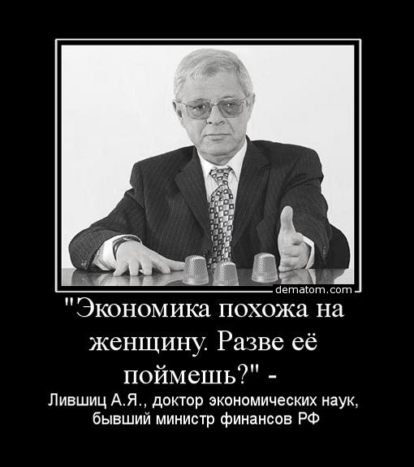
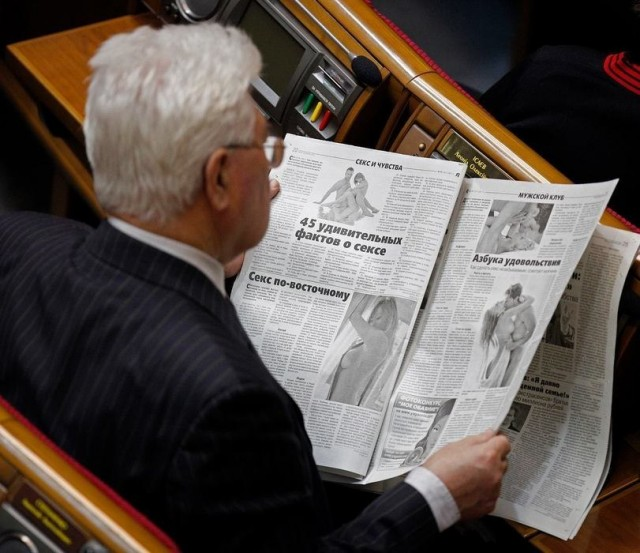
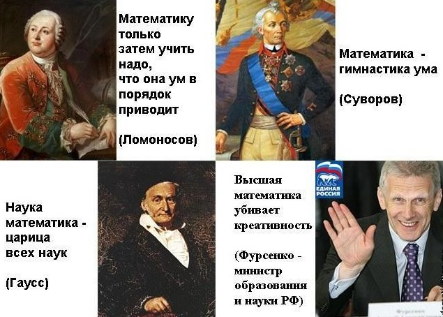
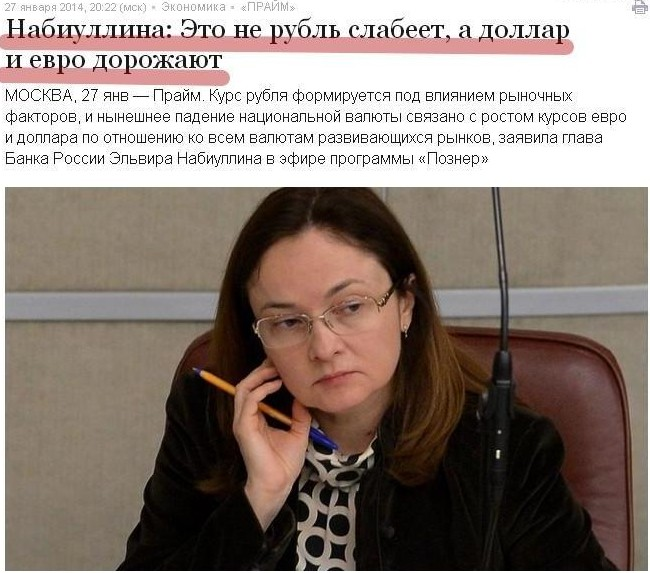

> **Первичный текст.** Русское правоведение — «юридическая чума» на Руси — вылечим.
> Источник: `Русское правоведение — «юридическая чума» на Руси — вылечим.doc` sha256 `61a8cd0d71ee00f0…`; [страница на dotu.ru](https://dotu.ru/2014/04/02/20140402_russian-jurisprudence/).
> Автоматическая транскрипция DOC→Markdown; смысл и формулировки не правились.
> Контрольные суммы и статус проверки — в [NOTICE.md](../../NOTICE.md).
> Содержание передаёт позицию авторов; утверждения не верифицированы библиотекой.

---

## 5.1. Требования к законотворчеству и критерии оценки

Но юридическая система[^270] не включает в себя процесс законотворчества, а сама является его результатом. Поэтому необходимо рассмотреть и вопрос о проявлениях цинизма и слабоумия в процессе законотворчества, поскольку без этого невозможно совершенствование юридической системы во благо общественного развития. Наиболее значимые аспекты этой темы обстоятельно были освещены в работе ВП СССР «Введение в конституционное право». Поэтому раздел 5 настоящей работы будет относительно коротким.

Конечно, депутаты наплодили множество законов и среди них есть беззастенчиво циничные. Так в РФ фактически взимается налог на смерть родителей и других старших родственников, хотя и нет такой статьи госбюджета — доходы от налога на смерть родителей. Тем не менее, если родители или другие старшие родственники умерли и Вы получили от них наследство не в денежной форме, а в виде какой-либо собственности, то если Вы продаёте эту собственность, владея ею менее трёх лет, то Вы обязаны заплатить налог в 13 % с суммы полученного Вами дохода за вычетом не облагаемых налогом 2 миллионов рубелей. Реальность такова, что основная масса плательщиков этого налога на смерть родителей — не наследники олигархов, а простые граждане, которые перевели семейную собственность из натуральной формы в денежную и которых постсоветское государство уже ограбило в ходе приватизации и продолжает грабить, проводя экономическую политику в которой цены непрестанно растут, а покупательная способность зарплаты и накоплений падает. Но в этом разделе мы не будем перечислять такого рода проявления цинизма и слабоумия, выразившиеся в тех или иных статьях действующего законодательства. Речь пойдёт а цинизме и слабоумии как о системообразующих факторах в процессе генерации законодательства РФ.

Прежде всего, ещё раз напомним, что существуют объективные закономерности бытия человеческого общества, которые можно отнести к шести категориям, названным в разделе 2. Благополучие общества требует, чтобы политика и законодательство строились в соответствии с ними.

Спрашивается: *Кто из депутатов разных уровней и сенаторов*[^271] *в состоянии рассказать о них и о том, как с ними согласуются разрабатываемые законопроекты и утверждённые законы?*

Ответ на этот вопрос печальный: *Никто*.

А реально дело будет обстоять ещё хуже: *Они даже не поймут, о чём их спрашивают. «Элита»… — как бы это выразить по-политкорректнее.*

Соответственно никто из них не сможет ответить и на альтернативный вопрос: *Как эти закономерности попираются в законопроектах и принятых законах?*

Эта проблематика вообще вне обсуждения в реальной политике, в обществоведческой науке, в учебных курсах школ и вузов, публицистике после того, как в 1953 г. последовательно были убиты И.В.Сталин[^272] и Л.П.Берия и тем самым был начат ползучий государственный переворот, продолжительностью в 40 лет, завершившийся принятием конституции РФ 1993 г.

Причин неспособности политиков ответить на прямой и на альтернативный вопросы, поставленные выше, две:

- верноподданность — раз «великий вождь всея Руси» не дал трактовки упомянутых объективных закономерностей и не сказал, что рулить надо в соответствии с ними, то эта тема — запретная, политически неуместная и потому все публичные деятели политики и науки о ней должны молчать;

- слабоумие — подавляющее большинство депутатов и чиновников по слабоумию и злонравию[^273] не в силах придти самостоятельно к осознанию того, что:

<!-- -->

- объективные закономерности всех ранее названных шести категорий существуют и действуют «автоматически», поддерживая жизнь общества в гармонии с Природой либо подавляя общество, если оно их нарушает по невежеству либо злоумышленно;

- для того, чтобы всё было хорошо, политику государства, включая её законотворческие аспекты, а также и хозяйственную деятельность следует строить на их основе;

- а для того, чтобы строить политику на их основе, учебные курсы обществоведческого характера должны давать ясное и полное представление о них и их выражении в жизни общества и должны быть обязательны для всех.

Вследствие этого депутаты и чиновники «не пристают» к науке (в лице РАН и Министерства образования и науки) с требованием просветить общество и, в особенности, — самих депутатов и госчиновников по этой тематике.

*[В оригинальном издании здесь расположен рисунок/схема. Иллюстрация не включена в данный выпуск: ожидает визуальной и правовой проверки. Файл источника: image20.jpeg]*РАН, со своей стороны, тоже инициативы не проявляет — по тем же причинам: концептуальная обусловленность науки[^274], верноподданность и *слабоумие (либо в форме узкой специализации действительно высоких профессионалов в той или иной области, однако не знающих за её пределами практически ничего, либо в форме полной научно-творческой несостоятельности, но успешного интриганства в делании «научной» и административной карьеры в официальной науке)*[^275].

И в госаппарате, и в РАН слабоумие усугубляется нравственной порочностью. Суть её труженику с зарплатой средней и ниже в большинстве случаев ясна, но «успешным» политикам, учёным и воротилам бизнеса осознание их собственной нравственной порочности недоступно — в большинстве случаев: иначе бы было невозможно запечатлённое в подборке картинок[^276], представленной выше. В ней кое-что необходимо пояснить.

- Изображения М.Кожевниковой показывают всё в обнажённом виде — как в аспекте нравственности, так и в аспекте интеллектуальной мощи — тест на продажность и беспринципность прошла успешно: фотосессия для «Плэйбоя» и явление гетеры Фрины на празднике Посейдона[^277] — это разные по их нравственной мотивации и по воздействию на общество вещи.

- Если в производстве и потреблении продукции и их финансовом сопровождении всё нормально, то цены в рублёвом исчислении обречены снижаться — таковы закономерности (алгоритмика) рыночного ценообразования, которому сопутствует следствие: прейскурант — финансовое выражение вектора ошибки самоуправления общества. Э.С.Набиуллина этого не понимала и не понимает в силу специфики полученного ею образования. Не понимает она и власти над человеческим обществом биологических закономерностей — общебиосферных и специфических видовых, в согласии с которыми до́лжно строить политику биосферно-социально-экономического развития[^278].

- А.Я.Лившиц, кроме упомянутого в приведённом демотиваторе, — в 1994 — 1996 гг. был помощником президента РФ Б.Н.Ельцина по вопросам экономики, и только после этого стал вице-премьером и министром финансов (август 1996 — март 1997). Упомянем и напёрстки на фотографии: они вполне уместны, хотя и порождение «фотошопа».

- Левый нижний снимок сделан в Верховной Раде Украины (из него должно быть ясно, почему случился «Майдан» и произошёл крах государственности: *«45 удивительных фактов о сексе»* — это гораздо интереснее и «значимее» для депутата, нежели выявление и разрешение её проблем). Но и российские депутаты не лучше. РФ и Украина — единственные республики в составе СССР, которые по состоянию на 1991 г. имели экономику, позволявшую каждой из них развиваться, реализуя полноту суверенитета, однако с оговоркой — при адекватном управлении.

- А.А.Фурсенко — уже бывший министр образования и науки, внёсший не малый вклад в создание системы образования, покалечившей психику не только Сергея Гордеева (убившего учителя и полицейского и тяжело ранившего ещё одного полицейского в московской школе № 263 3 февраля 2014 г.), но и нескольких поколений, которые уже стали взрослыми и которым ещё предстоит повзрослеть в лоне этой системы *как бы* образования.

- В подборку не поместился нынешний вице-премьер, ответственный за реальный сектор, А.В.Дворкович, который в бытность свою помощником президента РФ Д.А.Медведева выступил с идей отмены стипендий студентам: «Скажу непопулярную вещь, но считаю, что это правильно: если мы все считаем, что всего нужно добиваться своим трудом, что работать должно стать модным, нужно отменить стандартные стипендии у студентов, потому что это неправильный сигнал, что ты за сам факт своей учебы получаешь компенсации».[^279] Сказанное им продолжает «указ о кухаркиных детях» (1887 г.), который стал одной из системных причин краха Российской империи[^280], поскольку идея А.В.Дворковича подразумевает, что высшее образование — не для простонародья, влачащего существование на одну зарплату, а предназначено исключительно для отпрысков богатых и сверхбогатых слоёв общества. Но и при наличествующих стипендиях, как гласит интернет, *«Россия — это когда ты прогуливаешь учёбу из-за работы, на которую устроился, чтобы оплачивать обучение»*[^281]*.* Т.е. реально «указ о кухаркиных детях» — руководящий документ для правительства и Минобрнауки и в наши дни.

  Значим и тот факт, что Д.А.Медведев либо не понял того, что предложил его советник по вопросам экономики, либо согласен с его вредительским по существу мнением. Это отсутствие реакции на вредительское по сути предложение — ещё один факт, который обязывает нравственно и интеллектуально здравого гражданина РФ не доверять Д.А.Медведеву ничего, кроме работы дворником (первая запись в его трудовой книжке по его словам — «дворник»).

- Также необходимо упомянуть и бывшего вице-премьера и «лучшего министра финансов»[^282] А.Л.Кудрина. Мало того, что он не в силах осознать управленческую несостоятельность полученного им образования[^283], так он ещё заявил: «… кто пьет водку, кто курит, тот больше внесет помощь государству. Выкурил пачку сигарет, значит, больше внес средств на решение социальных задач: поддержка демографии, развитие других социальных услуг, поддержка рождаемости»[^284] — это можно было бы расценивать как изощрённый «троллинг» и горькую иронию, если бы реальная финансово-экономическая и культурная политика в РФ не строилась в соответствии с высказанным А.Л.Кудриным, а была эффективной в аспекте искоренения из культуры общества средств осуществления народом самогеноцида.

Если вывести из рассмотрения проблематику концептуальной обусловленности законодательства, объективной сакральности концепции либо её объективной несакральности[^285], то даже если господствующая над обществом концепция почитается справедливой подавляющим большинством, — для искоренения правового нигилизма и работоспособности законодательства этого недостаточно. Кроме признания концепции справедливой необходимы ещё следующие условия:

1.  Объём текстов законодательства и комментариев к ним должен быть таким, чтобы как минимум носители высшего профессионального юридического образования знали всё законодательство в целом, его структуру, содержание всех разделов — если не во всех деталях, то достаточно детально для того, чтобы осознавать взаимосвязи различных разделов законодательства во всей его полноте.

2.  Сами тексты законов должны быть метрологически состоятельными[^286], т.е. взаимосвязи их положений с реальностью жизни должны быть определённо понятны любому совершеннолетнему члену общества со стандартным образованием, если он не является слабоумным в медицинском понимании этого термина, что влечёт за собой вполне определённые юридические последствия в виде ограничения дееспособности.

Первое является основой функциональности юридической системы самой по себе, поскольку юридические законы в отличие от законов природы не действуют автоматически, а реализуются только через осмысленную волю *знающих их* людей.

Второе является одной из основ широкого распространения правосознания в обществе и предпосылкой для взаимодействия граждан и представителей юридической системы в нормальном порядке применения законодательства, что необходимо для консолидации общества, исчерпанию и профилактированию конфликта «государственность — подвластное общество».

В этих двух положениях нет ничего принципиально нового. Все интеллектуально здравые и нравственно-этически не извратившиеся правоведы понимали это во все времена. Так в России в царствование Николая I был издан «Свод законов Российской империи». Вот что сообщает об этом В.О.Ключевский.

«Прежде всего из разных канцелярий и архивов он (речь идёт об М.М.Сперанском (1772 — 1839): наше пояснение при цитировании) стянул к себе все указы, начиная с Уложения 1649 г. и кончая последним указом императора Александра I. Все эти указы, уставы и регламенты он расположил в хронологическом порядке и напечатал их, дав сборнику заглавие "Полное собрание законов Российской империи". Это сборник 45 громадных томов, каждый из которых не всякий осилит поднять. В этот сборник вошло 30 920 номеров. Сборник, за составление которого Сперанский принялся в 1826 г., издан был в 1830 с приложением рисунков, табели и различных указаний. До сих пор это полное собрание материалов остается основным для истории русского законодательства. Это полное собрание законов он и положил в основание действующих законов; из различных указаний он брал годные к действию узаконения, облекал их в краткие статьи, применяясь к тексту подлинника, и со ссылками на источник эти статьи расположил в систематическом порядке, сводя их в особые уставы. Так составился "Свод законов Российской империи", изданный в 1833 г. в 15 томах. В большей части своего состава этот памятник доселе остается действующим у нас кодексом.

"Свод законов Российской империи" расположен в систематическом порядке. В первых трех томах изложены законы "основные и учредительные", т. е. определяющие пределы власти и порядок делопроизводства правительственных учреждений, Государственного совета, Сената, министерств, губернского управления и т.д. В дальнейших пяти томах (в 4, 5, 6, 7, 8-м) изложены законы "государственных сил", т. е. средств, которыми питается государство, законы о государственных повинностях, доходах и имуществе. В 9-м томе изложены законы "о состояниях", т. е. о сословиях. В 10-м томе изложены законы гражданские и межевые. В четырех дальнейших (11, 12, 13 и 14-м) — законы "государственного благоустройства и благочиния", т. е. полицейские, и в последнем (15-м томе) — законы уголовные. Вот строй законов, в котором каждая статья не представляет ничего нового, а извлечена из изданного закона и только нашла место в общей системе. Таким образом, **свод законов составился из 42 тыс. статей; это слишком много законов, чтобы знать их; обилие законов есть главный недостаток свода, и сам Сперанский сознавал это. Дальнейшие узаконения присоединились к своду как дополнение, и теперь таких статей свыше 100 тыс.** **Сперанский смотрел на свод законов только как на подготовительную, черновую работу для выработки удобоприменимого кодекса** (выделено нами жирным при цитировании)»[^287].

Выделенное нами жирным в приведённой цитате — это повествование В.О.Ключевского о том же, на что мы указали перед тем, как привести цитату из его «Курса русской истории», хотя и выражено это в иной терминологии. Причём особо отметим, что В.О.Ключевский сначала учился в семинарии, а потом на историко-филологическом факультете Московского университета, т.е. он — не юрист. Особо обратим внимание:

Даже сокращённый 15-томный свод М.М.Сперанский находил непомерно объёмным и рассматривал его в качестве рабочих материалов, необходимых для создания удобоприменимого свода законов.

Конечно, в наши дни компьютеризация позволяет сформировать законодательство государства не только в виде гипертекстового документа со множеством гиперссылок и программной поддержкой тематически ориентированного поиска, но и в виде экспертной системы с более или менее мощным искусственным интеллектом. Это обстоятельство позволяет многократно превысить объёмы текстов законодательства, предельные для восприятия в качестве единого целого человеческой психикой в исторически сложившейся культуре. Тем не менее, и в этом случае остаются три проблемы:

- проблема единообразной реализации в правоприменительной практике неформализованных в текстах законов умолчаний — свойственных обществу и носителям его субкультур «само собой разумений»;

- проблема предельного объёма компьютерной юридической справки, которую в состоянии воспринять психика человека как единое целое и взаимосвязи этого восприятия с законодательством в целом;

- метафорически говоря, проблема «планеты индиотов»[^288] — ГЛАВНАЯ ПРОБЛЕМА ЮРИСДИКЦИИ и в особенности в случае поддержки юрисдикции компьютерной техникой и построения экспертных систем с более или менее развитым искусственным интеллектом.

Участники законотворческого процесса в постсоветской России, многие из которых имеют высшее юридическое образование, судя по результатам их законотворчества, этого либо не понимают (по слабоумию), либо считают возможным высказанные нами выше два положения[^289] игнорировать (вследствие свойственного им цинизма), дабы плодить «юридические шумы» как неиссякаемый источник платных консультаций — кормушку для юристов[^290].

[^270]: В значении этого термина, определённом в разделе 2.

[^271]: Этот же вопрос следует адресовать министрам правительств федерального и регионального уровней, губернаторам и главам муниципальных образований.

[^272]: В его эпоху марксизм-ленинизм рассматривался как научная теория общественного развития. Не смотря на то, что в марксизме много вздора, но есть в нём и жизненно состоятельные положения и формулировки некоторых объективных закономерностей, которым подчинена жизнь общественно-экономических формаций. Все съезды ВКП (б) и пленумы ЦК ВКП (б), деятельность Верховных Советов СССР и союзных республик, которые занимались законотворчеством, так или иначе соотносились в своей деятельности с научной теорией — пусть и не совершенной и во многом порочной, но и не настолько вздорной, чтобы СССР на протяжении 30 лет не мог бы успешно развиваться.

[^273]: Если не генератором, то мощным стимулятором слабоумия является порочная нравственность. О том, что эта причинно-следственная связь объективно существует, см. работу ВП СССР «Основы социологии» (Часть 1).

[^274]: Концептуальная обусловленность науки выражается в том, что наука обслуживает управление по господствующей концепции. В силу этого академии наук вовсе не стремятся к познанию Жизни. Они и ВАК заняты тем, что:

    научным достижениям, а также заведомо лженаучным измышлениям, полезным для господствующей концепции, академии и ВАК придают статус легитимного достоверного знания в официальной науке,

    а научным достижениям и *действительно лженаучными измышлениями,* из числа тех, которые не могут быть приспособлены к обслуживанию господствующей концепции, подрывающим управление по господствующей концепции, — придают статус заведомой лженауки.

    Наиболее ярко это выражается в общественных науках (в марксистско-ленинской традиции это называлось «партийностью науки»), но это явление можно выявить и в естествознании и в его прикладных отраслях: инженерном деле, биологии, медицине и т.п.

[^275]: Об этом см. работу ВП СССР «Российская академия наук против лженауки? — “Врачу”: исцелися сам…» (аналитическая записка из серии «О текущем моменте», № 4 (64), 2007 г.). Она была выслана по электронной почте академику РАН (с 1997 г.) Э.П.Круглякову (1934 — 2012), возглавлявшему в то время редколлегию Бюллетеня Комиссии РАН по борьбе с лженаукой и фальсификацией научных исследований. Но он «не снизошёл» и спустя 5 лет помер, так и не победив лженауки ни в одном из её проявлений: официально признаваемых РАН в качестве науки измышлений и порицаемых ею в качестве лженауки научных достижений, не совместимых с концепцией, которой служит РАН.

[^276]: Эта подборка картинок продолжает иллюстративный ряд, сопровождающий текст работы ВП СССР «Разрешение проблем национальных взаимоотношений в русле Концепции общественной безопасности» (О ликвидации системы эксплуатации «человека человеком» во многонациональном обществе» (2012 г.).

[^277]: См. картину Генриха Семирадского «Фрина на празднике Посейдона в Элевсине» (1889 г.), экспонируется в Русском музее в Санкт-Петербурге. См. также публикации этого изображения в интернете (например: <http://www.centre.smr.ru/win/pics/pic0232/p0232_1024.htm>).

[^278]: «Согласно недавнему исследованию McKinsey, 600 крупнейших городов мира сегодня создают более половины ВВП мира, а в 2025 году их доля в экономике планеты приблизится к 60 %. (…) В России (…) 20 крупнейших городов страны формируют 50 % нашего ВВП, и в дальнейшем тенденция к росту их удельного веса сохранится. (…) Процесс убывания малых и средних городов потребует от России проекта по росту качества городской среды городов-«миллионников». (…) За три волны индустриализации мы сформировали обширнейшую, и местами избыточную сеть малых и средних городов, которые сегодня крайне чувствительны к эффективности одного или нескольких сырьевых или промышленных предприятий. Эти населённые пункты ещё называются моногородами. Сегодня таких городов у нас насчитывается около 400. (…) существуют заслуживающие внимания оценки, что сохранение любой ценой экономически неэффективных малых городов и препятствование перетоку трудоспособного населения в крупные города может стоить нам 2-3 % экономического роста. Потому что крупные города в современном мире — заведомо более экономически эффективные и устойчивые субъекты по сравнению с теми, что завязаны на судьбу 1-2-3 предприятий. (…) Есть оценки, что в течение ближайших 20 лет из малых городов России может высвободиться порядка 15-20 миллионов человек. Вопрос в том, готовы ли наши крупные города принять и качественно использовать этот ресурс? Или это станет для них неподъемным вызовом? Многие из них уже сейчас задыхаются из-за:

    1\) сложности принятия решений о территориальном расширении;

    2\) низких темпов развития городской транспортной, коммунальной инфраструктуры;

    3\) уровня социальных услуг, не соответствующих требованиям ни в целом «среднего класса», ни, в частности, «инновационного класса»;

    4\) низкого уровня обеспечения личной безопасности;

    5\) плохой экологии.

    Эти пять проблем развития городов с точки зрения соответствия потребностям «новой экономики» уже сейчас являются барьером.

    При дополнительном притоке людей в города эти проблемы будут только обостряться». — Это «непреодолимая глобальная тенденция» (Тезисы выступления министра Э.С.Набиуллиной на пленарном заседании Московского урбанистического форума 08.12.2011. Официальный сайт Минэкономразвития РФ. Интернет-ресурс: <http://www.economy.gov.ru/minec/press/news/doc20111208_004>).

    Обратимся к фактам. **ФАКТ ПЕРВЫЙ**. Исследования популяции плодовой мушки дрозофилы в Воронеже в 1944 г. *(город разрушен, промышленности нет)* и в 1946 г. *(промышленность уже частично восстановлена и работает)* показали, что *городская среда обитания является **мутагенным** фактором*. \[Дубинин Н.П. Вечное движение. М.: Политиздат. 1989, с. 241\]. **ФАКТ ВТОРОЙ**. Хромосомный аппарат человека в 40-50 раз более чувствителен к воздействию мутагенных факторов, нежели хромосомный аппарат дрозофилы. \[Там же, с. 351\]. **ФАКТ ТРЕТИЙ**. По оценкам бывшего главного санитарного врача РФ Г.Г.Онищенко, «мегаполис съедает до 5 лет жизни» \[Интернет ресурс «Российская фармацевтика»: <http://pharmapractice.ru/16826>\]. По данным канадских и американских психологов городские дети имеют IQ на 3-5 пунктов ниже, чем их сельские сверстники \[Сайт газеты «Московский комсомолец». Интернет-ресурс: <http://www.mk.ru/old/article/2008/02/18/54461-gorodskie-deti-imeyut-iq-nizhe-chem-derevenskie.html>\].

    **ВЫВОД**. Воспроизводство биологически здорового и творчески активного населения в «каменных джунглях» городов невозможно. **Последствиями такой демографической политики** **неизбежно станут** **медико-биологическая, нравственно-этическая, интеллектуальная и общекультурная деградация людей и общества в целом**. Поэтому **программа развития страны и её экономики должна основываться** *не на подчинении всей жизни «коммерческой эффективности» частей целого,* а **на учёте закономерностей биологии человека как органичной части биосферы**. Этим закономерностям должен быть подчинён образ жизни в целом, т.е. — культура, государственное управление, хозяйство, финансовый климат. Соответственно приоритет должен быть отдан не росту и обустройству городов-миллионников (в них рост качества жизни возможен только за счёт реализации программ депопуляции), а именно развитию сельской местности, предполагающему развитие в ней всего спектра отраслей современного хозяйства. Но это требует отказа от либерально-рыночной экономической модели и подчинения Минэкономразвития, Минфина и Центробанка Госплану.

    Тем не менее, стягивать население в два десятка мегаполисов предполагается вопреки тому, что Э.С.Набиуллиной лично и Минэкономразвития неизвестны рецепты разрешения запутанного клубка проблем мегаполисов, которые будут только обостряться при дальнейшем сосредоточение в них населения в угоду мифическому «экономическому росту», о котором у Э.С.Набиуллиной тоже неадекватные представления в силу полученного ею образования. И это обстоятельство приводит к **ВОПРОСУ**: *В здравом ли уме Минэкономразвития либо цинично продался врагам народов России?*

    И хотя Э.С.Набиуллина с мая 2012 г. — глава Центробанка, политика ликвидации деревень и малых городов продолжается. «В Минэкономразвития полагают, что неперспективные города страны нужно закрыть, а населяющие их 16 миллионов человек — расселить». В эту программу попали 342 моногорода (большей частью расположенных в Сибири и на Дальнем Востоке), в которых 20 % жителей и более трудятся на одном предприятии. (<http://finlenta.mirtesen.ru/blog/43928234140/342-goroda-RF-popali-v-spisok-podlezhaschih-likvidatsii?utm_campaign=transit&utm_source=main&utm_medium=page_0&pad=1>).

[^279]: РИА Новости: <http://ria.ru/edu_news/20110119/323548959.html#ixzz2t1O7358O>.

[^280]: Об этом см. аналитическую записку ВП СССР «Власть на Руси и Русь: возможности упущенные и возможности актуальные…» из серии «О текущем моменте» № 4 (111), 2013 г.

[^281]: Сопоставьте:

    **Ныне 2014 г., С-Петербург**: стипендия — 1300 руб./мес.: оплата проживания в общежитии — 700 руб./мес.; обед в студенческой столовой — 300 руб.×30 дней = 9000 руб./мес.; проезд на метро — 28 руб./поездка × 60 поездок = 1680 руб./мес. Итого: минимум расходов = 10680 руб./мес. Дефицит дохода в виде одной стипендии по отношению к этому минимуму расходов составляет 9380 руб./мес., что равно 7,22 стипендии.

    **СССР, вторая половина 1970-х гг., Ленинград**: стипендия — 40 руб./мес.; проживание в общежитии — 6 руб./мес. либо за счёт бюджета, т.е. вне расходов из стипендии; обед в студенческой столовой по талону — 70 коп.× 30 дней = 21 руб./мес.; проезд на метро — 5 коп./поездка × 60 поездок = 3 руб./мес. Итого: минимум расходов = 30 рублей (при оплате общежития). Свободных средств остается 10 руб./мес., что равно 0,25 стипендии.

    Хотя оба расчётных варианта — режимы выживания по минимуму, но всё же это разные режимы «выживания», поскольку минимальная оплата труда в СССР в тот период была 60 руб./мес. и подработка на полставки дворником или сторожем, в бригаде ночного ремонта трамвайных путей, расходование накопленных стройотрядовских заработков переводили студента из режима выживания в режим жизни, позволяющий полноценно учиться. Минимальная оплата труда в РФ в 2014 г. — 5554 руб./мес., работа на полставки обеспечивает только 2777 руб./мес., что не позволяет перейти из режима выживания в режим жизни, поскольку дефицит доходов по отношению к минимуму расходов в 10680 руб./мес. сохраняется и составляет 6603 руб., что равно 5,08 стипендий. Для того, чтобы выйти на советский показатель в этой расчётной схеме (свободные средства в объёме 0,25 стипендии), стипендия должна быть равна 12506 руб. 67 коп.

    Прожиточный минимум в среднем по России летом 2013 г. составлял 7095 руб./мес. — как его «высосали из пальца», с учётом того, что приведённые выше данные о расходах взяты из жизни, вопрос особый, поскольку прожиточный минимум явно не реалистичен. По закону минимальная оплата труда должна быть равна прожиточному минимуму, что не обеспечивается на протяжении всего времени существования этого закона.

    Т.е. можно утверждать, что стипендии в вузах постсоветской РФ носят чисто символический характер, и идея, высказанная А.В.Дворковичем, воплощена в жизнь де-факто. Чиновник с тремя высшими экономическими образованиями должен понимать это и сам. Воплощение высказанной им идеи в жизнь де-юре, конечно позволит сэкономить госбюджет за счёт ликвидации стипендиального фонда и сокращения транзакционных издержек, но достичь заявленных им целей — обеспечения *как бы* социальной справедливости — не позволит.

    Вице-премьер с тремя высшими экономическими образованиями, ответственный за реальный сектор обязан понимать вредоносные последствия такой политики воспроизводства профессионализма в преемственности поколений.

[^282]: В октябре 2010 г. журнал Euromoney назвал главу Минфина России Алексея Кудрина лучшим министром финансов года. "Когда видишь свой результат, уже есть удовлетворение, а когда он признается всем профессиональным сообществом, это вдвойне важно", — заявил глава Минфина. В 2004 году Кудрин уже признавался лучшим министром финансов по версии другого издания на экономическую тематику — The Banker. В 2006 году лучшим министром финансов в развивающихся странах Европы его назвал журнал Emerging Markets. (<http://lenta.ru/news/2010/10/11/koudrin>). Т.е. А.Л.Кудрин ещё и упивается самодовольством.

[^283]: См. предыдущую сноску. Но это — ничто на фоне упомянутого уже А.В.Дворковича, который не способен осознать управленческую несостоятельность трёх полученных им высших образований в области экономики и финансов и поставить соответствующие задачи перед РАН и Минобразования и науки, хотя в 2009 г. на встрече со студентами Академии народного хозяйства им. Г.В.Плеханова заявил: «Экономистов придумали для того, чтобы на их фоне хорошо выглядели синоптики» («Комсомольская правда», 11.06.2009. — Интернет-ресурс: <http://spb.kp.ru/daily/24309.4/502853/>).

[^284]: Сказано это было в связи с повышением акцизов на алкоголь и табак в сентябре 2010 г.:

    <http://www.newsru.com/finance/01sep2010/kourdrine_alco.html>.

[^285]: Т.е. взаимоотношений концепции и законодательства с объективными закономерностями бытия человеческого общества.

[^286]: Метрологической состоятельности посвящён раздел 1.3 работы ВП СССР «Основы социологии».

[^287]: В.О.Ключевский. Курс русской истории. Лекция LXXXV.

[^288]: См. Станислав Лем. «Звёздные дневники Ийона Тихого. Путешествие 24» (впервые опубликовано в 1953 г.) — на планету «индиотов», которые вручили всю власть над собой специально сконструированной машине и та занялась уничтожением всех «индиотов» без исключения, дабы они не нарушали порядок на планете в том виде, как его понимал искусственный интеллект созданной «индиотами» машины. Одна из ссылок — <http://lib.web-malina.com/getbook.php?bid=2821>. Причина катастрофы цивилизации на планете «индиотов» проста: реальная нравственность людей выражает себя в техносфере, включая и её объекты, обладающие более или менее развитым искусственным интеллектом, и в информационно-алгоритмическом обеспечении их функционирования.

[^289]: Об объективных ограничениях предельно допустимого объёма текстов и о метрологической состоятельности текстов.

[^290]: «**В.ПУТИН:** Для юристов чем больше законов, тем лучше: дороже обслуживание клиентов, потому что клиент совсем запутается во всех этих законах» (Встреча со студентами юридических вузов Москвы 3 декабря 2013 г. Приводится по официальной стенограмме, опубликованной на сайте президента РФ:

    <http://www.kremlin.ru/transcripts/19778>).
---

[К произведению](README.md) · [Каталог](../../CATALOG.md)
