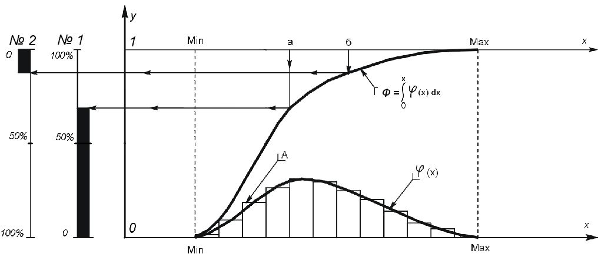

> **Первичный текст.** Сад растёт сам.
> Источник: `Сад растёт сам.doc` sha256 `4db5b462033c24b3…`; [страница на dotu.ru](https://dotu.ru/2009/06/13/20090613_tek_moment0690/).
> Автоматическая транскрипция DOC→Markdown; смысл и формулировки не правились.
> Контрольные суммы и статус проверки — в [NOTICE.md](../../NOTICE.md).
> Содержание передаёт позицию авторов; утверждения не верифицированы библиотекой.

---

## 1.4. “Отчёт” без отчёта Правительства РФ перед Думой

6 апреля премьер-министр РФ В.В.Путин выступил в Госдуме с “отчётом” о деятельности Правительства РФ за 2008 г.[^23] Общие впечатления от просмотра выступления В.В.Путина по телевидению в прямом эфире:

Первая волна кризиса не привела его к полной катастрофе мировоззрения и миропонимания, и потому В.В.Путин по-прежнему «себе на уме», т.е. он некоторым образом осознаёт происходящее как совокупность явлений в их взаимосвязи и имеет некие намерения в отношении управления этой совокупностью. Иными словами, он по-прежнему концептуально властен в пределах тех ограничений, которые налагают на концептуальную властность его верования, образование и общая осведомлённость, миропонимание, нравы. Но оглашать публично в толпе концепцию, на которую он работает, и средства её воплощения в жизнь В.В.Путин по-прежнему не считает необходимым. На этой основе В.В.Путин намеревается продолжать быть «главным разводящим» в Россионии[^24].

И соответственно в выступлении в Думе имела место:

- *демонстрация на публику* уверенности 1) в завтрашнем дне и 2) в адекватности политики государственной власти РФ в противодействии проявлениям кризиса в России[^25],

- сквозь которую просвечивает утрата *неких «невинности» и «целомудрия»,* что произошло под воздействием первой волны кризиса в четвёртом квартале 2008 г. и какой факт индивид пытается скрыть от окружающих, *проявляя некоторое актёрское мастерство, — конечно, это не «школа Станиславского», но многие всё же верят*…

В действительности никакого отчёта Правительства РФ не было, а был пиар и «разводняк» под видом отчёта, и этот пиар «партии власти» думская “оппозиция” «съела» как должное. Это утверждение основывается на последовательности вопросов и ответов на них, о которых в общем-то никто в обществе, в его институтах власти и в СМИ не задумывается.

Почему никто не задумывается? — Да потому, что думать не умеют: диалектика для них ― некая «заумная бредятина» — «вещь в себе», а не универсально работоспособный метод выявления истины путём постановки определённых по смыслу вопросов и формулировки ответов на них, также определённых по смыслу[^26]. Поэтому далее, чтобы не объяснять её суть, покажем на конкретном примере, как она работает.

———————

**Вопрос первый**: *Чем характеризуется жизнь общества?*

**Ответ**: *Разнородными статистиками и их взаимосвязями.*

**Вопрос второй**: *Чем характеризуются изменения в жизни общества?*

**Ответ**: *Изменениями статистик и их взаимосвязей.*

**Вопрос третий**: *Что такое практическая политика?*

**Ответ**: *Это — целеполагание в отношении желательного изменения статистик в обозримой перспективе и воплощение намеченных изменений жизнь в результате осуществления выработанных целесообразных действий.*

**Вопрос четвёртый**: *Могут ли единичные факты заменить собой статистику или набор статистик разного рода в качестве характеристик (показателей) жизни общества?*

**Ответ**: *Нет, не могут, поскольку одним и тем же единичным фактам в жизни общества неизбежно сопутствует множество других единичных фактов и именно все они в совокупности образуют статистику, которая действительно характеризует ту или иную сторону жизни общества. Иначе говоря, одним и тем же единичным данным в жизни могут соответствовать разные статистики, и потому единичные факты, не образующие собой репрезентативную выборку*[^27]*, не могут заменить ни какую-либо одну статистику, ни набор разнородных статистик.*

———————

### **Отступление от темы:**\

Как соображать слово «статистика»

К этому надо добавить, что для подавляющего большинства людей слово «статистика» — не определённое по смыслу: оно не вызывает в их психике никаких общих для них образов, которые они могли бы соотнести с жизненными явлениями. Удручающее впечатление производит то обстоятельство, что слово «статистика» не вызывает адекватных образов даже у тех, кто в своё время прослушал в вузе курс «Теория вероятностей и математическая статистика» и получил по нему вполне приличную оценку: как только дело доходит до практического применения в жизни некогда полученных знаний, в подавляющем большинстве случаев оказывается, что знания — сами по себе, а жизнь — сама по себе.

Поэтому внесём ясность в вопрос о том, что *видеть* за словом «статистика» в приведённой выше подборке вопросов и ответов. Обратимся к рис. 1 (на следующей странице).

На рис. 1 показана система координат *0xy*:

- По горизонтали — ось абсцисс *x.* По оси *x* откладываются значения параметра, по которому распределено рассматриваемое множество.

- По вертикали — ось ординат *y*. По оси *y* откладываются значения функций плотности распределения *φ(x)* и интегральной функции распределения *Ф(x).*

Параллельно оси абсцисс на уровне максимально возможного значения интегральной функции распределения *y = Ф(x) = 1* проведена горизонтальная шкала, дублирующая ось *x.* Она может быть полезной (для удобства) в некоторых случаях при работе со статистическими данными, представленными в такой графической форме.

Кроме того, параллельно оси *y* размещены ещё две шкалы: № 1, № 2. Обе эти шкалы — процентные, но встречной направленности, поскольку в одних задачах необходим отсчёт доли статистики, включающей в себя максимум значения рассматриваемого параметра; а в других задачах необходим отсчёт доли статистики, включающей в себя минимум значения рассматриваемого параметра. Как ими пользоваться, видно из самого рис. 1:

- Широкая чёрная полоса вдоль шкалы № 1 отмечает долю статистики, в которой значение анализируемого параметра меньше, чем значение «*а»,* отмеченное на верхней шкале изменений аргумента.

- Широкая чёрная полоса вдоль шкалы № 2 отмечает долю статистики, в которой значение анализируемого параметра выше, чем значение «*б»,* отмеченное на верхней шкале изменений аргумента.

Кроме того в осях *0xy* показаны:

- Столбиковая диаграмма *«А»*. Высота каждого столбика в масштабе оси *y* равна доле статистики, попадающей в диапазон значений аргумента *x*, который лежит в основании каждого из столбцов.

<table>

<colgroup>

<col style="width: 86%" />

<col style="width: 13%" />

</colgroup>

<tbody>

<tr>

<td></td>

<td style="text-align: center;"><blockquote>

<em>Рис. 1. Графическое отображение статистик</em>

</blockquote></td>

</tr>

</tbody>

</table>

- Если сделать более мелкое разделение диапазонов, то дискретная плотность распределения *«А»* может быть аппроксимирована непрерывной плотностью распределения *φ(x),* что в ряде задач может быть более удобным.

- Если плотность распределения *φ(x)* существует (в жизни встречаются распределения, для которых функция плотности распределения не существует) и её проинтегрировать, то получим кривую *Ф(x) *, с масштабом отображения которой по оси *y* связаны шкалы № 1 и № 2.

- Дискретный аналог кривой *Ф(x) *не показан. Его можно получить, если к высоте каждого из столбиков диаграммы *«А»* добавить сумму высот всех столбиков, находящихся слева от него по оси *x*.

- Кривая *Ф(x)* (и её не построенный дискретный аналог) вместе со шкалами № 1 и № 2 показывает статистическое распределение анализируемого множества по рассматриваемому параметру *x*.

Представление в такой форме разного рода статистик (в том числе и нескольких статистик в одних и тех же осях) нам представляется удобным.

Современная оргтехника позволяет демонстрировать аудитории в ходе выступлений всевозможные иллюстрации, включая и отображение статистических данных в наглядной форме рис. 1, которым может сопутствовать некая «цифирь», позволяющая метрологически состоятельно[^28] соотнести одну статистику с другой.

Если в этой форме представлена социальная статистика, то в осях *0xy* единицей измерения численности населения в разных статистических группах является общая численность населения: в масштабе оси *y* она равна 1. А каждая выделенная социальная группа, на которую приходится некая доля статистического распределения по рассматриваемому параметру *x*, — доля от этой единицы. Шкалы № 1, и № 2 по своей смысловой нагрузке аналогичны оси *y*, с тою лишь разницей, что они оразмерены в более предпочтительной для многих людей процентной мере.

Горизонтальные шкалы аргумента *x* могут быть как размерными, так и обезразмеренными по тем или иным характеристическим показателям.

В этой форме может быть отображена любая по содержанию статистика, в том числе и в процессе рассмотрения социально-экономических задач можно показать распределение населения по диапазонам платежеспособности (накоплений) и расходов. Можно отобразить отраслевую и региональную разнородную производственную и потребительскую статистику.

В частности, структура расходов населения, которая характеризует качество жизни общества в аспектах экономики, на основе такого представления статистических данных может быть представлена в форме рис. 2 (на следующей странице).

<table>

<colgroup>

<col style="width: 86%" />

<col style="width: 13%" />

</colgroup>

<tbody>

<tr>

<td></td>

<td style="text-align: center;"><blockquote>

<em>Рис. 2. Форма отображения статистик показателей экономической обеспеченности 

жизни общества</em>

</blockquote></td>

</tr>

</tbody>

</table>

Рис. 2 является условным, а не отображающим какую-либо конкретную статистику. Он представляет распределение всего множества семей в обществе по параметру «доходы, приходящиеся на одного члена семьи». Этот параметр в форме представления статистики рис. 2 откладывается вдоль оси абсцисс *x*. На оси абсцисс отмечены величины четырёх стандартных доходов, и максимальный доход в обществе. Стандартные доходы (от I минимального до IV) соответствуют минимальному уровню доходов в расчёте на одного человека, который позволяет семье перейти от одного качества жизни к другому в смысле возможностей потребления более высококачественной продукции.

Вдоль оси ординат (*y*) откладываются значения функций распределения (*Ф(x) — в терминах рис. 1*) по функционально обусловленным уровням расходов в расчёте на одного человека, а также — значения ограничительной кривой суммарных фактических расходов *«А — R»* и ограничительной кривой доходов *«Б — V».* Надписи в полосах между соседствующими кривыми распределения по функционально обусловленным уровням расходов, соответствуют характеру расходов, отличающих последовательные функционально обусловленные уровни (ось ординат соответствует нулевому уровню функционально обусловленных расходов, все последующие уровни строятся по принципу «предъидущий уровень + очередной функционально обусловленный расход в порядке убывания их приоритетов»).

Соответственно, через ограничительную кривую доходов *«V»* стандартные доходы I — IV соотносятся с точками, разграничивающими на оси ординат доли от общей численности семей, которые в своей жизни достигают того или иного определённого потребительского стандарта. Т.е. 1 на оси ординат рис. 2 соответствует 100 % учтённых в статистике семей, а не 100 %-численности населения (число семей меньше численности населения): для рассмотрения распределения всего населения необходимо рассмотреть в форме рис. 2 все типы семей.

На рис. 2 показан характер потребления экономически неблагополучного общества. Некоторая доля населения имеет доходы ниже минимального стандартного дохода I. И поддерживать свои расходы на уровне, достаточном для жизни в пределах полосы I стандарта качества жизни она может только за счёт расходования прошлых накоплений и заимствований. Соответственно через точку *«D»* пересечения ограничительной кривой доходов *«V»* и ограничительной кривой суммарных расходов *«R»* параллельно оси абсцисс проходит черта деградации потребления. Ниже неё ограничительная кривая суммарных расходов прерывается, поскольку расходы, превышающие текущие доходы, для этой группы населения — не гарантированы: прошлые накопления не бесконечны, занять в долг не всегда возможно.[^29]

Но и это не всё. На оси абсцисс отмечена точка «Б». Ей соответствует тот уровень доходов, ниже которого начинается биологическая деградация, вследствие того, что он не обеспечивает необходимый минимум питания, одежды и удовлетворения прочих потребностей. Соответственно через точку, расположенную над точкой «Б» на ограничительной кривой доходов *«V»* параллельно оси абсцисс проходит черта биологической деградации. Те семьи, которые оказались ниже неё, — вымирают.

Та часть общества, которая оказалась ниже черты деградации потребления, по сути представляет собой «отбросы общества». И как показывает политическая практика, это может происходить не только вследствие того, что их представители ленивы и неумелы в труде, вследствие чего не могут обеспечить себе достойный уровень доходов. Такое положение может быть следствием политики экономического геноцида, проводимой в отношении всего общества или тех или иных групп населения в его составе.

В нормально живущем обществе распределение семей по доходам должно быть таким, чтобы точка *«D»,* через которую проходит черта деградации потребления, лежала бы практически на оси абсцисс — в пределах ошибки снятия статистики с общества. А ограничительная кривая расходов *«V»* начиналась бы не из начала координат, а от минимального стандартного дохода I, позволяющего семье удовлетворять текущие демографически обусловленные потребности и развиваться далее.

Т.е., как показано на примере рис. 2, формы графического представления разного рода социальных статистик могут быть очень информативными, особенно при сопоставлении друг с другом в одних и тех же осях. Современная компьютерная «мультипликация» позволяет легко в одних осях сопоставлять друг с другом, статистики разных периодов времени, характеризующих тот или иной аспект жизни общества, и давать адекватное представление о его динамике и соответственно — об эффективности политики в смысле её соответствия интересам общественного развития либо соответствия её интересам внутренних или зарубежных поработителей.

———————

В принципе для того, чтобы понять рис. 1 и 2, не требуется высшего образования в области математики — достаточно немного сообразительности, терпения на уровне требований средней школы или любительского спорта.

Но есть опасение, что и этот минимум неподъёмен для таких отечественных «политиков» как: Алина Кабаева, которая относительно недавно спустилась в политическую “элиту” с гимнастического бревна; Иосиф Кобзон, ушедший из искусства в шоу- и прочий бизнес; Светлана Журова (вице-спикер), недавно снявшая беговые коньки, и для многих других. Но именно таких кандидатов в депутаты подбирали целенаправленно — их задача «пиарить» проводимую политику, и если они с этим справляются, то им позволено эксплуатировать социальный статус депутата, в общем-то ни за что не отвечая и *не работая в политике — в политике работают «клерки» из аппарата, которых общество не знает*. Кто из депутатов начинает заниматься действительно политикой в интересах народа — в следующие созывы не попадает[^30].

Вследствие проведения такого рода кадровой политики — с 1993 г. **Государственная Дума и лидеры думских фракций персонально не поумнели и не стали более высокопрофессиональными управленцами**, хотя более, чем за 15 лет существования Думы в ней успели сложиться определённые навыки бюрократического делопроизводства. Но это — не то, что требуется обществу от органа власти, долженствующего быть органом представительной демократии, а не машиной голосования под заказ.

———————

При условии, что обеспечена метрологическая состоятельность и репрезентативность выборок, в процессе управления могут обсуждаться состав набора статистик, каждая из статистик, их взаимосвязи; могут анализироваться причинно-следственные связи социальных и природных явлений и статистик. И многое другое. Поэтому:

- Управленческая компетентность предполагает определённость в выборе неизменного по составу и методологии сбора и обработки информации набора метрологически состоятельных статистик, опираясь на который на протяжении длительного времени, охватывающего жизнь многих поколений, могла бы строиться политика государства.

- Демократия же предполагает не только наличие такого набора статистик, на которые должен опираться в своей деятельности государственный аппарат, но и отчётность лиц, которым общество доверило управление своими делами, на основе такого статистического подхода. И за исключением некоторых весьма специфических статистик, которые действительно могут представлять государственную тайну, подавляющее большинство статистик из этого набора должны быть доступны обществу *в нефальсифицированном виде,* поскольку именно они должны составлять информационную основу для контроля гражданского общества за деятельностью государственного аппарата в условиях реальной демократии.

Если с этих позиций оценивать “отчёт” В.В.Путина перед Думой, то он представляет собой трёп, решающий задачи пиара в отношении управленчески безграмотной и потому по существу безвластной толпы[^31], представители которой сидели в зале, где проходил “отчёт” без отчёта, поскольку Дума «съела» этот “отчёт” без каких-либо принципиальных возражений: имели место только возражения и замечания *по частностям, которые вне <u>статистик, с которыми частности соотносятся не однозначно</u>,* — т.е. замечания в силу этого могут быть как правильными, так и ошибочными.

И в общем-то, если в информационной основе государственного управления лежит хорошо продуманный набор статистик, характеризующих все значимые аспекты жизни общества, то нет никаких причин к тому, чтобы представители государства выступали перед обществом на какой-то иной информационной основе.

Т.е. если представители государства в своей публичной деятельности не оперируют статистиками, относящимися к теме, то это — следствие и выражение того, что государственное управление носит неадекватный жизни характер, поскольку не опирается на набор статистик.

Кроме того, современная оргтехника позволяет довести любую отчётную документацию до сведения аудитории заблаговременно, чтобы, не теряя попусту время на изустное и менее доходчивое изложение отчёта о проделанной работе, сразу же перейти к отображению отчётных статистик на большом экране в зале заседаний либо к синхронному их отображению на персональных компьютерах участников заседания и обсуждению представленных статистик по существу, их взаимосвязей, их динамики, обусловленности статистик и их взаимосвязей социальными процессами. Всё же отчёт премьера в гражданском обществе и демократическом правовом государстве — не тронная речь самовластной королевы, которой предписывается верноподданно внимать с восхищением…

Понимает ли это сам В.В.Путин? — вопрос открытый, но возможно, что и нет, поскольку его юридическое образование — управленчески несостоятельно, и прежде всего, оно — не та основа, которая позволяет адекватно судить о процессах, протекающих с области экономики и финансов, и управлении ими[^32]; а также — и о кадровой политике[^33].

Не понимает этого и Б.В.Грызлов.

И если “отчёт” без отчёта В.В.Путина 6 апреля 2009 г. сопоставить с отчётными докладами ЦК КПСС съездам партии, даже застойно-брежневских времён, то отчётные доклады ЦК были более информативны, и соответственно — ЦК был более демократичен и уважителен по отношению к населению СССР, нежели нынешняя бюрократия.

Но не понимает этого и главный легальный “оппозиционер” Г.А.Зюганов со товарищи, поскольку в противном случае всё, что написано в разделе 1.4 настоящей записки, должно было быть сказано Г.А.Зюгановым с думской трибуны и опубликовано в печати КПРФ.

2. Кризис в России — кризис “элитарного” идиотизма в попытке загнать общество\

в родоплеменной строй

==============================================================================

После того, как 1 марта 2009 г. прошли выборы в местные органы власти, СМИ сообщили, что сын председателя нижней палаты Госдумы Б.В.Грызлова Дмитрий потерпел поражение на выборах в С-Петербурге. Вследствие этого встал вопрос о его дальнейшем трудоустройстве.

«“Мы пообщались с Дмитрием Грызловым и приняли решение о том, что он вступит в партию “Единая Россия”, — заявил корреспонденту ЗАКС.Ру спикер Законодательного собрания Петербурга, лидер петербургских единороссов Вадим Тюльпанов. По словам спикера, Грызлову-младшему остаётся написать заявление, и по уставу партии до получения членского билета должно пройти полгода. “Возможно, он вступит через полгода, может быть — несколько раньше. Ни для кого мы исключений не делаем”, — пояснил Тюльпанов.

Говоря о перспективах работы Дмитрия Грызлова в региональном отделении партии, Вадим Тюльпанов отметил, что он “либо возглавит, либо будет участвовать в работе с молодёжным крылом партии в вопросе взаимодействия с молодежными организациями”. Тюльпанов также отметил: “Если раньше я его знал шапочно, то после полуторачасовой беседы я узнал его как очень эрудированного и начитанного человека — я порадовался за нашу молодёжь”.

Напомним, сын спикера Госдумы, председателя Высшего совета “Единой России” Бориса Грызлова Дмитрий Грызлов участвовал в выборах в МО “Георгиевское” во Фрунзенском районе, но потерпел неудачу. В интервью журналу “Город 812” он обвинил руководителей петербургского отделения партии в организации нечестных выборов и заявил: *“Фактически выборы проводила местная “Единая Россия”, а её действиями управлял человек, близкий к руководству ЗакСа, который осуществляет связь между бизнесом и криминалом с одной стороны и властью — с другой. Про него всем всё известно, но трогать его боятся. Именно этот человек боролся со мной и помешал избраться”* (выделено курсивом нами при цитировании[^34])» (<http://www.zaks.ru/new/archive/view/54824>, 12 марта 2009 г.).

Ещё одна публикация:

«Дмитрий Грызлов (сын спикера Госдумы, председателя Высшего совета партии “Единая Россия” Бориса Грызлова) сегодня был принят в партию на заседании президиума политсовета, сообщает корреспондент ЗАКС.Ру.

При этом стоит отметить, что согласно новой редакции устава “Единой России” для вступления в партию необходим полугодовой стаж пребывания в статусе сторонника партии. Единороссы неоднократно подчеркивали важность нововведения, отмечая важность института сторонников. Лидер петербургского отделения “Единой России” Вадим Тюльпанов ранее заявлял о том, что Грызлов-младший [должен вступать в партию по общей процедуре](http://www.zaks.ru/new/archive/view/54824), утверждая, что “ни для кого мы исключений не делаем”.

“Нет никакого нарушения в том, что Дмитрий Грызлов вступил в партию без полугодового нахождения в рядах сторонников”, — заявил корреспонденту ЗАКС.Ру руководитель фракции “Единая Россия” в петербургском Законодательном собрании Вячеслав Макаров.

По словам Макарова, президиум политсовета имеет право принять человека в партию в обход этого требования. Парламентарий добавил, что процедура включения Дмитрия Грызлова в партию соблюдена в соответствии с уставом и прочими документами.

“Срок может быть, а может и не быть”, — сказал Макаров. Он заявил, что нахождение человека в рядах сторонников нужно для того, чтобы пристальнее посмотреть на *кандидата* *в члены в партию*[^35], а с Дмитрием Грызловым это излишне, так как он и без этого хорошо известен партийцам.

Сам Дмитрий Грызлов пояснил, что в 2001 году был учредителем “Молодёжного Единства”, правопреемницей которого на сегодня является “Молодая гвардия”, следовательно, считает Грызлов, он автоматически является сторонником партии с 2001 года.

Третью версию выдвинул председатель регионального исполкома партии Дмитрий Юрьев. “Дмитрий Грызлов неоднократно заявлял, что является сторонником “Единой России”, — рассказал Юрьев. — Он официально зарегистрирован сторонником партии в Красногвардейском районе. Стаж Дмитрия — что-то около двух лет. Мы обнаружили это, когда подняли необходимые бумаги. Что касается слов самого Дмитрия о его положении сторонника с 2001 года — то тут, видимо, он не понял самого вопроса — в то время, когда он стал сторонником, процедура обязательного нахождения в числе сторонников не являлась необходимым условием членства в партии”.

Юрьев также добавил, что вопрос о назначении Дмитрия Грызлова на пост куратора “Молодой Гвардии” пока преждевременный. Дмитрий Грызлов сообщил, что после вступления в партию станет куратором молодежной политики “Единой России” в Петербурге. По словам Грызлова, после заседания президиума политсовета городского отделения партии, где он был принят в ряды членов, у него состоялась встреча с Вадимом Тюльпановым, который рассказал Дмитрию о его возможном будущем месте работы.

Грызлов добавил, что на сегодняшний день он ещё не разговаривал с нынешним руководителем городского молодежного отделения партии Алексеем Цивилевым.

Отметим, официальной должности “куратора молодежной политики” до сегодняшнего дня в партии не существовало» (<http://www.zaks.ru/new/archive/view/55001>, 18 марта 2009 г.).

В чём успел себя проявить Д.Б.Грызлов прежде, чем податься в кандидаты в депутаты и проиграть выборы? — вопрос дискуссионный. Одна из публикаций сообщает:

«Дима Грызлов — один из самых завидных женихов России. Как-никак единственный сын лидера партии «Единая Россия», спикера Госдумы, третьего лица в государстве, самого закрытого политика России. Но сын, в отличие от отца, не привык таиться. Дима с радостью идёт на контакт. Например, часами общается с девушками на сайтах знакомств. А в свободное от виртуального флирта время он спасает от голода и болезней лошадей, возглавляя общественную организацию «Дар», и вообще стремится изменить мир к лучшему.

Это желание, как сказано на сайте Грызлова-младшего, передалось ему на генном уровне. Но уникальную способность молодого человека почему-то не оценила партия власти. Папа — Борис Грызлов — никак не реагирует на поступки отпрыска. Приходится заявлять о себе с телеэкрана. Недавно Дмитрий Грызлов начал вести собственную программу «Территория свободы» на новом питерском канале «ВОТ». Выступает в прямом эфире с оппозиционными речами, подвергая критике (немыслимое дело!) саму «Единую Россию»! Но папа остаётся непробиваемым. Докричится ли сын до отца?» (<http://www.fontanka.ru/2007/10/24/023/>, 24 октября 2007 г.).

Сообщаемое сайтом Фонтанка.ру наводит на мысль, что Д.Б.Грызлов — то же, что и К.А.Собчак, но на основе мужской версии организма и «облегчённой» версии «софта»…

Однако в данном случае значимо другое:

- прежде всего, необходимо указать на то, что фактически обществу делается предложение о признании генетических прав на власть представителей некоторых семей *(«… стремится изменить мир к лучшему» — для этого необходимо некоторым образом соучаствовать во власти, и далее: «это желание, как сказано на сайте Грызлова-младшего, передалось ему на генном уровне»);*

- народ ясно сказал Д.Б.Грызлову на выборах своё «нет — займись чем-нибудь другим, в политике нам тебя не надо…»;

- но чтобы политическая карьера отпрыска одного из первых лиц государства продолжалась, приняты «аппаратные меры», «исправляющие ошибку глупого народа, не понимающего своего счастья».

————————

Как известно, нынешний министр обороны РФ Анатолий Эдуардович Сердюков — зять действующего первого вице-премьера Виктора Алексеевича Зубкова. Если сопоставить хронологию их биографий[^36], то складывается впечатление, что А.Э.Сердюков делал свою карьеру, если и не на основе прямой и целенаправленной поддержки своего тестя, то в отсвете должностей тестя на основе холуйства представителей бизнеса и государственной бюрократии перед тестем. Иными словами, если бы супругой А.Э.Сердюкова в прошлом стала бы другая девушка, то ныне у России был бы и другой министр обороны.

Министр промышленности и торговли Виктор Борисович Христенко женат вторым браком на министре здравоохранения и социального развития Татьяне Алексеевне Голиковой.

«Российский дипломат, постоянный представитель РФ при Евросоюзе Владимир Чижов считает, что его сын Василий (один из сотрудников российской миссии при НАТО, лишённых аккредитации), стал жертвой провокации.

Кроме того, посол охарактеризовал действия НАТО как “полностью безосновательный и чисто политический шаг”, напомнив, что “знает, как эта организация (НАТО — ред. КП) работает”.

“Мой сын был вовлечён в роли жертвы крупной провокации”, — цитирует Чижова [РИА “Новости”.](http://www.rian.ru/)

Напомним, что 30 апреля 2009 года руководство НАТО распорядилось выслать двух российских дипломатов — сотрудников миссии РФ при альянсе. Причём один из этих сотрудников — сын постоянного представителя РФ при ЕС Владимира Чижова — 23-летний Василий Чижов, три года назад закончивший МГИМО.

Сотрудников российской миссии — старшего советника постпредства, руководителя политической секции Виктора Кочукова и атташе постпредства, ответственного секретаря миссии Василия Чижова - обвинили в проведении “шпионской деятельности, не совместимой со статусом дипломата» (<http://spb.kp.ru/online/news/485315/print/>).

Это — ставшие общеизвестными примеры клановости и семейственности на Федеральном уровне государственной власти.

————————

Но и на уровне регионов — то же самое. Одно из сообщений на эту тему с мест, просочившееся на федеральный уровень:

«В Пермском крае единороссы активно пробивают места для “своих” в Молодёжном парламенте края. Так, в список депутатов от “Единой России” уже вошли 30 человек, передаёт [РИА “Новый регион](http://www.nr2.ru/perm/227291.html)”, хотя формально Партия имеет право лишь на 12 мандатов.

Новый орган, выборы в который намечены на 5 апреля, будет состоять из 60 человек. 30 из них назначат представленные во “взрослом” парламенте партии. Еще 30 депутатов будут избраны от одномандатных округов на так называемых окружных конференциях.

“Молодогвардейцы” успели выставить своих кандидатов по всем одномандатным округам. Но те, кого не изберут, будут назначены по квоте “Единой России”.

“Решение о “назначенцах” принимал в закрытом режиме президиум регионального политсовета по непонятным критериям”, — сообщил пермской деловой газете [“Новый компаньон](http://www.nk.perm.ru/)” источник в партии.

**По неофициальным данным, квоту разделят между собой депутаты краевого Законодательного собрания и другие единороссы “со статусом” с тем, чтобы “внедрить” в Молодёжный парламент своих детей** (выделено нами при цитировании) (<http://www.stroy-diz.ru/smi-v-prikame-edinorossy-protalkivayut-svoix-detej-v-molodezhnyj-kraevoj-parlament.html>).

Сынок губернатора С-Петербурга В.И.Матвиенко — Сергей Владимирович — тоже не простой слесарь, участковый врач или учитель, а один из воротил строительного бизнеса в регионе, вице-президент Внешторгбанка и “большой учёный” — «имеет высшее образование по специальностям “международная экономика” и “финансово-кредитный менеджмент”. В США изучал систему построения менеджмента, финансового контроля на базе крупных корпораций» (<http://www.anticompromat.ru/matvienko/matv2bio.html>), специалист по «информационным технологиям» и обеспечению информационной безопасности в банковской деятельности и кандидат экономических наук (2002 г.), доктор экономических наук (2007 г., в 34 года)[^37].

Но и в оппозиции госвласти — та же клановость и семейственность: Мария Егоровна Гайдар делает политическую карьеру — самый известный пример.

————————

И никто из детей и родственников местных и федеральных «шишек» и «прыщей помельче» что-то не рвётся работать по-простому под властью государства, неизъяснимо “мудро” руководимого их старшими родственниками и близкими — жить в деревне (типа той Валдайской, о которой шла речь в разделе 1.2) или в рабочем посёлке, где под воздействием «стихии кризиса» (в чём нас пыжатся убедить премьер и п-резидент) рухнуло единственное градообразующее предприятие… У всех отпрысков «генетическая тяга» к некой особой престижности и высокой доходности тех должностей, *«замещать»* которые они претендуют, реализуемая, если и не при прямой и целенаправленной поддержке их родных и близких, то на основе холуйства всей бюрократии перед выше стоящими в иерархии власти.

Всё, представленное выше в разделе 2, — видимая составляющая процесса формирования наследственно-клановой “элиты” в постсоветской РФ, в основе чего лежат стадно-стайные инстинкты и нечеловечный тип строя психики[^38] подавляющего большинства “элитариев”. Т.е. эта статистика складывается большей частью на основе **безсознательных автоматизмов поведения** множества “элитариев” и претендентов в “элитарии”, хотя среди них есть и убеждённые в своём генетическом превосходстве идиоты, действующие целенаправленно.

Но этот процесс зародился не в постсоветской РФ, а является продолжением процесса, начавшегося сразу же после октябрьской революции 1917 г.[^39], который сдерживался в период руководства государством И.В.Сталина[^40], и который после его устранения, развиваясь[^41], привёл СССР к обрушению его же “элитами”, которым государственная идеология социальной справедливости была поперёк горла: им хотелось быть весьма специфическим отрядом буржуев — рантье, чтобы не работать, но «стричь купоны» и иметь всё; или паразитировать в иной форме — создать и узаконить некий иной “элитарный” статус и эксплуатировать порождаемую им «статусную ренту». В постсоветские времена этот процесс создания наследственно-клановой “элиты”, контролирующей все наиболее доходные и престижные виды деятельности, протекает без каких-либо идеологических помех и тормозов нравственно-этического характера.

Массовость этого процесса выражается в падении качества деятельности во всех сферах деятельности, оккупированных “элитой”: в политике, в науке, в технике, в искусствах и т.п. Приведём некоторые примеры:

- Шутка времён Н.С.Хрущёва «не имей сто рублей, а женись, как Аджубей»: А.И.Аджубей (1924 — 1993), после женитьбы в 1949 г. на дочери Н.С.Хрущёва Раде — своей однокурснице, возглавил сначала “Комсомольскую правду” (в 1957 — 1959 гг.), а потом официоз СССР — газету “Известия” (в 1959 — 1964 гг.).

  Сын Н.С.Хрущёва Сергей — стал «выдающимся» конструктором ракетной техники (доктор математических наук, Герой Социалистического труда, лауреат Ленинской премии), в 1991 г. эмигрировал в США, в 1999 г. попросил американское гражданство и его просьба была удовлетворена, работает профессором политологии в университете Брауна (по существу говоря, клевещет на историческое прошлое своей Родины), т.е. стал изменником Родины.

  Другой сын Н.С.Хрущёва — Леонид «в начале 1941 года совершил уголовное преступление на почве злоупотребления алкоголем, он должен был предстать перед судом, но благодаря отцу избежал не только наказания, но и суда. Вторым преступлением Леонида Хрущёва было убийство сослуживца во время попойки, после чего, по свидетельству Степана Микояна, который дружил с Леонидом, его судили и дали восемь лет с отбытием на фронте» (<http://www.stalin.su/book.php?action=header&id=15>). Т.е. даже без споров о том, погиб Леонид в бою, либо сдался в плен, сотрудничал с гитлеровцами, за что и был расстрелян, — двух его уголовных преступлений и позиции, занятой Н.С.Хрущёвым в обоих случаях, вполне достаточно, чтобы и отца, и сына охарактеризовать соответствующими русскими словами.

- В наши времена Вячеслав Никонов — внук В.М.Молотова — заурядный «политический аналитик» (руководитель фонда «Политика»), о котором никто бы и не знал, если бы не наследственная принадлежность к политической “элите” Россионии (бабушка — супруга В.М.Молотова — сионистка) и пиар.

- Егор Гайдар — сын кабинетного адмирала (о котором никто из флотских ветеранов не может вспомнить ничего хорошего), внук, изменивший идеалам деда — писателя А.П.Гайдара, как руководитель правительства РФ — один из авторов экономической разрухи начала 1990‑х годов, причиной чего стали: его начитанность в области неадекватной экономической науки Запада; скудоумие, не позволившее понять неадекватность прочитанного заблаговременно; самоуверенность и амбициозность, сделавшие его не субъектом политики, а инструментом зарубежных политических субъектов, которые его руками проводили свою политику в отношении России.

- Капица Сергей Петрович — внук академика-кораблестроителя А.Н.Крылова, сын физика академика и нобелевского лауреата П.Л.Капицы, доктор наук, профессор, телеведущий, *лоялен внутренним мафиям РАН,* собственные научные достижения по значимости существенно ниже достижений отца и деда.

- Одна из причин того, что первый в мире сверхзвуковой авиалайнер — советский Ту-144 так и не был передан в массовую эксплуатацию, состоит в том, что А.Н.Туполев (1888 — 1972) передал руководство своим КБ своему сыну — А.А.Туполеву (1925 — 2001)[^42]; да и роль самого А.Н.Туполева в деле развития авиации в СССР далеко не однозначно положительна (ряд источников утверждают, что по его доносам в период репрессий безвинно погиб не один человек; отрицать эти обвинения в адрес А.Н.Туполева представляется проблематичным, поскольку и в послесталинские времена некоторые неординарные проекты его конкурентов были пресечены в ходе разработки *немотивированными решениями высшего руководства СССР,* что открывало дорогу проектам КБ А.Н.Туполева, и тем самым обеспечило социальный успех участникам — по сути мафиозной — группировки, возглавляемой А.Н.Туполевым). Отметим также, что автором идеи крыла с переменной стреловидностью по передней кромке, реализованного на Ту-144, является Р.Л.Бартини, чьими прозрениями советский авиапром жил не один десяток лет, держа при этом Р.Л.Бартини на положении изгоя.

- Сергей Фёдорович Бондарчук — выдающийся киноактёр и кинорежиссёр. Его сын Фёдор Сергеевич Бондарчук — ничего выдающегося в искусстве, хотя пока успешный шоу-бизнесмен с претензиями на политиканство.

- А.А.Ширвиндт старший — актёр, выдающийся комик, его сын М.А.Ширвиндт — заурядный телеведущий, а не выдающийся слесарь.

- Кристина Орбакайте — девочек-подростков с такими голосом и пластикой, какие были у неё, на любой дискотеке — не одна. Но отличие Кристины от большинства из них в том, что её мама и мамины друзья могли направить её развитие в нужном направлении, дать соответствующее образование и обеспечить пиар. И если мама большую часть жизни балансировала на грани «искусство — шоу», хотя и свалилась в конце концов в шоу-бизнес[^43], то дочь сразу же стала деятельницей шоу-бизнеса.

Если кто-то из детей “элитариев” не соответствует описанной тенденции, то это — исключение из общего правила, достаточно широко известного в своей предельно жёсткой формулировке «на детях гениев природа отдыхает», с поправкой на то, что в действительности далеко не все “элитарии” — гении.

————————

Всё это примеры того, что:

- обеспечив преимущественный доступ к тому или иному профессиональному образованию своим детям и близким, “элита” может дать им некий начальный уровень профессиональной состоятельности в той или иной “элитарной” области деятельности, при условии, что *наука и учебные программы, обеспечивающие вхождение в эту область, адекватны этой деятельности*[^44]*;*

- потом мафиозная корпоративность “элит” может обеспечить *преимущественное* продвижение по карьерной лестнице своим отпрыскам и близким в каждой сфере деятельности как на основе непосредственного употребления «административного ресурса», так и средствами разнородного «пиара», расчищающего дорогу и создающего поддержку нужному претенденту.

Но полученное образование при этом не заменяет *«искры Божией», которая — Божия,* в силу чего не передаётся в преемственности поколений автоматически на основе генетического механизма биологического вида «Человек разумный».

Однако и «искра Божия» — только предпосылка к свершениям, которые невозможны без 1) должного образования и 2) доступа в соответствующую сферу деятельности.

Наследственная клановость в престижных и иных “элитарных” областях деятельности и мафиозно-корпоративная этика гасит множество искр Божиих; а тем, которые не погасила, закрывает пути развития и не выпускает на поле деятельности, поскольку все места, на которых возможно плодоношение искр Божиих, заняты бездарными “элитариями”, в большинстве своём не отдающими себе в этом отчёта.

“Элита”, даже не понимает того, что она стремится осуществить в России жесточайший родоплеменной строй, в котором происхождение из определённых семей высшей “элиты” открывает индивиду все возможности, освобождая его при этом от какой-либо ответственности[^45], а происхождение из других — возможности личностного развития и творчества закрывает тем сильнее, чем ниже социальный статус семьи, в которой родился человек.

“Элита” прежде всего:

- решает вопрос о том, кому достанутся должности как средство получения наград, высоких доходов и т.п.,

- но никогда не задумывается о том, — смогут ли “элитарии” на этих должностях работать с общественно необходимым уровнем профессионализма и яркости *«искры Божией» — уровнем «креативности» (креативность — способность к творчеству)*[^46].

В крайнем случае подразумевается, что награды и всё прочее будут получать “элитарии”, а работать «за спасибо» будет обслуга, к “элите” не принадлежащая, но обладающая общественно необходимым творческим потенциалом и профессионализмом.

Но работать на “элиту” за гроши и унижение — в историческом развитии обществ с течением времени желающих становится всё меньше и меньше. Не говоря уж о том, что паразитизм наследственно-клановой “элиты” не даёт обрести должный профессионализм и тем, кто мог бы быть её верными холопами-профессионалами.

Для нравственности “элитария” все, кто ниже его в известной ему иерархии, — средство удовлетворения его потребностей, «среда обитания», на которую нормы какой бы то ни было этики не распространяются[^47]. И это, при том воспитании, которое получают отечественные “элитарии”, неизбежно прорывается наружу так, как в поведении С.Бодрунова или Д.Евсюкова.

————————

В ночь с 26 на 27 апреля начальник ОВД “Царицыно” майор милиции Денис Евсюков начал стрелять по людям на поражение в торговом центре “Остров”, убив перед этим из пистолета водителя, который подвёз его к месту преступления. В результате Д.Евсюков убил троих человек и ранил шестерых[^48], стрелял в группу захвата, прибывшую для его задержания.

Из интернета можно узнать, что Д.Евсюков — продукт продвижения «своих» в “элиту” по клановому принципу.

«Пронин Владимир Васильевич родился 21 сентября 1948 года в Фатежском районе Курской области. Службу в органах милиции начал в 1971 году инспектором отдела дорожно-надзорной милиции. В 1981 году стал начальником УВД Железногорского райисполкома Курской области. В марте 1983 года возглавил отдел уголовного розыска УВД области, где прошел все ступени до назначения в мае 1991 года начальником УВД. С июня 1997 года — начальник УВД Юго-Восточного округа Москвы. В июле 2001 года назначен начальником ГУВД Москвы. Награжден двумя орденами Мужества, медалью ордена “За заслуги перед Отечеством” II степени и другими медалями. Заслуженный работник МВД, кандидат юридических наук» (<http://www.trud.ru/issue/article.php?id=200904290750003>).

В.Пронин знал отца Д.Евсюкова по службе в Курске. С переводом на службу в Москву В.Пронин позаботился о том, чтобы и некоторые его курские сослуживцы тоже получили должности в Москве. Отец Д.Евсюкова[^49] был одним из таких. Когда Денис Евсюков вошёл в возраст, то встал вопрос, чем ему заниматься. Решили, что надо продолжать дело отца, тем более, что есть кому помочь в продвижении по службе.

«Начальник ОВД “Царицыно” 32-летний Денис Евсюков работает в милиции с 1995 года, имеет высшее образование. В Южный округ он пришёл в 1998 году и работал в криминальной милиции. Сначала в оперативно-розыскной части СКМ округа, где занимался розыском пропавших людей, потом начался его постепенный рост. Он был начальником СКМ в ОВД “Чертаново-Южное”, а в ноябре прошлого года стал начальником ОВД “Царицыно”. Примерно тогда же поступил в академию МВД» (<http://www.mk.ru/264421-comments.html?commentId=1053859>).

Совершению преступления предшествовал затяжное, в несколько приёмов отмечание дня рождения Д.Евсюкова (с 20 по 26 апреля), напряжённая служба в пасхальные и послепасхальные дни (26 апреля — Красная горка, традиционный день массового посещения кладбищ и поминовения умерших), возможно, что домашний скандал, после того, как застолье в кафе Авиньон завершилось.

«Врач “скорой помощи”, который освидетельствовал Евсюкова после задержания, замерил содержание алкоголя в крови — 2,8 промилле.[^50] “Я его, по идее, должен отвезти в больницу и психиатров вызвать с такой дозой”, — мрачно усмехнулся медик.

**СПРАВКА "МК"\

Опьянение на уровне 1,2 — 2,4 промилле — наступает полная невозможность движения. Все больше ухудшается приспосабливаемость глаз к изменению освещения. Существенно ослабевает внимание и способность концентрироваться. Сильная эйфория и расслабленность, чрезмерная самонадеянность. Существенное замедление и нарушение реакции. Средние и сильные нарушения равновесия. У обычного человека на уровне 1,2 промилле начинается рвота, на уровне 3 промилле он теряет сознание.**

Неудивительно, что в таком состоянии Евсюков не мог осознать, что он натворил. “Я с ним разговаривал в 4 часа утра. Глаза у него были как плошки, он ничего не соображал, ничего не помнил, что произошло, только плакал” — так прокомментировал состояние своего подчинённого начальник ГУВД по Москве Владимир Пронин» (<http://www.mk.ru/264421-comments.html?commentId=1053859>).

После совершения преступления оценка происшедших событий В.Прониным была таковой, что укладывалась в сценарий типа если не «спустить дело на тормозах», то наказать по минимуму: «У него случился разлад в семье и неприятности на работе»[^51] (<http://www.stringer.ru/publication.mhtml?Part=46&PubID=11245>). Кроме того, «заявление Пронина по телевидению сразу после расстрела в супермаркете, прозвучало весьма сухо: *«Если давать характеристику сотруднику, то это хороший был оперативник, шёл*[^52] *к неплохой карьере. Но вместе со следствием пришли пока что к выводу, что это полное психическое расстройство».* По словам Пронина, Евсюков был *«перспективным сотрудником и до этого происшествия характеризовался только с положительной стороны».* К тому же, считает Пронин, майор Евсюков — *«хороший профессионал, он в воскресенье весь день дежурил в связи с празднованием Красной горки»* (<http://www.azerros.ru/content/opinions/index.php?ELEMENT_ID=242>).

Но есть и иные сведения о Д.Евсюкове и В.Пронине:

«Как сообщил «Росбалту» источник в правоохранительных органах, когда осенью 2008 года встал вопрос о назначении Дениса Евсюкова начальником ОВД «Царицыно», характеристика на него была запрошена, помимо прочего, и в УСБ, как положено в таких случаях. В результате милиционеры настоятельно не рекомендовали переводить майора на новую должность и объяснили свою позицию. По словам источника «Росбалта» в ГУВД Москвы, к тому времени Денис Евсюков уже находился под контролем УСБ из-за ряда негативных поступков.

В частности, оперативники выяснили, что майор периодически уходит в запой, во время которого ведет себя неадекватно. «Он, ещё работая начальником криминальной милиции ОВД «Чертаново Южное», в состоянии опьянения ходил по кабинетам с пистолетом в руках и направлял оружие на подчинённых, — сообщил источник «Росбалта». — При этом Евсюков заявлял: «Хочешь, пристрелю тебя? Я могу это сделать!» Однажды он открыл стрельбу в потолок, и оружие у него удалось отобрать с большим трудом». По словам собеседника агентства, когда Евсюков выходил из запоев, он начинал тщательно следить за тем, чтобы его сотрудники сами не употребляли алкоголь, и при этом вёл себя агрессивно. Информацию об этом в УСБ передавали подчинённые Евсюкова.

У УСБ также имелись подозрения, что майор может принимать наркотики. Жена майора Карина выступала в поп-группе «Стрелки», и Евсюков часто посещал вместе с ней ночные клубы и другие «богемные» увеселительные заведения. «Там супруги оказывались в компании различных представителей шоу-бизнеса, и во время застолья иногда применялись наркотики, — отметил источник «Росбалта». — У нас были основания подозревать, что и Евсюков мог пробовать или принимать наркотические препараты».

Представители УСБ также замечали, что живёт Евсюков явно не по средствам. При зарплате в 35 тысяч рублей он тратил на себя и жену большие суммы, мог позволить себе дорогие подарки, походы в престижные рестораны и ночные клубы. «В один момент Евсюков стал ездить на новой дорогой иномарке, которая была приобретена непонятно на какие средства, — отметил источник «Росбалта». — Об этом было проинформировано непосредственное руководство Евсюкова, его вызвали «на ковёр». По словам собеседника «Росбалта», после этого майор избавился от иномарки и стал пользоваться служебной машиной.

Изложив свои доводы, сотрудники УСБ ещё осенью прошлого года не рекомендовали руководству ГУВД Москвы назначать майора на должность начальника ОВД «Царицыно». «После этого двум сотрудникам УСБ, участвовавшим в составлении характеристики, объявили выговоры, — отметил источник агентства. — Их обвинили в том, что они чуть ли не клевещут на порядочного сотрудника. Нас такой поворот событий не удивил, поскольку мы располагали информацией, что один из ближайших родственников Евсюкова крайне дружен с одним из руководителей столичной милиции».

В результате Дениса Евсюкова в ноябре 2008 года назначили начальником ОВД «Царицыно», 27 апреля он в очередной раз напился и убил трёх человек, а ещё шестерых ранил» (<http://www.rosbalt.ru/2009/04/29/637357.html>).

«Очень может быть, что майора Евсюкова усиленно тянули наверх как своего кланового кадра, и не расстреляй он девять человек из криминального пистолета, вскоре именно он стал бы во главе всей милиции Южного округа, «криминальной житницы Лужкова». Понятно, что Южный округ — это гетто Москвы, это самый криминализированный округ столицы. Дань с нелегалов, которые тут повсеместно проживают, с рынков, которые никак не снесут, хотя всё время обещают, перевешивает все разумные аргументы» (<http://www.stringer.ru/publication.mhtml?Part=46&PubID=11245>).

В.Пронин был снят с должности прямым указом президента РФ Д.А.Медведева, что вызвало недоумение у мэра Москвы Ю.Лужкова:

«“Если указ есть на самом деле, я сожалею”, — сказал он, отвечая на вопрос Интерфакса в прямом эфире программы “Лицом к городу” телеканала “ТВ Центр”» (<http://www.kasparov.ru/material.php?id=49F72F49C568A>).

———————

“Комсомольская правда” одну из публикаций, посвящённых этой трагедии, завершает так:

«Кстати, как уверяют очевидцы ЧП, к магазину «Остров» Евсюков подъехал не один. С ним был ещё человек. Правда, никто не может точно его описать. Есть предположения, что им был друг Евсюкова — 24-летний начальник криминальной милиции ОВД «Царицыно» Максим Глухарёв. Его Евсюков перевёл на новое место работы с собой из ОВД «Чертаново Южное», где они вместе служили...

Но после ЧП Глухарёв просто исчез. Не появился на работе, пропал из дома, не отвечает на звонки. Следствие продолжает его поиски» (<http://spb.kp.ru/daily/24286/481664/>).

Если это сообщение соответствует действительности, то необходимо вспомнить сериал “Глухарь”, который НТВ показывало с 24 ноября 2008 г. Его главные персонажи — следователь Сергей Глухарёв и гаишник Денис Антошин, в фильме чаще именуемый Дэн (американизированное прозвище, производное от его имени). Дэн привязан страстями к некой Насте, в прошлом проститутке и наркоманке, и старается освободить её от власти над нею её прошлого, Глухарёв ему в этом помогает. В ГАИ Дэн пришёл после автомобильного техникума, как запомнилось, — по протекции дяди…

Глухарёв и Дэн дружат и борются с преступностью «по понятиям», практически в каждой серии нарушая действующее законодательство, вплоть до совершения уголовных преступлений. Так Глухарёв дарит Дэну ствол, который не был учтён им в каком-то уголовном деле. Этот ствол уличный воришка-наркоман похищает из машины Дэна. Но в это время начальник и любовница Глухарёва — Зимина — по документам уголовного дела догадывается, что один ствол не учтён и требует вернуть его, обещая в противном случае дать делу официальный ход. Друзья вынуждены купить ещё один «левый» ствол для совершения подлога. Дэн — растяпа. Перед тем, как ствол был у него украден, он с Настей стреляет из него на балконе. Эта стрельба привлекает внимание соседей, и те вызывают милицию. Прибывшей опергруппе Дэн объясняет, что вызов ложный, что все «свои». В одном из эпизодов, Дэн беседу «по понятиям» с захваченным друзьями в плен уголовным авторитетом завершает тем, что просто в него стреляет и убивает, после чего избавляется от трупа…

Хотя в этом сериале есть много чего такого, что сами милиционеры относят к категории вымыслов, которым нет места в жизни (<http://www.kino-teatr.ru/kino/art/serial/936/>), тем не менее нравственно-этические типажи прописаны и показаны жизненно реально. Поэтому после того, как сериал прошёл по экранам и его посмотрели миллионы людей, породив соответствующий эгрегор, в жизни ему отозвалось то, что соответствовало нравственно-этически его сюжетным линиям и потенциалу не показанных в фильме действий.

— Матрица однако, и «великая сила искусства…».

И если не писатели (дети почти перестали читать книги), то кто там у нас «инженеры человеческих душ» де-факто? и какова позиция государства по этому вопросу де-факто и де-юре? — либо это тоже не в компетенции государства?

———————

И есть ещё вариант:

Д.Евсюкову, зная его характер и повадки, целенаправленно подсыпали некую «химию», чтобы «он снялся с тормозов» и в состоянии «безбашенности» совершил нечто из ряда вон выходящее, что дало бы повод другим “элитарно”-мафиозным группировкам избавиться от В.Пронина и «курских»[^53].

Что при этом могут пострадать люди, не причастные ко внутри-“элитарным” разборкам, — это “мелочи”, поскольку “элитарно”-корпоративная этика не распространяется на среду обитания “элитариев”. Но Д.Евсюков[^54] — ещё «цветочки», если «ягодка» вырастет, то рассыплется и тогда не собрать будет…

————————

Поэтому наследственно-“элитарная” клановость, не сдерживаемая чем-либо:

- массово производит во всех «престижных» областях деятельности засилье посредственности, деградирующей в преемственности поколений до уровня, не позволяющего обеспечить даже минимально необходимый профессионализм;

- но непрофессионализм это ещё не всё, поскольку “элитаризму” сопутствует поток злоупотреблений властью и социальным статусом со стороны “элитариев”;

- первое и второе в совокупности в толпе простонародья массово гасит мотивацию к труду на систему организации жизни толпо-“элитарного” общества — люди, чувствуя, что их труд не даёт им отдачи, и не умея организовать жизнь общества иначе, не желают ишачить на “элиту” и её хозяев.

В силу действия двух названных выше факторов[^55] обеспечение устойчивости в преемственности поколений толпо-“элитаризма” на основе поддержания дееспособности “элиты” и создания мотивации к труду в простонародье — искусство, самой “элите” недоступное (в силу того, что по своему мировоззрению и организации психики она — такая же толпа, но толпа ― рафинированная, то есть без каких-либо намёков на *интеллектуальную деятельность и осмысленное волепроявление вопреки корпоративной дисциплине и стадно-стайным инстинктам*[^56]): это — удел знахарства и его периферии, проникающей во все сферы жизни общества[^57].

————————

Мы живём в технической цивилизации, основанной на коллективном разнородном труде.

В силу этого в ней качество жизни каждого определяется не столько его личными трудоспособностью и профессионализмом, сколько, во-первых, — действующей концепцией управления делами общества в целом, включая и его экономику, и, во-вторых, — качеством управления по проводимой в жизнь концепции как на макро- так и на микро- уровнях: что может наработать в одиночку любой из 6 миллионов безработных или любой из 3 миллионов потенциальных безработных[^58], если возможности их заработка обусловлены «финансовым климатом», который в России испорчен дурным управлением постсоветских “элитарных” режимов?

Если понимать роль управления делами общественной в целом значимости в обеспечении благополучия каждой семьи, то Россионская “элита” плоха тем, что:

- во-первых, она избрала для проведения в жизнь не ту концепцию управления — западную модель толпо-“элитаризма”, представляющую собой систему финансового рабовладения на основе монополии на ростовщичество иудейских кланов, узурпировавших банковское дело (4‑й приоритет обобщенных средств управления / оружия), дополняемую законодательством «об авторских и смежных правах» и мафиозностью в науке как отрасли деятельности (3‑й приоритет обобщённых средств управления / оружия);

- во-вторых, она не обладает профессионализмом, необходимым для осуществления устойчивого управления по этой концепции.

Именно по этим причинам “элита” Запада и глобальная “элита” относится к россионской “элите” в целом как к провинциальным идиотам, которые возомнили о себе невесть что и постоянно путаются под ногами, мешая делать политику «цивилизованным» людям. С их точки зрения россионская “элита” — «туземная администрация», которую приходится *пока* терпеть ввиду невозможности оккупации страны и учреждения в ней своей колониальной администрации, которая вышколила бы туземцев и сформировала бы из вышколенных экземпляров новую «туземную администрацию», как это делалось в прошлом в большинстве колоний «великих держав» Запада и что не смог проделать Гитлер на территории СССР. В таких условиях:

Главная социально-корпоративная проблема россионской “элиты” в том, что она не способна ни перейти к другой концепции, ни обрести профессионализм, объективно необходимого уровня, позволяющий обеспечить устойчивость управления по избранной ею концепции и на этой основе войти в состав западной цивилизации.[^59]

В общем нынешняя россионская “элита” — «ни Богу свечка, ни чёрту кочерга».

Причина вызревшей исторической никчёмности россионской “элиты” — в её самонадеянной дурости, в основе которой лежит порочность её же нравов и этики.

Такими же были на рубеже 1917 г. проблематика, внутренние и внешние причины предстоявшего краха “элиты” Российской империи.

# 3. Почему Россия не станет «Америкой»

[^23]: Текст см. на официальном сайте премьер-министра РФ: <http://www.premier.gov.ru/events/2490.html>.

[^24]: *«Можно, конечно, всех разогнать — можно и Правительство разогнать, и Думу разогнать. Но вот сказано же было: царь снял с себя ответственность, советское руководство сняло с себя ответственность — страна дважды развалилась. Правильно? Не вы, не мы, исполнительная власть, не имеем права снимать с себя ответственность в трудные времена. Каждый должен пройти свою часть пути».*

[^25]: Приведём и прокомментируем два фрагмента из выступления В.В.Путина.

    **ПЕРВЫЙ**: *«… могла ли Россия остаться в стороне от кризиса или полностью избежать его негативных последствий? Конечно, нет. Это просто невозможно. Это иллюзия. Проблемы возникли не у нас и не по нашей вине. Это очевидно, с этим никто не спорит, но затронули практически всех, в том числе и Россию».*

    **Нам очевидно другое**: если бы государственная власть в РФ строила экономическую систему творчески, ориентируя её на удовлетворение потребностей народов России в ходе общественного развития, а не тупо-подражательно, вследствие чего она оказалась ориентированной на удовлетворение потребностей некоего «мирового сообщества», — то никакого кризиса в России не было бы; и более того — в условиях зарубежного кризиса Россия могла бы даже ускорить своё общественно-экономическое развитие и вовлечь в систему своего хозяйства изрядную долю зарубежных производственных мощностей.

    В основе этого мнения лежат достаточно общая теория управления и теория подобия многоотраслевых производственно-потребительских систем (см. работы ВП СССР “Мёртвая вода”, “Краткий курс…”, “«Грыжу» экономики следует «вырезать»”, “К пониманию макроэкономики государства и мира”). И потому утверждение В.В.Путина о том, что с названными им причинами кризиса никто не спорит, является выражением его некомпетентности (не знает воззрений различных научных школ на проблематику экономической жизни общества) или лицемерия и цинизма (не желает публично обсуждать те мнения, которые противоречат заявлениям режима о безальтернативности проводимого им политического и экономического курса).

    **ВТОРОЙ**, вынесенный в эпиграф публикации выступления премьера на его официальном сайте: *«Качеству наших рыночных и социальных институтов можно и нужно предъявлять справедливые претензии. Но что, несомненно, показал кризис — это то, что они, эти институты, всё-таки работают, проявляют устойчивость и способность противостоять разрушительным тенденциям. Именно это обстоятельство, наряду с уверенностью в своих силах, позволяет нам рассчитывать на успех, причём даже в большей степени, чем накопленные финансовые ресурсы».*

    Эта оценка — следствие непонимания того, о чём говорил Дж.Сорос: «банки-зомби» сосут кровь из реального сектора. Но вопросы об экономических теориях, альтернативных господствующим, и об организации банковской деятельности в интересах общественного развития В.В.Путин обсуждать не желает и, если он действительно искренне благонамерен, — тем самым рвёт обратные связи на уровне третьего приоритета обобщённых средств управления:

    *«Прошу вас, уважаемые коллеги, когда будете обсуждать бюджет, не очень-то нападать на банкиров. Их можно, конечно, называть, как угодно, оскорблять: «жирные коты» и т.д. Важный сектор российской экономики. И перед ними стоят серьезные задачи, особенно во второй половине года. Много неплатежей, невозврата. И мы с вами очень внимательно должны к этому подойти — ответственно, по-серьёзному, без лозунгов, исходя из имеющейся информации и анализа.*

    *Банковская система должна быть очищена от проблемных кредитных учреждений. Необходимая правовая база для слияния банков и их санации создана, и реальная работа в принципе уже началась.*

    *Часто звучит предложение удешевить кредит за счёт снижения ставки рефинансирования Центрального банка. Действительно, она является одним из ключевых ориентиров при определении стоимости кредита, но далеко не единственным. До 90 % ресурсов банки привлекают на рынки. Они обходятся им также недешево. Естественно, серьезное влияние оказывает и высокий уровень инфляции.*

    *Кроме того, банки не только кредитуют экономику, но и обеспечивают сохранность сбережений граждан России. И об этом также нельзя забывать, призывая банки действовать более рискованно».*

    Это явное непонимание причинно-следственных связей: первая изрядная доля неплатежей и невозвратов — следствие генерации банковским ссудным процентом заведомо неоплатного долга, некоторым образом распределившегося среди пользователей кредитно-финансовой системы; вторая часть неплатежей и невозвратов — следствие проблем предприятий, чьи поставщики и заказчики опущены заведомо неоплатным долгом, вследствие чего их собственные бизнес-планы оказались сорванными по не зависящим от их руководства причинам; и только третья — ничтожная доля — неплатежей и невозвратов результат недобросовестности заёмщиков, но и она описывается поговоркой «вор у вора дубинку украл». Так, что в неплатежах и невозвратах никто кроме самих же банкиров-ростовщиков не виноват. Банковское ростовщичество, будучи одним из системообразующих факторов, создало кризис.

    О каком «обеспечении сохранности сбережений граждан» идёт речь? И какова доля населения, имеющая сбережения? И какие могут быть сбережения у миллионов людей, живущих на 2 000 рублей в месяц, как упоминавшаяся женщина из деревни под Валдаем? — Страшно далеки они от народа… Хотя, конечно, если речь идёт о сбережениях 10 ― 12 % населения, претендентов образовать так называемый «средний класс», на который правительство сделало ставку, как на субъект развития будущего Русской цивилизации, тогда — другое дело… но тема субъектности исторической общности ― это уже другая тема, о которой пойдёт речь в разделе 3 настоящей записки. Однако ставка на претендентов в «средний класс» — ошибочна по причине их творческого безплодия и паразитических наклонностей.

    Ростовщичество — это одно, а счетоводство макро-уровня и кредитование — это другое. И это обязаны понимать чиновники в ранге премьера и президента, а так же и все прочие.

    Если банкиры этого не понимают, то госчиновникам надо работать с банкирами — заниматься их воспитанием так, чтобы до банкиров дошло, что *быть ростовщиками — плохо и опасно для жизни,* чему примером старуха-процентщица из “Преступления и наказания” Ф.М.Достоевского, столь почитаемого нашей полит-“элитой”. **Если этого не делается, то потому, что государственность «лежит» под ростовщической корпорацией.**

    Кроме того, надо работать с экономической наукой, чтобы её “темнилы” не культивировала в обществе такие вздорные мнения о деятельности банков, которые первые лица государства, — с подачи своих консультантов от экономической науки, — вещают народу как недосягаемую для его понимания истину.

    А доказывать или по умолчанию делать вид, что *действительно общественно необходимое банковское дело* (кто бы спорил, что кредитование в макроэкономической системе полезно, а счетоводство макроуровня — необходимо) якобы своим неотъемлемым аспектом имеет и ростовщическую составляющую, — означает плодить разного рода неопределённости, поскольку такая информационная политика одновременно работает:

    на поддержание режима ростовщического рабовладения,

    подрывает доверие к государству и его деятелям в обществе,

    сеет ощущение безъисходности и пессимизм,

    провоцирует на экстремизм тех, кто не приемлет ростовщического рабовладения, но не видит способов к преображению общества и его финансово-экономической системы и т.п.

    И все названные и прочие неопределённости, вызванные такой информационной политикой, не могут быть разрешены на основе «разводняка» в стиле *«я знаю, что делаю, — потом спасибо скажете, но сейчас никому и ничего объяснять не буду»*.

    **В управлении государством и бизнесом на основе «разводняка» качество управления имеет верхним ограничением тот уровень, который запрограммирован содержанием социологических и экономических теорий, на основе которых получают профессиональное образование госчиновники и менеджеры.**

    Если же говорить о качестве этих теорий, лежащих в основе социологического и экономического высшего образования и образования в области «менеджмента», то они вздорны: см. аналитическую записку ВП СССР “Российская академия наук против лженауки? — “Врачу”: исцелися сам…” из серии «О текущем моменте» № 4 (64), 2007 г.

[^26]: “Советский энциклопедический словарь” (1987 г.) в статье, посвящённой Сократу (древнегреческий философ, годы жизни: около 470 — 399 гг. до н.э.), характеризует его следующими словами: «один из родоначальников ДИАЛЕКТИКИ, КАК МЕТОДА ОТЫСКАНИЯ ИСТИНЫ ПУТЁМ ПОСТАНОВКИ НАВОДЯЩИХ ВОПРОСОВ» (выделено заглавными нами при цитировании).

[^27]: Репрезентативная выборка — подмножество во множестве, исследуемом с применением аппарата теории вероятностей и математической статистики. Будучи относительно небольшой по объёму долей исследуемого множества, репрезентативная выборка обладает тем свойством, что её статистические характеристики идентичны (с приемлемой для практики точностью) статистическим характеристикам полного множества.

[^28]: Метрологическая состоятельность подразумевает, что разные исследователи, обращаясь к изучению общей для них проблематики, выявляют одни и те же параметры, характеризующие исследуемое природное или социальное явление узнаваемо-идентичным образом. В основе метрологической состоятельности деятельности лежат четыре фактора:

    Первый — объективная метрика Мироздания, его размеренность.

    Второй — генетически запрограммированная идентичность чувств подавляющего большинства людей, которая выражается в издревле известном афоризме «человек — мера всех вещей». (Простейший пример-иллюстрация действенности этого фактора — в общем-то идентичное восприятие зелёного и красного цветов всеми людьми, кроме дальтоников, в геноме которых произошли какие-то сбои генокода, вследствие чего зелёный и красный цвета для них неразличимы. Однако, если дальтоник вооружится спектроскопом, то зелёный и красный для него становятся различимыми, хотя и опосредованно — через технику).

    Третий — *адекватность Жизни как таковой* мировоззрения и миропонимания индивида, ведущего какую-либо деятельность, а также осваивающего её.

    Четвёртый — эталонная база, созданная наукой метрологией, она — следствие и выражение миропонимания.

[^29]: Конечно, не в деньгах счастье. Но объективно людям свойственны экономические интересы. И реально они не могут быть удовлетворены, если нет денег. Поэтому один из ключевых вопросов организации жизни общества и его развития это троякий вопрос: *Кому? за что? и какие суммы платятся в этом обществе?*

    В России в конце 2008 г. один из лидеров СПС Л.Гозман признался, что получать “зарплату” в 1 000 000 рублей в месяц *для него — нормально*. И надо полагать он — не рекордсмен в РФ, хотя возможно, что те, кто получает больше, чем он, составляют статистически незначительное меньшинство, которым при построении статистики в форме рис. 2 можно пренебречь. Примерно в то же самое время (в середине февраля 2009 г.) в Петербурге губернатор и профсоюзы договорились об установлении минимального размера оплаты труда на уровне 6 200 рублей при полной рабочей неделе. Т.е. эти два показателя дают представление о растянутости статистики в форме рис. 2 вдоль горизонтальной оси.

    Далее, ставка профессора в одном из вузов С-Петербурга — около 8 000 рублей в месяц, ставка старшего преподавателя — 6 600. Ставка дворника в пригороде С-Петербурга летом 2008 г. была на уровне — 7 500 рублей за уборку на одном участке — 1 участок три часа работы в день максимум.

    Несколько лет тому назад оклад федерального судьи был установлен на уровне 60 000 рублей, и вряд ли он стал ниже.

    При этом в своём выступлении с “отчётом” перед Думой В.В.Путин затронул тему прогрессивного подоходного налога:

    *«Теперь несколько слов об одном из вопросов — это о возможном переходе на дифференцированную ставку подоходного налога. Сегодня это у нас плоская шкала — 13-процентный налог с физических лиц. И часто в моих встречах, в трудовых коллективах я слышу эти вопросы. Недавно встречался с руководителями первичных профсоюзных организаций — то же самое. И от фракций поступают такие же вопросы. Давайте посмотрим на это повнимательнее и по-серьёзному.*

    *Конечно, на первый взгляд, это тоже не очень справедливо. Те, кто получает большую зарплату, платят 13%, и те, у кого маленький доход, тоже 13 процентов. Где же социальная справедливость? Вроде бы, действительно, надо бы изменить. Но у нас уже была дифференцированная ставка. И что было? Все платили с минимальной заработной платы, а разницу получали в конвертах.*

    *Между тем, когда мы ввели плоскую шкалу, поступления по этому налогу за восемь лет возросли, прошу внимания, в 12 раз. В 12 раз! И сегодня эти доходы бюджета превышают сборы по НДС. Эффект абсолютно очевидный.*

    *Что может получиться, если мы вернёмся к дифференцированной ставке? Думаю, что, к сожалению, — стыдно, может быть, об этом говорить, потому что мы с вами не можем администрировать должным образом — но, скорее всего, будет то же самое. Опять никакой социальной справедливости не будет. Реально те, кто получал меньше денег, так и будут получать и будут платить минимальную ставку. Но те, кто получают сегодня высокую заработную плату, будут её часть получать в конвертах. И тоже никакой справедливости не будет.*

    *Но и это ещё не всё. Люди не будут получать потом пенсии, потому что не будут формироваться их пенсионные права.*

    *Я не говорю, что мы никогда этого не сделаем. Но просто я обращаю ваше внимание на то, что это не простая проблема. И нужно просто внимательно к этому отнестись. А весь мир нам завидует, весь мир, — а они нам завидуют, я вам точно говорю, я знаю, что я говорю»*.

    Если это перевести с языка «пиара» на управленческий, то это означает, что В.В.Путин признался, что режим не в состояние обеспечить управление вообще, и в аспекте соблюдения финансовой дисциплины — в частности.

    Т.е. систематически прессовать с конфискацией имущества директораты предприятий за двойную бухгалтерию и чёрный нал — это режиму не по силам. А прессовать директора сельской школы за то, что в купленных для его школы компьютерах оказалось нелицензированное программное обеспечение — это, пожалуйста…

    При этом надо понимать, что выпускник школы, чей аттестат полон троек, не обладает знаниями и навыками, чтобы работать профессором в вузе, хотя дворником может работать. Но ставка профессора и ставка дворника примерно равны. Также надо помнить, что среднестатистическая зарплата в сельском хозяйстве — на уровне 7 000 рублей, а во многих отраслях промышленности и во многих регионах России — в пределах 10 000 рублей.

    Зато вся верхушка чиновничества, судейские, топ-менеджеры на местном и федеральном уровне, — при крайне низком качестве обеспечиваемого ими управления, ни за что и никак по существу не отвечая, — получают как минимум раз в 10 больше, а как максимум — в десятки тысяч раз больше, чем те, кто действительно работает.

    Перспективы продолжения такого управления финансовым обращением, и распределением населения по уровням доходов понятны? — Что они не понятны думцам, Правительству РФ, администрации Президента? либо они и там всем понятны, но им на эти перспективы плевать либо именно к их воплощению в жизнь они целенаправленно деятельно и бездеятельно стремятся?

[^30]: Так, например, депутат Н.В.Кривельская (в некоторых публикациях — Кревельская), проявившая инициативу в организации парламентских слушаний по Концепции общественной безопасности, которые были проведены 28 ноября 1995 г., в работе Думы последующих созывов участия уже не принимала, ибо это даже не «большая», а «очень большая» политика, которая не входит не только в компетенцию простых депутатов, но даже в компетенцию председателя Думы. Кто знает, где сейчас подвизается бывший председатель Верховного Совета РСФСР, ставший после осеннего 1993 г. государственного переворота Б.Н.Ельцина и КО спикером Государственной думы 1-го созыва И.П.Рыбкин, *не подумавши о том, кому он призван служить,* подписавший рекомендации парламентских слушаний по распространению материалов КОБ в обществе и включении их в практическую политику ― президентом, правительством и будущими составами Думы?

[^31]: «Публика есть собрание известного числа (по большей части очень ограниченного) образованных и самостоятельно мыслящих людей; толпа есть собрание людей, живущих по *преданию* и рассуждающих по *авторитету,* другими словами — из людей, которые

    *Не могут сметь*

    *Своё суждение иметь* (Перифраз афоризма из “Горя от ума”, д. III, явл. 3: — текст в сноске в цитируемом источнике).

    Такие люди в Германии называются *филистёрами,* и пока на русском языке не приищется для них учтивого выражения, будем называть их этим именем» (В.Г.Белинский, “Стихотворения М.Лермонтова”. Собрание сочинений в 9 томах. Т. 3. Статьи, рецензии и заметки. Февраль 1840 — февраль 1841. Подготовка текста В.Э.Бограда. М., «Художественная литература», 1976 г.).

    Со времён В.Г.Белинского слово «публика» в указанном им специфическом значении в русском языке так и не прижилось и во многих контекстах слово «публика» является синоним слов «толпа», «общество», «группа людей». А слово «толпа» в определённом им смысле стало в КОБ термином.

[^32]: Для этого необходимо владеть аппаратом: 1) линейной алгебры, 2) теории вероятностей и математической статистики, 3) исследования операций, 4) достаточно общей (в смысле универсальности применения) теории управления.

[^33]: В своём выступлении в Думе 6 апреля 2009 г. он заявил: *«В Правительстве работают высококвалифицированные специалисты».* — Если специалисты действительно высококвалифицированные, то почему они на протяжении многих лет создавали потенциал того, что назревавший глобальный кризис долларового обращения затронет и Россию? — Если они дураки и вредители, то ответ на этот вопрос однозначен: высококвалифицированные вредители действовали посредством некомпетентных дураков.

    Свежий пример на эту тему: «Сам Минфин в конце апреля начнёт выходить на рынок с новыми выпусками облигаций объёмом по 10 — 20 млрд. рублей. Сначала Минфин будет доразмещать небольшие суммы уже существующих выпусков, “по несколько миллиардов рублей”, а к концу апреля “перейдём к новым выпускам по 10 — 20 млрд. рублей”» (<http://www.newsru.com/finance/14apr2009/koudrine.html>). Вообще такие задачи следует решать путём эмиссии, а не путём выпуска облигаций, по которым надо будет выплачивать проценты и тем самым программировать нехватку объёма средств платежа в будущем.

    Но как должно быть ясно из раздела 1.4, они настолько непрофессиональны, что не способны даже выработать управленчески состоятельный набор контрольных параметров социально-экономической системы РФ.

[^34]: Вообще, за такой «базар» в правовом государстве отвечают в суде, поскольку если факты не подтверждаются, то это клевета, причём в данном случае и на “Единую Россию”, чья «деловая репутация» подрывается такого рода заявлениями.

[^35]: Так написано в цитируемом тексте.

[^36]: **Ви́ктор Алексе́евич Зубко́в** ([15 сентября](http://ru.wikipedia.org/wiki/15_сентября) [1941 года](http://ru.wikipedia.org/wiki/1941_год), [посёлок Арбат](http://ru.wikipedia.org/wiki/Арбат_(посёлок)), [Кушвинский район](http://ru.wikipedia.org/wiki/Кушва), [Свердловская область](http://ru.wikipedia.org/wiki/Свердловская_область)) — [российский](http://ru.wikipedia.org/wiki/Россия) государственный деятель, [экономист](http://ru.wikipedia.org/wiki/Экономист), кандидат экономических наук, в [1991](http://ru.wikipedia.org/wiki/1991) — [2004](http://ru.wikipedia.org/wiki/2004) заместитель руководителя различных министерств и ведомств. В [2004](http://ru.wikipedia.org/wiki/2004) — [2007](http://ru.wikipedia.org/wiki/2007) руководитель [Федеральной службы России по финансовому мониторингу](http://ru.wikipedia.org/wiki/Федеральная_служба_по_финансовому_мониторингу_России). С [14 сентября](http://ru.wikipedia.org/wiki/14_сентября) [2007](http://ru.wikipedia.org/wiki/2007) по [7 мая](http://ru.wikipedia.org/wiki/7_мая) [2008 года](http://ru.wikipedia.org/wiki/2008_год) [Председатель Правительства Российской Федерации](http://ru.wikipedia.org/wiki/Председатель_Правительства_Российской_Федерации).[\[1\]](http://ru.wikipedia.org/wiki/%D0%97%D1%83%D0%B1%D0%BA%D0%BE%D0%B2,_%D0%92%D0%B8%D0%BA%D1%82%D0%BE%D1%80#cite_note-0%23cite_note-0) С 7 по 8 мая до назначения нового главы правительства — исполняющий обязанности Председателя Правительства России. С [12 мая](http://ru.wikipedia.org/wiki/12_мая) [2008 года](http://ru.wikipedia.org/wiki/2008_год) — первый заместитель председателя правительства России в составе [правительства Владимира Путина](http://ru.wikipedia.org/wiki/Второе_правительство_В._В._Путина_(с_2008)). Председатель совета директоров [Газпрома](http://ru.wikipedia.org/wiki/Газпром). ([http://ru.wikipedia.org/wiki/%D0%97%D1%83%D0%B1%D0%BA%D0%BE%D0%B2,\_%D0%92%D0%B8%D0%BA%D1%82%D0%BE%D1%80](http://ru.wikipedia.org/wiki/Зубков,_Виктор)).

    **Анато́лий Эдуа́рдович Сердюко́в** (род. [8 января](http://ru.wikipedia.org/wiki/8_января) [1962](http://ru.wikipedia.org/wiki/1962), [посёлок](http://ru.wikipedia.org/wiki/Посёлок) [Холмский](http://ru.wikipedia.org/wiki/Холмский) [Абинского района](http://ru.wikipedia.org/wiki/Абинский_район) [Краснодарского края](http://ru.wikipedia.org/wiki/Краснодарский_край)) — [российский](http://ru.wikipedia.org/wiki/Россия) государственный деятель, [Министр обороны Российской Федерации](http://ru.wikipedia.org/wiki/Министерство_обороны_России) с февраля [2007 года](http://ru.wikipedia.org/wiki/2007_год).

    **Служба в армии и образование**

    Анатолий Сердюков в [1984 году](http://ru.wikipedia.org/wiki/1984_год) окончил [Ленинградский институт советской торговли](http://ru.wikipedia.org/w/index.php?title=Ленинградский_институт_советской_торговли&action=edit&redlink=1), а в [2001 году](http://ru.wikipedia.org/wiki/2001_год) — [Санкт-Петербургский государственный университет](http://ru.wikipedia.org/wiki/Санкт-Петербургский_государственный_университет). Специальности по образованию — экономист и юрист. С [1984](http://ru.wikipedia.org/wiki/1984) по [1985 год](http://ru.wikipedia.org/wiki/1985_год) служил в Советской Армии, демобилизовался со званием [ефрейтора](http://ru.wikipedia.org/wiki/Ефрейтор).

    **Бизнес**

    Сердюков с [1985](http://ru.wikipedia.org/wiki/1985) по [1991 год](http://ru.wikipedia.org/wiki/1991_год) работал заместителем заведующего секцией, позднее заведующим секцией магазина № 3 Ленмебельторга ([Ленинград](http://ru.wikipedia.org/wiki/Ленинград)). В [1991](http://ru.wikipedia.org/wiki/1991) — [1993 годах](http://ru.wikipedia.org/wiki/1993_год) — на посту заместителя директора по коммерческой работе Ленмебельторга.

    С [1993 года](http://ru.wikipedia.org/wiki/1993_год) работал в АО «Мебель-Маркет» [Санкт-Петербург](http://ru.wikipedia.org/wiki/Санкт-Петербург) — заместителем (1993), директором по маркетингу (1993—1995), генеральным директором (1995—2000).

    **Служба в МНС**

    С [2000](http://ru.wikipedia.org/wiki/2000) по [2001 годы](http://ru.wikipedia.org/wiki/2001_год) Анатолий Сердюков был заместителем руководителя Межрайонной инспекции ФНС России № 1 по [Санкт-Петербургу](http://ru.wikipedia.org/wiki/Санкт-Петербург) (специализированная, по работе с крупнейшими налогоплательщиками Санкт-Петербурга). В мае [2001 года](http://ru.wikipedia.org/wiki/2001_год) назначен заместителем руководителя Управления МНС России по Санкт-Петербургу, а в ноябре [2001 года](http://ru.wikipedia.org/wiki/2001_год) — руководителем Управления [МНС России](http://ru.wikipedia.org/wiki/МНС_России) по Санкт-Петербургу.

    [2 марта](http://ru.wikipedia.org/wiki/2_марта) [2004 года](http://ru.wikipedia.org/wiki/2004_год) он назначен заместителем Министра Российской Федерации по налогам и сборам. Через 2 недели [16 марта](http://ru.wikipedia.org/wiki/16_марта) [2004 года](http://ru.wikipedia.org/wiki/2004_год) стал и. о. Министра Российской Федерации по налогам и сборам.

    Распоряжением [Правительства Российской Федерации](http://ru.wikipedia.org/wiki/Правительство_России) от [27 июля](http://ru.wikipedia.org/wiki/27_июля) [2004 года](http://ru.wikipedia.org/wiki/2004_год) № 999 назначен руководителем [Федеральной налоговой службы России](http://ru.wikipedia.org/wiki/Федеральная_налоговая_служба).

    **Министр обороны**

    [15 февраля](http://ru.wikipedia.org/wiki/15_февраля) [2007 года](http://ru.wikipedia.org/wiki/2007_год) Анатолий Сердюков был назначен [Министром обороны](http://ru.wikipedia.org/wiki/Министерство_обороны_России) России. ([http://ru.wikipedia.org/wiki/%D0%90.\_%D0%A1%D0%B5%D1%80%D0%B4%D1%8E%D0%BA%D0%BE%D0%B2](http://ru.wikipedia.org/wiki/А._Сердюков)).

    «Министр обороны России Анатолий Сердюков заработал в прошлом году 3,5 млн. рублей, сообщает официальный сайт правительства России. В собственности у министра нет автомобилей, он лишь владеет земельным участком площадью 1200 кв. метров и жилым домом площадью 182 кв. метра.

    Доход супруги Сердюкова Юлии Похлебениной в минувшем году составил 9,277 млн. рублей. На жену министра записаны в собственность три земельных участка общей площадью 52200 кв. метров и несколько помещений общей площадью 1044,8 кв. метра. Кроме того, жена министра обороны арендует помещение в 971,4 кв. метра.

    В личном пользовании у Похлебениной два автомобиля — Volkswagen и Toyota Land Cruiser. Дочь министра обороны Наталья Сердюкова имеет личную квартиру в 161 кв. метр. Доходов за 2008 год у дочери министра не было» (<http://www.infox.ru/authority/mans/2009/04/10/ZHyena_Syerdyukova_v.phtml>); в 2006 г. А.Э.Сердюков продекларировал доходы в объёме 1,253 млн. рублей (<http://www.krassever.ru/piece_of_news.php?fID=4269>).

    Если верить трудовой теории стоимости, то на основании этого можно предположить, что в 2008 г. А.Э.Сердюков наработал (в смысле принесения пользы Отечеству) почти в три раза больше, чем в 2006 г. — Поделился бы с Э.Набиуллиной и В.Христенко «ноу-хау» на тему, как за 2 года производительность труда в народном хозяйстве поднять втрое…

    Если же трудовой теории стоимости не верить, то А.Э.Сердюков, даже с учётом его карьерного роста за два года, как и все “элитарии”, — соучаствовал в ростовщически-инфляционном обворовывании населения РФ.

[^37]: Наряду с этим в интернете есть сообщения о фактах иного рода из его биографии:

    «Если поднять сводки ГУВД Санкт-Петербурга за 13 июля 1994 года, то можно найти сообщение об обращении в Смольнинское РУВД города гражданки Рожковой с заявлением о том, что в период с 20.00 до 20.30 часов двое неустановленных преступников ворвались в квартиру и, угрожая ей и её сыну Рожкову А.В., похитили некоторое количество ценных вещей, в том числе гранатовое ожерелье и иные ценные вещи. По данному факту было возбуждено уголовное дело по статье 145 Уголовного кодекса РФ (грабёж). 

    А уже 16 июля 1994 года уголовным розыском были задержаны Мурин Евгений Игоревич и, внимание … Матвиенко Сергей Владимирович. Задержанным были предъявлены обвинения, похищенное ими было частично изъято. Правда, нынешний вице-президент влиятельного «Внешторгбанка» отсидел в камере менее трёх суток. Стоит отметить, что вину свою он признал сразу, а в оставшиеся дни ожидал помощи от мамы. 18 июля Валентина Матвиенко прилетела с Мальты, где в те годы трудилась послом. В результате, мерой пресечения в отношении Сергея Матвиенко была выбрана подписка о невыезде, в то время как его подельник Мурин остался сидеть в камере предварительного заключения. 

    В ходе следствия выяснилось, что пострадавшего Рожкова А.В.Мурин и Матвиенко видели не первый раз в жизни. Так ещё 10 мая того же года Рожков был избит ими и ещё тремя молодыми людьми, после чего попал в больницу с телесными повреждениями. Отметим, что впоследствии у Сергея Матвиенко появилось алиби — внезапно оказалось, что в это время он гостил у мамы на Мальте. А поэтому, несмотря на установленные ранее факты, бить Рожкова попросту не мог.

    Факт уже случившегося избиения облегчает понимание того, почему потерпевший легко соглашался на все последующие унизительные требования вымогателей, которые вдруг, встретив его 13 июля 1994 года случайно на улице, решили, что он им должен 40 000 рублей. Второй раз быть жестоко избитым и оказаться в больнице ему явно не хотелось. Потребовали бы они миллион рублей, согласился бы отдать и миллион, только бы не били. 

    Однако, не было даже сорока тысяч. И несчастный Рожков предложил выкупить свое право спокойно ходить по улице за имеющиеся у него дома книги. Сергей Матвиенко уже тогда отличался тягой к знаниям, поэтому предложение его заинтересовало. В крайнем случае, книги можно было продать. Мурин и Матвиенко направились к Рожкову домой, а по дороге прихватили и следующую потенциальную жертву вымогательства — одноклассника Мурина по фамилии Липгард. Его они собирались «подоить» позднее. По показаниям свидетелей и потерпевшего, по дороге Матвиенко избивал Рожкова, а заодно, вероятно, для устрашения, предпринял попытку его удушения. 

    Прибывшую в квартиру Рожкова компанию впустила его бабушка. По дороге сумма долга почему-то выросла до 80 000, и Мурин и Матвиенко, бесцеремонно пройдя в комнату потерпевшего, принялись изымать имущество в счёт «долга». В сумки упаковали значительное количество книг, забрали ряд ценных вещей, в том числе гранатовые бусы стоимостью 60 000 рублей. Наверное, решили, что это изделие заинтересует книголюбов, предпочитающих Куприна. Не погнушались также калькулятором «Электроника», феном и даже … готовальней. Всё-таки тяга к учёбе — вещь неистребимая. 

    В коридоре, тяжело вздыхая, своей участи дожидался несчастный Липгард. Там же оставалась бабушка потерпевшего Рожкова. Она, несмотря на преклонный возраст, не стала спокойно взирать на происходивший грабёж. Выбежав на улицу, бабушка стала звать людей на помощь. Вскоре к ней присоединилась ещё одна женщина. 

    Такого развития событий грабители не ожидали, и им пришлось спешно ретироваться, прихватив всего одну сумку с награбленным и не успев взять остальные. Рожкова отвезли в больницу, где ему вновь были диагностированы телесные повреждения, а его мама написала заявление в милицию. Итогом стало уголовное дело № 187898, которое вела старший следователь 3-го отдела следственной части ГУВД по городу Санкт-Петербургу подполковник юстиции Жукова Р.В. Следствием вина Мурина и Матвиенко в грабеже и нанесении телесных повреждений была установлена. 

    У Мурина Евгения Игоревича, 1974 года рождения, влиятельных родителей не оказалось, и поэтому вскоре он отправился в места не столь отдалённые» (<http://www.lenpravda.ru/monitor/268811.html>)*.*

    Ни пресс-служба МИДа, ни пресс-служба Смольного не подтверждала и не опровергала эти сведения, они преданы общественному забвению, поэтому каждый может в них верить либо относить к проявлениям «чёрного пиара» — по своему усмотрению. И никто из первых публикаторов этих сведений не был привлечён за клевету к уголовной ответственности.

    Однако и без этого биография С.В.Матвиенко — характерна для претендентов в наследственно-клановую “элиту” Россионии. В общем же этот случай представляется вполне правдоподобным, поскольку нравы и этика россионской “элиты” порождают множество реальных фактов такого рода.

[^38]: Вопрос о типах строя психики поясняется далее в разделе 4.4.

[^39]: Принцип «взяли власть — гуляй всласть» действовал весьма широко.

[^40]: И в этом ― одна из главных причин ненависти всех “элит” не столько лично к И.В.Сталину, сколько к той политике по отношению к “элитарным” кланам, которую он проводил.

[^41]: Два анекдота 1970‑х годов.

    **Анекдот первый**.

    *Внук спрашивает деда-генерала: Деда, а когда я вырасту, я стану генералом?*

    *Дед: станешь…*

    *Внук: а маршалом?*

    *Дед: а маршалом нет — у маршалов свои внуки есть.*

    Под детей, зятьёв, внуков и правнуков в послесталинские времена в высших эшелонах власти (и не только в армии) создавались никчёмные должности с высокими окладами (так под батюшку Е.Т.Гайдара была создана адмиральская должность в редакции газеты). Это обилие никчёмных должностей постсоветская РФ унаследовала от СССР. В результате 6 апреля 2009 г. в своём выступлении в Думе В.В.Путин посетовал: *«… во всём мире вот такой треугольник: внизу солдаты и офицеры низшего звена, и чем выше пирамида, тем меньше должностных лиц — генералов, адмиралов и т.д. У нас эта пирамида перевёрнута наоборот. У нас внизу тех, кто воюет и принимает ответственные решения на поле боя, — раз, два и обчёлся, а наверху — уж там хватает народа»*.

    **Анекдот второй.**

    *Брежнев беседует с внуком: Ты, когда вырастешь, кем хочешь стать?*

    *— Генеральным секретарём.*

    *— А зачем нам два генеральных секретаря?..*

    Напомним, что сын Л.И.Брежнева Юрий с 1979 г. был замминистра внешней торговли СССР (был освобождён от этой должности в 1983 г. Ю.В.Андроповым и направлен на другую работу, вернулся в Москву в 1986 г.), с 1981 г. — кандидат в члены ЦК КПСС. При награждении его, получая орден из рук Л.И.Брежнева, произнёс сакраментальную фразу: “Спасибо, папа”.

[^42]: Это косвенно подтверждается в фильме «Правда о Ту-144». Заместитель А.Н.Туполева Леонид Львович Кербер (1903 — 1993; фактически — Людвигович: его отец — Людвиг Бернгардович Кербер, морской офицер, участник японско-русской войны, дослужился до чина вице-адмирала, умер в эмиграции в 1919 г.) был единственным, кто выступил против передачи руководства КБ сыну А.Н.Туполева — Алексею Андреевичу. А.Н.Туполев не согласился с позицией Л.Л.Кербера, а Л.Л.Кербер написал заявление об уходе, которое Туполев положил в сейф, после чего продолжал платить зарплату своему заму, хотя тот перестал ходить на работу. Причина неприятия Л.Л.Кербером Туполева-младшего в качестве руководителя КБ: по мнению Л.Л.Кербера, Туполев-младший был плохим организатором и не имел той «пробивной силы», какой обладал его отец, хотя и был разносторонне эрудированным и грамотным инженером (вследствие того, что отец провёл его через все подразделения «своей» фирмы).

    Л.Л.Кербер — автор книги «Туполевская шарага»: <http://lib.ru/MEMUARY/KERBER/tupolewskaya_sharaga.txt>.

[^43]: Кроме того нынешнее поклонение Алле Борисовне как «примадонне» — это скорее ностальгия о прошлом и сформированная привычка нескольких поколений: Пугачёва давно уже прокурила свой некогда уникальный голос, и будь общество действительно ценителями вокального искусства, её бы начали систематически освистывать ещё лет десять тому назад. Хотя некогда действительно была певица — выразительница чувств миллионов — со многообещающим потенциалом…

[^44]: В силу того, что экономическая наука в её исторически сложившемся виде неадекватна жизни и потому управленчески несостоятельна, образование на её основе не может дать даже минимального профессионализма по отношению к цели обеспечения благосостояния всего общества (а не только “элиты”) в преемственности поколений в ходе общественного развития.

[^45]: СМИ полны сообщениями о преступлениях представителей “элиты” и членов их семей, от ответственности за которые их свершившие либо освобождены юридически-процедурно, либо «отмазаны», либо дело было «спущено на тормозах».

[^46]: А не задумываются потому, что за несколько десятилетий “элитаризации” разных сфер жизни общества, когда на руководящие должности они расставляли только «своих», они не раз замечали: *“Надо же, точно знаю, что моё чадо **―** дурак дураком, а поди ж ты, — система работает, не развалилась, значит можно и дальше ставить не профессионалов, а «своих»”*. — Но количество идиотов неизбежно перейдёт в качество — в идиотизм и жизненную несостоятельность системы в целом: это — вопрос времени…

    По этим внутренним причинам Российская империя пришла к краху в 1917 г. и крейсер “Аврора” — не только символ Великой октябрьской социалистической революции, но одно из многих воплощённых выражений идиотизма правящей “элиты” Российской империи…

[^47]: В этом и причина глобального биосферно-экологического кризиса: нормы какой бы то ни было этики не распространяются на Землю Матушку, на Космос.

[^48]: По другим данным: двое убитых и семеро раненых.

[^49]: На момент трагедии отец Евсюкова, полковник милиции в отставке, возглавлял ЧОП “Базальт”. «Охранную фирму Евсюков-старший создал после выхода на пенсию в 2005 году. Однако, по некоторым данным, уход с поста начальника Управления вневедомственной охраны Южного округа Москвы, который он занимал, был вынужденным. В том же, 2005, году там разразился грандиозный скандал. В ходе проверок всплыли огромные приписки. Например, для того чтобы освоить деньги, выделяемые на охрану гособъектов, в частности музея-заповедника “Коломенское”, “вохровцам” выписывались такие трудодни, которые и не снились советским колхозникам. Некоторые милиционеры, если верить документам, по 48 часов подряд стояли на боевом посту. Причем сами “герои труда” об этом подчас и не знали: значит, [заработанные](http://click01.begun.ru/click.jsp?url=51ai6mxlZGXXSH*WyjaW5Rj-k1zuYRQU2L1Qj0m8sy1lRRXRVxYwWmYNLorfYFROIe9eh9PBbxmBOqz7TiYEVZHkVnR7s0b3aOtzKwWmcGzquWZAq5LFj29Nu7-et2iWvkM6gTXm-8U-nOs7bNM8wB-JOC6nGLlMWFRYYToF3ZfN1NvPQRWX46RLovvuWKxGSLeOB8e-EdLWWgJUyTaYD7hba5sB3eqhNS7VGMIZqw4DC-BIE9Ebgu0yhO3c-QO3DTad*EFmLha8J6Jz0RvNiNIc7M9-ACIPyl77rVm73LPUsnqz0BHOUO4*SHN-I1SrNIk3yxdD4VD10VlLSd*fm8RSEyIalmeJJYip01OUbWLToMuxEOOoCcw6ZwjplsPZh1Lgxw) на них деньги уходили кому-то другому» (сообщают “Известия”: <http://www.izvestia.ru/investigation/article3128125/>).

[^50]: А по данным “Комсомольской правды” и того больше: «Как удалось узнать «КП», в крови Дениса Евсюкова, расстрелявшего 9 человек, в крови обнаружили 3,2 промилле алкоголя (большинство людей от такого количества впадает в кому и погибает)» (<http://spb.kp.ru/daily/24286/481664/>). Происшедшее объясняется патологическим опьянением и возможной болезнью (психического или соматического характера, например опухолью в мозгу) Д.Евсюкова, вследствие чего он вполне мог быть невменяем, но ответ на вопрос о вменяемости — компетенция официальной психиатрической экспертизы.

[^51]: Сразу же вспоминается фильм по сказке Е.Л.Шварца “Обыкновенное чудо”.

    «Король*. Тише вы! Не мешайте мне! Я радуюсь! Ха-ха-ха! Наконец-то, наконец вырвалась дочка моя из той проклятой теплицы, в которой я, старый дурак, её вырастил. Теперь она поступает, как все **нормальные люди** (выделено нами при цитировании): у неё неприятности — и вот она палит в кого попало. (Всхлипывает.) Растёт дочка. Эй, трактирщик! Приберите там в коридоре!»* — Эпизод, когда министр-администратор вошёл в комнату, где заперлась принцесса, предварительно пообещав пристрелить всякого, кто войдёт к ней. (После того, как принцесса и её возлюбленный поссорились в трактире).

[^52]: Честнее было бы сказать: *Мы делали ему хорошую карьеру, и до этого эпизода он в общем-то оправдывал наше к нему доверие.*

[^53]: Возможно, что В.Пронин расценивает происшедшее как подтверждение поговорки «ни одно доброе дело не остаётся безнаказанным», полагая, что всё, сделанное им для старшего и младшего Евсюковых, — доброе дело. Однако клановщина в кадровой политике в ущерб обществу — не доброе дело: это — “доброта” в ущерб другим и за их счёт. Соответственно — «наказание» В.Пронина заслуженное, но вряд ли достаточное, поскольку тяжесть содеянного им лично и содеянного другими, но ставшее возможным “благодаря” проводимой им кадровой политике, намного превосходит то, за что можно расплатиться простым отстранением от должности пусть даже и президентским указом.

    Его однофамилец, ставший в СССР героем анекдотов из серии «про чекистов», «майор Пронин» (от его имени ведётся повествование в книге Льва Сергеевича Овалов “Рассказы майора Пронина”, вышедшей в 1941 г. в серии “Библиотека красноармейца”: <http://lib.aldebaran.ru/author/ovalov_lev/ovalov_lev_rasskazy_maiora_pronina>) — был принципиален на основе большой Идеи и потому, не попадал в такого рода ситуации, в которую влез сам генерал Пронин…

[^54]: «Хохлы» тоже не отстают. 6 мая пришло сообщение, что в аэропорту Франкфурта на Майне были задержаны за пьяный дебош с руганью и рукоприкладством (оказание сопротивления полиции) министр внутренних дел Украины Юрий Витальевич Луценко и его 19-летний сын Александр, в крови которого обнаружили 3 промилле алкоголя. Ю.В.Луценко назвал это провокацией и клеветой в отношении него.

[^55]: За 8 лет своего президентства и год премьерства В.В.Путин в своих публичных выступлениях не затронул их ни разу.

[^56]: В простонародной толпе всё же есть люди, способные действовать осмысленно по своей воле, вследствие чего они в “элиту” не попадают: просто не могут пройти «входной контроль» — система сразу же отвергает их как чужаков.

[^57]: За 8 лет своего президентства и год премьерства В.В.Путин пытается делать именно это без каких-либо признаков того, что это — период «компромиссной стабилизации», необходимый для того, чтобы в его ходе создать и организовать потенциал для будущего развития на основе иных нравственно-этических принципов.

[^58]: «Число официально зарегистрированных безработных в России достигло почти 2 млн. 200 тыс. человек. Об этом заявил во вторник (14.04.2009 г. — наше пояснение при цитировании) президент РФ Дмитрий Медведев на встрече с экспертами Института современного развития по вопросам занятости и борьбы с безработицей, передаёт [“Интерфакс”](http://www.interfax.ru/). В начале 2008 года число зарегистрированных безработных составляло 1,8 млн. человек.

    (…)

    По информации ИТАР-ТАСС, общая безработица в России составляет 6,4 млн. человек. На бирже труда в настоящее время состоят 2 млн. 164 тыс. человек, до 1 октября 2008 года их число составляло 1 млн. 247 тыс. По прогнозам Всеобщей конфедерации профсоюзов, в 2009 году количество безработных в России [достигнет](http://www.newsru.com/russia/14apr2009/unempl9mln.html) 9 млн. человек.

    Президент отметил, что сложившаяся ситуация “очень серьёзно настораживает”. Медведев сказал: “Параметры зарегистрированной безработицы, на которые мы рассчитывали выйти только в конце года, уже достигнуты: почти 2 млн. 200 тыс. человек зарегистрированы, а реальная безработица также растёт очень *серьёзными* темпами (выделено нами при цитировании: образчик <u>личностной культуры речи в аспекте точности словоупотребления</u> *юриста* Д.А.Медведева в стиле *«хоть горшком назови — только в печку не суй»)»* (<http://www.newsru.com/russia/14apr2009/bzr.html>).

    Т.е. Д.А.Медведев признал ошибочность прогнозов, которая представляет собой следствие 1) непонимания происходящего «аналитиками» и 2) управления при крайне низком уровне качества, которое ошибочность прогнозов воспроизведёт и в будущем. Как говорил Наполеон, «gouverner c'est prévoir» (управлять ~~—~~ значит предвидеть). А такой разброс значений оценок уровня безработицы (от 2,2 млн. до 6,4 млн. человек) представляет собой следствие метрологической несостоятельности системы государственного управления и разрыва обратных связей, вследствие чего вся необходимая информация в систему управления не попадает.

    А.Кудрин также признал факт непредсказуемости развития экономической ситуации и, как следствие, в потере управления, но сделал это в неявной форме: «Минфин “вынужден был пойти на предложение об отмене бюджета с 2010 — 2011 годов, не урезать всех по чуть-чуть, а определить приоритеты и сказать, эти расходы мы должны провести в полном объёме, а эти расходы мы должны уменьшить более, чем на 20 %» (<http://www.newsru.com/finance/14apr2009/koudrine.html>).

[^59]: По сути именно в этом в своём выступлении в Государственной Думе 23 января 2009 года по вопросу № 13 «О земле» обвинил современную правящую “элиту” и состав Думы В.В.Жириновский, обозвав “элиту” гермафродитом, т.е. никчёмным существом, не способным быть ни мужчиной, ни женщиной. См. видеоролик на: <http://www.youtube.com/watch?v=4P9ywCSVywk&feature=related>.
---

[К произведению](README.md) · [Каталог](../../CATALOG.md)
