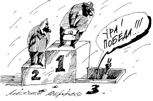

> **Первичный текст.** Сборник аналитических записок «Вехи» (1989-1995-1998-2004-2005-2007-2010).
> Источник: `Сборник аналитических записок «Вехи» (1989-1995-1998-2004-2005-2007-2010).doc` sha256 `9c20d04275210e29…`.
> Автоматическая транскрипция DOC→Markdown; смысл и формулировки не правились.
> Контрольные суммы и статус проверки — в [NOTICE.md](../../NOTICE.md).
> Содержание передаёт позицию авторов; утверждения не верифицированы библиотекой.

---

## 3. Политический спектр России

В «Обзоре-95» было высказано утверждение, которое по существу конкретизирует только что сказанное о концепции, поддерживаемой Свыше, по отношению к России:

«При условии сохранения мирных отношений со странами-членами НАТО и сопредельными государствами, в России — региональной цивилизации многих народов — будет устойчиво протекать процесс очищения *спектра частных концепций общественного устройства* от изживших себя частных концепций, оставшихся в качестве наследия прошлого, и от беспочвенных фантазий в отношении будущего».

Это утверждение продолжает быть актуальным и ныне, тем более, что за прошедшие 10 лет угроза военного столкновения России и НАТО стала меньше. Это касается как угрозы военного столкновения, санкционировано выражающего ту или иную политическую волю, так и спонтанно бессмысленного, возможного вследствие ошибок командования при неблагоприятном стечении обстоятельств и предубеждений в отношении заведомо агрессивных действий второй стороны[^41].

Ещё раз следует вспомнить ситуацию и тенденции (направленности) её развития, сложившиеся к августу 1991 г., которые были искусственно заблокированы теми, кто *возбудил участников* ГКЧП на действия.

«К этому времени шёл к завершению процесс размежевания руководства КПСС и «партийной массы» — тех многих миллионов людей, которые убеждены, что при всех извращениях, имевших место в СССР, общественные отношения в нём сложившиеся в результате государственного переворота, названного Великой Октябрьской Социалистической революцией, лучше, человечнее, справедливее, чем капитализм в его западной или восточно-азиатской модификации. Кроме того, и вне КПСС было достаточно много людей, которые убеждены, что б*олее одной реально правящей партии ни один народ прокормить не может,* и потому порядок (т. е. концептуальную определённость и концептуальную дисциплину правления) следует устанавливать в одной правящей партии, дабы эта партия правила так, чтобы тем, кто добросовестно трудится, жилось легче, свободнее и спокойнее, чем тем, кто специализируется на извлечении нетрудовых доходов и использовании своего положения в органах партийной, государственной и хозяйственной власти в целях обогащения и «продвижения по службе» своих многочисленных родственников и приятелей (часто просто собутыльников), чем и угнетает жизнь тружеников. (...)

Четыре года, прошедшие после ГКЧП и роспуска СССР региональными «элитами», достаточно большой срок, чтобы продемонстрировать неоспоримое превосходство *концепции ростовщической псевдодемократии* западного образца в России. Причём в начале этого периода общественные условия были благоприятны для псевдодемократов, поскольку подавляющее большинство населения уже устало от пустословия партийных пропагандистов и перестроечной болтовни. Псевдодемократам требовалось только поддержать производство, как минимум на прежнем уровне и сохранить социальную защищённость большей части населения на время становления нового государственного режима, потому что подавляющее большинство населения оценивает власть по покупательной способности своей зарплаты, а в корпоративные споры *историков* и идеологов между собой и в их взаимные обвинения большинство не имеет времени вникать» («Обзор‑95»).

### 3.1. Либералы — сами изошли...

Это было написано в 1995 г. С того времени прошло десять лет, и можно подвести итоги «демократической» буржуазно-либеральной общественности Россионии. 13 декабря 2005 г. газета «Московский комсомолец» опубликовала статью Михаила Романова «Семь смертных грехов демократии», вынеся в подзаголовок слова Владимира Рыжкова *«Ещё год таких побед, и нам праздновать будет уже нечего»,* которую мы приводим ниже полностью.

**«На сцену приглашается Михаил Касьянов», — объявил вчера ведущий Всероссийского демократического конгресса. Пока г-н Касьянов шёл к трибуне, у кого-то вблизи от микрофона зазвонил мобильный телефон с мелодией из «Крёстного отца». Касьянов не был похож на дона Корлеоне**[^42]**, но сумел под этот аккомпанемент объявить о создании альтернативной Общественной палаты, состоящей сплошь из демократов.**

Демократический конгресс родился в прошлом году, и первое заседание проходило в концертном зале гостиницы «Космос», битком набитом региональными лидерами. С тех пор дела у демократов существенно ухудшились: и зал арендован поменьше, и отель другой, и демократически настроенных людей поубавилось.

Зато прошлогодние речи демократы могли и не переписывать: словно под копирку, «оставшиеся в живых» демократы декламировали, что страна находится у черты тоталитаризма, обвинили власть во всех смертных грехах и говорили о последнем шансе на объединение. Но власть может спать спокойно: демократы страны раздробились как минимум на три группировки, лидеры каждой из которых тянут одеяло на себя. И никто из них, похоже, не наступит на горло собственной песне.

Михаил Касьянов изрядно напугал присутствовавших: «Мне напоминает происходящее тоталитарный Советский Союз. Нас пронизывает от головы до пят одна сплошная ложь. Я призываю Гражданский конгресс сформировать собственную, альтернативную Общественную палату. С тем, чтобы самим давать оценку событиям, происходящим в стране. И я гарантирую вам, что всё своё время я потрачу на процесс построения широкой демократической коалиции!» (аплодисменты).

Лидер «Яблока» Григорий Явлинский попытался убедить аудиторию, что он всегда был за идею объединения, иначе как бы выборы московские выиграли? Но лидерами этой коалиции он не видит ни Касьянова, ни Рыжкова, ни Хакамаду. Кого? Из слов Явлинского нетрудно было догадаться: «В «Яблоке» найдётся место всем: и мечтателям, и прагматикам. Нет места только тем (и тут Явлинский посмотрел на Касьянова. — Авт.), у кого нехорошая кредитная история».

К кому присоединится или будет играть в собственную игру Владимир Рыжков? «Я согласен на объединение с кем угодно и считаю, что сделать это надо в ближайшие шесть месяцев. Надо просто собрать съезд хотя бы на тысячу делегатов и демократически выбрать себе лидера». (Интересно, собирается ли демократ на съезд Касьянова в Колонный зал Дома союзов в эту субботу[^43], где «мелкие демократы» объединятся вокруг бывшего премьера?) Кстати, Рыжков назвал заявления «Яблока» — СПС об успехах на выборах в Мосгордуму «хвастовством и хлестаковщиной»: «Если будет ещё год таких побед, то к следующему Гражданскому конгрессу нам праздновать будет уже нечего».

***Рисунок Алексея Меринова***

Конструктивнее других был политолог Георгий Сатаров. Его речь несколько раз прерывалась аплодисментами. «Власть разлагает молодёжь[^44] — одну натравливает на другую. Это что за подготовка? К чему? У нас нет ни МВД, ни ФСБ — у нас есть мы сами у себя. Только на чувство собственного достоинства и на интеллект[^45] надо опираться в этих условиях. Люди, я к вам, лидеры партий, обращаюсь: объединяйтесь! Переходите от слов к делу...»

**Но лидер СПС Никита Белых подвёл пессимистический итог, перечислив «семь смертных грехов демократии», которые мешают объединению: гордыня, старые обиды, уныние и пораженческие настроения, корысть, непомерные амбиции, неверие и то, что, «увлёкшись технологиями, демократы забыли о стране, забыли, зачем вообще они есть».** (http://www.mk.ru/numbers/ 1952/article66438.htm).

Эта статья показательна в двух аспектах:

- Первый, — бросающийся в глаза, — явно издевательский тон «МК» по отношению к прозападным либерально-буржуазным «демократам» и соответствующая карикатура. Хотя с начала перестройки многие были убеждены в том, что редакция «Московского комсомольца» стоит на <u>*буржуазно* демократических позициях либерализма</u>, но эта статья ясно даёт понять, что это не так: либерально-буржуазные «демократы»[^46] были только попутчиками марксистов-троцкистов, мнение которых «МК» и выражает на протяжении всех лет перестройки и реформ в постсоветской Россионии.

- Второй — со скрытым для многих смыслом. Никита Белых сделал главное: он признался САМ в нравственно-этических пороках *либерально-буржуазных «демократов».*

По существу же он проболтался, сам не понимая о чём. И это необходимо пояснить. В материалах Концепции общественной безопасности показано[^47], что:

- нравственные стандарты, свойственные личности, едины для уровня сознания психики индивида и для всех бессознательных уровней его психики даже в том случае, если нравственность[^48] внутренне конфликтна;

- нравственные стандарты обуславливают всю психическую и интеллектуальную, в частности, деятельность личности, а также характер соучастия личности в той или иной коллек*тивной психике*[^49], порождаемой обществом, и коллективной деятельности под эгрегориальным водительством.

По существу это означает, что есть определённое — довольно жёсткое — соответствие: ***нравственности** — с одной стороны, и с другой стороны — **идей, убеждений**, которым привержена или может быть привержена личность*.

Из перечисленного Никитой Белых главное, что делает людей буржуазными «демократами» — носителями либеральной идеи в её интернацистском варианте:

- корысть,

- непомерные амбиции[^50],

- *неверие Богу* и,

- соответственно неверию Богу, — неверие в Русь как региональную цивилизацию, несущую в себе смысл своего бытия, отличающий её от смысла бытия Западной региональной цивилизации, основанной на Библии и обломках культуры Римской империи.

> Т. е. если бы буржуазные демократы-западники — носители либеральной идеи в её интернацистском варианте избавились от «смертных грехов», названных Никитой Белых, — они стали бы приверженцами других идей и противниками либерально-буржуазной «демократии» западного образца.

Именно вследствие несовпадения смыслов жизни Русской и западной многонациональных региональных цивилизаций, *на основе библейского мировоззрения «умом Россию не понять».* Но буржуазные демократы-западники, носители либеральной идеи в её интернацистском варианте, не только не понимают Россию умом, но и не верят в неё. Отсюда и проистекает вся их политика и их неразрешимые проблемы.

Если бы они хотя бы верили в Россию, то при всех остальных их «смертных грехах», — им следовало бы податься в партию В. В. Жириновского: там тоже за капитализм, но не за интернационал-капитализм, а за имперский капитализм, в котором имперская «элита», чтобы избежать повторения 1917 г., должна и вынуждена заботиться о том, чтобы большинство подданных империи были высокими профессионалами и заняты эффективным трудом и чтобы этот труд обеспечивал бы жизненные потребности их и их семей.

*При этом всякая имперская «элита» заинтересована в умножении численности населения в подвластных ей границах империи, поскольку это её демографический ресурс в проведении внешней политики и глобальной политики — залог дальнейшего расширения империи.*

А для интернацистской «элиты» космополитов-глобалистов население во многих регионах планеты — лишнее; а если в каких-то регионах экономическая или политическая конъюнктура требует резкого увеличения населения или открытия множества рабочих мест, то эта проблема решается путём организации миграции избыточного населения из других регионов.

> В этом отношении к миллионным массам людей принципиальное отличие интернацистского «элитарного» либерализма от имперского не менее «элитарного» либерализма.

Однако и имперский либерализм не следует идеализировать.

**Образно говоря, М. С. Собакевич**[^51] **и его имение в масштабах государства Российского — это тот идеал, который соответствует имперскому многонациональному капитализму и разделению общества на имперскую «элиту» и простонародье.**

Хотя либеральные демократы (ЛДПР) об этом могут не догадываться, поскольку им присущи те же «смертные грехи» (за исключением неверия в Россию), наличие которых признал Никита Белых — лидер СПС. Однако признание Никиты Белых не является неким новым словом — вкладом в политологию постсоветской России. В прошлом этого не знали, разве что сами либерально-буржуазные «демократы» интернацисты. Об этих же их качествах, — в частности, о рвачестве = своекорыстии, — говорилось и в «Обзоре‑95»:

«... за время ростовщической реформации под лозунгами «демократизации», по причине главным образом несостоятельности экономических воззрений Е. Т. Гайдара и его команды состава 1992 — 1993 гг., «демократическая элита» растеряла свою социальную базу, особенно в промышленных регионах, а своим рвачеством и недееспособностью в области организации многоотраслевого производства создала многочисленную оппозицию разной степени дееспособности. Иными словами псевдодемократы-западники, как и ГКЧП, своей недееспособностью в области государственного управления и организации хозяйственной деятельности населения расчистили место для осуществления альтернативных *западной демократии* иных частных концепций» («Обзор‑95).

Именно вследствие этих особенностей либерально-буржуазных «демократов» политика России с начала 2000‑го года персонифицируется новыми лицами. И если говорить об отличии эпохи 1990‑х гг. от наших дней на уровне персон, делающих практически публичную политику, то:

- **1990‑е гг.** — это время, когда буржуазные демократы-западники, носители либеральной идеи в её интернацистском варианте олицетворяли государственную власть в России, *медленно утрачивая её.*

В 1990‑е гг. их политические противники в своём большинстве грезили наяву альтернативными политическими проектами, которые предусматривали отстранение от государственной власти либерально-буржуазных демократов-западников и, возможно, наказание многих из них за совершённые политические и экономические преступления против народов России.

Опасаясь такого поворота течения событий, «демократы»-интернацисты защищали свою власть и свои нежные «шкурки» в том числе и далеко недемократичными методами[^52].

- **Первое десятилетие XXI века** — это время, к началу которого либерально-буржуазные «демократы»-западники, *изойдя «на нет» в силу действия своих внутренних причин («смертных грехов», названных Никитой Белых),* очистили политическое поле, открыв тем самым возможность олицетворять собой политику государства представителям других политических доктрин, которые в 1990‑е годы либо только грезили наяву о своём будущем доминировании в институтах государственной власти России, либо тихо дожидались, когда «демократы» изойдут «на нет», после чего и настанет их час.

### 3.2. Основные политические проекты антилиберализма

И теперь кое-кто из них убеждён, что «час настал» и они могут действовать, а поддержка народа им персонально и их политике будет обеспечена как объективными, так и субъективными факторами. Поэтому обратимся к рассмотрению этих объективных и субъективных факторов. К числу частных концепций, альтернативных концепции интернацистского буржуазно-«демократического» либерализма, имеющих зримую социальную базу, относятся несколько концепций, которые были перечислены и охарактеризованы ещё в «Обзоре‑95». Это:

«1) восстановление управления по *концепции социализма* в России с последующим восстановлением СССР и очищения реального социализма от разного рода извращений;

2) восстановление управления по *концепции монархии;*

3) восстановление управления в России по *концепции национал-вождизма,* чаще именуемого «фашизмом» на основании исторического опыта Италии и Германии 1925-45 гг.

В этом абзаце перечислены основные частные концепции самоуправления общества в порядке, обратном их сменяемости в реальной истории России до 1936 г. Поэтому обсуждение их существа и потенциала будем вести в хронологическом порядке их сменяемости» (Обзор-95).

### 3.3. Национал-вождизм и наследственная монархия — управленческая суть

«В современных условиях концепция национал-вождизма выражает стремление осуществить идеалы справедливости в управлении многонациональным государством на принципах, на которых было основано общественное самоуправление в племени во времена первобытнообщинного строя.

Члены одного племени знали лично почти всех своих соплеменников, их клановую принадлежность, знали достоинства и недостатки каждого. В такой социальной атмосфере, где ничто не могло утаиться от взгляда соплеменника, формировались шаманско-старейшинские структуры и выдвигался не-наследственный вождь. При переходе к устойчивым племенным союзам, чья культура простиралась на бóльшие территории, концепция племенного вождизма с не-наследственными вождями в бесклассовом обществе утрачивала работоспособность, поскольку личное общение каждого члена племени со всеми остальными или подавляющим их большинством становилось невозможным. Тем более оно невозможно в условиях многомиллионного населения современных, даже моноэтнических государств. Но досягаемость психики каждого средствами массовой информации порождает в обществе иллюзию глобальной деревни, в которой всё, вроде как можно увидеть по телевизору, узнать из прессы, а в перспективе получить любую информацию через компьютерную сеть. Но между этой *глобальной информационной «деревней»* и реальной деревней, в которой жила община с вождём, есть разница: в реальной деревне каждый человек имел непосредственный доступ ко всей информации, а в *глобальной информационной «деревне»* хозяева и работники инфраструктуры средств массовой информации создают образы природных и общественных явлений, включая и образы вождей. И поставляемые средствами массовой информации образы могут сколь угодно отличаться от тех образов, которые возникли бы у аудитории, если бы она соприкоснулась с реальностью, на основе которой сделаны образы, доступные из средств массовой информации. Контроль истинности этой информации возможен только на основе «мистики».

Иными словами, если в первобытнообщинные времена всё племя создавало себе вождя, то в наши дни племя кинематографистов и журналистов создает вождей для всех других, безответственно манипулируя общественным мнением в бездумном — толпо-«элитарном» обществе. В результате чего «вождями» становятся даже те, кто по своим личностным качествам не смог бы пройти инициацию во взрослость в первобытнообщинные времена. «Вождь», созданный в глобальной и региональной информационной «деревне» средствами массовой информации, не может быть ни чем, кроме как инструментом, для решения каких-то кратковременных (в пределах срока активной жизни одного поколения) задач. С уходом (или устранением) вождя самоуправление общества по концепции национал-вождизма обречено на потерю устойчивости и переход на иную концепцию. Это лишает *концепцию национал-вождизма* долговременных исторических перспектив в современных условиях, но переход общественного самоуправления на неё, тем не менее, возможен как кратковременный эпизод, если сторонники иных концепций проявят свою недееспособность. Пока же лидеры разных толков национал-вождизма создают структуры и социальную базу *из молодежи*, кто понимает, что их будущее изначально съедено сов-партноменклатурой и ростовщиками-демократизаторами. Если им не указать иных перспектив, они пойдут за вождём до конца решительно и беспощадно, как то и было в Германии 1930-х годов; и они деятельно, <u>в отличие от большинства своих оппонентов</u>, готовятся к трудностям *неведомого им* (в этом главное в национал-вождизме современности) похода, предназначенного им хозяевами «вождя» («вождь» тоже не знает, куда заведёт). (...)

Главная же проблема устойчивости национал-вождизма при смене поколений — легитимизация вождя-наследника: при живом «вожде» второй полноценный вождь в социальной системе избыточен, по какой причине претенденты на эту должность уничтожаются, как враги режима; после смерти «вождя» — дееспособного преемника нет, есть только жалкие подражатели, поскольку все потенциальные преемники тщательно выкосили один другого ещё при его жизни, а он реально не имел возможности их защитить, иначе кто-то выкосил бы и его самого. Поэтому альтернативой ненаследственному национал-вождизму является концепция династического, наследственного национал-вождизма.

Идея монархического правления в России неотделима от *исторически реального православия*. Исторически реально царизм в России (а не в удельно-княжеской Руси) от рождения был библейски-православным. И в наши дни речь идёт о восстановлении именно православной монархии. Поэтому необходимо видеть существо двух социальных явлений: 1) династического национал-вождизма — института монархии, как такового; и 2) библейского православия, как религии и общественной идеологии.

Мы живём в эпоху после смены соотношения эталонных частот биологического и социального времени. Подробно вопрос о смене соотношения эталонных частот биологического и социального времени рассмотрен в кн. «Мёртвая вода» (СПб, 1992 г.) и в «Кратком курсе» (в ж. «Бизнес и учёт в России», № 5—6, 1994 г.)[^53].

Существо изменения соотношения частот эталонов времени состоит в том, что в библейские и добиблейские времена через культурно и технологически неизменный мир проходило множество поколений; в наши дни на протяжении активной жизни одного поколения успевает смениться несколько поколений промышленной и бытовой техники и технологий.

Это изменение информационных условий жизни влечёт за собой и массовые изменения психологии людей, по какой причине формируется новая логика поведения людей в обществе. И для сторонников *концепции монархии*, прежде всего прочего, дóлжно ответить себе на вопрос и при этом не ошибиться: насколько новая формирующаяся логика социального поведения вписывается в сословно-монархическую пирамиду холопско-господских внутриобщественных отношений; насколько эта пирамида может быть устойчивой при смене поколений после изменения соотношения эталонных частот биологического и социального времени.

С точки зрения теории управления, монарх в общественной системе отношений — профессионал управленец, наивысший в структуре соподчинения управленческих должностей в государственном аппарате, являющемся системой профессионального управления делами общества в целом. Во времена перехода от не-наследственного племенного вождизма к наследственному (династическому) многоплеменному вождизму в формах монархической государственности, в условиях ограниченного производственного потенциала, культурной и *технологической, в частности*, неизменности мира, наиболее эффективной системой передачи от поколения к поколению профессиональных знаний и навыков было обучение в семье. Один отец учил сына быть пахарем, другой отец учил сына быть государем. И в *смысле учительства* между ними не было никакой разницы.

Разница была только в общественно необходимом профессионализме, который отождествили с родовым и личностным благородством и достоинством, потому что в культурно и технологически неизменном мире можно было жить всю жизнь на основе единственный раз освоенных в детстве и отрочестве знаний и навыков: они не устаревали. Но в условиях необходимости работать от зари до зари при низкой энерговооружённости производства, в течение жизни одного поколения невозможно было самостоятельно воспроизвести все необходимые знания и навыки, необходимые для того, чтобы войти в иную сферу деятельности так, чтобы превосходство в профессионализме в ней новичка было общепризнанно.

В наши дни, в условиях многократного обновления технологий, чтобы поддерживать свой общественный статус, человек вынужден постоянно воспроизводить свой профессионализм, а для этого необходимо всю жизнь думать и самообучаться; помогать в этом другим. В таких условиях нет никаких внутрисоциальных факторов, которые бы гарантировали свойственность наивысшего профессионализма в области государственного правления выходцу из семьи государя; выходец из семьи пахаря может стать на порядок выше в качестве государственника-управленца, чем любой из потомков предшествующего поколения правящей «элиты». Это означает, что после изменения соотношения эталонных частот биологического и социального времени в обществе исчезли условия, в которых управленческое превосходство государя наследника над прочими людьми — объективная общественная данность[^54].

Поэтому в наши дни благородство — обязанность каждого человека, а не наследственная привилегия немногих родов.

Но нет никаких и внесоциальных факторов, предопределяющих *профессиональное* управленческое *превосходство* рождённых в царской семье над всеми прочими людьми: общество людей — не множество пчёл в улье, где специфическое питание предопределяет будущность матки-царицы, а рядовое — рабочей пчелы[^55].

Отрицать сказанное, кроме всего прочего, означает отрицать и Учение о жизни людей на Земле, данное Свыше через Иисуса Христа: «Вы знаете, что князья народов господствуют над ними и вельможи властвуют ими; но между вами да не будет так; а кто хочет между вами быть большим, да будет вам слугою; а кто хочет между вами быть первым, да будет вам рабом; так как Сын Человеческий не для того пришёл, чтобы Ему служили, но чтобы послужить и отдать душу Свою для искупления (или спасения?) многих» — Матфей, 20:25—28.

Из этих слов ясна неуместность в истинно Христианском обществе титулований, в которых выражается анти-Христианство: ваше величество (к коронованным особам), ваше святейшество (к первоиерархам церквей), превосходительства, степенства и господа (к «прыщам» помельче) и парные им *оскорбления* низших в иерархии людей: «покорный слуга», «холоп», «раб».

Кроме того, анти-Христианство исторически реальных церквей выражается в том, что в христианской Библии отсутствует текст под названием «Святое благовествование от Иисуса Христа»[^56]. Исторически реально, что Богом Благая весть была дана для передачи людям Иисусу, которого Он сделал Христом, но не Матфею, не Марку, не Луке, не Иоанну. Исторически реально, что текст, озаглавленный «Евангелие Мира Иисуса Христа от ученика Иоанна», отвергнут и забыт церквями, но он существует по сию пору, как мало кому известный хранимый апокриф[^57] (в Ватикане — на арамейском; в библиотеке Габсбургов в Австрии — на *старославянском*, что предосудительно для православия). Отвергнут он потому, что из него явствует, что Иисус учил своих современников по плоти, не верноподданному подчинению царям земным, а непреклонному исполнению в земной жизни воли Царя Небесного и Земного — Господа Бога, Творца и Вседержителя.

Также анти-Христианство исторически реальных церквей выражается в том, что в их Символе веры, нет ни единого слова, из переданных евангелистами слов Христа: весь Символ веры — отсебятина «отцов церкви», отвращающая паству от Откровения Свыше: «С сего времени Царствие Божие благовествуется и каждый усилием входит в него...» — Лука, 16:16.

Обладая перечисленными *знаменательными свойствами*, ни одно из вероучений исторически реальных христианских церквей не учит истинной религии и чистой вере Богу. Вследствие этого, в качестве общественных идеологий все они — разнообразные *экспортные* модификации ростовщического иудаизма, построенные таким образом, чтобы ввести в духовную неволю, кабалу к кланам *ростовщиков-единоверцев* всех и каждого, кто примет их в качестве истинного вероучения.

Всё, высказанное здесь об исторически реальном христианстве вкратце, обстоятельно изложено в «Вопросах митрополиту Санкт-Петербургскому и Ладожскому Иоанну и иерархии Русской Православной Церкви», переданных Церкви в марте 1994 г.[^58] Митрополит Иоанн и иерархия отмолчались. Но смерть иерарха Иоанна — знаменательна по отношению к иерархии; и знаменательно подтверждает правоту сказанного здесь: иерарх церкви скончался, *пытаясь* *благословить \<*Собчака и его супругу: пояснение по контексту при цитировании*\>,* на презентации в отеле (*место для заезжих чужестранцев*) «Северная Корона» (*символ монархии)*, устроенной банком «Санкт-Петербург» (*одной из множества ростовщических контор, порождённых в России в соответствии с библейской концепцией расово-«элитарного» ростовщического паразитизма)*» (Обзор‑95).

### 3.4. Национал-вождистские сценарии\

и угроза фашизма в России

Ни в 1990‑е гг., ни позднее ЛДПР, которая в те годы рассматривалась многими аналитиками как партия национал-вождистского характера, не обрела доминирования в государственной власти. Во многом это заслуга самого В. В. Жириновского, чьё несдержанное, хамски распущенное поведение на публике удерживало и удерживает многих людей от того, чтобы голосовать за его партию. Но есть и второй аспект вопроса о приходе ЛДПР к государственной власти: ЛДПР — это не только политические проект, но и коммерческое предприятие под вывеской политического проекта. И эта коммерческая составляющая большей частью преобладает над политической в её деятельности. Поэтому национал-вождистский сценарий не был реализован ею в 1990‑е гг. Другой многонационал-вождистский сценарий завершился в 1998 г. убийством на его даче генерала Льва Рохлина. Ещё один кандидат в вожди (министр внутренних дел Куликов), о бонапартистских устремлениях которого тогда ходили слухи, был освобождён от занимаемой должности[^59].

До появления «Родины» во главе с Д. Рогозиным в России не было сколь-нибудь заметных раскручиваемых СМИ партий по их существу национал-вождистского толка[^60]. Но и «Родина» во главе с Д. Рогозиным скорее подаётся СМИ в качестве «крутонационалистической» партии, нежели таковой является по сути. А эпизод со снятием «Родины» с выборов в Московскую городскую Думу в конце ноября 2005 г., произвёл впечатление кое-как срежиссированной показухи, т. е. «пиара».

Дело в том, что агитационный ролик, который стал предметом экспертизы и судебных разбирательств[^61], приведших к отстранению этой партии от участия в выборах, — действительно двусмысленный: его можно понимать и в прямом смысле, т. е. «уберём мусор с улиц нашего города»; но можно понимать и иносказательно, подразумевая под «мусором» тех тёмнолицых мигрантов, которые в ролике торгуют арбузами и нагло бросают арбузные корки под ноги матери, — славянской внешности, — которая катит коляску с ребёнком, а на предложение убрать мусор не реагируют, будто они действительно не понимают русского языка.

Но этот сюжет — в силу сложившихся обстоятельств — не более ксенофобский, нежели сцены в трамвае при проверке билетов контролёром из фильма «Брат», который беспрепятственно на протяжении многих лет показывают все каналы федерального и местного телевещания.

Если агитационный ролик «Родины» Д. Рогозина понимать прямо, то наглость и хамство, от кого бы они ни исходили, должны пресекаться на месте любым человеком[^62], а государство должно его в этом поддерживать: если это имеет место, то государство не может стать «полицейским».

Что касается собственно мусора как в прямом значении этого слова, так и *человеческого — разнородного люмпена и этнических криминальных группировок,* — то его действительно надо регулярно убирать. И не только с улиц, но и из тех мест, где прижилась человекообразная мразь и где она ведёт свой быт, отравляя жизнь окружающим: это не вопрос прав «нарушения» человека[^63] — это вопрос социальной гигиены и безопасности общественной жизни более или менее нормальных граждан.

И главное:

> **Культура общества, система образования и поток массмедиа должны быть такими, чтобы человеческий мусор не воспроизводился в новых поколениях.**

>

> **Если режим с этой задачей не справляется, то общество в праве защищаться от режима и антисоциальных элементов, которым режим попустительствует, и защищать от него и от них своих детей в самодеятельном внеюридическом порядке по способностям каждого.**

А то, что у преступности в Москве и других городах России есть и этнически не славянские лики представителей разнородных диаспор, которые значимы в милицейской статистике, — это историческая данность нашей эпохи, которая и создаёт предпосылки к расизму и ксенофобии. Поэтому ролик «Родины» в общем-то не может вносить сколь-нибудь значимый вклад в разжигание межнациональной розни и ксенофобии, поскольку показывает кое-что из того, с чем все и так сталкиваются в жизни.

Тем не менее, пока в 1990‑е гг. либерал-буржуазные «демократизаторы» олицетворяли собой государственную власть, они успели растлить несколько поколений. И именно вследствие этого Россия в наше время сталкивается с проблемами, которые в середине 1990‑х гг. были только в зачаточном состоянии. Речь идёт о так называемых «скинхедах».

Однако надо понимать, что нынешние «скинхеды» это — не крутой молодёжный идейно (концептуально) оформившийся нацизм, а одна из *многих* форм, в которую в наше время выливается *подростковая преступность — неотъемлемый атрибут всякого толпо-«элитарного» общества.*

Суть возникновения подростковой преступности состоит в том, что к началу возрастного периода, когда в соответствии с генетической программой развития организма активизируются половые инстинкты и инстинкты стадно-стайного поведения, свойственные биологическому виду «Человек разумный», подростки в дефективной педагогической системе не успевают получить адекватных ответов на вопросы о смысле жизни личности и общества, о навыках обретения смысла жизни; не успевают обрести навыков волевого самообладания, позволяющих быть властными над инстинктами.

Вследствие этого инстинкты полового влечения и стадно-стайного поведения оказываются властными над ними в тех ситуациях, когда это общественно неуместно[^64] (в частности, в этом и причина «дедовщины» в вооружённых силах, уличных побоищ, устраиваемых футбольными и прочими «фанатами»).

В какие формы выльется неустойчивость психики под воздействием половых гормонов и инстинктов стадно-стайного поведения, — это вопрос жизненной конкретики, которая меняется от эпохи к эпохе. Наше время таково, что *для неправильно воспитываемого родителями, школой, телевидением и улицей подростка* быть «скином» — это «круто», а «крутизна» выражается в нападениях на тех, кто воспринимается в качестве этнически чуждых: а стая зверей не знает жалости и пощады[^65]. Однако «стая» чуть ли не мгновенно превращается в трусливое стадо, если её как следует шугануть или сразить «вожака».

А для того, чтобы из этого подросткового движения «скинхедов» впоследствии вырос *настоящий нацизм взрослых людей,* нужны «интеллектуалы», которые напишут своего рода «Библию национализма», как это произошло в Германии в 1920‑е гг. Роль такой «Библии национализма» — германского — съиграла «Майн кампф» А. Гитлера.

Однако для России «Майн кампф» не может съиграть роль «Библии национализма», поскольку в «Майн кампф» население СССР и России, в частности, расценивается в качестве расово неполноценного — недочеловеческого, подлежащего безжалостному уничтожению. Но и при этих особенностях германского нацизма некоторое количество идиотов в Россионии может боготворить Гитлера, не задумываясь при этом о своей собственной интеллектуальной состоятельности, подтверждая тем самым *в отношении самих себя исключительно* оценки «Майн кампф» о человеческой неполноценности всех, кто не родился чистокровным «германцем»[^66]*.*

Кроме того, чтобы произвести «Библию национализма», «интеллектуалы» должны обладать ещё некоторыми личностными качествами, которых Д. Рогозин до настоящего времени не проявлял. Если таких личностных качеств у претендента в вожди «националистов» нет, то с течением времени те «скинхеды», которые не погибнут в уличных драках и в тюрьмах, — вырастая, станут более или менее рядовыми обывателями, не доставляющими особых неприятностей ни окружающим, ни государству. Произойдёт то же самое, что произошло с уличной шпаной прошлых эпох.

Поэтому в настоящее время национал-вождистский сценарий бесперспективен точно так же, как это было в середине 1990‑х гг.[^67]

### 3.5. Монархический «Сергиевский проект» — явная неадекватность

В 1990‑е годы не были реализованы и монархические сценарии. Их можно разделить на два класса:

- интернационал-монархические, в которых легитимными претендентами на престол России признаются зарубежные потомки Романовых разных поколений[^68] и отпрыски иных «владетельных домов»;

- национал-монархические, в которых:

<!-- -->

- признаётся правомочным воцарение новой династии на основе решения Собора, аналогично тому, как это имело место при воцарении Романовых;

- либо утверждается, что император Николай II или кто-то из его детей не погибли в 1918 г., как об этом сообщает официальная версия истории, и потому их прямые потомки имеют если не неоспоримое, то преимущественное право на престол[^69].

Основные причины того, что монархические сценарии не были реализованы в 1990‑е гг. *(хотя, как утверждали некоторые СМИ в то время, соответствующие указы, которые Б. Н. Ельцин должен был подписать, уже были подготовлены)*, состоят в том, что, **во-первых**, слишком много претендентов на престол Российской империи и слишком много сценариев воцарения нового монарха, вследствие чего малочисленные монархисты не могут объединиться; и **во-вторых**, общество мировоззренчески было не готово к тому, чтобы принять власть над собой той или иной династии и поддерживающей её корпорации монархистов.

Однако 1990‑е гг. остались в прошлом, и в России снова «пиарятся» «православно»-монархические идеи, выразители которых убеждены, что общество мировоззренчески «зреет» и идёт к тому, чтобы принять власть над собой нового монарха и обновившейся имперской «элиты», и если этому процессу немного посодействовать, то всё свершится как бы само собой и Российская империя возобновится.

3 июня 2005 г. сайт «Консервативного пресс-клуба» опубликовал следующее сообщение:

«**В Москве разрабатывается Русская доктрина (Сергиевский проект)**

31 мая в ходе Консервативной Генеральной Ассамблеи было объявлено об инициативе Центра динамического консерватизма по созданию Русской доктрины (Сергиевский проект). Учредителями центра выступили два участника Консервативного пресс-клуба: экономист, главный редактор журнала «Русский предприниматель» **Андрей Кобяков**, философ и идеолог **Виталий Аверьянов**, а также известный писатель **Максим Калашников**[^70] (псевдоним, подлинное имя — **Владимир Кучеренко**).

В течение трёх месяцев предварительной разработки Сергиевского проекта был организован цикл семинаров, в ходе которых создана концепция Русской доктрины а также сложился круг соавторов и экспертов, участвующих в её создании. При этом разработчики Русской доктрины открыты к сотрудничеству с другими заинтересованными организациями и экспертами. Перед участниками Сергиевского проекта поставлена амбициозная цель: описание мировоззрения и первоначальная проработка программы консервативных преобразований в современной России. При этом решается двуединая задача: дать точный анализ нынешней ситуации и предложить комплексное видение того, каким образом Россия может сохранить свою цивилизационную идентичность и стать в XXI в. мировым лидером.

Доктрина впоследствии может быть взята на вооружение здоровыми национально ориентированными государственными и общественно-политическими силами. При этом Сергиевский проект является независимым по отношению к каким-либо сложившимся политическим группам.

Инициаторы и организаторы проекта решили дать ему личное имя и остановили свой выбор на имени преподобного **Сергия Радонежского** — вечного защитника и покровителя России в самые трудные для неё времена. Публикация и презентация Русской доктрины планируются в сентябре — октябре 2005 года» (http://www.conservative.ru/news/index.html?nId=88).

Т. е. ещё ничего нет кроме «декларации о благих намерениях», а рекламная кампания уже началась.

Прошло несколько месяцев. На острове Корфу (Ионические острова, Греция, место одной из побед адмирала Ф. Ф. Ушакова, которая вызвала удивление в военных кругах всего мира в те годы[^71]) проходила Русская неделя. 12 октября 2005 г. православно-аналитический сайт «ПРАВАЯ.RU» в статье «Русская доктрина на острове русской славы» сообщил следующее:

«Главным событием «Русской недели» на Корфу стала презентация «Русской доктрины». В день рождения Путина[^72] на остров высадился десант бизнесменов, священников, консервативных идеологов, политологов и журналистов» (http://www.pravaya.ru/dailynews/5181).

И далее после описания торжеств на Корфу «ПРАВАЯ.RU» сообщает о самóм проекте, во многом повторяя приведённую выше публикацию http://www.conservative.ru/news/index.html?nId=88.

Газета «Русский курьер» (№ 77, 2005 г.) тоже сообщила о презентации «Русской доктрины» в ходе проведения Русской недели на острое Корфу в статье «Станет ли «Доктрина» панацеей?» с подзаголовком «В России появился первый документ о национальной идее». В ней сообщается:

«ПОКА ЕЩЁ ТАЙНАЯ «ДОКТРИНА». Больше всего во время «Русской недели» журналистов и политологов заинтересовала презентация необычного издания под пафосным названием «Русская доктрина». Монументальный труд, над которым несколько месяцев трудился огромный авторский коллектив, грозит стать бестселлером среди мыслящей российской публики.

Руководители проекта экономист Андрей Кобяков и философ Виталий Аверьянов возложили на себя непростую задачу — на 363 страницах изложить ни много ни мало национальную идею России, некий концептуальный план развития страны на ближайшие 50 лет.

Впрочем, если руководство страны не спешит поделиться с гражданами своими соображениями на тему «Что делать», то рано или поздно сами граждане проявляют инициативу, ибо свято место пусто не бывает.

Даже червяк знает, куда ему ползти, чтобы добыть свежий листок. А Россия уже 15 лет топчется на одном месте, не решаясь сделать внятное телодвижение. Вот что пишут авторы доктрины в предисловии к своей работе: «Россия — это система стропил, поддерживающих свод над всеми народами мира, дарующая мировому целому равновесие и стабильность.

Когда в голосе нашего государства послышатся узнаваемые ноты тысячелетней России — Запад и Восток не удивятся, более того, они вздохнут с облегчением». Звучит красиво и по-мессиански, но уж лучше так, чем затянувшаяся идеологическая молчанка, в которую тупо играет уже не первое поколение кремлёвских обитателей.

В «Доктрине» очень оригинально и образно изложен взгляд на самые жгучие проблемы современной России: что такое русская цивилизация, дух нации, государственность, военная доктрина, принципы хозяйствования, социальная политика, культура, демография... Создавая «Доктрину», авторы исходили из трёх сценариев нашего будущего: «1) развал России, распад её на части, провозглашение местных суверенитетов; 2) стагнация на условиях, близких нынешним, сохранение неустойчивого равновесия; 3) глубочайший кризис, граничащий с катаклизмом, в результате которого власть путём скачка перейдёт к идеологии, отвечающей традиционным, проверенным веками принципам русской цивилизации». Вывод авторов довольно оптимистичен: несмотря на все обрушившиеся на нашу страну беды, именно сейчас у неё есть потрясающий шанс вырваться, подняться и ещё не раз удивить мир. Завораживает терминология, которая используется на страницах «Доктрины», — «смыслократия», «динамический консерватизм»... На фоне навязших в зубах «измов»[^73] за этими чувствуется что-то действительно новое, мощное и давно ожидаемое.

Любопытно, что среди совершенно разных участников презентации не было слышно ни слова против самого проекта. Во время обсуждения «Доктрины» главный редактор журнала «Политический класс» Виталий Третьяков, политический обозреватель «Литературной газеты» Александр Ципко, глава ВЦИОМа Валерий Федоров, писатель-экономист Андрей Паршев и другие высоко оценили коллективный труд авторов «Доктрины», высказали ряд критических замечаний. Авторов упрекали в смешивании религии и политики, излишнем мистицизме и романтизации государственной власти и т. п. Однако практически во всех выступлениях рефреном звучала обеспокоенность за дальнейшую судьбу документа: «Удастся ли донести его смысл до власти? Насколько продуманы механизмы его практической реализации?» Тем не менее появление такого документа обнадёживает: наша страна выздоравливает, она ищет свой путь и не согласна с той ролью, которую ей готовит «новый мировой порядок» (http://www.ruscourier.ru/archive/641).

Теперь вернёмся к ранее цитированной публикации на сайте «ПРАВАЯ.RU»:

«На другой день после презентации в Corfu Imperial прошёл круглый стол с обсуждением текста Доктрины. Главный редактор журнала «Политический класс» Виталий Третьяков, политический обозреватель «Литературной газеты» Александр Ципко, глава ВЦИОМа Валерий Федоров, писатель-экономист Андрей Паршев и другие выступавшие, высоко оценив коллективный труд авторов доктрины, высказали ряд критических замечаний. Авторов упрекали в «неизвестности», в смешивании религии и политики, в романтизации государственной власти и т. п. Однако практически во всех выступлениях рефреном звучала обеспокоенность за дальнейшую судьбу документа: «Не постигнет ли его маргинализация, свойственная для патриотических начинаний?» «Удастся ли донести его смысл до власти?» «Насколько продуманы механизмы практической реализации рекомендаций доктрины?» Отвечая на вопрос о возможных «фигурах умолчания», соруководитель проекта Андрей Кобяков заметил, что часть разделов доктрины, создававшихся с учётом мнения специалистов из спецслужб, несёт конфиденциальную информацию, а потому не подлежит обнародованию.

Обсуждение доктрины продолжилось в неформальной обстановке на борту боевого десантного корабля[^74] «Азов», офицеры которого на собственные средства организовали торжественный ужин для участников «Русской недели». Русская водка с салом, вкусный корабельный плов и лёгкие фрукты быстро сломали барьер между греческой и русской делегациями. По слухам из дипломатических источников, присутствие русских моряков побудило греков просить ВМС НАТО приостановить военно-разведывательную активность в районе Ионических островов на время «Русской недели» (http://www.pravaya.ru/dailynews/5181).

Хотя описания презентации «Сергиевого проекта» в ходе Русской недели на Корфу мы взяли из разных источников, но они во многом текстуально повторяются, поскольку явно «сляпаны» на основе одного и того же прототипа — некоего заготовленного «пресс-релиза», происхождение которого остаётся неизвестным[^75]: т. е. если не знать о существовании единого для всех публикаций прототипа и не видеть всех публикаций, то можно подумать, что каждая из них выражает независимое восторженное мнение её автора о событиях, очевидцем которых ему привалило счастье быть. Однако после того, как наличие единого прототипа — пресс-релиза — выявлено, становится очевидным, что в обществе проводится очередная «пиар-кампания» на тему «Русская доктрина — Сергиевский проект — основа светлого будущего России»; причём проводится довольно неумело, поскольку наружу «торчат» не только «уши».

Дальше — больше. Сайт Агентства политических новостей (АПН)[^76] 7 декабря 2005 г. в статье «Аверьянов: нужно стать зависимым от будущего России» сообщил следующее:

«30 ноября на 3-й консервативной Генеральной Ассамблее была представлена «Русская доктрина» (Сергиевский проект) — при этом сам труд, вышедший пока небольшим предварительным тиражом в 500 экз., уже малодоступен. Один из выступавших на Ассамблее руководителей проекта Андрей Кобяков отметил, что основной тираж должен выйти и поступить в продажу в начале 2006 года. Аудитория имела возможность познакомиться с кратким тезисным изложением Русской доктрины. На следующий день 1 декабря Сергиевский проект обсуждали уже в Союзе писателей, председатель которого В. Н. Ганичев назвал[^77] Доктрину сочинением «необычайно важным и знаковым». Митрополит Кирилл (Гундяев[^78]) охарактеризовал Доктрину как основу для «общенационального дебата[^79] о ценностях» и подчеркнул, что это новое, эпохальное событие в общественной мысли России: *«Это не просто «Вехи», это не «Из глубины», это не «Из-под глыб». Это именно «Русская доктрина»*, — сказал он. Корреспондент АПН обратился к другому руководителю и соавтору РД **Виталию Аверьянову**, который в своё время анонсировал[^80] начало работы над этим проектом» (http://www.apn.ru/?chapter_name=events&data_id=2694 &do=view_single).

А 11 декабря В. Т. Третьяков пригласил авторов «Сергиевского проекта» в свою программу «Что делать?» на канале «Культура», которая была полностью посвящена ему.

Т. е. хотя основной тираж обещают начать продавать публике только в начале 2006 г., пиар-кампания на тему *«Русская доктрина — Сергиевский проект — основа светлого будущего России»* уже идёт полным ходом на протяжении нескольких месяцев, хотя затрагивает до настоящего времени только «элитарные» круги.

Пока же «Русская доктрина» недоступна никому (кроме «осчастливленных» владельцев предварительного тиража в 500 экземпляров и самих авторов проекта) даже в полноте её незасекреченной («с учётом мнений спецслужб») части. Однако всё тот же В. Т. Третьяков опубликовал две, как он оценивает, «ключевые главы» «Сергиевского проекта» в ноябрьском номере возглавляемого им журнала «Политический класс», и с его публикацией можно ознакомиться в интернете на сайте журнала (http://www.politklass.ru/cgi-bin/issue.pl ?id=336)[^81]. Кроме того изложение основных тезисов «Русской доктрины» доступно в интернете на сайте журнала «Главная Тема» (№ 8 за ноябрь 2005 г., http://www.gt-msk.ru/presentation/21-12-2005/405-0).

Но прежде, чем обратиться к публикации в журнале В.Т.Третьякова, продолжим чтение интервью АПН с Виталием Аверьяновым:

«**— Расскажите, пожалуйста, что такое «Русская доктрина»?**

— Самое краткое определение нашего труда — новое «оружие сознания». Русская доктрина, как она видится нам, в своём дальнейшем развитии должна защищать национальный менталитет от разрушительных воздействий. Достигается этот эффект несколькими средствами. Во-первых, Русская доктрина задает смысловой вектор: «Россия, какой она может и должна быть». Это само по себе сообщает определенную суверенность сознания, если хотите, уверенность в себе, которой так не хватает русской нации в последние десятилетия. Во-вторых, Русская доктрина содержит в себе масштабную, разветвленную и местами даже подробно прописанную программу консервативных преобразований — в этом её важное отличие от многих проектов описания «национальной идеи». В-третьих, наша Доктрина нацелена на формирование русского глобального проекта. Исторически наша цивилизация вырабатывает в себе самобытный нравственный мир, несёт в себе идеал совместного противостояния злу и варварству, противостояния мародёрству (к чему сводится антисоциальная этика новейших транснациональных сетевых сообществ и корпораций, извлекающих прибыль и политический капитал из хаоса). Образ России будущего для всего мира — это образ воинствующей цивилизации справедливости и милосердия. В связи с этим встаёт задача создать русский стандарт многополярной глобализации, одной из главных составляющих которого должна стать новая концепция качества жизни, принципиально не совпадающая с аналогичными индексами ООН.

Главное же свойство Сергиевского проекта, на мой взгляд, в том, что он предлагает платформу для широкой коалиции общественных патриотических сил, не предвыборной, не политтехнологической — а нацеленной на долгосрочное сотрудничество и содружество людей независимых от режиссёров политического спектакля. В этом смысле мы впадаем в иную зависимость — зависимость от будущего России. Зависимость от этого будущего, сознание такой зависимости способно сделать людей ответственными и сплотить нацию вопреки тем силам, которые мыслят себя свободными и независимыми от России.

Уже сейчас на Доктрину и её идеи поступают отклики читателей и критиков. Из публикаций на эту тему я бы отметил очерки[^82] Владимира Хомякова и Сергея Фролова. Несколько глав из Доктрины опубликованы[^83] в журнале «Политический класс» В. Третьякова, а в готовящемся к печати выпуске «Главной темы» М. Леонтьева можно будет ознакомиться с подробными тезисами Русской доктрины.

**— Почему вы решили делать этот проект?**

— Русская доктрина помогла собрать команду экспертов и соавторов (более 70 авторов, учёных, аналитиков). Все мы, каждый по-своему, шли к Русской доктрине давно. В начале 2005 года, когда принималось решение о создании Сергиевского проекта, многие из приглашенных экспертов почувствовали, что нас объединяет не только идейная близость, но и ощущение близкого «великого перелома» в обществе. Русская доктрина пронизана этим чувством переломности исторического момента.

В организационном плане Сергиевский проект можно свести к трём главным составляющим. Во-первых, это Фонд «Русский предприниматель»[^84], благодаря которому стала возможной столь интенсивная работа (за полгода был собран коллектив, затем создан труд, объём и квалификация которого в обычных условиях требуют нескольких лет и усилий целого научного института). Во-вторых, сам круг соавторов, экспертов и консультантов, сотрудничавших по сетевому принципу — большинство из них принимали участие в семинарах, предоставляли материалы по кругу вопросов своей компетенции. В-третьих, в этой среде сформировалось концептуальное и организационное ядро из 10 человек — так возник *Центр динамического консерватизма*.

**— Авторы РД предлагают, по сути дела, глобальную программу экономических и политических реформ России. В чём кардинальное отличие предлагаемого вами политического строя от ныне существующего?**

— Поскольку эту тему невозможно исчерпать в интервью, очерчу её несколькими тезисами:

1. Наши сверхценности, политические идеалы — это идеал духовной суверенности и идеал социальной правды.

2. Нынешней *хаосократии* необходимо противопоставить *смыслократию*. Смыслократы[^85] (учёные, предприниматели, общественные деятели) должны стянуться в сети, завязать в них новые узлы, сшить разорванные куски русского духовного и смыслового пространства.

3. Русская «гражданская нация» мыслится нами как сверхнационально-русский союз, в котором переплетаются и дополняют друг друга две идентичности: малая родина сочетается с родиной большой, семья и предки — с духовными и историческими родоначальниками великой нации. Русский сверхнационализм нацелен на сочетание принципиально различных, устойчивых в себе, духовных, культурных, этнических миров. При этом все они объединяются в единый имеющий свое уникальное лицо большой мир России, не федералистский, не распадающийся на этнократические анклавы, не беззащитный перед волнами нового «великого переселения».

4. Без ложной стыдливости перед защитниками политкорректности мы рассматриваем православие как основной прообраз русской цивилизации. При этом, что особенно важно, православие выступает для нас как знамя для национально-культурной идентичности. Знамя, хоругвь — в этом нет никакого принижения веры. Это своего рода минимум религиозной традиции.

**— Чем ваша экономическая программа отличается от программы нынешней власти?**

— Экономический суверенитет России должен быть восстановлен, приоритетом должна стать антикризисная программа, направленная на наращивание экономической массы, воспроизводство населения и повышение его качественных характеристик. Ни о каком глобальном рынке, контролируемом западной элитой, не может быть и речи; место глобальной интеграции заняла *региональная интеграция*. По мнению экономических экспертов Доктрины, продолжение неолиберальной деградации резко увеличит шансы экономической абсорбции России Китаем.

Перед русской цивилизацией стоит задача выстроить новые отношения на евразийском континенте: уравновесить растущий Китай через создание новой мировой конструкции — интеграции в единую систему безопасности помимо Китая Японии, Индии, исламского мира. Пути экономического развития России во многом связаны с осознанием её места в активно растущем евразиатском макрорегионе. С этим связана нужда в переориентации с идеалов потребительского общества на идеалы «человека меры». Русская доктрина считает ключевой идеей экономической философии XXI века «домостроительство» — не сверхпотребление, а преуспеяние и служение, достаток для семьи.

Русская доктрина объявляет ключевой общественно-политической задачей нации выстраивание триады Бизнес — Общество — Власть. Эта неклассовая коалиция «своих», патриотических сил позволит быстрее сплотиться вокруг программы консервативных преобразований, вытащить страну из тупика. Для реализации этих амбициозных целей нам нужен «атакующий класс», предпринимательский и управленческий (иерархически-сетевой) «мотор» нового пути развития. Сегодня «чужой» бизнес на территории России заинтересован в создании конфликтов между местными и мигрантами, между представителями коренных народов и иноэтничных диаспор, между православными и мусульманами, культивирует «классовую нетерпимость» в обществе (раскол на «своих» бедных и «чужих» богатых). Раскалывая общество, этот враждебный национальным интересам России паразитический слой стремится отсрочить перспективу объединения снизу патриотической волны с национально ориентированным бизнесом. Между тем, сегодняшние условия фактически благоприятствуют иностранным производителям и международному финансово-торговому капиталу, способствуют их конкурентной победе над отечественным предпринимателем и посредником» (http://www.apn.ru/?chapter_name=events&data_id=2694&do=view_single).

Не искушённый в политическом «разводняке» доверчивый благонамеренный патриот, прочитав эти рекламные анонсы, может подумать: *«Ну, наконец-таки: в стране проявились умные знающие люди, которые приняли на себя ответственность за её будущие судьбы, кто выразил «национальную идею» так, что в соответствии с нею можно будет строить политику и контролировать деятельность бизнеса и политиков на предмет соответствия их деятельности «Русской доктрине»».*

Действительно, заявленная разработчиками цель *«описание мировоззрения и первоначальная проработка программы \[консервативных\]*[^86] *преобразований в современной России»* актуальна. Также актуальна и *«двуединая задача: дать точный анализ нынешней ситуации и предложить комплексное видение того, каким образом Россия может сохранить свою цивилизационную идентичность и стать в XXI в. мировым лидером».* Поскольку глобализация — это объективная данность, а характер глобализации в её исторически сложившемся виде не сулит в будущем ничего хорошего, то *«формирование русского глобального проекта»,* альтернативного к ныне осуществляемому проекту глобализации необходимо. Тем более невозможно оспорить тот факт, что *«исторически наша цивилизация вырабатывает в себе самобытный нравственный мир, несёт в себе идеал совместного противостояния злу и варварству, противостояния мародёрству (к чему сводится антисоциальная этика новейших транснациональных сетевых сообществ и корпораций, извлекающих прибыль и политический капитал из хаоса)».* Поэтому действительно *«встаёт задача создать русский стандарт многополярной глобализации, одной из главных составляющих которого должна стать новая концепция качества жизни, принципиально не совпадающая с аналогичными индексами ООН».* И это должна быть открытая система миропонимания, которая может быть основой *«для широкой коалиции общественных патриотических сил, не предвыборной, не политтехнологической — а нацеленной на долгосрочное сотрудничество и содружество людей независимых от режиссёров политического спектакля».*

> Т. е. авторы «Русской доктрины» по существу заявили, что они возлагают на свои плечи бремя концептуальной власти[^87] в концептуально безвластном Российском обществе и призывают стать концептуально властными всех, кому дороги справедливость и светлое будущее России и человечества.

Но мы не в праве слепо верить подобным декларациям, тем более, что такого рода декларации о благонамеренности — не первый прецедент в истории, а кроме того, такая слепая вера противоречила бы заявленному самими авторами «Русской доктрины» принципу *смыслократии — власти смысла как объективной данности*. Поэтому, чтобы ответить на вопрос: *«Насколько эти декларации и анонсы соответствуют действительности и какие перспективы они открывают и закрывают?»* — обратимся к главам «Русской доктрины», опубликованным В. Т. Третьяковым в ноябрьском номере журнала «Политический класс».

Высказанный в приведённом выше интервью В. Аверьянова тезис: *«мы рассматриваем православие как основной прообраз русской цивилизации»,* — в опубликованных В. Т. Третьяковым главах нашёл свое конкретно-политическое выражение. Представляя архитектуру будущей государственности, авторы «Русской доктрины» сообщают следующее:

«Сенат мыслится как несменяемое учреждение, самостоятельно следящее за соответствием своих членов их высокой должности. **Сенат формируется** на одну четверть из представителей военно-служилого сословия, **на одну четверть из представителей духовного сословия с *решительным преобладанием представителей Русской Православной Церкви****,* (в этой фразе всё выделено нами при цитировании) на одну четверть из представителей академических и университетских корпораций и на одну четверть пополняется по назначению главы государства. В Cенат могут входить также лица, занимающие или занимавшие чётко определённые законом государственные должности. Члены Сената не состоят в политических партиях. Члены Сената несменяемы, их ротация осуществляется по мере выбытия по причинам физического характера или в соответствии с внутренними решениями Сената на основании решений службы нравственного самоконтроля Сената».

И несколько далее:

«... глава государства должен выступать безусловным национальным лидером. Его избрание на этот пост должно осуществляться не столько количественным всенародным голосованием, сколько качественной общенациональной поддержкой — голосованием народных советов, одобрением Сената, Военного совета и **Православной Церкви** и — по возможности — мнением (завещанием или рекомендацией) прошлого главы государства. **Лишь при согласии всех этих инстанций глава государства может считаться избранным**» (В этом абзаце всё выделено нами при цитировании).

И ещё:

«Помимо канонических органов Православной Церкви — Архиерейского собора, Священного Синода — значительным влиянием должен пользоваться Совет традиционных религий (в настоящее время его прототипом является Межрелигиозный совет России). **Этот совет должен включать религиозные структуры только российской юрисдикции, представляющие традиционные для России вероисповедания пропорционально численности верующих граждан** (выделено нами при цитировании)[^88]. В него также могут входить и иметь статус наблюдателей представители ряда вероисповеданий, не включенных законодательством в число традиционных, однако имеющих значительное духовное и нравственное влияние в обществе и важных для построения сбалансированных отношений России с другими государствами и международными организациями».

> **Т. е. «Русская доктрина» предполагает предоставить некие особо преимущественные права и полномочия иерархии РПЦ в жизни общества и государства.**

Дело не в том, что в результате этого государственность перестаёт быть светской, а в предельном случае становится одной из «епархий» РПЦ — в результате чего она может обрести и гестапо-инквизиторский характер.

Дело в том, что всё приведённое выше о предполагаемой роли в жизни будущей России исторически сложившейся православной традиции означает, что Сергиевский проект — вовсе не *Русская доктрина*, а версия библейского проекта порабощения всех, но адаптированная к условиям постсоветской Россионии и тем перспективам, которые наметили для себя авторы «Русской» доктрины и разводящие их и иерархию РПЦ оставшиеся за кулисами кукловоды.

Выше в подборке цитат из Библии мы привели социально-экономическую составляющую библейского проекта порабощения всех.

Иерархии всех якобы-Христианских Церквей, включая и иерархию «русского» «православия», настаивают на священности этой мерзости, а канон Нового Завета, прошедший цензуру и редактирование ещё до Никейского собора (325 г. н.э.), провозглашает её от имени Христа, безо всяких к тому оснований, до скончания веков в качестве благого Божьего Промысла:

***«Не думайте, что Я пришёл нарушить закон или пророков***[^89]***. Не нарушить пришёл Я, но исполнить. Истинно говорю вам: доколе не прейдёт небо и земля, ни одна иота или ни одна черта не прейдёт из закона, пока не исполнится всё»,*** *— Матфей, 5:17, 18.*

> **Это — фашизм, но это и конкретная «смыслократия» Библии (если пользоваться терминологией авторов «Сергиевского проекта»), под властью которой возникла и которым управляется вся библейская цивилизация — так называемый «Запад» и отчасти Россия. Всё остальное в Библии — мелочи и сопутствующие этому обстоятельства, направленные на расстройство ума и порабощение воли людей.**

Если видеть это информационно-алгоритмическое наполнение библейской культуры за ширмой действительно благих, но не исполняемых РПЦ заповедей Нагорной проповеди, то роль иерархии РПЦ по сути аналогична роли полицайских подразделений, которые гитлеровские оккупанты на временно оккупированной территории СССР создавали из представителей местного населения *для решения их руками своих задач*.

> Разница только в том, что гитлеровский фашизм Россия 60 лет как победила, а с более чем тысячелетним владычеством библейского фашизма люди ещё не разобрались, вследствие чего многие «россионцы» воспринимают РПЦ и её иерархию как своё привычно-родное и неоспоримо благостное, а не как инструмент их порабощения, созданный транснациональными оккупантами.

В. Аверьянову был задан вопрос: *«Чем ваша экономическая программа отличается от программы нынешней власти?»* — И он на него дал декларативно-благонамеренный ответ. Но деклараций о благих намерениях было много, и для того, чтобы судить о том, насколько они осуществимы либо представляют собой «базар», надо бы заглянуть в учебник экономики «Сергиевского проекта». Но среди ключевых глав «проекта», опубликованных В. Т. Третьяковым, нет «ликбеза» по организации управления народным хозяйством. Поэтому мы бы задали В. Аверьянову другой по существу вопрос: *«Чем ваша экономическая НАУКА отличается от НАУКИ западной цивилизации, господствующей в России?»* — И вряд ли бы он на него ответил.

И поставленный нами вопрос не столь наивен, как может кому-то показаться. Признание авторами «Сергиевского проекта» состоятельности исторически сложившейся экономической науки открывает возможности для проведения в жизнь на территории России экономической политики в соответствии с доктриной Второзакония-Исаии скупки мира на основе иудейской транснациональной корпоративной монополии на ростовщичество, приведённой выше в подборках цитат из Библии. Это так, поскольку экономическая наука в её ныне господствующем виде сложилась в лоне библейской культуры и изначально предназначена для обслуживания политики проведения в жизнь библейского проекта глобализации. То обстоятельство, что эта экономическая наука принята безо всякой критики в культуре России, Китая, Японии, мусульманских стран — результат того, что «аборигены» бездумно перенимали у «передового» Запада многие истинные и мнимые достижения его культуры, после чего как-то приспосабливали их к своим нуждам и развивали далее.

Если эту экономическую науку разобрать на составные части, то в ней можно выделить следующие компоненты:

1.  Бухгалтерский учёт — средство выявления управленчески значимой информации в процессе хозяйственной деятельности как на микро-, так и на макро- (на основе статистики бухгалтерской отчётности) уровнях;

2.  Математика — средство моделирования хозяйственной и финансовой деятельности и последствий принятия и осуществления тех или иных управленческих решений;

3.  Профессиональный «жаргон», на котором выражается содержание собственно экономического знания, представляет собой не более чем специфическую терминологию, понятную лишь «причастным», и в этом смысле аналогичную блатной «фене»;

4.  Знания (осмысленные описания экономической составляющей жизни), относимые к предметной области экономической науки.

Первое и второе — неотъемлемые атрибуты любой школы экономической науки, поскольку без них она не может быть связана с реальной жизнью общества и его экономической деятельностью (примером чему служит оторванная от жизни политэкономия марксизма).

> Их общность для всех школ экономической науки и их объективный характер порождают иллюзию объективности экономической науки в целом.

Третье — профессиональный жаргон — в исторически сложившейся экономической науке Запада — затмевает всё. Но сам по себе он — пуст, однако позволяет на публике, не владеющий этим жаргоном, изображать из себя выдающегося экономического «гуру», единственно понимающего что и как происходит в экономике и что надо делать, чтобы она работала лучше.

И хуже всего дело обстоит с четвёртым: его практически нет. Если бы оно было в экономической науке СССР, то Госплан не привёл бы СССР к экономическому краху; если бы оно было в либерал-буржуазных научных школах Запада, то нобелевскому лауреату по экономике В. Леонтьеву не пришло бы в голову написать следующие слова:

«Финансовую и техническую поддержку они (речь идёт о помощи со стороны США и СССР развивающимся странам: — наше пояснение при цитировании.) получают как от русских, так и от нас. Но, что касается помощи **в методах экономического планирования**, то до сих пор ни одна из сторон не смогла оказать её в достаточных размерах. Мы можем дать им много мудрых советов, но мало **методов**, которым легко обучить и научиться, **однако последнее и есть то, что им надо** (всё в тексте цитаты выделено нами при цитировании); мудрость не так легко передаётся, и, кроме того, до сих пор ни один уважающий себя политик не признался в её отсутствии. От русских естественно ожидать, что они могут научить планированию, но по причинам, изложенным выше, пока им нечего предложить, кроме балансового метода, который хотя и ставит важные вопросы, но не даёт на них ответа» (Леонтьев В. «Экономическое эссе». М. «Политиздат», 1990 г., стр. 229).

И он не одинок в своих оценках:

«... достижения экономической теории за последние два десятилетия как впечатляющи, так и красивы. Но нельзя отрицать, что есть что-то скандальное в зрелище такого количества людей, совершенствующих анализ состояния экономики, и при этом никак не объясняющих, **почему та или иная ситуация возникает или должна была возникнуть...** (выделено нами при цитировании: по существу это — признание в управленческой несостоятельности). Это положение дел нужно признать неудовлетворительным и несколько нечестным» (там же, стр. 268) — эти слова принадлежат председателю Экономического (научного) общества США.

Но такого рода оценки положения дел в экономической науке высказываются только в «своём кругу» и не выносятся за пределы профессиональной корпорации «заклинателей» финансово-экономической «стихии», членом которой является и один из соавторов «Сергиевского проекта» — «экономист» Андрей Кобяков, который возможно и не понимает того, что было очевидно для В. Леонтьева.

> **На публику изливается только трёп на околоэкономические темы, который ведётся на специфическом профессиональном жаргоне, не зная которого, люди, чья психика не покалечена экономическим образованием, не могут обличить экономическую науку и её представителей в некомпетентности.**

В.Леонтьев, опубликовав приведённые оценки, «вынес сор из избы»:

Современные экономические школы, пользующиеся легитимностью в культуре Запада, России, Востока, — это только профессиональный жаргон при почти полном отсутствии какого-либо **содержания — управленческого смысла** *особенно в вопросах макроэкономического управления*. Уличные «напёрсточники» о таком «бизнесе» и социальном статусе, которым обладают светила экономической науки, могут только мечтать[^90].

> **Но объективный показатель того, что экономическая наука и её представители некомпетентны в своей предметной области — экономическое положение большинства населения России, затянувшийся социально-экономический кризис: не все же политики — рвачи и мерзавцы; среди них преобладает искренне благонамеренная некомпетентность и неспособность выявить управленческую несостоятельность экономической науки.**

Однако вопрос о качестве экономической науки «Сергиевского проекта» как адаптированной к условиям постсоветской Россионии ветви глобального библейского проекта порабощения всего человечества — с одной стороны, и с другой стороны — человечной альтернативы *библейскому проекту во всех его разновидностях* это — только один из ликов вопроса о познаваемости Жизни и адекватной осмысленности процесса и результатов познания.

Гносеология — теория познания, один из разделов философии. Поскольку один из соавторов «Сергиевского проекта» — Виталий Аверьянов — заявлен как философ и идеолог[^91], то *«невнятность» «Сергиевского проекта» по вопросу о содержании потребной экономической науки и бессодержательности наличествующей науки* заставляет предположить, что в «ключевых» главах, **ничего не говорится о методологии познания и её роли в *системе осуществления концептуальной власти*** *— **смыслократии** (если пользоваться их терминологией)* потому, что соавторы «Русской» доктрины не имеют представления о процессе познания *в силу того, что этим никогда серьёзно не занимались,* хотя (как явствует из опубликованных В. Т. Третьяковым глав) люди они начитанные: но быть многознающим и уметь открывать новое знание в темпе возникновения в нём потребностей в жизни — это разные качества. Каждое из них результат прохождения сквозь одну из двух систем образования:

- быть многознающим — в реальности наших дней в большинстве случаев это успех системы «зомбирующей» педагогики, которая «грузит» в психику личности под видом неоспоримой истины готовые к употреблению мнения по всем вопросам, блокируя развитие его собственных творчески-познавательных способностей;

- быть *открывателем знания в темпе возникновения в нём потребности* в реальности наших дней — это выражение краха системы «зомбирующей» педагогики, которая не смогла произвести «зомби», поскольку творчество протекает на основе демонического типа строя психики или если человек живёт непосредственно под Божьим водительством.[^92]

Одно другому — быть многознающим и быть открывателем нового знания в темпе возникновения в нём потребностей — *в жизни нормального общества* не альтернативы, но развитость творчески-познавательных способностей и умение ими пользоваться более значимы, нежели многознайство, поскольку, если навыки есть, то неизвестное человеку или забытое знание в каких-то формах может быть воспроизведено заново; а вот если известные знания не позволяют выявлять объективно наличествующие проблемы и решать задачи, то это уже беда безнадёжная, если творчески-познавательные способности не развиты или заблокированы, например, идеологией, в истинность которой верит субъект, а также и его нравственностью, определяющей всю алгоритмику его психической деятельности.

Между тем «Сергиевский проект» подаётся как *«новое «оружие сознания». Русская доктрина, как она видится нам, в своём дальнейшем развитии должна защищать национальный менталитет от разрушительных воздействий»* (интервью В. Аверьянова)*.*

Но если изложение методологии познания отсутствует в «ключевых» главах, опубликованных В. Т. Третьякоым под ярлыком самых важных, то «Сергиевский проект» не может быть «оружием сознания» в заявленном качестве, поскольку только освоение индивидом методологии познания позволяет защитить **адекватность Промыслу его собственного осмысления Жизни** от *разрушительных воздействий — всевозможных наваждений извне и принятия за истину мнений, почитаемых истинными на основе некритичного принятия традиционной культуры*.

А вот без выражения в нём методологии познания, которую люди могли бы понять, освоить и развивать далее, «Сергиевский проект» неизбежно будет оружием, разрушающим адекватность Жизни любого индивидуального или национального менталитета, который некритично примет его за истину. Если это может быть непонятно обывателю, то это обязан понимать не только профессиональный философ и идеолог (в каком качестве представлен В. Аверьянов), но и всякий человек получивший высшее образование в СССР и тем более — защитивший в СССР диссертацию в какой-либо области: *Философии в СССР учили во всех вузах и аспирантурах. И при всех пороках собственно философии диалектического материализма, при всех пороках системы обучения **главное для осмысленной жизни человека** было в системе философского образования в СССР доступно всем и каждому, кто с нею имел дело. И это главное состоит в том, что:*

**Методология познания *в её развитии и совершенствовании* — ключ ко всему, даже при всех ошибках, унаследованных от прошлого** *(в том числе и в самой методологии),* **поскольку свободное познание, открывая новое знание без оглядки на авторитетные мнения, устраняет ошибки — как текущие, так и унаследованные от прошлого**[^93]**.**

Соответственно, кроме вопроса о качестве экономической науки «Сергиевского проекта» встаёт ещё более значимый вопрос — вопрос о качестве философии, лежащей в основе этого проекта.

Если к человеку приходит пусть даже не чёткая формулировка, а всего лишь его собственное некое ощущение «всеобъемлющего закона бытия», то он, если он — <u>выразитель философии</u>[^94], оказывается на распутье, за которым лежат два взаимоисключающих друг друга пути, по прохождении каждого из которых на выходе в сознании <u>выразителей философии</u> оказывается:

- либо библиотечно-кабинетная нежить — чудовищный **монстр** — призрак философии, составленный *из множества специфических терминов и соединяющих их конструкций логических процедур (которые обособляют философов-словесников от остального общества*[^95]*),* но **с помощью которого невозможно разрешать реальные жизненные проблемы** ни самим философам-основоположникам, ни последователям начатой ими философской традиции[^96];

- либо инструмент, с *ОПОСРЕДОВАННОЙ* помощью которого объективно разрешимы мелкие и большие проблемы, с коими людей сводит Жизнь,

<!-- -->

- и этот инструмент может быть передан другим людям,

- и освоить его может всякий более или менее физически и психически здоровый человек, *если посчитает это для себя полезным*.

«Философские» традиции первого рода, — если они не умирают сразу «в тиши кабинетов» (или в палатах психбольниц) вместе с породившими их подчас много знающими и разносторонне начитанными графоманами, а становятся культовыми в обществе, то — создают множество проблем, которые разрешать приходится на основе иной мудрости, действительно жизнелюбящей[^97].

И такого рода неспособность разрешать проблемы в реальной жизни, свойственную победившей на Западе традиции «научной философии», подметили в России давно:

*«Философ легко торжествует над будущею и минувшею скорбями, но он же легко побеждается настоящею*[^98]*»* (К. Прутков, «Плоды раздумья. Мысли и афоризмы», № 112).

Всякая философия, не являясь по своему характеру *непосредственно* прикладной наукой, тем не менее представляет собой некий инструмент, с *ОПОСРЕДОВАННОЙ* помощью которого, — если этот инструмент адекватен, — объективно возможно выявлять и разрешать личные и общественные мелкие и большие проблемы в повседневной настоящей жизни, развивать адекватные Жизни фундаментальные и прикладные науки. Но для этого необходимо правильно определить функциональное предназначение этого инструмента, а также границы области деятельности, за пределами которых обращение к нему неуместно.

Этот *инструмент создаётся в мире человеческой психики всяким <u>выразителем философии</u>*. Но если искать ему аналог **среди предметов овеществлённой культуры***,* то **это — камертон**.

<u>Стандартный камертон</u> в исторически сложившейся культуре человечества задаёт базу для настройки высоты звучания музыкальных инструментов, а также задаёт общий строй в пении: это нота «ля» первой октавы[^99].

> Но в камертоне нет потребности для тех, у кого — абсолютный музыкальный слух. То же касается и «научной философии»: в ней нет потребности у тех, у кого развито чувство мhры и другие чувства, личностная культура мышления и навыки осмысленного пользования разнородными языками общества.

Камертон нужен тем, у кого музыкальный слух «относительный»: т. е. ноты различимы попарно в смысле «выше — ниже — одна и та же», но способность к соотнесению с абсолютной шкалой высоты звуков — отсутствует. Эту способность замещает стандартный камертон, задавая эталонную высоту звука «ля» первой октавы, что позволяет настроить для совместной игры в оркестре различные инструменты, а участникам хора, обладающим относительным слухом, — петь в лад на несколько голосов, в том числе и «а капелла»[^100].

> Однако камертон не может подменить собой ни один инструмент, хотя в качестве камертона иногда используют фортепиано или другие инструменты, которые, будучи настроенными, способны сохранять настройку длительное время в меняющихся условиях воздействия на них окружающей среды. Именно вследствие этого философия как наука необходима обществу, но в качестве непосредственно прикладной научной дисциплины она бесполезна каждому человеку.

**Тот, кто изготавливает камертон, не имея под руками эталонного экземпляра, — обязан нести в себе самом эталонное звучание чистого «ля».**

*Также и всякая научная философия* — вне зависимости от намерений её основоположников и осознания философами-профессионалами и приверженцами-любителями этого объективного факта — *берёт на себя роль камертона (точнее — системы камертонов),* на соответствие с которым её приверженцы могут настроить алгоритмику своей психики (а могут только декларировать настройку, не произведя её по неумению или нежеланию).

В результате такого рода настройки, *обусловленной качеством философии,* алгоритмика психики индивидов и обществ, в которых та или иная философия достаточно широко распространена, оказывается способной или не способной выявлять и решать в жизни те или иные проблемы или создавать новые и усугублять старые. **Сама же философия, решив задачу настройки алгоритмики психики на разрешение проблем повседневной жизни, после этого перетекает в деятельность человека, утрачивая свои специфические формы.** В частности, перетекает в прикладную науку и выражается в ней, в результате чего исчезает граница между прикладной наукой и «чистой»[^101] «научной философией». А в общем, перетекая в повседневную жизнедеятельность людей, философия выражается во всём, стирая тем самым границы между «чистой» «научной философией» и жизнью общества и индивидов.

> И как было показано выше, есть основания полагать, что философский «камертон», по которому настроен «Сергиевский проект», — фальшивит.

Все философии могут быть отнесены к одному из двух классов:

- цитатно-догматические, действующие по принципу «Возникла проблема? — Ищи подходящую цитату-догму в наследии легитимных классиков этой философской школы и действуй на её основе»;

- методологические, действующие по принципу «Возникла проблема? — Осваивай методологию познания, изучай и решай проблему сам — для того ты и послан в Мир, чтобы в нём не было проблем».

В. Аверьянов как философ *профессионально* обязан это понимать и соответственно, чтобы народ не был заложником враждебных Правде Божией идеологий, В. Аверьянов обязан пропагандировать методологическую культуру самостоятельного познания Жизни людьми, поскольку все идеологии — следствия той или иной методологии и нравственно обусловленного субъективизма в её применении. Но если В. Аверьянов как философ-соавтор «Сергиевского проекта» методологию не пропагандирует, то объективно он — тупое (или продажное?) орудие идеологических поработителей, а «Русская доктрина», в которой он соавторствует, — русская, но только в том смысле, что предназначена она для порабощения Руси в новых исторических условиях. И это утверждение может быть подтверждено рассмотрением вопроса об обобщённом оружии, включая и так называемое «оружие сознания».

\* \* \*

При взгляде с позиций достаточно общей теории управления на жизнь обществ на исторически длительных интервалах времени (сотни и более лет), средствами воздействия на общество, осмысленное применение которых позволяет управлять его жизнью и смертью, являются:

1.  Информация мировоззренческого характера, методология познания, осваивая которую, люди строят — индивидуально и общественно — свои «стандартные автоматизмы» распознавания и осмысления частных процессов в полноте и целостности Мироздания и определяют в своём восприятии иерархическую упорядоченность их во взаимной вложенности. Она является основой культуры мышления и полноты управленческой деятельности, включая и внутриобщественное полновластие.

2.  Информация летописного, хронологического, характера всех отраслей Культуры и всех отраслей Знания. Она позволяет видеть направленность течения процессов и соотносить друг с другом частные отрасли Культуры в целом и отрасли Знания. При владении сообразным Мирозданию мировоззрением, на основе чувства меры, она позволяет выявлять частные процессы, воспринимая «хаотичный» поток фактов и явлений в мировоззренческое «сито» — субъективную человеческую меру Распознавания.

3.  Информация факто-описательного характера: описание частных процессов и их взаимосвязей — существо информации третьего приоритета, к которому относятся вероучения религиозных культов, светские идеологии, технологии и фактология всех отраслей науки.

4.  Экономические процессы, как средство воздействия, подчинённые чисто информационным средствам воздействия через финансы (деньги), являющиеся предельно обобщённым видом информации экономического характера.

5.  Средства геноцида, поражающие не только живущих, но и последующие поколения, уничтожающие генетически обусловленный потенциал освоения и развития ими культурного наследия предков: ядерный шантаж — угроза применения; алкогольный, табачный и прочий наркотический геноцид, пищевые добавки, все экологические загрязнители, некоторые медикаменты, многие косметические средства — реальное применение; «генная инженерия» и «биотехнологии» — потенциальная опасность.

6.  Прочие средства воздействия, главным образом силового, — оружие в традиционном понимании этого слова, убивающее и калечащее людей, разрушающее и уничтожающее материально-технические объекты цивилизации, вещественные памятники культуры и носители их духа.

Хотя однозначных разграничений между средствами воздействия нет, поскольку многие из них обладают качествами, позволяющими отнести их к разным приоритетам, но приведённая иерархически упорядоченная их классификация позволяет выделить доминирующие факторы воздействия, которые могут применяться в качестве средств управления и, в частности, в качестве средств подавления и уничтожения управленчески-концептуально неприемлемых явлений в жизни общества.

При применении этого набора внутри одной социальной системы это — обобщённые средства управления ею. А при применении их же одной социальной системой (социальной группой) по отношению к другой, при несовпадении концепций управления в них, это — обобщённое оружие, т. е. средства ведения войны, в самом общем понимании этого слова; или же — средства поддержки самоуправления в иной социальной системе, при отсутствии концептуальной несовместимости управления в обеих системах.

Указанный порядок определяет приоритетность названных классов средств воздействия на общество, поскольку изменение состояния общества под воздействием средств высших приоритетов имеет куда большие последствия, чем под воздействием низших, хотя и протекает медленнее и без «шумных эффектов».

То есть, на исторически длительных интервалах времени быстродействие растёт от первого к шестому, а необратимость результатов их применения, во многом определяющая эффективность решения проблем в жизни общества *в смысле раз и навсегда,* — падает.

\*   \*

\*

Текст, приведённый выше и отделённый звёздочками от основного текста настоящей записки, это — уже давно не новое слово в социологии. Эти положения были высказаны ещё в 1991 г. в бытность СССР и доведены до сведения аппарата ЦК КПСС, КГБ СССР, руководства Института США и Канады. И после этого они неоднократно повторялись в разных материалах Концепций общественной безопасности (далее КОБ), развиваемой общественной инициативой ВП СССР на протяжении уже более, чем 15 лет.

Однако, поскольку они не входят в легитимные учебники истории, обществоведения и философии, а Концепция общественной безопасности в России не является объектом «пиаркампании», то можно предположить, что соавторы «Сергиевского проекта» о КОБ хотя и слыхали в прошлом[^102], но уже успели забыть о её существовании, вследствие чего, приступив к работе над проектом, они и не проявили интереса к ней[^103]. Это означает, что:

Как политические аналитики они — раздувшийся от самодовольства собственной амбициозностью «пузырь», поскольку профессионализм в этой области обязывает иметь хотя бы общее представление о программах, социально-идеологических платформах и нравственно-психической подоплёке всех официально зарегистрированных политических партий и *общественных движений как юридически зарегистрированных, так и житейски-неформальных*.

И если социально-идеологические платформы всех традиционных партий представляют собой вариации на общую тему сохранения и воспроизводства толпо-«элитарной» нечеловечной культуры в новых исторических условиях, или выражают невежество и интеллектуальную импотенцию, то во всём этом множестве идеологий материалы КОБ, развиваемой ВП СССР, выпадают из этой общности: они содержательно и формально своеобразны и вызывают интерес всё большего количества людей, хотя наряду с этим расцениваются другими людьми как амбициозное графоманство и выражение шизофрении.

Однако, поскольку распространение КОБ протекает в России без «пиаркампанейщины», то можно предположить, что соавторы «Сергиевского проекта» действительно не знали и не знают о том, что их инициатива по осуществлению «смыслократии» в постсоветской России хронологически — не первая.

Но те, кто возбудил их на подвиг или, заметив их инициативу, решил оказать ей поддержку и сделать её объектом «пиаркампании», не могут быть политическими аналитиками и сценаристами с глубиной исторической памяти на две недели в прошлое.

Т. е. о существовании КОБ и её распространении в России[^104] и за рубежом на протяжении уже почти 15 лет они знают и относятся к этому не безучастно. Выражением этого их небезразличия и является «Сергиевский проект» и начатая в обществе «пиаркампания» по его продвижению в политику.

Однако для тех, кому не безразлична будущность России и человечества, вопрос должен состоять не в том, кто начал раньше и первым высказал те или иные утверждения относительно настоящего положения дел, перспектив и управления перспективами ради построения приемлемого для себя будущего (ВП СССР либо соавторы «Сергиевского проекта» или кто-то ещё); вопрос должен состоять в том: *который из проектов действительно несёт в себе жизненно состоятельное содержание — т. е. гарантирует светлое счастливое будущее всем, кто не желает быть ни паразитом, ни объектом, на котором паразитируют?*

И положение дел таково, что содержание КОБ кураторам «Сергиевского проекта» — не по нраву, поэтому о КОБ они молчат; а если кто-то из их подопечных или «независимых» предаёт публичной огласке факт существования и развития КОБ в обществе, то их публичная деятельность вскорости после этого пресекается.[^105]

Также полезно обратить внимание, что нынешние активисты «пиаркампании» по продвижению «Сергиевского проекта» в политику, никогда в прошлом не были замечены в приверженности исторически сложившейся в России православной традиции вероисповедания и миропонимания. Все названные в «пресс-релизе» — прототипе приведённых выше публикаций о прохождении «Русской недели» на Корфу — Виталий Третьяков[^106], политический обозреватель «Литературной газеты» Александр Ципко[^107], глава ВЦИОМа Валерий Фёдоров[^108], писатель-экономист Андрей Паршев[^109], Глава Союза писателей В. Н. Ганичев[^110] — в прошлом либо партноменклатура, либо интеллигентская оппозиция режиму КПСС[^111], которая знала, чего она не хочет, но не знала, чего именно она желает, вследствие чего какие-то библейски-православные порывы у кого-то из них (в частности у В. Н. Ганичева) могли быть и до того, как заявлять о своём библейски-православном вероисповедании стало делом модным и безвредным по отношению к карьере. Единственный издавна профессионально библейски-православный Митрополит Смоленский и Калининградский Кирилл, председатель Отдела внешних сношений Московской патриархии — по сути официальный представитель РПЦ и один из главных её пропагандистов.

Обратимся к рис. 1.

——————

В материалах КОБ этот рисунок подробно поясняется в работах «Мёртвая вода», «Принципы кадровой политики: государства, «антигосударства», общественной инициативы», в постановочных материалах учебного курса «Достаточно общая теория управления». Здесь же поясним его кратко: **управление** — это процесс распространения информации, под воздействием которой изменяется состояние системы, в которой протекает этот процесс. На рисунке показано, что система неформальных связей разных людей, подчас не только не знающих друг друга, но даже и не подозревающих о существовании друг друга, является системой транспортировки информации и, соответственно, может быть средством управления жизнью общества, грубо говоря, на основе «сплетен, слухов и анекдотов».

*[В оригинальном издании здесь расположен рисунок/схема. Иллюстрация не включена в данный выпуск: ожидает визуальной и правовой проверки. Файл источника: image2.wmf]*

> *Рис. 1. Схема дистанционного управления лидером в обход контроля его сознания со стороны носителей концептуальной власти*

——————

Если упомянутые выше персоналии и главное — *уже опубликованные материалы «Сергиевского проекта» —* соотнести с рисунком 1, понимая под персонами, обозначенными на рисунке в качестве «лидеров», — соавторов-разработчиков материалов проекта, то есть основания утверждать, что «Сергиевский проект» — совместное предприятие библейского масонства и не менее библейской иерархии РПЦ. В результате его осуществления каждая из давно недолюбливающих друг друга *властных корпораций* намерена извлечь пользу для себя — в соответствии со своими представлениями о причинно-следственных связях в жизни общества: в общем, каждый в меру понимания работает на воплощение в жизнь своих интересов, а в меру непонимания — на понимающих больше.

Но вне зависимости от того, кто, кого и как намеревается переиграть в процессе продвижения в политику «Сергиевского проекта», проблемы, которые угнетают жизнь общества в России и человечества в целом — объективная данность и их надо выявлять и решать. Основой для выявления проблем и средств их разрешения является методология познания.

> А решение проблем по существу представляет собой управление социальными процессами и взаимодействием общества и природной среды, и организацию процессов их самоуправления в общественно приемлемом режиме.

И для того, чтобы разнородные взаимопроникающие и взаимно обуславливающие друг друга проблемы находили разрешение в коллективной деятельности множества людей необходимо общее для этих людей понимание характера процессов управления. Т. е. обществу для разрешения проблем необходима *достаточно общая в смысле универсальности приложений* **теория управления**.

Такого рода теория управления представляет собой — первый по значимости результат, который может дать методология познания. И поскольку в аспекте методологии познания «Сергиевский проект» невнятен, то он также невнятен и в аспекте наличия в нём достаточно общей в смысле универсальности приложений теории управления. А писатель-»экономист» А. Паршев в силу полученного им базового профессионального образования обязан был на это обстоятельство указать соавторам-разработчикам «Сергиевского проекта» ещё в ходе презентации проекта на Корфу.

Ссылки на то, что в культуре человечества уже есть такая наука как «кибернетика», и потому некая новая достаточно общая теория управления не нужна, — в действительности неосновательны. «Кибернетика» в момент появления одноимённой книги Н. Винера в 1948 г. представляла собой содержательно пустой «брэнд»: в этой книге Н. Винера нет ни описания процессов управления как таковых, ни соответствующего понятийного аппарата. Но с появлением этой книги заправилами Запада была начата глобальная «пиаркампания» по раскрутке этого «брэнда». После того, как «брэнд» «кибернетика» был раскручен, на протяжении всего последующего времени во всех «цивилизованных» странах под него «крышевали» все исследования в области процессов управления, придавая их результатам публичную легитимность, либо отказывая в таковой.

В итоге появления «кибернетики» в культуре «передового» Запада наличествует много разрозненных знаний об управлении, но достаточно общей в смысле универсальности приложений теории управления как не было, так и нет.

> **Отсутствие в культуре общедоступной универсальной теории управления — одно из средств охраны и поддержания монополии неких закулисно-властных корпораций на власть в обществе управленчески несостоятельных людей.**

И не имея в своём составе достаточно общей в смысле универсальности приложений теории управления, «Сергиевский проект» продолжает политику охраны монополии на власть «закулисной» корпорации заправил библейского проекта порабощения всех над управленчески безграмотными обществами России, Европы и Америки.

Соответственно:

> **Никаких перспектив глобализации по-русски «Сергиевский проект» в себе не несёт.**

И не имея за душой достаточно общей в смысле универсальности приложений теории управления, соавторы «Сергиевского проекта», перейдя к разработке проекта наилучшего (с их точки зрения) государственного устройства будущей России, идут не от полной функции управления[^112], а от исторических прецедентов, имевших место в прошлом разных народов.

С их точки зрения наиболее эффективным государственным устройством обладала Римская империя времён Августа (Октавиана)[^113]. И нечто подобное по их мнению следует воспроизвести в России в обозримой политической перспективе:

«Монархия является органической формой осуществления самодержавия[^114], которая должна вызреть и оформиться. Без этого монархическое начало будет нежизненным. Диктатура может быть переходной, кратковременной формой правления для решения точечных политических задач, но быть постоянной формой правления она не может. Подлинное национальное самодержавие может быть осуществлено только в сложной политической форме. Однако копирование этих форм для России с западных образцов создаёт дополнительные трудности в осуществлении и без того непростой задачи управления страной.

Конкретные политические режимы не являются догмой государственного устройства, а могут и перетекать друг в друга. Политическая элита в ходе истории нащупывает оптимальную форму государства, подготавливая для неё почву, воспитывая нацию для принятия и усвоения самых благородных политических институтов[^115]. При этом демократические институты должны стать постоянными (плебисциты, советы, Земский собор и др.). Должна происходить и непрерывная выработка новой аристократии — смыслократии, которая доказывает[^116] свои права на особую политическую роль в государстве путём постоянного творческого усилия. Наконец, монархия могла бы увенчать государственное устройство как её зрелый цвет[^117].

**Но на пути к восстановлению монархических институтов России, возможно, придётся пройти и через диктатуру, и через авторитарное правление, другие автократические формы.**

Для монархистов это не должно представлять большой проблемы, поскольку оформление политического режима в любом случае является лишь относительным приближением к государственному идеалу.

Приход к монархии после длительного периода удаления правящих династий от власти не может произойти легко и безболезненно. Одним из наиболее вероятных путей учреждения вновь монархии в России было бы сознательное решение правящих сил, институтов, согласное с народным общественным мнением.

Проект восстановления монархии может разрабатываться на конкурсной основе. Мы предвидим, что основной спор может разгореться между тремя проектами:

- восстановления старой правящей династии (Романовых), если будут найдены достаточные аргументы для выявления наиболее легитимного претендента и если вся сумма обстоятельств восстановления полномочий династии будет устраивать нацию в целом, способствовать её консолидации, а не вести к политическому расколу;

- прямого избрания монарха на Земском соборе из нескольких кандидатов, предложивших свои программы развития России, свои заслуги и заслуги своего рода перед Россией (теоретически в их числе могут быть и представители рода Романовых);

- воспитания монарха с детских лет — под опёкой и контролем правящего слоя[^118]; в последнем случае может быть создано нечто вроде школы для нескольких сотен мальчиков, набираемых со всей России[^119]. Одного из этих мальчиков, достигнувшего полного совершеннолетия, изберут будущим монархом путем согласия педагогов, государственных мужей и духовных авторитетов между собой (по церковной традиции допустимо также использование жребия для избрания из нескольких наиболее достойных кандидатур[^120]), тогда как другие воспитанники этой школы, получив первоклассное образование в русле русской духовно-политической традиции, пополнят высшую смыслократическую и управленческую элиту.

Понятно, что реальный способ осуществления национального самодержавия может разниться от излагаемых здесь идей. Но главное — усвоение общих принципов национального самодержавия и согласие всех конструктивных политических сил: монархических и демократических, национальных и социалистических, народнических и элитаристских — ради строительства такой государственной модели, которая будет подлинным политическим соответствием исторической русской нации и условием её развития и процветания» (http://www.politklass.ru/cgi-bin/issue.pl?id=336).

Однако почему наисовершеннейшее государственное устройство принципата Октавиана Августа не защитило Рим от дальнейших неурядиц и краха, — об этом авторы Сергиевского проекта ничего не говорят.

В настоящей записке о причинах того, почему в эпоху после изменения соотношения эталонных частот биологического и социального времени толпо-«элитаризм» вообще и династическая монархия как государственность, выражающая толпо-«элитаризм», — бесперспективны, речь шла ранее.

Шла ранее речь и о том, что толпо-«элитаризм» и монархия противны учению Христа: *«Вы знаете, что князья народов господствуют над ними и вельможи властвуют ими; но между вами да не будет так...»*

Но кроме того, есть ещё ряд обстоятельств, проистекающих из сути государства как общественного института. И эти обстоятельства позволяют утверждать, что и в отдании предпочтения государственному устройству Рима времён Октавиана Августа соавторы «Сергиевского проекта» ошиблись.

### 3.6. «Кащеево яйцо» библейцев — «тайны» Египта и современность

Если и искать прецеденты в прошлом, то архитектура государственности древнего Египта времён фараонов (а не Птолемеев) была куда более совершенна и эффективна, нежели государственная машина древнего Рима, будь то в период Римской республики, либо в период Римской империи и её разложения (прежде всего — нравственно-психического разложения) и территориального распада.

Но для того, чтобы это увидеть, надо:

- иметь представление о полной функции управления;

- иметь представление об управлении по схеме «предиктор-корректор»;

- понимать, что государство — общественный институт, осуществляющий *управление на профессиональной основе* делами общественной в целом значимости как на местах, так и в масштабах всего общества в пределах территории юрисдикции государства, а отчасти и за пределами этой территории.

Тогда, соотносясь с полной функцией управления, проблемами и задачами государства в конкретно сложившейся исторической обстановке, можно выработать наилучшую архитектуру государственности в смысле несения ею полной функции управления[^121] в интересах бескризисного дальнейшего развития общества.

**Полная функция управления** описывает преемственные этапы циркуляции и преобразования информации в процессе управления, начиная с момента начала целеполагания — формирования субъектом-управленцем вектора[^122] целей управления (или выявления субъективной потребности в управлении в отношении того или иного объекта-процесса в среде, с которой взаимодействует субъект) и включительно до осуществления целей в процессе управления. В процессе осуществления управления полная функция включает в себя преемственную последовательность разнокачественных действий, в состав которой входят:

1.  Опознавание факторов среды (объективных явлений), с которыми сталкивается интеллект, во всём многообразии процессов Мироздания.

2.  Формирование стереотипа (навыка) распознавания фактора на будущее.

3.  Целеполагание — формирование вектора целей управления в отношении данного фактора и внесение этого вектора целей в общий вектор целей своего поведения (самоуправления) на основе **решения задачи об устойчивости объекта управления в смысле предсказуемости его поведения в среде с учётом этого фактора**.

4.  Формирование концепции управления и частных целевых функций управления, составляющих в совокупности концепцию, на основе **решения задачи об устойчивости в смысле предсказуемости поведения** **в среде** (предсказуемости в той мере, какой требует управление с заданным уровнем качества).

5.  Организация и реорганизация целесообразных управляющих структур, несущих целевые функции управления.

6.  Контроль (наблюдение) за деятельностью структур в процессе управления, осуществляемого ими и координация взаимодействия разных структур.

7.  Ликвидация существующих структур в случае ненадобности или поддержание их в работоспособном состоянии до следующего использования.

Пункты «1» и «7» всегда присутствуют. Промежуточные между ними можно в той или иной степени объединить или разбить ещё более детально.

Полная функция управления может осуществляться только в **интеллектуальной схеме управления**, которая предполагает **творчество** системы управления как минимум в следующих областях:

- выявление факторов среды, вызывающих потребность в управлении; формирование векторов целей (целеполагание);

- формирование новых концепций управления; совершенствование методологии и навыков прогноза при решении вопроса об устойчивости в смысле предсказуемости при постановке задачи управления и (или) в процессе управления по схеме предиктор-корректор.

**Схема управления «предиктор-корректор»** основана на том, что многовариантная прогностика течения процесса управления осуществляется в ходе самого процесса, а управляющее воздействие вырабатывается не только на основе информации о текущем состоянии системы и о её прошлом, но и на основе прогностики о возможностях течения процесса управления в будущем. Вследствие этого схема «предиктор-корректор» позволяет упреждающе заблаговременно реагировать на неблагоприятные факторы, воздействие которых представляется реально возможным, и тем самым полностью избежать наносимого ими ущерба или свести ущерб к минимуму. Она позволяет наиболее эффективно использовать ресурсы системы и тем самым обеспечивает наивысшее при прочих равных качество управления в сопоставлении её с другими схемами управления — например «программно-адаптивной» в которой управляющее воздействие вырабатывается на основе информации о текущем состоянии системы без учёта прогноза.

Власть — осуществимая способность управлять. В отношении общества полная функция управления распадается по специализированным видам внутриобщественной власти.

**КОНЦЕПТУАЛЬНАЯ ВЛАСТЬ** несёт на себе:

- распознавание факторов, оказывающих давление среды на общество;

- формирование векторов целей в отношении фактора, оказывающего давление;

- формирование целесообразной, целенаправленной функции управления структурным и бесструктурным способами, т. е. концепции управления достижением цели развития общества.

> **Концептуальная власть всегда работает по схеме предиктор-корректор, т. е. именно она ведёт прогностику**[^123]**, коррекцию прогностики и текущего управления.**

Она — начало и конец всех контуров управления, высший из видов внутриобщественной власти. Она АВТОКРАТИЧНА, т. е. самовластна по своей природе и игнорирует «демократические» процедуры общества, не видящие её или не желающие признать её автократию; но точно так же она игнорирует диктаторов и монархов, отказывающихся признать её самовластье, тем более если *определённая концептуальная власть выражает Промысел Божий*[^124].

> Главная проблема действительно демократического устройства общества не в способах и в сроках голосования.

>

> **Главная проблема построения истинного народовластия — в построении такой организации жизни общества, при которой самовластье концептуальной власти доступно всем, в силу чего самовластье не может стать антинародным. Здесь корень демократии-народовластия, поскольку предиктор-корректор концептуальной власти**[^125] **— начало и конец всех внутриобщественных контуров самоуправления.**

**ИДЕОЛОГИЧЕСКАЯ ВЛАСТЬ** облекает концепцию в притягательные для широких народных масс формы[^126]. В условиях толпо«элитаризма» содержание концепции может быть сколь угодно далеко от притягательности форм, в которых она предстаёт перед обществом[^127].

**ЗАКОНОДАТЕЛЬНАЯ ВЛАСТЬ** подводит под концепцию строгие юридические формы.

**ИСПОЛНИТЕЛЬНАЯ ВЛАСТЬ** проводит концепцию в жизнь структурно (на основе директивно-адресного распространения информации) и бесструктурно (на основе доведения информации до всех), опираясь на общественные традиции и законодательство.

**СЛЕДСТВЕННО-СУДЕБНАЯ ВЛАСТЬ** следит за соблюдением «законности» в жизни общества.

Достаточно общая теория управления тем и хороша, что она достаточно общая. Если она говорит, что определённые действия присутствуют в полной функции управления, а в реальном процессе управления их нет, то это означает, что не общая теория ошиблась в данном конкретном случае, а то, что управление ведётся не по полной функции.

Совокупность судебной, исполнительной, законодательной, идеологической власти не обеспечивает осуществления полной функции управления в жизни общества. Из этого следует, что, если никто из руководства общества, не говоря уж о большинстве его членов, не может вразумительно рассказать о концептуальной власти в этом обществе, о её деятельности, то такое общество НЕ САМОСТОЯТЕЛЬНО И РЕАЛЬНЫМ СУВЕРЕНИТЕТОМ — САМОДЕРЖАВИЕМ — НЕ ОБЛАДАЕТ. Реальный суверенитет — самодержавие — контроль над всеми контурами общественного управления, что невозможно без *устойчивого в преемственности поколений* предиктора-корректора концептуальной власти. Но об осуществлении смыслократии концептуальной власти соавторы «Сергиевского проекта» не говорят, тем самым выражая своё концептуальное безвластье.

Если концептуальная власть была в первобытные времена (её несли «шаманы» и «знахари»), если во времена языческих обществ её несло более-менее осознанно жречество, то с исчезновением язычества не было в обществе причин, чтобы она исчезла как общественное явление. Без неё управление в изменяющейся обстановке невозможно, а общества всё же управляемы и после исчезновения открытых для обозрения структур, нёсших неограниченную концептуальную власть. Следовательно, она могла только изменить формы своего существования. Реально она ушла «за кулисы» публичной политики.

Надо понимать, что управленческое решение может быть выработано и единолично и коллективно. Но при его осуществлении ответственность за его выполнение может быть только единолично-персональная. Соответственно этому глава государства может быть только один единственный[^128]. Президентская республика как и монархия этому принципу единоначалия при осуществлении внятной программы политики удовлетворяют. Но вопрос состоит в том: Откуда берётся программа политики?

Принципиальное отличие древнеегипетской монархии от подавляющего большинства других монархий состоит в том, что:

- Фараон знал, что:

<!-- -->

- он — только исполнитель концептуально властной воли жречества Египта,

- что он только верховный координатор в процессе осуществления политической программы;

- что высшая власть в стране — по сути власть концептуальная — принадлежит жреческой коллегии во главе с *двумя иерофантами*[^129], членом которой фараон мог быть (но статус верховного жреца для него был закрыт), а мог и не быть (в зависимости от способности и желания пройти соответствующую подготовку и получить посвящение);

- что он ответственен перед коллегией, которая может вынести ему и смертный приговор, если он будет вносить в политику отсебятину, противную воле жреческой коллегии.

**На этих принципах цивилизация Египта стояла тысячи лет, сменив не одну династию и перенеся многие военные катастрофы и стихийные бедствия**[^130]**.**

Всем же прочим — тем, кто не принадлежал к верхушке иерархии посвящений, — промывали мозги на тему о том, что только фараон — земное воплощение божества, вследствие чего все обязаны служить ему верой и правдой. Т. е. формально внешне Египет фараонов не отличался от всех остальных монархий древности и последующих эпох.

- Во всех остальных монархиях сами монархи и их подданные, включая и «духовное сословие», были убеждены в том, что **высшей внутрисоциальной властью обладает монарх —** *«помазанник Божий», <u>якобы ЕДИНСТВЕННЫЙ</u> наместник Бога не земле, —* **а все остальные — «царёвы слуги и холопы».**

В результате на такой мировоззренческой основе государство и общество утрачивали концептуальную власть — самодержавие — или же её качество оказывалось ниже «вызовов эпохи». Вследствие этого проблемы (внутриполитические, демографические, внешнеполитические, экологические и т. п.) заблаговременно не выявлялись и своевременно не решались, что приводило к закономерной гибели государств, цивилизаций их культур.

Именно вследствие этого Римская империя, её более долгоживущий филиал — Византия, империи Романовых, Гогенцоллернов, Габсбургов — рухнули, не справившись с обстоятельствами. Надо ли нам подкладывать себе на пути те же «грабли» для того, чтобы снова на них наступить?

В отличие от Римской империи древний Египет не рухнул в силу несостоятельности его государственности по отношению к вызовам Истории. Проект «Египет жрецов и фараона» был прекращён самой же иерархией посвящённых Египта после того, как она начала глобальный проект порабощения всех на основе библейского вероучения и социологии[^131]; проект «Египет» был прекращён для того, чтобы его более совершенная, чем другие, локальная государственность не мешала осуществлению глобального проекта. Вследствие этого в Египте произошла смена династии — пришли Птолемеи, которым было позволено стать такими же монархами как все прочие цари и императоры: в их династии заработал общеизвестный принцип «государство — это я», который не обеспечивает устойчивости и должной эффективности концептуальной власти в обществе; а высшие посвящённые, несшие концептуальную власть, стали «мировой закулисой» вскорости после того, как им удалось подменить вероучение на основе Откровения Моисею своею отсебятиной, ориентированной на установление своего мирового господства помимо Бога, но от имени Бога.

Тайны «Египта жрецов и фараона» для заправил библейского проекта — своего рода «Кащеево яйцо». Поэтому в «Сергиевском проекте» всё внимание читателей привлекается к «Риму» — первому, второму, третьему, труп которого соавторы проекта намереваются «гальванизировать». Но не получится.

**Россия в наши дни уже осознала:**

> **Ей необходимо, чтобы общество стало концептуально властным, а концептуально властные люди найдут себе место в структурах государственного аппарата и бизнеса и приведут их архитектуру к виду, наилучшим образом соответствующему потребностям бескризисного дальнейшего развития общества.**

«Сергиевский проект» не несёт в себе ничего, что для этого необходимо: он — пустышка-приманка, своего рода *«надувная кукла» — имитатор*... Хотя кому-то и интересно с нею «покувыркаться», но это было бы вредной тратой времени и сил.

В отличие от «Сергиевского проекта» в КОБ есть всё необходимое для обретения людьми концептуальной власти: и изложение методологии познания[^132], и изложение достаточно общей теории управления[^133], и описание экономической деятельности общества с позиций теории управления[^134]. Нет в КОБ и закрытых — таимых глав: совершенное знание таково, что им невозможно злоупотребить; если знание несовершенно, то его открытость — основа для его совершенствования. Поэтому в КОБ нет потребности в сокрытии знаний от кого бы то ни было.

Вопрос ныне только в распространении КОБ среди людей в России и в зарубежье и в её дальнейшем развитии. КОБ — это проект глобализации по-русски.

3.7. КПРФ и «нацболы»: пока — полный отстой,\

а в перспективе — тоже сами изойдут...

Есть такая партия — КПРФ. Её подают как носительницу идеи *социализма как общества справедливости, в котором нет места угнетению жизни трудящегося большинства паразитирующим меньшинством.* И она сама себя подаёт в таком качестве.

В 1990-е гг. она не смогла проводить такую политику, чтобы её представитель стал главой государства Российского и придал бы иную направленность преобразованиям в стране. Причины этого просты: в руководстве КПРФ на протяжении всего времени её существования нет настоящих коммунистов-большевиков, да и партийная дисциплина и партийная идеология не позволит им быть в руководстве этой партии. Её руководство — бюрократическая номенклатура советской эпохи и бюрократы новых поколений. Для них партия — кормушка, а не инструмент для воплощения идеалов социализма и коммунизма в практическую политику.

Поэтому КПРФ как и другие партии современной нынешней Россионии характеризуется невнятностью своей социологической платформы и политической доктрины. Её социологическая наука не имеет каких-либо принципиальных отличий от общезападной: у КПРФ за душой нет адекватной жизни психологии личности и общества, её философия шарахается от диалектического материализма к православной и прочим традициям миропонимания народов России, её экономисты воспитаны в традициях общезападной экономической науки.

В газете «Завтра» № 50 (211), 1997 г. опубликовано интервью с бывшим главным редактором журнала «Коммунист» Р. Косолаповым, в котором Р. Косолапов сообщает следующее:

«С конца 50‑х до начала 70‑х годов мне пришлось тесно сотрудничать с Дмитрием Ивановичем Чесноковым — бывшим членом Президиума ЦК, который «ссылался» в 1953 году в Горький. Причём никакой внятной причины Хрущёв назвать ему не сумел: есть мнение — и всё. Именно Чеснокову Сталин за день-два до своей кончины сказал по телефону:

*«Вы должны в ближайшее время заняться вопросами дальнейшего развития теории. Мы можем что-то напутать в хозяйстве. Но так или иначе мы выправим положение. Если мы напутаем в теории, то загубим всё дело. Без теории нам смерть, смерть, смерть!..»»*

С той поры, как И. В. Сталин поставил эту задачу, ни КПСС, будучи партией государственной власти в СССР, ни КПРФ, «перманентно» возглашая о своей оппозиционности постсоветскому режиму в России, не сделали ничего в области развития социологии, что позволило бы партии вдохновить народ, придти к власти и воплотить в практическую политику идеалы свободного труда и жизни без паразитизма.

Могут быть возражения в том смысле, что Сталин это сказал Чеснокову, а остальные члены партии этого его мнения не знали. Такого рода возражения вздорны: во-первых, надо самим думать; во-вторых, была издана работа И. В. Сталина «Экономические проблемы социализма в СССР», в которой И. В. Сталин прямо заявил о несоответствии политэкономии марксизма условиям СССР:

«... наше товарное производство коренным образом отличается от товарного производства при капитализме» («Экономические проблемы социализма в СССР», отдельное издание, Москва, «Политиздат», стр. 18).

Это действительно было так, поскольку налогово-дотационный механизм был ориентирован на снижение цен по мере роста производства. И после приведённой фразы И. В. Сталин продолжает:

«Более того, я думаю, что необходимо откинуть и некоторые другие понятия, взятые из «Капитала» Маркса, ... искусственно приклеиваемые к нашим социалистическим отношениям. Я имею в виду, между прочим, такие понятия, как «необходимый» и «прибавочный» труд, «необходимый» и «прибавочный» продукт, «необходимое» и «прибавочное» время. (...)

Я думаю, что наши экономисты должны покончить с этим несоответствием между старыми понятиями и новым положением вещей в нашей социалистической стране, заменив старые понятия новыми, соответствующими новому положению.

Мы могли терпеть это несоответствие до известного времени, но теперь пришло время, когда мы должны, наконец, ликвидировать это несоответствие», — там же, стр. 18, 19.

Если из политэкономии марксизма изъять упомянутые Сталиным понятия, то от неё ничего не останется, со всеми вытекающими из этого для марксизма последствиями. Вместе с «прибавочным продуктом» и прочим исчезнет мираж «прибавочной стоимости», которая якобы существует и которую эксплуататоры присваивают, но которую Сталин не упомянул явно.

Сталин *<u>прямо указал</u>* на ***метрологическую несостоятельность*** марксистской политэкономии: Все перечисленные им *её изначальные категории* неразличимы в процессе практической хозяйственной деятельности. Вследствие этого они *объективно не поддаются измерению.* Поэтому они не могут быть введены в практическую бухгалтерию ни на уровне предприятия, ни на уровне Госплана и Госкомстата.

Это означает, что марксистская политэкономия *общественно вредна,* поскольку на её основе невозможен управленчески значимый бухгалтерский учёт, и сверх того её пропаганда извращает представления людей о течении в обществе процессов производства и распределения и управлении ими.

По сути это означает, что под конец свей деятельности И. В. Сталин вынес смертный приговор марксизму, поскольку политэкономия — следствие марксисткой философии, и пересмотр политэкономии требует пересмотра философии и её ключевого раздела — гносеологии — теории познания.

Наряду с этим И. В. Сталин указал и на порочность этики, которой была подчинена наука как сфера деятельности в СССР:

«Общепризнано, что никакая наука не может развиваться и преуспевать без борьбы мнений, без свободы критики. Но это общепризнанное правило игнорировалось и попиралось самым бесцеремонным образом. Создалась замкнутая группа непогрешимых руководителей, которая, обезопасив себя от всякой возможной критики, стала самовольничать и бесчинствовать».

Это — абзац из статьи И. В. Сталина «Марксизм и вопросы языкознания»[^135]. Но эта его работа не о марксизме и не о языкознании, а о том, что **в науке в СССР сложились отношения мафиозного характера, по сути аналогичные тем, что сложились и в науке передовых государств Запада**: И. В. Сталин показал этот прискорбный для науки факт на примере языкознания.

Но ни КПСС, ни КПРФ не сделали ничего для того, чтобы выработать свою социологию, качественно отличающуюся от социологических школ Запада, призванных обслуживать библейский проект в его религиозно оформленных и светских (включая марксистскую) модификациях.

Именно вследствие этих особенностей КПРФ 1990‑е гг. характеризовались тем, что её электорат убывал — преимущественно в силу естественно биологических причин. Как говорит ныне Г. А. Зюганов, в партию ныне стала вступать и молодёжь. Однако бюрократам КПРФ не надо обольщаться: как только в среде политически небезразличной молодёжи достаточно широко распространятся знания о том, что КПРФ — ловушка-имитатор, что социализм не может быть построен на основе её словоблудия, что выработана мощная альтернатива, — молодёжь перестанет вступать в КПРФ, вследствие чего КПРФ последует за либерал-буржуазными «демократами».

Вторая партия, претендующая на выражение в политике идеалов большевизма, — «нацболы»-лимоновцы, чья деятельность запрещена по решению Верховного суда РФ осенью 2005 г. Национал-большевистская партия в бытность её легального существования, как и КПРФ, тоже не имела своей социологии, отличной от общезападной научной традиции, которая бы выражала представления нацболов о справедливости и обеспечивала проведение политики партии в жизнь. НБП возбуждала эмоции, а не учила пониманию жизни и перспектив, и потому вбирала в свои ряды *незрелую* молодёжь и более взрослых людей с неустойчивой психикой или *устойчиво неспособных к восприятию больших идей*. Поэтому её политика — протестное хулиганство, но не созидание и не подготовка людей к созиданию ими своего будущего.

Т. е. НБП в определённых обстоятельствах, тем более работая в *контролируемом подполье*[^136], способна быть организатором массовых беспорядков, подобных тем, что имели место во Франции в конце октября — начале ноября 2005 г.[^137] Но в случае успеха кампании массового хулиганства и гражданского неповиновения властям — *в силу того, что у НБП за душой нет адекватной жизни социологии, которую она могла бы распространять в обществе, увеличивая число как своих членов так и сторонников вне партии,* — другие политические силы будут пожинать плоды в принципе возможного ниспровержения руками «нацболов» правящего режима. Но такие определённые обстоятельства НБП сама создать не может: их для неё должен создать сам режим, для чего в настоящее время и в обозримой перспективе нет оснований.

Это означает, что на протяжении некоторого времени НБП как и КПРФ (обе психтроцкистские партии) будут «полным отстоем», а потом — по мере распространения в обществе адекватных Жизни социологических теорий — будут исходить на тоже самое, на что уже изошли либерал-буржуазные демократы. Пока же в атмосфере почти всеобщего социологического невежества обе партии являются системной канализацией для отстоя и слива протестно-оппозиционной политической активности населения, неуместной с точки зрения правящих в Россионии масонско-РПЦ-шных политических сил.

———————

О партии нынешнего парламентского большинства — «Единой России» — в настоящей записке говорить не будем, поскольку ей была посвящена аналитическая записка из серии «О текущем моменте» № 11 (47) 2005 г., которая завершается словами:

«Когда в России адекватные жизни социология и экономическая наука станут идейной основой государственной власти и общественного самоуправления, тогда декларации о благонамеренности, подобные тем, что произвёл VI съезд «Единой России», могут быть воплощены в жизнь. В этом случае «Единая Россия» (как и любая другая партия, взявшаяся за ревизию социологической науки и очищение её от закабаляющего людей вздора) могла бы стать государственно властной партией.

Пока же, что старая эмблема, что новая[^138] — всё равно: «Единая Россия» по-прежнему — «профсоюз» бюрократов-захребетников, паразитирующих на жизни народа, но интенсивно «пузырящихся»».

### 3.8. Стратегическая компьютерная инициатива и КОБ

«Ещё в бытность СССР, ГРУ где-то в США подхватило слова «стратегическая компьютерная инициатива», после чего последовало обращение к научным учреждениям Министерства Обороны прокомментировать эти слова. Насколько можно судить из дальнейшего, ничего путного по этому поводу военная наука и аналитики спецслужб не сказали.

Суть дела сводится к тому, что персональный компьютер уже реально вошёл в жизнь глобальной цивилизации. Хотя в разных странах разная доля населения имеет доступ к персональным компьютерам, но тенденция такова, что в списке цен на товары персональный компьютер, портативный «ноут-бук», уже занимает промежуточное положение между телевизором и автомобилем; все они имеют возможность, при установке модемов, к обмену информацией между собой по каналам телефонной связи с выходом на иные средства связи через коммуникационные узлы. Операционная система MS-DOS и её графическая оболочка Windows являются наиболее распространённой в мире программной средой, в которой работают большинство пользователей и под которую создаётся большинство прикладных программ *во всем мире*. Windows — программный продукт фирмы Microsoft.

В «Известиях» № 234 от 9 декабря 1995 г. статья Ю. Коваленко «Миллиардер Билл Гейтс хочет поделиться с нами своим богатством». В ней сообщается: «Основатель информационной империи «Майкрософт» Билл Гейтс — самый богатый человек не только в Соединённых Штатах, но и — за исключением нескольких коронованных особ — в мире. Его состояние оценивается в 13 миллиардов долларов. Девять десятых всех компьютеров, которых в мире насчитывается около 60 миллионов, используют его программы» «Двадцать лет назад, когда я создавал «Майкрософт» — рассказывает на страницах журнала «Пари-матч» Билл Гейтс, который только что опубликовал книгу «Дорога будущего», — я считал, что в скором времени каждая семья будет иметь свой компьютер. Этого пока не произошло. Однако, начавшаяся компьютерная революция завершится через пару десятилетий.

Итак, 1975 г. — начало периода становления империи «Майкрософт». И это начало совпало с юридическим крахом золотого стандарта и актуализацией проблемы передачи лидерства во власти средствам управления третьего приоритета. Прошло 20 лет. Современная банковская деятельность, как и многие другие виды деятельности при общественно приемлемом уровне качества, невозможна без совершенной компьютерной базы и программного обеспечения. «Майкрософт» — глобальная корпорация, имеющая свою компьютерную сеть, в которую нет точек входа из других компьютерных сетей. «Майкрософт» молчаливо держит глобальный стандарт на операционные системы, и как следствие — на прикладной программный продукт применяемый в других сферах деятельности, поскольку его работоспособность определяется операционной системой. От этого зависят все; в том числе и банки; но банковская компьютерная бухгалтерия — уже рядовая компьютерная технология из всего их множества. Население планеты Земля в настоящее время составляет около 6 миллиардов. Из биологии известно, что для введения в режим автосинхронизации любой популяции (образно говоря для возбуждения *единообразия бездумных действий,* смысл которых проходит вне контроля сознания, *на основе чувства стадности*) достаточно, чтобы один процент от общей численности популяции действовал согласованно по единой программе. Иными словами, численность компьютеризованного населения, достаточна для управления толпой, в обход контроля её сознания. Одна из книг по Windows прямо так и называется «Библия Windows». В 1995 г. вышла новая версия Windows-95, давая отсчёт началу нового периода в управлении Западной региональной цивилизацией по 3000-летней библейской концепции.

То есть исторически реально стратегическая оборонная инициатива (СОИ — «звёздные войны») — это пугало, а господство MS-DOS и Windows фирмы Microsoft — реальное глобальное завоевание тех, кто контролирует юридических владельцев Microsoft» («Обзор-95»).

За 10 лет, прошедшие с того времени, когда были написаны эти строки, компьютеров во всём мире и в России стало в несколько раз больше, они стали мощнее, сложилась глобальная интернет-субкультура[^139] и идёт разработка глобальной сети нового поколения, обладающей большей пропускной способностью и оперативностью работы. MS-DOS и Windows‑95 — уже далёкое прошлое, неведомое или забытое для большинства «юзеров».

Наряду с этим создаются и успешно работают программные комплексы, предназначенные для контроля того, кто и чем интересуется в сети, какую информацию запрашивает, сохраняет у себя на жёсткие диски и распространяет по электронной почте.[^140] Причём, чем производительнее становятся компьютеры и чем выше пропускная способность каналов связи в сети, — тем менее заметно для пользователя, что к информации в его компьютере имеет доступ кто-то ещё помимо него самого, поскольку все программы контроля извне, работая в теневом режиме без обозначения своей активности в интерфейсе пользователя, поглощают всё менее заметную для сознания человека долю производительности компьютера.

В 1990‑е гг. с началом распространения интернета была высказана идея об организации системы дистанционного обучения на основе компьютерных сетей, которая стала воплощаться в жизнь. Эта тема была затронута и в «Обзоре-95».

**«ДИСТАНЦИОННОЕ ОБУЧЕНИЕ НА ОСНОВЕ КОМПЬЮТЕРНЫХ СЕТЕЙ, КАК ПРИНЦИП ПЕДАГОГИКИ.** Если говорить об образовании, обучении, то опыт показывает, что **освоение знаний человеком** *возможно исключительно на основе самообразования*. Это утверждение, по видимости извне, противоречит пониманию многими «педагогического процесса», тем не менее, вся педагогика в обществе идёт всего лишь двумя путями: 1) активизировать в ученике его собственное стремление к освоению знаний и помогать после этого процессу его самообразования и 2) кодировать психику ученика на *уровне его сознания* информацией, свойственной учебному плану и программе образования.

Подсознательный уровень ИЕРАРХИЧЕСКИ ОРГАНИЗОВАННОЙ ПСИХИКИ ЧЕЛОВЕКА, если рассматривать его, как систему обработки информации, — на много порядков превосходит в своих возможностях уровень сознания. Вследствие этого, если в раннем детстве родители смогли воспитать в ребенке основы культуры мировосприятия и осмысления воспринятого[^141], то подсознание легко отражает агрессивное кодирование информацией учебного плана, которое обрушивает в него через уровень сознания, педагогика второго типа. Если этого не произошло, то из школы выходит много знающий, хорошо натасканный попугай, который запомнил огромное количество фактологической информации, говорит на нескольких языках, но не обладая культурой мировосприятия и культурой мышления, не способен выйти самостоятельно за пределы той информационной базы, которой его закодировала педагогика. Так готовятся реальные, а не мнимые «агенты влияния», которые, естественно, на уровне сознания таковыми себя не признают и признать не могут: вербовка идёт **в обход их сознания,** через подсознание. Один из общеизвестных примеров такого рода «знаек» в наши дни — Е. Т. Гайдар; и эта оценка подтверждается обвальным спадом производства, в котором нашла выражение оторванность от жизни мнений об обществе и экономике, внедрённых в его психику.

Системы дистанционного обучения могут потенциально работать в двух режимах: 1) быть мощной поддержкой истинному самообразованию людей разного возраста (это открывает возможность быстрой межотраслевой переквалификации кадров в ходе научно-технического прогресса) и 2) быть системой *кодирования*, **в обход контроля сознания,** *подсознательного уровня психики* людей, обращающихся к ним. Последнее просто до примитивности: если человек расслабится и будет бездумно мысленно витать где-то, в то время как он находится в неком информационном потоке, то его подсознание зафиксирует в себе информацию, однако *без какой*-*либо определённой её атрибутизации:* хорошо-плохо, допустимо-недопустимо и т. п. Информация приобщится к категории неосмысленных подсознательных автоматизмов: — А вы почему дерётесь, Портос? — Я дерусь, потому, что я дерусь... — одна из фраз экранизации «Трёх мушкетёров» с М. Боярским в роли д’Артаньяна. Подсознательные автоматизмы такого рода, принимаются либо отвергаются в зависимости от реальной нравственности, свойственной человеку[^142], которая находит свое выражение в откровенных высказываниях, проходящих через уровень сознания в его психике.

(...)

**СИСТЕМА ДИСТАНЦИОННОГО ОБУЧЕНИЯ В ЛЮБОМ ЕЁ ВИДЕ *на основе любых компьютерных стандартов*, ПОСЛЕ ИЗМЕНЕНИЯ СООТНОШЕНИЯ ЧАСТОТ ЭТАЛОНОВ БИОЛОГИЧЕСКОГО И СОЦИАЛЬНОГО ВРЕМЕНИ, *УЖЕ СВЕРШИВШЕГОСЯ* К КОНЦУ XX ВЕКА, ОТКРОЕТ ДОСТУП К ИНФОРМАЦИИ БОЛЬШИНСТВУ ЛЮДЕЙ, НА ОСНОВЕ КОТОРОЙ ОНИ САМОДЕЯТЕЛЬНО СМОГУТ ОСУЩЕСТВИТЬ САМООРГАНИЗАЦИЮ ЖИЗНИ ОБЩЕСТВА ПО СПРАВЕДЛИВОСТИ, УСТРАНИВ ВЛАСТЬ МЕРЗАВЦЕВ, ВОЗОМНИВШИХ СЕБЯ УМНИКАМИ. ЭТО БУДЕТ ОСВОБОЖДЕНИЕМ ОТ БИБЛЕЙСКИХ КАНДАЛОВ ВСЕХ НЕВОЛЬНИКОВ И ПРЕОБРАЖЕНИЕМ ТОЛПО-«ЭЛИТАРНОГО» ПСЕВДОЧЕЛОВЕЧЕСТВА В ОБЩЕСТВО ЛЮДЕЙ**» (Обзор-95).

Деятельность систем, подобных Google, и национальных и траснациональных корпораций их пользователей этому процессу не помеха в силу причин, обстоятельное рассмотрение которых далеко выходит за тематику настоящей аналитической записки[^143].

К настоящему времени благодаря успеху «стратегической компьютерной инициативы» США:

- Компьютер, способный к выходу в интернет *(пусть даже в самой простенькой конфигурации),* стал дешевле хорошего телевизора. И компьютеры продолжают дешеветь по отношению к другим видам бытовой техники, становясь доступными всё более широкому кругу людей и, прежде всего, — *подросткам, которые ещё в своём большинстве не закрепощены той или иной традицией миропонимания.* При этом активная часть населения, интересующаяся жизнью, старается завести в хозяйстве компьютер в качестве средства поиска и обеспечения доступа к информации по своему усмотрению.

- Количество пользователей интернета в России к началу 2005 г. в 2,5 раза превысило те оценки, которые высказывались в середине 1990‑х гг. по отношению к 2010 г. и продолжает увеличиваться

- КОБ представлена в интернете на многих сайтах, возникших по инициативе не знающих друг друга людей.

- Поисковые системы находят эти сайты как по ключевым словам самой КОБ, *так и при запросах, не имеющих к КОБ прямого отношения (вследствие широты тематического спектра КОБ)*.

- Но и в случае изъятие из списков найденной информации сайтов, содержащих материалы КОБ, ссылки на них будут становиться достоянием всё более широкого круга заинтересованных людей в процессе их личностного общения.

- Компьютерная техника предоставила возможность быстрого тиражирования многотомных библиотек на компакт-дисках, что также открывает возможности к распространению в полном объёме материалов КОБ в обществе.

- Наряду с обращениями к сайтам КОБ из России и СНГ есть поток обращения к ним и из нерусскоязычного зарубежья. И надо понимать, что освоение выраженной русским языком КОБ нерусскоязычными людьми в процессе их самообразования будет статистически чаще более эффективно чем теми, для кого русский язык родной. Причина этого в том, что при освоении знания, выраженного на неродном языке, человек вынужденно синхронизирует работу правого и левого полушарий, вследствие чего одновременно осваивает и чужеродный для него язык и выраженное на нём знание; при освоении знания, выраженного на родном языке, у многих левое полушарие читает текст, а правое полушарие грезит о чём-то, что к смыслу текста не имеет отношения.

> **При этом, соприкасаясь с материалами КОБ, некоторое количество людей становится на путь личностного развития, изменяя тем самым качество общества в целом. И этот процесс идёт устойчиво.**

«Обзор-95» завершался словами:

«Оглашение прогнозов, предсказаний в бездумном толпо-«элитарном» обществе — один из способов управления им методами кодирования психики с последующим возбуждением программ кодировки через чувство стадности. Настоящий обзор — освещает некоторое множество вариантов, каждый из которых доступен для понимания на основе базового образования, полученного в средней школе, а тем более — в вузе. Поняв сказанное, каждый по своему нравственно обусловленному произволу может работать на осуществление избранного им варианта, показать в чём ошибки, и нести после этого ответственность перед Богом и людьми за то, что он сделает».

Эти слова актуальны и ныне.

13—23 декабря 2005 г.\

Уточнения: 31 декабря 2005 — 7 января 2006 г.

*Перспективы возрождения Руси-России\

и тенденции глобальной политики*

=====================================

Всё, что в настоящей записке может быть непонятно, а также вызывать *несогласие читателя вследствие приверженности его ранее сложившимся мнениям,* достаточно детально изложено и обосновано в материалах Концепции общественной безопасности и, в основном, — в работах Внутреннего Предиктора СССР: «Мёртвая вода» (ещё 1991 г.), «К Богодержавию...» (1996 г.), ««Мастер и Маргарита»: гимн демонизму? либо Евангелие беззаветной веры» (2000 г.), «Об имитационно-провокационной деятельности» (Уроки партийного строительства для простых людей и политических мафий) (2001 г.), «Диалектика и атеизм: две сути несовместны» (2001 г.), «От корпоративности под покровом идей к соборности с Богодержавии» (2003 г.), «Психологический аспект истории и перспектив нынешней глобальной цивилизации» (2005 г.), «Иудин грех ХХ съезда» (2006 г.), «Смута на Руси: зарождение, течение, преодоление...» (2006 г.), «Российская академия наук против лженауки? — «Врачу»: исцелися сам...» (2007 г.). Эти и другие работы ВП СССР опубликованы в интернете на сайтах: www.dotu.ru, www.vodaspb.ru, http://mera.com.ru, http://subscribe.ru/catalog/state.politics.bkz, а также распространяются на компакт-дисках в составе Информационной базы ВП СССР.

[^41]: Последнее такого рода событие, поставившее мир на грань *глобальной ядерной войны по ошибке* — потопление АПЛ «Курск» одной из подводных лодок НАТО. Обоснование этого утверждения приводится в работе ВП СССР «Российское общество и гибель АПЛ «Курск» 12 августа 2000 г.».

[^42]: Корлеоне — такой, каким его представил фильм, — личность куда более крупная и трагическая. Но выход М. М. Касьянова на трибуну под этот аккомпанемент всё же неоспоримо комичен точно также, как и ринг-тон активизировавшегося не ко времени мобильника по-своему характеризует его оставшегося неизвестным владельца — активиста-демократа.

[^43]: В субботу 17 декабря в Москве состоялись XIX съезд и конференция Демократической партии России, созданной некогда Николаем Травкиным (один из членов ГКЧП 1991 г.). Съезд проходил в Колонном зале Дома союзов. А конференция проходила в гостиничном комплексе «Измайлово». Съезд избрал лидером партии депутата Госдумы А. Богданова (Голосование по избранию Богданова лидером партии: «за» — 212, «против» — 13. «За» Касьянова — 13, «против» — 212).

    А конференция, собранная под М. Касьянова (известного в бытность его премьер-министром под кличкой «Миша 2 процента», обозначавшей формулу для расчёта «отката» — доли от санкционируемой им сделки, которую следовало передать Мише), не имела кворума для того, чтобы избрать его лидером партии (некоторые перебежчики из Колонного зала в «Измайлово» утверждали, что и съезд не имел кворума).

    «Прибывший в субботу в Дом Союзов лидер Курского объединения ДПР Сергей Васильев заявил о нелегитимности проводимого здесь мероприятия. Васильев вышел в центр зала и заявил собравшимся делегатам: «Это нелегитимное собрание. Вас обманули. Если вы считаете себя демократами, на улице стоят автобусы, которые повезут вас туда, где проходит настоящий съезд».

    По его словам, «настоящий съезд сейчас проходит в Измайлово». Как заявил Васильев, «часть делегатов здесь куплены, а часть одурачены». Охрана вывела его из зала. На просьбу прокомментировать эти заявления Богданов сказал, что полностью отрицает эти факты. «Никому денег не давали», — сказал он. Депутат Хинштейн в свою очередь обвинил Касьянова в подкупе делегатов». (По материалам публикации на сайте NEWSru.com: http://www.newsru.com/russia/17dec2005/konf_print.html).

    Кто из делегатов съезда не попал в Колонный зал вследствие происков политических врагов, а кто по ошибке попал в Измайлово, хотя хотел попасть в Колонный зал, и наоборот — тонкий вопрос политической интриги, в которой тут же обвинили Кремль.

    В итоге М. Касьянову и А. Богданову предстоит делить «брэнд» Демократической партии России, о существовании которой большинство россиян давно забыло; а членам ДПР предстоит выбирать себе партию по своей приверженности одному из двух её «вождей».

[^44]: Можно подумать, что когда в 1990‑е гг. «демократы» либерально-буржуазного толка были государственно властны, они сеяли в сердца и умы подрастающих поколений разумное, доброе, вечное...

[^45]: Для начала «демократам» надо найти ключи к активизации их собственного интеллекта.

[^46]: Хотя это несколько созвучно с названием либеральных демократов, объединившихся в партию во главе с В. В. Жириновским, но по существу правильно — именно буржуазные демократы-западники являются носителями «либеральной идеи» в Россионии.

[^47]: См. работу ВП СССР «Диалектика и атеизм: две сути несовместны».

[^48]: Понимаемая как совокупность ситуационно обусловленных стандартов отдания предпочтения в собственном поведении и оценках поведения других. Более обстоятельно см. работу ВП СССР «Диалектика и атеизм: две сути несовместны».

[^49]: Эгрегорах.

[^50]: Т. е. демонизм, доходящий до сатанизма.

[^51]: Один из помещиков в «Мёртвых душах» Н. В. Гоголя, который сам был здоровущий и сидел на крепком хозяйстве и чьи крепостные тоже были породистые и сидели на крепких хозяйствах в экономическом достатке.

[^52]: Расстрел парламента в 1993 г. Ещё одна жертва их силового тоталитаризма — генерал Лев Рохлин.

[^53]: После 1995 г. вышли несколько обновлённых и расширенных редакций обеих названных работ. Последние их редакции представлены в интернете на ранее упомянутых сайтах и включены в состав Информационной базы ВП СССР, распространяемой на компакт-дисках (уточнение 2005 г. при цитировании).

[^54]: Хотя бы в вероятностно-статистическом смысле (уточнение 2005 г. при цитировании).

[^55]: Кроме того, после 1995 г. была выпущена в свет работа ВП СССР «О расовых доктринах: несостоятельны, но правдоподобны», в которой рассматриваются специфические особенности наследования информации в преемственности поколений, характерные для биологического вида «Человек разумный», которые тоже показывают, что биологических основ для «элитаризации» и превознесения одних родóв над другими — нет.

[^56]: Иудаизм, отрицая Новый Завет в его исторически сложившемся виде, честнее, чем церкви имени Христа, в том, что не приемлет изложенную в нём версию событий (сноска 2005 г.).

[^57]: В Информационной базе ВП СССР он представлен в разделе «Книги» («Books») в каталоге «Vprsmtp» вместе с работой 1994 г. ВП СССР «Вопросы митрополиту Санкт-Петербургскому и Ладожскому Иоанну и иерархии Русской православной церкви».

[^58]: Кроме названной работы вопросы религии и атеизма в материалах Концепции общественной безопасности рассмотрены в вышедших после 1995 г. работах ВП СССР: «К Богодержавию...», « Почему, призывая к Богодержавию, Внутренний Предиктор не приемлет Последний Завет?», «Диалектика и атеизм: две сути несовместны», «От корпоративности под покровом идей к соборности в Богодержавии», ««Мастер и Маргарита»: гимн демонизму? либо Евангелие беззаветной веры». (Пояснение 2005 г. при цитировании).

[^59]: Гибель Л. Рохлина, как и история с расстрелом парламента в 1993 г., показывают, что никакой тайный заговор с целью свержения режима в постсоветской Россионии невозможен: одни его участники будут информаторами режима, следуя желанию не остаться в проигрыше как в случае победы заговора, так и в случае его поражения; другие — просто сдуру — разболтают всё, что знают и чего не знают, желая продемонстрировать свою «крутизну» родным, знакомым, любовникам и любовницам.

[^60]: Концептуальная партия «Единение» не принадлежит к числу раскручиваемых, но склонность к толпо-«элитаризму» и реализации национал-вождистского сценария несёт в себе в силу того, что мы живём в толпо-«элитарном» обществе и в неё приходят люди, сформированные толпо-«элитарной» культурой, и каждому из них требуется время для того, чтобы изменить себя своими целенаправленными усилиями.

[^61]: Вплоть до Верховного суда РФ.

[^62]: И соответственно есть ещё один вопрос: способен ли Д. Рогозин в реальной жизненной ситуации сказать в транспорте или на улице обнаглевшему хулигану (а тем более не одному) убедительное «Цыц!», которому хулиган подчинится, и которое вызовет незамедлительную поддержку других людей, при сём присутствующих? Это — не изображать из себя перед камерой и актёрами патриота... Кроме того, при перемещении на персональной машине с думским номером в такую реальную ситуацию попасть весьма затруднительно.

[^63]: Люмпен должен пройти программу социальной реабилитации, прежде чем претендовать на уважение к себе со стороны окружающих и права человека. А по прохождении курса реабилитации — ещё некоторое время жить под надзором как «полиции», так и «правозащитников», чтобы те учились решать на практике реальные, а не выдуманные проблемы по поводу прав человека.

[^64]: Более обстоятельно эта тема в материалах Концепции общественной безопасности рассмотрена в работе ВП СССР «Диалектика и атеизм: две сути несовместны» отступление от темы «Об инстинкте самосохранения, стадно-стайном поведении и человечности» в разделе 7.2. «Жизненный алгоритм становления личности».

[^65]: А для участников других группировок молодёжи, слагающихся на тех же психологических основах, ещё более «круто» — бить «скинов». И хотя психологические *принципы организации группировок одни и те же (стадно-стайное инстинктивное поведение и подавление сознания и воли через активизацию половых инстинктов),* тех кто бьёт «скинов» СМИ безосновательно называют «антифашистскими».

    Чтобы не путаться надо понимать, что фашизм это — один из типов *культуры общественного самоуправления,* возможный исключительно в толпо-«элитарном» обществе.

    **Суть фашизма** как такового вне зависимости от того, как его называть, какими идеями он прикрывается и какими способами осуществляет власть в обществе, — в активной поддержке толпой «маленьких людей» — *по идейной убеждённости их самих —* системы злоупотреблений властью «элитарной» олигархией, которая:

    представляет неправедность как якобы истинную «праведность», и на этой основе, извращая миропонимание людей, всею подвластной ей мощью культивирует неправедность в обществе, препятствуя людям состояться в качестве человека — носителя человечного типа строя психики;

    под разными предлогами всею подвластной ей мощью подавляет всех и каждого, кто сомневается в праведности её самой и осуществляемой ею политики, а также подавляет и тех, кого она в этом заподозрит.

    Толпа же по определению В. Г. Белинского (неоднократно приводившемуся в материалах Концепции общественной безопасности) — *«собрание людей, живущих по преданию и рассуждающих по авторитету»,* т. е. толпа — множество индивидов, живущих бессовестно. И неважно выступает ли правящая олигархия публично и церемониально, превозносясь над обществом; либо она превозносится по умолчанию, публично изображая смирение и служение толпе, именуя её народом; либо действует скрытно, уверяя общество в своём якобы несуществовании и, соответственно «несуществованию», — в своей бездеятельности, в результате которой всё в жизни общества течёт якобы «само собой» «либерально», а не целенаправленно по сценариям концептуально властных кураторов олигархии.

    Фашизм препятствует обществу перейти к культуре, в которой человечный тип строя психики, во-первых, расценивается как единственно достойная человека норма и, во-вторых, достигается подавляющим большинством детей к началу юности.

[^66]: Это из темы «в семье не без урода».

[^67]: Более обстоятельно о бесперспективности национал-вождистского — расистского по его существу — сценария в материалах Концепции общественной безопасности см. работу ВП СССР «О расовых доктринах: несостоятельны, но правдоподобны».

[^68]: Два наиболее известных — британский принц Майкл Кентский; и кроме него — потомок великого князя Кирилла Владимировича, присягнувшего на верность масонскому временному правительству в 1917 г. (Об этом см. например книгу Н. Н. Яковлева «1 августа 1914 года»).

    В жилах наследника Кирилловича кроме крови Романовых, разных немцев, включая и кайзера Вильгельма II Гогенцоллерна и дворцовой обслуги течёт кровь грузинской династии Багратион-Мухранеги, которую принято выводить от библейского царя Давида. *И последнее обстоятельство придаёт глобальную библейскую легитимность претенденту на престол по этой линии.*

[^69]: Версии о том, как могли выжить Николай II или кто-то из его детей, — в каждом такого рода сценарии свои. В частности о том, как цесаревич Алексей смог пережить расстрел, как он прожил долгую жизнь в СССР, работая учителем, см. книгу: Егоров Г.Б., Лысенко И.В., Петров В.В. «Спасение цесаревича Алексея. Историко-криминалистическая реконструкция расстрела Царской Семьи» («Русско-Балтийский информационный центр БЛИЦ», С-Петербург, 1998 г.). Написано очень убедительно.

[^70]: Автор книги «Сломанный меч империи». Она характеризуется тем, что все специалисты в тех или иных отраслях военного дела и техники читают её как чудесную сказку, пока не доходят до описания каждый своей отрасли, которое полно всевозможного вздора и неадекватностей. После этого они прекращают чтение и трезвеют от ранее прочитанного. Обыватели, же не зная ни одной отрасли военного дела, от прочтения этой книги пребывают в полном умилении.

[^71]: В те времена считалось, что «одна пушка на берегу стоит корабля в море», настолько неэффективна была корабельная артиллерия и настолько были уязвимы деревянные корабли в особенности к обстрелу ядрами, которые перед заряжанием в пушку прокаливались до красного свечения их металла в специальных печах.

    Вопреки этому в большинстве случаев оправданному мнению, эскадра и десант под командованием Ф. Ф. Ушакова штурмом взяли крепость, считавшуюся неприступной. Увенчанный военной славой А. В. Суворов, уже будучи в чине фельдмаршала, узнав об этой победе Ф. Ф. Ушакова, поздравил его письмом, выразив своё восхищение словами: «Зачем не был я при Корфу, хотя бы мичманом!»

[^72]: 7 октября.

[^73]: Можно подумать, что слово «консерватизм» не оканчивается суффиксом «изм».

[^74]: «Боевой десантный корабль» — ошибочная расшифровка военно-морской аббревиатуры «БДК» — «большой десантный корабль».

[^76]: Ловко унаследовал аббревиатуру советских времён Агентства печати «Новости» (1961—1990 гг.) — АПН (в прошлом Совинформбюро, а в последствии Российское информационное агентство «Новости»).

[^77]: http://sp.voskres.ru/news/ganichev.htm.

[^78]: В интернете встречается и другое написание его мирской фамилии — Гуняев.

[^79]: Вообще-то слово «дебаты» в русском языке употребляется только во множественном числе...

[^80]: http://www.apn.ru/index.php?chapter_name=events&data_id=1734&do=view_single.

[^81]: Как сообщается, публикация предпринята с целью «во-первых, проинформировать политиков и экспертов о сути «Русской доктрины» а во-вторых, стимулировать дискуссию, итоги которой могут оказаться весьма полезными. И не только для авторского коллектива данной концепции, но и для всего российского общества».

[^82]: http://www.nacidea.ru/articles.php?id_news=100.

[^83]: http://www.politklass.ru/cgi-bin/issue.pl?id=336.

[^84]: http://www.apiural.ru/soc/?art=15082&print.

[^85]: http://www.apn.ru/?chapter_name=advert&data_id=724&do=view_single.

[^86]: А почему обязательно консервативных? Если прошлый жизненный уклад рухнул, так в нём самом были к тому причины. Зачем воспроизводить ошибки прошлого в настоящем и будущем?

[^87]: Термин «концептуальная власть» следует понимать двояко: **во-первых**, как тот вид власти (если соотноситься с системой разделения специализированных властей), который даёт обществу <u>концепцию его жизни как единого целого в преемственности поколений</u>; **во-вторых**, как власть самой концепции (Идеи) над обществом (т. е. как информационно-алгоритмическую внутреннюю скелетную основу культуры и опору для всей жизни и деятельности общества).

    В первом значении — это власть конкретных людей, чьи личностные качества позволяют увидеть возможности, избрать цели, найти и выработать пути и средства достижения избранных ими по их произволу целей, внедрить всё это в алгоритмику коллективной психики общества, а также и в устройство государственности. Все концептуально безвластные — заложники концептуальной власти в обоих значениях этого термина. Именно по этой причине в обществе концептуально безвластных людей невозможны ни демократия, ни права человека.

[^88]: Ещё одна машина голосования? Если интересует качественная сторона вопроса, а не ставится задача продавить в политику своё мнение квалифицированным большинством голосов, то в Совете представителей религиозных конфессий каждая из них должна иметь один голос. Разногласия должны быть открыто обозначены и мотивированы, а политическое решение в отношении вопросов, вызвавших разногласия в Совете религиозных конфессий, должно выноситься соответствующими правомочными органами государственной власти.

[^89]: «Закон и пророки» во времена Христа это — то, что ныне известно под названием «Ветхий завет».

[^90]: И соответственно этому можно понять, почему несколько лет тому назад парламент Швеции начал было обсуждать вопрос: *Не прекратить ли присуждение Нобелевских премий по экономике, которые он же учредил в дополнение к премиям, присуждаемым на основании завещания Нобеля?*

[^91]: Аверьянов Виталий Владимирович (род. 1973). Кандидат философских наук. Научн. сотрудник Института Философии РАН. Председатель Совета учредителей Общества сохранения литературного наследия (www.litnasledie.ru). Был главным редактором газеты «Православное книжное обозрение», разработал ряд информационных издательских, сетевых проектов, выступал как публицист во многих периодических изданиях. Автор книг «Священное Предание и секулярная традиция» (2002), «Природа русской экспансии» (2003). Поэт и исполнитель своих песен.

[^92]: В материалах Концепции общественной безопасности об отличиях «зомбирующей» и развивающей педагогики см. в работах ВП СССР «Нам нужна иная школа» и «Диалектика и атеизм: две сути несовместны».

[^93]: Наше изложение методологии познания см. в работе «Диалектика и атеизм: две сути несовместны».

[^94]: Т. е. потенциальный «основоположник» философской школы или продолжатель-«классик» одной из уже существующих школ.

[^95]: Один из примеров такого рода в марксизме и восходящей к Г. Гегелю философской традиции — придание слову «снятие» и однокоренным с ним смысла, имеющего мало чего общего с пониманием этого слова всем остальным обществом.

[^96]: Хотя история знает примеры, когда, создав такого рода абстрактно-логического монстра, люди достигали успехов в самоутверждении, продавая это страшилище бездумному обществу. Но такого рода успехи мы не можем отнести к разрешению реальных жизненных проблем: это — разновидность паразитизма.

[^97]: Исторически недавний пример тому — марксизм.

[^98]: Здесь полезно прямо обратить внимание на ключ к пониманию этого афоризма в двойственности смысла в русском языке слова «настоящее»: это и «настоящее время», т. е. момент «сейчас», и действительное, а не вымышленное событие. «Прошедшая» же и «будущая» скорби в этом афоризме принадлежат к категории субъективных — т. е. вымышленных — представлений философов о свершившейся в прошлом или возможной в будущем реальности, которые могут быть сколь угодно далеки от настоящих, действительно происшедших или объективно возможных событий.

[^99]: Если у кого-то возник вопрос, почему камертон — именно «ля» первой октавы, то ответ на него такой: частота колебаний камертона «ля» — 440 Гц, что соответствует излучению звуковой волны, 1/4 длины которой укладывается среднестатистически между слуховыми рецепторами правого и левого уха человека. Через линейные размеры, кратные длине волны и её целочисленным долям (1/2, 1/4 и т. д.), проявляются разного рода резонансные и автоколебательные процессы.

[^100]: Термин, обозначающий пение без инструментального сопровождения.

[^101]: А по существу — оторвавшейся от Жизни. О такого рода «чистой» философии можно сказать словами А.К.Толстого, завершающими его стихотворение «Порой весёлой мая...»:

    «38. Нет, полн иного чувства, / Я верю реалистам: /Искусство для искусства / Равняю с птичьим свистом; // 39. Я, новому ученью / Отдавшись без раздела, / Хочу, чтоб в песнопенье / Всегда сквозило дело. // 40. Служите ж делу струны! / Уймите праздный ропот! / Российская коммуна, / Прими мой первый опыт!»

[^102]: В ходе избирательной кампании по выборам депутатов Государственной думы в 2003 г. не услышать о Концепции общественной безопасности было невозможно, поскольку пропагандирующая её партия «Единение» была первой в списке избирательного бюллетеня и участвовала во всех теле- и радиодебатах.

[^103]: Если игнорируют, зная о её существовании, то такое поведение противоречит христианской этике, обязывающей обнажать суть ошибок и заблуждений, тем более что по Христову обетованию Дух Святой — наставник на всякую истину. Т. е. если для соавторов «Сергиевского проекта» Дух Святой — не наставник на всякую истину, то неизбежен вопрос об альтернативном источнике, из которого соавторы почерпнули идеи проекта.

[^104]: 28 ноября 1995 г. в Госдуме РФ прошли парламентские слушания Концепции общественной безопасности. В результате было вынесено решение, о котором последующие составы Думы забыли:

    «1. Рекомендовать Президенту Российской Федерации, Правительству Российской Федерации, Парламенту Российской Федерации, общественным объединениям ознакомиться с предложенной концепцией общественной безопасности России и начать её гласное обсуждение в средствах массовой информации, в аудиториях».

[^105]: Так, кто ныне помнит, что депутат Госдумы Павел Вощанов некогда в прошлом вёл в прямом эфире передачу «Разговор со страной»? Она была закрыта вскорости после того, как П. Вощанов 1 ноября 1999 г. выпустил в прямой эфир К. П. Петрова — лидера общенародного движения «К Богодержавию...», заявившего о том, что социологической платформой этого движения является КОБ, и начавшего излагать содержание КОБ в прямом эфире на всю Россию.

[^106]: Виталий Товиевич (р. 1953), российский журналист. С 1976 редактор в агентстве печати «Новости». В 1988–90 политический обозреватель, заместитель главного редактора в газете «Московские новости» (в кругах патриотов — «Масонские новости»). С 1990 главный редактор «Независимой газеты». Т. е. в прошлом главный редактор «Независимой газеты» — особо доверенное лицо либерально-буржуазных «демократов» интернацистов, а если копнуть глубже — то психтроцкистов. Ныне главный редактор журнала «Политический класс» и ведущий телепрограммы «Что делать?» на канале «Культура». Выход на телевидение — это продвижение вверх по ступеням иерархии закулисного доверия.

[^107]: Александр Сергеевич (р. 1941), российский политолог, доктор философских наук. С 1978 в Институте философии и социологии в Варшаве. В кон. 1980-х гг. консультант Международного отдела ЦК КПСС, сотрудник А.Н.Яковлева. В 1991 заместитель директора Института международных экономических и политических исследований АН СССР. С 1992 директор Центра политологических программ Фонда Горбачёва.

    В силу своего образования тоже обязан понимать роль теории познания — методологии познания, и обязан был указать ещё на Корфу на жизненную несостоятельность «Сергиевского проекта».

[^108]: Надо полагать, что ВЦИОМ (Всероссийский центр изучения общественного мнения) «мировая закулиса» и подконтрольная ей государственность Россионии кому ни попадя не доверит.

[^109]: Андрей Петрович родился в 1955 в г. Москве, в семье военнослужащего. В 1979 году закончил МВТУ им. Баумана по специальности «Автоматические системы управления».

    После окончания вуза работал в области создания специальной техники. С 1992 года на преподавательской работе в Академии пограничной службы. Занимается научной работой, исследуя историю экономической политики российского государства. Полковник, награждён медалями СССР и РФ.

    В 1999 году выпустил книгу «Почему Россия не Америка», в которой впервые с начала реформ было доказано, что ввиду особенностей российской экономики для нас непригодна модель реформ, предлагавшаяся в то время Международным валютным фондом. Книга широко известна в России и за рубежом. В 2002 написал книгу «Почему Америка наступает», в которой вскрыл мотивы поведения на мировой арене ведущих держав, и, в частности, спрогнозировал неизбежность войны США в Ираке. А. П. Паршев выступает против ускоренного вступления нашей страны во Всемирную торговую организацию.

    В силу полученного им базового профессионального образования обязан был указать на управленческую несостоятельность «Сергиевского проекта», поскольку в нём нет изложения не только теории познания, но нет и изложения универсальной теории управления, на основе которой можно было бы строить функционально целесообразно архитектуру структур государственности и «интерфейсы» взаимодействия государственных институтов и общественных организаций.

[^110]: Окончил Киевский Государственный Университет по специальности историк (1956 г.). Работал преподавателем истории средней школы (1956 г., г. Николаева, Украина). С 1956—1967 гг. — на комсомольской работе на Украине и в Москве; занимал должность Заместителя главного редактора журнала «Молодая Гвардия» (1964—1965 гг., г. Москва), директора издательства «Молодая Гвардия» (1968—1978 гг.), главного редактора газеты «Комсомольская Правда» (1978—1980 гг.). С 1981 г. по настоящее время является главным редактором «Роман-газеты», с 1994 года — Председателем Союза писателей. Доктор исторических наук, профессор Московского Государственного Университета им. М. В. Ломоносова (с 1978 г.), Академик Академии Творчества, Академик и Вице-президент Международной славянской Академии, Заместитель Главы Всемирного Русского Народного Собора, Заместитель Председателя Всероссийского общества охраны памятников. Заслуженный работник культуры, кавалер ордена Трудового Красного Знамени, двух орденов «Знак Почёта» и других наград. Является автором исторических романов «Росс непобедимый», «Тульский энциклопедист», «Флотовождь (Адмирал Ушаков)», «У Огня», «Во имя потомков» и других. Автор многочисленных публикаций и книг: «Молодёжная печать» (25 п. л.), «Русские вёрсты» (книга критических, литературоведческих, исторических публикаций), «Наследники» и многих других. Увлекается изучением проблем истории и философии России (Россика). Активно участвует в научной и общественной жизни. В составе писательских, научных, молодежных делегаций посетил свыше 40 стран мира, в том числе США, ФРГ, Францию, Португалию, Индию, Бангладеш, Японию, Пакистан, Сирию, Ирак, ЮАР, Сейшельские острова, Кубу, Канаду, Швецию, Грецию, Гану.

[^111]: КПСС — капитулянтская партия самоликвидации социализма.

[^112]: Термин достаточно общей теории управления — о нём далее.

[^113]: До 27 г. до н. э. именовался просто Октавиан (63 г. до н. э. — 14 г. н. э.) — римский император с 27 г. до н. э. Внучатый племянник Цезаря, усыновлённый им в завещании. В 31 г. до н. э. победой над римским полководцем Марком Антонием и египетской царицей Клеопатрой завершил гражданские войны 43—31 гг. до н. э., начавшиеся после убийства Цезаря. Сосредоточив в своих руках монархическую власть, сохранив при этом республиканские государственные институты, сложившиеся в Риме в прошлые времена. Этот режим получил название «принципат». Само слово «август» в переводе на русский означает «возвеличенный богами». В последствие это слово и производные от него обрели значение официальных титулований императоров как в Римской империи, так и в хронологически более поздних империях, подражавших древнему Риму.

[^114]: Значение термина «самодержавие» в «Сергиевском проекте» поясняется так:

    «Этот термин часто толкуется как единодержавие, то есть власть одного человека. Однако такое толкование ошибочно и исторически, и лингвистически.

    Русское слово «самодержавие» употреблялось в том же значении, в котором в Европе употреблялось слово «суверенитет», что соответствует также русским словам «полновластие» или «независимость». Оно означает независимость от каких-то других начал на земле и от чьей-либо посторонней воли. Выражение «Божией милостью», употреблявшееся в титуле самодержцев, означало происхождение их власти только от Бога, но не от кого-либо из людей. Монархическая или республиканская форма правления, автократическое или демократическое устройство тех или иных властных и общественных институтов поэтому суть служебные и технические приложения к главной ценности государства и нации — справедливой духовной суверенности.

    Самодержавие-суверенитет — одна из высших форм осуществления свободы, и национальной и личной. Личной, поскольку только гражданин и подданный самодержавного государства может быть уверен в том, что это государство не станет действовать вопреки стране и ее людям, не посягнет на основы общественной жизни, будет способно само контролировать свои действия и отвечать за них. Напротив, подданный государства, не имеющего подлинного самодержавия, не может быть ни свободным гражданином, ни полноценным подданным, поскольку подчинен не только государству, в национально-политическое тело которого включен, но и некоей внешней силе» (http://www.politklass.ru/cgi-bin/issue.pl?id=336).

    С этим толкованием термина «самодержавие» в общем можно согласиться, уточнив, что «самодержавие» подразумевает концептуальную властность, которая по своей сути представляет собой выражение автократии. А автократия — самовластье — может быть выражением демонизма, а может выражать миссию наместничества Божиего на Земле: в зависимости от нравственности и веры субъекта.

[^115]: Интересно, в какой стране, авторы «Сергиевского проекта» видели такую политическую «элиту»? История показывает, что «элита» слепа и ничего не предвидит и ни к чему не готовит ни себя, ни народ, как об этом было сказано ещё две тысячи лет тому назад: «Слепые поводыри слепцов...» — И об этом качестве «элиты» «авторы Сергиевского проекта» косвенно проболтались сами: «элита ... нащупывает...» — раз нащупывает — значит слепа: не видит и не предвидит. Зачем нам такое государство?

[^116]: Неизбежно встают классические вопросы: Кому доказывает? Зачем? А судьи кто?

[^117]: Плод может быть зрелым. А веток? И какими будут завязь и плод? Либо будет роскошный пустоцвет?

[^118]: Ну нынешние временщики-хапуги воспитают...

[^119]: Прежде всего такая школа нужна для вновь избираемых депутатов всех уровней. Ведь даже для получения водительских прав надо пройти обучение в автошколе. А тут избрали — и сразу полномочный депутат, у которого — в лучшем случае — за душой ничего, кроме благонамеренности и кое-какого жизненного опыта, далеко не всегда управленческого характера.

[^120]: С точки зрения мусульманской традиции метание жребия — это от сатаны (Коран, 2:219; 5:90, 91). Т. е. правомочность субъекта, выигравшего в лотерею трон, *сразу же будет оспорена* изрядной частью населения страны не из зависти, а в силу их идейной убеждённости в том, что вопросы политики должны решаться на основании совестливой разумности, а доверять «лохотрону» судьбу государства и его народов — преступно: **Божье водительство нормально выражается через совесть, а не через метание жребия**. Если традиция РПЦ с этим согласится не может и предпочитает жребий, то это проблема традиции...

[^121]: В материалах Концепции общественной безопасности этот вопрос обстоятельно рассмотрен в работе ВП СССР «Мёртвая вода» ещё в 1991 г. в разделе «Отображение полной функции управления в государственных и негосударственных структурах системы общественного самоуправления», а также в работе «Об имитационно-провокационной деятельности».

[^122]: Здесь и далее под вектором целей понимается список целей управления, упорядоченный по их значимости в порядке, обратном вынужденном последовательному отказу при невозможности осуществить все цели списка. Т. е. на первом месте сама значимая цель, а на последнем — та цель, от которой допустимо отказаться первой.

[^123]: Управление основано на предсказуемости поведения системы под воздействием внешней среды, внутренних изменений, управляющего воздействия. Если нет предсказуемости, т. е. прогнозы несостоятельны, то управление невозможно.

[^124]: «Бог лучше знает, где помещать своё посольство» (Коран, 6:124).

[^125]: Термин «концептуальная власть» имеет и второе дополнительное значение, являющееся следствием только что объяснённого первого: **концептуальная власть** — это и власть над обществом определённой концепции, по которой осуществляется общественное самоуправление.

[^126]: Собственно соавторы «Сергиевского проекта», в своих декларациях посягнув на концептуальную власть, смогли сделать только это — придать враждебной человечеству библейской доктрине порабощения всех притягательные — на их взгляд — для народа формы.

[^127]: В силу принципа дополнительности информации, когда информация, введённая в систему по оглашению, в её деятельности подавляется принципами, введёнными в неё же по умолчанию.

[^128]: Естественно, что он должен быть подготовлен заблаговременно к выполнению своих обязанностей.

[^129]: Равноправными верховными жрецами, возглавлявшими две жреческие команды по 10 человек, дислоцировавшихся на севере и на юге Египта. Значение слова «иерофант» можно предать словами: «читающий судьбу».

[^130]: Более обстоятельно о специфике древнеегипетского государства как системы управления в материалах КОБ см. в работе ВП СССР «Мёртвая вода».

[^131]: О начале библейского проекта в материалах КОБ см. работы ВП СССР «Мёртвая вода», «Синайский «турпоход»», «К Богодержавию...»; о его продолжении — работы «К Богодержавию...», ««Мастер и Маргарита»: гимн демонизму? либо Евангелие беззаветной веры», «Суфизм и масонство: в чём разница?».

[^132]: В работе ВП СССР «Диалектика и атеизм: две сути несовместны».

[^133]: В работах ВП СССР: «Мёртвая вода» (1991 г. и последующие редакции), постановочные материалы учебного курса «Достаточно общая теория управления».

[^134]: В работах ВП СССР «Мёртвая вода», «Краткий курс...», ««Грыжу» экономики следует «вырезать»», «К пониманию экономики государства и мира» (Тезисы), «Форд и Сталин: о том, как жить по-человечески» изложены основы экономической науки, качественно отличной от *традиционной, представляющей собой, как уже было отмечено ранее, — прежде всего бессодержательный профессиональный жаргон корпорации «заклинателей» финансово-экономической «стихии»*.

[^135]: «Правда»**,** 20 июня 1950 года.

[^136]: Ещё раз напомним: никакой тайный заговор в Россионии невозможен: одни донесут о нём из желания не остаться в проигрыше при любом его исходе; другие разболтают всё, что знают и чего не знают, из самодовольного желания показать своим приятелям и близким свою важность.

    Тем более это касается невозможности скрытно от режима действовать в подполье сколь-нибудь массовой политической партии.

[^137]: О них см. аналитическую записку ВП СССР «О событиях во Франции конца октября — ноября 2005 года, о глобальной сценаристике и перспективах «Россионии»».

[^138]: На шестом съезде «Единой России», проведённом в Красноярске 26 ноября 2005 г., была принята новая эмблема этой партии: медведь из бурого стал белым (а по восприятию некоторых — голубым), силуэт карты России исчез с эмблемы (для сопоставления: на эмблеме ЛДПР в состав России включена и Аляска), а если фон новой эмблемы «ЕР» — синий, то россионский триколор стекает с неба, напоминая северное сияние: в общем — мрак, холод и арктическая пустыня в полярной ночи.

[^139]: В России количество пользователей интернет достигло 25 миллионов человек, превысив максимальную численность КПСС в советские времена (18 миллионов человек).

[^140]: Одна из публикаций в интернете на эту тему «Гугл — Большой Брат?»: Google — одна из систем для поиска информации в интернете. «Большой брат» — система тотальной слежки за населением из романа Оруэла «1984». В названной публикации о работе Google сообщается следующее:

    «В 2003-м Гугл был выдвинут на награду «Большой Брат». Совсем недавно он вышел с IPO (Initial Public Offer), спекуляция оказалась чрезвычайно успешной. Гугл превратился в про-правительственную корпорацию.

    Отчего? Давайте рассмотрим список претензий, предъявленных ему при номинации на «Большого Брата» (кстати, держа в памяти, что список был составлен не журналистами, а программистами и/или был ими вычитан множество раз и фактология вроде бы не опровергнута):

    1\. БЕССМЕРТНЫЕ COOKIES. Гугл был первым поисковиком оставлявшим на машинах пользователей cookie со сроком уничтожения в 2-38 году. Повторные заходы и поиск вас идентифицируют; информация о ваши поисках собирается.

    2\. ГУГЛ ЗАПИСЫВАЕТ ВСЕ, ЧТО МОЖЕТ — cookie ID, IP адрес, время, дату и т. д. Гугл изменяет результаты в зависимости от IP-адреса (IP delivery based on geolocation)

    \[Например, насколько я помню один хороший пример, поиск из Германии не покажет ссылки на некоторые сайты, признанные «незаконными». Награды тому, кто догадается что это за сайты не будет, слишком просто — сайты, вскрывающие еврейское холокостничество и переписывание истории Второй Мировой — emdrone\]

    3\. ГУГЛ ХРАНИТ ИНФОРМАЦИЮ ВЕЧНО. Есть свидетельства, что эта информация не просто в каких-то backups, но легко доступна.

    4\. ГУГЛ НЕ ОТВЕЧАЕТ, ЗАЧЕМ ЕМУ ЭТИ ДАННЫЕ. Запросы об их privacy policies игнорируются. Во время интервью с Сергеем Брином NYTimes (28 ноября 2002), он не стал отвечать на вопрос, используется ли эта информация в судебных запросах.

    \[По новым положениям акта «Патриот», кстати сам факт сообщения жертве факта поиска по её private информации является преступлением — emdrone\]

    5. ГУГЛ НАНИМАЕТ АГЕНТОВ СЕКРЕТНЫХ СЛУЖБ. Мэт Катц (или Каттс), один из главных, старших инженеров, работал на NSA, Агенство Национальной Безопасности. Гугл хочет нанять больше работников имеющих допуски секретности.

    6. ГУГЛ TOOLBAR — spyware, программа-шпион. Если включены advanced features, toolbar для майкрософтовского браузера Explorer «звонит» на Гугл каждый раз, когда вы читаете новую страницу, он считывает информацию cookie. Privacy Policy Гугла в этом признаётся, но только потому, что компания Alexa в своё время проиграла судебное дело (class-action lawsuit), и их toolbar делал то же самое. Гугловский toolbar сам себя обновляет устанавливая новые версии не спрашивая вас, хозяина компьютера. Это означает, что если он присутствует на вашем компьютере, Гугл имеет доступ к файлам на вашем диске каждый раз, когда вы соединяетесь с Гуглом. Даже Майкрософт запрашивает, не хотите ли вы сделать upgrade — но не Гугл.

    7. ГУГЛ «CACHE COPY» веб-страниц нарушает законы \[копирайта, которого мне лично не жалко, но речь сейчас идет шире — о доступе к как он используется корпорацией — emdrone\]. После удаления с вебсайта материалы продолжают появляться на Гугле.

    8. ГУГЛ СОВСЕМ НЕ ДРУЖЕСТВЕННАЯ СИЛА — сейчас он обладает 75 % монополией на внешние ссылки большинства вебсайтов. Вебмастеры не могут не ублажать Гугл, если они хотят усилить траффик. Если они ведут себя «неправильно» (например, эксплуатируя слабости полу-секретных, полу-известных алгоритмов ранжирования страниц Гуглом), они неожиданно могут обнаружить, что наказаны, и traffic на их сайтах исчезает \[т. е. Гугл подправляет ранг их страниц, засовывая в задницу — emdrone\]. Гугл не опубликовал никаких стандартов по этим вопросам, для наказанных не существует процессов апелляции. Гугл совершенно не подчинен никому. В большинстве случаев, он просто не отвечает на e-mail'ы вебмастеров.

    9\. ГУГЛ — БОМБА ЗАМЕДЛЕННОГО ДЕЙСТВИЯ В СМЫСЛЕ ВОПРОСОВ PRIVACY. Обслуживая около 200 миллионов поисков в день, большинство из-за пределов США, Гугл — катастрофа, которая может случиться в любой момент. Вашингтонские бюрократы могут только мечтать о той изящной эффективности в сборе данных, которой добился Гугл.

    Добавлю от себя. (...)

    3. Помимо госконтроля (который в мире неоконов и 911 также этнически не слеп) Гугл уже несколько раз проявлял свои этнические предпочтения в маркировке отдельных страниц.

    Например, никаким автоматическим сбором информации невозможно объяснить label приставленный к результату гуглопоиска на имя David Irving:

    Web site of disgraced British Holocaust denier David Irving. Contains latest news about himself, as well as articles reproduced from the world media about ... www.fpp.co.uk/

    \[Дословно: «Веб сайт опозорившегося британского отрицателя Холокоста Дейвида Ирвинга. Содержит последние новости о себе ... — второе предложение действительно есть на его сайте. Первое же подставлено евреями работающими в Гугле.

    Чтобы понять, отчего он удостоился штучного обращения, надо знать, насколько центральным для холокостников было дело против Ирвинга, историка Второй Мировой, выкапывающего новые документы в архивах вместо переписывания устоявшейся версии истории. Для суда против него этнической мафией — деятелями вроде вложившегося Спилберга — были собраны миллионы (5? 15? не помню, есть на сайте Ирвинга, лень проверять) и куплен за 300—400 тысяч кембриджский профессор истории Эванс\]

    4. В силу вышесказанного, я сильно, очень сильно сомневаюсь, что Гугл respects, удовлетворяет (необязательные для него) предпочтения вебмастеров, выраженные в HTTP headers и/или в robots.txt, — Гугл копирует всё, что видно/доступно из гигантской связной компоненты графа. (Отпадают внутренние сайты компаний и те части сайтов, что правильно защищены процедурами login and authentication, но их меньшинство; ничтожно мало окажется сайтов специально настроенных после долгой слежки, чтобы не пускать только IP/domain crawlers гугла (которых много, которые могут иметь сильно разные IP и не разрешаться в его собственный domain), но чтобы при том оставаться открытыми прочим посетителям. Верно обратное — достаточно много сайтов наивны в том смысле, что их logins сломаны — прямые ссылки извлекают внутренние страницы, я например повсеместно натыкаюсь на это на сайтах англоязычных газет. Поскольку сама суть Веба в гиперссылках, подавляющее число сайтов подвязано к гигантской компоненте и видимо для crawlers. Для crawlers тем более не важно, генерируются ли страницы веб сайтами динамически — если страница в ответ на запрос по ссылке была создана, она будет сохранена).

    Гугл хранит ВСЕ, но чистит отчасти то, что потом предоставляет для поиска простому населению. Компаниям он продает слегка другие услуги. Государству (которое, можно сказать, теперь его почти совладелец) — абсолютно иные» (http://www.analysisclub.ru/index.php?page=schiller&art=2257 — адрес по состоянию на декабрь 2005 г.).

[^141]: Об этом в материалах КОБ см. в работе ВП СССР «Диалектика и атеизм: две сути несовместны», раздел 7.2. «Жизненный алгоритм становления личности».

[^142]: Скелетные основы нравственности закладываются в семейном воспитании в возрасте до 3–5 лет. Об этом в материалах КОБ см. работу ВП СССР «Диалектика и атеизм: две сути несовместны», раздел 7.2.

    См. также статью Марины Лозинской «Из чего вырастает «образованное животное»», опубликованную 8 сентября 2004 г. «Независимой газетой» (http://www.ng.ru/ science/2004-09-08/12_kondratev.html), соответствующие фрагменты которой приведены в аналитическом сборнике работ ВП СССР «Об искоренении глобальной угрозы «международного терроризма»». В ней приводится мнение доктора медицинских наук, профессора Фёдора Викторовича Кондратьева, без малого сорок лет проработавшего в Государственном научном центре социальной и судебной психиатрии им. В. П. Сербского: «Совесть и сострадание формируются у человека в возрасте от 3 до 5 лет».

[^143]: Главная причина состоит в том, что автоматы, в том числе и с искусственным интеллектом, способным к самообучению, не властны над Различением (способностью выделять управленчески значимую информацию из общего потока событий), которая даётся человеку непосредственно Богом вне какой-либо формальной логики или бессмысленной генерации «случайных чисел» в эвристических алгоритмах, соответственно нравственности человека (Коран, 8:29).

    Вследствие этого, чем обширнее и полнее разнородные базы данных, на основе которых действует та или иная система, — тем ближе она к тому, чтобы «прозевать» управленчески значимую для её заправил информацию в процессе поддержания баз данных в актуальном состоянии и работы с ними. Соответственно судьбоносный случай (а равно и поток судьбоносных случаев), гарантированно пропускаются системой, если она действует вне русла Божиего Промысла, сколь бы ни было совершенно её программное обеспечение...
---

[К произведению](README.md) · [Каталог](../../CATALOG.md)
