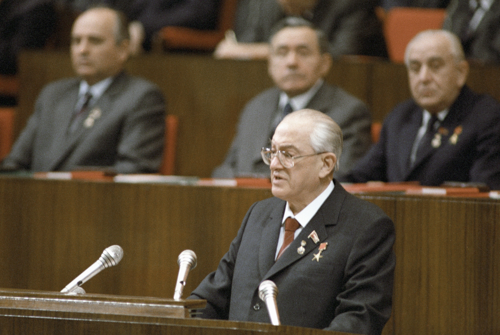

> **Первичный текст.** Справочник по межкультурному взаимодействию.
> Источник: `dotu.ru:9f42d6e3b57308a1.doc` sha256 `97540ede0a5b8ebb…`; [страница на dotu.ru](https://dotu.ru/books/handbook-of-intercultural-interaction/).
> Автоматическая транскрипция DOC→Markdown; смысл и формулировки не правились.
> Контрольные суммы и статус проверки — в [NOTICE.md](../../NOTICE.md).
> Содержание передаёт позицию авторов; утверждения не верифицированы библиотекой.

---

# Вместо предисловия

Возглавив КПСС[^3] и государственную власть СССР после не вполне понятной смерти Л.И. Брежнева 10.11.1082 г., Ю.В. Андропов, выступая на пленуме ЦК КПСС 15 июля 1983 г., заявил:

 «Стратегия партии в совершенствовании развитого социализма должна опираться на прочный марксистско-ленинский теоретический фундамент. Если говорить откровенно, мы ещё до сих пор не изучили в должной мере общества, в котором живём и трудимся, не полностью раскрыли присущие ему закономерности, особенно экономические. Поэтому порой вынуждены действовать, так сказать, эмпирически, весьма нерациональным методом проб и ошибок.

Наука, к сожалению, ещё не подсказала практике нужные, отвечающие принципам и условиям развитого социализма решения ряда важных проблем»[^4].

До этого он на протяжении 15 лет с 1967 по 1982 г. был председателем КГБ СССР, в 1982 г. (после смерти М.А. Суслова, 1902 — 1982) стал секретарём ЦК КПСС по идеологии, с 1962 по 1967 г. работал секретарём ЦК КПСС, в 1967 г. стал кандидатом в члены Политбюро ЦК КПСС, а с 1973 — полноправным членом Политбюро ЦК КПСС. Был депутатом Верховного Совета СССР 3-го и 6 — 10-го созывов. И вот, спустя 20 лет работы в СССР после возвращения из Венгрии и 15-летнего руководства КГБ при Совете министров СССР это откровенное признание — *«мы не изучили в должной мере общества, в котором живём и трудимся, не полностью раскрыли присущие ему закономерности (…) вынуждены действовать (…) весьма нерациональным методом проб и ошибок».*

Если соотнестись с тем перечнем задач, которые были возложены на КГБ, то после 15 лет руководства работой этого ведомства это признание Ю.В. Андропова — признание в его собственном полном служебном несоответствии — несоответствии должности председателя КГБ при Совете Министров СССР, поскольку именно КГБ (т.е. его сотрудники и руководители особенно) просто для выполнения формально возлагаемых на него задач должен был знать общество и присущие ему объективные закономерности лучше, чем какое бы то ни было другое ведомство СССР.

Сказать, что с тех пор произошли качественные изменения и государственная власть в России и её «спецведомства» наработали необходимую компетентность, — значит слукавить или впасть в самообольщение: затяжной социокультурный кризис, из которого страна не может выйти на протяжении всей постсоветской эпохи до настоящего времени (2021 г.), — безальтернативное выражение некомпетентности государственной власти в целом, её «спецведомств», их сотрудников, депутатов и госслужащих всех уровней. Поэтому **необходимо вырабатывать компетентность — профессиональную состоятельность на уровне более высоком, чем учили в спецвузах и на спецкурсах.**

\* \* \*

Афоризм историка В.О. Ключевского (1841 — 1911): *«Есть два рода дураков: одни не понимают того, что обязаны понимать все; другие понимают то, чего не должен понимать никто»*[^5]*.*

**Важная и насущная задача сотрудников компетентных органов — каждодневно работать на то, чтобы стать и быть успешным «дураком второго рода». По сути это — ключевая задача, открывающая возможности для успешного решения всех прочих задач**: в противном случае найдётся кто-то более компетентный, вследствие чего сотрудники и «компетентные органы» в целом, не желающие развивать «дурость второго рода», реально станут некомпетентными и не смогут обеспечить ни безопасность общества, ни безопасность государства, ни свою собственную персональную безопасность, поскольку в жизни человечества работает принцип *«каждый в меру понимания работает на себя, а в меру разницы в понимании — на тех, кто понимает больше»;* а некоторые из сотрудников при этом будут понапрасну рисковать жизнью — как своею собственной, так и своих коллег и близких.

Т.е. отказ от наращивания собственной меры понимания с целью обеспечения собственного превосходства в процессе неотвратимой реализации принципа *«каждый в меру понимания работает на себя, а в меру разницы в понимании — на понимающих больше»* ведёт к тому, что вы окажетесь под властью идиотов[^6] (как на службе, так и в повседневной жизни государства), и этими идиотами кто-то будет манипулировать.

Но в силу особенностей работы «компетентных органов» как во взаимодействии с обществом, так и в их внутренней специфике не всем и не всегда следует рассказывать о том, что знаешь и понимаешь, поскольку оглашение информации может быть:

- как управленческим актом, ведущим к реализации намеченных целей;

- так и потерей управления в большей или меньшей мере.[^7]

Понимание же включает в себя три компоненты: 1) осведомлённость о чём-либо как таковом, 2) осведомлённость о комплексе причинно-следственных связей этого «чего-либо» со всем прочим, *что известно,* 3) нравственно обусловленное личное отношение к этому «чему-то» и к комплексу связанных с ним причинно-следственных связей. В силу этого жизненно состоятельное миропонимание может быть выработано только самостоятельно, и не может быть получено в готовом к употреблению виде ни от учителей, ни от преподавателей, ни от осведомителей, ни от руководителей «в части вас, касающейся».

И то, что «компетентные» органы давно и на всех уровнях работают в режиме «в части, касающейся» каждого подразделения, каждого сотрудника, но никто из сотрудников, включая высшее руководство[^8], не знает общих проблем, целей и задач, — это одна из реальных угроз безопасности общества и государства, что подтверждается историей уничтожения СССР, на которое все сотрудники КГБ работали «в части, касающейся» каждого из них.

Однако кроме упомянутых В.О. Ключевским двух разновидностей дураков, есть ещё дураки третьего рода. **Дураки третьего рода — это «умники», которые убеждены в том, что их *реально ограниченные знания и не во всём адекватное миропонимание* достаточны для успешного выявления и разрешения всех проблем, с которыми они сталкиваются в жизни — как «по долгу службы», так и вне службы**[^9]**.** Т.е. дураки третьего рода убеждены в компетентноcти (как в своей собственной, так и системы в целом, а так же и её подразделений) и в том, что, заняв ту или иную более или менее высокую должность, они вместе с нею получили и «искру Божию» (хотя бы во временное пользование), и чем выше они поднимаются в иерархии должностей — тем ярче эта «искра Божия» разгорается в соответствии с принципом «я — начальник, ты — дурак; ты — начальник, я — дурак». Об отношении к самообразованию и учёбе властных дураков третьего рода высказался один из наиболее авторитетных экономистов[^10] Запада ХХ века Дж.М. Кейнс (1883 — 1946): *«Ничто правительство не ненавидит больше, чем быть хорошо информированным, так как это делает процесс выработки решений гораздо более сложным и трудным».* И это — один из факторов, который в кадровой политике обеспечивает формирование корпуса депутатов и чиновников из людей, которые в большинстве своём невежественны и необучаемы, в силу чего они неспособны осваивать новую информацию и пользоваться ею в постановке и решении управленческих задач.

**Излагаемое далее — не для дураков третьего рода, включая и тех из них, кто безумствует в интернете**.

В тексте встречаются повторы, отсылки к фрагментам как последующих, так и предшествующих разделов, в тексте много сносок, в том числе и больших по объёму. Это не является следствием «нелогичности» авторского повествования. Это выражение и следствие того, что жизненно состоятельные «картины мира» в психике людей представляют собой множество фактов (узлов), связанных друг с другом причинно-следственными связями, в силу чего «картина мира» представляет собой многомерную сеть причинно-следственных связей множества узловых фактов. По этой причине лексическое описание некоторой части того, что образуют жизненно состоятельные «картины мира», не может быть «нитью повествования», имеющей некое начало и некое завершение. Поэтому в адекватном представлении «сети» фактов и причинно-следственных взаимосвязей между ними через лексику в виде одной единственной «нити повествования» без повторов, отсылок к предшествующим и последующим фрагментам текста невозможно: будет утрачена адекватность либо задача *собрать правильно «сеть» из отрезков (нитей повествования)* будет возложена на читателя, и не каждый читатель справится с её решением самостоятельно.

——————————

Далее кое-где встречается матерщина: она содержится в цитируемых и приводимых материалах. Она не везде «запикана» либо «зачернена», не вырезана и не заменена какими-то иными выражениями по той причине, что в социологии не может быть запретных тем, и читатель должен воспринимать некоторые социальные явления в том виде, в каком они есть в жизни, а не изменённом виде, представленном в пересказе или в перепоказе (например, в видеосюжете), пропущенном через призму «политкорректности».

Также есть просьба. С теми материалами, на которые даются ссылки по ходу повествования, полезно ознакомиться, а некоторые из них — освоить. В противном случае, если Ваша осведомлённость недостаточна, то Вы не сможете воспринять некоторые смыслы в предлагаемом Вам тексте, и в конечном итоге он окажется для Вас пустословным и ни к чему не обязывающим, либо бездоказательно-вздорным, и потому Вы не сможете повысить свою дееспособность[^11], поскольку в основе роста дееспособности лежит освоение новых смыслов и трансформация знаний в практические навыки.

[^3]: КПСС официально — Коммунистическая партия Советского Союза, а по факту эта аббревиатура должна расшифровываться как «капитулянтская партия самоликвидации социализма» либо как «капитулянтская партия самоликвидации страны». Поскольку слова управляют матрично-эгрегориальными процессами (что это такое, можно понять из дальнейшего текста настоящей работы, хотя специального тематического раздела об этом нет: см. работу ВП СССР «Язык наш: как объективная данность и как культура речи»), то аббревиатуры в силу неоднозначности связываемого с ними смысла, сопутствия умолчаний оглашениям могут быть опасны для дела.

[^4]: <https://biblio.kz/m/articles/view/РЕЧЬ-ГЕНЕРАЛЬНОГО-СЕКРЕТАРЯ-ЦЕНТРАЛЬНОГО-КОМИТЕТА-КПСС-ТОВАРИЩА-Ю-В-АНДРОПОВА-НА-ПЛЕНУМЕ-ЦК-КПСС-15-ИЮНЯ-1983-ГОДА>. Обратим внимание на то, что это казахстанский сайт: в интернете России найти произведения Ю.В. Андропова проблемно или невозможно.

[^5]: В.О. Ключевский. Сочинения в 9 томах, т. 9, Москва, «Мысль», 1990 г., с. 368.

[^6]: Слова «идиот» и «дебил», и производные от них здесь и далее — не ругательства, а характеристики слабоумия в смысле, близком к тому, как эти термины понимается в медицине и педагогике.

[^7]: В жизни «компетентных» демонстрация осведомлённости и миропонимания «не по чину» и не перед «теми» должностными лицами не всегда способствует успеху в карьере, в лучшем случае; а в наиболее тяжёлых случаях один из способов сохранения тайн — устранение секретоносителей (как фактических, чья осведомлённость не соответствует их должностному положению, так и возомнивших о себе, а кроме того — «отработанных» сотрудников и агентов).

[^8]: На некоторые вопросы Ф.Д. Бобков — второй человек в иерархии должностных лиц КГБ — отвечал в личном общении «я к этому не допущен», и это не было уклончивым нежеланием отвечать на заданный вопрос по его существу.

[^9]: О дураках третьего рода А.П. Чехов: «Всё знают и всё понимают только дураки и шарлатаны».

[^10]: И хотя он был в авторитете, надо понимать, что кейнсианство, основанное на двух категориях («труд» и «капитал»), метрологически несостоятельно, поскольку и «труд», и «капитал» — это оценки, которые строятся на основе субъективизма при неопределённости объективных исходных данных и неопределённости алгоритмики переработки исходных данных в оценки. О метрологической состоятельности и оценках см. раздел 3.1 далее.

[^11]: В контексте настоящей работы термин «дееспособность» следует понимать не в принятом в юриспруденции смысле, а как способность индивида делать с приемлемым качеством то дело, за которое он берётся по своей инициативе, либо которое ему поручают или которое он вынужден делать под давлением потока событий.

    В принятом в юриспруденции понимании «дееспосо́бность — это способность распоряжаться своими правами и нести обязанности. Предполагает осознанность действий субъекта. Полная дееспособность наступает по достижении совершеннолетия». Такое понимание «дееспособности» не включает в себя личностных качеств и навыков, позволяющих либо не позволяющих делать то или иное дело и достигать намеченных результатов с приемлемым качеством.
---

[К произведению](README.md) · [Каталог](../../CATALOG.md)
