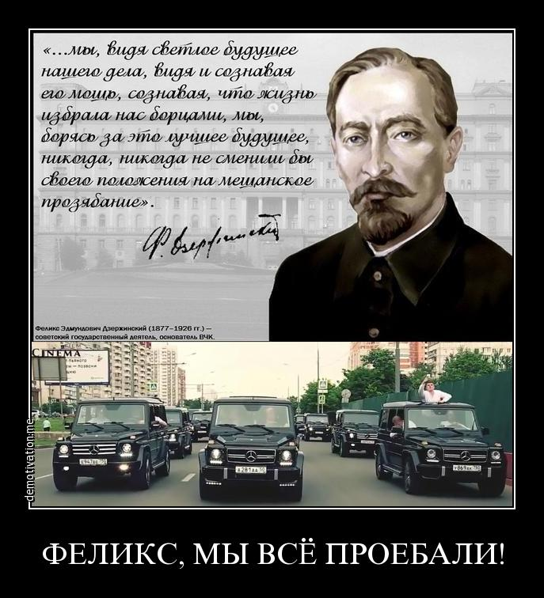

> **Первичный текст.** Справочник по межкультурному взаимодействию.
> Источник: `dotu.ru:9f42d6e3b57308a1.doc` sha256 `97540ede0a5b8ebb…`; [страница на dotu.ru](https://dotu.ru/books/handbook-of-intercultural-interaction/).
> Автоматическая транскрипция DOC→Markdown; смысл и формулировки не правились.
> Контрольные суммы и статус проверки — в [NOTICE.md](../../NOTICE.md).
> Содержание передаёт позицию авторов; утверждения не верифицированы библиотекой.

---

# 1. Неприятные темы

Одна из наиболее неприятных тем для отечественных «компетентных» — это обсуждение вопросов: почему спецслужбы Российской империи в конце XIX — начале ХХ веков не смогли предотвратить крах империи и гражданскую войну? почему спецслужбы СССР (КГБ и ГРУ, а также отчасти и МВД) не смогли предотвратить крах СССР? и если они что-то делали для профилактирования этих государственных катастроф, то почему их действия оказались безрезультатными? Отговорки в стиле *«не будь на то Господня воля, не о́тдали б Москвы…»*[^12] не могут быть приняты, по следующим причинам:

- Ещё в XIX веке А.К. Толстой написал: *«Одарив весьма обильно / Нашу землю, Царь Небесный / Быть богатою и сильной / Повелел ей повсеместно. / Но чтоб падали селенья, / Чтобы нивы пустовали — / Нам на то благословенье / Царь Небесный дал едва ли!»*[^13]*.*

- Директива Совета национальной безопасности США 20/1 от 18.08.1948 г. «Цели США в отношении России»[^14] (пресловутый «план Даллеса»), предусматривавшая ликвидацию Советской власти и социализма, расчленение СССР, ликвидацию его экономической и военной мощи, создание условий, автоматически обеспечивающих зависимость постсоветских государств от Запада, — реализована была полностью к концу ХХ века[^15]. Причём в СССР выдержки из неё были опубликованы в книге «ЦРУ против СССР»[^16], совокупный тираж которой составил около 20 млн. экземпляров. Её автор Н.Н. Яковлев (1927 — 1996) был в общении с председателем КГБ Ю.В. Андроповым (1914 — 1984) и его замом Ф.Д. Бобковым (1925 — 2019). Спрашивается: *если всё знали, то почему ничего не сделали для того, чтобы предотвратить гибель страны?*

<!-- -->

- И кроме того, Россия — страна, в которой скрыть антигосударственный заговор невозможно: нравственность и психология общества таковы, что сами участники антигосударственного заговора либо донесут «компетентным органам», чтобы «усидеть на двух стульях», либо разболтают, чтобы показать свою значимость в кругу друзей и близких, из числа которых кто-то обязательно донесёт или также разболтает[^17] (это одно из жизненных выражений афоризма: В России всё секрет, но ничто не тайна[^18]).

И пока что «чекисты» не отчитались перед народами СССР о том, как они соучаствовали в развале страны в полном соответствии с Директивой СНБ США 20/1 от 18.08.1948 г., попустительствовали этому, и *как спецслужбы Запада и их периферия в СССР уделали КГБ, в результате чего СССР рухнул **как бы** сам собой*. Но эта тема не изучается и контрразведкой и не освещается в процессе подготовки новых поколений сотрудников.

В связи с этим «СССР рухнул как бы сам собой» следует напомнить о том, что после убийства И.В. Сталина и Л.П. Берии была осуществлена стратегическая системная диверсия, результатом которой стало прекращение контрразведывательной деятельности советских спецслужб в среде партийной номенклатуры. Так, по личному распоряжению Н.С. Хрущева был установлен категорический запрет на контрразведывательный контроль за руководящими работниками КПСС. Тогдашний председатель КГБ СССР И.А. Серов, верный друг и соратник Н.С. Хрущева, неуклонно реализовывал это предательское распоряжение. Более того, в начале 70-х годов «кумир чекистов» председатель КГБ СССР Ю.В. Андропов внёс предложения в Политбюро ЦК КПСС о прекращении даже разовых специальных проверок в отношении работников, представляемых на повышение, начиная от уровня члена областного комитета КПСС.[^19] Всё это было системно реализовано и открыло возможности для беспрепятственной вербовки аппаратчиков КПСС нашими врагами с целью их последующего продвижения на более высокие посты в системе партийной и государственной власти СССР. Фактически запрет на оперативную разработку партноменклатуры (контрразведывательное обеспечение руководящей деятельности ЦК КПСС) гарантировал неизбежную утрату суверенитета, крах и развал Советского Союза. Предполагать, что Н.С. Хрущёв и Ю.В. Андропов не предвидели последствий этих запретов, не представляется возможным, вне зависимости от того, как они обосновывали необходимость введения такого рода запрета.

*[В оригинальном издании здесь расположен рисунок/схема. Иллюстрация не включена в данный выпуск: ожидает визуальной и правовой проверки. Файл источника: image4.jpeg]*И поскольку в стране не все идиоты, чтобы верить *в святость системы* «компетентных органов», то на сентенцию Сергея Довлатова «*Мы без конца ругаем товарища Сталина, и, разумеется, за дело. И всё же я хочу спросить — кто написал четыре миллиона доносов?»* в интернете были возражения в смысле: **«Я бы написал: есть о чём, да некому…»** (одно из них на демотиваторе слева). Т.е. «компетентные органы» утратили доверие наиболее умной части патриотов. В таких условиях заявления в «компетентные органы» будут подавать наивные патриоты, которым в будущем предстоит разочароваться в «компетентных органах», психически больные люди, а также те, для кого написать заведомо ложный донос (ст. 306 УК РФ[^20]) — способ свести личные счёты с кем-то или решить какие-то иные свои проблемы, а нравственно порочные сотрудники «компетентных органов» (как руководители, так и подчинённые) и «невольники системы» — со своей стороны — будут иметь право использовать такую информацию для проведения предусмотренных Федеральным законом «Об оперативно-розыскной деятельности» от 12.08.1995 №144 ФЗ оперативно-розыскных мероприятий, осуществляемых как в целях улучшения показателей служебной деятельности во всех направлениях, так и в целях удовлетворения своих «негосударственных» запросов, включая коррупционные. Такой стиль работы сотрудников «компетентных органов» — соучастие в преступлениях, предусмотренных ст. 306 УК РФ, а также и состав ст. 275 УК РФ, поскольку они действуют не как частные лица, а от имени Российской Федерации.

И соответственно в наши дни снова воспроизведены те взаимоотношения той части общества, которая обеспокоена проблемами страны и их разрешением — с одной стороны, и с другой стороны — спецслужб, которые согласно официальной позиции созданы для того, чтобы профилактировать проблемы и содействовать их разрешению, о которых писал М.Е. Салтыков-Щедрин: *«Нигилист*[^21] *— это, во-первых, человек, который почему-либо считает себя неудовлетворенным, во-вторых, это человек, который любит отечество по-своему, и которого капитан-исправник*[^22] *хочет заставить любить это же отечество по-своему»*. Т.е. это вопрос о сути патриотизма как объективного явления и как выражения субъективизма «нигилиста» и «капитана-исправника» в понимании и в делании патриотизма.

И «гимн спецслужб» Дениса Майданова «Поколение чести»[^23] — не гарантия, что «компетентные органы» постсоветской РФ реально более дееспособны, чем «Охранка» и КГБ в прошлом в деле защиты безопасности Отечества, и потому благое будущее страны гарантировано *действительно* *компетентными* органами ныне; этот гимн — удовлетворение желания «попонтоваться», но в более широком кругу и в менее вызывающим недовольство непричастных к службе в «компетентных органах» образом, нежели пробег по Москве выпускников Академии ФСБ на Гелендвагенах в 2016 г.[^24]

Работа в компетентных органах на благо России и человечества в целом и даже само́ желание «попонтоваться», не говоря уж о его реализации, — должны быть несовместимы. В качестве жизненного девиза *действительно компетентных органов* более уместны слова героя Кавказкой войны генерала Павла Христофоровича Грабе (1789 — 1875) «Да возвеличится Россия, и сгинут наши имена» (1846 г.)[^25]; либо в версии Н.К. Рериха «Великие дела совершаются без шума, они скромно творятся на пользу человечества». Однако это не свойственно основной статистической массе «чекистов», а желание «попонтоваться» неизбежно обнажает свою суть — желание обогатиться. И потому не получила должного освещения и не изучается в «спецвузах» и тема постсоветских времён — соучастие «чекистов» в приватизации в своекорыстных интересах советского наследства и расчистка ими путей для иностранных «инвесторов» для приобретения ими в собственность разнородных ресурсов России (т.е. торговля Родиной и соучастие в лишении её экономического суверенитета), в чём «чекисты» в постсоветские времена приняли посильное участие.

И пример успеха «чекистов»-карьеристов:

«Бизнесмен **Евгений Лебедев** — сын бывшего сотрудника КГБ СССР и банкира **Александра Лебедева**, получил от британской королевы титул барона Сибирского.

«Королева была рада жалованной грамотой, скрепленной Большой государственной печатью, присвоить пожизненный титул барона Соединенного Королевства **Евгению Александровичу Лебедеву** под именем барона Лебедева из Хэмптона в лондонском районе Ричмонд-на-Темзе и Сибири в Российской Федерации», — говорится в официальном издании британского правительства.

Лебедев станет первым пэром из России и войдет в число пожизненных членов Палаты лордов британского парламента. (…)

Выступая вскоре после получения титула, Евгений Лебедев заявил, что испытывает «большую гордость» за то, что стал первым пэром из России"»[^26].

Только не надо говорить, что это часть операции «Проникновение *наших людей* в их власть».

Проникновение своих людей в системы геополитических противников и конкурентов, пусть даже успешное, — это тактика, а внедрение своих Идей в другие культурно своеобразные общества — это стратегия. И в этом у КГБ-ФСБ успехов нет и, к сожалению, не предвидится при сохранении в дальнейшем исторически сложившихся качеств системы — потому, что за душой у руководства ФСБ нет Идей глобальной судьбоносности, которые были бы притягательны для граждан зарубежных государств...[^27] Это и отличает КГБ хрущёвско-брежневских-горбачёвских времён и постсоветские «компетентные органы» от ВЧК времён Ф.Э. Дзержинского.

Поэтому успех Лебедевых, в любом смысле слова «успех» — в русле анекдота:

Генералу КГБ докладывают о внедрении разведчика в США: Операция прошла удачно, если не считать маленькой непонятной детали.

— Доложите подробно.

— Агента начали готовить несколько лет назад. По легенде, молодой человек получил наследство в Соединённых Штатах и хочет выехать туда. Через швейцарский банк перевели заранее в Штаты 50 миллионов долларов и легализовали их. Агент несколько месяцев, как это принято, добивался разрешения на выезд. Чтобы не вызвать подозрений, как все стоял в очередях в ОВИР, собирал справки, был исключён из комсомола, его родителей уволили с работы. В конце концов визу он получил и, простояв месяц за авиабилетом, вчера вылетел в США.

— А что за непонятная деталь?

— Когда он поднимался по трапу в самолёт, он обернулся и как-то странно нам улыбнулся…

2. Мир, в котором мы живём и частью которого являемся сами, отличается от того, каким он описан в учебниках,\

по которым все мы учились в школах, в вузах и в «спецвузах»

=============================================================================================================

Соответственно, в настоящем разделе речь пойдёт о том, о чём учебники в силу разных причин умалчивают или дают ложное, извращённое представление, либо уходят от темы в пустословие и демагогию[^28].

Прежде всего, **глобализация по своей сути — это гибридная война за установление безраздельного мирового господства**. Но это утверждение нуждается в пояснениях.

[^12]: М.Ю. Лермонтов, стихотворение «Бородино».

[^13]: Это ответ А.К. Толстого Ф.И. Тютчеву на его стихотворение: *Эти бедные селенья, / Эта скудная природа — / Край родной долготерпенья, / Край ты русского народа. // Не поймёт и не заметит / Гордый взор иноплеменный, / Что сквозит и тайно светит / В наготе твоей смиренной. // Удручённый ношей крестной / Всю тебя земля родная / В рабском виде Царь Небесный / Исходил, благословляя*.

[^14]: Директива СНБ США 20/1 от 18.08.1948 г. опубликована на сайте: <http://www.sakva.ru/Nick/NSC_20_1R.html>.

[^15]: И как сообщается в книге А. Шевякин «КГБ против СССР. 17 мгновений измены», это было проделано при деятельном соучастии КГБ.

[^16]: Первое издание вышло в свет в 1979 г. «Википедия» эту книгу характеризует как полную заведомо недостоверных сведений, которыми завербованного лично Ю.В. Андроповым Н.Н. Яковлева снабжал зам. Ю.В. Андропова Ф.Д. Бобков.

[^17]: На тему осведомлённости спецслужб империи о конспиративной деятельности много и ныне актуального в книге: А.И. Спиридович. Записки жандарма. — Харьков: изд. «Пролетарий». 1928. (Одна из интернет-публикаций: <http://www.hist.msu.ru/ER/Etext/gendarme.htm>).

[^18]: Баронесса Анна-Луиза Жермена де Сталь (1766 — 1817) — французская писательница.

[^19]: См.: Панарин И. Первая мировая информационная война. Развал СССР. — СПб: Питер, 2010. — С. 178 — 179.

    Директор ФСБ России А. Бортников: «Пришедшая к власти команда реформаторов во главе с М. Горбачевым, несмотря на провозглашение «Перестройки», открытости и гласности, **сохранила запрет на оперативную разработку представителей партийной элиты**» (выделено жирным нами при цитировании) — URL: [Выступление руководства :: Федеральная Служба Безопасности ( Выступление руководства ) (fsb.ru)](http://www.fsb.ru/fsb/comment/rukov/single.htm%21id%3D10438230%40fsbAppearance.html) и другие источники.

[^20]: Так же отметим, что после того, как Л.П. Берия возглавил НКВД СССР, многие авторы заведомо ложных доносов стали «безвинными жертвами сталинских репрессий», что подтверждалось архивными материалами советской эпохи.

[^21]: Нигилисты тех лет — оппозиция царизму в широком спектре идей — от либералов-реформаторов до революционеров и анархистов разного толка.

[^22]: Если проводить параллели с нашими днями, то «капитан-исправник» — глава корпуса жандармов в губернии, т.е. эквивалент начальника областного (краевого) Управления ФСБ.

[^23]: <https://www.youtube.com/watch?v=xJHu2caMvp4>.

[^24]: «… в кортеже было около 30 иномарок. По информации источника журналистов, 2 — 3 человека арендовали по машине на 3 часа. Стоимость одной иномарки за час аренды составляет 1,5 тысячи за человека в час» (<https://www.youtube.com/watch?v=8TkLbRUZ4QA>). Т.е. «гелики» — не свои, ребята «понтовались» на арендованных машинах: им было важнее казаться, производить ложное впечатление, а не быть.

    И пара из комментариев к этому видео:

    1\. «Слов нет. Моя мать получает пенсию 7.5 т.р.… а на этих скотов, живущих за счёт бюджета, деньги находятся… достойные зарплаты, дают жильё (за которое мне ипотеку 10 лет платить). Сидите скромно, но нет: понты дороже всего… Сомневаюсь, что эти мажоры сложат головы за Родину: они и шли в госструктуры, чтобы и дальше набивать свои карманы за счёт нас с вами… Надо менять систему, чтоб не только мажор с большими деньгами и родственными связями, но и толковый парень без связей мог попасть на госслужбу… а эти ребята и дальше будут плодить коррупцию в нашей стране. С такими запросами жить на одну зарплату они не будут».

    2\. Надо наоборот всех мажоров на х… от таких контор подальше посылать. Папа-мама в конторе — иди на завод, пусть "династия" отдохнёт чуток от кумовства.

    «Автопробег обошелся в 250 — 300 тысяч рублей. Такую оценку привели в фирме, к которой обращались участники автопробега, но о стоимости они так и не договорились. По словам сотрудника этой компании, машины взяли в разных прокатах (по его выражению, «скребли по сусекам»). В то же время участник автопробега Всеволод рассказал, что за рулем «Гелендвагенов» были старые выпускники Академии ФСБ. По словам Всеволода, «Гелендвагены» — это «шефская помощь молодому поколению. (…)

    **В Кремле заявили, что автопробег «Гелендвагенов» не имеет к нему никакого отношения.** По словам пресс-секретаря президента Дмитрия Пескова, он не докладывал об этом своему начальнику. «В любом случае я не считаю, что есть какой-то повод для комментария из Кремля, — сказал Песков. — Здесь есть, безусловно, административный аспект, и это органам ГИБДД разбираться, имели ли место какие-то нарушения или нет. И есть морально-этический аспект — и здесь, наверное, руководству высшего учебного заведения разбираться, имели ли место здесь какие-то факты несоответствия или не имели» (<https://meduza.io/feature/2016/07/04/avtoprobeg-vypusknikov-akademii-fsb-na-gelendvagenah-korotko>). Так и Д.С. Песков внёс вклад в подрыв авторитета государственной власти, поскольку из этих слов понятно, что гос. власть не желает пресекать этот антиобщественный стиль поведения своих спецслужбистов…

    Пройдёт ли у участников понтового заезда свойственная в подростковом возрасте многим нашим соотечественникам стадно-стайная обезьянья дурость с возрастом или же нет, покажет будущее…

[^25]: <http://chitaem-vmeste.ru/reviews/articles/da-vozvelichitsya-rossiya-da-sginut-nashi>.

[^26]: <https://bazaistoria.ru/blog/43679815119/Eks-chekistyi-ushli-v-bankiryi-a-ih-deti-stali-baronami-?&utm_referrer=mirtesen.ru>.

    Двусмысленные формулировки «барон Сибирский» и «барон Лебедев из Хэмптона в лондонском районе Ричмонд-на-Темзе и Сибири в Российской Федерации» допускают истолкование в том смысле, что Россия де-факто не суверенна, коли британская королева раздаёт такого рода титулы, топонимически связанные с территорией другого де-юре суверенного государства.

    Заявление Е.А. Лебедева о том, что он испытывает большую гордость в связи с тем, что стал первым пэром из России, тоже подразумевает, что Российская Федерация уже давно часть «Британского содружества наций» и вместе со своими ресурсами принадлежит хозяевам и заправилам «британского» мира.

    Так же обратим внимание и на то, что в русскоязычном интернете британской королевской семье на протяжении многих лет уделяется внимания гораздо больше, чем какой-либо другой зарубежной теме, будто Виндзоры — правящая династия России. *А чем заняты наши «диванные войска» как в русскоязычном сегменте интернета, так и в иноязычных?* (см. Отступление от темы 6: Про «диванные войска» — том 2).

[^27]: Об этом далее см. раздел 12 (том 2).

[^28]: Членораздельная речь может выполнять четыре функции: 1) выражать мысли, 2) скрывать мысли, 3) *скрывать отсутствие мыслей и* 4) *скрывать неспособность чувствовать и мыслить*. Выделенное курсивом — пустословие, демагогия.

    Но предназначена членораздельная речь не для пустословия и не столько для выражения мыслей, а прежде всего для того, чтобы творить «магию», т.е. обеспечивать течение событий в режиме «как сказал — так и будет», а это требует понимания себя, определённой личностной культуры чувств и навыка самообладания.
---

[К произведению](README.md) · [Каталог](../../CATALOG.md)
