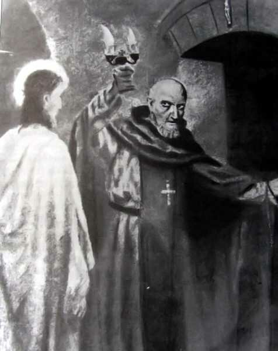
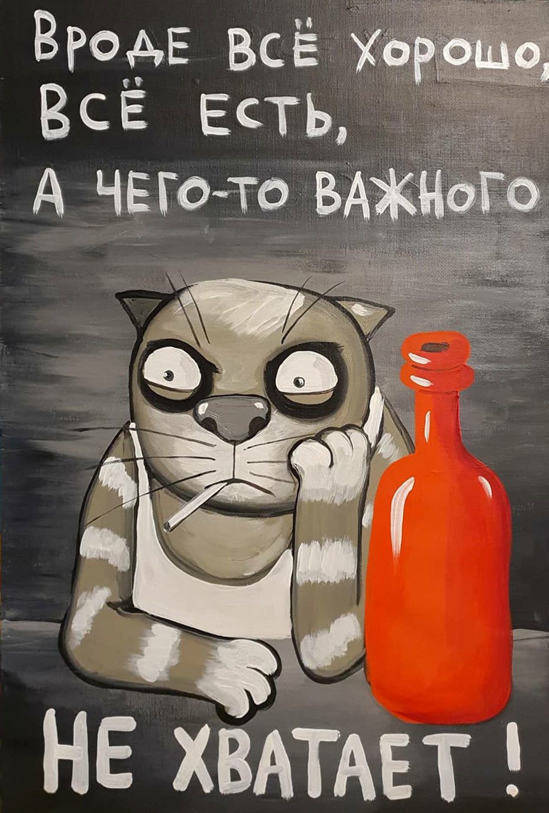

> **Первичный текст.** Справочник по межкультурному взаимодействию.
> Источник: `dotu.ru:9f42d6e3b57308a1.doc` sha256 `97540ede0a5b8ebb…`; [страница на dotu.ru](https://dotu.ru/books/handbook-of-intercultural-interaction/).
> Автоматическая транскрипция DOC→Markdown; смысл и формулировки не правились.
> Контрольные суммы и статус проверки — в [NOTICE.md](../../NOTICE.md).
> Содержание передаёт позицию авторов; утверждения не верифицированы библиотекой.

---

## 4.1. Циклика Русской истории

Если коротко об истории России как о выражении в действии психодинамики общества, то алгоритмика психодинамики общества на Руси — в России порождает цикличность течения нашей истории. Полный цикл включает в себя две фазы.

- Началом первой фазы становится завершение катастрофы, которой оканчивается предыдущий полный цикл. **Сутью первой фазы является попытка построения общенародного государства.** Однако в первой фазе возникает «элита», которая убеждена в том, что её представители лучше, чем простонародье, и потому имеют право на вседозволенность и в отношении простонародья в целом, и в отношении его представителей персонально: это — сатанизм[^142]. С точки зрения «элитариев» простонародье и каждый его представитель персонально обязаны политику «элиты» и действия любого её представителя воспринимать как должное и терпеть всё безропотно. «Элите» с такими свойственными ей нравственностью и этикой общенародное государство — помеха. Поэтому «элита» организует государственный переворот, которым завершается первая фаза полного цикла истории. И этот же государственный переворот даёт начало второй фазе полного цикла.

- **Во второй фазе «элита» начинает строить своё — «элитарно»-корпоративное — государство.** Она проводит кадровую политику на нравственно-этических принципах родоплеменного строя.

<!-- -->

- Т.е. если индивид принадлежит к «элитарному» клану по факту рождения в нём или «усыновления / удочерения» им, то он имеет право на занятие должностей, ведение и «крышевание» бизнеса — соответственно тому иерархическому статусу, которым обладает данный клан. Личностные качества, профессиональные знания и навыки — никакого значения не имеют: знать дело и делать дело — это обязанность ниже стоящих в иерархии, и прежде всего — простолюдинов.

- Если же индивид не принадлежит клану, обладающему соответствующим иерархическим статусом, то он не вправе занимать должности, вести бизнес, какими бы высокими личностными и профессиональными качествами он ни обладал бы. Он должен самоотверженно «ишачить» на «элитарного» барина за просто так, безропотно довольствуясь тем, что ему предложат с «барского плеча». Он может быть востребован и приобщён к «элите» постоянно или на некоторое время только тогда, когда катастрофа большего или меньшего масштаба готова разразиться или уже разразилась и до кого-то из «элитариев» доходит, что без его профессионализма этот «элитарий» (или «элита» в целом) не сможет сохранить свой социальный статус.

> Благодаря такой кадровой политике в государственной и экономической власти на должностях, где подпись и слово придают властную силу решениям, выработанным аппаратом, сосредотачиваются некомпетентные и слабоумные — фиктивно трудоспособные — «элитарии»[^143], которые ведут страну к катастрофе, завершающей вторую фазу и полный цикл алгоритмики психодинамики нашего общества.

Тот цикл истории, в котором мы живём, начался в 1917 г. установлением Советской власти, претендовавшей на то, чтобы стать властью общенародной. К концу 1930‑х гг. возникла новая «элита», которой социализм и Советская власть были помехой. «Элита», культурно сотрудничая со спецслужбами и политическими мафиозными группировками Запада[^144], стала орудием исполнения Директивы Совета национальной безопасности США 20/1 от 18.08.1948 г. «Цели США в отношении России» и осуществила ползучий государственный переворот, продолжавшийся 40 лет: начало ему положило убийство в 1953 г.И.В. Сталина и Л.П. Берии и последующая зачистка государственного и партийного аппарата от большевиков-сталинцев, и который завершился принятием конституции РФ 1993 г., узаконившей отказ от суверенитета[^145], т.е. системную подчинённость по факту государственной и финансово-экономической власти зарубежным и транснациональным политическим субъектам[^146]; реставрацию капитализма в его либерально-рыночной, по сути, колониальной версии.

Сейчас (после убийства И.В. Сталина, давшего в 1953 г. старт медленному госперевороту, завершившемуся в 1993 г. принятием конституции постсоветской РФ) течёт вторая фаза полного цикла, в которой «элитарно»-корпоративная государственность — вследствие преобладания на управленческих должностях фиктивно трудоспособных «элитариев» и непрестанно генерируемого ими снижения качества управления — ведёт страну к очередной катастрофе. Если ничего не делать (в смысле выявления и разрешения проблем общественного развития), то катастрофа неизбежно разразится: именно так царизм привёл страну к катастрофе 1917 г., хотя в 1913 г. большинство было убеждено в стабильности режима[^147]. И в наши дни не надо самообольщаться: никакого «народного единства» в постсоветской России нет, и «день народного единства» 4 ноября — пустая фикция, а не общенародный праздник, как и «день России» 12 июня — день победы заправил Запада в «холодной войне» против СССР.

Профилактировать катастрофу путём подавления распространяющегося в обществе недовольства людей не только качеством их собственной жизни, но и недовольства бесперспективностью жизни в стране для их детей и внуков запугиванием и силовыми методами (6‑й приоритет обобщённых средств управления / оружия), как показывает историческая практика разных стран, — не удаётся. В этой связи ещё раз вспоминаем М.Е. Салтыкова-Щедрина: *«Нигилист — это человек, который любит отечество по-своему, и которого капитан-исправник хочет заставить любить это же отечество по-своему. **И вот этого-то человека избирают предметом внутренней политики**».* — Выделенное в цитате жирным касается внутренней политики, которая обречена на неудачу, поскольку проблемы надо выявлять и разрешать.

Репрессии могут быть более или менее эффективным инструментом внутренней политики только, когда имеется широкая поддержка политики государства представителями всех слоёв населения, живущих заработной платой или предпринимательским доходом, а не данью в их карманы, *мошенничествами разного рода, включая и должностные оклады, многократно превосходящие минимальный заработок и пенсии большинства пенсионеров, на которые жить невозможно*.

Но главное в обеспечении безопасности общества и государства — не репрессии (6‑й приоритет обобщённых средств управления), а концепция управления осуществлением идеалов развития и действия в преемственности поколений по её осуществлению и совершенствованию на 5‑м — 1‑м приоритетах обобщённых средств управления / оружия.

И соответственно для этого требуется:

- чувственно-интеллектуальный суверенитет как средство создания научно-методологического обеспечения государственного управления и управления в народном хозяйстве;

> Чувственно-интеллектуальный суверенитет — самостоятельное восприятие действительности посредством своих чувств, включая чувство меры и интуицию (а не опосредованно — через сообщения СМИ, тексты и прочие произведения, выражающие мнения других людей) и самостоятельное осмысление воспринятого и памятного.

- само́ научно-методологическое обеспечение государственного управления и управления в народном хозяйстве, которое должно быть метрологически и управленчески состоятельным;

- продвижение научно-методологического обеспечения государственного управления и управления в народном хозяйстве в систему всеобщего и профессионального образования;

- суверенная кадровая политика (см. сноску 23 в разделе 3.2 и далее гл. 9 в томе 2), отличная от предлагаемой в проекте «Стратегии инновационного развития Российской Федерации на период до 2020 года» «Инновационная Россия — 2020», опубликованном Минэкономразвития в 2010 г.[^148]

- государственное управление и управление в народном хозяйстве на основе этого концептуально своеобразного научно-методологического обеспечения в его непрестанном совершенствовании.

Описанную выше циклику Русской истории порождает алгоритмика психодинамики общества, а в ней выражается нравственно обусловленное миропонимание людей. Поэтому, для того, чтобы избежать очередной катастрофы, к которой неизбежно ведёт «элитарно»-корпоративная постсоветская государственность, необходимо выявить мировоззренческие основы, на которых строятся общественно-государственные взаимоотношения в нашей региональной цивилизации. **А выявив их, необходимо самоотверженно целенаправленно работать на то, чтобы *точка вызревшей катастрофы в матрице возможностей* была удалена в будущее достаточно далеко, чтобы к моменту прихода общества в неё было кому придать социальной системе необходимую направленность развития и тем самым избежать катастрофы.**

4.2. Мировоззренческие основы алгоритмики психодинамики общества,\

порождающей именно эту циклику истории

------------------------------------------------------------------

Начнём с анализа построения и функционирования государственности. В управленческом осмыслении политики и истории интерес представляет то, как специализированы органы государственной власти (т.е. какие функции возложены на каждый из них) и как они связаны друг с другом, поскольку их функциональная специализация и взаимосвязи определяют, способна ли архитектура государственности нести полную функцию управления либо же нет. Обратимся к истории, и посмотрим на архитектуру государственности Египта эпохи фараонов — см. рис. ниже.

*[В оригинальном издании здесь расположен рисунок/схема. Иллюстрация не включена в данный выпуск: ожидает визуальной и правовой проверки. Файл источника: image23.jpeg]*Высшее жречество Египта было представлено двумя группами по 10 человек во главе с верховным — 11-м — жрецом в каждой группе. Одна группа называлась «десятка севера», другая — «десятка юга». Высшее жречество в целом именовалась «иерофанты». Смысл этого названия — читающие судьбу или знающие будущее[^149]. Им был подчинён «Дом жизни» — высшее научно-исследовательское учреждение страны, по первому требованию которого из любого района Египта доставлялось всё необходимое, и выполнялись любые работы в пределах экономических возможностей страны.

Должно быть понятно, что если продолжительность той эпохи в истории древнего Египта больше, чем продолжительность письменной истории Руси в послекрещенские времена, то это показатель того, что «Дом жизни» дурью не маялся и не разорял страну, выдавая заказы на работы, назначение которых — развеять скуку[^150] и создать разорительную для страны роскошную жизнь «элиты».

Если рассматривать функциональность и проводить параллели с современностью, то «Дом жизни» древнего Египта это — КГБ и АН СССР в одном лице, чего не было в СССР, и аналогов чему нет в постсоветской России ни формально, ни по существу: **ни РАН, ни ФСБ и ГРУ мировоззренчески до этого качества не доросли, как не доросла до этого и администрация главы государства**. Но это же касается и других государств.

Если соотноситься с полной функцией управления, то именно эти две группы иерофантов несли на себе её первые этапы: выявление проблем, целеполагание в отношении их разрешения и неотделимую от целеполагания функцию прогностики — «предикции» — предсказания будущего. На представленной выше схеме обе группы высшего жречества в соответствии с этой функциональной нагрузкой, несомой ими в интеллектуальной версии схемы управления «предиктор-корректор»[^151], обозначены блоками «Предиктор 1» и «Предиктор 2».

Наличие двух групп иерофантов и их первоиерархов, программировало ситуации, в которых мнения по одним и тем же вопросам, выработанные в обеих группах, могли быть взаимоисключающими. Поскольку количество участников обеих групп было чётным, а первоиерархи каждой из групп были равноправны, то были неизбежны ситуации, в которых решение не могло быть принято методом голосования, поскольку голоса могли распределиться поровну. *Такая структура была создана целенаправленно для того, чтобы не попасть под власть соблазна принимать решения большинством голосов и тем самым исключить принятие ошибочного решения большинством голосов.* Дело в том, что если люди владеют эффективной личностной познавательно-творческой культурой (см. далее разделы 6.2 и 6.3), то в ситуациях расхождения во мнениях они способны выявить причины расхождения во мнениях и выработать лучшее мнение, свободное от ошибок исходных мнений.

Соответственно, владея достаточно эффективной личностной познавательно-творческой культурой (это — квалификационное требование наряду с профессионализмом в нескольких сферах жизни общества для вхождения в систему), участники обеих групп иерофантов на основе специфических психолого-этических практик, отрицающих персональные авторские права (один из «краеугольных камней» современной культуры), могли вскрыть ошибки субъективизма, выразившиеся в расхождении во мнениях по одному и тому же вопросу, и, освободившись от них, выработать некоторое новое мнение — лучшее, чем исходные мнения. На это указывает и поговорка «ум хорошо, а два лучше». Это можно назвать «тандемный принцип деятельности», и на схеме выше такая процедура преодоления разногласий и выработки взаимно приемлемого нового мнения обозначена кругом с надписью «Тандем».

*Любое управленческое решение может быть выработано либо единолично, либо коллективно.* **Но при воплощении его в жизнь координатор работ, несущий всю полноту ответственности за ход работ и их результаты, может быть только один единственный.**

Если принцип единоначалия в координации работ не реализуется, то вступает в действие алгоритмика разрушения управления, на которую указывает всем известная поговорка «у семи нянек — дитя без глазу».

В процессе реализации полной функции управления Египтом таким единоличным координатором работ был фараон. С одной стороны он был полностью ответственен перед высшим жречеством и сам имел достаточно высокое жреческое посвящение, которое обеспечивало согласованность его миропонимания с миропониманием иерофантов, а с другой стороны он был главой государственности и руководил работой государственного аппарата, который правил Египтом. При этом толпо-«элитарная» традиция, которую в Египте сформировало и поддерживало жречество, деградировавшее в знахарство[^152], представляла толпе фараона верховным властителем, воплотившимся божеством, а жрецов-знахарей представляло его «верными слугами», вопреки реальным взаимоотношениям жреческо-знахарской и царской власти в процессе реализации полной функции управления[^153].

Представленная выше схема в соотнесении её с полной функцией управления показывает, что архитектура государственности Египта времён фараонов несла полную функцию управления, и все этапы полной функции осуществлялись на профессиональной основе. Стрелки на ней обозначают прямые связи (отдание команд) и обратные связи (доклады об исполнении команд и о состоянии дел).

Совокупность тех видов деятельности, которыми были заняты иерофанты, можно назвать концептуальной властью, поскольку именно они вырабатывали концепцию управления Египтом как совокупность целей, путей и средств достижения целей.

Однако между высшим жречеством и основной массой населения Египта, включая и «элиту», чьи представители были заняты в государственном аппарате, лежала мировоззренческая пропасть, к тому же целенаправленно поддерживаемая всей системой жреческих посвящений, т.е. системой подготовки кадров новых поколений иерархов жречества-знахарства, которая качественно отличалась от той системы образования, что была доступна всем прочим.

Поэтому для того, чтобы концепция управления могла быть реализована, её было необходимо трансформировать в образы и понятия, которые были бы свойственны и понятны основной массе населения, мировоззренчески и миропонятийно отличного от высшего жречества. Эту задачу решала идеологическая власть, которая в древнем Египте тоже осуществлялась жречеством, поддерживавшим религиозный культ и толковавшим политику и течение событий в смысле осуществления «воли богов»[^154]. И только после того, как концепция управления находила своё идеологическое выражение в приемлемой для общества форме[^155], начиналась реализация концепции управления в практической политике и осуществлялись действия, которые впоследствии были отнесены к компетенции законодательной, исполнительной и судебной власти.

Если представленную выше схему правления Египтом во времена фараонов рассматривать как функциональную схему, то в Российской империи блоки «Предиктор 1», «Предиктор 2», «Тандем» — отсутствовали, а их функции по умолчанию возлагались на царя, которому в этой схеме соответствует блок «Фараон». Но поскольку эти функции возлагались на царя по умолчанию, то они осуществлялись в меру их понимания и ощущения всей их совокупности тем или иным государем персонально. Вследствие отсутствия в культуре страны соответствующего *научно-методологического обеспечения —* *теории социального управления, адекватно описывающей полную функцию управления в отношении биосферно-социально-экономических систем*, — мера профессионализма, с которой разные цари осуществляли самодержавие, была различна, а передача навыков осуществления самодержавия в преемственности поколений от царя (императора) к наследнику — негарантированной.

Собственно в этом (в необходимости нести полную функцию управления) и есть тот вызов истории, на который не способна ответить государственность типа «Российская империя», в которой носителем самодержавной власти может быть только царь, а все прочие должны быть не более, чем верноподданными, а претендовать на **жреческую власть, которая в полной функции управления выше царской**[^156], — преступление (неверноподданность, неблагонадёжность, свободомыслие или вольнодумство[^157])[^158].

Но и представительная демократия по типу государств Запада, будь она в форме «президентской» либо «парламентской» республики, тоже не способна нести полную функцию управления в силу управленческой безграмотности и политико-социологической некомпетентности как «электората», так и властителей и отсутствия в системе разделения властей власти концептуальной, которая по своему характеру всегда автократична (самовластна) и не может быть выборной.

Идеологическое обоснование (третий приоритет обобщённых средств управления / оружия) именно такой государственности и системы её взаимоотношений с обществом восходит к Иосифу Волоцкому (1439 — 1515), почитаемому святым русской православной церковью. Он писал: «Царь, по своей природе, подобен всякому человеку, а по своей должности и власти подобен Всевышнему Богу»[^159]. Но Волоцкий не возвеличивал царскую власть, в том смысле, что провозглашал её безгрешность, как его воззрения истолковывают многие, поскольку «самого царя Иосиф включает в ту же систему Божия тягла, — и Царь подзаконен, и только в пределах Закона Божия и заповедей обладает он своей властью. А неправедному или “строптивому” Царю вовсе и не подобает повиноваться, он в сущности даже и не царь, — “таковый царь не Божий слуга, но диавол, и не царь, а мучитель”».[^160]

Т.е. Иосиф Волоцкий внёс в церковное миропонимание этическую норму докрещенской Руси: человек и должность, им исполняемая, не должны отождествляться; все должны работать на общее благо в русле Промысла Божиего, заботясь друг о друге, и царь в этом общенародном деле — только главный руководитель — единоначальник по должности. Из отождествления же должности и личности проистекает принцип «я начальник — ты дурак, ты начальник — я дурак» и обусловленные им многие социальные беды.

Фактически Иосиф Волоцкий предостерегал от порабощения общества догматом о непогрешимости царской власти, который хотя и никогда не провозглашался православной церковью прямо, но фактически действовал по умолчанию во многие царствования и стал одним из генераторов катастрофы 1917 г. Но Иосиф Волоцкий не высказал никаких рекомендаций о том, как осознать Промысел и вернуть царское самодержавие в русло Промысла в случае, если царь — «строптив» (идёт против Промысла) или в силу каких-то иных причин оказывается не способным к осуществлению самодержавия как полной функции управления в отношении государства.

Эта системная ошибка воспроизводилась и воспроизводится в истории Отечества на протяжении веков, вследствие чего в культуре общества не было и нет легальных возможностей воздействовать на государственность, если она начинает творить неправду и упорствует в этом.

Не ответив на вопрос: *Как в русле Промысла вразумить или обуздать «строптивого царя»?* — Иосиф Волоцкий создал предпосылки:

- к обожествлению особы государя,

- к обожествлению государственной власти,

- и в конечном итоге — к выпадению режима правления из русла Промысла, поскольку обожествление особы государя и обожествление (сакрализация) государственной власти подразумевают признание безошибочности любых их действий без каких бы то ни было исключений, т.е. их безгрешность, что есть притязания на вседозволенность.

В результате возникла система общественно-государственных взаимоотношений, в которой:

- все юридически легитимные права у государя и государства, которые являются генераторами новых прав для самих себя и обязанностей для подвластного им общества по мере возникновения «исторической необходимости» в модифицировании системы своих прав и обязанностей подданных;

- а у общества и любого человека де-факто никаких прав нет (нет права и на законодательные инициативы), а только обязанности выполнять законные и незаконные распоряжения власти — именно право на незаконные действия Великого инквизитора и осуществляющий на местах власть его периферии и делает всех прочих реально бесправными.

Эту парадигму взаимоотношений государственной власти и общества, изложенную Иосифом Волоцким, честно пытался реализовать истово веривший церкви Иван Грозный (1530 — 1584): это можно понять как из его организационно-государственной деятельности, так и из его переписки с беглым бывшим сподвижником Андреем Курбским[^161] и из работ историков, которые стараются понять, что же в действительности происходило в ту эпоху, а не представляют Грозного исчадием ада, выполняя социальный заказ или исходя из сложившихся у них предубеждений, которые они просто иллюстрируют теми или иными фактами и вымыслами, возведёнными в ранг фактов их коллегами в прошлом, и интерпретациями реальных и вымышленных фактов и их взаимосвязей.

В итоге суть этой концепции общественно-государственных взаимоотношений на основе политической практики Грозного вместе с сопутствующими этой концепции умолчаниями может быть выражена кратко так:

Единственный наместник Божий в государстве — царь (глава государства), все прочие могут служить Богу, только будучи верноподданными царю. Если царь ошибся и кто-то репрессирован или казнён безвинно, то за это отвечает царь перед Богом, и в обществе никто не в праве предъявлять ему претензий, а безвинно пострадавшие и казнённые становятся сопричастными Христу и обретают статус страстотерпцев или мучеников, что по сути является для них благом.

При этом:

- Внутри общества эффективно замкнуть отрицательные (сдерживающие) обратные связи на «строптивого царя» и на осуществляющую власть на местах непрестанно наглеющую периферию можно было только путём цареубийства или свержения «священной особы государя» и самосуда в отношении осуществляющей власть на местах периферии главы государства[^162], — т.е. эта парадигма государственно-общественных взаимоотношений не обеспечивала и не обеспечивает устойчивости государственности в преемственности поколений.

- Но и Всевышний не мог вразумить «строптивых царей», поскольку они были верны догматам библейского вероучения и традиции истолкования жизни на его основе, какой верностью подавляли в себе совесть и стыд, вследствие чего были не способны внимать обращениям Свыше ни через их внутренний мир, ни на языке жизненных обстоятельств, ни через других людей, которые в их миропонимании в принципе не могли обладать статусом *посланника Всевышнего*, *Его наместника на Земле*.

Поэтому из-за управленческой несостоятельности этой концепции общественно-государственных отношений Грозный не мог справиться с задачей организации устойчивого в преемственности поколений управления государством по полной функции, оставаясь в её власти. А выйти за рамки её ограничений он не смог.

Вследствие этого именно при Иване Грозном Россия стала объектом глобальной политики в русле библейского проекта порабощения человечества от имени Бога, проведение которой заправилами библейского проекта уже тогда было возложено на Великобританию[^163]: именно во время правления Грозного Британия начала проникать в Россию и оказывать воздействие на внутреннюю политику страны. Как следствие управленческой несостоятельности парадигмы общественно-государственных взаимоотношений, изложенной Иосифом Волоцким, — неудачная Ливонская война и смута рубежа XVI — XVII веков, в организации которой приняла посильное участие проникшая в Россию периферия зарождавшихся британских спецслужб[^164]. В результате смуты в России произошла смена династии — на пробританскую, а эпоха Грозного и Годунова и они сами были оболганы отечественными и зарубежными историками и литераторами.

Как следствие неработоспособности парадигмы общественно-государственных отношений, изложенной Иосифом Волоцким, имела место не только смута рубежа XVI — XVII веков, но и череда цареубийств и дворцовых переворотов на протяжении всего правления династии Романовых. Это не значит, что цареубийцы и организаторы дворцовых переворотов[^165] были правы: успех дворцовых переворотов был обусловлен тем, что их жертвы либо исчерпывали Божие попущение ошибаться, либо были не в состоянии выполнить нечто благое в исторически сложившихся условиях, вследствие чего их жизнь утрачивала смысл для осуществления целей Промысла[^166]. И в конечном итоге — наступил крах империи *по причине неспособности её системообразующих принципов построения общественно-государственных отношений профилактировать «вызовы времени» и отвечать на них адекватно:* всё прочее (зарубежные инвестиции в революции, деятельность масонства и революционных партий и т.п.) — сопутствующие этому решающему фактору обстоятельства.

Эта концепция общественно-государственных взаимоотношений (проистекающей из писаний апостола Павла на тему «рабы, повинуйтесь господам…»[^167], из-под власти которых не смог освободиться Иосиф Волоцкий) в истории России выразилась в догмате о непогрешимости царской власти. Этот догмат, хотя никогда и не провозглашался церковью и династией в прямой форме, подобно догмату католицизма о непогрешимости папы Римского, но фактически действовал по умолчанию во многие царствования и стал одним из генераторов катастрофы 1917 г. Этот «догмат» открыто выразился в полном титуловании Николая II: *«Божьей поспешествующей милостью, Мы, Николай Второй, Император и Самодержец Всероссийский, (…) и прочая, и прочая, и прочая»* — т.е. что бы царь ни сотворил, всё — ретрансляция им «поспешествующей милости Божией»: довёл до русско-японской войны и поражению в ней — «милость Божия»; кровавое воскресенье 9 января 1905 г. — «милость Божия»; позволил втянуть Россию в первую мировую войну ХХ века, в ходе которой рухнула государственность и началась гражданская война, разруха, бегство и вымирание части населения — снова «милость Божия». — Так? — Конечно же нет!

Теперь обратимся к социальной психологии. Если говорить о «словах», то со времён первой публикации романа Ф.М. Достоевского (1821 — 1881) «Братья Карамазовы» (завершён и полностью опубликован в ноябре 1880 г.) интеллигенция в России пугала себя и народ «всевластием Великого Инквизитора»[^168], возведённым в ранг политической метафоры.

Суть режима «всевластия Великого Инквизитора» проста:

- **Великий инквизитор** (в идеале):

<!-- -->

- знает, как управлять обществом, производством и распределением продукции в нём так, чтобы жизнь всех была более или менее благоустроена, а социально-экономическая система воспроизводила бы себя устойчиво в преемственности поколений;

- он реализует это знание в практической политике, опираясь в организации хозяйственной деятельности на людей типа М.С. Собакевича — персонажа поэмы Н.В. Гоголя «Мёртвые души»;

- тех, кто не подчиняется его власти и не вписывается в предписанную им социальную организацию, он беспощадно карает, на том основании, что если он не будет их карать, то они обрушат социально-экономическую систему, чем вызовут утрату большей или меньшей благоустроенности жизни всех;

<!-- -->

- **Все остальные**, подвластные Великому инквизитору:

<!-- -->

- ничего не знают о том, как управлять социально-экономической системой;

- хотят потреблять природные и социальные блага, и ради этого они согласны работать и производить эти блага, пребывая под властью Великого инквизитора и выполняя его предписания, и поддерживая его и его режим своим трудом.

<!-- -->

- **Трагедия в том**, что:

<!-- -->

- подвластные Великому инквизитору сами не желают взять ответственность хотя бы за себя, не говоря уж о том, чтобы взять на себя ответственность за судьбы других (они так воспитаны режимом Великого инквизитора);

- как следствие, если их предоставить самим себе и не принуждать к определённому порядку, то они, *будучи **психологически** неспособны к самоорганизации*[^169]*,* разрушат социально-экономическую систему, впадут в бедствие дезорганизации производства и потребления и начнут убивать друг друга;

<!-- -->

- **Великий инквизитор не знает**, ни как выйти из этой трагичной ситуации, ни как преобразить её, переведя в иное качество бытия, и потому в легенде Ф.М. Достоевского он просит пришедшего в подвластное ему общество Христа покинуть их мир (момент их расставания, когда Великий инквизитор отпускает Христа из тюрьмы «святой инквизиции», изображён на иллюстрации слева), упрекая Христа в том, что именно он породил такое трагическое положение дел, когда во время поста в пустыне, Христос отверг предложение диавола обратить камни в хлеба́ и вкусить хле́ба, заявив ему: «не хлебом одним будет жить человек, но всяким словом, исходящим из уст Божиих» (Матфей, гл. 4:4), а людям надо прежде всего — «хлеба», производить и распределять который сами так, чтобы всем хватало, они не способны.

Но эта метафора о никчёмности истинного Христианства в обществе, подвластном режиму Великого инквизитора, справедлива и в реальной жизни по отношению ко всем «режимам Великого инквизитора».[^170] Фактически исторически Ф.М. Достоевский в этой метафоре описал тот образ жизни, которым жила Россия со времён едва ли не более ранних, чем стояние на Угре́ (1480 г.), после которого Великое княжество Московское прекратило платить дань Золотой орде и стало *более или менее суверенным государством*[^171]*, если вывести из рассмотрения вопрос об идеологическом и научно-методологическом обеспечении государственного управления и происхождении этого идеологического и научно-методологического обеспечения*.

О вариациях режима «власти Великого инквизитора» по существу, но не пользуясь этой метафорой (её ещё не было) писал и Н.В. Гоголь в своей поэме «Мёртвые души» (1‑й том 1835 — 1842 гг., 2‑й том 1845 г.). Учитывая правовой статус крепостных крестьян в ту эпоху, все персонажи-помещики это — вариации «Великого инквизитора», но не общегосударственного, а своего мелкопоместного масштаба (и с оговоркой, что контроль за идеологией и культурной политикой, входящие в компетенцию исторически реальной инквизиции, выведены из рассмотрения): самые недееспособные — Плюшкин, Коробочка и Ноздрёв; «никакой» — Манилов, у которого дела идут «самотёком»; «Великий инквизитор» в полноте своей дееспособности — Собакевич, наиболее успешный «хозяйственник» и не тиран для крепостных, в отличие от жизненно реальной Салтычихи. Какие претензии к Собакевичу? — все ему подвластные сыты, одеты, обуты, у всех крепкое хозяйство, хорошее жильё, здоровье — отменное: живите под руководством «Великого инквизитора» Собакевича, его власть не оспаривайте, и «всё будет хорошо». — Всё ли? — Слева репродукция картины Васи Ложкина[^172] на эту тему, намекающая на то, что всё хорошо не будет: будут проблемы, о которых прагматики, сводящие смысл жизни человека исключительно к потребительству-потреблятству, не подозревают, и эти проблемы могут стать убийственными.

Социальная психодинамика России по отношению к этой концепции взаимоотношений государственной власти и общества, выразившейся в метафоричности легенды о Великом инквизиторе, на протяжении веков по настоящее время включает в себя три аспекта:

- с одной стороны — простонародью в ней свойственна мечта о добром и справедливом царе, который своею властью, призвав слуг, которые обязаны служить ему верно и честно, искоренит всю кривду-неправду из жизни общества;

- с другой стороны — та же психодинамика порождала систематический саботаж неправедной политики государства подвластным обществом во всех сословиях, переходящий регулярно в дворцовые перевороты, в простонародные бунты и в персонально-адресный самосуд в отношении представителей всех ветвей государственной власти;

- рассогласование мечты и реальности объяснялось фразами:

<!-- -->

- «Царь — хороший, бояре — плохие»;

- либо в предельном случае: «Царя подменили: царь — не настоящий[^173]…», т.е. действующего «ненастоящего царя» надо устранить, поскольку нужен «настоящий царь», который будет хорошим.

Здесь важно указать на одно важное обстоятельство. Для большинства людей в обществе, пребывающем под властью «режима Великого инквизитора», восприятие именно *режима, т.е. определённой системы осуществления и воспроизводства власти с течением времени*, — неразрешимая проблема, вследствие неразрешимости которой режим в целом и сводится ими к персоне, его номинально возглавляющей и тем самым олицетворяющей. Как следствие этой ошибки, единственный очевидный и простой (т.е. экстремистский по его существу) рецепт решения всех социальных проблем — смена персоны, олицетворяющей режим, но не анализ системных пороков режима и не изменение режима путём устранения его системообразующих пороков. Хотя это — ошибка миропонимания, но тем не менее, она — социальная норма для толпо-«элитаризма» во всех его проявлениях, включая и власть «режима Великого инквизитора».

Парадигма общественно-государственных взаимоотношений, изложенная Иосифом Волоцким, — это концепция правления «режима Великого инквизитора». Под её властью Россия жила до 1917 г., но и после 1917 г. по настоящее время общество России, не считая некоторой доли *прозападников-либералов (приверженцев режима «Великого комбинатора»)* в его составе, продолжает жить под её властью вследствие того, что психодинамика общества обусловлена нравственностью и нравственно обусловленным менталитетом людей; и реально психодинамика меняется очень медленно по отношению к темпам жизни людей и темпами смены поколений. И меняется психодинамика только в результате изменений психики людей (их развития либо деградации), а также — в результате замещения прежних поколений новыми, в чём-то психологических отличными от прежних.

Советский период истории — это модификация «режима Великого инквизитора», поскольку психодинамика общества с падением монархии и установлением *власти советов депутатов трудящихся* не изменилась.

Попытка И.В. Сталина вырваться из этой алгоритмики общественно-государственных взаимоотношений выразилась в создании и принятии Конституции СССР 1936 г.[^174] Однако эта попытка не удалась, поскольку партийная бюрократия — коллективный «Великий инквизитор» — устроила массовые несправедливые репрессии 1937 г., чему И.В. Сталин — фактически в одиночку — оказался не способен противостоять[^175]. Террористические по их сути репрессии 1937 г. вогнали в страх десятки миллионов людей, которые не понимали их реальных целей и источника происхождения, и прежде всего — вогнали в страх поколение детей жертв репрессий, который они пронесли через всю свою жизнь и передали через духовное родовое наследие своим детям и внукам, в том числе — и живущим ныне. А из числа той молодёжи, кто не испугался, многие сложили свои головы в боях Великой Отечественной войны, или потом стали диссидентами, среди которых преобладали — либералы[^176] — диссиденты-прозападники, которых КГБ целенаправленно взращивал (под кураторством зарубежных политических мафий — об этом далее) в послесталинские времена на протяжении нескольких десятилетий[^177].

Отличия советской версии режима «всевластия Великого инквизитора» от имперской версии следующие:

- Знания, необходимые для управления обществом, производством и распределением продукции в нём таким образом, чтобы жизнь всех была более или менее благоустроена, а социально-экономическая система воспроизводила бы себя устойчиво в преемственности поколений, это — *якобы* марксизм-ленинизм: «учение Маркса всесильно потому, что оно верно»[^178].

- Марксизм всеобъемлющ и безальтернативен, поскольку все иные системы миропонимания, по мнению «мраксистов», либо частично истинны, либо представляют собой заведомо злоумышленную ложь, вследствие чего они практически никчёмны, вследствие чего лучше не тратить время на их изучение в том числе и потому, чтобы не впасть в обольщение жизненно несостоятельными альтернативными марксизму теориями. Поэтому в СССР была цензура на общественно-политическую информацию и был «спецхран» — литература, хранимая особо, к которой в произвольном порядке простой посетитель библиотек доступа не имел, к которой допускались только специалисты в особом режиме, хотя литература «спецхрана» и не включалась в общий режим секретности при проведении разного рода работ.

- Поэтому от «света» «мраксизма» в СССР — никуда было не деться: альтернативы недоступны, а эти «знания» входят в стандарт всеобщего обязательного образования[^179], и их более обстоятельное освоение входит в стандарт всех разновидностей профессионального высшего образования[^180], не говоря уж о том, что освоение марксизма-ленинизма в полноте и детальности было отдельным направлением в высшем профессиональном образовании — в общем, система образования в области комплекса обществоведческих дисциплин реализовывала туннельный сценарий, в котором человек не мог получить доступа ни какой иной информации, кроме *фильтрата из марксизма-ленинизма, сделанного идеологами в соответствии с указаниями аппарата ЦК КПСС — олицетворявшего «режим Великого инквизитора»* [^181].

- Общество *как бы* само выдвигает из своих рядов очередного «Великого инквизитора», олицетворяющего собой режим, на основе избирательных процедур партийной и советской демократии, но при этом все процедуры, начиная от процесса выдвижения кандидатов до подсчёта голосов, управляемы «режимом Великого инквизитора», — и на это следует закрывать глаза и не говорить об этом, поскольку «Великий инквизитор» лучше знает, как надо осуществлять и партийную, и советскую общегражданскую демократию[^182] (т.е. какие инициативы в ней являются неуместными, а какие «инициативы» надо «тянуть за уши» и раздувать).

- Как и в случае базовой имперской версии «Волоцкого — Достоевского» здесь тоже есть своя **трагедия. Суть её в том**, что:

<!-- -->

- подвластные Великому инквизитору сами не желают взять ответственность хотя бы за себя, не говоря уж о том, чтобы взять на себя ответственность за судьбы других людей и судьбы государства и человечества;

- как следствие, если их предоставить самим себе и не принуждать к определённому порядку, то они впадут в бедствие дезорганизации и начнут убивать друг друга (этот потенциал проявился во множестве вспышек насилия в процессе краха СССР, на основе его проявлений возникла характеристика 1990‑х годов как «бандитских» и «лихих», и ныне (2014 — 2022 г.) он проявляется на Украине, к нему психологически готова и Белоруссия, как показало переизбрание А.Г. Лукашенко на пост главы государства в 2020 г.);

- и главное — марксизм-ленинизм (в силу пороков его философии[^183], управленческой невнятности, отсутствия психологии и внятных представлений о биологической обусловленности цивилизации людей и *метрологической и управленческой несостоятельности политэкономии*[^184]) — фальсификат истины;

- о том, что «не хлебом одним будет жить человек, но всяким словом, исходящим из уст Божиих», не вспоминают (пропаганда атеизма, включая вузовский курс «научного» атеизма, оказала своё воздействие), думать сами в своём большинстве не хотят и не умеют, совесть и стыд для большинства — никчёмны на протяжении большей части их жизни, поскольку мешают делать карьеру и решать бытовые проблемы в сложившейся системе.

Устойчивость «режима Великого инквизитора» во всех его версиях обеспечивается четырьмя факторами:

1.  Созидательным трудом подавляющего большинства населения под общим управлением «Великого инквизитора», которое определяет качество жизни всех.

2.  Преимуществами в потреблении произведённого и в *социально-статусном соотношении обладания властью и безответственности перед нижестоящими,* которые даёт продвижение вверх по социальной иерархии личностей, что является стимулом к росту профессионализма как в сфере производственной деятельности, так и в сфере управления.

3.  Самодисциплиной высших иерархов, которые должны обеспечить эффективность труда и поддерживать некую меру распределения разного рода преимуществ по ступеням социальной иерархии, гарантирующую стабильность системы и поддержку её подавляющим большинством населения *(при этом определённый аскетизм «Великого инквизитора» даёт ему моральное право «драть» всех, кто находится ниже его в управленческой и в социальной иерархиях, но потребляет больше, чем САМ (!!!!) «Великий инквизитор» — единственный наместник Бога на Земле или сам «земной бог»).*

4.  Подавлением антисистемных меньшинств, к числу которых принадлежит и сообщество либералов-«комбинаторов» (типа Остапа Ибрагимовича Бендера и Павла Ивановича Чичикова), и прежде всего — антисистемных представителей само́й правящей «элиты», норовящих барствовать[^185] и так или иначе уклониться от созидательного труда — работы на систему[^186].

Однако система несёт в себе причины её собственного краха, главные из которых — 1) отождествление личности и должности и порождаемая этим отождествлением 2) безответственность «высших» перед «низшими».

Это ведёт к тому, что на каком-то этапе своего самовоспроизводства в преемственности поколений социально-статусные и потребительские преимущества представителей высших уровней иерархии перестают быть обусловленными их реальной управленческой компетентностью в отношении: 1) обеспечения эффективности труда, 2) признаваемой обществом справедливости распределения производимого, *3) признаваемой обществом справедливости политики, позволяющей людям реализовать их непотребительские по их существу интересы*[^187]*,* и 4) подавления антисистемных факторов **и главное — в обеспечении полноты суверенитета в исторически сложившихся реалиях глобальной политики**. Когда «элита» «режима Великого инквизитора» утрачивает деловую компетентность (не в состоянии обеспечить 4 выше названных качества в жизни подвластного ей общества) и начинает жить для себя, проявляя в отношении остального общества вседозволенность, изрядная доля общества чувствует свою обделённость как в непрестанно текущем настоящем, так и в отношении перспектив для самих себя и для своих детей и внуков (в том числе утрачивает доверие к государственной власти).

А кроме того — ещё некоторая часть общества обретает убеждённость в том, что они тоже могут обеспечить своё благополучие за счёт чужого труда не хуже, чем это делает исторически сложившаяся «элита», которая своим паразитизмом подаёт пример для подражания всевозможному люмпену, с которым она постепенно становится идентичной в аспектах нравственности и этики, хотя и превосходит его по характеристикам образованности.

Эта социальная группа завистников включает в себя подгруппу претендентов в «великие комбинаторы»[^188], которые характеризуются тем, что:

- избегают грубого насилия и беззастенчивого воровства, т.е. «чтут уголовный кодекс»[^189] и законодательство в целом,

- но изобретают «сравнительно честные способы отъёма денег и иных благ» без нарушения норм действующего законодательства.

Когда «режим Великого инквизитора» деградирует настолько, что может быть снесён, — тогда **претенденты в «Великие комбинаторы» подают себя остальному обществу в качестве борцов за свободу против тирании «Великого инквизитора».** И если общество не видит в них паразитов, от которых свободу необходимо защищать точно так же, как и от тирании «Великого инквизитора», то воцаряется режим «Великого комбинатора».

Однако, если в идеале режим «Великого инквизитора» возлагает на всех *без исключения, в том числе и на самого́ «Великого инквизитора»* обязанность трудиться на том или ином поприще, то режим «великого комбинатора» возлагает эту обязанность только на «лохов», признавая за теми, кто способен «комбинировать», право на «комбинации», не нарушающие законодательство, которое написано и поддерживается такими же «великими комбинаторами» от юриспруденции так, чтобы с одной стороны — создать возможности для «комбинирования» и эксплуатации «лохов», а с другой стороны — решить политические задачи, которые возложены на режим «Великого комбинатора» его хозяевами.

Эти закономерности проявились и в деградации и крахе советской версии режима «Великого инквизитора»: с течением времени она перестаёт нравиться всё более широкому кругу людей (как в среде простонародья, так и в среде правящей «элиты», — но по разным причинам) потому, что накапливаются и разрастаются проблемы, которые «люди режима» решить в принципе не способны в силу их личностных особенностей. Обществу же в такой ситуации объективно требуется альтернатива.

Альтернатива «совку» (как в прошлом и «мраксизм» как альтернатива царизму) привносится в бездумные головы извне. Это — *буржуазный* либерализм. «Голос Америки», радио «Свобода», «Русская служба BBC» на протяжении десятилетий рассказывали о том, что альтернатива есть, расхваливали её, но «железный занавес» не позволял с нею ознакомиться на практике, поскольку за границей бывали большей частью только люди, посланные туда «режимом Великого инквизитора» в командировки: самые умные из числа *тех, кто ездил работать,* а не «тусоваться» в среде тамошней «элиты», видели не только «витрину капитализма», но и его подноготную. Они высказывали мнение, что был бы полезен свободный выезд граждан СССР за границу, дабы они сами увидели реальный капитализм и не обольщались в отношении него на основании россказней «забугорных голосов» и зарубежных фильмов. Но Политбюро и КГБ были против свободных поездок за рубеж, и люди ездили только в командировки и малочисленными организованными группами, а зарубежные радиостанции (большей частью подконтрольные ЦРУ прямо или опосредованно), кинофильмы, особенно комедии, а также отечественные фарцовщики[^190] и витрины комиссионных магазинов в Москве, Ленинграде и в портовых городах подтверждали зримо, что альтернатива есть, и она лучше «совка».

Успех перестройки и реформ на основе идей буржуазного либерализма в том виде, в каком перестройка и реформы стали достоянием истории, был возможен прежде всего потому, что в советском обществе Остап Бендер не только не воспринимался как угроза жизни и развитию общества, но к началу перестройки стал культовым литературным и киноперсонажем, которому многие симпатизировали вследствие того, что несли в своей психике черты его нрава и характера, и даже если сами они не были успешными комбинаторами, то завидовали успешности Остапа Бендера[^191].

Обвинять в этом создателей «Двенадцати стульев» и «Золотого телёнка» (И.А. Ильфа и Е.П. Петрова) и создателей экранизаций этих произведений нет оснований, поскольку художественные произведения показывали некоторые аспекты жизни общества. На эти аспекты в реальной жизни не все обращали внимание, но после того, как прочитали книги и посмотрели фильмы к социальному явлению чичиковщины-бендеровщины большинство по-прежнему продолжало относиться безучастно, а многие восприняли Бендера как своего кумира и образец для подражания, и только меньшинство оценили чичиковщину-бендеровщину как реальную угрозу будущему страны и человечества.

Соответственно после того, как в годы перестройки кликой М.С. Горбачёва — А.Н. Яковлева были объявлены «гласность» и «плюрализм мнений», а лицемерно-ханжеский идеологический контроль ЦК КПСС над нравами общества большей частью остался в прошлом[^192], истинная нравственность населения стала выражаться беспрепятственно в расхищении (в том числе и узаконенными методами — приватизация) всего того, что раньше называлось «социалистической собственностью», и памятники Остапу Бендеру появились во многих городах на территории бывшего СССР[^193]. Потом — в 1990‑е — многие, столкнувшись с массовым «комбинаторством» и его последствиями, перестали чтить уголовный кодекс и начали «беспредельничать», вследствие чего 1990‑е годы получили прозвание «лихие».

Т.е. реальностью стало то, о чём И.А. Ефремов в далёком 1969 г. писал своему другу американскому палеонтологу Эверету Олсону:

«Мы можем видеть, что с древних времён нравственность и честь (в русском понимании этих слов) много существеннее, чем шпаги, стрелы и слоны, танки и пикирующие бомбардировщики. Все разрушения империй, государств и других политических организаций происходят через утерю нравственности. Это является единственной причиной катастроф во всей истории, и поэтому, исследуя причины почти всех катаклизмов, мы можем сказать, что разрушение носит характер саморазрушения.

Когда для всех людей честная и напряжённая работа станет непривычной, какое будущее может ожидать человечество? Кто сможет кормить, одевать, исцелять и перевозить людей? Бесчестные, каковыми они являются в настоящее время, как они смогут проводить научные и медицинские исследования? Поколения, привыкшие к честному образу жизни, должны вымереть в течение последующих 20 лет, а затем произойдёт величайшая катастрофа в истории в виде широко распространяемой технической монокультуры, основы которой сейчас упорно внедряются во всех странах…»[^194].

Поскольку все события протекают в русле активной алгоритмики психодинамики общества, и она обладает наивысшей значимостью в процессах внутрисоциального управления, то второй по значимости фактор краха СССР — это всё то, что было затронуто в разделе 1: соучастие КГБ и партийной верхушки в демонтаже СССР в соответствии с Директивой СНБ США 20/1 от 18.08.1948 г. «Цели США в отношении России»[^195]. Но если бы не было соответствующей активности психодинамики, то этот фактор не смог бы оказать никакого воздействия на течение событий[^196] в том числе и потому, что психодинамика общества иначе бы проявлялась и в деятельности ЦК КПСС, и в деятельности КГБ. Тем не менее этот фактор тоже сыграл свою роль в русле сложившейся к тому времени психодинамики.

\* \* \*

Одним из инструментов реализации Директивы СНБ США 20/1 от 18.08.1948 г. стала теория конвергенции[^197]. Теория конвергенции как учение о способе преодоления конфликта капитализма и социализма в глобальных масштабах возникла на Западе после победы большевиков в гражданской войне, которых западные интеллектуалы ошибочно воспринимали как одно из течений марксизма.

Конвергенция как концепция преодоления пороков капитализма и социализма и построения некой новой социальной организации, свободной от пороков того и другого, — изначально была одним из сценариев глобализации. Основой для появления теории и практики конвергенции послужили: 1) неблагоустроенность жизни большинства населения всех стан при капитализме в том виде, в каком капитализм существовал в первую четверть ХХ века, 2) восприятие возникшего СССР как эксперимента по улучшению качества жизни общества на основе иных принципов, 3) порицание диктатуры одной идеологии, как безальтернативной идейной основы организации жизни общества (третий приоритет обобщённых средств управления) при одновременном непонимании роли методологии познания и творчества (первый приоритет обобщённых средств управления) как источника всех идеологий и средства преодоления искренних заблуждений и разоблачения заведомой лжи. Хотя теория конвергенции сложилась только в 1940‑е — первой половине 1950‑х гг.[^198], однако, сама идея конвергенции прослеживается уже в работе Герберта Уэллса «Россия во мгле».

Герберт Уэллс, посетивший Россию в 1920 г. и встречавшийся с В.И. Лениным, завершает свою книгу «Россия во мгле» о этой поездке кратким изложением идеи глобальной конвергенции капитализма и коммунизма, строительство которого только-только начиналось в РСФСР:

- «Крушение цивилизации в России и замена её крестьянским варварством на долгие годы отрежет Европу от богатых недр России, от её сырья, зерна, льна и т.п. Страны Запада вряд ли могут обойтись без этих товаров. Отсутствие их неизбежно поведёт к общему обнищанию Западной Европы.[^199]

- Единственное правительство, которое может сейчас предотвратить такой окончательный крах России, — это теперешнее большевистское правительство, при условии, что Америка и западные державы окажут ему помощь. В настоящее время никакое другое правительство там немыслимо. У него, конечно, множество противников, — всякие авантюристы и им подобные готовы с помощью европейских государств свергнуть большевистское правительство, но у них нет и намёка на какую-нибудь общую цель и моральное единство, которые позволили бы им занять место большевиков. Кроме того, сейчас уже не осталось времени для новой революции в России. Ещё один год гражданской войны — и окончательный уход России из семьи цивилизованных народов станет неизбежным. Поэтому мы должны приспособиться к большевистскому правительству, нравится нам это или нет.

Большевистское правительство чрезвычайно неопытно и неумело; временами оно бывает жестоким и совершает насилие, но в целом — это честное правительство. В нём есть несколько человек, обладающих подлинно творческим умом и силой, и они смогут, если дать им возможность и помочь им, совершить великие преобразования. Судя по всему, большевистское правительство старается действовать в соответствии со своими убеждениями, которых большинство его сторонников до сих пор придерживается с чуть ли не религиозным пылом. Если оказать большевикам щедрую помощь, они, возможно, сумеют создать в России новый, цивилизованный общественный строй, с которым остальной мир сможет иметь дело. Вероятно, это будет умеренный коммунизм с централизованным управлением транспортом, промышленностью и, позднее, сельским хозяйством.

Если народы западных стран хотят по-настоящему помочь русскому народу, они должны научиться понимать и уважать убеждения и принципы большевиков. До сего времени правительства западных стран самым грубым образом игнорировали эти убеждения и принципы. Советское правительство, как оно само о том заявляет, — коммунистическое правительство, и оно полно твёрдой решимости строить свою деятельность на принципах коммунизма. (…)

Любая страна или группа стран, обладающая достаточными промышленными ресурсами, которая пойдёт на признание большевистской России и будет оказывать ей помощь, неизбежно станет опорой, правой рукой и советником большевистского правительства. Она будет воздействовать на это правительство и, в свою очередь, подвергаться его воздействию. Страны, входящие в такой трест, станут более склонны к методам коллективизма, а с другой стороны, строгости, налагаемые крайним коммунизмом в России, вероятно, значительно смягчатся под их влиянием»[^200].

Идеи конвергенции изначально проникали в Россию, прежде всего в среду высшего партийного руководства через III коммунистический интернационал — Коминтерн, а в среду руководства «компетентных» органов — через агентов-двойников и их зарубежных кураторов. Также не надо забывать и о масонстве, периферия разных ветвей которого после 1917 г. никуда не делась. После устранения И.В. Сталина и Л.П. Берии приверженцы идей конвергенции активизировались, и потому к началу 1980‑гг. сложились и действовали некие договорённости между представителями непубличной (закулисной) власти СССР и государств Запада. Почву для таких стратегических договоренностей заранее подготовил один из создателей и руководителей Коминтерна О.В. Куусинен[^201] — фактический воспитатель и наставник Ю.В. Андропова. Запад предложил советским лидерам делать постепенные шаги навстречу друг другу в благих целях разрядки международной напряженности и «естественного» сближения двух конкурирующих систем социализма и капитализма. Предполагалось, что в рамках практической реализации теории конвергенции будут оставлены в прошлом пороки обеих систем, а сильные стороны той и другой станут основой будущей социальной организации в глобальных масштабах[^202].

На деле же — это оказалось одной из самых успешных стратегических спецопераций по развалу СССР. Проще говоря, советских лидеров и академиков, сначала тонко развели, а потом «кинули», так как со стороны Запада, никаких реальных шагов навстречу не предполагалось делать изначально. Причина такой позиции государств Запада в том, что текущее оперативное управление в них находилось в руках либерально-буржуазной ветви масонства. Но при этом любые уступки со стороны высшего партийного руководства Советского Союза всячески поощрялись на личном уровне. Причина успеха этого «кидалова» локализованная на советской стороне состояла в том, что приверженцы конвергенции в СССР были людьми безынициативными, способными работать только по указке вышестоящих в тех или иных иерархиях. Поэтому «посвященные» в эти тайные планы представители высшего политического руководства СССР и ангажированные академики на управленческом уровне постепенно и благонамеренно (кто как?) вели свою страну на убой транснациональными «акулами капитализма», тупо веруя в «светлые» идеи конвергенции и неизбежность реализации договорённостей с представителями закулисной власти Запада.

Мотивы, по которым представители закулисной власти Запада «кинули» советских лидеров, имеют сложную иерархическую структуру, и по отношению к полученному результату вторичны.[^203] Одна из причин была названа — безынициативность советской стороны, обусловленная принципами кадровой политики в послесталинские времена. Эта безынициативность советской стороны, а равно — ожидание ею руководящих указаний со стороны более высоких в закулисной иерархии, привела к тому, что глобальный проект конвергенции проиграл по быстродействию проекту завершения глобализации на принципах буржуазного либерализма. В итоге победы либералов в соревновании за право управлять глобализацией вместе с крахом СССР *проект конвергенции ушёл в резерв политических сценариев будущего*.

Выводы из этой многослойной стратегической спецоперации по управлению глобальной политикой необходимо сделать всем заинтересованным лицам, дабы в дальнейшем не наступать так позорно на «грабли», заботливо положенными «партнёрами» на вашем пути: все-таки положение и притязания должны обязывать; если положение и притязания не обязывают к тому, что до́лжно, то они же и убивают…

При более высокой мере понимания Политбюро ЦК КПСС и советских академиков, при проявлении ими творческой инициативы, всё должно было быть иначе — проект конвергенции завершился бы глобальным переходом к социализму (как экономическому укладу) и реальному, а не формально-процедурному народовластию. Это ещё один весомый аргумент, зачем в руководстве спецслужб должны быть профессиональные кадры с высочайшей научной подготовкой, владеющие обобщёнными средствами управления / оружия всех шести приоритетов, проявляющие творческую инициативу, исходя из общей для них концепции развития страны и человечества, оценки ситуации и возможностей дальнейшего течения событий.

На Западе спецслужбы приглашают на работу выходцев из науки, позволяя им делать карьеры и по линии «спецведомств». Поэтому в высшем руководстве спецслужб США и Великобритании работают не только «рыцари плаща и кинжала», но и настоящие учёные, а олухи с купленными диссертациями туда не попадают. Однако на Западе нет внятного представления об объективных закономерностях всех шести групп и о иерархии обобщённых средств управления / оружия, а у нас оно есть, и это — наше преимущество.

\* \*\

\*

Возвращаясь к метафорам «Великого инквизитора» и «Великого комбинатора», следует сделать вывод: либерализм это — всевластие — ТИРАНИЯ — режима «Великого комбинатора» во всех сферах жизни общества — в политике, в юриспруденции, в экономике и др. Угрозу прихода к власти «Великого комбинатора» предвосхитил Н.В. Гоголь в «Мёртвых душах» более, чем за четверть века, до того как Ф.М. Достоевский пугнул пугливых и бездумных «интеллектуалов» — фиктивных гуманистов — легендой о Великом инквизиторе. Ещё полвека спустя[^204] образ великого комбинатора, не желающего строить общество, в котором всё по Правде и совести, и потому нет места эксплуатации «человека» «человеком», — представили И.А. Ильф и Е.П. Петров.

В Российской империи, в СССР, в постсоветской России не вняли ни Н.В. Гоголю, ни И.А. Ильфу и Е.П. Петрову. В итоге после 1991 г. на постсоветском пространстве, в том числе и в России, возникли «режимы Великих комбинаторов», пришедшие на смену деградировавшему всесоюзному «режиму Великого инквизитора».

- Но для «простого человека», живущего своим трудом, из двух режимов предпочтительнее **«режим Великого инквизитора»**, поскольку в нём правила поведения понятны, а сам режим даёт определённую уверенность в завтрашнем дне при соблюдении этих правил даже при некотором количестве злоупотреблений властью с его стороны.

- В отличие от «режима Великого инквизитора» **«режим Великого комбинатора»** простому человеку, желающему жить своим трудом, гарантирует только участь «лоха», которого постоянно обманывают уклоняющиеся от созидательного труда комбинаторы разной величины, засевшие во всех сферах деятельности, начиная от государственного управления.

Кроме того, «режим Великого комбинатора» более склонен к распродаже Отечества, нежели «режим Великого инквизитора», что делает «режим Великого инквизитора» более безопасным по отношению к перспективам дальнейшего общественного развития. А последствия правления «режима Великого комбинатора» приходится преодолевать довольно долго.

Однако оба режима взаимно обуславливают друг друга в циклике истории Русской многонациональной цивилизации. Это — наша местная версия широко известной во всём мире социологической закономерности толпо-«элитаризма», описывающей замкнутый цикл смены эпох:

- Трудные времена рождают сильных людей.

- Сильные люди создают хорошие времена.

- Хорошие времена рождают слабых людей.

- Слабые люди создают трудные времена.

- Далее цикл повторяется.

В.О. Ключевский заметил: *«Закономерность исторических явлений обратно пропорциональна их духовности».*

В термине «духовность» скрыты: 1) нравственность всех людей, составляющих общество в исследуемую эпоху, 2) творческий потенциал всех людей, составляющих общество в исследуемую эпоху, которые выражаются в психодинамике общества — процессе ноосферном, которому подчинена жизнь всех и каждого.

Термин «закономерность» науке означает повторяемость результата при воспроизводстве определённых условий.

Соответственно, приведённый афоризм В.О. Ключевского указывает на то, что *при неизменной духовности общества будущее формируется автоматически как дубликат ранее бывших событий, повторяющихся в новых «декорациях» — сопутствующих исторических обстоятельствах*. Различия сводятся к особенностям фоновых процессов: физико-географическим, изменению искусственной среды обитания под воздействием научно-технического прогресса. Все же изменения в характере событий как в сторону развития, так и в сторону деградации обусловлены изменениями духовности общества, т.е. нравственности, выражающей её этики, информационно-алгоритмического обеспечения жизни и деятельности всех членов общества.

\* \* \*

Выход из описанного выше порочного круга, по которому течёт история России, возможен только через изменение «духовности» — психодинамики общества. В этой психодинамике не должно быть места верноподданности (поведения в стиле Молчалина в «Горе от ума», реализующего принцип «ты начальник — я дурак, я начальник — ты дурак») и нигилизму (поведение в стиле Чацкого в «Горе от ума»: всем недоволен, но ничего не умеет делать и не желает чему-либо учиться)[^205], эгоистичному комбинаторству в стиле Чичикова — Бендера — Чубайса. В обществе должен распространяться и стать господствующим патриотизм в том смысле, как это определено в разделе 3.2. Но это могут сделать только сами люди путём своего личностного развития и воспитания детей и внуков, и друзей своих детей и внуков, но никто-то один за них: ни Бог, ни царь и не герой[^206]. Поэтому:

- «Прошедшее нужно знать не потому, что оно прошло, а потому, что, уходя, оно не умело убрать своих последствий» (В.О. Ключевский).

- Настоящее — это время, когда, зная прошлое и порождённые им последствия (включая тенденции дальнейшего развития), осмысленно волевыми действиями можно изменить «автоматически неизбежное» будущее, обусловленное именно этим прошлым и порождёнными в этом прошлом тенденциями.

Иначе «автоматически неизбежное» будущее станет реальностью вследствие неизменности духовности: и как показывает история смуты рубежа XVI — XVII веков, история революции 1917 г. и последовавшей за нею гражданской войны, массовой деморализации лета 1941 г. и начала 1990‑х, — «мало не покажется», рады не будете…

Поэтому актуален жизненно состоятельный ответ на вопрос «как воздействовать на настоящее, чтобы желаемый вариант будущего стал реальностью?». По существу это вопрос о политтехнологии стратегического управления жизнью культурно своеобразных обществ и человечества в целом.

[^142]: Как сообщает Коран, сатанизм начался с самооценки Иблиса (имя Сатаны в Коране): «Я лучше него (по контексту — Адама): Ты (по контексту — Бог) создал меня из огня, а его создал из глины».

[^143]: Фиктивная трудоспособность — это способность работать или что-либо делать исключительно под опёкой, т.е. когда другому человеку проще сделать некое дело самому, но этот другой человек поставлен в такие условия, что должен обеспечить выполнение этой работы тем, кто выполнить её самостоятельно не способен в силу биологической дефективности или культурной несостоятельности, но желает утвердиться в самомнении в качестве творца тех или иных высоких достижений; либо чьи самооценки общество или какая-то социальная группа желает повысить. Такая фиктивная трудоспособность, становясь массовым явлением, приводит к тому, что работают одни, а зарплату и награды за их свершения получают другие — фиктивно трудоспособные «элитарии».

    Некоторые примеры назначения на должности фиктивно трудоспособных «элитариев»:

    Назначение на должность ректора сельхозакадемии им. К.А. Тимирязева Г.Д. Золиной (кандидат филологических наук, докторскую по филологии по специальности «журналистика» защитить не смогла), поставленная на эту должность Минсельхозом, изгнавшим бывшего ректора В.М. Лукомца — профессионала сельского хозяйства, академика РАН, доктора сельскохозяйственных наук, по той причине, что (если верить публикациям в СМИ) он не пожелал отдать земли академии, предназначенные для ведения научно-исследовательской работы. Чья родственница Г.Д. Золина де-факто и де-юре?

    Да и в отношении А.М. Ткачёва, во время пребывания которого на посту главы Минсельхоза произошло назначение Г.Д. Золиной ректором академии им. К.А. Тимирязява, — множество других вопросов, начиная от его причастности / непричастности к власти над станицей Кущёвской оргпреступной группировки Цапков, не говоря уж о его некомпетентности в деле руководства сельским хозяйством в масштабах страны.

    Назначение на должность директора ЦНИИ им. акад. А.Н. Крылова в 2012 г. А.В. Дутова (человек, не имеющий никаких профессиональных представлений о морском деле и кораблестроении, с базовым финансово-экономическим образованием); в 2015 г., после пребывания на ряде других должностей (включая должность зам. министра промышленности и торговли РФ), он возглавил ЦАГИ — Национальный исследовательский центр «Институт имени Н.Е. Жуковского» (тоже не имея никаких профессиональных представлений об авиации и авиационно-космической отрасли);

    После А.В. Дутова ЦНИИ им. акад. А.Н. Крылова возглавил А.А. Алексашин (до этого был одним из вице-губернаторов Санкт-Петербурга), у него два базовых образования — педагогический университет им. А.С. Герцена (квалификация «преподаватель физики») и ФИНЭК им. Вознесенского («планирование народного хозяйства»), но это не те знания, и у него не тот жизненный путь, чтобы руководить ведущим научно-исследовательским институтом кораблестроительного профиля; а до этого он тоже успел отметиться в качестве председателя совета директоров авиационной фирмы МАПО «МиГ», а также в качестве основателя и главного редактора общественно-политического, литературно-художественного издания «Новый журнал».

    Один из ведущих разработчиков авиационных двигателей в России — «Завод им. В.Я. Климова», с 2004 г. по настоящее время им руководит А.И. Ватагин — Герой Советского Союза, по базовому образованию — военный инженер-кораблестроитель, по службе — водолаз, гидронавт, капитан 1 ранга запаса (снова не то образование и не тот послужной путь, чтобы вести научно-техническую политику в деле создания авиационных двигателей).

    А.Д. Рогозин (сын Д.О. Рогозина) — генеральный директор ПАО «Авиационный комплекс им. С.В. Ильюшина», вице-президент по транспортной авиации ПАО «Объединенная авиастроительная корпорация» (ОАК). ОАК, в свою очередь, контролирует ПАО «Воронежское акционерное самолетостроительное общество», по базовому образованию А.Д. Рогозин — экономист (Московский гос. университет статистики, экономики информатики, потом аспирант МГИМО).

    Д.О. Рогозин — возглавлял ГК «Роскосмос» с 2018 по 2022 г., ранее: заместитель Председателя Правительства Российской Федерации, председатель коллегии Военно-промышленной комиссии Российской Федерации, Наблюдательного совета Государственной корпорации «Роскосмос», Наблюдательного совета Фонда перспективных исследований, Морской коллегии при Правительстве РФ, Государственной комиссии по вопросам развития Арктики, Государственной пограничной комиссии, Комиссии по экспортному контролю РФ, Попечительского совета Российского военно-исторического общества, по базовому образованию — журналист-международник (факультет журналистики МГУ), экономист (экономический факультет Университета марксизма-ленинизма при Московском горкоме КПСС), доктор философских наук, *доктор технических наук (последнее вызывает удивление в силу отсутствия каких-либо профессионального инженерного образования)*.

    Д.А. Бортников — сын директора ФСБ А.В. Бортникова, сделал головокружительную карьеру.

    Г.С. Полтавченко — председатель совета директоров АО «Объединённая судостроительная корпорация» с 2018 г. (базовое образование — Ленинградский институт авиационного приборостроения, инженер-механик по приборам авиационно-космической медицины), проработав 2 года инженером на НПО «Ленинец», в 1978 г. ушёл на комсомольскую работу, потом — в КГБ, в постсоветские времена в других ведомствах и пик карьеры — губернатор СПб, кандидат экономических наук, тема диссертации «Развитие механизмов взаимодействия властных и предпринимательских структур».

    Депутат Госдумы VII созыва А.П. Петров («Единая Россия») — педагог (в 1979 г. окончил Пермский государственный педагогический институт по специальности «преподаватель физики»). Т.е. А.П. Петров — не врач, хотя он — член Комитета Госдумы по охране здоровья. И это при том, что медицина — единственная отрасль науки, в которой докторские диссертации принимаются к защите только в том случае, если соискатель имеет за плечами профильное высшее медицинское образование (в других отраслях науки докторская может быть в области, никак не связанной с базовым образованием соискателя и с его кандидатской диссертацией).

    И вряд ли это — полный перечень «странностей» кадровой политики в постсоветской России.

    Ждать успехов в инновационном развитии отраслей при такой кадровой политике не надо потому, что *«управленцы-психологи», которые, сами не зная предметной области, на основе чутья способны в короткие сроки сформировать команду высоких профессионалов, которые будут делать дело, не обманут и не будут манипулировать руководителем-незнайкой в своих интересах, — очень редкое явление*.

    Такое уже было в истории России и ни к чему хорошему не привело. В.О. Ключевский свидетельствует о позиции некоего сановника Российской империи: *«Зачем мне знать, что делать, когда я имею власть всё сделать? Знать это нужно тому, у кого есть дела, но нет власти, — нужно крестьянину, купцу, моему приказчику, моему секретарю; а у меня ведь нет дел, а есть власть. Зачем мне знать, что делается, когда мне достаточно приказать, чтобы сделалось то, что я желаю?»*

    Также отметим, что с момента выхода в свет комедии Д.И. Фонвизина «Недоросль» (первая публикация в 1782 г.) ко времени свидетельства В.О. Ключевского о нравах и миропонимании чиновников Российской империи на её закате — прошло более ста лет. А в России эта комедия была общеизвестна в образованных слоях общества на протяжении всего этого времени (в частности, Н.В. Гоголь в период учёбы в Нежинской гимназии играл в ней роль Простаковой), так что власть имущие могли видеть своё полное сходство с осмеянным ими же в гимназические времена недорослем Митрофанушкой. Но бессовестность и бесстыжесть властьимущих подавляла их разумение так же, как подавляет его и в наши дни, вследствие чего увидеть в себе качества Митрофанушки, качества его мамы и папы им невозможно.

    Эпизод, в котором матушка недоросля Митрофанушки заявляет о праве барина ничего не знать, кроме знания, где и как хапнуть денег, — это действие четвёртое, явление VIII.

    А кроме того, ряд высокопоставленных чиновников постсоветской России содействовал созданию высокодоходных должностей и продвижению на них своих любовниц и *любовников (фактор ЛГБТ — тоже издавна работает в политике специфическим образом),* которые не способны исполнять свои должностные обязанности в силу отсутствия необходимых знаний предметной области, управленческих знаний и навыков, половой и потребительской озабоченности, но которых их секс-невольники решили содержать за государственный счёт.

    «Не раз наблюдал, как приходит на стартовую позицию молодой амбициозный человек и думает, что карьеру можно построить, выпивая с начальником вечером пиво. А многие барышни, понятно, стремятся понравится топам, считая что всё у них сразу будет в ажуре. Они ошибаются. Вы ещё хотите порулить каким-нибудь банчиком? Тогда слушайте дальше. В каждом банке рулит команда, объединённая чем-то общим. Часто — просто по предыдущему месту работы. Или есть «голубые» банки. Там если ты не гомосексуалист, то никакое продвижение тебе не светит. Знаю нескольких людей, которые уволились из известных банков после того, как им намекнули, что пора бы менять ориентацию. Ну а кто-то, как ни дико звучит, соглашался» (Дневник банкира: Мы перестаём различать, где свои деньги, а где чужие: «Комсомольская правда», 21.01.2019 — <https://www.spb.kp.ru/daily/26931.5/3981611/>).

[^144]: Обвинения троцкистов в такого рода сотрудничестве с Западом, в предвоенные годы не беспочвенны.

[^145]: Конституционный запрет на государственную идеологию — статья 13, часть 2 конституции РФ; конституционное положение о приоритета международного права в случае разногласий с российским законодательством, которое не было устранено принятием поправок в конституцию в 2020 г., а только сопровождается оговорками о применимости; центробанк, который реально является «государством в государстве» и ни за что перед Россией не отвечает и единственно, что успешно делает, — душит страну ростовщической удавкой.

[^146]: Согласно части 2 статьи 75 Конституции РФ, *«защита и обеспечение устойчивости рубля — основная функция Центрального банка Российской Федерации, которую он осуществляет независимо от других органов государственной власти».* Однако термин «устойчивость рубля» — не определён однозначно ни в экономической теории, ни юридически обязывающим образом, а независимость центробанка от других органов государственной власти де-факто означает вовлечённость его в деятельность мирового банковского сообщества. Т.е. **центробанк РФ — один из НАИБОЛЕЕ ВРЕДНЫХ иностранных агентов**.

    Если анализировать денежное обращение, сопровождающее продуктообмен в обществе, на основе правил Кирхгофа (см. схему денежного обращения в разделе 2.3), то для того, чтобы возникла инфляция, необходимы одно из следующих действий или их некоторое сочетание:

    осуществлять эмиссию денежной массы более высокими темпами, чем растёт производство в реальном секторе, исчисляемое в неизменных ценах (ценах базового периода);

    сократить производство ниже уровня прежнего платёжеспособного спроса, что повлечёт за собой больший или меньший избыток денежной массы в обращении и соответственно — рост цен;

    стимулировать рост цен кредитованием под процент, что также ведёт к спаду производства по мере утраты обществом и предприятиями покупательной способности при ограничении эмиссии под предлогом «борьбы с инфляцией».

    **Кредитование под процент в качестве генератора инфляции — причём первичного генератора — никогда не рассматривается в учебниках экономической теории.**

    В силу этого обстоятельства руководство центробанка, Минэкономразвития и Минфина, начитавшись учебников и никчёмных «классических трактатов» по экономике и финансам, могут быть в неподдельном неведении о том, что своими действиями они убивают реальный сектор экономики России, а их слабоумие и занятость текучкой может не позволять им догадаться об этом самостоятельно.

    Как бы там ни было (невежество, слабоумие, вредительство со знанием дела), но именно путём стимулирования роста цен ростовщичеством центробанк РФ на протяжении всего времени своего существования раскручивает в России инфляцию. А потом он же начинает с нею же как бы бороться, ограничивая эмиссию (сдерживая рост денежной массы), что лишает реальный сектор оборотных средств при выросших ценах и влечёт за собой экономию на инвестициях в развитие предприятий и падение производства в реальном секторе (вплоть до структурного распада народного хозяйства), а это вызывает вторичную волну инфляции.

    В таком финансовом климате реальный сектор (наука, производство, система образования) развиваться не способен, и как следствие такой политики центробанка в дальнейшем будет иметь место обострение кризиса, а не выход из него.

    Но ФСБ не получила команды «Фас!», и потому центробанк вредит стране беспрепятственно.

[^147]: «В 1887 году министром финансов России стал Иван Алексеевич Вышнеградский (1831/32 — 1895). Новое поприще он начал с ревизии платежного баланса России — во второй половине столетия денег из России стало уходить больше, чем в Россию поступало.

    Оказалось, что самой крупным каналом потерь были платежи по внешнему долгу — 170 миллионов рублей в год.

    А на втором месте оказались средства, вывозимые из России российскими подданными, бывающими в Европе наездами или постоянно там живущими — 60 миллионов в год!

    Это оказалось больше, чем Россия тратила валюты на перевооружение армии и флота!

    Личные расходы россиян в Париже и Баден-Бадене пришлось ставить в один ряд с платежами по внешнему долгу и с расходами на армию и флот! На парижские фасоны, на театры и гостиницы, на услуги официантов и проституток Россия тратила валюты больше, чем на строительство боевых кораблей, на их ремонт и обслуживание, на заграничные походы, на стрельбы и маневры.

    За время существования золотого — конвертируемого — рубля «лучшие люди» вывезли из страны два с лишним миллиарда этих самых золотых рублей. Много это или мало? Это без малого столько, сколько вложили в Россию иностранцы. Угледобыча, металлургия, изрядная доля машиностроения – все это построено иностранцами, и все это им принадлежало. Иностранным инвесторам принадлежали в России целые отрасли и целые промышленные регионы — в частности, Донбасс. Виттевская индустриализация почти целиком была сделана на прямых иностранных инвестициях. Это к вопросу о самостоятельности царской России, в которой ключевые отрасли промышленности принадлежали иностранному капиталу. Привести параллели, напомнить, кто сейчас занимает посты в совете директоров той же Роснефти? Напомнить, как правит на Дальнем Востоке китайский и прочий "дружественный" капитал?

    Так называемая "элита" пропили, проели, потратили на отели и на бордели почти столько, сколько стоила тогдашняя русская промышленность. Сколько сейчас денег, вытащенных из карманов трудового народа России, проедается и пропивается во всяких Куршевелях?

    А компенсировалось все это акцизами и прочими платежами, которые высасывались из народа. Акцизами были обложены практически все промышленные товары повседневного спроса.

    Как писал в 1906 году известный тогда профессор-экономист Иван Христофорович Озеров: «Мы облагали всё, что нужно трудящимся: сахар, чай, хлопок, керосин, спички, табак, спирт, пиво, железо и т.д.; но в то же время колоссальные доходы лиц, развившихся в этой атмосфере бесправия, мы оставляли необложенными: у нас не было подоходного налога ... Не облагаем мы и спекулятивный прирост ценности, а спекуляция у нас шла вовсю. Состоятельным лицам жилось у нас, как нигде: ничего они не платили, и за деньги можно было все... Народ платил, правительство собирало его деньги и крупную долю их клало в карманы состоятельных лиц, клало под разными формами — в виде казенных заказов, в виде ссуд…… одни платили, другие получали, одни нищали, другие богатели… Вся наша история есть огромная организация такого обогащения части населения, ее кучки за счет массы..»

    Керосин из бакинской нефти мало того, что был подакцизным товаром, он внутри страны стоил в 11 раз дороже, чем для экспорта. И Россия, занимавшая первое место в мире по добыче нефти, сидела при лучине» ("Процветание России" при капитализме — царский период и исторические параллели с современностью: <https://zen.yandex.ru/media/id/5eca92c7e2850f77eb282c1e/procvetanie-rossii-pri-kapitalizme-carskii-period-i-istoricheskie-paralleli-s-sovremennostiu-60771b1563028501a5e3ed69>).

    Т.е. в развитие страны, в рост культурной состоятельности общества после Николая I в России государственная власть не инвестировала, и «элиту» такая внутренняя политика вполне устраивала до тех пор, пока воспитанное ею же в невежестве простонародье в ходе революции и гражданской войны не стало топить «элитариев» в нужниках.

[^148]: «Инновационная Россия — 2020» **/** Проект «Стратегии инновационного развития Российской Федерации на период до 2020 года». Интернет-ресурс: [http://www.economy.gov.ru/minec/activity/sections/innovations/doc20101231_016#](http://www.economy.gov.ru/minec/activity/sections/innovations/doc20101231_016). В то время (2010 г.) главой Минэкономразвития была Э.С. Набиуллина, впоследствии помощник президента РФ и ныне глава центробанка РФ.

    Среди «индикаторов решения поставленных задач», предлагаемых в этой программе, есть и такие (см. таблицу ниже):

    **Наименование индикатора201020162020**Доля государственных служащих, получающих ежегодно дополнительное образование за рубежом.0,1 %1 %3 %Доля лиц, занимающих должности руководителей высшей и главной групп должностей государственной гражданской службы, получивших высшее профессиональное образование за рубежом.\> 0,5 %4 %12 %При этом обратим внимание на то, что в приведённом выше фрагменте таблицы «индикаторов решения поставленных задач» в первой строке речь идёт о получении госслужащими за рубежом дополнительного образования, а во второй — о получении профессионального высшего образования за рубежом, что по умолчанию подразумевает отдание предпочтения тем кандидатам на должности «высшей и главной групп должностей государственной гражданской службы», которые получили первое высшее профессиональное образование за рубежом. Остаётся только предполагаемые 12 % зарубежных агентов влияния, получивших профессиональное образование за рубежом, продвинуть на наиболее значимые должности и — о реальном суверенитете России можно будет на некоторое время забыть по причине целесообразности полученного ими образования по отношению к решению вполне определённых задач, не соответствующих интересам народов России. Это же во многом касается и повышения квалификации в зарубежных вузах действующими должностными лицами. Т.е. нельзя жить чужим умом: **живущие чужим умом обречены стать жертвами чужих ошибок и злоумышлений**.

    Кто из ныне действующих чиновников разного уровня «повысил квалификацию» за рубежом *(с советских времён по настоящее время)* по специально созданным для этого зарубежными государствами учебным программам? — желающие могут поискать информацию по этому вопросу в интернете сами: получится интересный список. Какая стране от этого «повышения квалификации» польза? — никакой, поскольку нет за рубежами социолого-экономических теорий, которые позволяют разрешить и профилактировать проблемы нашей страны. Зато есть угроза в виде вербовки «повышающих квалификацию» спецслужбами государств-«просветителей» и продвижения их на высшие государственные должности… Поэтому если посмотреть на их деятельность и её последствия, то станет ещё интереснее в аспекте применения статьи 275 УК РФ. Но и в деятельности разработчиков программы «Инновационная Россия — 2020» **/** Проект «Стратегии инновационного развития Российской Федерации на период до 2020 года» тоже присутствует состав преступления, предусмотренный ст. 275 УК РФ.

[^149]: И.Ш. Шевелёв, М.А. Марутаев, И.П. Шмелёв. Золотое сечение. — М.: Стройиздат. 1990.

[^150]: Т.е. «ледяных домов», как императрица Анна Иоанновна, «Дом жизни» не строил и иной подобной дурью не маялся.

    «Правление Анны Иоанновны ознаменовалось огромными расходами на увеселительные мероприятия, проведение балов и содержание двора, при ней впервые появляется ледовый городок со слонами у входа, из хоботов которых фонтаном струится горящая нефть, позже при проведении шутовской свадьбы её придворного шута князя М.А. Голицына с А.И. Бужениновой молодожёны брачную ночь провели в ледяном доме» («Википедия»). Но причуды Анны Иоанновны — один из многих такого рода эпизодов в отечественной истории как на общегосударственном, так и на местном уровне.

[^151]: См. раздел 3.1.

[^152]: Различие **жреческой власти** и *знахарской власти* в том, что жречество всегда действует в русле Промысла, а знахари реализуют свой корпоративный эгоизм, опираясь на ту или иную эзотерическую субкультуру, обеспечивающую монополию на управленчески значимые знания и навыки. Но и знахарская власть, и жреческая власть — обе выше власти государственной. В Великобритании знахарская власть, которая носит непубличный характер, выше власти монархии, и этот факт объясняет устойчивость Великобритании как основного делателя глобальной политики в последние несколько столетий.

[^153]: Эта же извращённая традиция нашла своё выражение и фильме «Мумия» (США, 1999 г.). Хотя статья в «Википедии», посвящённая этому фильму, содержит раздел «Исторические несоответствия», однако в нём ничего не говорится о несоответствии взаимоотношений верховного жреца и фараона в сюжете фильма как полной функции управления, так и реальным взаимоотношениям жреческо-знахарской власти и царской власти в Египте времён фараонов. Заодно, дав верховному жрецу в сюжете фильма имя «Имхотеп», унизили реального Имхотепа — верховного жреца времён фараона Джосера (первого фараона III династии). Некоторые историки отождествляют Имхотепа и ветхозаветного Иосифа Прекрасного, который (если анализировать тексты Библии и Корана) действовал в направлении построения в Египте социальной организации, в последствии получившей наименование «Царствие Божие на Земле»

[^154]: В этой связи полезно ознакомиться с романом Болеслава Пруса «Фараон» (1895 г.). Хотя это не историческая документалистика (в смысле достоверности событий и персон), но психодинамика общества, в которой система общественно-государственных отношений укладывается в приведённую выше схему, в этом романе представлена достоверно.

[^155]: На определённом этапе иерофанты, возжаждав власти не только над Египтом, но над всем человечеством, концепцию порабощения человечества от имени Бога, подали обществу в виде Библии, которая не вызвала возражений.

[^156]: В этом одна из проблем царствования Николая I — он стал покровителем А.С. Пушкина, но не признал в нём жреца; он не уберёг М.Ю. Лермонтова, который ко времени своей гибели не успел личностно вызреть до несения жреческой миссии.

    Продвижение Г.Е. Распутина в окружение Николая II — последняя попытка подчинить государственный аппарат империи знахарским кланам России, претендовавшим на осуществление жреческой власти.

[^157]: Свободомыслие — это выражение добросовестности в мыслях, а вольнодумство — может быть как свободомыслием, так и выражением демонизма.

[^158]: Кроме того, культура с детства формировала психологические барьеры, не позволявшие оспаривать мнение царя даже членам царской семьи, когда они были убеждены в его ошибочности: см. воспоминания великого князя Александра Михайловича — двоюродного дяди и друга с детства императора Николая II — «Великий князь Александр Михайлович. Книга воспоминаний». Одна из интернет-публикаций его воспоминаний: <http://militera.lib.ru/memo/russian/a-m/index.html>.

[^159]: Протоиерей В.В. Зеньковский. История русской философии. — YMCA-PRESS, Париж, 11, rue de la Montagne-Ste-Genevieve. 1989. Т. 1, ч. 1. — С. 49.

[^160]: Протоиерей Г. Флоровский. Пути русского богословия. Часть 1. — Издание второе, исправленное и дополненное, 2003 год. Интернет-версия под общей редакцией Его Преосвященства Александра (Милеанта), Епископа Буэнос-Айресского и Южно-Американского. — Интернет-ресурс: <http://dl.biblion.realin.ru/text/10_Bogoslovie/Florovskij._Puti_russkogo_bogosloviya/Florovskij._Puti_russkogo_bogosloviya-1.doc>.

[^161]: См. их переписку (<http://lib.pushkinskijdom.ru/Default.aspx?tabid=8869>). Хотя ни тот, ни другой не пользовались таким термином, как полная функция управления, но их спор по существу о том, как она должна реализовываться в отношении общества в русле Промысла. Это тоже на тему о том, что видение безмолвно происходящего — необходимое условие для понимания истории России. Кроме того, история по-разному видится на основе одной и той же фактологии с позиций ДОТУ и с позиций управленческой безграмотности.

[^162]: «Песня про царя Ивана Васильевича, молодого опричника и удалого купца Калашникова» М.Ю. Лермонтова — о моральном праве на самосуд любого человека в этой системе общественно-государственных отношений. Оправдание присяжными Веры Ивановны Засулич (1849 — 1919), 5 февраля 1877 г. стрелявшей в петербургского градоначальника Ф.Ф. Трепова (1809 либо 1812 — 1889) и тяжело ранившей его, — выражение признания обществом права на самосуд в ситуации, когда государственная власть сама не соблюдает установленную ею же законность и простому человеку от неё невозможно добиться соблюдения законности, оставаясь в рамках законопослушности. Ф.Ф. Трепов отдал распоряжение выпороть политзаключённого, на что не имел законного права. После того, как общественность возмутилась, он не понёс никакого наказания, что и подвигло В.И. Засулич на акт самосуда.

    То же касается и популярности фильма «Ворошиловский стрелок». А потом было дело «приморских партизан», занявшихся самосудом в отношении сотрудников МВД, в котором большинство интернет-комментаторов стали на сторону «партизан», а не их жертв и не юридической системы России.

    Т.е. тема права на самосуд простого человека в отношении обнаглевших представителей власти в России актуальна на протяжении более полутора столетий. И в этом виноваты не «простые люди», а государственная власть — множество её представителей, злоупотребляющих властью как в отношении простых людей, так и в отношении обеспечения безнаказанности своих коллег.

    И хотя власти удобнее расценивать такого рода деяния, как совершила В.И. Засулич и какие совершает «Ворошиловский стрелок» в одноимённом фильме, как терроризм, но такая квалификация деяний — попытка ухода от проблемы в молчаливом признании права государственной власти безнаказанно нарушать введённые ею же законы. Если же соотноситься с фактами нарушения законов представителями самой же государственной власти, то все такого рода действия, спровоцированные самою же властью, — необходимая самооборона в форме самосуда.

    **А вот когда должностное лицо, выступая от имени государства, нарушает законы этого государства, попирая законные права граждан, то это — по сути государственная измена — в России это ст. 275 УК РФ и вне зависимости от юридической квалификации — дискредитация государственной власти, распространение которой в обществе способно привести страну к катастрофе.**

[^164]: В 1551 г. лондонскими купцами и *«купцами» (среди её основателей Джон Ди: см. далее сноску 24 в разделе 5.1)* была основана «Московская торговая компания», которой Иван Грозный изначально предоставил право монопольной торговли с Россией, которым она злоупотребляла до 1698 г., что по существу говорит о де-факто колониальном статусе нашей страны в тот исторический период.

[^165]: В их числе обретшие свой статус в результате дворцовых переворотов и цареубийств «милостью Божией» императрицы всероссийские Елизавета и Екатерина II, и император Александр I.

[^166]: Если душа не может сотворить нечто благое в исторически сложившихся обстоятельствах вследствие этих обстоятельств, то чтобы она не мучилась понапрасну в этом мире, её забирают из него.

[^167]: «Рабы, повинуйтесь господам своим по плоти со страхом и трепетом, в простоте сердца вашего, как Христу, не с видимою только услужливостью, как человекоугодники, но как рабы Христовы, исполняя волю Божию от души, служа с усердием, как Господу, а не как человекам, зная, что каждый получит от Господа по мере добра, которое он сделал, раб ли, или свободный» (К Ефесянам послание апостола Павла, 6:5 — 8).

[^168]: См. роман «Братья Карамазовы» — часть вторая, книга пятая, «Легенда о Великом инквизиторе». Одна из публикаций в интернете: <http://ilibrary.ru/text/1199/p.37/index.html>.

[^169]: Неспособность к самоорганизации — главное требование рабовладельцев к рабам. И отличие свободных людей от рабов в том, что свободные люди способны к самоорганизации и реализуют эту способность по мере осознаваемой ими необходимости.

[^170]: Бывший смершевец, впоследствии доктор философских наук, профессор Исаак Александрович Майзель (1919 — 2010, <https://ru.wikipedia.org/wiki/Майзель,_Исаак_Александрович>) в 1978 г. на лекции по научному коммунизму (5-й курс) обронил фразу *«в каждую историческую эпоху должна быть своя «инквизиция»*.

    Его автобиографическая статья «Мы диалектику учили не по Гегелю» по ссылке ниже познавательна в аспекте понимания «духа эпохи», хотя кое о чём он умалчивает: <http://old.journal.spbu.ru/2005/23/8.shtml>.

[^171]: Если следовать культовой версии истории, согласно которой с 1228 по 1480 г. Русь была под игом иноземцев. В действительности культовая версия истории России и культовая версия всемирной истории умышленно сфабрикованы, чтобы скрыть правду о прошлом. Поэтому, что в действительности происходило во времена ранее Екатерины II, это — большой многогранный и не простой вопрос.

[^172]: Это псевдоним Алексея Владимировича Куделина.

[^173]: В России обвинение «царь ненастоящий» (даже если оно без преамбулы «царя подменили») — обвинение главы государства в его полном служебном несоответствии; это самое страшное обвинение в отношении главы государства и всей возглавляемой им государственности: это — предвестник бунта или государственного переворота — неизбежного, если это мнение становится достаточно широко распространённым в обществе.

[^174]: Конституция СССР 1936 г. — самая демократическая конституция, в аспекте принципов государственного строительства — наиболее совершенная, поскольку обеспечивает реализацию полной функции управления. Но общество не доросло до неё ни в аспекте нравственно-этическом, ни в аспекте миропонимания, развитости и распространённости личностной гносеологической культуры. Поэтому СССР в послесталинские времена деградировал и рухнул — при деятельном соучастии в этом КГБ СССР и *«политрабочих» (представителей Главного политического управления Советской Армии и Военно-Морского Флота, которые должны были в воинских частях обеспечить «идейную убеждённость» в духе решений последних съездов и пленумов ЦК КПСС, выступлений генерального секретаря и «казённый» патриотизм личного состава*, *но реально они в своём большинстве смогли только дать одну из ведущих тем армейских и флотских анекдотов — «про замполитов»)*. Кроме того, попытка угона в Швецию подводной лодки Л‑3 в 1942 г., и попытка угона в Швецию СКР «Сторожевой» (проекта 1135) в 1975 г. были организованы «политрабочими», т.е. теми, кто обязан был профилактировать и пресекать изменнические действия.

[^175]: И.В. Сталин не был приверженцем «режима Великого инквизитора», и эта функция, возложенная на него психодинамикой общества, его тяготила. Сталинская концепция прав человека отличается от западной, и Сталин не скрывал, что, на его взгляд, является основой реализации прав и свобод личности в цивилизации, построенной на принципе необходимости искоренения паразитизма из жизни общества.

    «Необходимо, в-третьих, добиться такого культурного роста общества, который бы обеспечил всем членам общества всестороннее развитие их физических и умственных способностей, чтобы члены общества имели возможность получить образование, достаточное для того, чтобы стать активными деятелями общественного развития...» («Экономические проблемы социализма в СССР», с. 68, отд. изд. 1952 г., текст выделен нами).

    Активная деятельность в общественном развитии — это властность. Предоставление всем членам общества возможностей получения образования, позволяющего властвовать ответственно за последствия принимаемых решений, есть расширение социальной базы управленческого корпуса до границ всего общества и ликвидация монополии на властность биологически вырождающихся «элитарных» кланов. Вследствие этого качественный состав людей, входящих во власть, в этих условиях может быть наилучшим по сравнению с кланово-“элитарной” системой управления. То есть И.В. Сталин заботился об информационном обеспечении истинного народовластия, а не о проведении голосований в сумасшедшем доме, организованном опекунами как выступление цирка политиканствующих клоунов, о чём в сущности и заботятся борцы за “демократию” западного образца. Именно из этой политической практики проистекает афоризм Марка Твена «если бы от выборов что-то зависело, то нам бы не позволили в них участвовать».

    Сталинское понимание демократии исключает возможность безответственной тирании над голосующей невежественной толпой со стороны хозяев системы посвящений в библейской цивилизации как в «режиме Великого инквизитора», так и в «режиме Великого комбинатора». Но гарантией становления такого общества может быть только интеллектуальная деятельность, для которой большинство населения просто не имело времени, будучи занятым в производстве. Поэтому читаем дальше:

    «Было бы неправильно думать, что можно добиться такого серьёзного культурного роста членов общества без серьёзных изменений в нынешнем положении труда. Для этого нужно прежде всего сократить рабочий день по крайней мере до 6, а потом и до 5 часов. Это необходимо для того, чтобы члены общества получили достаточно свободного времени, необходимого для получения всестороннего образования. Для этого нужно, далее, ввести общеобязательное политехническое обучение, необходимое для того, чтобы члены общества имели возможность свободно выбирать профессию и не быть прикованными на всю жизнь к одной какой-либо профессии. Для этого нужно дальше коренным образом улучшить жилищные условия и поднять реальную зарплату рабочих и служащих минимум вдвое, если не больше как путем прямого повышения денежной зарплаты, так и особенно путем дальнейшего систематического снижения цен на предметы массового потребления.

    Таковы основные условия подготовки перехода к коммунизму» (И.В. Сталин. Экономические проблемы социализма в СССР. — М.: Политиздат. 1952. — С. 69; см. также: <http://www.souz.info/library/stalin/ec_probl.htm>).

    Кроме того, архитектура органов государственной власти, задаваемая Сталинской Конституцией — Конституцией СССР 1936 г. — структурно повторяла приведённую выше схему организации управления в Египте во времена фараонов, т.е. она была способна нести полную функцию управления.

    Блокам «Предиктор 1» и «Предиктор 2» в архитектуре государственности СССР по Конституции 1936 г. соответствовали две палаты Верховного Совета СССР — Совет Союза и Совет национальностей. Обе палаты были равноправны. Решение принималось к исполнению, если оно принято обеими палатами. Если мнения палат по одному и тому же вопросу расходились, то требовалось создать согласительную комиссию, которая должна была выявить причины разногласий и выработать проект нового решения. В случае, если проект нового решения не принимался хотя бы одной из палат Верховного Совета СССР, Верховный Совет СССР необходимо было распустить и провести новые выборы депутатов.

    Но работают не оргштатные структуры, «положения о …», своды должностных обязанностей, а люди. Архитектура и полномочия органов государственной власти, задаваемые Конституцией СССР 1936 г., требовали соответствующего ей качества развития общества — нравственно-этического и общекультурного, поскольку работоспособность архитектуры государственной власти, задаваемой Конституцией СССР 1936 г., требовала, чтобы депутаты обеих палат Верховного Совета СССР, а также работники его постоянно действующего аппарата (депутаты собирались только на сессии Верховного Совета, а постоянно работали в коллективах предприятий и воинских частей, которые их выдвинули кандидатами в депутаты перед выборами) были носителями знаний и навыков, необходимых для осуществления жреческой власти. Это, в свою очередь, требовало, чтобы в обществе был достаточно широкий слой носителей такого рода знаний и навыков. Однако это качество развития общества не было достигнуто ни к 1936 г., ни к 1953 г., когда начался медленный государственный переворот, приведший СССР к краху, ни к 1991 г., когда СССР был убит его правящей «элитой» и поддержавшей перестройку частью толпы в составе населения СССР.

[^176]: В русском языке есть слово «свободолюбец», правильное понимание которого подразумевает, что свобода это **С**-овестью **ВО**-дительство **БО**-гом **ДА**-нное. Соответственно свобода — это хорошо, а либерализм — это не свобода, а вседозволенность, ограниченная действующим законодательством, которое может быть сколь угодно маразменным и антижизненным.

[^177]: Большевиков послесталинский КГБ подавлял в то время, как буржуин-либералов взращивал. Наиболее яркое выражение — Новочеркасскский расстрел 1962 г., ярко выразивший гнусную суть хрущёвского («оттепельного») режима.

[^178]: В.И. Ленин. Три источника, три составные части марксизма. 1913 г.

[^179]: Курсы истории, которые в советской школе читались с 5-го класса, были написаны в полном соответствии с марксистским учением о естественно-исторической смене общественно-экономических формаций под воздействием развития производительных сил общества и классовой борьбы и готовили школьников к восприятию курса обществоведения. Курс обществоведения в 9 и 10 классах советской школы давал базовое представление обо всех разделах марксизма (диалектико-материалистической философии, об историческом материализме, о политэкономии марксизма-ленинизма, о социализме и коммунизме и их построении).

[^180]: В стандарт высшего образования в СССР входили: история КПСС, философия (исключительно марксистско-ленинская) — диалектический и исторический материализм, политэкономия капитализма, политэкономия социализма, научный атеизм, научный коммунизм. Учебные программы во всех вузах были построены так, что всё это читалось студентам с первого по выпускной курс, и не было ни одного семестра, в котором не читались бы лекции хотя бы по какой-то одной из названных дисциплин и не было бы семинаров. Плюс к этому — основы советского права и научный атеизм. Научный коммунизм входил в обязательный набор так называемых государственных экзаменов наряду с дисциплинами профессионального характера, и только после сдачи государственных экзаменов студент имел право приступить к выполнению дипломной работы. Государственные экзамены, в отличие от обычных семестровых экзаменов, сдавались комиссиям, а не преподавателям-предметникам персонально. В состав государственной экзаменационной комиссии по научному коммунизму обычно включались и представители невузовских партийных органов и органов Советской власти.

    Далее при учёбе в аспирантуре — ещё один курс философии, а экзамен по философии — обязательная норма для допуска к защите кандидатской диссертации вне зависимости от того аспирант или соискатель.

[^181]: Речь идёт именно о фильтрате марксизма, поскольку многие произведения отечественных и зарубежных марксистов были в «спецхранах» библиотек (труды И.В. Сталина, Л.Д. Троцкого и Мао Цзэдуна, в частности), студентам и школьникам предлагались тематические сборники с выдержками из произведений допущенных «классиков» марксизма-ленинизма, относящихся к затрагиваемых проблемам. Потому для большинства оставались неизвестными произведения в целом. В частности, цитирование фрагментов вполне легальной культовой работы В.И. Ленина «Государство и революция», в которых речь шла о низведении зарплаты госслужащих до средней в обществе как об одном средств профилактирования бюрократизации власти, — вызывало на политзанятиях немедленное объявление перерыва с переходом к обсуждению других тем после перерыва.

    Работа К. Маркса «Секретная дипломатия XVIII века» иногда цитировалась историками и писателями, и потому о её существовании было известно, но в состав Собрания сочинений К. Маркса и Ф. Энгельса она никогда не включалась и не публиковалась отдельными изданиями (по крайней мере теми, что были в свободной продаже и в свободном доступе библиотек). В наши дни в интернете полный текст этой работы К. Маркса тоже найти не удалось.

[^182]: Политтехнологии манипулирования избирательными процедурами и разного рода голосованиями применялись в СССР (а в партии — с дореволюционных времён) достаточно успешно, хотя и не были прописаны в руководящих документах именно как политтехнологии. Но в западных либерально-буржуазных демократиях — то же самое, хотя технологии манипулирования электоратом в каждом обществе имеют свою специфику.

[^183]: См. далее раздел 6.3.

[^184]: См. монографию Величко М.В., Ефимов В.А., Зазнобин В.М. «Экономика инновационного развития» (Москва-Берлин: «Директ-Медиа». 2015 г.: <https://www.directmedia.ru/book-364343-ekonomika-innovatsionnogo-razvitiya/>; <http://lit.md/files/kob-books/velichko_efimov_zaznobin-ekonomika_innovacionnogo_razvitiya_a5.pdf>). Либо файл, отформатированный для распечатки на принтере на обе стороны листа формата А4: <http://kpe.ru/files/pdf/2015/Ekonomika_innovatsionnogo_razvitia_Velichko_Efimov_Zaznobin.pdf>.

[^185]: Признание В.М. Молотова: «… мы все, конечно, такие слабости имели — барствовать. Приучили — это нельзя отрицать. Всё у нас готовое, всё у нас бесплатно» (Ф.И. Чуев, «Молотов: полудержавный властелин», Москва, «ОЛМА-ПРЕСС», 1999 г., с. 380). Вследствие этого правящая «элита» СССР безнадёжно дебилизировалась, что наиболее ярко проявилось в детях и внуках, выросших как барчуки.

[^186]: По этой причине карьеризм, не подкреплённый профессионализмом и заботой о деле, в эпоху Сталинского большевизма был опасен для самих карьеристов, хотя и не для всех.

[^187]: Это как раз и есть то, что стоит за приведённой выше картиной Васи Ложкина на тему «Вроде всё хорошо, всё есть, но чего-то важного не хватает».

[^188]: Кроме них может возникнуть и социальная группа возрождения режима «Великого инквизитора» на исходных принципах: компетентности, честности, трудолюбия. В истории России этому соответствует период правления Александра III.

    Но такого рода социальные группы в данном контексте интереса не представляют, поскольку если они достигают успеха, то режим «Великого инквизитора» обретает «вторую жизнь», если успеха не достигают, то происходит крах режима *вследствие его некомпетентности, бесчестности, управленческой несостоятельности,* на что могут накладываться иные факторы — как внутренние, так и внешние*.*

[^189]: Дословно: «Я, конечно, не херувим. У меня нет крыльев, но я чту Уголовный кодекс. Это моя слабость» — Остап Бендер.

[^190]: Перепродавали втридорога вещи, привезённые из-за рубежа моряками, лётчиками, дипломатами, командировочными. За редкими исключениями массово производимая в СССР разного рода продукция бытового назначения в сопоставлении с аналогами, производимыми в передовых в научно-техническом отношении капиталистических странах, уступала им и по эстетике, и по удобству пользования и по безотказности в работе. Это касалось всего: и скоросшивателя для бумаг за 30 копеек, и одежды, и радиоэлектронной аппаратуры, и автомобилей. Также советские аналоги достаточно часто были упрощёнными клонами зарубежных оригиналов.

[^191]: В этой связи отметим, что Ю.В. Андропову, как свидетельствует историк Н.Н. Яковлев, тоже нравились «Двенадцать стульев» и «Золотой телёнок» — см. далее сноску 117 в разделе 7.3 — том 2. И правомерен вопрос: был ли Ю.В. Андропов властен над тем сегментом психодинамики общества, который был связан с этими произведениями и их персонажами, либо, как и большинство, энергетически подпитывал эгрегор, сложившийся на образе Бендера? Об истории создания романа «Двенадцать стульев» см публикацию «Кто заказал роман «12 стульев»?»: <https://zen.yandex.ru/media/history_river/kto-zakazal-roman-12-stulev-5f8c2500a70d4515e7cf47e4>. Если вкратце, то содержание этой публикации — роман решал задачу осмеяния и дискредитации троцкизма группой И.В. Сталина и Н.И. Бухарина и был заказным. Непосредственно курировал проект Владимир Нарбут, который руководил Всероссийской ассоциацией пролетарских писателей и был «человеком Бухарина». Нарбут пал жертвой политических репрессий в 1936 г., и после разгрома бухаринцев историю создания романа предали забвению, заменив её мифом о вдохновляющей инициативе Валентина Катаева — старшего брата Евгения Петрова.

[^192]: В действительности в годы «перестройки» не было ни «гласности», ни «свободы высказывания разного рода мнений» — «плюрализма мнений» (в терминологии тех лет): горбачёвская клика не допускала в СМИ выступлений, защищавших идеалы коммунизма и советское прошлое от клеветы, но поддерживала всё, что очерняло СССР, делая это всеми способами. Примером тому — реакция идеологов ЦК на статью Нины Андреевой «Не могу поступиться принципами» (одна из интернет-публикаций: <http://revolucia.ru/nmppr.htm>), в которой не было по сути ничего, кроме выражения порицания некоторым явлениям в жизни страны в период перестройки: какой-либо альтернативы не выдвигалось и о ней речи не было. Т.е. Йозефу Геббельсу у М.С. Горбачёва и А.Н. Яковлева учиться и учиться идеологическому обеспечению проведения антинародной политики.

[^193]: В интернете можно найти сведения о памятниках О. Бендеру, установленных в Петербурге, в Чебоксарах, в Одессе, в Пятигорске (был разрушен «вандалами» в марте 2010 г., но потом восстановлен), в Элисте (на проспекте имени Бендера), в Харькове, в Бердянске (родина лейтенанта П.П. Шмидта), в Жмеринке, в Старобельске Луганской области, в Екатеринбурге; обсуждался вопрос об установке памятника в Ташкенте. Кроме того именем Бендера названы теплоход и уйма ресторанов и кафе.

[^194]: Приводится по тексту книги А. Константинова “Светозарный мост”, 2 издание по публикации на сайте: <http://noogen.2084.ru/Efremov.htm>.

[^195]: Причём М.С. Горбачёву было прямо указано, что проект «Перестройка» — рождён не в СССР, а реализует Директиву СНБ США 20/1 «Цели США в отношении России». Но психологический аналог гоголевского Манилова, продвинутый на пост «Великого инквизитора» всея СССР, не внял и после этого в одном из публичных выступлений, оторвавшись от текста заготовленной для него речи, эмоционально возбуждённо начал возражать на тему, что идеи перестройки не подсунуты руководству СССР из-за океана.

[^196]: Именно по причине отсутствия необходимой активной алгоритмики в психодинамике США и других государств Запада оказались пустыми словами все заклинания марксистов о неизбежности краха капитализма.

[^197]: **Конверге́нция** (от [лат.](https://ru.wikipedia.org/wiki/Латинский_язык) *convergere* — сближаться, сходиться) — политическая теория второй половины XX века, согласно которой [СССР](https://ru.wikipedia.org/wiki/СССР) постепенно становится более [либеральным](https://ru.wikipedia.org/wiki/Либерализм), а [Запад](https://ru.wikipedia.org/wiki/Западный_мир) — более [социалистическим](https://ru.wikipedia.org/wiki/Социализм), в результате чего должна возникнуть усреднённая социально-экономическая система, сочетающая принципы [социализма](https://ru.wikipedia.org/wiki/Социализм) и [капитализма](https://ru.wikipedia.org/wiki/Капитализм) (например, плановую экономику и политическую демократию соответственно). В более широком смысле — увеличение сходства между различными обществами, находящимися на одной стадии истории, устранения внешнего, внеэкономического неравенства, логика сглаживания социальных конфликтов, либерально-демократических преобразований. Идеологом политической конвергенции в 1960—1970-е годы был [А. Д. Сахаров](https://ru.wikipedia.org/wiki/Сахаров,_Андрей_Дмитриевич). Идею сближения двух систем впервые выдвинул [П.А. Сорокин](https://ru.wikipedia.org/wiki/Сорокин,_Питирим_Александрович) в книге «Россия и Соединённые Штаты», написанной в [1944 году](https://ru.wikipedia.org/wiki/1944_год). Авторы теории: [Джон Гэлбрейт](https://ru.wikipedia.org/wiki/Гэлбрейт,_Джон_Кеннет), [Уолт Ростоу](https://ru.wikipedia.org/wiki/Ростоу,_Уолт_Уитмен), [Франсуа Перру](https://ru.wikipedia.org/wiki/Перру,_Франсуа), [Ян Тинберген](https://ru.wikipedia.org/wiki/Ян_Тинберген) и др. Согласно теории конвергенции, обе экономические системы не являются совершенными с точки зрения передовой культуры и [гуманистических](https://ru.wikipedia.org/wiki/Гуманизм) идеалов и дальнейшее противостояние систем чревато острым классовым конфликтом на международной арене, который может привести к [гибели цивилизации](https://ru.wikipedia.org/w/index.php?title=Теории_гибели_западной_цивилизации&action=edit&redlink=1). Учитывая эти опасности, сохранить мировую [цивилизацию](https://ru.wikipedia.org/wiki/Цивилизация) можно путём сближения систем, создавая новые формы социально-экономической и культурной жизни, в которых бы в концентрированном виде могло найти своё выражение то лучшее, что имеется в обеих системах.

[^198]: К основоположникам теории конвергенции относят выходца из России (был выслан в 1922 г.) Питирима Александровича Сорокина (1889 — 1969), одним из студентов которого в Гарварде в юности был будущий президент США Дж.Ф. Кеннеди.

    Спрашивается: в обществе, где буржуазный либерализм вроде бы безальтернативен, один из создателей теории конвергенции был возведён в ранг авторитета в публичной социологической науке и чуть ли не в ранг основоположника научной социологии?

    Ответ на этот вопрос простой: Теория конвергенции и её авторитеты — необходимы для обеспечения нужд глобальной концептуальной власти в практической политике в будущем. См. далее раздел 4.3.3.

[^199]: Т.е. в этом абзаце Г. Уэллс оценивает перспективы с позиций европейского колониального эгоизма и к его же заправилам взывает.

[^200]: Уэллс Г. Россия во мгле. Пер. — И. Виккер, В. Пастоев. Собрание сочинений в 15-ти томах. Том 15. М., “Правда”, 1964, библиотека журнала “Огонёк”; приводится по публикации в интернете: <http://www.bookluck.ru/booktritu.html>.

[^201]: [Куусинен, Отто Вильгельмович — Википедия (wikipedia.org)](https://ru.wikipedia.org/wiki/Куусинен,_Отто_Вильгельмович).

[^202]: См. в частности, упоминавшуюся ранее книгу Дж.К. Гэлбрейта «Экономические теории и цели общества» — одно из изложений теории конвергенции, хотя этот термин в ней не употребляется.

[^203]: См.: [Советско-американская революция / Территория истории (stoletie.ru)](http://www.stoletie.ru/territoriya_istorii/sovetsko-amerikanskaja_revolucija_2011-04-21.htm) и др.

[^204]: 1927 г. — «Двенадцать стульев», 1931 г. — «Золотой телёнок».

[^205]: Если бы А.С. Грибоедов этому персонажу дал фамилию «Чистоплюев», — было бы точнее и полезнее для общества потому, что персонажа с такой фамилией проблемно возвести в ранг положительного героя, что чистоплюи и проделали с Чацким.

    Характеристика Чацкого А.С. Пушкиным: «Теперь вопрос. В комедии «Горе от ума» кто умное действующее лицо? ответ: Грибоедов. А знаешь ли, что такое Чацкий? Пылкий и благородный, и добрый малый, проведший несколько времени с очень умным человеком (именно с Грибоедовым) и напитавшийся его мыслями, остротами и сатирическими замечаниями. Всё, что говорит он, — очень умно. Но кому говорит он все это? Фамусову? Скалозубу? На бале московским бабушкам? Молчалину? Это непростительно. Первый признак умного человека — с первого взгляду знать, с кем имеешь дело, и не метать бисера перед Репетиловыми и тому подоб.» (Письмо А.С. Пушкина А.А. Бестужеву из Михайловского, конец января 1825 г.).

    Фамилия Репетилов (одного из второстепенных персонажей «Горя от ума») произведена от английского «to repeat» — повторять. Но характеристика Чацкого в том смысле, что он наслушался очень умного человека и что-то от него перенял, — показатель того, что Чацкий — «более продвинутая версия» Репетилова. А вот то обстоятельство, что он ничего делать не умеет и не желает ничему учиться потому, что брезгует службой Отечеству в предлагаемых Историей обстоятельствах («служить бы рад, прислуживаться тошно») — явное выражение его чистоплюйства.

    Хотя слова «служить бы рад, прислуживаться тошно» возводят к А.В. Суворову, который *якобы заявил это Павлу I, после чего был отправлен в ссылку,* но в контексте биографии А.В. Суворова они несут иной смысл, нежели в контексте биографии Чацкого…

    Также необходимо отметить, что в отечественной культуре А.С. Грибоедов неправомерно идеализирован. Слова М.Ю. Лермонтова «смеясь, он дерзко презирал чужой страны зык и нравы…», характеризующие Дантеса в контексте стихотворения «Смерть поэта», характеризуют и поведение А.С. Грибоедова в ходе исполнения им дипломатической миссии в Иране, что и стало одной из причин гибели его самого и сотрудников русской миссии.

    М.И. Кутузов в период исполнения дипломатической миссии в Стамбуле в 1793 г. вёл себя иначе, и потому его миссия достигла успеха, хотя в тот период взаимоотношения России и Турции были многократно сложнее, нежели взаимоотношения России и Ирана в период осуществления миссии А.С. Грибоедовым.

    Нравственно-этические пороки самого А.С. Грибоедова — при всех его дарованиях и достоинствах — нашли своё выражение и в сюжете «Горя от ума», в том числе и в представлении им зрителю Чацкого и Скалозуба, о чём не пишут в учебниках литературы, поскольку либеральный заказ требует представлять Чацкого и А.С. Грибоедова прогрессивными, а Николая I и Скалозуба тупыми ретроградами, вопреки правде Истории.

[^206]: Слова «Интернационала» *«никто не даст нам избавленья: ни бог, ни царь и не герой. — Добьёмся мы освобожденья своею собственной рукой»* — жизненно состоятельны.
---

[К произведению](README.md) · [Каталог](../../CATALOG.md)
