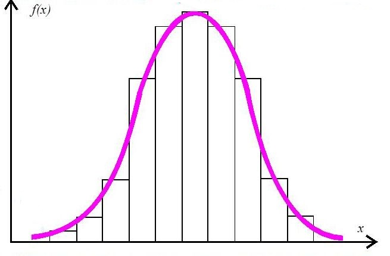
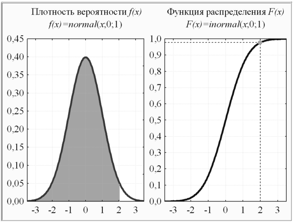
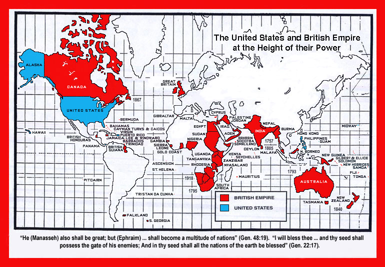
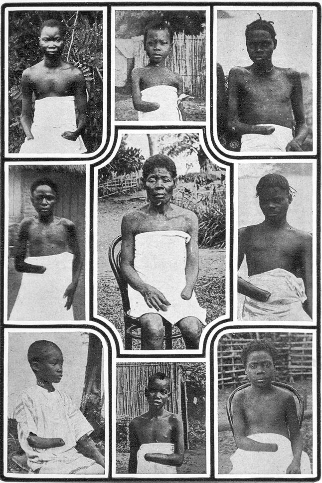
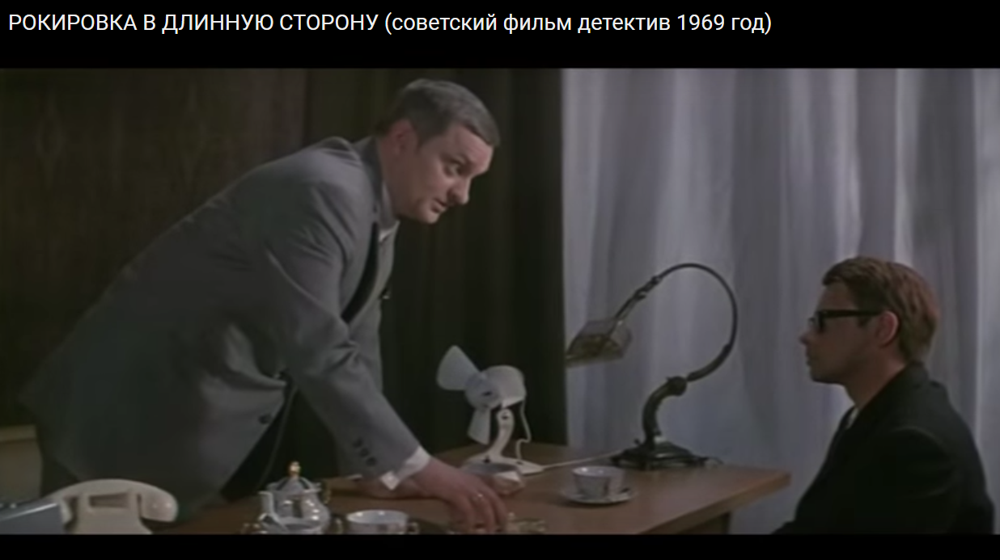
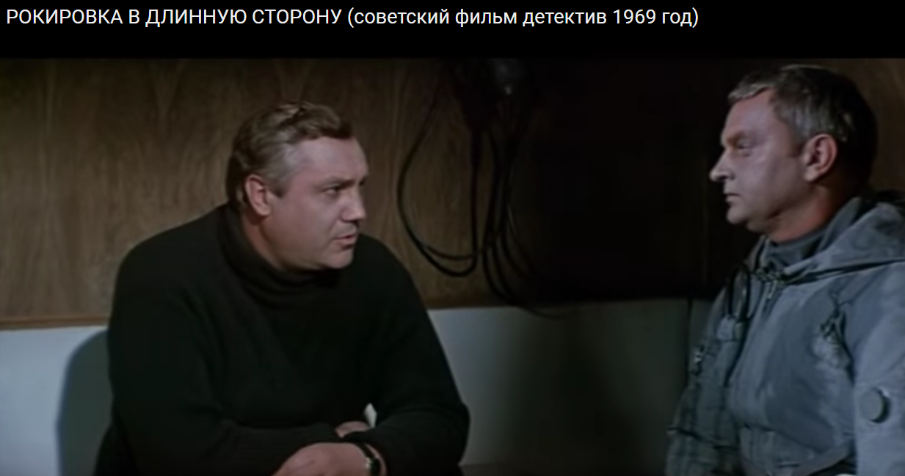

> **Первичный текст.** Справочник по межкультурному взаимодействию.
> Источник: `dotu.ru:9f42d6e3b57308a1.doc` sha256 `97540ede0a5b8ebb…`; [страница на dotu.ru](https://dotu.ru/books/handbook-of-intercultural-interaction/).
> Автоматическая транскрипция DOC→Markdown; смысл и формулировки не правились.
> Контрольные суммы и статус проверки — в [NOTICE.md](../../NOTICE.md).
> Содержание передаёт позицию авторов; утверждения не верифицированы библиотекой.

---

## 4.3. Политтехнология стратегического уровня управления жизнью обществ

В политтехнологиях объектами управления выступают люди — и по одиночке, и как разнородные множества. При этом люди — некоторым образом самоуправляющиеся объекты. Поэтому для понимания политтехнологий и построения их необходимо знать человека, — его психологию, биологию, личностную и социальную культуру.

### 4.3.1. Разного рода сведения,\

необходимые для ви́дения, понимания и осуществления политтехнологий

Всё, что наши органы чувств (как телесные, так и биополевые) приносят в нашу психику, это — изначально «шумы» и «пятна», которые становятся информацией только в результате работы нашей психики. Из этих «шумов» и «пятен» наш интеллект, с учётом *прошлых впечатлений и своих прошлых наработок (т.е. осмысленных более ранних впечатлений, уже имеющихся в нашей памяти),* формирует нашу «картину мира» (модель реальности) — наше мировоззрение и наше миропонимание[^207]. Далее в нашей деятельности поток непрестанно воспринимаемых нашими чувствами «шумов» и «пятен» наша психика соотносит с теми элементами «картины мира», которые уже есть в ней, и на основе сопоставления воспринимаемой органами чувств таким образом реальности с имеющейся в нашей психике *моделью реальности — «картиной мира»,* мы оцениваем обстановку вокруг нас, своё место в ней, решаем задачу об устойчивости в смысле предсказуемости поведения всех интересующих нас объектов и субъектов, строим свои намерения на будущее и линию поведения, которая должна реализовать эти намерения. И это происходит именно так даже, если мы не задумываемся о том, как работает наша система чувств и психика.

Всё это аналогично тому, что давно стало нормой в мореплавании: картина, видимая из ходовой рубки корабля или с ходового мостика (это — воспринимаемая чувствами субъекта-судоводителя реальность, включая и её аспекты, относимые к компетенции мореходной астрономии), соотносится с тем, что изображено на навигационной карте (это — модель реальности, «картина мира»), на основании чего уточняется фактическое местоположение корабля, вырабатываются и принимаются к исполнению решения о последующем управлении им.

Если в нашей «картине мира» недостаёт каких-то элементов, необходимых для адекватного сопоставления потока «шумов» и «пятен» и нашей модели мира, то вариантов дальнейшего течения процесса два:

- наша психика выстраивает модели этого недостающего, после чего мы воспринимаем жизнь более адекватно, полно и осмысленно, если эти модели сообразны миру;

- либо наша психика пытается интерпретировать воспринимаемые нами в потоке событий жизни «шумы» и «пятна» через те элементы «картины мира», которые уже в ней есть, вследствие чего какие-то жизненные темы мы воспринимаем в большей или меньшей мере неадекватно, неполно, неосмысленно или дефективно-осмысленно, а что-то не воспринимаем вовсе[^208].

*Первый вариант* имеет следствием рост показателей успешности (безопасности) нашей деятельности.

*Второй* *вариант* гарантирует нам неприятности разной степени тяжести вплоть до убийственных (как для нас самих, так и для тех, кто оказался под нашей властью, включая и власть наших мнений), в случаях, если мы вторгаемся в те сферы деятельности, где неадекватность нашей «картины мира» сказывается на нашей деятельности и её результатах. Это аналогично попытке ведения корабля по ошибочной навигационной карте, на которой глубины (фарватеры), конфигурация берегов, навигационные знаки, опасности и т.п. показаны неправильно и не указаны реально существующие помехи кораблевождению.

И оба варианта требуют совершенствования «картины мира», чтобы она обеспечивала нашу дееспособность в потоке событий жизни.

В жизни мы в большинстве случаев реализуем некую комбинацию обоих этих вариантов, и потому этот факт необходимо осознавать и заботиться о том, чтобы неизбежные ошибки в «картине мира», соотносясь с которой, мы идём по жизни, не были критичными по отношению к той деятельности, которой мы намереваемся заняться или уже занимаемся.[^209]

Поэтому превосходство над противниками и конкурентами: 1) по качеству «картины мира» (по её широте, полноте и детальности) и 2) по навыкам её совершенствования (расширение кругозора, наращивание детальности, устранение разного рода дефектов) это — решающее превосходство стратегического характера и важнейший показатель культурной состоятельности как личности, так и культурно своеобразных обществ *во все эпохи*.

Критерий совершенства «картины мира» один единственный — успешная деятельность. Совершенство «картины мира» выражается в деятельности в достаточно хорошей предсказуемости течения событий как при наблюдении за их течением (т.е. невмешательстве в их течение), так и при осознанно целенаправленном соучастии в них и управленческом воздействии на них.

Поэтому:

Одно из направлений агрессии в «гибридной войне» — внедрение дефектов в «картину мира» жертвы агрессии и лишение его навыков устранения в ней дефектов и её совершенствования.

Один из наиболее тяжёлых пороков «картины мира», которую несут в своей психике большинство людей (как в России, так и вне её) состоит в том, что мы живём в культуре, в которой для подавляющего большинства понятия «полная функция управления» и «замкнутая система» неведомы.

Но и те, кто прослушал в вузах учебные курсы *технико-управленческого*[^210] *характера* и в силу этого имеют какие-то представления об управлении (пусть и не по полной функции) и знают, что такое «замкнутая система», — за единичными исключениями не умеют отобразить в схему замкнутой системы (см. соответствующий рисунок в разделе 3.1) процесс глобализации и жизнь культурно своеобразных обществ в процессе глобализации. Т.е. они не в состоянии вообразить: 1) глобальную цивилизацию в качестве объекта управления, 2) разнородные внутренние и внешние процессы в процессе её самоуправления, 3) возможности управления *разнородными процессами, образующими в совокупности процесс её самоуправления,* 4) реализацию этих возможностей на практике в историческом прошлом и в обозримой перспективе в глобальной, внешней и внутренней политике государства.

Для того, чтобы это сделать, необходимо в своей «картине мира» сформировать представления о том, что такое полная функция управления, что такое суперсистема, что такое взаимовложенные (взаимно проникающие друг в друга) суперсистемы с виртуальной структурой, что такое структурное управление, бесструктурное управление, управление на основе виртуальных структур, что такое схемы управления (т.е. всё то, о чём шла речь в разделе 3.1).

В силу того, что в «картине мира» нет соответствующих моделей, либо в силу того, что люди не умеют <u>**влить** *в имеющиеся в их психике модели-абстракции* **конкретику**</u> глобального и регионального исторических процессов (те «шумы» и «пятна», которые они воспринимают сами и о которых им сообщают другие люди, СМИ и книги), — история и политика (которой предстоит стать историей) воспринимаются ими как заведомо непредсказуемое стечение *«случайностей», большей частью не связанных друг с другом многомерными сетями причинно-следственных связей,* и потому лишённых какой-либо целесообразности — тем более, целесообразности глобального масштаба значимости. История, по их мнению, как «ступа с Бабою Ягой, идёт, бредёт сама собой» неведомо куда…

Те, кто повнимательнее, замечают, что в этом «стечении случайностей», непрестанно обновляющемся на протяжении всей истории, одним персонам, народам, государствам почему-то «хронически везёт» (в большинстве случаев они достигают успехов в своей политике и в войнах на протяжении многих веков), а другим почему-то «хронически не везёт» (их история — череда катастроф, и даже плоды неоспоримых их военных побед и иных достижений, спустя несколько десятилетий ими утрачиваются вследствие «невезения», влекущего за собой очередную катастрофу).

Осмысление такого рода *«хроник везения — невезения»*, при отсутствии понятий «полная функция управления», «замкнутая система», «суперсистема», «управление в суперсистемах» , при неспособности соображать слово «статистика» — приводит их на основе имеющихся у них представлений об управлении (а какие-то, пусть даже самые примитивные представления об управлении есть в психике у всех) к широко известным утверждениям о существовании некого всемирного заговора, *«круто законспирированные»* участники которого и управляют течением всемирной истории (глобальной политики) на протяжении многих веков и вмешиваются в управление всеми государствами[^211]. Наиболее широко распространены следующие версии всемирного заговора:

- «Англичанка гадит»[^212]. Её достоверность подтверждается картой мира, приведённой в разделе 4.2 и событиями всемирной истории последних нескольких веков.

- «Жидо-масонский заговор» правит всем с целью установления «нового мирового порядка» под властью Машиаха-Антихриста. При этом Британия, США, и Швейцария предстают как инструменты осуществления глобальной политики в русле этого заговора.

> Эта версия проистекает из того обстоятельства, что Библия действительно несёт в себе концепцию осуществления глобализации (см. раздел 2.3), которая оказывала в прошлом и оказывает ныне воздействие на психодинамику обществ, под воздействием которой формируется политика, которая с течением времени становится историей.

>

> Эта версия обосновывается: 1) пресловутыми «Протоколами сионских мудрецов», подложность которых была неоднократно доказана[^213], но которые для многих продолжают быть авторитетным программным документом давней эпохи, поскольку в жизни реально многое происходило в соответствии с изложенным в них; 2) статистикой распределения евреев и неевреев по «престижным» и управленчески значимым сферам деятельности; 3) периодически возникающими скандалами, связанными с масонством (примерно половина декабристов были членами масонских лож; во временном правительстве России первого состава после февральской революции 1917 г. только один человек не было масоном; в Италии в 1980‑е годы имел место скандал, связанный с ложей «П2»; 4) полным замалчиванием в учебниках истории таких тем, как своеобразие национальных культур как информационно-алгоритмических систем — систем общественного самоуправления, как роль *Библии (обеих её компонент — Ветхого и Нового заветов, адресованных разным этническим группам, которые должны решать разные задачи в ходе глобализации)* и масонства в жизни глобальной цивилизации; 5) особой ролью Швейцарии, Великобритании, США в истории последних нескольких веков и их своеобразным «везением»; 6) нежеланием подавляющего большинства людей принять на себя хоть какую-то долю ответственности за судьбы человечества и своего государства и воспитывать своих детей и внуков заботливыми и ответственными людьми, что и открывает возможности:

- с одной стороны, для любых действий в отношении них в пределах возможностей, сформированных прошлой историей и Божеским попущением,

- а с другой стороны — позволяет им винить в своих бедах кого угодно (жидо-масонов, рептилоидов, инопланетные цивилизации и т.п.), но только не самих себя — таких, каковы они есть.

<!-- -->

- «Всем рулит Ватикан через свои тайные структуры». Эта версия существует в силу того, что: 1) Ватикан так или иначе оказывал и оказывает своё воздействие на политику *и обладает наиболее продолжительной документированной архивной памятью* из числа всех европейских структур разного рода; 2) с Ватиканом связаны такие транснациональные организации как Мальтийский орден, орден иезуитов, «Опус деи» (Божье дело), чьи представители иногда засвечиваются в публичной политике.

- «Агни-Йога. Живая этика». Автор этого учения — Елена Ивановна Рерих (1879 — 1955)[^214]. Она прямо пишет о существовании на протяжении многих веков тайного мирового правительства и развёрнутой в обществах его периферии, включающей в себя «послов», исполнителей поручений, сборщиков и передатчиков информации о состоянии обществ[^215].

- «Совет Девяти» (мудрецов) или тайный союз «Девяти Неизвестных»[^216]. Согласно легенде в III в. до н.э. императору Ашоке (древняя Индия) после созерцания поля боя, заваленного трупами погибших воинов, пришла в голову мысль, что человечество способно истребить само себя, если завладеет необходимым для этого оружием. Тогда царь повелел собрать девять мудрецов, чтобы основать тайный совет Девяти, у которого была необычная задача — всячески препятствовать научно-техническому и технологическому прогрессу, ведущему к самоубийству человечества. Каждый из девяти мудрецов отвечает за хранение своей книги знаний, в которой собраны все технологии прошлых цивилизаций Земли и все вновь открытые технологии по соответствующей сфере деятельности человечества. Однако, как понятно из истории последующих 23-х веков, этому тайному обществу не удалось предотвратить ни множество локальных войн, ни мировые войны, ни техногенные катастрофы (Бхопал, Чернобыль, Фукусима и др.).

- Инопланетяне (рептилоиды, анунаки — одна из разновидностей инопланетян) создали людей и рулят всем на Земле по своему усмотрению.

Однако, попытки найти и обезвредить главного «жидо-масона» или «Верховный тайный совет жидо-масонства», выявить проникающие всюду «тайные структуры Ватикана», хотя бы что-то противопоставить «гадливости англичанки», найти Шамбалу, Шангри-Ла и договориться с архатами, архонтами и махатмами и т.п. — к положительному результату не приводят[^217]. Причины просты: одни существуют только как плод воображения на основе сплетен, в силу чего вступить с ними в контакт объективно невозможно, а другие не считают полезным вступать в дискуссии с теми, кого они расценивают как интеллектуально и психически в целом неполноценных[^218].

Это вызывает скепсис и вполне заслуженные насмешки в отношении приверженцев теорий «всемирных заговоров» с целью установления мирового господства как со стороны участников «жидо-масонского заговора»[^219], так и со стороны большинства общества — отрицателей разного рода теорий «всемирных заговоров». — Может всё следует объяснить простой глупостью обществ, политиков, психозами и маниями тех, кто фантазирует на темы всемирных заговоров?[^220]

*[В оригинальном издании здесь расположен рисунок/схема. Иллюстрация не включена в данный выпуск: ожидает визуальной и правовой проверки. Файл источника: image27.png]* *[В оригинальном издании здесь расположен рисунок/схема. Иллюстрация не включена в данный выпуск: ожидает визуальной и правовой проверки. Файл источника: image28.jpeg]*

Позицию скептиков и насмешников тоже можно понять:

Если вы знаете, что существует и действует тайный заговор, который вы расцениваете как мировое зло, то чего проще: *если вы не идиоты*[^221]*,* — организуйте свой, *более эффективный «заговор»* и творите Добро в глобальных масштабах. **Почему же вы этого не делаете на протяжении уже нескольких столетий, если знаете о происках врагов рода человеческого?**

Ответ (адресуемый как скептикам и насмешникам, так и любителям объяснять всё «теориями заговора») на этот вопрос состоит в том, что:

- у приверженцев «теорий заговора», которым «жидо-масонский» и прочие заговоры мешают жить, нет за душой **методологии познания и творчества**, позволяющей выработать личностную познавательно-творческую культуру и необходимые знания, которые они могли бы реализовать на практике, т.е.:

<!-- -->

- сделать невозможным реализацию неприемлемых для них «всемирных заговоров» и заговоров меньшего масштаба,

- породить свой благой «заговор» и достичь его целей (это требует владеть первым приоритетом обобщённых средств управления, а не быть невольником догм того или иного вероучения);

<!-- -->

- а реальные участники «заговоров» (примером тому декабристы, в ХХ веке — А.Ф. Керенский, В.В. Шульгин — см. его произведения; А. Гитлер[^222]) знают каждый своё (в части, его касающейся, в меру его понимания, соответственно его интересам и возлагаемым на него функциям), но не знают заговора в целом (его истинных, а не *иногда* декларируемых целей; информационно-алгоритмического обеспечения процесса достижения целей; многослойной разветвлённой организационно-управленческой практики реализации проекта в целом), и потому они не могут проболтаться о проекте; а в силу этих же причин пытать их бесполезно поскольку:

<!-- -->

- с одной стороны — им по сути нечего рассказать[^223];

- а с другой стороны — те, кто может «поймать и пытать» реальных или возможных «заговорщиков» (законно либо не законно — значения в данном случае не имеет), сами не обладают знаниями и навыками, позволяющими задать правильные вопросы, а потом воспользоваться информацией, извлечённой теми или иными средствами из пойманных (каждый в меру понимания работает на себя, а в меру разницы в понимании — на тех, кто понимает больше)[^224].

> Стенограммы такого рода допросов троцкиста Х.Г. Раковского (1873 — 11.09.1941, расстрелян), опубликованные в 1952 г. в Барселоне под названием «Красная симфония»[^225] за авторством И. Ландовского, — это мистификация, т.е. вымыслы, а не реальные стенограммы допроса более или менее «компетентными» НКВД-шниками одного из периферийных участников некоего мирового заговора. Другое дело, что история знает случаи, когда те или иные идеи вводятся в общество посредством жанра «мистификации»: вопрос о достоверности (жизненной состоятельности) идей (мнений), вводимых в культуру через жанр мистификации, — это другой вопрос, относящийся к существу идей (мнений), а не к жанру мистификации как таковому, который является только способом введения этих идей (мнений) в культуру, т.е. одной из многих политтехнологий воздействия на культуру обществ[^226].

>

> Но и вполне реальные материалы Дела В.В. Шульгина (1878 — 1976), арестованного СМЕРШем в Югославии в 1944 г. и осуждённого на 25 лет заключения (амнистирован в 1956 г.), не проливают свет на цели и организацию пресловутого «жидо-масонского заговора», хотя В.В. Шульгин, как можно понять из книги Н.Н. Яковлева «1 августа 1914»[^227], «был в теме».

Тем не менее, как заметил римский император Марк Аврелий (120 — 180, правил с 161 г.), «**безумие думать, что злые не творят зла**».

Поэтому прежде, чем говорить о базовой[^228] политтехнологии стратегического уровня управления биосферно-социально-экономическими системами государств, региональных цивилизаций, глобальной цивилизации, необходимо сформировать образную базу (дополнить «картину мира»), на основе которой можно выявить и понять эту политтехнологию, т.е. построить в своей «картине мира» динамичный образ этой политтехнологии, который можно описать словами.

\* \* \*

Если управление обществами вплоть до управления глобализацией описывать метафорически, то работоспособны три метафоры:

- Метафора «сада»[^229]. Всё в саду растёт само, но чтобы был сад, а не дикие заросли, требуется компетентный садовник и ему подчинённые работники, которые планируют сад, осуществляют посадку, подкормку и уход за теми насаждениями, которые признаны полезными; прополку и искоренение того, что признано вредным; и проявляют наблюдательность по отношению к тому, что растёт само по себе без какой-либо понятной пользы, но ничему и никому не мешает; а где-то имеется и «парничок» (участок) с рассадой для будущих насаждений; и ещё где-то есть и опытовый участок, на котором занимаются сортовыведением и сортоиспытаниями[^230].

- Метафора «рояля в кустах». Имеются ноты музыкального произведения[^231], имеется настроенный рояль, в котором нажатию каждой клавиши соответствует определённая нота. Если ударять по клавишам в соответствии с тем, что написано в нотах, то рояль будет издавать определённые звуки, которые образуют мелодию и аккомпанемент. Но кроме того возможны и некоторые вариации, на тему того, что написано в нотах, если исполнитель к этому способен. «Рояль в кустах» — звучит, но его и пианиста почти никто не видит. А если слушатель не знает, что такое рояль и кто такой пианист, то он может подумать, что звучит «божественная» — нерукотворная — музыка.

- Метафора «жизни как театра» Вильяма Шекспира (1564 — 1616)[^232]: *«Весь мир — театр. В нём женщины, мужчины — все актеры. У них есть выходы, уходы. И каждый не одну играет роль. Семь действий в пьесе той»* (из пьесы «Как вам это понравится», 1599 / 1600). И далее перечисление действий пьесы жизни (пояснения к каждому из них мы опустим): младенец, школьник, юноша, любовник, солдат, судья, старик. Но кроме актёров в постановку спектакля в театре свой вклад вносят и многие другие, о ком в этой метафоре В. Шекспира нет ни слова: технический персонал — рабочие сцены, осветители, декораторы, костюмеры, реквизиторы; режиссёр-постановщик; а начало постановке даёт драматург — автор пьесы.

> Кроме того, действие спектакля можно вынести в толпу. Что из этого может получиться, показано в советском фильме «Праздник святого Иоргена»[^233].

Однако, все хорошие метафоры, хотя и позволяют быстро указать на суть неких явлений, но каждый воспринимает их в меру своего понимания (т.е. соответственно развитости воображения и ассоциативного мышления, позволяющего соотносить образы, соответствующие метафоре, с реальной жизнью) и поэтому в силу неоднозначности их соотнесения с жизнью разными людьми все они нуждаются в пояснениях, если на их основе предполагается строить практическую коллективную деятельность. Эти метафоры могут быть соотнесены с социально-политической реальностью и историей, если мыслить процессами на интервалах времени, охватывающих сроки жизни многих поколений[^234].

Как уже было определено ранее:

- культура — вся информация и алгоритмика (знания и навыки), передаваемая от поколения к поколению помимо генетического механизма биологического вида;

- личностная культура — это то, что индивид воспринял из исторически сложившейся культуры общества, плюс его собственные наработки;

- субкультуры — это компоненты культуры общества, которые несут те или иные социальные группы в составе общества (классы, профессиональные сообщества, региональные и этнические культурно своеобразные группы, диаспоры и др.);

- кроме того, история знает транснациональные субкультуры, принадлежащие культурам разных культурно своеобразных обществ (одна из таких транснациональных субкультур — военное дело в каждую эпоху при более или менее одинаковом уровне развития государств; ещё одна — работа спецслужб).

В таком понимании культуры и субкультуры предстают как информационно-алгоритмические системы, что означает: каждая культура (субкультура) несёт в себе определённый иерархически упорядоченный набор целей, путей и средств их достижения. Последнее обстоятельство, в свою очередь, означает, что: 1) культуры (субкультуры) являются средствами социального самоуправления (средствами управления обществами в автоматическом режиме) и 2) культуры (субкультуры) могут быть объектами программирования, т.е. несомые ими цели (как оглашаемые, так и вводимые и принятые по умолчанию), пути и средства их достижения могут задаваться целенаправленно с целью последующего введения самоуправления обществ (социальных групп), несущих эти культуры (субкультуры), в заданный социальными программистами режим.

**В метафоре «сада»** компоненты культуры и субкультур общества — аналоги растений в саду[^235], каждое из которых выполняет в нём некоторые функции, ради которых его и посадили и культивируют.

**В метафоре «рояля»** каждая культура и субкультура — аналоги клавиш в силу того, что набор целей, путей и средств их достижения, свойственных той или иной культуре (субкультуре), хоть в чём-то да отличен от других культур (субкультур), как отличны по звучанию разные струны рояля (конечно, если индивид обладает музыкальным слухом, аналогом чего в политике является способность видеть культуры и субкультуры в жизни именно как функционально целесообразные информационно-алгоритмические системы).

Отличие рояля от реальной жизни в том, что в конструкции рояля уже есть все клавиши и струны, педали, необходимые для исполнения музыкального произведения, а в жизни в ряде случаев для успешного достижения целей политики надо создать необходимые культуры и субкультуры и влить их в те социальные группы, которым предстоит жить под их властью. Если от реальной жизни возвращаться к метафоре «рояля», то это означает, что могут встречаться произведения, исполнение которых потребует дооснащения рояля какими-то дополнительными струнами, клавишами, педалями, колокольчиками, панелями цветомузыки, подсвечниками и т.п. И рояль не обязательно должен быть спрятан «в кустах».

Но **самая ёмкая и точная по смыслу —** **метафора «театра»** В. Шекспира, хотя между театром и жизнью есть определённая разница, а между сценой и реальной жизнью должна быть граница, поскольку *на сцене неизбежна некоторая имитационная компонента,* а реальная жизнь бывает жестокой по отношению к имитаторам и, в особенности, — по отношению к поверившим имитаторам[^236].

Прежде всего, в метафоре театра и в реальной жизни общее то, что и на сцене, и в жизни нечто, сделанное неудачно с первого раза, не всегда возможно заменить чем-то более удачным, сделанным со второй или какой-то последующей попытки в очерёдности попыток. В этом принципиальное отличие театра от кинематографии, где в большинстве случаев все сцены снимаются в несколько дублей, а потом из отснятых вариантов при монтаже кинокартины режиссёр выбирает наилучший по его мнению дубль. Жизнь невозможно начать заново «с чистого листа», хотя возможно её продолжить как-то иначе, изменив целеполагание и стратегию достижения целей: *нет людей без прошлого, но есть люди без будущего*.

Как и в жизни, если на сцене изменить порядок действий (если это возможно), то получится совершенно другой сюжет[^237] (именно по этой причине знание достоверной хронологии течения событий необходимо, а подмена истинной хронологии вымышленной вводит в заблуждение её принявших). В кинематографии же всё можно отснять в некотором организационно-технически удобном порядке, а потом смонтировать фрагменты в единый фильм так, как требуется для демонстрации сюжета зрителю.

В театре зритель видит только актёров, и игра каждого из них производит на него впечатление, на основе которого вырабатывается отношение к показанному через разрешение зрителем «дилеммы Станиславского»: верю — не верю[^238]. Убедительность игры актёра в своей основе имеет искусство «вхождения в роль». Психологически это означает, что актёр должен создать в себе (вообразить) «субличность» (если пользоваться терминологией некоторых научных школ психологии) и, выйдя на сцену, *перестать быть самим собой — таким, каков он есть в жизни,* — и предоставить свободу действий созданной им в себе субличности, наблюдая за её действиями и корректируя их своею волей в какие-то моменты. Для этого актёр должен создать в себе (вообразить) нравственность персонажа, структуру его психики, культуру чувств и культуру мышления, привычки (бессознательные автоматизмы поведения), мировоззрение и миропонимание. Мировоззрение и миропонимание персонажей большей частью не оглашаются в виде философских монологов на публику или авторского комментария «из-за кадра», но обуславливают естественность поведения персонажа в контексте развития сюжета, а отсутствие мировоззрения и миропонимания определённой эпохи в психике актёра делает его поведение в сюжете вымученным, неестественным[^239].

Если «субличность» по завершении спектакля или съёмок вынести со сцены (со съёмочной площадки) в реальную жизнь, то могут быть неприятности вплоть до трагических: история знает много *«случаев» (в которых не случайно реализовалась алгоритмика психодинамики общества),* когда в жизни актёров происходили события, аналогичные тем, которые они ранее «проиграли» в сюжетах тех или иных произведений. Поэтому следует руководствоваться указанием выдающегося советского актёра Георгия Михайловича Вицина (1917 — 2001) *«надо уметь не только войти в роль, но надо уметь и выйти из неё».*

Но всё это касается и спецслужбистов при их «вживании в легенду» и «выходе из неё», когда им приходится действовать как в своей стране, так и за рубежом, не обозначая свою принадлежность к спецслужбам[^240], или же под чужим либо вымышленными именем.

Игра актёра на сцене от действий людей в жизни отличается тем, что актёр знает весь сюжет пьесы, и под него строит субличность так, чтобы её поведение было естественным в ходе развития этого сюжета на всём его протяжении. В жизни же мы большей частью не знаем достоверно дальнейшего течения событий, по крайней мере, — не знаем их в мелко детальной конкретике, даже если в силу разных причин знаем в общих чертах предстоящие в ближайшей перспективе события и имеем какие-то планы действий в надвигающихся обстоятельствах. Потому в жизни мы большей частью «импровизируем по ходу пьесы» (во многом на основе наших бессознательных автоматизмов, включая и воздействие эгрегоров), и доля такого рода «импровизаций» в жизни гораздо больше, чем это имеет место на сцене в игре актёров, хотя и на сцене может быть место для импровизаций, однако в пределах сохранения сюжета, его смысла и режиссёрской интерпретации произведения, выносимого на сцену.

Но в театре есть и то, что остаётся за пределами сцены и восприятия зрителя. Если оставить в стороне работу декораторов, костюмеров, осветителей, рабочих сцены и прочего обслуживающего персонала, то это, прежде всего, — работа режиссёра-постановщика, который приглашает конкретных актёров на конкретные роли, помогает актёрам войти в роли (создать образы персонажей — субличности), увязывает действия актёров-персонажей в единое органичное целостное действо, и в итоге получается сюжет, который актёры в меру своего мастерства представляют зрителю, и тот оценивает их игру в дилемме «верю — не верю», сопереживает течение событий в пьесе с кем-то из персонажей, делает какие-то свои выводы о жизненной состоятельности и актуальности для него сюжета, о добре и зле в их проявлениях в сюжете и в жизни.

Кроме того, чтобы был спектакль, необходим драматург, который создал сюжет (подсмотрел его в жизни, скомпилировал его из разных жизненных сюжетов, либо придумал его), создал персонажей, воплотил всё это в текст пьесы[^241] или трансформировал в текст пьесы иной литературный текст. После того, как текст стал достоянием сообщества режиссёров и меценатов (продюсеров), некоторые из которых проявили заинтересованность в постановке, и начинается «собственно театр».

Такова метафора «театра» в её полноте[^242].

Пояснив метафоры, необходимые для формирования образной базы, можно перейти к конкретике *базовой политтехнологии стратегического уровня управления* биосферно-социально-экономическими системами.

\* \*\

\*

Поскольку речь идёт об управлении человеческими обществами на уровнях от внутригосударственного до глобальной цивилизации в целом, то в первую очередь необходим управленчески состоятельный ответ на вопрос: *Чем (каким набором характеристик) характеризуется индивид, принадлежащий биологическому виду «Человек разумный», пребывающий в возрасте социальной активности, т.е. уже взрослый и ещё не впавший в старческую дряхлость, беспамятство и безумие?*

Для ответа на этот вопрос необходимо построить типологию (набор характеристических признаков), которая бы позволяла найти в ней место всякому индивиду. Типология нужна для предварительной оценки того, чего можно ожидать не от того или иного индивида персонально[^243], а для оценки возможного поведения социальных групп, в соотнесении каждой из них с выработанной типологией. Минимальный набор характеристик личности должен включать в себя три группы показателей: медико-биологические, психологические, культурной состоятельности.

————————

**Медико-биологические показатели**

- Пол — мужской; женский; биологически дефективный организм с признаками обоих полов либо недоразвитостью или отсутствием тех или иных органов репродуктивной системы, в остальном производящий впечатление принадлежности к одному из двух полов.

- Гендер — включает в себя: 1) мнение индивида о своей половой принадлежности, которое может в силу биологических и социокультурных причин не совпадать с его половой принадлежностью, определяемой по анатомическим показателям, и 2) его согласие / несогласие с исторически сложившимися социокультурными нормами распределения в жизни общества между полами разного рода социально значимых функций как в быту семьи, так и в профессиональной и в публичной деятельности, вследствие чего индивид:

<!-- -->

- может жить «как все» представители своего пола в исторически сложившейся культуре,

- либо может притязать на «запретное» и отказываться от «обязательного»[^244];

- либо считать себя представителем любого пола (в том числе и выдуманного им или кем-то ещё) вне зависимости от анатомических и физиологических особенностей его организма, объективно характеризующих половую принадлежность по биологическим признакам.

> Гендер, хотя по сути своей является психологическим показателем, помещён в группу медико-биологических показателей потому, что нарушения гендерной самоидентификации в аспекте осознания своей половой принадлежности — один из показателей психического нездоровья индивида вне зависимости от мнения по этому вопросу Всемирной организации здравоохранения и «правозащитников» либерального толка[^245].

>

> Проблемы осознания своей гендерной принадлежности могут быть следствием биологических нарушений в организме. Попытки игнорировать биологическую составляющую гендера вредоносны, но на них основано множество политтехнологий. Более того, потребность в термине «гендер» возникает у общества тогда, когда биологическая деградация и половые извращения (как одно из направлений культурной деградации) охватывают довольно широкую долю населения, которая не может определиться в своей половой принадлежности в силу биологических дефектов их организмов или же в силу приобретённой культурно обусловленной извращённости восприятия и осуществления аспектов жизни, связанных с половой дифференциацией людей. **Если общество развивается правильно, то в термине «гендер» у него нет надобности, поскольку пол и гендер в его жизни неразличимы.**

- Состояние здоровья как основа: 1) трудоспособности (по отношению к исторически сложившемуся и востребованному спектру профессий, которые позволяет освоить здоровье) и 2) семейной жизни.

> Здоровье индивида должно характеризоваться на основе типологии, которую социологии и политологии дать должна дать государственная система здравоохранения.

**Психологические показатели**

- Преобладающий тип строя психики[^246], идентифицируемый по его проявлениям в поведении индивида.

> В связи с тем, что тип строя психики может изменяться на протяжении не только жизни, но и в течение дня как под воздействием обстоятельств, так и осознанно волевым порядком, то за тип строя психики отвечает сам индивид. Поэтому оценки типа строя психики индивида по внешним проявлениям следует характеризовать как «предположительные», вероятностные, если их предполагается учитывать в кадровой политике.

- Для мужчин — подкаблучник / не подкаблучник; и для женщин — собственница мужчины и дома / берегиня (хранительница семьи, дома) / «ни то, ни сё», т.е. не хозяйка ни себе, ни дому, ни мужчине.

- Способность к самостоятельной оценке ситуации и перспектив её развития и к действиям в ней по своей инициативе либо неспособность к этому и, как следствие — действия только под руководством внешних источников целеполагания, знаний и навыков.

- Неспособность к самоконтролю за исполнением принятых на себя обязательств, вследствие чего ему необходимы постоянные внешний контроль и руководство исполнением принятых им на себя или возложенных на него обязанностей.

- Отношение ко лжи — как своей собственной, так и чужой.

- Понимание справедливости как в аспекте социальной организации, так и в аспекте взаимоотношений людей.

- Забота о справедливости — как в отношении себя, так и в отношении окружающих.

- Своекорыстие (в том числе продажность) и трусливость (податливость к разного рода давлению) либо готовность к самопожертвованию ради справедливости и общего дела (возможно, что необходимо оценивать и «порог предельного давления», при превышении которого происходит переход от продажности и податливости к готовности к самопожертвованию).

- Доля безошибочных решений в статистике вырабатываемых и проводимых в жизнь индивидом решений, т.е. «везучесть — невезучесть».

В совокупности всё названное образует характер личности, как иерархически упорядоченную совокупность «черт характера», программирующих многие возможности индивида действовать, включая и возможности его взаимодействия с другими членами общества.

**Показатели культурной состоятельности**

Многие показатели культурной состоятельности обусловлены эпохой, исторически сложившимся образом жизни общества и «вызовами времени», поэтому периодически необходимо переосмыслять актуальность традиционных показателей культурной состоятельности и выявлять новые актуальные показатели на перспективу.

- Группы (иерархические уровни) жизненных интересов индивида (в порядке роста долговременной значимости):

1)  *исключительно единоличные (потребительски-бытовые и гедонистические),*

2)  *семейно-бытовые,*

3)  *узко профессиональные, по сути финансовые (см. пояснение далее),*

4)  обусловленные классовой принадлежностью,

5)  обусловленные национальной принадлежностью

6)  обусловленные конфессиональной принадлежностью,

7)  общегосударственного масштаба,

8)  регионально-цивилизационного масштаба,

9)  глобально-цивилизационного масштаба.

> Носители *интересов* только *первой, второй и третьей групп* — аполитичны, т.е. безыдейны и потому потенциально продажны, т.е. потенциальные предатели и изменники. Их лояльность обеспечивается так или иначе организованным подкупом (легальным или каким-то иным), а измена — перекупом политическими противниками (перекуп тоже может быть и легальным, и каким-то иным).

>

> Кроме того, первые три группы интересов, выделенные выше курсивом, объединяются через финансовую субкультуру, поскольку удовлетворение интересов первых двух групп в подавляющем большинстве случаев требует оплаты материальных благ и разного рода услуг, а профессионализм (в сколько-нибудь устойчиво функционирующей производственно-потребительской системе общества) это — то, что обеспечивает доходы, позволяющие удовлетворять интересы первых двух групп. Причём речь идёт о любом профессионализме — как созидательном (управленческом или производительном), так и о паразитическом (в стиле «великого комбинатора» или криминальном).

>

> Взаимосвязанность через деньги интересов первых трёх групп и аполитичность людей, не имеющих интересов четвёртой — девятой групп открывает широкие возможности манипулирования такими людьми[^247], и потому цель воспитания детей в современных культурах «высоко цивилизованных стран» — ограничить интересы основной статистической массы подрастающих поколений интересами первой и второй групп и отчасти — третьей группы.

>

> Та или иная политизированность характерна только для носителей интересов четвёртой — девятой групп.

>

> Круг интересов индивида может включать в себя все девять групп, но это не обязательно — какие-то группы могут не входить в круг интересов индивида как временно, так и на протяжении всей жизни. Если из круга интересов выпадают все группы интересов, кроме физиологических, то индивид — асоциален, и у него реально высокие шансы стать бездомным попрошайкой либо преждевременно умереть. Кроме того, поскольку интересы названных девяти групп разнокачественные, то они в психике их носителя образуют иерархию, которая может быть неизменной на протяжении жизни, но может и меняться в зависимости от обстоятельств и отношения к ним самого́ индивида.

- Навыки (компетенции), позволяющие индивиду воплотить в жизнь интересы каждой из групп, либо отсутствие соответствующих навыков при наличии интересов.

- Что наиболее интересно индивиду: 1) идеи (теории, обобщающие факты и показывающие их взаимосвязи), 2) фактология (разрозненные факты разного характера сами по себе), 3) «частная жизнь» других людей[^248].

- Уровень образованности: безграмотность; начальное — владение навыками чтения и письма, счёта[^249]; среднее образование общее[^250]; среднее профессиональное; высшее профессиональное.

- Характер образования:

<!-- -->

- либо знает факты и владеет навыками на их основе, но к самостоятельной выработке и освоению новых знаний и навыков не способен, в силу чего всегда нуждается в наставниках-учителях;

- либо развита **личностная познавательно-творческая культура (как уже отмечалось — это важнейший показатель культурной состоятельности *во все эпохи)****,* вследствие чего индивид способен самостоятельно воспринимать и оценивать обстановку, осваивать знания и навыки и своевременно (заблаговременно) вырабатывать их с нуля, если этого требуют обстоятельства или сложившийся круг интересов.

<table>

<colgroup>

<col style="width: 50%" />

<col style="width: 4%" />

<col style="width: 45%" />

</colgroup>

<tbody>

<tr>

<td><ul>

<li>
<em>Классовая (сословная) принадлежность.</em>
</li>

</ul></td>

<td rowspan="4">
<strong></strong>

<strong> 

 

 

 

 

</strong>
</td>

<td rowspan="4"><em>Эти четыре характеристики позволяют понять, в какие субкультуры потенциально вхож индивид.</em></td>

</tr>

<tr>

<td><ul>

<li>
<em>Национальность (по самоидентификации национальной принадлежности индивидом и по идентификации его основной статистической массой окружающих и представителями хвостов распределений).</em>
</li>

</ul></td>

</tr>

<tr>

<td><ul>

<li>
<em>Родные языки.</em>
</li>

</ul></td>

</tr>

<tr>

<td><ul>

<li>
<em>Владение иными языками, кроме родных.</em>
</li>

</ul></td>

</tr>

</tbody>

</table>

- Семейное положение: ни разу не состоял в браке; семейный; вдовец (вдова); после развода одинокий; не в первом браке; наличие детей от прошлых браков; дети в текущем браке; дети на стороне и т.п.

- Взаимоотношения с другими людьми: кто друзья, кто враги, кто просто знакомые[^251].

Среди показателей культурной состоятельности есть обусловленные эпохой и перспективами дальнейшего течения событий, а есть и «вечные», актуальные во все эпохи: это в первую очередь нравственно-этические показатели, в которых выражается отличие *человека состоявшегося* от стадно-стайной обезьяны биологического вида «Человек разумный». Вследствие этого показатели культурной состоятельности личности связаны с типологией культур, представленной в таблице 1 в разделе 2.2.

————————

На основе типологий, характеризующих элементы множеств, строятся статистики, характеризующие множества и процессы в них. Это касается и случаев, когда элементами множеств являются индивиды, а множества представляют собой культурно своеобразные общества, социальные группы в их составе, выделяемые по тем или иным признакам (национальность, классовая принадлежность, возраст, и т.п.), общества в составе региональных цивилизаций и человечество в целом.

Ещё один тяжёлый по своим последствиям порок «картины мира», формируемой господствующей ныне культурой как в России, так и вне её, состоит в том, что, когда люди слышат слово «статистика», то в большинстве случаев у них не возникает никаких образных представлений, которые они могли бы соотнести с этим словом и с жизнью, и на основе которых могли бы сопоставлять разные статистики друг с другом, анализировать и проектировать их. Это делает большинство из них недееспособными во всех делах, связанных с разного рода множествами.

Поэтому обратимся к вопросу о том, как соображать слово «статистика».

### **Отступление от темы 1:**\

Как соображать слово «статистика» и для чего это необходимо

На вопрос о том, какие образы в их картине мира соответствуют слову «статистика», люди в их большинстве не отвечают. Редко когда люди отвечают, что слову статистика соответствуют образы таблиц, заполненных некими численными данными. Последний ответ правильный, но работать со статистиками, представленными в табличной форме, в решении многих задач неудобно потому, что затруднительно соотносить их друг с другом и с жизнью.

Статистики в табличной форме представления необходимы прежде всего при «мелко детальном» изучении вопросов, связанных с теми или иными множествами и процессами в них. Кроме того, табличная форма представления статистик ориентирована на логико-математическое их восприятие, в чём тоже не всегда есть надобность, не говоря уж о том, что представление статистики в табличной форме — вторично, если исходить из применения аппарата теории вероятностей и математической статистики к решению социально-управленческих задач.

Но неспособность соображать слово «статистика» и соотносить его с жизнью усугубляется тем, что даже большинство из тех, кто в своё время более или менее успешно сдал зачёты или экзамены по курсу «теория вероятностей и математическая статистика» теряются, когда им предлагается построить статистическое распределение какой-либо случайной величины, например распределение по росту студентов группы[^252].

Вследствие этой особенности культуры нашего общества и личностной культуры множества людей, необходимо пояснить вопрос о построении статистик и представлении их в графической (образной) форме, поскольку без ви́дения (соображения) того, что стоит за словом «статистика», невозможно ни понимание того, что происходит в обществе, ни управление биосферно-социально-экономическими системами любого уровня (начиная от поселения — «муниципального образования» и кончая глобальной цивилизацией в целом).

Если не становиться на путь освоения аппарата теории вероятностей[^253] и математической статистики и соответствующего математического абстракционизма, то необходимый минимум понимания всего того, что стоит за словом «статистика» и пользования статистиками в управлении, может быть выработан на основе представленного на рисунке ниже. На нём показана двумерная система координат и в её осях — два графика функций, представляющие статистику, характеризующую некое множество:

- по горизонтали — ось *x*: значения случайной величины, т.е. вдоль оси *x* откладываются значения характеристического параметра, который свойственен всем элементам рассматриваемого множества и вариативность которого представляет для нас интерес;

- по вертикали — ось, обозначенная *f(x)* (т.е. функция от аргумента *x*): вдоль неё откладываются значения функции, именуемой «плотность распределения случайной величины *x*», график которой характеризует рассматриваемое множество элементов в целом, т.е. представляет статистику, характеризующую это множество (все его элементы, вне зависимости от особенностей каждого из них, в их совокупности).

Чтобы построить такого рода графическое представление статистики, необходимо:

- избрать измеримый (метрологически состоятельный) характеристический параметр, которым обладают все элементы рассматриваемого множества;

- на горизонтальной оси отметить значения этого параметра, разграничивающие интересующие нас диапазоны (интервалы) его изменения;

- над каждым диапазоном (интервалом) нарисовать столбик, в некотором масштабе (общем для всех столбиков) соответствующий количеству элементов множества, для которых значения рассматриваемого характеристического параметра попадают в этот диапазон.

В этом случае площадь всех столбиков в некотором масштабе равна количеству элементов множества (мощности множества, если множество несчётное), т.е. 100 %; 100 % можно приравнять единице, и в этом случае все значения функции плотности распределения случайной величины в этом графике будут выражаться в долях единицы.

Если мы избираем одно из значений, разграничивающих диапазоны (интервалы) изменения рассматриваемого характеристического параметра на оси *x*, то общая площадь всех столбиков, расположенных слева от этого значения, отнесённая к суммарной площади всех построенных столбиков, равна вероятности того, что для случайно избранного элемента этого множества значение рассматриваемого параметра не превысит заданного нами значения параметра, разграничивающего диапазоны (интервалы) его возможных изменений.

Площадь каждого из столбиков, отнесённая к суммарной площади всех столбиков, равна вероятности попадания случайной величины (соответственно — элемента множества) в диапазон её значений, соответствующий этому столбику.

Сама случайная величина (значения которой откладываются по оси *x,* и которая характеризует элементы множества):

- может принадлежать ко множеству действительных чисел (т.е. принимать любые значения в диапазоне от – ∞ до + ∞, т.е. от минус бесконечности до плюс бесконечности);

- может быть целочисленной (или сводимой к целочисленной после некоего масштабирования) (например, если мы строим статистическое распределение чего-то по дням недели, месяца, года и т.п., не вдаваясь в анализ того, что происходит на меньших интервалах времени);

- может быть логической переменной (например, распределение автомобилей в городе по моделям[^254]).

Процессы, которые могут быть представлены математически как множества, тоже могут быть разными, что и обуславливает тип множеств, которые им соответствуют в математических моделях. Понятие «множество» в математике принимается как исходное, аксиоматическое, т.е. как понятие, которое не изъясняется через другие понятия. Тем не менее, множество можно определить как группу объектов (реальных или мыслимых), обладающих хотя бы одним неким общим для всех них свойством.

- Множества могут быть конечными — количество их элементов ограничено, и элементы могут быть пронумерованы или снабжены персональным уникальным идентификатором-именем (примерами такого рода является множество автомобилей, то или иное множество людей);

- бесконечные (не являются конечными), которые в свою очередь делятся на:

<!-- -->

- счётные (в них нумерация элементов в принципе возможна, но этот процесс уходит в бесконечность, что делает на практике нумерацию бессмысленной и не доводимой до завершения);

- несчётные, в которых элементы не могут быть пронумерованы в принципе (примером тому множество действительных чисел, с каким множеством связана метрология многих природных и социальных процессов — так, если мы строим статистику распределения атмосферных осадков по дням года, то диапазоны изменения случайной величины по оси *х* у нас будут иметь целочисленную нумерацию, а количество осадков, выпавшее в каждый из дней, будет характеризоваться каким-то неотрицательным действительным числом);

<!-- -->

- кроме того, множества могут быть «пустыми», т.е. не имеющими элементов.

Если диапазоны (интервалы) на оси *x* делать всё более и более короткими, то мы перестанем воспринимать ступенчатый характер функции плотности распределения. На рассматриваемом рисунке гладкая кривая представляет функцию плотности распределения, которая строится математически строго на основе аппарата математического анализа и теории пределов, т.е. при устремлении длины диапазонов (интервалов) на оси *x* к нулю.

Если, приняв 100 % статистической массы за 1, в каждом диапазоне (интервале) на столбик, который расположен в нём, поставить суммарно все столбики, расположенные слева от него, то мы получим значение вероятности того, что значение случайной величины не превысит правого граничного значения для рассматриваемого диапазона. Если мы доведём этот процесс до крайнего правого диапазона (интервала), то последовательность такого рода нарастающих сумм, вычисленных для каждого интервала, даст нам график функции, называемой «распределение случайной величины» (или «интегральное распределение»). Значение функции распределение случайной величины при определённом значении *x* — равно вероятности того, что случайная величина не превысит этого избранного нами значения *x.*

Если в терминах математики, то функция *распределения случайной величины* это — интеграл с переменным верхним пределом функции плотности распределения, взятый на интервале от минимального значения случайной величины до её текущего значения (поэтому её называют «интегральной функцией распределения»). Текущее значение (аргумент функции распределения) может изменяться от минимального до максимального значения случайной величины. Вероятность *P(x)* непревышения случайной величиной избранного значения *x* это — значение интегральной функции распределения случайной величины при значении её аргумента, равном *x*.[^255] Функция распределения случайной величины — неубывающая функция, которая может принимать только неотрицательные значения, не превышающие 1.

На рисунке ниже пример, показывающий соотношение графиков функции плотности распределения вероятности (левый) и интегральной функции распределения (правый). На правом графике показано значение вероятности непревышения случайной величиной значения, равного 2 (на правом графике пунктирная линия связывает значение аргумента и значение функции распределения). Та же самая вероятность непревышения случайной величиной значения, равного 2 (т.е. *x *≤ 2), в некотором масштабе равна затенённой площади под кривой плотности распределения вероятности, расположенной слева от значения аргумента функции плотности распределения, равного 2, на левом графике.

В большинстве случаев множества описываются несколькими статистиками одновременно[^256]. При этом надо понимать, что при включении элемента множества в статистику он обезличивается, т.е. он утрачивает все свои идентификационные признаки. В силу этого два элемента, у которых в точности равны значения показателя, на основе которого строится статистика, становятся неразличимыми в ней, а если из одной статистики изъять показатели какой-то группы элементов, то невозможно определить каким элементам в другой статистике, характеризующей то же самое множество, соответствуют их показатели даже в том случае, если между характеристикой, лежащей в основе одной статистики, и характеристикой, лежащей в основе другой, есть причинно-следственная связь.

Если же элементы множества характеризуются сводом показателей и с каждым показателем связана своя статистика, то поскольку в подавляющем большинстве случаев различные характеристические показатели одного и того же элемента не зависят друг от друга, то такое явление как «среднестатистический элемент» — явление крайне редкое. В частности, в задачах социологии и политологии ссылаться на «среднестатистического человека» не следует (наиболее убедительная иллюстрация этого положения — в среднем на одного человека приходится одна грудь и одно яичко).

«Не существует никакого среднестатистического мужчины или среднестатистической женщины. Есть мужчины среднего роста или веса, или длины корпуса. Но мужчины, у которых есть хотя бы два средних измерения тела, составляет только 7 процентов населения, и три средних измерения — 3 процента, четыре средних измерения — менее 2 процентов. Не существует людей с 10 средними измерениями. Поэтому концепция «среднестатистического человека» в корне неверна, такого человека просто нет»[^257].

Поэтому в задачах управления биосферно-социально-экономическими системами ориентироваться на что-то «среднестатистическое», отчитываться «среднестатистическими» показателями — это идиотизм либо манипулирование невежественными слушателями и «контролёрами». **Подход к решению управленческих задач, исходящий из ориентации на «среднестатистические показатели» (как целевые, так и контрольные), это — программирование разнородных, подчас весьма тяжёлых, ошибок управления.**

В каждой статистике, характеризующей некое множество элементов биосферно-социально-экономической системы, следует ориентироваться на «основную статистическую массу», сосредоточенную между значениями статистических стандартов, отсекающими «хвосты распределений», и на особое изучение содержимого «хвостов распределений» (об этом далее). А за множеством статистик в характеристическом своде статистик — видеть реальные причинно-следственные связи жизненных явлений, порождающие именно такие статистики.

Но могут быть и взаимосвязанные статистики.

Если мы построим две статистики: распределение легковых автомобилей по массе и распределение легковых автомобилей по количеству мест, то обе статистики будут связаны по той причине, что масса автомобиля некоторым образом конструктивно-технологически обусловлена количеством мест: 4-местные будут группироваться вокруг своего среднего значения массы, а 7-местные (минивэны, большие джипы и лимузины) — вокруг средних значений массы, соответственно их конструктивному типу. Статистики, характеризующие распределение людей по массе тела и по росту, тоже будут взаимосвязаны. Но такого рода взаимосвязи статистик, которые можно выявить методами математики (корреляционный анализ, регрессионный анализ, корреляционно-регрессионный анализ), не всегда отображают реальные причинно-следственные связи, действующие в жизни:

- так в приведённом примере с автомобилями есть причинно-следственные связи между количеством мест в автомобиле и его массой, в силу чего массово производимые 7‑местные автомобили не будут обладать меньшей массой, чем массово производимые 4‑местные[^258] (лимузин не может обладать массой, меньшей, чем «Ока»);

- но низкорослые люди могут быть толстыми и иметь большую массу тела, а высокорослый человек может быть худым и уступать по массе тела людям с меньшим ростом, т.е. хотя связи статистик роста и массы есть, но за этими связями статистик в жизни нет причинно следственных связей самих явлений, лежащих в основе статистик.

В применении аппарата теории вероятностей и математической статистики к решению разного рода жизненных задач возникло понятие «репрезентативная выборка». Репрезентативная выборка — это подмножество исследуемого множества, статистические характеристики которой идентичны статистическим характеристикам полного множества. Если в жизни удаётся выявить критерии, на основании которых можно осуществить репрезентативную выборку, то работа с репрезентативной выборкой существенно сокращает время и расходы прочих ресурсов на сбор и обработку статистических данных.

Если же критерии, по которым предполагается сделать репрезентативную выборку, избраны ошибочно, то статистические характеристики такой псевдорепрезентативной выборки и полного множества будут отличаться, и эти отличия могут быть недопустимыми по отношению к качеству решения тех задач, в которые исходные данные или целевые показатели построены на основе такой ошибочной статистики.

В теории вероятностей и математической статистике выявлены разного рода аналитические функции, получившие наименования «законов распределения случайной величины», которые с приемлемой для практики точностью описывают реальные процессы. Наиболее широко известный — закон нормального распределения (распределение Гаусса). Однако надо иметь в виду, что хотя многое в реальной жизни описывается законом нормального распределения, но есть процессы, которые описываются другими аналитическими функциями (так морское волнение во многих задачах хорошо описывается законом Рэлея); а есть и такие, которые не описываются известными математике аналитическими функциями, что требует для анализа такого рода статистик, выявляемых в реальной жизни, применения численных методов.

Необходимо пояснить ещё один вопрос. Если у нас имеются несколько экземпляров *однокачественных по природе характеризуемых ими множеств* статистик, то минимальные и максимальные значения случайной величины, зарегистрированные в каждом из экземпляров, могут существенно отличаться от зарегистрированных в других экземплярах, хотя в остальном характер плотности распределения случайной величины и само распределение будут идентичными друг другу с приемлемой для практики точностью. Это обстоятельство приводит к понятиям «основная статистическая масса» и «хвосты статистического распределения». Суть в том, что максимальные и минимальные значения случайной величины и примыкающие к ним диапазоны (интервалы) значений случайной величины исключаются из рассмотрения как нехарактерные для процесса («вдвойне случайные»). То, что остаётся, — это основная статистическая масса; то, что исключается из рассмотрения, это — хвосты распределения. Хвосты распределения отсекаются статистическими стандартами, определяющими ту долю статистики, которая исключается из рассмотрения.

Какую долю статистики отнести к хвостам распределения, это определяется субъективными оценками потребностей практики.

Соответственно, если статистика представлена в виде «основной статистической массы», то для сопоставления её с другими статистиками, характеризующими аналогичные по их природе процессы, необходимо знать статистические стандарты, на основе которых хвосты распределения были исключены из полной статистики.

Есть задачи, в которых можно пренебречь тем, что попало в хвосты распределения, а есть задачи, в которых такое пренебрежение недопустимо (так эпидемия может начаться с одного заболевшего). Это касается многих социологических и политологических задач, поскольку в жизни обществ к такого рода *статистически «невесомым» причинам (в их сопоставлении с основной статистической массой)* принадлежит всё то, что стоит за словами «роль личности в истории», а также и то, что стоит за словами «роль идей в истории». Поэтому во многих управленческих задачах то, что попало в хвосты распределений, подлежит особому изучению и управлению, в частности потому, что из того, что ныне является «хвостами распределения» может вырасти «основная статистическая масса» будущего.

Процессы во множествах, включая и процессы в биосферно-социально-экономических системах, выражаются двояко:

- в изменении статистик, характеризующих их состояние в те или иные моменты времени (на определённых интервалах времени), т.е. в изменении графиков плотностей распределения и распределений;

- в изменении длины хвостов распределений при одних и тех же статистических стандартах, отсекающих хвосты от основной статистической массы;

- в изменении «персонального состава» элементов, из которых состоят множества, характеризуемые статистиками;

- в изменении объёма основной статистической массы и объёма хвостов в их фактическом учёте.

Соответственно, поскольку такого рода изменения могут быть как объективно полезными для обеспечения общественного развития, так и вредоносными, то с каждой статистикой (кривой распределения или плотностью распределения), включаемой в свод характеристических статистик, должен быть связан набор критериев её оценки как нормальной, допустимой, недопустимой (угрожающей бедствиями), реально бедственной.

Задание набора критериев по отношению к функции плотность распределения и интегральной функции распределения случайной величины означает, что должны быть определены:

- статистические стандарты, отсекающие хвосты распределения;

- интервалы, в которых должны находиться минимальное и максимальное значения случайной величины, соответствующие статистическим стандартам, отсекающим хвосты распределения;

- полосы, в которых должны лежать графики функций плотность распределения и распределение случайной величины.

> Эти критерии могут быть зримо показаны в координатных осях графиков функций плотность распределения и распределение случайной величины, и соответственно — могут отображаться на дисплеях компьютеров при наличии соответствующего программного обеспечения.

- Но кроме того, могут быть заданы ограничения на численные характеристики функций плотности распределения и распределения случайной величины, выработанные в теории вероятностей и математической статистике (математическое ожидание, дисперсия и др.), значения которых должны быть согласованы с названными выше критериями, графическое отображение которых возможно.

Соответственно в управлении биосферно-социально-экономическими системами целеполагание должно включать в себя задание желательных параметров изменения характеристических статистик, а само управление предполагает воздействие на факторы, изменение которых влечёт за собой желаемые изменения характеристических статистик.

Поскольку целеполагание должно быть жизненно состоятельным (реалистичным), то умышленное искажение статистических данных, на основе которых должны осуществляться целеполагание и вырабатываться управленческие решения в государственном управлении, — тяжкое преступление, которое следует квалифицировать как одну из разновидностей государственной измены (ст. 275 УК РФ). И то же касается искажения отчётных статистик, на основе которых следует оценивать результаты реализации прошлых управленческих решений и возможности управления в будущем.

Причём в России дело с достоверностью отчётов вышестоящему руководству о положении дел и перспективах обстоит настолько плохо, что есть необходимость в дополнение к Службе внешней разведки создать Службу внутренней разведки, возложив на неё обязанность выявлять умышленную ложь в отчётах (как словом и статистическими данными, так и умолчаниями) и виновных во лжи среди тех, кто утвердил лживые отчёты. И виновные в искажении отчётных данных должны нести ответственность по ст. 275 УК РФ, о чём СМИ должны информировать и общество, и депутатов, и служащих всех ведомств.

Кроме того, «ручное управление» (директивно-адресное управление какими-то элементами множеств, характеризуемых статистиками) может быть полезным в некоторых ситуациях, но оно не может подменить собой управления множеством в целом, т.е. управления статистиками, характеризующими это множество.

Также надо понимать:

- Ни один факт не может подменить или опровергнуть собой статистику аналогичных фактов. Любой факт всегда занимает в соответствующей статистике какое-то место и при этом обезличивается.

> Этого не понимают большинство управленцев, такой подменой часто злоупотребляют пропагандисты, но именно это чуют граждане и потому отвергают пропаганду, пытающуюся представить как норму жизни «красивые» факты, взятые из «красивых» диапазонов в целом «некрасивой» статистики.

- Фальсификация статистик во многих случаях может быть выявлена на основе применения разного рода математических методов анализа статистических данных, которые позволяют вычислить несоответствия фальсифицированной статистики статистическим закономерностям, характерным для рассматриваемого класса явлений.

- Методы анализа статистических данных в некоторых случаях позволяют «вычислить» скрываемую информацию, если она связана с теми или иными статистическими закономерностями или причинно-следственными связями с опубликованной информацией.

**Далее продолжение основного текста.**

\* \*\

\*

Индивиды в совокупности образуют общество — ведущую компоненту биосферно-социально-экономической системы из числа трёх её компонент. Цивилизованное общество представляет собой взаимодействующие друг с другом общественные институты.

**Общественный институт** это — внутриобщественное образование, в преемственности поколений несущее специфический набор функций, которые другие общественные институты и люди поодиночке не могут выполнять либо вообще, либо с уровнем качества, необходимым для устойчивости общества и его развития. По отношению к задачам обеспечения безопасности общественного развития интерес представляют специфические функции и взаимодействие четырёх общественных институтов, представленных ниже в таблице 3.

**Таблица 3.\

Объективно необходимые функции и** взаимосвязи общественных институтов

<table>

<colgroup>

<col style="width: 3%" />

<col style="width: 5%" />

<col style="width: 22%" />

<col style="width: 22%" />

<col style="width: 22%" />

<col style="width: 22%" />

</colgroup>

<thead>

<tr>

<th colspan="2" rowspan="2" style="text-align: center;"></th>

<th colspan="4" style="text-align: center;"><strong>Общественные институты как источники благ</strong></th>

</tr>

<tr>

<th style="text-align: center;"><strong>Семья 

даёт</strong></th>

<th style="text-align: center;"><strong>Государственность 

обеспечивает</strong></th>

<th style="text-align: center;"><strong>Наука 

обеспечивает</strong></th>

<th style="text-align: center;"><strong>Система образования 

обеспечивает</strong></th>

</tr>

</thead>

<tbody>

<tr>

<td rowspan="4" style="text-align: center;"><blockquote>

<strong>Общественные институты как получатели благ</strong>

</blockquote></td>

<td style="text-align: center;"><blockquote>

<strong>Семье</strong>

</blockquote></td>

<td>
<em>1. Продолжение рода.</em>

<em>2. Непосредственную заботу друг о друге членов семьи.</em>
</td>

<td>Социальную защищённость и факторы, обуславливающие качество жизни семьи и личности.</td>

<td>Кругозор подрастающих поколений и взрослых сверх обязательного образовательного минимума, принятого в обществе.</td>

<td>Стартовый уровень образованности и профессионализма вступающих в жизнь новых поколений, как основу для их интеграции в жизнь общества.</td>

</tr>

<tr>

<td style="text-align: center;"><blockquote>

<strong>Государственности</strong>

</blockquote></td>

<td>
1. Людские ресурсы.

2. Нравственность.

3. Этику. 

4. Основы культурного единства общества. 
</td>

<td>
<em>1. Организацию системы управления.</em>

<em>2. Воспроизводство субкультуры управления на профессиональной основе в преемственности поколений.</em>
</td>

<td>Научно-методологическое обеспечение текущего государственного управления и выработки политического курса на будущее.</td>

<td>
1. Основы культурно-политического единства общества.

2. Кадры профессионалов-управленцев.
</td>

</tr>

<tr>

<td style="text-align: center;"><blockquote>

<strong>Науке</strong>

</blockquote></td>

<td>
1. Людские ресурсы.

2. Нравственность.

3. Этику. 

4. Основы культурного единства общества. 
</td>

<td>
1. Организацию системы.

2. Поддержку фундаментальной науки.

3. Постановку исследовательских задач в интересах осуществления политики государства.
</td>

<td><em>Воспроизводство субкультуры научных исследований и решения прикладных задач.</em></td>

<td>Кадры профессионалов-исследователей и разработчиков.</td>

</tr>

<tr>

<td style="text-align: center;"><blockquote>

<strong>Системе 

образования</strong>

</blockquote></td>

<td>
1. Людские ресурсы.

2. Нравственность.

3. Этику. 

4. Основы культурного единства общества. 
</td>

<td>
1. Организацию системы.

2. Постановку образовательных задач в интересах осуществления политики государства.
</td>

<td>
1. Методологию познания и творчества.

2. Миропонимание (т.е. тематику и содержание образовательных стандартов).

3. Кадры профессионалов-преподавателей.
</td>

<td><em>Кадры профессионалов-преподавателей.</em></td>

</tr>

</tbody>

</table>

Религия (церковь) не выделена в качестве самостоятельного общественного института потому, что конфликт «науки и религии» — специфическая особенность библейской цивилизации. В древних цивилизациях религия (вероучения) порождали науку и искусства, в силу чего религия, наука и искусства представали перед обществом как органичный неразрывный сплав[^259]. Это — идеал, который должен быть возобновлён на основе принципов:

- «Дух Святой — наставник на всякую истину»;

- «В лукавую душу не войдёт премудрость и не будет обитать в теле, порабощённом греху, ибо Святый Дух премудрости удалится от лукавства и уклонится от неразумных умствований, и устыдится приближающейся неправды».

Также в отдельный общественный институт не выделены средства массовой информации.

Если соотноситься с тем обстоятельством, что и церкви, и СМИ оказывают определённое воздействие на формирование миропонимания людей во всех социальных группах (как основной статистической массы, так и хвостов распределений), то в контексте представленной таблицы их можно рассматривать как две специфические ветви системы образования.

> **Общественные институты описываются статистиками**[^260]**.**

Организационно-технологический комплекс народного хозяйства не относится к числу общественных институтов, поскольку он представляет собой технику, технологии, информационно-алгоритмические массивы, определяющие порядок использования техники и работу людей, оргштатные структуры. Он, будучи порождением общества, взаимодействует с общественными институтами (они воздействуют на него, а он на них), и кроме того общество через него *опосредованно* взаимодействуют с природной средой. Сами же организационно-технологические комплексы разных обществ могут быть очень похожи друг на друга при всём различии характера взаимодействия и функционирования в каждом из них общественных институтов. Примером тому — схожесть организации, организационных процедур, технологий, конструктивных решений, видов продукции, производимой в преддверии и в годы второй мировой войны ХХ века в государствах, столь разных по характеру взаимодействия в каждом из них общественных институтов и их функциям: США, СССР, третий рейх, Великобритания и Японская империя.

Общественные институты и их взаимодействие — скелетная основа жизни *цивилизованного* общества при любом уровне развития цивилизации и любых вариантах его социальной организации. На основе таблицы 3 модель взаимодействия общественных институтов друг с другом при выполнении свойственных ему функций каждым из них может быть развёрнута до необходимой степени детальности. Сбои или извращения функций в работе любого из общественных институтов оказывают негативное воздействие и на другие компоненты биосферно-социально-экономической системы, и соответственно — на жизнь общества в целом и на его перспективы. Поэтому **игнорировать в политике, в бизнесе (тем более, — в условиях глобализации, являющейся гибридной войной за безраздельное мировое господство) тот минимум, который отображён в таблице 3, — значит разрушать общество, калечить в преемственности поколений телесно и психически множество людей и сживать их со свету, т.е. это означает — проигрывать в гибридной войне вплоть до полного краха и гибели своего государства, его народов, их культур.**

На исторически непродолжительных интервалах времени (в пределах срока активной жизни поколения) решающую роль в жизни общества играет институт государственности. На исторически продолжительных интервалах времени, охватывающих жизнь нескольких поколений, решающую роль играет институт семьи. Поэтому:

Одно из главных направлений агрессии в гибридных войнах — воздействие на *институт семьи* жертвы агрессии и, прежде всего, — в аспекте растления девочек.

Последнее обусловлено тем, что:

В жизни каждого человека есть период (от предыстории его зачатия до примерно трёх лет, когда человек начинает пользоваться членораздельной речью и общаться с другими людьми по своему выбору), над которым практически безраздельно властна его мама. И если мама что-то сделала не так или не сделала, это в последующем невозможно изменить.

Но социальная организация, включает в себя и иные внутрисоциальные образования. Это общественные классы, этнические, конфессиональные и прочие социальные группы, выделяемые по тем или иным характеристическим признакам, т.е. обладающие биологическим, культурным или субкультурным своеобразием.

Поэтому обратимся к определениям социальных групп, которые могут представлять интерес для организации управления биосферно-социально-экономическими системами.

**Общественные классы** (определение В.И. Ленина, данное им в работе «Великий почин»[^261]): «Большие группы людей, различающиеся по их месту в исторически определённой системе общественного производства, по их отношению (большей частью закреплённому и оформленному в законах) к средствам производства, по их роли в общественной организации труда, а следовательно, по способам получения и размерам той доли общественного богатства, которыми они располагают. Классы это такие группы людей, из которых одна может присвоить себе труд другой благодаря различию их места в определённом укладе общественного хозяйства»[^262].

Последнее — «присвоение себе продуктов труда других людей» — в марксизме получило название «эксплуатация человека человеком», и соответственно общественные классы разделяются на две группы — «эксплуататоры» и «эксплуатируемые».

Советская власть *изначально* ставила задачу — ликвидировать эксплуатацию человека человеком как социальное явление, и пока она работала на решение этой задачи, значительная доля населения СССР считала её своею властью и *поддерживала делом* вплоть до самопожертвования.

В отличие от структуры взаимодействия общественных институтов, представленной в таблице 3, которая сохраняется в том или ином виде в цивилизации при любых изменениях её социальной организации, классовая структура общества изменяется на протяжении истории в ходе социально-экономического и общекультурного развития.

Отличие классов от сословий (каст) главным образом в том, что переход из сословия в сословия (из касты в касту) сильно затруднён, поскольку сословно-кастовая принадлежность определяется по факту рождения в соответствующем сословии (касте). Классовая же принадлежность не во всех случаях обусловлена фактом рождения в этом классе и переход из одного класса в другой класс обусловлен большей частью деятельностью самого́ индивида, а не традициями общества.

Кроме того, необходимо понимать национальные взаимоотношения в их реальном виде, а не в том представлении, которое дают политики и обслуживающих их официоз науки. Официоз отечественной социологии и политологии в послесталинские времена, когда не впадает в маразм «онаучивания» пропаганды и вожделений политиков[^263], пользуется сталинским определением термина «нация», стилистически его изменяя и не ссылаясь на авторство[^264]:

«**Нация есть исторически сложившаяся устойчивая общность людей, возникшая на базе общности языка, территории, экономической жизни и психического склада, проявляющегося в общности культуры.** (…) **Только наличие всех признаков, взятых вместе, даёт нам нацию**»[^265].

В полном тексте статьи «Марксизм и национальный вопрос» *определение нации, данное И.В. Сталиным, предстаёт как имеющее основание в историческом процессе,* а не просто как декларативное определение термина, характеризующего текущий момент исторического развития[^266], в котором выражен субъективизм его восприятия и осмысления, которому можно противопоставить иной субъективизм с претензиями на истину в последней инстанции. В этом достоинство определения И.В. Сталина: оно проистекает из процессного мышления и этим оно и отличается от иных определений термина «нация», даваемых на основе мышления застывшими состояниями, не обладающими динамикой как внутренней так и динамикой взаимодействия с внешней средой. Однако эта работа И.В. Сталина при всей её уникальности и актуальности, сохраняющейся до настоящего времени, в некоторых аспектах устарела в силу того, что:

- марксизм вследствие атеизма, «материализма» и доведения до абсурда значимости классовых взаимоотношений в общественном развитии[^267] не воспринимал как объективно реальные некоторые явления жизни общества;

- И.В.Сталин в ней рассмотрел только некоторые аспекты межнациональных взаимоотношений, а не весь спектр межнациональных отношений в его полноте;

- за прошедшее столетие в жизни глобальной цивилизации произошли изменения.

В силу этого высказанные И.В. Сталиным мнения нуждаются в переосмыслении и уточнении.

**Нация** есть исторически сложившаяся устойчивая общность людей, возникшая на базе общности: 1) языка, 2) территории, 3) смысла жизни, выражающегося в единстве и целостности сферы общественного самоуправления, осуществляемого на профессиональной основе[^268], 4) психического склада (национального характера), проявляющегося в 5) психодинамике и в объединяющей людей культуре, и воспроизводящегося под их воздействием в преемственности поколений. Только наличие всех признаков, взятых вместе, даёт нам нацию.

Однако *нация в этом смысле* и народ — это не одно и то же. Народ — это больше, чем нация.

**Народ** это — нация, проживающая в ареале становления и доминирования её национальной культуры (или некоторое множество культурно близких народностей, не сложившихся в нацию), плюс национальные диаспоры, т.е. носители соответствующей национальной культуры, проживающие в ареалах доминирования иных национальных культур. При этом диаспоры могут утратить языковую общность с населением ареала доминирования их национальной культуры, сохранив более или менее ярко выраженную культурную идентичность с ним в остальных аспектах.

Однако смысл жизни диаспор, пребывающих в иных культурно своеобразных обществах, может в чём-то отличаться от смысла жизни породившей их нации в силу того, что диаспоры обретают некоторую общность судеб с обществами пребывания каждой из них.

Если в процессе взаимодействия с обществом пребывания смысл жизни общества пребывания замещает собой смысл жизни нации, породившей диаспору, то национальный характер диаспоры может сильно отличаться от национального характера породившей её нации вплоть до полного неприятия национального характера и смыслов жизни своей нации-родительницы. Но возможен и обратный процесс, в котором смысл жизни общества, принявшего диаспору, замещается смыслом жизни, свойственным диаспоре. **И оба эти процесса могут быть включены в арсенал средств ведения «гибридной войны».**

Кроме того, внедрение диаспоры в то или иное общество в гибридных войнах может быть осуществлено с целью замещения коренного населения пришлым и уничтожения таким способом культуры коренного населения. На эту тему ФСБ не думает, а в Госдуме и в СМИ есть силы, которые думают о том, как этим способом разрешить «Русский вопрос» раз и навсегда.[^269]

Без искоренения эксплуатации человека человеком гармонизировать национальные взаимоотношения в принципе невозможно, поскольку во многонациональных обществах складывается более или менее ярко выраженное этническое разделение труда, которому сопутствует различие оплаты труда в разных профессиях, концентрация представителей одних наций и диаспор в наиболее высокооплачиваемых и престижных сферах деятельности, включая и сферу управления, а представителей других наций и диаспор — в наиболее тяжёлых, непрестижных и низкооплачиваемых сферах деятельности, и вне сферы управления.

Это порождает и закрепляет в преемственности поколений национальную вражду, которая становится атрибутом национальных культур и диаспоральных субкультур, тем более, что экономическое неравенство наций и диаспор влечёт за собой и неравенство возможностей развития детей в семьях в преемственности поколений. Потом на эту историческую данность налагаются разного рода националистические и нацистские идеологии, оправдывающие и возводящие в ранг неизбежности национальное угнетение «элитами» одних народов других народов.

Гармонизация национальных взаимоотношений во многонациональном обществе требует ясного понимания взаимоотношений национальных культур, рассматриваемых как информационно-алгоритмические системы, включая и такие явления, как национальное самоосознание, национализм, нацизм, интернацизм, интернационализм.

**Национальное самоосознание** это — осознание *индивидом*[^270] своеобразия (уникальности) своего народа (прежде всего, как носителя культуры) и отличий своей культуры от культур других народов, *также обладающих своеобразием и значимостью в общей всем народам истории развития человечества*. Утрата национального самоосознания ни к чему хорошему не ведёт ни таких индивидов, ни народы, утратившие национальное самоосознание.

**Национализм** это — осознание неповторимого своеобразия своего народа и его культуры в сочетании с отрицанием или игнорированием, большей частью бездумно-бессознательным, уникальности и значимости для человечества и его будущего иных культур и народов, несущих свои культуры в их историческом развитии в преемственности поколений. Национализму может сопутствовать комплекс неполноценности, характерный для социально-политически значимой доли её представителей, обусловленный невежеством и ущербностью культурного развития, одержимых манией величия: это — предпосылка к расизму и нацизму.

**Расизм** это — убеждённость в том, что достоинство человека обусловлено <u>прежде всего (а то и единственно) *биологически*</u> фактом происхождения от родителей, принадлежащих к определённым рода́м (кланам), племени, народу, расе, а *все прочие — происходящие из других родо́в, племён, народов, рас и смешанных браков с их представителями,*— достоинством человека либо не обладают в принципе, либо не обладают его полнотой.

Культура в расистском понимании *вторична по своей значимости* по отношению к биологической основе, и соответственно с точки зрения расистов освоение культуры «биологически высших» «биологически низшими» не делает «биологически низших» частью сообщества «биологически высших».

По мнению расистов освоение культуры «биологически высших» «биологически низшими» аналогично тому, что происходит, когда обезьяну в цирке учат проделывать те или иные трюки, что делает её поведение в ходе циркового представления в чём-то подобным поведению человека в тех или иных житейских ситуациях. Однако эта дрессура или подражание обезьяны человеку в стиле басни И.А.Крылова «Мартышка и очки» не могут сделать обезьяну человеком.

В каких-то случаях освоение культуры «биологически высших» «биологически низшими» может запрещаться, чтобы «биологически низшие» были легко отличимы от «биологически высших» в повседневности жизни общества, по сути разделённого на «касты» по признаку биологического происхождения. В противном случае неизбежны ситуации, абсурдность которых (пусть и трагическая) обличает несостоятельность расизма.

Но национализм может и не быть расистским, т.е. он может признавать полноценными членами определённого национального общества представителей других народов и рас, если они освоили соответствующую национальную культуру и влились в неё.

Расизм такую возможность исключает полностью. Но во многих случаях национализм и расизм переплетаются и сращиваются воедино.

**Нацизм** — попытки уничтожения иных культур и / либо народов, их создавших, приверженцами того или иного национализма или расизма. В основе нацизма лежит национализм или расизм, но в каких-то случаях может лежать и конфессионально обусловленная нетерпимость к инаковерующим, поскольку вероисповедание может быть неотъемлемой составляющей исторически сложившейся национальной культуры.

Такое понимание национализма, нацизма и расизма означает, что они могут существовать в обществе и при монархии, и при республике (виды государственности), и при рабовладельческом строе, и при феодализме, представляющими собой разновидности сословно-кастового строя, и при капитализме, и при социализме (экономические уклады и общественно-экономические формации). Национализм, нацизм и расизм могут охватывать как отдельные группы населения, так и распространяться практически на всё общество.

**Интернацизм** — по существу то же самое, что и нацизм, но в мафиозном исполнении разнородных международных диаспор, а не в исполнении впавшего в нацизм какого-либо народа и поддерживаемой им государственности.

**Интернационализм** — неоднородное по своей сути явление и соответственно — двойственный по смыслу термин потому, что:

1.  «Интернационализм» исторически реально стал оболочкой и лозунговым прикрытием интернацизма, подавляющего и уничтожающего национальные культуры и их носителей под предлогом борьбы с национализмом, нацизмом и расизмом (в большинстве случаев это делается средствами 5‑го и более высоких приоритетов обобщённого оружия; применение грубой силы — 6‑й приоритет — носит вспомогательный характер, вследствие чего не воспринимается большинством общества, ставшего жертвой интернацизма-интернационализма, как злоумышленная агрессия против него)[^271].

2.  О первом большинство не задумывается, поскольку оно убеждено в том, что интернационализм это — якобы признание значимости для жизни человечества всех без исключения национальных культур в их развитии и безоговорочное уважение в том качестве, в каком они сложились.

*Интернационалисты* декларируют второе, но исторически реально объективно служат первому:

- одни потому, что являются убеждёнными интернацистами или расистами, которым необходимо мимикрировать;

- другие потому, что не видят ни интернацизма, ни *расизма в некоторых его специфических проявлениях* или имеют неадекватное собственное национальное самоосознание, будучи *«общечеловеками», т.е. «космополитами безродными», утратившими чувство культурно-исторической общности судьбы со своим народом*.

> Одной из причин этого является следующее обстоятельство: такой интернационализм подразумевает, что все исторически сложившиеся культуры и народы их носители непорочны, хотя те или иные их представители могут быть порочны и порицаемы. Это ставит культуры и соответствующие народы в целом (включая и их диаспоры) вне анализа и вне критики их образа жизни (именно это и называется буржуазным либерализмом «толерантностью» и «политкорректностью»).

Такая позиция интернационалистов *как бы изымает* порочную личность из сформировавшей её культуры[^272], и тем самым, во-первых, лишает приверженцев этой позиции возможности понять социокультурные причины, вследствие которых в каждой культуре формируется та или иная статистика порочных личностей, и во-вторых, делает национальную или диаспоральную культуру и соответствующие общества безответственным (прежде всего — морально, нравственно-этическими безответственными) за то, что именно они произвели на свет и взрастили негодяев, а так же — и за плоды дел этих негодяев.

В результате под идеологической властью интернационализма возможности выявления пороков соответствующей культуры становятся нереализуемыми, и соответственно становится невозможным их искоренение.

> Так **интернационализм блокирует общественное развитие**, чем и обрекает на крах политику мультикультурализма и исключает достижение гармонии в национальных взаимоотношениях.

**Фашизм** — это один из типов *культуры общественного самоуправления,* возможный исключительно в толпо-«элитарном» обществе.

Организационно-политическая суть фашизма как такового вне зависимости от того, как его называть, какими идеями он прикрывается и какими способами он осуществляет власть в обществе, — в активной поддержке толпой «маленьких людей» — *по идейной убеждённости их самих или безыдейности на основе животно-инстинктивного поведения*[^273] *—* системы злоупотреблений властью «элитарной» олигархией[^274], которая:

- представляет неправедность как якобы истинную “праведность”, и на этой основе, извращая миропонимание людей, всею подвластной ей мощью культивирует неправедность в обществе, препятствуя людям состояться в качестве человека;

- под разными предлогами всею подвластной ей мощью подавляет всех и каждого, кто сомневается в праведности её самой и осуществляемой ею политики, а также подавляет и тех, кого она в этом заподозрит.

И неважно выступает ли правящая олигархия публично и церемониально, превозносясь над обществом; либо превозносится по умолчанию или в не осознаваемой гордыне, публично изображая смирение и служение толпе, именуя её народом; либо действует скрытно, уверяя общество в своём якобы несуществовании и, соответственно “несуществованию”, — в своей бездеятельности, в результате которой всё в жизни общества течёт якобы «само собой», а не целенаправленно по сценариям концептуально властных кураторов олигархии.

Фашизм порождается носителями демонического типа строя психики и представляет собой культуру самоуправления не вызревших до человечности толпо-«элитарного» общества или каких-то общественных групп в его составе.

Фашистская культура общественного самоуправления выстраивается так, чтобы исключить личностное становление новорождённых в качестве носителей необратимо человечного типа строя психики и тем самым воспрепятствовать становлению культуры человечности и соответствующей ей организации жизни общества.

Вне зависимости от того, осознают этот факт сами фашисты либо же нет, фашизм целесообразен именно в смысле воспрепятствования *каждому* индивиду состояться в качестве человека.

По сути своей *эта цель — «мистическая» и проистекает из внесоциальных источников*, а в пределах общества целью фашизации видится жажда власти в интересах достижения паразитического господства над обществом кланово-олигархических группировок, которых могут олицетворять наследственные или сменяемые «вожди», «национальные лидеры», «первосвященники», «парламенты» и т.п.

Это определение-описание фашизма не включает в себя пугающих и бросающихся в глаза признаков его проявлений в действии: символики; идеологии, призывающей к насилию и уничтожению тех, кого хозяева фашизма назначили на роль неисправимого общественного зла; призывов к созданию политических партий с жесткой дисциплиной и системой террора, отрядов боевиков и т.п. Это всё — вариации конкретики, они могут быть разными в разных обещствах, но за этими вариациями конкретики всегда стоит одна суть — не дать человеку состояться человеком и построить такую культуру, чтобы это было устойчиво невозможно в преемственности поколений.

\* \* \*

Если говорить о том, **что желательно как норма жизни для многонационального общества и человечества в целом**, то:

- людям должно быть свойственно национальное самоосознание в том смысле, как этот термин определён выше;

- национализм, расизм, нацизм, интернацизм и *интернационализм (и как оболочка интернацизма, и как «безродный космополитизм», которому — вследствие утраты чувства культурно-исторической общности со своим народом — привержены «общечеловеки»)* должны быть порицаемы как в обществе, так и в государственной политике;

- политика многонационального государства должна быть направлена на то, чтобы тенденции к национализму, расизму, нацизму, интернацизму и *интернационализму во всех его разрушительных проявлениях,* если они и возникают в силу каких-то единичных причин, то не развивались бы, а глохли;

- наряду с этим многонациональное общество не может существовать без того, чтобы какой-либо один (или несколько наиболее распространённых языков) были средством межнационального общения и основой культурной общности разных национальностей, позволяющей развивать и каждую из национальных культур, и культуру, объединяющую всех вне зависимости от национального происхождения каждого. Это необходимое, но не достаточное условие.

\* \*\

\*

*Гармонизация национальных взаимоотношений именно в таком виде* как цель государственной политики понятна всем, приемлема подавляющему большинству тех, кто предпочитает честно и добросовестно участвовать в *общественном объединении труда,* а не паразитировать на труде и жизни окружающих, потомков и биосфере.

И именно на основе такого похода в истории возникают общности более широкие, чем национальные. Если один и тот же смысл жизни, является идеалом разных народов, обладающих языковым и культурным своеобразием, и они так или иначе работают на то, чтобы эти идеалы были воплощены в жизнь, то возникает **общность народов наднационального порядка. Это — цивилизационная общность**. Она неформально объединяет многие народы, даже если их идеалы не стали пока реальностью в жизни. Повторим ещё раз: *«Мерило народа не то, каков он есть, а то, что он считает прекрасным и истинным»* (Ф.М. Достоевский), т.е. суть народа — его идеалы. Носителем идеалов может быть не весь народ, а только некоторая его часть — генетическое ядро, которое несёт идеалы в преемственности поколений. В состав генетического ядра могут входить как представители родовых линий, принадлежащие ему из поколения в поколение, так и люди, включившиеся в генетическое ядро (в дух народа) самостоятельно вне зависимости от их родовой принадлежности.

При таком взгляде:

- обозримая история человечества — это история региональных цивилизаций, каждая из которых характеризуется определёнными жизненными идеалами, отличающими её от других региональных цивилизаций, вне зависимости от того, воплощены в жизнь идеалы каждой из них либо же нет;

- Россия предстаёт как региональная цивилизация *многих народов:*

<!-- -->

- *за её рубежами именуемых общим словом «русские» вне зависимости от этнической самоидентификации их представителей в пределах России;*

- живущих в границах одного общего им всем государства. Это отличает Россию и от всех прочих государств, и от всех прочих региональных цивилизаций планеты. В этом понимании многонациональная Россия — Русский мiр — носитель идеалов концепции глобализации, альтернативной библейскому проекту порабощения человечества от имени Бога.

**Конфессии** (в одном из значений этого слова) — социальные группы, исторически сложившиеся на основе общих для каждой из них верований. Хотя под верованиями обычно подразумеваются вероучения разного рода религиозных культов, но при более широком взгляде атеизм — тоже верование вне зависимости от того, выражается он в культе науки и иллюзии самодостаточности человека, либо в культе невежества и «бандерложества»[^275], либо в ритуальной безупречности представителей разных конфессий, которые тоже могут «бандерложить» «не хуже» убеждённых атеистов. Однако конфессии — не только социальные группы, но также и субкультуры, сложившиеся на основе свода мнений, принимаемых на веру, связанного с некоторым сводом ритуалов. Конфессии могут быть локализованы в каком-то одном культурно своеобразном обществе (примером тому синтоизм в Японии), а могут проникать в несколько культурно своеобразных обществ (примером тому исторически сложившиеся иудаизм, христианство и ислам во всех их разновидностях). В историческом развитии обществ конфессии могут становиться фундаментом национальных культур, как это произошло с буддизмом, с иудаизмом, христианством, с исламом в их наиболее широко распространённых ветвях.

Кроме того, могут быть выделены **социальные группы по признаку профессиональной деятельности** их представителей. В зависимости от решаемых задач и социальной организации общества спектр профессий, имеющихся в обществе, может быть связан с его классовой структурой, с его национальной структурой, с его конфессиональной структурой[^276].

Одной из таких групп, на которую поверхностное внимание хотя и обращают, но в социологии, политологии и истории обычно не выделяют как функционально специфическую социальную группу, полностью отличную от других профессиональных групп, является **государственный аппарат**. Это — носители субкультуры, именуемой «государственность», или в просторечии — «власть». Эта социальная группа неоднородна по своему составу.

- В ней есть те, в чьи обязанности входит — собирать информацию, непосредственно взаимодействовать с населением (как очно, так и с помощью средств коммуникации соответствующей эпохи), вырабатывать управленческие решения и представлять их на утверждение представителям этой социальной профессиональной группы, которые олицетворяют власть своими персонами, а потом отслеживать ход выполнения решений, осуществлять документирование, документооборот, архивирование документации. Это — «технические работники».

- *В ней есть и те, в чьи обязанности входит — организовывать труд «технических работников», рассматривать предлагаемые ими на утверждение управленческие решения и придавать им властную силу своею подписью или изустным заявлением либо отказывать в их утверждении. Это — люди, олицетворяющие собой государственную власть на всех её уровнях, их обычно именуют словами «носители власти», «власть», «властная элита».*

> *Под термином «власть» подразумевают обычно их, забывая при этом о технических работниках власти, хотя реально в большинстве случаев смена «носителя власти» в меньшей степени сказывается на управлении, нежели замещение новыми людьми большинства подчинённого носителю власти технического персонала.*

- Это разделение на технический персонал и на олицетворяющих власть «носителей власти» характерно для всех уровней организации государственной власти, начиная от уровня населённого пункта[^277] до уровня государства в целом.

И если технический персонал на всех уровнях «вертикали власти» более или менее однороден, то «носители власти» на каждом уровне «вертикали власти» во всех толпо-«элитарных» культурах образуют свою социальную подгруппу. И такие подгруппы в целом и представители каждой из них в большей или меньшей мере конфликтуют друг с другом при том, что иерархически высшие и иерархически низшие работники госаппарата взаимно зависимы друг от друга. Кроме того, есть и определённая конфликтность между представителями технического аппарата и «носителями власти» — как индивидуальная, так и групповая (разлад между начальниками и подчинённым персоналом — норма для толпо-«элитаризма»).

Однако метафора «вертикали власти» по отношению к государственной власти неточна. Дело в том, что в каждом государстве реально действуют несколько специализированных по своим функциям «вертикалей власти» (министерство обороны, министерство внутренних дел, налоговая служба и т.п. — в каждом из такого рода ведомств есть своя «вертикаль власти»), которые при необходимости некоторым образом взаимодействуют на всех уровнях с другими функционально специализированными «вертикалями власти».

Поэтому в социальной группе, названной «носители власти», имеют место и межведомственные конфликты разного рода (от скрытых конфликтов интересов до выражения конфликтов интересов в саботаже и в прямом противодействии осуществлению функций собственным и другими ведомствами). Это может быть обусловлено как ошибками в построении архитектуры структур государственной власти и распределения в ней полномочий, обязанностей и ответственности между ведомствами[^278], так и личной неприязнью сотрудников разных ведомств, как не обусловленной их ведомственной принадлежностью, так и обусловленной ею.

Однако, архитектура структур органов государственной власти, кадровая политика в пределах государственной власти, государственность как субкультура — это не свойства социальной группы, названной «государственный аппарат», а факторы, сопутствующие её деятельности и воспроизводству.

Кроме государственного аппарата управленческий интерес могут представлять и другие профессиональные группы: социальные философы, историки, политологи, деятели искусств (писатели, режиссёры, артисты, певцы, художники и т.п.), деятели шоу-бизнеса (дурные — писатели, дурные режиссёры, дурные артисты, дурные певцы, дурные художники и т.п., а также — «звёзды спорта»)[^279], педагоги.

Могут быть выделены социальные группы и по другим признакам, положенным в типологию личностей (индивидов).

Все социальные группы, которые можно выявить в обществе по тому или иному признаку или набору признаков, описываются соответствующими характеристическими статистиками, в которых есть и основная статистическая масса, и хвосты статистических распределений. В социологии и политологии любые личности — даже самые выдающиеся — только элементы тех или иных статистик. Причём в одних статистиках один и тот же индивид может быть в основной статистической массе, а в других — в том или ином хвосте распределения: хвостов у распределений — два. В большинстве статистик, характеризующих социальные процессы, один хвост распределения — это те, кто попал в процессы деградации, а второй хвост — это те, кто лидирует в развитии. Развитие и деградация объективно различны.

Поддерживаете и стимулируете один хвост — состоится одно будущее, поддерживаете и стимулируете противоположный хвост распределения — состоится другое будущее.

Это касается как «личного вклада» каждого индивида в психодинамику общества, который все мы вносим вне зависимости от того, осознаём этот факт либо же нет, так и управленческих действий разного рода: государственного управления, хозяйственно-финансового управления, педагогической практики детских садов, школ и вузов, работы СМИ, сферы искусств и шоу-бизнеса.

На работе с хвостами распределений основана политтехнология, получившая название «окно Овертона» (см. о ней многочисленные публикации), хотя она применялась задолго до того, как Дж.П. Овертон (1960 — 2003) её выявил, описал, и она получила его имя. Но она — только компонента употребляемой издревле базовой политтехнологии стратегического уровня управления жизнью обществ.

————————

**Политтехнология** — это *процесс* воздействия на культурно своеобразное общество (либо социальную группу в его составе) с *определёнными* целями.

Цели могут быть разными: либо сохранение исторически сложившегося образа жизни, либо его модификация (т.е. перевода общества от того, что есть, к некоему другому — желательному для политтехнологов — образу жизни) или же уничтожение этого общества[^280] или социальной группы. Т.е. политтехнология — это целенаправленно созданный инструмент, представляющий собой *процесс* управления жизнью общества в целом или теми или иными аспектами жизни общества. В силу того, что политтехнологии носят процессный характер, люди, не выработавшие навыка процессного мышления, их не видят и воспринимают их действие как случайное — неуправляемое — стечение обстоятельств.

Объектами воздействия политтехнологий (объектами управления) в глобальной политике являются также и множества культурно своеобразных обществ, выделяемые или формируемые по тем или иным наборам характеристических признаков под решение определённых глобально- и регионально- политических задач.

По своему характеру политтехнологии могут быть:

- «быстродействующими», претендующими на получение результата (или реально обеспечивающими его получение) в сроки в пределах нескольких лет (такими являются как «чистые», так и «грязные» политтехнология манипулирования политически и управленчески безграмотным «электоратом» в избирательных кампаниях);

- «долговременные», претендующими на получение результата (или реально обеспечивающими его получение) в сроки в пределах активной жизни социального поколения (примерно десять лет и более) до сроков, охватывающих смену поколений в обществе в течение нескольких столетий.

> Привязка «долговременных» политтехнологий к срокам активной жизни и срокам смены поколений в обществе обусловлена тем, что после того, как в исторически сложившихся толпо-«элитарных» культурах люди вступают во взрослость, они на протяжении всей своей последующей жизни в своём большинстве:

- во-первых, не изменяются существенно в организационно-психическом отношении[^281] и, соответственно, — в нравственно-этическом отношении,

- и во-вторых, мало кто из них при этом существенно изменяет свою «картину мира», на основе которой выстраивает своё миропонимание и взаимодействует с потоком событий.

> Исключения из обоих положений крайне редки: фактически в толпо-«элитарных» культурах они носят единичный характер.

Соответственно, если управлять формированием структуры личностной психики и формированием миропонимания сменяющих друг друга поколений (и основной статистической массы, и хвостов распределений в социальных поколениях), то это эквивалентно управлению изменением образа жизни общества в преемственности поколений, поскольку в образе жизни выражается и распределение общества по типам организации личностной психики, и распределение общества по типам миропонимания[^282].

Поскольку все события в жизни общества являются выражением через личности людей алгоритмики его психодинамики, обусловленной статистиками психотипов и типов миропонимания, то политтехнология стратегического уровня управления обществами — это комплекс действий, направленных:

- либо на изменение исторически сложившейся (или целенаправленно сформированной) алгоритмики психодинамики;

- либо на реализацию какого-то одного желательного варианта действия исторически сложившейся (или целенаправленно сформированной) к этому моменту алгоритмики психодинамики, что может касаться:

<!-- -->

- как спокойного течения событий,

- так и выбора дальнейшего пути в «точке бифуркации» или «окне возможностей»;

<!-- -->

- либо всё вышеназванное в некотором сочетании.

Политтехнология стратегического уровня управления — это долговременная политтехнология, охватывающая сроки жизни нескольких поколений, она является базовой в том смысле, что все прочие политтехнологии действуют на её основе и в её русле.

В силу того, что столь продолжительные сроки не связаны с интересами подавляющего большинства людей, включая интересы большинства социальных философов, политологов, политиков и спецслужбистов *всех уровней*, она остаётся вне осознания людьми персонально и вне осознания наукой как общественным институтом. Кроме того, её понимание и ви́дение её применения требует навыка процессного мышления и управленческой грамотности, что также не свойственно большинству взрослых людей, включая и учёных-гуманитариев, в компетенцию которых должна входить эта тематика; но не имея в силу названных причин в своей «картине мира» абстрактной модели этой политтехнологии, они не всегда видят в жизни даже отдельные компоненты её применения, а не то что бы они видели её в целом и были бы способны выявить определённую целесообразность её применения и при необходимости организовать её применение в своих целях.

**Точка бифуркации** — точка на траектории объекта в неком *пространстве характеристических параметров (в матрице возможностей),* в которой открываются возможности перехода к какому-то одному из многих возможных вариантов путей дальнейшего движения этого объекта (это как стрелочный перевод на железной дороге или перекрёсток на автодороге)[^283]. Если рассматриваемый объект — объект управляемый, то прохождение точки бифуркации — это выход на один из вариантов дальнейшей траектории на основе алгоритмики самоуправления этого объекта либо под властью внешнего управления (вплоть до Вседержительности), либо в некотором сочетании внешнего управления и самоуправления. Для «стихийных объектов», которые являются или представляются людям «неуправляемыми», в конечном итоге внешним управлением является Вседержительность:

- либо в её непосредственном воздействии на объект;

- либо в опосредованном воздействии на него через среду́, в которой находится и с которой взаимодействует объекта;

- либо в форме самореализации статистических предопределённостей бытия, заданных для такого рода объектов в Божьем Предопределении бытия Мироздания;

- либо в сочетании всех трёх ранее названных вариантов.

В большинстве случаев под точкой бифуркации понимают точку, в которой происходит резкий (мгновенный) переход рассматриваемой системы из одного режима её функционирования в какой-то другой. Но поскольку *вопрос о «мгновенности» на практике* (а не в теории[^284]) — это вопрос о выборе единицы времени при рассмотрении процесса перехода из одного режима в другой, то при выборе соответствующей рабочей единицы измерения времени «мгновенный» переход может оказаться процессом, весьма продолжительным по отношению именно к этой единице измерения времени[^285]. Поэтому при таком подходе прохождение точек бифуркации может быть и плавным (без резких изменений контрольных параметров) и «мгновенным» (с резким изменением контрольных параметров) — в зависимости от избранной рабочей единицы измерения времени.

Траектории после точки бифуркации могут быть такими, что возврат в эту точку бифуркации с целью изменения ранее сделанного выбора может быть невозможным, но могут быть и такие точки бифуркации, возвращение в которые (в матрице возможностей) с целью изменения ранее сделанного выбора так или иначе возможно; возвращение в них может сопровождаться некоторым ущербом, но может быть и безущербным[^286]; возвращение в них может быть полным (т.е. по полному набору характеристических параметров за исключением значений текущего времени и возраста и расходуемых в процессе ресурсов) либо частичным (по какой-то группе параметров — это касается всей цикличной повторяемости событий в истории при *неизменной* духовности общества: «всё возвращается на круги своя» — восходит к Ветхому завету: Екклесиаст, 1:6)[^287].

**Окно возможностей** — это участок на траектории объекта в неком пространстве характеристических параметров (в матрице возможностей), на котором возможен переход к какому-то одному или многим вариантам из множества вариантов путей дальнейшего движения этого объекта (на автострадах этому соответствует движение в районе развязок вдоль дополнительной полосы, с которой возможен съезд на какие-то другие автодороги). На протяжении окна возможностей множество вариантов выбора может меняться, как по своему составу (т.е. одни возможности могут закрываться, другие возможности могут открываться), так и по распределению статистических предопределённостей самореализации каждого из вариантов по полному множеству возможных вариантов.

Иначе говоря, окно возможностей — это *«точка бифуркации, растянутая вдоль отрезка траектории, на протяжении которого характеристики этой растянутой «точки» бифуркации могут меняться как по составу открытых возможностей, так и по значениям статистических предопределённостей самореализации каждой из них»*. Т.е. окно возможностей это — множество точек бифуркации, в каждой из которых возможно осуществить изменение траектории дальнейшего движения объекта в соответствии с возможностями, открытыми в каждой из точек множества. И соответственно, все самостоятельные точки бифуркации — частный случай окна возможностей в том смысле, что точка бифуркации — окно возможностей, содержащее только одну точку бифуркации.

- Часть возможностей, открытых в точках бифуркации, принадлежащих окну возможностей, может допускать возврат в окно возможностей после выхода из него через соответствующую точку бифуркации (как это имеет место на развязках «клеверного типа» на автострадах, на которых можно кружить по лепесткам развязки, переходя с одного из них на следующий, в пределах запаса хода автомобиля),

- а другая часть возможностей, может и не допускать возвращения в окно возможностей с целью изменения ранее сделанного выбора: выстрел не отменить, пулю (конечно, если это не управляемая «киберпуля») после выстрела не перенацелить, «одного яйца два раза не высидишь» (К. Прутков); «только раз бывает в жизни встреча, только раз судьбою рвётся нить…» (слова романса[^288]), «кто не хочет, когда может, не сможет, когда захочет» — о необратимости выбора и его последствий в точках бифуркации и окнах возможностей.

С прохождением окон возможностей связано одно из истолкований метафоры «не надо раскачивать лодку» (по сути, это предложение пройти окно возможностей, ничего не изменив, либо предложение сделать выбор позднее — в какой-то из более отдалённых точек бифуркации этого окна возможностей), а также и всё то, что касается компромиссов.

- Не понимая связей компромиссов с реально наличествующими в жизни окнами возможностей, одни люди идут на компромисс для того, чтобы ничего не менять вообще и никогда в надежде, что всё само собой придёт к желанному для них виду, и терпят ущерб, когда какие-то возможности закрываются (в том числе и возможность продолжения ими прежнего качества своего бытия, как им казалось, навсегда обеспеченную компромиссом).

- Понимая, что такое окна возможностей, другие люди идут на компромисс в настоящем для того, чтобы точку бифуркации (реализацию желаемого ими выбора) «перенести» в матрице возможностей из настоящего в более отдалённое будущее, к моменту наступления которого статистические предопределённости самореализации каждой из возможностей *предсказуемо для них*[^289] изменятся в их пользу, и когда это происходит, — они отказываются от ставшего несостоятельным компромисса и при прохождении точки бифуркации придают объекту управления желательную для них направленность дальнейшего движения (пример такого рода — история заключения и денонсации Брестского мира в 1918 г. Советской Россией).

> Потом их могут обвинить в «вероломстве» и «предательстве» за отказ от ранее признанного ими компромисса, либо утратившего для них актуальность (субъективный фактор), либо ставшего объективно невозможным (этого не понимают пленники иллюзорных вожделений, выразившихся в компромиссе). С этим же связано высказывание Талейрана[^290]: *«Предательство — это вопрос даты. Вовремя предать — это значит предвидеть»*.

*Плавные изменения вектора текущего состояния объекта управления на траектории между двумя последовательными точками бифуркации* тоже протекают в пределах возможностей, свойственных этой траектории в матрице возможностей, но возможности, открытые на участках траектории между последовательными окнами возможности (точками бифуркации) не предполагают перехода на иную траекторию (это имеет место на перегонах железной дороги: поезд может идти быстрее, может идти медленнее, и этим вариативность возможностей исчерпывается; но переход на другое направление движения возможен только в точках бифуркации — на узловых станциях или на соответствующих развилках пути, если они есть на перегоне). Обычно на участках между двумя последовательными окнами возможностей (точками бифуркации) имеет место спокойное течение событий. Попытка изменить плавное течение событий на таких участках траектории между двумя последовательными точками бифуркации (окнами возможностей) либо несостоятельна, по причине отсутствия открытых возможностей либо влечёт за собой катастрофу, хотя в каких-то ситуациях для каких-то субъектов катастрофа тоже может быть выбором в стиле «лучше ужасный конец, чем ужас без конца».

**Спокойное течение событий** с точки зрения ДОТУ представляет собой:

- либо «балансировочный режим»;

- либо «слабый манёвр»[^291].

В любом из вариантов спокойного течения событий может происходить накопление некоторого внутреннего потенциала замкнутой системой, который в последующем может быть востребован при прохождении окна возможностей или единичной точки бифуркации и определит результаты такого прохождения. Но накопленный потенциал может быть растрачен без пользы (с точки зрения одних), хотя такая растрата его без пользы может представляться пользой другим (примером тому растрата потенциала морально-психологической готовности преобразить СССР в перестройку).

Если матрица возможностей это допускает, то слабый манёвр в режиме спокойного течения событий может быть направлен на то, чтобы обойти стороной *неприемлемую по содержанию «меню выбора» точку бифуркации* (или окно возможностей) и выйти на какие-то другие точки бифуркации или окна возможностей с более предпочтительными «меню выбора».

Но также надо понимать, что:

Отказ от выбора в точке бифуркации или в окне возможностей это — реально не отказ от выбора, а выбор неизвестного, т.е. — выбор неопределённого, непредсказуемого для субъекта, «отказавшегося» от выбора, хотя последствия его «отказа» от выбора могут быть известны и предсказуемы для других.

Этим неизвестным может быть:

- социально и природно стихийное разрешение неопределённостей, накопленных замкнутой системой к её приходу в окно возможностей или в точку бифуркации,

- или же предоставление возможностей разрешить эти неопределённости другим субъектам-управленцам, которые будут это делать соответственно своей нравственности и нравственно-мировоззренчески обусловленному целеполаганию (успешно либо же нет — в их понимании успеха — это другой вопрос)[^292] (возможно, что они сделают это на основе другого «меню выбора», неизвестного «отказавшемуся» от выбора, но известного им).

Поэтому неопределённости надо расценивать как реальные опасности.

Кроме того «меню выбора» может быть нереализуемым субъектом в силу его неготовности реализовать ни один из вариантов. «Меню выбора» может быть и «пустым» в том смысле, что в точке бифуркации имеется только одна возможность перехода в какой-то иной режим, и эта возможность и последующий режим неприемлемы для субъекта, оказавшегося в такой ситуации[^293]. Но эта неприемлемая возможность может оказаться и неизбежной.

**Начало политтехнологического процесса** — выявление фактического состояния общества, чей образ жизни предполагается сохранить, изменить, или которое предполагается уничтожить.

Прежде всего, анализу подлежат: 1) общественные институты в их взаимодействии друг с другом и 2) процессы, протекающие в хозяйственной системе общества в целом и в её организационно-технологическом комплексе (обеспеченность ресурсами, изменения научно-методологического обеспечения разработки продукции, технологий и организации и другие изменения[^294]).

Далее необходимо ответить на вопрос о социальных группах в структуре общества, их взаимодействии в жизни и характеристиках основной статистической массы и хвостов распределений в каждой из социальных групп, к которым проявлен управленческий интерес.

Собственно для *характеристики основной статистической массы и хвостов распределений в каждой социальной группе*[^295] и необходимы типология культур и субкультур (таблица 1, раздел 2.2) и типология личностей (социально-управленчески актуальную версию которой см. выше в настоящем разделе и более обстоятельно см. далее в гл. 10 — том 2).

К этому остаётся добавить ещё такую характеристику как *«участие представителей рассматриваемой социальной группы в сложившихся общественных институтах и отношение к общественным институтам»*[^296], характеризующую основную статистическую массу и хвосты распределений в каждой рассматриваемой социальной группе. Прежде всего, это касается отношения представителей рассматриваемой социальной группы к государственной власти, т.е. отношения: 1) к общественному институту государственности и 2) к социальной подгруппе носителей государственной власти, а также персонально — к главе государства, к главам ведомств и других органов государственной власти на общегосударственном и на уровне регионов и населённых пунктов государства.

Особо следует рассматривать вопрос об отношении к государственной власти вообще и персонально к представителям руководящего состава ведомств работников этих ведомств, находящих в подчинении у руководства. Причём этот вопрос следует рассматривать двояко: собственная профессиональная и деловая состоятельность тех, кто даёт оценки руководящему составу, — должна учитываться. Но оценки обусловлены задачами.

- Если дело предполагается успешно развивать и совершенствовать, то:

<!-- -->

- Если руководством недовольны состоятельные в деловом отношении профессионалы, — то проблемы в неадекватном руководстве, которое мешает подчинённым добротно делать дело (причинами этого могут быть нравственно-этическая порочность руководства, так и его деловая некомпетентность и управленческий непрофессионализм).

- Если руководством недовольны несостоятельные в профессиональном и деловом отношении люди и нравственно-этически порочные люди, то проблемы прежде всего в них самих, и может быть — в руководстве, которое от них своевременно не избавилось.

> Т.е. если обратиться к комедии А.С. Грибоедова «Горе от ума», то мнения Софьи Фамусовой и Чацкого о полковнике Скалозубе[^297] принимать во внимание как достоверные — это было бы ошибкой: Софья — дура, которая живёт на всём готовом, ничего о жизнедеятельности общества не знает, и её интересы не выходят за пределы гедонистических (даже семейно-бытовые интересы ей ещё не свойственны), Чацкий — неумеха и чистоплюй, который *всем недоволен, но при этом ни одного дела не знает и ничему не хочет учиться, и потому не способен улучшить ничего*. Если бы А.С. Грибоедов дал этому персонажу фамилию «Чистоплюев», то многое в нашей истории произошло иначе, в частности потому, что многие поколения невозможно было бы взрастить на идее «Чацкий — положительный герой, образ прогрессивно мыслящего человека».

- Если же решается иная задача — погубить дело, то недовольных руководством профессионалов надо изгонять и гнобить всеми возможными способами, и продвигать в сферу управления «эффективных менагеров» — людей типа Фамусова, Софьи Фамусовой и Чацкого, Манилова, Ноздрёва, Пьера Безухова: *такие развалят всё и не дадут с нуля создать ничего (выделенное курсивом много объясняет в истории постсоветской России)*.

> Если социальная группа, выделенная по какому-то *признаку, который избран для неё ведущим (наиболее значимым) характеристическим признаком,* кроме него характеризуется ещё некоторым количеством дополнительных характеристических признаков и по ним она неоднородна, то в её составе можно выделить подгруппы, однородные по этим дополнительным признакам. В этом случае социальная группа будет характеризоваться не только статистикой распределения её представителей по ведущему признаку (например, классовая принадлежность), но и статистикой распределения по подгруппам, выявленным на основе дополнительных признаков (например: возраст, пол, место проживания, распределение по доходам и по расходам, какие-то культурные и субкультурные особенности и т.п.). Эти вторичные статистики могут быть взаимосвязанными, а могут быть и независимыми друг от друга.

>

> Анализ текущего состояния и устремлений социальных групп, состояния и тенденций, сложившихся в общественных институтах, должен выводить на оценку нескольких характеристик биосферно-социально-экономической системы. Это:

- *Собственная характеристика* исследуемой биосферно-социально-экономической системы, обладающая самым общим — интегральным — смыслом по отношению к постановке и решению всех управленческих задач в отношении этого общества. *Интегральная характеристика биосферно-социально-экономической системы* (если вынести из рассмотрения компоненты искусственной среды обитания и техносферы) это — режим её бытия вне зависимости от характера взаимодействия с природной и с внешней социокультурной средой. Вариантов всего 5:

  1) деградация[^298] — разрушение существующего без созидания нового и *при отсутствии созидательного потенциала, который может быть реализован в обозримой перспективе;*

  2) воспроизводство исторически сложившегося образа жизни, которое может сопровождаться «пустоцветением» — имитацией развития или имитации подготовки потенциала развития, что неизбежно повлечёт за собой в будущем деградацию;

  3) воспроизводство исторически сложившегося образа жизни, сопровождающееся наработкой потенциала последующего развития (балансировочный режим — с точки зрения ДОТУ);

  4) развитие — созидание нового, что способно заменить собой существующее, на основе ранее наработанного потенциала развития (манёвр — с точки зрения ДОТУ).

> Однако, развитие возможно в одном из двух вариантов или в их некоторой комбинации, каждая из которых охватывает разные аспекты жизни общества:

- 4.1) развитие в русле Промысла Божиего — развитие во благо;

- 4.2) развитие каких-то качеств в биосферно-социально-экономической системе в пределах попущения и в противоборстве Промыслу — развитие во Зло (примером чему — в прошлом возникновение и деятельность третьего рейха, а ныне — однобокое научно-техническое развитие и лидерство США при медико-биологической и культурной деградации широких масс их населения).

> Это — варианты собственной интегральной характеристики биосферно-социально-экономической системы, на которую внешние природные и социокультурные системы могут только воздействовать, ускоряя или замедляя деградацию и развитие в каких-то их аспектах либо поддерживая исторически сложившийся образ жизни общества в одном из двух вариантов. Второй и третий варианты могут осуществляться одновременно в случае раскола общества и социальных групп в его составе по признаку «работа на создание потенциала развития».

Различие деградации и развития носит объективный характер в силу воздействия на общество объективных закономерностей всех шести групп (см. раздел 2.1), поэтому объективные критерии, позволяющие оценить происходящее как деградацию либо как развитие, либо как имитацию развития, могут быть выявлены и не являются выражением победы чьего-либо субъективизма и вожделений в спорах о нравах и смысле жизни.

Хотя невежество и слабоумие тоже могут побеждать в общественных дискуссиях[^299], — особенно в случаях, когда носителями власти являются невежественные и слабоумные люди, а основная статистическая масса склонна к холуйскому угодничеству, — такие победы «ниспровергателей» и «игнорантов»[^300] объективных закономерностей не избавляют общество от последствий деградации под властью невежества, слабоумия и безволия изменить жизнь к лучшему именно в силу объективных различий деградационных процессов и процессов развития во благо.

> Однако осознанное восприятие и деградации, и развития, и имитации развития требует развитости чувства меры и видения течения процессов, видения возможностей их дальнейшего течения, а не мышления ситуациями, не обладающими внутренней динамикой и кое-как сменяющими друг друга.

- Конфликты с соседями и потенциал конфликтности на обозримую перспективу (это предполагает аналогичный анализ состояния дел у соседей, который, однако, может быть менее детальным).

- Текущее состояние и перспективы экосистем на территориях и акваториях в ареале обитания культурно-своеобразного общества и в прилегающих к нему территориях и акваториях.

- Состояние организационно-технологического комплекса общества и его перспектив, обусловленных как природными факторами, так и возможными воздействиями общественных институтов и взаимодействием с внешней социокультурной средой.

В следующем фрагменте — Отступлении от темы 2, принципиальной надобности нет. Но этот фрагмент может быть полезен тем, для кого вариативное проектирование будущего, в силу разного рода обретённых ими в прошлом предубеждений, представляется невозможным, вследствие чего течение глобального исторического процесса представляется им в принципе неуправляемым и не поддающимся управлению. Стратегическую политтехнологию управления будущим можно выявить в анализе исторического прошлого, а для этого необходимо пояснить некоторые вопросы, касающиеся исторической науки.

### **Отступление от темы 2:**\

Об алгоритмичности истории и изучении исторического прошлого

<u>*Нынешнее* настоящее</u>, которое является объективной данностью нашего времени, некогда в прошлом было одним из вариантов возможного тогда будущего.

То прошлое было <u>*тогдашним* настоящим</u> — объективной данностью той эпохи, включая и различные возможности и тенденции дальнейшего течения событий. И то прошлое описывалось сводом статистик, характеризовавших биосферно-социально-экономическую систему[^301] тех лет.

Это соотношение «настоящее — прошлое» позволяет провести ретроспективный анализ и понять, в результате каких именно процессов биосферно-социально-экономическая система перешла из того состояния в нынешнее её состояние.

Если этот переход рассматривать на основе методологии ДОТУ как процесс самоуправления биосферно-социально-экономической системы, даже исключив из рассмотрения саму́ возможность управляемого характера осуществления этого самоуправления, то рассмотрение этого процесса должно дать ответ на вопросы:

- почему именно *реализовавшийся ныне вариант* <u>многовариантного будущего того времени</u> стал объективным вектором целей[^302] в то время? — т.е. под давлением каких проблем на психику субъектов-управленцев или психодинамику общества он возник.

- как этот вектор целей стал к настоящему времени вектором текущего состояния рассматриваемой биосферно-социально-экономической системы?

- какой вектор ошибки управления сопутствует этому вектору текущего состояния — вектору целей из прошлого?

- как трансформацию прошлого вектора целей в вектор текущего состояния повлияли эффекты, сопутствующие самоуправлению системы, как порождаемые самим объектом управления, так и внешней природной и социокультурной средой, с которой рассматриваемая система взаимодействовала?

- какие факторы в прошлом сделали невозможным реализацию каких-то других вариантов течения событий?

Последний вопрос предполагает преодоление предрассудка, выражающегося в афоризме *«история не имеет сослагательного наклонения»,* который предлагает принять историческое прошлое и культовый исторический миф как данность, что освобождает от необходимости анализировать причинно-следственные связи, действие которых и породило именно эту данность, включая и культовый в обществе исторический миф.

История свершилась единственным образом, и в этом смысле история действительно «не имеет сослагательного наклонения». Но свершившееся историческое прошлое обусловлено психодинамикой общества, а психодинамика общества в большинстве случаев несёт многовариантную алгоритмику и потому, история даже при той алгоритмике, которую несла психодинамика общества, могла бы свершиться иначе — при иной статистике волепроявления тех же самых людей, прежде всего при прохождении точек бифуркации и окон возможностей.

И наряду с этим такой подход не предполагает **беспочвенных фантазий** на темы «альтернативной истории», чем грешат авторы многочисленных публикаций на темы «как Россия победила в русско-японской войне», «как победила в первой мировой войне ХХ века», «как в ней не произошли революции», «как она продолжает жить счастливо под властью династии Романовых».

**В частности, для того, чтобы победить в русско-японской войне, политический курс Николая I на принудительное просвещение и поощрение честной службы Отечеству должен был продолжаться в последующие царствования.** Тогда бы в начале ХХ века была бы иная по психодинамике Россия, но она бы не позволила втянуть себя в русско-японскую войну за британские имперские интересы. Но приверженцы «альтернативной истории» не вдаются в анализ психодинамики общества в прошлые эпохи, и, зная свершившееся прошлое, придумывают *невозможные для той психодинамики общества* и организационно-технологического комплекса экономики Российской империи корабли, прочую военную технику, действия руководителей государства, армии, флота…

Вопрос о нереализовавшихся альтернативных вариантах исторического прошлого также предполагает: анализ наличия открытых в прошлом возможностей реализации иных вариантов течения событий; обеспеченность этих вариантов ресурсами разного рода; анализ алгоритмики психодинамики общества в прошлом, включающий в себя как анализ информационно-алгоритмического обеспечения эти вариантов (т.е. анализ наличия либо отсутствия в обществе соответствующих этим вариантам идей общественной в целом значимости и осведомлённость об этих идеях общества; анализ состоятельности этих идей; анализ отношения к этим идеям основной статистической массы и хвостов распределений разных социальных групп). Т.е. достоверная концепция исторического прошлого — основа для развития адекватной социологии и — вместе с социологией — основа для выработки общественно-полезной политики дальнейшего развития общества в государстве и человечества: *«Политика должна быть не более и не менее, как прикладной историей»*[^303] *—* иначе невозможно не повторять ошибок прошлого.

————————

Такой ретроспективный анализ (точно так же, как и вариативное проектирование будущего) требует осознания следующих принципиальных положений, порождающих как самоуправление общества[^304], так и определяющих возможности программирования процесса его самоуправления и коррекции процесса в ходе отработки программы:

- Жизнь общества — это смена поколений. На протяжении всей истории в генеалогических линиях среднестатистически один раз в 15 — 25 лет в жизнь вступает новое поколение рода: дедов сменяют отцы, отцов — дети, их сменят их дети и т.д.

- В жизни общества, а не в жизни генеалогической линии ро́да, слово «поколение» обладает иным смыслом: **социальное поколение** — это сверстники, т.е. люди, принадлежащие к одной возрастной группе, иначе говоря, это объединение людей по признаку «некий базовый возраст и отклонения от него в пределах нескольких лет».

Соответственно необходим ответ на вопросы: социальное поколение — это сколько лет? какие есть объективные показатели, разграничивающие социальные поколения?

Исследования *подростковых и молодёжных субкультур, возникновение которых неизбежно в силу действия генетических программ развития организмов и психики,* выявили, что подростково-молодёжный слэнг меняется один раз за пять лет. Поскольку *«слова — это одежда всех фактов, всех мыслей»* (А.М. Горький)[^305], то смена слэнга так же является показателем того, что *личностная культура чувств и мышления, нравственность, миропонимание, круг интересов (менталитет)* даже у двух последовательно идущих по жизни социальных поколений с различным подростково-молодёжным слэнгом, — чем-то статистически отличаются друг от друга, и это различие предопределяет реакцию на происходящие события и поведение основной статистической массы каждого социального поколения.

Именно подростково-молодёжный слэнг разграничивает поколения — *в статистическом смысле, поскольку в каждом из таких поколений есть меньшинства, по своему миропониманию и психологии идентичные представителям основной статистической массы предшествующего либо последующего поколения.* Это те, кто обогнал сверстников в наработке своей культурной состоятельности или отстал от них, но это обстоятельство не говорит ни об их интеллектуальном превосходстве, ни об их отсталости: просто в силу разных причин они могли развиваться по путям, отличным от тех, на которых развивалась основная статистическая масса их сверстников по социальному поколению.

Если возрастом социальной активности основной статистической массы населения признавать возрастной период от 15 лет[^306] до 60 — 65 лет, то это 9 — 10 активных поколений[^307], чьи субкультуры хоть в чём-то да отличаются, включая и подходы к воспитанию ими своих детей и внуков — сверстников в последующих социальных поколениях, которым предстоит войти в возраст активности в будущем.

Это означает, что в каждом социальном поколении можно выделить подгруппы, обладающие особенностями, обусловленными тем, что родители представителей каждой из таких подгрупп принадлежат к разным социальным поколениям: в каждом поколении есть рождённые молодыми родителями, есть рождённые зрелыми родителями, есть рождённые пожилыми родителями, и кроме того, есть рождённые разновозрастными родителями, принадлежащими к социальным поколениями, удалённым друг от друга на срок более 5 лет. И эти возрастные различия родителей в каждом социальном поколении порождают соответствующие подгруппы, обладающие личностно-культурным своеобразием, отличающим их от основной статистической массы сверстников в их социальном поколении.

- Интересы, страхи и опасения[^308] движут людьми в реализации одних возможностей (в одних делах) и тормозят (удерживают от действий) тех же самых людей от реализации других возможностей (в других делах).

- Страхи и опасения могут реализовываться через психодинамику общества в режиме «самосвершающихся пророчеств» (иначе это называется «накликать беду»), если индивид, несущий страхи и опасения, пребывает в состоянии, в котором его макробиополе не замкнуто на само себя, а замкнуто на внешний мир (пояснение этого см. в разделе 10.2 в целом, и в частности — 10.2.2, п. 11, п. 12 — том 2).

- Интересы могут быть реализованы только в пределах тех возможностей, которые в конкретике исторически сложившихся обстоятельств предоставляет матрица возможностей (траектории между окнами возможностей или точками бифуркации, сами окна возможностей и точки бифуркации в пространстве параметров, описывающих биосферно-социально-экономическую систему).

- Реализация интересов требует, знаний и навыков, которые позволяют увидеть открытые возможности, создать (открыть) новые возможности и реализовать интересы в соответствии с этими возможностями. Если знаний и навыков нет, то:

<!-- -->

- реализовать интересы в принципе невозможно, даже если матрица возможностей допускает их реализацию *в случае, если бы соответствующие знания и навыки были бы достоянием общества или тех или иных людей персонально;*

- какие-то реально открытые возможности не будут выявлены или не будут правильно оценены, что также не позволит реализовать связанные с ними интересы и профилактировать соответствующие угрозы.

<!-- -->

- Если необходимые знания в обществе есть, то их требуется трансформировать в навыки, носителями которых станут люди:

<!-- -->

- либо как персоны («исторические личности» разных сфер деятельности) и хвосты распределений («передовые слои общества» либо «маргиналы», «отребье человечества» — подчас это одни и те же люди, но отношение к ним в разных социальных группах и у разных людей может быть разным вплоть до взаимоисключающего),

- либо как основная статистическая масса общества или основная статистическая масса социальных групп и подгрупп в составе социальных групп.

<!-- -->

- «В политике то, во что люди верят, важнее того, что является правдой»[^309] (Талейран).

- Людям свойственно на основе их общих и взаимно дополняющих интересов порождать *виртуальные структуры — системы деловой коммуникации с динамическим перераспределением полномочий, обязанностей, ресурсов,* которые работают на реализацию их общих и взаимодополняющих интересов при условии наличия необходимых знаний и навыков и личностных (прежде всего нравственно-этических) качеств участников[^310].

> Такого рода системы деловой коммуникации являются психологической основой социальной организации.

- Именно они породили все общественные институты.

- Они пронизывают все оргштатные структуры и определяют характер их работы подчас вопреки штатным расписаниям, субординации и сводам должностных обязанностей сотрудников, прописанных в руководящих документах.

- Такого рода системы не имеют названия, если их деятельность не привлекает внимания или не расценивается в качестве антисоциальной или криминальной;

- если деятельность привлекает внимание, то они получают какие-то названия-идентификаторы, и при этом отношение к таким системам деловой коммуникации в одних социальных группах может быть положительным, а в других — отрицательным, в третьих — неоднозначным.

Интересы при этом могут быть как объективно осуществимыми, так и иллюзорными.

- Довольство жизнью — это:

<!-- -->

- либо предпосылка к тому, чтобы поддерживать сложившийся образ жизни либо осознанно активно, либо в автоматическом режиме «я — как все»,

- либо основа для того, чтобы, поддерживая сложившийся образ жизни, начать что-то делать, исходя из внутренней мотивации, а не под давлением обстоятельств,

- либо — при наличии интересов только личностно-гедонистического характера — предпосылка к последующей деградации и разрушению сложившегося образа жизни.

<!-- -->

- Недовольство жизнью — это стимул к тому, чтобы начать изменять что-то в жизни, т.е. делать что-то под давлением обстоятельств, реагируя на них чувственно-вдумчиво либо бессмысленно-эмоционально.

<!-- -->

- Если к недовольству прилагаются жизненно состоятельные идеи (знания, которые могут быть трансформированы в навыки), то оно может стать предпосылкой к преобразованиям, результат которых будет жизнеспособным на более или менее продолжительном интервале времени.

- Если к недовольству прилагаются жизненно несостоятельные идеи — псевдознания, порождающие иллюзии в оценке событий и перспектив, — то попытка трансформировать их в навыки и в деятельность не может привести к обещанному (ожидаемому, вожделенному) результату, и влечёт за собой ущерб или полное разрушение исторически сложившегося образа жизни.

- Если к недовольству не прилагаются никакие идеи, то культ недовольства в обществе порождает массовую деморализацию, рост статистик: заболеваний и суицидов, эмиграции (при этом эмигранты могут употребляться в политтехнологиях, воздействие которых направлено на другие общества).

<!-- -->

- Разрушение образа жизни общества может употребляться в политике двояко:

<!-- -->

- либо для замещения прежнего общества этнически иным обществом (замещение Византии Турцией, ныне замещение коренных народов Европы инакокультурными мигрантами из Африки и Азии, не желающими интегрироваться в общества коренных народов государств Европы);

- либо для создания на той же этнической основе почти что «с нуля» нового образа жизни (становление СССР на обломках Российской империи).

> То же касается и разрушения каких-то компонент исторически сложившегося образа жизни, которое может вести:

- либо к перестройке взаимосвязей оставшихся компонент (примером тому запреты тех или иных религиозных культов в историческом прошлом разных стран при сохранении остальных компонент образа жизни общества, в частности, — запрет иудаизма в Испании в 1492 г. в ходе реконкисты — изгнания арабов и евреев);

- либо к полному краху образа жизни (это зависит от места и роли разрушенной компоненты в жизни общества);

- либо к управляемому изменению соответствующей этой компоненте сферы общественной жизни (примером тому коллективизация сельского хозяйства в СССР).

> Всё это может употребляться в политтехнологиях. В частности, последовательное разрушение компонент образа жизни с целью последующего замещения «на чистом месте» каждой из них функционально аналогичной, но иначе организованной новой компонентой, может быть основой слабого манёвра по переводу общества от одного образа жизни к другому. Это может быть употреблено как для осуществления управляемой деградации в гибридной войне (примером чему история СССР в послесталинские времена), так и для «эволюционного развития» в спокойном течении событий.

- В жизни работает цепочка причинно-следственных связей:

<!-- -->

- посеешь мысль — пожнёшь поступок;

- посеешь поступок — пожнёшь привычку;

- посеешь привычку — пожнёшь характер;

- посеешь характер — пожнёшь судьбу (точнее — биографию);

- учение в юности — резьба по камню, учение в старости — письмена на песке.

<!-- -->

- «Закономерность исторических явлений обратно пропорциональна их духовности» (В.О. Ключевский), и пояснение: *«Бог не меняет того, что происходит с людьми, если люди не изменят того, что есть в них»* (Коран, сура 13, аят 11).

Т.е. управление будущим общества — это вопрос о таком *целенаправленном* изменении его «духовности» (статистик — нравственности, культуры чувств и мышления, этики, миропонимания, научно-методологического обеспечения государственного и хозяйственного управления), которое обеспечит его «автоматический» переход в желательное качество бытия, т.е. обеспечит «самореализацию» спроектированного и избранного варианта будущего.

————————

Соотносясь с этими принципиальными положениями, необходимо выявить и понять движущие силы течения исторического процесса в культурно своеобразном обществе — как внутренние движущие силы, так и внешние (природные и социокультурные — трансгосударственные и иностранные[^311]). Это необходимо для того, чтобы знать, на что и как воздействовать в биосферно-социально-экономической системе для управления ею.

Это — та проблематика, которую официоз исторической науки, официоз социологии и политологии не изучает как вследствие отсутствия интересов к этой тематике у исследователей, так и вследствие управленческой безграмотности представителей этих наук, а также и вследствие отсутствия *«социального заказа» со стороны политиков*[^312] и целенаправленных усилий заправил глобальной политики, охраняющих свою монополию на делание глобальной политики, т.е. на управление глобализацией и на управление извне де-юре суверенными государствами и обществами, не способными к реализации полной функции управления в отношении себя.

Тем не менее, В.О. Ключевский эту задачу ставил в своём — *открытом для всех* — курсе Русской истории, но «не в коня корм».

«ИСТОРИЧЕСКИЙ ПРОЦЕСС. На научном языке слово *история* употребляется в двояком смысле: 1) как движение во времени, процесс, и 2) как познание процесса. Поэтому всё, что совершается во времени, имеет свою историю. Содержанием истории как отдельной науки, специальной отрасли научного знания служит *исторический процесс,* т.е. ход, условия и успехи человеческого общежития или жизнь человечества в её развитии и результатах. Человеческое общежитие — такой же факт мирового бытия, как и жизнь окружающей нас природы, и научное познание этого факта — такая же неустранимая потребность человеческого ума, как и изучение жизни этой природы. Человеческое общежитие выражается в разнообразных людских союзах, которые могут быть названы историческими телами и которые возникают, растут и размножаются, переходят один в другой и, наконец, разрушаются, — словом, рождаются, живут и умирают подобно органическим телам природы. Возникновение, рост и смена этих союзов со всеми условиями и последствиями их жизни и есть то, что мы называем *историческим процессом*»[^313].

«Предмет истории — то в прошедшем, что не проходит, как наследство, урок, неконченый процесс, как вечный закон. Изучая дедов, узнаём внуков, т.е., изучая предков, узнаём самих себя. Без знания истории мы должны признать[^314] себя случайностями, не знающими, как и зачем мы пришли в мир, как и для чего в нём живём, как и к чему должны стремиться, механическими куклами, которые не родятся, а делаются, не умирают по законам природы, жизни, а ломаются по чьему-то детскому капризу».[^315]

«Что значат все эти явления? Какой смысл в этом хаосе? Это задача истор\[ического\] изучения. Мы не можем идти ощупью в потёмках. Мы д\[олжны\] знать силу, которая направляет нашу частную и народную жизнь[^316]».[^317]

«Прошедшее нужно знать не потому, что оно прошло, а потому, что, уходя, оно не умело убрать своих последствий».

Эти утверждения относятся к истории во всей её полноте и детальности, т.е. к истории как совокупности биографий всех когда-либо живших на Земле людей. Такое знание истории для людей, для науки недоступно. Людям история доступна только как выборка конечного количества фактов и взаимосвязей между ними.

По сути, об этом же писал английский этнограф Э.Б. Тайлор[^318] (1832 — 1917). В книге «Первобытная культура» он в 1871 г. ставил вопрос о *«философии истории в обширном смысле, как объяснении прошедших и предсказании будущих явлений мировой жизни человека на основании общих законов»*[^319]*.* И надо понимать, что предсказуемость будущего на основе объективных закономерностей — необходимое условие для порождения и осуществления концептуальной власти и упралвения обществом (глобальной цивилизацией) по полной функции управления на основе схемы предиктор-корректор в её интеллектуальной версии.

Приведённые выше высказывания В.О. Ключевского и Э.Б. Тайлора определяют и требования к такого рода выборке фактов и их взаимосвязей, которые представляют собой версии истории, порождаемые различными школами исторической науки: *одна и та же алгоритмика течения событий, объективно наличествующая в жизни, должна быть узнаваема в адекватных жизни концепциях исторического прошлого, а известность алгоритмики психодинамики общества должна быть основой для предсказуемости будущего в его возможной многовариантности, **что является необходимой предпосылкой для избрания желательного варианта будущего и управления его реализацией***.

Исторические факты при этом — всего лишь иллюстрации проявления алгоритмики психодинамики общества как таковой. Т.е. представление алгоритмики психодинамики может быть одним и тем же, но факты, иллюстрирующие её проявление в жизни, могут быть разными в произведениях разных историков; кроме того, детальность описания алгоритмики тоже может быть разной — в зависимости от задач, которые решает историк. Но алгоритмика психодинамики, запрограммировавшая течение событий в реальной жизни, в любом варианте описания прошлого должна быть узнаваема. А для этого требуется личностная ориентация исследователя на восприятие истории не в аспекте выявления и регистрации множества разнородных фактов, а в аспекте <u>выявления *алгоритмики развития / деградации как таковой* через факты</u>, которые становятся известными из всего множества доступных исследователю источников.

Более того, если в качестве иллюстрации объективного наличия определённой алгоритмики в историческом прошлом привлекается какой-то факт, достоверность которого опровергается последующими исследованиями, то это *не во всех случаях без исключения* означает, что определённая алгоритмика, иллюстрируемая этим фактом, реально в прошлом отсутствовала, поскольку она могла выражаться и в других фактах, достоверность которых так или иначе подтверждена и которые могут быть привлечены в качестве иллюстраций её наличия в историческом прошлом.[^320]

Но вот добавление факта, который не находит места в исходной версии понимания алгоритмики психодинамики общества, требует переосмысления не только фактов и их взаимосвязей, но и понимания алгоритмики психодинамики общества.

Носителями алгоритмики развития / деградации, реализующейся в истории всякого общества, являются люди. Соответственно решение названных выше задач познания исторического прошлого — требует реконструкции алгоритмики психики людей и коллективной психики обществ и социальных групп в их составе. Т.е. за событиями прошлого надо видеть алгоритмику психики личностей и психодинамики общества и социальных групп, которая в этих событиях выразилась, которая к ним привела. Это возможно, поскольку психическая деятельность людей выражается в их произведениях, и она может быть выявлена на основе «прочтения» произведений не только текстового характера[^321].

При этом в задаче изучения исторического прошлого и анализа причинно-следственных связей в течении событий следует избегать жизненно несостоятельного похода, невольницей которого была историческая наука в СССР. В журнале «Наука и жизнь» № 4, 1988 г. была опубликована статья «Как подойти к научному пониманию истории советского общества» профессора, доктора философских наук А.П. Бутенко[^322]. В названной статье он пишет:

«Руководствуемся одной методологией, факты изучаем и знаем одни и те же, а к выводам приходим разным. Почему?»

И несколько далее даёт ответ на этот вопрос — на его взгляд:

«… это объясняется тем, что при изучении истории наряду с методологией и фактами ещё существует концепция, связывающая воедино основные этапы рассматриваемого исторического времени. Вот она-то, эта концепция, у спорящих авторов разная, а потому одни и те же факты выглядят каждый раз в разном освещении, со своим смысловым оттенком».

То, что А.П. Бутенко называет «концепцией, связывающей воедино основные этапы рассматриваемого исторического времени», — это некая *выборка фактов и их взаимосвязей,* о построении и обеспечении достоверности которой речь шла ранее.

Но достаточно часто это не выборка фактов и их взаимосвязей, возникшая как результат исследований, а целенаправленная подборка фактов и их псевдовзаимосвязей при исключении из рассмотрения и сокрытии других фактов и их взаимосвязей. В такого рода подборки могут включаться и вымыслы, примером чему либеральная версия истории Сталинской эпохи.

Такие подборки *непрестанно* создаются под политический заказ целенаправленно[^323], чтобы обосновать правомерность сложившегося порядка вещей[^324] или обоснованность и реализуемость политических устремлений на будущее[^325].

Что касается методологии познания, то А.П. Бутенко, хоть и доктор философских наук, но методологией познания (гносеологией) не владел, иначе бы не писал такой ахинеи. Если бы он был носителем эффективной личностной познавательной культуры, то он был обязан объяснить читателям своей статьи:

- Откуда и как возникают концепции исторического прошлого, поскольку все они — выражение чьего бы то ни было субъективизма?

- С чем объективно существующим должны соотноситься субъективные по их характеру концепции, для того, чтобы можно было убедиться в достоверности либо недостоверности любой предлагаемой к рассмотрению концепции?

**Ответ на первый вопрос** состоит в том, что концепции исторического прошлого и концепции политики, которую предполагается проводить в будущем — представляют собой следствия: *1) методологии познания и творчества* (первый приоритет обобщённых средств управления / оружия), *реализованной в практических навыках* и 2) нравственности того, кто осваивает и употребляет ту или иную методологию познания для изучения прошлого (т.е. создания концепции исторического прошлого как процесса) и проектирования будущего[^326].

**Ответ на второй вопрос** состоит в том, что добавление в концепцию исторического прошлого каких-либо забытых и вновь открытых фактов не разрушает концепцию. Кроме того, достоверная концепция исторического прошлого позволяет найти новые факты, подтверждающие её достоверность, и выявить ранее неизвестные взаимосвязи фактов. Наряду с этим она может быть подтверждена данными, которые могут предоставить естественнонаучные дисциплины и прикладные науки, развитые на их основе.

При этом не надо забывать о взаимосвязях трёх научных дисциплин — социологии (обществоведения), истории, политологии и об объективных закономерностях, которым подчинена жизнь людей при любом масштабе рассмотрения (от личностного до глобального), которые так или иначе проявились в течении событий исторического прошлого.

Концепция исторического прошлого — это его описание, которое должно быть метрологически состоятельным. При таком подходе история, как и математика, оказывается наукой точной. Только, если в математике вычисления могут вестись с точностью до одного знака или более, то всякий исторический процесс может быть описан:

- **с точностью до безликой толпы-народа**[^327] **и «личности»** — личности вождя, гения, великого и мудрого или низкого и подлого, в зависимости от того, с позиций ***какой концепции*** организации жизни общества (общественно-политической концепции) смотреть;

- **с точностью до безликой толпы-народ и некоторого множества «исторических личностей» (**в этом варианте описания толпа-народ по-прежнему остаётся безликой, но к личности вождя добавляются другие личности — сподвижники вождя, его враги и сподвижники врагов: это — так называемые «исторические личности»).

> Но поскольку с «историческими личностями» в жизни и в деятельности оказываются связанными другие люди, принадлежащие безликой толпе-народу в историческом повествовании двух вышеописанных типов, то в прежде безликой толпе-народе можно выявить разного рода партии (части). Некоторые из такого рода партий существуют в течение непродолжительных сроков времени в пределах активной жизни одного поколения. Но другие партии воспроизводят себя в преемственности поколений, вбирая в себя новых людей на замену уходящим из жизни. Кроме того в обществе можно выявить и разного рода социальные группы: общественные классы; профессиональные корпорации; *во многонациональном обществе в пределах государства и в составе человечества в целом — народы и народности, национальные меньшинства,* и т.п. Соответственно, исторический процесс может быть описан:

- **с точностью до определённых социальных групп;**

> Из числа такого рода социальных групп, особо выделяются те социальные группы, все представители которых так или иначе заняты большей частью политикой. Соответственно исторический процесс может быть описан:

- **с точностью до церковного ордена или политической партии;**

> Однако не все такого рода социальные группы действуют открыто в публичной политике, некоторые из них таятся от общества, делая закулисную политику, или же, занимаясь ею, стараются произвести на окружающих впечатление, что они занимаются не политикой, а чем-то иным (например, собирают коллекции бабочек или занимаются каким-то «личностным совершенствованием» своих участников). Соответственно выявлению этого фактора в историческом процессе[^328], исторический процесс может быть описан:

- **с точностью до глобального заговора** (например, многих поколений римских пап, российских императоров, коммунизма, фашизма, анархизма, гомосексуализма и т.д.).

> Но поскольку заговоры стратегической направленности бывают многослойными (это полезно на случай провала, а также необходимо для канализации излишней политической активности непосвящённых и некоторой части противников целей заговора, вовлекаемых однако в заговор для управления ими, а равно — обезвреживания их деятельности по отношению к целям главного заговора), исторический процесс может быть описан:

- **с точностью до внутренних «заговоров в заговоре»**, главенствующих над заговорами более низких уровней таинственности (например, масонства в Евро-Американской региональной цивилизации);

> Однако и с заговорами не так просто, поскольку в каждом настоящем заговоре есть свой «мозговой трест», который задаёт цели заговора, определяет пути и средства их осуществления, контролирует ход выполнения планов и корректирует планы при необходимости; а есть и исполнительная периферия. Соответственно этому обстоятельству, исторический процесс может быть описан:

- **с точностью до *«мозговых трестов», самых глубинных во многослойных заговорах;***

> Однако и всё человечество, вне зависимости от его реальной или вымышленной внутренней структуры, только часть Мира. И соответственно этому обстоятельству, не надо с порога отвергать возможность того, что исторический процесс может быть описан:

- **с точностью до отношений земного человечества с иными цивилизациями, иерархией сатаны и Царствием Бога — Творца и Вседержителя (Промыслом Божьим)**.

> Но при любой точности исторических описаний возможны ошибки, как возможны ошибки и при вычислениях с любым количеством знаков. При чтении исторических работ они также воспринимаются читателем с точностью до указанных категорий, которые являются по существу своему разнородными элементами исторически сложившихся систем общественного самоуправления, ***всегда*** протекающего в пределах допустимого иерархически высшим (по отношению к человечеству) объемлющим управлением, с коим человечество гораздо дольше бывает не в ладу, чем следует ему.

Однако названные выше (а также и другие, оставшиеся не названными) описательные категории, которые *могут быть соотнесены с историческим процессом как таковым* в процессе его описания, — не факты истории. Но факты истории с ними соотносятся через принадлежность людей к тем или иным социальным группам или же через действия «исторических личностей» или социальных групп. Описательные категории, если проводить аналогию истории с *математикой как наукой точной,* задают пространство формальных параметров некоторой размерности, в соотнесении с которым исторический процесс может быть представлен как многокачественный процесс. Иными словами, историческое повествование с точностью до «исторических личностей» и безликой толпы-народа, это — примитивная плоская модель реальной истории; выделение в безликой толпе-народе каких-то партий — даёт трёхмерную модель истории и т.д.

- Архивные материалы (документы), научная литература по истории, учебники дают представление о «скелете и мясе истории»;

- Художественная и мемуарная литература соответствующей эпохи (и близких к ней времён), другие произведения искусства могут дать представление о «духе истории» — о смыслах жизни, психологии и деятельности людей и социальных групп.

> Поэтому недопустимо пренебрегать ни документами эпохи, ни мемуарами, ни её художественными произведениями. Но при этом необходимо учитывать то, что некоторая часть из числа такого рода источников неадекватно описывают события, поскольку:

- подчинённые склонны показывать вышестоящему начальству положение дел лучшим, чем оно есть на самом деле, с какой целью какие-то факты скрываются, каким-то придаётся иное значение, что-то выдумывается, а понимание значения других фактов невозможно без знания оставшегося в прошлом исторического контекста;

- политики склонны возвеличивать свои достижения, скрывать ошибки и преступления или выдавать их за благодетельность;

- события обрастают вымыслами и домыслами, которые становятся частью «общественного мнения» о них, которое не всегда и не во всём достоверно.

<!-- -->

- Также необходимо понимать, что история во все эпохи свершается в русле ноосферного и Вседержительного управления наилучшим возможным образом при тех нравах, миропонимании и этике, что свойственны людям[^329].

- Последнее касается также воздействия природных стихий на течение истории.

**Далее продолжение основного текста.**

\* \*\

\*

### 4.3.2. Подход к выявлению в историческом прошлом\

применения политтехнологий и иного управления 

Факты и события в истории должны иметь определённую датировку — либо в смысле однозначной определённости дат либо в смысле определённости интервалов времени, на которых имели место эти события, если точные даты неизвестны или события длились в течение некоторого времени: этим история отличается от эпоса и мифологии, в которых хронологии нет, вследствие чего события и персоны разных эпох могут сливаться в мифические события и в мифические персоны, которых реально никогда не было *в том виде, как их описывают мифы или эпос* [^330]. Хронология должна быть достоверной и по возможности точной[^331].

Выявление достоверной точной хронологии — одна из задач исторической науки, которая не всегда решается успешно в том числе и потому, что изменение хронологии способно разрушить культовые концепции исторического прошлого, которые как информационно-алгоритмические системы работают на политику — как на внутреннюю и внешнюю политику государств, так и на глобальную политику.

Тем не менее, существует общепринятая хронология, которая признаётся достоверной, к которой более или менее точно привязаны события последних нескольких веков[^332].

Хронологию можно представить как ось времени, к которой привязаны исторические реальные и вымышленные факты. Хронологическая ось истории отличается от числовой оси математики тем, что:

- числа, обозначающие на ней годы, соответствуют не точкам, обозначающим числа, как на числовой оси в математике, а интервалам между *границами лет в их последовательности (т.е. датам завершения одного года и начала следующего);*

- датам, в свою очередь, соответствуют доли интервалов времени — годов;

- на числовой оси есть число-ноль, а на хронологической оси нет нулевого года, о чём необходимо помнить при расчётах сроков времени, разделяющих события нашей эры[^333] и события до нашей эры[^334], хотя нулём хронологической оси является завершение минус первого года прошлой эры и равно начало первого года нашей эры;

- границы лет (соседних пронумерованных интервалов) на хронологической оси маркируются по-разному:

<!-- -->

- в нашей эре числами (номерами лет) обычно маркируются завершения лет (годов);

- в предшествующей эре числами (номерами лет) обычно нумеруются начала лет (годов) с указанием «до нашей эры — до н.э.».

> Именно в силу такого порядка маркировки лет на хронологической оси — ноль (как начло отсчёт лет) на ней есть, но нулевого года (как интервала времени между минус первым и первым годом) нет.

Также надо иметь представление о календарях и календарных системах, и о том, что на протяжении истории от одних календарей общества отказывались и переходили к другим календарям. Поэтому даты, приводимые в документах и в литературе, могут не соответствовать фактическим датам по ныне действующему в большинстве стран мира и в международных отношениях григорианскому календарю, по какой причине даты необходимо верифицировать и пересчитывать в тот календарь, на основе которого ведётся повествование. В противном случае сопоставление дат разных источников может оказаться недостоверным, вследствие чего какие-то причинно-следственные связи могут остаться не выявленными, а какие-то будут вымышленными и недостоверными. Особенно это касается России, в которой переход к григорианскому календарю был совершён 6 февраля 1918 г. (по григорианскому календарю) и 26 января 1918 г. (по юлианскому). Католическая и протестантская Европа переходила с юлианского календаря (был введён Юлием Цезарем в 46 г. до н.э.) на григорианский календарь с 15 октября 1582 г. (5 октября по юлианскому календарю) до середины XVIII века. Государства, где основная традиционная конфессия — православие, в их большинстве перешли на григорианский календарь в ХХ веке. В глобальных масштабах переход всех стран на григорианский календарь не завершён до настоящего времени[^335] (в таких странах календарь внутренней жизни — свой традиционный, а в международных отношениях — григорианский).

————————

Политтехнологии (и прочее управление), имевшие место в историческом прошлом, *психологически* проще выявлять при ретроспективном просмотре событий, т.е. умозрительно уходя в прошлое вдоль хронологической оси. Причина в том, что имеющееся на данный момент времени, психикой людей воспринимается как объективная данность; но эта данность возникла как результат действия некоторого спектра причин, которые, в свою очередь, были объективной данностью в какие-то периоды исторического времени, предшествующие рассматриваемому. И так по ветвям сети причинно-следственных связей можно уйти в прошлое и — *при наличии известной фактологии* — выявить алгоритмику психодинамики, выразившуюся в течении исторического процесса в том виде, в каком память о нём дошла до нашего времени (это не значит, что он именно таким и был).

Также надо понимать, что причинно-следственные связи в истории разнородны, поскольку обусловлены разными факторами:

- физико-географическими — климат, особенности погоды, извержения вулканов, землетрясения, наводнения, ураганы, нашествия саранчи и т.п. прочие стихийные бедствия, благодатные времена без буйства стихий и т.п.[^336] (и если признавать ноосферное и Вседержительное управление, то надо признать, что воздействие такого рода факторов — в русле Вседержительности не бесцельно, т.е. природные стихии — средство воздействия на культурно своеобразные общества и человечество в целом);

- информационно-психологические, суть которых состоит в том, что к субъектам приходит та или иная информация (необязательно достоверная: могут быть социально-стихийные сплетни, а может быть тщательно сконструированная дезинформация, предназначение которой подвигнуть людей на определённые действия), а они реагируют на эту информацию нравственно-мировоззренчески обусловленным образом в соответствии со своей личностной культурой чувственной и психологической деятельности, с учётом того, что они помнят, и какие у них есть намерения на будущее. В истории это в первую очередь касается носителей государственной власти и воротил бизнеса соответствующей эпохи.

Локализация источников воздействующих факторов обеих групп может быть разной — как в пределах своего государства, так и за его пределами[^337].

————————

Для выявления алгоритмики психодинамики, выразившейся в свершившейся истории, на хронологической оси, зная датированную фактологию прошлого, необходимо выявить:

- точки бифуркации,

- окна возможностей,

- периоды спокойного течения событий между точками бифуркации (окнами возможностей).

Такого рода последовательность *элементов матрицы возможностей (точек бифуркации, окон возможностей, периодов спокойного течения событий)* представляет собой реализовавшуюся единственным образом траекторию движения общества в матрице возможных состояний и переходов в другие состояния из каждого объективно возможного состояния. Точки бифуркации и окна возможностей, если они выявлены, позволяют увидеть более или менее продолжительные альтернативы свершившейся истории. Но результаты такого ви́дения обусловлены прежде всего масштабом рассмотрения[^338].

Ретроспективный анализ, направленный на выявление алгоритмики психодинамики, многослоен, но слои не являются взаимно изолированными. Второй слой выражается в событиях, относимых к первому, и сам второй слой обусловлен третьим слоем.

**Первый слой — поверхностный, это фактология событийного характера**. В нём рассматриваются факты истории — события сами по себе, имевшие место при прохождении точек бифуркации, окон возможностей и периодов спокойного течения событий.

С прохождением точек бифуркации и окон возможностей связаны вопросы:

- Каким было «меню выбора» в точках бифуркации?

- Как «меню выбора» изменялось при прохождении окон возможностей?

- Какие управленческие решения принимались?

- Кто придавал властную силу этим управленческим решениям?

- Делал он это по своему разумению в тех пределах, которые были обусловлены исторически сложившейся к тому времени культурой, либо он был объектом манипулирования и придал властную силу решениям, в правильности и необходимости которых его убедили другие, но он сам не прочувствовал жизненную ситуацию и последствия этих решений[^339]?

- На реализацию какого объективного вектора целей были направлены эти решения?

- Каким был декларативный вектор целей, которым обосновывались эти решения публично?

- Несовпадение декларативного и объективного вектора целей имело место?

- Если несовпадение декларативного и объективного вектора целей имело место, то это было результатом ошибки (т.е. вследствие неадекватности восприятия ситуации и неадекватного миропонимания, обусловленных разными причинами) либо имели место вероломство и лицемерие, поскольку фактически решались одни задачи, в то время как публично декларировалась необходимость решения других задач?

- Как общество и непосредственные исполнители реагировали на эти решения?

- Почему они реагировали именно таким образом, а не как-то иначе?

- К чему привела реализация этих решений?

Периоды спокойного течения событий характеризуются тем, что в них не происходит никаких событий, быстро изменяющих характер жизни общества и течение исторического процесса. Но в них создаётся или растрачивается потенциал, которые предопределяет «меню выбора» и сам выбор при прохождении последующих точек бифуркации и окон возможностей. Всё, что касается потенциала, его создания и растраты, это относится ко второму (нравственность, организация психики, культурная состоятельность новых поколений во всех социальных группах) и третьему (идеи, их работоспособность / неработоспособность по отношению к «вызовам времени» своей эпохи) слоям ретроспективного анализа.

**Второй слой — это фактология индивидуально и коллективно биографического характера, охватывающая тематику роли в истории личностей, сподвижников «исторических личностей» и народных масс.** В нём рассматриваются биографические сведения, касающиеся выявленных исторически значимых персон и их сподвижников, отношения к ним народных масс (основной статистической массы социальных групп и населения в целом). Управленческий интерес представляют следующие темы:

- Как формировалась личностная психика как информационно-алгоритмическая система? — т.е. какого типа строя психики он достиг? В идеале должен сложиться психологический портрет личности.

- Как индивид учился и какие достижения и заблуждения исторически сложившейся к тому времени культуры стали достоянием его психики?

- Кто руководил его воспитанием и образованием? С кем и как были связаны по жизни руководители его воспитания и образования?

- Как освоенные знания и навыки выражались в его деятельности?

- Какие идеи (теории) он породил сам[^340]? либо он был компилятором и пользователем ранее выраженных идей[^341], и не создал ничего принципиально нового в аспекте идейной вооружённости общества?

- Как он и с чьей помощью продвигался из детства в «исторические личности»?

- Кто входил в «его команду»?

- Кто в ней мог быть его «кукловодом» или вдохновителем?

- Эта же тематика должна быть прояснена и в отношении членов «его команды», выявленных «кукловодов» и вдохновителей (вдохновительниц) [^342].

Кроме того, тематика второго слоя включает в себя выявление особенностей нравственности и организации психики, жизненных идеалов (мечтаний о будущем), культурной состоятельности по отношению к «вызовам времени» всех представляющих управленческий интерес социальных групп — как в основной статистической массе, так и в хвостах распределений.

**Третий слой — глубинный, по сути корневой, поскольку из него произрастает вся политика во все эпохи; это — фактология, характеризующая изменение «духовности» общества,** т.е. история появления в обществе одних идей общественного в целом и глобального уровня значимости и забвения обществом (либо выведения из политической практики навсегда или на некоторое время) других идей такого же уровня значимости; а также — история возникновения и обновления идей технико-технологического характера, поскольку обновление техники и технологий оказывает воздействие на политику и течение истории, а скорость обновления социально значимых технологий и объектов техносферы — одна из наиболее значимых управленческих характеристик жизни общества[^343].

Идеи такого рода значимости в разные эпохи имеют разные формы своего выражения.

- Это могут быть декларации о намерениях и доводы в обоснование именно этих намерений. Это — идейность первого этапа развития прикладной мысли (прикладной в том смысле, что она направлена на выявление проблем, постановку и решение задач по разрешению выявленных проблем).

> Далее идейность первого этапа может выражаться в политике, делаемой на основе принципа «не знаю как, но делаю». В основе работоспособности этого принципа лежат интуиция, эгрегориальное водительство, прямое водительство Свыше, подкрепляемые ранее освоенными индивидом навыками. Т.е. работоспособность этого принципа обусловлена субъективно. Результаты такой политики могут быть успешными, могут быть отчасти успешными, но могут быть и провальными — в зависимости от качества субъективизма[^344].

- В историческом развитии общества к идейности первого этапа может добавляться идейность второго этапа развития прикладной мысли. Это — конкретные поучения на тему, что и как делать в разных сферах жизни общества.

> Примером такого рода конкретных поучений, относимых к сфере государственной политики и сопутствующего ей интриганства, является книга, о которой почти все наслышаны. Это «Государь» Николы Макиавелли (1513 г.)[^345].

>

> Но «Государь» — не единственный сборник поучений такого рода. В нашей истории есть «Поучение» Владимира Мономаха[^346], в работах В.И. Ленина и И.В. Сталина тоже много конкретно поучительного для делания политики, не утратившего актуальности в случае, если история воспроизводит обстоятельства прошлого. В истории Китая, Японии, Индии тоже есть свои поучения. Однако в силу действия библейской концепции глобализации, в которой лидером цивилизационного «развития» человечества является коллективный Запад, возникший в результате экспансии библейской европейской культуры на основе латиницы, трактат «Государь» — наиболее широко известное произведение жанра «поучения», хотя он написан «наблюдателем», а не практикующим крупным политиком, который прочувствовал в своей жизни много чего такого, о чём «наблюдатели-оценщики» даже не подозревают[^347].

- Далее в историческом развитии прикладной мысли появляются научные и псевдонаучные теории[^348], в которых оставшийся в памяти общества жизненный опыт (как положительный, так и отрицательный) очищается от конкретики событийно-биографического характера и выражается в более или менее абстрактных концепциях (теориях). Из концепций (теорий) исчезают конкретные события и персоны, но остаются причинно-следственные связи событий и неперсонифицированные функции должностных лиц, органов государственной власти, общественных институтов и т.п., по отношению к которым историческая конкретика выступает как иллюстративный материал, назначение которого — подтвердить правоту одних концепций (теорий) и опровергнуть другие.

<!-- -->

- Жизненно состоятельные теории (концепции) более или менее адекватно представляют объективные закономерности соответствующей сферы деятельности и предлагают рецепты пользования ими в выявлении и разрешении проблем общества.

- Псевдонаучные теории наряду с предоставлением достоверных сведений дают заведомо ложное или ошибочное представление о явлениях и причинно-следственных связях между ними, об объективных закономерностях и пользовании ими в выявлении и разрешении проблем в соответствующей сфере деятельности.

> Жизненно состоятельные теории нужны обществу в качестве инструмента решения задачи об устойчивости объектов управления в смысле предсказуемости их поведения. Проще говоря, теории нужны для того, чтобы предвидеть последствия действий и из нескольких вариантов выбрать лучший, чтобы его реализовать. Именно поэтому издавна говорится: *нет ничего практичнее хорошей теории*[^349].

>

> Псевдонаучные теории могут быть востребованы в качестве инструмента манипулирования людьми: в одном своём аспекте они дают правдоподобное объяснение явлений, которые вызывают интерес доверчиво-бездумных людей, а с другой стороны: 1) они защищают монополизм определённых социальных групп на деятельность в соответствующих сферах, поскольку инициативники, принявшие псевдонаучную теорию в качестве руководства к действию, берутся за дело, опираясь на заведомо непригодные средства выявления и разрешения проблем, и тем самым обрекают себя на неуспех, сохраняя тем самым монополию на власть других[^350], 2) создают массовку, которая поддерживает тех политиков, кто действует под прикрытием этих теорий на основе публично не оглашаемых «ноу-хау».

Все теории (как жизненно состоятельные, так и псевдонаучные), а также идейность первого и второго этапов развития прикладной мысли могут быть идеологическим прикрытием для деятельности на основе неких публично не оглашаемых (в том числе и по причине их невыраженности в лексике при достигнутом качестве развития культуры) «ноу-хау», хотя «ноу-хау» могут лежать и в основе деятельности, соответствующей первым двум этапам развития прикладной мысли. **На основе разного рода «ноу-хау» возникают и существуют эзотерические субкультуры (субкультуры «для избранных» под решение определённых политических задач).**

Идейность всех этапов развития прикладной мысли (включая и обществоведческую — социологическую и политологическую), в совокупности с сопутствующими ей «ноу-хау» и импровизациями на основе интуиции всегда ориентирована на решение тех или иных задач. Постановке задач предшествуют «незадачи»[^351] (если говорить по-русски), т.е. проблемы.

Проблемы в жизни обществ неоднородны:

- могут быть проблемы, обусловленные нарушением объективных закономерностей самим культурно своеобразным обществом;

- могут быть проблемы, порождаемые глобально-политическими и внешнеполитическими субъектами и соответствующими процессами;

- могут быть субъективно обусловленные проблемы, которые являются следствием нравственно-мировоззренчески обусловленного отношения тех или иных субъектов к действительности и возможностям (реальным и вымышленным) изменения действительности.

Первые две группы проблем следует воспринимать как объективную данность. Третью группу проблем следует рассматривать как порождения субъективизма, некоторым образом реагирующего на объективную данность, вследствие чего они могут быть субъективным восприятием реально существующих и надвигающихся проблем, могут быть выражением реализации творческого потенциала, а могут быть иллюзиями, властвующими надо субъектом. Тем не менее, и к проблемам первых двух групп отношение всегда субъективное. Поэтому к одним и тем же проблемам вне зависимости от принадлежности конкретных проблем к названным группам: у одних людей отношение одно; у других другое; а третьи расценивают их не как проблемы, а как норму жизни; но есть и те, в чьё восприятие те или иные проблемы не попадают вовсе (т.е. для них этих проблем, их давления на психику нет, хотя при этом они могут быть как довольны, так и недовольны жизнью).

Соответственно идейность общества во всех её компонентах необходимо рассматривать вместе с проблематикой соответствующей эпохи, относя проблемы к ранее названным категориями и оценивая работоспособность наличествующих в обществе идей в качестве средства выявления и разрешения проблем в парах «проблема — идея».

Так можно дойти до начала периода истории, вызвавшего интерес, либо до того времени, на котором информация всех трёх ранее названных слоёв становится недоступной через документы, научные и прочие тексты, иные артефакты при условии, что нет навыков считывания информации из памяти ноосферы Земли[^352].

На этом ретроспективный анализ завершается и можно переходить к рассмотрению течения исторического процесса в направленности от прошлого к настоящему по всем трём его слоям, соотнося происходившее со следующей структурой:

*Проблемы эпохи ⇨ идейность эпохи (идеи, позволяющие выявлять и разрешать определённые проблемы, и идеи, не позволяющие их выявлять и разрешать), определяющая культурную состоятельность / несостоятельность по отношению к вызовам времени ⇨ распространение идей обеих категорий в обществе (в социальных группах) ⇨ люди (исторические личности), воспринявшие те или иные идеи ⇨ интересы различных субъектов политики ⇨ как и почему одни идеи и люди их носители оказались не востребованными эпохой (или были устранены заинтересованными в этом политическими силами либо сами устранились), а другие идеи и люди были востребованы эпохой (т.е. стали доминирующими благодаря их целенаправленному культивированию или социально-стихийной востребованности) ⇨ как на основе этих идей проходили точки бифуркации и окна возможностей ⇨ к каким результатам это привело (какие проблемы были разрешены, какие проблемы остались не разрешёнными, какие проблемы были созданы, кто получил в итоге выгоду — достиг целей своей политики, кто потерпел неудачу в достижении целей своей политики).*

Кроме того, в этом рассмотрении течения исторического процесса необходимо выявлять «случайные» события, вследствие которых кому-то «повезло», а кому-то «не повезло», после чего течение дальнейшей истории изменилось, поскольку в такого рода непредсказуемых «случайностях», выражается иерархически высшее по отношению к культурно своеобразным обществам и человечеству в целом ноосферное и Вседержительное управление течением событий (об этом далее в разделе 6.1 и разделе 7.3 — том 2), цели которого необходимо осознать.

Также надо понимать, что в такого рода «случаях» выражается и воздействие на течение тогдашней политики, ставшей историей, «мистиков», которые непосредственно воздействовали на психодинамику общества и на психику исторических личностей (и которые в большинстве своём остаются неизвестными, поскольку сами они не оставили после себя отчётов о своей деятельности и не все из них, подобно упоминавшейся «Матери» — сподвижницы Шри Ауробиндо — попали в доступные для изучения мемуары других людей). Такого рода непредсказуемые «случайности» — реализация «меню выбора» в точках бифуркации, заданных и реализованных Свыше.

Необходимо выявлять и «подстроенные случайности», характеризуемые тем, что внешне всё выглядит как неуправляемая изнутри общества случайность, а при более широком и глубоком рассмотрении оказывается, что «случайность» была организована: именно к такого рода целенаправленно организованным «случайностям» некоторые аналитики относят гибель Ю.А. Гагарина (1968 г. — профилактирование его ухода в политику и возможности возглавить СССР в последующем), катастрофу на Чернобыльской АЭС (1986 г.), гибель в автокатастрофе 1‑го секретаря ЦК КП Белоруссии П.М. Машерова (1980 г.) — *бесструктурным управлением и управлением на основе виртуальных структур можно пользоваться, не зная этих терминов, на основе развитой культуры чувств и некоторой осмысленной внимательности к происходящему и к возможностям дальнейшего течения событий*…

Собственно на основе описанного выше подхода и были получены результаты, представленные в разделах 4.1 и 4.2.

Понимание и ви́дение в жизни всего изложенного выше в разделах 4.3.1 и 4.3.2 не требует каких-либо специфических знаний общеуправленческого характера, предоставляемых ДОТУ. Но пользование всем этим в построении и реализации политтехнологии, реализующей управление стратегического уровня в отношении общества, — требует такого рода общеуправленческих знаний.

С точки зрения ДОТУ политтехнология — это средство реализации той или иной концепции организации жизни биосферно-социально-экономической системы. Т.е. цели, которые предполагается достичь посредством политтехнологии, носят концептуально обусловленный характер. Соответственно, политтехнология как средство реализации определённой концепции не включает в себя процесс выработки, ревизии и совершенствования концепции, хотя в остальном политтехнология предполагает реализацию именно полной функции управления в отношении жизни общества, начиная от выявления проблем и целеполагания и завершая достижением намеченных целей либо крахом управления.

Указав на это обстоятельство, вернёмся к рассмотрению течения исторического процесса в том виде, в каком он предстал после ретроспективного анализа, но уже осмысляя всё происходящее с позиций ДОТУ и изучая возможности управления биосферно-социально-экономической системой, локализованной в границах государства или же глобальной.

### 4.3.3. Принципы построения политтехнологии стратегического уровня управления жизнью общества

Прежде всего, мы должны увидеть проблемы — как уже вызревшие, сформировавшиеся, так и возможные, которые пока выражаются в тенденциях или пока никак не выражаются, но есть открытые возможности к тому, чтобы проблемы возникли: к такому подходу, упреждающему возникновение проблем, обязывает схема управления предиктор-корректор в её интеллектуальной версии.

Отношение к проблемам и целеполагание в отношении их разрешения носит нравственно обусловленный, субъективный характер. Поэтому, если у нас есть модель чьего-либо субъективизма (психологический портрет), то его реакция на проблему и на характер целеполагания в отношении её разрешения могут быть поняты.

Если же мы сами намереваемся заняться управлением рассматриваемой биосферно-социально-экономической системой, то в восприятии проблем и в целеполагании в отношении их разрешения участвуют наши собственные: 1) нравственность, 2) личностная культура чувств и мышления и 3) выработанная к этому времени «картина мира», с которой мы соотносим текущее восприятие реальности и на основе которой решаем задачу об устойчивости объекта управления в смысле предсказуемости его поведения, порождая при этом некоторое множество вариантов решения задачи о путях и способах достижения намеченных целей.

Решение задачи об устойчивости объекта управления в смысле предсказуемости его поведения включает в себя этап целеполагания. И соответственно, если в ходе решения этой задачи мы вырабатываем пару *«проблема — разрешающий её вектор целей управления»,* то мы приходим к вопросу об информационно-алгоритмическом обеспечении процесса достижения намеченных нами целей. Т.е. при построении управления биосферно-социально-экономической системой необходимо выявить идеи (теории, концепции), которые уже есть в обществе, и которые связаны с проблематикой, вызвавшей наш управленческий интерес.

Эти идеи (в любом из трёх вариантов развития прикладной мысли, о которых речь шла ранее) необходимо оценить на предмет работоспособности их оглашений и соответствия оглашениям сопутствующих им умолчаний и не оглашаемых «ноу-хау», которые так или иначе дополняют оглашения в силу действия объективных закономерностей и наличествующих в обществе разного рода организационных процедур и схем, формирующих в жизни причинно-следственные связи, на основе которых может быть построено управление.

Может оказаться так, что в силу разных причин общество не воспринимает в качестве проблем то, что воспринимают в таковом качестве инициаторы и разработчики концепции управления его жизнью. Это может касаться как реальных проблем первых двух групп, так и иллюзорных проблем третьей группы (см. раздел 4.3.2), которые инициаторы политтехнологии желают возвести в миропонимании общества (тех или иных его социальных групп) в ранг реальных проблем для того, чтобы отвлечь внимание людей (общества и тех или иных его социальных групп) от каких-то иных проблем или чтобы вывести общество из режима спокойного течения событий в тот или иной манёвр — переходный режим к другому качеству его бытия / небытия.

Если выявляется, что общество не воспринимает проблемы, вызвавшие интерес управленцев, то чтобы вызвать заинтересованность общества в разрешении его реальных или навязываемых ему вымышленных иллюзорных или раздутых малозначимых проблем, необходимо создать культ этих проблем и убедить некоторое количество людей в их реальном существовании, негативном воздействии на общество и на его перспективы. После этого можно предлагать те или иные идеи в качестве средства разрешения этих проблем.

- Если проблемы реальны, а идеи, сопутствующие им умолчания и «ноу-хау» работоспособны, то при взращивании на основе этих идей социальных слоёв, несущих эти идеи и морально готовых решать соответствующие проблемы не на словах, а делом, то у общества есть шансы освободиться от гнёта этих проблем.

- Если проблемы вымышлены или же идеи, рассматриваемые (предлагаемые обществу) в качестве средства разрешения реальных проблем, не работоспособны, то общество потерпит некоторый ущерб — вплоть до ухода в историческое небытиё. То же касается и случая, если оглашения идей неработоспособны, но оглашениям сопутствуют работоспособные умолчания и «ноу-хау», что делает общество заложником тех политических сил, которые владеют умолчаниями и «ноу-хау»[^353].

Общество с точки зрения ДОТУ — это суперсистема, включающая в себя взаимовложенные суперсистемы. Практически это означает, что культурно своеобразное общество — самоуправляющийся объект, который в силу наличия у людей чувств и интеллекта, способности порождать коллективную психику и коллективный интеллект, сам вырабатывает более или менее эффективное[^354] информационно-алгоритмическое обеспечение собственного поведения как в аспекте своего внутреннего управления, так и в аспекте взаимодействия с внешней средой — природной и социокультурной. Соответственно, общество само некоторым образом реагирует на проблемы, в ряде случаев выдумывает проблемы или создаёт их на пустом месте[^355], некоторым образом решает задачу целеполагания в отношении этих проблем и вырабатывает идейность, соответствующую тому или иному этапу развития прикладной мысли для разрешения проблем, вызвавших интерес его в целом или каких-то вложенных в него суперсистем (социальных групп) или личностей.

Поэтому, в контексте решения рассматриваемой нами задачи инициирования и организации политтехнологии стратегического уровня управления жизнью общества — в подавляющем большинстве случаев у заправил глобализации нет надобности самим придумывать идеи для разрешения *актуальных для них* проблем: достаточно изучать «общественное мнение», т.е. выявлять мнения о проблемах, выявлять и оценивать идеи, которые претендуют на разрешение проблем, использовать идеи, признанные полезными для решения каких-то *своих* задач[^356].

Поэтому ситуации, когда готовых идей для реализации намеченных целей в обществе — объекте управления нет, — редки. В таких ситуациях необходимые идеи можно перенести из других обществ (если там есть они в выраженном виде или в виде не описанных нравственно-этических поведенческих стандартов[^357]) либо найти подходящих интеллектуалов и вдохновить их на разработку идей под достижение намеченных целей[^358]. В самых редких случаях заправилам надгосударственной политики приходится писать и говорить что-то самим и потом внедрять это в культуру тех или иных обществ соответственно своим планам на будущее[^359].

Однако в любом случае «кастинг» идей — необходимая составляющая организации самоуправления общества в *желательном режиме, который должен привести к достижению намеченных целей, о которых концептуально безвластное общество может и не подозревать*.

Особая тема в деле «кастинга» идей — это нейтрализация идей, признанных неуместными. Уничтожить идеи — это очень сложная задача, практически не имеющая решений, поскольку, *«что написано пером, не вырубишь топором»,* даже если это «топор войны» или «топор палача». Кроме того, существует память ноосферы[^360], коллективный разум человечества, Вседержительность Божия, под воздействием которых в обществах возобновляются, казалось бы, успешно искоренённые и надёжно преданные забвению идеи. Они возобновляются либо потому, что они выражают праведность и работают на развитие людей и человечества, либо потому, что они не оценены должным образом в случае, если они препятствуют развитию по причине своей неправедности.

Поэтому остаются два более или менее работоспособных способа реакции управленцев на неприемлемые для них идеи:

- **Первый способ** — демонстрация их несостоятельности. Возможности этого средства двояко ограничены, поскольку:

<!-- -->

- Если некой жизненно несостоятельной идее привержены идиоты (догматики, фанатики — разновидности идиотов), то показать им несостоятельность идеи — весьма сложно, а в большинстве случаев невозможно потому, что думать они не умеют (по крайней мере не умеют думать свободно от внедрённых в их психику предубеждений, которые почитают единственно неоспоримо истинными) и никакой аргументации, несовместимой с их предубеждениями, не воспринимают[^361].

> В этом случае идиотов надо предоставить самим себе, чтобы под ответным воздействием объективных закономерностей и Вседержительности на их действия они либо вразумились, либо самоликвидировались под давлением обстоятельств[^362]. Но при этом надо позаботиться, чтобы катастрофа идиотизма не затронула других людей и планету в целом.

- Если идея жизненно состоятельна, то работать на демонстрацию её несостоятельности — значит расписаться в собственном идиотизме и злонамеренности и пропагандировать идею в обществе, привлекая к ней приверженцев методом «от противного».

> Поэтому прибегают к другом способу.

- **Второй способ** — модифицировать идею так, чтобы её приверженцы не могли помешать проводимой или запланированной политике или даже чтобы они сами стали её активными проводниками.

> Для этого издревле употребляется политтехнология оперативно-тактического уровня управления, ставшая шаблонной, применяемой при минимальном контроле над её *автоматической* реализацией. Автоматизм её реализации опирается на то, что в психодинамике толпо-«элитарных» общества есть соответствующая нравственно-этически обусловленная алгоритмика, а в самих обществах — социальная база — множество людей с неразвитой личностной культурой чувств и мышления. Эта политтехнология оперативно-тактического уровня выражает принцип *«не можешь уничтожить идею — возглавь её приверженцев, а потом изврати идею и далее культивируй её в извращённом виде по мере надобности»*. Иначе говоря, идею и практику её применения надо довести до абсурда так, чтобы к ней был утрачен интерес.

\* \* \*

### 4.3.4. Политтехнология интеграции в свою политику\

неприемлемых идей общесоциальной значимости 

Эта политтехнология включает в себя несколько этапов:

1.  Создать канонические образы и биографии «святых основоположников» — первовыразителей идеи и их сподвижников-учеников. Это обычно делается после их смерти или убийства, поскольку при жизни здоровые в нравственно-этическом и интеллектуальном отношении люди культотворчеству в отношении них противятся (примерами тому Мухаммад, И.В. Сталин — в Коране, и в текстовом наследии И.В. Сталина этому можно найти подтверждения).

2.  Сформировать: 1) канон (стандарт) по сути вероучения, выражающего идею в уже извращённом виде, и 2) дополняющий канон список запрещённых текстов, подлежащих изъятию из обращения в кругу «верных» (тексты потом можно уничтожить, сохранив «контрольные» экземпляры в своих библиотеках, куда доступ предоставляется только особо доверенным лицам: так все произведения И.В. Сталина были в СССР исключены из канонического свода «правильных текстов» «мраксизма»).

3.  Организовать сортировку приверженцев идеи по категориям:

- **верные идейные продолжатели;**

- **«массовка» — паства, слепо и безумно верующая идейным продолжателям или лояльная им из страха**;

- *примазавшиеся к идее по своекорыстию;*

- *отступники-изменники, предатели;*

- *враги-еретики, извратители установленного канона идеи.*

> Представители первых двух категорий становятся безвредными для проводимой политики либо деятельно проводят её в жизнь или, не противясь, поддерживают её проведение в жизнь. **Собственно ради порождения этих двух социальных групп рассматриваемая политтехнология оперативно-такического уровня и применяется**.

>

> *Представители трёх последних категорий подлежат карательной политике:* от осмеяния и поражения в правах до изгнания и уничтожения. В эти категории попадают все неудобные для политики на основе извращённой идеи и в первую очередь те, кто воспринял идею в её неизвращённом виде и действует в соответствии с нею, обличая извращения и их приверженцев и проводников. Что касается действительных примазавшихся, отступников-изменников, врагов-еретиков, то именно они, пройдя некий «кастинг», становятся непосредственными создателями канона (стандарта) идеи, который предполагается сделать легальным или культовым.

4.  Организовать подготовку и сертификацию кадров пропагандистов и «аппаратчиков», включая и «инквизиторов» для того, чтобы воспроизводить политику на основе этой идеи в её извращённом виде в преемственности поколений[^363].

Всё это желательно сделать руками «полезных инициативных дураков», и они обеспечат желаемый результат: от принять извращённую идею на вооружение в системе обобщённых средств управления / оружия — до полной дискредитации самой идеи и её первовыразителей. Последнее требует создания отталкивающего канона вероучения и продвижения идиотов и негодяев на должности «первоиерархов», а также — клеветы на тех приверженцев идеи, кто идиотами и негодяями по фактам их жизни не является.

Эта политтехнология достаточно успешно работоспособна в обществах, в которых творческий потенциал и совесть массово подавлены, а воля либо тоже массово подавлена, либо подчинена высшим в социальной иерархии, вследствие чего все такие люди живут в режиме «зомби», т.е. живут по преданию и рассуждают по авторитету (откуда, как и для чего возникло предание, кто, как с какими целями подсунул им предание и авторитетов, — они не задумываются[^364]). «Отыщи всему начало, и ты многое поймёшь» (К. Прутков) — это не для них.

В результате применения с некоторыми вариациями, обусловленными обстоятельствами соответствующих эпох и культур, именно этой *политтехнологии модификации и приспособления неприемлемых идей к стратегическим задачам планируемой политики* были созданы исторически реальные конфессионально обусловленные культуры буддизма, иудаизма, христианства, ислама. Жизнь в соответствии с нормами этих конфессионально обусловленных культур весьма отличается от тех идеалов, которые огласили в своё время основоположники-первовыразители идей, положенных в основу конфессиональных вероучений[^365]. Все эти вероучения в их исторически реальном виде работают против становления культуры, в которой все люди таковы, что совесть и стыд активны на протяжении всей жизни, а творческий потенциал всех и каждого — всеобщее достояние и потому востребован, освоен, развивается и реализуется каждым осознанно волевым порядком под властью диктатуры его совести[^366].

\* \*\

\*

После того, как необходимые идеи найдены (или выработаны), следующий этап — их внедрение в культуру общества, а именно — в те социальные группы, которым на основе этих идей предстоит стать «движущей силой истории». Надо понимать, что в толпо-«элитарных» культурах психика основной статистической массы взрослых поколений не позволяет воспринимать им новые идеи. Причины в том, что основная статистическая масса занята работой, бытом и какими-то развлечениями практически всё свободное ото сна время; у них нет свободного времени, сил, а подчас и желания для того, чтобы осваивать новые для них идеи, т.е. — вникать в их смысл, учиться реализовывать этот смысл в своей практической деятельности. Кроме того, у многих нет потребности узнавать что-то новое, осваивать узнанное, личностно развиваться на основе узнанного, и как следствие — нет необходимых познавательно-творческих навыков. Соответственно в толпо-«элитарных» культурах во взрослых поколениях новые для них идеи могут осваивать только представители одного из хвостов распределения, у которых не заглушен потенциал личностного развития, которые сохранили интерес к познанию Жизни и обладают соответствующими познавательно-творческими навыками.

В большинстве своём такие люди становятся авторитетами для некоторой части представителей подрастающих поколений — тех, кто познаёт Жизнь, тех, кому наскучила повседневность жизни их родителей и всех взрослых, кого не удовлетворяет сложившийся образ жизни общества. В результате возникает связка *«взрослые (представители хвоста распределения), знающие идею, — представители подрастающих поколений, ищущие смысл жизни, альтернативный смыслу жизни, выразившемуся в образе жизни взрослых».* Через эту связку новые для общества идеи входят в психику представителей подрастающих поколений. Но если для взрослых эти идеи были действительно чем-то новым в культуре их общества, то для этих представителей подрастающих поколений эти идеи не нечто новое в жизни общества, а компонента той социокультурной среды, в которой они вырастают, и которую они воспринимают в естественном процессе взросления и становления психики личности, выработки своей личностной культуры чувственно-психической деятельности.

То обстоятельство, что этот *естественный* процесс вместе с освоенными ими идеями *кем-то аккуратно уложен в русло политтехнологии стратегического уровня управления жизнью общества,* продолжительность действия которой охватывает жизнь нескольких поколений, — не осознаётся ими в силу разных причин: неразвитости «картины мира», в которой нет модели этой политтехнологии; отсутствия общеуправленческих знаний; отсутствия представления о глобальном историческом процессе как процессе, управляемом изнутри самого общества в пределах, допускаемых иерархически высшим объемлющим (внесоциальным) управлением.

Однако таких представителей подрастающих поколений, для которых новые для общества идеи становятся органичной и доминирующей компонентой их миропонимания, относительно немного. Поэтому сами они не обладают численностью, позволяющей им самим стать «движущей силой истории». Однако они принадлежат к новым социальным поколениям и между ними и их сверстниками нет коммуникационно-мировоззренческого барьера, *разделяющего «отцов и детей» в толпо-«элитарных» обществах — если не на всю жизнь, то в период подросткового возраста и юности — до вступления в «зрелость»*[^367]. Поэтому в новых поколениях внедрённая в общество политически целесообразная идея получает распространение через таких «интеллектуальных лидеров» или «маргиналов» — в зависимости от того, как к ним относиться. Для той части новых поколений, чья нравственность и идея совместимы, идея становится либо руководством к действию, либо мечтой о будущем. Первые становятся «активистами идеи», в ряде случаев готовыми положить за неё жизнь, и более или менее активно работают на воплощение идеи в жизнь, а вторые образуют собой «массовку» «сочувствующих идее», которая при изменении обстоятельств психологически готова поддержать «активистов» своею деятельностью в своих профессиональных сферах и отрицательным отношением к приверженцам иных идей[^368].

Далее следует этап «кастинга» лидеров толпы на основе идей, признанных полезными для осуществления запланированного политического сценария. Но «кастинг» проводится в «автоматическом режиме» в том смысле, что ревностные приверженцы идей конкурируют и борются друг с другом за лидерство и поддержку массовки приверженцев идей самостоятельно, соответственно своим нравам и разумению. Так В.И. Ленин сам — *благодаря своим личностным качествам* — победил в борьбе за лидерство в РСДРП Ю.О. Мартова (Цедербаума), Г.В. Плеханова, Л.Д. Троцкого (Бронштейна); ещё один потенциальный лидер РСДРП А.А. Богданов (Малиновский)[^369], разочаровавшись в «мраксизме», сам ушёл из политики в медицину. В результате В.И. Ленин стал главным марксистом в России, а потом и классиком марксизма во многих других странах мира. Но В.И. Лени — только один из множества примеров победы в «кастинге», проводимом на принципах самоуправления. Но во всех случаях заправилы и организаторы этой политтехнологии социального управления стратегического уровня никого в вожди «не тянут за уши», поскольку «вытянутые за уши» не обладают личностными качествами, необходимыми для продвижения в политическую практику идеи, признанной полезной. И только потом по итогам такого «кастинга» кто-то получает поддержку, а кто-то будет под постоянным гнётом (от бедности до тюрьмы[^370]) или даже убит[^371] либо доведён до самоубийства.

Заправилы и организаторы этой политтехнологии «за уши» в вожди тянут и кандидатов продвигают в вожди только в тех случаях, когда требуется дискредитировать и обрушить неприемлемую идею — примером тому продвижение по иерархии должностей в КПСС М.С. Горбачёва. На это же работает и кадровая политика на принципах родоплеменного строя, характерная для «элитарно»-корпоративной государственности России, в которой на высокие должности «вождей» разных сфер деятельности продвигают кого ни попадя, только не профессионалов этих сфер деятельности и не патриотов страны[^372].

Всё описанное выше от поиска идеи до её распространения в новых поколениях, включая и кастинг лидеров-вождей, обычно происходит в периоды более или менее спокойного течения истории. Как уже говорилось ранее, в такие периоды создаётся или растрачивается потенциал, который определяет в последующем прохождение точек бифуркации и окон возможностей.

Возникновение точек бифуркации (и одиночных, и в составе окон возможностей) обусловлено разными факторами — как внешними по отношению к обществу, так и порождаемые им самим. Среди этих факторов есть неуправляемые изнутри общества, но есть и управляемые изнутри общества[^373]. Управляемые факторы позволяют сдвигать в предстоящем будущем в некоторых пределах точки бифуркации и окна возможностей, как приближая их, так и удаляя их в более отдалённое будущее. Управление рядом социальных факторов позволяет обойти точки бифуркации и окна возможностей стороной, если это допускает матрица возможностей[^374]. Управление также в ряде случаев позволяет разрядить неприемлемый потенциал, нарабатываемый обществом, до вхождения в окно возможностей или в точку бифуркации, что изменит в них «меню выбора» и статистические предопределённости самореализации выбора.

Поэтому один из аспектов гибридных войн и конфликтов управления стратегического уровня жизнью культурно своеобразных обществ — борьба за управление точками бифуркации и окнами возможностей: за их расположение во времени, за их «меню выбора», за возможности обхода стороной неприемлемых по «меню выбора» точек бифуркации и окон возможностей, за создание и разрядку потенциала управляемого общества, который может быть реализован в окнах возможностей и точках бифуркации в реализации какого-то одного варианта из их «меню выбора».

Идеи и их распространение в обществе — это работа на создание потенциала автоматического или слегка управляемого извне выбора в точках бифуркации и в окнах возможностей.

Эффективность управления стратегического уровня на основе описанной политтехнологии можно повысить, если в управляемом обществе развернуть свою агентурную сеть (мафию, эзотерическую субкультуру), которая будет нести структурное управление в процессе осуществления всех этапов этой политтехнологии.

Такова матрица политтехнологии стратегического уровня управления жизнью культурно своеобразных обществ и человечества в целом. В каждую эпоху эта матрица наполняется конкретным политико-историческим содержанием соответственно целям глобальной политики хозяев и заправил библейского проекта и целям надгосударственной политики в регионах планеты.

—————————

Метафорически говоря, всё изложенное выше в разделе 4.3 — описание устройства «рояля в кустах», принципов «игры» на нём, а также некоторые сведения, необходимые для написания «мелодий и аккомпанемента пьес», которые на нём можно исполнить…

Можно было бы ограничиться только разделом 4.3.3, но в этом случае общеизвестные сведения, изложенные в разделах 4.3.1 и 4.3.2, упрощающие понимание содержания раздела 4.3.3, читателю пришлось бы вспоминать и соотносить с описанной политтехнологией управления стратегического уровня самостоятельно.

4.4. Политическая практика глобализации последних нескольких веков\

и задачи дальнейшего развития России

-------------------------------------------------------------------

### 4.4.1. Властные взаимоотношения в обществе и глобализация

Анализируя развитие властных отношений в культурно своеобразных обществах и в масштабах глобальной цивилизации в ходе всемирной истории, можно утверждать, что зачатки концептуальной власти возникли ещё в первобытном обществе[^375] в форме *шаманско-старейшинских корпораций, воспроизводивших себя в преемственности поколений*[^376] *(сначала в пределах отдельных племён, а потом — в пределах племенных союзов)*. Это был естественный процесс, поскольку:

Человеческому интеллекту свойственно управлять всем, на что ему удаётся распространить свою власть, по полной функции управления по схеме предиктор-корректор (см. далее раздел 10.1 — том 2): это естественный бессознательный навык. И если объектом управления при таком подходе становится общество и *нет никаких искусственно встроенных в психику людей и коллективную психику общества ограничений на чувственно-интеллектуальную деятельность,* то неизбежно порождение концептуальной власти.

По мере перехода от первобытности к цивилизованности:

- шаманство преобразовалось в знахарство (в так называемое «жречество») — в социокультурный институт, т.е. в устойчивую социокультурную практику, несомую определённой социальной группой, воспроизводящей себя в преемственности поколений на основе тех или иных принципов отбора и подготовки кандидатов к деятельности;

- а старейшинство породило наследственную «элиту», ставшую социальной базой для кадрового корпуса структур государственного управления.

При этом ещё в первобытные времена шаманство породило эзотерические субкультуры, носителями которых были только призванные действующими шаманами члены племён, которые после оценки их личностного потенциала проходили специальную подготовку и, становясь действующими шаманами, приобщались к соответствующей субкультуре[^377].

Такое было характерно для всех устойчивых в преемственности поколений социокультурных образований во всех регионах планеты. Поэтому уже ко времени возникновения этнических конфессий (вероучений) сформировавшаяся к тому времени в культурно-своеобразных обществах концептуальная власть отказалась от открытых организационных форм деятельности, от ответственности перед обществом, от публичного статуса. Она стала поддерживать культурологические границы между собой и остальным обществом и выработала формы своей деятельности, обеспечивавшие её обособленность от общества и зависимость общества от неё. Это — то общее, что видится за разного рода культурными особенностями всех без исключения древних цивилизаций, если соотносить их жизнь с полной функцией управления.

В результате социального развития реализация полной функции управления в самоуправлении общества осталась за посвящённым «жречеством» (знахарством), растворившимся в «элите», но не принадлежащим к ней, поскольку осведомлённость, мера понимания, навыки и возможности носителей эзотерической субкультуры концептуальной власти качественно отличаются от культурологических проявлений и атрибутов «элитарности» (см. схему реализации полной функции управления в Египте времён фараонов в начале раздела 4.2 и пояснения о деятельности жреческо-знахарской власти и её взаимоотношениях с остальным обществом). То есть носители концептуальной власти могут представляться стороннему наблюдателю (исследователю истории) наиболее умными, знающими и авторитетными представителями «элиты»[^378], но это вовсе не означает, что бо́льшая часть представителей «элиты» способна осуществлять и осуществляет концептуальную властность в преемственности поколений.

Если концепция, порождённая концептуальной властью, античеловечна (т.е. фашистская по её сути, в том значении слова «фашизм», как он был определён ранее в разделе 4.3.1), то она ожидаемо вызовет противодействие политике на её основе со стороны более или менее здравых в нравственно-этическом отношении членов общества. Наряду с этим необходимо учитывать: 1) возможность порождения обществом широкого спектра разного рода идей и соответствующих им пристрастий, способных переходить в фанатизм[^379], 2) формальную необходимость соблюдения демократических процедур (в тех обществах, где они сложились), 3) необходимость воспроизводства искренней верноподданности[^380] в монархиях, в тираниях и в иных олигархических режимах (в том числе и в формально демократических). Соответственно у носителей концептуальной власти в таких обстоятельствах возникает потребность в сокрытии фактической сути концепции и придании ей благообразного вида[^381]. Эту потребность реализует «идеологическая власть», которая придаёт проводимой в жизнь концепции идеологическую оболочку, способную обеспечить принятие концепции обществом и соответственно подвластность общества концепции.

Институт идеологической власти, действующий через систему образования и средства массовой коммуникации и информации соответствующей эпохи, включая и конфессиональные культы, большей частью носит неформализованный и юридически не кодифицированный характер, обусловленный культурой общества. В наши дни идеологическая власть это, прежде всего, — официоз гуманитарных наук и так называемая «четвертая власть», под которой подразумевается власть СМИ над миропониманием толпы. Однако идеологическая власть возникла в древности задолго до появления журналистики и реализовывалась сначала посредством «истолкования воли богов (Бога)» служителями конфессиональных культов. Потом в ходе общественного развития к ним присоединились писатели, прочие деятели искусств и появившаяся относительно недавно *светская* публичная наука, прежде всего — «гуманитарная».

Идеология, сопутствующая проводимой в жизнь порочной концепции, должна скрывать её суть. Суть библейской концепции была показана ранее в разделе 2.3. Но под воздействием конфессиональных культов библейских вероучений эта суть на протяжении многих веков была вне осознания подавляющим большинством людей, живших под её властью в библейской культуре во всех её ветвях, либо безальтернативно воспринималась ими как «воля Бога». Это — один из примеров воздействия идеологической власти на общество, где подавляющее большинство концептуально безвластны в силу воспитанной у них узости круга интересов (см. вопрос о 9 группах интересов в разделе 4.3.1), подавленности и извращённости личностной познавательно-творческой культуры (первый приоритет обобщённых средств управления / оружия).

Упоминавшийся ранее английский этнограф Э.Б. Тайлор ещё во второй половине XIX века писал по существу об *идеологической власти,* сложившейся в *библейской цивилизации*, хотя и не употреблял *этих* терминов:

«…нужно ещё принять в расчёт направления науки и искусства, прямо противодействующие культуре[^382].

Уметь распространять отраву незаметно, но верно, доводить вредную литературу до пагубного совершенства, составлять успешные планы против свободы исследования и свободы слова — всё это такие проявления знания и искусства, усовершенствование которых едва ли ведёт к общему благу».[^383]

Один из ярких примеров проявлений идеологической власти — книги Алисы Розенбаум (известной под псевдонимом Айн Рэнд), тиражи которых в США уступают только Библии: вздор редкостный, по сути шизофрения, но множество людей воспринимают её бред в качестве идеала будущего и как руководство к своему поведению в обществе[^384].

Если же концепция ориентирована на развитие общества, в основе чего лежит массовое личностное развитие людей на протяжении всей жизни в преемственности поколений, включая и освоение первого приоритета обобщённых средств управления, то у такой концепции нет надобности в такого рода идеологическом прикрытии и, соответственно, — нет надобности и в идеологической власти, поскольку в этом случае умолчания в политической практике не подавляют оглашения[^385], а оглашения и умолчания концепции взаимно дополняют друг друга. В этом случае концепция выражается в научно-методологическом обеспечении жизни и развития общества, доступном для освоения всеми, а в минимально объёме входящим в стандарт всеобщего обязательного образования. Но научно-методологическое обеспечение (во всех его формах представления: от учебников для начальной школы до трактатов, ориентированных на профессионалов) не является *идеологией в общепринятом смысле этого слова: идеология — не наука (примером тому произведения Алисы Розенбаум), хотя может ссылаться как на достижения науки, так и на лженауку*[^386].

Идеологическое оформление концепций, направленных против развития общества и на порабощение людей, может значительно меняться в зависимости от интересов носителей концептуальной власти — заказчика идеологического обеспечения проводимой в жизнь или планируемой политики. Поэтому, рассматривая политическую жизнь культурно своеобразных обществ, **принципиально важно различать концептуальную власть и идеологическую власть**. У них разные задачи и разные способы осуществления управленческого воздействия на общество: *идеологическая власть во всех её проявлениях — только один из инструментов концептуальной власти в деле реализации полной функции управления, которую несёт концептуальная власть*. Поэтому идеология (вероучение как частный случай идеологии) — это лишь своеобразная «обёртка» из слов и агитационных видео и аудиоматериалов, которая при необходимости может меняться на другую «обёртку», тем самым сохраняя суть содержимого — т.е. действующую концепцию, направленную против развития общества и на порабощение людей.

Так, вне зависимости от менявшихся общественно-экономических формаций (феодализм ⇨ капитализм ⇨ социализм) и обеспечивающих их идеологий, концепция толпо-«элитарного» общества в своей основе оставалась неизменной[^387] как на уровне отдельных государств, так и на уровне глобальной цивилизации. Глобальный исторический процесс и истории региональных цивилизаций и государств — тому подтверждение.

Хотя для нас наиболее актуальны события двух последних веков и оценки перспектив глобальной цивилизации и России, однако всё это имеет предысторию. Рассмотрение предыстории мы начнём с вопроса о том, как было сформировано информационно-алгоритмическое обеспечение библейского проекта порабощения человечества.

Изначально иудаизм, построенный на основе авторитета Моисея и целенаправленного искажения данного через него Свыше Откровения, был этническим вероучением. В силу этого обстоятельства доктрина скупки мира на основе иудейской монополии на транснациональное ростовщичество в остальных культурно своеобразных обществах порождала то, что наше время получило названия «антисемитизм», «юдофобия». Это мешало осуществлению политики глобализации на основе того, что ныне называется Ветхий завет. Заправилам политики требовался инструмент проникновения в другие культуры и вовлечения их в библейский проект порабощения человечества от имени Бога.

И тому есть документальное подтверждение, известное историкам с середины ХХ века, но не понятое ими в силу управленческой безграмотности. В 1949 г. в пещерах вблизи Мёртвого моря была найдена древняя библиотека, получившая название «кумранские рукописи» (по месту находки). Её тексты были произведены в общине единоверцев не иудеев, которая также получила название «кумранская община». Как показывает анализ жизни Кумранской общины на основе сообщаемого в этих рукописях в соотнесении сообщаемого в них с полной функцией управления в отношении общества, она представляла собой «полигонные учения» на тему *«Отражение “вторжения” посланника Всевышнего в дела «мировой закулисы» и мероприятия по компенсации нанесённого этим “вторжением” ущерба»*. Это был целенаправленно поставленный социальный эксперимент[^388], моделирующий функционирование нового *эгрегориального культа* — *системы социальной магии —* в условиях, которые должны были возникнуть:

- после того, как общество — под водительством развёрнутой в нём периферии «мировой закулисы» — отвергнет Христа-Мессию и не освоит передаваемого им вероучения;

- после того, как «мировая закулиса», извратив оставленное Христом учение[^389], развернёт его культ и тем самым:

<!-- -->

- воспрепятствует освоению оставленной Христом-Мессией Правды-Истины,

- и соответственно, сделает невозможным воплощение её в жизнь и преображение всей глобальной цивилизации «бандерлогов» в Человечность.

Обратимся к книге: И. Жерневская, Л. Ласкина «Куда ведёт аллея сфинксов»[^390].

«В пещере (...) обнаружили редкостное богатство — целую библиотеку из остатков старинных рукописей на пергаменте, папирусе, на черепках и медных листах. Текст был написан на восьми языках. Было найдено 40 000 фрагментов, остатков около 600 древнейших книг.

Книги принадлежали одной религиозной общине. Учёные прочитали «Устав общины» и другие документы, которые подробно рассказывали о жизни, религиозном учении, об обрядах, обязательных для её членов.

Основателем своей общины они называли некоего «учителя справедливости». Они считали его избранником божьим (второе издание дополняет: мессией, т.е. христом — с. 50), который проповедовал людям то, что услышал от бога. «Учителя» преследовал жестокий жрец (второе издание дополняет: «Решив погубить «учителя справедливости», нечистый жрец своего добился» — с. 50), но после смерти он воскреснет и непременно вернётся на землю, чтобы судить всех. Спасутся только те, кто верит в него.

Знакомое условие, не правда ли?

Христианские богословы были довольны. Наконец-то открыт самый древний памятник христианства, составленный современниками и очевидцами земной жизни Христа. Христос — это и есть «учитель справедливости»!..

Но радоваться было рано. Дальнейшие раскопки и изучение рукописей, монет, керамики, найденных в пещере, показали, что большинство документов написано в I веке до нашей эры» (в орфографии 1-го издания, с. 37, 38).

И.Д. Амусин в книге «Находки у Мёртвого моря»[^391] сообщает о датировании деятельности кумранского «учителя праведности» концом II в. — первой половиной I в. до н.э. (с. 37 со ссылкой на Миликома, Кросса и др.), т.е. временем ранее 63 г. до н.э., когда Помпей взял Иерусалим, что в Кумранской общине впоследствии рассматривалось, как воздаяние за убийство «учителя праведности» («Куда ведёт Аллея сфинксов», 2-е изд., с. 50, со ссылкой на одного из кумранских современников событий).

И.Д. Амусин приводит са́моназвание Кумранской общины, переводимое на русский язык двояко: либо как «Новый союз», либо как «Новый завет».

Во 2-м издании «Аллеи сфинксов» сообщается также, что после ухода «учителя справедливости» из мира сего через «верховную коллегию», включавшую в себя 12 человек приверженцев оставленного им учения, «действовала связь» с небесным главой общины (с. 49). Это функционально идентично притязаниям «Наместника Сына Божия» (одно из давних официальных титулований папы римского) и «ватиканской администрации» и предвосхищает эти притязания. Далее сообщается: «Человека готовили к “страшному суду”, за которым ожидалось бесконечное царство “духа правды”» — с. 49, 50.

- Находка кумранских рукописей знаменательна тем, что сюжет, лежащий в основе писаний евангелистов, *— пришествие мессии, его убийство, предстоящее его второе пришествие, суд и вечное царство правды,* — ставший стержнем учения христианских церквей, был известен как минимум за столетие до Христа и апостолов.

- Знаменательно то, что на нём, уже в то время, было построено вероучение и ритуальный культ некой общины единоверцев, живших уединённо, обособлено от остального мира.

- Знаменательно её са́моназвание — «Новый завет».

- Значимо то, что без обиняков названы противостоящие стороны:

<!-- -->

- «жрец» — в те времена человек, принадлежащий некой эзотерической субкультуре и созданной в ней легитимной иерархии личностных посвящений в нечто на основе специального систематического обучения,

- а с другой стороны, — избранник Божий, прямо названный Мессией, посланник Всевышнего, стоящий вне каких бы то ни было иерархий личностей в обществе.

<!-- -->

- Знаменательно, что после ухода в мир иной «учителя справедливости» в общине скоро появилась своя «верховная коллегия кардиналов» — зародыш иерархии, претендующей быть «мистическим» посредником между толпой «общинников» и основателем религиозного движения, явно отсутствующим в этом мире.

- Знаменательна и запрограммированная вероучением социальная ориентация членов общины: всё получите после «судного дня», а до того времени — живите по Уставу и слушайтесь команду посредников между вами и основателем, который ждёт на небесах, когда ему явиться вторично, дабы установить на Земле окончательную справедливость.

То есть кумранская община — это церкви имени Христа, построенные на основе вероучения Никейского собора (IV в. н.э.), но в миниатюре. И коли речь в кумранских документах недвусмысленно идёт о противостоянии на Земле некой иерархии посвящённых и посланника Всевышнего, а деятельность уединённой общины завершилась до начала проповеди Христа, то всё это по существу, как и было сказано выше, — проведённые «мировой закулисой» «полигонные учения» на тему: Отражение «вторжения» посланника Всевышнего в наши дела и мероприятия по компенсации ущерба, нанесённого нам этим «вторжением».

Важно обратить внимание и на то, что функции по сути земных 12 наместников основателя кумранской общины и смысл деятельности папы римского, принявшего титул «Наместника Сына Божиего» — совпадают. Это даёт основания полагать, что с точки зрения заправил глобальной политики первых веков нашей эры — «истинное христианство», которое они сотворили с целью вовлечения в библейский проект неиудейских культур, — это католицизм, а все православные церкви — отбившаяся от Рима паства, которая подлежит либо возвращению в лоно «истинной» римско-католической церкви, либо уничтожению.

\* \* \*

Поэтому не надо удивляться, что четвёртый крестовый поход «забрёл» в православную Византию, и крестоносцы в 1204 г., взяв штурмом, разграбили Константинополь.[^392] После этого на части земель Византии крестоносцы организовали «Латинскую империю», в которой реально правил оккупационный католический режим, хотя православие в ней не было запрещено и сохранялось как народное верование. Одновременно с «Латинской империей» существовали ещё несколько государств — обломков Византии. Но в 1261 г. «Латинская империя» прекратила существование, Византия как бы возродилась, однако была внутренне слабым государством и после захвата Константинополя турками в 1453 г. прекратила существование уже необратимым образом, а на её месте возникла ритуально-мусульманская Турецкая империя. Т.е. фактически католицизм в попытке уничтожить одну из православных культур расчистил место для продвижения на Запад исторически сложившегося ислама, весьма сильно отличающегося от коранического, однако и в таком виде несовместимого в глобальной политике с библейским проектом порабощения человечества от имени Бога.

Несколько позднее четвёртого крестового похода и православная Русь в 1240 г. столкнулась с агрессией рыцарских католических орденов — Ливонского и Тевтонского: 15/22[^393] июля произошла Невская битва, после которой князь Александр Ярославович стал Невским. Это было частью другого крестового похода, объявленного папой римским с целью вовлечения в лоно католицизма финнов, литовцев, латышей, эстов и уничтожения православной Руси. Конец этой агрессии крестоносцев против Руси положило Ледовое побоище 5/12[^394] апреля 1242 г.

Но и на протяжении всей последующей истории попытки подчинить православие римской курии продолжаются по настоящее время: так один из митрополитов РПЦ в начале 2000‑х гг., выступая в программе местной радиотрансляционной сети, произнёс загадочные слова о «духе святом, исходящем от бога сына», что полностью соответствует вероучению римско-католической церкви, и наряду с этим является показателем того, что в иерархии РПЦ есть и действуют таящиеся католики.

\* \*\

\*

Если же на эти события смотреть с позиций ДОТУ, ориентируясь на выявление политтехнологий и управления в глобальном историческом процессе, то кумранская община — полигон социальной магии и экспериментальной психологии, на котором изучалась возможность и отрабатывались методы управления людьми в обход контроля их сознания в массовом поведении на основе целенаправленно сконструированного вероучения, принятого психикой толпы в качестве истинного.

Так завершилось формирование информационно-алгоритмического комплекса, в котором одно вероучение (на основе Ветхого завета и Талмуда) предназначено одним и ориентировано на решение одних задач, а второе вероучение (на основе Нового завета) предназначено другим и ориентировано на решение других задач[^395], и обе компоненты взаимно согласованно дополняют друг друга в глобальной политике, образуя двуединый идеологический комплекс. При этом отметим, что в символе веры (молитва «Верую» в РПЦ или «Credo» в католицизме) нет ни единой мысли, из числа высказанных Христом: т.е. весь символ веры — отсебятина «отцов основателей» церкви на основе вероучения, созданного и обкатанного в кумранской общине, которым подменили Благую весть Христа в её оригинальном виде[^396].

Однако завершить глобализацию на этой информационно-алгоритмической и идеологической основе не удалось по причинам, не зависящим от организаторов и заправил библейского проекта. Библейский проект в формах феодальной организации жизни общества под идеологической властью католицизма, подкреплённой властью «святой инквизиции»[^397], к концу эпохи крестовых походов зашёл в тупик:

- Регион, подвластный проекту, не распространялся за пределы Европы и даже начал сокращаться:

<!-- -->

- возникла мусульманская цивилизация, главный экономический догмат которой — запрет ростовщичества — системообразующего принципа библейского проекта, делал проблематичным экспансию проекта в направлении на юго-восток в полосе южных окраин Евразийского континента;

- более того, северная Африка (включая и Египет), а также и Испания оказались под властью мусульман, в результате чего Средиземное море стало морем многовековой непрекращающейся войны, во многом утратив роль транспортной системы, а Испания имела шансы превратиться в плацдарм, с которого могло быть продолжено завоевание Европы мусульманами с юго-запада;

- попытки ликвидировать мусульманскую цивилизацию в ходе крестовых походов в Палестину «за освобождение гроба Господня от неверных» к концу XIII века потерпели крах и привели к потере не только *возобновлённого ранее* контроля над Палестиной, но в дальнейшем и к потере контроля над бывшей православной Византией, которая трансформировалась в ритуально-мусульманскую Турцию, спустя некоторое время ставшую угрозой для псевдохристианской Европы;

- огромная по территории Русь, хотя и была втянута в библейский проект, однако в силу «самостийности» (автокефальности) православных церквей[^398], сохранила некоторые возможности самостоятельного управления по полной функции, а потом выпала на 200 лет из-под власти его заправил, поскольку оказалась под властью внезапно возникшей Золотой Орды[^399], что в конечном итоге сохранило основы самобытности Руси и создало предпосылки к её дальнейшему расширению за счёт областей, куда до этого могла бы в общем-то беспрепятственно распространяться власть заправил библейского проекта[^400].

<!-- -->

- После создания «Священной Римской империи» (962 г.) и в ходе затеи с «крестовыми походами» римская курия «отбилась от рук» «мировой закулисы» и стала претендовать на осуществление «жреческой власти», не обладая качествами, необходимыми для осуществления хотя бы знахарской наднациональной власти, по какой причине стала плохо управляемой со стороны заправил библейского проекта. Вследствие этого «святая инквизиция» стала представлять опасность для заправил проекта и его периферии, поскольку их представители явно отличались от *«стандартного» толпаря — верного чада римско-католической церкви*.

- Одним из следствий неуправляемости римской курии и «святой инквизиции» стал крах подсистемы «Тамплиеры» — французский король Филипп IV Красивый и папа Климент V (пленённый в Авиньоне Филиппом Красивым) организовали в 1307 г. общеевропейский разгром *публично-легальных*[^401] структур этого ордена, осуществлявшего надгосударственное управление в русле библейского проекта в Европе и начавшего проникновение в мусульманскую Азию.

Возникший кризис управления библейским проектом целенаправленно разрешался на протяжении нескольких столетий. В ходе преодоления кризиса свершилась реформация[^402], в результате которой во многих государствах Европы католицизм сменился протестантизмом. Протестантизм в своих разных ветвях стал псевдорелигиозной оболочкой *идеологии буржуазного либерализма (по её существу светской),* в результате чего возникла и стала довлеть над жизнью обществ, осуществивших реформацию церкви, «синтетическая идея», которая может быть выражена в следующей формулировке: *«праведность перед Богом выражается в достижении богатства на основе законной деятельности»*[^403]*;* и в следствии из неё — *«если беден, то не праведен»*. Всё вышеописанное создало предпосылки и культурологическую основу для «перезагрузки-ребрендинга» библейского проекта.

В ходе «перезагрузки-ребрендинга» центр оперативного управления глобализацией был перенесён в Англию, которая с течением времени, поглотив Шотландию (1707 г.) и Ирландию (формально юридически в 1801 г., хотя реально Ирландия была подчинена Лондону с 1542 г.), стала Великобританией в её нынешних границах (за исключением Ирландской республики — Южной Ирландии, добившейся своей независимости в 1922 г.[^404]). Островное положение этого государства исключало успех возможных несанкционированных заправилами глобальной политики агрессий континентальных держав против него, что было необходимым требованием к центру оперативного управления библейской цивилизацией, в которой все государства — её элементы — так или иначе самоуправляемы, и оперативное управление которыми извне возможно только в пределах некоторых ограничений.

При этом создание англиканской церкви во главе с королём вывело Британию из-под идеологической власти римской курии.

«Перезагрузка-ребрендинг» библейского проекта завершилась к концу XVIII века: 1) переходом государств Западной и Центральной Европы к индустриальному капитализму, в котором доминирующим классом стала буржуазия, а наследственная аристократия отошла на второй план, хотя масонствующие роды сохранили свой закулисно-политический статус и продолжали контролировать политику государств стратегического уровня, 2) успехами Великобритании в построении глобальной империи, над территорией которой никогда не заходит солнце (см. выше карту «Соединённые штаты и Британская империя на пике их мощи»[^405] — по состоянию на 1918 г.), 3) успехами других европейских держав (Франции, Голландии, *Испании, Португалии, хотя многие колонии двух последних к началу ХХ века стали самостоятельными государствами*) в построении своих колониальных империй.

В результате успехов глобализации в форме колонизации европейскими державами других регионов планеты на карте мира к началу ХХ века за пределами Европы были большей частью их колонии и государства, формально суверенные, но бывшие фактически в зависимости от передовых в военно-экономическом отношении европейских держав (см. ниже карту мира по состоянию на 1914 г., на которой показаны метрополии, их колониальные владения и де-юре суверенные государства, не имеющие колоний).

*[В оригинальном издании здесь расположен рисунок/схема. Иллюстрация не включена в данный выпуск: ожидает визуальной и правовой проверки. Файл источника: image32.jpeg]*

На представленной выше карте есть ошибка, проистекающая из непонимания её авторами глобальной политики: Российскую империю со времени воцарения Николая II следовало относить не к державам-колонизаторам, а к формально-юридически суверенным государствам, находящимся однако в зависимости от передовых государств Европы в финансовом (большей частью от Франции), научно-техническом и технико-технологическом отношении (большей частью от Великобритании и Германии)[^406].Тем не менее, успехи Великобритании в колониальной политике и успех глобализации в русле библейского проекта — это не одно и тоже.

Во-первых, колонизацией зарубежных территорий и порабощением их населения занималась не одна Великобритания: у неё были конкуренты в колонизации, которые хотя и не достигли таких успехов как она, но тоже окрасили в свои цвета многие территории на других континентах. Даже Леопольд II — король Бельгии, которую не на всякой карте Европы можно разглядеть, в 1885 г. присвоил себе в единоличную собственность[^407] огромные территории в Африке (Бельгийское Конго), где колонизаторы установили режим жесточайшего террора в отношении коренного населения: массово отрубали руки и ноги тем, кто не выполнил нормы выработки на каучуковых плантациях или совершил какие-то *преступления с точки зрения колонизаторов,* а также и их родственникам (см. подборку фото слева), в результате чего примерно треть коренного населения стали инвалидами, а отрубленные куски конечностей стали местной «валютой» и предметом торговых сделок. Население Конго под властью Бельгии с 1885 г. за 10 лет сократилось на 15 % (по разным оценкам погибло порядка 10 — 15 млн. человек), а к 1920 г. сократилось вдвое в сопоставлении с 1880 г. Бельгия принесла официальные извинения Конго за свои злодейства только в 2020 г. Но и британцы в Австралии и Африке вели себя не лучше: как показывает история, нацизм — это норма для «элитарных» субкультур европейских государств, которая находит поддержку и в избыточно широких слоях наёмного простонародья.

Во-вторых, территории потенциальной колонизации не беспредельны, вследствие чего неизбежны конфликты метрополий на тему передела их колониальных владений.

В-третьих, творимая колонизаторами вседозволенность неизбежно порождает национально-освободительные движения, которые являются помехой для эксплуатации колоний в интересах заправил глобальной политики.

Т.е. глобализация в виде конкуренции метрополий в деле колонизации зарубежных территорий и завершение конкуренции за контроль над колониями разгромом всех прочих империй какой-то одной — это глобализация с плохими по качеству культурологическими результатами, не говоря уж о том, что по этому сценарию её не удалось завершить в эпоху, когда оружие не успело достичь такого уровня развития, чтобы война «вышедших в финал» двух колониальных систем за устранение конкурента могла уничтожить всю глобальную цивилизацию.

Надо понимать, что глобализация имеет целью не только построение глобальной экономики, но одна из целей глобализации — построение культуры, общей для всего будущего человечества, поскольку такая культура необходима для обеспечения наиболее эффективной коммуникации людей, обслуживающих эту глобальную экономику и пользующихся производимыми ею благами. Культура вариативна, и потому главный вопрос, связанный с глобализацией и её перспективами, — это вопрос о том, какой будет та культура, которая объединит всё человечество, и каким станет человечество во власти этой культуры? — см. таблицу 1 в разделе 2.2. Вариантов построения глобальной культуры два:

- **первый** — развитие всех национальных культур без исключения и формирование общей для всех людей культуры путём интеграции в неё достижений всех исходных культур;

- **второй** — уничтожение всех национальных культур и выращивание «нового монокультурного человечества» из разнородного «этнографического сырья», часть которого подлежит уничтожению по причине его «бесполезности» для концепции глобализации либо по причине невозможности его модифицировать так, чтобы оно интегрировалось в эту культуру.

**Первый** **вариант** предполагает искоренение толпо-«элитаризма» и его генераторов из педагогических субкультур всех народов и переход к культуре, в которой:

- действуют единые нравственно-этические нормы для всех без исключения,

- творческий потенциал каждого — всеобщее достояние,

- творческий потенциал осваивается и реализуется всеми и каждым осознанно волевым порядком под властью диктатуры совести.

Но этот вариант предполагает ликвидацию библейского проекта порабощения человечества от имени Бога.

**Второй вариант** предполагает сохранение толпо-«элитаризма», в котором, однако, в основе его устойчивости в преемственности поколений должна лежать не власть страха перед грубой силой или безденежьем, а власть иллюзии свободы и справедливости[^408].

Для этого требуется, чтобы каждый, кто занимает определённое место в иерархии личностей и социальных групп (их качества жизни, прав и обязанностей), был убеждён, что занимает своё место в социальной иерархии соответственно своему вкладу в некое общее дело, и оценка его вклада в это некое общее дело должна восприниматься им в качестве объективной, т.е. не зависящей от воли и пристрастий властителей[^409], а обусловленной только неподвластными людям факторами.

В условиях капитализма на основе идеологии буржуазного либерализма в ранг таких якобы объективных факторов возведены:

- механизм рыночной саморегуляции продуктообмена и финансового обращения, чему сопутствует *умолчание о том, что есть «настройщики этого механизма» и есть его операторы, в силу чего он не является объективным фактором оценки вклада каждого в общее дело;*

- законодательство как информационно-алгоритмическая система, чему сопутствует *умолчание об обусловленности смысла законодательных положений концепцией организации жизни общества, которая является порождением субъективизма носителей концептуальной власти, в силу чего законодательство даже при отсутствии злоупотреблений в правоприменительной практике тоже не является объективным фактором*[^410].

По сути, описанный идеал рабовладения — специфическая версия режима «Великого инквизитора», в которой:

- «Великий инквизитор» освобождается от миссии «ручного управления» всем, что происходит, но эта миссия передаётся «крепким хозяйственникам» (типа М.С. Собакевича) и юристам;

- но на «Великого инквизитора» возлагается миссия поддержания устойчивости порядка, обеспечивающего автоматическое самоуправление общества в приемлемом для заправил глобальной политики режиме[^411], а это прежде всего контроль за верноподданностью населения принятой идеологии (которая может быть как оглашённой, так и принятой по умолчанию без оглашения) и действующему законодательству.

В конечном итоге глобализации по библейскому проекту этот режим в некоторой модификации должен действовать в глобальных масштабах, приближаясь по возможности к *идеалу рабовладения, в котором рабы убеждены в том, что они свободны, но при этом всею своей жизнью удовлетворяют интересы корпорации рабовладельцев, занимающей вершины иерархии личностей и социальных групп*.

Построение этого режима требует перестройки социальной психологии (психодинамики общества), и США были созданы именно в качестве полигона для выработки и проверки политтехнологий решения этой социально-психологической задачи[^412]. Поэтому подготовка к созданию и создание США в качестве «плавильного котла народов» — это главное событие глобальной политики, проводимой в соответствии с библейским проектом, в период после завершения его «перезагрузки-ребрендинга» после того, как католицизм уклонился от своего предназначения. И поэтому:

- Великобритании не было позволено сохранить США в качестве колонии,

- но и США не было позволено и не позволяется доныне обрести полноту суверенитета, что выражается:

<!-- -->

- в подконтрольности Вашингтонского провинциального масонского «обкома США» «ЦК» либерально-буржуазной ветви масонства, дислоцирующейся в Великобритании[^413];

- в том, что «доллар США» эмитируется не государственным казначейством, а частной «лавочкой» с названием «Федеральная резервная система», и хозяева которой — не граждане США, и которая, будучи монополистом эмиссии доллара, кредитует правительство США и другие их госорганы под процент.

————————

Президент США Дж.Ф. Кеннеди предпринял шаги к восстановлению суверенитета США. 27 апреля 1961 г. он выступил с речью, в которой прямо сказал, что США находятся под властью тайных обществ и это ничего общего не имеет с народовластием (демократией):

«Само слово «секретность» противоречит свободному и открытому обществу; и мы как народ — исторически и по своей сути — находимся в противостоянии секретным обществам, тайным орденам и закрытым собраниям. Давным-давно мы решили, что опасности чрезмерного и незаконного утаивания относящихся к делу фактов многократно перевешивают опасности, на которые они ссылаются, дабы оправдать это. Даже сегодня есть небольшой смысл в противостоянии угрозе, которую представляют тайные общества посредством копирования их произвольных ограничений. Даже сегодня, есть небольшой смысл в гарантировании выживания нашей нации, если наши традиции не выживут вместе с ними. (…)

Мы противостоим по всему миру монолитному и беспощадному тайному заговору, где полагаются, прежде всего, на скрытые средства для расширения своей сферы влияния — на инфильтрацию вместо вторжения, на низвержение вместо выборов, на запугивание вместо свободного выбора, на террористов ночи вместо армии дня. Это система, которая задействовала громадное число людей и очень большие материальные ресурсы в строительстве тесно связанной, высоко эффективной машины, которая осуществляет военные, дипломатические, разведывательные, экономические, научные и политические операции.

Эти приготовления скрыты, они не преданы огласке. Их ошибки хоронятся, а не пестреют на заголовках газет. Их диссиденты хранят молчание, а не занимаются восхвалением. Вопросы о денежных затратах не задаются, слухи не печатаются, тайны не раскрываются»[^414].

Кроме того, Д.Ф. Кеннеди успел совершить ещё одно тягчайшее преступление против заправил глобальной политики. За 5 месяцев до 22 ноября 1963 г. Кеннеди подписал Указ № 11‑110[^415], предоставлявший право эмиссии долларов казначейству США (подчинённому правительству США), тем самым лишая хозяев Федрезерва одного из средств управления США извне. Этим, не отменённым и не утратившим силу Указом, пока не воспользовался ни один из последующих президентов США.

В обществе США (в СМИ, в университетской среде, в среде спецслужбистов, в конгрессе и в сенате) дискуссий по этим вопросам не было ни во время правления Дж.Ф. Кеннеди, ни после его убийства: Дж.Ф. Кеннеди был с почестями похоронен, а обе темы преданы забвению — как общественностью, так и официозом политики и политологии…

### 4.4.2. США как полигон выработки политтехнологий\

решения социально-психологических задач унификации культур и народов\

в ходе глобализации

США изначально и в их историческом развитии — не результат самобытной жизни общества, а проект заправил глобализации — искусственное насаждение в мировой истории. Эта тема обстоятельно освещена в работе «“Сад” растёт сам?..». Здесь же мы осветим некоторые аспекты их возникновения, становления и функций в процессе глобализации кратко, насколько это необходимо для понимания дальнейшего.

Предыстория США начинается с возникновения на их территории первых устойчивых поселений колонистов — выходцев из Англии. Как сообщает «Википедия», «в 1605 году сразу две акционерные компании получили от короля Якова I лицензии на основание колоний в Вирджинии. Следует учитывать, что в то время термином «Вирджиния»[^416] обозначалась вся территория североамериканского континента. Первая из компаний «Лондонская вирджинская компания» (англ. Virginia Company of London) получила права на южную, вторая «Плимутская компания» (англ. Plymouth Company) на северную часть континента. Несмотря на то, что официально обе компании провозглашали основной целью распространение христианства, полученная лицензия даровала им право “искать и добывать всеми способами золото, серебро и медь”». После этого королевского разрешения началось систематическое переселение на территорию будущих США английских колонистов.

Можно считать, что североамериканские колонии стали на путь построения своей экономической самодостаточности с 1612 г., когда фермеру и землевладельцу Джону Рольфу удалось скрестить местный сорт табака, выращиваемого индейцами, с сортами завезёнными с Бермудских островов. После этого производство и вывоз вирджинского табака наряду с корабельным лесом обеспечили финансовую самодостаточность колоний и стали источником финансирования их экономического развития. В 1619 г. губернатор колоний Джордж Ярдли создал первое законодательное собрание — Совет бюргеров, положивший начало становлению государственности будущих США.

После этого колонии развивались более полутора столетий до события, получившего название «Бостонское чаепитие», происшедшего 16 декабря 1773 г. «Бостонское чаепитие» было спровоцировано политикой метрополии в отношении колоний. По итогам семилетней войны государственность Британии была на грани финансового краха. Поэтому Лондон учредил прямые налоги в североамериканских колониях, ввёл монополию Ост-Индийской компании на продажу чая, в результате чего чай, ранее привозимый голландцами, исчез с рынка, а цены на чай Ост-Индийской компании резко выросли. Поскольку в парламенте Британии не было представителей колоний, а большинству их жителей не было дела до проблем Европы и метрополии, связи с которой они потеряли[^417], то введение прямых налогов вызвало к жизни лозунг «нет представительства — нет налогов». В результате, когда Ост-Индийская компания доставила партию чая в порт Бостона, весь чай был выброшен колонистами-активистами в море, и колония начала быстро выходить из повиновения. Это событие вошло в историю под названием «Бостонское чаепитие».

Дальнейшая политика правительства Британии — вне зависимости от сопровождавших её деклараций и мотивации — реально была направлена на то, чтобы североамериканские колонии восстали против метрополии. Британия пыталась военной силой положить «конец беспорядкам», но в итоге этой политики колонии объявили о своей независимости — Декларация независимости, провозглашённая 4 июля 1776 г., стала юридическим документом, от которого отсчитывается история США как самостоятельного государства. Военные действия велись с 1775 по 1783 г. и Британия потерпела поражение: заправилами глобализации ей не было позволено победить, как она мнила, «её колонии», хотя колонии уступали метрополии и военно-экономической мощи (в частности, многие отрасли промышленности, необходимые для создания военной мощи, были в зачаточном состоянии).

Вторая попытка Британии ликвидировать США и возобновить колониальный статус этих территорий имела место в 1812 — 1815 гг. Война была начата США, одной из целей войны было «освобождение Канады от британского владычества». Но этой войне предшествовали действия Британии по нарушению торговли США и Франции, с которой Британия уже воевала, вследствие чего британские корабли систематически захватывали американские корабли в нейтральных водах под разными предлогами (от поисков в их командах дезертиров с британского флота до обвинений в контрабанде). Поскольку экономика США в тот период была во многом несамодостаточной, то экономические неудобства и подвигли Вашингтон на объявление войны Британии. В ходе этой войны (в американской версии истории — это «вторая война за независимость») британцы действовали с моря и с территории Канады, которая в то время была колонией Британии (и является юридически таковой по настоящее время), но и в этой войне заправилы глобальной политики не позволили метрополии победить[^418]: *они взращивали США в качестве инструмента глобализации, альтернативного колониальной политике «великих» европейских держав*.

Тот факт, что «отцы основатели» США — если не все поголовно, то в их большинстве — были масонами, — хотя и не предавался огласке в советских и в постсоветских учебниках и научно-популярной литературе, замалчивавших тему масонства и его роли во всемирной истории и функциях в политике (как в глобальной, так и в политике государств), но после 1991 г. всё же стал достаточно широко известен в нашем обществе. Однако констатация этого факта, равно как и его муссирование и смакование в писаниях «борцов» с «жидо-масонским заговором», — сами по себе ничего не объясняют вне соотнесения этого факта с тем спектром явлений общественной жизни, в котором выражается надгосударственное управление в русле библейского проекта культурно своеобразными обществами разных стран, куда проникло масонство или где есть свои эзотерические субкультуры, с которыми масонство взаимодействует на основе принципа «все эзотерики лучше, чем не посвящённые в тайны обыватели, и потому имеют права, недоступные обывателям».

Масонство это — инструмент осуществления глобальной политики с надгосударственного уровня в русле библейского проекта порабощения человечества. Поскольку глобальная политика — это реальность истории, которую не желают видеть под воздействием целенаправленно сформированных предубеждений и управленческой безграмотности, а не выдумка психопатов, то поэтому, если что-то не вполне понятно в истории одного региона, то происходившие там события в ряде случаев могут быть поняты на основе сведений, происходящих из других регионов планеты.

К такого рода документам принадлежит «Русская правда» — программный документ декабристов, которые были проводниками той же самой глобальной политики, в результате которой возникли США, но в России. Хотя «Русская правда» появилась почти на полвека позднее Декларации независимости США и в другой стране, но именно она раскрывает те цели, ради которых США были созданы.

В разделе 16 «Русской правды», озаглавленном «**Все племена должны быть слиты в один Народ**» (обратите внимание на эту фразу), масон П.И. Пестель пишет:

«В третьих: чтобы одни и те же Законы, один и тот же образ Управления по всем частям России существовали и тем самим в Политическом и Гражданском отношениях вся Россия на целом своем пространстве бы являла вид Единородства, Единообразия и Единомыслия. **Опыты всех веков и всех Государств доказали что Народы везде бывают таковыми, каковыми их соделывают правление и Законы под коими они живут** (выделено нами жирным при цитировании)»[^419].

Т.е. государственная власть — это «пресс», а законодательство — «матрица», посредством которых из бессмысленно-безвольного (в идеале) «этнографического сырья» с течением времени выпрессовывается «народ», обладающий желательными для владельцев «пресса» и «матрицы» качествами.

В ходе предыстории США в британских колониях в Северной Америке *отчасти управляемо* сложились в общем-то уникальные условия, которые обеспечивали объективные возможности реализации идей переустройства и унификации жизни многонационального общества, которые выразил П.И. Пестель в программном масонском документе, названном им «Русская правда»[^420]:

*1. Все племена должны быть слиты в один народ.*

*2. Народы везде бывают таковыми, каковыми их соделывают правление и законы, под коими они живут.*

История США от истории всех других государств и многонациональных обществ изначально отличается своею противоестественностью[^421]:

- США — это единственное общество и государственное образование, искусственно выращенное под прессом *законодательства и соответствующей правоприменительной практики, выражающих определённую концепцию управления обществом,* и эта концепция — библейский толпо-«элитаризм» с нацистскими и интернацистскими компонентами;

- Во всех других обществах законодательство в своей основе имеет пусть даже и забытую ныне древнюю самобытность и представляет собой продукт её исторического развития, с более (в Европе, Америке *(вне США),* Австралии, Африке, России) или менее (в регионе мусульманской цивилизации и в остальной Азии) ярко выраженным влиянием политики заправил библейского проекта на культуру и на её юридическую составляющую.

История США до конца ХХ века укладывается в принцип, который П.И. Пестель не смог либо не пожелал выразить *точно:* *Законодательство и правление на его основе должны сформировать общество таким, каким мы (масоны) этого хотим*.

Т.е. по отношению к США законодательство и правоприменительная практика, исключающая несоблюдение законов или их извращённое истолкование по отношению к основной статистической массе людей и возникающих в жизни подзаконных ситуаций, — главное средство воздействия на психодинамику многонационального общества и формирования в преемственности поколений культурно унифицированной основной статистической массы населения, соответственно определённым целям и критериям качества их достижения.

То, что попадает в этой системе в хвосты распределений (как подзаконные ситуации, так и люди персонально), это — либо ошибки стандартного управления[^422], либо — *«исключения из правила», в которых выражается неподсудность представителей высшей правящей «элиты» и представителей властвующей над обществом эзотерической субкультуры в случаях, когда они нарушают действующее «законодательство для всех» по приказу вышестоящих в иерархии реальной (фактичской) власти представителей непубличных закулисно-политических сил*[^423].

Как было упомянуто ранее при рассмотрении предыстории США, основной целью деятельности Лондонской и Плимутской вирджинских компаний, организованных правительством «Великобратании»[^424], было заявлено распространение христианства, что подразумевало интеграцию коренного населения (по крайней мере, той его части, что примет христианство) в новое общество, однако реально процесс исторического развития США пошёл иначе.

Некоторые племена северо-американских индейцев действительно приняли христианство, и на этой основе начался процесс их интеграции в общество «американской нации». В результате возникли так называемые «цивилизованные индейцы», которые продолжали жить на землях своих предков, изменив свой специфически этнический образ жизни на общеамериканский. Однако этот процесс завершился не интеграцией коренного населения в общую для всех граждан США культуру, а практически полным геноцидом коренного населения вне зависимости от того, как те или иные индейцы относились к интеграции в общество США.

«Владения «цивилизованных племён» превратились в маленькие индейские республики, смоделированные по образцу США — со своими конституциями и ветвями власти (президентов по традиции называли «верховными вождями»). Граждане этих республик во многом переняли образ жизни своих белых соседей из южных штатов. Часто это происходило благодаря смешанным бракам с лицами европейского или африканского происхождения (в канун Гражданской войны чистокровными оставались лишь 1/4 членов «Пяти цивилизованных племён»). Богатые индейцы владели плантациями и жили, как аристократы; у некоторых число чернокожих рабов исчислялось сотнями. Рабовладение стало для индейцев своего рода «побочным продуктом» программы федерализации, поскольку на момент её начала оно являлось частью жизни самих учителей-американцев.

Самостоятельное развитие «Пяти цивилизованных племен» было грубо прервано в 1830-х годы. Власти южных штатов при поддержке (а во многом и с подачи) федерального правительства решили ликвидировать индейские анклавы, а самих индейцев выселить на пустующие земли к западу от р. Миссисипи. Им пришлось воссоздавать свою цивилизацию заново. За последнее десятилетие перед войной (имеется в виду война Севера и Юга: наше пояснение при цитировании) Индейская территория превратилась в один из самых развитых регионов США к западу от Миссисипи. Правительства «Пяти цивилизованных племён» открыли первую сеть бесплатных школ в стране. У индейцев был самый высокий уровень грамотности на Западе. Большинство образованных индейцев умело читать и писать на двух языках — английском и своём родном, который сами сделали письменным, изобретя свои алфавиты. Они печатали на двух языках газеты»[^425].

*[В оригинальном издании здесь расположен рисунок/схема. Иллюстрация не включена в данный выпуск: ожидает визуальной и правовой проверки. Файл источника: image34.jpeg]*Как явствует из сообщаемого в литературе, относящейся к этой теме, по крайней мере, на Юге США — на Индейской территории — процесс интеграции культур коренного и пришлого населения протекал в общем-то успешно, если вынести за скобки вопрос о рабовладении как о норме жизни человеческого общества.

Однако он не завершился интеграцией коренного населения в культуру пришлого. Так сложилось географически, что территории цивилизованных индейцев располагались в южных штатах. Поэтому индейцы оказались той стороной, которая действительно потерпела поражение в гражданской войне Севера и Юга в США в 1861 — 1865 гг. Потом в ходе «освоения дикого Запада» простые американцы, поощряемые масонским режимом в Вашингтоне, в дороге от скуки стреляли по индейцам из ружей прямо из кибиток («вагончиков»[^426]), в которых их семьи совершали переезд к будущему месту жительства. Довершила дело геноцида «огненная вода» — виски — оружие геноцида (5‑й приоритет обобщённых средств управления / оружия) и регулярная армия.

Причина такого отношения к коренному населению не только в высокомерии и нацизме «передовых англосаксов» по отношению к «отсталым вследствие их неполноценности» народам[^427], но и в том, что инициаторы перезагрузки библейского проекта на территории Северо-Американского континента стремились к тому, чтобы у создаваемого ими общества «новой Атлантиды»[^428] не было никакой памяти о своей предыстории — ни об индейской, ни о европейской, ни о какой-либо иной — африканской, японской, китайской и т.п.; чтобы у населения не было никакой исторической памяти об этапе предыстории ни в виде памятников культуры, ни памяти, запечатлённой в родовых эгрегорах населения — так называемой «генетической памяти», доступ к которой (по мнению заправил проекта) должен был быть наглухо заблокирован.

Достичь этого во многом удалось, хотя и не абсолютно[^429], вследствие чего простые американцы в большинстве своём наивны, самоуверенны и амбициозны, как малые дети: *могут быть по-детски добры, при этом творя зло, которому их научили «старшие братаны-масоны», не понимая при этом его сути и воспринимая его как должное; так же, как и малые дети, они искренне обижаются, когда встречают неодобрение их действий не-американцами*. — Что поделаешь:

Духу Америки («Spirit of America») — информационно-алгоритмическим массивам в психодинамике их общества — всего 200 лет, из которых не было ни одного года свободного развития — всё детство под опёкой няньки-робота — братанов-масонов.

Но геноцид коренного населения Америки свершился не сразу с началом истории США. Организовать его сразу же, хотя и было желание, но не было возможности: британским колониям не хватало для этого ресурсов. Но как только ресурсы — военно-экономические и людские, — подчинённые федеральному правительству, стали достаточными для его свершения, — геноцид коренного населения был осуществлён в кратчайшие по меркам сроки: начали в 1830‑е гг. и после 1907 г. на территории США действовали по сути только концлагеря для индейцев — так называемые «резервации». И естественно, что, *по мнению многих американцев, ставших жертвами соответствующего промывания мозгов,* индейцы в нём сами же и виноваты: не приняли с распростёртыми объятиями и рабской покорностью первых вторгшихся на их земли заморских *искателей золота и серебра с изначально рабовладельческими замашками,* которых послало «для распространения христианства» правительство «Великобратании». (14‑я[^430] и 15‑я[^431] поправки к Конституции США индейцев не коснулись в силу изначально нацистско-интернацистской направленности библейского проекта: Исаия, 60:10 — 12).

Может быть высказано возражение в том смысле, что выходцы из Европы и других стран, будучи представителями своих народов, не могли *не принести в духе своих родовых эгрегоров* и некой предыстории своих народов, свойственной каждому из них.

В действительности это скорее «совсем не так», нежели «не совсем так».

- Первые переселенцы, направляясь в Америку, уже были отвергнуты эгрегорами обществ, в которых они выросли; те, кто не был отвергнут эгрегорами их обществ, сами отвергали эти общества и их эгрегоры. В любом случае контуры информационного обмена с прежними эгрегорами, нёсшими предысторию этнического происхождения новых американцев, рвались и доступ к этой информации блокировался.

- Те переселенцы, которые приезжали в Америку, когда описанные выше начальные условия формирования общества «новой Атлантиды» уже успели сложиться, представляли собой одиночек, оторванных от эгрегоров своих прежних обществ. Они либо включались в эгрегор нового американского общества, информационно-алгоритмическое наполнение которого было сформировано и отфильтровано масонством, либо, если не могли в него включиться по причине несовместимости с ним своей индивидуальной психики, — погибали на чужбине либо возвращались в старый свет.

- Кроме того, в жизни всякого индивида подчас ещё большую роль, чем эгрегоры, играет непосредственное общение с другими людьми: сидящий в одиночном заключении не утрачивает большинства эгрегориальных связей, но дефицит прямого и опосредованного общения с людьми влечёт деградацию оказавшихся в таком заключении людей в большинстве случаев. Поэтому по приезде в «новый свет» возникала ситуация взаимодействия *«сложившаяся в США социальная среда, живущая своею жизнью, своими проблемами, — с одной стороны, и с другой стороны — вновь приехавший индивид»*, который пребывает в состоянии некоторой растерянности и, чтобы психологически не сломаться и выжить (для начала), он должен научиться нормам жизни этого общества. Другие такие же, как и он сам приезжие — плохие ему помощники в этом деле, поскольку сами пребывают в состоянии такой же растерянности и неготовности к жизни по нормам нового для них общества[^432]. Непривычная социальная среда прессует и форматирует их поодиночке так, чтобы они соответствовали её нормам. Кто не может к ней приспособиться, тот погибает либо уезжает.

Сказанное в двух предыдущих абзацах касается всех выходцев из других культур, включая и африканцев, которых привозили в США в качестве рабов.[^433]

Национальное своеобразие культур в США *до начала массовой и во многом неконтролируемой федеральным правительством иммиграции, начавшейся со второй половины ХХ века, в результате того, что пароходы на трансатлантических позволили резко увеличить объёмы и скорости грузовых и пассажирских перевозок,* имело место только в границах жилища, в котором жили семьи иммигрантов и их потомков, не забывших какие-то *элементы культуры*[^434] своих предков. То есть «Англия», «Ирландия», «Германия», «Италия», «Китай», «Япония» и т.п. могли существовать только в пределах быта семьи переселенца в США. За пределами жилища все, кроме евреев, — становились «США-анцами»: евреи же — везде евреи вследствие действия принципов построения и проведения в жизнь библейского проекта. При этом:

Места компактного проживания этнически своеобразных диаспор в составе общества США (типа «чайна-таунов»), не становились политическими представительствам их этнических родин, а только вносили некое этническое разнообразие в культуру страны и производили большей частью вполне стандартных «США-анцев» в новых поколениях.

Максимум, что мог породить «чайна-таун» или какой-либо иной этнически своеобразный «таун» при количественном преобладании во всех регионах США населения категории WASP[^435] и других белых групп населения, культурно близких к WASP, — это локальную субкультуру *выходцев из (нужное проставить)* представляющую собой малозначимую компоненту культуры США.[^436]

«Обнуление предыстории» было одной из целей политики при создании «новой Атлантиды» потому, что из предыстории проистекают тенденции, которые могут быть активны на протяжении многих веков и тысячелетий, а активность такого рода тенденций по отношению к принципам, сформулированным П.И. Пестелем, представляет собой «собственные шумы» социальной системы, снижающие качество управления ею по избранной концепции, либо делающие его невозможным. **Именно под воздействием такого рода «собственных шумов» библейский проект и зашёл в Европе в тупик к концу эпохи крестовых походов, о чём речь шла ранее.**

\* \* \*

В постсоветской России также можно выявить культурологические процессы, идентичные тем, что имели место в США:

- Отдание предпочтения в кадровой политике при назначении на управленческие должности не профессионалам соответствующих сфер деятельности, а юристам, которые в своём большинстве мало чего знают кроме текстов законов и сложившейся правоприменительной практики.

> При этом проявления юристами идиотизма, некомпетентности и формализма, не соответствующего сути дела, в подавляющем большинстве случаев ненаказуемо[^437]. Т.е. население России психологически прессуют с целью выработать навык тупой законопослушности вне зависимости от скалывающихся обстоятельств и общественно полезной реакции на них и на перспективы их дальнейшего развития. Это называется «борьбой с правовым нигилизмом», которым однако в наибольшей мере страдают сами юристы, в правоприменительной практике массово извращённо применяя действующее законодательство, обосновывая его положениями принимаемые решения вопреки смыслу норм закона и сути дела как такового.

- Меры по стиранию исторической памяти и национального самоосознания — в том числе и с применением технологий (как чисто технических, так и политтехнологий), которые в эпоху создания и становления США были неизвестны.

> Как сообщает «Википедия», «Россияне (ед. ч. россиянин, россиянка) — гражданская нация, сообщество граждан Российской Федерации различной этнической, религиозной, социальной и иной принадлежности».

>

> По запросу «гражданская нация» получаем: **«Гражданская нация** — это политическая идентичность, построенная вокруг общего гражданства в определённом государстве. Таким образом, гражданская нация определяется не своим языком или культурой, а политическими институтами и либеральными принципами, которые её граждане обязуются поддерживать. Членство в гражданской нации («прямо как в профсоюзах» — примечание наше) открыто для всех, кто разделяет эти ценности».

>

> Соответственно, если человек не сторонник либеральных ценностей, то значит он и не россиянин. Тенденции и перспективы в результате реализации приведённых выше положений политической программы П.И. Пестеля понятны? — либо «этого не может быть потому, что «теория заговора» — плод шизофрении».

Далее результаты труда экспертов, необходимые для формирования российской гражданской нации посредством законотворчества и правоприменительной практики в соответствии с положениями, высказанными П.И. Пестелем. Ниже определения, возникшие при разработке законопроекта «О Российской нации».

> **«Гражданская идентичность** — отождествление себя с гражданами страны, государственно-территориальным пространством, представление о государстве, обществе, стране, образ «мы» и чувство общности, солидарности, ответственности за дела в стране. (…) 

>

> **Российская нация** — гражданско-политическая общность, консолидированная на основе исторической российской государственности, члены которой обладают равными правами независимо от этнической, расовой и религиозной принадлежности, общими историко-культурными ценностями, чувством принадлежности к единому народу, гражданской ответственностью и солидарностью.

>

> **Этническая общность (группа)** — сложившаяся на основе общей культуры и языка, компактно или дисперсно расселённая на территории Российской Федерации общность людей, члены которой обладаю общим самосознанием. 

>

> **Национальная (этническая) принадлежность** — отнесение индивидом самого себя к определенной этнической общности на основе свободного волеизъявления»[^438].

>

> Но это всё — вздор, поскольку Россия — региональная цивилизация многих народов в границах общего им всем государства. Региональные цивилизации характеризуются идеалами, которые их народы несут через века, а об идеалах авторы этих определений не сказали ни слова, и обращаться к этой теме «боятся как чёрт ладана».

\* \*\

\*

Однако США — это полигон для выработки политтехнологий решения социально-психологических задач унификации культур и народов в ходе глобализации, но они — не действующая модель того образа жизни, который по мнению заправил библейского проекта должен распространиться на всю планету. Причина в том, в производственно-потребительской системе США изначально была реализована либерально-рыночная экономическая модель.

В ходе исторического развития США в эту модель были встроены чуждые ей некоторые подсистемы, несущие функции государственного планирования и регулирования рынков в соответствии с задачами политики государства, включая и разрядку классовой вражды. Эти инструменты внедрялись в экономику США, начиная с эпохи Ф.Д. Рузвельта, когда «великая депрессия» поставила его администрацию перед дилеммой:

- либо марксистская революция, с последующей новой гражданской войной и зачисткой победителями общества от противников;

- либо повышение качества жизни основной массы населения при сохранении капитализма, подконтрольного транснациональной ростовщической мафии, узурпировавшей банковское дело в глобальных масштабах.

Столкнувшись с этой дилеммой, Ф.Д. Рузвельт избрал второе, и под его руководством США добились определённых успехов в совершенствовании своей социально-экономических системы. Поскольку действия администрации Ф.Д. Рузвельта не соответствовали либерально-рыночной экономической модели, то приверженцы буржуазного либерализм стали обвинять в Ф.Д. Рузвельта том, что он — скрытый коммунист. В результате с течением времени в США сложилась двойственная ситуация:

- экономика страны не является по факту либерально-рыночной, поскольку в ней наличествуют государственное планирование, регуляция производства и потребления средствами налогово-дотационной политики, какая ни на есть система социальной защиты населения;

- но в пропаганде (как внутренней, так и ориентированной на зарубежье) экономика страны представляется как либерально-рыночная, а экономическая мощь США во мнении многих людей (и в самих США, и в других странах) является неоспоримым подтверждением превосходства либерально-рыночного капитализма над социализмом.

Однако реализация либерально рыночной модели в чистом виде (что свойственно для колоний и криптоколоний), вопреки либерально-рыночной пропаганде и ожиданиям уверовавших в неё характеризуется следующими качествами:

1.  Деятельность всего множества субъектов рынка подчинена максимизации их ЧАСТНЫХ доходов и сокращению издержек каждого из них любыми путями.

2.  Множество реализуемых рынком частных интересов не эквивалентно интересам ОБЩЕСТВЕННОГО В ЦЕЛОМ УРОВНЯ ЗНАЧИМОСТИ и во многом антагонистично ему.

3.  Рынок не способен к целеполаганию в отношении экономики страны как системы.

4.  Рынок не содержит в себе механизма самонастройки экономики страны на достижение поставленных политиками целей или жизненных идеалов народа.

5.  Неотъемлемыми элементами либерально-рыночной экономики становятся:

- ростовщичество, порождающее корпорацию ростовщиков, которой оказывается подчинённой вся кредитно-финансовая система, через которую она управляет (в определённых пределах) сферой производства и сферой распределения продукции для нужд потребления;

- спекуляции — извлечение прибыли из колебаний цен — как в естественных циклах, так и в целенаправленно организованных;

- гонка потребления, в которой без пользы перемалываются природные и социальные ресурсы, получившая название «потреблятство».

6.  Законы либерально-рыночного ценообразования (распространяющиеся не только на потребительские и инвестиционные продукты и услуги, но и на «рабочую силу») таковы, что они из поколения в поколение воспроизводят массовую нищету и бескультурье, запустение и биологическое опустошение территорий, на фоне чего сверхбогатое меньшинство «бесится с жиру» и сетует на лень, тупость и озлобленность простонародья.

Под воздействием всего названного возникло явление, получившее в марксизме название «общий кризис капитализма». Поэтому распространение на остальной мир принципов функционирования экономики США или принципов либерально-рыночной экономической модели в чистом виде (т.е. без государственного планирования и государственного регулирования рынков) для заправил глобализации на основе библейского проекта всё же неприемлемо из-за сопутствующих её успеху эффектов. И управленческий взгляд на историю показывает, что проблема общего кризиса капитализма была осознана как реальная проблема заправилами глобальной политики давно, и они предприняли попытку её разрешения.

### 4.4.3. «Мраксизм» в мировой истории

Вся действительная политика (т.е. управление биосферно-социально-экономическими системами) делается на основе схемы управления предиктор-корректор в её интеллектуальной версии.

Вся политика, которая не строится на основе схемы предиктор-корректор, вне зависимости от намерений её приверженцев, издревле укладывается носителями концептуальной власти в полную функцию управления по этой схеме и обслуживает её работу, приводя к результатам, запрограммированным носителями концептуальной власти.

И соответственно этому общеметодологическому подходу к политике ещё в первой половине XIX века заправилы библейского проекта предприняли попытку профилактировать развитие общего кризиса капитализма, порождаемого буржуазным либерализмом.

Одно из проявлений общего кризиса капитализма — глобальный социально-биосферный экологический кризис. Однако для того, чтобы увидеть его зарождение и причины, в наши дни кому-то недостаточно и островов мусора в океане, площадь которых многократно превосходит площадь территорий многих европейских государств, а другим в прошлом и в настоящем достаточно нескольких фактов, таких как:

- изменение цвета некогда белых бабочек на серый в окрестностях Манчестера, что стало необходимо бабочкам для маскировки на грязной коре берёз, переставшей быть белой под воздействием промышленных выбросов (этот факт приводился в СССР в школьных учениках биологии);

- полное уничтожение добытчиками морского зверя (большей частью русскими) морских коров (Стеллерова корова) в течение нескольких десятилетий (этот биологический вид, открытый в 1741 г. экспедицией Витуса Беринга, обитавший в районе Командорских островов, был малочисленным и его полностью истребили к 1768 г.).

Если есть понимание, что такого рода факты — не *единичные случаи, причины которых неизвестны,* а порождение системообразующих принципов построения и функционирования социально-экономической системы, то можно придти к выводу о том, что во избежание генерируемой ими катастрофы глобальной цивилизации системообразующие принципы организации и функционирования социально-экономических систем во всём мире необходимо заменить на другие.

Именно *в русле попытки разрешения по полной функции управления* *назревавшей проблемы общего кризиса капитализма* следует рассматривать писания социалистов-утопистов конца XVIII — начала XIX века и их социальные эксперименты: это была реакция «инициативников» на ужасы политико-экономической практики буржуазного либерализма, которая не осталась не замеченной заправилами библейского проекта.

В частности Роберт Оуэн (1771 — 1858) в начале 1810‑х гг. разработал план улучшения жизни промышленных рабочих и пытался осуществить его на прядильной фабрике в Нью-Ланарке (Шотландия), управляющим которой он был с 1800 г. Далее в 1817 г. он выдвинул программу радикального переустройства общества путём создания «посёлков общности и сотрудничества», лишённых частной собственности, классов, эксплуатации одних людей другими, противоречий между «умственным» и «физическим» трудом и других антагонизмов. Основанные Р. Оуэном коммунистические поселения в США и в Великобритании потерпели неудачу. Тем не менее *«учение Оуэна, не смотря на утопический характер, сыграло значительную роль в просвещении английских рабочих и сказалось на формировании социалистической мысли за пределами Великобритании»*[^439].

Если вывести из рассмотрения нравственные и психологические в целом аспекты, то построение социализма в условиях капиталистического окружения ограничивается действием макроэкономических факторов. При принятых в обществе технологиях коммуна может быть рентабельной в экономическом обмене с другими хозяйствующими субъектами, обеспечивая её участникам уровень экономического обеспечения их жизни не многим лучший, чем наёмному персоналу вне коммуны обеспечивает капитализм на основе частной собственности на средства производства. Причина этого в том, что собственники предприятий и высшие управленцы, в условиях капитализма обладающие доходами, многократно превосходящими доходы носителей массовых профессий, составляют весьма незначительную долю населения, поэтому если в коммуне её высшие управленцы живут, как и все простые общинники, то перераспределение не реализованных монопольно высоких доходов её топ-менеджеров среди членов коммуны безусловно поднимет их доходы в сопоставлении с такими же работниками на частно-капиталистических предприятиях. Однако и этот уровень доходов может оказаться недостаточным для того, чтобы всем членам коммуны обеспечить достойные человека условия жизни и труда, если в окружающем капиталистическом обществе капитал платит персоналу прожиточный минимум, обеспечивающий только физиологическое выживание и едва ли воспроизводство населения[^440].

Т.е. для своего успеха в конкурентной борьбе с частно-капиталистическими предприятиями такая коммуна изначально должна на порядки превосходить их по совокупной производительности труда либо в кратчайшие сроки достичь этого качества. В подавляющем большинстве случаев достижение этого невозможно только за счёт более совершенной организации производства, но требует «сегодня» работать на основе технологий «завтрашнего» и «послезавтрашнего» дней, не говоря уж о том, что переход конкурентов к тем же технологиям и организации работ практически мгновенно лишает её такого рода конкурентного преимущества даже, если оно каким-то чудом и возникнет в некоторый момент времени. Кроме того, надо помнить и об ограниченной ёмкости рынков, на которые коммуна выходит со своими продуктами производства.

Это означает, что:

Коммуна изначально должна быть *макроэкономической системой,* обладающей качеством практически полной самодостаточности в аспектах производства и потребления продукции. Т.е. продуктообмен с внешними по отношению к ней хозяйственными системами либо его отсутствие не должны быть для неё определяющими факторами.

Но *«Сад» растёт сам: «садовник» только ухаживает за ним — пропалывает, подсаживает новые растения, прививает на них подвои, поливает, удобряет и т.п.*

В жизни общества, ни одно явление не может быть создано из ничего и после этого «вытянуто за уши» до нужной кондиции, но открывшиеся возможности могут быть преобразованы в действующие тенденции, тенденции могут быть выращены в явления, а порождаемые обществом явления, могут быть взяты под управление, — разнородное по своим целям и средствам, — на какой основе жизнь общества обретает определённую целесообразность — управляемую направленность.

————————

Т.е. из экспериментов Р. Оуэна и ему подобных кто-то сделал основные выводы, содержательно во многом аналогичные следующим, хотя и выразил их в каких-то иных словах либо намёках:

- Рабочие и простонародье в целом хотят социальных гарантий и социальной защищённости, и если им их дать, то:

<!-- -->

- социальная напряжённость упадёт,

- система станет более гарантированно управляемой,

- а её ресурсоотдача по отношению к решению задач глобальной политики увеличится главным образом за счёт роста качества населения, поскольку либерал-буржуины просто прожигают человеческий потенциал, вместо того, чтобы дать ему реализоваться (что иллюстрирует приведённая выше в настоящем разделе сноска 66 о положении рабочих в США в 1880‑е гг.: люди должны умирать, чтобы индустрия процветала).

<!-- -->

- Либерал-буржуины — необучаемы. Каждый из них по одиночке, будучи невольником своекорыстия и находясь под давлением конкурентов и конъюнктуры рынка (это тоже —своего рода отсутствие социальной защищённости и гарантий, но по отношению к предпринимателям), сам не в состоянии обеспечить *не вызывающие озлобленности условия труда и жизни* рабочим своего предприятия.

- Буржуазное государство служит своекорыстию каждого из множества таких либерал-идиотов[^441] и не способно:

<!-- -->

- ограничить их своекорыстие и конкурентное давление так, чтобы создать систему социальных гарантий и для простонародья, и для предпринимателей;

- обуздать гонку потребления, в которой перемалываются без пользы природные и социальные ресурсы и разрушается среда обитания;

- и потому буржуазно-либеральное государство в дальнейшем будет только усугублять проблему общего кризиса капитализма.

<!-- -->

- Поэтому:

<!-- -->

- буржуины должны быть уничтожены как класс;

- система должна быть построена так, чтобы в ней возникновение новых поколений буржуинов было невозможно;

- коммуна изначально должна быть макроэкономической системой, обладающей качеством как можно более полной самодостаточности в аспектах производства и потребления.

<!-- -->

- Власть над системой по-прежнему должна оставаться в наших руках, а «коммунары» — такие же идиоты, как и буржуины — пускай тешатся иллюзией, что они — хозяева сами себе и коммуне.

На воплощение в политику этих выводов и требований изначально был нацелен марксизм. Однако реальной властью хозяева марксизма делиться ни с кем и никогда не собирались: им был нужен всего лишь идеологический наукообразный “железный занавес”, за которым скрылась бы система их реальной власти в якобы социалистическом обществе “полной свободы и истинного народовластия”. Именно эту роль и играл марксизм все годы, в том числе и в СССР.

Марксизм создаёт при его пропаганде правдоподобное описание процессов общественно-экономической деятельности и это описание принимается марксистами на веру, поскольку **в здравом уме человек не способен связать вымышленные категории марксистского учения с реальностью жизни**. При этом, столкнувшись с марксизмом, любой индивид может сделать два взаимоисключающих вывода:

- либо признать своё скудоумие и преклониться перед классиками марксизма и толкователями жизни на его основе, предположив, что они — гении и преодолели то, чего не смог преодолеть он сам — так живут большинство марксистов;

- либо признать, что сам он — в здравом уме, но тогда ему приходится признать, что содержательно марксизм — вздор, а те, кто толкует жизнь на его основе, представляют собой в совокупности с их *психически ненормальной массовкой* политических аферистов с притязаниями на власть в глобальных масштабах.

В первом случае такой индивид может смело причислять себя к марксистам; во втором — к обществу людей со здравым рассудком. И при этом в первом случае общество будет некоторым образом жить, полагая, что власть, в том числе и финансово-экономическая, принадлежит толкователям жизни на основе марксизма; так будут думать и многие из толкователей; но реальная власть по-прежнему будет принадлежать тем, кто создал марксизм и способствовал его распространению в обществе в качестве прикрытия для своей реальной вседозволенности по отношению к народам и человечеству в целом. «Мраксизм», история его внедрения в общества, история политической деятельности на его основе — это всё иллюстрации к изложенному в разделе 4.3.

————————

Марксизм в России к настоящему времени — это 39 томов собрания сочинений К. Маркса и Ф. Энгельса (2‑е издание), дополнительные тома (40‑й — 49‑й), выпущенные спустя несколько лет после завершения издания. В мировом марксизме их дополняют произведения не признанных в СССР продолжателей дела К. Маркса, начиная от «ренегата Каутского» до «иудушки Троцкого», если стоять на позициях «единственно верного продолжателя» В.И. Ленина, чьи произведения представлены 55 томами (5‑е издание).

И.В. Сталин был исключён из числа «верных продолжателей» ХХ съездом КПСС, однако издание собрания сочинений И.В. Сталина было остановлено ещё при его жизни: вышло только 13 томов, в которые вошли произведения, опубликованные до конца января 1934 г.[^442], т.е. прекращение издание при жизни И.В. Сталина — один из показателей того, что он не обладал той диктаторской властью, какую ему приписывают антисталинисты всех мастей. А после его убийства издание не было продолжено вопреки постановлению ЦК КПСС, что также является одним из знаков того, что И.В. Сталин — не марксист.

Если же стоять на позициях других «единственно верных продолжателей», то библиотека всё равно по объёму такая, что её реально никому кроме историков, специализирующихся на марксизме, не прочесть[^443]. Поэтому в настоящей работе о марксизме кратко приходится говорить своими словами.

**Провозглашаемые цели марксистского проекта** — построение бесклассового общества, а на первом этапе — общества, в котором нет эксплуататорских классов. Переход к этому обществу — вследствие необучаемости и самодовольства буржуинов — изначально проектировался через революцию, которая установит «диктатуру пролетариата»[^444], уничтожит право частной собственности на средства производства, после чего собственность якобы станет общественной, а представителем общества-собственника в деле распоряжения средствами производства станет государство, которое впоследствии должно «отмереть» и заместиться неким общественным самоуправлением, а в нём будут участвовать практически все, что и гарантирует всем свободное развитие и свободную жизнь на основе того, что труд на благо общества станет первой жизненной потребностью людей.

И тогда на основе роста производительных сил общества будет реализовываться принцип *«от каждого по способности — каждому по потребности» и все будут жить свободно, без угнетения жизни одних людей другими.* Это — жизненный идеал, понятный и притягательный для подавляющего большинства людей во всех странах, морально готовых жить и честно трудиться на благо своё и общества в преемственности поколений. Это — одно из выражений цивилизационного идеала Русской региональной цивилизации.

Что касается экономики, то на первом этапе товарно-денежные отношения сохранятся в отношениях государства, представляющего общество в качестве собственника средств производства и продукции, — с одной стороны, и с другой стороны — граждан (потребителей этой продукции) и разного рода производственных кооперативов, являющихся собственностью их пайщиков; денежные отношения между гражданами не будут играть сколь-нибудь существенной роли, поскольку деньги в условиях социалистической организации жизни не смогут стать частным капиталом, позволяющим организовать систему паразитизма на труде и жизни других людей. А когда производственные отношения и культура общества достигнут своего полного развития, то с началом реализации принципа *«от каждого по способности — каждому по потребности»* упразднятся и товарно-денежные отношения.

Первая попытка реализовать этот проект — революция 1848 г.[^445], которая так или иначе проявилась в большинстве стран Европы, но больше всего затронула Францию, в которой династия Бурбонов, восстановленная после разгрома Наполеона в битве при Ватерлоо в 1815 г., окончательно ушла в историческое небытиё. Но тогда довести революцию до стадии начала реализации марксистского проекта переустройства социально-экономической системы не удалось: революция во Франции завершилась установлением буржуазной республики, которая в 1852 г. превратилась в империю во главе с племянником Наполеона I, первоначально избранного президентом; в других странах Европы революция была подавлена.

Вторая попытка реализовать этот проект — революция во Франции в период франко-прусской войны, известная такими событиями как Парижская и Лионская коммуны.[^446]

Этих двух попыток оказалось достаточно, чтобы некоторая часть буржуинов, задумалась о перспективах революции под знамёнами марксизма и её последствиях «для себя любимых», и обратилась к проблематике построения системы социальных гарантий для простонародья при сохранении своей монополии на правление.

Надо признать, что:

- наиболее обучаемым и думающим оказался создатель и первый канцлер Германской империи князь Отто Бисмарк фон Шёнгаузен (чем вызывал в свой адрес ненависть революционеров, терявших социальную базу), благодаря которому к 1914 г. в Германии классовые противоречия были во многом сглажены, и страна стала обладать изрядным потенциалом развития, который политические преемники Бисмарка бездарно слили в ходе первой мировой войны ХХ века, *последствия чего Германия не преодолела до настоящего времени;*

- а наименее обучаемой — «элита» Российской империи, нагнетавшая социальную напряжённость на протяжении всего времени правления трёх последних императоров[^447], что и создало предпосылки к революциям начала ХХ века.

Проявление *под воздействием Парижской коммуны* склонности к обучаемости некоторой части буржуинов и пробуржуазной интеллигенции привело к возникновению в марксизме течения, получившего название «ревизионизм», сутью которого был отказ от революционного перехода к коммунизму, а продвижение к нему путём реформ. Из этого течения в марксизме выросла современная нам социал-демократия — Социалистический интернационал, не последняя *по влиянию в мире* трансгосударственная политическая организация.

И хотя в тот период истории марксистская идеология ещё не успела стать государственной идеологией ни в одной стране мира, в силу чего говорить о конвергенции двух систем (капитализма и социализма) было преждевременно, но по сути «ревизионизм» в марксизме — это самая ранняя версия теории конвергенции.

И практически со времён Парижской коммуны *псевдокоммунизм* марксизма стал инструментом в делании глобальной политики сначала в руках «Великобратании», а потом и США: оба государства и крупные банковские дома, действовавшие с их территории, поддерживали марксистские и прочие революционные партии в государствах-конкурентах, хотя правление в них самих осуществлялось на основе идей буржуазного либерализма. Еврейские банковские дома играли в деле финансирования революций в государствах-конкурентах (России, Германии, Австро-Венгрии) ведущую роль.[^448]

Но дело не сводилось только к финансированию революционных партий и предоставлению политического убежища революционерам, начиная от К.Маркса до Л.Д.Троцкого, поскольку, как возразил король Афганистана при установлении дипломатических отношений с СССР кому-то из своих придворных, опасавшихся экспорта революции из СССР: *«Революция — не юрта: где хочешь — не поставишь»,* — т.е. в самой стране должны быть созданы предпосылки к революции[^449]. А для этого в ней необходимо нагнетать революционную ситуацию: стимулировать недееспособность режима в разрешении социальных проблем и проблем личностного и общественного развития — с одной стороны, и с ругой стороны — культивировать недовольство масс населения, включая и управленческий корпус, властью. Кроме того нужны: 1) идея, которая бы олицетворяла собой «светлое послереволюционное будущее», 2) партия профессиональных *функционеров идеи и 3) более или менее просвещённая этой идей массовка, готовая поддержать функционеров в ходе разрешения революционной ситуации.* Решение этих задач возлагается на масонскую периферию в среде политиков, журналистов и университетской профессуры и на им сочувствующих не посвященных ни во что профанов — бездумно-невежественных «свободолюбцев» той страны, которой предстоит стать жертвой революции.

В Российской империи происходило именно это. Программно-адаптивный модуль управления Российской империи с начала воцарения Николая II был подчинён заправилам «Великобратании» (главным образом через императрицу Александру Фёдоровну, внучку британской королевы Виктории, много времени в детстве проведшей при британском дворе) как во внешней политике, так и во внутренней, вследствие чего социальные проблемы обострялись политикой самого же режима (один из примеров тому был приведён выше в сноске 67 в настоящем разделе о позиции С.Ю. Витте в «рабочем вопросе» в 1996 — 1897 гг.). В таких условиях марксизм успешно распространялся в обществе.

«Увлечение марксизмом было в то время повальною болезнью русской интеллигенции, развившейся ещё в 90‑х годах. Профессура, пресса, молодёжь, — все поклонялись одному богу — Марксу. Марксизм с его социал-демократией считался тем, что избавит не только Россию, но и весь мир от всех зол и несправедливостей и принесёт царство правды, мира, счастья и довольства. Марксом зачитывались все, хотя и не все понимали его. Студенческие комнатки и углы украшались портретами великого учителя, а также Энгельса, Бебеля и Либкнехта.

Само правительство ещё так недавно покровительствовало марксизму, давая субсидии через своего сотрудника на издание марксистского журнала. Оно видело в нём противовес страшному террором народовольчеству. Грамотные люди, читая о диктатуре пролетариата Маркса, не видели в ней террора и упускали из виду, что диктатура невозможна без террора, что террор целого класса неизмеримо ужаснее террора группы бомбистов. Читатели не понимали или не хотели понять того, что значилось чёрным по белому.

А легальный марксизм питал идейно подпольную работу “Бунда”[^450] и “Российской” партии и очень облегчал им их задачу пропаганды и, стало быть, содействовал их успеху.

Непонимание нарождающегося врага во всём его значении со стороны центрального правительства не могло не отразиться и на местах»[^451].

Как можно понять из свидетельства А. Спиридовича:

- марксизм ответил эмоциональному неприятию российской действительности как наиболее просвещённой частью общества, так и изрядной долей простонародья (которая что-то слышала про марксизм и социализм),

- но мало кто его знал достаточно полно,

- а *его алгоритмику обмана общества и введения им людей в заблуждение, если судить по литературе тех лет, — вообще никто не понимал*[^452]*;*

- причём упрёк в непонимании марксизма относится не только к эмоционально увлечённой массовке марксистских партий, но и к их вождям — марксистам-профессионалам, «продолжателям дела» основоположников «научного коммунизма»;

- как следствие непонимания жизни и предназначения марксизма — никто и не думал о выработке альтернативной марксизму концепции развития страны и человечества, вследствие чего следов наличия альтернативы в научной литературе и в мемуарах тех лет — не сыскать[^453].

В итоге в результате победы в России государственного переворота 7 ноября 1917 г. (впоследствии ставшего *действительно* Великой октябрьской социалистической революцией) марксистский проект вошёл в стадию практического воплощения в политику. Произошло это вследствие недееспособности царского режима и сменившего его буржуазно-либерального масонского режима временного правительства[^454]. Т.е. **революции 1917 г., гражданская война (как и семьюдесятью годами позднее «перестройка») стали прямым следствием и расплатой за концептуальное безвластие — равно *интеллектуальное иждивенчество (попытку жить чужим умом)* образованных сословий Российской империи**[^455].

Вопрос о «мировой социалистической революции» отпал практически сразу же вследствие того, что В.И. Ленин, не доверившись масонской периферии в своём окружении[^456], пошёл на заключение брестского мира с Германией и её союзниками, в результате чего революционная ситуация в государствах Европы (включая и Великобританию — организатора первой мировой войны ХХ века) не достигла необходимого для победы революции накала, и революции в Германии и в Венгрии (на территории Австро-Венгрии) оказались пустоцветами[^457].

Но отказываться от проведения социалистического эксперимента в масштабах России как этапа в разрешении глобальной проблемы общего кризиса капитализма заправилы глобальной политики не собирались. Руководство этим делом было доверено *товарищу* Сталину.

Итоги гражданской войны и интервенции стран Антанты на территорию Советской России показали искренним либерал-буржуинам в Великобритании и в США[^458], что марксизм — это серьёзно, что он направлен против них, и им в прошлом только дали временно попользоваться марксизмом как инструментом в деле ниспровержения геополитических конкурентов — Российской и Германской империй, — решая при этом задачи более высокого порядка значимости в глобальной политике, в которые массовку и «элиту» либерал-буржуинов не посвятили. Поняв, что марксизм против них, для защиты буржуазного либерализма от марксизма либерал-буржуины вырастили гитлеризм. Это было позволено им сделать по трём причинам:

- еврейство в Европе с конца XIX века по мере распространения атеизма стало активно ассимилироваться в национальных обществах, переставая быть системной компонентой библейского проекта, — надо было сплоить евреев в борьбе с «антисемитизмом» и вернуть их в русло библейского проекта;

- надо было провести «профилактирование» интереса к действительной роли еврейских диаспор во всемирной истории, который тоже начал проявляться в национальных обществах с конца XIX — начала ХХ века.

- Кроме того, запрограммированный принципами его построения разгром гитлеризма[^459] должен был показать: 1) несостоятельность буржуазного либерализма и порождённого им нацизма и 2) полную дееспособность коммунизма как альтернативы капитализму.

И в общем-то до завершения второй мировой войны ХХ века со стороны заправил глобальной политики претензий к сталинскому СССР не было: см., например, упоминавшуюся ранее в сноске 46 в разделе 2.2 книгу Л. Фейхтвангера «Москва. 1937». Соответственно СССР и его опыт социалистического строительства не только пиарили по всему миру, но и оказывали реальную экономическую и научно-техническую помощь в индустриализации страны и соответственно — в построении социализма и коммунизма[^460]. Как итог пиара, в котором приняли многие тогдашние выдающиеся деятели культуры разных стран, — СССР и, соответственно, идеалы коммунизма, неразрывно связанные с марксизмом и личностями В.И. Ленина и И.В. Сталина, были популярны по всему миру до 1956 г., пока Н.С. Хрущёв не выступил на ХХ съезде КПСС с “разоблачением” «культа личности» Сталина.

«В умении оправдывать свои деяния и добиваться их одобрения Сталин равным образом преуспел и за пределами страны. В течение долгого времени многие западные комментаторы были более склонны — лишь отчасти отличаясь друг от друга в терминологии — хвалить его за индустриализацию России[^461], нежели осуждать за террор. Таким образом сталинская эпоха в значительной степени интерпретировалась как эпоха великих социальных перемен, стремительной динамики, перехода от сельскохозяйственной экономики к индустриальной. И в некотором смысле это верно»[^462].

Однако, признавая исторические факты, З. Бжезинский демонстрирует непонимание сути самих фактов и причинно-следственных связей в глобальной политике:

- дело не только в И.В. Сталине, который вовсе не мотался по всему миру, подавая и продавая себя как гения всех времён и народов;

- дело в целенаправленном пиаре, который — независимо от воли И.В.Сталина — осуществлялся по всему миру в русле определённой глобальной политики преодоления глобального общего кризиса капитализма.[^463]

И соответственно успеху социального эксперимента в СССР, достигнутому в сталинские времена, до начала 1970‑х гг. советские разведслужбы в общем-то успешно находили во всех слоях буржуазно-либеральных обществ достаточное количество высокоинтеллектуальных людей, которые шли на сотрудничество с ними *по идейным соображениям, видя в СССР прообраз светлого будущего всего человечества,* работая на него не за плату и не под давлением шантажа.

Но это — внешне легко видимые аспекты вопроса о роли марксизма в глобальной политике. Внутренние состоят в том, что:

- гонка «потреблятства», характеризующая буржуазный либерализм как образ жизни, была обуздана, что и позволило изменить качество жизни общества;

- в результате этого уровень социальной напряжённости и противоречий социальных групп в СССР действительно стал гораздо ниже, чем в буржуазно-либеральных обществах, за счёт системы социальной поддержки личности, открывшихся перед людьми возможностей развития вне зависимости от происхождения во всех возрастных периодах жизни гражданина СССР;

- ресурсоотдача системы в глобально-политических проектах выросла (позднее — в 1950‑е — 1960‑е гг. деколонизация бывших колоний европейских империй и становление их в качестве суверенных государства протекали во многом при экономической и культурно-просветительской поддержке СССР на фоне экономического роста самого СССР, хотя в этот период экономический рост СССР протекал по инерции социокультурных процессов сталинской эпохи);

- власть над социальной системой СССР заправилы глобальной политики сохранили на основе распространения в обществе идей марксизма и эксплуатации его умолчаний (невнятность в освещении проблематики права собственности и проблематики управления, вопросов личностной и социальной психологии и т.п.);

- были созданы предпосылки к достижению более высокого уровня производительности общественного труда, нежели в капиталистической системе буржуазного либерализма, а тем более — в системе буржуазных диктатур;

- сложившаяся в СССР система общественного устройства провозглашала идеалы подлинного и прямого народовластия на основе деятельности разного рода советов;

- и соответственно это открывало возможности к распространению достижений социалистического строительства в СССР на весь остальной мир.

Однако марксистское учение построено так, чтобы реальные знания, на основе которых советы народных избранников могли бы вырабатывать и принимать решения, ведущие к осуществлению провозглашённых марксистским учением благих целей, было бы невозможно извлечь из марксистских писаний.

Вследствие этого реальное правление должно было по-прежнему остаться у мафии толкователей жизни на основе марксизма; а вся полнота внутриобщественной власти — у хозяев этой политической мафии, наследников древних разработчиков расистской библейской доктрины глобального рабовладения на финансово-ростовщической основе и псевдорелигиозных, по сути своей, атеистических культов.

Но Русь в силу характера её цивилизационных идеалов — не место для постановки экспериментов на тему: как придать устойчивость толпо-«элитаризму» в безопасных для его хозяев и прикормленной «элиты» формах и реализовать принцип идеального рабовладения «дурака работа любит и дурак работе рад».

По завершении второй мировой войны И.В.Сталин по сути вынес смертный приговор марксистскому проекту в своей работе — политическом завещании-напутствии — «Экономические проблемы социализма в СССР» [^464]:

«Необходимо, в-третьих, добиться такого культурного роста общества, который бы обеспечил всем членам общества всестороннее развитие их физических и умственных способностей, чтобы члены общества имели возможность получить образование, достаточное для того, чтобы *стать активными деятелями общественного развития...*»[^465] (выделено курсивом нами при цитировании).

Выделенное курсивом в последней фразе подразумевает концептуальную властность общества, устойчиво и гарантированно воспроизводимую в преемственности поколений, и соответственно — прекращение эпохи толпо-«элитаризма» и власти над обществом каких бы то ни было закулисных мафий.

И далее И.В.Сталин продолжает говорить о будущем, **программируя его через психодинамику общества**:

«Было бы неправильно думать, что можно добиться такого серьезного культурного роста членов общества без серьёзных изменений в нынешнем положении труда. Для этого нужно прежде всего сократить рабочий день по крайней мере до 6, а потом и до 5 часов. Это необходимо для того, чтобы члены общества получили достаточно свободного времени, необходимого для получения всестороннего образования. Для этого нужно, далее, ввести общеобязательное политехническое обучение, необходимое для того, чтобы члены общества имели возможность свободно выбирать профессию и не быть прикованными на всю жизнь к одной какой-либо профессии. Для этого нужно дальше коренным образом улучшить жилищные условия и поднять реальную зарплату рабочих и служащих минимум вдвое, если не больше как путем прямого повышения денежной зарплаты, так и особенно путем дальнейшего систематического снижения цен на предметы массового потребления.

Таковы основные условия подготовки перехода к коммунизму»[^466].

Но это — не пустые декларации о благонамеренности, поскольку И.В.Сталин обнажил поработительную суть марксизма, чем поставил общество перед вопросом о выработке освободительной альтернативы поработительному марксистскому проекту:

«... наше товарное производство коренным образом отличается от товарного производства при капитализме»[^467].

Это действительно было так, поскольку налогово-дотационный механизм был ориентирован на снижение цен по мере роста производства, имелись и расширялись так называемые «общественные фонды потребления» — всё то, что предоставлялось гражданам СССР бесплатно или на основе частичной оплаты его реальной себестоимости. И после приведённой фразы И.В. Сталин продолжает:

«Более того, я думаю, что необходимо откинуть и некоторые другие понятия, взятые из “Капитала” Маркса, ... искусственно приклеиваемые к нашим социалистическим отношениям. Я имею в виду, между прочим, такие понятия, как “необходимый” и “прибавочный” труд, “необходимый” и “прибавочный” продукт, “необходимое” и “прибавочное” время. ( ... )

Я думаю, что наши экономисты должны покончить с этим несоответствием между старыми понятиями и новым положением вещей в нашей социалистической стране, заменив старые понятия новыми, соответствующими новому положению.

Мы могли терпеть это несоответствие до известного времени[^468], но теперь пришло время, когда мы должны, наконец, ликвидировать это несоответствие»[^469].

Если из политэкономии марксизма изъять упомянутые И.В. Сталиным понятия, то от неё ничего не останется, со всеми вытекающими из этого для марксизма последствиями.

Вместе с «прибавочным продуктом» и прочим исчезнет мираж «прибавочной стоимости», которая якобы существует и которую эксплуататоры присваивают, но которую Сталин не упомянул явно.

В приведённом фрагменте И.В. Сталин *<u>прямо указал</u>* на ***метрологическую несостоятельность*** марксистской политэкономии:

Все перечисленные им *её изначальные категории* невозможно выявить в процессе практической хозяйственной деятельности. Вследствие этого они *объективно не поддаются измерению.* Поэтому они не могут быть введены в практическую бухгалтерию ни на уровне предприятия, ни на уровне государственных органов управления экономикой — Госплана и Госкомстата.

Это означает, что марксистская политэкономия *общественно вредна,* поскольку на её основе невозможен управленчески значимый бухгалтерский учёт на уровне предприятий и формирование макроэкономической статистики. И сверх того её пропаганда извращает представления людей о течении в обществе процессов производства, распределения и потребления и об управлении народным хозяйством.

Но политэкономия марксизма — следствие философии марксизма, и соответственно, — указав на метрологическую несостоятельность политэкономии марксизма, И.В. Сталин намекнул на необходимость ревизии философии марксизма, проведение которой неизбежно приводит к выработке более эффективной философии[^470], что и открывает пути к общедоступности концептуальной властности всем заинтересованным в этом членам общества и тем самым действительно ведёт к прекращению эпохи толпо-«элитаризма».

По сути И.В. Сталин, обвинив марксизм в метрологической несостоятельности, вынес ему смертный приговор.[^471] Однако за прошедшие после убийства И.В.Сталина более, чем полвека подавляющее большинство приверженцев коммунистических идеалов так и не поняли ни уроков «мраксизма», ни И.В. Сталина…

**Состав преступления И.В. Сталина перед *заправилами глобальной политики*** ***на основе библейского проекта и его светской версии — марксизма*** — в том, что он решил строить коммунизм, в котором бы коммунары стали бы сами хозяевами своей судьбы и будущего человечества и не были бы самодовольными заложниками и невольникам заправил глобальной политики. И.В. Сталин «Экономическими проблемами социализма в СССР» лишил будущего «мраксизм» как одну из «игр с ненулевой суммой» типа «троянские кони», на которых строятся многие политтехнологии.

**Ещё один состав преступления И.В. Сталина перед *заправилами глобальной политики на основе библейского проекта и его светской версии — марксизма*** — состоит в том, что он провёл в СССР кампанию по борьбе с космополитизмом и сионизмом.

Сионизм при этом трактовался как идеология крупной еврейской буржуазии, противостоящая пролетарскому интернационализму большевиков, вследствие чего идеология сионизма представляет собой инструмент угнетения трудящихся еврейских масс и отчуждения их от остального человечества. Поэтому наряду с порицанием идеологии сионизма имело место порицание социального явления, именуемого *«антисемитизм»*[^472]*, как расизма, направленного против этнических евреев вне зависимости от убеждений, личностной нравственно-этической культуры и политической позиции каждого из них*.

Эта кампания привлекла внимание к одному из инструментов проведения в жизнь и первой жертве библейского проекта порабощения человечества, хотя и не достигла успеха, прежде всего потому, что к 1952 — 1953 г. в СССР не была создана социология, свободная от лжи и заблуждений гуманитарных дисциплин всех толпо-«элитарных» культур.

«Экономические проблемы социализма в СССР» и кампания по борьбе с космополитизмом, хотя и не привели к обретению полноты суверенитета советским обществом, однако стали достоянием истории, и поскольку они не забылись (их не удалось предать забвению), то они являются «пищей для размышлений» на тему «что это было и что с этим делать?». Поиски ответа на эти вопросы неизбежно ведут к выходу из-под власти библейского проекта и его заправил.

Так одна массово изданная брошюра объёмом около 100 страниц[^473] и несколько искусственно раздутых процессов против сионизма лишили будущего всю многовековую работу по воссозданию, если уж не обнажённого (как в допотопной цивилизации) разделения человечества на расу господ и расы рабов, то хотя бы сохранения *скрытной безраздельной мафиозно организованной власти* «расы господ» над «этими скотами» в русле библейского проекта порабощения человечества в его псевдорелигиозной и в беззастенчиво атеистической светской (марксистской) версиях. И то, и другое — преступления И.В. Сталина и руководимого им многонационального Советского народа перед заправилами глобальной политики. И это представляло и представляет реальную угрозу возможностям осуществления библейского проекта во всех его версиях.

### 4.4.4. Глобализация в постмарксистский период

Угроза библейскому проекту исходила из СССР, и потому зона так неудачно завершившегося, но поначалу обнадёживающего социально-экономического эксперимента была изолирована от остального мира на тридцать лет. После этого начался новый этап включения её в «новый мировой порядок» осуществления унаследованной от прошлой глобальной цивилизации привязанности “господ” к демонической беззаботности, безответственности и комфорту. Для этого в послесталинском СССР периферия заправил глобальной политики стала работать на стимулирование разного рода деградационных процессов и подавление тенденций к развитию.

КГБ, созданный в 1954 г. (действовал и бездействовал под руководством ЦК КПСС), был при создании очищен от идейных кадров сталинско-бериевской эпохи и деятельно включился в процесс управления деградацией СССР: Новочеркасский расстрел[^474] (1962 г.), взращивание антисоветчиков диссидентов, подавление патриотов под предлогом их отступничества от «единственно верного» учения марксизма-ленинизма, слив за рубеж научно-технической информации и персональных данных разработчиков, препятствование научно-техническому прогрессу блокированием перспективных полезных разработок.

В промежуточном итоге это привело к перестройке, разрушению СССР в соответствии с Директивой СНБ США 20/1 от 18.08.1948 г.[^475], к воссозданию в постсоветских государствах капитализма криптоколониального типа.

Так «мраксистский» проект завершения глобализации путём ликвидации буржуазно-либерального капитализма не достиг успеха, поэтому проблема глобального общего кризиса капитализма усугубилась за прошедшие с 1848 г. (издан Манифест коммунистической партии) и несёт в себе тенденции к дальнейшему обострению — вплоть до краха исторически сложившейся глобальной цивилизации.

Марксистский проект был попыткой разрешить проблему глобального общего кризиса капитализма социокультурными средствами. Если видеть и понимать, что глобализация — гибридная война за установление безраздельного мирового господства, в которой в качестве оружия и средств защиты может выступать всё, что позволяет достичь целей политики внутри государств, в межгосударственных взаимоотношениях, в отношении человечества в целом, то можно увидеть деятельность по разрешению проблемы общего кризиса капитализма иными средствами.

Следующие попытки её разрешения со стороны заправил и хозяев библейского проекта порабощения человечества от имени Бога включают в себя два потока действий:

1.  Замещение в преемственности поколений «биомассы», несущей либерально-буржуазную культуру в государствах Европы, в Австралии, в США и Канаде, пришлым населением (беженцами из районов, где целенаправленно созданы социальные катастрофы), которое не ассимилируется в традиционные либерально-буржуазные культуры, и стимулирование биологической деградации традиционных обществ, приверженных либеральным ценностям, с целью снижения их рождаемости;

2.  Предложение всем странам перейти к жизни по концепции устойчивого развития.

- Первый поток действий мы наблюдаем в Европе, в США и в Канаде, в Австралии и в России. К чему это ведёт, см. сноску 130 в разделе 4.3.1. Из анализа такого рода процессов можно понять, что народам Европы предлагается простое меню выбора:

<!-- -->

- Стать национальными меньшинствами на своей Родине и потом быть ассимилированными инакокультурными пришельцами.

- Возродить национал-социализм (один из его аспектов — построение плановой экономики, обеспечивающей некий «разумный достаток», искоренение гонки потребления, сохранение биосферы), и решить проблему мигрантов, не желающих или не способных интегрироваться в их общества, по отработанным рецептам третьего рейха — через концлагеря.

> Этот рецепт уже начал обсуждаться в Швеции:

>

> «Всякого, кто силой противостоит законам, нарушает правила и даже не выучил язык, едва ли можно считать гражданином, что бы там ни говорилось в правительственных документах.

>

> И все равно останется масса людей, с которыми надо что-то делать. Вместо сегодняшних школ-«интернатов» нужны специальные рабочие места, где наказанные полностью отрезаны от своего прежнего окружения и лишены своего криминального капитала. Заниматься ими должны соцработники в прямом смысле слова — уважаемые мужчины, которые знают, как заставить этих антисоциальных парней соблюдать законы и правила и научить их честно зарабатывать деньги и гордиться своей работой. Там человек может находиться до тех пор, пока не станет полноценным членом общества. (…)

>

> ГУЛАГ для большинства шведов прозвучит отталкивающе, поэтому давайте на новом канцелярском языке назовем его Рабочей школой интеграции. Если будущее социал-демократическое правительство захочет переименовать его в Университет, я не против.

>

> Как метко сказал Эйнштейн, определение безумия — это делать одно и то же и раз за разом ждать иного результата. Мы 40 лет испытывали на практике одну и ту же модель интеграции и уголовного правосудия — и получили Юнгбю и Упсалу. Пора мыслить по-новому.

>

> *Роберт Матиассон — бывший шведский политик, бывший председатель Коммунистической партии. Считает себя «классическим левым».* (Nyheter Idag (Швеция): ГУЛАГ, пожалуй, не такая уж глупая затея: <https://inosmi.ru/politic/20210611/249904933.html>).

>

> Но если соотноситься с задачами, которые должны решить «лагеря труда и отдыха», то было бы правильно, если бы шведы в этом названии упомянули не ГУЛАГ, а Освенцим, Дахау, Маутхаузен и прочие этически порочные достижения третьего рейха.

>

> Однако оба пункта меню выбора будущего, предлагаемого народам Европы, ошибочны. Правильный выбор — концепция глобализации, исключающая угнетение одних людей другими и обеспечивающая личностное развитие всех вне зависимости от происхождения.

- Второй поток действий не попадает в область внимания большинства, поэтому его надо осветить особо. В июне 1992 г. в Рио-де-Жанейро состоялась Конференция ООН по окружающей среде и развитию (ЮНСЕД), в которой приняли участие представители 179 государств, на которой был провозглашён переход к «Концепции устойчивого развития». Для осуществления такого перехода требовалось:

<!-- -->

- сформировать набор характеристических статистик, который бы описывал жизнь биосферно-социально-экономической систем в каждом регионе планеты, обладающим природным (физико-географическим) своеобразием;

- сформировать набор критериев, которые бы позволяли оценивать соответствие Концепции устойчивого развития этих статистик и тенденций их изменения;

- сформировать научно-методологическое обеспечение государственного управления и управления в бизнесе в русле Концепции устойчивого развития;

- развернуть подготовку кадров управленцев для всех сфер деятельности на основе этого научно-методологического обеспечения во всех государствах мира;

- устранять из сферы государственного управления и управления в бизнесе всех тех, кто «рулит» вопреки Концепции устойчивого развития в её непрестанном развитии.

С того времени прошло более четверти века, но из этого списка научным официозом и политиками всех стран мира не сделано ничего.

*[В оригинальном издании здесь расположен рисунок/схема. Иллюстрация не включена в данный выпуск: ожидает визуальной и правовой проверки. Файл источника: image35.jpeg]*О последствиях такого беззаботно-безответственного отношения к своему собственному будущему и будущему Земли и человечества заправилы глобальной политики давно уже оповестили всех заинтересованных лиц на «Скрижалях Джорджии» (на фото слева)[^476]:

1.  Пусть земное население никогда не превышает 500.000.000, пребывая в постоянном равновесии с природой.

2.  Разумно регулируйте рождаемость, повышая ценность жизненной подготовки и многообразия человечества.

3.  Найдите новый живой язык, способный объединить человечество.

4.  Проявляйте терпимость в вопросах чувств, веры, традиций и им подобных.

5.  Пусть справедливые законы и беспристрастный суд встанут на защиту народов и наций.

6.  Пусть каждая нация сама решает свои внутренние дела, вынося на мировой суд общенародные проблемы.

7.  Избегайте мелочных судебных тяжб и бесполезных чиновников.

8.  Поддерживайте равновесие между личными правами и общественными обязанностями.

9.  Превыше всего цените правду, красоту, любовь, стремясь к гармонии с бесконечностью.

10. Не будьте раковой опухолью для земли, природе тоже оставьте место![^477]

Но если «заинтересованные» лица ничего не делают для обеспечения своего будущего, то возникает чисто практический вопрос: *Как зачистить планету от нескольких миллиардов «бандерлогов», которые не внемлют ничему — ни разнообразному давлению потока событий жизни, ни вразумляющим словам?*[^478]

Мировая ядерная война с применением отравляющих веществ для решения этой задачи не подходит потому, что она усугубит и без того опасный глобальный экологический кризис так, что и членам само́й «мировой закулисы» захочется сбежать с Земли куда-нибудь в более пригодное для жизни место, где нет «бандерлогов» с ядерной бомбой и высокоразвитой химией.

Что в этом случае остаётся для носителей античеловечной логики? — Пандемия или череда нескольких искусственно вызванных пандемий. Ещё раз: это не одобрение глобальной политики, проводимой «мировой закулисой», а указание на реальную угрозу всему человечеству.

———————

- Пандемии способны уничтожить миллиарды людей, для чего инфекция должна:

<!-- -->

- либо порождать высокую статистику заражаемости и смертности, однако не чрезвычайно высокую, поскольку *скоротечное вымирание — процесс не только плохо управляемый сам по себе, но ещё подрывающий управляемость глобальной цивилизации, рассматриваемой в качестве объекта управления;* поэтому вымирание (как и все процессы в цивилизации) должно быть управляемым, и это требует умеренной смертности хотя бы при оказании некоторой медицинской помощи и применении карантинно-профилактических мер;

- либо при высокой заражаемости поражать репродуктивную систему, делая переболевших с высокой вероятностью бесплодными;

<!-- -->

- жертвами пандемий станут, прежде всего, биологически слабые люди, что (как представляется многим) генетически оздоровит человечество и тем самым компенсирует воздействие на ухудшение в преемственности поколений генетики человечества европейской медицинской традиции и образа жизни глобальной «цивилизации потребления»;

- как следствие пандемии или череды пандемий:

<!-- -->

- сократится количество потребителей,

- рухнет сложившийся глобальный экономический уклад и его организационно-технологический комплекс, породившие нынешний глобальный экологический кризис,

- вследствие того и другого резко уменьшится угнетение биосферы цивилизацией «бандерлогов»;

<!-- -->

- в изменившейся ситуации откроются новые возможности для продвижения в культуру постпандемийного человечества тенденций к доминированию менталитета, обеспечивающего жизнь в соответствии с принципами, исключающими возобновление глобального биосферно-социального экологического кризиса;

- *сама «мировая закулиса» пребывает в убеждении, что она сама не будет жертвой пандемии потому, что опирается не на европейскую медицинскую традицию, а на свою собственную эзотерическую традицию здравоохранения (медицина и здравоохранение — разные вещи: медицина, понимаемая как совокупность излечения болезней и травм и компенсации их неустранимых последствий, должна быть компонентой здравоохранения и не может его подменить).*

> ———————————————————————

>

> **ИТОГО**:

>

> 1. Проблема глобального экологического кризиса может быть разрешена посредством пандемии или череды пандемий.

>

> 2. Всё может быть сделано без нарушения ноосферно-религиозных закономерностей, нравственно-этических по их существу, поскольку «бандерлоги» и так работают на своё самоубийство, в которое могут вовлечь окружающих и потомков.

>

> 3\. Всё может быть сделано анонимно, поскольку выявить действительный источник пандемий трудно, не говоря уж о том, что публично оглашённую достоверную информацию можно утопить в обилии правдоподобных ложных вариантов или списать её авторство на вымыслы «маньяков», приверженных теории всемирного заговора.

>

> 4\. А кроме того, — всегда есть возможность обвинить в создании и вбросе в общество биоагента, повлёкшего пандемию, любое государство или общественную организацию, если это будет сочтено целесообразным по глобально-политическим мотивам.

>

> 5\. Наряду с этим пандемии могут быть употреблены в качестве предлога для ужесточения режима государственного управления как в отношении бизнеса, так и в отношении индивидов.

———————

Должно быть понятно, что такой глобально-политический сценарий не может быть реализован без участия высоко профессиональных биологов и медиков, которых даже не обязательно посвящать в то, кому и для чего необходимы результаты их работ; тем более, что многие из них обладают нулевым социально-политическим кругозором (им свойственны только первые три группы интересов из девяти[^479]) и заинтересованы прежде всего в получении приличных доходов, удовлетворении их честолюбия, что характерно и для подавляющего большинства прочих людей в нынешнем составе «обандерложившегося человечества».

Поэтому при возникновении эпидемий и пандемий найти их начала будет трудно, примером чему история с коронавирусом COVID-19. Кто создал вирус COVID-19, ставший причиной объявленной 11 марта 2020 г. Всемирной организацией здравоохранения пандемии? — на сей счёт есть множество взаимоисключающих друг друга мнений:

- Микробиологическая лаборатория в Ухане, как в этом убеждён нобелевский лауреат 2008 г. (за открытие ретровируса ВИЧ) Люк Монтанье, заявивший, что Китай должен признать факт чрезвычайного происшествия в лаборатории, повлекший несанкционированную утечку биоагента, вызывавшего пандемию[^480] (см. его интервью от 16.04.2020 Жану-Франсуа Лемуану — редакционному директору портала [www.pourquoidocteur.fr](http://www.pourquoidocteur.fr/)); США придерживаются этой же точки зрения, что виновником пандемии является биолаборатория в Ухане[^481].

- США которые его создали и завезли в Ухань, чтобы свалить ответственность за свой биотерроризм в глобальных масштабах на Китай (официальная версия КНР[^482]).

- Это природный вирус, возникший естественным путём (позиция российского иммунолога Валерия Черешнева[^483]).

- «Ни китайские учёные, ни человечество в целом пока не в состоянии создать вирус, подобный новому коронавирусу. Об этом заявил глава Уханьского института вирусологии Юань Чжимин в интервью Центральному телевидению Китая. Так он ответил на всё чаще звучащие обвинения, что Китай мог сам создать смертельно опасную заразу, которая затем распространилась по миру. (…) По его мнению, для создания вируса, подобного SARS-CoV-2, потребовались бы знания, которыми люди пока не обладают, а также огромный объём работы, который сейчас также провести невозможно. — Поэтому я никогда не поверю, что человечество уже обладает достаточными знаниями для того, чтобы синтезировать подобный вирус, — заключил учёный»[^484].

- Вирус создан «эзотерической наукой» «мировой закулисы»;

- вирус запущен в биосферу Земли инопланетной цивилизацией, решающий свои задачи в отношении нашей планеты и её «разумного» населения.

Если Вы сами не являетесь высоко профессиональным вирусологом, генетиком, не имеете доступа к соответствующему оборудованию, не имеете соответствующего научно-методологического обеспечения проведения исследований, не имеете доступа к биологическим образцам, привезённым из разных стран мира, где есть пандемия, то из представленных выше мнений Вы не можете обоснованно выбрать ни одно в качестве достоверного. Либо для получения достоверного знания об этом Вы должны быть безупречным экстрасенсом-ясновидцем. Но в любом случае в толпо-«элитарном» обществе по этому вопросу будет существовать множество мнений, и общество расслоится на приверженцев каждого из них и на тех, кто признает свою некомпетентность и будет воздерживаться от суждений.

Организация «международного расследования» тоже не поможет: во-первых, факт даже достоверного выявления виновника не остановит пандемию; во-вторых, как показывает опыт прошлого, расследование изначально может быть «заказным», т.е. его задачей будет не выявить истину, а возложить вину на кого-то невиновного[^485] либо снять вину с реального виновника, возможно, возложив её на невиновных[^486].

Но в любом из вариантов страна-создатель биоагента пандемии, если соотноситься с глобально-политической проблематикой и возможностями разрешения ряда глобальных проблем, — не хозяин проекта пандемии, а неизбежно одна из его жертв вне зависимости от того, какими мотивами она руководствуется, проводя якобы свои или чужие работы такой направленности на своей территории[^487].

Ну а быстродействие системы проведения исследований на тему выработки стратегии профилактирования и средств лечения заболевших явно будет отставать от темпов нанесения ущерба пандемией, не говоря уж о том, что оно будет ещё ниже, если «мировая закулиса» будет поддерживать через свою периферию неэффективность систем «здравоохранения» в государствах, обречённых ею на депопуляцию. Кроме того, проведение такого рода работ не по карману большинству государств и медицинских учреждений.

Поэтому при сложившемся к настоящему времени образе жизни, характере государственного управления, организации более или менее либерально-рыночной бесплановой экономики и её взаимосвязей с мировой экономикой (тоже более или менее либерально-рыночной и бесплановой), при господстве европейской медицинской традиции ни одна страна мира не защищена от реализации такого рода сценариев на её территории тем более при интенсивных авиаперевозках и введении в действие новых вредоносных биоагентов.

И даже если пандемия COVID‑19 реально менее опасна, чем это представляют СМИ и политический официоз многих стран, исходя из своих интересов и интересов своих заправил, спонсоров и хозяев[^488], — ждите: **реально смертоносная пандемия, будь её биоагент создан искусственно либо будь он природным, — объективно возможна не только потому, что есть «мировая закулиса» с её специфическими глобально-политическими целями, но и потому, что *мы не можем ждать милостей от Природы после того, что с нею сделали,* и семь миллиардов «бандерлогов», не делающих ничего для того, чтобы стать человечностью, — избыточно много для Земли**[^489], которая в целом ещё более интеллектуально мощна, чем любой из живущих на ней людей, и потому биоагент пандемии, если он будет порождён биосферой, будет ещё более надёжно-убийственным, чем любые разработки микробиологов на тему «разработка биологического оружия» в тех или иных целях.

Но биосфера Земли — устойчиво функционирующая система при условии, что стабильны космические факторы, под воздействием которых находится планета. Если же ноосфера-биосфера порождает биоагенты, которые начинают выкашивать человечество (чёрная оспа, чума, холера, некоторые особо убийственные эпидемии гриппа — в прошлом), то есть основания подумать о том, что такого творит человечество, что вызывает столь убийственную реакцию биосферы Земли.

Если возвращаться к глобальной политике как процессу управления глобальной цивилизации изнутри её самой, то:

Какие квоты «на жизнь» выделит «мировая закулиса» России в пределах запроектированной ею полумиллиардной общей численности населения Земли — вопрос открытый: если верить Маргарет Тэтчер, *«на территории СССР экономически оправдано существование 15 миллионов человек»*[^490]*,* т.е. при таком походе в России 90 % населения — избыточная «биомасса», которую должны уничтожить:

- как либерально-рыночная экономическая модель, верность которой хранит Государственная Дума и Высшая школа экономики (кузница кадров-вредителей — полезных для врагов России дураков), непрестанно порождающая экономический геноцид,

- так и европейская медицинская традиция, подчинённая принципу обеспечения её коммерческой эффективности.

И это ещё одна глобально-политическая причина, по которой наша страна нуждается не только в возрождении полноты своего суверенитета на основе собственной концепции глобализации, но и в субкультуре оздоровления населения в преемственности поколений и в здравоохранении, как в защите от одного из средств массового поражения в гибридной войне заправил Запада за безраздельное мировое господство, одной из задач которой является уничтожения генетического ядра Русской многонациональной цивилизации.

Но эти проблемы разрешимы только при проведении в жизнь собственного проекта глобализации (см. раздел 12, том 2).

5. Культурология и искусствоведение\

как инструмент политики и обеспечения безопасности

==================================================

5.1. Один из эпизодов на тему:\

Как КГБ сам создавал в СССР периферию для спецслужб Запада 

-----------------------------------------------------------

В 1969 г. на экраны СССР вышел фильм «Рокировка в длинную сторону». Студия «Ленфильм». Авторы сценария Юрий Васильев, Владимир Григорьев. Постановка Владимира Григорьева. Режиссёр М. Шейнин. Этот фильм был адресован гораздо более узкой аудитории, нежели комедии Л. Гайдая «Кавказская пленница», «Операция «Ы» и другие приключения Шурика», «Бриллиантовая рука», которые на досуге смотрели с удовольствием почти все. Этот фильм с негласным грифом «для умных».

Центральные персонажи «Рокировки в длинную сторону» — молодой советский учёный Борис Лебедев (его играет Александр Демьяненко — «Шурик» из комедий Л. Гайдая), который был в заграничной командировке и подвергся попытке вербовки спецслужбами Запада[^491]; НАТО-вский спецслужбист Брукс (его играет Альгимантас Масюлис). «Искусствоведы в штатском» — консультанты от КГБ, без участия которых фильм на такую тему вряд ли мог бы появиться, — в титрах не указаны, но именно их деятельность и её результаты представляют интерес в связи с темой настоящего раздела.

Рассматриваемым далее фрагментам, в которых представлен процесс вербовки Лебедева, предшествовал эпизод на неком молодёжном левацком антибуржуазном форуме в ФРГ[^492] (от отметки времени 18:25[^493]), в котором Лебедеву был задан вопрос: Что он думает по поводу марксистской доктрины об отмирании государства при социализме? Верна ли она?

**Лебедев**: Да. Исторические обстоятельства приведут к замене государства общественным самоуправлением, но только при коммунизме.

— Вы лично так думаете?

— Если нам не помешает атомная война.

Ответ Лебедева на этот вопрос был опубликован в одном из журналов в извращённом виде: «Замена государства общественным самоуправлением — таково требование молодых советских учёных. Этого можно достичь, если правительство не развяжет атомную войну, — заявили они».

Эта публикация в последующем стала одной из тем для шантажа Лебедева в процессе его вербовки. Далее фрагменты фильма, в которых представлен процесс вербовки Лебедева:

От отметки времени 19:39 **Лебедев** (западному спецслужбисту Бруксу, который его разрабатывает с целью вербовки): А во что верите вы?

Ответ **западного** **спецслужбиста**: Мой милый[^494], иллюзии очень опасны. Именно они приведут однажды к взрыву. Практический дух, наоборот, позволяет успокаивать зверя. Мы на каждом шагу изображаем нашу преданность обществу, нашу готовность служить ему тогда, как на самом деле, мы служим всему человечеству. Вы не согласны с этим? (Далее пауза в разговоре на фоне кадров с танцами и уход от темы: Ваш друг отлично танцует, да и девушка тоже…).

От отметки времени 22:26 **западный** **спецслужбист**: «… в последние дни войны Гитлер уже имел ракеты, которые могли стартовать с подводных лодок. Он собирался ими обстрелять Нью-Йорк и ваш Ленинград, возможно, тоже. Благодаря разведке тайны Гитлера перестали быть только его тайнами. И может быть только поэтому вы — живы».

**Лебедев**: Тайны Гитлера? (выражая сарказм) — Тайны Гитлера попали к вам, когда наши войска входили в Берлин…

**Западный** **спецслужбист**, с иронией, улыбаясь: Ну хорошо, не будем больше о покойнике Гитлере. Поговорим лучше о вашем соотечественнике — профессоре Коньчинском…

От отметки времени 28:45 **западный** **спецслужбист**: А ведь, правда, есть что-то такое притягательное в том, чтобы читать чужие мысли…

**Лебедев**: Да, если на минуту забыть, что это гнусно…

**Западный** **спецслужбист**: Да, гнусно… Но не забывайте, в каком мире мы живём: кругом ложь, шпионаж, предательство… Лучше читать чужие мысли, чем позволять читать свои. Вы в этом скоро убедитесь.

От отметки времени 53:48 **западный** **спецслужбист**: Я хочу помочь вам обрести себя, стать сильнее, увереннее, управлять жизнью, а не быть роботом среди тысяч других. Не каждый это сумеет, а вот вы — можете, теперь… с моей помощью. Но если вы откажитесь, то ваша жизнь и научная карьера всё равно будут загублены: подозрения, косые взгляды за спиной… Так и останетесь неудачником. Ну, а к тому же, вы ведь её очень любите… Не так ли? Вряд ли вы захотите, чтобы и её судьба была испорчена. Я должен вам сказать, что западногерманская разведка за вами следила весьма основательно: вплоть до съёмок в темноте в инфракрасных лучах. Я сам осуждаю подобные методы́, готов сделать всё, чтобы эти плёнки были уничтожены. Сами понимаете, для этого необходимо, чтобы…

**Лебедев**: Я хочу видеть эти плёнки.

**Западный спецслужбист**: Не надо. (Пауза, обмен взглядами) Хорошо. (Далее конец разговора и следующие кадры — Лебедев в кинозале: идёт демонстрация плёнок, которую Лебедев останавливает перед тем, как должны последовать «интимные сцены»).

После этого Лебедев даёт согласие на сотрудничество со спецслужбами Запада.

Следующие кадры в салоне самолёта в полёте.

От отметки времени 58:39 **западный спецслужбист**: Взгляните в иллюминатор (за иллюминатором океан). Ну, не правда ли, величественное зрелище. Именно здесь, *в океане, таится спасение человечества от минерального голода и жажды. Ведь уже в ближайшие сто лет на материках, будет чувствоваться нехватка угля, нефти, железа и даже пресной воды*[^495]. Ну конечно не только этим объясняется повышенный интерес к океану. Есть и другая причина.

————————

Далее в салоне самолёта идёт демонстрация фильма про атомные подводные лодки и возможности их боевого применения в том числе и в качестве носителей межконтинентальных баллистических ракет: запуски из-под воды ракет «Поларис» (на фото ниже— фрагмент кадра американской кинохроники, чёрно-белую копию которой Брукс демонстрировал в самолёте Лебедеву). Демонстрация фильма идёт на фоне бравурных англоязычных песен, ритмически напоминающих бравурные песни третьего рейха.

————————

*[В оригинальном издании здесь расположен рисунок/схема. Иллюстрация не включена в данный выпуск: ожидает визуальной и правовой проверки. Файл источника: image37.jpeg]***Лебедев**: Всё это очень интересно, только я не понимаю, какое это имеет отношение ко мне? (Лебедев — биолог).

**Западный спецслужбист**: Вам предстоит слегка изменить профессию.

**Лебедев**: То есть?

**Западный спецслужбист**: Займётесь морем… Точнее — морской микробиологией.

— Вы что думаете, это так просто?

— Нет. Вы получите от нас научные материалы, выдадите их в Ленинграде за свои собственные[^496]. Это поможет вам внедриться в интересующий нас институт.

— И что я должен буду делать в этом институте?

— Не торопитесь, коллега… Сначала вам предстоит закрепиться на новом месте. Заслужить у нас полное доверие. Я пока вынужден быть с вами очень осторожный: ведь такова моя профессия.

— Скажите, а вы не жалеете о своей прежней профессии — о физике?

— А вы думаете, я не отдаю отчёта в том, чем занимаюсь? — И моя, и ваша страны накапливают гигантский ядерный потенциал. Только равновесие сил удерживает мир от катастрофы. Когда одна страна опережает другую в военной технике, только мы — разведчики-технократы — способны незаметно восстановить гармонию. Разве это не великая цель?

— Не разделяю ваших восторгов. Шпионаж — грязная работа. Я вынужден на вас работать, но лично для меня наука и шпионаж никогда в жизни не будут совместимы. Вы скажите, что наука нынче сама работает на войну. Но это избитая фраза. Не Эйнштейн — другие сделали его теорию атомной бомбой.

— Да, я когда-то, раньше, рассуждал именно так, как вы. Но время избавило меня от иллюзий.

— А я предпочитаю жить с иллюзиями…

Далее идут другие сюжетные линии фильма.

——————

Фильм завершается «хэппи-эндом», но предлагаемый его авторами «хэппи-энд» антиреалистичен.

Лебедев с борта научно-исследовательского судна уходит на катере в океан работать с каким-то автоматическим буем — сборщиком некой научной информации. Он один на борту катера и удаляется от экспедиционного судна настолько далеко, что с борта судна не видно ни катера, ни буя, ни происходящего вокруг него. В результате такого хода сценаристы создают в сюжете фильма надуманную — объективно невозможную[^497] ситуацию, когда рядом с одиноким катером всплывает НАТО-вская подводная лодка[^498], а с неё на надувной вёсельной лодке к катеру, на борту которого находится Лебедев, подплывает западный спецслужбист Брукс. Он поднимается на борт катера, и они с Лебедевым беседуют о предстоящей совместной работе. Однако внезапно ранее плановых сроков завершения беседы неподалёку от катера появляется перископ подводной лодки. Брукс, видя перископ, решает, что обстановка изменилась, и потому НАТО-вская лодка всплывает, чтобы забрать его ранее намеченного времени. Брукс садится в надувную лодку и гребёт по направлению к месту ожидаемого им всплытия подводной лодки. Однако всплывшая лодка — это советский атомоход[^499], а НАТО-вской лодки нет, хотя при профессиональной организации операции она должна была бы оставаться рядом с катером если не в надводном положении, то хотя бы под перископом, чтобы гарантировать безопасность Брукса, не говоря уж о том, что Брукс ушёл на встречу с Лебедевым на борту советского катера (где могла быть «группа поддержки» молодого учёного) один на надувной лодке без сопровождения его своей «группой поддержки».

В результате всех этих несуразностей обескураженный Брукс вынужденно оказывается на борту советской подводной лодки, где компетентный представитель советских спецслужб (его играет Павел Луспекаев) объясняет Бруксу, как были неправы западные коллеги, предприняв гнусную попытку завербовать молодого советского учёного, и как в эту их подлую операцию заблаговременно встряли советские спецслужбы[^500], и что Лебедев — обычный гражданин СССР, настоящий учёный и патриот, а не профессиональный спецслужбист-суперагент[^501]. После чего Бруксу предоставляется возможность подумать о смысле дальнейшей жизни, поскольку для своего руководства он бесследно пропал в океане при исполнении порученного ему задания.

Казалось бы всё безупречно — образцовый фильм, ненавязчиво показывающий зрителю превосходство СССР над Западом и превосходство сотрудников КГБ и системы советских спецслужб (включая моральное превосходство) в целом над зарубежными коллегами их спецслужбами:

- Брукс врёт, рассказывая о наличии в третьем рейхе в последние дни войны ракет, способных стартовать с подводных лодок. Реально не было ни таких ракет, ни подводных лодок (даже в проекте), вооружённых такими ракетами. Хотя задумки такого рода могли быть, но до реально проводимых в этом направлении работ в третьем рейхе дело ещё не дошло. — Показана лживость и подлость Запада и его спецслужбистов.

- Брукса на встречу в океане привезли на дизель-электрической НАТО-вской подводной лодке, а в СССР его увезли с «конспиративной» встречи в океане на атомной подводной лодке, что намекает на военно-техническое превосходство СССР над НАТО.

- Операция западных спецслужб была своевременно профилактирована КГБ, Лебедев исполнил возложенную на него КГБ миссию и позволил себя «завербовать», вследствие чего операция западных спецслужб провалилась[^502].

Однако:

Каждый в меру понимания работает на себя, а в меру разницы в понимании на понимающих больше.

Поэтому займёмся анализом приведённых выше диалогов Лебедева и Брукса в процессе вербовки.

———————

Непосредственно вербовке, к которой Лебедева некоторым образом подготовили его кураторы из КГБ, как об этом сообщается в последних сценах фильма в каюте на борту советской подводной лодки, предшествует заданный Лебедеву на молодёжном левацком антикапиталистическом форуме вопрос: *«Что он думает по поводу марксистской доктрины об отмирании государства при социализме? Верна ли она?»*

Лебедев отвечает на него и на дополнительный вопрос (верна ли она?) так, как его и всех прочих граждан СССР учили в школе и в вузе: *«Исторические обстоятельства приведут к замене государства общественным самоуправлением, но только при коммунизме».*

Если же соотнести это положение марксизма с жизнью, то оно вздорно по следующим причинам:

- В марксизме нет ни универсальной теории «управления вообще», ни теории управления государством в условиях какой бы то ни было конкретной общественно-экономической формации (рабовладение, феодализм, капитализм, социализм, коммунизм), ни теории управления хозяйством страны в соответствии с целями и задачами коммунистического строительства. Есть только демагогия на темы управления обществом и хозяйством и неизбежности победы коммунизма во всемирном масштабе. Эту демагогию можно интерпретировать применительно к постановке и решению управленческих задач в ходе строительства коммунизма жизненно состоятельным образом только на основе собственного более или менее успешного управленческого опыта в сфере социального управления и управления хозяйством страны[^503]. **Обратный путь — от теории к практике управления — пройти невозможно в силу метрологической несостоятельности марксизма, отсутствия в нём теории управления и психологии.**

- В жизни для вхождения в практику управления:

<!-- -->

- Желательно знать метрологически состоятельную теорию управления, хотя бы узко специализированную для работы в соответствующей предметной области, поскольку это необходимо для выработки единообразного понимания дела всеми его участниками.

- Но кроме того необходимо знать и саму предметную область, в которой намеревается действовать управленец.

> И если абстракции теории управления можно освоить примерно за полгода[^504], то предметную область биосферно-социально-экономического управления в конкретике широкого спектра разнообразных особенностей административной единицы в составе государства и государства в целом можно изучить на минимально необходимом уровне знаний в течение нескольких лет, и необходимо постоянно обновлять эти знания[^505]. Поэтому общественное самоуправление, в котором участвуют (будут участвовать) все, — иллюзия[^506]: обществу необходимо управление на профессиональной основе, а для этого необходимы управленцы-профессионалы и система их воспроизводства в преемственности поколений. И соответственно государство не отомрёт и не заменится общественным самоуправлением, в котором участвуют все, пока образ жизни цивилизации будет требовать управления делами общественной в целом значимости, осуществляемом на профессиональной основе[^507].

Т.е. **авторы сценария «Рокировки в длинную сторону» ткнули в одно из наиболее уязвимых мест *«мраксизма» как системы понимания жизни и перспектив цивилизованных обществ и человечества в целом*.** И потому где-то на бессознательных уровнях психики некоторая часть зрителей фильма ощутила, что Лебедев высказал глупость, а Брукс, назвав это иллюзиями и указав на глобальную опасность власти иллюзий, — совершенно прав: «зверя»[^508], буйствующего под властью иллюзий, действительно необходимо успокаивать подчас весьма жестокими мерами, если его буйство не удалось ранее профилактировать.

Далее в процессе вербовки начинается «введение в тему глобальной политики». **Брукс** говорит: *«Мы на каждом шагу изображаем нашу преданность обществу (имеется в виду национальное или культурно своеобразное общество, локализованное в государстве), нашу готовность служить ему тогда, как на самом деле, мы служим всему человечеству»*. «Служим всему человечеству» — это иносказание, за которым стоит смысл, который может быть выражен в следующих словах:

- мы делаем свою работу в глобальной политике, а не служим тому или иному государству и его «элите»;

- для осуществления этой работы сложился некий «глобальный профсоюз» — надгосударственная мафия спецслужбистов, которая едина и действует согласованно на территории разных государств вне зависимости от того, в каких отношениях находятся эти государства при взгляде на них с позиций политического официоза, ориентированного на миропонимание толпы и его формирование;

- приобщение к этому «профсоюзу», хотя формально юридически и является изменой Родине, но на самом деле — подъём на более высокий — надгосударственный уровень политики, — на котором действуют иные «правила игры» и на этом уровне фактически решается вопрос, кого разрешить государствам наказать за измену Родине, а кто не может быть им подсуден.

Хотя термин «глобальная политика» не употребляется, но иносказательно, намёками речь идёт именно о ней и о средствах её осуществления.

И далее Брукс говорит об одной из глобальных проблем: *«А вы думаете, я не отдаю отчёта в том, чем занимаюсь? — И моя, и ваша страны накапливают гигантский ядерный потенциал. Только равновесие сил удерживает мир от катастрофы. Когда одна страна опережает другую в военной технике, только мы — **разведчики-технократы — способны незаметно восстановить гармонию**. Разве это не великая цель?» (текст выделен жирным нами).*

Выделенное нами жирным в предыдущем абзаце — ещё один намёк на существование и деятельность надгосударственного «профсоюза спецслужбистов» разных стран, члены которого действуют согласованно вне зависимости от политического официоза государств их пребывания, на верную службу которым они так или иначе присягали. И Лебедеву по сути предлагается вступить в этот «профсоюз».

Возражения же Лебедева на вопрос о значимости этой цели — не по существу: *«Не разделяю ваших восторгов. Шпионаж — грязная работа. Я вынужден на вас работать, но лично для меня наука и шпионаж никогда в жизни не будут совместимы. Вы скажите, что наука нынче сама работает на войну. Но это избитая фраза. Не Эйнштейн — другие сделали его теорию атомной бомбой».* Но ничего не сказано ни о само́й цели, ни о путях и средствах её достижения, которые представляются Лебедеву нравственно-этически допустимыми.

И продолжение диалога:

**Брукс**: *«Да, я когда-то, раньше, рассуждал именно так, как вы. Но время избавило меня от иллюзий».*

**Лебедев**: *«А я предпочитаю жить с иллюзиями*…*»*

Этим Лебедев сказал всё о себе и об основной статистической массе граждан СССР. Но представители не основной статистической массы, а отдельные индивиды, так или иначе ощущающие, что в СССР «что-то не так» в том числе и в аспекте внешней политики, согласятся, что провозглашённая Бруксом цель — **«удержать мир от катастрофы» — действительно цель великая и заслуживает того, чтобы работать на неё**. И потому они некоторым образом воспримут слова Брукса, обращённые к Лебедеву, как слова, обращённые к ним персонально: *«Я хочу помочь вам обрести себя, стать сильнее, увереннее, управлять жизнью, а не быть роботом среди тысяч других. Не каждый это сумеет, а вот вы — можете, теперь… с моей помощью»*.

На этом месте Лебедеву следовало не уходить от темы и не нести вздор о том, что он предпочитает жить в мире своих и навязанных ему иллюзий, а задать Бруксу вопрос о конкретике глобальной политики, о концепции глобализации — о её сути и способах осуществления, о результатах воплощения в жизнь концепции глобализации. К таким вопросам Брукс готов не был и растерялся бы, поскольку и он тоже живёт в мире иллюзий, но содержательно иных, а не тех, под властью которых живёт Лебедев.

Однако, Лебедев к такому продолжению разговора готов не был. Причины его неготовности показать Бруксу его фактическое место в жизни глобальной цивилизации состоят в том, что:

- В вузах СССР преподавались следующие обществоведческие дисциплины: «История КПСС» (мифологизированная, а не достоверная), «Философия» (немного истории философии, главным образом древнегреческой и более поздней европейской, без экскурса в философию других региональных цивилизаций и без убедительного объяснения, какую роль играет философия в культуре общества[^509]; и обстоятельно — диалектический материализм и исторический материализм), «Политическая экономия»[^510] (капитализма и социализма — два отдельных курса), «Научный коммунизм», «Научный атеизм».

> Философы и социологи, которые были противниками марксизма, и марксисты, чья деятельность не соответствовала точке зрения руководства КПСС (И.В. Сталин, Мао Цзэдун, Л.Д. Троцкий, в частности), не изучались, а их произведения в СССР были известны только единичным профессионалам и находились в «спецхранах» ведущих библиотек, в которые доступ осуществлялся только по заявлению претендента с обоснованием необходимости ознакомиться с чем-то конкретным в силу специфики его работы и с разрешения партийных организаций по месту работы, за которыми стояли «компетентные органы»[^511]. Но и допущенные к изучению работы классиков «мраксизма» большинство изучало в виде подборки более или менее обширных цитатх в разного рода тематических сборниках, предназначенных для помощи студентам и учащимся в системе политической подготовки.

>

> И потому Лебедев не мог знать воззрений философов и социологов, не согласных с «мраксизмом», и не мог знать воззрений И.В. Сталина, Мао Цзэдуна, Л.Д. Троцкого и многих других. Т.е. он не был готов к дискуссии на общественно-политические темы, тем более — на глобально-политические темы.

- Кроме того, система преподавания обществоведческих дисциплин в СССР была построена так, что отбивала интерес к изучению этой проблематике ещё в общеобразовательной школе.

- Общедоступная в СССР художественная и научно-популярная литература также не давала ясного представления о глобальной политике и управлении ею.

- Кроме того, Лебедев в фильме выглядит как узкий специалист, который вне предметной области своей специальности *ничего не знает по существу явлений* потому, что лично ему это всё — постороннее, не интересное или недоступное в силу сокрытия многих массивов информации в СССР от простых граждан «спецхраном», цензурой, безальтернативным господством «мраксизма». Социология, социальная философия в его миропонимании — это удел профессионалов соответствующих направлений науки. Поэтому он сам и не думал на эти темы, а довольствовался шаблонным пустословием, которое ему запомнилось после школы и вуза и из советских СМИ.

Однако и в КГБ, и в ГРУ, и в обществоведческих институтах АН СССР, в Политбюро и его аппарате на эти темы тоже никто не думал самостоятельно, вследствие чего «компетентные органы» СССР в этой проблематике были запредельно некомпетентны[^512] — так же, как и всё остальное население страны.

А если кто-то в структурах советских спецслужб и размышлял об этом, то делал это под кураторством своих «Бруксов» или их периферии, действовавших в «компетентных органах» СССР в том числе и под видом многознающих авторитетных ветеранов[^513].

Как следствие спецслужбы Британии для многих сотрудников советских и постсоветских «компетентных органов» — стали и являются идеалом и образцом для подражания: соответственно кумиры некоторых высокопоставленных отечественных спецслужбистов — Джон Ди[^514], Даниэль Дефо[^515], хотя их деятельность и личности в истории тоже отчасти мифологизированы.

————————

Анализ фильма «Рокировка в длинную сторону» показывает, что этот фильм — послание «глобального профсоюза» спецслужбистов и его хозяев, адресованное потенциальной периферии Запада и его спецслужб в СССР[^516]. Весь фильм снят ради одной фразы: *«Я хочу помочь вам обрести себя. Стать сильнее, увереннее, управлять жизнью, а не быть роботом*[^517] *среди тысяч других. Не каждый это сумеет, а вот вы — можете, теперь… с моей помощью».* Это главная мысль, которой в фильме не противопоставлено никаких жизненно состоятельных возражений концептуально-властного характера — в силу концептуального безвластия Политбюро, ЦК КПСС, КГБ, ГРУ, АН СССР. А всё остальное в нём — «обёртка» этой главной идеи, позволяющая донести этот призыв к измене Родине если не до миллионов, то до десятков тысяч зрителей, среди которых обязательно найдутся те, кто откликнется на этот призыв потому, что: 1) марксизм и политическая практика СССР не отвечали их уровню интеллектуального развития и жизненным запросам, 2) в СССР отсутствовала собственная управленчески состоятельная концепция глобализации, 3) сами они были концептуально безвластны в силу неразвитости личностной гносеологической (познавательно-творческой) культуры (об этом далее раздел 6.3).

И потому в титрах фильма не хватает только одного: *«Светлой памяти товарища Пеньковского, Олега Владимировича (1919 — 1963) посвящается…»*[^518]

Каждый в меру своего понимания работает на себя, а в меру разницы в понимании — на понимающих больше:

- Подавляющее большинство зрителей посмотрело несколько занудный и психологически гнетущий фильм и удовлетворилось экранной победой КГБ над коллегами из НАТО. Кто-то отметил, что Александр Демьяненко — не только «Шурик» из комедий Леонида Гайдая, но разносторонне способный актёр, который не был востребован эпохой в иных качествах. Потом фильм был забыт.

- Кто-то понял, что есть глобальные проблемы и решил, что вникать в них и работать с ними — не его ума дело, и тоже быстро забыл и о них, и о фильме.

- Кто-то понял, что есть глобальные проблемы и, подумав об аргументации Брукса, стал готовым откликнуться на его призыв *«я хочу вам помочь обрести себя… управлять жизнью, а не быть роботом среди тысяч других»* потому, что был нравственно-интеллектуально не готов к тому, чтобы выявить библейскую концепцию порабощения человечества, под властью которой живёт Запад и жил СССР[^519], и выработать ей альтернативу, которую бы поддержали ноосфера Земли и Всевышний.

- И мало кто понял, что работать с этими глобальными проблемами надо ему самому, но разрешать их надо не по рецептам «глобального профсоюза спецслужбистов», от имени которого выступил персонаж Брукс с подачи анонимных консультантов от КГБ СССР.

После просмотра и анализа этого фильма вспоминается классическая «шутка», известная в профессиональных кругах: **Лучшая вербовка — это такая, когда и вербовщик, и вербуемый не осознают факта вербовки**[^520]. В данном случае она касается как зрителей фильма, часть из которых оказалась завербованными, так и тех, кто создал этот *шедевр прикладной кинематографии — инструмент массовой вербовки советских граждан «всемирным профсоюзом спецслужбистов»,* но не касается кураторов проекта «Рокировка в длинную сторону», которые прекрасно знали, что именно и с какими целями они делают.

И если понимать, что такое бесструктурное управление[^521], то фильм «Рокировка в длинную сторону» — пример успешного решения Западом задачи массовой вербовки и создания множества своих «спящих» потенциальных агентов[^522] в СССР, реализованной по аналогии с анекдотом советских времён, известном в нескольких версиях, отличающихся набором персонажей и сутью доноса:

*— Алло, это КГБ?*

*— КГБ…*

*— Рабинович, проживающий по адресу такому-то, в сарае в дровах прячет бриллианты…*

*На следующий день звонок Рабиновичу: Тебе дрова перекололи?*

*— Да…*

*— А теперь ты им звони: мне таки надо огород перекопать…*

Есть основание подозревать, что этот анекдот во всех его версиях — тоже произведение спецслужбистов Запада, а не продукт народного творчества в СССР, поскольку большинство жителей СССР к КГБ относилось с доверием и уважением.

А вот те, кто работал на осуществление Директивы СНБ США 20/1 от 18.08.1948 г. «Цели США в отношении России», имели все основания для того, чтобы так глумиться над КГБ потому, что во многих сферах общественной жизни они работали беспрепятственно в то время, как КГБ в них же бездействовал либо даже содействовал их работе.

И есть фильм для детей «Мэри Поппинс, до свидания», снятый в СССР (1983 — 1984), анализ которого показывает, что под видом «лучшей в мире няни» Мэри Поппинс выступает лично Сатана[^523]: спрашивается — чем занимались «искусствоведы» КГБ, если это вышло на экраны и оказало не самое лучшее воздействие на нравственность и психику многих детей?

Культурология и искусствоведение — важнейшее направление обеспечения безопасности общества и государства, как и кураторство в отношении деятельности в сфере искусств. Причём такое кураторство невозможно без культурологии и искусствоведения в самом широком смысле терминов «культурология» и «искусствоведение»[^524].

5.2. Кое-что о работе зарубежных коллег в области искусствоведения\

и культурологии (по данным открытых источников)

-------------------------------------------------------------------

Для сопоставления приведём выдержку из упоминавшейся ранее книги Н.Н. Яковлева «ЦРУ против СССР», глава «На полях сражений психологической войны», подраздел 2.

«Главный вопрос — какие же книги выходят под незримой маркой ЦРУ? В конце октября 1982 года редактор американского журнала "Нэйшн" В. Наваски рассказал на страницах "Нью-Йорк Таймс" о том, как он попытался получить ответ на этот вопрос от ЦРУ. Итак: "4 октября 1982 года Верховный суд США отказался рассмотреть мой иск против ЦРУ. Иск я предъявил в соответствии с законом о свободе информации, чтобы получить список названий "значительно более 1 000 книг", которые, по словам доклада сенатского комитета о тайных операциях от апреля 1976 года, "были изданы, субсидировались или одобрены ЦРУ до конца 1967 года". Почему моё дело представляет интерес? Да потому, что оно иллюстрирует, с какой лёгкостью ЦРУ и суды перечёркивают закон о свободе информации, запрещая доступ к государственным документам, которые по этому закону якобы должны быть открыты. У меня, писателя и гражданина, было множество причин, по которым я захотел взглянуть на список книг, выпущенных ЦРУ. Во-первых, некоторые из них были выпущены в США. Следовательно, ЦРУ, которое действует будто бы только за американскими границами, нарушило свой устав. Во-вторых, независимо от того, попрало ЦРУ его или нет, тема "ЦРУ — издатель" увлекла меня как тема для статьи. Меня интриговал вопрос, какие же книги субсидировало ЦРУ. Всё же как выглядит их список? Какой процент составляет художественная, а какой политическая литература? Сколько продано, как их рецензируют? Кто из авторов ЦРУ выпускает бестселлеры? Какой линии требует ЦРУ придерживаться в этих книгах? Ничто из делающегося в США, на мой взгляд, не опровергает столь наглым образом бытующую у нас теорию о том, что истина в конечном счёте утверждает себя на ярмарке идей". С октября 1976 года по март 1977 года Наваски осаждал своими просьбами должностных лиц ЦРУ. Безрезультатно. Затем подал в суд. "Я не поддамся соблазну, — продолжает Наваски, — подробно рассказывать об изощрённых технических и юридических препятствиях, которые создало мне ЦРУ. Достаточно сказать, что я прошёл суды трёх инстанций, дважды подавал апелляции. Всё это заняло 6 лет. Ушло почти 1 000 долларов на оплату машинисток, перепечатывавших документацию, не считая времени, затраченного адвокатом. Он вёл дело бесплатно. Стоило ли идти на всё это! Думаю, стоило из-за того, что мы узнали в ходе этого. Я поразился, когда увидел: моё определение ЦРУ — издатель, а не субсидирующее ведомство, совершенно верно. Оно было вынуждено передать мне 85 документов. Хотя в них вымараны названия книг и их авторы, ЦРУ упустило снять своего рода анкетные данные. Выяснилось, что как подлинное издательство ЦРУ ведёт постоянный учёт продажи книг с ежеквартальными бухгалтерскими отчётами, в которых значится автор, название, дата издания и количество проданных экземпляров. В эти обычные данные ЦРУ добавило: "Издатель" (от имени которого выходит книга), "Условия" (какое управление ЦРУ оплатило книгу), "Язык" (на каком языке первоначально вышла книга) и нечто, названное "Шифр проекта" (под этим, видимо, значится шифр книги). Я узнал также, каковы бы ни были другие заботы ЦРУ, речь шла отнюдь не о небольшом издательстве. Отказав мне в выдаче материалов, ЦРУ объяснило, что даже при желании сделать это "иск потребует объять необъятное", ибо "досье и материалы, касающиеся финансирования или одобрения книг... занимают от двух до двухсот погонных футов на полках. В каждом таком футе примерно 2000 страниц". Из меморандума ЦРУ, переданного мне в ходе рассмотрения иска, выяснилось: ЦРУ и я согласны в одном — книги важны... В конечном счёте, ЦРУ победило меня, указав, что разглашение списка опубликованных книг будет официальным признанием участия ЦРУ в тайном издании книг в других странах. Это повлечёт за собой серьёзные внешнеполитические осложнения, которые нанесут ущерб нашей национальной безопасности. Суды всех инстанций согласились с ЦРУ, что это утверждение не нужно подкреплять доказательствами даже в закрытом заседании. Тогда спорить не о чем. По сей день в США не предается огласке ни одной фразы, если ЦРУ возразит против этого, ссылаясь на обеспечение национальной безопасности"\[7\][^525]».

Это было опубликовано в 1982 г. В этой публикации «Нью-Йорк таймс» речь идёт о событиях, имевших место ранее 1967 г. В. Наваски интересовала тема кураторства в отношении издания по всему миру книг при поддержке и вдохновении их авторов ЦРУ[^526]. Но ведь кроме художественной и научно-популярной литературы[^527] есть и другие сферы деятельности, ориентированной на досуг — в частности кинематограф. Какие фильмы и с какими целями были прямо или опосредованно подержаны спецслужбами США и других стран? — это не менее интересный вопрос, нежели тот, ответом на который заинтересовался Наваски.

В 1923 г. В.И. Ленин в беседе с наркомом просвещения А.В. Луначарским сказал ему: «Из всех искусств для нас важнейшим является кино»[^528], и эту фразу А.В. Луначарский неоднократно воспроизводил и в изустных выступлениях, и в письмах, и в публикациях, благодаря чему она стала широко известной. И действительно, если обратиться к истории советской кинематографии, то в эпоху сталинского большевизма такие фильмы, как «Броненосец «Потёмкин», «Чапаев», «Трактористы», «Великий гражданин», «Сельская учительница», «Иван Грозный», «Парень из нашего города», «Жди меня», «Добровольцы», «Большая семья» (1954, по роману В.А. Кочетова «Журбины»), работали на государственную идею СССР — построение коммунизма — общества, в котором нет места эксплуатации «человека» «человеком», паразитизму одних людей на труде и жизни других и в особенности — системно организованному паразитизму каких бы то ни было меньшинств на труде и жизни большинства[^529].

Но после убийства И.В. Сталина и устранения сталинцев из органов государственной власти советский кинематограф начал работать в том числе и на реставрацию капитализма: от «Верьте мне, люди» до «Маленькой Веры», «Интердевочек», «России, которую мы потеряли»[^530], «Покаяния», популяризации образа великого комбинатора О.И. Бендера в качестве интеллектуала и образца для подражания и романтизации преступного мира («Джентльмены удачи»[^531]).

В качестве редчайшего исключения из этого правила стоит отметить выдающийся художественный фильм «Комитет 19-ти» (Мосфильм, 1971 г., режиссер Савва Кулиш)[^532]. В этом фильме продолжена тема глобальной опасности химической и бактериологической войны во взаимосвязи с тайными властными западными структурами, использующими недобитые фашистские организации «СС». Несмотря на прошедшие более чем полвека этот фильм абсолютно актуален в современных условиях. Особенно значима в фильме финальная сцена, показывающая опасный мировоззренческий раскол в молодом поколении советских людей и заставляющая серьёзно задуматься над этим своего зрителя, включая и молодежь, к которой эта сцена адресована в первую очередь. Фильм произвёл большое впечатление и тогда — 50 лет назад, и сегодня.[^533] В связи с вышеизложенным становится понятным, почему этот фильм чрезвычайно редко демонстрировался, так как его регулярная массовая демонстрация могла снизить эффективность разрушительных процессов по исполнению Директивы СНБ США 20/1 от 18 августа 1948 г. по развалу СССР. И думать, что это «странное» обстоятельство не было управляемо системой цензуры телевизионного вещания и проката в кинотеатрах Советского Союза, — значит не понимать решающего воздействия качественного патриотического кинематографа на будущее общества.

В постсоветские времена ни одного фильма, сопоставимого по воздействию на общество с фильмами эпохи сталинского большевизма не снято. То, что есть на экранах кинотеатров и телевизоров — «бытовуха», разврат, включая криминальные истории, и ничего, что бы работало на идею патриотизма, будучи экранизацией народной мечты о светлом будущем, ради которого следует жить и следуют жертвовать своею жизнью и жизнью других людей при необходимости. «Легенда № 17» (2013 г.), «Движение вверх» (2017 г.), «Стрельцов» (2020 г.) — это не воспитание патриотизма, а возвеличивание паразитов и культ тщеславия, путём создания их привлекательного образа[^534]. А с какими воспитательными целями сняты фильмы про уголовников разных эпох — Мишку-Япончика, Соньку Золотую ручку, про маньяка Чикатило?

А кроме того есть ещё и псевдопатриотические фильмы, в которых изолгана история, и в особенности, — её нравственно-психологическая компонента, порождающая ту или иную психодинамику общества и его социальных групп. Это сериал «Московская сага» (2002 — 2004 гг., который было бы правильнее назвать «Московские сплетни»), «Утомлённые солнцем» (фильм-трилогия), «Сибирский цирюльник», «Сталинград» (2013 г.), «Битва за Севастополь» (2015 г.), «Семьдесят два метра»[^535] (2004 г.), «Адмирал» (2008 г., об А.В. Колчаке), «Царь» (2009 г., об Иване Грозном), «Викинг» (2016 г., о Владимире Крестителе), «Зулейха открывает глаза» (2020), «Девятаев» (2021 г.).

Но кинематограф не однороден. Есть фильмы для взрослых, для подростков и молодёжи, а есть и то, что адресовано детям, начиная с самых маленьких.

Психика человека — это информационно-алгоритмическая система, а детство — период её становления и развития, в течение которого она не полностью функциональна. Если рассматривать психику личности как информационно-алгоритмическую систему, то в ней можно выявить несколько составляющих.

- Первая, врожденная составляющая,— инстинкты, безусловные рефлексы, «пароли» доступа к информации, запечатленной в духе рода.

- Вторая, импринтинговая составляющая,— последствия первого впечатления, которые в большинстве своем действуют на протяжении всей последующей жизни и которые модифицировать после того, как они сформировались, либо невозможно, либо весьма затруднительно.

- Третья, социокультурно обусловленная составляющая, — информация и навыки поведения (большей частью бессознательные автоматизмы), воспринятые из исторически сложившейся культуры общества или из субкультуры социальной группы без собственного их осмысления и переосмысления (помимо импринтинговой компоненты).

- Четвертая — лично осмысленный жизненный опыт, включая и переосмысление ранее названных составляющих, продукты собственного нравственно обусловленного творчества.

В психике взрослых все четыре составляющих присутствуют в том или ином виде, а также в некоторой структурной упорядоченности. А в психике детей в момент рождения есть только первая и зачатки второй составляющих. Потом по мере взросления формируются вторая и третья составляющие, а четвертая полноценно развивается только в возрасте 13 лет и старше, когда завершится формирование структур головного мозга и нервной системы, а также накоплен некоторый личный жизненный опыт, который может осмысляться и переосмысляться. Ранее 13 — 15 лет недоразвитость структур головного мозга и недоразвитость личностной культуры психической деятельности, включая и интеллектуальную деятельность, не позволяет ребенку самостоятельно сформировать жизненно состоятельную четвертую составляющую психики. Помочь в этом ему должны родители. Причём действительная помощь — это не выдача готовой информации и рецептов решения тех или иных проблем, а совместные с ребенком рассуждения на те или иные темы жизни. При этом есть информация, от которой ребёнок должен быть защищён по причине неготовности распорядиться ею в своём возрасте, а есть информация, которую необходимо довести до его сведения так, чтобы он был готов к возможным в жизни ситуациям. И помощь взрослых, включая и искусствоведов, состоит в том, чтобы фильтровать информационные потоки, адресованные детям.

В дошкольном возрасте мультики это — часть информационных потоков, под воздействием которых формируется прежде всего импринтинговая и социокультурно обусловленная составляющие личностной психики. Это очень важные процессы вследствие того, что под их воздействием формируется способность построить четвёртую составляющую психики, и под их властью оказываются целые поколения.

И беда в том, что среди мультипликаторов (как на постсоветском пространстве, так и за его пределами) крайне мало тех, с чьими произведениями можно оставить ребёнка наедине[^536], подобно тому, как мы можем оставить детей наедине с выверенными веками народными колыбельными песнями, сказками и народным эпосом, которые в прошлом были доступны детям в изложении любимых и любящих их бабушек и дедушек, а также — родителей.

Кроме того, знание социологии обязывает предполагать, что изрядная доля мультфильмов, производимых на Западе, — произведены под кураторством искусствоведов и психологов от ЦРУ в целях дебилизации и извращения нравственности будущих поколений в подчиняемых США государствах в процессе создания «Pax Americana». Это утверждение — не конспирологический бред, а неизбежный вывод из прочтения книги З. Бжезниского «Великая шахматная доска. Господство Америки и его геостратегические императивы»[^537]. Книга написана 1997 г., перевод на русский вышел в конце 1998 г. и многое объясняет в тех событиях, которые произошли с того времени.

С середины 1990‑х в жизнь вошли и получили распространение компьютерные игры. От мультфильмов они отличаются тем, что носят интерактивный характер: компьютерная программа отвечает на действия игрока или провоцирует его действия в пределах тех возможностей, которые предоставляет техника и замысел программистов. На основе этих же принципов создаются сложные симуляторы разного назначения, которые позволяют обеспечить выработку первичных профессиональных навыков для работы в разных сферах деятельности — прежде всего в потенциально опасных и в тех, где обучение на реальных объектах (управление военной и гражданской техникой, например, авиалайнером, супертанкером, в сложной навигационной обстановке, крупный технологический комплекс) — дорогостоящий процесс даже при отсутствии аварий и необходимости преодолевать их последствия. Компьютерные тренажёры и симуляторы в такого рода задачах неоспоримо полезны.

Но когда в компьютерные игры играют дети и подростки, с несформировавшейся психикой, то соучастие их в сюжетах игр, формирует в их психике отношение к определённым ситуациям, навыки поведения в такого рода ситуациях. Но воздействие кибернетической реальности, порождаемой компьютером, и аналогичных по сюжету ситуаций в реальной жизни, на психику и организм индивида разное: автокатастрофа, порождённая навыками управления «виртуальным автомобилем» и поведением в «виртуальной дорожной обстановке», — это одно. А навыки, выработанные в компьютерной игре, позволяют породить реальную катастрофу с качественно иными последствиями для её автора (бывшего игрока) и окружающих. И многие компьютерные игры целенаправленно сконструированы так, чтобы стереть в психике индивида границу между реальностью и транслируемым в их психику иллюзорным миром, созданным компьютером. Далее навыки поведения, выработанные в игре, переносятся в реальность, и получается качественно иной результат их применения. Эта и другие особенности компьютерных игр потом употребляются в разного рода политтехнологиях. Это тоже — одно из проявлений политики дебилизации вступающих в жизнь поколений.

Дебилизация и извращение нравственности подрастающих поколений в государствах, которые должны стать и быть необратимо подконтрольны США в «Pax Americana», целесообразна по отношению к решению этой задачи, поскольку позволяет снять множество проблем, которые неизбежно возникнут, если новые поколения будут входить в жизнь нравственно и чувственно-интеллектуально не покалеченными. А мультфильмы, ориентированные прежде всего на детей дошкольного возраста, — средство способное решить эту задачу[^538]. И аналитический просмотр американских мультсериалов подтверждает, что США этим средством пользуются на протяжении уже нескольких десятилетий, решая возложенные на них глобально-политические задачи на интервалах времени, охватывающих сроки смены нескольких поколений. На этом фоне получивший огласку случай, когда в Японии в 1997 г. у нескольких сотен детей случились приступы эпилепсии в результате просмотра «Покемонов» — просто эпизод в глобальной системе массового злоупотребления мультипликацией.

А ещё в сетке вещания ТВ в постсоветские годы не последнюю роль играет так называемый «юмор». В связи с этим вспомним М.Е. Салтыкова-Щедрина:

«Обличив меня в глумлении над народом, г. рецензент объясняет и причину этого глумления. Эта причина — недостаток «юмора». Юмор же рецензент определяет следующим образом: он, «не жертвуя малым великому, великое низводит до малого, а малое возвышает до великого»; следовательно, главные элементы этого явления суть: великодушие, доброта и сострадание. Если это определение верно, то мне действительно остается признать себя виноватым. Но я положительно утверждаю, что оно неверно и что искусство точно так же, как и наука, оценивает жизненные явления единственно по их внутренней стоимости, без всякого участия великодушия или сострадания. Если б это было не так, то произошло бы нечто изумительное. Во-первых, люди не знали бы, что в написанной художником картине действительно верно и что смягчено, или скрыто, или прибавлено под влиянием великодушия. Во-вторых, тогда пришлось бы простирать руки не только подначальным глуповцам, но и Прыщам и Угрюм-Бурчеевым, всем говорить (как это советует мне рецензент): «придите ко мне все труждающиеся и обремененные», потому что ведь тут все обременены историей: и начальники, и подначальные.

Но этого мало, что я нахожу упомянутое выше определение юмора неправильным и бессодержательным, — я вижу в нём *глумление.* По моему мнению, разделение жизненных явлений на великие и малые, *низведение* великих до малых, *возвышение* малых до великих — вот истинное глумление над жизнью, несмотря на то, что картина, по наружности, выходит очень трогательная. Тут идёт речь уже не о временно-великих или о временно-малых, но о консолидировании сих величин навсегда, ибо иначе не будет «юмора»[^539].

И на отечественном ТВ то, что подаётся как «юмор», реально является *глумлением* в том смысле, как юмор и глумление разделил М.Е. Салтыков-Щедрин в этом ответе рецензенту его «Истории одного города». И по отношению к этому глумлению, носителями и выразителями которого на ТВ являются разнообразные «бандерлоги» (судя по их развитию), и которое подрывает безопасность развития общества путём деморализации населения и извращения его мирооценок (прежде всего — подростков и молодёжи, чей демонизм и без того склонен к отрицанию образа жизни взрослых, — это особенность определённого периода взросления[^540]), искусствоведение чекистов тоже ничего не делает.

Но основа культуры и культурного своеобразия — язык[^541]. Именно по этой причине в древности слова «язык» и «народ» были синонимами. Если обратиться к истории третьего рейха, то там языковой культуре как объекту воздействия с целью последующего управления жизнью общества уделяли серьёзное внимание.

«С 1935 года в исследовательском отделе прикладной социологии языка Аненэрбе разрабатывалась доктрина языковой и культурной политики на оккупированных территориях. <http://i.ixnp.com/images/v3.70/t.gif>. Доктрину создал руководитель этого отдела и социолингвистического отделения СС Георг Шмидт-Рор. Большинство работ этого отделения были уничтожены, но остались некоторые статьи Шмидт-Рораhttp: <http://i.ixnp.com/images/v3.70/t.gif> , которые <http://i.ixnp.com/images/v3.70/t.gif> в 70-е годы обнаружили в немецких архивах. Суть доктрины особенно хорошо просматривается в работе «О необходимости тайного отдела языковой политики».

Георг Шмидт-Рор предлагал использовать атомизацию общества, культурный отрыв республик СССР от России, насаждение национализма и русофобии, как оружие в борьбе с народом. Суть доктрины особенно хорошо просматривается в следующей цитате из его работы “О необходимости тайного отдела языковой политики”:

“Кто был в России и хорошо разбирается в русских, знает, что их невероятная сила сопротивления обусловливается не только теми причинами, которые совершенно справедливо описываются немецкой пропагандой. Русские находятся в исторически поистине уникальном процессе становления национального сознания. Многие десятки миллионов неграмотных научились читать, из множества устных диалектов самого разного происхождения возникает единое целое. Русский народ вот-вот перейдёт к … общерусскому стандартному языку, и таким образом станет европейским народом. Если эта внутренняя общность русского народа будет развиваться и дальше, это приведёт к тому, что даже окончательное поражение русского государства не уничтожит исходящей от него опасности. Следовательно, эту общность необходимо уничтожить. Союз Советских республик … должен быть разложен на свои естественные составляющие — на племена! **Под предлогом права нации на самоопределение необходимо создать этим племенам собственное национальное сознание, которое бы находилось в подчёркнутой оппозиции к русскому. Украинцам необходимо создать свой шрифт …, свой словарный запас, сознательно отдаляющий его от русского языка**. От того, будет ли достигнута эта цель, вполне может зависеть судьба грядущих веков”.

Вот несколько основных тезисов работы Шмидт-Рора:

— Управление языком — это управление народом. Искусственным введением определённых слов и понятий вполне можно влиять на носителей языка, заставлять их думать и действовать по-другому. Сознательное создание украинского языка создаст соответствующий языку новый народ.

— Расширение сферы распространения определённого языка расширяет и власть народа — носителя этого языка. Из этого следует не только то, что необходимо распространить немецкий по всему миру в качестве языка международного общения, но и, например, можно сократить сферу влияния русских, если заставить украинцев говорить только на украинском.

— Умелая игра на языковых конфликтах в Украине приведёт к «уменьшению национальной энергии» народа.

— Организации, занимающиеся языковой политикой, не должны афишировать свою деятельность, чтобы не вызывать сопротивления со стороны народов, чей язык должен быть изменён (украинский, польский, чешский) или вообще исчезнуть (Прибалтика). Сопротивление приводит к образованию коллективизма, чувства общности всех социальных слоёв, и это, в свою очередь, приводит к усилению сопротивления.

Для того, чтобы изменить самоидентифицацию следовало также раздробить церковь. Чтобы расколоть единую Русскую православную церковь, имперское министерство по делам восточных территорий уже с осени 1941 г. поддерживало инициативы некоторых православных иерархов в Украине, Прибалтике и Белоруссии, которые выступили против Московской патриархии и объявили о своем намерении образовать автокефальные церковные организации.

В марте — апреле 1944 г. руководство министерства по делам восточных территорий породило идею создания единой Украинской церкви с проведением в перспективе Всеукраинского поместного собора и даже избранием патриарха»[^542].

\* \* \*

**А ещё есть музыка**. Музыка — с точки зрения физики — поток акустических колебаний, который оказывает непосредственное воздействие на организм человека, а через организм — на его психику[^543]. И если для того, чтобы из текста извлечь смысл и оказаться под его воздействием необходимо владеть соответствующим языком, и быть интеллектуально готовым к восприятию этого смысла (пусть даже без дальнейшего переосмысления и развития), то для того, чтобы музыка оказала воздействие на организм и психику, знать нотную грамоту не требуется, хотя на разных людей одна и та же музыка будет воздействовать по-разному; и на одного человека в разное время — тоже по-разному. Тем не менее воздействие музыки на организм, а через него на психику, обойдёт все барьеры, порождаемые культурой. А при массовом воздействии сформируется некая статистика социального поведения, обусловленная с одной стороны музыкой, а с другой стороны особенностями аудитории, так или иначе реагирующей на конкретную музыку.

В романе Германа Гессе «Игра в бисер»[^544], который много на что в нашей жизни метафорически намекает, со ссылками на трактат «Вёсны и осени» Люй Бувэя[^545] излагается следующее о воздействии музыки на жизнь общества и на его перспективы.

«Истоки музыки — далеко в прошлом. Она возникает из меры и имеет корнем Великое единство[^546]. Великое единство родит два полюса; два полюса родят силу темного и светлого.

Когда в мире мир, когда все вещи пребывают в покое, когда все в своих действиях следуют за своими начальниками, тогда музыка поддаётся завершению.

Когда желания и страсти не идут неверными путями, тогда музыка поддаётся усовершенствованию. У совершенной музыки есть своё основание. Она возникает из равновесия. Равновесие возникает из правильного, правильное возникает из смысла мира. Поэтому говорить о музыке можно только с человеком, который познал смысл мира.

Музыка покоится на соответствии между небом и землей, на согласии мрачного и светлого.

Гибнущие государства и созревшие для гибели люди тоже, правда, не лишены музыки, но их музыка не радостна. Поэтому: чем бурнее музыка, тем грустнее становятся люди, тем больше опасность для страны, тем ниже падает правитель. Таким же путем пропадает и суть музыки.

Все священные правители ценили в музыке её радостность. Тираны Цзя и Чжоу Син любили бурную музыку. Они считали сильные звуки прекрасными, а воздействие на большие толпы — интересным. Они стремились к новым и странным звучаниям, к звукам, которых ещё не слышало ни одно ухо; они старались превзойти друг друга и преступили меру и цель.

Причиной гибели государства Чу было то, что там придумали волшебную музыку. Ведь такая музыка, хотя она достаточно бурная, в действительности удалилась от сути музыки. Поскольку она удалилась от сути подлинной музыки, музыка эта не радостна. Если музыка не радостна, народ ропщет, и жизни причиняется вред. Все это получается оттого, что пренебрегают сутью музыки и стремятся к бурным звучаниям.

Поэтому музыка благоустроенного века спокойна и радостна, а правление ровно. Музыка неспокойного века взволнованна и яростна, а правление ошибочно. Музыка гибнущего государства сентиментальна и печальна, а его правительство в опасности».

Это датируется III в. до н.э. Но в XXI веке это и прочие свойства и следствия музыки, о которых не поведал Люй Бувэй, — известны политикам, госслужащим, сотрудникам «компетентных органов»? И они знают, как всем этим пользоваться в политической практике на благо общества и для защиты его от гибридной агрессии? — если судить по фактам истории, то И.В. Сталин знал и умел[^547]; последующие — не знают, не умеют и не желают не только учиться, но хотя бы задуматься об этом.

Фильм «В бой идут одни старики» — в своих последних сценах тоже затрагивает тему прямого физического воздействия музыки на жизнь, осуществляемого ею в обход (помимо) лексики и осознаваемых индивидом смыслов: см. последние минуты фильма — монолог Маэстро у могилы Маши и её командира, в присутствии Макарыча и Кузнечика после похорон Ромео[^548].

Музыкальная культура любого народа некоторым образом обусловлена и его генетикой — её особенностями. Поэтому возникают вопросы: с какой целью во времена становления не вполне суверенной династии Романовых режим царя Алексея Михайловича[^549] уничтожил на Руси не только старую веру, но и народную гусельную музыкальную культуру? какие это имело негативные последствия? как их преодолеть?

И конкретно уже в ХХ веке — Ю.В. Андропов любил джаз: он был властен над джазом либо джаз был властен над ним с некоторыми вытекающими из этого факта последствиями для самого́ Ю.В. Андропова, для КГБ и для СССР?[^550]

Кроме того, в интернете есть публикации, авторы которых *аргументированно* показывают, что один из наиболее почитаемых во всём мире музыкальных коллективов второй половины ХХ века — The Beatles — это проект спецслужб Запада[^551]. Конечно, участников The Beatles не вызывали в офис «МИ‑6» или в Лэнгли, но заинтересованные и компетентные в музыковедении и психологии лица их заметили и реализовали глобальный культурологический проект, оказавшийся весьма успешным и тоже внёсшим свой вклад в дело ликвидации СССР.

А кого заметили компетентные искусствоведы из КГБ для того, чтобы реализовать свой хотя бы общегосударственный культурологический проект? — В. Цой и И. Тальков — в силу свойственного им нигилизма и отсутствия за душой идеала будущего — это против СССР. И вся попса советских и постсоветских времён — это тоже против развития нашей страны и против будущего человечества[^552]. А тех, кто бы мог, — тех система организации культурной политики и досуга затаптывала и в послесталинском СССР, и в постсоветской России. А ФСБ тут не причём: это не в её компетенции…

\* \*\

\*

*[В оригинальном издании здесь расположен рисунок/схема. Иллюстрация не включена в данный выпуск: ожидает визуальной и правовой проверки. Файл источника: image39.jpeg]*Каковы успехи КГБ и ФСБ в области культурологии, искусствоведения и культурной политики? — либо это всё сферы деятельности, в которые отечественные «компетентные органы» не вмешиваются, чтобы не мешать своим зарубежным коллегам проводить определённую культурную политику в отношении России, а в каких-то её аспектах — помогать им.

Даже, если в секретных архивах КГБ и есть материалы о том, какие книги и прочие произведения искусств и науки были инспирированы за рубежом и в СССР КГБ, т.е. показывающие, что КГБ проводил в жизнь некую культурную политику, то её результаты печальны: СССР не существует, Россия — не сверхдержава, обременена проблемами, как унаследованными от СССР, так и созданными с нуля реформаторами и либерально недомыслящей «общественностью», которых взращивал сам КГБ; США при всех их проблемах по-прежнему сверхдержава № 1, чья политика лежит в русле библейского проекта порабощения человечества и тем самым угрожает будущему человечества.

Т.е. *КГБ СССР в целом* на полях гибридной войны за мировое господство оказался несостоятельным — кто-то из сотрудников был некомпетентным, и ими так или иначе манипулировали, а кто-то изменил Правде, предал страну и работал на врага и библейский проект порабощения человечества от имени Бога.

Но и ФСБ не лучше. Тема воспитания детей в России и формирования их миропонимания — под контролем зарубежных коллег, а не отечественных культурлогов из «компетентных органов». Несколько примеров.

Для начала вспомним иллюстрацию в разделе 3.2 из детской книжки, в которой от имени Кощея Бессмертного в детскую психику вносятся программы-закладки, ориентирующие детей на безбрачие и бездетность, когда они вырастут.

Теперь обратимся к изданию для российских детей более старшего возраста «Я знаю всё! Большая иллюстрированная энциклопедия интеллекта. Наука, путешествия, культура, религия, техника, космос, политика, человек» (Перевод с английского К.И. Молькова, О.О. Озеровой. — М.: «ЭКСМО». 2019. — 440 с.: илл.). Страница 210, небольшая статья, посвящённая Гульельмо Маркони (1874 — 1937), сопровождаемая его портретом рядом с каким-то прибором. Из неё можно узнать, что он «был известным физиком, нашедшим способ передачи радиоволн. Его отец был итальянец, а мать ирландкой». Т.е. Г. Маркони — «почти англичанин». Но из этой энциклопедии будущий взрослый гражданин России не сможет узнать, что русский профессор Александр Сергеевич Попов 7 мая 1895 г. осуществил первый демонстрационный сеанс радиосвязи[^553] (радиотелеграфии) на заседании Русского физико-химического общества в Санкт-Петербургском университете на год раньше, чем Г. Маркони подал заявку на изобретение радиотелеграфа в патентное бюро Великобритании и осуществил первые показательные сеансы радиосвязи. Поскольку отечественных аналогов этой энциклопедии нет, то изрядная доля будущих граждан России, когда вырастет, будет думать, что изобретателем радио является Г. Маркони, а Россия — бесплодна в научно-техническом творчестве.

Ещё один пример. Учебник «Экономика. Economics» для 10 — 11 классов. Его автор — д.э.н. А.П. Киреев. Учебник издаётся «Вита-Пресс» (с 2007 г. по 2013 г. осуществлено 6 изданий; последнее известное нам 11-е издание вышло в свет в 2020 г.); учебник представлен как «победитель национального конкурса “Книга года” в номинации “Учебник XXI века”». Его текст начинается с многозначительной преамбулы: *«Ничто включённое в эту книгу не должно интерпретироваться как представляющее взгляды МВФ, его Совета Директоров, правительств-членов или любого другого подразделения. Материалы, содержащиеся в книге, отражают только взгляды автора»* (повторённой и на английском языке) — но, чем «взгляды автора» отличаются от взглядов хозяев МВФ, в котором А. Киреев получает зарплату (вряд ли малую) на протяжении многих лет? — из текста учебника не понять, не говоря уж о том, что представленные в нём либерально-рыночные бредни, ничего общего не имеют с финансово-экономической реальностью как России, так и развитых капиталистических государств, и абсолютно бесполезны для восстановления экономического суверенитета государства и экономического обеспечения политики развития России. И как А. Киреев может работать в МВФ, если его взгляды не совпадают со взглядами руководства МВФ, т.е. противоречат им в каких-то аспектах? — если бы не совпадали, то А.П. Киреева давно бы уже уволили из МВФ за «профнепригодность».

Но на протяжении всех постсоветских десятилетий ничего не сделано для того, чтобы порочную вредоносную детскую и учебную литературу вытеснить добротной литературой, прочтение которой вело бы детей к естественному формированию ими гражданской патриотической позиции и патриотической дееспособности в смысле, определённом в главе 3.

5.3. О запретах на произвольный доступ\

к информации общесоциальной значимости

---------------------------------------

Альтернативой изданию книг, созданию фильмов и прочих произведений, направленных на формирование культуры, нравственности и этики в соответствии с целями концепции организации жизни общества и управления им — политической стратегии — являются запреты на произвольный доступ к информации и запреты на распространение информации, относящейся к определённой тематике, которая кем-то по каким-то причинам признана нежелательной. Это ещё один аспект вопроса о взаимоотношениях «капитана-исправника» и «нигилиста».

Речь не идёт об информации, актуальной в узких сферах профессиональной деятельности, распространение которой вне соответствующей сферы определённого профессионализма и вне круга лиц, непосредственно работающих с какой-то проблемой, действительно может нанести вред и конкретному делу, и обществу в целом. Также речь не идёт о защите процессов формирования психики личности в процессе взросления от информации, которую индивид не может адекватно освоить в силу возрастных особенностей (порнография[^554], разнородная жуть житейская настоящего времени и исторического прошлого и т.п.). Речь идёт об информации, которая прямо или опосредованно затрагивает такие темы, как: смыслы жизни людей и обществ, социальная справедливость, культурная среда общества, развитие и деградация, злоупотребления властью, нравственность, этика и т.п. Такого рода информация является судьбоносной, как при реакции людей на неё, так и при отсутствии реакции, в силу чего она обладает общесоциальной значимостью.

Подразумевается, что запрет на произвольный доступ граждан к той или иной информации общесоциальной значимости обусловлен необходимостью защиты общества и государственной власти от разного рода вредоносных действий людей, которые возможны, если люди ознакомятся с этой информацией и откликнутся на неё неприемлемым для государственной власти образом. И многие убеждены, что такой подход правилен потому, что результативен. Соответственно в целях обеспечения безопасности общественного развития и устойчивости государственного управления необходимо создать перечень запретных тем и произведений, к этим темам относящихся, поддерживать перечень в актуальном состоянии и возложить на компетентные органы пресекать деятельность индивидов, проявляющих интерес к такого рода информации, и нейтрализовывать тех, чьи мнения по запретным темам по оценке «компетентных органов» совпадают с мнениями, изложенными в запрещённых материалах; и тем более необходимо пресекать деятельность граждан, которые распространяют такого рода информацию в обществе[^555].

Т.е. информационный обмен в обществе должен протекать в полном соответствии с проектом Козьмы Пруткова «О введения единомыслия в России»[^556], а люди должны жить в режиме, описанным М.Е. Салтыковым-Щедриным в «Помпадурах и помпадуршах»: *«Нет задачи более достойной истинного либерала, как с доверием ожидать дальнейших разъяснений»*.

Однако реально такого рода позиция ошибочна, и проекты типа «О введении единомыслия в России» неосуществимы потому, что людям свойственно думать, а не только жить чужими мнениями. Поэтому, как показывает История, опора только на цензурный подход неэффективна по отношению к решению задачи профилактирования признаваемых вредоносными произвольных действий людей вследствие ознакомления их с теми или иными произведениями.

Также надо отметить, что этот аспект жизни толпо-«элитарных» обществ не сводится исключительно к цензуре в отношении разного рода произведений культуры, когда из них исключают те или иные фрагменты. Так при демонстрации по телевидению на канале «Культура» киношедевра С.М. Эйзенштейна (1898 — 1948) «Александр Невский» в феврале 2021 г. из целостности фильма была изъята кантата С.С. Прокофьева (1891 — 1953) «Вставайте, люди русские!». И это не первый случай: при демонстрации фильма «Александр Невский» на канале «Культура» 4 ноября 2006 г. кантата «Вставайте люди русские» также отсутствовала. Мотив изъятия этого общеизвестного фрагмента из неоспоримо патриотического по своему характеру художественного фильма понятен:

- во-первых, те, кто знает, что изрядная доля населения России постсоветскую власть расценивает как несуверенную, антинародную и антирусскую, посчитали необходимым изъять из фильма призыв к мобилизации русских на борьбу за торжество Правды и суверенитет;

- во-вторых, так стирается историческая память, что является одной из задач дерусификации России в ходе глобализации, осуществляемой в русле библейского проекта порабощения человечества. ФСБ не отреагировала на этот антирусский акт ни в 2006 г., ни в 2021 г.

И эти два мотива изъятия кантаты «Вставайте, люди русские!» из фильма «Александр Невский» в очередной раз подтвердили делом мнение многих граждан России о том, что страна не суверенна, а государственная власть антинародна. Тем более, никто из причастных этому акту стирания исторической памяти и национального самосознания не понёс за это никакой ответственности.

Но цензура такого рода (вспомним и об изъятии второго куплета из песни «Священная война»[^557]), под воздействием которой произведения культуры в их полноте и целостности смысла подменяются фальсификатами, так или иначе извращающими и устраняющими их смысл полностью или частично, это ещё не всё, что делается в целях насаждения единомыслия, угодного правящей «элите» и её хозяевам. Толпо-«элитарным» культурам свойственны и перечни запрещаемых произведений, доступ к которым либо разрешается только для особо доверенных лиц, либо которые подлежат полному изъятию и уничтожению.

В истории библейской культуры первый перечень запрещённых книг породила церковь имени Христа. Начиналось всё с того, что *сложившаяся церковная иерархия, узурпировавшая право решать, что есть истина, а что ересь,* отвергла часть евангелий, которые получили название «апокрифических», и некоторые «неканонические» ветхозаветные книги, а остальные подвергла редактированию и цензуре. Чтение отвергнутых текстов без благословения почиталось в воцерковленной части общества «неблагочестивым», а их пропаганда каралась просто отлучением от церкви. Когда же церковь подмяла под себя государства Европы, то она создала «святую» инквизицию, которая, вынеся вердикт, о том, что *некий обвиняемый — упорствующий еретик или сатанист, не желающий покаяться и признать свои заблуждения*, передавала его светским «властям». После этого светские «власти» заключали его в тюрьму или прилюдно живьём сжигали на костре уже́ на основе светских законов. Поскольку материальным носителем неприемлемых для церкви идей в ту эпоху были книги, то «святые» отцы — *не будучи вдохновлёнными Святым Духом на идейный разгром своих оппонентов в силу их собственной греховности как личностной, **так и корпоративной*** — породили «Индекс запрещённых книг». Причинами его появления стали нравственная извращённость самих церковников и порождённый ею паралич чувств и интеллекта зачинателей этого проекта контроля над умами через селекцию и дозирование публикуемой в книгах информации.

Первый «Индекс запрещённых книг» был опубликован в 1529 г. в Нидерландах. Первый общекатолический «Индекс» был издан в 1559 г. Чтение книг из этого списка и обладание ими грозило отлучением от церкви, которое в ряде случаев влекло за собой и перспективу быть живьём сожжённым на костре. Последнее 32‑е издание «Индекса» вышло в свет в 1948 г. и включало в себя 4 000 наименований произведений разного рода, как сообщает Википедия, «запрещённых из-за ереси, аморальности, элементов порнографии, политической некорректности и т.д.». Официально Рим отменил действие «Индекса» только в 1966 г.

Католическая церковь поддерживала в актуальном состоянии, переиздавала «Индекс запрещённых книг» и навязывала его пастве на протяжении 400 с лишним лет. И это даёт возможность посмотреть на результат, исходя из принципа «практика — критерий истины»:

- В начале этого периода Римской курии была подвластна вся Европа (за исключением Руси) и все колонии католических государств на других континентах (главным образом колонии Испании и Португалии, между которыми папа римский поделил права на территории вне Европы).

- К моменту полного отказа от «Индекса запрещённых книг» в 1966 г. католическая иерархия оставалась хотя и значимым, но всего лишь одним из многих субъектов глобальной политики и политики ряда государств, утратив своё влияние во многих из некогда «тоталитарно-католических» государствах.

Т.е. «Индекс запрещённых книг» показал свою полную несостоятельность в деле сохранения исторически сложившегося (к моменту появления «Индекса») политико-идеологического режима католицизма и его дальнейшего распространения на остальной мир.

Создавали свои списки запрещённых книг и многие государства, но ни одно из них также не достигло целей, которые декларировались либо подразумевались при учреждении такого рода списков запрещённых книг. В том числе и СССР.

«В 1923 году Главлитпросвет Наркомпроса РСФСР выпустил «Инструкцию о пересмотре книжного состава библиотек и изъятия контрреволюционной и антихудожественной литератур». Эта инструкция была подписана Н.К. Крупской. К инструкции был приложен «Указатель об изъятии контрреволюционной и антихудожественной литератур из библиотек, обслуживающих массового читателя»

Горький в письме Ромену Роллану[^558] от 15 января 1924 года комментирует этот указ об изъятии из библиотек «контрреволюционных книг»:

«Письмо было вызвано одной из трагических пошлостей, творимых в России, — трагической пошлостью я именую то, — что Ян Гус назвал “sancta simplicitas”[^559]. Дело в том, что жена Ленина, человек по природе неумный, страдающий базедовой болезнью и, значит, едва ли нормальный психически, составила индекс контрреволюционных книг и приказала изъять их из библиотек. Старуха считает такими книгами труды Платона, Декарта, Канта, Шопенгауэра, Спенсера, Маха, Евангелие, Талмуд, Коран, книги Ипполита Тэна, В. Джемса, Гефдинга, Карлейля, Метерлинка, Ницше, О. Мирбо, Л. Толстого и еще несколько десятков таких же «контрреволюционных» сочинений.

Лично для меня, человека, который **всем лучшим своим обязан книгам**[^560] и который любит их едва ли не больше, чем людей, для меня — это хуже всего, что я испытал в жизни, и позорнее всего, испытанного когда-либо Россией. Несколько дней я прожил в состоянии человека, готового верить тем, кто утверждает, что мы возвращаемся к мрачнейшим годам средневековья. У меня возникло желание отказаться от русского подданства, заявив Москве, что я не могу быть гражданином страны, где законодательствуют сумасшедшие бабы».[^561]

Однако для творцов федерального закона от 25.07.2002 № 114-ФЗ «О противодействии экстремистской деятельности» и для применяющих его юристов-практиков исторический опыт — ничто[^562]: за двадцать лет без малого юристы РФ превзошли католическую иерархию в наращивании перечня запретных массивов информации — если католицизм за 400 с небольшим лет включил в свой «Индекс» порядка 4 000 книг, то за 20 лет существования Федерального списка экстремистских материалов в нём оказалось 5 314 позиций (по состоянию на 14.11.2022)[^563]. Кроме того:

«Россия за последние без малого десять лет стала абсолютным лидером по числу требований об удалении контента, отправленных корпорации Google. Российские власти с 2011 года направили более половины от общего числа таких запросов от всех стран мира, свидетельствует статистика корпорации. В последние годы Google удовлетворяет их все чаще — эксперты объясняют это тем, что, благодаря новым законам о регулировке рунета, у компании остается всё меньше возможностей отказывать госорганам. (…)

С 2011 года Россия отправила более 60 % всех запросов об удалении контента. Об этом свидетельствует статистика корпорации, которую изучила Би-Би-Си» (<https://www.bbc.com/russian/features-58836108>).

Когда президент РФ В.В. Путин встречался со студентами юридических вузов и факультетов Москвы 3 декабря 2013 г., ему был задан вопрос о юридических запретах на доступ к информации в интернете, на доступ к тем или иным сайтам. В своём ответе В.В.Путин заявил:

«Нужно просто, чтобы в сознании людей и пользователей интернета, и провайдеров устаканились и определённые правовые нормы, и морально-нравственные. Видимо, для этого нужно время. Но это зависит от всех, кто в интернете сидит, кто пользуется интернетом, от понимания того, что от этого зависит будущее нашей страны в значительной степени. Потому что ведь сегодняшние и будущие поколения, воспитанные на интернете, всё-таки немножко отличаются от тех, кто просто на книжках Тургенева воспитывался. Это чрезвычайно важная вещь, и от этого в известной степени зависит и будущее России.

Но просто свернуть это, технологически и юридически всё запретить — абсолютно неправильно, это самый простой и вредный путь. **Это всё равно что, знаете, запретить статью, книжку. Это невозможно. Если она, по вашему мнению, является плохой, вредной, нужно талантливо, грамотно, своевременно ответить, с тем чтобы потребители одной и другой информации могли сравнить и сказать: да, пожалуй, этот парень-то поумнее будет, а первое мнение совершенно никуда не годится, вредное, нужно выбросить его на свалку истории.**

**Это я так, в общих чертах, но подход в целом должен быть такой. Это должны быть фундаментальные подходы, а не сиюминутное желание задушить, схватить и не пустить.** (Выделено нами жирным при цитировании). Но опасности там, конечно, есть, и мы, безусловно, должны об этом думать. И в этом я с Вами абсолютно согласен»[^564].

И хотя со времени этой встречи главы государства с гражданами прошло уже много лет, но Федеральный список экстремистских материалов по-прежнему существует (не говоря уж о том, что закон № 114-ФЗ был введён в действие после подписания его В.В. Путиным) и интенсивно пополняется[^565] вопреки заявленной позиции главы государства и вопреки полной функциональной несостоятельности Федерального списка в качестве средства профилактирования антисоциального поведения, включая и экстремизм. Так почему же он продолжает существовать и пополняться?

О причине нефункциональности запретов на распространение информации было сказано ранее: людям свойственно воспринимать мир (чувствовать) и думать (осмыслять воспринятое чувствами). И даже в культурах, где творческий потенциал целенаправленно подавляется, задавить его у всех без исключения не удаётся, а у тех, чей творческий потенциал удалось подавить, он временами пробуждается большей частью под давлением обстоятельств — жизненных проблем, которые угнетают индивида и часть из которых создаёт для него не его собственная дурость, а государственное управление — дурное во всех смыслах: и слабоумное и порочное в нравственно-этическом отношении. Кроме того, никакая возомнившая о своей святости инквизиция не властна над ноосферой, хотя может впадать в дурость и быть убеждённой в том, что ноосфера не существует, а с Богом они сторгуются, соблюдая ритуальную дисциплину. Поэтому запрет на информацию — на обмен мнениями по тем или иным вопросам — может замедлить какие-то процессы изменения психодинамики общества, но не может их отменить и заблокировать.

Теперь о внутренней сути нефункциональности и неэффективности запретов на обмен мнениями (на свободный доступ к информации общесоциальной значимости). Это вопрос о соотношении в культуре и в жизни общества Правды-Истины — с одной стороны и с другой стороны — лжи и заблуждений.

Если человек не согласен с истиной, то:

Истина не перестаёт быть истиной под воздействием его сомнений или несогласия с нею, и если он будет упорствовать в своих заблуждениях, то неизбежно потерпит ущерб, столкнувшись с проявлениями истины в жизни: «практика — критерий истины» — принцип, не знающий исключений, который невозможно отменить ни законодательно, ни правоприменительной практикой, ни обойти посредством мошенничества.

Это касается и тех случаев, когда заблуждения и возведение в ранг истины заведомой лжи обретают массовый характер и такого рода мнения становятся господствующими в обществе стандартами миропонимания.

- Если индивид искренне хочет постичь истину и работает на это, *обладая минимально необходимой для этого личностной познавательно-творческой (гносеологической) культурой,* то он неизбежно признает, что был не прав, а истина откроется ему в каких-то новых гранях и проявлениях, т.е. более полно, чем в тот период его жизни, когда он был с нею не согласен.

- Если же в ранг истины возведены ложь или заблуждения, то искренне желание постичь истину и работа на это *(при* *обладании минимально необходимой личностной познавательно-творческой культурой)* ведут к тому, что ложь будет разоблачена, а заблуждения будут устранены.

Соответственно:

Истина не нуждается в защите от лжи и от пропаганды заблуждений путём запрета на распространение в обществе заведомо лживой или ошибочной информации*.*

Однако это не значит, что ко лжи и заблуждениям допустимо относиться безучастно. Относиться к ним безучастно недопустимо, но необходимо разоблачать ложь и опровергать заблуждения — искренние ошибки: отклоняй зло тем, что лучше[^566]. Тем более недопустимо распространение лжи и мерзости самою государственной властью — как непосредственно её представителями, так и опосредованно разного рода частными лицами (физическими и юридическими), получающими госбюджетное финансирование и налоговые льготы.

Но если в культуре общества, включая и её политическую (социально-управленческую компоненту) прижились некая ложь и некие заблуждения, и такое положение дел устраивает правящую «элиту» и солидарную с нею массовку в толпе простонародья, то ложь и заблуждения действительно нуждаются в защите от критики и разоблачения[^567]. Основными средствами такого рода защиты лжи и заблуждений от критики и разоблачения являются:

- культивирование извращённой нравственности, невежества, бесчувственности и неумения думать самостоятельно, т.е. культивирование гносеологического бескультурья в обществе — культивирование неумения ставить и решать познавательно-творческие задачи[^568];

- гласные и негласные запреты на обращение к той или иной тематике, на обмен мнениями по тем или иным вопросам, на смысл этих мнений, на доступ к информации, освоение которой ведёт к разоблачению лжи и освобождению от заблуждений, на которых построена политическая система общества.

В постсоветской России наличествуют обе эти компоненты[^569]: 1) имеет место культивирование дебилизма и извращённой нравственности в подрастающих поколениях системой образования и СМИ и 2) есть и пополняется Федеральный список экстремистских материалов и негласные запреты на обсуждение в СМИ и освещение в учебных курсах ряда актуальных для развития общества тем, не говоря уж о том, что освещение такого рода тем в СМИ и учебных курсах носит разнообразно лживый характер[^570]. Эти компоненты социального механизма защиты лжи и заблуждений от критики представляют угрозу для безопасного развития страны.

Они представляют угрозу безопасности страны потому, что именно они порождают экстремизм. И, если как это было неоднократно в Истории, государственная власть, культивирующая невежество и поддерживающая режим запрета на обмен мнениями, потом сносится бунтом и её представители и члены их семей безжалостно и беспощадно уничтожаются бунтовщиками, то это вполне заслужено — они сами сделали всё для того, чтобы стало так. Эту закономерность Истории убитый президент США Дж.Ф. Кеннеди выразил в словах: *«Те, кто делает мирную революцию невозможной, делает насильственную революцию неизбежной»*[^571]. **В этом контексте «революция» — переход к новому лучшему качеству жизни в ходе общественного развития, в основе которого всегда личностное развитие.**

Тем не менее, бунт — всегда бессмысленный и беспощадный — *реакция* *массового невежества* (незнания, неосведомлённости) и неумения воспринимать мир и думать на реально угнетающие людей проблемы общества. Невежество и неумение воспринимать мир и думать, оказавшись под гнётом проблем, ищет готовых простых решений, не обязывающих личностно развиваться, т.е. преодолевать невежество, вырабатывая личностную культуру чувств (мировосприятия), личностную культуру интеллектуальной и психической в целом деятельности. Но «простых» решений сложных (комплексных) взаимно переплетающихся проблем общества не бывает, не говоря уж о том, что проблемы порождаются массовым невежеством, неумением воспринимать мир и думать, господствующими в обществе и не внемлющими ничему (т.е. проблемы в их большинстве порождаются дураками первого и третьего родов).

Федеральный закон от 25.07.2006 г. № 114-ФЗ «О противодействии экстремистской деятельности», на основе которого должны эффективно действовать в долгосрочной перспективе правоохранительные органы и спецслужбы не даёт вообще сущностного определения экстремизма как социально-психологического явления в жизнедеятельности общества.[^572] Он лишь перечисляет различные виды экстремистской деятельности, на основании которых формируют состав преступления. Поэтому многие «эксперты»-юристы в неофициальных доверительных беседах часто признают проблемы с адекватным пониманием сущности этого феномена. При этом «благодаря» им уже вынесено множество приговоров суда по соответствующей статье УК РФ. Сущность реального экстремизма как социально-психологического феномена выражается в том, что он:

- либо провоцирует террористическую деятельность и предательство Родины;

- либо публично идеологически обосновывает и оправдывает терроризм (идеология и практика насилия в политических целях) и предательство Родины.

Если объяснять ещё проще, то *экстремизм — это агрессивное невежество*, т. е. попытки решать сложные социально-политические проблемы *«простыми» — заведомо непригодными* — средствами, которые только лишь усугубляют в дальнейшем эти проблемы и порождают новые проблемы. В указанном законе провозглашается один из принципов как «приоритет мер, направленных на предупреждение экстремистской деятельности»[^573]. Однако правоприменительная практика скорее работает **не** на реальную профилактику экстремизма, а на провоцирование экстремизма в *потенциально патриотически настроенной* части российской молодежи, которая обеспокоена проблемами страны и желает, чтобы они были разрешены. Вместо того, чтобы *заблаговременно* переубеждать и перевербовывать активистов с целью заполучить патриотически настроенную часть молодежи *в свои союзники*, дав им соответствующе знания, необходимые для выявления и разрешения реальных проблем общества и человечества, из них делают *долгосрочных врагов*, пострадавших от своего невежества и от профессионального невежества и злоупотреблений властью борцов с экстремизмом[^574], совершающихся карьеристами в погоне за открытыми и «успешно» завершенными уголовными делами. Естественно, что реальная безопасность общества и государства при этом разрушается. Однако в практической деятельности эту проблему система пытается игнорировать, но такое всегда очень плохо заканчивается. Отечественная история (в первую очередь конца XIX — начала ХХ века) тому в пример для разумных чиновников, законников и оперативников.

**Методологическая проблема (ошибка) состоит в том, что список экстремистских деяний — это уже произошедшие последствия причин *агрессивного невежества*, которое и следует профилактировать и в молодежной среде, и в профессиональном сообществе борцов с экстремизмом. Когда дело дошло до совершенных по списку экстремистских деяний, как правило, уже поздно и проблематично переубеждать фанатиков-преступников и облаченных властью дураков в погонах.**

Тем не менее «простые рецепты решения сложных проблем», порождаемые невежеством и неумением воспринимать мир таким, каков он есть, и думать, или подсунутые невежеству его наставниками-кукловодами, находят в таком обществе отклик и порождают реальный экстремизм, а не «экстремизм», в ранг которого «компетентные правоохранители» морально готовы возвести и возводят любое инакомыслие, в том числе и созидательно-творческое, патриотическое, выражающее Правду-Истину.

Поэтому если человек прочитал «Майн кампф» и после этого стал убеждённым гитлеровцем, то виноват не А. Гитлер, а те — кто дал этому человеку неадекватное воспитание и образование, вследствие чего он не смог правильно оценить «Майн кампф» и её реальное и мнимое предназначение, её роль и место в истории.

Но решение проблемы такого рода экстремизма, порождаемого невежеством и неумением чувствовать и думать, не в том, чтобы поместить «Майн кампф» в «Индекс запрещённых книг»[^575], а в том, чтобы открыть возможности для личностного развития как взрослых, так и, в особенности, детей, и подвигнуть к личностному развитию как можно бо́льшую долю населения страны посредством СМИ, искусств, досуговых мероприятий и иных средств культурной политики государства.

Если же «Майн кампф» держать в «спецхранах» и в Федеральном списке экстремистских материалов, то ждите — найдётся невежественный (плохо информированный) УМНИК, который будет востребован кураторами от глобальной политики (см. раздел 4.3), и он напишет нечто, в сопоставлении с чем «Майн кампф» покажется сборником невинных политических анекдотов.

С позиций представляемых в настоящей работе «Майн кампф» — это образец невежественного экстремизма, пытавшегося разрешить сложные проблемы «простыми», но заведомо непригодными для этого средствами. Однако это касается и всего прочего, что действительно является экстремистским и помещено в Федеральный список экстремистских материалов, а также и многого из того, что «правоохранители» (в своей борьбе за улучшение отчётных показателей) ещё не успели в него включить:

*Реальный экстремизм — несбыточное желание решить сложные проблемы «простыми» — ЗАВЕДОМО НЕПРИГОДНЫМИ ДЛЯ ЭТОГО — средствами.* Он порождается невежеством и неумением воспринимать мир и думать, а не чужими заблуждениями и заведомой ложью, ставшими доступными другим людям через общение, через книги и прочие произведения художественного и нехудожественного творчества.

Реальный экстремизм, если он приобретает характер, выходящий за пределы возможностей оказания медицинской помощи психиатрическими клиниками, — выражение провала педагогической субкультуры общества и политики государства в области образования и развития культуры.

Но именно это МВД и ФСБ не профилактируют и не борются с этим. И соответственно, хотя в США тоже есть юридические запреты на публичные высказывания по ряду тем, но наряду с этим ЦРУ, занимаясь психологией, культурологией и искусствоведением, *включая издательскую и продюсерскую деятельность, о чём речь шла в разделе 5.2,* обречено быть более успешным в осуществлении своих намерений, нежели в прошлом были благонамеренные сотрудники КГБ СССР, а ныне — благонамеренные сотрудники ФСБ…

Но и в отношении мощи и дееспособности спецслужб США и Великобритании обольщаться не надо (хотя это касается и других государств Запада и их спецслужб): см. композицию ниже.

*[В оригинальном издании здесь расположен рисунок/схема. Иллюстрация не включена в данный выпуск: ожидает визуальной и правовой проверки. Файл источника: image40.jpeg]*\

*[В оригинальном издании здесь расположен рисунок/схема. Иллюстрация не включена в данный выпуск: ожидает визуальной и правовой проверки. Файл источника: image41.png]* *[В оригинальном издании здесь расположен рисунок/схема. Иллюстрация не включена в данный выпуск: ожидает визуальной и правовой проверки. Файл источника: image42.png]* *[В оригинальном издании здесь расположен рисунок/схема. Иллюстрация не включена в данный выпуск: ожидает визуальной и правовой проверки. Файл источника: image43.jpeg]*

Хотелось бы думать, что в этой композиции эмблеме ФСБ нет места.

[^207]: Мировоззрение — образы и мелодии. миропонимание — мировоззрение, выражаемое в лексике того или иного языка, на основе принципа: понятие = образ + лексические конструкции. Т.е. миропонимание — совокупность понятий и связей между ними.

[^208]: Далее это будет проиллюстрировано на примере соображения / несоображения слова «статистика».

[^209]: Более обстоятельно эта тематика будет освещена далее в разделе 6.3, во втором томе в Отступлении от темы 7 и в разделе 10.1. См. также «Основы социологии», часть 1.

[^210]: Менеджмент, теория государства и права, всё «государственное и муниципальное управление» — не в счёт: это понятийно не определённый метрологически несостоятельный трёп на околоуправленческие темы.

[^211]: См. упоминавшуюся ранее книгу: Ральф Эпперсон. «Невидима рука. Введение во взгляд на историю как на заговор». См. так же: Майкл Бейджент, Ричард Ли и Генри Линкольн. «Священная загадка. Святая Кровь и Святой Грааль» (англ. The Holy Blood and the Holy Grail).

[^212]: Широко распространённый в XIX в. в России оборот речи. Его происхождение достоверно неизвестно. В одной из версий его возводят к А.В. Суворову, другая версия утверждает, что оно было употребительным в среде русских матросов эскадры Ф.Ф. Ушакова во время его совместных действий с англичанами в Средиземном море. Но всё же, более вероятно, что оно обрело свой вид в период правления королевы Виктории (1819 — 1901), которое началось в 1837 г. и продолжалось до её смерти в 1901 г., на которое пришлось множество разного рода конфликтов обеих империй, включая и так называемую «крымскую войну» — вторую мировую войну XIX века европейской коалиции во главе с «англичанкой» против России.

[^213]: В «Протоколах» много заимствований из памфлета «Диалог в аду между Макиавелли и Монтескьё». Его автором был французский адвокат и сатирик Морис Жоли. Сразу после публикации в 1864 году памфлет был запрещён во Франции и потом забылся. Это один из многих показателей того, что «Протоколы», впервые опубликованные в 1902 г. в России в газете «Новое время», — компиляция-фальсификат, а не реальные протоколы некоего тайного совещания или учебного семинара для топ-менеджеров «жидо-масонского заговора», которые стали достоянием широкой публики.

[^214]: Супруга художника и общественного деятеля Николая Константиновича Рериха (1874 — 1947), мать сыновей Н.К. Рериха: востоковеда Юрия Николаевича Рериха (1902 — 1960) и художника и общественного деятеля Святослава Николаевича Рериха (1904 — 1993).

[^215]: «Международное Правительство никогда не отрицало своё существование. Оно не обнаруживало себя манифестами, но действиями, которые не упущены даже официальной историей. Можно назвать факты из французской и русской революции, а также из англо-русских и англо-индийских сношений, когда самостоятельная рука извне изменила ход событий. Правительство не скрывало наличия послов своих в разных государствах. Конечно, эти люди по достоинству Международного Правительства никогда не прятались. Наоборот, они держались на виду, посещали Правительства и были замечены множеством людей. Литература охраняет их имена, приукрашенные фантазией современников.

    Не тайные общества, которых так боятся Правительства, но явные лица, посылаемые указом Невидимого Международного Правительства. Каждая подложная деятельность противна международным задачам. Единение народов, оценка созидательного труда, а также восхождение сознания утверждаются Международным Правительством самыми неотложными мерами. И, если проследить мероприятия Правительства, то никто не обвинит его в бездействии. Факт существования Правительства неоднократно проникал в сознание человечества под различными наименованиями.

    Каждый народ посещается лишь один раз. Посольство бывает лишь один раз в столетие — это закон Архатов. Устремление явления Невидимого Правительства подлежит соотношению мировой эволюции, почему в основу заключений полагаются точные математические расчёты. Нет личного желания, но непреложность законов материи. Не хочу, но знаю. И потому решение при волнении потока всё же неизменно.

    Можно взойти на гору с севера или с юга, но само восхождение остаётся неизменным» («Агни Йога», Самара, изд. 1992 г., т. 1, стр. 292 — «Знаки Агни Йоги», п. 32).

[^216]: Подробнее смотри: [Священные книги союза «Девяти Неизвестных», управлявших миром \| Крамола (kramola.info)](https://www.kramola.info/vesti/vlast/svyashchennye-knigi-soyuza-devyati-neizvestnyh-upravlyavshih-mirom) и др.

[^217]: Одну из исторически недавних такого рода попыток выявить управляющий центр «жидо-масонского заговора» явил в 1920‑е гг. американский промышленник Генри Форд.

    «…в мае 1920 года в «Дирборн Индепендент» («Дирборнская независимая» — газета, созданная Г. Фордом: наше пояснение при цитировании) появилась первая статья под названием «Международный еврей», которая обвиняла евреев в заговоре против всего человечества. В этой и в последующих статьях фордовская газета использовала весь черносотенный и фашистский арсенал нападок на евреев.

    Специальный штат агентов занимался выискиванием еврейских фамилий среди директоров и акционеров крупных предприятий. В доказательство «еврейского заговора» Форд ссылался на «Протоколы сионских мудрецов», опубликованные в России царским правительством в 1905 году для поощрения еврейских погромов. Эти протоколы Форд получил от белогвардейца и ярого антисемита Бориса Бразуля, которого взял к себе на службу. (…).

    «Дирборн Индепендент» пугал своих читателей существованием еврейского синедриона и комитета из 10 мудрецов, составляющего планы гибели всего мира. Евреи, по словам фордовской газеты, возбуждают стачки, и евреи же организуют их подавление, они сеют смуту во всем мире, они организовали мировую войну, они поощряют короткие дамские платья и сеют разврат. Они против трезвости и т. д. и т. п. (…).

    Редактор одного еврейского журнала предложил Форду за свой счет организовать группу детективов, которые бы расследовали заговор сионских мудрецов. Форд отказался от этого предложения под предлогом, что сыщиков можно подкупить, и сам нанял сыщиков, которые должны были шпионить за всеми влиятельными евреями. (…)

    Антисемитизм завёл его слишком далеко, и Форд понял, что, начиная эту кампанию, он совершил ошибку. Форд прекратил антисемитскую кампанию так же внезапно, как её начал. Он даже опубликовал впоследствии нечто вроде извинительного письма перед евреями в связи с судебным процессом о диффамации, затеянным против него неким Аароном Шапиро» (Беляев Наум Зиновьевич. «Антисемитизм как средство борьбы с Уолл-Стрит»: <https://biography.wikireading.ru/285874>).

    Но справедливости ради надо отметить, что Г. Форд не сам догадался о действии «всемирного еврейского заговора». В 1915 г. Г. Форд предпринял попытку прекратить первую мировую войну ХХ века. Он зафрахтовал норвежский трансатлантик «Оскар II», на котором с группой общественных деятелей США 4 декабря 1915 г. направился к берегам Европы, дабы инициировать мирные переговоры. Мирная инициатива Г.Форда успехом не увенчалась, была осмеяна современниками, Г. Форду она стоила порядка полумиллиона долларов (более 9 млн. долларов наших дней — с учётом инфляции).

    Позже Г. Форд сказал корреспонденту “Нью-Йорк таймс” следующее:

    «Сами евреи убедили меня в том, что имеется прямая связь между международным еврейством и войной. На нашем корабле находились два весьма праведных еврейских деятеля. Не успели мы пройти и 200 миль, как они начали внушать мне мысль о том, что евреи управляют всем миром с помощью контроля над золотом. Мне не хотелось верить им, но они пустились в детали, чтобы убедить меня в отношении средств, используемых евреями для контроля над военными действиями… Они говорили так долго и с таким знанием дела, что убедили меня» (Форд Г. Международное еврейство. — М.: Москвитянин. 1993 г. Предисловие, с. 3; это издание книги Г. Форда и предисловие к нему не включены в Федеральный список экстремистских материалов).

    Зафрахтованный Г. Фордом «Оскар II» был не очень «приличным» пароходом и преодолел путь от Нью-Йорка до Осло (3960 морских миль) за 14 дней, т.е. его средняя скорость была не более 13 узлов. Поэтому сказанное Г. Фордом означает, что не прошло и суток после выхода из Нью-Йорка, пассажиры только, только успели прийти в себя после прощания в порту и разложить свои вещи в каютах, как Г. Форду уже начали внушать определённые убеждения. А впереди было плавание, продолжительностью почти в две недели, уютные салоны и прогулки по палубе, с которой открывается вид на океан, что способствует размышлениям…

[^218]: Как гласит одна из интернет-шуток, одно из доказательств существования внеземных цивилизаций состоит в том, что они действительно разумны и потому не общаются с псевдоразумными землянами, видя то, что земляне творят на своей планете.

[^219]: «Прочитали в интернете, что половина россиян верит в существование мирового тайного правительства. — Смеялись всей ложей…» — шутка из интернета.

[^220]: Часто высказываемому мнению «не ищите злой умысел там, где всё можно объяснить простой глупостью» (возводится к Наполеону Бонапарту) сопутствует «тайна», покрываемая этим мнением: *политическая реальность последних нескольких веков такова, что глупость редко когда бывает бесхозной, но гораздо чаще служит злонамеренным умникам, которые решают свои задачи посредством «полезных дураков».* **Использовать же глупость в благих целях — весьма затруднительно, поскольку она сама по себе — зло.**

[^221]: Практика — критерий истины. Если индивид — состоялся в качестве идиота, то ему ничто не поможет: любым знанием он постарается злоупотребить. Научи дурака Богу молиться — он себе лоб прошибёт.

[^222]: «Майн камф» — тоже компонента сценарного обеспечения заговора мирового масштаба, хотя А. Гитлер об этом не подозревал, по крайней мере, до своей эвакуации из третьего рейха в Южную Америку в апреле — мае 1945, после чего заправилы глобальной политики могли его поблагодарить за проделанную работу (поэтому его не было среди обвиняемых на Нюрнбергском процессе ни заочно, ни посмертно) и что-то объяснить.

[^223]: О том, почему высказанное положение жизненно состоятельно, см. книгу: А. Селянинов «Тайная сила масонства» (1911 г.).

[^224]: Всё вышесказанное касается и сотрудников спецслужб (включая Ю.В. Андропова, Ф.Д. Бобкова и других), основательно либо безосновательно обвиняемых в том, что они — масоны.

    Все масоны-спецслужбисты информируются о заговоре только «в части их касающейся» либо им эпизодически предлагают совершить действия, смысла которых они вообще не понимают. Но потом по совокупности действий, совершённых в разное время в разных местах разными, подчас не знакомыми друг с другом людьми, при ретроспективном анализе можно выявить политический сценарий, который осуществлялся при их соучастии — как осознанно вольном, так и невольном, когда они не осознавали, на какие цели они реально работали.

    Не-масоны не посвящаются в сценарии предполагаемой к осуществлению политики, но могут вовлекаться в деятельность в качестве «полезных идиотов» либо их соучастие могут купить — за деньги, за должности, за социальный статус или за обещания когда-то в будущем дать им нечто вожделенное ими.

[^225]: Одна из интернет-публикаций главы из этой книги «Рентгенография революции» по ссылке: http://nozdr.ru/data/media/biblio/sssr/stalin/Ландовский/Ландовский - Красная Симфония - 1996.pdf?ysclid=lacz36l3ss124326594; <https://booksprime.ru/books/krasnaya-simfoniya-otkroveniya-trockista-rakovskogo/?ysclid=lacz9s67th315110461#dnld-block>.

[^226]: См. пояснения к «Красной симфонии» по ссылке: <https://www.litmir.me/br/?b=108794&p=1&ysclid=lacymnffeh921702299>. Их суть можно выразить в одной фразе: эта мистификация, вводящая в общество определённые идеи об управляемом течении глобальной истории, была выгодна И.В. Сталину и, по всей видимости, была организована большевистскими силами в спецслужбах СССР.

[^227]: Н.Н.Яковлев, «1 августа 1914» (Москва, «Молодая гвардия», 1974 г.; изд. 3, доп., Москва, «Москвитянин», 1993 г.; «Эксмо-Пресс», 2003 г.; <http://www.razumei.ru/lastlib/otherbooks/375>).

[^228]: О «базовой» в том смысле, что эта политтехнология является своего рода руслом, в котором протекают, и фундаментом, на котором строятся и действуют все прочие политтехнологии, которым уделяют внимание политологи и политтехнологи. Рассматриваемой же далее политтехнологии внимания не уделяют, что в истории неоднократно приводило к ущербу безопасности развития общества вплоть до катастрофического.

[^229]: На тему этой метафоры см. работу ВП СССР «“Сад” растёт сам?..», посвящённую государству США как социально-политическому проекту и роли этого проекта в процессе глобализации.

[^230]: Примером тому — опытовый «парничок» национал-социализма в Северной Корее, хотя термин «национал-социализм» употреблять по отношению к ней не принято.

[^231]: В жизни нотам соответствует сценарий глобальной или региональной политики, проект дальнейшей судьбы того или иного государства.

[^233]: Режиссёр Я.А. Протазанов, по мотивам повести датского писателя Харальда Бергстедта «Фабрика святых» (1919 год, перевод на русский язык — 1924 год), 1930 г., в 1935 г. была выпущена озвученная версия фильма.

[^234]: Выход на рассмотрение столь продолжительных интервалов времени для многих недоступен в силу свойственного им эгоизма: зачем заниматься тем, что я не смогу поиметь в течение своей жизни?

    Но этот же эгоизм формирует и предубеждение, согласно которому нет и не может быть «нормальных людей», которые занимаются делами, плоды которых заведомо не достанутся им, но достанутся только потомкам, подчас — весьма отдалённым потомкам. (См. далее о дееспособности носителей разных типов строя психики в разделе 10.3 — том 2).

[^235]: В частности, общество и его культура уподоблены растению в книге пророка Ионы (гл. 4). О том, как перед этими событиями Иона перепрограммировал психодинамику жителей Ниневии и о последствиях её изменения, — книга Ионы, гл. 3.

[^236]: Так, актёр может очень убедительно исполнить роль врача, но ни в поликлинику, ни в операционную в качестве реального врача его пускать не следует, если он не пришёл на сцену уже после получения медицинского образования и работы в медицине.

    Ещё пример. После демонстрации фильма «Офицеры» (киностудия им. М. Горького, 1971 г.) в Китае, китайцы были убеждены, что В.С. Лановой (1934 — 2021) владеет китайским языком, хотя в реальной жизни он им не владел.

[^237]: В этой связи отметим, что А.С. Пушкин в одноактной драме «Русалка» изменил порядок следования картин:

    Изначально было: 1. Светлица, 2. Днепр-ночь, 3. Днепр-дно.

    Стало: 1. Днепр-дно, 2. Светлица, 3. Днепр-ночь.

    Смысл обеих версий сюжета «Русалки» взаимоисключающий.

[^238]: Наиболее ярко это видно на детских спектаклях-сказках, когда по ходу сюжета из зала следуют подсказки положительным героям о том, как им избежать происков злодеев.

[^239]: Эта — мировоззренческая и миропонятийная — компонента актёрского мастерства, пожалуй, наиболее трудно уловимая. Она ярко выразилась в игре Анатолия Петровича Кторова (1898 — 1980) в роли старого князя Болконского в фильме С.Ф. Бондарчука «Война и мир».

    И это — то, чего не достаёт подавляющему большинству постсоветских актёров, когда они берутся за исполнение ролей реальных людей или вымышленных персонажей прошлых эпох — носителей мировоззрения и миропонимания, отличного от их собственного, и которое они не в состоянии вообразить в себе в силу узости собственного кругозора и *общекультурной неразвитости*. Поэтому в их исполнении такие персонажи спектаклей и фильмов не получаются живыми людьми своей эпохи: это — манекены-«попаданцы», запихнутые режиссёром в декорации, имитирующие (не всегда адекватно) обстановку прошлых эпох, «тушки» которых «шевелят» в соответствии со сценарием люди с примитивным мировоззрением-миропониманием, свойственным основной статистической массе в наши дни.

    В частности, этим же обусловлено и то, что многие зрители сериалов «Угрюм-река» по одноимённому роману В.Я. Шишкова (1873 — 1945) — советского 1968 г., и постсоветского 2020 г. — отдают предпочтение советскому фильму. По тем же причинам провалились постсоветские сериалы «про Ивана Грозного»: «Царь» (2009), «Иван Грозный» (2009) — они психологически и исторически недостоверны.

[^240]: 1970-е годы. Тёплый осенний день в Ленинграде. Троллейбус маршрута № 17 идёт от Казанского собора большей частью вдоль всего Московского проспекта на улицу Костюшко. Смотрим в окно — в толпе людей на тротуаре «рассеянное внимание» периодически выхватывает пары мужчин, одетых вроде бы «как все» (т.е. они по стилю одежды не отличаются от других прохожих, хотя одеты они по-разному), которые идут по каким-то своим делам.

    Вечером программа «Время» сообщила, что в Ленинград прибыл генеральный секретарь ЦК КПСС Леонид Ильич Брежнев. Маршрут из аэропорта «Пулково» в город пролегает по Московскому проспекту. И соответственно есть основания полагать, что сотрудники обеспечивали безопасность на протяжении всего маршрута, но не все они смогли войти в роли обычных пешеходов, идущих куда-то по своим бытовым или рабочим делам, вследствие чего они выделялись на фоне толпы чем-то своеобразным.

[^241]: В связи со сказанным в этом абзаце рекомендуем перечитать пьесу Козьмы Пруткова (А.К. Толстой, А.М. Жемчужников) «Фантазия» (комедия в одном действии) (одна из интернет-публикаций: <https://md-eksperiment.org/post/20190129-fantaziya>). Она и история её постановки показательны в том отношении, что замысел авторов может не иметь ничего общего с ожиданиями зрителей и их мнением о постановке.

    Также для понимания технологии реализации политики полезно посмотреть советский фильм «Праздник святого Иоргена» (1930 г., режиссёр Я.А. Протазанов, по мотивам повести датского писателя Харальда Бергстедта «Фабрика святых»: 1919 год, перевод на русский язык — 1924 год); в 1935 г. была выпущена озвученная версия фильма (есть в интернете).

    По сюжету фильма главные персонажи — крупный вор Михаэль Коркис (в этой роли А.П. Кторов) и мелкий воришка Франц Шульц (И.В. Ильинский) — импровизируют по ходу течения событий, войдя в роли святого Иоргена и калеки из толпы.

    Но фильм в действительности глубже, поскольку он показывает, что произойдёт, если в толпу вынести постановку мистерии, которая должна протекать по определённому сценарию; как ничего не подозревающих людей можно вовлечь в сценарий и они исполнят в нём роли, которые на них возложат постановщики. В сюжете фильма Коркис и Шульц, чтобы спастись от полиции, вошли в сценарий мистерии. Коркис принял на себя роль святого Иоргена, а Шульц — «подсадной утки» в толпе, «калеки», которого «исцелил» «святой Иорген», явив ничего не подозревающей толпе «чудо». После этого и «администрация» храма святого Иоргена (отец настоятель, отец казначей и другие) вынуждена была войти в навязанный им Коркисом новый сценарий и сыграть в нём предложенные им роли.

    По сути, по политтехнологии, показанной в этом фильме, заправилы библейского проекта порабощения человечества от имени Бога вовлекли Христа в стандартный сценарий храмовой мистерии «гибели — воскресения бога», которая была вынесена из храма в толпу. После этого Христа возвели в ранг бога. См. раздел 5.3 и работу ВП СССР «“Мастер и Маргарита”: гимн демонизму? либо Евангелие беззаветной веры».

[^242]: У В.И. Ленина есть запись, в которой он в русле этой метафоры излагает своё понимание так называемой «февральской революции» 1917 г.:

    «Эта восьмидневная революция была, если позволительно так метафорически выразиться, «разыграна» точно после десятка главных и второстепенных репетиций; «актёры» знали друг друга, свои роли, свои места, свою обстановку вдоль и поперёк, насквозь; до всякого сколь-нибудь значительного оттенка политических направлений и приемов действия.

    Но, если первая, великая революция 1905 года, осуждённая как «великий мятеж» господами Гучковыми и Милюковыми с их прихвостнями, через 12 лет привела к «блестящей», «славной» революции 1917 года, которую Гучковы и Милюковы объявляют «славной», ибо она (пока) дала им власть, — то необходим был ещё великий, могучий, всесильный «режиссёр», который с одной стороны в состоянии был ускорить в громадных размерах течение всемирной истории, а с другой — породить невиданной силы всемирные кризисы, экономические, политические, национальные и интернациональные. Кроме ускорения всемирной истории нужны были особо крутые повороты её, чтобы на одном из таких поворотов телега залитой кровью и грязью романовской монархии могла опрокинуться сразу» (В.И. Ленин “Письма издалека”, ПСС, т. 31, с. 12, 13).

    Тут бы и перейти от «режиссера» (масонства: см. книгу Н.Н. Яковлева «1 августа 1914») к «сценаристу» — глобальной концептуальной власти, но нет:

    «Этим всесильным «режиссёром», этим могучим ускорителем явилась всемирная империалистическая война» (В.И. Ленин “Письма издалека”, ПСС, т. 31, с. 13), хотя она, как и февральская революция, была запланирована и срежиссирована: см. аналитическую записку «К 100-летию завершения боевых действий первой мировой войны ХХ века».

    Потом прошло несколько месяцев, и В.И. Ульянов перестал быть зрителем, вырвался на «сцену» и стал «актёром» в русле иной алгоритмики, после чего октябрьским переворотом, упредившим революцию в Германии, и сепаратным брестским миром Советской России с Германией и Австро-Венгрией сорвал сценарий мировой марксистской революции…

[^243]: Анкетные данные характеризуют прошлое индивида, но его будущее они характеризуют только отчасти и при условии, что индивид не будет проявлять свой творческий потенциал и волю.

    Оценка возможностей — потенциала конкретного индивида — это другая тема.

[^244]: Слова «запретное» и «обязательное» взяты в кавычки потому, что некоторые запреты и обязанности, ставшие культурной нормой в тех или иных культурах, не являются прямым следствием возможностей делать те или иные дела представителями каждого из полов, запрограммированных биологически однозначно или статистически предопределённо, а представляют собой следствие «инерционности культуры», которая воспроизводит традиции, возникшие в прошлом, которые могли быть актуальными в момент их возникновения, но которые утратили актуальность в ходе исторического развития общества.

[^245]: Как гласит анекдот: если индивид возомнил себя Наполеоном, он — психически больной и его надо лечить, а если мужчина возомнил себя женщиной или женщина — мужчиной, то это — свобода личности и гендерное своеобразие индивида, которое общество должно признать и защитить от посягательств нетолерантных «гомофобов».

[^246]: См. сноску 73 в разделе 2.4 и далее главы 9 и 10 — том 2.

[^247]: Многие историки отмечают, что Николай II был, прежде всего, семьянином, которого подвластная империя отвлекала от семейных дел, вследствие чего он не смог состояться в качестве эффективного государя. Кроме того, «подкаблучность» ему тоже была свойственна, что стало одной из причин русско-японской войны в интересах Великобритании: императрица Александра Федоровна в детстве много времени провела при дворе своей бабушки — британской королевы Виктории и была подчинена британскому имперскому эгрегору, представителем и агентом влияния которого продолжала быть и в период жизни в России.

    По сути об этих же людях, чьи интересы включают в себя только первую — третью группы слова Юлиуса Фучика (1903 — 1943) «Бойся РАВНОДУШНЫХ! Это с их молчаливого согласия совершается все зло на земле».

[^248]: Супруга президента Ф.Д. Рузвельта Элеонора Рузвельт заметила: *великие умы обсуждают идеи, средние обсуждают событий, мелкие умы обсуждают других людей («great minds talk about ideas, average minds talk about events, and small minds talk about people»).* Предложенная ею градация умов, а по сути — характеров людей, обслуживаемых их умами, основанная на их характеристических признаках, в большинстве случаев состоятельна при оценке поведения и потенциала людей в жизни.

    Если соотноситься с этой градацией, то следует признать: тематика отечественного телевидения и прочих СМИ в постсоветскую эпоху ориентирована большей частью на мелкие умы и немного на умы посредственные. **Для людей действительно умных в сетке вещания Российского телевидения и в публикациях прочих СМИ, кроме кое-каких фактов, ничего нет:** таков «соцзаказ», на который работают все СМИ-шники.

    Поскольку идеи (теории) не представлены в сетке вещания и не обсуждаются умными людьми публично, то это — показатель того, что телевидение работает на социокультурную деградацию будущих поколений: для того, чтобы дети вырастали великими умами, их с детства необходимо знакомить с великими идеями (теориями) и лежащими в основе идей (теорий) фактам. Это касается как «физики», так и «лирики» — социологии, истории, политологии, искусствоведения и прочих отраслей гуманитарного знания.

[^249]: Этот уровень актуален и в наши дни, поскольку даже многие обладатели дипломов о высшем образовании реально умеют только читать, писать и считать, но не умеют пользоваться теми знаниями, по которым получили зачёты.

[^250]: Должно обеспечивать общекультурный кругозор и спектр господствующих мнений, на основе которых строится культурно-политическое единство общества.

[^251]: Но этот признак нуждается в дополнительном анализе. Как гласит интернет-мудрость*: не судите о человеке исключительно по его друзьям — у Иуды они все были достойными людьми.*

    Хотя это было не так: в окружении Христа кроме Иуды, ставшего предателем, были и «опекуны» от «мировой закулисы» тех лет, т.е. соглядатаи-стукачи, на которых кроме того была возложена миссия кураторства в отношении Христа и его деятельности.

[^252]: Задачу *ввести основы математической статистики и теории вероятностей в «стандарт среднего образования»* в России ставил второй съезд учителей математики, проходивший на рубеже 1913 — 1914 гг. Но первая мировая война и крах империи реализации этого полезного решения тогда помешали. Однако, если говорить о культурном развитии общества, то это решение было правильным и его необходимо реализовать.

[^253]: Само по себе название раздела математики «теория вероятностей» не соответствует жизни. Было бы правильнее этот раздел назвать «математическая теория мер статистических предопределённостей». Дело в том, что мистика — тоже часть реальности. И есть люди, которым «везёт», а есть те, кому «не везёт», хотя они действуют в обстоятельствах, обусловленных одними и теми же статистическими предопределённостями; а кроме того есть люди которые осознанно управляют «везением — невезением» (в отношении себя или же в отношении третьих лиц или объектов), и также есть люди, через которых осуществляется управление «везением — невезением» (в отношении них самих или же в отношении третьих лиц или объектов). Т.е. вероятность включает в себя некую личностную (субъективную) составляющую, которая в качестве управленца так или иначе реализует некую статистическую предопределённость. Но это — вне компетенции математики. Это — в компетенции ноосферной и Вседержительной алгоритмики управления жизнью: *«Случай — мощное мгновенное орудие Провидения»* (А.С. Пушкин).

    Но для носителей атеистического миропонимания сказанное в этой сноске — вздор, хотя сказанное — один из аспектов проявления в жизни религиозно-ноосферных закономерностей.

[^254]: В этом случае модели автомобилей нумеруются, и в каждый столбик, соответствующий номеру модели, попадает общее количество автомобилей этой модели в городе. Вероятность того, что случайный автомобиль будет представителем определённой модели, определяется отнесением численности представителей этой модели к общему количеству машин. Но в силу того, что модели — логические переменные и порядок их расположения на оси *x* не обусловлен ничем, кроме нашего произвола, общепринятое определение функции «распределение случайной величины» (о нём в основном тексте далее) в данном случае работать не будет.

[^255]: Также отметим, что в распределение случайной величины существует всегда, если существует сама случайная величина. А функция плотность распределения случайной величины может не существовать, если функция распределения случайной величины недифференцируема при каких-то значениях аргумента (т.е. случайной величины), т.е. производная от распределения случайной величины не существует. То обстоятельство, что в настоящем разделе мы начали рассмотрение темы с задачи о построении функции плотности распределения, а не от рассмотрения функции распределения, обусловлено нашим желанием объяснить, что такое статистика, не вдаваясь в абстракционизм и терминологическую строгость математики.

[^256]: Вопрос о многомерных статистических распределениях и моделях на их основе мы затрагивать не будем. По этой тематике есть специальная литература.

[^257]: Х.Т.Е. Херцберг, один из авторитетнейших американских исследователей в области физической антропологии. Приведено по публикации: Курбацкая Т.Б., Добротворская С.Г. Эргономика. Часть 4. — Набережные Челны. Набережночелнинский институт (филиал) Казанского (Приволжского) федерального университета. 2014. (<http://dspace.kpfu.ru/xmlui/bitstream/handle/net/20399/ergonomics_p4-1.pdf?sequence=1&isAllowed=y>). В основе приведённого вывода лежат факты такого рода:

    «В конце 1940-х годов внутри американских ВВС началась череда бесконечных аварий. Самолеты при этом были полностью исправны, пилоты категорически отрицали ошибки в управлении, но аварии не прекращались. Для исследования причин руководство ВВС пригласило 23-летнего ученого Гилберта Дэниэлса, который до того никогда не был внутри самолета. Он специализировался на анатомии и антропологии, а его работа состояла в том, чтобы измерять конечности летчиков — ведь кабины самолетов были спроектированы на так называемого среднего летчика.

    Измерения Дэниэлса показали, что никакого среднего лётчика, как и среднего размера конечностей, не существует. Ни один из замеренных молодым ученым пилотов не соответствовал всем 10 показателям, якобы свойственным среднему пилоту. У одного были средней длины кисти, но короткие ноги, у другого — широкая грудная клетка, но узкие бедра. Дэниэлс сделал вывод: нет такого понятия, как средний летчик. Кабины, спроектированные под него, на самом деле не соответствуют никому. Прислушавшись к его доводам, руководство ВВС обязало инженеров внести изменения в размеры кабины, так, чтобы в ней было удобно всем» (Конец эпохи усреднённости. Спринт бестселлера Тодда Роуза «The End of Average»: <http://makeright.ru/library/konec-epohi-usrednennosti/?read=indesign>).

[^258]: С оговоркой, что речь идёт об автомобилях одного и того же предназначения, одной и той же эпохи, созданных на основе общей для них базы знаний, конструкционных материалов, технологий.

[^259]: В качестве иллюстрации этого положения см. реконструкцию древних научно-религиозных воззрений в книгах:

    «Гермес Трисмегист и герметическая традиция Востока и Запада» перевод Константина Богуцкого. — Киев: Ирис. — Москва: Алетейа. 1998 г.

    Макс Гендель. Космогоническая концепция розенкрейцеров. Основной курс по прошлой эволюции человека, его нынешней конституции и будущему развитию. Переведено с английского издания 1911 г.

    Обе книги можно найти в интернете. Воспринимать написанное в этих книгах следует критично, соотнося с собственным мировосприятием и памятью и переосмысляя.

[^260]: Поэтому непонимание того, что представляют собой статистики, хотя бы на уровне примитивных картинок, показывающих распределения случайных величин и плотности распределения, — показатель профессиональной несостоятельности политиков всех уровней.

    Но для управленцев профессионалов реально *безальтернативно* необходимо владение аппаратом теории вероятностей и математической статистики. См. Отступление от темы 1 (раздел 4, т. 1).

[^261]: «Великий почин (О героизме рабочих в тылу. По поводу «коммунистических субботников»). Была напечатано в июле 1919 г. отдельной брошюрой, изданной в Москве Государственным издательством. Подпись: Н. Ленин. Рукопись датирована 28 июня 1919 г.

    Предпосылкой к написанию В.И. Лениным этой статьи стала инициатива рабочих железнодорожных мастерских депо станции «Москва сортировочная» Московско-Казанской железной дороги, которые самоорганизовались и 10 мая 1919 г. и провели первый коммунистический субботник, т.е. они работали без оплаты труда от трёх до шести часов в свободное от обязательной работы время. Таких инициатив в постсоветской России не бывает, хотя власть может симулировать такого рода инициативы, как это было в СССР в послесталинские времена.

[^262]: Ленин В.И. Полное собрание сочинений. Изд. 5, т. 39, с. 15. См. так же: <http://www.uaio.ru/vil/39.htm>.

[^263]: Впадая в маразм, официоз социологии и политологии, пользуется неопределёнными по смыслу терминами, что не позволяет выявлять проблемы в национальных взаимоотношениях и вырабатывать эффективные пути и способы их разрешения.

    Примером тому являются ссылки на «теорию» этногенеза и «пассионарности» Л.Н. Гумилёва: что такое «пассионарность» не знает никто, наиболее близкое к ней жизненное явление характеризуется словами «сила есть — ума не надо»; выдумка Л.Н. Гумилёвым «принципа неопределённости» в социологии (по аналогии в соотношением неопределённостей Гейзенберга в физике) по сути — тест на идиотизм (согласен с Л.Н. Гумилёвым в этом вопросе — идиот, не согласен — не идиот); «этнос» на разных страницах книги «Этногенез и биосфера Земли» определяется разными наборами характеристических признаков, что является одним из выражений метрологической несостоятельности, а равно ненаучности теории пассионарности и этногенеза Л.Н. Гумилёва. **Этногенез в жизни глобальной цивилизации действительно имеет место, но протекает он не так, как это описывает Л.Н. Гумилёв.**

    Кроме того, официоз науки, желая угодить политикам, выдаёт желаемое за действительное, разглагольствуя о нерушимом единстве народов России и замазывая проблемы национальных взаимоотношений.

[^265]: Сталин И.В. «Марксизм и национальный вопрос». Сочинения, т. 2, Москва, 1946 г. Текст определения выделен жирным самим И.В. Сталиным.

    Эту работу полезно перечитать: хотя с момента выхода её в свет прошло почти 100 лет (она написана в конце 1912 — начале 1913 гг.), но до сих пор она представляет собой добротную стартовую основу для *последующего развития понимания* проблематики национальных взаимоотношений (а не межнациональных отношений) и их гармонизации в наши дни и в обозримой перспективе, поскольку за прошедший век ничего более широкого по тематике и обстоятельности рассмотрения проблематики национальных взаимоотношений не опубликовано (графоманства на темы национального вопроса и его решения в СССР и других странах в отечественной «науке» было много, но если и есть какие-то содержательные работы, то они не получили сколь-нибудь широкой известности, не входят в образовательные стандарты и не лежат в основе национальной политики государственности РФ).

    Кроме того, постсоветские режимы во всех государствах на территории СССР сделали всё для того, чтобы эта, — как и многие другие работы В.И. Ленина и И.В. Сталина, — стала вновь актуальной, поскольку на принципах буржуазного либерализма национальные взаимоотношения привести гармонизировать не удаётся нигде в мире потому, что это *в принципе невозможно*. Это подтверждает опыт США, всех колоний стран Запада, наводнённой мигрантами Европы последних нескольких десятилетий. Исключений, где проблемы национальных взаимоотношений были бы решены на основе буржуазно-либеральных идей не было, нет и не будет.

[^266]: Т.е. сталинское определение термина «нация» — результат процессного мышления.

    Альтернативные определения — в большинстве своём выражение «альтернативной одарённости», примером чему определение «нации», данное одним из ранних идеологов сионизма Теодором Герцлем (1860 — 1904): «Нация — это группа людей общего исторического прошлого и общепризнанной принадлежности в настоящем, сплочённая из-за существования общего врага». («Против сионизма и израильской агрессии», Москва, 1974, с. 61, 62).

[^267]: Они значимы, но решающую роль играют не они, а общественные институты и их взаимодействие, проникающее во все общественные классы и определяющее характер классового взаимодействия.

[^268]: Экономическая общность — это частный случай, один из аспектов единства и целостности сферы общественного самоуправления, осуществляемого на профессиональной основе: как государственного, так и хозяйственного.

[^269]: И внедрение чуждых Европе диаспор в этнические государства Европы, отторжение Косово от Сербии — это примеры того, как эта политтехнология употребляется на практике для решения глобально-политических задач.

[^270]: Поскольку «коллективного сознания», «общественного сознания» как реальных явлений не существует, хотя такие словосочетания и прижились в научном и политическом лексиконе.

[^271]: Именно вследствие этого главы европейских государств вынуждены были признать крах политики мультикультурализма.

    «Попытки построить мультикультурное общество в Германии, в котором представители различных культур будут “жить в полном согласии”, полностью провалились. Такое признание сделала канцлер ФРГ Ангела Меркель, выступая в Потсдаме на встрече с молодёжным крылом её партии Христианско-демократический союз Германии.

    "В 1960-х годах власти ФРГ призвали иностранных рабочих приезжать в страну, и теперь они живут в ней. Тогда мы обманывали себя, заявляя, что они не останутся в Германии и уедут. Однако это далеко от реальности", — цитирует канцлера BBC» («Попытки построить гармоничное мультикультурное общество в Германии провалились, заявила Меркель»: <http://www.newsru.com/world/17oct2010/merkel.html>).

    Спустя несколько месяцев к мнению канцлера Германии присоединился и премьер-министр «Великобратании». «Премьера Великобритании Дэвида Кэмерона обвинили в потакании ультраправым организациям — британские антифашисты, мусульмане и оппозиционеры раскритиковали политика за мюнхенскую речь. Накануне с трибуны конференции по безопасности он заявил о провале политики мультикультурности. Уже через несколько часов в городе Лутон прошла массовая антиисламская демонстрация, сообщает ["Эхо Москвы"](http://www.echo.msk.ru/)» («Кэмерон объявил, что политика мультикультурности провалилась. Надо показать мускулы»: <http://www.newsru.com/world/06feb2011/kemeron.html>).

    Потом к ним присоединился и президент Франции Николя Саркози:

    «"Мы слишком беспокоились об идентичности людей, прибывавших в нашу страну, но недостаточно - об идентичности собственно нашей страны, принимавшей их", — сказал он в минувший четверг \<10.02.2011\> в телеинтервью и прямо назвал политику мультикультурализма неудачной.

    "Конечно, мы все должны уважать различия, но мы не хотим... общества, состоящего из существующих бок о бок отдельных общин. Если ты приезжаешь жить во Францию, то должен согласиться на то, чтобы раствориться, как в плавильном котле, в едином обществе, а именно в национальном обществе, а если ты не хочешь принимать этого, то не сможешь быть желанным гостем во Франции" (…)

    О провале политики мультикультурности говорили также федеральный канцлер Германии [Ангела Меркель](http://www.newsru.com/world/17oct2010/merkel.html) и бывшие премьер-министры Австралии и Испании Джон Ховард и Хосе-Мария Аснар» (<http://www.newsru.com/world/11feb2011/sarkozy.html>).

    Дальше всех пошли голландцы. «Голландское правительство заявило, что намерено отказаться от старой модели мультикультурализма, которая поощряла мусульманских иммигрантов создавать параллельное общество в Нидерландах.

    В новом законопроекте об интеграции (сопроводительное письмо и 15-страничный план действий), который голландский министр внутренних дел Пит Эйн Доннер (Piet Hein Donner) представил в парламент 16 июня, говорится: "Правительство разделяет общественное недовольство мультикультурной моделью общества и планирует сместить приоритеты в направлении сохранения ценностей голландского народа.

    При новой системной интеграции ценности голландского общества будут играть центральную роль. В связи с этим изменением правительство отказывается от модели мультикультурного общества"» ([“Hudson New York”](http://perevodika.ru/articles/periodicals/18981.html), США — 23 июня 2011 г.; ["The Netherlands to Abandon Multiculturalism"](http://www.hudson-ny.org/2219/netherlands-abandons-multiculturalism); <http://perevodika.ru/articles/18983.html>).

    В Норвегии политики по поводу краха мультикультурализма не делали официальных заявлений, но 22 июля 2011 г. член масонской ложи святого Олафа Андерс Беринг Брейвик (обладатель 7-й степени посвящения — «Рыцарь Востока», входил в верховный капитул ложи; после теракта «братаны» заявили об исключении Брейвика из ложи) устроил взрыв в правительственном квартале Осло и открыл стрельбу в молодёжном лагере правящей рабочей партии на острове Утойя. В результате терактов погибло 77 человек.

    Но многое говорит о том, что Брейвик — не свихнувшийся одиночка, но принял на себя единоличную юридическую ответственность за некую «бригаду» и выступает её рупором.

    *[В оригинальном издании здесь расположен рисунок/схема. Иллюстрация не включена в данный выпуск: ожидает визуальной и правовой проверки. Файл источника: image56.png]* *[В оригинальном издании здесь расположен рисунок/схема. Иллюстрация не включена в данный выпуск: ожидает визуальной и правовой проверки. Файл источника: image57.png]*

    В пользу этого говорит тот факт, что согласно показанному в первых телерепортажах с места трагедии на острове Утойя, тела многих убитых лежали на берегу на местах, которые плохо просматривались с возвышенности острова из-за кустов и т.п.: см. на фотографиях выше официальную траекторию перемещения Брейвика по острову Утойя и вид берега острова с трупами убитых у уреза воды. Это производило впечатление, что они, убежав от Брейвика, который стрелял на острове, пытались покинуть остров вплавь, но уже на подходе к урезу воды были убиты выстрелами, произведёнными с катера либо с другого берега. Кроме того, в 2011 г. в интернете проскальзывали сообщения, что Брейвика курировали британская MI-5 и ЦРУ. Наряду с этим были сплетни (т.е. информация не прошедшая через официальные СМИ), согласно которым на Утойе погибли молодые представители арабских кланов, контролирующих нефтяной бизнес в Европе, которых собрали там для проведения некоего мероприятия.

    А в августе 2012 г. были оглашены результаты официального расследования деятельности госструктур, согласно которым полиция не приняла своевременных мер для нейтрализации Брейвика и были выдвинуты требования освободить Брейвика и последовали угрозы в адрес должностных лиц Норвегии от имени «ордена тамплиеров».

    В своей речи на суде 17.04.2012 Брейвик заявил: «Я стою здесь, как представитель норвежского, европейского, антикоммунистического и антиисламского оппозиционного движения: Норвежско-Европейское Движение Сопротивления. А так же, как представитель Тамплиеров. Я говорю от имени многих норвежцев, скандинавов, европейцев, которые не хотят быть лишены их прав, как коренного этноса, не хотят быть лишены культурных и территориальных прав. (…) мы вправе задать два очень важных вопроса политикам, журналистам, учёным и общественным деятелям. Первый вопрос: Считаете ли вы недемократичным, что норвежский народ никогда не имел возможности провести референдум о превращении страны в полиэтническое и поликультурное государство? Разве недемократично обращаться к собственным гражданам за советом? Второй вопрос: Демократично ли никогда не спрашивать у граждан собственной страны, готовы ли они приветствовать у себя дома африканских и азиатских беженцев, более того, превращать коренных граждан в меньшинство в своей собственной стране?» (<http://pavel-slob.livejournal.com/515445.html>; <http://worldcrisis.ru/crisis/971021?PARENT_RUBR=wc_social&PARENT_ORDER=-WRITTEN%2C-PUBLISHED>)

    Из этого можно понять, что мультикультурализм, если и не потерпел крах в Норвегии, то против него, как и повсеместно в Европе, выступает изрядная доля коренного населения; и к этому есть причины в статистически массовом поведении инакокультурных пришельцев и их потомков.

[^272]: Выражением этого является декларация о том, что «негодяи, преступники не имеют национальности».

[^273]: В.Г. Белинский: «Толпа есть собрание людей, живущих по преданию и рассуждающих по авторитету, другими словами — из людей, которые не могут сметь свое суждение иметь».

[^274]: Именно по причине того, что у возникшей в результате реформ в России новой олигархии нет активной общественной поддержки, Россия наших дней не является фашистским государством, хотя в ней есть группы и общественные движения, которые мечтают о своём приходе к власти и об установлении устойчивого в преемственности поколений фашистского режима.

[^275]: «Бандерлоги» — упрощение от «Бандар-Логи». «Бандар-Логи» — народ обезьян из сказки «Маугли» Р. Киплинга. Характеристика Бандар-Логов медведем Балу:

    «Я научил тебя Закону Джунглей — общему для всех народов джунглей, кроме Обезьяньего Народа, который живёт на деревьях. **У них нет Закона. У них нет своего языка, одни только краденые слова, которые они перенимают у других, когда подслушивают, и подсматривают, и подстерегают, сидя на деревьях. Их обычаи — не наши обычаи. Они живут без вожака** (для стайных обезьян это утверждение не соответствует действительности: наше замечание при цитировании). **Они ни о чём не помнят. Они болтают и хвастают, будто они великий народ и задумали великие дела в джунглях, но вот упадёт орех, и они уже смеются и всё позабыли** (выделено жирным нами при цитировании). Никто в джунглях не водится с ними. Мы не пьём там, где пьют обезьяны, не ходим туда, куда ходят обезьяны, не охотимся там, где они охотятся, не умираем там, где они умирают. Разве ты слышал от меня хотя бы слово о Бандар-Логах?»

    Характеристика Бандар-Логов никого не напоминает?

[^276]: Резник в иудейской общине (специалист по забою скота и птицы в соответствии с нормами иудаизма) — это издавна востребованная и уважаемая профессия, но даже в предельно толерантном обществе вряд ли удастся найти резника-мусульманина…

    Во многих многонациональных обществах исторически сложилось этническое разделение труда, которое может порождать и разнообразное неравенство возможностей представителей разных народов в этом обществе, что будет порождать недовольство, межнациональную рознь, и, нарастая, может стать потенциально разрушительным фактором для государства.

[^277]: Хотя в постсоветской России органы муниципальной власти юридически не входят в состав государственной власти.

[^278]: Как уже отмечалось в таблице 2 в разделе 3.1, для анализа и построения структур управления может применяться аппарат сетевых моделей.

[^279]: Разница между сферой искусств и шоу-бизнесом в том, что:

    искусство сеет разумное, доброе, вечное;

    а шоу-бизнес коммерчески ориентирован и не только свободен от миссии сеять разумное, доброе, вечное, но в силу коммерческой ориентированности готов решать прямо противоположную задачу — сеять разврат и зло и придавать им благообразный облик.

[^280]: Последнее касается деятельности заправил глобальной политики, осуществляемой в русле библейского проекта, в отношении многих обществ, жизнь которых признана никчёмной либо которые признаны помехой для осуществления глобализации («народы и царства, которые не захотят служить тебе, погибнут, и такие народы совершенно истребятся» — Исаия, 60:12); к этому же стремятся нацисты разных толков, но они — в силу примитивизма своего миропонимания и неспособности породить собственную жизненно состоятельную концепцию глобализации, которую могли бы поддержать другие народы, — обречены быть не более, чем функционально специализированными инструментами в этом проекте при осуществлении разного рода геноцидов. Это один из примеров того, что **фанатизм (зомбированность) и дурость в политике на протяжении многих веков бесхозными не бывают**.

[^281]: Психика индивида — информационно-алгоритмическая система. Это означает, что в её состав входят различные функционально специализированные компоненты, которые подсоединены к сенсорной системе организма и взаимодействуют друг с другом. Соответственно, наилучшая организация психики индивида подразумевает, что: 1) её компонентный состав полный (безущербный), 2) каждая компонента полноценно развита, 3) их взаимосвязи и необходимые связи с сенсорной системой наличествуют, 4) они взаимодействуют друг с другом и сенсорной системой, полноценно разрешая проблемы, с которым сводит индивида судьба.

    Мы живём в культуре, где это не достигается. В частности всем свойственно в большей или меньшей мере беспамятство, в котором выражается невостребованность и неосвоенность навыка «пережить заново». Навык «пережить заново» — произвольная способность вызвать в настоящем тот поток чувств, который имел место некогда в прошлом, что необходимо для того, чтобы адекватно переосмыслять неправильно осмысленное или упущенное из внимания в прошлом, и строить свои намерения и линию поведения на будущее с учётом достоверно памятного, а не на основе иллюзий, порождаемых воображением событий недоступного для воспоминаний прошлого. Поэтому в контексте настоящей работы термин «организация психики» и производные от него — не лишние и не пустые слова.

[^282]: Первый в истории пример применения этой политтехнологии, запечатлённый в тексте, приводит Ветхий завет.

    В книге. Числа, гл. 14, сообщается о том, как началось сорокалетнее хождение по пустыне древних евреев. Пошел уже второй год пребывания Моисея с его подопечными вне Египта. К этому времени Моисей уже получил в Откровении вероучение и организовывал жизнь евреев в соответствии с ним. **То есть по существу все главные религиозные события уже свершились.** И к этому времени многолетнего хождения по Синайскому полуострову не предполагалось. Это подтверждается тем, что были посланы разведчики в земли Палестины, по возвращении которых, согласно обетованию Палестины Богом Аврааму, планировалось начать переселение в этот край, заселённый в те времена амаликетянами и хананеянами.

    Было бы предполагавшееся переселение мирным, или же оно носило бы характер военного вторжения, судить трудно, поскольку именно после возвращения разведчиков из Палестины среди подопечных Моисея вспыхнул бунт. Непожелавшие следовать в Палестину вышли из повиновения Моисея и его сподвижников и призывали народ побить их камнями (Числа, 14:10). О последовавших событиях Библия повествует так:

    «20. И сказал Господь \[Моисею\]: прощаю по слову твоему; 21. но жив Я, \[и всегда живет имя Мое,\] и славы Господа полна вся земля: 22. все, которые видели славу Мою и знамения Мои, сделанные Мною в Египте и в пустыне, и искушали Меня уже десять раз, и не слушали гласа Моего, 23. не увидят земли, которую Я с клятвой обещал отцам их; \[**только детям их, которые здесь со Мною, которые не знают, что добро, что зло, всем малолетним, ничего не смыслящим, им дам землю**, а\] все, раздражавшие Меня, не увидят её».

    Текст в квадратных скобках восстановлен по переводу семидесяти толковников — Септуагинте, которая представляет собой версию событий в изложении хозяев тогдашнего (III в до н.э.) канона Ветхого завета. Таким образом открывается возможность сравнить смысл стиха 14:23 до и после восстановления изъятий, совершенных в интересах хозяев более поздней исторически, чем Септуагинта, христианской канонической Библии, которую употребляют западные церкви и их миссионеры. Главное различие — исчезновение из канона фразы: «**только детям их, которые здесь со Мною, которые не знают, что добро, что зло, всем малолетним, ничего не смыслящим, им дам землю»,** — изъятие которой наводит на мысль о том, что те, кто знает, что такое добро и зло, — неуместны, а вот их детям, которые ещё ничего не знают и не научились осмыслять чувствуемое и памятное, можно вложить в психику извращённые представления о добре и зле, и соответствующее миропонимание, чтобы сделать их орудием агрессии в гибридной войне за установление безраздельного мирового господства от имени Бога, эксплуатируя Божие попущение людям ошибаться.

    После этого бунта в течение 40 лет взрослые поколения вымирали, а в жизнь входили новые поколения, чья организация психики и миропонимание в искусственно созданных условиях целенаправленно формировались так, что стали качественно отличаться от организации психики и миропонимания вышедших из Египта и от миропонимания прочих народов, которые вели естественный для их ландшафтов и той эпохи образ жизни. Именно вследствие этого и возникла позиция, выражаемая некоторыми раввинами: *«Что есть совесть? — Такого термина в священном писании нет, а значит его нет и в природе».*

    Эта изоляция от других культур и искусственно созданный образ жизни в пустыне были необходимы для последующего решения определённых глобально-политических задач. Так именно с формирования структуры психики, миропонимания и культуры как информационно-алгоритмической системы началось практическое осуществление библейского проекта порабощения человечества от имени Бога.

    Также отметим, что Моисей живым из пустыни не вышел, где его могила — неизвестно, и неоднократно высказывались мнения, что он был убит, а все события, последовавшие за описанным в книге «Числа» бунтом, были приписаны Моисею задним числом. В частности, этого мнения придерживался Зигмунд Фрейд: см. его книгу «Человек Моисей и монотеистическая религия». В пользу утверждения о том, что после бунта не Моисей руководил сорокалетним «синайским турпоходом» говорят и многочисленные нарушения заповедей, данных ранее через Моисея, древними евреями: в частности, вызывает вопросы утрата оригинальных скрижалей с заповедями, данных Богом, и замена их рукотворным дубликатом (Исход, гл. 34); водружение медного змия (Числа, 21:8, 9) и поклонение ему — прямое нарушение запрета кумиротворения и идолопоклонства (Исход, 34:14; Второзаконие, 5:7 — 9).

[^283]: Ленинское «сегодня рано, завтра поздно» накануне октябрьского переворота 1917 г., ставшего впоследствии Великой октябрьской социалистической революцией, — о необходимости успешного прохождения Россией точки бифуркации, которое впоследствии изменило качество жизни всего человечества.

    Пример катастрофического по своим последствиям выбора варианта перед прохождением точки бифуркации явил А. Гитлер. Сохранилось письмо А. Гитлера от 21 июня 1941 г., адресованное итальянскому диктатору Б. Муссолини. В нём А. Гитлер уведомляет Б. Муссолини о — ещё только возможном — предстоящем нападении на СССР и пишет в частности следующее:

    «И если я медлил до настоящего момента, дуче, с отправкой этой информации, то это потому, что окончательное решение не будет принято до семи часов вечера сегодня».

    Т.е. в момент написания письма решение по существу уже выработано, но ещё не было принято к исполнению и не оглашено в качестве необратимой директивы к действиям.

    Письмо Гитлер завершает признанием:

    «Позвольте мне, дуче, высказать ещё одну вещь. С тех пор как я принял это трудное решение, я вновь чувствую себя морально свободным. Партнёрство с Советским Союзом, несмотря на искренность наших желаний прийти к окончательному примирению, оказалось для меня тем более нестерпимым, ибо так или иначе оно *неприемлемо для меня из-за моего происхождения, моих концепций и моих прошлых обязательств* (выделено курсивом нами при цитировании: — ВП СССР: что за тайны происхождения? что за обязательства и перед кем?). И теперь я счастлив, избавившись от этих душевных мук». (У. Ширер. «Взлёт и падение третьего рейха». — М.: Воениздат. 1991. Т. 2. — С. 240).

    Это письмо — подтверждение того факта, что И.В. Сталин адекватно воспринимал психодинамику созданного А. Гитлером «Евросоюза‑1», и потому его требование «не поддаваться на провокации» соответствовало потоку событий того времени. То обстоятельство, что А. Гитлер не нашёл в себе сил воспользоваться ко благу Германии возможностями изменения своей политики, предоставленными ему Советско-Германским договором, ни коим образом не является виной И.В. Сталина. Это — вина А. Гитлера, которую свалили на И.В. Сталина. И.В. Сталин, как это видно из письма А. Гитлера к Б. Муссолини, был очень глубокий психолог и правильно оценивал не только военные аспекты ситуации, но и психологическую подоплёку бушевавшей в Европе войны.

    Т.е. в третьем рейхе одинаково серьёзно разрабатывались два плана агрессии — «Морской лев» (высадка в Великобританию) и «Барбаросса» (нападение на СССР), — а решение о том, какой из двух планов будет осуществлён, А. Гитлер принял только вечером 21 июня 1941 г.

    В связи с агрессией третьего рейха против СССР в контексте тематики настоящей работы необходимо упомянуть ещё некоторые факты. У создателя интегральной йоги Шри Ауробиндо (1872 — 1950) была сподвижница — Мирра Альфасса (1878 — 1973), которой в 1926 г. Шри Ауробиндо дал псевдоним «Мать» (поскольку считал её воплощением Шакти — одной из высших богинь индуизма, супруги бога Шивы, а в других версиях — супруги бога Вишну); она, в свою очередь, считала Шри Ауробиндо воплощением Кришны — всевышнего бога в индуизме. По мнению Мирры Альфассы и А. Гитлер, и И.В. Сталин оба были аватарами (зомби), руководимыми неким асуром (асуры в вероучениях индуизма — демоны, противостоящие богам), который стремился к безраздельному мировому господству.

    «В этот момент Асур, который называл себя Владыкой Наций, пришел к Матери и стал хвастать, говоря: «Теперь ты увидишь, что станет с твоей Англией. Я раздавлю её под своей пятой». Тогда Мать улыбнулась и сказала ему: «У меня есть свои уловки». Он спросил её, что она задумала, и Мать ответила ему, что она поступит с его людьми так же, как он поступал с её людьми. Она заставит его инструменты сражаться друг с другом. Позже, Мать приняла облик Асура, в котором он появлялся перед Гитлером, она пришла к нему и сказала, что он не должен сейчас атаковать Англию, потому что он может завоевать её в любой момент; и, что его главная опасность заключается в России, которая была его союзником (СССР не был союзником третьего рейха: пакт о ненападении и союзный договор — разные по сути договоры; кроме того, СССР отказался присоединиться к «оси» Берлин-Рим-Токио: т.е. «Мать» и Удар Пинто в данном случае клевещут на СССР: наше пояснение при цитировании) в тот момент, что Россия ударит его в спину, когда он будет сражаться с Англией.

    Мать рассказала мне об этом на следующее утро после её встречи с Гитлером (речь идёт о встрече, имевшей место в полевых структурах — в «тонких материях» («тонких мирах»), а не о встрече вещественных тел; т.е. речь идёт об «экстрасенсорном воздействии» на Гитлера: наше пояснение при цитировании). В этот же день мы получили потрясающие известия о том, что Гитлер, совершенно необъяснимо и к огромному удивлению своих собственных генералов и стратегов, внезапно изменил направление атаки с Англии на Россию, атаковав своего союзника. Это стало началом его конца, и когда одно поражение стало следовать за другим, он сказал: «Бог покинул меня» (Утренняя роса. Портал интегрального самопознания. «Воспоминания о Шри Ауробиндо и Матери. Вторая Мировая война. Удар Пинто»: <https://www.sriaurobindoyoga.org/2012/04/28/вторая-мировая-война/>; Удар Пинто — один из учеников Шри Ауробиндо и «Матери»).

    По её мнению, этим действием она смогла остановить «мировое зло», организовав взаимное истребление обеих подконтрольных этому асуру сил, которые угрожали человечеству. Так она защищала библейский проект порабощения человечества от имени Бога, к которому никаких претензий не имела, и основным государством-проводником которого на протяжении последних нескольких веков была Великобритания, которой как можно понять из приведённого текста, она симпатизировала.

    Кроме того, необходимо упомянуть, что 21 — 23 июня 1941 г. И.В. Сталин был тяжело болен: фолликулярная (флегмонозная) ангина реально угрожала его жизни (одна из публикаций на эту тему — «Впадал ли Сталин в прострацию 22 июня»: <https://liewar.ru/tragediya-22-iyunya/9-vpadal-li-stalin-v-prostratsiyu-22-iyunya.html>). Именно по этой причине с Обращением к Советскому народу 22 июня 1941 г. выступил не И.В. Сталин, а В.М. Молотов. Но будучи тяжело больным, И.В. Сталин на протяжении всех дней болезни интенсивно работал, что подтверждается записями в журнале посещений его кабинета в Кремле. Н.С. Хрущёв оболгал И.В. Сталина, утверждая, что первые несколько дней после начала войны он был в прострации и жизнью страны руководили другие.

    Если бы И.В. Сталин вёл абсолютно трезвый образ жизни и не курил, то его энергетика, «картина мира», личностная культура чувств и миропонимание, навыки самообладания и обусловленный ими характер взаимодействия с ноосферой Земли были бы иными, и возможно, что он сумел бы провести СССР через эту точку бифуркации иначе, что придало бы глобальному историческому процессу иную направленность течения, и ныне бы мир был бы другим.

    Там же несколько ранее приведённого фрагмента о вхождении «Матери» в психику А. Гитлера Удар Пинто сообщает: «Шри Ауробиндо был нужен инструмент для работы, и он нашёл замечательный инструмент в Черчилле. Просто удивительно, как такой человек, как Уинстон Черчилль, у которого было совершенно ограниченное и жесткое отношение к Индии, мог открыться Шри Ауробиндо, даже не зная об этом сам. Само по себе, это является чудом. Удивительно, как Шри Ауробиндо иногда говорил, что Черчилль должен сказать, и, спустя некоторое время Черчилль произносил это сам. Или Шри Ауробиндо говорил: «Черчилль должен сделать это», и на следующий день он так делал. Конечно, Черчилль не знал этого, и не согласился бы делать это, но он был открыт влиянию Силы Шри Ауробиндо».

    То обстоятельство, что У. Черчилль пил и курил, — это фактор, упрощавший вхождение в его психику и прямое внесение извне в его психику определённых смыслов, а также — и подмену его воли, чужой волей. Под воздействием алкоголя и психотропов в составе табака его физиология высшей нервной деятельности искажалась, а характеристики биополя уходили от генетически заданных, что упрощало вхождение в его психику извне.

    Но с точки зрения многих это — фантазии, не имеющие никакого отношения к реальному управлению течением истории: просто потому, что они сами к такого рода действиям не способны и делать этого не умеют; когда сами становятся объектами такого воздействия, — этого не чувствуют; очевидцами такого рода действий они не были и, соответственно, — ничего такого не было, нет и быть не может.

    Однако, при управленчески состоятельном подходе надо заботиться о том, чтобы собственная психика не было открыта для внедрения в неё в обход контроля сознания разного рода информации и алгоритмики аналогично тому, как для такого рода воздействия были открыты психика А. Гитлера и У. Черчилля. **Если во главе государства индивид, в чью психику геополитические конкуренты и противники могут загрузить всё, что пожелают, это — утрата государственного суверенитета и в перспективе катастрофа, если общество не восстановит общественный и государственный суверенитет.**

    Такая незащищённость психики Николая II — один из факторов катастрофы империи в 1917 г. О ненавязчивой психологической обработке Николая II путём доведения до его сведения негативных «предсказаний» британским «мистиком» Луисом Хамоном (Уильям Джордж Уорнер, 1866 — 1936) в ходе семейного визита Николая II и Александры Фёдоровны в Великобританию к королеве Виктории — бабушке супруги Николая II — в 1896 г. см. публикацию «Предсказания Николаю II. Часть 2 (Англия, 1896 год)» по ссылке: <https://zen.yandex.by/media/id/5cdd1cec534bd800b810d7f9/predskazaniia-nikolaiu-ii--chast-2-angliia-1896-god-5d619701e3062c00ae0ca2e8>. Для успеха такой психологической обработки — главное, чтобы жертва не понимала взаимосвязей прогностики и управления, включая и вопросы личностно-эгрегориального взаимодействия, и не различала пророчеств от Бога и *прогнозов (человеческих и эгрегориальных), возводимых в ранг пророчеств, которые в этом случае жертва прогностики сам возведёт в ранг неизбежно исполняемых пророчеств, а по сути — программ своих и эгрегориальных действий*.

    Часть 1 публикации «Предсказания Николаю II» о «предсказаниях» японского отшельника см. по ссылке: <https://zen.yandex.ru/media/id/5cdd1cec534bd800b810d7f9/predskazaniia-nikolaiu-ii--chast-1-iaponiia-1891-god-5d616b531ee34f00add982bd>.

[^284]: В теории продолжительность мгновенного перехода в точности равна нулю: перед точкой бифуркации — один режим, после неё — другой, в точке бифуркации — неопределённость, мгновенный переход. Если по горизонтальной оси — время, то такой переход — ступенька на графике изменения контрольного параметра, а на практике такое в силу разного рода физических причин невозможно. На практике переход к достаточно непродолжительной единице времени эквивалентен растягиванию горизонтальной оси, вследствие чего казалось бы мгновенное ступенчатое изменение значений контрольного параметра на исходном графике предстанет как его весьма медленное изменение на графике с иным масштабом времени. Поэтому на практике «мгновенными» называют явления, по сути являющиеся «квазимгновенными», продолжительность которых при избранной единице времени воспринимается на практике как нулевая, хотя она всего лишь многократно меньше рабочей единицы измерения времени и теряется в максимально достижимой точности измерения времени.

[^285]: Примером тому сверхскоростная киносъёмка таких скоротечных процессов как взрыв, попадание пули или снаряда в исследуемый объект.

[^286]: Если рассматривать в качестве метафоры картину В.М. Васнецова «Витязь на распутье», то это — иллюстрация сюжета Русского богатырского эпоса о неоднократном возвращении богатыря после поездок в точку бифуркации без ущерба и последовательной реализации возможностей, которые невозможно реализовать одновременно.

[^287]: По отношению к обществу, если вывести из рассмотрения часть параметров, характеризующих компоненты искусственной среды обитания, и оставить в рассмотрении только мировоззренческие и нравственно-этические характеристики, то мы увидим проявление в жизни приводившегося ранее афоризма В.О. Ключевского «Закономерность исторических явлений обратно пропорциональна их духовности».

[^288]: Романс «Только раз бывает в жизни встреча» (в исполнении О.Е. Погудина: <https://www.youtube.com/watch?v=SrFSuz36qkw>) именно об окнах возможностей и точках бифуркации.

    Он появился в 1924 г. Автор стихов Павел Герман, музыка Бориса Фомина. Стихи, написанные П. Германом в 1923 г., легли на музыку, написанную Б. Фоминым в 1924 г., который не подозревал о существовании этих стихов, но пришёл к П. Герману за словами для своей музыки. — Это одно из проявлений ноосферного управления «независимыми» субъектами и их деятельностью, т.е. слияние в один романс музыки и стихов, написанных разными людьми, — не случайное совпадение, не обусловленное ничем.

[^289]: Т.е. успешность компромисса в таких случаях обусловлена достоверностью прогноза. Примером такого рода успешного (для большевиков) компромисса является Брестский мир, названный В.И. Лениным при его заключении «похабным», который однако не просуществовал и года по причине краха Германской империи в ноябре 1918 г., что для В.И. Ленина было предсказуемо при его заключении.

[^291]: С точки зрения ДОТУ «балансировочный режим» — режим, в котором контрольные параметры замкнутой системы колеблются с допустимыми отклонениями от идеальных неизменных значений каждого из них; манёвр — управляемое изменение контрольных параметров замкнутой системы. Манёвры разделяются на «сильные» и «слабые»:

    «слабые» манёвры — медленные по отношению к избранной единице времени;

    «сильные» манёвры — быстрые по отношению к избранной единице времени.

    Т.е. разделение манёвров на «сильные» и «слабые» определяется конкретикой управленческой задачи. Кроме того, при слабых манёврах характер взаимодействия замкнутой системы с окружающей средой может быть близок к характеру взаимодействия с нею в балансировочных режимах. При сильных манёврах характер взаимодействия замкнутой системы с окружающей средой может быть качественно иным, что требует его описания иными моделями.

    По отношению к обществу естественной единицей времени можно избрать срок активной жизни поколения — это порядка 50 лет.

    Если на этом интервале времени не происходит никаких потрясений, но качество жизни общества по характеристическим параметрам, представляющим интерес, в начале и в конце воспринимается как различное, то — это слабый манёвр. Примером тому движение общества в СССР от 1953 к 1985 г.

    Если качество жизни меняется быстро по отношению к этому интервалу времени, то это — сильный манёвр. Такими сильными манёврами были: отмена крепостного права в 1861 г., ликвидация неграмотности в СССР в 1920‑е годы.

    В качестве балансировочного режима в истории России можно рассматривать всю эпоху крепостного права, начиная от подавления восстания Степана Разина.

[^292]: В истории России таким отказом от разрешения неопределённостей «в пользу» их разрешения другими субъектами-управленцами — был отказ жречества Руси принять на себя глобальную ответственность во времена прихода на Русь апостола Андрея Первозванного, что привело к тому, что Русь стала объектом агрессии со стороны хозяев и заправил библейского проекта порабощения человечества от имени Бога.

    Жертвой собственного нежелания делать жизненно состоятельный выбор и проводить в жизнь соответствующие ему управленческие решения пало и временное правительство России в 1917 г.

[^293]: Такое описывается афоризмом: не бывает безвыходных положений, но бывают положения, выход из которых неприемлем.

[^294]: В частности, «для прогрессивного движения человеческого общества любое, даже незначительное на первый взгляд улучшение методов земледелия или усовершенствование орудий труда играло подчас более важную роль, чем десятки выигранных кровопролитных сражений и все хитросплетения политиков» (В.И. Гуляев. Загадки погибших цивилизаций. — М.: Просвещение. 1992. — 160 с., 8 л. илл. — С. 91).

    Древнегреческий философ Ксенофонт (430 — 354 гг. до н.э.): «Земледелие — мать и кормилица всех профессий» (Агапова И. История экономической мысли. Лекция 2. — «Библиотека Гумер»: <http://www.gumer.info/bibliotek_Buks/Econom/agap/02.php>).

    Это примеры, показывающие, что анализ происходящего, возможного и невозможного в организационно-технологическом комплексе культурно своеобразного общества и человечества в целом весьма значим в деле проектирования его будущего и в деле осуществления проекта.

    Так некоторые «футурологи» XIX века были убеждены в том, что одной из главных проблем больших городов в ХХ — XXI веках станет проблема удаления и переработки неимоверного количества конского навоза.

    О таком же непонимании воздействия на военное дело развития науки, проектно-конструкторских решений, технологий и организации говорит широко известный афоризм *«генералы всегда готовятся к прошедшей войне»* (У. Черчилль).

    Одно из редких исключений, показывающих осуществимость научной прогностики, открывающей возможности к профилактированию проблем, которые могут возникнуть в будущем, — Иван Станиславович Блиох (1836 — 1901). «Википедия» о нём сообщает следующее. «Один из железнодорожных магнатов Российской империи, крупный банкир, общественно-политический деятель международник, меценат, по происхождению — еврей, но принял кальвинизм. В 1883 г. был возведён в дворянское достоинство. Кроме того он состоялся в качестве военного теоретика, предсказав характер и последствия будущих войн. В 1898 году вышла его книга: «Будущая война и её экономические последствия» (шеститомник). «В ней он пришёл к следующим выводам:

    Новая военная техника (бездымный порох, скорострельные винтовки, пулемёты) приведёт к снижению важности штыковых и кавалерийских атак. Война будет позиционной, с большим преимуществом обороняющихся перед наступающими. Возникнут протяженные фронты.

    Из-за своего позиционного характера война затянется на годы и станет войной на истощение, приводящей к большому напряжению промышленности и финансов воюющих стран. Из-за этого возрастёт вероятность возникновения голода, эпидемий и революций».

    Но как показала история, Николай II и правящая верхушка России, включая генералитет и адмиралов, черпали свои мнения о характере будущих войн и подготовке страны к победе в них из каких-то других источников, а с этой книгой, если и были знакомы, то отнеслись к ней безумно наплевательски… И это при том, что «по словам английского пацифиста Уильяма Стеда, аудиенция И. Блиоха у Николая незадолго до появления Гаагской инициативы длилась около 6 часов» («Долгий путь российского пацифизма: Идеал международного и внутреннего мира в религиозно - философской и общественно — политической мысли России»: Отв. ред. Павлова Т.А.; Редкол.: Брок П. и др.; Ин-т всеобщ. истории РАН — М., 1997 — 374 с. — 700 экз. <http://krotov.info/library/05_d/ol/giy_3.htm>).

    **Однако есть основания полагать, что сценаристы и организаторы первой мировой войны ХХ века, породившей предреволюционные ситуации в государствах Европы, отнеслись к этой работе иначе…**

    «Википедия» так же сообщает:

    «Существуют обоснованные сомнения в том, что Блиох сам написал несколько огромных многотомных научных работ. В мемуарах Сергея Витте говорится следующее:

    «Все его учёные труды писались не им, а писались различными писателями и специалистами за деньги, которые он им платил. Сам же Блиох только составлял, и то с помощью своих сотрудников, программу тех трудов, которые он предполагал издавать…»

    В биографической статье о Блиохе в военной энциклопедии Сытина, говорится, что в написании его книги о войне участвовали офицеры всех крупных европейских армий, в том числе офицеры русского генерального штаба».

    Т.е. в переводе на управленческий язык история его книги «Будущая война и её экономические последствия» и других книг, вышедших за его авторством, означает, что И.С. Блиох состоялся не только как успешный предприниматель и общественно-политический деятель, но наряду с этим был эффективным организатором научных исследований. То, что он публиковал их результаты как свои персональные научные достижения, — это уже другая тема: в конце концов, уже давно в большинстве государств собственниками патентов и ноу-хау юридически являются фирмы (юридические лица), а не разработчики персонально (физические лица), но либеральные правозащитники молчат вместо того, чтобы встать на защиту прав «негров», которых работодатель лишил прав на созданную ими интеллектуальную собственность.

    Но то, что общественное развитие и научно-технический прогресс требуют, чтобы в обществе вырастали и находили применение своим талантам и навыкам «организаторы науки» — это неоспоримое требование с середины XIX века по наши дни. Однако С.Ю. Витте, порицая И.С. Блиоха за найм «литературных негров», *роли организаторов науки и НИОКР в деле развития страны* не понимал и государственной альтернативы такого рода деятельности И.С. Блиоха не выработал, хотя, будучи в ранге министра финансов, а позднее — в ранге председателя Комитета министров (т.е. будучи главой правительства), обладал достаточными для этого полномочиями, а в период работы с Александром III — и благорасположенностью, и доверием главы государства.

    Вообще роль организаторов науки и прочих безальтернативно коллективно-творческих сфер деятельности — в России не понята до сих пор ни обществом, ни политиками (исключения типа И.В. Сталина, Л.П. Берии, И.В. Курчатова, С.П. Королёва — редки).

    Руководители КГБ СССР и постсоветских спецслужб в такого рода деятельности, даже в «части их касающейся» (прогнозно-аналитическая и проектно-политическая работа) не преуспели точно так же, как и руководство Российской империи во времена И.С. Блиоха. Метафорически говоря, «Вещих Боянов» надо выискивать (дар такого рода — Божий, и он не выдаётся во временное пользование в связи с назначением на должность «главного аналитика и прогнозиста»), помогать им работать — вовлекать в аналитику, в проектирование и осуществление будущего по полной функции управления.

    И.С. Блиох, судя по его успешности в делах (практика — критерий истины), был интуитивно и интеллектуально развитым человеком, хотя о нём не сообщается, что он был провидцем-экстрасенсом. Т.е. его деятельность в области «футорологии войны» — это пример не «мистической», субъективно обусловленной прогностики (как у это было у Кассандры или у Сергия Радонежского), а научной прогностики, деятельность в которой доступна более широкому кругу лиц, и результаты которой (в отличие от «мистики») поддаются проверке другим кругом лиц на основе работоспособной методологии познания и творчества и личностной культуры чувственно-интеллектуальной и психической в целом деятельности (см. раздел 4.2 о реализации полной функции управления в Египте времён иерофантов — фараонов и далее — разделы 6.2 и 6.3).

[^295]: Может быть выдвинуто возражение против сказанного: теория вероятностей и математическая статистика стали достаточно развитым направлением математики (как абстрактной, так и прикладной) только к концу XIX века, а социологические исследования с применением её аппарата стали проводить только в ХХ веке. О каких статистических характеристиках общества может идти речь по отношению к более ранним временам?

    Ответ на это возражение состоит в том, что наиболее значимые статистические характеристики люди способны воспринимать посредством своих органов чувств и интеллекта. Именно вследствие этого и появилось такое понятие как «характерная высота волны», о значении какого термина и его роли в мореплавании было сказано ранее в Отступлении от темы 1.

    Что касается социологических статистик, то характеристики основной статистической массы издревле связаны с такими понятиями как «дух народа», «национальный характер», «дух войска», «менталитет» обществ и социальных групп (классов, сословий) и т.п. А разного рода «выдающиеся личности» — это представители хвостов распределений.

    И успешные представители сферы социального управления (цари, полководцы, купцы, атаманы разбойничьих шаек, целители, знахари, жрецы, волхвы и т.п.) не могли бы быть успешными и обладать соответствующим социальным и профессиональным статусом, если бы не воспринимали всё это органолептически и интеллектуально, причём в темпе гораздо более высоком, нежели темпы сбора и обработки информации в социологических исследованиях, проводимых ныне с применением аппарата теории вероятностей и математической статистики, включая и технологии Big Data и «нооскопы» разного рода.

    А те, кто не способен (не научился) такому органолептически-интеллектуальному восприятию характеристик основной статистической массы и хвостов распределения в природных и социальных множествах, а так же и персон — те не могут быть эффективными управленцами. Из них вербуются «эффективные менагеры», которыми манипулируют другие в темпе течения событий либо которые решают возложенные на них задачи в «автоматическом режиме».

[^296]: Это разные аспекты патриотизма, который невозможен вне взаимодействия с общественными институтами.

[^297]: Софья о Скалозубе: «… он слова умного не выговорил сроду».

    Чацкий о Скалозубе: «… хрипун, удавленник, фагот, / Созвездие манёвров и мазурки!».

    Скалозуб подаётся в «Горе от ума» как представитель «порочной аракчеевщины», вопреки тому, что ни А.С. Грибоедов, ни почитатели его пьесы, не зная толком военного дела той эпохи, были неспособны понять вклад А.А. Аракчеева (1769 — 1834) в победу России в Отечественной войне 1812 — 1814 гг.

    «Википедия» в наши дни характеризует А.А. Аракчеева так (ссылки на цитируемые источники опущены):

    «В конце XX века отечественные историки стали по-другому оценивать деятельность Аракчеева. В годы русско-шведской войны 1808—1809 годов Аракчеев прекрасно организовал снабжение войск, обеспечивал пополнением и артиллерией. Своим личным участием и организацией боевых действий он побудил шведов начать мирные переговоры. Победы русской армии 1812—1813 годов не были бы столь блистательны, если бы в руководстве военного ведомства, тылового снабжения и обеспечения не было Аракчеева. Именно хорошая подготовка армии к боевым действиям ещё до 1812 года способствовала успешному разгрому противника в Отечественной войне 1812 года.

    Аракчеев всю свою жизнь люто ненавидел традиционно укоренившееся в российском обществе взяточничество. Пойманные с поличным немедленно изгонялись с должностей, невзирая на лица. Волокита и, как следствие, вымогательство с целью получения взятки преследовались им беспощадно. Аракчеев требовал незамедлительного решения вопросов и строго следил за сроками исполнения.

    И, наконец, о порядочности Аракчеева свидетельствуют чистые бланки указов, подписанные Александром I, которые оставлял царь Аракчееву, часто уезжая из столицы. Временщик мог использовать эти чистые бланки в своих целях для расправы с неугодными, ибо врагов у него было достаточно. Но ни один из доверенных царём бланков не был использован Аракчеевым в собственных личных целях.

    Современные исследователи характеризуют его «как одного из наиболее эффективных в отечественной истории администраторов» и считают, что он был «идеальным исполнителем, способным воплотить в жизнь грандиозные предначертания».

[^298]: По оценкам аналитиков США Россия деградирует: «Население России сокращается, экономика увядает, она не проживёт следующие 15 лет» (это мнение Дж.Р. Байдена, нынешнего, 47‑го президента США, высказанное им ещё в бытность вице-президентом США в администрации Б.Х. Обамы: The Wall Street Journal. 25 июля 2009).

    В 2021 г. аналогичное мнение высказал журналистам The Sunday Times и глава британской внешней разведки MI-6 Ричард Мур: «Россия — объективно ослабевающая в экономическом и демографическом плане держава. Она переживает чрезвычайно сложный период».

    И политика США и Запада в целом в отношении России исходит из того, что такого рода оценки жизненно состоятельна на протяжении всего этого времени и будут состоятельны в обозримой перспективе, и потому со стороны США и Запада разумно стимулировать деградационные процессы через внешние воздействия и через свою периферию внутри России, чтобы потом, — когда Россия дозреет в деградации своей социально-экономической системы, — решить «Русский вопрос» раз и навсегда.

    В этой же связи необходимо упомянуть и отечественных спецслужбистов. Борис Константинович Ратников (1944 — 2020) в 1969 г. окончил МАИ, в 1984 г. окончил высшую школу КГБ СССР, генерал-майор ФСО, с 1991‑го по 1994‑й был первым заместителем начальника Главного Управления охраны РФ. Занимался вопросами обеспечения безопасности высших должностных лиц, в том числе, с применением биотехнологий.

    Со ссылками на интервью с ним приводятся такие слова: «Разумеется, наш отдел заглядывал за горизонт, но то, что мы там увидели, оптимизма не внушает. В 2030 г. целостного государства России мы не увидели. В мировом энергетическом пространстве целостной России нет» (Откровенное предсказание Бориса Ратникова 2021 год. Что будет с Россией?: <https://www.youtube.com/watch?v=zsmk0hfsGq8> — от отметки времени 07:25). Б.К. Ратников говорил об экстрасенсорных исследованиях будущего, к ведению которых был причастен.

    Но он и другие причастные к теме ничего не сказали в прошлом, и ничего не говорят ныне о том, что и как надо сделать, чтобы реализовался лучший варианта будущего, нежели тот, который они смогли увидеть. См. также его интервью «Российской газете — Неделе» 22.12.2006 № 0 (4254): <https://rg.ru/2006/12/22/gosbezopasnostj-podsoznanie.html>.

[^299]: Примером тому возврат в СССР к совместному обучению мальчиков и девочек после дискуссии 1950 — 1953 гг. в «Литературной газете» (в тот период ею руководил писатель, поэт, драматург, журналист, публицист К.М. Симонов — годы жизни 1915 — 1979) на эту тему, в которой победила некомпетентность в области педагогики и возрастной психологии. См., в частности: Г.Д. Гончарова. Период раздельного обучения в СССР в 1943 — 1954 гг. и его отражение в литературе и кинематографе. Интернет-публикация: <http://www.hse.ru/data/2013/12/20/1338786186/WP20_2013_07.pdf>. Тогдашнее поколение чекистов эту стратегическую диверсию проглядели…

[^300]: От слова «игнорировать». Также отметим, что в английском языке «ignorant» — невежественный, несведущий, необразованный, неосведомленный, непросвещенный.

[^301]: Биосферно-социально-экономическая система это — общество (его общественные институты, социальные группы), его хозяйство, экосистемы, с которыми взаимодействует общество и организационно-технологический комплекс его хозяйства.

[^302]: Объективный вектор целей — это тот вектор целей, на который де-факто работает система управления вне зависимости от того, что декларативный вектор целей и субъективные представления о векторе целей могут быть иными.

[^303]: В.О. Ключевский Сочинения в 9 томах, т. 9, Москва, «Мысль», 1990 г., с. 366.

[^304]: Ещё раз для любителей теорий заговоров: течением истории не управляют директивно-адресно через тайную сеть агентов; общество самоуправляется, и государственное управление — это только одна из составляющих этого самоуправления. Поэтому управление течением истории — это разнородное управление этим самоуправлением, его настройка. А выдача через тайную сеть агентов *директив — предложений, от которых политики не могут отказаться по разным причинам,* — только эпизоды в этом процессе самоуправления и его настройки, большей частью локализованные в точках бифуркации и в окнах возможностей.

[^305]: Аналогично американский писатель Теодор Драйзер «слова — лишь бледные тени того бесчисленного множества мыслей, которые роятся у нас в голове».

[^306]: В древних цивилизациях и реликтовых (первобытных) культурах возраст инициации во взрослость 13 — 15 лет. При этом полнота ответственности перед обществом за свои действия возлагается на индивида ранее возраста полового созревания, к наступлению которого индивид должен быть властен над собой, поскольку в противном случае он не сможет сдерживать инстинкты в обстановке, неуместной для отработки инстинктивных программ поведения. Это — единственно здравый подход к воспитанию детей.

    В наши дни эта подход сохранился только внутри иудейской конфессиональной субкультуры: переход во взрослость — «бар-мицва» («сын заповеди») и «бат-мицва» («дочь заповеди») — 13 лет и 1 день для мальчиков, и 12 лет и 1 день для девочек. Но этот подход не действует ни в образе жизни, ни в кодифицированном гражданском праве подавляющего большинства государств отчасти вследствие деградации педагогических субкультур и непонимания *действительной* социологии политиками, а отчасти вследствие того, что к возрасту 13 — 15 лет дети в цивилизованном мире не успевают освоить знания и навыки, позволяющие требовать от них полноты ответственности перед обществом за их действия.

    Но уже начались посягательства на него. Как сообщили, в Канаде «бар-мицва» и «бат-мицва» теперь предлагается заменить на «они-мицва», что должно придать гендерную нейтральность древнему ритуалу…

[^307]: Если соотноситься со сроками «синайского турпохода» древних евреев, то за 40 — 42 года кочевья в пустыне в жизнь вошли 8 социальных поколений. Т.е. при статистике продолжительности жизни той эпохи социально активные поколения, вышедшие из Египта, были замещены новыми поколениями, с иной организацией личностной психики и иным миропониманием. Это сделало неосуществимыми одни возможности и осуществимыми — другие возможности, а *реализацию некоторых возможностей сделал неизбежной* — при психодинамике, сформированной в условиях культурной изоляции в пустыне от других народов и под воздействием определённой политики в области «просвещения».

[^308]: Необходимо пояснить различие страхов и опасений:

    страх — это эмоция, власть которой отключает или извращает разум и волю, лишает индивида способности Любить (Любовь и страхи в психике индивида несовместимы);

    опасения — это предвидение неприятностей, которые представляются возможными в будущем, опасения могут быть как жизненно состоятельными, так и иллюзорными.

[^309]: Это принципиальное положение лежит в основе древней политической практики толпо-«элитарных» обществ, высшим проявлением которой стала в ХХ веке геббельсовщина:

    Пропаганда должна быть популярной, а не приятной интеллектуально. Поиск интеллектуальной правды не входит в задачи пропаганды.

    Мы добиваемся не правды, а эффекта.

    Пропаганда утрачивает силу, как только становится явной.

    Ложь, повторенная тысячу раз, становится правдой. (Впервые приписывается Геббельсу в [*Publications Relating to Various Aspects of Communism* (1946), by United States Congress, House Committee on Un-American Activities, Issues 1-15, p. 19](http://books.google.com/books?id=iLAnAQAAMAAJ&q=%22If+you+repeat+a+lie+often+enough,+people+will+believe+it.%22&dq=%22If+you+repeat+a+lie+often+enough,+people+will+believe+it.%22&hl=en&sa=X&ei=U4gPUvObG4qMyQHlhYAw&ved=0CGQQ6AEwCQ) без указания источника). (В переводе на русский — «Публикации, относящиеся к разным аспектам коммунизма (1946). Конгресс США. Комитет Палаты представителей по расследованию антиамериканской деятельности. Выпуски 1 — 15, с. 19: — Наше пояснение при цитировании).

    «Эти господа исходили из того правильного расчета, что чем чудовищнее солжешь, тем скорей тебе поверят. Рядовые люди скорее верят большой лжи, нежели маленькой. Это соответствует их примитивной душе. Они знают, что в малом они и сами способны солгать, ну а уж очень сильно солгать они, пожалуй, постесняются. Большая ложь даже просто не придет им в голову. Вот почему масса не может себе представить, чтобы и другие были способны на слишком уж чудовищную ложь, на слишком уж бессовестное извращение фактов. И даже когда им разъяснят, что дело идет о лжи чудовищных размеров, они все ещё будут продолжать сомневаться и склонны будут считать, что вероятно здесь есть доля истины. Вот почему виртуозы лжи и целые партии, построенные исключительно на лжи, всегда прибегают именно к этому методу. Лжецы эти прекрасно знают это свойство массы. Солги только посильней — что-нибудь от твоей лжи да останется» (Это А. Гитлер в «Майн кампф» в переводе К. Радека) Всё приведено по публикации в «Викицитатнике»: <https://ru.wikiquote.org/wiki/Йозеф_Геббельс>).

[^310]: Об этом далее в разделе 7 — том 2.

[^311]: Трансгосударственные факторы не имеют определённой привязки к тому или иному государству. Иностранные — локализованы в одном или в нескольких зарубежных государствах.

[^312]: См. сноску 18 далее в разделе 6.2.

[^313]: В.О. Ключевский «Курс Русской истории», лекция первая, цитировано по изданию на компакт-диске «МЦФ», ИДДК Москва.

[^314]: Над строкой: казаться. — Сноска в цитируемом источнике, поясняющая структуру текста рукописи В.О. Ключевского (наше пояснение при цитировании).

[^315]: В.О. Ключевский. Сочинения в 9 томах, т. 9. — М.: «Мысль». 1990. — С. 375.

[^316]: В этой фразе В.О. Ключевский по существу указывает на необходимость познания Промысла Божиего, что подразумевает заведомую несостоятельность атеистических версий национальных, региональных и всемирной историй. — Наше замечание при цитировании.

[^317]: В.О. Ключевский. Сочинения в 9 томах, т. 9. — М.: «Мысль». 1990. — С. 433.

[^318]: Также отметим, что он был «самоучкой», т.е. ни одна научная школа не может утверждать, что она его сформировала как учёного. Как следствие такой свободы от опёки «старших товарищей» по научному «цеху» Э.Б. Тайлор высказывает некоторые мнения, которые впоследствии господствующая научная традиция постаралась предать забвению.

[^319]: Первобытная культура. — М.: «Политиздат». 1989. — С. 21. В это издание не включены наличествующие в русском издании 1896 г. главы «Эмоциональный и подражательный язык» и «Искусство счисления», по словам редактора издания 1989 г. А.И. Першица «представляющие узкоспециальный интерес». Эта отговорка вздорна, поскольку всё содержание названной книги Э.Б. Тайлора представляет собой в исторически сложившейся культуре нашего общества «узкоспециальный интерес».

[^320]: Так пресловутые «Протоколы сионских мудрецов» — подлог, фальшивка. Однако библейский проект порабощения человечества от имени Бога выявляется не только через анализ текстов Библии в её исторически сложившемся виде, но и через анализ событий прошлого. И то обстоятельство, что «Протоколы» — подлог, фальшивка, не является доказательством того, что утверждение о течении европейской и всемирной истории в соответствии с библейской концепцией глобализации — несостоятельно.

[^321]: Примером тому — крейсер «Аврора» как воплощение в металле предвестий *краха Российской империи по причине неадекватного управления*. Он конструктивно не соответствовал характеру войны на море на момент начала разработки технического задания на проектирование. Заданная в техническом задании скорость хода была недостаточна даже для своего времени, не говоря уж о том, что на испытаниях он не смог её развить, хотя котлы и машины работали в запредельном режиме — из трёх её труб били факелы пламени высотой в 3 — 4 метра и через предохранительные клапана стравливался избыточный пар. В первом же штормовом плавании выявилась течь заклепочных швов обшивки в надводной части корпуса. Пушки, котлы, электрооборудование — либо импортные либо произведены в России по лицензиям иностранных фирм. Часть брони — поставки по импорту.

    Вооружение избыточно для того, чтобы утопить торговый пароход или парусник (главная задача крейсеров в тот период), а броневая защита (прежде всего — артиллерии, прислуги орудий, постов и приборов управления кораблём и огнём) недостаточна для того, чтобы выдержать бой с сопоставимым по артиллерийской мощи противником (как показал трагический опыт крейсеров «Варяга» и «Рюрика», артиллерия утрачивала боеспособность в течение часа по причине повреждений орудий осколками, гибели и ранений прислуги). Ватерлиния тоже не защищена бронёй. Идиотская конструкция боевой рубки, типичная для всех кораблей русского флота того времени, в результате чего, находясь за бронёй боевых рубок, были:

    убиты осколками вражеских снарядов командир самой «Авроры» (в ходе Цусимского сражения), командующий порт-артурской эскадры вместе с другими офицерами штаба (в результате чего попытка прорыва эскадры из Порт-Артура во Владивосток 28 июля 1904 г. не удалась);

    ранены осколками вражеских снарядов командир крейсера «Варяг» (бой при Чемульпо), командующий второй тихоокеанской эскадрой (в ходе Цусимского сражения), командир броненосца «Орёл» (скончался от ран через несколько дней после Цусимского сражения), ранено и убито ещё некоторое количество офицеров и матросов.

    Во всех названных случаях броня боевых рубок не была пробита, снаряды взрывались снаружи, а их осколки поражали людей и оборудование за бронёй боевых рубок (на броненосце «Орёл» через несколько часов боя в боевой рубке из всего её оборудования был работоспособен только штурвал).

    Т.е. в «Авроре», как в других кораблях Российского императорского флота, воплощён идиотизм правящей «элиты» Российской империи, характеризующий её нравы и алгоритмику психодинамики в целом.

    Ещё один пример прочтения произведений общества — советские автомобили второй половины 1960‑х гг. ГАЗ-24 («Волга») и представительские лимузин ЗиЛ‑114 и седан ЗиЛ-117. Формы их кузовов ассоциируются с формой гроба: поперечные и продольные сечения кузовов — ромбы со срезанными верхним и нижним углами. Перспективы, несомые психодинамикой советского общества, многообещающе выразились в формах этих автомобилей за двадцать лет до начала перестройки…

    Ещё один пример деградации, выразившейся в изделии, — сопоставление армейских джипов ГАЗ-69 (1952 — 1973, ниже два фото в верхнем ряду) и УАЗ-469 (производится с 1972 г. в разных модификациях, два фото в нижнем ряду). Главное их отличие: при установленном тенте на УАЗ‑469 ветровое стекло не открывается, и стрелять вперёд по курсу из автомобиля невозможно. Верхние сегменты дверей УАЗ‑469, несущие остекление, прикреплены к нижней части болтовой стяжкой, вследствие чего при установленных боковинах из автомобиля стрелять невозможно. На ГАЗ-69 ветровое стекло можно было откинуть вверх, а съёмные боковины дверей — брезент, натянутый на рамку, образующую их периметр. Поэтому из ГАЗ-69 можно было стрелять по курсу, заблаговременно откинув вверх ветровое стекло (на левом фото), а при установленных боковинах дверей, в крайнем случае, можно было стрелять сквозь брезент ниже остекления дверей.

    *[В оригинальном издании здесь расположен рисунок/схема. Иллюстрация не включена в данный выпуск: ожидает визуальной и правовой проверки. Файл источника: image58.jpeg]* *[В оригинальном издании здесь расположен рисунок/схема. Иллюстрация не включена в данный выпуск: ожидает визуальной и правовой проверки. Файл источника: image59.jpeg]* *[В оригинальном издании здесь расположен рисунок/схема. Иллюстрация не включена в данный выпуск: ожидает визуальной и правовой проверки. Файл источника: image60.jpeg]* *[В оригинальном издании здесь расположен рисунок/схема. Иллюстрация не включена в данный выпуск: ожидает визуальной и правовой проверки. Файл источника: image61.jpeg]*

    На УАЗ‑469 в армии ГДР (правое фото в нижнем ряду) на боковые двери устанавливались петли и резиновые подушки, что позволяло при езде по опасной местности откинуть боковины с остеклением наружу вниз и быть готовыми к стрельбе из автомобиля, хотя раму ветрового стекла немцы не переделывали и при установленном тенте стрелять вперёд по курсу из автомобиля можно было, только высунувшись наружу через откинутые секции боковых дверей. Для стрельбы по курсу требовалось сложить тент и откинуть раму ветрового стекла на капот, как это и запечатлено на правой фотографии.

    То, что при сложенных задних сиденьях грузовая платформа в УАЗ-469 имеет длину порядка 1,4 м, — это тоже не от большого ума, поскольку раненого перевозить на нём можно только в позе «скорчившись». Т.е. УАЗ‑469, производимый по заказу Министерства обороны СССР, а потом министерства обороны России в разных модификациях до 2011 г., не отвечал двум важнейшим в военной обстановке потребностям (стрелять и перевозить раненых), и на протяжении почти 40 лет до этих его пороков никому не было дела. И какая-то доля потерь федеральных сил в Чечне обусловлена именно конструктивными особенностями основного армейского джипа тех времён.

    **И о том, что всякую вещь, произведённую обществом, индивидом, можно «прочитать», и через неё понять общество, его нравы, миропонимание, алгоритмику психодинамики большинству известно с детства.** В сказке «Старик Хоттабыч» (автор Л. Лагин) есть эпизод, когда Волька и Женька обследуют роскошный парусный корабль «Любезный Омар», созданный Хоттабычем и названный им в честь его брата Омара.

    «Хоттабыч уверял, что даже у Сулеймана ибн Дауда (так в арабском мире именуют библейского царя Соломона: наше пояснение при цитировании) не было такого громадного корабля, как «Любезный Омар».

    Всё на «Любезном Омаре» блистало поразительной чистотой и богатством. Его борта, высокий резной нос и корма были инкрустированы золотом и слоновой костью. Палуба из бесценного розового дерева была покрыта коврами, почти не уступавшими по своей роскоши тем, которые украшали собой каюты Хоттабыча и его друзей.

    Тем удивительнее показалось Вольке, когда в носовой части корабля он вдруг обнаружил тёмную, грязную конуру с нарами, на которых валялись груды всяческого тряпья» (одна из интернет-публикаций: <https://www.miloliza.com/100-skazka-starik-khottabych-chitat/3609-glava-44>).

    Предположения Вольки о том, что это — места для пиратов в случае их захвата в плен, и Женьки о том, что это — хлам, оставшийся не убранным после капитального ремонта, не подтвердились. Это были помещения для рабов Хоттабыча, которые обслуживали корабль и его пассажиров в пути…

[^322]: Анатолий Павлович Бутенко (1925 — 2005). Во времена, когда мировая система социализма существовала, он был заведующим отделом общих проблем мирового социализма Института экономики мировой социалистической системы АН СССР (с 1993 г. — Институт международных экономических и политических исследований РАН, где он был главным научным сотрудником с 1988 по 2005 г.). Т.е. это был не самый последний человек в советском обществоведении — в социологии. И он — один из тех, кто наряду с академиками Т.И. Заславской, А.Г. Аганбегяном и другими несёт ответственность за отсутствие научно-методологического обеспечения государственного управления в СССР. См. также сноску 17 в разделе 6.2.

[^323]: «Далее ещё не позволяют нам знать историю. Русское правительство, как обратное провидение, устраивает к лучшему не будущее, но прошедшее» (А.И. Герцен). Такая политика в отношении формирования понимания истории характерна для долгоживущих стабильных режимов.

    После смены режимов, новые режимы обычно занимаются очернением прошлого, а если им удаётся стать стабильными, то, продолжая очернять предшествующее их становлению прошлое, начинают «улучшать» своё собственное прошлое. Также известно, что историю побеждённых пишут победители (либо коллаборационисты-предатели, угадывая мнение победителей). Всё сказанное в этом абзаце касается и официоза исторической науки либерального толка в постсоветской России.

[^324]: В частности, такова «Повесть временных лет», авторство которой приписывается летописцу Нестору, и которую «отредактировал» Сильвестр. См. А.А. Кур. Из истинной истории наших предков (<https://documentsite.net/4153039/>). В этой работе А.А. Кур утверждает, что из «Повести временных лет» исчезли события, относящиеся к 200‑м годам, известные по хроникам соседей, и возникла династия «Рюриковичей» — непрерывная цепь потомков Рюрика до Владимира Мономаха включительно.

[^325]: Примером тому созданная по заказу Й. Геббельса версия о расстреле в СССР польских интернированных лиц в 1940 г. в лагерях Смоленской и Тверской областей, которую после краха СССР взяла на вооружение Польша, и за приверженность которой алгоритмика ноосферы Земли 10 апреля 2010 г. уничтожила на аэродроме в Смоленске польский «борт № 1» со всеми, кто был на его борту, включая и президента Польши Л. Качиньского. Т.е. Л. Качиньский избрал весьма изощрённый способ самоубийства, в которое вовлёк ещё 95 человек — представителей польской «элиты» и экипаж самолёта. Но и в их гибели, по мнению ряда польских политиков, тоже виновата Россия, которая якобы совершила диверсию против польского «борта № 1»…

[^326]: Проектирование будущего — это функция концептуальной власти.

[^327]: В данном случае термин «толпа-народ» именует исторически сложившуюся общность людей, на фоне которой и во взаимодействии с которой действуют так называемые «исторические личности».

[^328]: А тем, кто думает, что это не так, то читайте: «Соответственно *гипотетической возможности* выявления такого рода фактора…».

[^329]: Об этом же В.О. Ключевский: «Существующий порядок, пока он существует, не есть лучший из многих возможных, а единственно возможный из многих лучших. Не то, что он лучший из мыслимых, сделало его возможным, а то, что он оказался возможным, делает его лучшим из мыслимых».

[^330]: Типа сонма богов-олимпийцев и их предшественников, в которых узнаваемы представители «расы господ» прошлой глобальной цивилизации; былинного князя Владимира.

[^331]: Достоверность — привязка ко времени; точность — доверительный интервал, в пределах которого допускается неточность датировки.

[^332]: Известны и альтернативные хронологии. В России это массивы информации, которые требуют особого изучения, и поэтому мы оставим их без комментариев:

    народовольца Н.А. Морозова (1854 — 1946), который за десятилетия заключения в Шлиссельбургской крепости вышел на тематику недостоверности общепринятой хронологии, что нашло выражение в его произведениях: «Откровение в грозе и буре» (1907), «Пророки» (1914) и 7-томный «Христос» (1924 — 1932), в которых попытался представить библейские тексты как отражение реальных астрономических наблюдений раннесредневековых астрономов-христиан и сформулировал теорию тотальной фальсификации человеческой истории («античность — это средневековье»).

    работы математиков А.Т. Фоменко и Г.В. Носовского, известные под общим названием «Новая хронология».

    работы В.А. Чудинова.

[^333]: Сокращение — н.э. В литературе Запада — A.D. сокращение «anno Domini» в переводе с латинского буквально — «от лета Господня».

[^334]: Сокращения — до н.э. либо до Р.Х — до Рождества Христова. В литературе Запада — B.C., т.е. «before Christ» (до Христа) либо A.C. — ante Christum, что означает то же самое, но на латыни; аналогично — A.D. — anno Domini в переводе с латинского — от лета Господня (т.е. от рождества Христова, а равно — в годы нашей эры).

[^335]: Краткое пояснение о соотношении наиболее широко распространённых календарей.

    Юлианский календарь ориентирован на звёздный год — год в нём определяется по положению Солнца относительно созвездий зодиака и «сферы неподвижных звёзд» и составляет время, в течение которого Солнце возвращается на исходное место среди «неподвижных» звёзд (365,2564 суток).

    Григорианский календарь ориентирован на тропический (солнечный) год — год в нём определяется по положению проекции оси суточного вращения Земли на плоскость орбиты относительно направления от центра Земли на Солнце. Продолжительность тропического года, принятая в 2000 г. составляет 365,2422.

    Продолжительность звёздного и тропического годов разная главным образом вследствие прецессии оси суточного вращения Земли, в под воздействием которой изменяется положение оси суточного вращения Земли относительно «сферы неподвижных свёзд». По этой причине с течением времени даты по обоим календарям перестают совпадать и вводятся поправки по особым правилам летоисчисления. В обоих календарях раз в 4 года наступают високосные годы, продолжительностью 366 суток. Юлианский календарь отстаёт от григорианского. Продолжительность цикла совпадения дат по обоим календарям составляет порядка 26 тыс. лет.

    Мусульманский календарь — лунный, год в нём — 12 лунных месяцев, средней продолжительностью 29,5306 суток. Лунный 12-месячный год не совпадает с солнечными годами юлианского и григорианского календарей, его продолжительность 354 или 355 в зависимости от ритмики орбитального движения Земли и Луны.

    Иудейский календарь — тоже лунный, но для восстановления его согласованности с ритмикой смены сезонов солнечного года, задающей ритмику сельскохозяйственных работ, в него периодически вводится дополнительный 13‑й месяц, а кроме того в нём есть другие особенности, вследствие чего продолжительность года в нём составляет от 353 до 384 дней.

    Календарь майя — «нумерологический» в том смысле, что он не привязан ни к солнечной, ни к лунной ритмике Земли, в нём просто считаются дни, которые по определённым правилам группируются в месяцы и годы, определённое количество лет образует цикл и всё повторяется снова.

    В настоящее время в сети есть сайты, на которых доступны программы для пересчёта дат по разным календарям.

[^336]: Так многие историки оспаривают концепцию завоевательных подходов монголов в эпоху Чингисхана на том основании, что климат Монголии последних нескольких веков не обеспечивает плодородия почв, позволяющего прокормить многочисленное войско и тыл — людей и коней. Но есть исследования, которые показывают, что в XIII веке имела место климатическая аномалия, под воздействием которой территория Монголии не была столь засушливой, как в последние несколько веков, и соответственно плодородие почв было выше со всеми вытекающими из этого факта возможностями для жизнедеятельности общества («Успеху монгольской империи способствовала климатическая аномалия»: <https://asiarussia.ru/news/2314/> — исследованиями руководил американский историк Никола Ди Космо из Принстонского института перспективных исследований).

    В этом интервью Ди Космо говорит: «В период 1180 — 1190-х годов на территориях современной Монголии наблюдалась сильная засуха, что закономерно привело к деградации пастбищ и оскудению водных источников. В 1210 — 1225 годах мы наблюдаем обратную картину — необычайная влажность и обилие летних осадков. Это ненормальные для этой географической зоны природные условия. И историки должны брать это в учёт, должны с этим работать».

    «В период юности будущего Чингисхана идет война между степными племенами за лидерство и доступ у ресурсам, однако политическому доминированию одного клана мешает скудость пастбищ. Для содержания боеспособных частей и ханского двора, для поддержания, выражаясь современным языком, транспортной и логистической инфраструктуры того времени необходимы были условия, которые возникают как раз ко времени возвышения Чингисхана. Сама природа дала шанс выдвинуться новому лидеру. В этот период быстро восстанавливается кочевая экономика, увеличивается поголовье лошадей, необходимых для ведения войн. Для сильного централизованного государства это имеет важное значение, ибо позволяет не только содержать множество людей и лошадей во время походов, но обеспечивает быструю связь между различными частями государства».

[^337]: Как уже упоминалось ранее, смуте на Руси рубежа XVI — XVII веков предшествовало катастрофическое извержение в 1600 г. вулкана Уайнапутины в Перу, повлёкшее за собой в России несколько неурожайных лет и голод (1601 — 1603 гг.), что стало катализатором катастрофы российской государственности.

    Возникающее с периодичностью от 3 до 8 лет в южной части Тихого океана течение Эль-Ниньо оказывает воздействие на климат во всех регионах планеты, и в особенности, на климат тихоокеанского побережья Южной Америки.

[^338]: В годы правления Н.С. Хрущёва после снятия Г.К. Жукова с поста министра обороны СССР (вследствие опасений, что он возглавит страну после государственного переворота) новым министром обороны стал маршал Р.Я. Малиновский. В одном из интервью в 1965 г. он высказал мнение, что Сталинград не надо было вообще защищать, а следовало отойти за Волгу или отвести войска на позиции севернее и южнее Сталинграда, поскольку Сталинград как промышленный центр и транспортный узел перестал функционировать, а плавание по Волге в его районе стало невозможным. Если ограничиться масштабом рассмотрения советско-германского фронта, исключив вопросы психодинамики обществ по обе стороны линии фронта и глобальный характер войны, то возможно, что он был бы прав: вермахт не смог бы форсировать Волгу, а военные силы СССР, потерянные в боях в Сталинграде в реально свершившейся истории, можно было бы использовать более эффективно. Но реальная жизнь отличается от такого рода умозрительных моделей, выстаиваемых после событий, когда известен их исход:

    Во-первых, неизбежны вопросы: а что произошло бы, если бы после сдачи Сталинграда вермахту на стороне третьего рейха в войну вступили бы Турция и Япония? — Потери СССР в этом случае были бы больше, чем в реально свершившейся истории? Мы бы победили? — Т.е. при рассмотрении истории Великой Отечественной войны этот пример с альтернативой Сталинградской битве показывает, что мыслить исключительно в масштабах советско-германского фронта — значит порождать заведомый вздор. Но это же касается и большинства исследований истории: во всех случаях масштаб рассмотрение не может быть меньше некоторого, обеспечивающего достоверность концепции исторического прошлого.

    Во-вторых, поражения угнетающе сказываются на психодинамике потерпевших поражение. Это касается как вооружённых сил, так и общества в целом. Но по другую сторону линии фронта те же самые события расценивались бы как значимая победа, и она бы вызвала воодушевление и желание развить успех. Т.е. войны и прочая борьба в жизни — это не подобие шахмат, где есть только правила и фигуры не имеют своей психики, реагирующей на ситуацию, на её изменения и реальные и иллюзорные перспективы её развития, где всё определяется устойчивостью психики шахматистов и навыками игры каждого из них.

    Т.е. даже если бы город на Волге продолжал называться «Царицын» и не был бы переименован в Сталинград, то его следовало защищать точно так же, как защищали Сталинград.

[^339]: Т.е. он был не способен решить задачу об устойчивости объекта управления в смысле предсказуемости его поведения. В результате такого стиля жизни Николай II допустил втягивание России в русско-японскую и в первую мировую войны ХХ века, к победе в которых он страну не подготовил.

[^340]: Примером тому И.В. Сталин.

[^341]: Примером тому Иван Грозный, который честно пытался провести в жизнь парадигму государственно-общественных взаимоотношений, изложенную Иосифом Волоцким за несколько десятилетий до рождения Ивана Грозного.

    Так и А. Гитлер не был первопроходцем в создании расовой теории, обосновывавшей политику антисемитизма, порабощения и уничтожения народов, признанных неполноценными. В Германии одним из первых выразителей расовых идей такого рода был англичанин Хьюстон Стюард Чемберлен (1855 — 1927, учился в Швейцарии и Германии), который развивал идеи Р. Вагнера (1813 — 1883, немецкий композитор) и Ж. Гобино (1816 — 1882, французский писатель). Х.С. Чемберлен был женат на дочери Р. Вагнера. Кайзер Вильгельм II высоко оценил работы Х.С. Чемберлена. А. Гитлер и А. Розенберг продолжали их дело: идеи гитлеризма не взялись ниоткуда, а имели предысторию, один из корней которой уходит в Великобританию. Й. Геббельс называл Х.С. Чемберлена «отцом нашего духа».

    Соответственно, выступая с Докладом о внешней политике Правительства на Внеочередной пятой сессии Верховного Совета СССР 31 октября 1939 г., В.М. Молотов заявил: «… любой человек поймет, что идеологию нельзя уничтожить силой, нельзя покончить с нею войной. **Поэтому не только бессмысленно, но и преступно вести такую войну, как война за "уничтожение гитлеризма" прикрываемая фальшивым флагом борьбы за "демократию"».**

    Т.е. в истории встречаются задачи, которые в принципе не могут быть решены применением обобщённых средств управления / оружия исключительно шестого приоритета. Их решение требует применения обобщённых средств управления / оружия всех шести приоритетов.

    Что касается неприемлемой для одних политических субъектов идейности, под властью которой находятся другие политические субъекты, то **даже полное уничтожение носителей неприемлемой идейности, уничтожение и сокрытие текстов и иных произведений культуры, в которых выражена эта неприемлемая идейность, проблемы не решает**, поскольку эта неприемлемая идейность появилась как реакция общества и ноосферы на некие проблемы. И чтобы эта неприемлемая идейность осталась в историческом прошлом (если она неправедна), то проблемы должны быть выявлены и разрешены. Если же эта неприемлемая идейность праведна, то даже после своего первого и казалось бы необратимого поражения, в последующем она возродится и так или иначе безжалостно и беспощадно сметёт всё, что противится её воплощению в образ жизни обществ и глобальной цивилизации.

    При том качестве развития культуры, которое имело место в СССР в 1939 г., чтобы сказать это, В.М. Молотов должен был выйти за пределы ограничений исторически сложившейся культуры. Но и то, что он сказал, — в принципе правильно и по умолчанию подразумевает необходимость идейного разгрома гитлеризма.

    А вот интерпретировать сказанное им как соглашательство руководства СССР с гитлеризмом — это злоумышленная клевета на СССР либо выражение слабоумия и неосведомлённости о фактологии истории тех лет.

    И последствия того, что гитлеризм не был идейно разгромлен в те времена, выражаются в настоящем в событиях на постсоветской Украине, в происках националистов в Белоруссии, в попытках политиков Евросоюза возложить ответственность за возникновение второй мировой войны на СССР. Не надо обольщаться: **заправилы Евросоюза** *— пока ещё не публично —* **скорбят о поражении третьего рейха во второй мировой войне ХХ века и сожалеют, что США и Великобритания стали противниками рейха и союзниками СССР**. Также некоторую досаду у них вызывает антисемитизм рейха: если бы не это обстоятельство, то Гитлер уже давно был бы признан на Западе как безгрешный поборник цивилизационного прогресса, гениальности и дальновидности которого не поняли современники.

[^342]: В принципе по такому алгоритму работала комиссия генерал-полковника А.П. Покровского (1898 — 1979), изучавшая причины катастрофы лета 1941 г. Вопросы, на которые должны были ответить командиры РККА, встретившие войну у западной границы СССР, которых опрашивала комиссия:

    «1. Был ли доведен до войск в части, их касающейся, план обороны государственной границы; когда и что было сделано командованием и штабами по обеспечению выполнения этого плана?

    2\. С какого времени и на основании какого распоряжения войска прикрытия начали выход на государственную границу и какое количество из них было развернуто до начала боевых действий?

    3\. Когда было получено распоряжение о приведении войск в боевую готовность в связи с ожидавшимся нападением фашистской Германии с утра 22 июня…?

    4\. Почему большая часть артиллерии находилась в учебных центрах?

    5\. Насколько штабы были готовы к управлению войсками и в какой степени это отразилось на ходе ведения операций первых дней войны?» (Военно-исторический журнал, 1989, № 3, с. 62.)

    Эти вопросы охватывают первый и отчасти второй слой ретроспективного анализа. Материалы комиссии А.П. Покровского не опубликованы до настоящего времени, публикация, начатая «Военно-историческим журналом» в 1989 г. была прервана без объяснения причин. Можно предполагать, что эта публикация разрушит культовый исторический миф о причинах катастрофы лета 1941 г. Нарком ВМФ СССР в предвоенные и военные годы Н.Г. Кузнецов, уже после изгнания в отставку в хрущёвские времена (поводом послужила диверсия, в результате которой в главной базе Черноморского флота Севастополе погиб трофейный линкор «Новороссийск» — устаревший бывший итальянский «Джулиано Чезаре»), в личных беседах в конце 1950‑х гг. говорил, что обсуждать *по существу* причины катастрофы лета 1941 г. можно будет только после публикации материалов комиссии А.П. Покровского.

    Засекреченность этих материалов — одно из выражений политики «улучшения прошлого» в интересах «элитарно»-корпоративной государственной власти.

[^343]: Так библейский проект глобализации был начат, когда через практически неизменную техносферу проходило множество поколений. В настоящее время поколения техники и технологий неоднократно сменяют друг друга на протяжении срока активной жизни одного социального поколения. Если общество рассматривать как двухуровневую информационно-алгоритмическую систему (один уровень — биология, второй уровень — культура), то биологический уровень можно характеризовать частотой обновления поколений в генеалогических линиях, а культурный уровень — частотой обновления социально значимых техники, технологий, навыков. При таком подходе выяснится, что:

    в далёком прошлом частота обновления поколений была многократно выше частоты обновления социально значимых технологий и поколений компонент техносферы;

    с середины XVIII века частота обновления социально значимых технологий и компонент техносферы стала нарастать и к концу ХХ века достигла предела, обусловленного способностью психики основной статистической массы людей осваивать знания и навыки, требующиеся для обеспечения культурной состоятельности в обновившейся техносфере.

    Это изменение соотношения частот обновления поколений людей и частот обновления компонентов техносферы означает, что библейский проект управления человечеством утратил работоспособность вследствие изменения собственных характеристик объекта управления — человечества и его составляющих (культурно своеобразных обществ).

    Если до начала ХХ века можно было, один раз выучившись в детстве и юности, всю последующую жизнь жить этими знаниями и навыками, то в XXI веке для поддержания своего профессионального статуса и обусловленного им социального статуса требуется уметь заниматься самообразованием и заниматься самообразованием на протяжении всей жизни. Не способные к этому оказываются во власти стрессов, под воздействием которых развиваются психозы и психосоматические болезни. Это является одним из факторов, работающих на самоликвидацию носителей библейской культуры.

[^344]: В связи с работоспособностью / неработоспособностью принципа «не знаю как, но делаю» приведём выдержку из книги «Красная симфония». Сокращения в цитируемом тексте «Г.» и «Р.» обозначают тёзку архангела Гавриила — «Габриэля», Гавриила Гаврииловича Кузьмина, ведущего допрос, и допрашиваемого троцкиста Христиана Георгиевича Раковского, — соответственно.

    «Г. — (…) Гитлер, этот необразованный элементарный человек, восстановил в силу своей природной интуиции и даже вопреки техническому мнению Шахта, экономическую систему очень опасного типа. Будучи безграмотным во всех экономических теориях и подчиняясь только необходимости, он устранил, подобно тому, как мы сделали это в СССР, частный и интернациональный капитал. Это значит, он присвоил себе привилегию фабриковать деньги и не только физические, но и финансовые (т.е. госбюджетные и инвестиционные: наше пояснение при цитировании: — ВП СССР); он взялся за нетронутую машину фальсификации и пустил её в ход на пользу государства. Он превзошёл нас, так как мы, упразднив её в России, заменили её лишь только этим грубым аппаратом, называемым государственным капитализмом, это был очень дорого оплаченный триумф в силу необходимости предреволюционной демагогии. Вот вам два реальных факта для сравнения. Скажу даже, что Гитлеру благоприятствовало счастье; он почти что не имел золота и поэтому не впал в искушение создать золотой стандарт. Поскольку он располагал только полной денежной гарантией техники и колоссальной работы немцев, то его «золотым вкладом» стали техника и работа… нечто настолько вполне контрреволюционное, что, как вы уже видите, он как бы при помощи волшебства радикально устранил безработицу среди более чем семи миллионов техников и рабочих.

    Г. — Благодаря ускоренному перевооружению.

    Р. — Что даёт ваше \<пере\>вооружение?.. Если Гитлер дошёл до этого вопреки всем окружающим его буржуазным экономистам, то он был бы вполне способен, при отсутствии опасности войны, применить свою систему и к мирной продукции… В состоянии ли вы представить, что бы получилось из этой системы, увлекшей за собой некоторое количество государств и приведшей к тому, что они создали бы период автаркии?.. Например, Коммонвеле (Коммонвеле — краткое обозначение Британского содружества наций, включающего 54 государства: наше пояснение при цитировании: — ВП СССР). Если можете, то вообразите себе его контрреволюционные функции… Опасность пока ещё не неизбежна, ибо нам посчастливилось в том, что Гитлер восстановил свою систему не по какой-либо предшествующей теории, а эмпирически, и не сделал формулировок научного характера. Это обозначает, что, поскольку он не размышлял путём основанного на разуме дедуктивного процесса, то у него не имеется ни научных терминов, ни сформулированной доктрины; всё же имеется налицо скрытая опасность, ибо в любой момент может появиться — путем дедукции — формулировка. Это очень серьёзно… Гораздо более, чем всё показное и жестокое в национал-социализме. Мы не атакуем его в своей пропаганде, так как может случиться, что через теоретическую полемику сами вызовем формулировку и систематизацию этой, столь решающей, экономической доктрины. Имеется только одно средство (защитить тиранию транснационального ростовщического мафиозного сообщества: наше пояснение при цитировании): война».

    «Красная симфония» — мистификация якобы имевших место секретных допросов троцкиста Х.Г. Раковского представителем мафии И.В. Сталина, действовавшей в НКВД, наряду с мафией троцкистов. В этом смысле она — аналог пресловутых «Протоколов сионских мудрецов», но порождение другой эпохи и иных политических сил.

    «Красная симфония» была впервые опубликована в Испании на испанском языке в 1952 г. С 1992 г. периодически публикуется в России без указания на то, что это мистификация. Есть интернет-публикации.

    Однако мистификации — бывают разные. Они могут быть не только шутками, как пьеса «Фантазия» К. Пруткова. В истории **мистификации являются одним из средств внесения в общество ранее нелегитимных для него идей, а также используются с целью описания недокументированной, но реально имеющей место фактуры истории и политики, которые преподносятся обществу в контексте вымышленного сюжета**. Иногда преподнесение реальной фактуры в мистификациях и иных художественных произведениях сопровождается ремарками типа «все совпадения случайны», но ремарки такого рода необязательны.

    Данный фрагмент «Красной симфонии» приведён потому, что сказанное в нём об организации хозяйственной системы третьего рейха соответствует действительности. Система была весьма эффективна как в аспекте производства, так и в аспекте темпов научно-технического прогресса, хотя и не предельно эффективна. Её пороки — отсутствие государственного планирующего органа, непонимание специфики и различий управленческих функций цены на внутриотраслевом уровне экономики и на общегосударственном, и как следствие — эффективность более низкого уровня, чем предельно возможная. Тем не менее, в ней некоторым образом сочетались государственное плановое начало и рыночная саморегуляция. В этом отношении она была лучше, нежели либерально-рыночная экономика под властью ростовщической корпорации в «демократиях» Запада или тотально забюрократизированная управляемая исключительно структурным способом экономическая система СССР.

    Однако, экономическая система третьего рейха, принципы её построения и управления в ней не получили описания в научных теориях ни в само́м третьем рейхе в период его существования, ни в аналитике разведок противников третьего рейха, ни и в послевоенной литературе победителей и побеждённых.

    Кроме того, и это главное: **о роли теорий и неуместности определённых теорий в политике, проводимой определёнными субъектами, в приведённом фрагменте всё сказано правильно**. В умолчаниях при этом осталось то, что публикация теории в ряде случаев может ограничить и или сделать невозможной проведение в жизнь определённой политики — как в масштабах государства, так и в глобальных масштабах. Но это же означает, что публикация теории может сделать возможными выработку и проведение в жизнь ранее невозможной политики — как в масштабах государства, так и в глобальных масштабах.

    В связи с этим вспомним, что за несколько дней до его убийства И.В. Сталин говорил по телефону Дмитрию Ивановичу Чеснокову: *«Вы должны в ближайшее время заняться вопросами дальнейшего развития теории. Мы можем что-то напутать в хозяйстве. Но так или иначе мы выправим положение. Если мы напутаем в теории, то загубим всё дело. Без теории нам смерть, смерть, смерть!..»* (приводится по публикации интервью с Р. Косолаповым «Без теории нам смерть!» в газете «Завтра» № 50 (211), декабрь 1997 г.).

    Однако тема научно-методологического обеспечения управления биосферно-социально-экономическими системами и необходимости развития такого научно-методологического обеспечения, построения системы обществоведческого образования на его основе — вне восприятия и осмысления политиков постсоветской России и научного официоза.

[^345]: Одна из интернет-публикаций: <https://ebooks-free.net/kniga/gosudar.html>.

[^346]: Одна из интернет-публикаций: <https://azbyka.ru/otechnik/Vladimir_Monomah/pouchenie/>.

[^347]: В этом отношении произведения Ивана Грозного, который был не самым «мелким» политиком-практиком своей эпохи, во многих аспектах гораздо более информативны, нежели «Государь». См. произведения Грозного по ссылкам: <https://www.livelib.ru/author/328123/top-ivan-groznyj>; <https://www.6lib.ru/books/poslania-ivana-groznogo-178292.html>; <http://www.infoliolib.info/rlit/drl/grozny.html>.

[^348]: К этой категории псевдонаучных теорий принадлежат кейнсианство, марксизм, теория пассионарности Л.Н. Г<u>умилёва.</u>

[^349]: «… в 1833 году, в Лейпциге вышел в свет 12-й том «Энциклопедии медицинских наук» Фридриха Людвига Майснера (1796—1860). В статье «Теория» говорилось:

    *Нет ничего более ценного, чем хорошая теория.*

    И это самая ранняя цитата-предшественник, которую мне удалось отыскать» (К. Душенко. Нет ничего практичнее хорошей теории. — «Химия и жизнь», № 1, 2020 г. (<https://hij.ru/read/26641/>). Позднее эта мысль высказывалась разными людьми: Р.Кирхгофом, Л. Больцманом, Н. Бором, Л.И. Брежневым и многими другими.

[^350]: Так государственность постсоветской России пытается вывести страну в режим развития на основе приверженности либерально-рыночной экономической модели, функциональное предназначение которой — лишение государства экономико-финансового суверенитета и порабощение его населения с целью эксплуатации его природных ресурсов. Т.е. развитие страны на её основе в принципе невозможно.

[^351]: Задача — подразумевает определённость исходных данных, необходимых для её решения, и определённость требований к качеству решения.

    Незадача — это неопределённость или недостаточность исходных данных и неопределённость требований к качеству решения либо неопределённость чего-то одного (исходных данных либо требований к решению), что исключает постановку и решение задачи. Незадача всегда расценивалась как неприятность — сетование «эка незадача…» — об этом.

    Слово «незадача» стало редкоупотребительным, и в современной речи приведённому его пониманию соответствует слово «проблема» — заимствование, давно прижившееся в русском языке.

[^352]: Если такого рода навыки есть, то можно увидеть и понять так называемую *«предысторию» — то, что происходило в эпохи, от которых тексты и иные читаемые артефакты не дошли*.

[^353]: В конкретике истории после 1848 г. (год публикации «Манифеста коммунистической партии» К. Маркса и Ф. Энгельса) всё сказанное выше о неработоспособности оглашений и наличии работоспособных умолчаний и «ноу-хау» касается марксизма. Обстоятельно см. работу ВП СССР «Печальное наследие Атлантиды. Кто погибнет под колесом Истории» (Троцкизм — это «вчера», но никак не «завтра»).

    С середины ХХ века это же касается кейнсианства, монетаризма М. Фридмана и прочих либерально-рыночных бредней, учений о разделении властей и функционирования представительной «демократии».

[^354]: Эффективность вырабатываемого обществом самостоятельно информационно-алгоритмического обеспечения поведения может быть в диапазоне от нулевой до успешно профилактирующей «вызовы времени». Его эффективность обусловлена типом культуры этого общества и субкультур социальных групп в его составе: см. таблицу 1 в разделе 2.2. В России с этим проблемы, что выражается в том, что со времён Петра I вся социология заимствуется из культур государств Запада и только адаптируется (в большинстве случаев неуспешно) к политическим потребностям правящей «элиты» России.

[^355]: Примером тому является Россия. Изрядная доля её проблем порождена тем, что православная церковь гораздо успешнее подавляла культуру чувств и мышления, нежели это делала католическая церковь, протестантизм и иудаизм. Если читать произведения неоспоримо православного Ф.М. Достоевского, то все пороки и проблемы, о которых он пишет, — порождения церковно-православной культуры: «Рабы, повинуйтесь господам… (…) это угодно Богу». И на основе этой культуры эти проблемы могут только воспроизводиться из поколения в поколение, но не могут быть разрешены и их генераторы не могут быть искоренены.

    Учи́те, что совесть — врождённое религиозное чувство, что каждому надо учредить в себе диктатуру совести и подчиниться ей, — исчезнут проблемы и Великого инквизитора, и бесов. Постройте кредитно-финансовую систему так, чтобы в ней не было места ростовщичеству, — исчезнут проблемы Раскольникова и старушки-процентщицы. Организуйте хозяйственную деятельность в границах страны так, чтобы предприятия работали на гарантированное удовлетворение потребностей жизни и развития людей и государства, — большей частью исчезнет внутренняя конфликтность в обществе. В общем, всё в соответствии со словами Христа в молитве: *«Отче наш, сущий на небесах! да святится имя Твоё; да приидет Царствие Твоё; да будет воля Твоя и на земле, как на небе…».* Но это противоречит догмам *церкви кесаря* и потому — ересь «хилиазм-милленаризм» и неприемлемо ритуально безупречным хорошо начитанным в писании «святоотеческом» предании православным.

    Идейная власть православной *церкви кесаря* за девять веков своего существования (ко времени жизни Ф.М. Достоевского) не смогла породить своей жизненно состоятельной социологии и политологии, своей педагогики, поскольку Дух Святой — не наставник для православных на всякую истину. Причина в том, что они от Бога и от жизни отгородились Библией в её исторически сложившемся виде в принятой ими версии и своею традицией вероисповедания и истолкования на её основе смысла жизни.

    В итоге Жанна Бичевская в песне «Всё теперь против нас», романтизирующей белогвардейщину, поёт: *«Всё теперь против нас, будто мы и креста не носили, / Словно аспиды мы басурманской крови, / Даже места нам нет в ошалевшей от горя России, / И Господь нас не слышит — зови не зови»* (стихи Юрия Борисова)*.*

    В действительности же они сами, будучи верны догмам, не желают видеть, слышать, следовать обращениям к ним Свыше. Хотя им издавна известны слова, переданные Христом: «**Что вы зовёте Меня: Господи! Господи! — и не делаете того, что Я говорю?»** (Лука, 6:46) — и от этих слов невозможно отгородиться догмами и традициями, придуманными людьми: придётся столкнуться с воздаянием за противоборство Правде Божией и после этого либо вразумиться, либо сгинуть…

[^356]: В частности упоминавшаяся ранее шеститомник «Будущая война и её экономические последствия», изданный И.С. Блиохом в конце XIX века, просто не мог не послужить сценаристам первой мировой войны и её итога — мировой марксистской «социалистической» революции — в качестве научно-методологического обеспечения разработки и реализации их планов глобальной политики. То, что им не воспользовались генеральные штабы и политическое руководство государств, ставших жертвами этого проекта, — это другой вопрос. Но у них тоже была возможность ознакомиться с этим трудом, понять его и в соответствии с описанным в нём профилактировать угрозы мирному развитию своих государств. Но идиоты ограничились тем, что упрекнули И.С. Блиоха в том, что он под своим именем издал труд нанятых им «литературных негров».

[^357]: Примером тому перемещение С.Х. Чемберлена из Великобритании в Германию, где он стал успешным выразителем расистских идей, которые на протяжении нескольких веков по умолчанию выражались в политической практике правящей «элиты» Британии как внутри страны, так и за её пределами. Культуру Германии надо было модифицировать потому, что шла подготовка к решению «Русского вопроса» силами Германии, поскольку сама Великобритании в силу её островного положения, воевать на суше с Россией своими сухопутными силами было несподручно. Это показала «Крымская война», которую коалиция во главе с Британией смогла выиграть только посредством медицинского убийства императора Николая I.

    Теория конвергенции тоже была создана представителями управляемого общества. Даже если говорить о «мраксизме», то и он был адаптацией к конкретике эпохи и задачам глобальной политики идейного наследия «социалистов-утопистов» прошлых времён и средством канализации стихийно-социальных тенденций попыток построения первых коммун внутри капиталистической формации.

[^358]: Примером чему К. Маркс и Ф. Энегельс — основоположники так называемого «научного коммунизма».

[^359]: Если соотносить Директиву СНБ США 20/1 от 18.08.1948 г. с общекультурным развитием США и прочими текстами, произведёнными в них в то время, эта Директива была внедрена в США извне — их кураторами от «мировой закулисы».

[^360]: На какое обстоятельство М.А. Булгаков в романе «Мастер и Маргарита» намекнул фразой «Рукописи не горят».

[^361]: Попробуйте объяснить приверженцами теории плоской Земли несостоятельность этой теории. Это — тот случай, когда несостоятельная теория не связана с политикой и политическими интересами. Если же несостоятельная теория связана с какими-либо политическими (в том числе и конфессионально обусловленными) вожделениями и предубеждениями её приверженцев, то даже простое заявление о несогласии с ними или просьба обосновать их жизненную состоятельность фактами, закономерностями, а не пустословием, способны вызвать их агрессию вплоть до посягательств на жизнь несогласных. Оправдание себе в нарушении заповеди «не убий» они всегда найдут.

[^362]: Весь бред Запада по поводу прав ЛГБТ-сообщества, обязательной толерантности населения по отношению к разного рода извращенцам, к преступлениями инакокультурных мигрантов и т.п. — это реализация такого подхода: идиотам предоставлена возможность либо вразумиться, либо самоликвидироваться, если они по-прежнему будут привержены пленившему их идиотизму.

[^363]: С этим положением соотносится афоризм В.О. Ключевского: «На Западе церковь без Бога, в России Бог без церкви».

[^364]: Ещё раз: «Толпа есть собрание людей, живущих по преданию и рассуждающих по авторитету, другими словами — из людей, которые не могут сметь своё суждение иметь» (В.Г. Белинский).

[^365]: Об иудаизме: «Те, кому было дано нести Тору, а они её не понесли, подобны ослу, навьюченному книгами» (Коран, 62:5).

    Об апостолах Христа: «И хитрили они, и хитрил Бог, а Бог — лучший из хитрецов» (Коран, 3:54). Об уклонении РПЦ от истинного христианства и необходимости вернуться к истине см. записки святителя Игнатия Брянчанинова «О необходимости Собора по нынешнему состоянию Российской Православной Церкви», написанные в период 1862 — 1866 гг. С его записками можно ознакомиться в интернете на многих православных сайтах, в частности: <http://www.pravbeseda.ru/library/index.php?page=book&id=464>. Актуальны они и доныне, но синоду РПЦ и при царизме, и при Советской власти, и в постсоветской России — не до них: у «церкви кесаря» есть дела поважнее…

    Шариат в мусульманской культуре — средство подавления совести, и потому в Коране нет предписания создать шариат.

    Там, где есть диктатура совести, под властью которой действуют интеллект и воля, — нет надобности в заповедях, а кодифицированное право включает в себя только стандартные принципы и алгоритмику социального управления.

    Если совесть и интеллект подавлены, то заповеди, догматы, юриспруденция, регламентирующая всё и везде, а юристы — важнейшая компонента правящей «элиты», терроризирующая всех прочих.

[^366]: Слова «диктатура совести» сейчас многих пугают. А жить в бессовестно-бесстыжем обществе для них —нормально и не страшно…

[^367]: Роман И.С. Тургенева «Отцы и дети» — об этом коммуникационно-мировоззренческом барьере поколений. Марк Твен, об этом же иронично высказался так: «Когда мне было 14 лет мой отец был так глуп, что я с трудом переносил его, но когда мне исполнился 21 год, я был изумлён, насколько этот старый человек за истекшие семь лет поумнел». Об этом же и фраза «кто в молодости не был радикалом — у того нет сердца, кто в зрелости не стал консерватором — у того нет ума», смысл которой в разных редакциях возводится к разным политикам прошлого, хотя достоверных подтверждений приоритета кого-либо из них в высказывании этого положения нет (<https://quote-exactly.livejournal.com/2120.html>).

[^368]: «Идеи становятся материальной силой, когда они овладевают массами». В оригинале: «теория становится материальной силой, как только она овладевает массами» (К. Маркс. К критике гегелевской философии права. 1844).

[^369]: Создатель «тектологии» — «всеобщей организационной науки» (название говорит само за себя и соответствует содержанию), которая не была востребована по следующими причинам:

    обогнала уровень понимания подавляющего большинства современников;

    прижизненные издания большей частью были на русском языке, который не являлся «языком мировой науки»;

    первые публикации пришлись на 1913 — 1922 гг. и были осуществлены в Берлине и в Москве, вследствие чего первая мировая война ХХ века, её итоги, революция в России и становление СССР сделали её недоступной для потенциальных читателей вне этих стран;

    этническое происхождение А.А. Богданов не соответствует стандартам «гениев мировой науки», в отличие, например, от Н. Винера (1894 — 1964) одним из предков которого по семейным преданиями был Маймонид — второй по значимости авторитет в иудаизме. Н. Винер — создатель «кибернетики», под изначально пустым «лэйблом» которой после 1948 г. научный официоз впоследствии стал крышевать все исследования в области теории и практики управления, благодаря чему «кибернетика» наполнилась каким ни на есть содержанием, хотя так и не смогла стать ни всеобщей организационной наукой, ни универсальной (общей) теорией управления. Именно по этой причине «кибернетика» имеет множество ветвей (от технической и биологической до юридической), приверженцы которых далеко не всегда могут понять друг друга и взаимодействовать друг с другом в комплексных проектах, охватывающих несколько предметных областей. А так называемая «экономическая кибернетика» — вообще графоманство на околоэкономические управленческие темы; «юридическая кибернетика» (представителем которой является один из создателей конституции РФ 1993 С.М. Шахрай) — графоманство на социально-управленческие темы.

[^370]: Примером тому не согласный с К. Марксом (он и Ф. Энгельс прожили в общем-то безбедную жизнь, хотя для властей всех стран не было секретом то, чем они занимались) и «мраксизмом» плохо поддающийся внешнему управлению «анархист» М.А. Бакунин (1814 — 1876).

[^371]: Покушение на В.И. Ленина в 1918 г. произошло потому, что он стал помехой для приверженцев мировой революции после того, как заключил брестский мир и взял курс на построение социализма в одной отдельно взятой стране.

    Гибель Ю.А. Гагарина — тоже из этой сферы управления политикой. Это было профилактированием реализации варианта, в котором Ю.А. Гагарин возглавил бы СССР в 1980‑е гг. Именно из этой не реализовавшейся возможности проистекает «мем» и надписи на заборах «Юра, прости. Мы всё про…ли».

[^372]: Если человек — действительно патриот, то, оказавшись на должности, для работы на которой у него нет профессиональных знаний и навыков, он либо наработает профессионализм в кратчайшие сроки своим трудом, либо уйдёт с должности. Но патриот не сможет жить в режиме «уметь поставить подпись, где покажут» и «не забыть пин-код от зарплатной банковской карты».

[^373]: На протяжении нескольких десятилетий аналитики-экономисты пророчат скорый крах мировой долларовой системы. Они анализируют процессы, порождаемые факторами, работающими на крах доллара. И в этом они отчасти правы в своих прогнозах. Но поскольку они живут под властью парадигмы о неуправляемом течении глобальной политики, то они не видят факторов, которыми можно управлять и действие которых способно разряжать потенциал краха доллара, нагнетаемый другими факторами. То есть для того, чтобы крах доллара и мировой долларовой системы состоялся, необходимо, чтобы кто-то отдал команду «прекратить разряжать потенциал краха доллара». После того, как эта команда будет исполнена, разрядка потенциала краха доллара прекратится, и факторы, которые работают на крах, спустя некоторое время обрушат доллар и мировую долларовую систему.

    О том, как можно управлять такого рода событиями, см. далее в разделе 6.2 об организации дефолта рубля в 1998 г.

[^374]: П.К. Ива́нов (1876 — 1956) в книге «Тайна святых. Введение в Апокалипсис» (есть интернет-публикации) пишет, что Се́ргий Радонежский пытался убедить великого князя Московского Дмитрия (будущего Донского) не идти на битву с Мамаем, а заплатить дань и сохранить мир. И только когда он убедился в том, что Дмитрия ему не переубедить, он его не благословил потому, что Дмитрий уклонился от исполнения милости Божией, а уведомил о предстоящей победе. После этого в течение пяти лет были набеги Орды на Русь, которые профилактировать и отражать было нечем, и потому дань всё равно пришлось платить ещё долгое время.

    Если рассматривать битву на Куликовом поле как точку бифуркации, то Сергий предлагал её обойти. Если говорить о возможностях дальнейшего течения событий в таком варианте истории, то описываемая П.К. Ивановым позиция Се́ргия правомерна:

    с одной стороны — Русь в режиме спокойного течения событий наращивала потенциал,

    с другой стороны — Золотая орда втянулась в процесс деградации и продолжала деградировать.

    Если рассматривать события тех лет как события в гибридной войне, то дань, которую платила Русь Орде, была катализатором процесса деградации Орды, поскольку эти средства инвестировались не в развитие, а в самопревознесение и склоки «элиты». Соответственно, Орда в перспективе всё равно бы пала, но Русь к тому моменту была бы сильнее, чем в свершившемся варианте истории, в котором битва на Куликовом поле была выиграна Русью, но ценой тяжелейших потерь, которые ослабили её и последствия которых пришлось преодолевать не одно столетие… Сергий предлагал Дмитрию, чтобы тогдашняя политика (ставшая ныне историей) текла «судами Божьими», а не под воздействием конкуренции самопревозносящихся политиков разных государств.

[^375]: Оно возникло после того, как завершилась глобальная геофизическая катастрофа, в которой примерно 13 — 15 тыс. лет тому назад погибла предшествующая глобальная цивилизация. Одна из многих книг на эту тему: Г. Хэннок. «Следы богов. В поисках истоков древних цивилизаций» (оригинальное название «Fingerprints of the Gods»). — Википедия характеризует её как «псевдонаучную». См. также произведения Эриха фон Дэникена «Каменный век был иным» и др.

[^376]: См. Э.Б. Тайлор. Первобытная культура. — М.: 1989. — С. 485, 486.

    «Очень интересен рассказ, сообщённый Скулькрафту Чингауком, одним из алгонкинских предводителей, посвящённых в мистическую мудрость и рисуночное письмо своего народа.

    (…) Посты и сны практиковались с раннего возраста. Всё, что юноша видит и испытывает во время поста и снов, считается им за истину и становится руководящим началом в его последующей жизни. За советом в делах он обращается к этим откровениям. Если посты были для него благоприятны и народ уверует в его способность прозревать будущее, то для него открыт путь к высшим почестям. Пророк, продолжал рассказчик, испытывает свою силу сначала втайне, в присутствии одного лишь лица, свидетельство которого необходимо в случае удачи. Начав подвизаться на этом поприще, он отмечает образы своих снов и откровений знаками на древесной коре или другом материале, хотя бы для этого ему потребовалось целая зима, и таким образом сохраняет память о своих главнейших откровениях. Если его предсказания сбываются, то свидетель заявляет об этом, а памятные заметки служат дальнейшим доказательством его пророческой силы и искусства. Время увеличивает его силу. Наконец его таблички представляются в совет стариков, которые совещаются об этом предмете, так как весь народ верит в эти откровения. Старики решают дело и объявляют, что человек одарён пророческим даром — вдохновлён мудростью и способен быть духовным водителем своего народа. Таков был, по словам рассказчика, древний обычай, и знаменитые древние воины-предводители достигали власти таким путём».

    В этом свидетельстве значимо то, что в культуре индейцев алгонкинов была субкультура, назначение которой было выявить тех подростков, кто обладает «мистическими» навыками, и на основе этих навыков способен знать то, что скрыто от осознания другими, включая и предвидение будущего, что необходимо для профилактирования разного рода угроз на стадии подавления негативных тенденций и закрытия негативных возможностей.

[^377]: См. предшествующую сноску.

[^378]: Хотя могут оставаться и невидимыми для них, если те не знают, по каким характеристическим признакам их выявлять, либо могут восприниматься ими как «чудаки».

[^379]: Фанатизм (по сути зомбированность) в каких-то случаях может быть полезен в долгосрочно действующих политтехнологиях толпо-«элитаризма».

    Но надо понимать, что фанатизм обычно реализует программную или программно-адаптивную схему управления, вследствие чего он не всегда уместен, поскольку, действуя в режиме автомата, плохо поддаётся внешнему оперативному управлению. Кроме того, если поведенческие программы, выразившиеся в фанатизме, не соответствуют обстоятельствам, в которых действует порабощённый фанатизмом индивид, то он потерпит некоторый ущерб и может нанести ущерб окружающим и потомкам. И этот ущерб может быть неприемлемым.

[^380]: Если не удаётся возбудить искреннюю верноподданность, то приходится насаждать верноподданность, основанную на страхе перед властью.

[^381]: Примером тому идеологическое обеспечение перестройки. Её главный идеолог А.Н. Яковлев впоследствии признался: *«Политика перестройки имела свою специфику, которая наложила на все события и свою печать. В чём она состояла? В том, что мы не могли открыто сказать о наших далеко идущих намерениях. Вынуждены были говорить, что неизбежные экономические преобразования идут на благо социализма, о политических — то же самое»* (Яковлев А.Н. Постижение. — М.: Захаров, Вагриус. 1998. — С. 154).

[^382]: Было бы точнее сказать не «культуре», а «общественному развитию» (наше замечание при цитировании).

[^383]: Тайлор Э.Б. Первобытная культура. — М.: Политиздат. 1989. — С. 37.

[^384]: См. аналитическую записку ВП СССР «О романе Айн Рэнд “Атлант расправил плечи”» (2018 г.).

[^385]: Заповедь ростовщичества действует и подавляет по умолчанию оглашение заповедей «не укради» и «не убий». И никто не возражает.

[^386]: «Идеология — это (греч. ιδεολογία, от греч. ιδεα — прообраз, идея; и λογος — слово, разум, учение) — учение об идеях.

    Идеология — это логическая и психологическая поведенческая основа системы политического управления.

    Идеология — это система взглядов и идей, политических программ и лозунгов, философских концепций, в которых осознаются и оцениваются отношения людей к действительности и друг к другу, которые выражают интересы различных социальных классов, групп, обществ.

    Идеология — это совокупность принципов, норм и правил определяющих, устанавливающих и регулирующих отношения внутри сферы общественного производства и потребления.

    **Определения идеологии**

    Существует довольно большое количество определений идеологии, которые отличаются, в частности, оценкой обозначаемого им феномена.

    Идеология по К. Марксу — ложное сознание, выражающее специфические интересы определённого класса, выдающиеся за интересы всего общества.

    Идеология по К. Маннгейму — искажённое отражение социальной действительности, выражающее интересы определённых групп или классов, стремящихся сохранить существующий порядок вещей; противопоставляется утопии.

    Идеология по А.А. Шагину — классовая составляющая системы управления богатством государства, а также (Философия + Политическая экономия + Социология) × Метод познания. (Наше замечание при цитировании: метод познания, преломившись через нравственность субъекта, порождает философию, политическую экономию, социологию — это первый этап. Второй этап не обязателен, но если он реализуется субъектом, то под воздействием метода познания, обращённого на самого себя, выявляются пороки собственной нравственности, что является предпосылкой для их устранения самим субъектом либо предпосылкой для устранения субъекта ноосферной алгоритмикой в случае, если он не устраняет пороков своей нравственности в течение неких «контрольных сроков», задаваемых для него персонально Свыше).

    Идеология по Ролану Барту — современный метаязыковой миф, коннотативная система, приписывающая объектам непрямые значения, и социализирующая их.

    Идеология по Янко В. А. Идеология — в идеале — инструкция (констелляция идеологем или правил).

    **Идеология не наука (хотя может включать в себя научные знания:** выделено нами жирным при цитировании). Наука стремится познать мир таким, какой он есть на самом деле. Наука объективна, беспристрастна, а идеология субъективна. Идеологии свойственно стремление к упрощению и стремление выдать одну сторону действительности за всю картину. Упрощённые идеи легче воспринимаются массой, чем сложная система научных доказательств, кроме того идеология выдвигает привлекательные (часто нереальные) идеи, которые воспринимаются народом. Каждая идеология стремится к широкому распространению среди населения (пропаганда). Пропаганда бывает: устная, печатная, наглядная, агитация и в ХХ, XXI веке появилось СМИ (средство массовой информации). Каждая идеология претендует на то, что именно она даёт верное знание о мире» («Энциклопедия инвестора»: <https://investments.academic.ru/971/Идеология>).

[^387]: Смена формаций была обусловлена тем, что научно-технический прогресс требовал расширения социальной базы, из которой черпались управленческие кадры. Запаздывание политики по отношению к объективным потребностям расширения кадровой базы управленческого корпуса общества в условиях глобализации всегда имело следствием утрату суверенитета (вплоть до краха государственности, а иногда — вплоть до исчезновения культурно-своеобразного общества) под воздействием культурного сотрудничества или агрессии геополитических конкурентов и противников. Переход к социализму обеспечивает расширение социальной базы управленческого корпуса (государственной власти и управления в экономике) до границ всего общества. После этого совершенствование управления во всех сферах жизни может осуществляться только за счёт перехода от толпо-«элитаризма» к культуре, в которой творческий потенциал осваивается всеми и реализуется осознанно волевым порядком под властью диктатуры совести. Поэтому, то, что произошло в СССР — России после начала ползучего государственного переворота в 1953 г. и реставрации капитализма в 1993 г., включая и политику последующих лет, реализующей толпо-«элитаризм» на принципах кадровой политики родоплеменного строя, — реальная угроза будущему страны, её народов и человечества в целом.

[^388]: Такого рода эксперименты ставятся и в нашу эпоху. Один из примеров — уничтожение в Гайане в 1978 г. более 900 приверженцев религиозного движения «Храм народов» («Peoples Temple», распространённый ошибочный перевод — «Народный храм»).

[^389]: См. в разделе 4.3.3 описание политтехнологии интеграции в свою политику неприемлемых идей общественной в целом значимости.

[^390]: Она выдержала два издания: первое — Москва, «Детская литература», 1968 г., тир. 75 000 экз.; второе — переработанное и дополненное, «Лениздат», 1990 г., тир. 100 000 экз.

[^391]: Москва, «Наука»,1965 г.

[^392]: Предлог для нападения на Константинополь не имел никакого отношения к конфессиональным разногласиям. Император Византии Исаак II из династии Ангелов, правившей империей с 1185 года, в 1195 году был свергнут с престола, ослеплён и брошен в темницу. Его сын Алексей в апреле 1203 года обратился за помощью к крестоносцам, посулив им крупное денежное вознаграждение. В результате крестоносцы отправились к Константинополю в роли борцов за восстановление власти законного императора.

[^393]: 15 — по юлианскому, 22 — по григорианскому календарю.

[^394]: 5 — по юлианскому, 12 — по григорианскому календарю.

[^395]: О чём писал П.А. Флоренский В.В. Розанову в 1913 г.: см. раздел 2.2.

[^396]: Символ веры в редакции РПЦ: 1. Верую во единаго Бога Отца, Вседержителя, Творца небу и земли, видимым же всем и невидимым. 2. И во единаго Господа Иисуса Христа, Сына Божия, Единороднаго, Иже от Отца рожденнаго прежде всех век; Света от Света, Бога истинна от Бога истинна, рожденна, несотворенна, единосущна Отцу, Им же вся быша. 3. Нас ради человек и нашего ради спасения сшедшаго с небес и воплотившагося от Духа Свята и Марии Девы, и вочеловечшася. 4. Распятаго же за ны при Понтийстем Пилате, и страдавша, и погребенна. 5. И воскресшаго в третий день по Писанием. 6. И восшедшаго на небеса, и седяща одесную Отца. 7. И паки грядущаго со славою судити живым и мертвым, Егоже Царствию не будет конца. 8. И в Духа Святаго, Господа, Животворящаго, Иже от Отца исходящаго, Иже с Отцем и Сыном споклоняема и сславима, глаголавшаго пророки. 9. Во единую Святую, Соборную и Апостольскую Церковь. 10. Исповедую едино крещение во оставление грехов. 11. Чаю воскресения мертвых, 12. и жизни будущаго века. Аминь.

    Заодно отметим, что «Аминь» и «Амон» (имя древнеегипетского божества) — разные огласовки одного и того же «АМН».

[^397]: «В XII в. католическая церковь столкнулась с ростом оппозиционных религиозных движений в Западной Европе, прежде всего с альбигойством (катары). Для борьбы с ними папство возложило на епископов обязанность выявлять и судить «еретиков», а затем передавать их для наказания светским властям («епископская инквизиция»); этот порядок был зафиксирован в декретах Второго (1139 г.) и Третьего (1212 г.) Латеранских соборов, буллах Луция III (1184 г.) и Иннокентия III (1199 г.). Впервые эти постановления были применены во время Альбигойских войн (1209 — 1229). В 1220 г. их признал германский император Фридрих II, в 1226 г. — французский король Людовик VIII. С 1226 — 1227 гг. высшей мерой наказания за «преступления против веры» в Германии и Италии стало сожжение на костре.

    Однако «епископская инквизиция» оказалась мало эффективной: епископы находились в зависимости от светской власти, а подчинённая им территория была невелика, что позволяло «еретику» легко укрыться в соседнем диоцезе. Поэтому в 1231 г. Григорий IX, отнеся дела о ереси к сфере канонического права, создал для их расследования постоянный орган церковной юстиции — инквизицию. Первоначально направленная против катаров и вальденсов, она вскоре обратилась против других «еретических» сект — бегинов, фратичелли, спиритуалов, а затем и против «колдунов», «ведьм» и богохульников.

    В 1231 г. инквизиция была введена в Арагоне, в 1233 г. — во Франции, в 1235 г. — в Центральной, в 1237 г. — в Северной и Южной Италии» (<http://www.krugosvet.ru/enc/istoriya/INKVIZITSIYA.html>). К XV веку инквизиция действовала по всему католическому миру. Однако надо признать, что, выйдя из-под власти Рима, протестанты, хотя и на децентрализованной основе, сжигали еретиков, колдунов и ведьм не хуже, чем это делали «отцы инквизиторы», но это как-то “подзабылось”.

[^398]: Разделение исторически реального христианства на католицизм и православие происходило в 1054 — 1204 гг. (“Советский энциклопедический словарь”, Москва, 1987 г.).

[^399]: Характерно и то, что создатель Монгольской империи, от которой впоследствии отделилась Золотая Орда, — Чингизхан — получил от европейских современников прозвище «Бич Божий», в коем прозвище выразилось их ощущение того, что Европа живёт неправедно и достойна Божиего наказания, поскольку противодействует Промыслу.

[^400]: Кроме того, есть исторические факты, которые говорят о том, что первоначально утвердившаяся на Руси версия христианства это — несторианство. Окончательно несторианство на Руси было подавлено только в результате церковной реформы патриарха Никона и царя Алексея Михайловича, коих упрекают в проведении этой реформы под влиянием римско-католической церкви.

    «НЕСТОРИА́НСТВО, догматич. течение в христианстве, видящее в Богочеловеке Иисусе Христе два субъекта (Сына Божия и человека Иисуса). Названо по имени Нестория, архиепископа Константинопольского (428–431). (…) Н. разделяли единого Христа на два лица («два сына»): Бога Слова, предвечно рождённого от Бога Отца, и человека Иисуса, рождённого от Марии в определённый историч. момент, с которым соединилась вторая Ипостась Троицы» (Большая Российская энциклопедия). Несторианство другими ветвями исторически реального христианства расценивается как одна из ересей.

[^401]: Тайные уцелели и продолжали действовать.

[^402]: Начало ей в 1517 г. положила проповедь Мартина Лютера (1483 — 1546).

[^403]: Эта формула не предполагает постановки вопроса: *Откуда берутся законы и какую концепцию управления, кем-то и как-то сформированную по своему произволу, законы выражают?* Соответственно эта формула не предполагает и ответа на этот вопрос.

[^404]: После возникновения англиканской церкви, в Ирландии по-прежнему преобладал католицизм, а Лондон проводил политику ограничения прав католиков и дошёл до продажи ирландцев в рабство. Поэтому недовольство ирландцев британским владычеством возбуждалось Лондоном постоянно.

[^405]: Под картой цитаты из Библии, исторически реально не имеющие никакого отношения к носителям англоязычной культуры, не имеющих еврейских корней:

    «Он (Манассия) также будет велик; но (Ефрем) ... будет множеством народов (Бытие, 48:19). В синодальном переводе Библии Московской патриархии этому соответствует следующий фрагмент главы 48: «17. И увидел Иосиф, что отец его положил правую руку свою на голову Ефрема; и прискорбно было ему это. И взял он руку отца своего, чтобы переложить её с головы Ефрема на голову Манассии, 18. и сказал Иосиф отцу своему: не так, отец мой, ибо это — первенец; положи на его голову правую руку твою. 19. Но отец его не согласился и сказал: знаю, сын мой, знаю; и от него произойдет народ, и он будет велик; но меньший его брат будет больше его, и от семени его произойдет многочисленный народ».

    «Я благословлю тебя ... и семя твое завладеет вратами врагов; и в семени твоем благословятся все народы земли» (Бытие, 22:17) В синодальном переводе Библии Московской патриархии этому соответствует следующий фрагмент главы 22: «15. И вторично воззвал к Аврааму Ангел Господень с неба 16. и сказал: Мною клянусь, говорит Господь, что, так как ты сделал сие дело, и не пожалел сына твоего, единственного твоего, \[для Меня,\] 17. то Я, благословляя, благословлю тебя и умножая умножу семя твоё, как звезды небесные и как песок на берегу моря; и овладеет семя твоё городами врагов своих; 18. и благословятся в семени твоём все народы земли за то, что ты послушался гласа Моего». (Это завершение повествования о предложении Аврааму принести в жертву своего единственного сына Исаака).

    Также обратим внимание на то обстоятельство, что на этой карте США и Великобритания показаны как некая связка, что прямо отражено в заголовке карты, а по сути указывает на то, что США и Великобритания — взаимно связанные функционально специализированные инструменты осуществления глобализации по библейскому проекту. Т.е. ни США, ни Великобритания не обладают полнотой суверенитета, и многие факты говорят о том, что США подчинены политическим мафиям Великобритании на протяжении всего времени их формально юридически независимого существования.

[^406]: Кроме Российской империи в такого рода зависимости пребывали, в частности, Турецкая империи, Китай, и большинство из числа более мелких государств. Главные критерии для отнесения государств к этой группе до середины ХХ века являются: 1) неспособность производить сложные вооружения (прежде всего — военные корабли), отвечающие потребностям эпохи, в необходимых количествах самостоятельно (6-й приоритет обобщённых средств управления / оружия), 2) отсутствие инвестиций в развитие собственной высокотехнологичной промышленности, в науку и в систему образования.

    На конец XIX века Япония по первому критерию попадала в эту категорию, но по второму — нет, что выразилось в её истории, начиная со второй четверти ХХ века.

    В России во времена правления Александра III сложились тенденции к тому, чтобы попасть в эту категорию, которые реализовались при Николае II. Под руководством И.В. Сталина СССР вышел из этой категории, но после него страна медленно сползала в эту категорию, тем более, что первый критерий с началом «холодной войны» изменился: к производству вооружений, обеспечивающих нанесение неприемлемого ущерба потенциальным агрессорам, в условиях глобализации как гибридной войны за безраздельное мировое господство, ведущейся обобщённым средствами управления / оружия более высоких приоритетов, добавилось массовое производство много чего ещё, что обеспечивает защищённость государственного управления и удовлетворение экономических потребностей государства и общества от воздействия реально действующих (а не только потенциальных) агрессоров.

[^407]: Он продал Конго Бельгии как государству только в 1908 г.

[^408]: «Нет рабства безнадёжней, / Чем рабство тех рабов, / Себя кто полагает / Свободным от оков» (И.В. Гёте).

[^409]: В эту ментальную ловушку попал и Ю.В. Андропов. Академик Е.И. Чазов (лечащий врач нескольких руководителей СССР, включая и Ю.В. Андропова) приводит в своих воспоминаниях его мнение о формировании социальной иерархии в СССР на основе субъективизма и формировании социальной иерархии в капиталистических государствах на основе объективных результатов конкуренции: «В любом обществе есть недостатки. Если говорить о социалистическом, то самый большой его недостаток — отсутствие системы, а главное, отсутствие объективных критериев подбора и выдвижения кадров. При капитализме идёт естественный отбор руководителей на основе конкурентной борьбы, если исключить относительно небольшой процент наследований крупного капитала. У нас же очень много субъективизма, оценки даются по произносимым лозунгам и даже политической демагогии» (Чазов Евгений Иванович. «Хоровод смертей. Брежнев, Андропов, Черненко…». Часть 3. Правление и смерть Ю.В. Андропова: [https://litresp.ru/chitat/ru/%D0%A7/chazov-evgenij-ivanovich/horovod-smertej-brezhnev-andropov-chernenko/4](https://litresp.ru/chitat/ru/Ч/chazov-evgenij-ivanovich/horovod-smertej-brezhnev-andropov-chernenko/4)).

[^410]: И потому в русском языке существует пословица «Богу не грешен — царю не виновен», что подразумевает виновность «царя» перед Богом, если законодательство и правоприменительная практика порочны.

[^411]: Должно быть понятно, что Россия с неистребимой приверженностью к кадровой политике родоплеменного строя в эту модель не вписывается и подлежит уничтожению заправилами библейского проекта — как по этой причине, так и по причине воспроизводства в преемственности поколений неприемлемого для них *цивилизационного идеала* — воплощения на Земле неотмирной Божией справедливости.

[^412]: Эта тема обстоятельно освещена в работе ВП СССР «Сад» растёт сам?..»

[^413]: Всё же надо как-то отметить, что Великобритания — масонская метрополия, «столица» одной из ветвей библейского проекта, достигшая к началу ХХ века наибольших успехов в деле его экспансии. Одно из проявлений этой подчинённости — убийство президента США Ф.Д. Рузвельта (официальная дата смерти 12 апреля 1945 г., фултонская речь У. Черчилля, положившая начало «холодной войне», основной силой в которой стали США.

[^414]: См. на YouTube видео «Речь Джона Кеннеди о тайных обществах» 27 апреля 1961 г.: <https://www.youtube.com/watch?v=jOuw4TDToBQ>. Текст «Речь Джона Кеннеди 27 апреля 1961 года о секретных обществах» в переводе на русский см. по ссылке: <https://www.liveinternet.ru/users/mgerchik/post209030619>.

[^415]: В разных публикациях: 11110, 11-110, 11 110.

[^416]: **Virginia**, американское произношение: \[vərˈdʒɪniə\]). Название произведено на основе прозвища британской королевы Елизаветы I (1533 — 1603, королева Англии и Ирландии с 1558 г.) — «королевы девственницы» — «виргинии» (лат.).

[^417]: Плавание в Европу и обратно в те времена — несколько месяцев (так «Мэй флауэр» — судно, привезшее в 1620 г. первых колонистов в будущий Плимут, вышло в море 16 сентября и достигло берегов Америки 20 ноября), что могли себе позволить далеко не все, как по причине невозможности оставить на несколько месяцев без управления собственное хозяйство, так и по причине дороговизны плавания в оба конца.

    Кроме того, комфорт в плавании никому даже не снился: на борту упомянутого «Мэй флауэра» в том плавании находилось 102 пассажира-переселенца и экипаж корабля численностью 25 — 30 человек при размерах корпуса корабля: длина по палубе — по разным данным от 20 до 30 м, ширина — около 7,6 м, водоизмещение около 180 т, при двух внутренних палубах. Современные нормы площади на одного заключенного в России превосходят фактическую площадь, приходившуюся на внутренних жилых палубах на одного человека на военных и торговых кораблях эпохи парусного флота. Питание тоже оставляло желать лучшего по причине отсутствия технологий, обеспечивающих длительное хранение продуктов и питьевой воды, что в длительных плаваниях вызвало авитаминоз и болезни желудочно-кишечного тракта (до введения в рацион лимонов и квашеной капусты в длительных плаваниях от цинги и прочих болезней погибало моряков больше, чем в морских сражениях и кораблекрушениях).

[^419]: П.И. Пестель. “РУССКАЯ ПРАВДА”, орфография и пунктуация цитируемой публикации: <http://lib.babr.ru/index.php?book=4533>; <http://constitution.garant.ru/DOC_32000.htm>. П.И. Пестель не очень-то хорошо владел русским языком, как и многие представители правящей «элиты» Российской империи той эпохи.

[^422]: Т.е. принцип, характеризующий правоприменительную практику России на протяжении многих веков *«строгость российских законов смягчается необязательностью их применения»* (в формулировке М.Е. Салтыкова-Щедрина — выпускник Царскосельского лицея, не только писатель, но был и вице-губернатором), в этой системе властных отношений не имеет права на реализацию.

[^423]: Примером тому — нулевые по существу результаты «расследования» убийства президента США Дж.Ф. Кеннеди; сокрытие убийства президента США Ф.Д. Рузвельта.

[^424]: Всё же надо как-то отметить, что Великобритания — масонская метрополия, «столица» одной из ветвей библейского проекта, достигшая к началу ХХ века наибольших успехов в деле его экспансии. Поскольку внутренне самоназвание масонов — «братья», то метрополию либерально-буржуазной ветви масонства правомочно именовать «Великобратания». В общем, «все люди братья в большей или меньшей степени, но видно это только после принятия определённого градуса» — этот каламбур в одном из вариантов его смысловой нагрузки об этой внутрисоциальной иерархии посвящённых личностей.

[^425]: <http://america-xix.org.ru/civilwar/sumter-appomattox/indeans.php>.

[^426]: Помните американское печенье “Wagon Wheels” — “Вагонные колёса”, появившееся на прилавках в РФ в 1990-е годы? — на его обёртках были нарисованы вагончики переселенцев, которых лошади несли по прериям на Запад. Один из таких «wagon»-ов изображён на приводимой ниже картине Джона Гэста «Американский прогресс» — слева от обнажённого колена Колумбии.

[^427]: Такую же политику проводили и англичане в отношении коренного населения Австралии и Новой Зеландии. Обоснование такой политики в отношении отсталых с точки зрения буржуазно-либерального Запада народов в 1937 г. огласил У. Черчилль, давая показания комиссии Пиля по поводу просионистской политики Великобритании в Палестине:

    «Я не считаю, что собака на сене имеет исключительные права на это сено, даже если она лежит на нём очень длительное время. Я не признаю такого права. Я не признаю, например, что какая-то великая несправедливость была совершена по отношению к американским индейцам или к аборигенам в Австралии. Я не признаю, что этим людям был нанесён ущерб в результате того, что более сильная раса, более высокоразвитая раса или, во всяком случае, более умудрённая раса, если так можно выразиться, пришла и заняла их место» (Приводится по публикации в интернете <http://ami-moy.narod.ru/A522/pages/A522-044.html> со ссылкой на вышедшую в Великобритании книгу «Черчилль и евреи» Мартина Гилберта). Эта нравственно-этическая позиция проистекает из библейской доктрины порабощения человечество от имени Бога. Такую политику заправилы библейского проекта готовы проводить руками англосаксов и в отношении России (если она это позволит).

    Поэтому, если кто-то видит какую-то нравственно-этическую разницу между У. Черчиллем и А. Гитлером, то это уже по части психиатрии или выражение лицемерия, работающего на вполне определённую политику.

[^428]: Почему такое название в отношении США правомерно, см. работу ВП СССР «Печальное наследие Атлантиды» (название первой редакции “Троцкизм — это «вчера», но никак не «завтра»”).

[^429]: Однако полевые тела эгрегоров коренного населения продолжают своё существование и в настоящее время, хотя и утратили большей частью свою человеческую составляющую. Это проявляется в том, что некоторое количество потомков пришельцев из других частей света, включаясь в эти эгрегоры, внезапно начинает чувствовать себя индейцами либо становится осведомлённой об их образе жизни помимо сведений, зафиксированных в исторической литературе. Такого рода случаи известны, хотя и не носят массового характера.

[^430]: Её начинают слова: *«Все лица, родившиеся или натурализованные в Соединённых Штагах и подчинённые юрисдикции оных, являются гражданами Соединённых Штатов и штата, в котором они проживают. Ни один штат не должен издавать или применять законы, которые ограничивают привилегии и льготы граждан Соединённых Штатов; равно как ни один штат не может лишить какое-либо лицо жизни, свободы или собственности без надлежащей правовой процедуры либо отказать какому-либо лицу в пределах своей юрисдикции в равной защите законов».* (Наше пояснение при цитировании).

[^431]: Её начинают слова: *«Право голоса граждан Соединённых Штатов не должно отрицаться или ограничиваться Соединёнными Штатами или каким-либо штатом по признаку расы, цвета кожи, либо по причине нахождения в прошлом в подневольном услужении».* (Наше пояснение при цитировании).

[^432]: Это состояние *функционального краха* психики пришельца, оказавшегося в незнакомой для него среде, хорошо показано О’Генри в рассказе «Квадратура круга», выдержки из которого мы приведём ниже.

    *«Эта вендетта началась в Кэмберлендских горах между семействами Фолуэл и Гаркнесс. Первой жертвой кровной вражды пала охотничья собака Билла Гаркнесса, тренированная на опоссума. Гаркнессы возместили эту тяжелую утрату, укокошив главу рода Фолуэлов. Фолуэлы не задержались с ответом. Они смазали дробовики и отправили Билла Гаркнесса вслед за его собакой в ту страну, где опоссум сам слезает к охотнику с дерева, не дожидаясь, чтобы дерево срубили.*

    *Вендетта процветала в течение сорока лет. Гаркнессов пристреливали через освещённые окна их домов, за плугом, во сне, по дороге с молитвенных собраний, на дуэли, в трезвом виде и наоборот, поодиночке и семейными группами, подготовленными к переходу в лучший мир и в нераскаянном состоянии. Ветви родословного древа Фолуэлов отсекались точно таким же образом, в полном согласии с традициями и обычаями их страны.*

    *В конце концов, после такой усиленной стрижки родословного дерева, в живых осталось по одному человеку с каждой стороны. И тут Кол Гаркнесс, рассудив, вероятно, что продолжение фамильной распри приняло бы уже чересчур личный характер, неожиданно скрылся из Кэмберленда, игнорируя все права Сэма, последнего мстителя из рода Фолуэлов.*

    *Через год после этого Сэм Фолуэл узнал, что его наследственный враг, здравый и невредимый, живёт в Нью-Йорке».* Он поехал в Нью-Йорк, но огромный город психологически сломил мстителя:

    *«К полудню городу надоело играть с ним, как кошка с мышью, и он вдруг прижал Сэма своими прямыми линиями.*

    *Сэм Фолуэл стоял на месте скрещения двух больших прямых артерий города. Он посмотрел на все четыре стороны и увидел нашу планету, вырванную из своей орбиты и превращённую с помощью рулетки и уровня в прямоугольную плоскость, нарезанную на участки. Все живое двигалось по дорогам, по колеям, по рельсам, уложенное в систему, введённое в границы. Корнем жизни был кубический корень, мерой жизни была квадратная миля. Люди вереницей проходили мимо, ужасный шум и грохот оглушили его.*

    *Сэм прислонился к острому углу каменного здания. Чужие лица мелькали мимо него тысячами, и ни одно из них не обратилось к нему. Ему казалось, что он уже умер, что он призрак и его никто не видит. И город поразил его сердце тоской одиночества».* И это было только началом его злоключений. Тем не менее жизнь (психодинамика общества, под властью которой живут все его члены) свела их обоих:

    *«Кол Гаркнесс, кончив работу и поставив фургон под навес, завернул за острый угол того самого здания, которому смелый замысел архитектора придал форму безопасной бритвы (по тексту здесь сноска: Небоскрёб “Утюг”, имеющий в плане острый угол). В толпе спешащих прохожих, всего в трёх шагах впереди себя, он увидел последнего кровного врага всех своих родных и близких.*

    *Он остановился, как вкопанный, и в первое мгновение растерялся, застигнутый врасплох без оружия. Но Сэм Фолуэл уже заметил его своими зоркими глазами горца.*

    *Последовал прыжок, поток прохожих на мгновение заколебался и покрылся рябью, и голос Сэма крикнул:*

    *— Здорово, Кол! До чего же я рад тебя видеть!*

    *И на углу Бродвея, Пятой авеню и Двадцать третьей улицы кровные враги из Кэмберленда пожали друг другу руки»* (выдержки из рассказа приведены по публикации в интернете: <http://www.serann.ru/t/t219_0.html>).

[^433]: Из определённого понимания всей описанной выше проблематики личностно-эгрегориального взаимодействия проистекает и конституционная норма США: *«Ни одно лицо, кроме гражданина Соединённых Штатов по рождению и гражданина Соединённых Штатов на момент принятия настоящей Конституции, не подлежит избранию на должность Президента; равно как не подлежит избранию на эту должность лицо, не достигшее возраста тридцати пяти лет и не проживавшее в течение четырнадцати лет в Соединённых Штатах»* (<http://www.pseudology.org/state/Cons_usa.html>). Хотя эта норма не полна: эти же требования следовало распространить и на супругу кандидата в президенты, поскольку кандидат может оказаться и подкаблучником.

[^434]: Здесь важно понимать, что индивиды и семьи могут нести только какие-то элементы этнических культур, а культуру в целом несёт только общество в целом.

[^435]: WASP — по первым буквам: white anglo-sax puritan — белый, англосакс, пуританин.

[^436]: Но ещё раз подчеркнём, что так было до начала второй половины ХХ века: во второй половине ХХ века неконтролируемая иммиграция в США и, тем более, — распространение спутникового телевидения, интернета и мобильной связи, доступность трансконтинентальных авиаперевозок, позволивших поддерживать и сохранять связи людей по всему миру, и прежде всего — родственные и культурологические связи, породили в США тенденции, которых не было в эпоху дорогого для простонародья пароходного (а ещё ранее — парусного) трансокеанского сообщения, бумажной почты и массовой безграмотности. Плюс к этому рождаемость среди белых англоязычных в преемственности поколений США-анцев со второй половины ХХ века ниже, чем среди иных этнических групп, которые не желают осваивать англоязычную культуру белых США, вследствие чего происходит замещение белых англоязычных иными социальными группами, и это ставит перед США проблему неспособности выжить в качестве «новой Атлантиды».

[^437]: В Петербурге Красносельский районный суд определил глухонемому штраф в 5 000 руб. за то, что 23 января 2021 г. он на несанкционированном митинге в поддержку Алексея Навального «совместно с другими участниками публичного мероприятия скандировал лозунги».

    Кремль предложил глухонемому оспаривать этот вердикт в судебном порядке, хотя следовало уволить судью за идиотизм или формальное исполнение обязанностей без вникания в суть рассматриваемого дела, а также наказать оперативников — авторов протокола о задержании подсудимого, в котором их описание события не соответствует фактическим обстоятельствам дела.

    После того, как глухонемой обжаловал решение суда первой инстанции в суде высшей инстанции, идиотский приговор был отменён, но о том, чтобы кто-либо из виновных в его производстве понёс какое-либо наказание и перестал угрожать своим идиотизмом и *формально-бюрократическим отношением к делу (документы ведь и в первый раз были оформлены юридически безупречно),* — не сообщалось.

[^438]: «Российской нации дали определение. Ученые РАН создали словарь понятий, в котором россиян охарактеризовали как политическую, а не этническую общность»: «Известия», 20.04.2017 (<https://iz.ru/news/687767>; опять же 20 апреля — знаковая дата, не самая лучшая для публикации на тему национальных взаимоотношений).

[^439]: «Советский энциклопедический словарь», Москва, «Советская энциклопедия», 1987. — С. 952.

    Однако приведённая фраза отсутствует в электронной версии 2000 г. «Большого энциклопедического словаря» на компакт-диске. Возможно, что после 1991 г. редакторы «Словаря» не посчитали нужным «засвидетельствовать своё почтение социалистической идеологии», но объективно её удаление работает на то, чтобы лишний раз не привлекать внимание к процессу глобализации и глобальной политике.

[^440]: «Сто с небольшим лет назад, Америка представляла собой страну совсем не «американской мечты». В 1880 году средняя стоимость жизни составляла 720 долларов в год, а годовая средняя зарплата рабочих в промышленности была около 300 долларов в год. При этом средний рабочий день составлял 11 — 12 часов, а нередко и все 15. Каждый шестой ребёнок работал в промышленности, получая половину зарплаты взрослого за одинаковую работу. Что такое охрана труда, никто не знал. Все эти данные взяты из заключения Бюро трудовой статистики, представленного Конгрессу США. В конце этого заключения делается вывод: “Люди должны умирать для того, чтобы процветала индустрия”» (<http://www.prazdnuem.ru/holidays/1may/chicago.phtml>).

    Но для того, чтобы изменить законодательство о финансовой и хозяйственной деятельности так, чтобы экономика служила людям, а не люди финансам, — и тогда, и сейчас в США не было и нет ни знаний, ни политической воли.

[^441]: Вспоминая о продвижении Российской империи к катастрофе 1917 г., генерал А. Спиридович в книге «Записки жандарма» (Москва, «Пролетарий», 1930 г., репринтное воспроизведение 1991 г.) пишет:

    «Рабочие волнения и забастовки 1895/96 годов выдвинули для правительства на очередь рабочий вопрос. Министерство внутренних дел, понимая всю государственную важность этого вопроса и заинтересованное в нём также и с точки зрения поддержания общественного порядка в стране, первое пошло в этот период по пути правильного его разрешения законодательным порядком.

    Далеко не таким было отношение к рабочему вопросу министерства финансов с его фабричной инспекцией и во главе с Витте, на обязанности которого лежал вопрос во всём его объёме в то время. Витте ревниво оберегал подчинённую ему сферу, но простирал свои заботы только на капиталистов и не обращал должного внимания на рабочих и их нужды. И когда, под влиянием забастовок, по высочайшему повелению был образован при департаменте торговли и мануфактур комитет для составления проекта закона о нормировании рабочего времени в фабрично-заводской промышленности, то при работах его различие во взглядах двух министерств выявилось в полной мере.

    На заседаниях комитета на защиту интересов рабочего класса выступили тогда не чины министерства Витте с председателем Ковалевским, что явилось бы вполне естественным, а представители министерства внутренних дел: вице-директор департамента полиции Семякин и хозяйственного департамента — С. Щегловитов.

    Почти во всех пунктах представителям министерства внутренних дел приходилось бороться с Ковалевским и другими чинами министерства финансов, отстаивавшими интересы фабрикантов. (…)

    Результатом тогдашних работ явился закон 2 июня 1897 года, который Витте разъяснил затем своей инструкцией чинам фабричной инспекции и циркулярами, опять-таки не в пользу рабочих.

    Между тем рабочее движение было в то время на перепутье и от правительства в значительной степени зависело дать ему то или иное направление. Рабочие являлись той силой, к которой жадно тянулись революционные организации и особенно социал-демократические. Социал-демократы старались уже тогда завладеть пролетариатом и направить его не только на борьбу с существующим политическим строем, но и против всего социального уклада жизни. Социальная революция и диктатура пролетариата уже были провозглашены конечной целью борьбы. Конечно, всё это казалось бреднями… Увы!» (стр. 96, 97).

    Здесь, правда, надо отметить, что С.Ю. Витте активно масонствовал и потому мог не по дурости, а по злому умыслу, кося под дурачка (как накануне 9 января 1905 г., что видно из его воспоминаний), саботировать политику, направленную на разрешение классовых противоречий в империи мирными путями. Своего «Бисмарка», который подчинил бы разрешение рабочего вопроса своей воле, в Российской империи не нашлось… А С.В. Зубатова, который работал в этом направлении, дискредитировали и удалили со службы.

[^442]: Однако в США продолжили издание собрания сочинений И.В. Сталина для нужд советологов и прочих специалистов по ведению гибридной («холодной») войны.

    В 1997 — 2006 гг. в России было издано ещё 5 томов, продолжающих изданное в СССР в 1946 — 1951 гг. не завершённое собрание сочинений И.В. Сталина.

[^443]: В качестве минимума, необходимого для ознакомления с марксизмом, можно рекомендовать книги:

    «Анти-Дюринг» Ф. Энгельса и

    «Государство и революция» В.И. Ленина, которую он написал, когда скрывался летом — осенью 1917 г. в Разливе от полиции по обвинению в том, что он — немецкий шпион и делает политику на немецкие деньги по указке из Берлина. Кроме того, как утверждают некоторые историки, его соавтором в работе над нею был Г.Е. Зиновьев *(настоящая фамилия — Апфельбаум),* казнённый в 1937 г. за руководство троцкистско-зиновьевской оппозицией.

[^444]: Это тоже одна из обманок «мраксизма», поскольку пролетариат не обладал и не обладает знаниями и навыками, необходимыми для построения государственной власти и осуществления государственного управления. Хотя диктатура, осуществляющая многознающими людьми в интересах пролетариата (т.е. массы наёмных работников) — возможна, но всё же она не его собственная диктатура.

[^445]: Тогда же, в феврале 1848 г., был опубликован «Манифест коммунистической партии», написанный К. Марксом и Ф. Энгельсом, который начинают слова:

    «Призрак бродит по Европе — призрак коммунизма. Все силы старой Европы объединились для священной травли этого призрака: папа и царь, Меттерних и Гизо, французские радикалы и немецкие полицейские.

    Где та оппозиционная партия, которую её противники, стоящие у власти, не ославили бы коммунистической? Где та оппозиционная партия, которая в свою очередь не бросала бы клеймящего обвинения в коммунизме как более передовым представителям оппозиции, так и своим реакционным противникам?

    Два вывода вытекают из этого факта.

    Коммунизм признаётся уже силой всеми европейскими силами.

    Пора уже коммунистам перед всем миром открыто изложить свои взгляды, свои цели, свои стремления и сказкам о призраке коммунизма противопоставить манифест самой партии.

    С этой целью в Лондоне собрались коммунисты самых различных национальностей и составили следующий «Манифест», который публикуется на английском, французском, немецком, итальянском, фламандском и датском языках» (<http://www.marxists.org/russkij/marx/1848/manifesto.htm>). — По сути, последняя фраза — это намёк на то, что марксистский коммунизм — проект глобализации, поддерживаемый непубличными политическими силами в Европе и в США.

[^446]: Примерно с той поры «ЦК» псевдосоциалистической ветви масонства действует большей частью с территории Франции.

[^447]: Анекдот времён начала брежневского правления гласил, что Н.С.Хрущёв за время своего правления:

    успел присвоить звание Героя Советского Союза президенту Египта Гамалю Абд Эль Насеру (такое написание его имени более соответствует морфологии арабского языка, нежели общепринятое в нашей стране: Гамаль Абдель Насер), что вызвало неприятие в СССР, хотя Насера как политика уважали;

    но не успел присвоить звание Героя Советского Союза (посмертно) императору Николаю II за создание в стране революционной ситуации (см. также выдержку из воспоминаний А. Спиридовича в сноске 67 в настоящем разделе).

[^448]: В 1905 г., только *Бунд (специфически еврейская революционная партия),* получил иностранной помощи, ставшей известной, на сумму в 7 миллионов рублей по тогдашнему золотому курсу, т.е. бóльшую, чем строительная стоимость символа революции — крейсера «Аврора» (обошёлся казне в 6,3 миллиона рублей, строился семь лет, а тут за год — 7 миллионов). Т.е. финансирование революции было сопоставимо с военными бюджетами «великих держав» того времени, и источником этого финансирования был вовсе не прожиточный минимум, который совокупный капиталист платил совокупному рабочему в каждой стране.

    После февраля 1917 г. известный впоследствии лидер «рабочей оппозиции» в ВКП (б) А.Г. Шляпников (1885 — 1937) вернулся в революционный Петроград. Партийная касса была пустовата. Просить денег на деятельность партии у рабочих партия не смела, поскольку миф об общенародной поддержке РСДРП до 1917 года появился после 1917 года, да и лишних денег у рабочих не было. Поэтому РСДРП вынуждена была заниматься отмывкой иных денег, для чего на заводах организовывались сберегательные, страховые и больничные кассы, где и отмывались средства партии. Источники поступлений были разные: среди всего прочего Шляпников сообщает, что, будучи до того в эмиграции США, он передал тамошним еврейским кругам некоторую информацию о погромах в России. В обмен на неё ему было дано письмо, по предъявлении которого в Петрограде скромному библиотекарю бывшей императорской публичной библиотеки А.И. Браудо (жившему на одно жалованье?) А.Г. Шляпникову был выдан рублёвый эквивалент нескольких тысяч долларов (для сопоставления: в 1912 г. радист «Титаника» — редкая в те годы и относительно высокооплачиваемая профессия — имел зарплату в 20 долларов в месяц и должен был бы копить более десяти лет, чтобы иметь такую сумму; и особый вопрос, захотел бы он её отдать на помощь революционной “рабочей” партии).

[^449]: См. ленинское учение о революционной ситуации:

    «1. Невозможность для господствующих классов сохранить в неизменном виде своё господство.

    2. Обострение, выше обычного, нужды и бедствий угнетённых классов.

    3\. Значительное повышение в силу указанных причин активности масс, в “мирную” эпоху дающих себя грабить спокойно, а в бурные времена привлекаемых, как всеобщей обстановкой кризиса, *так и самими “верхами”*, к самостоятельным политическим выступлениям.

    К объективной присоединяется субъективная, именно: присоединяется способность революционного *класса* на революционные массовые действия, достаточно сильные, чтобы сломить (или надломить) старое правительство, которое никогда в эпоху кризисов не упадёт, если его не уронят» (В.И.Ленин, ПСС, изд. 5, т. 26, с. 218, 219).

[^450]: Марксистская партия, принимавшая в себя исключительно евреев, вследствие чего по сути была интернацистской.

[^451]: А. Спиридович. Записки жандарма. — М.: Пролетарий. 1930. Репринтное воспроизведение 1991 г. — с. 67, 68.

[^452]: Как пример: «мраксисты» болтали о том, что «частная собственность на средства производства — зло», а «общественная собственность» станет благом, не задумываясь о том, в чём суть «права собственности» и как оно реализуется. Чтобы показать, насколько это серьёзно, проясним этот вопрос.

    Понятие «право собственности на средства производства» содержательно раскрывается единственно как право управления производством и распределением продукции либо непосредственно, либо через доверенных лиц.

    Понятие права на такие объекты собственности, как земля, её недра, воды и другие природные ресурсы содержательно раскрывается только, как право организовать труд людей с использованием этих природных ресурсов; а также как право ограничить доступ к непроизводственному их использованию (для отдыха, и т.п.).

    Понятия частной и общественной собственности связаны с общественным разделением профессионализма и его воспроизводством при смене поколений в общественном объединении труда. Они содержательно раскрываются через то, как формируется круг управленцев.

    **Собственность частная,** если персонал, занятый обслуживанием средств производства в их совокупности, не имеет осуществимой возможности **немедленно** отстранить от управления лиц, не оправдавших их доверия, и нанять или выдвинуть из своей среды новых управленцев.

    **Собственность общественная**, если управленцы, утратившие доверие, не справившиеся с обязанностями по повышению качества управления, **немедленно** могут быть устранены из сферы управления по инициативе персонала, занятого обслуживанием данной совокупности средств производства, основой чего является условие, что социальной базой управленческого корпуса не является замкнутая социальная группа, вход в которую закрыт для представителей и выходцев из иных социальных групп.

    В силу такого содержательного различия прав частной и общественной собственности общественную собственность на что-либо в *её управленческом существе* невозможно ввести законом, поскольку, если господствует взгляд, что *общественное де-юре* — это <u>бесхозное де-факто</u>, то *бесхозное де-факто* станет частным персональным или корпоративным. Кроме того, право отстранить управленца от должности может быть полезным только, если персонал отдаёт себе отчёт в том, что единственной причиной для отстранения является неспособность управлять с необходимым уровнем качества по поддерживаемой обществом концепции общественной жизни. В частности, причиной для немедленного отстранения может быть использование управленческой должности кем-либо для личного и семейно-кланового обогащения.

    Т.е. пропагандируя переход к общественной собственности на средства производства, но не вдаваясь в существо вопроса о собственности и уходя от обсуждения проблем управления и организации управления в обществе, «мраксизм» программировал сохранение в марксистском социализме и коммунизме частной мафиозно-корпоративной собственности на средства производства под видом общественной и сохранение власти некой мафии, опирающейся на марксизм, над коммуной «мраксистов».

[^453]: Разве что работа, касающаяся сферы экономики государства и управления ею: Атлантикус (Карл Баллод, годы жизни: 1864 — 1931). Государство будущего. Производство и потребление в социальном государстве. Второе издание. Перевод с немецкого. А. Гродзинского под редакцией и с предисловием приват-доцента М. В. Бернацкого. Издание книгоиздательства “Дело” С.-Петербург. 1906 г. (одна из интернет-публикаций: <https://istmat.info/files/uploads/27169/atlantikus_gosudarstvo_budushchego.pdf>).

[^454]: Их недееспособность — во многом следствие замасоненности их структур: см. Н.Н.Яковлев, «1 августа 1914» (Москва, «Молодая гвардия», 1974 г.; изд. 3, доп., Москва, «Москвитянин», 1993 г.; «Эксмо-Пресс», 2003 г.; <http://www.razumei.ru/lastlib/otherbooks/375>).

[^455]: Первый том «Капитала» был издан на русском языке в 1872 г. До начала революции 1905 г. оставалось 33 года; до революций 1917 г. оставалось 45 лет. Это — более, чем достаточные сроки времени для того, чтобы выработать альтернативу и распространить её в обществе настолько широко, чтобы она могла воплотиться в политику.

[^456]: Более того, в 1920 году и в 1922 году II и IV конгрессы Коминтерна рассматривали вопрос о проникновении масонской агентуры в *коммунистическое движение, отделившееся от II‑го — социал-демократического — Интернационала*. **Хотя следовало рассматривать вопрос о создании марксистско-псевдокоммунистического движения масонской периферией.** Но видения той политтехнологии стратегического уровня управления, которая представлена в разделе 4.3, у коммунистов и социал-демократов той эпохи не было…

    На следующий день после того, как 5 декабря 1922 г. IV конгресс Коминтерна по инициативе В.И. Ленина принял антимасонскую резолюцию, В.И. Ленин с очередным инсультом оказался в Горках, где спустя год с небольшим и завершилась его жизнь.

[^457]: «Если бы мировая война продолжалась ещё год или больше, Германия, а затем и державы Антанты, вероятно, пережили бы свой национальный вариант русской катастрофы. То, что мы застали в России, — это то, к чему шла Англия в 1918 году, но в обостренном и завершённом виде. Здесь тоже нехватка продуктов, как это было в Англии, но достигшая чудовищных масштабов; здесь тоже карточная система, но она сравнительно слаба и неэффективна; в России спекулянтов не штрафуют, а расстреливают, и вместо английского D.O.R.A. (Закона о защите государства) здесь действует Чрезвычайная Комиссия. То, что являлось неудобством в Англии, возросло до размеров бедствия в России. Вот и вся разница» (Г.Уэллс, “Россия во мгле”, 1920 г. См. её интернет-публикацию: <http://www.bookluck.ru/booktritu.html>. Как можно узнать из «Википедии» оригинальное название этой книги — “Russia in the Shadows”, что дословно можно перевести как «Россия в сумерках»). — Так что Европа должна быть благодарна В.И.Ленину за брестский мир.

    См. также книгу Ю.Г. Фельштинского «Крах мировой революции — Брестский мир» (одна из интернет-публикаций: <http://lib.ru/HISTORY/FELSHTINSKY/brestskij_mir.txt>).

[^458]: Красная армия смогла победить белогвардейцев и интервентов в гражданской войне во многом благодаря тому, что заправилы глобальной политики вынудили буржуазно-либеральные режимы отказать белогвардейцам в военно-технической и экономической поддержке (А.В. Колчака — просто сдали красным) и прекратить интервенцию под угрозой организации массовых народных волнений в самих этих странах. Лозунг «Руки прочь от Советской России» работал.

[^459]: Гитлеризм был изначально обречён на крах по двум причинам:

    он не выработал своей социологии и экономических теорий (см. выдержку из «Красной симфонии» в сноске 205 в разделе 4.3.2 и сноску 40 в разделе 2.1 о роли теорий в политике), в силу чего сохранялась идейная зависимость нацистского общества от библейского проекта: информационно-алгоритмическое обеспечение деятельности — объективная необходимость и воздействие на процессы управления различных идей и теорий — разное;

    но он не выработал и субкультуры выявления, воспитания и продвижения к власти будущих вождей-мистиков, которые могли бы управлять нацистской Германией в преемственности поколений и вести её от победы к победе до полной германизации мира без опоры на какие бы то ни было теории.

    Под воздействием названных причин «Третий Рейх» (даже если бы он не был бы разгромлен в ходе второй мировой войны ХХ века) мог бы существовать в своём качестве не более срока жизни двух поколений, как и все государственные образования прошлого, сплочённые личностной волей и авторитетом их основателей и их идеологемами, которые для преемников их власти становились всего лишь неоднозначно понимаемыми словами. В этом причины распада державы Александра Македонского, империи Чингиз-хана, СССР, созданного вождями октябрьской революции 1917 г.

[^460]: Г. Форд содействовал строительству автозаводов в Горьком (ГАЗ) и в Москве (нынешний ЗиЛ, а тогда ЗиС). Откуда взялся проект и электрооборудование Днепрогэса? И т.п. вопросы.

[^461]: Тут З. Бжезинский не договаривает: индустриализация — индустриализацией, но главное в Сталинской эпохе — изменение качества культуры и общекультурный рост общества: *в течение жизни одного поколения прошли путь от страны, где 85 % населения не умели ни читать, ни писать, до страны с наивысшей долей студентов в составе населения*. Это впечатляло зарубежных современников строительства социализма в СССР, поскольку в большинстве стран, в том числе и развитых буржуазно-либеральных, были проблемы и со всеобщим образованием, и с доступом к высшему образования талантливой молодёжи из простонародья.

[^462]: З. Бжезинский. Большой провал. Рождение и смерть коммунизма в ХХ веке.

[^463]: Т.е. З. Бжезинский имеет весьма неадекватные представления о том, что такое глобальная политика, и потому в его книге «Великая шахматная доска» и в других трактатах довольно много вздора.

[^465]: Указанное издание, с. 68.

[^466]: Указанное издание, с. 69.

[^467]: Указанное издание, с. 18.

[^468]: А.С. Галушка (см.: <https://ru.wikipedia.org/wiki/Галушка,_Александр_Сергеевич>) в программе Д. Пучкова «Разведопрос» «Пять причин успеха советской экономики» (<https://www.youtube.com/watch?v=1k-eKBLnWS8>) среди всего прочего рассказывает (с 1:13:00) о том, что с 1936‑х г. И.В. Сталин требовал от Академии наук СССР написать учебник экономической теории, объясняющий, как организовано народное хозяйство СССР и управление им. Однако несколько версий учебника было отвергнуто поскольку авторы обильно цитировали и комментировали классиков марксизма-ленинизма, вместо того, чтобы адекватно описать и объяснить тематику организации и управления народным хозяйством СССР. Было это следствием саботажа учёных-экономистов, либо в этом выразился их дебилизм и боязнь отступить от культового в СССР марксизма или опровергнуть его — вопрос открытый.

[^469]: Указанное издание, с. 18, 19.

[^470]: См. раздел 6.3, а также работу «Диалектика и атеизм: две сути несовместны» (2001 г.).

[^471]: В связи со Сталинским приговором марксизму необходимо отметить, что когда имя В.И.Ленина в СССР было ещё вне критики, то среди обвинений пропагандистов перестройки в адрес И.В.Сталина было обвинение и в том, что на полях его личного экземпляра «Материализма и эмпириокритицизма» Сталиным оставлены некие иронические замечания. Кроме того, изданный при жизни И.В.Сталина том собрания сочинений В.И.Ленина содержит в приложении рецензии на «Материализм и эмпириокритицизм» противников Ленина, взгляды которых были свободны от дурмана культового тезиса о гениальности и непогрешимости “вождя мирового пролетариата”. Из этого можно понять, что И.В.Сталин уже в 1930-е гг. подрывал авторитет марксистско-ленинской философии.

    Как сообщает Сергей Эдуардович Цветков, И.В. Сталин «на обложке ленинской книги «Государство и революция» написал: «Теория изживания (государства) есть гиблая теория!» («Сталин-читатель»: <https://sergeytsvetkov.livejournal.com/492057.html>). Это — ещё одно указание на несостоятельность «мраксизма» в качестве жизненно состоятельной теории построения социализма и коммунизма. Дело в том, что освоить теорию управления, достаточно общую в смысле универсальности её применения, можно примерно за полгода. Но наполнить её абстракционизм в своей психике содержанием предметной области под названием «биосферно-социально-экономическая система как объект управления», что безальтернативно необходимо для организации управления, — на это требуются годы и десятилетия. Поэтому, если под государственностью понимать субкультуру управления делами общественной значимости на профессиональной основе, то государственность (и соответственно, государство) не отомрут до тех пор, пока 1) общество будет нуждаться в управлении своими делами на профессиональной основе и 2) на выработку профессионализма людям (в силу свойственной им личностной культуры мировосприятия и осмысления воспринятого и памятного) будут требоваться годы и десятилетия.

[^472]: Термин «антисемитизм» прижился в культуре именно в смысле характеристики приверженности антиеврейским убеждениям, ненависти к евреям, желания «очистить мир от евреев» и т.п.

    Однако, к семитам относят и арабов. И кроме того, существует замечание: антисемиты — это не те, кто не любит евреев, а те, кого не любят евреи.

[^473]: Хотя троцкисты-хрущёвцы изъяли её из библиотек общего доступа после убийства И.В. Сталина, она сохранилась во многих домашних библиотеках, как и тома не завершённого издания собрания сочинений И.В. Сталина.

[^474]: Новочеркасскский расстрел, спровоцированный идиотско-вредительской экономической политикой послесталинского руководства, приведшей к дисбалансу производства и потребления, к росту цен, дал постсоветской России генерала А.И. Лебедя. Как А.И. Лебедь рассказывал в телеэфире, он — 14-летний мальчишка — сидел на дереве и смотрел, что происходит на площади. Такой же мальчишка как и он сидел на ветке ниже или выше. Пулемётная или автоматная очередь прошла мимо А.И. Лебедя, а другой мальчишка упал с дерева убитым. Во время этих событий в Новочеркасске тайно находились члены ЦК КПСС А.И. Микоян (член Политбюро, 1‑й зам. предсовмина СССР) и Ф.Р. Козлов (Н.С. Хрущёв на пленуме после завершения ХХII съезда назвал его «вторым секретарём ЦК», хотя такой должности в ЦК формально не было). А.И. Лебедь, хотя и не понимал политики, однако, по независящим от него причинам не стал преемником Б.Н. Ельцина в должности главы Российского государства.

[^475]: Саркел, один из важнейших опорных пунктов Хазарского каганата на Дону, был взят русскими войсками во главе в великим князем Святославом в 965 г., после чего город получил название Белая Вежа (Белая башня). Это событие стало преддверием окончательного краха Хазарского каганата.

    То, что для подписания документов о ликвидации СССР была избрана Беловежская пуща, получившая название по своей «Белой веже», — это один из знаков управляемого характера краха СССР: на территории СССР для подписания документов о ликвидации СССР, можно было найти и другие места, но в контексте глобализации на основе библейского проекта подыскали именно это место — своего рода «ответочка» от заправил глобальной политики за победу Святослава в 965 г. И это надо воспринимать серьезно для того, чтобы победить врагов будущей Святой Руси (см. далее раздел 12 — том 2).

[^477]: Более обстоятельно см. аналитическую записку «Снова о перспективах…» из серии «О текущем моменте» № 1 (139), август 2019 года.

[^478]: Да, это глобальная политика в пределах попущения Божиего, в котором пребывают и несколько миллиардов человекообразных «бандерлогов», слегка выдрессированных цивилизацией, и «мировая закулиса». Однако «бандерлоги» винят во всех своих бедах только и исключительно глав своих государств или «мировую закулису», не приемля в свой адрес упрёков в том, что именно они предоставили возможность «мировой закулисе» состояться в том качестве, в каком она состоялась; предоставили возможность тем, что сами не желают осваивать знания, необходимые для того, чтобы стать человеками — наместниками Божьими на Земле; что они сами — своим индивидуальным и массовым поведением — вынуждают «мировую закулису» к проведению неприемлемой для «бандерлогов» политики — как глобальной, так и по отношению к населению всех государств. Высказанное выше — не оправдание злодейств кого-либо, а констатация реального положения дел на планете Земля.

[^479]: См. раздел 4.3.1.

[^480]: «Люк Монтанье: Это искусственный вирус, случайно выпущенный из лаборатории в Ухане» (<https://newsland.com/community/7149/content/liuk-montane-eto-iskusstvennyi-virus-sluchaino-vypushchennyi-iz-laboratorii-v-ukhane/7101203>).

[^481]: «В США призвали Китай раскрыть обстоятельства первого заражения коронавирусом» (<https://lenta.ru/news/2020/04/24/covid_conspiracy/>).

    «Помпео: Власти Китая знали о коронавирусе еще в ноябре» (<https://yandex.ru/news/story/Pompeo_Vlasti_Kitaya_znali_o_koronaviruse_eshhe_v_noyabre--419046b7af8cd693fcf187f3b3273872?fan=1&persistent_id=95461790&from=newswizard>).

[^482]: «"Пойманы с поличным": Китай обвинил США в занесении коронавируса. Эксперты подтверждают версию биооружия» (<https://yandex.ru/turbo?text=https%3A%2F%2Ftsargrad.tv%2Fnews%2Fpojmany-s-polichnym-kitaj-obvinil-ssha-v-zanesenii-koronavirusa-jeksperty-podtverzhdajut-versiju-biooruzhija_242789>).

    И есть публикации, возлагающие ответственность на США: «Успешный лабораторный эксперимент по созданию гибридной формы коронавируса летучих мышей, способной заражать человека, вызвал среди ученых опасения о непредсказуемых последствиях утечки вируса-мутанта. Об открытии и спорах вокруг него сообщает издание Nature News.

    Американские биологи создали «химеру» из вируса подковоносых летучих мышей Китая, известного как SHC014: его поверхностный белок перенесли в вирус SARS, живущий в легких подопытных мышей (для моделирования заражения человека). Ученые доказали, что вирус SHC014 уже обладает всеми необходимыми орудиями для связывания с ключевым рецептором клеток человека. Эксперимент подтвердил гипотезу о возможности прямого заражения человека коронавирусами летучих мышей.

    Однако другие вирусологи сомневаются, что полученный вывод оправдывает риск эксперимента: ученые же создали новый вирус, который отлично размножается в клетках человека. Более того, они продолжили свою работу даже после того, как в октябре 2014 года правительство США ввело мораторий на финансирование исследований вирусов гриппа, SARS и MERS (для проекта было сделано исключение).

    Авторы исследования не согласны с этой позицией: если бы не эксперимент, об угрозе вируса SHC014 никто бы не узнал. Все ученые были уверены, что он не способен заражать человека, и только опыт с пересадкой показал, что вирус летучих мышей SHC014 уже преодолел ключевые препятствия и научился проникать в клетки» («Ученых напугал успешный эксперимент по переделке вируса летучих мышей» 15:28, 13 ноября 2015, «Наука и техника»: <https://pikabu.ru/story/statya_2015_goda_pro_koronavirus_uzhe_togda_znali_i_govorili_pro_opasnost_7297508?cid=164751124>).

    См. также:

    «A SARS-like cluster of circulating bat coronaviruses shows potential for human emergence» (опубликовано 09.11.2015: <https://www.nature.com/articles/nm.3985>). Всё происходило на территории США в Северной Каролине;

    «Мы скрестили атипичную пневмонию и вирус летучих мышей». Американские вирусологи создали смертельный коронавирус еще в 2015 году. Отчёт о проделанной работе был опубликован в авторитетном британском журнале Nature» (<https://www.spb.kp.ru/daily/27107/4182568/>). «Авторы статьи приводят цитату вирусолога парижского Института Пастера Саймона Уэйна-Хобсона, отметившего, что «исследователи создали новый вирус, который отлично растет в клетках человека, но если этот вирус вырвется наружу, никто не сможет предсказать траекторию его развития». «Кстати, генетический код химерного вируса, полученного Барриком (в университете Северной Каролины: — наше пояснение при цитировании), до сих пор нигде не опубликован. Вирусологи вышеупомянутого университета лишь туманно заявили, что он отличается от COVID-19 на 6000 нуклеотидов и, соответственно, ничего общего с коронавирусом не имел и иметь не может».

[^483]: «Академик Черешнев опроверг гипотезу Люка Монтанье о происхождении SARS-CoV-2» (<https://life4me.plus/ru/news/lyuk-montane-6183/?utm_referrer=https%3A%2F%2Fzen.yandex.com>).

[^484]: «Китайский учёный ответил на обвинения в создании коронавируса» (<https://life.ru/p/1319305>).

[^485]: Примером тому возложение на СССР вины за гибель южно-корейского Боинга-747 рейса KAL‑007 1 сентября 1983 г. См. Ю. Мухин, М. Брюн «Третья мировая война над Сахалином или кто сбил корейский лайнер?» (<https://marafonec.livejournal.com/258151.html>); Мишель Брюн. Сахалинский инцидент (<https://royallib.com/book/bryun_mishel/sahalinskiy_intsident.html>). В то время СССР возглавлял Ю.В. Анропов, который не мог не знать, что ПВО СССР не сбивали этот Боинг, но почему он согласился с зарубежной культовой версией об уничтожении южно-корейского пассажирского Боинга ПВО СССР?

[^486]: Примером тому попытка возложить вину на Россию и ДНР за гибель над Донбассом рейса МН17 17 июля 2014 г. Голландское расследование — не расследование, а политиканское шоу. Начнём с того, что все найденные обломки не были вывезены с мест их обнаружения, вследствие чего полноценную выкладку и анализ повреждений самолёта и их причин произвести было невозможно. Вследствие этого всё расследование — фабрикация доказательной базы под заказ.

[^487]: США не должны «умничать» на эту тему, изображая своё «суверенное право» на проведение соответствующих работ под разными «благовидными» предлогами.

    «Правительство США отменило трехлетний запрет на производство в научных лабораториях США смертельно опасных вирусов. Об этом стало известно 20 апреля \<2020 г.\> по информации ВВС.

    … запрет на исследования был введен после того, как в нескольких государственных учреждениях США были нарушены правила безопасности при работе с вирусами, в их числе — возбудители сибирской язвы и птичьего гриппа. Но не смотря на это, сейчас США снимает запреты для себя и демонстрирует желание дальше заниматься разработками биооружия, называя это «потенциальной пользой».

    Своё решение Белый дом объясняет тем, что потенциальная «польза» исследований компенсирует возможные риски. Как раз в разгар уже бушующей корона-пандемии.

    Теперь ученые США могут синтезировать вирусы ближневосточного респираторного синдрома, атипичной пневмонии и гриппа. Причём, получается легально для себя: то есть, для них не существует никаких запретов, препятствий, уж тем более конвенций всяких.

    Им нужно, они себе делают свои правила.

    С целью, единственной — владеть миром, играя в опасно-смертельные игры даже с природой, ставя себя выше жизни, и выше Бога.

    Ставя под угрозу всё человечество в погоне за собственными сумасшедшими амбициями быть гегемоном, властелином мира. Ценой жизни самого мира.

    «**Я уверен, что главный биотеррорист — это сама природа** (выделено нами жирным при цитировании, это — выражение сатанизма). Нам же ничего не остается, кроме как стараться быть на шаг впереди. В этом ключ к мировой безопасности: мы сможем, имея штаммы вирусов, быть готовыми к любым эпидемиям», — говорит Самюэль Стенли, председатель Национального научно-консультативного совета по биобезопасности США.

    Такие эксперименты уж никак не помогут в подготовке к эпидемиям, при этом они могут стать причиной вспышек заболеваний, что ставит под угрозу мировую безопасность в целом» (Ася Зуан. «В США готовы приступить к созданию опасных вирусов снимая для себя все запреты: «Природа и есть главный биотеррорист»: <https://vmirenovostey.mirtesen.ru/blog/43809650437/V-SSHA-gotovyi-pristupit-k-sozdaniyu-opasnyih-virusov-snimaya-dl?nr=1&utm_referrer=mirtesen.ru>; <https://news-front.info/2020/04/23/v-ssha-gotovy-pristupit-k-sozdaniyu-opasnyh-virusov-snimaya-dlya-sebya-vse-zaprety-priroda-i-est-glavnyj-bioterrorist/>).

    Но это же касается и других стран: Украина, Грузия, Казахстан, Польша и другие страны, допускающие на свою территорию биолаборатории, созданные не ими, созданные не в целях обеспечения потребностей здравоохранения, — тоже не должны «умничать», изображая своё «суверенное право» сотрудничать с кем угодно по проектам, хозяевами которых не являются даже их «партнёры».

    **Все такого рода работы по созданию и «совершенствованию» патогенных биоагентов необходимы «мировой закулисе», прежде всего для того, чтобы посредством череды пандемий выкосить избыточное население Земли, и если какое-либо государство берётся за их проведение, то это неоспоримый показатель утраты им суверенитета и готовности к самоубийству.**

    **Исследования же микроорганизмов и генетики человека в целях развития здравоохранения — это другая тема.**

[^488]: «Эксперты вместо использования официальной статистики проанализировали данные о тестировании на SARS-CoV-2. Исследование охватило десять населенных пунктов с общей численностью населения около 50 тысяч человек.

    Затем исследователи изучили показатели смертности за 40 дней с 21 февраля, когда в регионе закрыли границы, а в исследованных населенных пунктах ввели карантин. Данные за текущий год Ринальди и Парадизи сравнили с аналогичными показателями за предыдущие пять лет.

    По результатам исследования летальность составила 1,29 %, среди людей старше 60 лет — 4,25 %.

    Полученные специалистами результаты оказались ниже официальной статистики. Однако авторы работы подчеркнули, что, несмотря на это, коронавирус всё равно представляет большую угрозу, поскольку смертность от него существенно выше аналогичного показателя для гриппа» («Итальянские ученые подсчитали смертность от коронавируса»: <https://ria.ru/20200425/1570551585.html?utm_source=yxnews&utm_medium=desktop&utm_referrer=https%3A%2F%2Fyandex.ru%2Fnews>).

[^489]: Ещё раз: см. работу ВП СССР «Основы социологии», т. 6, Заключение, «меню» вариантов самоубийства глобальной цивилизации, п. 4.

[^490]: «Это было её выступление по внешней политике. Я слышал его в звукозаписи. Там прямо не говорилось, что в СССР надо оставить 15 миллионов человек, а говорилось более хитро: дескать, советская экономика совершенно неэффективна, есть лишь небольшая эффективная часть, которая, собственно, и имеет право на существование. И в этой-то эффективной части занято всего 15 миллионов человек нашего населения. Таков смысл высказывания Тэтчер, которое потом интерпретировали по-разному. Но суть в том, что с точки зрения современных политиков, которые не всегда высказываются столь откровенно, как “железная леди”, оправдано существование только тех людей, которые заняты в эффективной экономике. И для нас это очень нехороший звоночек, потому что по западным критериям наша экономика неэффективна» (Сколько в России лишних людей. — Интервью с Андреем Паршевым. — Интернет-ресурс: <http://www.pravoslavie.ru/guest/parshev.htm>).

    Тем, кто убеждён в том, что А. Паршев положил начало кампании клеветы в отношении Великобритании и её политиков, приведём высказывание другого премьера (в 1990 — 1997 гг.) правительства «её величества» Джона Мейджера: «...задача России после проигрыша холодной войны — обеспечивать ресурсами благополучные страны. Но для этого им нужно всего 50 — 60 миллионов человек». — Интернет-ресурс: <http://www.alfar.ru/smart/4/1078/>. Соответственно между гитлеровским режимом с его планом «Ост» уничтожения порядка 110 миллионов граждан СССР и режимом современной «Великобратании» нет принципиальной разницы, и соответственно этому необходимо строить политику в отношении «соединённого королевства» и представителей династии и правящей «элиты» персонально.

    М. Тэтчер и Дж. Мейджер — мерзавцы, идентичные У. Черчиллю. У. Черчилль своею фултоновской речью 5 марта 1946 г. да старт «холодной войне». Так У.Черчилль украл у человечества примерно 100 лет времени, потерянных для выявления и разрешения проблем человечества, поэтому он — первейший мерзавец и злодей ХХ века среди публичных политиков.

[^491]: Запад — культурная общность, включающая в себя США, Канаду, Европу (в тот период без государств участников Варшавского договора), Австралия.

[^492]: В 1967 г. в странах Европы имели место антикапиталистические студенческие волнения. Поэтому эпизод с молодёжным левацким антибуржуазным форумом лежит в контексте событий той эпохи.

[^493]: Фильм представлен на YouTube по ссылке: <https://www.youtube.com/watch?v=pIZDrLmoXgo> (по состоянию на 14.11.2022 г.).

[^494]: Это ещё те времена, когда за словами «мой милый», сказанными одним мужчиной другому мужчине, не стоит гомосексуальный подтекст, хотя пидорасинг и тогда, и ранее уже был одним из способов вовлечения людей в агентурные сети спецслужб.

[^495]: Выделено курсивом нами: всё актуально по-прежнему. Причём это всё излагается за несколько лет до того, как в 1972 г. был опубликован первый доклад Римского клуба «Пределы роста».

[^496]: Внедрение в науку страны — жертвы агрессии в гибридной войне — разного рода идей извне — это не было одной из тем для работы КГБ. В итоге ЕС ЭВМ (аналог IBM 360/370) убила отечественные школы проектирования электронно-вычислительной техники, гонка акустической скрытности АПЛ была проиграна СССР к начаду перестройки. И кроме этого было ещё много чего, включая и саму перестройку, приведшую к краху СССР.

[^497]: В реальности за каждым катером и шлюпкой на борту любого корабля / судна закреплён их экипаж — конкретные люди из состава экипажа корабля / судна, умеющие управлять шлюпкой или катером. Кроме того, к бую проще подойти на корабле и уже на месте спустить на воду катер, чтобы работать с буем, находящимся в пределах нескольких сот метров от корабля, нежели гнать катер за линию горизонта.

    Но если предположить, что всё же Лебедев уходит один на катере с научно-исследовательского судна, то для этого он должен обладать профессионализмом судоводителя, чья квалификация обеспечивает плавание в открытом море за пределами видимости береговой линии и корабля, с которого он ушёл. Плюс к этому катер должен быть оборудован хотя бы радиопеленгатором, чтобы его можно было вывести на корабль по радиопеленгу, а в идеале на борту катера кроме компаса и радиопеленгатора должны быть приёмо-передающая радиостанция, комплект навигационных карт соответствующего района, хронометр, секстан, штурманские таблицы.

    А если так, как в фильме: биологу спустили катер, он на нём ушёл один за горизонт — это отправить человека в море почти что на верную смерть, поскольку сам он на корабль, не обладая штурманскими навыками, вернуться не сможет, а корабль вряд ли сможет его найти в открытом море тем более, если погода ухудшится.

    Т.е. всякий раз, как какое-нибудь научно-исследовательское судно начинает работать в открытом океане с буем по схеме, представленной в фильме, надо организовывать полномасштабную поисково-спасательную операцию. Такая схема — выражение дурной морской практики, и она нигде не применяется. Кроме того, море — это море: оно непредсказуемо, и потому, если Лебедев, будучи один на катере и выполняя какие-то работы с буем, сорвётся за борт, то спасти его будет некому.

    В целом эта сюжетная линия представляет зрителю дурную морскую практику во всех её проявлениях — как со стороны СССР, так и со стороны НАТО. Конечно, хорошей морской практике не все и не всегда следуют, но такого, как показано в фильме, в реальности не бывает.

[^498]: Её изображает советская дизель-электрическая подводная лодка проекта 611 (проектирование завершено в 1948 г.).

[^499]: Атомная подводная лодка проекта 627 (проектирование завершено в 1955 г., по нему была построена головная лодка К‑3, в 1962 г. получившая собственное имя — «Ленинский комсомол»: будет установлена в Кронштадте в качестве музейного комплекса) либо проекта 627А — модифицированный проект 627 (1956 г., по нему была построена серия из 12 кораблей).

[^500]: Как Брукс перебрался со своей надувной лодки на борт советской АПЛ, и *что послужило стимулом для этого,* в фильме не показано потому, что включение такого эпизода в фильм означало бы показать, как СССР нарушает морское право.

[^501]: Борис Лебедев, если войти в реальность фильма, — всё же суперагент: он — и молодой многообещающий учёный биолог; и катером в открытом океане управляет в одиночку как профессиональный многоопытный моряк; и актёр прекрасный, переигравший профессионала-спецслужбиста Брукса, в результате чего тот и оказался на борту советской АПЛ; и ведёт себя так, что не выделяется на фоне окружающих его «обычных людей»; и много чего ещё, что осталось за кадром, о чём можно только подозревать, и о чём Джеймс Бонд мог бы только мечтать. (Пока работали над этой книгой, Шон Коннери — самый известный Джеймс Бонд — умер на 91 году жизни 31.10.2020).

[^502]: Однако, жизнь отличается от кино. 4 февраля 1981 г. в Москве был взорван автомобиль, в котором погиб главный конструктор Куйбышевского бюро автоматизированных систем Министерства авиационной промышленности СССР Игорь Александрович Бережной — далеко не последний человек в разработке космической техники СССР. Убийство не было раскрыто, хотя дело было под личным контролем Ю.В. Андропова. При этом версия убийства по заказу зарубежных спецслужб не рассматривалась, хотя было известно, что работами И.А. Бережного спецслужбы США интересуются.

    А с начала 1990‑х СМИ временами сообщают об убийствах и странных смертях некоторых выдающихся разработчиков из разных отраслей отечественной науки и ВПК (Некоторые публикации на эту тему: В. Крюков. «Кто убивает российских ученых? За 15 лет загадочно погибли более 70-ти представителей научной элиты России» — 2016 г.: <https://svpressa.ru/war21/article/160440/>; «Список загадочных убийств. В России при странных обстоятельствах продолжают гибнуть видные ученые. За последние 5 лет убито около 30 человек»: <https://flb.ru/infoprint/42032.html>). Но ФСБ, со своей стороны, ничего не сообщало о выявлении виновных, заказчиков и их наказании либо ликвидации; ничего не сообщало и об успехах в области профилактирования посягательств на жизни ведущих разработчиков научных и технических проблем.

[^503]: В этом случае слова по-прежнему нельзя наполнить жизненным смыслом, но результаты управленческой деятельности будут создавать иллюзию научной состоятельности марксизма, как это было в СССР во времена И.В. Сталина, под чьим руководством страна интенсивно развивалась.

[^504]: Это показывает практика освоения ДОТУ многими людьми, у которых книга не стояла на полке годами либо не была просмотрена в режиме «я это и так всё знаю».

[^505]: Это как пользование автомобильным навигатором — необходимо регулярно обновлять карты, иначе он может повести по уже несуществующим дорогам или не указать на новые дороги, по которым доехать до места проще или быстрее.

[^507]: То обстоятельство, что государство является машиной угнетения правящим классом (или правящей мафией) всех прочих классов, это — один из ликов реализации корневой угрозы жизни цивилизации, сохраняющей в себе в преемственности поколений врожденную мораль стадно-стайной обезьяны и соответствующую ей этику. При господстве в обществе праведности, свойственной человечному типу строя психики, государственность как система управления на профессиональной основе сохранится, но антинародность государственной власти останется в прошлом.

[^508]: Метафора «зверя» — точна, если соотноситься с тем обстоятельством, что животный тип строя психики широко распространён, если не того хуже — является статистически преобладающим.

    Даже если нет понятийного аппарата соответствующей отрасли науки (он неизвестен либо ещё не выработан в ту или иную эпоху), то на языке метафор можно очень точно описать явления жизни.

[^509]: Об этом далее в разделе 6.3.

[^510]: Наука о связи политики и экономики, об обусловленности политики экономическим укладом — развитием производительных сил общества. Обратная связь — обусловленность экономики политикой — в политэкономии марксизма не представлена.

[^511]: В частности, теория конвергенции двух систем в СССР упоминалась и порицалась как «антимарксистская», но существо её было недоступно простому гражданину, поскольку все произведения, её выражающие, лежали в «спецхранах» ведущих библиотек.

[^512]: О чём думал и что делал (под чьим руководством) «главный идеолог» СССР М.А. Суслов — это тема, ещё более закрытая, чем деятельность КГБ СССР и Ю.В. Андропова персонально.

[^513]: Так Ф.М. Бурлацкий (1927 — 2014, в хрущёвские времена один из разработчиков Программы КПСС 1961 г., обещавшей построение коммунизма в 1980 г., и «Морального кодекса строителя коммунизма»), в интервью «Российской газете» (27.04.2009), озаглавленном «Потерянный век России» (<https://rg.ru/2009/04/27/knigi.html>) вспоминал: «… в 23 года, когда был аспирантом в Институте государства и права. Однажды попал на квартиру к старому большевику со странной фамилией Лонгин Федорович Герус (статью о нём см. в «Википедии»: <https://ru.wikipedia.org/wiki/Герус,_Лонгин_Фёдорович>; однако «Википедия» сообщает, что в досоветский период он был меньшевиком; и биографии его детей — тоже интересные). Он был из ставропольских казаков, участвовал в революции 1905 года, (был под арестом по обвинению в подготовке вооружённого выступления, но в 1907 г. был освобождён вследствие избрания депутатом Государственной Думы II созыва: наше добавление при цитировании), бежал в Америку (после роспуска Думы: наше добавление при цитировании), вернулся (в 1917 г., по завершении гражданской войны был на торгово-дипломатической службе: наше добавление при цитировании), стал преподавателем английского языка (в школе в Ростове-на-Дону — в 1936 г. по совету наркома иностранных дел М.М. Литвинова: наше добавление при цитировании). Дома у него была целая библиотека запрещённых книг и стенограмм партийных съездов. Я запоем читал всё это. Помню, как потрясло меня выступление Каменева с трибуны партконференции 1925 года: он говорил о культе личности, о диктатуре одного человека, которые приведут к страшным репрессиям, и коммунизм погибнет. Так я стал убеждённым антисталинистом».

    **РГ**: Это ещё при жизни Сталина?

    **Бурлацкий**: Да, диссертацию я защитил в 51-м, затем два года работал в президиуме Академии наук. В то раннее послесталинское время уже активно вёлся поиск новых людей, которые могли бы поддержать линию Хрущёва, придти на смену сталинским кадрам. Меня привлекли в штат журнала "Коммунист". (…)

    В 1956 году пятьсот человек из различных партийных учреждений, главным образом из печати, были усажены на теплоход "Победа" и проехали от Одессы до Ленинграда. Это был первый такой массовый выезд советских людей за рубеж. Я впервые увидел Европу, ее архитектуру, ее дороги, ее театры, людей, отношения между людьми. Все, что писалось у нас о Западе, выглядело дикой ложью. Домой вернулся законченным западником, понимая, какой колоссальный исторический путь нам надо пройти для того, чтобы сблизиться с другой половиной человечества. Я был молод, смел, неосторожен, хотя в то горячее время призадуматься было над чем. Прочитав мои теории о возможности мирного перехода западных стран к социализму, главный идеолог Суслов высказался коротко и ясно: статья односторонняя, может быть мирный путь, но может быть и не мирный путь. Несмотря на это, меня стали приглашать сразу в два отдела ЦК: к Пономарёву, по международным делам, и к Андропову, по странам социализма. Встреча с Андроповым оказалась главной, но и роковой для всей моей жизни» («Федор Бурлацкий — советник при четырёх генсеках»: <https://maxpark.com/community/129/content/2299074>).

    — Вопросы есть: Почему «гуманитолог» Ф.М. Бурлацкий сделал успешную карьеру в непубличной политике, непрестанно работая против Советской власти и развития СССР как социалистического государства, и по-прежнему был в авторитете после краха СССР?

[^514]: Годы жизни 1527 — 1609, современник Ивана Грозного (1530 — 1584) и его успешный глобально-политический оппонент, хотя и не глава государства. Джон Ди много чем занимался. В частности, к нему возводится термин «Британская империя» — глобальная империя, в состав которой некоторым образом должна входить и «Зелёная земля» — Россия. Числится одним из основателей британских спецслужб.

    «Артур Ди, на русский манер Артемий Иванович Дий (англ. Arthur Dee; 13 июля 1579 года, Мортлэйк, Лондон, Англия — сентябрь или октябрь 1651 года, Норвич, Англия) — английский врач и алхимик, сын Джона Ди. Некоторое время жил и работал при дворе царя Михаила Фёдоровича в Москве. (…) … по рекомендации короля Якова I, поступил врачом на службу к русскому царю Михаилу Фёдоровичу Романову. Проживал в России, по большей части в Москве, около четырнадцати лет. В России же написал свою самую известную работу по алхимии, Fasciculus Chemicus» (<https://zavtra.ru/blogs/koe-chto_ob_okkul_tiste_dzhone_di_ego_sine_arture_di_i_uchastii_togo_v_smutnom_vremeni_na_rusi>). Вы верите, что он не был разведчиком и агентом британского (или даже «забританского») влияния?

[^515]: Автор «Робинзона Крузо», годы жизни: 1660 (не точно) — 1731.

[^516]: Возможно, что поэтому в титрах фильма не указаны консультанты от «компетентных органов», хотя у остальных советских фильмов про деятельность спецслужб они указывались. Например, тот же «Ленфильм» годом ранее в 1968 году снял «Мёртвый сезон». В нем помимо официальных консультантов, указанных в титрах, привлекались и два выдающихся советских разведчика-нелегала Конон Молодый (Гордон Лонсдейл) и Вилья́м Фишер (Рудольф Абель).

[^517]: Правильная характеристика носителей типа строя психики биоробот, «зомби», широко распространённого во всех цивилизованных странах.

[^518]: Этот недостаток советского кинопроката исправлен. В российский прокат пустили британо-американский фильм «Игры шпионов» (FilmNation Entertainment, США, 2020 г.). Процитируем один из отзывов: «Смотреть было интересно, в целом неплохой сюжет, снято профессионально. Естественно, происходит обеление разведки британцев как спасителей Мира от страшного и "агрессивного" Советского Союза, который якобы хочет разрушить мир))))

    Единственную правдивую фразу я услышала (но сказана она была так мимолётно, что нужно её не пропустить просто). Передам смысл, точно не помню — "почему вы называете СССР агрессивным, когда они размещают базы на Кубе в ответ на размещённые вами базы в Турции")))))

    Да по большому счёту и сейчас ничего не изменилось. Также и на Россию теперь говорят, что агрессивная, что базы разворачивает в свою защиту от баз НАТО))))) Ну просто очень агрессивная... можно ещё шведов под Полтавой припомнить...

    Конечно, КГБ очерняли, как могли — ну это и понятно, это же враги для МИ-6... Из хорошего, что было в СССР (на их взгляд) это театр, балет. Ну а дальше всё как обычно в таких фильмах — русские пьют водку вёдрами... ну и т.п. Правда, снято мягко всё, не агрессивно, я бы сказала сдержанно» (сайт отзывов зрителей о кинофильмах «Отзовик»: <https://otzovik.com/review_11720322.html>).

[^519]: Марксизм — светская версия библейской концепции порабощения человечества потому, что фактически работает на её запланированный результат. Так:

    идеал коммунизма — аналог идеала Царствия Божиего на Земле, только без Бога по оглашению и под властью Сатаны по умолчанию;

    политэкономия марксизма — метрологически и управленчески несостоятельна, вследствие чего её невозможно соотнести с бухгалтерским учётом и построить на её основе государственную систему сбора и анализа статистических данных, без чего невозможна организация плановой социально-ориентированной инновационной экономики и управление ею;

    философия диалектического материализма подменяет диалектику разновидностью логики, что делает её теорию познания неработоспособной во многих случаях.

    Как следствие марксизм ограничивает меру понимания, и потому те, кто верует, что «учение Маркса всесильно, потому что оно верно», оказываются не способными к осуществлению управления по полной функции; хозяева «мраксизма», не связанные его догмами, обретают возможность реализовывать принцип «каждый в меру понимания работает на свои интересы, а в меру недопонимания — на интересы тех, кто понимает больше».

    Но для чего и кому был нужен «мраксизм», какие задачи он (как информационно-алгоритмическая система) должен был решить и почему эти задачи его хозяева решить не смогли, об этом аналитики КГБ и ФСБ — тоже не думали и пока не думают, а давно уже пора…

[^520]: Такая вербовка наилучшая потому, что о ней не могут проболтаться ни завербованные, ни вербовщики.

[^521]: Этот термин, позволяющий увидеть управление там, где его не видят управленчески безграмотные люди (как обыватели, так и политики и учёные обществоведы), и понять многое в Истории и в текущей жизни, объяснён только в ДОТУ. Аналогов ему нет ни в менеджменте, ни в политологии, хотя иногда в жизни встречаются метафорические намёки на существование бесструктурного управления.

[^522]: Они ещё не завербованы, но психологически созрели для вербовки и манипулирования ими без вербовки.

[^524]: «Скопинский маньяк Виктор Мохов уже снялся в ток-шоу на государственном телеканале. Это абсолютно достоверная информация. Тот самый Мохов, который почти четыре года держал в гараже двух несовершеннолетних девочек. Насиловал, избивал, травил газом. Теперь он — звезда нашего телеэкрана» («Одуревшая Россия: скопинского маньяка сняли в ток-шоу. Мы с вами заплатили насильнику-педофилу гонорар» — «Московский комсомолец», 05.03.2021: <https://www.mk.ru/social/2021/03/05/odurevshaya-rossiya-skopinskogo-manyaka-snyali-v-tokshou.html>). Как сообщается в названной публикации, гонорар маньяка составит 3 миллиона рублей. Школьный учитель с зарплатой 30 тыс. рублей должен работать 8 лет и 4 месяца для того, чтобы заработать 3 миллиона.

    ФСБ не понимает, что последствия такого телешоу — тиражирование такого рода преступлений? а последствия выплаты гонорара — дискредитация государственной власти. Либо ФСБ всё это понимает, но опять нет полномочий, чтобы пресечь антиобщественную и антигосударственную деятельность на государственном телеканале?

[^525]: Ссылка \[7\] на номер газеты «The New York Times», October 26, 1982.

[^526]: См. также материалы об операции «Пересмешник», например: <https://zen.yandex.ru/media/id/5c8c01cd45330c00b2398e25/operaciia-peresmeshnik-5d564364027a1500adceeb1e>.

[^527]: А также есть наука и техника, в каких сферах деятельности издание литературы играет далеко не последнюю роль в их развитии.

[^528]: Об истории этой фразы см. по ссылке: <https://g-gumbert.livejournal.com/157742.html>.

[^529]: И читателям настоящей работы рекомендуется их посмотреть, благо все они есть в интернете.

[^530]: На редкость лживый фильм: факты достоверны, но статистики, объемлющие множества фактов, отвергнуты, и потому фильм лжив.

[^531]: По сути первая попытка-тестирование общества запустить в действие проект, ныне реализованный как движение АУЕ — арестантско-уркаганское единство, в 2020 г. отнесённое к числу экстремистских.

[^532]: См.: Мосфильм: URL: [Комитет 19-ти (фантастика, реж. Савва Кулиш, 1971) - YouTube](https://www.youtube.com/watch?v=KRWVZh6gsWU&t=96s).

[^533]: За первые 10 дней **без всякой рекламы** этот фильм уже посмотрело на «Ютубе» около 143 тысяч человек, из которых более 3,2 тысяч поставили «лайк» и почти тысяча человек не поленилась выразить свои одобрительные комментарии. А ведь фильм длится более двух с половиной часов и ему более полувека!

[^534]: Выступая в программе Ирины Родниной «Стадион», выдающийся футболист О.В. Блохин, негодуя, заявил: «Человек хочет играть в футбол, а его заставляют точить гайки». Но он ничего не сказал, о том, кто будет «точить гайки» — выращивать хлеб, создавать всю техносферу, обеспечивать безопасность Родины, если всем желающим гонять мяч и заниматься чем-то ещё, но не работать (работать — создавать что-то полезное для других), будет предоставлена такая возможность. Он ничего не сказал и о том, что будет со страной, если все будут нескончаемо «гонять мяч» или пялиться на то, как «мяч гоняют» другие.

    *[В оригинальном издании здесь расположен рисунок/схема. Иллюстрация не включена в данный выпуск: ожидает визуальной и правовой проверки. Файл источника: image62.jpeg]*И «обратная сторона медали» культа профессионального спорта как отрасли шоу-бизнеса: 9 июня 2002 г. поражение сборной России по футболу в матче со сборной Японии на чемпионате мира стало поводом к массовым беспорядкам на центральных улицах Москвы, в результате чего один человек погиб от удара ножом, кроме него пострадали 75 человек, 49 из которых были госпитализированы. Милиция задержала 130 человек. В центре города повреждено 8 таксофонов, 36 витрин магазинов, повреждены несколько троллейбусов. В ходе погромов в центре Москвы также разбито 107 автомашин, в том числе иномарки, две машины телевизионного канала РТР, перевернуто шесть из них и сожжено семь. В массовых беспорядках в центре Москвы принимали участие от 7 до 8 тысяч человек.Милиции удалось прекратить беспорядки только к вечеру около 18:40. Виновных в убийстве и в организации массовых беспорядков установить не удалось. (По данным «Википедии»).

    То, что виноватых в организации беспорядков найти не удалось, — это естественно, поскольку над участниками беспорядков властвовали инстинкты стадно-стайного поведения, т.е. они были «бандерлогами», а сами организаторы в этих беспорядках не участвовали, а смотрели по телевидению, как они протекают.

    И какая польза стране от того, что сборная России по футболу поделила с Турцией 3-е место на чемпионате Европы 2008 и вышла в 1/4 финала на чемпионате мира 2018 г.: что исчезли какие-то проблемы страны: решилась демографическая проблема, свершилось экономическое чудо и Россия стала лидером цивилизационного развития, НАТО присмирело и просит Россию возглавить эту организацию?

    Даже в застойные времена были неоспоримо патриотичные, устремлённые в будущее фильмы — такие, как «Укрощение огня» (1972 г., о выходе СССР в космос — по мотивам биографий С.П. Королёва и конструктора ракетных двигателей В.П. Глушко), «Освобождение» (1968 — 1971 гг., о Великой Отечественной войне), «Аты-баты, шли солдаты…» (1976 г., о смертном бое в Великую Отечественную войну: в самом начале сюжета один из героев получает по почте открытку, в которой текст начинается словами «Дорогой друг, наши отцы погибли в одном бою. Если хочешь, приезжай 18 марта в годовщину боя…»), «Особо важное задание» (1981 г., об организации производства Ил‑2), «На войне, как на войне» (1968 г.), «В бой идут одни старики» (1973 г.), «Жаворонок» (1964 г., «Т-34» — ремейк 2018 г., жалкая поделка-фальшивка в сопоставлении с ним), «Следую своим курсом» (1974 г., о подвиге экипажа лидера эскадренных миноносцев «Ташкент»), «Москва слезам не верит» (1979 г.). Они — работали на патриотизм и созидание, а не на паразитизм и разврат.

[^535]: Фильм «Семьдесят два метра» попал в этот перечень потому, что все подобные аварии подводных лодок, случившиеся в ВМФ СССР в мирное время, имели своей причиной либо производственный брак, либо грубые нарушения хорошей морской практики самим экипажем (иногда по приказу вышестоящего командования) либо другими судоводителями, в результате чьих действий подводные лодки гибли (С‑178, 1981 г.). Мины времён Великой Отечественной войны своего вклада в аварийность советских подводных лодок в мирное время не внесли.

    Единственное исключение из этой статистики — гибель АПЛ «Курск» 12.08.2000 г., который, если судить по остаткам периметра зоны разрушений (попытка отделить носовую оконечность перед подъёмом лодки была предпринята для того, чтобы скрыть периметр зоны разрушений, но она не увенчалась успехом вследствие того, что пила сломалась), был потоплен торпедами НАТО-вской подводной лодки, которая вела разведку в акватории, где проходили манёвры Северного флота, и которая не была своевременно обнаружена. Но и эта трагедия стала возможной вследствие провальной философии задания тактико-технических данных и проектирования подводных лодок, вследствие чего к началу перестройки АПЛ США качественно превосходили АПЛ СССР в собственной акустической скрытности и в эффективности средств освещения обстановки. Поэтому «Курск» мог просто не слышать НАТО-вскую лодку, которая стала непосредственной причиной его гибели. Обстоятельно об том см. работу ВП СССР «Российское общество и гибель АПЛ «Курск» 12 августа 2000 года».

[^536]: Ниже фрагмент интервью с одним из ведущих советских мультипликаторов Леонидом Ароновичем Шварцманом (Ему мы обязаны мультфильмами: «Варежка», «Золотая антилопа», «Чебурашка», «Снежная королева», «38 попугаев») — родился в 1920 г.

    «**Про мультивоспитание**

    Когда я делал мультфильмы, каждый раз чувствовал ответственность за детей, которые их будут смотреть. На эту тему в послевоенные годы на «Союзмультфильме» ходила байка о том, что сам Папа Римский говорил, что детей надо воспитывать на советских мультфильмах, которые несут добро. Так ли это на самом деле, не знаю, но это и приятно, и правильно.

    Мультфильмы, как и любое искусство, влияют на формирование черт характера у детей. Но сейчас всё изменилось. Дети больше играют в компьютер, смотрят разные вещи, которые не следовало бы видеть. Жестокость на экранах и в компьютерных играх зашкаливает. А в наши времена именно мультфильмы играли огромную роль в формировании характера. И мы всегда это чувствовали.

    Очень жаль, что сейчас всё находится в полном упадке (…)

    Что-то делается, но это уже не «Союзмультфильм», ни по масштабам, ни по значимости.

    Судьба нашей главной мультипликационной киностудии призрачна и непонятна. В 2011 году мы встречались с Владимиром Владимировичем Путиным, он обещал наладить положение дел. Что-то было сделано, но сейчас все снова пришло в упадок. Мне об этом тяжело говорить» («Если бы знали, с кого Леонид ШВАРЦМАН делал Попугая, мультфильм бы сразу уничтожили»: <https://zen.yandex.ru/media/belrus/esli-by-znali-s-kogo-leonid-shvarcman-delal-popugaia-multfilm-by-srazu-unichtojili-604694bd44edc666811b91f9?&disable_feed_under_article=false>; полный текст в журнале «Союзное государство», № 4, 2016).

    Л.А. Шварц прав: В сюжете мультфильма можно показать без посторонних примесей многие проблемы и способы их решения, которые в жизни либо редки, либо опасны, которые не вполне могут быть показаны в художественных, документальных, научно-популярных и публицистических фильмах. Причём зрительская аудитория мультипликации — это дети, начиная с возраста 2 — 3 лет. И соответственно, если родители не отлынивают от своих родительских обязанностей — от помощи детям войти во взрослую жизнь подготовленными к ней, — то надо не только смотреть с детьми мультики, но и иметь целесообразный по отношению к этой задаче план показа мультиков и быть готовыми к их обсуждению. Беда, однако, в том, что мало кто из родителей к этому способен.

    Влияние мультфильмов при безучастности родителей может быть решающим в силу того, что детские нравственность и интеллект ещё не сформировались полностью, собственного жизненного опыта почти нет, и в детстве, прежде всего раннем, идёт формирование импринтинговой составляющей личностной психики.

[^537]: М.: Международные отношения. 1998. (Brzezinski Z. «The Grand Chessboard. American Primacy and Its Geostrategic Imperatives». Basic Books).

[^538]: В этой связи ещё раз вспомним советский фильм про Мэри Поппинс…

    И посмотрим на отношение к этой проблеме Израиля: рекламная вставка в выпуске ITON TV «Я. Кедми: Европа платит за то, что пригрела варваров, привыкших жить по своим диким законам»: <https://www.youtube.com/watch?v=6gMtYnJELg0&feature=youtu.be> — с отметки времени 9:55. Мультики по ссылке: <https://www.youtube.com/channel/UC-bh35e_j5oHjKpFQ_SLfcA>. В первой серии герой мультика котёнок Тюбик узнаёт, что такое совесть. См. также «В Израиле создали мультсериал "Тюбидубики" на русском языке»: <https://www.vesty.co.il/main/article/HJMufmgMv>.

[^539]: М.Е. Салтыков-Щедрин. Письмо в редакцию «Вестника Европы», апрель 1871 г. (Собрание сочинений в 20 т., т. 18, кн. 2, с. 85, 86) (<https://rvb.ru/saltykov-shchedrin/01text/vol_18_2/01text/0909.htm>). — Это ответ М.Е. Салтыкова-Щедрина на рецензию на его «Историю одного города», опубликованную «Вестником Европы».

[^540]: «Когда мне было четырнадцать, мой отец был так глуп, что я с трудом переносил его; но когда мне исполнился двадцать один год, я был изумлён, насколько этот старый человек поумнел за последние семь лет» (Марк Твен).

[^541]: См. работу ВП СССР «Язык наш: как объективная данность и как культура речи…» (<http://kobtv.narod.ru/files/Knigi-KOB/YAzyk-nash-kak-obektivnaya-dannost-i-kak-kultura-rechi.pdf>).

[^542]: «О необходимости тайного отдела языковой политики»: <https://mikle1.livejournal.com/55325.html>.

[^543]: Именно по этой причине военные оркестры были реальным оружием ранее того времени, когда скорострельное стрелковое оружие и артиллерия не заглушили музыку на поле боя.

    Один из последних эпизодов такого рода — подвиг 214‑го Мокшанского пехотного полка в русско-японскую войну. Во время боёв под Мукденом 27 февраля (по юлианскому календарю) 1905 г. полк прорывался из окружения. В критический момент боя командир полка полковник Павел Петрович Побыванец (1848 — 1905) отдал приказ: «Знамя и оркестр — вперёд!..» Оркестр повёл капельмейстер Илья Алексеевич Шатров. Под звуки музыки воодушевлённые солдаты ринулись в штыковую атаку. В ходе боя полк несколько раз атаковывал японцев и, в конце концов, прорвался из окружения. Командир полка, будучи контуженным и раненным в ногу, не покидал поля боя, требуя, чтобы сначала с поля боя вынесли всех раненных подчинённых. На следующий день он скончался от ран в санитарном поезде. Из 4 000 человек личного состава полка после русско-японской войны в живых осталось только 700 человек. (См. также: <https://zvezdaweekly.ru/news/2020922155-p5Ghc.html>).

    В 1906 г. И.А. Шатров в память о погибших товарищах написал вальс «На сопках Маньчжурии». См. <https://www.youtube.com/watch?v=5dG8A3myCuU> — «"На сопках Маньчжурии". Восстановление исторической справедливости». Потом изначальные слова вальса о подвиге этого полка были заменены на другие слова, и вальс стал памятником всем нашим героям, погибшим в сухопутных боях русско-японской войны: <https://www.youtube.com/watch?v=msVySQKe-mY>.

    Вопрос к почитателям Николая II: За что погибли все воины России в русско-японской войне? — за своекорыстие «безобразовской клики», стремившейся к колонизации Кореи, и за лживость и вероломство политики Российской империи в отношении Китая, Кореи и Японии.

    Возможно, что в последний раз музыка сделала своё дело, когда во время первой балканской войны сербская армия в битве при Куманово отступала на поле боя, сербский цыган Ахмед Адемович, поверх сербской формы накинув турецкую, надев форменную турецкую феску на голову, проник на турецкую часть поля боя и на трубе сыграл турецкий сигнал к отступлению. В результате турецкие боевые порядки смешались, сербы победили в решающем сражении, и Турция потерпела поражение (<https://zen.yandex.ru/media/nauka/razgromit-vraga-odnim-zvukom-kak-ostroumie-trubacha-izmenilo-hod-voiny-5f8ecf9eb5e4d5370e0269b6>).

[^544]: Название романа ассоциируется со словами «не мечите бисера перед свиньями…». Фраза «не мечите бисера…» восходит к новозаветному тексту: «Не давайте святыни псам и не бросайте жемчуга вашего перед свиньями, чтобы они не попрали его ногами своими и, обратившись, не растерзали вас» (Матфей, 7:6). Ранее «бисер» был на Руси одним из наименований жемчуга, отсюда и возникла рекомендация «не мечите бисера перед свиньями…», ставшая поговоркой.

[^545]: См. статью в «Википедии»: <https://ru.wikipedia.org/wiki/Анналы_Люй_Бувэя>.

[^546]: В связи с темой происхождения музыки из *Великого единства Жизни* интересны данные одного эксперимента, о котором сообщалось в прессе. Участникам эксперимента давали слушать произведения разных композиторов и, когда они слушали музыку, записывали биотоки головного мозга. Потом просили испытуемых ответить на вопрос, понравилась музыка либо же нет? По итогам эксперимента была выявлена взаимосвязь статистик ответов на этот вопрос и характера биотоков мозга: если музыка нравилась — был один характер биотоков, если музыка не нравилась — был другой характер биотоков. Но среди всех композиторов, чьи произведения использовались в эксперименте, нашлось одно исключение — Иоганн Себастьян Бах (1685 — 1750): как бы ни оценивали его музыку испытуемые, их энцефалограммы принадлежали тому типу, который соответствовал ответам «музыка понравилась».

[^547]: В этой связи упомянем Постановление Политбюро ЦК ВКП(б) «Об опере «Великая дружба» В. Мурадели» от 10 февраля 1948 г. было опубликовано в газете «Правда» 11 февраля 1948. В нём говорилось:

    1\. Осудить формалистическое направление в советской музыке, как антинародное и ведущее на деле к ликвидации музыки.

    2\. Предложить Управлению пропаганды и агитации ЦК и Комитету по делам искусств добиться исправления положения в советской музыке, ликвидации указанных в настоящем постановлении ЦК недостатков и обеспечения развития советской музыки в реалистическом направлении.

    3\. Призвать советских композиторов проникнуться сознанием высоких запросов, которые предъявляет советский народ к музыкальному творчеству, и, отбросив со своего пути все, что ослабляет нашу музыку и мешает её развитию, обеспечить такой подъём творческой работы, который быстро двинет вперед советскую музыкальную культуру и приведет к созданию во всех областях музыкального творчества полноценных, высококачественных произведений, достойных советского народа.

    4\. Одобрить организационные мероприятия соответствующих партийных и советских органов, направленные на улучшение музыкального дела.

    Кроме того, напомним о том, что гимн СССР был принят в 1943 г. — при деятельном участии в работе над ним И.В. Сталина как главного представителя заказчика.

[^548]: С 1:24:00 — по ссылке: <https://www.youtube.com/watch?v=cqFhEPoA7CI>.

[^549]: Включая и деятелей РПЦ, которые подвели под эту политику идеологическое обоснование.

[^550]: Тему о том, что председатель КГБ Ю.В. Андропов и в последствии генеральный секретарь ЦК КПСС и глава СССР — это агент «советской разведки» (либо агент «мировой закулисы» в советской разведке и в СССР?) и выдающийся джазист ХХ века Гленн Миллер, пропавший без вести в 1944 г., — этот один и тот же человек, мы рассматривать не будем. См.: <https://ria.ru/20161001/1478246863.html>.

[^551]: Некоторые публикации на эту тему: <https://salik.biz/articles/23821-bitlz-proekt-specsluzhb.html>; <https://maxpark.com/community/129/content/1458507>.

[^552]: См. простонародный ответ на клип Ф.Б. Киркорова «Цвет настроения синий»: <https://www.youtube.com/watch?v=pr-iAcEwqsA>. Отметим, что в англоязычных культурах цвета «синий» и «голубой» не различаются и обозначаются одним словом «blue», т.е. в данном случае Ф.Б. Киркоров этим клипом иносказательно пропагандирует гомосексуализм, поскольку смысл текста этой «песни» — актуален только для «бандерлогов».

[^553]: Первый успешный «лабораторный» (не публичный) эксперимент по осуществлению радиосвязи был осуществлён А.С. Поповым же 12 марта 1895 г.

[^554]: Отличие порнографии от эротики в том, что:

    эротика адресуется единственно к любимому человеку *противоположного* пола,

    а порнография адресуется в толпу, чтобы активизировать половые инстинкты в неуместной для этого обстановке, в том числе и в извращённой форме, дабы заблокировать их активностью какие-то другие процессы в психике людей.

    Т.е. эротика — одна из радостей жизни человека в Любви, а порнография — стимул к деградации и может быть употреблена в качестве политтехнологии отвлечения внимания и интеллекта людей от разного рода проблем как личностного масштаба, так и общесоциальных. И соответственно одно и то же действие может быть либо эротичным, либо порнодейством — в зависимости от обстоятельств и его адресации.

[^555]: Это имеет место и в «эталоне» демократии и свободы слова — в США. В интернете есть множество публикаций на тему юридических и негласных запретов на освещение определённых тем в «эталоне» демократии и свободы слова.

[^556]: <https://ru.wikisource.org/wiki/Проект:_о_введении_единомыслия_в_России_(Прутков)>. В частности в этом проекте отмечено:

    «Да разве может быть собственное мнение у людей, не удостоенных доверием начальства?! Откуда оно возьмётся? На чём основано? Если бы писатели знали что-либо, их призвали бы к службе. Кто не служит, значит: недостоин; стало быть, и слушать его нечего».

    «… принимая во внимание: с одной стороны, необходимость, особенно в нашем пространном отечестве, установления единообразной точки зрения на все общественные потребности и мероприятия правительства; с другой же стороны — невозможность достижения сей цели без дарования подданным надежного руководства к составлению мнений — не скрою (опять отличное выражение! Непременно буду его употреблять почаще) — не скрою, что целесообразнейшим для сего средством было бы учреждение такого официального повременного издания, которое давало бы руководительные взгляды на каждый предмет. Этот правительственный орган, будучи поддержан достаточным, полицейским и административным, содействием властей, был бы для общественного мнения необходимою и надежною звездою, маяком, вехою. Пагубная наклонность человеческого разума обсуждать все происходящее на земном круге была бы обуздана и направлена к исключительному служению указанным целям и видам. Установилось бы одно господствующее мнение по всем событиям и вопросам. Можно бы даже противодействовать развивающейся наклонности возбуждать «вопросы» по делам общественной и государственной жизни; ибо к чему они ведут? **Истинный патриот должен быть враг всех так называемых «вопросов»** (выделено жирным нами при цитировании: — ВП СССР).

    > С учреждением такого руководительного правительственного издания даже злонамеренные люди, если б они дерзнули быть иногда несогласными с указанным «господствующим» мнением, естественно, будут остерегаться противоречить оному, дабы не подпасть подозрению и наказанию. Можно даже ручаться, что каждый, желая спокойствия своим детям и родственникам, будет и им внушать уважение к «господствующему» мнению; и, таким образом, благодетельные последствия предлагаемой меры отразятся не только на современниках, но даже на самом отдаленном потомстве» (1859 г., впервые опубликован в 1863 г.).

[^557]: Из «Священной войны» изъяты следующие строки: *Как два различных полюса, / Во всем враждебны мы: / За свет и мир мы боремся, / Они — за царство тьмы.* Без этих строк Великая Отечественная война предстаёт в ином свете: два тирана-диктатора со скуки решили поиграть в войнушку судьбами сотен миллионов людей в нескольких поколениях — Гитлеру не повезло, Сталин его переиграл и победил. Но мрази выкинули второй куплет из песни уже давно, а остальные не заметили и приняли как должное или как ничего не значащее событие. В таком выхолощенном виде песня и исполняется на протяжении многих десятилетий.

[^558]: Французский писатель, драматург и музыковед, лауреат нобелевской премии 1915 г. по литературе «За высокий идеализм литературных произведений, за сочувствие и любовь к истине», годы жизни 1866 — 1944.

[^559]: “Sancta simplicitas”— «святая простота». Ян Гус (1369 — 1415) — священник, ректор Пражского университета, лидер чешской реформации. Его в 1414 г. заманили на Констанцский собор, гарантировав личную безопасность, но обманули и приговорили к смерти. Он был сожжён заживо вместе с его книгами. Есть предание-легенда, что некая старушка принесла вязанку хвороста и подкинула её в уже горевший костёр, на котором стоял Гус, на что Гус и отреагировал словами «святая простота». Но это тот случай, когда простота хуже воровства. Реакцией Чехии на подлое убийство Я. Гуса стали гуситские войны 1419 — 1934 гг.

[^560]: Слова, выделенные жирным, в советские времена были одним из лозунгов-призывов, который висел на стене почти в каждой библиотеке и который пропагандировали среди школьников. Но о контексте, в котором они были высказаны А.М. Горьким, в пропаганде умалчивали.

[^561]: Из письма Максима Горького Ромену Роллану 15 января 1924 г. М. Горький. Полное собрание сочинений. Письма в 24 томах. Том 14. Письма. 1922 — май 1924. — М.: Наука, 2009. с. 286 (<https://aftershock.news/?q=node/925233&full>;\

    см. также: 26 Крупитчатое по ссылке: <https://www.yaplakal.com/forum2/st/25/topic2202004.html>).

[^563]: Среди материалов, включённых «умными» юристами в Федеральный список, есть и такие, которые невозможно идентифицировать, например: «Текстовый документ «zayav», папка «Податаев», папка «Amovie» CD-R диск № 6» (№ 401 в Федеральном списке экстремистских материалов по состоянию на 20 февраля 2014 г.); имена файлов — «0sehme7w3; lr4.wmv; Ol.wmv; 02.wmv; 03.wmv; (…) содержащиеся на DVD диске № 9. (№ 674 по состоянию на 20 февраля 2014 г.)»; там же есть и интернет-адреса.

    В такого рода «идентификационных данных» материалов, признанных экстремистскими, выразился идиотизм и профессиональная несостоятельность юристов, причастных к фабрикации такого рода позиций в Федеральном списке: интернет-адреса меняются, многие имена файлов создаются автоматически при их создании программным обеспечением разного рода техники, и потому одни и те же имена файлов могут быть в тысячах технических устройств, но на каждом из них за одними и теми же именами будут стоять содержательно различные файлы.

    Т.е. создание Федерального списка экстремистских материалов и его пополнение содержит в себе мощнейшую компоненту слабоумия и профессиональной несостоятельности разработчиков федерального закона № 114‑ФЗ и тех, кто осуществляет правоприменительную практику, в ряде случаев совершая при этом и преступления против правосудия в процессе пополнения Федерального списка экстремистских материалов.

    В связи с этим полезно привести анекдот: Рапорт сотрудника ФСБ: «При осмотре смартфона обнаружены признаки экстремизма — функция „Смена режима“».

[^564]: Приводится по официальной стенограмме, опубликованной на сайте президента РФ:

    <http://www.kremlin.ru/transcripts/19778>.

[^565]: В феврале 2014 г. в Федеральном списке было 2 219 позиций, в начале октября 2020 г. — 5105: т.е. за 6 лет он вырос более, чем вдвое: не столько потому, что экстремистские настроения в обществе нарастают, сколько потому, что «правоохранители» нашли себе безопасное занятие для улучшения отчётности. Пополнение Федерального списка — лёгкий и безопасный способ улучшения отчётных показателей «правоохранителей» в их борьбе с тяжкими и особо тяжкими преступлениями:

    Работа с реальными экстремистами — это может быть очень опасно для жизни самих сотрудников и их близких, не говоря уж о том, что требует знаний, ума и воли, а кроме того — отсутствия предателей в системе, которые могут сдать действительного борца с экстремизмом и его семью вполне реальным и деятельным экстремистам.

    А так — «состряпали дело» без риска для своих «драгоценных жизней», пополнили Федеральный список, отчитались — и на хорошем счету у вышестоящего руководства, которое в свою очередь радостно докладывает своим руководителям об успехах своих подчинённых в борьбе с угрозой экстремизма.

    Вопрос о провокациях и создании экстремистских сообществ под кураторством сотрудников «компетентных органов» с целью их последующего разоблачения в целях улучшения отчётности, — трогать не будем, хотя такое *(по слухам и сплетням) тоже имеет место и большей частью проходит безнаказанно для провокаторов*. О такого рода слухах, подрывающих в обществе авторитет государственной власти и её спецслужб, необходимо упомянуть, поскольку они оказывают своё негативное воздействие на психодинамику общества: со времён взрыва жилых домов в Москве и учений в Рязани многие граждане России убеждены в том, что ФСБ сама организует и совершает диверсионно-террористические акты на территории России и занимается разнородными провокациями.

    В связи с этим необходимо указать, что Закон от 12.08.1995 N 144-ФЗ «Об оперативно-розыскной деятельности» прямо говорит: «Органам (должностным лицам), осуществляющим оперативно-розыскную деятельность, запрещается: (…)

    подстрекать, склонять, побуждать в прямой или косвенной форме к совершению противоправных действий (провокация); (Абзац введён Федеральным законом от 24.07.2007 N 211-ФЗ)

    фальсифицировать результаты оперативно-розыскной деятельности. (Абзац введён Федеральным законом от 24.07.2007 N 211-ФЗ)

    При нарушении органом (должностным лицом), осуществляющим оперативно-розыскную деятельность, прав и законных интересов физических и юридических лиц вышестоящий орган, прокурор либо судья в соответствии с законодательством Российской Федерации обязаны принять меры по восстановлению этих прав и законных интересов, возмещению причиненного вреда».

    Хотя смысл последнего приведённого абзаца однозначно не определён (от «пожурить» до «пожизненного» в зависимости от оценки вреда?) и потому юридически ни к чему не обязывает, включая и кадровиков, которые будут решать вопросы карьерного роста тех, кто преуспел в провокациях и удовлетворил вышестоящее начальство отчётом об их результатах. Это всё в совокупности означает, что совесть сотрудника — должна быть наилучшим контролёром и двигателем его патриотизма и человечности, чтобы реальных оснований для сплетен и слухов, порочащих спецслужбы, не возникало.

[^566]: Коран, сура 41:34: Не равны доброе и злое. Отклоняй же \<зло\> тем, что лучше, и вот — тот, с которым у тебя вражда, точно он горячий друг.

[^567]: Дж. Оруэлл: Во времена всеобщей лжи говорить правду — это экстремизм.

    Требовать ответственности представителей власти за свои дела — в России это тоже экстремизм, как показал приговор в отношении Ю.И. Мухина и его сподвижников, которые требовали, чтобы в России был принят закон, позволявшего оценивать работу депутатов, сенаторов и прочих представителей руководства страны после истечения срока их полномочий, по которому бывшие властители должны были нести ответственность за злоупотребления властью и за вредоносную политику, обусловленную некомпетентностью и дуростью.

[^568]: Бывший министр науки и образования РФ А.А. Фурсенко, выступая на ежегодном молодёжном форуме на Селигере 23 июля 2007 г., заявил: «Недостатком советской системы образования была попытка формировать человека-творца, а сейчас задача заключается в том, чтобы взрастить квалифицированного потребителя, способного квалифицированно пользоваться результатами творчества других».

    И об этом же идеале Дж. Оруэлл предельно открыто: «Каких взглядов придерживаются массы, и каких не придерживаются, — безразлично. Им можно предоставить интеллектуальную свободу, потому что интеллекта у них нет».

[^570]: Лгать можно, выдумывая то, чего не было и нет; лгать можно, скрывая некоторые факты и выпячивая другие; лгать можно, подменяя статистики единичными фактами; лгать можно, строя «туннельные сценарии» рассмотрения проблем, следование которым ведёт к заранее запрограммированным выводам, к которым люди, не видящие «туннельных сценариев», приходят в ходе казалось бы свободных дискуссий сами; лгать можно, организовав фильтр для претендующих высказать своё мнение.

    Редактор и телеведущий — это специалисты по изложению и обоснованию заказанного им мнения чужими словами на основе «кастинга» претендентов выступить и фильтрации их высказываний.

[^571]: Отметим, что в бытность студентом Гарварда Дж.Ф. Кеннеди прослушал курс лекций Питирима Александровича Сорокина (1889 — 1968), досконально знавшего по личному опыту предысторию и историю возникновения революций в России.

    См. также письмо П.А. Сорокина президенту США Дж.Ф. Кеннеди от 23 мая 1961 г. (<https://www.facebook.com/pitirim.sorokin.foundation/posts/1321575588025707/>).

    Этим письмом П.А. Сорокин пытался подвигнуть Дж.Ф. Кеннеди на продолжение курса Ф.Д. Рузвельта на сотрудничество с СССР в деле решения глобальных проблем. Но научно-методологического обеспечения под этот проект в 1930-е — 1940-е не было ни в СССР, ни в США, а к 1961 г. П.А. Сорокин не написал ничего, на основе чего этот проект было бы возможно возродить и реализовать. См. его статью «Таинственная энергия Любви» (<https://nowimir.ru/DATA/040022.htm>) — декларация о благих намерениях без изложения того, как их воплотить в жизнь.

[^572]: См.: Федеральный закон от 25.07.202 г. № 114-ФЗ «О противодействии экстремистской деятельности»: [Статья 1. Основные понятия \| ГАРАНТ (garant.ru)](https://base.garant.ru/12127578/1cafb24d049dcd1e7707a22d98e9858f/).

[^573]: См.: Федеральный закон от 25.07.202 г. № 114-ФЗ «О противодействии экстремистской деятельности»: [Статья 2. Основные принципы противодействия экстремистской деятельности \| ГАРАНТ (garant.ru)](https://base.garant.ru/12127578/741609f9002bd54a24e5c49cb5af953b/).

[^574]: Многие из которых достойны приговоров по статьям УК РФ о преступлениях против правосудия, к которым должна плюсоваться ответственность по ст. 275 УК РФ, поскольку они действуют от имени Российской Федерации.

[^575]: Включена в Федеральный список экстремистских материалов на основании решения Кировского районного суда г. Уфы от 24.03.2010 — № 604 в Федеральном списке.
---

[К произведению](README.md) · [Каталог](../../CATALOG.md)
