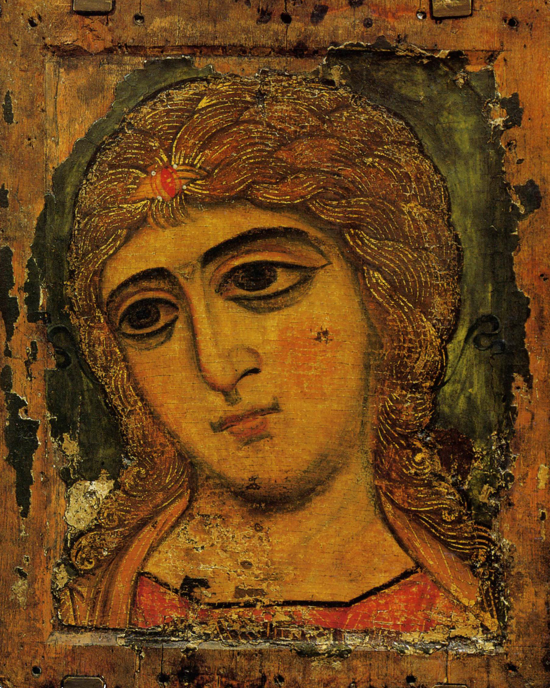

> **Первичный текст.** Справочник по межкультурному взаимодействию.
> Источник: `dotu.ru:9f42d6e3b57308a1.doc` sha256 `97540ede0a5b8ebb…`; [страница на dotu.ru](https://dotu.ru/books/handbook-of-intercultural-interaction/).
> Автоматическая транскрипция DOC→Markdown; смысл и формулировки не правились.
> Контрольные суммы и статус проверки — в [NOTICE.md](../../NOTICE.md).
> Содержание передаёт позицию авторов; утверждения не верифицированы библиотекой.

---

## 5.4. Богословские аспекты культурологии и глобальная политика

Вероучение (вероисповедание) и религиозность — это разные явления, хотя слова «вероучение» и «религия» часто употребляются как синонимы. Но такое их употребление ошибочно.

- Вероучение (вероисповедание) — совокупность идей религиозного характера, носителем которых является индивид или какая-то социальная группа единоверцев.

- Религиозность — это личностное явление, и она может быть двоякой:

<!-- -->

- практика взаимодействия индивида с эгрегорами, сложившимися на основе тех или иных вероучений, которые так или иначе мешают ему вести диалог с Богом вплоть до полной изоляции индивида от молитвенного общения с Богом;

- сокровенный диалог с Богом по жизни через совесть без лицемерия и попыток обмануть себя и Всевышнего ссылками на свои мнения, на традиции вероисповедания и их догматику и авторитетные «предания старцев».

Реально религиозность в первом смысле складывается под воздействием вероучений, которые могут подавлять и искажать религиозность во втором смысле этого слова вплоть до полного её уничтожения.

Вероучения реально оказали сильное влияние на становление и качество всех национальных культур. Во всём разнообразии вероучений в их множестве можно выделить три, которые связаны с глобализацией в её исторически наличествующем виде и с глобальной политикой. Это вероучения иудаизма, христианства, ислама, называемые «авраамическими», поскольку все они признают Авраама (Тора и христианская Библия) — Ибрагима (Коран) первым в истории нынешней (послепотопной) глобальной цивилизации исповедником единобожия (не считая Ноя, спасённого Богом представителя предшествующей цивилизации). Все прочие вероучения носят индивидуалистический характер в пределах национально своеобразного общества (синтоизм в Японии, индуизм в Индии) или региональный характер (буддизм) и не связаны с глобализацией и её концепцией.

Однако приверженцы трёх авраамических вероучений, на словах признавая Бога, ниспославшего Аврааму (Ибрагиму) Откровение, выразившее идею единобожия, своим Богом, на протяжении всей истории конфликтуют между собой, и их конфликты — один из факторов осуществления глобализации. Соответственно обеспечение безопасности развития многонационального общества требует адекватного представления о содержании каждого из этих вероучений и их разногласиях, если не по всем, то по наиболее значимым вопросам.

Авраамические вероучения включают в себя два аспекта:

- первый — богословский: учение о Боге и взаимоотношениях человечества и каждого человека с Ним.

- второй — социологический: учение об организации жизни общества и взаимоотношениях людей друг с другом и отчасти — с природной средой.

И каждое авраамическое вероучение обладает своею спецификой в этих аспектах, отрицая при этом мнения двух других вероучений.

**В аспекте богословия разногласия таковы:**

Иудаизм и ислам едины в исповедании единобожия и отрицают как заблуждение догмат о троице (едино-троичности Бога) исторически реального христианства[^576]. При этом ислам обвиняет исторически реальный иудаизм в отступничестве от Откровения, данного через Моисея, и подмене его некой отсебятиной [^577], [^578].

Иудаизм отрицает Христа в качестве Мессии и тем самым отрицает истинность Откровения, данного Свыше через Христа[^579], отрицает факт рождения Христа от Духа Святого, представляя Марию блудливой женщиной. Ислам признаёт Откровения, данные Моисею, Христу и другим пророкам, которые пришли в мир ранее Мухаммада, и учит, что Христос — зачат девой Марией от Духа Святого и был воплощённым словом Божиим, но отвергает «богосыновство» Христа. Кроме того, ислам отвергает распятие и воскресение Христа[^580], и Коран даёт понять, что первыми отступниками от учения Христа были апостолы[^581], в силу чего исторически реальное христианство, созданное апостолами, весьма далеко от того, что нёс сам Христос, и именно отступничество иудаизма и христианства от исходных Откровений и вызвало потребность в том, чтобы пришёл Мухаммад и восстановил вероучение единобожия в его истинном, не искажённом людьми виде, что и запечатлено в Коране, ниспосланном через архангела Гавриила[^582] (ниже репродукция иконы «Ангел Златы Власы — архангел Гавриил»; сама икона представлена в экспозиции Русского музея в Санкт-Петербурге).

Христианство во всех его ветвях признаёт Откровения, данные ветхозаветным пророкам, начиная от Моисея; обвиняет иудаизм в отрицании Христа, данного через него Откровения и учит, что люди оправдаются на страшном суде верой в крестную жертву Христа — «Бога Сына».

Христианство и иудаизм едины в том, что не признают Мухаммада в качестве посланника Всевышнего и, соответственно, отрицают Коран в качестве записи последнего Откровения[^583].

В христианских традициях одно из «доказательств» того, что Мухаммад не является истинным пророком, основывается на утверждении, что о приходе Мухаммада не говорит никто из ветхозаветных пророков, и о его приходе ничего не говорит Христос. Один из таких упрёков принадлежит американскому евангелическому проповеднику Дж. Мак-Дауэллу: «Магометанство (мусульманство) не может указать ни на одно пророчество о приходе Магомета (Мухаммада), которое было бы сделано за сотни лет до его рождения»[^584].

Однако это и другие аналогичные ему утверждения аргументируются ссылками на переводы библейских текстов на другие языки с языков, на которых были написаны изначальные тексты. Причём исторически сложившиеся переводы библейских текстов не всегда являются прямыми переводами с языков оригиналов, не говоря уж о том, что каждый перевод всегда выражает понимание / недопонимание исходного текста переводчиками даже в том случае, если на переводчика не оказывает давление задача «угодить заказчику перевода или спонсору издания перевода»[^585]. В силу этих неустранимых особенностей работы переводчиков А.С. Пушкин охарактеризовал переводчиков словами — «подставные лошади просвещения»[^586].

Кроме того, сами переводы редактировались на протяжении веков для того, чтобы они лучше соответствовали политическим потребностям эпохи[^587]. И также надо понимать, что и языки живут своею жизнью, вследствие чего меняются словарные значения слов и контекстуально обусловленный их смысл.[^588]

Дж. Мак-Дауэлл и другие не в курсе, что этот вопрос тоже изучался мусульманскими богословами и их мнение противоположное: в частности, см. книгу «Мухаммад в Библии»[^589]. Её автор — профессор Абдуль-Ахад Дауд, урождённый Давид Бенджамин Кельдани, сначала стал католическим священником, но позднее принял ислам. Он владел языками оригиналов библейских текстов и Корана и, опираясь на тексты на языках оригиналов, пришёл к выводу, что в текстах Библии на языках оригиналов-первоисточников неоднократно указывается на предстоящий приход Мухаммада.

В иудаизме многие раввины расценивают Коран и ислам в целом, как подражание иудаизму, а не как самостоятельное социокультурное и мистическое явление, не проистекающее из исторически сложившегося иудаизма. Поэтому до начала эпохи активизации псевдоисламского терроризма они относились к исламу снисходительно. В 30-х годах ХIX в. философский факультет Боннского университета объявил о назначении премии за сочинение на тему о том, что Мухаммад взял из иудаизма. Вскоре премию выиграл раввин Авраам Гейгер (1810 — 1874). Книга Гейгера издавалась по крайней мере трижды: в 1833 — на немецком и в 1898, 1970 гг. — на английском. Из этого можно понять, что эти мнения по-прежнему актуальны для приверженцев иудаизма на протяжении более, чем ста лет. Но дело состоит как раз в другом: В чём Коран обличил исторически реальный иудаизм и насколько истинны коранические обличения? — На этот вопрос раввинат ответить не желает.

В таком снисходительном отношении к исламу с иудаизмом солидарны и некоторые христианские богословы.

**В аспекте социологии разногласия таковы:**

Иудаизм настаивает на том, что иудеи-евреи — народ богоизбранный, миссия которого властвовать над всем миром, прочими народами[^590] и привести человечество к судному дню. Все остальные народы имеют право на существование только под властью богоизбранного народа, а те народы, которые не желают служить богоизбранному народу, так или иначе сгинут. Основу власти иудеев над миром согласно Торе (Ветхому завету) составляет монополия иудейских кланов на транснациональное ростовщичество. Соответствующие выдержки из Библии были представлены в разделе 2.3.

Христианство, признавая факт богоизбрания иудеев-евреев в прошлом, отрицает их богоизбранность в эпоху после первого пришествия Христа на том основании, что иудеи отвергли Христа и его учение. При этом исторически сложившееся христианство не содержит в себе какой бы то ни было альтернативной иудаизму доктрины организации жизни общества и его экономики, что открывает дорогу для того, чтобы и в новозаветные времена действовали ветхозаветные принципы осуществления власти над миром некогда богоизбранных.

В результате, если культуры сложившиеся на базе обоих вероучений (иудаизма и христианства) рассматривать как информационно-алгоритмические системы, то они взаимно функционально дополняют друг друга в рамках библейского проекта порабощения человечества от имени Бога. Иерархии всех исторически сложившихся так называемых «христианских церквей», включая и иерархию Православия в России, настаивают на боговдохновенности этой концепции, а канон Нового завета провозглашает её от имени Христа, *безо всяких к тому оснований,* до скончания веков в качестве благого Божьего Промысла. Это также было показано в разделе 2.3. Также отметим, что в каноне Нового завета есть четыре биографических справки («объективки», если в терминах спецслужб) о жизни и деятельности Иисуса по прозвищу Христос, но нет текста под названием «Благая весть миру Иисуса Христа, в изложении его ученика такого-то»[^591]. Кроме четырёх биографических справок, одна из которых написана Лукой, который с Христом вообще знаком не был, в Новый завет включены тексты о деяниях апостолов и их послания. Поэтому правомерен вопрос, на который иерархи христианских церквей и их паства ответить не могут: *Где сама́ Благая весть миру Иисуса Христа? Кто, когда и как её сокрыл?*

Подавляющее большинство церковников уходят от обсуждения проблематики воздействия Библии на историю в прошлом и на политику в настоящем. Тем не менее, единицы из числа церковных авторитетов доходят до осознания глобально-политической сути библейского проекта, что было показано в разделе 2.3 в выдержках из письма П.А. Флоренского В.В. Розанову от 26 октября 1913 г., но мало кто может его отвергнуть и обличить исторически реальные иудаизм и христианство в богоотступничестве.

Ислам признаёт факт богоизбранности иудеев-евреев в прошлом, объясняет это избранничество миссией просвещения всех других народов (нести Тору), от которой исторически реальный иудаизм уклонился[^592]. При этом Коран признаёт веру и иудеев, и христиан, если те живут в соответствии с неизолганными изначальными Откровениями, положившими начало каждому их этих двух авраамических вероучений[^593]. Коран многократно порицает ростовщичество, характеризуя его как разновидность сатанизма[^594].

Коран против азартных игр и метания жребиев по любым поводам (это «майсир» — в переводе И.Ю. Крачковского) и предлагает абсолютную трезвость в качестве нормы жизни[^595], [^596].

Коран предлагает человеку диалог с Богом без посредников по жизни[^597] и уведомляет, что Любовь — следствие беззаветной, безоговорочной, безусловной искренней самоотдачи человека Богу[^598]. И миссия всех людей быть наместниками Божиими на Земле[^599], [^600].

Но для подавляющего большинства мусульман арабский язык не родной, вследствие чего Корана они не знают, и не понимают соотношения Корана и жизни. В арабском же мире, сложилась традиция истолкования Корана, которая подменила собой Коран и его смысл. И то, и другое открывает широкие возможности к тому, чтобы политтехнологи в прошлом и в настоящем манипулировали толпами приверженцев мусульманской обрядности.

Однако большинство конфессиональных богословов не понимают главного:

- все текстуальные и смысловые совпадения в различных священных писаниях обусловлены не заимствованиями, а тем, что все они ниспосланы из Единого Источника;

- а все расхождения в священных писаниях обусловлены людской отсебятиной (вольной или невольной).

Те же, кто искренне и *бесстрашно* начинает задумываться об этом, неизбежно становятся отступниками от конфессий и становятся беззаветно верующими Богу.

**Советский период истории России и библейский проект**

Фактически реализация марксистского проекта была попыткой реализовать библейский проект порабощения человечества, но без ссылок на иудаизм и его расистско-фашистскую доктрину. Это направление политики под знамёнами марксизма олицетворял собой и возглавлял Л.Д. Троцкий: расизм в марксизме сохранялся под личиной интернационализма, но реализовывался негласно на мафиозных принципах, что видно по статистике персонального состава «выдающихся деятелей марксизма» — как в политике, так и обществоведческих науках, обслуживавших «мраксистский» проект.

Второе направление в политике под знамёнами марксизма — это большевизм. До 1924 года его олицетворял и возглавлял В.И. Ленин, а после смерти В.И. Ленина 21.01.1924 лидером большевиков, продолжателем дела В.И. Ленина[^601] и олицетворением большевизма стал И.В. Сталин.

Если говорить о сути большевизма, то фактически большевизм был нацелен на реализацию коранического идеала: провозглашённая большевиками цель политики — построение бесклассового общества, в котором все люди равны в своём достоинстве и никто не может быть ни рабом, ни господином другому, труд свободен, паразитизм (как системно организованный, так и стихийный эпизодический) одних людей на труде и жизни других исключён.

Это полностью соответствует кораническим заповедям. Коран прямо указует и на ОШИБОЧНОСТЬ существования ВНУТРИСОЦИАЛЬНЫХ ИЕРАРХИЙ ЛИЧНОСТЕЙ:

«... приходите к слову равному для нас и для вас, (...) чтобы одним из нас не обращать других из нас в господ помимо Бога» (3:57); «Вы были на краю пропасти огня, а Он спас вас оттуда. Так разъясняет вам Бог Свои знамения, — может быть вы пойдете прямым путём! — и пусть будет среди вас община, которая призывает к добру, приказывает одобренное и удерживает от неодобряемого. Эти — счастливы» (3:99, 100).

Христос об этом же говорил прямо:

«… благовествовать Я должен Царствие Божие, ибо на то Я послан» (Лука, 4:43). Закон и пророки до Иоанна; С сего времени Царствие Божие благовествуется и всякий усилием входит в него (Лука, 16:16). Ищите прежде Царствия Божия и Правды Его, и это всё (по контексту благоденствие земное для всех людей) приложится вам (Матфей, 6:33). Ибо говорю вам, если праведность ваша не превзойдёт праведности книжников и фарисеев, то вы не войдёте в Царство Божие (Матфей, 5:20). «Вы знаете, что князья народов господствуют над ними, и вельможи властвуют ими; но между вами да не будет так: а кто хочет между вами быть большим, да будет вам слугою; и кто хочет между вами быть первым, да будет вам рабом; так как Сын Человеческий не для того пришёл, чтобы Ему служили, но чтобы послужить и отдать душу Свою для искупления многих» (Матфей, 20:25 — 28)».

В исторически реальном христианстве это Учение объявлено ересью[^602] и замещено иным, вкратце выраженном в «Символе веры», в котором нет ни единой мысли, высказанной Христом.

И всё это касается как взаимоотношений людей в пределах этнически однородного общества, так и национальных взаимоотношений и в личностном масштабе, и в общенародном. Только искоренение эксплуатации «человека» «человеком» способно решить проблемы национальных взаимоотношений и создать лад личностных взаимоотношений в масштабах общества, будь оно этнически однородным либо многонациональным.

Поэтому, даже если говорить о восстановлении патриаршества в Русской православной церкви и прекращении гонений в отношении представителей церкви в 1943 г. И.В. Сталиным, то это было сделано:

- вовсе не для того, чтобы они снова возобновили проповеди на тему «рабы, повинуйтесь господам…»[^603],

<!-- -->

- а для того, чтобы дать иерархии и пастве РПЦ шанс вернуться к истинному изначальному христианству[^604], о какой необходимости святитель, епископ Игнатий Брянчанинов писал ещё в 1862 — 1866 гг. в записке «О необходимости Собора по нынешнему состоянию Российской Православной Церкви»[^605], и что проигнорировала монархия Романовых, подмявшая под себя иерархию РПЦ[^606].

Не оглашённая сопричастность большевизма в СССР исламу ощутима некоторыми врагами большевизма и ислама. Так И.Л. Бунич, автор многих книг об утаиваемых и о сокрытых сторонах истории России («Золото партии», «Таллинский переход» и др.), возможно, что ради «красного словца», ляпнул фразу: «Должности диктатора или имама в СССР не полагалось»[^607].

И.Л. Бунич увидел в И.В. Сталине не только диктатора, каким его видят многие досужие интеллигенты-либералы, но и имама — духовного лидера в коранической культуре, отрицающей библейский проект порабощения человечества в целом и его марксистскую модификацию, в частности. Если это — историческая правда и тайная информация одного из мусульманских суфийских орденов, то слова песни «идет война народная, священная война» обретают ещё один смысл: поскольку священная война — джихад, то **сокровенный имам Сталин возглавил руководство джихадом**[^608]**.** **Нравится “правоверным” мусульманам это утверждение или нет, но объективно, если судить по направленности политики Сталина, он всю жизнь работал на то, чтобы воплотить в жизнь идеалы, идентичные кораническим, т.е. был <u>имамом вне ритуалов</u>.** Кроме того, в условиях, когда культура в силу разного рода обстоятельств не допускает открытого исповедания Ислама, мусульманин не обязан открыто заявлять о своей сопричастности Богу[^609].

Демон по типу строя психики — Л.Д. Троцкий, в миропонимании которого не было места Богу как реально существующему Субъекту — Вседержителю, вследствие чего — *с его точки зрения — на Земле не может быть и людей, водительствуемых Богом,* выразился ещё более определённо, увидев в Сталине *человека-персонификацию Бога,* причем персонификацию не бога никейских церквей Библии, а Бога Корана:

«В религии сталинизма Сталин занимает место бога со всеми его атрибутами. Но это не христианский бог, который растворяется в Троице. Время тройки Сталин оставил далеко позади. Это скорее — Аллах, — нет Бога, кроме Бога — который наполняет вселенную своей бесконечностью. Он средоточие, в котором всё соединяется. Он господь телесный и духовный мира, творец и правитель. Он всемогущ, премудр и предобр, милосерден. Его решения неотмеримы. У него 99 имён»[^610].

В приведённой цитате значимо и то обстоятельство, что Л.Д. Троцкий, помянув «Троицу» и «христианского бога», ни слова не сказал о разногласиях Бога Корана, чей Промысел для него персонифицирован И.В. Сталиным, с иудейским богом Талмуда и марксизма самого Л.Д. Бронштейна.

В прошлом эта идентичность идеалов большевизма и Ислама приводила и к таким предложениям в адрес СССР со стороны руководителей ряда государств, в которых ислам — традиционное вероисповедание: «Вы строите коммунизм, мы строим социализм, — так давайте строить коммунизм вместе под руководством Аллаха». Но предложения такого рода были абсурдны для послесталинского руководства СССР по причине их атеистических *убеждений = предубеждений = заблуждений*.

\* \* \*

Понятно, что воплощение в жизнь коранических идеалов (а равно идеалов большевизма) ставит библейский проект порабощения человечества от имени Бога в состояние невозможности реализации. И поскольку глобализация на основе библейского проекта это — гибридная война, то один из принципов её ведения — «Разделяй и властвуй!». Одно из направлений реализации этого принципа — создание образа врага в подвластных обществах. Покажем, как на то, чтобы мир ислама стал врагом работала АН СССР.

В 1950‑е — 60‑е гг. АН СССР издавала 13-томник «Всемирная история» (на фото ниже: фолианты в два — три пальца толщиной, формата, несколько большего, чем А4). В нём не найти ни слова о расистских бреднях и рабовладении в мировых масштабах заправил библейского проекта порабощения человечества от имени Бога. Т.е. «спецами» по всемирной истории не выявлен глобально-политический проект порабощения человечества, и Библия не порицается ни в чём, но Кораническому учению нагло приписываются рабовладельческие воззрения прямо противные смыслу стратегической Коранической доктрины общественной жизни, и сопровождается эта ложь неопределёнными (т.е. без указания аятов и цитирования) ссылками на Коран. Раздел «Основы идеологии раннего ислама», главы VII «Аравия к началу VII в. Арабские завоевания и арабский халифат (VII — X вв.)», том III, с. 108, 109 сообщает (вся орфография цитируемого источника сохранена):

*[В оригинальном издании здесь расположен рисунок/схема. Иллюстрация не включена в данный выпуск: ожидает визуальной и правовой проверки. Файл источника: image45.jpeg]*«Ислам возлагал на верующих мусульман пять обязанностей («пять столпов ислама»): исповедание догмата единобожия и признание пророческой миссии Мухаммеда, выраженные в формуле «нет божества кроме бога (аллаха), и Мухаммед — посланник божий»[^611], ежедневное совершение молитв по установленному обряду, отчисление *закята* (сбор 1/40 доли дохода с недвижимого имущества, стад и торговых прибылей) формально в пользу бедных. Фактически же в распоряжение арабо-мусульманского государства, соблюдение поста в месяце рамадане и паломничество в Мекку (*хадж*), обязательное впрочем, только для тех, кто был в состоянии его совершить. Учение ислама об ангелах, о страшном суде, о загробном воздаянии за добрые и злые дела, о дьяволе и аде было таким же, как и у христиан. В мусульманском раю верующим обещались всевозможные наслаждения.

Ислам предписывал мусульманам участие в священной войне (*джихад*) с «неверными». Учение о войне за веру и о спасительном значении участия в ней для душ верующих развивалось постепенно в процессе завоеваний. По отношению к иудеям и христианам (а позднее и к зороастрийцам) допускалась веротерпимость, однако при условии, что те подчинятся, станут подданными мусульманского (т.е. арабского) государства и будут платить установленные для них подати.

Священная книга мусульман — Коран («Чтение»), по учению ислама, существовала извечно и была сообщена богом Мухаммеду, как откровение. Речи Мухаммеда, выдаваемые им за «откровения от бога», записывались согласно преданию, его последователями. Эти записи в дальнейшем, несомненно, подвергались обработке. В Коран вошли также многие библейские сказания. Коран был собран в единую книгу, отредактирован и разделён на 114 глав (*сур*) уже после смерти Мухаммеда, при халифе Османе (644 — 656). Влияние мекканских рабовладельцев и купцов отразилось на их языке, и на идеях Корана. Слова «обмеривающие», «кредит», «долг», «лихва» и им подобные не раз встречаются в Коране. **В нём оправдывается институт рабства** (выделено нами жирным при цитировании). В основном идеология Корана направлена против общественных институтов первобытнообщинного строя — межплеменной борьбы, кровной мести и т.п., а также против многобожия и идолопоклонства.

В Коране есть специальная глава «Добыча», которая стимулировала в воине-арабе желание идти в поход: 1/5 военной добычи должна была поступать пророку, его роду, вдовам и сиротам, а 4/5 выделялись в раздел войску из расчёта: одна доля пехотинцу и три доли всаднику. Военная добыча состояла из золота, серебра, пленников-рабов, всякого движимого имущества и скота. Завоёванные земли не подлежали разделу и должны были поступать во владение мусульманской общины. Убитым на войне — «мученикам за веру» ислам обещал райское блаженство. Считалось, что в рабство можно обращать лишь иноверцев. Однако принятие ислама людьми, уже обращёнными раньше в рабство, не освобождало от рабства ни их, ни их потомков. Дети господ и рабынь, признанные своими отцами, считались свободными. Ислам разрешал мусульманину иметь одновременно до 4 законных жён и сколько угодно рабынь-наложниц.

Для начального ислама не существовало разницы между духовными лицами и мирянами, между мусульманской общиной и государственной организацией, между религией и правом. Сложившееся постепенно между VII и IX в. мусульманское право первоначально основывалось на Коране. К этому главному источнику права с конца VII в. присоединился ещё и другой — предание (*сунна*), состоявшее из *хадисов*, то есть рассказов из жизни Мухаммеда. Много этих хадисов было сочинено в среде «сподвижников пророка» — мухаджиров и ансаров, а также их учеников. По мере того, как арабское общество развивалось и жизнь его становилась всё более сложной, выяснялось, что Коран и хадисы не дают ответа на многие вопросы. Тогда появились ещё два источника мусульманского права: *иджма —* согласованное мнение авторитетных богословов и правоведов и *кыяс* — суждение по аналогии.

Советские историки по-разному трактуют социальную основу раннего ислама. Согласно указанной выше первой концепции, в раннем исламе отразился процесс разложения первобытно-общинного строя и сложения рабовладельческого уклада в североарабском обществе. Только впоследствии, в связи с феодализацией арабского общества, ислам постепенно развился в религию феодального общества. Согласно же второй концепции, ислам с самого начала был идеологией раннефеодального общества, хотя более ярко социальная сущность его выявилась позже, после арабских завоеваний».

Вот такие похотливые и алчные мракобесы и агрессоры эти мусульмане, чуть ли не хуже нацистов, если верить академической науке времён СССР.

Рассматриваемый академический 13-томник совершенно правильно сообщает, что «слова “обмеривающие”, “кредит”, “долг”, “лихва” и им подобные не раз встречаются в Коране». Однако он подло пакастливо умалчивает о том, как они в нём упоминаются. Поэтому, чтобы показать подлость и заведомую лживость авторского коллектива этого 13-томника[^612] и их анонимных *кураторов*, приведём некоторые выдержки из Корана.

Как уже сообщалось ранее (сноска 104, раздел 5.4), Коран (сура 2:275 — 277, в частности) налагает категорический запрет на ростовщичество — кредитование под процент, а приведённая выше библейская доктрина скупки мира на основе иудейской мафиозно-корпоративной монополии на ростовщичество в международных глобальных масштабах и порождаемая ею система долгового рабства расценивается в Коране безальтернативно как явное выражение сатанизма.

Ведётся в Коране речь и об обмеривании и обвешивании, но не так, как можно подумать в контексте приведённого фрагмента из академического 13-томника:

«Полностью соблюдайте меру и вес. Не снижайте людям в их вещах и не портите землю после её устройства. Это — лучше для вас, если вы верующие!» (Коран, 7:85).

«Не будьте как те, которые вышли из своих жилищ с гордостью и лицемерием пред людьми. Они отстраняют от пути Бога, а Бог объемлет то, что они делают» (Коран, 8:47).

Тот же самый клеветнический подход выражен и в «Большой Советской Энциклопедии», изд. третье, т. 13, с. 142:

«Коран освятил складывающиеся в Аравии социальное неравенство, институт частной собственности и др. атрибуты классового эксплуататорского общества».

О Библии же «Большая Советская Энциклопедия», т. 3, с. 313 повествует совсем иначе:

«Наряду с призывом к улучшению положения угнетенных (особенно в книгах Пророков) и к разрушению римской империи (Апокалипсис) в Библии господствует апология монаршей власти, общественного неравенства, собственности. (...) Признанная священной («боговдохновенной») книгой христ. церкви, Библия на протяжении всего средневековья определяла форму выражения мысли в Европе. Библейская космогония, социальное учение, этика были признаны церковью непререкаемой нормой и использовались в интересах эксплуататорских классов. К Библии прибегали для оправдания привилегий феодалов, инквизиции, рабства, приниженного положения женщины. Еретические учения (в т.ч. павликианство и богомильство, отвергавшие боговдохновенность Ветхого завета) не столько оспаривали, сколько переосмысливали учение Библии, находя в ней подчас обоснование идеи равенства («Когда Адам пахал, а Ева пряла, кто был господином?»). Ссылками на Библию аргументированы крестьянские требования во время Великой крестьянской войны (1524 — 26) и программы Англ. бурж. революции».

То есть редакция «Большой Советской Энциклопедии» утверждает и подразумевает, что Коран прямо оправдывает несправедливость в обществе; но, что хотя Церковь и приспособила Библию к оправданию угнетения, тем не менее борцы с несправедливостью находили обоснование своей правоты в Библии. Однако исторически реально всё наоборот:

- Коран ниспосылался в исторически реальное общество, которое переживало кризис родоплеменных отношений и готово было перейти к чему-то другому, поэтому исторически сложившееся рабовладение принималось как данность, ислам (единобожие и жизнь людей в диалоге с Богом) провозглашался как образ жизни всего человечества в будущем и прямо говорилось, что мусульманин не может быть рабом мусульманина. Т.е. Коран однозначно предписывает справедливость и порицает угнетение, а обосновать господство одних над другими на его основе можно только кривотолкованием.

- Библия же прямо предписывает угнетение и покорность угнетению, хотя в ней можно найти отдельные фрагменты в обоснование борьбы с угнетением.

Тем не менее, терроризм от имени ислама — реальность наших дней (постсоветской эпохи) для почти всех более или менее высокоразвитых в научно-техническом и экономическом отношении стран мира вследствие чего в немусульманских культурах распространяется «исламофобия» и неприязнь к мусульманам и подозреваемым в симпатиях к исламу. Поэтому актуальны ответы вопрос:

- как создаётся терроризм, действующий от имени ислама?

- как его профилактировать?

Ответы на эти вопросы можно получить только, если мыслить процессно.

Начнём с того, что в 1970‑е гг. терроризм на западе был левацкий экстремистско-марксистский. Причины те же: угроза построения большевистского социализма в СССР и в Китае расценивалась хозяевами и заправилами библейского проекта как реальная и им надо было её профилактировать. Одно из направлений профилактирования — создать негативные предубеждения в обществах Запада.

- Но если СССР видится обывателю как гастроли Большого театра и Ансамбля песни и пляски Советской Армии, выставка картин из собрания Третьяковской галереи, Русского музея или Эрмитажа, то образ СССР как врага не складывается[^613].

- Но если появляется левацкий экстремитско-марксистский терроризм, то легко выстраивается примитивная логическая цепочка, доступная для понимания примитивного обывателя: **террористы — марксисты-коммунисты ⇒ марксизм — государственная идеология СССР и Китая ⇒ СССР и Китай — враги всего «цивилизованного мира» ⇒ они должны быть уничтожены либо измениться и стать частью «цивилизованного мира»**.

После того как СССР был уничтожен совместными усилиями местных предателей и их зарубежных кураторов[^614], заправилы библейского проекта решили, что эта задача решена и настало время решения другой глобально-политической задачи — искоренения ислама. Алгоритмика создания образа врага та же самая: **террористы — мусульмане ⇒ ислам — вероучение, под властью которого живут многие страны, которые всем обязаны передовому Западу (своей науки там нет, экономика неразвита либо подражательная, как в Турции) ⇒ ислам — враг всего «цивилизованного мира» ⇒ ислам должен быть искоренён, те мусульмане, что не одумаются, — должны быть уничтожены, а кто одумается и их потомки смогут стать частью «цивилизованного мира».**

В самом же исламском мире социальная база для вербовки и подготовки террористов тоже существует. Её наличие обусловлено тем, что издавна сами мусульмане пренебрегли поучением, которое огласил Мухаммад: *«Раб Божий получает от молитвы лишь то, что он понял».* И соответственно, если из молитвы индивид не вынес никакого жизненного смысла, то это эквивалентно тому, что он и не молился вовсе. И потому для многих таких, ложно почитающих себя истинными правоверными мусульманами, их «ислам» — всего лишь поклонение молитвенному коврику под чтение Корана, смысл которого они и в своём большинстве не знают, поскольку не знают арабского языка, который для большинства из них — не родной. Но и те, для кого арабский язык — родной, тоже не вникают в смысл Корана, дабы не соотносить свою жизнь с ним и не быть обременёнными нравственно-этической обязанностью человека — осознанно-осмысленно по своей воле жить в русле Промысла. Они довольствуются тем, что им объяснят муллы и прочие «авторитетные» мусульмане. Поэтому в так называемый «мусульманский мир» — реально псевдомусульманский, поскольку в нём жизнь по совести давно подавлена жизнью по шариату.

Если же обратиться к самому Корану, то в нём можно выявить три пласта информации:

1.  Информация, адресованная лично Мухаммаду, которая была для него руководством к действию в конкретике обстоятельств его жизни. В силу этого (никто из читателей Корана — не Мухаммад, и сейчас — не то историческое время, не те исторические обстоятельства) вся эта информация для нас — информация к размышлению, к выработке понимания миссии Мухаммада, его жизненного подвига, но не прямое руководство к действию.

2.  Информация, адресованная современникам и соотечественникам (единоплеменникам) Мухаммада, которая была для них руководством к действию в конкретике обстоятельств их жизни. В силу этого (никто из нынешних читателей Корана — не современники Мухаммада, и кроме того, они — не его единоплеменники[^615]) вся эта информация для нас — информация к размышлению, к пониманию той эпохи, её проблем, но не прямое руководство к действию.

3.  Информация, адресованная всем людям на все времена вне зависимости от их места жительства и эпохи. И только она — руководство к действию для всех нас вне зависимости от национальной принадлежности.

\* \* \*

Суть третьего пласта информации проста для понимания:

- **Человеку нормально жить в диалоге с Богом**[^616]**.**

- **Отклонять зло тем, что лучше**[^617] **(объективные различия добра и зла открываются в диалоге с Богом по совести).**

- **Стремиться опередить друг друга в добрых делах**[^618]**.**

И фундаментальный смысл жизни каждого человека, открывающий прочие благие смыслы его жизни, научиться жить в соответствии с этими тремя положениями: чем раньше — тем лучше.

\* \*\

\*

Псевдоисламский терроризм начала XXI века фабрикуется путём избирательного цитирования фрагментов Корана, принадлежащих к двум первым пластам информации, адресованным Мухаммаду лично и его современникам и соплеменникам и касающимся ведения первого в истории джихада, в результате победы в котором возникла мусульманская культура. Организаторы терроризма эти рекомендации возводят во мнении своих подопечных в ранг якобы данных на все времена вплоть до торжества ислама в глобальных масштабах, игнорируя *неведомые для подавляющего большинства исповедующих традиционных ислам* коранические предостережения, — такие, как:

- «Нет принуждения в религии. Уже ясно отличился прямой путь от заблуждения» (Коран, 2:257).

- «О вы, которые уверовали! Когда отправляетесь по пути Бога, то различайте и не говорите тому, кто предложит вам мир: "Ты не верующий", — домогаясь случайностей жизни ближней» (Коран, 4:94). — Это подразумевает запрет на прикрытие того или иного эгоизма религиозными мотивами[^619].

- «А если они уверовали в подобное тому, во что вы веровали, то они уже нашли прямой путь» (Коран, 2:137). — Это подразумевает, что Ислам — это определённые убеждения и следование им в жизни, и он не сводится к ритуальной безупречности.

- «Пусть не навлекает на вас ненависть к людям греха до того, что вы нарушите справедливость. Будьте справедливы, это ближе к богобоязненности, и остерегайтесь Бога, поистине Бог сведущ в том, что вы делаете» (Коран, 5:11).

- «А если кто-нибудь из многобожников просил у тебя убежища, то приюти его, пока он не услышит слова Божьи. Потом доставь его в безопасное для него место. Это — потому, что они — люди, которые не знают» (Коран, 9:6).

> Последнее особенно актуально для тех как бы мусульман, кто становится на путь уничтожения «неверных» под лозунгами «священной войны за веру», поскольку неверные в их большинстве просто невежественны. И потому первому джихаду, который начал Мухаммад, предшествовали десять лет мирной проповеди, в течение которых противники Ислама организовали несколько покушений на Мухаммада, организовали торговую блокаду первых мусульман, вследствие которой люди умирали. И только в ответ на эти *злодейства, мотивированные религиозными причинами,* Мухаммаду было повелено Свыше начать джихад.

- «Держись прощения, побуждай к добру и отстранись от невежд» (Коран, 7:198).

Но само по себе различие вероисповеданий согласно тому, *что сказано в Коране не двусмысленным образом,* не может быть причиной войны. Тем более в Коране сообщается: «К Богу — возвращение вас всех \<после завершения земной жизни\>, и Он сообщит вам то, о чём вы разногласили!» (Коран, 5:48).

Соответственно, единственная работоспособная стратегия искоренения псевдоисламского терроризма — приобщение мусульман и прочих к смыслу Корана на основе перевода исходного арабского канонического текста на их родные языки с последующим разъяснением роли каждого из названных выше трёх пластов информации[^620].

Но эта стратегия противна библейскому проекту порабощения человечества от имени Бога, в котором реализуется многовариантный сценарий «окончательного решения исламского вопроса»:

- Вариант первый — построение псевдоисламского «всемирного халифата», который начнёт войну против остального мира с целью заставить всех поклоняться молитвенному коврику, с последующим разгромом халифата «цивилизованным человечеством», занесением Корана в «спецхраны» библиотек и допуском до него только доверенных лиц, которые будут объяснять, что в Коране нет никаких иных смыслов кроме истребления всех инаковерующих, осуществлением «деисламизации» некогда мусульманских обществ аналогично тому, как была осуществлена «денацификация» Германии после разгрома третьего рейха.

- Вариант второй — победа псевдоисламского «всемирного халифата» войне против впавшего в неверие остального человечества с последующим принуждением всех побеждённых поклоняться молитвенному коврику и уничтожением несогласных. Такой исход войны позволяет решить проблему глобального биосферно-социального кризиса путём уничтожения либерально-буржуазной культуры, породившей этот кризис. Далее халифат впадёт в кризис сам и рухнет управляемым образом вследствие деградации правящей «элиты», как деградировали и рухнули державы, где Ислам был подменён поклонением молитвенному коврику: Золотая орда, Османская империя, шахский Иран. Далее — «деисламизация» по первому варианту и установление «нового мирового порядка», характер которого будет обусловлен сложившимися к тому времени обстоятельствами и глобально-политическими задачами при сохранении и в будущем власти хозяев и заправил библейского проекта порабощения человечества от имени Бога.

Президент Турции Эрдоган копошится в рамках первого этапа обоих вариантов — попытка создания «всемирного халифата», который должен объединить тех, кто не знает смысла Корана, но готов ритуально безупречно поклоняться молитвенному коврику и блюсти «пять столпов ислама». Но это — одна из версий отступничества от Ислама.

На этот же сценарий в России работает и отказ в переводах Корана на русский язык употреблять слово «Бог», сохраняя арабское слово «Аллах», имеющее то же самое значение. Это создаёт иллюзию, что Бог и Аллах — это разные субъекты, в силу чего якобы достаточно «верить в Бога» традиционным образом, а к Аллаху относиться, как к чему-то чуждому своей истиной вере.

Главное же в том, что этот сценарий осуществления глобальной «деисламизации»[^621] не учитывает коранического обетования: «Бог написал: "Одержу победу Я и Мои посланники!"» (Коран, сура 58:21). И если кто-то с этим обетованием не согласен либо относится к нему скептически в силу сложившихся антиисламских предубеждений, то в Коране есть предостережение: «Видите ли, если он (Коран) от Бога, а вы не веруете в него (Коран), то как вы оправдаетесь в этом перед *\<его\>* Ниспославшим?» (сура 41, аят 52). **— Поэтому каждому человеку следует ПРОЧУВСТВОАННО-ВДУМЧИВО прочитать Коран хотя бы раз *как послание заботливого друга, адресованное ему лично*.**

\* \* \*

Либерально-буржуазный капитализм, породивший глобальный биосферно-социальный (экологический) кризис, возник на основе протестантской идеологии, представляющей собой одну из вариаций Библейской идеологии. Первые предзнаменования к этому в виде стойких локальных загрязнений природной среды отходами производств в промышленных районах появились в конце XVIII — начале XIX веков. Одновременно европейский капитализм породил такое расслоение на сверхбогатых и нищих, какой прошлая история в период после краха рабовладения не знала. Последнее вызвало как стихийное массовое недовольство «низов общества», так и неприятие такого жизненного уклада общества разного рода гуманистами. В результате начались первые поиски путей перехода к социалистическому (общинному) хозяйственному укладу. Они носили инициативный локальный характер в том смысле, что проводились на основе какого-то одного или нескольких предприятий. Тем не менее, они были замечены творцами глобальной политики и осмысленны как возможность решения проблемы роста социальной напряжённости (классовой борьбы) и проблемы зарождающегося глобального экологического кризиса. Однако в условиях буржуазно-либеральной макроэкономической системы общинные социально-экономические системы с малым количеством участников, не обладающие качеством самодостаточности в аспекте производства и потребления, не могли решить этих проблем, поскольку структура их доходов-расходов в той рыночной конкурентной среде была идентична структуре доходов-расходов частно-капиталистических предприятий. Понимая это, заправилы глобальной политики взяли курс на построение общинно-социалистических макроэкономических систем, которые должны были слиться в глобальную общинно-социалистическую систему и тем самым завершить глобализацию. В соответствии с этими устремлениями возник марксизм как идейная основа мировой социалистической революции, которая должна была решить обе проблемы: 1) свести к минимуму социальную напряжённость, обусловленную расслоением на сверхбогатых и беспросветно бедных, обеспечив всем «разумный достаток», и 2) ликвидировать гонку потребления, порождающую экологические проблемы. Так появился марксизм, основоположником которого стал внук двух раввинов.

Лукавство марксизма в том, что его политэкономия метрологически несостоятельна: такие категории, как «необходимый продукт», «прибавочный продукт», «необходимое» и «прибавочное рабочее время» — фикции, которые невозможно выявить и измерить в ходе хозяйственной деятельности; а перенос стоимости со средств производства на продукцию — бухгалтерская операция (амортизационные отчисления), подчинённая законодательству, а не реально существующий процесс, не говоря уж о том, что стоимость — некая оценка, а не объективное явление, поддающееся однозначно определённому измерению. Как было отмечено ранее, на метрологическую несостоятельность политэкономии марксизма впервые публично указал И.В. Сталин, в своей работе-завещании «Экономические проблемы социализма в СССР», предложив советским экономистам отказаться от метрологически несостоятельных категорий марксистской политэкономии.

«... наше товарное производство коренным образом отличается от товарного производства при капитализме»[^622].

Это действительно было так, поскольку налогово-дотационный механизм был ориентирован на снижение цен по мере роста производства. И после приведённой фразы И.В.Сталин продолжает:

«Более того, я думаю, что необходимо откинуть и некоторые другие понятия, взятые из “Капитала” Маркса, ... искусственно приклеиваемые к нашим социалистическим отношениям. Я имею в виду, между прочим, такие понятия, как “необходимый” и “прибавочный” труд, “необходимый” и “прибавочный” продукт, “необходимое” и “прибавочное” время. (…)

Я думаю, что наши экономисты должны покончить с этим несоответствием между старыми понятиями и новым положением вещей в нашей социалистической стране, заменив старые понятия новыми, соответствующими новому положению.

Мы могли терпеть это несоответствие до известного времени, но теперь пришло время, когда мы должны, наконец, ликвидировать это несоответствие».[^623]

Но марксистская политэкономия — порождение философии диалектического материализма. И поскольку она породила дефективную метрологически несостоятельную политэкономию и не заметила своей ошибки, то это указывает на несостоятельность теории познания — гносеологии марксизма. Таким образом из трёх источников, трёх составных частей марксизма[^624] (диалектический материализм, политэкономия, учение о социализме) два (философия диалектического материализма и политэкономия) оказываются научно (жизненно) несостоятельными, что превращает третий (учение о социализме) в своего рода приманку для тех, кому неприемлем капитализм, и кто при этом полагается на авторитеты тех или иных учений, интеллектуалов, вождей.

Поэтому, указав на метрологическую несостоятельность политэкономии марксизма, И.В. Сталин по сути вынес смертный приговор всему марксизму, поскольку пройти цепочку не оглашённых И.В. Сталиным взаимосвязей (дефективная политэкономия — следствие дефективности диалектического материализма — философской основы марксизма) и огласить итоговый вывод *«марксизм научно несостоятелен и потому опираться на него в политической практике недопустимо»* — это вопрос времени. И именно этого И.В. Сталину не могут простить заправилы глобальной политики на основе библейского проекта порабощения человечества от имени Бога и истребления несогласных с ним.

В итоге марксистский проект потерпел крах, но проблемы, порождаемые либерально-буржуазным капитализмом не только остались, но и усугубились. Со второй половины ХХ века заправилы глобальной политики их решают иным способом:

- стимулирование биологического вырождения и культурной деградации народов, чьи культуры несут идеологию буржуазного либерализма и соответствующую хозяйственную практику;

- замещение в государствах, породивших буржуазно-либеральный капитализм коренного населения мигрантами-пришельцами — носителями иных культур, которые не желают осваивать культуру обществ тех стран, в которые они переселились под давлением разного рода искусственно созданных обстоятельств (войны, экономическая разруха) и при поддержке периферии заправил глобальной политики. Обслуживание миграции — транзита из зон целенаправленно организованных бедствий в экономически благополучные страны региональной цивилизации Запада, социальное обеспечение прибывших мигрантов за счёт принимающей стороны — это бизнес, востребованный и «крышуемый» заправилами глобальной политики.

Поэтому исторически сложившиеся (коренные) народы Европы, а также других стран Запада поставлены перед выбором:

- либо они уходят в историческое небытие вместе с буржуазно-либеральным капитализмом и замещаются пришлым населением и его потомками, которые несут иную культуру и не хотят осваивать культуру буржуазного либерализма (этот проект связан и с проектом «всемирного халифата»);

- либо они переходят к национал-социализму, а проблему агрессии и паразитизма мигрантов на коренных жителях решают через концлагеря по обстоятельно отработанным методам третьего рейха.

Однако, оба навязываемых глобализаторами варианта выбора ошибочны, каждый по-своему, поскольку правильный выбор — переход всех к культуре, в которой человечный тип строя психики достигается всеми к началу юности, после чего все живут, реализуя свой познавательно-творческий потенциал осознанно-волевым порядком под властью диктатуры совести. Но этот вариант выбора толпе в странах Запада не предлагается, а в постсоветской России как минимум не поддерживается государственной властью, а в ряде случаев предпосылки к нему подавляются «правоохранителями» [^625]. Но во избежание катастрофы глобальной цивилизации необходимо реализовать именно этот вариант. Он же и определённая ноосферная защита от пандемий[^626] и иных средств осуществления геноцида: никто, хранимый Богом, не может погибнуть или умереть до завершения им своей жизненной миссии, а Бог — не тиран и не садист.

# 6. Аналитика в работе «компетентных органов»

[^576]: Здесь и далее выдержки из Корана приводятся по переводу И.Ю. Крачковского, где не указаны иные переводы.

    Коран, сура 4: 171. О обладатели писания! Не излишествуйте в вашей религии и не говорите против Бога ничего, кроме истины. Ведь Мессия, Иса, сын Марйам, — только посланник Бога и Его слово, которое Он бросил Марйам, и дух Его. Веруйте же в Бога и Его посланников и не говорите — три (т.е. троица: наше пояснение при цитировании)! Удержитесь, это — лучшее для вас, Поистине, Бог — только единый Бог. Достохвальнее Он того, чтобы у Него был ребенок. Ему — то, что в небесах, и то, что на земле. Довольно Бога как поручителя!

    В иудейской Торе и в христианской Библии догмат о троице нигде в прямом виде не выражен. Он вошёл в символ веры (молитва «Верую» в православии и «Credo» в католицизме), разработанным и принятым Никейским собором в IV в.

[^577]: Коран, сура 62: 5. Те, кому было дано нести Тору, а они ее не понесли, подобен ослу, который несет книги. Скверно подобие людей, которые считали ложью знамения Бога! Бог не ведет людей неправедных!

    6\. Скажи: "О вы, которые стали иудеями! Если вы утверждаете, что вы — близкие к Богу, помимо прочих людей, то пожелайте смерти, если вы правдивы!"

    7\. Но они никогда не пожелают ее за то, что раньше уготовали их руки. Бог знает про неправедных!

[^578]: Коран, сура 3: 79. Не годится человеку, чтобы ему Бог даровал писание, и мудрость, и пророчество, а потом он сказал бы людям: "Будьте рабами мне, вместо Бога, но будьте раввинами за то, что вы учите писанию, и за то, что вы изучаете".

[^579]: За исключением одного из течений: так называемые «мессианские евреи» признают Христа — Машиахом (Мессией), сохраняя при этом приверженность догматике иудаизма и ветхозаветно-талмудические ритуалы и обрядность.

[^580]: Коран, сура 4: 155. И за то, что они нарушили их завет, и не веровали в знамения Бога и избивали пророков без права, и говорили: "Сердца наши не обрезаны". (Нет! Бог наложил печать на них за их неверие, и веруют они только мало),

    156\. и за их неверие, и за то, что они изрекли на Марйам великую ложь,

    157\. и за их слова: "Мы ведь убили Мессию, Ису, сына Марйам, посланника Бога". А они не убили его и не распяли, но это только представилось им; и, поистине, те, которые разногласят об этом, — в сомнении о нем; нет у них об этом никакого знания, кроме следования за предложением. Они не убивали его, — наверное (изначально слово «наверное» означало наивысшую степень истинности, достоверности, а не предположение, как оно понимается ныне — «может быть так, а может быть иначе»: наше пояснение при цитировании),

    158\. нет, Бог вознес его к Себе: ведь Бог велик, мудр!

    159\. И поистине, из людей писания нет никого, кто бы не уверовал в него до его смерти, а в день воскресения он будет свидетелем против них!) —

    160\. и вот, за несправедливость тех, которые исповедуют иудейство, Мы запретили им блага, которые были им разрешены, и за отвращение ими многих от пути Бога,

    161\. и за то, что они брали рост, хотя это было им запрещено, и пожирали имущество людей попусту, Мы и приготовили неверным из них мучительное наказание.

    162\. Но твердые в знании из них, и верующие, которые верят в то, что низведено тебе и что низведено до тебя, и выстаивающие молитву, и дающие очищение (т.е. милостыню: наше пояснение при цитировании), и верующие в Бога и последний (т.е. судный: наше пояснение при цитировании) день, — этим Мы дадим великую награду!

[^581]: Коран, сура 3: 52. И когда Иса (т.е. Христос) почувствовал в них неверие, то сказал: "Кто мои помощники Богу?" Сказали апостолы: "Мы — помощники Бога. Мы уверовали в Бога, засвидетельствуй же, что мы — предавшиеся.

    53\. Господи наш! Мы уверовали в то, что Ты ниспослал, и последовали за посланником. Запиши же нас вместе с исповедующими!"

    54\. И хитрили они, и хитрил Бог, а Бог — лучший из хитрецов.

[^582]: Коран, сура 5: 12. Бог взял договор с сынов Исраила, и воздвигли Мы из них двенадцать предводителей. И сказал Бог: "Я — с вами. Если вы будете выстаивать молитву и давать очищение, и уверуете в Моих посланников, и возвеличите их, и дадите Богу прекрасный заём, Я очищу вас от ваших злых деяний и непременно введу в сады, где внизу текут реки. А кто из вас не уверует после этого, тот сбился с верной дороги".

    13\. И за то, что они нарушили свой договор, Мы их прокляли и сделали сердца их жестокими: они искажают слова, (переставляя их) с их мест. И забыли они часть того, что им было упомянуто. И ты не престаёшь узнавать об измене с их стороны, кроме немногих из них. Прости же и извини, — ведь Бог любит добродеющих!

    14\. И с тех, которые говорят: "Мы — христиане!" — Мы взяли завет. И они забыли часть того, что им было упомянуто, и Мы возбудили среди них вражду и ненависть до дня воскресения. А потом сообщит им Бог, что они совершали!

    15\. О обладатели писания! К вам пришел Наш посланник, чтобы разъяснить многое из того, что вы скрываете в писании, и проходя мимо многого. Пришел к вам от Бога свет и ясное писание;

    16\. им Бог ведет тех, кто последовал за Его благоволением, по путям мира и выводит их из мрака к свету с Своего дозволения и ведет их к прямому пути.

[^583]: Хотя на Youtube есть видео, в которых некоторые представители раввината признают Коран Откровением (<http://www.youtube.com/watch?v=dVf1Z1LQt54>; Михаил Финкель «Пророк Мухаммад был посланником Всевышнего»: <https://www.youtube.com/watch?v=JArwIMNzxG4>), однако они не объясняют, почему в своей конфессиональной практике они и иудаизм во всех его течениях ведут себя вопреки сказанному в Коране.

[^584]: Дж. Мак-Дауэлл. Неоспоримые свидетельства. — Чикаго. 1987 г. — С. 14.

[^585]: В частности в тексте перевода Корана на русский язык М.-Н.О. Османова (Москва: Ладомир. 1995) видны следы воздействия на перевод спонсоров издания.

[^586]: В эпоху А.С. Пушкина в длительных путешествиях на почтовых станциях меняли лошадей, на своих лошадях редко кто ездил далеко. Почтовые лошади — подставные лошади.

[^587]: И в наши дни предпринимаются попытки отредактировать текст писаний на потребу дня. В частности, на Западе идёт борьба за то, чтобы устранить из Библии все места, где порицается гомосексуализм.

[^588]: Примером тому изменение смысла слова «наверное» с наивысшей степени достоверности на «возможно так, а возможно иначе»; изменение смысла словосочетания «злачное место» с обозначения «благостного места, где злаки растут сами собой в достаточном для пропитания количестве», на «место сосредоточения всех пороков».

[^589]: Москва, издательство «Умма», 2005 г. Ранее эту книгу можно было скачать из интернета, но в 2022 г. поисковики её не находят. Её исчезновение из свободного доступа — тоже проявление гибридной войны за порабощение человечества от имени Бога.

[^590]: Их иногда характеризуют словами «земные народы», что с началом полётов в космос стало интерпретироваться некоторыми конспирологами как намёк на внеземное происхождение евреев-иудеев, хотя никаких объективных доказательств тому не выявлено.

    Но в этой связи упомянем и тот факт, что есть приверженцы мнения о том, что человечество в целом на Земле не местный биологический вид. Такого рода мнение обосновывается тем, что земная гравитация слишком сильна для человека, что к земной гравитации человек приспособился, но продолжает лидировать в статистике переломов костей при падениях в сопоставлении с другим биологическими видами, земного происхождения которых никто не оспаривает; на планете нет ни одного региона, где человек мог бы существовать круглый год, не укрываясь от солнечного излучения и не защищаясь от природной среды; сообщалось о проведении эксперимента, в ходе которых группа испытуемых длительное время провела в пещере, и в ходе этого эксперимента их «биологические часы» сами настроились на 48-часовой ритм сна и бодрствования, что было интерпретировано как биологическая память о 48-часовых сутках на родной планете человечества.

[^591]: Текст с близким названием есть среди апокрифов — отвергнутых церквями евангелий. Он известен под двумя:

    «Евангелие Мира Иисуса Христа от ученика Иоанна” (по древним текстам арамейскому и старославянскому, пер. с франц., изд. “Товарищество”, Ростов-на-Дону, 1991 г.; см. также: <http://www.ankxara.com/shop/evangelie_mira_iisusa_hrista_ot_uchenika_ioanna_>);

    «Евангелие Мира от ессеев» (Москва: “Саттва”. 1995).

    Как сообщается в предисловии Издательства «Товарищество», старославянский текст — перевод с арамейского — вывезен из Киевской Руси в Европу ориентировочно в период нашествия Батыя, хранится в королевской библиотеке Габсбургов, собственность Австрийского правительства (по состоянию на 1937 г., когда Эд. Шекли издал его перевод на английский). Арамейский текст хранится в Ватиканской библиотеке. На основе их англоязычной публикации доктором Эд. Шекли был сделан перевод на французский Эд. Бертоле (Лозанский университет). И судя по содержанию этого апокрифа, его автор не тот Иоанн, чей текст вошёл в состав Нового завета…

[^592]: Коран, сура 2: 124. (…) "Не объемлет завет Мой неправедных".

[^593]: Коран, сура 2: 62. Поистине, те, которые уверовали, и те, кто обратились в иудейство, и христиане, и сабии, которые уверовали в Бога и в последний день и творили благое, — им их награда у Господа их, нет над ними страха, и не будут они печальны.

[^594]: Коран, сура 2: 275. Те, которые пожирают рост, восстанут только такими же, как восстанет тот, кого повергает сатана своим прикосновением. Это — за то, что они говорили: "Ведь торговля — то же, что рост". А Бог разрешил торговлю и запретил рост. К кому приходит увещание от его Господа и он удержится, тому. (прощено), что предшествовало: дело его принадлежит Богу; а кто повторит, те — обитатели огня, они в нем вечно пребывают!

    276\. Уничтожает Бог рост и выращивает милостыню. Поистине, Бог не любит всякого неверного грешника!

    277\. Те же, которые уверовали, и творили благое, и выстаивали молитву, и давали очищение, — им их награда у Господа их, и нет страха над ними, и не будут они печальны!

[^595]: Коран, сура 2: 219. Они спрашивают тебя о вине и майсире. Скажи: "В них обоих — великий грех и некая польза для людей, но грех их — больше пользы".

    Библия, Ветхий Завет: пить можно, но нельзя напиваться: «15 Что ненавистно тебе самому, того не делай никому. Вина до опьянения не пей, и пьянство да не ходит с тобою в пути твоём» (Товит, 4:15).

    В Новом Завете то же самое. Первое чудо, которое сотворил Иисус на брачному пиру в Кане Галилейской, обращение воды в вино (Иоанн, гл. 2). Павел пишет Тимофею: «Впредь пей не одну воду, но употребляй немного вина, ради желудка твоего и частых твоих недугов» (1‑е Тимофею, 5:23), хотя на дьяконов церкви Павел налагает требование быть «непристрастными вину» (1-е Тимофею, 3:8).

[^596]: Коран, сура 4: 43. О вы, которые уверовали! Не приближайтесь к молитве, когда вы пьяны, (…).

[^597]: Коран, сура 2: 186. А когда спрашивают тебя рабы Мои обо Мне, то ведь Я — близок, отвечаю призыву зовущего, когда он позовет Меня. Пусть же они отвечают Мне и пусть уверуют в Меня, — может быть, они пойдут прямо!

[^598]: Коран, сура 19: 93. Всякий, кто в небесах и на земле, приходит к Милосердному только как раб (это не требование тупого повиновения, а уведомление на языке той эпохи о том, что индивид сам по себе не располагает для себя самого ни вредом, ни пользой, и может осуществить только то, что допустит Бог: Коран, сура 7: 188. Скажи: "Я не владею для самого себя ни пользой, ни вредом, если того не пожелает Бог);

    94\. Он перечислил их и сосчитал счётом.

    95\. И все они придут к Нему в день воскресения поодиночке.

    96\. Поистине, те, кто уверовал и творил добрые дела, — им Милосердный дарует любовь.

[^599]: Коран, сура 2: 30. И вот, сказал Господь твой ангелам: "Я установлю на земле наместника". Они сказали: "Разве Ты установишь на ней того, кто будет там производить нечестие и проливать кровь, а мы возносим хвалу Тебе и святим Тебя?" Он сказал: "Поистине, Я знаю то, чего вы не знаете!"

[^600]: Коран, сура 41: 34. Не равны доброе и злое. Отклоняй же \<зло\> тем, что лучше, и вот — тот, с которым у тебя вражда, точно он горячий друг.

    35\. Но не даровано это никому, кроме тех, которые терпели; не даровано это никому, кроме обладателя великой доли.

[^601]: А с точки зрения А. Гитлера они оба продолжатели дела пророка Моисея. Эту идею Дитрих Эккарт запечатлел в книге «Большевизм от Моисея до Ленина» (1923 г.). О вкладе Д. Эккарта в создание гитлеризма см. также сноску 86 в разделе 7.3 (том 2).

[^602]: Её название по латыни — «милленаризм», по-гречески — «хилиазм». Название происходит от слова «тысяча», поскольку по учению этих христиан, судному дню должно предшествовать тысячелетнее Царствие Божие на Земле.

[^603]: «… не противься злому. Но кто ударит тебя в правую щёку твою, обрати к нему и другую; и кто захочет судиться с тобой и взять у тебя рубашку, отдай ему и верхнюю одежду», — Матфей, гл. 5:39, 40. «Не судите, да не судимы будете» (т.е. решать, что есть Добро, а что зло в конкретике жизни вы не в праве, и потому не противьтесь ничему), — Матфей, 7:1. «Рабы, повинуйтесь господам…» — апостол Павел, К Ефесянам, 6:5; «18. Слуги, со всяким страхом повинуйтесь господам, не только добрым и кротким, но и суровым. 19. Ибо то угодно Богу, если кто, помышляя о Боге, переносит скорби, страдая несправедливо» — 1‑е послание апостола Петра, гл. 2.

[^604]: Слова Христа *«… благовествовать Я должен Царствие Божие, ибо на то Я послан»* (Лука, 4:43). *«Закон и пророки до Иоанна; с сего времени Царствие Божие благовествуется и всякий усилием входит в него»* (Лука, 16:16). — И это идентично кораническому учению: Ислам — Царствие Божие на Земле, построенное самими людьми в Божьем водительстве.

[^605]: С этими записками можно ознакомиться в интернете на многих православных сайтах, в частности: <http://www.pravbeseda.ru/library/index.php?page=book&id=464>. Актуальны они и доныне, но синоду РПЦ и при царизме, и при Советской власти, и в постсоветской России — не до них: есть дела поважнее…

[^606]: Митрополит Сергий (Старгородский), ставший в 1943 г. патриархом, о коммунизме: «…Занимать непримиримую позицию против коммунизма как экономического учения, восставать на защиту частной собственности для нашей православной (в особенности, русской) церкви значило бы забыть свое самое священное прошлое, самые дорогие и заветные чаяния, которыми, при всем несовершенстве повседневной жизни, при всех компромиссах, жило и живёт наше русское, подлинно православное церковное общество».

    «Что этот строй не только не противен христианству, но и желателен для него более всякого другого, это показывают первые шаги христианства в мире, когда оно, может быть, еще неясно представляя себе своего мирового масштаба и на практике не встречая необходимости в каких либо компромиссах, применяло свои принципы к устройству внешней жизни первой христианской общины в Иерусалиме, тогда никто ничего не считал своим, а все было у всех общее (Деян. IV, 32). Но то же было и впоследствии, когда христианство сделалось государственной религией, когда оно, вступив в союз с собственническим государством, признало и как бы освятило собственнической строй. Тогда героизм христианский, до сих пор находивший себе исход в страданиях за веру, начал искать такого исхода в монашестве, т. е. между прочим в отречении от собственности, в жизни общинной, коммунистической, когда никто ничего не считает своим, а все у всех общее. И, что особенно важно, увлечение монашеством не было достоянием какой-нибудь кучки прямолинейных идеалистов, не представляло из себя чего-нибудь фракционного, сектантского. Это было явлением всеобщим, свойственным всему православно-христианскому обществу» (<https://zen.yandex.ru/media/id/5b9e7c90bd1d6600aae148b6/mitropolit-sergii-stragorodskii-kommunizm-ne-protiven-hristianstvu-5f75b4abcdcd496427575bca>).

    И это не было «прогибом» Сергия под Советскую власть:

    «Благодаря творчеству таких православных авторов, как Н. Сомин, А. Шубин и, конечно же, классиков православной философской мысли — Н. Бердяева и С. Булгакова, мне известно, что социалистические идеи сформировались в христианской среде, но исторически так сложилось, что церковное духовенство (стоявшее на службе у правящих классов) препятствовало распространению этих идей в церковной среде, что привело к их выдавливанию в еретические или околоеретические теории, а затем — в атеизм.

    Святой Симеон Новый Богослов, рассуждая о собственности, говорил: «Существующие в мире деньги и имения являются общими для всех, как свет и этот воздух, которым мы дышим, как пастбища неразумных животных на полях, на горах и по всей земле. Таким же образом все является общим для всех и предназначено только для пользования его плодами, но по господству никому не принадлежит. Однако страсть к стяжанию, проникшая в жизнь, как некий узурпатор (tyrannos) разделила различным образом между своими рабами и слугами то, что было дано Владыкою всем в общее пользование» (<https://ok.ru/gvozdsu/topic/64993373984008>).

    Фактически Сергий признал, что иерархи христианских церквей в далёком прошлом «легли» под «элитарно»-корпоративную внутрисоциальную власть и соответственно социально-экономические системы, в которых малочисленная «элита» так или иначе паразитирует на труде и жизни большинства, существуют в пределах Божиего попущения людям ошибаться и в силу этого несут в себе механизм самоликвидации, если не одумаются в течение некоторых известных Богу контрольных сроков.

[^607]: Бунич И.Л. Операция «Гроза», т. 2. — М.: «Облик». 1994. — С. 508.

[^608]: Соответственно те мусульмане в СССР, кто не поддержал джихад против гитлеризма, оказались в конфликте с Исламом, и не должны роптать на последствия… Последствия были в пределах норм шариата.

[^609]: И.В. Сталин написал по крайней мере два стихотворения, посвящённых его жизненной миссии. Одно было написано им в возрасте 18 лет «Ходил он от дома к дому…» (одна из интернет-публикаций: <https://nstarikov.ru/stikhotvorenie-kotoroe-napisal-stali-73297>) и «Послушник», датируемое 1949 г. и найденное в его бумагах уже после его убийства (одна из интернет-публикаций: <https://stihi.ru/2013/09/23/6584>).

[^610]: Л.Д. Троцкий. «Сталин», в 2‑х томах. — Москва: «Terra — Терра», «Издательство политической литературы». — Т. 2, с. 155, в орфографии цитируемого издания.

[^611]: Как уже было отмечено ранее, кроме Мухаммеда, ислам признаёт и других пророков, в частности: Адама, Ноя, Авраама, Моисея и Иисуса Христа.

[^612]: Неужто авторы приведённого академического текста настолько обнаглели в своём учёном самодовольстве, что посмели написать об одной из культур цивилизации, не ознакомившись с текстом, на основе которого она возникла? — лгали злоумышленно, хотя, возможно, что не по своей воле, поскольку свою волю «сдали в аренду» заказчикам и спонсорам проекта.

[^613]: В 1970‑е гг. была популярна фотография некоего пикетчика в одной из стран Европы. У него на спине была закреплена афиша гастролей Большого театра, на которой была изображена балерина, и поверх афиши был текст «Русские идут!».

[^614]: Е.Т. Гайдар убит западными спецслужбами за неуместную, по сути идиотскую, болтливость. В одной из телепрограмм НТВ «Без ретуши», посвящённой 15-летию ГКЧП Е.Т. Гайдар «сболтнул лишнее»: «ЦРУ сыграло свою роль. Это чистая правда». Анонс этой программы, включая и эти слова, телевидение показывало на протяжении нескольких дней перед выходом в эфир самой программы 19 августа 2006 г.

    Со стороны Е.Т. Гайдара оглашать это признание на камеру было выражением глупости, несовместимой с жизнью. А после того, как была сделана запись, канал НТВ, выпустив её в эфир, по отношению к Гайдару сыграл роль ябеды-стукача, который «сдал» мальчиша-плохиша его кукловодам, а те не могли простить возомнившей о себе кукле-биороботу такой пакости по отношению к ним. Поэтому, когда Е.Т. Гайдар приехал в Дублин на некую экономическую конференцию, где должен был презентовать свою книгу «Гибель империи», то 24 ноября 2006 г. его отравили, и он потерял сознание. «По сведениям британской газеты “Файнэншл таймс”, “у Егора Гайдара была рвота и кровотечение”. В бессознательном состоянии Гайдар был доставлен в реанимацию, но спустя несколько часов ему стало лучше.

    Уже по приезде в Москву Гайдар был госпитализирован в одну из столичных клиник, однако врачи не могут объяснить причины случившегося. (…) Анатолий Чубайс выразил мнение, что Егора Гайдара пытались отравить» (<http://www.pravda.ru/news/accidents/29-11-2006/205550-gajdar-0>). «При этом глава РАО «ЕЭС России» исключил причастность властей к происшествию с Гайдаром. «Относить случившееся на «заговор кровавых путинских сил» исходя из всего, что я знаю о российской политике и её лидерах, я не могу. Тем более что в этом случае Москва была бы гораздо более простым и удобным местом, чем Дублин», — заметил Чубайс» (<http://www.expert.ru/newsmakers/2006/11/29/chubais/> ).

    «Ирландская сторона заявила: “У нас нет никаких причин полагать, что его болезнь связана с какими-то подозрительными обстоятельствами”, — сказал представитель департамента по иностранным делам» (приводится по публикации на сайте РИА-НОВОСТИ: <http://www.rian.ru/society/20061129/56194518.html>).

    После того, как Е.Т. Гайдар в клинике Дублина немного оправился, у него хватило ума, чтобы экстренно вылететь в Москву для дальнейшего лечения под охраной ФСБ. Но после этого покушения Е.Т. Гайдар смог протянуть чуть больше трёх лет и умер 16 декабря 2009 г. в возрасте 53 лет по официальной версии как бы естественной смертью от отёка лёгких, вызванного ишемией миокарда.

[^615]: Коран в нём самом характеризуется как «арабский судебник», т.е. адресованный, прежде всего к арабам (Коран, 13:37), проживавшим на Аравийском полуострове. Поэтому если следовать его указаниям вне этого региона, то можно самоубиться. Так в суре 2, аят 187 говорится о правилах питания в пост Рамазан: *«Ешьте и пейте, пока не станет различаться перед вами белая нитка и чёрная нитка на заре, потом выполняйте пост до ночи».* В мусульманской культуре принят лунный календарь, в котором 12 месяцев одинаковой продолжительности и потому месяцы перемещаются относительно годового солнечного цикла, вследствие чего Рамазан, если соотноситься с календарём, основанном на солнечном годовом цикле, может приходиться и на зимние, и на летние месяцы в зависимости от соотношения лунного и солнечного календарей. Теперь представим, что Вы — ритуально безупречный мусульманин и оказались за полярным кругом при начале полярного дня. Там продолжительность полярного дня (солнце не уходит за горизонт) от одного дня (на северном и южном полярных кругах) до 186 суток (на полюсах). Но уже на широте Санкт-Петербурга и несколько южнее ночи получили эпитет «белые» (*«И, не пуская тьму ночную / На золотые небеса, / Одна заря сменить другую / Спешит, дав ночи полчаса»:* А.С. Пушкин). И в период «белых ночей» не бывает времени суток, когда белая и чёрная нити неразличимы по цвету. И если вы будете в Рамазан, пришедшийся на время белых ночей, тупо следовать приведённой коранической рекомендации, то у вас будут большие проблемы со здоровьём, а может быть вы и не доживёте до того времени, когда белая и чёрная нити на послезакатной заре станут неразличимыми по цвету: продолжительность жизни человека без воды — от 1 дня до 18 дней — в зависимости от условий, в которых он находится.

    Т.е. приведённая кораническая рекомендация о питании в пост Рамазан (Коран, 1:187) была дана в общество, в котором часов (ни механических, ни электронных) у людей не было, и дана применительно к ритмике смены дня и ночи, характерной для Аравийского полуострова, при которой она не обрекала постящихся мусульман на смерть от обезвоживания организма.

[^616]: Коран, сура 2: 186. А когда спрашивают тебя рабы Мои обо Мне, то ведь Я — близок, отвечаю призыву зовущего, когда он позовет Меня. Пусть же они отвечают Мне и пусть уверуют в Меня, — может быть, они пойдут прямо!

    Та же самая идея в изложении святителя Игнатия Брянчанинова:

    «Что такое — человек? На этот вопрос отвечает человекам Апостол: *Вы есте церкви Бога Жива, якоже рече Бог: яко вселюся в них, и похожду, и буду им Бог, и тии будут Мне людие* (2 Кор. 6, 16). Священное Писание называет всякого вообще человека домом, обителью, сосудом. Тот человек, который не захочет быть домом Божиим, сосудом Божественной благодати, соделывается домом и сосудом греха и сатаны. *Егда нечистый дух, —* сказал Спаситель, — *изыдет от человека, преходит сквозе безводная места, ища покоя, и не обретает. Тогда речет: возвращуся в дом мой, отнюдуже изыдох: и пришед обрящет празден, пометен и украшен. Тогда идет и поймет с собою седмъ иных духов лютейших себе, и вшедше живут ту: и будут последняя человеку тому горша первых* \[Мф. 12, 43. Лк. 11, 24. См. объяснение этих слов Евангелия блаженным Феофилактом Болгарским, также в Слове о различных состояниях естества человеческого по отношению к добру и злу. Аскет, оп. Т. II, изд. 1865 г.\]. Человек не может не быть тем, чем он создан: он не может не быть домом, не быть жилищем, не быть сосудом. Не дано ему пребывать единственно с самим собою, вне общения: это ему неестественно. Он может быть с самим собою только при посредстве Божественной благодати, в присутствии её, при действии её: без неё он делается чуждым самому себе и подчиняется невольно преобладанию падших духов за произвольное устранение из себя благодати, за попрание цели Творца. Апостол, благоговейно созерцая свободу, которую Бог предоставил человекам преуспевать как в добре, так и во зле во время всей земной жизни, говорит: *Яко камение живо зиждитеся в храм духовен, святительство свято, возносити жертвы духовны, благоприятны Богови Иисус Христом, в велицем дому мира не точию сосуди злати и сребряни суть, но и древяни и глиняни, и ови убо в честь, ови же не в честь. Аще убо кто очистит себе от сих, будет сосуд в честь, освящен и благопотребен Владыце* (1 Пет. 2, 5; 2 Тим. 2, 20, 21). Дана свобода, но воля Божия пребывает неизменною: *Сия есть воля Божия — святость ваша, хранити себе самех от блуда, и ведети комуждо от вас свой сосуд стяжавати во святыни и чести, а не в страсти похотней, якоже и языцы, не ведящии Бога. Не призва бо нас Бог на нечистоту, но во святость. Темже убо отметаяй, не человека отметает, но Бога, давшаго Духа Своего Святого в нас* (1 Сол. 4, 3-8). Соделывается человек сосудом и жилищем Божиим посредством христианства; устраивается и украшается жилище действием Святаго Духа: вы созидаетеся, — говорит Апостол, — *в жилище Божие Духом* (Еф. 2, 22). Вожделенно для человека удовлетворение Божественной цели! Вожделенно для человека достижение достоинства, предоставленного ему Богом!» (В.В. Ванчугов. «Брянчанинов И. “Определение человека”». Из книги Игнатия Брянчанинова «Слово о человеке». Издательство Свято-Введенского монастыря Оптиной Пустыни. М., 1997 г., приводится по публикации в интернете сайте «Социально-гуманитарное и политологическое образование»: <http://humanities.edu.ru/db/msg/22100>).

[^617]: Коран, сура 41:34: Не равны доброе и злое. Отклоняй же \<зло\> тем, что лучше, и вот — тот, с которым у тебя вражда, точно он горячий друг.

[^618]: Коран, сура 2:148: Старайтесь же опередить друг друга в добрых делах!

[^619]: Эрдогану и всем прочим другим *как бы мусульманам (лицемерам — мунафикам)* полезно было бы об этом вспомнить.

[^620]: Это не означает призыва в последующем предать забвению арабский текст. Все желающие пусть осваивают арабский язык — тем более, что он — наряду с русским — является системным языком мозга человека: см. Н.Н. Вашкевич. Системные языки мозга (интернет-публикации: <https://knigogid.ru/books/923834-sistemnye-yazyki-mozga/toread>; <https://avidreaders.ru/book/cistemnye-yazyki-mozga.html>). Кроме того, издания могут быть двуязычными, аналогично тому, как Коран представлен на русском языке в переводе Г.С. Саблукова.

[^621]: 17.09.2013 Октябрьский районный суд г. Новороссийска признал экстремистской книгу «Смысловой перевод священного Корана на русский язык».

    «Несмотря на столь длинное название ныне запрещенной книги, хочется отметить, что Новороссийский суд запретил именно Коран, так как большинство переводов священной книги имеют название в русском языке как — «Смысловой перевод священного Корана на русский язык», под чьим бы авторством не был сделан каждый конкретный перевод.

    Новороссийской транспортной прокуратурой в ходе изучения постановления следственного отдела по г. Новороссийску об отказе в возбуждении уголовного дела по признакам состава преступления, предусмотренного ч. 1 ст. 282 УК РФ, установлено, что в тексте книги «Смысловой перевод Священного Корана на русский язык» / Перевод с арабского Э.Р. Кулиева. 1-ое издание. Комплекс имени Короля Фахда по изданию священного Корана. п/я 6262. Медина Мунаввара. Саудовская Аравия, 2002. 1088 с.», прибывшей в международном почтовом отправлении № ЕМ 177973005 KR, содержится информация возможно экстремистского содержания.

    Так, согласно справке об исследовании Экспертно-криминалистического центра ГУВД МВД РФ по Краснодарскому краю в данной книге имеются высказывания, в которых негативно оценивается человек или группа лиц по признакам отношения к определенной религии (в частности, не мусульманам); содержатся высказывания, в которых речь идёт о преимуществе одного человека или группы лиц перед другими людьми по признаку отношения к религии, в частности, мусульман над не мусульманами; высказывания, содержащие положительную оценку враждебных действий одной группы лиц по отношению к другой группе лиц, объединённых по признаку отношения к религии, в частности, мусульман по отношению к не мусульманам; а также высказывания побудительного характера, по смысловому пониманию призывающие к враждебным и насильственным действиям одну группу лиц по отношению к другой группе лиц, объединенных по признаку отношения к религии, в частности, мусульман по отношению к не мусульманам» (<https://golosislama.com/news.php?id=19365>).

    Потом юристы лепетали что-то невнятное на тему, что они признали экстремистским не Коран, а именно перевод Корана Кулиевым на русский язык. — Таких юристов следует освидетельствовать у психиатров и пожизненно лишить права заниматься какой бы то ни было деятельностью в сфере юриспруденции, поскольку при таком подходе получается так: *Если некий смысл выражен русским языком и признан экстремистским, то тот же смысл, выраженный другим языком, не является экстремистским.*

    И это — не единственное судебное решение такого рода. «Российская газета» 20.06.2012 г. сообщила, что в Оренбургской области суд вынес решение о включении в Федеральный список экстремистских материалов 65 мусульманских книг. «Согласно протоколу заседания, на нём присутствовали всего четыре человека: судья, прокурор, представитель Минюста и секретарь.

    «Никто из издателей и переводчиков этих книг не присутствовал в суде. При этом само заседание длилось всего около 20 минут, хотя в материалах дела несколько томов», — недоумевает Валиуллин. В своём решении, как рассказал адвокат, суд ссылается на экспертизу, которую провели преподаватель Российского государственного гуманитарного университета [Светлана Яковлева](https://www.gazeta.ru/tags/person/svetlana_yakovleva.shtml) и преподаватель Московской православной духовной академии, религиовед Юрий Максимов» («Российская газета», «Это провокация против мусульман»: <https://www.gazeta.ru/social/2012/06/20/4633769.shtml>).

    С учётом того факта, что Россия — многонациональное государство, а исторически сложившийся ислам — вероучение, признаваемое многими народами России, эти действия «правоохранителей» представляют собой разжигание религиозной вражды во многонациональном обществе России, и соответственно в них выражается состав преступления, предусмотренный статьей 275 УК РФ — «Государственная измена», поскольку выгодополучателями от такого рода действий сотрудников прокуратуры, Минюста и судей являются геополитические противники и конкуренты России. Если умысла не было и это всё просто выражение дурости, то виновных следует освидетельствовать комиссией психиатров, признать слабоумными и недееспособными, чтобы и другим не повадно было вредить России.

    К борьбе с псевдоисламским терроризмом и профилактированием псевдоисламского терроризма эти действия новороссийских «правоохранителей» не имеют никакого отношения, но они создают предпосылки к тому, чтобы часть граждан России, исповедующих ислам в его исторически сложившемся в их национальных культурах виде, стала воспринимать Российскую государственную власть как антиисламскую и под воздействием такого рода оценок ступила на путь террористической и иной антигосударственной деятельности.

    Также отметим, что **в полном соответствии с библейским проектом порабощения человечества от имени Бога, отечественные «правоохранители» не имеют никаких вопросов и претензий ни к традиционном иудаизму, ни к традиционным ветвям христианства**.

[^622]: «Экономические проблемы социализма в СССР», Москва, Политиздат, отд. изд. 1952. — С. 18.

[^623]: «Экономические проблемы социализма в СССР», Москва, Политиздат, отд. изд. 1952. — С. 18, 19.

[^624]: Одна из работ В.И. Ленина называется «Три источника и три составных части марксизма» (1913 г.).

[^625]: Всем правоохранителям важно ответственно понимать, что в осуществлении правоприменительной практики, опираясь на одни и те же нормы законодательства (либо прикрываясь ими) можно либо укреплять суверенитет своего государства, либо его разрушать. И если в правоприменительной практике «правоохранители» системно работают против справедливости в обществе, то они сеют в обществе «правовой нигилизм» и подрывают суверенитет государства.

    Профессиональная деформация юристов (включая и законодателей) начинается, когда они действуют, исходя из положения, что закон выше справедливости («буква закона»), при этом забывая либо игнорируя, что назначение закона — быть одним из инструментов достижения справедливости («дух закона»). Если закон и правоприменительная практика не служат справедливости, а борются против неё, то бунт либо революция становятся неизбежными. Это очень важно понимать законодателям и правоохранителям и отвечать за свои профессиональные деяния перед обществом и перед совестью.

[^626]: Организация управляемых пандемий с целью сокращения численности человечества до 1 — 2 миллиардов — тоже одно из средств осуществления глобальной политики. COVID-2019 — первые глобальные учения на тему отработки технологий управления жизнью обществ в условиях пандемий.
---

[К произведению](README.md) · [Каталог](../../CATALOG.md)
