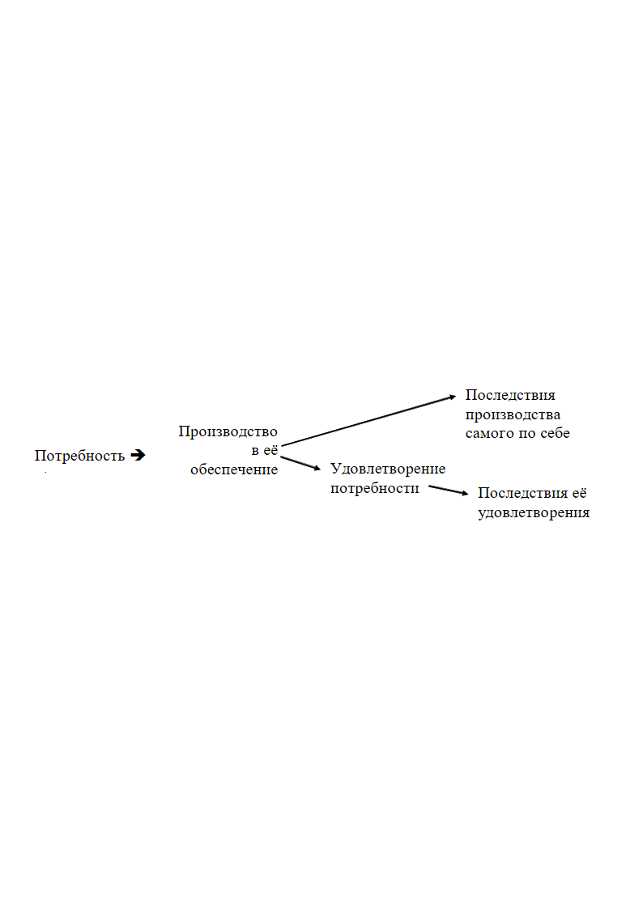

> **Первичный текст.** Справочник по межкультурному взаимодействию.
> Источник: `dotu.ru:9f42d6e3b57308a1.doc` sha256 `97540ede0a5b8ebb…`; [страница на dotu.ru](https://dotu.ru/books/handbook-of-intercultural-interaction/).
> Автоматическая транскрипция DOC→Markdown; смысл и формулировки не правились.
> Контрольные суммы и статус проверки — в [NOTICE.md](../../NOTICE.md).
> Содержание передаёт позицию авторов; утверждения не верифицированы библиотекой.

---

## 6.4. Ещё один провал аналитиков спецслужб всех государств мира

Безопасность общества обеспечивается либо утрачивается в ходе течения разнородных взаимно связанных процессов в биосферно-социально-экономических системах. Если такие системы рассматривать с позиций методологии ДОТУ как объекты управления при любом масштабе рассмотрения от государственного до глобально-цивилизационного, то невозможно обойти два вопроса:

- о перечне контрольных параметров, которыми описываются такого рода системы;

- о критериях оценки каждого из контрольных параметров, их совокупностей, направленности и динамики их изменений.

Но *ответов по существу* на эти вопросы нет ни в одном учебнике социологии, политологии и разного рода видам «спецдеятельности». В силу этого — **все политики и спецслужбы некомпетентны**. И это следствие того, что первым приоритетом обобщённых средств управления / оружия (см. раздел 6.3) их сотрудникам и руководителям *по умолчанию* владеть не рекомендуется[^682]: и потому, те, кто владеет, — не рвутся приобщиться к системе «компетентных органов» (или оказавшись в ней, утаивают свои знания и навыки), а руководители системы большей частью вырастают из числа тех, кто был введён (об этом далее в разделе 7) в систему потому, что не владеет и не подозревает о необходимости ими владеть[^683]. А без научно-методологического обеспечения деятельности, основанного на знании и видении объективных закономерностей всех шести групп, которым подчинена жизнь людей, и без умения пользоваться иерархией обобщённых средств управления / оружия, системное обеспечение безопасности развития общества — человечества — невозможно.

Хотите повторения этого?

*[В оригинальном издании здесь расположен рисунок/схема. Иллюстрация не включена в данный выпуск: ожидает визуальной и правовой проверки. Файл источника: image48.jpeg]* [^684]

Или хотите такого — *по всей планете* — **без каких-либо исключений**?

*[В оригинальном издании здесь расположен рисунок/схема. Иллюстрация не включена в данный выпуск: ожидает визуальной и правовой проверки. Файл источника: image49.jpeg]* *[В оригинальном издании здесь расположен рисунок/схема. Иллюстрация не включена в данный выпуск: ожидает визуальной и правовой проверки. Файл источника: image50.jpeg]*

[^1]: Необходимость ознакомления зарубежных спецслужбистов — следствие изложенного в разделе 12 (т. 2).

[^2]: Репродукция картины американского художника Гарри Андерсона (Harry Anderson, 1906 — 1996) «Властелин Мира» (Иисус Христос стучится в ООН, файл из интернета). Смысл её прост: *«Что вы зовёте Меня: Господи! Господи! и не делаете того, что Я говорю?»* (Лука, 6:46).

[^3]: КПСС официально — Коммунистическая партия Советского Союза, а по факту эта аббревиатура должна расшифровываться как «капитулянтская партия самоликвидации социализма» либо как «капитулянтская партия самоликвидации страны». Поскольку слова управляют матрично-эгрегориальными процессами (что это такое, можно понять из дальнейшего текста настоящей работы, хотя специального тематического раздела об этом нет: см. работу ВП СССР «Язык наш: как объективная данность и как культура речи»), то аббревиатуры в силу неоднозначности связываемого с ними смысла, сопутствия умолчаний оглашениям могут быть опасны для дела.

[^4]: <https://biblio.kz/m/articles/view/РЕЧЬ-ГЕНЕРАЛЬНОГО-СЕКРЕТАРЯ-ЦЕНТРАЛЬНОГО-КОМИТЕТА-КПСС-ТОВАРИЩА-Ю-В-АНДРОПОВА-НА-ПЛЕНУМЕ-ЦК-КПСС-15-ИЮНЯ-1983-ГОДА>. Обратим внимание на то, что это казахстанский сайт: в интернете России найти произведения Ю.В. Андропова проблемно или невозможно.

[^5]: В.О. Ключевский. Сочинения в 9 томах, т. 9, Москва, «Мысль», 1990 г., с. 368.

[^6]: Слова «идиот» и «дебил», и производные от них здесь и далее — не ругательства, а характеристики слабоумия в смысле, близком к тому, как эти термины понимается в медицине и педагогике.

[^7]: В жизни «компетентных» демонстрация осведомлённости и миропонимания «не по чину» и не перед «теми» должностными лицами не всегда способствует успеху в карьере, в лучшем случае; а в наиболее тяжёлых случаях один из способов сохранения тайн — устранение секретоносителей (как фактических, чья осведомлённость не соответствует их должностному положению, так и возомнивших о себе, а кроме того — «отработанных» сотрудников и агентов).

[^8]: На некоторые вопросы Ф.Д. Бобков — второй человек в иерархии должностных лиц КГБ — отвечал в личном общении «я к этому не допущен», и это не было уклончивым нежеланием отвечать на заданный вопрос по его существу.

[^9]: О дураках третьего рода А.П. Чехов: «Всё знают и всё понимают только дураки и шарлатаны».

[^10]: И хотя он был в авторитете, надо понимать, что кейнсианство, основанное на двух категориях («труд» и «капитал»), метрологически несостоятельно, поскольку и «труд», и «капитал» — это оценки, которые строятся на основе субъективизма при неопределённости объективных исходных данных и неопределённости алгоритмики переработки исходных данных в оценки. О метрологической состоятельности и оценках см. раздел 3.1 далее.

[^11]: В контексте настоящей работы термин «дееспособность» следует понимать не в принятом в юриспруденции смысле, а как способность индивида делать с приемлемым качеством то дело, за которое он берётся по своей инициативе, либо которое ему поручают или которое он вынужден делать под давлением потока событий.

    В принятом в юриспруденции понимании «дееспосо́бность — это способность распоряжаться своими правами и нести обязанности. Предполагает осознанность действий субъекта. Полная дееспособность наступает по достижении совершеннолетия». Такое понимание «дееспособности» не включает в себя личностных качеств и навыков, позволяющих либо не позволяющих делать то или иное дело и достигать намеченных результатов с приемлемым качеством.

[^12]: М.Ю. Лермонтов, стихотворение «Бородино».

[^13]: Это ответ А.К. Толстого Ф.И. Тютчеву на его стихотворение: *Эти бедные селенья, / Эта скудная природа — / Край родной долготерпенья, / Край ты русского народа. // Не поймёт и не заметит / Гордый взор иноплеменный, / Что сквозит и тайно светит / В наготе твоей смиренной. // Удручённый ношей крестной / Всю тебя земля родная / В рабском виде Царь Небесный / Исходил, благословляя*.

[^14]: Директива СНБ США 20/1 от 18.08.1948 г. опубликована на сайте: <http://www.sakva.ru/Nick/NSC_20_1R.html>.

[^15]: И как сообщается в книге А. Шевякин «КГБ против СССР. 17 мгновений измены», это было проделано при деятельном соучастии КГБ.

[^16]: Первое издание вышло в свет в 1979 г. «Википедия» эту книгу характеризует как полную заведомо недостоверных сведений, которыми завербованного лично Ю.В. Андроповым Н.Н. Яковлева снабжал зам. Ю.В. Андропова Ф.Д. Бобков.

[^17]: На тему осведомлённости спецслужб империи о конспиративной деятельности много и ныне актуального в книге: А.И. Спиридович. Записки жандарма. — Харьков: изд. «Пролетарий». 1928. (Одна из интернет-публикаций: <http://www.hist.msu.ru/ER/Etext/gendarme.htm>).

[^18]: Баронесса Анна-Луиза Жермена де Сталь (1766 — 1817) — французская писательница.

[^19]: См.: Панарин И. Первая мировая информационная война. Развал СССР. — СПб: Питер, 2010. — С. 178 — 179.

    Директор ФСБ России А. Бортников: «Пришедшая к власти команда реформаторов во главе с М. Горбачевым, несмотря на провозглашение «Перестройки», открытости и гласности, **сохранила запрет на оперативную разработку представителей партийной элиты**» (выделено жирным нами при цитировании) — URL: [Выступление руководства :: Федеральная Служба Безопасности ( Выступление руководства ) (fsb.ru)](http://www.fsb.ru/fsb/comment/rukov/single.htm%21id%3D10438230%40fsbAppearance.html) и другие источники.

[^20]: Так же отметим, что после того, как Л.П. Берия возглавил НКВД СССР, многие авторы заведомо ложных доносов стали «безвинными жертвами сталинских репрессий», что подтверждалось архивными материалами советской эпохи.

[^21]: Нигилисты тех лет — оппозиция царизму в широком спектре идей — от либералов-реформаторов до революционеров и анархистов разного толка.

[^22]: Если проводить параллели с нашими днями, то «капитан-исправник» — глава корпуса жандармов в губернии, т.е. эквивалент начальника областного (краевого) Управления ФСБ.

[^23]: <https://www.youtube.com/watch?v=xJHu2caMvp4>.

[^24]: «… в кортеже было около 30 иномарок. По информации источника журналистов, 2 — 3 человека арендовали по машине на 3 часа. Стоимость одной иномарки за час аренды составляет 1,5 тысячи за человека в час» (<https://www.youtube.com/watch?v=8TkLbRUZ4QA>). Т.е. «гелики» — не свои, ребята «понтовались» на арендованных машинах: им было важнее казаться, производить ложное впечатление, а не быть.

    И пара из комментариев к этому видео:

    1\. «Слов нет. Моя мать получает пенсию 7.5 т.р.… а на этих скотов, живущих за счёт бюджета, деньги находятся… достойные зарплаты, дают жильё (за которое мне ипотеку 10 лет платить). Сидите скромно, но нет: понты дороже всего… Сомневаюсь, что эти мажоры сложат головы за Родину: они и шли в госструктуры, чтобы и дальше набивать свои карманы за счёт нас с вами… Надо менять систему, чтоб не только мажор с большими деньгами и родственными связями, но и толковый парень без связей мог попасть на госслужбу… а эти ребята и дальше будут плодить коррупцию в нашей стране. С такими запросами жить на одну зарплату они не будут».

    2\. Надо наоборот всех мажоров на х… от таких контор подальше посылать. Папа-мама в конторе — иди на завод, пусть "династия" отдохнёт чуток от кумовства.

    «Автопробег обошелся в 250 — 300 тысяч рублей. Такую оценку привели в фирме, к которой обращались участники автопробега, но о стоимости они так и не договорились. По словам сотрудника этой компании, машины взяли в разных прокатах (по его выражению, «скребли по сусекам»). В то же время участник автопробега Всеволод рассказал, что за рулем «Гелендвагенов» были старые выпускники Академии ФСБ. По словам Всеволода, «Гелендвагены» — это «шефская помощь молодому поколению. (…)

    **В Кремле заявили, что автопробег «Гелендвагенов» не имеет к нему никакого отношения.** По словам пресс-секретаря президента Дмитрия Пескова, он не докладывал об этом своему начальнику. «В любом случае я не считаю, что есть какой-то повод для комментария из Кремля, — сказал Песков. — Здесь есть, безусловно, административный аспект, и это органам ГИБДД разбираться, имели ли место какие-то нарушения или нет. И есть морально-этический аспект — и здесь, наверное, руководству высшего учебного заведения разбираться, имели ли место здесь какие-то факты несоответствия или не имели» (<https://meduza.io/feature/2016/07/04/avtoprobeg-vypusknikov-akademii-fsb-na-gelendvagenah-korotko>). Так и Д.С. Песков внёс вклад в подрыв авторитета государственной власти, поскольку из этих слов понятно, что гос. власть не желает пресекать этот антиобщественный стиль поведения своих спецслужбистов…

    Пройдёт ли у участников понтового заезда свойственная в подростковом возрасте многим нашим соотечественникам стадно-стайная обезьянья дурость с возрастом или же нет, покажет будущее…

[^25]: <http://chitaem-vmeste.ru/reviews/articles/da-vozvelichitsya-rossiya-da-sginut-nashi>.

[^26]: <https://bazaistoria.ru/blog/43679815119/Eks-chekistyi-ushli-v-bankiryi-a-ih-deti-stali-baronami-?&utm_referrer=mirtesen.ru>.

    Двусмысленные формулировки «барон Сибирский» и «барон Лебедев из Хэмптона в лондонском районе Ричмонд-на-Темзе и Сибири в Российской Федерации» допускают истолкование в том смысле, что Россия де-факто не суверенна, коли британская королева раздаёт такого рода титулы, топонимически связанные с территорией другого де-юре суверенного государства.

    Заявление Е.А. Лебедева о том, что он испытывает большую гордость в связи с тем, что стал первым пэром из России, тоже подразумевает, что Российская Федерация уже давно часть «Британского содружества наций» и вместе со своими ресурсами принадлежит хозяевам и заправилам «британского» мира.

    Так же обратим внимание и на то, что в русскоязычном интернете британской королевской семье на протяжении многих лет уделяется внимания гораздо больше, чем какой-либо другой зарубежной теме, будто Виндзоры — правящая династия России. *А чем заняты наши «диванные войска» как в русскоязычном сегменте интернета, так и в иноязычных?* (см. Отступление от темы 6: Про «диванные войска» — том 2).

[^27]: Об этом далее см. раздел 12 (том 2).

[^28]: Членораздельная речь может выполнять четыре функции: 1) выражать мысли, 2) скрывать мысли, 3) *скрывать отсутствие мыслей и* 4) *скрывать неспособность чувствовать и мыслить*. Выделенное курсивом — пустословие, демагогия.

    Но предназначена членораздельная речь не для пустословия и не столько для выражения мыслей, а прежде всего для того, чтобы творить «магию», т.е. обеспечивать течение событий в режиме «как сказал — так и будет», а это требует понимания себя, определённой личностной культуры чувств и навыка самообладания.

[^29]: Из статьи «Гибридная война» на сайте «Что означают»: <http://chtooznachaet.ru/gibridnaya-vojna.html>.

[^30]: Николая Алексеевича Шама и Филиппа Денисовича Бобкова. — Кто бы из спецслужбистов наших дней как бы ни относился к ним, но они — как личности — были сформированы их эпохой, её культурой, и они работали на благо страны в меру своего понимания этого блага, а в меру разницы понимания — на тех, кто, понимая больше, реализовал Директиву СНБ США 20/1 от 18.08.1948 г.

[^31]: № 2520 в Федеральном списке экстремистских материалов.

[^32]: К вопросу о ст. 275 УК РФ (Государственная измена).

    **Защищаемый объект** — общественные отношения, которые складываются в связи с осуществлением деятельности РФ по обеспечению своей безопасности, характеризующейся охраной конституционного строя, суверенитета (исключительно юридическом понимании этого термина) и территориальной целостностью государства. По сути, это — внешняя безопасность Российской Федерации. По комментариям председателя Верховного суда РФ В.М. Лебедева, заговор с целью захвата власти — это посягательство на внутреннюю безопасность, следовательно, квалифицировать такие действия по статье 275 УК РФ нельзя.

    **Предметом преступления** является любая информация, предоставленная иностранным представителям, которой они в состоянии воспользоваться с целью причинения ущерба безопасности.

[^33]: От того, что в прошлом именовалось термином «холодная война», «гибридная война» отличается тем, что «холодная война» исключала государственное и блоковое сколь-нибудь массовое применение обобщённого оружия шестого приоритета (военно-силового), хотя допускала осуществление разовых «точечных» диверсионно-террористических операций спецслужбами и единичные боестолкновения по недоразумению или спланированные и осуществлённые в целях оказания морально-психологического давления на политиков и военных противника. Такие спецоперации могли осуществляться на территории противника или третьих государств, в их территориальных водах и воздушном пространстве либо в нейтральных водах и воздушном пространстве над ними.

    «Гибридная война», в отличие от «холодной», свободна от этого ограничения, поскольку в ней открытое применение вооружённых сил государства — вопрос оценки ущерба от ответного воздействия, а вооружение оппозиционеров в государстве-противнике и применение на его территории якобы самодеятельных наёмников — норма.

[^34]: Об этом способе реакции на агрессию в Коране, сура 41: «34. Не равны доброе и злое. Отклоняй же \<зло\> тем, что лучше, и вот — тот, с которым у тебя вражда, точно он горячий друг. 35. Но не даровано это никому, кроме тех, которые терпели; не даровано это никому, кроме обладателя великой доли».

[^35]: Внутренняя политика — целеполагание и достижение целей в пределах юрисдикции своего государства. Внешняя политика — целеполагание и достижение целей в отношении других государств. Глобальная политика — целеполагание и достижение целей в отношении всего человечества, глобальной цивилизации.

    Нормально внешняя политика должна опираться на внутреннюю, и обе они должны быть подчинены глобальной политике и быть её следствиями. Если это требование не выполняется, то государство обречено стать объектом чужой глобальной политики. Будет ли это хорошо для него — зависит от субъекта, осуществляющего глобальную политику, от его нравственности и целей, на которые он работает. Но в любом случае отсутствие жизненно состоятельной глобальной политики — утрата суверенитета в его полноте.

[^36]: Именно по этой причине слова министра иностранных дел РФ С.В. Лаврова *«дебилы, б…»,* обронённые им в прямой эфир на пресс-конференции в Эр-Рияде 11.08.2015 г., стали широко востребованы и обрели статус популярного «мема», который многое объясняет не только в контексте той пресс-конференции.

[^37]: Название первого русского линейного корабля, построенного в Воронеже по приказу Петра I, — «Гото Предестинация» — «Божье предопределение» (от немецкого "Gott" и латинского "praedestinatio").

[^38]: «Как животное отличается от растенья осмысленною побудкою и образует особое царство, так и человек отличается от животного разумом и волей, нравственными понятиями и совестью и образует не род и не вид животного, а царство человека» — В.И. Даль. Толковый словарь живого великорусского языка. Статья «Человек».

[^39]: Если разума и воли, реализующей интеллектуальный выбор, у представителей того или иного биологического вида нет, то религиозно-ноосферные нравственно-этические по их существу закономерности некоторым образом реализуются в отношении таких биологических видов и их представителей извне, но не реализуются ими осмысленно, хотя и в этом случае они впечатаны в их инстинкты и врождённые безусловные рефлексы, а условные рефлексы тоже формируются некоторым образом под их воздействием.

[^40]: Проблема не нова: Псалтирь, гл. 13: «1. Сказал безумец в сердце своем: «нет Бога». Они развратились, совершили гнусные дела; нет делающего добро. 2. Господь с небес призрел на сынов человеческих, чтобы видеть, есть ли разумеющий, ищущий Бога. 3. Все уклонились, сделались равно непотребными; нет делающего добро, нет ни одного. 4. Неужели не вразумятся все, делающие беззаконие, съедающие народ мой, как едят хлеб, и не призывающие Господа? 5. Там убоятся они страха, \[где нет страха,\] ибо Бог в роде праведных». (Тот же текст и в Псалтири, гл. 52).

[^41]: О главной из них для цивилизованных обществ далее в разделах 7.1 и 9 тематически близкие рисунки и пояснения к ним.

[^42]: См. официальное издание Федерального собрания РФ «Думский вестник» № 1 (16), 1996 г., с. 126 — 137.

[^43]: «Ноу-хау» — транслитерация английского «know haw», означает «знаю как», по умолчанию подразумевает дополнение «но не скажу никому постороннему».

[^44]: Психодинамика общества (социальной группы) — это когда все делают, что хотят или с чем согласны, и не делают того, чего не хотят, не умеют или могут саботировать и извращать в случае принуждения, а в результате получается то, что получается. Носителями алгоритмики и информационного обеспечения работы психодинамики общества являются биополевые образования, порождаемые людьми, именуемые «эгрегорами».

    Отрицать излучение людьми биополей и их взаимодействие друг с другом посредством биополей — это шизофрения: физику признают, а её проявления в биологии и в жизни обществ — отрицают.

[^45]: А в версии Финляндии она не участвовала во второй мировой войне ХХ века. В её истории три местных войны: 1) «зимняя» — СССР напал на Финляндию, но она отбилась, потеряв некоторые территории, 2) война против СССР за возращение ранее отторгнутых территорий, которую Финляндия начала, воспользовавшись нападением третьего рейха на СССР, 3) война с целью пленения на территории Финляндии частей германского вермахта, которая была ею начата по итогам заключения мира с СССР, когда СССР освобождал свою территорию от вермахта и был готов громить третий рейх. Однако части вермахта, ранее дислоцированные в Финляндии, большей частью были выведены с территории Финляндии, а не пленены.

[^46]: С картиной И.Е. Репина на эту тему «Иван Грозный и сын его Иван» связана неприятная «мистика», о причинах которой полезно подумать, поскольку такого рода «мистика» — выражение ноосферной алгоритмики управления течением событий и следствие нарушения объективных религиозно-ноосферных (нравственно-этичеких по их существу) объективных закономерностей причастными к созданию этой картины.

[^47]: **Реальный «Титаник»** на момент постройки — самый большой в мире, трёхвинтовой, четырёхтрубный, самый роскошный пассажирский лайнер, погиб в результате столкновения с айсбергом в первом трансатлантическом плавании. Шлюпок для спасения всех людей, бывших на борту, не хватило. Погибла почти 2/3 из общего количества находившихся на борту людей (спасено 712, погибло минимум 1 496), вследствие того, что по проекту количество мест в шлюпках составляло всего 1 178, хотя при полной загрузке лайнера требовалось иметь места для 3 464 человек (2 556 пассажиров и 908 членов экипажа). Количество спасённых, на 400 с лишним человек меньшее, чем количество мест в шлюпках, — следствие низкого уровня организации службы на судне, не говоря уж о том, что отсутствие сколько-нибудь развитого волнения в районе катастрофы допускало некоторую перегрузку шлюпок, что позволило бы спасти большее количество людей.

    **Описанный М. Робертсоном «Титан»** — тоже самый большой в мире, трёхвинтовой, четырёхтрубный, самый роскошный пассажирский лайнер, погиб в результате столкновения с айсбергом в первом трансатлантическом плавании. Шлюпок для спасения всех людей, бывших на борту, не хватило. Его размеры близки к реальным размерам «Титаника» — с точностью до варианта проработки проекта.

    Вопрос только в том:

    М. Робертсон считал эту алгоритмику из ноосферы и описал её в романе? — таково наше мнение.

    либо он сам её выдумал и, написав роман, сгрузил её в ноосферу, тем самым запрограммировав реализацию сюжета романа, хотя и с некоторыми отступлениями («Титан», а не «Титаник»; «Титан» имел ещё и вспомогательное парусное вооружение, а на «Титанике» парусов не было)? — такое тоже возможно.

[^48]: Власть, осуществляющая анализ ситуации (включая тенденции), прогностику, выработку и внедрение в жизнь концепции управления биосферно-социально-экономической системой, т.е. задающая цели управления, пути и средства их достижения. Концептуальная власть — это неформализованный социально-политический институт, который сочетает в себе две составляющих:

    власть людей, способных разработать и внедрить в жизнь общества концепцию жизнеустройства (генеральный замысел), а также способных вытеснить из жизни общества неприемлемые для них концепции;

    власть этой концепции (социокультурной матрицы) над обществом в преемственности поколений.

[^49]: Соответственно устремлённость спецслужбиста к дорогостоящим «понтам» — это выражение его полной профессиональной несостоятельности и готовности к государственной измене, даже если противник обойдётся без прямой и беззастенчивой вербовки, воспользовавшись такими анонимизаторами-посредниками, как кредитно-финансовая система, законодательство и правоприменительная практика, которые так или иначе легализовали продажность госслужащих.

    **США в силу господства в них идеологии либерализма не способны к защите государственного управления (включая спецслужбы) и бизнеса от реализации этого принципа в их обществе.** *Отчасти их безопасность в этом аспекте обеспечивается положением доллара в качестве доминирующей в мировой торговле с середины ХХ века платёжной единицы.*

[^50]: Демографически обусловленные потребности — всё то, что необходимо для жизни и развития общества. Деградационно-паразитические — всё то, что наносит вред потребителям, производителям продукции, окружающим и потомкам, а также разрушает биосферу. Поэтому вне зависимости от мнений, побеждающих в спорах о нравах, выявление статистических показателей и статистический анализ причинно-следственных связей в системе отношений:

    

    — позволяет объективно выделить всем и без того известные вредоносные факторы: алкоголь, прочие наркотики и яды, разрушающие психику; половые извращения; профессиональный спорт; чрезмерность (т.е. недостаточность либо избыточность) потребления самих по себе невредных продуктов и услуг, вследствие чего возникает вред их потребителю и (или) окружающим, потомкам, биосфере; а также выделить и факторы, ранее не осознаваемые в качестве вредоносных.

[^51]: «Насаждение полезных (для проведения той или иной политики: наше пояснение по контексту) верований особенно важно ввиду способа, которым осуществляется власть в современной экономической системе. Он состоит, как отмечалось, в том, чтобы побуждать человека отказаться от целей, к которым он обычно стремится, и осуществлять цели другого лица или организации. Имеется несколько способов добиться этого. Угрозы физических страданий — тюрьмы, кнута, пытки электрическим током — относятся к древней традиции. Так же обстоит дело и с экономическими лишениями — голодом, позором нищеты, если человек не хочет работать по найму и тем самым принять цели работодателя. Все большее значение приобретает убеждение, которое состоит в изменении мнения человека таким образом, чтобы он согласился, что интересы другого лица или организации выше его собственных. Дело обстоит именно так, поскольку в современном обществе физическое насилие, хотя и одобряется до сих пор многими в принципе, на практике наталкивается на неодобрение. Кроме того, с ростом доходов люди становятся менее уязвимы в отношении угрозы экономических лишений. Соответственно убеждение (в формах, которые будут рассмотрены в дальнейшем) превращается в основной инструмент осуществления власти. Для этого жизненно важное значение имеет существование представлений об экономической жизни, которые были бы близки представлениям организаций, осуществляющих власть. То же самое относится и к процессу обучения, посредством которого насаждаются такие взгляды. Он или просто направлен па убеждение людей, что цели организации фактически полностью совпадают с их собственными целями, или подготавливает почву для такого убеждения. Представление об экономической жизни, при котором люди рассматриваются в качестве инструментов для осуществления целей организации, было бы гораздо менее полезно и удобно.

    **Содействие, которое экономическая теория оказывает осуществлению власти, можно назвать её инструментальной функцией в том смысле, что она служит не пониманию или улучшению экономической системы, а целям тех, кто обладает властью в этой системе** (выделено жирным при цитировании нами).

    Частично такое содействие состоит в обучении ежегодно нескольких сот тысяч студентов. При всей его неэффективности такое обучение насаждает неточный, но все же действенный комплекс идей среди многих, а может быть большинства, из тех, кто подвергается его воздействию. Их побуждают соглашаться с вещами, которые они в ином случае стали бы критиковать; критические настроения, которые могли бы оказать воздействие на экономическую жизнь, переключаются на другие, более безопасные области. Это оказывает огромное влияние непосредственно на тех, кто берется давать указания и выступать по экономическим вопросам. Хотя принятое представление об экономике общества не совпадает с реальностью, оно существует. В таком виде оно используется как заменитель реальности для законодателей, государственных служащих, журналистов, телевизионных комментаторов, профессиональных пророков — фактически всех, кто выступает, пишет и принимает меры по экономическим вопросам. Такое представление помогает определить их реакцию на экономическую систему; помогает установить нормы поведения и деятельности — в работе, потреблении, сбережении, налогообложении, регулировании, которое они считают либо хорошим, либо плохим. Для всех, чьи интересы таким образом защищаются, это весьма полезно» (Гэлбрейт Дж.К. Экономические теории и цели общества. — М.: Прогресс. 1976., гл. 1. J.K. Galbraith. «Economics and the Public Purpose». 1973).

    Спрашивается аналитики КГБ читали эту книгу Дж.К. Гэлбрейта, те более, что она была переведена на русский и издана в СССР? Какие выводы сделали они применительно к СССР и перспективам страны? — либо только дали санкцию на издание книги в СССР и избрание Дж.К. Гэлбрейта иностранным членом корреспондентом АН СССР, а потом поставили свои подписи в ведомостях на выплату денежного довольствия, доложив начальству, что Дж.К. Гэлбрейт, хоть и пропагандирует социализм, но не понимает положения «Учение Маркса всесильно, потому что оно верно» (В.И. Ленин. Три источника, три составные части марксизма)? — Ведь книга Дж.К. Гэлбрейта — открытая информация, не требующая проникновения агентуры в «мозговые тресты» противника.

    **И какие выводы сделали аналитики ФСБ из того факта, что в 2015 г. Япония запретила преподавание всей западной «гуманитарщины» в ведущих вузах страны?**

    Но этому решению государственной власти Японии предшествовало появление стратегического документа *«Внутренняя граница: развитие личностей и лучшее управление в двадцать первом веке» (Комиссия по целям Японии в 21 веке. Япония, 2000).*

    А ещё ранее в интервью, показанном по первому каналу российского телевидения 07.07.1993 г., глава правительства Японии в 1982 — 1987 гг. Ясухиро Накасоне (1918 — 2019) сказал, что главным из того, что он сделал на посту премьер-министра, является создание в Японии *Института изучения глобальных проблем*.

    Создание государственно финансируемого института такой направленности деятельности имеет смысл, если Япония признаёт за собой глобальный уровень значимости своей политики, и вне зависимости от деклараций объективно следует глобальной концепции решения изучаемых этим Институтом проблем. И он будет вполне работоспособен и соответствовать своему назначению в системе общественного самоуправления Японии, если у её политиков хватит понимания, что:

    в обязанности института входит изучение глобальных проблем с целью их разрешения,

    а не создание глобальных проблем подведением фундамента наукообразной видимости под уже предопределённую в готовом виде неизвестно как появившуюся определённую политику, как это имело место в системе науки СССР (партийной, академической и отраслевой).

    В том же интервью, говоря о надеждах на будущее, Ясухиро Накасоне огласил намерение Японии «создать в Азии “общеазиатский дом”, в котором должна принять участие и Россия». При этом Ясухиро Накасоне категорически отрицал возможность устремлённости Японии к военному реваншу и говорил о необходимости «создания структуры сотрудничества государств бассейна Японского моря». Т.е. это ориентация на делание политики средствами управления / оружия более высокими, чем шестой — грубая военная сила.

    А введённый в 2015 г. запрет на преподавание западной «гуманитарщины» в ведущих вузах страны — шаг к восстановлению чувственно-интеллектуального суверенитета Японии, т.е. суверенитета в его полноте (о суверенитете в его полноте см. далее раздел 3).

    Аналогично в июне 2021 г. пришло сообщение, что «с нового учебного года власти Китая запретят использовать иностранные программы обучения, начиная с детского сада и вплоть до девятого класса. Кроме того, иностранным организациям запретили владеть частными школами на ступени обязательного 9-летнего обучения» (<https://rg.ru/2021/06/03/v-kitae-zapretiat-inostrannye-shkolnye-programmy-i-repetitorov.html>). — Это тоже шаг по защите чувственно-интеллектуального суверенитета.

    В России тоже есть люди, которые эту проблему, если не осознают, то чуют, хотя не идут дальше разговоров. Так в ночном эфире (по Москве) программы «Вечер с Владимиром Соловьёвым» 27 / 28 марта 2022 г. В.Т. Третьяков заявил о необходимости создания «гуманитарного Сколково». Однако В.Р. Соловьёв не дал ему раскрыть смысл этого предложения, а начал перебивать и по существу заткнул ему рот, переведя разговор на другую тему.

    Причина такого поведения ведущего в том, что если действительно создать «гуманитарное Сколково», и оно будет заниматься не «распилом бюджета» и болтовнёй, а делом, то неизбежно появится научно-методологическое обеспечение государственного управления и управления в экономике, альтернативное внедрённому в РФ «коллективным Западом» посредством его периферии, развёрнутой в России; неизбежно возникнет научно-педагогическая школа, развивающая и несущая это научно-методологическое обеспечение, готовящая дееспособные управленческие кадры и просвещающая всё общество; а в аспектах политики — в России возникнет *юридически легитимная* жреческая власть, вошедшая в официоз политики и науки. И это качественно бы изменило глобальную политику и глобальную ситуацию. Чтобы этого не произошло, В.Р. Соловьёву пришлось не очень-то вежливо затыкать рот В.Т. Третьякову, который затронул одну из *тем, реально запретных для публичного обсуждения в России.* И хотя цензура в РФ запрещена на уровне конституции, однако В.Р. Соловьёв успешно справился с ролью цензора…

    Как это понял В.Т. Третьяков и большинство зрителей программы — это другой вопрос. Но **в этом эпизоде В.Р. Соловьёв проявил себя как антипатриот и представитель сил, которые делают глобальную политику, в которой есть составляющая, реализуемая в отношении России.** **Он защищал именно их глобальную политику от возможности возникновения и реализации альтернативной глобальной политики.**

[^52]: Применительно к нашей истории — надо было быть выдающимися кретинами, чтобы план (цели, пути и средства достижения целей) противопоставить рынку (одному из инструментов саморегуляции экономики в процессе достижения запланированных целей) и на этой основе уничтожить государственную систему планирования, дабы страна легла в русло враждебной ей системы планирования.

[^53]: Средствами, которые толпа, включая и действующих политиков (прежде всего в обществе противника), включая и спецслужбистов, не воспринимает в качестве средств ведения войны, т.е. не воспринимает в качестве средств достижения определённых целей в отношении противника. Ну сняли «Дисней» и студия «Yellow, Black and White», наняв режиссёра Дмитрия Дьяченко, фильм «Последний богатырь» (2017 г.), извратив сюжеты русских сказок — и где адекватная реакция ФСБ как внутри страны, так и за рубежом? — неужто настолько законспирировано, что результата не видно?

    А вот реакция министра культуры СССР Е.А. Фурцевой на то, что первая экранизация романа Л.Н. Толстого «Война и мир» была осуществлена в США:

    *«Мало того, что вы уступили право первой экранизации романа «Война и мир» американцам, вы ещё и просите меня разрешить покупку этого фильма для советских граждан! Вы что, хотите, чтобы наши люди изучали творчество русских классиков по американским лекалам?»* — негодовала Фурцева (…)

    Говорят, что они (она и С.Ф. Бондарчук: наше пояснение при цитировании) общались без свидетелей около часа и Сергей Федорович вышел из её кабинета с разрешением на свой фильм. Позже стало известно, что он получил от Фурцевой не просто разрешение, а полный карт-бланш, о котором он раньше и не мечтал! Министр настояла на том, чтобы будущий советский фильм был не просто лучше американского, но и вообще лучшим в мире. Чтобы после нашей экранизации «Войны и мир» больше никто из иностранцев даже не пытался за это дело браться» (<https://zen.yandex.ru/media/id/5cf0ff34c1698200ab736d7a/sergei-bondarchuk-ne-sobiralsia-igrat-v-svoem-film-5f8964209eb9a66f8b0cdd72>).

[^54]: Поведенческие программы инстинктивного характера и безусловно-рефлекторного характера передаются на основе генетического механизма биологического вида.

    Иначе говоря: Культура — вся генетически не передаваемая в готовом к использованию виде информация, представляющая собой результат творчества прежних поколений.

[^55]: Вследствие этого все учебники культурологии, которые ныне есть в России, бесполезны для получения знаний о том, как следует вести культурную политику, строить систему образования, организовывать взаимодействие представителей различных культур в русле политики государства, и как политика государства связана с исторически сложившейся культурой.

[^56]: **1.** Творческий потенциал не освоен или заблокирован. **2.** Совесть и стыд подавлены вообще (хронически бездействуют) или вытеснены из психической деятельности на какое-то время. **3.** Воля подавлена или «сдана в аренду».

[^57]: Нюрнбергским международным трибуналом (1945 — 1949 гг.) все верные гитлеровцы были осуждены именно за это: за бессовестное исполнение возложенных на них «системой» служебных обязанностей, за сдачу своей воли и творческого потенциала «в аренду» фюреру, его хозяевам и кукловодам.

    Также полезно подумать о том, почему Гитлер не был обвинён Нюрнбергским трибуналом ни заочно, ни посмертно, тем более, что *был опознан не труп Гитлера, а «штаны и штиблеты», в которые был одет труп похожего на Гитлера индивида, чьи зубы стоматологи привели в состояние, идентичное состоянию зубов Гитлера, но у которого было только одно яичко (дефект развития — односторонний криптархизм), что вызвало удивление одной из любовниц Гитлера, которая никогда не замечала у него такой особенности*.

[^58]: Понятие «пол» — чисто биологическое, включающее в себя комплекс анатомических и физиологических признаков, определяющих принадлежность особи к одному из полов. В этот комплекс признаков входит не только наличие и строение репродуктивных органов мужского либо женского типа, но и другие анатомические (как телесно-вещественные, так и биополевые) особенности организма (строение мозга, сердца, желёз внутренней секреции, в частности), проявляющиеся и в особенностях физиологии. Если особь несёт не полный комплекс признаков соответствующего пола либо несёт признаки, соответствующие разным полам одновременно, то это в большей или меньшей мере биологически неполноценная особь, что некоторым образом (не всегда благотворно) выразится и в её интеграции в общество, и в её воздействии на культуру общества.

    Понятие «гендер» (англ. gender, от лат. genus «род») — более широкое, поскольку включает в себя не только биологические характеристики организма, но и социальные роли, характерные для представителей каждого из полов (в биологическом смысле) в том или ином обществе, а в ряде случаев — и отношение (согласие / несогласие) самого индивида к факту принадлежности его организма к определённому полу и социальными ролями каждого из полов в исторически сложившемся образе жизни общества.

[^59]: См.: [Михаэль Лайтман. Свобода воли есть только у "народа" Израиля. - YouTube](https://www.youtube.com/watch?v=ICt5_PrFXzU) и др.

[^60]: См.: [Ни совести,ни чести! - YouTube](https://www.youtube.com/watch?v=Je5yqUJlURU); «Что есть совесть? — Такого термина в священном писании нет, а значит его нет и в природе» — некий раввин отвечает на вопросы (<https://www.youtube.com/watch?v=3rpivOhQnv0>). Фактически это означает, что совести у них нет, а творческий потенциал не освоен и не осваивается.

    Но не все евреи согласны с этим мнением: «В современном иврите совесть называется мацпун — от слова цафун — «скрытое», потому что голос совести — внутренний, скрытый глубоко в сознании человека. Кроме того, слово мацпун связано со словом мацпэн («компас»), потому что, подобно компасу, совесть указывает человеку направление, в котором он должен идти» (сайт «Иудаизм и евреи»: <https://toldot.com/sovest.html>). — Всё правильно о сути и функциях совести.

    Но совесть может подавляться культурой, её неправедными заповедями, жертвой которой стал раввин, заявивший о том, что совести нет, в том числе и потому, что в его психике совести действительно нет — она подавлена заповедями и вытеснена из психики. Но реакция инакокультурных людей на бессовестные действия, в том числе и неправедная бессовестная реакция одних на бессовестность других, — один из факторов, порождающих межнациональные конфликты, включая и антисемитизм.

    Поэтому заинтересованным лицам следует подумать о том, что праведно и поддерживается Свыше в Жизни:

    жить по советам раввинов, не всегда чувствующих Жизнь, не всегда умных, всегда верующих в «священное писание», но не верующих Богу как живому и активному в Жизни субъекту?

    либо жить под властью диктатуры совести, вразумляя раввинов и их паству, когда те отгораживаются от Бога и жизни «священным писанием» (происхождение всех «священных» писаний — особая тема Истории) и 613‑ю талмудическими заповедями? — Потребность в заповедях возникает тогда, когда люди забыли про совесть и стыд.

    А. Гитлер: «Солдаты, я освобождаю вас от древней химеры, именуемой совестью, во славу Великого Рейха!». И кроме того, по мнению А. Гитлера: «совесть — это еврейское измышление, предназначенное для порабощения других рас», и это высказывание — глупость, чему примером судьба Ф. Ницше. Ф. Ницше: «Угрызение совести — такая же глупость, как попытка собаки разгрызть камень». — Именно вследствие приверженности этому мнению Ф. Ницше завершил свою жизнь в дурдоме, а третий рейх именно А. Гитлер привёл к краху — «Бог не ведёт прямым путём людей неправедных» (Коран, 2:258).

[^61]: Библия цитируется по изданию Московской патриархии, выпущенному по благословению Патриарха Московского и всея Руси.

    В квадратных скобках — текст, не включаемый в канон и восстановленный в Синодальном переводе Библии на современный русский язык по переводу с древнееврейского на древнегреческий 70-ти толковников — Септуагинте — III века до н.э. (соответственно традиционной хронологии истории); в круглых скобках наши пояснения при цитировании.

[^62]: Аналогично, Второзаконие, 15:6: «… господь, бог твой, благословит тебя, как он говорил тебе, и ты будешь давать взаймы многим народам, а сам не будешь брать взаймы; и господствовать будешь над многими народами, а они над тобою не будут господствовать».

[^63]: Стих Второзаконие, 28:15, продолжающий этот текст, по своему существу — угроза: «Если же не будешь слушать гласа господа бога твоего и не будешь стараться исполнять все заповеди его и постановления его, которые я заповедую тебе сегодня, то придут на тебя все проклятия сии и постигнут тебя». И далее перечень проклятий.

    *Всё вместе это — посулы возвести евреев в ранг расы господ + шантаж и террор* в отношении рабов-невольников библейского проекта, не желающих становиться *как бы* господами-рабовладельцами. Это необходимо для того, чтобы подавить совесть и реализацию творческого потенциала в политике и подчинить волю.

[^64]: «Закон» и «пророки» во времена Христа — это то, что ныне называется Ветхий завет.

[^65]: Исторически реально: первичные тексты, передающие смысл речей действительных пророков или людей, возведённых другими людьми в этот ранг, утрачены; многократные переводы с языка на язык на протяжении всей истории; изменения смысла слов языков на протяжении истории; умышленная цензура и редактирование текстов в угоду текущей или перспективной политической конъюнктуре — объективная данность, вследствие которой, будучи верующим Богу человеком, невозможно воспринимать Библию в её различных исторически сложившихся версиях в качестве «факса» от Всевышнего или репринтного воспроизведения некой книги из Его библиотеки.

    Соответственно, в контексте настоящей работы везде и всюду, когда речь заходит о писаниях, признаваемых священными в тех или иных обществах (культурах), имеются в виду писания в их исторически сложившихся версиях, а не их реальная или мнимая боговдохновенная первооснова.

    В контексте настоящей работы анализ Библии и других «священных писаний» — это анализ текстов в их связи с действительностью, а не оскорбление чувств верующих. Кроме того, уже имеющееся взаимное несоответствие смыслов различных исторически сложившихся «священных писаний» друг другу по одним и тем же вопросам уже может восприниматься их приверженцами как выражение сатанизма и быть оскорбительным для инаковерующих. **Поэтому к этой проблеме, унаследованной мультикультурным многонациональным человечеством от прошлого, надо относиться вдумчиво по совести, а не раздувать факт разногласий, осознанно или бездумно соглашаясь с тем или иным писанием по тому или иному вопросу.**

[^66]: В состав «Запада» входят Европа (за исключением Европейской части России), США, Канада, Австралия. В Африке и в Латинской Америке библейская культура хотя и господствует по внешней видимости, однако наряду с нею коренное население продолжает сохранять живыми традиции своих самобытных культур, по отношению к которым библейская культура не более чем чуждый покров, а не выражение чувств и миропонимания коренного населения.

[^67]: «Что есть совесть? — Такого термина в священном писании нет, а значит его нет и в природе» — некий раввин отвечает на вопросы (<https://www.youtube.com/watch?v=3rpivOhQnv0>).

    Гитлер: «Солдаты, я освобождаю вас от древней химеры, именуемой совестью, во славу Великого Рейха!».

    Ф. Ницше: «Угрызение совести — такая же глупость, как попытка собаки разгрызть камень» — именно вследствие такого воззрения здоровье его было плохим на протяжении всей жизни, и он кончил жизнь в дурдоме.

[^68]: В Коране по этому вопросу высказано иное мнение.

    «И вот, Господь испытал Ибрахима (Авраама — наше пояснение при цитировании) словесами и потом завершил их. Он сказал: “Поистине, Я сделаю тебя для людей имамом”. Он сказал: “И из моего потомства?” Он сказал: “Не объемлет завет Мой неправедных”» (сура 2:118 (124) ). «Те, кому было дано нести Тору, а они её не понесли, подобны ослу, навьюченному книгами. Скверно подобие людей, которые считали ложью знамения Бога! Бог не ведёт людей неправедных!» (сура 62:5).

[^69]: «Черта осёдлости» — название административной границы, за пределами которой иудеям в российской империи запрещалось постоянное проживание. Существовала с 1791 по 1917 г. Исключение делалось в разное время для купцов первой гильдии, обладателей высшего образования, зарегистрированных проституток, отслуживших рекрутов, караимов (течение в иудаизме, отрицающее Талмуд). Черта осёдлости включала в себя часть территорий нынешних Польши, Литвы, Белоруссии, Бессарабии, Украины, Крым.

    В Крыму исключением стал Севастополь: в 1830‑е годы после того, как в долговой кабале иудеев-ростовщиков оказалась изрядная доля офицерства Черноморского флота, развлекавшегося на берегу в кредит (это пример вопиющей безответственности, и этот факт не делает чести дворянству Российской империи), вследствие чего флот практически утратил боеспособность, Николай I аннулировал все долги (долговые расписки были изъяты и уничтожены), повелел в течение 24 часов очистить город от иудеев и запретил иудеям появляться в Севастополе под страхом отдания в каторжные работы.

[^70]: В настоящее время эта ссылка не действует. Публикация «Павел Флоренский. Иудеи и судьба христиан», в которой содержится приведённый фрагмент, представлена по ссылке: <https://pycckue-cka3ku.livejournal.com/2105099.html>. По ссылке сообщается: «Статьи «Проф. Д.А. Хвольсон о ритуальных убийствах» и «Иудеи и судьба христиан» Флоренский направил В.В. Розанову для анонимной публикации. В.В. Розанов включил обе статьи в книгу «Обонятельное и осязательное отношение евреев к крови» в виде приложения».

    Надо полагать, что указанная книга имеется только в спецхранах ведущих библиотек России и может быть сохранилась у кого-то в семейной библиотеке.

[^71]: Хотя искренняя верность Христу обязывает к этому: заблудшим (кем, по мнению христиан, являются мусульмане) надо помогать придти к истине, и соответственно пресловутая «христианская любовь» должна обязывать к тому, чтобы понять заблуждения других людей, поскольку без этого понимания невозможно помочь им от них освободиться. Т.е. П.А. Флоренский неосознанно лицемерит перед Христом, настаивая на своей вере Библии и апостолу Павлу.

[^72]: «Игра с ненулевой суммой», — термин раздела математики, именуемого «теория игр».

    Игра с ненулевой суммой — игра (взаимодействие сторон), принципы построения которой таковы, что *вне зависимости от стратегий, избранных разными участниками игры,* выигрыш предопределённо однозначно достаётся только кому-то одному. Участниками игр могут быть как индивидуальные игроки, так и корпоративные. В случае, если участниками игры являются корпорации, то совокупный выигрыш в игре с ненулевой суммой достаётся только одной из них, хотя при этом в её составе могут быть проигравшие участники, а в составе проигравших корпораций могут быть участники, которым достался некоторый частный выигрыш при общем проигрыше корпораций, в которых они участвуют. Это обстоятельство может скрывать характер игры как игры с ненулевой суммой, если игроки не воспринимают игру и её алгоритмику в целом, а видят только какие-то фрагменты игры, не связывая их друг с другом.

[^73]: М.Б. Ходорковский был наказан за то, что не понял: ему «оказали высокую честь» — быть «кошельком» некой транснациональной мафии, делающей глобальную политику. Был наказан, чтобы другим неповадно было.

[^74]: Здесь и далее:

    Государственность — субкультура *осуществляемого на профессиональной основе управления* делами общественной значимости на местах и в масштабах общества в целом.

    Государство — территории и акватории, воздушное пространство над ними, их природные ресурсы, население, находящиеся под властью соответствующей государственности.

[^75]: Те, кто не согласен с такой оценкой, предъявите жизненные доказательства того, что в исторически сложившемся тексте Библии, порождённом людьми разных эпох и народов, добросовестно и адекватно выражен благой Божий Промысел.

    Если кто-то хочет сослаться на ст. 148 УК РФ, предусматривающую ответственность за «оскорбление религиозных чувств верующих», то ему следует знать, что библейское вероучение — оскорбление религиозных чувств мусульман, поскольку библейская доктрина, если соотноситься с Кораном, — выражение сатанизма и соответственно, защита библейской доктрины скупки мира на основе ростовщичества — богохульство, точно так же, как и церковное учение о «Боге-Троице», о «богосыновстве», казни и воскресении Христа.

    С другой стороны, для верующих в боговдохновенность Библии в её исторически сложившемся виде, Коран — выражение сатанизма и богохульство.

    И эти разногласия ОБЪЕКТИВНО (т.е. жизненно состоятельным образом) неразрешимы юридически-процессуально.

[^76]: Именно за эту попытку изменения целей глобализации Ф.Д. Рузвельта и убили, а УСС ликвидировали в 1945 г. «за ненадобностью», заменив его в 1947 г. ЦРУ, работающим на защиту этой мерзости и на экспансию власти её хозяев над народами Земли.

    Главная тайна ХХ века — о чём говорили и договорились И.В. Сталин и Ф.Д. Рузвельт вне протокольных встреч во время проведения Тегеранской конференции 28 ноября — 1 декабря 1943 г., когда Ф.Д. Рузвельт жил в Советском посольстве. Устав ООН, созданной в 1945 г., выражал их договорённости, и он был создан не под «холодную войну», начало которой положил У. Черчилль (по поручению оставшихся за кулисами кукловодов) своею фултонской речью 5 марта 1946, а под разрешение проблем всех народов планеты и человечества в целом при опоре на мощь сотрудничающих друг с другом США и СССР. Дав старт «холодной войне», У.Черчилль украл у человечества примерно 100 лет времени (если не больше), потерянных для выявления и разрешения проблем человечества, и поэтому он — первейший мерзавец и злодей ХХ века среди публичных политиков. И в этом смысле он хуже А. Гитлера.

[^77]: См., например:

    Лабас Ю.А., Седлецкий И.В. Этот безумный, безумный мир глазами зоопсихологов. / Учебное пособие для властьимущих, нынешних и грядущих. Этнопсихологические очерки. 1992 г.\

    (<http://www.etologia.narod.ru/>).

    Дольник В.Р. Непослушное дитя биосферы. Беседы о поведении человека в компании птиц, зверей и детей. — СПб: Петроглиф. 2009 г. (<https://bookscafe.net/book/dolnik_v-neposlushnoe_ditya_biosfery-155006.html>).

[^78]: Поединки в стиле «один на один».

[^79]: Это проявляется в подростковой групповой преступности.

[^80]: В армейской «дедовщине» эта же алгоритмика выработки иерархии в стаде-стае решает ту же самую задачу: обеспечение функциональной целостности подразделений. Методы «дедовщины» — зверские, а не человеческие, но в условиях обилия «маменькиных сынков» в призывном контингенте дедовщина неизбежна, поскольку указанная задача иными способами в отношении множества молодых людей, не состоявшихся в качестве человека, не решается; хотя такое решение задачи, статистически неизбежно сопровождается «издержками» в виде убийств и увечий, изнасилований, жертвами которых становятся как наиболее слабые новобранцы, так и наиболее обнаглевшие в своём беспределе «деды» и *офицерьё (если в подразделении есть дедовщина, то в восковой части нет офицеров, но есть офицерьё)* низового уровня.

[^81]: Типология недочеловечных по их сути характеров (стилей поведения) представлена Петром Францевичем Лесгафтом (1837 — 1909) в книге «Семейное воспитание ребёнка и его значение» (первая публикация в 1901 г.), Часть I. Школьные типы (Антропологический этюд).

    Поскольку П.Ф. Лесгафт многословен и не всегда терминологически точен, что затрудняет понимание, то полезно также ознакомиться с публикацией: Бух Е.Ш. (преподаватель Московского городского педагогического университета) «Лесгафт и его теория формирования нравственных основ личности». Опубликовано в журналах: «Народное образование» № 2, 2005. — С. 189 — 196 (<https://cyberpedia.su/3xf197.html>); «Школа и производство» № 1, 2005. — С. 10.

[^82]: Информационно-алгоритмическая многокомпонентность личностной психики порождает несколько типов строя психики в зависимости от того, какая из компонент обладает наивысшим приоритетом в случае несовместимости поведенческих программ, свойственных каждой из них в конкретике жизненных ситуаций:

    если в поведении особи всё подчинено инстинктам, то психика индивида структурно-алгоритмически не отличается от психики животных, это — животный тип строя психики;

    если конфликт между инстинктами и нормами культуры в поведении разрешается в пользу норм культуры, но индивид не в состоянии выйти за ограничения культуры, когда этого требуют жизненные обстоятельства, потому, что его творческий потенциал подавлен традиционной культурой или не может быть активизирован вследствие действия иных факторов (страха, предубеждений и т.п.), то это — строй психики «зомби» (биоробота), не способного выйти из алгоритмики внедрённых в его психику программ поведения и соответственно — из-под внешнего манипулирования им со стороны тех, кто внедряет в его психику и активизирует в ней такого рода программы (в эту категорию попадают дураки третьего рода);

    если творческий потенциал востребован и реализуется, но это происходит в режиме вседозволенности или своекорыстной расчётливости, т.е. без контроля со стороны совести и стыда, то это — демонический тип строя психики, ярко показанный М.Ю. Лермонтовым в поэме «Демон»;

    если воля развита, творческий потенциал востребован и реализуется под властью диктатуры совести с памятью о стыде, то это — человечный тип строя психики.

    Ещё один тип строя психики люди породили сами, введя в культуры и субкультуры разного рода вещества (алкоголь, табак, прочие наркотики и иные психоактивные вещества), под воздействием которых извращается физиология органов чувств и высшей нервной деятельности. Этот тип строя психики можно назвать «опущенным в противоестественность».

    Недостижение к началу юности (когда просыпаются половые инстинкты) человечного типа строя психики — результат остановки или извращения личностного развития на более ранних этапах вследствие неадекватного взаимодействия индивида со средой обитания — как с природной её компонентой (откуда же ей взяться в городе, застроенном хрущёвками и многоэтажками), так и с социокультурной компонентой (включая пороки воспитания в семье), вследствие чего во вступающих в жизнь новых поколениях многие становятся жертвами алкоголя, иных наркотиков, половых извращений и распущенности.

[^83]: Но с обеих сторон могут быть и эпизодические измены постоянным партнёрам, а также может быть «групповой брак» в тех пределах, которые допускают иерархи первого уровня.

[^84]: Собственно на это и намекает картина Гарри Андерсона, репродукция которой вынесена на титульный лист.

[^85]: Светские её версии библейского проекта порабощения человечества основываются на идеологиях либерализма и марксизма. Поэтому в Федеральный список экстремистских материалов включены работы «Либерализм — враг свободы» (№ 2772) и «От корпоративности под покровом идей к соборности в Богодержавии» (№ 2917 и № 2951 — дважды на основании одного и того же решения Хостинского районного суда г. Сочи).

[^86]: ФСБ же безучастно отнеслась к реформе образования, начатой либералами ещё в начале 1950‑е годов (ликвидация раздельного обучения мальчиков и девочек) и продолжающейся ныне, в результате которой упало и качество общего и высшего профессионального образования, и показатели здоровья выпускников школ и вузов, и качество воспитания патриотов. И в перспективе качество образования и воспитания будут падать и в дальнейшем в том числе и по причине перехода на дистанционное обучение без должной научно-методологической и организационной подготовки…

[^87]: Этот текст должен быть над входом в министерство просвещения (образования) любого государства, он должен доводиться под подписку до каждого сотрудника после выхода его из очередного отпуска, а спецслужбы должны отслеживать соответствие — несоответствие работы всех чиновников министерства просвещения (образования) поимённо этому принципу.

[^88]: Оно губительно сказывается в том числе и на реализации хорошей задумки — на работе проекта «Сириус» и ему подобных.

[^89]: Сама себя порождает, хотя это происходит под воздействием разного рода объективных и субъективных ограничивающих произвол обстоятельств.

[^90]: Управленческие решения вырабатываются и принимаются к исполнению некоторым меньшинством без участия подвластного общества, несогласие которого может игнорироваться и подавляться.

[^91]: Более обстоятельно см. книги «Мёртвая вода» (упоминалась ранее) либо «Достаточно общая теория управления. Постановочные материалы учебного курса факультета прикладной математики — процессов управления Санкт-Петербургского государственного университета (1997 — 2003 гг.)».

[^92]: Эта оговорка подразумевает, что если явлению соответствует некий иной набор признаков, то это либо иное явление, либо исходный набор признаков ошибочен. Но надо иметь ввиду, что при одном и том же наборе признаков однородные явления могут отличаться характеристическими значениями каждого из них.

    В качестве примера метрологически состоятельных описаний, построенных на основе наборов признаков, можно привести «определители растений», используемые в ботанике. Последовательно отвечая на вопросы «определителя», в конце цепочки «вопрос ⇨ ответ ⇨ отсылка к следующему вопросу и т.д.» можно узнать, как называется растение, ставшее объектом внимания. А после определения точного научного названия растения можно обратиться к специальной литературе, где оно, его жизнь и способы употребления описаны обстоятельно.

[^93]: Качество управления — это численная или логическая оценка вектора ошибки управления.

[^94]: Именно это обстоятельство отражено в афоризме, возводимом к Наполеону Бонапарту: «Войско баранов, возглавляемое львом, всегда одержит победу над войском львов, возглавляемых бараном».

[^95]: В жизни обществ деятельность разного рода агентурных сетей, развёрнутых в них, — это пример управления на основе виртуальных структур.

[^96]: Олег Хлобустов. Юбилей Андропова. (На сайте ФСБ РФ: <http://www.fsb.ru/fsb/history/yubiley.htm>).

[^97]: Амосов Н.М. Алгоритмы разума. — Киев: «Наукова думка». 1979. — С. 10, 11.

[^98]: Там же, с. 14.

[^99]: Там же, с. 217.

[^100]: Модель интеллекта на основе концепции триединства материи-информации-меры представлена в работах «Достаточно общая теория управления» (Постановочные материалы учебного курса), раздел 10. «Полная функция управления, интеллект (индивидуальный и соборный)» и «Мёртвая вода», том 1, раздел 3.10.

[^101]: Эгрегор — носитель коллективной психики. Включает в себя полевое тело эгрегора и некоторое количество людей, участвующих в эгрегоре. В аспекте материальном эгрегор — это полевая система и люди; в аспекте информационном и алгоритмическом, это вся информация и алгоритмика, которую несут люди и полевое тело эгрегора.

[^102]: Одна из ссылок — <http://lib.web-malina.com/getbook.php?bid=2821>.

[^103]: Для неё «Титаник» — это диагноз.

[^104]: О биосферной компоненте жизни большинство людей не помнит. Для политиков и предпринимателей эта забывчивость непростительна.

[^105]: В большинстве своём люди понимают суверенитет двояко: *1) как «верховную власть» и 2) как «независимость государства во внешних делах и верховенство государственной власти во внутренних делах («Википедия», хотя и не цитатно).* Но такое понимание поверхностно и неопределённо, поскольку они не понимают, что такое «верховная власть» и что такое «независимость» и какими объективными возможностями обусловлены и власть, и независимость как феномены.

[^106]: «Организовать управление» означает: 1) иметь за душой научно-методологическое обеспечение государственного управления и бизнес-управления (управления в макроэкономической системе на всех её уровнях), 2) подготовить и воспроизводить кадровый корпус на основе этого научно-методологического обеспечения государственного управления и бизнес-управления, 3) совершенствовать научно-методологическое обеспечение государственного и бизнес-управления, 4) совершенствовать практику его применения.

    Одна из наиболее тяжёлых проблем России и «союзного государства» России и Белоруссии состоит в том, что для подавляющего большинства политиков и предпринимателей слова «научно-методологическое обеспечение государственного управления и бизнес-управления» — пустые слова, которые они не в состоянии наполнить никаким смыслом (содержанием). Они вообще даже не понимают роли знаний и трансформации знаний в навыки в осуществлении государственного управления, бизнес-управления, процессов самоуправления в обществе и их коммутации с государственным управлением. В общем, слова С.В. Лаврова «дебилы, б…», обронённые им на пресс-конференции в Эр-Рияде 11.08.2015 г., многое объясняют не только в том контексте, в котором они были сказаны и стали достоянием общественности.

[^107]: Концепция (стратегия) — совокупность определённых целей, путей (в матрице возможностей) и средств достижения целей.

    «Стратегия без тактики — это самый медленный путь к победе. Тактика без стратегии — это просто суета перед поражением» (Сунь Цзы).

[^108]: Извержение вулкана способно изменить погоду на несколько лет в тысячах километрах от места природной катастрофы, и это может повлечь за собой политические последствия. Так смуте на Руси рубежа XVI — XVII веков сопутствовало катастрофическое извержение в 1600 г. вулкана Уайнапутины в Перу, повлёкшее за собой в России несколько неурожайных лет и голод (1601 — 1603 гг.), что стало катализатором катастрофы российской государственности той эпохи. Также отметим, что смута протекала при кураторстве Британией сопротивления польско-шведским интервентам.

[^109]: «Великая депрессия», начавшаяся в 1929 г., была создана целенаправленно, искусственно в целях глобального перераспределения прав собственности и затронула все более или менее экономически развитые государства. Фактологию по этой теме см. в книге: Ральф Эпперсон. «Невидима рука. Введение во взгляд на историю как на заговор» (в отличие от пресловутых «Протоколов сионских мудрецов» в книге Р. Эпперсона всё документировано).

    Обе мировые войны ХХ века были целенаправленно организованы. То же касается и всех революций в государствах Европы в ХVII — XX веках и в XXI веке.

[^110]: Саботаж может быть как результатом нравственного неприятия ими порученного (доверенного) им дела, так и результатом идиотского построения оргштатных структур и идиотского свода должностных обязанностей, реально мешающих делать дело, и кроме того, — вследствие разрушения деловой коммуникации вышестоящими руководителями.

    Вредительство от саботажа отличается тем, что при саботаже не делается должным образом то, что следует делать. А при вредительстве есть умысел навредить делу, который реализуется в делании того, что делать не следует, поскольку оно наносит вред делу. Вредительство может прикрываться саботажем, в том числе и стихийным.

[^111]: Это требование может стать актуальным, если человек сталкивается с шантажом как средством остановить его деятельность или придать ей иной характер (в том числе и при вербовке).

    Кроме того, в ходе военных действий оно может быть актуальным и без шантажа. Может сложиться такая обстановка, что командир обязан послать самых лучших, самых уважаемых и любимых им людей на верную погибель потому, что другие — хуже подготовленные или как-то чуждые ему психологически — не справятся с возложенными на них задачами. Он бы с радость лёг костьми сам вместо них, но он не может разделиться на несколько «ипостасей» (дублей) и потому вынужден посылать на верную погибель самых лучших, самых близких, не имея права скорбеть о них до Победы или до собственной гибели. И по приказу таких командиров люди готовы идти на смерть не только «за Родину вообще», но потому, что командир для них — БАТЯ, а не *их соубийца, наряду с врагом* и мало отличимый от врага в организации повседневной службы.

    Эта тема освещена в стихотворении К.М. Симонова «Сын артиллериста», которое в советском прошлом было включено в школьные хрестомании по литературе, в котором руководители обязаны жертвовать жизнями других, — подчас, лучших, а также и близких, — не объяснялся.

[^112]: Приписывается в сети Л.П. Берии (без указания источника): «Спорт, это обязательно для каждого, если рабочий день будет 5 часов (задача сократить рабочий день до 5 часов ставилась И.В. Сталиным в «Экономических проблемах социализма в СССР»: наше пояснение при цитировании), на всё хватит, **учиться надо будет всю жизнь. Прошло 10 лет, снова садись на пару месяцев за парту, вспоминай историю, географию. А если знаешь, сдай экзамен и гуляй эти два месяца. Нам неучи не нужны, нам нужны поголовно коммунисты, а какой ты коммунист, если ты ничего не знаешь и за сердце в сорок лет хватаешься. Это у нас времени не было, а у тебя есть, давай, развивайся, дорогой, тебе Советская Власть дала, пользуйся и сам её укрепляй**.

    **И так по всему миру** (выделено нами жирным при цитировании)».

[^113]: По отношению к многонациональному обществу термин «национальная идея» — генератор предпосылок к межнациональной розни в нём и конфликтов.

[^114]: Продолжение цитированного положения: «И вот этого-то человека избирают предметом внутренней политики».

[^115]: И так думал и действовал не только он. Ниже предсмертное письмо большевика М.В. Кривошлыкова, казнённого белоказаками:

    «Папаша, мама, дедушка, бабуня, Наташа, Ваня и все родные… Я пошёл бороться до конца. Беря в плен, нас обманули и убивают обезоруженных. Но вы не горюйте, не плачьте. Я умираю и верю, что правду не убьют и наши страдания искупятся кровью… Прощайте навсегда. Любящий вас Миша. P. S. Папаша! Когда все утишится, то напишите письмо моей невесте: село Волки, Полтавской губернии, Степаниде Степановне Самойленко. Напишите, что я не мог исполнить обещание встретиться с ней» (И. Горелов. «Подтелков и Кривошлыков». Ростов-на-Дону, 1937).

    «Михаи́л Васи́льевич Кривошлы́ков (21 ноября 1894, хутор Ушаков Еланской станицы — 11 мая 1918, хутор Пономарёв) — участник гражданской войны, один из руководителей революционного казачества на Дону во время гражданской войны в России, член правительства Донской Советской Республики» («Википедия»).

[^116]: Мечты о возобновлении этого: *«Как упоительны в России вечера. / Любовь, шампанское, закаты, переулки. / Ах, лето красное, забавы и прогулки. / Как упоительны в России вечера // Балы, красавицы, лакеи, юнкера. / И вальсы Шуберта, и хруст французской булки. / Любовь, шампанское, закаты, переулки. / Как упоительны в России вечера».* — «Быть лакеем» — это для любителей песни — не предмет вожделений.

[^117]: Читать всем в обязательном порядке.

[^118]: Сергей Васильевич Зубатов (1864 — 1917) — единственный спецслужбист Российской империи, который пытался работать с проблемой нагнетания революционной ситуации, за что его и изгнали со службы в 1903 г., вместо того, чтобы поддержать его деятельность. С.В. Зубатов застрелился 2 марта 1917 г. сразу же по получении сообщения об отречении Николая II.

[^119]: <https://ria.ru/20200510/1571238023.html>.

[^120]: <https://tass.ru/obschestvo/8438743>.

[^121]: Часть из таких людей — прозападники, т.е. уже состоявшаяся периферия геополитических противников и конкурентов России, которые видят в «Западе» идеал, не задумываясь о свойственных «Западу» пороках.

    А другая часть имеет свои претензии и к Западу, поскольку видит его античеловеческую суть, но и не идеализирует при этом прошлого и настоящего России.

[^122]: <https://tass.ru/obschestvo/10570605>.

[^123]: «Естественная убыль населения в России за год превысила 1 млн. человек»: <https://www.rbc.ru/economics/28/01/2022/61f3bbaa9a794767f04fdaa7>

[^124]: Так, для сведения: в 2004 г. 95‑й бензин стоил на уровне 12 рублей, а сейчас (спустя 16 лет) на уровне чуть меньше 50 рублей.

[^125]: При этом многие россияне с удовлетворением узнали, что Н.И. Левин, возглавлявший Пенсионный фонд Карелии и призывавший всех работать до 80 лет, умер 12 октября 2018 г. в возрасте 59 лет. Как сообщает о нём «Википедия», «в июне 2018 года высказал мнение о [повышении пенсионного возраста в России](https://ru.wikipedia.org/wiki/Законопроект_о_пенсионной_реформе_в_России_(2018)): «Аргумент о том, что многие просто не доживут до пенсии, вряд ли можно считать обоснованным». Это было вполне верноподданное заявление чиновника, упредившее официальное объявление реформы, но после этого скоропостижно умереть в возрасте 59 лет со стороны Н.И. Левина было как-то неверноподданно…

[^126]: И снова придётся вспомнить эпоху сталинского большевизма: «У нас теперь все говорят, что материальное положение трудящихся значительно улучшилось, что жить стало лучше, веселее. Это, конечно, верно. Но это ведет к тому, что население стало размножаться гораздо быстрее, чем в старое время. Смертности стало меньше, рождаемости больше, и чистого прироста получается несравненно больше. Это, конечно, хорошо, и мы это приветствуем. Сейчас у нас каждый год чистого прироста населения получается около трех миллионов душ. Это значит, что каждый год мы получаем приращение на целую Финляндию» (И.В. Сталин. Речь на совещании передовых комбайнеров и комбайнёрок. 1 декабря 1935 г.: <https://petroleks.ru/stalin/14-59.php> — по публикации в газете «Правда» 4 декабря 1935 г.).

[^127]: <https://tass.ru/obschestvo/9598459>. Это публикация от 01.10.2020. Если кто-то думает, что она устарела, и с 2020 г. положение кардинально изменилось в лучшую сторону, то см. публикацию в «Комсомольской правде» «Опрос «КП»: Больше половины петербуржцев признались, что им не хватает денег»: <https://www.spb.kp.ru/daily/27469/4675705/>.

[^128]: <https://zen.yandex.ru/media/sokolovu/sredniaia-zarplata-v-v-rossii-za-ianvar-fevral-i-mart-2020-goda-sostavila-48300-rublei-5edc95124ecd9312b60fe109>.

    И как гласит анекдот, население России разделилось на две группы: одни не могут понять, как прожить на 40 тысяч в месяц, а другие не знают, как зарабатывать по 40 тысяч в месяц.

[^129]: Комментарий к ней сайте: «73-я картинка — прямо очень жизненно…»

[^130]: Имеется в виду доклад проекта «Трезвая Россия» о демографической ситуации в стране и её перспективах (<https://www.mk.ru/social/2020/12/15/v-rossii-sprognozirovali-sokrashhenie-naseleniya-na-milliony-chelovek.html>).

[^131]: <https://www.interfax.ru/business/743321>.

[^132]: <https://www.yaplakal.com/forum1/topic2275333.html>; <https://finance.rambler.ru/money/46520172-nehvatka-deneg-okazalas-glavnoy-prichinoy-otkaza-zavodit-detey-v-rossii/>.

[^133]: Политики их просто не знают, а в силу занятости и дебилизма не могут придти к мысли о том, что: 1) в основе государственного управления должно лежать научно-методологическое обеспечение, 2) его надо освоить и владеть им, 3) должен сформироваться социальных слой не просто освоивших, но и объединённых этими знаниями и выражающими их навыками практической деятельности в разных сферах жизни общества.

    И тем более не понимают, что Высшая школа экономики — это иностранный агент (хотя ей и не присвоен этот юридический статус), вредящий России в силу того, о чём писал Дж.К. Гэлбрейт (см. выдержку из его работы «Экономические теории и цели общества» в сноске 40 в разделе 2.1).

[^134]: Полковник МВД Захарченко, у которого в ходе обыска изъяли 9 миллиардов рублей наличными, и многие другие представители «элиты», включая и сотрудников «компетентных органов», — «патриоты своего кошелька», а кошелёк может быть локализован где угодно за пределами России, за счёт разграбления которой они его пополняют.

[^135]: Деятельность на основе «само собой разумения», т.е. в полном молчании и отсутствии документирования, — обеспечивает наиболее высокий уровень защищённости процесса реализации полной функции управления и от несанкционированного доступа к информации и алгоритмике процесса, и от вмешательства и перехвата управления им посторонними: для этого надо выработать «само собой разумение» более высокого качества, чтобы реализовать принцип «каждый в меру понимания работает на себя, а в меру разницы в понимании — на тех, кто понимает больше».

[^136]: М.Е. Салтыков-Щедрин: «Благонадёжность — это клеймо, для приобретения которого необходимо сделать какую-нибудь пакость». Осмысляя эту фразу, надо помнить, что клеймят скот и рабов.

[^137]: Именно в этом контексте следует оценивать уголовное дело режиссёра Кирилла Серебренникова по обвинению в расхищении 69 миллионов рублей гранта:

    Министерство культуры выделило ему деньги на растление общества, а он их украл либо попустительствовал их краже другими.

    Но в министерстве культуры никто не был наказан за то, что выделил деньги Кириллу Серебренникову на растление общества потому, что ФСБ как и другие органы государственной власти постсоветской России, стоит на страже антипатриотизма, которому необходима деградация общества.

    Ниже фотографии сцен из «шедевральных» спектаклей К. Серебренникова. На втором фото запечатлено глумление над образом русской женщины (состав преступления, предусмотренный ст. 282, ч. 1 УК РФ): кокошник — элемент русского женского национального костюма.

    *[В оригинальном издании здесь расположен рисунок/схема. Иллюстрация не включена в данный выпуск: ожидает визуальной и правовой проверки. Файл источника: image52.jpeg]* *[В оригинальном издании здесь расположен рисунок/схема. Иллюстрация не включена в данный выпуск: ожидает визуальной и правовой проверки. Файл источника: image53.jpeg]*

    *[В оригинальном издании здесь расположен рисунок/схема. Иллюстрация не включена в данный выпуск: ожидает визуальной и правовой проверки. Файл источника: image54.jpeg]* *[В оригинальном издании здесь расположен рисунок/схема. Иллюстрация не включена в данный выпуск: ожидает визуальной и правовой проверки. Файл источника: image55.png]*

    Правда, следует отметить, что «искусствоведы в штатском» (термин введён то ли юмористом М.М. Жванецким, то ли пришёл из анекдота: «Идёт художник, а за ним два искусствоведа… в штатском») в эпоху СССР тоже работали против страны, иначе бы Ю.В. Андропов не организовал травлю советского учёного и писателя-фантаста (социального философа) И.А. Ефремова за его роман «Час быка», а КГБ рекомендовал бы ввести изучение «Час быка» в курсе литературы общеобразовательных школ, профтехучилищ и техникумов СССР, а также — своих спецвузов: там есть, что изучать и о чём подумать, как и в произведениях А. Азимова, чьи произведения (если верить интернету) изучаются в военной академии США Вест-Пйонте.

    «Первая публикация “Часа Быка” в сокращённом журнальном варианте состоялась в 1968 году, отдельной книгой роман вышел в 1970-м. А затем последовала записка в ЦК КПСС за подписью шефа КГБ Ю.В. Андропова, резолюция “главного идеолога” М.А. Суслова, специальное заседание Секретариата ЦК (12 ноября 1970 г.) и решительный запрет романа, его изъятие из библиотек и магазинов, — высшие сановники государства в олигархах Торманса узнали себя. “В романе “Час Быка” Ефремов под видом критики общественного строя на фантастической планете “Торманс” по существу клевещет на советскую действительность…” — говорилось в записке Андропова. А в постановлении Секретариата ЦК с грифом “Сов. секретно”, в частности, сказано: “писатель допустил ошибочные оценки проблем развития социалистического общества, а также отдельные рассуждения, которые дают возможность двусмысленного толкования”. Ефремова пригласили на беседу к секретарю ЦК П.H.Демичеву, который, к удивлению писателя, оказался хорошо знаком с его произведениями и даже просил присылать рукописи будущих книг. Эта просьба была впоследствии выполнена — Демичеву была отправлена рукопись последней книги Ефремова “Таис Афинская”. Беседа состоялась в марте 1970 года, на ней Ефремов не согласился с “некоторыми критическими оценками его научно-фантастического романа”, как говорилось в записке отдела культуры ЦК. Книга была запрещена» (Приводится по тексту книги Алексея Константинова “Светозарный мост” по публикации на сайте: <http://noogen.2084.ru/Efremov.htm>).

    А в 2002 году в телефонном разговоре с М.С. Листовым уже пенсионер П.Н. Демичев сказал приблизительно следующее: *“Ефремов был великий человек. Если бы его не запрещали, а изучали, многих бед в последующем удалось бы избежать”* (<http://noogen.2084.ru/Efremov.htm>). — А что — **кроме безвольной подчинённости корпоративной дисциплине —** мешало не запрещать, а изучать, введя “Час быка” в курс литературы средней школы: *Да и сейчас было бы полезным этот роман ввести в школьный курс литературы…*

    И.А. Ефремов и в «Туманности Андромеды», и в «Часе быка» действительно допустил ошибки в области социологии стратегического характера (неадекватное жизни восхищение ведической культурой, непонимание Корана и его роли в Истории, отказ от института семьи в будущем обществе), но это — не те ошибки, о которых шла речь в документах КГБ и ЦК КПСС, в которых рассматривались его произведения и его личность. Но и при этих ошибках «Туманность Андромеды» и «Час быка» в аспекте социальной философии и политологии представляют собой выдающийся вклад в понимание объективных закономерностей бытия, развития и деградации культурно своеобразных обществ и цивилизаций. Хотя это всё нашло своё выражение в форме художественных произведений, но содержательно оно качественно превосходит графоманство научного официоза как СССР, так и стран Запада.

[^138]: Примером тому — Джорж Блейк, Ким Филби, Джон Кернкрос (лидер «кембриджской пятёрки») и ряд других, чьи имена не известны вне соответствующих профессиональных кругов.

[^139]: Тему, затронутую в двух предыдущих абзацах, обстоятельно и адекватно осветил Я.И. Кедми. См.: «Я. Кедми: Сотрудники спецслужб, предавшие своё государство, должны ликвидироваться — все до одного» (<https://www.youtube.com/watch?v=CRFKnSycmVg&feature=youtu.be>).

    Единственное, о чём Я.И. Кедми не стал говорить, — это об идейных разногласиях марксизма-троцкизма и большевизма, которые во второй половине 1930‑х гг. выразились в репрессиях, затронувших и сотрудников спецслужб СССР.

[^140]: Здесь и далее в угловых скобках — наши добавления и пояснения в цитируемых текстах.

[^141]: Самоназвания у разных культур разные: Франция — «прекрасная»; Англия — «добрая, старая», хотя зарекомендовала себя перед остальным миром — прежде всего *цинизмом и вероломством;* один из шлягеров США — «Happy Nation» («Счастливая нация»; и в Декларации независимости США в первой же фразе говорится: *“Мы исходим из той очевидной истины, что все люди созданы равными и наделены Творцом определёнными неотъемлемыми правами, к числу которых относятся право на жизнь, свободу, стремление к счастью”*) и т.п.; и только Русь — «святая», однако декларативное самоназвание — это одно, а святость как жизненный факт — это другое. Кроме того, в жизни работает нравственно-этическая религиозно-ноосферная закономерность, выразившаяся в пословице: И рад бы в рай, да грехи не пускают. Смысл этой пословицы в том, что обязывать должно не только положение, но и притязания на положение. Если притязания (или положение) не обязывают к тому, что должно, то они же и убивают.

[^142]: Как сообщает Коран, сатанизм начался с самооценки Иблиса (имя Сатаны в Коране): «Я лучше него (по контексту — Адама): Ты (по контексту — Бог) создал меня из огня, а его создал из глины».

[^143]: Фиктивная трудоспособность — это способность работать или что-либо делать исключительно под опёкой, т.е. когда другому человеку проще сделать некое дело самому, но этот другой человек поставлен в такие условия, что должен обеспечить выполнение этой работы тем, кто выполнить её самостоятельно не способен в силу биологической дефективности или культурной несостоятельности, но желает утвердиться в самомнении в качестве творца тех или иных высоких достижений; либо чьи самооценки общество или какая-то социальная группа желает повысить. Такая фиктивная трудоспособность, становясь массовым явлением, приводит к тому, что работают одни, а зарплату и награды за их свершения получают другие — фиктивно трудоспособные «элитарии».

    Некоторые примеры назначения на должности фиктивно трудоспособных «элитариев»:

    Назначение на должность ректора сельхозакадемии им. К.А. Тимирязева Г.Д. Золиной (кандидат филологических наук, докторскую по филологии по специальности «журналистика» защитить не смогла), поставленная на эту должность Минсельхозом, изгнавшим бывшего ректора В.М. Лукомца — профессионала сельского хозяйства, академика РАН, доктора сельскохозяйственных наук, по той причине, что (если верить публикациям в СМИ) он не пожелал отдать земли академии, предназначенные для ведения научно-исследовательской работы. Чья родственница Г.Д. Золина де-факто и де-юре?

    Да и в отношении А.М. Ткачёва, во время пребывания которого на посту главы Минсельхоза произошло назначение Г.Д. Золиной ректором академии им. К.А. Тимирязява, — множество других вопросов, начиная от его причастности / непричастности к власти над станицей Кущёвской оргпреступной группировки Цапков, не говоря уж о его некомпетентности в деле руководства сельским хозяйством в масштабах страны.

    Назначение на должность директора ЦНИИ им. акад. А.Н. Крылова в 2012 г. А.В. Дутова (человек, не имеющий никаких профессиональных представлений о морском деле и кораблестроении, с базовым финансово-экономическим образованием); в 2015 г., после пребывания на ряде других должностей (включая должность зам. министра промышленности и торговли РФ), он возглавил ЦАГИ — Национальный исследовательский центр «Институт имени Н.Е. Жуковского» (тоже не имея никаких профессиональных представлений об авиации и авиационно-космической отрасли);

    После А.В. Дутова ЦНИИ им. акад. А.Н. Крылова возглавил А.А. Алексашин (до этого был одним из вице-губернаторов Санкт-Петербурга), у него два базовых образования — педагогический университет им. А.С. Герцена (квалификация «преподаватель физики») и ФИНЭК им. Вознесенского («планирование народного хозяйства»), но это не те знания, и у него не тот жизненный путь, чтобы руководить ведущим научно-исследовательским институтом кораблестроительного профиля; а до этого он тоже успел отметиться в качестве председателя совета директоров авиационной фирмы МАПО «МиГ», а также в качестве основателя и главного редактора общественно-политического, литературно-художественного издания «Новый журнал».

    Один из ведущих разработчиков авиационных двигателей в России — «Завод им. В.Я. Климова», с 2004 г. по настоящее время им руководит А.И. Ватагин — Герой Советского Союза, по базовому образованию — военный инженер-кораблестроитель, по службе — водолаз, гидронавт, капитан 1 ранга запаса (снова не то образование и не тот послужной путь, чтобы вести научно-техническую политику в деле создания авиационных двигателей).

    А.Д. Рогозин (сын Д.О. Рогозина) — генеральный директор ПАО «Авиационный комплекс им. С.В. Ильюшина», вице-президент по транспортной авиации ПАО «Объединенная авиастроительная корпорация» (ОАК). ОАК, в свою очередь, контролирует ПАО «Воронежское акционерное самолетостроительное общество», по базовому образованию А.Д. Рогозин — экономист (Московский гос. университет статистики, экономики информатики, потом аспирант МГИМО).

    Д.О. Рогозин — возглавлял ГК «Роскосмос» с 2018 по 2022 г., ранее: заместитель Председателя Правительства Российской Федерации, председатель коллегии Военно-промышленной комиссии Российской Федерации, Наблюдательного совета Государственной корпорации «Роскосмос», Наблюдательного совета Фонда перспективных исследований, Морской коллегии при Правительстве РФ, Государственной комиссии по вопросам развития Арктики, Государственной пограничной комиссии, Комиссии по экспортному контролю РФ, Попечительского совета Российского военно-исторического общества, по базовому образованию — журналист-международник (факультет журналистики МГУ), экономист (экономический факультет Университета марксизма-ленинизма при Московском горкоме КПСС), доктор философских наук, *доктор технических наук (последнее вызывает удивление в силу отсутствия каких-либо профессионального инженерного образования)*.

    Д.А. Бортников — сын директора ФСБ А.В. Бортникова, сделал головокружительную карьеру.

    Г.С. Полтавченко — председатель совета директоров АО «Объединённая судостроительная корпорация» с 2018 г. (базовое образование — Ленинградский институт авиационного приборостроения, инженер-механик по приборам авиационно-космической медицины), проработав 2 года инженером на НПО «Ленинец», в 1978 г. ушёл на комсомольскую работу, потом — в КГБ, в постсоветские времена в других ведомствах и пик карьеры — губернатор СПб, кандидат экономических наук, тема диссертации «Развитие механизмов взаимодействия властных и предпринимательских структур».

    Депутат Госдумы VII созыва А.П. Петров («Единая Россия») — педагог (в 1979 г. окончил Пермский государственный педагогический институт по специальности «преподаватель физики»). Т.е. А.П. Петров — не врач, хотя он — член Комитета Госдумы по охране здоровья. И это при том, что медицина — единственная отрасль науки, в которой докторские диссертации принимаются к защите только в том случае, если соискатель имеет за плечами профильное высшее медицинское образование (в других отраслях науки докторская может быть в области, никак не связанной с базовым образованием соискателя и с его кандидатской диссертацией).

    И вряд ли это — полный перечень «странностей» кадровой политики в постсоветской России.

    Ждать успехов в инновационном развитии отраслей при такой кадровой политике не надо потому, что *«управленцы-психологи», которые, сами не зная предметной области, на основе чутья способны в короткие сроки сформировать команду высоких профессионалов, которые будут делать дело, не обманут и не будут манипулировать руководителем-незнайкой в своих интересах, — очень редкое явление*.

    Такое уже было в истории России и ни к чему хорошему не привело. В.О. Ключевский свидетельствует о позиции некоего сановника Российской империи: *«Зачем мне знать, что делать, когда я имею власть всё сделать? Знать это нужно тому, у кого есть дела, но нет власти, — нужно крестьянину, купцу, моему приказчику, моему секретарю; а у меня ведь нет дел, а есть власть. Зачем мне знать, что делается, когда мне достаточно приказать, чтобы сделалось то, что я желаю?»*

    Также отметим, что с момента выхода в свет комедии Д.И. Фонвизина «Недоросль» (первая публикация в 1782 г.) ко времени свидетельства В.О. Ключевского о нравах и миропонимании чиновников Российской империи на её закате — прошло более ста лет. А в России эта комедия была общеизвестна в образованных слоях общества на протяжении всего этого времени (в частности, Н.В. Гоголь в период учёбы в Нежинской гимназии играл в ней роль Простаковой), так что власть имущие могли видеть своё полное сходство с осмеянным ими же в гимназические времена недорослем Митрофанушкой. Но бессовестность и бесстыжесть властьимущих подавляла их разумение так же, как подавляет его и в наши дни, вследствие чего увидеть в себе качества Митрофанушки, качества его мамы и папы им невозможно.

    Эпизод, в котором матушка недоросля Митрофанушки заявляет о праве барина ничего не знать, кроме знания, где и как хапнуть денег, — это действие четвёртое, явление VIII.

    А кроме того, ряд высокопоставленных чиновников постсоветской России содействовал созданию высокодоходных должностей и продвижению на них своих любовниц и *любовников (фактор ЛГБТ — тоже издавна работает в политике специфическим образом),* которые не способны исполнять свои должностные обязанности в силу отсутствия необходимых знаний предметной области, управленческих знаний и навыков, половой и потребительской озабоченности, но которых их секс-невольники решили содержать за государственный счёт.

    «Не раз наблюдал, как приходит на стартовую позицию молодой амбициозный человек и думает, что карьеру можно построить, выпивая с начальником вечером пиво. А многие барышни, понятно, стремятся понравится топам, считая что всё у них сразу будет в ажуре. Они ошибаются. Вы ещё хотите порулить каким-нибудь банчиком? Тогда слушайте дальше. В каждом банке рулит команда, объединённая чем-то общим. Часто — просто по предыдущему месту работы. Или есть «голубые» банки. Там если ты не гомосексуалист, то никакое продвижение тебе не светит. Знаю нескольких людей, которые уволились из известных банков после того, как им намекнули, что пора бы менять ориентацию. Ну а кто-то, как ни дико звучит, соглашался» (Дневник банкира: Мы перестаём различать, где свои деньги, а где чужие: «Комсомольская правда», 21.01.2019 — <https://www.spb.kp.ru/daily/26931.5/3981611/>).

[^144]: Обвинения троцкистов в такого рода сотрудничестве с Западом, в предвоенные годы не беспочвенны.

[^145]: Конституционный запрет на государственную идеологию — статья 13, часть 2 конституции РФ; конституционное положение о приоритета международного права в случае разногласий с российским законодательством, которое не было устранено принятием поправок в конституцию в 2020 г., а только сопровождается оговорками о применимости; центробанк, который реально является «государством в государстве» и ни за что перед Россией не отвечает и единственно, что успешно делает, — душит страну ростовщической удавкой.

[^146]: Согласно части 2 статьи 75 Конституции РФ, *«защита и обеспечение устойчивости рубля — основная функция Центрального банка Российской Федерации, которую он осуществляет независимо от других органов государственной власти».* Однако термин «устойчивость рубля» — не определён однозначно ни в экономической теории, ни юридически обязывающим образом, а независимость центробанка от других органов государственной власти де-факто означает вовлечённость его в деятельность мирового банковского сообщества. Т.е. **центробанк РФ — один из НАИБОЛЕЕ ВРЕДНЫХ иностранных агентов**.

    Если анализировать денежное обращение, сопровождающее продуктообмен в обществе, на основе правил Кирхгофа (см. схему денежного обращения в разделе 2.3), то для того, чтобы возникла инфляция, необходимы одно из следующих действий или их некоторое сочетание:

    осуществлять эмиссию денежной массы более высокими темпами, чем растёт производство в реальном секторе, исчисляемое в неизменных ценах (ценах базового периода);

    сократить производство ниже уровня прежнего платёжеспособного спроса, что повлечёт за собой больший или меньший избыток денежной массы в обращении и соответственно — рост цен;

    стимулировать рост цен кредитованием под процент, что также ведёт к спаду производства по мере утраты обществом и предприятиями покупательной способности при ограничении эмиссии под предлогом «борьбы с инфляцией».

    **Кредитование под процент в качестве генератора инфляции — причём первичного генератора — никогда не рассматривается в учебниках экономической теории.**

    В силу этого обстоятельства руководство центробанка, Минэкономразвития и Минфина, начитавшись учебников и никчёмных «классических трактатов» по экономике и финансам, могут быть в неподдельном неведении о том, что своими действиями они убивают реальный сектор экономики России, а их слабоумие и занятость текучкой может не позволять им догадаться об этом самостоятельно.

    Как бы там ни было (невежество, слабоумие, вредительство со знанием дела), но именно путём стимулирования роста цен ростовщичеством центробанк РФ на протяжении всего времени своего существования раскручивает в России инфляцию. А потом он же начинает с нею же как бы бороться, ограничивая эмиссию (сдерживая рост денежной массы), что лишает реальный сектор оборотных средств при выросших ценах и влечёт за собой экономию на инвестициях в развитие предприятий и падение производства в реальном секторе (вплоть до структурного распада народного хозяйства), а это вызывает вторичную волну инфляции.

    В таком финансовом климате реальный сектор (наука, производство, система образования) развиваться не способен, и как следствие такой политики центробанка в дальнейшем будет иметь место обострение кризиса, а не выход из него.

    Но ФСБ не получила команды «Фас!», и потому центробанк вредит стране беспрепятственно.

[^147]: «В 1887 году министром финансов России стал Иван Алексеевич Вышнеградский (1831/32 — 1895). Новое поприще он начал с ревизии платежного баланса России — во второй половине столетия денег из России стало уходить больше, чем в Россию поступало.

    Оказалось, что самой крупным каналом потерь были платежи по внешнему долгу — 170 миллионов рублей в год.

    А на втором месте оказались средства, вывозимые из России российскими подданными, бывающими в Европе наездами или постоянно там живущими — 60 миллионов в год!

    Это оказалось больше, чем Россия тратила валюты на перевооружение армии и флота!

    Личные расходы россиян в Париже и Баден-Бадене пришлось ставить в один ряд с платежами по внешнему долгу и с расходами на армию и флот! На парижские фасоны, на театры и гостиницы, на услуги официантов и проституток Россия тратила валюты больше, чем на строительство боевых кораблей, на их ремонт и обслуживание, на заграничные походы, на стрельбы и маневры.

    За время существования золотого — конвертируемого — рубля «лучшие люди» вывезли из страны два с лишним миллиарда этих самых золотых рублей. Много это или мало? Это без малого столько, сколько вложили в Россию иностранцы. Угледобыча, металлургия, изрядная доля машиностроения – все это построено иностранцами, и все это им принадлежало. Иностранным инвесторам принадлежали в России целые отрасли и целые промышленные регионы — в частности, Донбасс. Виттевская индустриализация почти целиком была сделана на прямых иностранных инвестициях. Это к вопросу о самостоятельности царской России, в которой ключевые отрасли промышленности принадлежали иностранному капиталу. Привести параллели, напомнить, кто сейчас занимает посты в совете директоров той же Роснефти? Напомнить, как правит на Дальнем Востоке китайский и прочий "дружественный" капитал?

    Так называемая "элита" пропили, проели, потратили на отели и на бордели почти столько, сколько стоила тогдашняя русская промышленность. Сколько сейчас денег, вытащенных из карманов трудового народа России, проедается и пропивается во всяких Куршевелях?

    А компенсировалось все это акцизами и прочими платежами, которые высасывались из народа. Акцизами были обложены практически все промышленные товары повседневного спроса.

    Как писал в 1906 году известный тогда профессор-экономист Иван Христофорович Озеров: «Мы облагали всё, что нужно трудящимся: сахар, чай, хлопок, керосин, спички, табак, спирт, пиво, железо и т.д.; но в то же время колоссальные доходы лиц, развившихся в этой атмосфере бесправия, мы оставляли необложенными: у нас не было подоходного налога ... Не облагаем мы и спекулятивный прирост ценности, а спекуляция у нас шла вовсю. Состоятельным лицам жилось у нас, как нигде: ничего они не платили, и за деньги можно было все... Народ платил, правительство собирало его деньги и крупную долю их клало в карманы состоятельных лиц, клало под разными формами — в виде казенных заказов, в виде ссуд…… одни платили, другие получали, одни нищали, другие богатели… Вся наша история есть огромная организация такого обогащения части населения, ее кучки за счет массы..»

    Керосин из бакинской нефти мало того, что был подакцизным товаром, он внутри страны стоил в 11 раз дороже, чем для экспорта. И Россия, занимавшая первое место в мире по добыче нефти, сидела при лучине» ("Процветание России" при капитализме — царский период и исторические параллели с современностью: <https://zen.yandex.ru/media/id/5eca92c7e2850f77eb282c1e/procvetanie-rossii-pri-kapitalizme-carskii-period-i-istoricheskie-paralleli-s-sovremennostiu-60771b1563028501a5e3ed69>).

    Т.е. в развитие страны, в рост культурной состоятельности общества после Николая I в России государственная власть не инвестировала, и «элиту» такая внутренняя политика вполне устраивала до тех пор, пока воспитанное ею же в невежестве простонародье в ходе революции и гражданской войны не стало топить «элитариев» в нужниках.

[^148]: «Инновационная Россия — 2020» **/** Проект «Стратегии инновационного развития Российской Федерации на период до 2020 года». Интернет-ресурс: [http://www.economy.gov.ru/minec/activity/sections/innovations/doc20101231_016#](http://www.economy.gov.ru/minec/activity/sections/innovations/doc20101231_016). В то время (2010 г.) главой Минэкономразвития была Э.С. Набиуллина, впоследствии помощник президента РФ и ныне глава центробанка РФ.

    Среди «индикаторов решения поставленных задач», предлагаемых в этой программе, есть и такие (см. таблицу ниже):

    **Наименование индикатора201020162020**Доля государственных служащих, получающих ежегодно дополнительное образование за рубежом.0,1 %1 %3 %Доля лиц, занимающих должности руководителей высшей и главной групп должностей государственной гражданской службы, получивших высшее профессиональное образование за рубежом.\> 0,5 %4 %12 %При этом обратим внимание на то, что в приведённом выше фрагменте таблицы «индикаторов решения поставленных задач» в первой строке речь идёт о получении госслужащими за рубежом дополнительного образования, а во второй — о получении профессионального высшего образования за рубежом, что по умолчанию подразумевает отдание предпочтения тем кандидатам на должности «высшей и главной групп должностей государственной гражданской службы», которые получили первое высшее профессиональное образование за рубежом. Остаётся только предполагаемые 12 % зарубежных агентов влияния, получивших профессиональное образование за рубежом, продвинуть на наиболее значимые должности и — о реальном суверенитете России можно будет на некоторое время забыть по причине целесообразности полученного ими образования по отношению к решению вполне определённых задач, не соответствующих интересам народов России. Это же во многом касается и повышения квалификации в зарубежных вузах действующими должностными лицами. Т.е. нельзя жить чужим умом: **живущие чужим умом обречены стать жертвами чужих ошибок и злоумышлений**.

    Кто из ныне действующих чиновников разного уровня «повысил квалификацию» за рубежом *(с советских времён по настоящее время)* по специально созданным для этого зарубежными государствами учебным программам? — желающие могут поискать информацию по этому вопросу в интернете сами: получится интересный список. Какая стране от этого «повышения квалификации» польза? — никакой, поскольку нет за рубежами социолого-экономических теорий, которые позволяют разрешить и профилактировать проблемы нашей страны. Зато есть угроза в виде вербовки «повышающих квалификацию» спецслужбами государств-«просветителей» и продвижения их на высшие государственные должности… Поэтому если посмотреть на их деятельность и её последствия, то станет ещё интереснее в аспекте применения статьи 275 УК РФ. Но и в деятельности разработчиков программы «Инновационная Россия — 2020» **/** Проект «Стратегии инновационного развития Российской Федерации на период до 2020 года» тоже присутствует состав преступления, предусмотренный ст. 275 УК РФ.

[^149]: И.Ш. Шевелёв, М.А. Марутаев, И.П. Шмелёв. Золотое сечение. — М.: Стройиздат. 1990.

[^150]: Т.е. «ледяных домов», как императрица Анна Иоанновна, «Дом жизни» не строил и иной подобной дурью не маялся.

    «Правление Анны Иоанновны ознаменовалось огромными расходами на увеселительные мероприятия, проведение балов и содержание двора, при ней впервые появляется ледовый городок со слонами у входа, из хоботов которых фонтаном струится горящая нефть, позже при проведении шутовской свадьбы её придворного шута князя М.А. Голицына с А.И. Бужениновой молодожёны брачную ночь провели в ледяном доме» («Википедия»). Но причуды Анны Иоанновны — один из многих такого рода эпизодов в отечественной истории как на общегосударственном, так и на местном уровне.

[^151]: См. раздел 3.1.

[^152]: Различие **жреческой власти** и *знахарской власти* в том, что жречество всегда действует в русле Промысла, а знахари реализуют свой корпоративный эгоизм, опираясь на ту или иную эзотерическую субкультуру, обеспечивающую монополию на управленчески значимые знания и навыки. Но и знахарская власть, и жреческая власть — обе выше власти государственной. В Великобритании знахарская власть, которая носит непубличный характер, выше власти монархии, и этот факт объясняет устойчивость Великобритании как основного делателя глобальной политики в последние несколько столетий.

[^153]: Эта же извращённая традиция нашла своё выражение и фильме «Мумия» (США, 1999 г.). Хотя статья в «Википедии», посвящённая этому фильму, содержит раздел «Исторические несоответствия», однако в нём ничего не говорится о несоответствии взаимоотношений верховного жреца и фараона в сюжете фильма как полной функции управления, так и реальным взаимоотношениям жреческо-знахарской власти и царской власти в Египте времён фараонов. Заодно, дав верховному жрецу в сюжете фильма имя «Имхотеп», унизили реального Имхотепа — верховного жреца времён фараона Джосера (первого фараона III династии). Некоторые историки отождествляют Имхотепа и ветхозаветного Иосифа Прекрасного, который (если анализировать тексты Библии и Корана) действовал в направлении построения в Египте социальной организации, в последствии получившей наименование «Царствие Божие на Земле»

[^154]: В этой связи полезно ознакомиться с романом Болеслава Пруса «Фараон» (1895 г.). Хотя это не историческая документалистика (в смысле достоверности событий и персон), но психодинамика общества, в которой система общественно-государственных отношений укладывается в приведённую выше схему, в этом романе представлена достоверно.

[^155]: На определённом этапе иерофанты, возжаждав власти не только над Египтом, но над всем человечеством, концепцию порабощения человечества от имени Бога, подали обществу в виде Библии, которая не вызвала возражений.

[^156]: В этом одна из проблем царствования Николая I — он стал покровителем А.С. Пушкина, но не признал в нём жреца; он не уберёг М.Ю. Лермонтова, который ко времени своей гибели не успел личностно вызреть до несения жреческой миссии.

    Продвижение Г.Е. Распутина в окружение Николая II — последняя попытка подчинить государственный аппарат империи знахарским кланам России, претендовавшим на осуществление жреческой власти.

[^157]: Свободомыслие — это выражение добросовестности в мыслях, а вольнодумство — может быть как свободомыслием, так и выражением демонизма.

[^158]: Кроме того, культура с детства формировала психологические барьеры, не позволявшие оспаривать мнение царя даже членам царской семьи, когда они были убеждены в его ошибочности: см. воспоминания великого князя Александра Михайловича — двоюродного дяди и друга с детства императора Николая II — «Великий князь Александр Михайлович. Книга воспоминаний». Одна из интернет-публикаций его воспоминаний: <http://militera.lib.ru/memo/russian/a-m/index.html>.

[^159]: Протоиерей В.В. Зеньковский. История русской философии. — YMCA-PRESS, Париж, 11, rue de la Montagne-Ste-Genevieve. 1989. Т. 1, ч. 1. — С. 49.

[^160]: Протоиерей Г. Флоровский. Пути русского богословия. Часть 1. — Издание второе, исправленное и дополненное, 2003 год. Интернет-версия под общей редакцией Его Преосвященства Александра (Милеанта), Епископа Буэнос-Айресского и Южно-Американского. — Интернет-ресурс: <http://dl.biblion.realin.ru/text/10_Bogoslovie/Florovskij._Puti_russkogo_bogosloviya/Florovskij._Puti_russkogo_bogosloviya-1.doc>.

[^161]: См. их переписку (<http://lib.pushkinskijdom.ru/Default.aspx?tabid=8869>). Хотя ни тот, ни другой не пользовались таким термином, как полная функция управления, но их спор по существу о том, как она должна реализовываться в отношении общества в русле Промысла. Это тоже на тему о том, что видение безмолвно происходящего — необходимое условие для понимания истории России. Кроме того, история по-разному видится на основе одной и той же фактологии с позиций ДОТУ и с позиций управленческой безграмотности.

[^162]: «Песня про царя Ивана Васильевича, молодого опричника и удалого купца Калашникова» М.Ю. Лермонтова — о моральном праве на самосуд любого человека в этой системе общественно-государственных отношений. Оправдание присяжными Веры Ивановны Засулич (1849 — 1919), 5 февраля 1877 г. стрелявшей в петербургского градоначальника Ф.Ф. Трепова (1809 либо 1812 — 1889) и тяжело ранившей его, — выражение признания обществом права на самосуд в ситуации, когда государственная власть сама не соблюдает установленную ею же законность и простому человеку от неё невозможно добиться соблюдения законности, оставаясь в рамках законопослушности. Ф.Ф. Трепов отдал распоряжение выпороть политзаключённого, на что не имел законного права. После того, как общественность возмутилась, он не понёс никакого наказания, что и подвигло В.И. Засулич на акт самосуда.

    То же касается и популярности фильма «Ворошиловский стрелок». А потом было дело «приморских партизан», занявшихся самосудом в отношении сотрудников МВД, в котором большинство интернет-комментаторов стали на сторону «партизан», а не их жертв и не юридической системы России.

    Т.е. тема права на самосуд простого человека в отношении обнаглевших представителей власти в России актуальна на протяжении более полутора столетий. И в этом виноваты не «простые люди», а государственная власть — множество её представителей, злоупотребляющих властью как в отношении простых людей, так и в отношении обеспечения безнаказанности своих коллег.

    И хотя власти удобнее расценивать такого рода деяния, как совершила В.И. Засулич и какие совершает «Ворошиловский стрелок» в одноимённом фильме, как терроризм, но такая квалификация деяний — попытка ухода от проблемы в молчаливом признании права государственной власти безнаказанно нарушать введённые ею же законы. Если же соотноситься с фактами нарушения законов представителями самой же государственной власти, то все такого рода действия, спровоцированные самою же властью, — необходимая самооборона в форме самосуда.

    **А вот когда должностное лицо, выступая от имени государства, нарушает законы этого государства, попирая законные права граждан, то это — по сути государственная измена — в России это ст. 275 УК РФ и вне зависимости от юридической квалификации — дискредитация государственной власти, распространение которой в обществе способно привести страну к катастрофе.**

[^163]: См. карту мира ниже. На ней белым отмечены государства и территории, на которых за всю памятную историю не было британских войск. Но и у отмеченных белым территорий есть исторические особенности, позволяющие и их отнести к жертвам британской агрессии: так Монголия и Беларусь, Узбекистан, Киргизия обрели государственную самостоятельность после того, как Британия успела повоевать с государствами, в состав которых они входили ранее; в некоторые другие места Британия просто не успела повоевать потому, что туда успели раньше неё Испания (Боливия) и Франция (Мали, Кот-Д’ивуар). Роль Британии и её масонства в организации обеих мировых войн ХХ века — особая тема, как и тема её роли в глобальной политике последних нескольких веков (об этом см. работу ВП СССР «Сад» растёт сам?..».

[^164]: В 1551 г. лондонскими купцами и *«купцами» (среди её основателей Джон Ди: см. далее сноску 24 в разделе 5.1)* была основана «Московская торговая компания», которой Иван Грозный изначально предоставил право монопольной торговли с Россией, которым она злоупотребляла до 1698 г., что по существу говорит о де-факто колониальном статусе нашей страны в тот исторический период.

[^165]: В их числе обретшие свой статус в результате дворцовых переворотов и цареубийств «милостью Божией» императрицы всероссийские Елизавета и Екатерина II, и император Александр I.

[^166]: Если душа не может сотворить нечто благое в исторически сложившихся обстоятельствах вследствие этих обстоятельств, то чтобы она не мучилась понапрасну в этом мире, её забирают из него.

[^167]: «Рабы, повинуйтесь господам своим по плоти со страхом и трепетом, в простоте сердца вашего, как Христу, не с видимою только услужливостью, как человекоугодники, но как рабы Христовы, исполняя волю Божию от души, служа с усердием, как Господу, а не как человекам, зная, что каждый получит от Господа по мере добра, которое он сделал, раб ли, или свободный» (К Ефесянам послание апостола Павла, 6:5 — 8).

[^168]: См. роман «Братья Карамазовы» — часть вторая, книга пятая, «Легенда о Великом инквизиторе». Одна из публикаций в интернете: <http://ilibrary.ru/text/1199/p.37/index.html>.

[^169]: Неспособность к самоорганизации — главное требование рабовладельцев к рабам. И отличие свободных людей от рабов в том, что свободные люди способны к самоорганизации и реализуют эту способность по мере осознаваемой ими необходимости.

[^170]: Бывший смершевец, впоследствии доктор философских наук, профессор Исаак Александрович Майзель (1919 — 2010, <https://ru.wikipedia.org/wiki/Майзель,_Исаак_Александрович>) в 1978 г. на лекции по научному коммунизму (5-й курс) обронил фразу *«в каждую историческую эпоху должна быть своя «инквизиция»*.

    Его автобиографическая статья «Мы диалектику учили не по Гегелю» по ссылке ниже познавательна в аспекте понимания «духа эпохи», хотя кое о чём он умалчивает: <http://old.journal.spbu.ru/2005/23/8.shtml>.

[^171]: Если следовать культовой версии истории, согласно которой с 1228 по 1480 г. Русь была под игом иноземцев. В действительности культовая версия истории России и культовая версия всемирной истории умышленно сфабрикованы, чтобы скрыть правду о прошлом. Поэтому, что в действительности происходило во времена ранее Екатерины II, это — большой многогранный и не простой вопрос.

[^172]: Это псевдоним Алексея Владимировича Куделина.

[^173]: В России обвинение «царь ненастоящий» (даже если оно без преамбулы «царя подменили») — обвинение главы государства в его полном служебном несоответствии; это самое страшное обвинение в отношении главы государства и всей возглавляемой им государственности: это — предвестник бунта или государственного переворота — неизбежного, если это мнение становится достаточно широко распространённым в обществе.

[^174]: Конституция СССР 1936 г. — самая демократическая конституция, в аспекте принципов государственного строительства — наиболее совершенная, поскольку обеспечивает реализацию полной функции управления. Но общество не доросло до неё ни в аспекте нравственно-этическом, ни в аспекте миропонимания, развитости и распространённости личностной гносеологической культуры. Поэтому СССР в послесталинские времена деградировал и рухнул — при деятельном соучастии в этом КГБ СССР и *«политрабочих» (представителей Главного политического управления Советской Армии и Военно-Морского Флота, которые должны были в воинских частях обеспечить «идейную убеждённость» в духе решений последних съездов и пленумов ЦК КПСС, выступлений генерального секретаря и «казённый» патриотизм личного состава*, *но реально они в своём большинстве смогли только дать одну из ведущих тем армейских и флотских анекдотов — «про замполитов»)*. Кроме того, попытка угона в Швецию подводной лодки Л‑3 в 1942 г., и попытка угона в Швецию СКР «Сторожевой» (проекта 1135) в 1975 г. были организованы «политрабочими», т.е. теми, кто обязан был профилактировать и пресекать изменнические действия.

[^175]: И.В. Сталин не был приверженцем «режима Великого инквизитора», и эта функция, возложенная на него психодинамикой общества, его тяготила. Сталинская концепция прав человека отличается от западной, и Сталин не скрывал, что, на его взгляд, является основой реализации прав и свобод личности в цивилизации, построенной на принципе необходимости искоренения паразитизма из жизни общества.

    «Необходимо, в-третьих, добиться такого культурного роста общества, который бы обеспечил всем членам общества всестороннее развитие их физических и умственных способностей, чтобы члены общества имели возможность получить образование, достаточное для того, чтобы стать активными деятелями общественного развития...» («Экономические проблемы социализма в СССР», с. 68, отд. изд. 1952 г., текст выделен нами).

    Активная деятельность в общественном развитии — это властность. Предоставление всем членам общества возможностей получения образования, позволяющего властвовать ответственно за последствия принимаемых решений, есть расширение социальной базы управленческого корпуса до границ всего общества и ликвидация монополии на властность биологически вырождающихся «элитарных» кланов. Вследствие этого качественный состав людей, входящих во власть, в этих условиях может быть наилучшим по сравнению с кланово-“элитарной” системой управления. То есть И.В. Сталин заботился об информационном обеспечении истинного народовластия, а не о проведении голосований в сумасшедшем доме, организованном опекунами как выступление цирка политиканствующих клоунов, о чём в сущности и заботятся борцы за “демократию” западного образца. Именно из этой политической практики проистекает афоризм Марка Твена «если бы от выборов что-то зависело, то нам бы не позволили в них участвовать».

    Сталинское понимание демократии исключает возможность безответственной тирании над голосующей невежественной толпой со стороны хозяев системы посвящений в библейской цивилизации как в «режиме Великого инквизитора», так и в «режиме Великого комбинатора». Но гарантией становления такого общества может быть только интеллектуальная деятельность, для которой большинство населения просто не имело времени, будучи занятым в производстве. Поэтому читаем дальше:

    «Было бы неправильно думать, что можно добиться такого серьёзного культурного роста членов общества без серьёзных изменений в нынешнем положении труда. Для этого нужно прежде всего сократить рабочий день по крайней мере до 6, а потом и до 5 часов. Это необходимо для того, чтобы члены общества получили достаточно свободного времени, необходимого для получения всестороннего образования. Для этого нужно, далее, ввести общеобязательное политехническое обучение, необходимое для того, чтобы члены общества имели возможность свободно выбирать профессию и не быть прикованными на всю жизнь к одной какой-либо профессии. Для этого нужно дальше коренным образом улучшить жилищные условия и поднять реальную зарплату рабочих и служащих минимум вдвое, если не больше как путем прямого повышения денежной зарплаты, так и особенно путем дальнейшего систематического снижения цен на предметы массового потребления.

    Таковы основные условия подготовки перехода к коммунизму» (И.В. Сталин. Экономические проблемы социализма в СССР. — М.: Политиздат. 1952. — С. 69; см. также: <http://www.souz.info/library/stalin/ec_probl.htm>).

    Кроме того, архитектура органов государственной власти, задаваемая Сталинской Конституцией — Конституцией СССР 1936 г. — структурно повторяла приведённую выше схему организации управления в Египте во времена фараонов, т.е. она была способна нести полную функцию управления.

    Блокам «Предиктор 1» и «Предиктор 2» в архитектуре государственности СССР по Конституции 1936 г. соответствовали две палаты Верховного Совета СССР — Совет Союза и Совет национальностей. Обе палаты были равноправны. Решение принималось к исполнению, если оно принято обеими палатами. Если мнения палат по одному и тому же вопросу расходились, то требовалось создать согласительную комиссию, которая должна была выявить причины разногласий и выработать проект нового решения. В случае, если проект нового решения не принимался хотя бы одной из палат Верховного Совета СССР, Верховный Совет СССР необходимо было распустить и провести новые выборы депутатов.

    Но работают не оргштатные структуры, «положения о …», своды должностных обязанностей, а люди. Архитектура и полномочия органов государственной власти, задаваемые Конституцией СССР 1936 г., требовали соответствующего ей качества развития общества — нравственно-этического и общекультурного, поскольку работоспособность архитектуры государственной власти, задаваемой Конституцией СССР 1936 г., требовала, чтобы депутаты обеих палат Верховного Совета СССР, а также работники его постоянно действующего аппарата (депутаты собирались только на сессии Верховного Совета, а постоянно работали в коллективах предприятий и воинских частей, которые их выдвинули кандидатами в депутаты перед выборами) были носителями знаний и навыков, необходимых для осуществления жреческой власти. Это, в свою очередь, требовало, чтобы в обществе был достаточно широкий слой носителей такого рода знаний и навыков. Однако это качество развития общества не было достигнуто ни к 1936 г., ни к 1953 г., когда начался медленный государственный переворот, приведший СССР к краху, ни к 1991 г., когда СССР был убит его правящей «элитой» и поддержавшей перестройку частью толпы в составе населения СССР.

[^176]: В русском языке есть слово «свободолюбец», правильное понимание которого подразумевает, что свобода это **С**-овестью **ВО**-дительство **БО**-гом **ДА**-нное. Соответственно свобода — это хорошо, а либерализм — это не свобода, а вседозволенность, ограниченная действующим законодательством, которое может быть сколь угодно маразменным и антижизненным.

[^177]: Большевиков послесталинский КГБ подавлял в то время, как буржуин-либералов взращивал. Наиболее яркое выражение — Новочеркасскский расстрел 1962 г., ярко выразивший гнусную суть хрущёвского («оттепельного») режима.

[^178]: В.И. Ленин. Три источника, три составные части марксизма. 1913 г.

[^179]: Курсы истории, которые в советской школе читались с 5-го класса, были написаны в полном соответствии с марксистским учением о естественно-исторической смене общественно-экономических формаций под воздействием развития производительных сил общества и классовой борьбы и готовили школьников к восприятию курса обществоведения. Курс обществоведения в 9 и 10 классах советской школы давал базовое представление обо всех разделах марксизма (диалектико-материалистической философии, об историческом материализме, о политэкономии марксизма-ленинизма, о социализме и коммунизме и их построении).

[^180]: В стандарт высшего образования в СССР входили: история КПСС, философия (исключительно марксистско-ленинская) — диалектический и исторический материализм, политэкономия капитализма, политэкономия социализма, научный атеизм, научный коммунизм. Учебные программы во всех вузах были построены так, что всё это читалось студентам с первого по выпускной курс, и не было ни одного семестра, в котором не читались бы лекции хотя бы по какой-то одной из названных дисциплин и не было бы семинаров. Плюс к этому — основы советского права и научный атеизм. Научный коммунизм входил в обязательный набор так называемых государственных экзаменов наряду с дисциплинами профессионального характера, и только после сдачи государственных экзаменов студент имел право приступить к выполнению дипломной работы. Государственные экзамены, в отличие от обычных семестровых экзаменов, сдавались комиссиям, а не преподавателям-предметникам персонально. В состав государственной экзаменационной комиссии по научному коммунизму обычно включались и представители невузовских партийных органов и органов Советской власти.

    Далее при учёбе в аспирантуре — ещё один курс философии, а экзамен по философии — обязательная норма для допуска к защите кандидатской диссертации вне зависимости от того аспирант или соискатель.

[^181]: Речь идёт именно о фильтрате марксизма, поскольку многие произведения отечественных и зарубежных марксистов были в «спецхранах» библиотек (труды И.В. Сталина, Л.Д. Троцкого и Мао Цзэдуна, в частности), студентам и школьникам предлагались тематические сборники с выдержками из произведений допущенных «классиков» марксизма-ленинизма, относящихся к затрагиваемых проблемам. Потому для большинства оставались неизвестными произведения в целом. В частности, цитирование фрагментов вполне легальной культовой работы В.И. Ленина «Государство и революция», в которых речь шла о низведении зарплаты госслужащих до средней в обществе как об одном средств профилактирования бюрократизации власти, — вызывало на политзанятиях немедленное объявление перерыва с переходом к обсуждению других тем после перерыва.

    Работа К. Маркса «Секретная дипломатия XVIII века» иногда цитировалась историками и писателями, и потому о её существовании было известно, но в состав Собрания сочинений К. Маркса и Ф. Энгельса она никогда не включалась и не публиковалась отдельными изданиями (по крайней мере теми, что были в свободной продаже и в свободном доступе библиотек). В наши дни в интернете полный текст этой работы К. Маркса тоже найти не удалось.

[^182]: Политтехнологии манипулирования избирательными процедурами и разного рода голосованиями применялись в СССР (а в партии — с дореволюционных времён) достаточно успешно, хотя и не были прописаны в руководящих документах именно как политтехнологии. Но в западных либерально-буржуазных демократиях — то же самое, хотя технологии манипулирования электоратом в каждом обществе имеют свою специфику.

[^183]: См. далее раздел 6.3.

[^184]: См. монографию Величко М.В., Ефимов В.А., Зазнобин В.М. «Экономика инновационного развития» (Москва-Берлин: «Директ-Медиа». 2015 г.: <https://www.directmedia.ru/book-364343-ekonomika-innovatsionnogo-razvitiya/>; <http://lit.md/files/kob-books/velichko_efimov_zaznobin-ekonomika_innovacionnogo_razvitiya_a5.pdf>). Либо файл, отформатированный для распечатки на принтере на обе стороны листа формата А4: <http://kpe.ru/files/pdf/2015/Ekonomika_innovatsionnogo_razvitia_Velichko_Efimov_Zaznobin.pdf>.

[^185]: Признание В.М. Молотова: «… мы все, конечно, такие слабости имели — барствовать. Приучили — это нельзя отрицать. Всё у нас готовое, всё у нас бесплатно» (Ф.И. Чуев, «Молотов: полудержавный властелин», Москва, «ОЛМА-ПРЕСС», 1999 г., с. 380). Вследствие этого правящая «элита» СССР безнадёжно дебилизировалась, что наиболее ярко проявилось в детях и внуках, выросших как барчуки.

[^186]: По этой причине карьеризм, не подкреплённый профессионализмом и заботой о деле, в эпоху Сталинского большевизма был опасен для самих карьеристов, хотя и не для всех.

[^187]: Это как раз и есть то, что стоит за приведённой выше картиной Васи Ложкина на тему «Вроде всё хорошо, всё есть, но чего-то важного не хватает».

[^188]: Кроме них может возникнуть и социальная группа возрождения режима «Великого инквизитора» на исходных принципах: компетентности, честности, трудолюбия. В истории России этому соответствует период правления Александра III.

    Но такого рода социальные группы в данном контексте интереса не представляют, поскольку если они достигают успеха, то режим «Великого инквизитора» обретает «вторую жизнь», если успеха не достигают, то происходит крах режима *вследствие его некомпетентности, бесчестности, управленческой несостоятельности,* на что могут накладываться иные факторы — как внутренние, так и внешние*.*

[^189]: Дословно: «Я, конечно, не херувим. У меня нет крыльев, но я чту Уголовный кодекс. Это моя слабость» — Остап Бендер.

[^190]: Перепродавали втридорога вещи, привезённые из-за рубежа моряками, лётчиками, дипломатами, командировочными. За редкими исключениями массово производимая в СССР разного рода продукция бытового назначения в сопоставлении с аналогами, производимыми в передовых в научно-техническом отношении капиталистических странах, уступала им и по эстетике, и по удобству пользования и по безотказности в работе. Это касалось всего: и скоросшивателя для бумаг за 30 копеек, и одежды, и радиоэлектронной аппаратуры, и автомобилей. Также советские аналоги достаточно часто были упрощёнными клонами зарубежных оригиналов.

[^191]: В этой связи отметим, что Ю.В. Андропову, как свидетельствует историк Н.Н. Яковлев, тоже нравились «Двенадцать стульев» и «Золотой телёнок» — см. далее сноску 117 в разделе 7.3 — том 2. И правомерен вопрос: был ли Ю.В. Андропов властен над тем сегментом психодинамики общества, который был связан с этими произведениями и их персонажами, либо, как и большинство, энергетически подпитывал эгрегор, сложившийся на образе Бендера? Об истории создания романа «Двенадцать стульев» см публикацию «Кто заказал роман «12 стульев»?»: <https://zen.yandex.ru/media/history_river/kto-zakazal-roman-12-stulev-5f8c2500a70d4515e7cf47e4>. Если вкратце, то содержание этой публикации — роман решал задачу осмеяния и дискредитации троцкизма группой И.В. Сталина и Н.И. Бухарина и был заказным. Непосредственно курировал проект Владимир Нарбут, который руководил Всероссийской ассоциацией пролетарских писателей и был «человеком Бухарина». Нарбут пал жертвой политических репрессий в 1936 г., и после разгрома бухаринцев историю создания романа предали забвению, заменив её мифом о вдохновляющей инициативе Валентина Катаева — старшего брата Евгения Петрова.

[^192]: В действительности в годы «перестройки» не было ни «гласности», ни «свободы высказывания разного рода мнений» — «плюрализма мнений» (в терминологии тех лет): горбачёвская клика не допускала в СМИ выступлений, защищавших идеалы коммунизма и советское прошлое от клеветы, но поддерживала всё, что очерняло СССР, делая это всеми способами. Примером тому — реакция идеологов ЦК на статью Нины Андреевой «Не могу поступиться принципами» (одна из интернет-публикаций: <http://revolucia.ru/nmppr.htm>), в которой не было по сути ничего, кроме выражения порицания некоторым явлениям в жизни страны в период перестройки: какой-либо альтернативы не выдвигалось и о ней речи не было. Т.е. Йозефу Геббельсу у М.С. Горбачёва и А.Н. Яковлева учиться и учиться идеологическому обеспечению проведения антинародной политики.

[^193]: В интернете можно найти сведения о памятниках О. Бендеру, установленных в Петербурге, в Чебоксарах, в Одессе, в Пятигорске (был разрушен «вандалами» в марте 2010 г., но потом восстановлен), в Элисте (на проспекте имени Бендера), в Харькове, в Бердянске (родина лейтенанта П.П. Шмидта), в Жмеринке, в Старобельске Луганской области, в Екатеринбурге; обсуждался вопрос об установке памятника в Ташкенте. Кроме того именем Бендера названы теплоход и уйма ресторанов и кафе.

[^194]: Приводится по тексту книги А. Константинова “Светозарный мост”, 2 издание по публикации на сайте: <http://noogen.2084.ru/Efremov.htm>.

[^195]: Причём М.С. Горбачёву было прямо указано, что проект «Перестройка» — рождён не в СССР, а реализует Директиву СНБ США 20/1 «Цели США в отношении России». Но психологический аналог гоголевского Манилова, продвинутый на пост «Великого инквизитора» всея СССР, не внял и после этого в одном из публичных выступлений, оторвавшись от текста заготовленной для него речи, эмоционально возбуждённо начал возражать на тему, что идеи перестройки не подсунуты руководству СССР из-за океана.

[^196]: Именно по причине отсутствия необходимой активной алгоритмики в психодинамике США и других государств Запада оказались пустыми словами все заклинания марксистов о неизбежности краха капитализма.

[^197]: **Конверге́нция** (от [лат.](https://ru.wikipedia.org/wiki/Латинский_язык) *convergere* — сближаться, сходиться) — политическая теория второй половины XX века, согласно которой [СССР](https://ru.wikipedia.org/wiki/СССР) постепенно становится более [либеральным](https://ru.wikipedia.org/wiki/Либерализм), а [Запад](https://ru.wikipedia.org/wiki/Западный_мир) — более [социалистическим](https://ru.wikipedia.org/wiki/Социализм), в результате чего должна возникнуть усреднённая социально-экономическая система, сочетающая принципы [социализма](https://ru.wikipedia.org/wiki/Социализм) и [капитализма](https://ru.wikipedia.org/wiki/Капитализм) (например, плановую экономику и политическую демократию соответственно). В более широком смысле — увеличение сходства между различными обществами, находящимися на одной стадии истории, устранения внешнего, внеэкономического неравенства, логика сглаживания социальных конфликтов, либерально-демократических преобразований. Идеологом политической конвергенции в 1960—1970-е годы был [А. Д. Сахаров](https://ru.wikipedia.org/wiki/Сахаров,_Андрей_Дмитриевич). Идею сближения двух систем впервые выдвинул [П.А. Сорокин](https://ru.wikipedia.org/wiki/Сорокин,_Питирим_Александрович) в книге «Россия и Соединённые Штаты», написанной в [1944 году](https://ru.wikipedia.org/wiki/1944_год). Авторы теории: [Джон Гэлбрейт](https://ru.wikipedia.org/wiki/Гэлбрейт,_Джон_Кеннет), [Уолт Ростоу](https://ru.wikipedia.org/wiki/Ростоу,_Уолт_Уитмен), [Франсуа Перру](https://ru.wikipedia.org/wiki/Перру,_Франсуа), [Ян Тинберген](https://ru.wikipedia.org/wiki/Ян_Тинберген) и др. Согласно теории конвергенции, обе экономические системы не являются совершенными с точки зрения передовой культуры и [гуманистических](https://ru.wikipedia.org/wiki/Гуманизм) идеалов и дальнейшее противостояние систем чревато острым классовым конфликтом на международной арене, который может привести к [гибели цивилизации](https://ru.wikipedia.org/w/index.php?title=Теории_гибели_западной_цивилизации&action=edit&redlink=1). Учитывая эти опасности, сохранить мировую [цивилизацию](https://ru.wikipedia.org/wiki/Цивилизация) можно путём сближения систем, создавая новые формы социально-экономической и культурной жизни, в которых бы в концентрированном виде могло найти своё выражение то лучшее, что имеется в обеих системах.

[^198]: К основоположникам теории конвергенции относят выходца из России (был выслан в 1922 г.) Питирима Александровича Сорокина (1889 — 1969), одним из студентов которого в Гарварде в юности был будущий президент США Дж.Ф. Кеннеди.

    Спрашивается: в обществе, где буржуазный либерализм вроде бы безальтернативен, один из создателей теории конвергенции был возведён в ранг авторитета в публичной социологической науке и чуть ли не в ранг основоположника научной социологии?

    Ответ на этот вопрос простой: Теория конвергенции и её авторитеты — необходимы для обеспечения нужд глобальной концептуальной власти в практической политике в будущем. См. далее раздел 4.3.3.

[^199]: Т.е. в этом абзаце Г. Уэллс оценивает перспективы с позиций европейского колониального эгоизма и к его же заправилам взывает.

[^200]: Уэллс Г. Россия во мгле. Пер. — И. Виккер, В. Пастоев. Собрание сочинений в 15-ти томах. Том 15. М., “Правда”, 1964, библиотека журнала “Огонёк”; приводится по публикации в интернете: <http://www.bookluck.ru/booktritu.html>.

[^201]: [Куусинен, Отто Вильгельмович — Википедия (wikipedia.org)](https://ru.wikipedia.org/wiki/Куусинен,_Отто_Вильгельмович).

[^202]: См. в частности, упоминавшуюся ранее книгу Дж.К. Гэлбрейта «Экономические теории и цели общества» — одно из изложений теории конвергенции, хотя этот термин в ней не употребляется.

[^203]: См.: [Советско-американская революция / Территория истории (stoletie.ru)](http://www.stoletie.ru/territoriya_istorii/sovetsko-amerikanskaja_revolucija_2011-04-21.htm) и др.

[^204]: 1927 г. — «Двенадцать стульев», 1931 г. — «Золотой телёнок».

[^205]: Если бы А.С. Грибоедов этому персонажу дал фамилию «Чистоплюев», — было бы точнее и полезнее для общества потому, что персонажа с такой фамилией проблемно возвести в ранг положительного героя, что чистоплюи и проделали с Чацким.

    Характеристика Чацкого А.С. Пушкиным: «Теперь вопрос. В комедии «Горе от ума» кто умное действующее лицо? ответ: Грибоедов. А знаешь ли, что такое Чацкий? Пылкий и благородный, и добрый малый, проведший несколько времени с очень умным человеком (именно с Грибоедовым) и напитавшийся его мыслями, остротами и сатирическими замечаниями. Всё, что говорит он, — очень умно. Но кому говорит он все это? Фамусову? Скалозубу? На бале московским бабушкам? Молчалину? Это непростительно. Первый признак умного человека — с первого взгляду знать, с кем имеешь дело, и не метать бисера перед Репетиловыми и тому подоб.» (Письмо А.С. Пушкина А.А. Бестужеву из Михайловского, конец января 1825 г.).

    Фамилия Репетилов (одного из второстепенных персонажей «Горя от ума») произведена от английского «to repeat» — повторять. Но характеристика Чацкого в том смысле, что он наслушался очень умного человека и что-то от него перенял, — показатель того, что Чацкий — «более продвинутая версия» Репетилова. А вот то обстоятельство, что он ничего делать не умеет и не желает ничему учиться потому, что брезгует службой Отечеству в предлагаемых Историей обстоятельствах («служить бы рад, прислуживаться тошно») — явное выражение его чистоплюйства.

    Хотя слова «служить бы рад, прислуживаться тошно» возводят к А.В. Суворову, который *якобы заявил это Павлу I, после чего был отправлен в ссылку,* но в контексте биографии А.В. Суворова они несут иной смысл, нежели в контексте биографии Чацкого…

    Также необходимо отметить, что в отечественной культуре А.С. Грибоедов неправомерно идеализирован. Слова М.Ю. Лермонтова «смеясь, он дерзко презирал чужой страны зык и нравы…», характеризующие Дантеса в контексте стихотворения «Смерть поэта», характеризуют и поведение А.С. Грибоедова в ходе исполнения им дипломатической миссии в Иране, что и стало одной из причин гибели его самого и сотрудников русской миссии.

    М.И. Кутузов в период исполнения дипломатической миссии в Стамбуле в 1793 г. вёл себя иначе, и потому его миссия достигла успеха, хотя в тот период взаимоотношения России и Турции были многократно сложнее, нежели взаимоотношения России и Ирана в период осуществления миссии А.С. Грибоедовым.

    Нравственно-этические пороки самого А.С. Грибоедова — при всех его дарованиях и достоинствах — нашли своё выражение и в сюжете «Горя от ума», в том числе и в представлении им зрителю Чацкого и Скалозуба, о чём не пишут в учебниках литературы, поскольку либеральный заказ требует представлять Чацкого и А.С. Грибоедова прогрессивными, а Николая I и Скалозуба тупыми ретроградами, вопреки правде Истории.

[^206]: Слова «Интернационала» *«никто не даст нам избавленья: ни бог, ни царь и не герой. — Добьёмся мы освобожденья своею собственной рукой»* — жизненно состоятельны.

[^207]: Мировоззрение — образы и мелодии. миропонимание — мировоззрение, выражаемое в лексике того или иного языка, на основе принципа: понятие = образ + лексические конструкции. Т.е. миропонимание — совокупность понятий и связей между ними.

[^208]: Далее это будет проиллюстрировано на примере соображения / несоображения слова «статистика».

[^209]: Более обстоятельно эта тематика будет освещена далее в разделе 6.3, во втором томе в Отступлении от темы 7 и в разделе 10.1. См. также «Основы социологии», часть 1.

[^210]: Менеджмент, теория государства и права, всё «государственное и муниципальное управление» — не в счёт: это понятийно не определённый метрологически несостоятельный трёп на околоуправленческие темы.

[^211]: См. упоминавшуюся ранее книгу: Ральф Эпперсон. «Невидима рука. Введение во взгляд на историю как на заговор». См. так же: Майкл Бейджент, Ричард Ли и Генри Линкольн. «Священная загадка. Святая Кровь и Святой Грааль» (англ. The Holy Blood and the Holy Grail).

[^212]: Широко распространённый в XIX в. в России оборот речи. Его происхождение достоверно неизвестно. В одной из версий его возводят к А.В. Суворову, другая версия утверждает, что оно было употребительным в среде русских матросов эскадры Ф.Ф. Ушакова во время его совместных действий с англичанами в Средиземном море. Но всё же, более вероятно, что оно обрело свой вид в период правления королевы Виктории (1819 — 1901), которое началось в 1837 г. и продолжалось до её смерти в 1901 г., на которое пришлось множество разного рода конфликтов обеих империй, включая и так называемую «крымскую войну» — вторую мировую войну XIX века европейской коалиции во главе с «англичанкой» против России.

[^213]: В «Протоколах» много заимствований из памфлета «Диалог в аду между Макиавелли и Монтескьё». Его автором был французский адвокат и сатирик Морис Жоли. Сразу после публикации в 1864 году памфлет был запрещён во Франции и потом забылся. Это один из многих показателей того, что «Протоколы», впервые опубликованные в 1902 г. в России в газете «Новое время», — компиляция-фальсификат, а не реальные протоколы некоего тайного совещания или учебного семинара для топ-менеджеров «жидо-масонского заговора», которые стали достоянием широкой публики.

[^214]: Супруга художника и общественного деятеля Николая Константиновича Рериха (1874 — 1947), мать сыновей Н.К. Рериха: востоковеда Юрия Николаевича Рериха (1902 — 1960) и художника и общественного деятеля Святослава Николаевича Рериха (1904 — 1993).

[^215]: «Международное Правительство никогда не отрицало своё существование. Оно не обнаруживало себя манифестами, но действиями, которые не упущены даже официальной историей. Можно назвать факты из французской и русской революции, а также из англо-русских и англо-индийских сношений, когда самостоятельная рука извне изменила ход событий. Правительство не скрывало наличия послов своих в разных государствах. Конечно, эти люди по достоинству Международного Правительства никогда не прятались. Наоборот, они держались на виду, посещали Правительства и были замечены множеством людей. Литература охраняет их имена, приукрашенные фантазией современников.

    Не тайные общества, которых так боятся Правительства, но явные лица, посылаемые указом Невидимого Международного Правительства. Каждая подложная деятельность противна международным задачам. Единение народов, оценка созидательного труда, а также восхождение сознания утверждаются Международным Правительством самыми неотложными мерами. И, если проследить мероприятия Правительства, то никто не обвинит его в бездействии. Факт существования Правительства неоднократно проникал в сознание человечества под различными наименованиями.

    Каждый народ посещается лишь один раз. Посольство бывает лишь один раз в столетие — это закон Архатов. Устремление явления Невидимого Правительства подлежит соотношению мировой эволюции, почему в основу заключений полагаются точные математические расчёты. Нет личного желания, но непреложность законов материи. Не хочу, но знаю. И потому решение при волнении потока всё же неизменно.

    Можно взойти на гору с севера или с юга, но само восхождение остаётся неизменным» («Агни Йога», Самара, изд. 1992 г., т. 1, стр. 292 — «Знаки Агни Йоги», п. 32).

[^216]: Подробнее смотри: [Священные книги союза «Девяти Неизвестных», управлявших миром \| Крамола (kramola.info)](https://www.kramola.info/vesti/vlast/svyashchennye-knigi-soyuza-devyati-neizvestnyh-upravlyavshih-mirom) и др.

[^217]: Одну из исторически недавних такого рода попыток выявить управляющий центр «жидо-масонского заговора» явил в 1920‑е гг. американский промышленник Генри Форд.

    «…в мае 1920 года в «Дирборн Индепендент» («Дирборнская независимая» — газета, созданная Г. Фордом: наше пояснение при цитировании) появилась первая статья под названием «Международный еврей», которая обвиняла евреев в заговоре против всего человечества. В этой и в последующих статьях фордовская газета использовала весь черносотенный и фашистский арсенал нападок на евреев.

    Специальный штат агентов занимался выискиванием еврейских фамилий среди директоров и акционеров крупных предприятий. В доказательство «еврейского заговора» Форд ссылался на «Протоколы сионских мудрецов», опубликованные в России царским правительством в 1905 году для поощрения еврейских погромов. Эти протоколы Форд получил от белогвардейца и ярого антисемита Бориса Бразуля, которого взял к себе на службу. (…).

    «Дирборн Индепендент» пугал своих читателей существованием еврейского синедриона и комитета из 10 мудрецов, составляющего планы гибели всего мира. Евреи, по словам фордовской газеты, возбуждают стачки, и евреи же организуют их подавление, они сеют смуту во всем мире, они организовали мировую войну, они поощряют короткие дамские платья и сеют разврат. Они против трезвости и т. д. и т. п. (…).

    Редактор одного еврейского журнала предложил Форду за свой счет организовать группу детективов, которые бы расследовали заговор сионских мудрецов. Форд отказался от этого предложения под предлогом, что сыщиков можно подкупить, и сам нанял сыщиков, которые должны были шпионить за всеми влиятельными евреями. (…)

    Антисемитизм завёл его слишком далеко, и Форд понял, что, начиная эту кампанию, он совершил ошибку. Форд прекратил антисемитскую кампанию так же внезапно, как её начал. Он даже опубликовал впоследствии нечто вроде извинительного письма перед евреями в связи с судебным процессом о диффамации, затеянным против него неким Аароном Шапиро» (Беляев Наум Зиновьевич. «Антисемитизм как средство борьбы с Уолл-Стрит»: <https://biography.wikireading.ru/285874>).

    Но справедливости ради надо отметить, что Г. Форд не сам догадался о действии «всемирного еврейского заговора». В 1915 г. Г. Форд предпринял попытку прекратить первую мировую войну ХХ века. Он зафрахтовал норвежский трансатлантик «Оскар II», на котором с группой общественных деятелей США 4 декабря 1915 г. направился к берегам Европы, дабы инициировать мирные переговоры. Мирная инициатива Г.Форда успехом не увенчалась, была осмеяна современниками, Г. Форду она стоила порядка полумиллиона долларов (более 9 млн. долларов наших дней — с учётом инфляции).

    Позже Г. Форд сказал корреспонденту “Нью-Йорк таймс” следующее:

    «Сами евреи убедили меня в том, что имеется прямая связь между международным еврейством и войной. На нашем корабле находились два весьма праведных еврейских деятеля. Не успели мы пройти и 200 миль, как они начали внушать мне мысль о том, что евреи управляют всем миром с помощью контроля над золотом. Мне не хотелось верить им, но они пустились в детали, чтобы убедить меня в отношении средств, используемых евреями для контроля над военными действиями… Они говорили так долго и с таким знанием дела, что убедили меня» (Форд Г. Международное еврейство. — М.: Москвитянин. 1993 г. Предисловие, с. 3; это издание книги Г. Форда и предисловие к нему не включены в Федеральный список экстремистских материалов).

    Зафрахтованный Г. Фордом «Оскар II» был не очень «приличным» пароходом и преодолел путь от Нью-Йорка до Осло (3960 морских миль) за 14 дней, т.е. его средняя скорость была не более 13 узлов. Поэтому сказанное Г. Фордом означает, что не прошло и суток после выхода из Нью-Йорка, пассажиры только, только успели прийти в себя после прощания в порту и разложить свои вещи в каютах, как Г. Форду уже начали внушать определённые убеждения. А впереди было плавание, продолжительностью почти в две недели, уютные салоны и прогулки по палубе, с которой открывается вид на океан, что способствует размышлениям…

[^218]: Как гласит одна из интернет-шуток, одно из доказательств существования внеземных цивилизаций состоит в том, что они действительно разумны и потому не общаются с псевдоразумными землянами, видя то, что земляне творят на своей планете.

[^219]: «Прочитали в интернете, что половина россиян верит в существование мирового тайного правительства. — Смеялись всей ложей…» — шутка из интернета.

[^220]: Часто высказываемому мнению «не ищите злой умысел там, где всё можно объяснить простой глупостью» (возводится к Наполеону Бонапарту) сопутствует «тайна», покрываемая этим мнением: *политическая реальность последних нескольких веков такова, что глупость редко когда бывает бесхозной, но гораздо чаще служит злонамеренным умникам, которые решают свои задачи посредством «полезных дураков».* **Использовать же глупость в благих целях — весьма затруднительно, поскольку она сама по себе — зло.**

[^221]: Практика — критерий истины. Если индивид — состоялся в качестве идиота, то ему ничто не поможет: любым знанием он постарается злоупотребить. Научи дурака Богу молиться — он себе лоб прошибёт.

[^222]: «Майн камф» — тоже компонента сценарного обеспечения заговора мирового масштаба, хотя А. Гитлер об этом не подозревал, по крайней мере, до своей эвакуации из третьего рейха в Южную Америку в апреле — мае 1945, после чего заправилы глобальной политики могли его поблагодарить за проделанную работу (поэтому его не было среди обвиняемых на Нюрнбергском процессе ни заочно, ни посмертно) и что-то объяснить.

[^223]: О том, почему высказанное положение жизненно состоятельно, см. книгу: А. Селянинов «Тайная сила масонства» (1911 г.).

[^224]: Всё вышесказанное касается и сотрудников спецслужб (включая Ю.В. Андропова, Ф.Д. Бобкова и других), основательно либо безосновательно обвиняемых в том, что они — масоны.

    Все масоны-спецслужбисты информируются о заговоре только «в части их касающейся» либо им эпизодически предлагают совершить действия, смысла которых они вообще не понимают. Но потом по совокупности действий, совершённых в разное время в разных местах разными, подчас не знакомыми друг с другом людьми, при ретроспективном анализе можно выявить политический сценарий, который осуществлялся при их соучастии — как осознанно вольном, так и невольном, когда они не осознавали, на какие цели они реально работали.

    Не-масоны не посвящаются в сценарии предполагаемой к осуществлению политики, но могут вовлекаться в деятельность в качестве «полезных идиотов» либо их соучастие могут купить — за деньги, за должности, за социальный статус или за обещания когда-то в будущем дать им нечто вожделенное ими.

[^225]: Одна из интернет-публикаций главы из этой книги «Рентгенография революции» по ссылке: http://nozdr.ru/data/media/biblio/sssr/stalin/Ландовский/Ландовский - Красная Симфония - 1996.pdf?ysclid=lacz36l3ss124326594; <https://booksprime.ru/books/krasnaya-simfoniya-otkroveniya-trockista-rakovskogo/?ysclid=lacz9s67th315110461#dnld-block>.

[^226]: См. пояснения к «Красной симфонии» по ссылке: <https://www.litmir.me/br/?b=108794&p=1&ysclid=lacymnffeh921702299>. Их суть можно выразить в одной фразе: эта мистификация, вводящая в общество определённые идеи об управляемом течении глобальной истории, была выгодна И.В. Сталину и, по всей видимости, была организована большевистскими силами в спецслужбах СССР.

[^227]: Н.Н.Яковлев, «1 августа 1914» (Москва, «Молодая гвардия», 1974 г.; изд. 3, доп., Москва, «Москвитянин», 1993 г.; «Эксмо-Пресс», 2003 г.; <http://www.razumei.ru/lastlib/otherbooks/375>).

[^228]: О «базовой» в том смысле, что эта политтехнология является своего рода руслом, в котором протекают, и фундаментом, на котором строятся и действуют все прочие политтехнологии, которым уделяют внимание политологи и политтехнологи. Рассматриваемой же далее политтехнологии внимания не уделяют, что в истории неоднократно приводило к ущербу безопасности развития общества вплоть до катастрофического.

[^229]: На тему этой метафоры см. работу ВП СССР «“Сад” растёт сам?..», посвящённую государству США как социально-политическому проекту и роли этого проекта в процессе глобализации.

[^230]: Примером тому — опытовый «парничок» национал-социализма в Северной Корее, хотя термин «национал-социализм» употреблять по отношению к ней не принято.

[^231]: В жизни нотам соответствует сценарий глобальной или региональной политики, проект дальнейшей судьбы того или иного государства.

[^232]: Тоже весьма загадочная персона: то ли был, то ли не было; то ли на некоего реального ничем непримечательного В. Шекспира «записали» произведения, созданные другими людьми, не пожелавшими оглашать своего авторства.

[^233]: Режиссёр Я.А. Протазанов, по мотивам повести датского писателя Харальда Бергстедта «Фабрика святых» (1919 год, перевод на русский язык — 1924 год), 1930 г., в 1935 г. была выпущена озвученная версия фильма.

[^234]: Выход на рассмотрение столь продолжительных интервалов времени для многих недоступен в силу свойственного им эгоизма: зачем заниматься тем, что я не смогу поиметь в течение своей жизни?

    Но этот же эгоизм формирует и предубеждение, согласно которому нет и не может быть «нормальных людей», которые занимаются делами, плоды которых заведомо не достанутся им, но достанутся только потомкам, подчас — весьма отдалённым потомкам. (См. далее о дееспособности носителей разных типов строя психики в разделе 10.3 — том 2).

[^235]: В частности, общество и его культура уподоблены растению в книге пророка Ионы (гл. 4). О том, как перед этими событиями Иона перепрограммировал психодинамику жителей Ниневии и о последствиях её изменения, — книга Ионы, гл. 3.

[^236]: Так, актёр может очень убедительно исполнить роль врача, но ни в поликлинику, ни в операционную в качестве реального врача его пускать не следует, если он не пришёл на сцену уже после получения медицинского образования и работы в медицине.

    Ещё пример. После демонстрации фильма «Офицеры» (киностудия им. М. Горького, 1971 г.) в Китае, китайцы были убеждены, что В.С. Лановой (1934 — 2021) владеет китайским языком, хотя в реальной жизни он им не владел.

[^237]: В этой связи отметим, что А.С. Пушкин в одноактной драме «Русалка» изменил порядок следования картин:

    Изначально было: 1. Светлица, 2. Днепр-ночь, 3. Днепр-дно.

    Стало: 1. Днепр-дно, 2. Светлица, 3. Днепр-ночь.

    Смысл обеих версий сюжета «Русалки» взаимоисключающий.

[^238]: Наиболее ярко это видно на детских спектаклях-сказках, когда по ходу сюжета из зала следуют подсказки положительным героям о том, как им избежать происков злодеев.

[^239]: Эта — мировоззренческая и миропонятийная — компонента актёрского мастерства, пожалуй, наиболее трудно уловимая. Она ярко выразилась в игре Анатолия Петровича Кторова (1898 — 1980) в роли старого князя Болконского в фильме С.Ф. Бондарчука «Война и мир».

    И это — то, чего не достаёт подавляющему большинству постсоветских актёров, когда они берутся за исполнение ролей реальных людей или вымышленных персонажей прошлых эпох — носителей мировоззрения и миропонимания, отличного от их собственного, и которое они не в состоянии вообразить в себе в силу узости собственного кругозора и *общекультурной неразвитости*. Поэтому в их исполнении такие персонажи спектаклей и фильмов не получаются живыми людьми своей эпохи: это — манекены-«попаданцы», запихнутые режиссёром в декорации, имитирующие (не всегда адекватно) обстановку прошлых эпох, «тушки» которых «шевелят» в соответствии со сценарием люди с примитивным мировоззрением-миропониманием, свойственным основной статистической массе в наши дни.

    В частности, этим же обусловлено и то, что многие зрители сериалов «Угрюм-река» по одноимённому роману В.Я. Шишкова (1873 — 1945) — советского 1968 г., и постсоветского 2020 г. — отдают предпочтение советскому фильму. По тем же причинам провалились постсоветские сериалы «про Ивана Грозного»: «Царь» (2009), «Иван Грозный» (2009) — они психологически и исторически недостоверны.

[^240]: 1970-е годы. Тёплый осенний день в Ленинграде. Троллейбус маршрута № 17 идёт от Казанского собора большей частью вдоль всего Московского проспекта на улицу Костюшко. Смотрим в окно — в толпе людей на тротуаре «рассеянное внимание» периодически выхватывает пары мужчин, одетых вроде бы «как все» (т.е. они по стилю одежды не отличаются от других прохожих, хотя одеты они по-разному), которые идут по каким-то своим делам.

    Вечером программа «Время» сообщила, что в Ленинград прибыл генеральный секретарь ЦК КПСС Леонид Ильич Брежнев. Маршрут из аэропорта «Пулково» в город пролегает по Московскому проспекту. И соответственно есть основания полагать, что сотрудники обеспечивали безопасность на протяжении всего маршрута, но не все они смогли войти в роли обычных пешеходов, идущих куда-то по своим бытовым или рабочим делам, вследствие чего они выделялись на фоне толпы чем-то своеобразным.

[^241]: В связи со сказанным в этом абзаце рекомендуем перечитать пьесу Козьмы Пруткова (А.К. Толстой, А.М. Жемчужников) «Фантазия» (комедия в одном действии) (одна из интернет-публикаций: <https://md-eksperiment.org/post/20190129-fantaziya>). Она и история её постановки показательны в том отношении, что замысел авторов может не иметь ничего общего с ожиданиями зрителей и их мнением о постановке.

    Также для понимания технологии реализации политики полезно посмотреть советский фильм «Праздник святого Иоргена» (1930 г., режиссёр Я.А. Протазанов, по мотивам повести датского писателя Харальда Бергстедта «Фабрика святых»: 1919 год, перевод на русский язык — 1924 год); в 1935 г. была выпущена озвученная версия фильма (есть в интернете).

    По сюжету фильма главные персонажи — крупный вор Михаэль Коркис (в этой роли А.П. Кторов) и мелкий воришка Франц Шульц (И.В. Ильинский) — импровизируют по ходу течения событий, войдя в роли святого Иоргена и калеки из толпы.

    Но фильм в действительности глубже, поскольку он показывает, что произойдёт, если в толпу вынести постановку мистерии, которая должна протекать по определённому сценарию; как ничего не подозревающих людей можно вовлечь в сценарий и они исполнят в нём роли, которые на них возложат постановщики. В сюжете фильма Коркис и Шульц, чтобы спастись от полиции, вошли в сценарий мистерии. Коркис принял на себя роль святого Иоргена, а Шульц — «подсадной утки» в толпе, «калеки», которого «исцелил» «святой Иорген», явив ничего не подозревающей толпе «чудо». После этого и «администрация» храма святого Иоргена (отец настоятель, отец казначей и другие) вынуждена была войти в навязанный им Коркисом новый сценарий и сыграть в нём предложенные им роли.

    По сути, по политтехнологии, показанной в этом фильме, заправилы библейского проекта порабощения человечества от имени Бога вовлекли Христа в стандартный сценарий храмовой мистерии «гибели — воскресения бога», которая была вынесена из храма в толпу. После этого Христа возвели в ранг бога. См. раздел 5.3 и работу ВП СССР «“Мастер и Маргарита”: гимн демонизму? либо Евангелие беззаветной веры».

[^242]: У В.И. Ленина есть запись, в которой он в русле этой метафоры излагает своё понимание так называемой «февральской революции» 1917 г.:

    «Эта восьмидневная революция была, если позволительно так метафорически выразиться, «разыграна» точно после десятка главных и второстепенных репетиций; «актёры» знали друг друга, свои роли, свои места, свою обстановку вдоль и поперёк, насквозь; до всякого сколь-нибудь значительного оттенка политических направлений и приемов действия.

    Но, если первая, великая революция 1905 года, осуждённая как «великий мятеж» господами Гучковыми и Милюковыми с их прихвостнями, через 12 лет привела к «блестящей», «славной» революции 1917 года, которую Гучковы и Милюковы объявляют «славной», ибо она (пока) дала им власть, — то необходим был ещё великий, могучий, всесильный «режиссёр», который с одной стороны в состоянии был ускорить в громадных размерах течение всемирной истории, а с другой — породить невиданной силы всемирные кризисы, экономические, политические, национальные и интернациональные. Кроме ускорения всемирной истории нужны были особо крутые повороты её, чтобы на одном из таких поворотов телега залитой кровью и грязью романовской монархии могла опрокинуться сразу» (В.И. Ленин “Письма издалека”, ПСС, т. 31, с. 12, 13).

    Тут бы и перейти от «режиссера» (масонства: см. книгу Н.Н. Яковлева «1 августа 1914») к «сценаристу» — глобальной концептуальной власти, но нет:

    «Этим всесильным «режиссёром», этим могучим ускорителем явилась всемирная империалистическая война» (В.И. Ленин “Письма издалека”, ПСС, т. 31, с. 13), хотя она, как и февральская революция, была запланирована и срежиссирована: см. аналитическую записку «К 100-летию завершения боевых действий первой мировой войны ХХ века».

    Потом прошло несколько месяцев, и В.И. Ульянов перестал быть зрителем, вырвался на «сцену» и стал «актёром» в русле иной алгоритмики, после чего октябрьским переворотом, упредившим революцию в Германии, и сепаратным брестским миром Советской России с Германией и Австро-Венгрией сорвал сценарий мировой марксистской революции…

[^243]: Анкетные данные характеризуют прошлое индивида, но его будущее они характеризуют только отчасти и при условии, что индивид не будет проявлять свой творческий потенциал и волю.

    Оценка возможностей — потенциала конкретного индивида — это другая тема.

[^244]: Слова «запретное» и «обязательное» взяты в кавычки потому, что некоторые запреты и обязанности, ставшие культурной нормой в тех или иных культурах, не являются прямым следствием возможностей делать те или иные дела представителями каждого из полов, запрограммированных биологически однозначно или статистически предопределённо, а представляют собой следствие «инерционности культуры», которая воспроизводит традиции, возникшие в прошлом, которые могли быть актуальными в момент их возникновения, но которые утратили актуальность в ходе исторического развития общества.

[^245]: Как гласит анекдот: если индивид возомнил себя Наполеоном, он — психически больной и его надо лечить, а если мужчина возомнил себя женщиной или женщина — мужчиной, то это — свобода личности и гендерное своеобразие индивида, которое общество должно признать и защитить от посягательств нетолерантных «гомофобов».

[^246]: См. сноску 73 в разделе 2.4 и далее главы 9 и 10 — том 2.

[^247]: Многие историки отмечают, что Николай II был, прежде всего, семьянином, которого подвластная империя отвлекала от семейных дел, вследствие чего он не смог состояться в качестве эффективного государя. Кроме того, «подкаблучность» ему тоже была свойственна, что стало одной из причин русско-японской войны в интересах Великобритании: императрица Александра Федоровна в детстве много времени провела при дворе своей бабушки — британской королевы Виктории и была подчинена британскому имперскому эгрегору, представителем и агентом влияния которого продолжала быть и в период жизни в России.

    По сути об этих же людях, чьи интересы включают в себя только первую — третью группы слова Юлиуса Фучика (1903 — 1943) «Бойся РАВНОДУШНЫХ! Это с их молчаливого согласия совершается все зло на земле».

[^248]: Супруга президента Ф.Д. Рузвельта Элеонора Рузвельт заметила: *великие умы обсуждают идеи, средние обсуждают событий, мелкие умы обсуждают других людей («great minds talk about ideas, average minds talk about events, and small minds talk about people»).* Предложенная ею градация умов, а по сути — характеров людей, обслуживаемых их умами, основанная на их характеристических признаках, в большинстве случаев состоятельна при оценке поведения и потенциала людей в жизни.

    Если соотноситься с этой градацией, то следует признать: тематика отечественного телевидения и прочих СМИ в постсоветскую эпоху ориентирована большей частью на мелкие умы и немного на умы посредственные. **Для людей действительно умных в сетке вещания Российского телевидения и в публикациях прочих СМИ, кроме кое-каких фактов, ничего нет:** таков «соцзаказ», на который работают все СМИ-шники.

    Поскольку идеи (теории) не представлены в сетке вещания и не обсуждаются умными людьми публично, то это — показатель того, что телевидение работает на социокультурную деградацию будущих поколений: для того, чтобы дети вырастали великими умами, их с детства необходимо знакомить с великими идеями (теориями) и лежащими в основе идей (теорий) фактам. Это касается как «физики», так и «лирики» — социологии, истории, политологии, искусствоведения и прочих отраслей гуманитарного знания.

[^249]: Этот уровень актуален и в наши дни, поскольку даже многие обладатели дипломов о высшем образовании реально умеют только читать, писать и считать, но не умеют пользоваться теми знаниями, по которым получили зачёты.

[^250]: Должно обеспечивать общекультурный кругозор и спектр господствующих мнений, на основе которых строится культурно-политическое единство общества.

[^251]: Но этот признак нуждается в дополнительном анализе. Как гласит интернет-мудрость*: не судите о человеке исключительно по его друзьям — у Иуды они все были достойными людьми.*

    Хотя это было не так: в окружении Христа кроме Иуды, ставшего предателем, были и «опекуны» от «мировой закулисы» тех лет, т.е. соглядатаи-стукачи, на которых кроме того была возложена миссия кураторства в отношении Христа и его деятельности.

[^252]: Задачу *ввести основы математической статистики и теории вероятностей в «стандарт среднего образования»* в России ставил второй съезд учителей математики, проходивший на рубеже 1913 — 1914 гг. Но первая мировая война и крах империи реализации этого полезного решения тогда помешали. Однако, если говорить о культурном развитии общества, то это решение было правильным и его необходимо реализовать.

[^253]: Само по себе название раздела математики «теория вероятностей» не соответствует жизни. Было бы правильнее этот раздел назвать «математическая теория мер статистических предопределённостей». Дело в том, что мистика — тоже часть реальности. И есть люди, которым «везёт», а есть те, кому «не везёт», хотя они действуют в обстоятельствах, обусловленных одними и теми же статистическими предопределённостями; а кроме того есть люди которые осознанно управляют «везением — невезением» (в отношении себя или же в отношении третьих лиц или объектов), и также есть люди, через которых осуществляется управление «везением — невезением» (в отношении них самих или же в отношении третьих лиц или объектов). Т.е. вероятность включает в себя некую личностную (субъективную) составляющую, которая в качестве управленца так или иначе реализует некую статистическую предопределённость. Но это — вне компетенции математики. Это — в компетенции ноосферной и Вседержительной алгоритмики управления жизнью: *«Случай — мощное мгновенное орудие Провидения»* (А.С. Пушкин).

    Но для носителей атеистического миропонимания сказанное в этой сноске — вздор, хотя сказанное — один из аспектов проявления в жизни религиозно-ноосферных закономерностей.

[^254]: В этом случае модели автомобилей нумеруются, и в каждый столбик, соответствующий номеру модели, попадает общее количество автомобилей этой модели в городе. Вероятность того, что случайный автомобиль будет представителем определённой модели, определяется отнесением численности представителей этой модели к общему количеству машин. Но в силу того, что модели — логические переменные и порядок их расположения на оси *x* не обусловлен ничем, кроме нашего произвола, общепринятое определение функции «распределение случайной величины» (о нём в основном тексте далее) в данном случае работать не будет.

[^255]: Также отметим, что в распределение случайной величины существует всегда, если существует сама случайная величина. А функция плотность распределения случайной величины может не существовать, если функция распределения случайной величины недифференцируема при каких-то значениях аргумента (т.е. случайной величины), т.е. производная от распределения случайной величины не существует. То обстоятельство, что в настоящем разделе мы начали рассмотрение темы с задачи о построении функции плотности распределения, а не от рассмотрения функции распределения, обусловлено нашим желанием объяснить, что такое статистика, не вдаваясь в абстракционизм и терминологическую строгость математики.

[^256]: Вопрос о многомерных статистических распределениях и моделях на их основе мы затрагивать не будем. По этой тематике есть специальная литература.

[^257]: Х.Т.Е. Херцберг, один из авторитетнейших американских исследователей в области физической антропологии. Приведено по публикации: Курбацкая Т.Б., Добротворская С.Г. Эргономика. Часть 4. — Набережные Челны. Набережночелнинский институт (филиал) Казанского (Приволжского) федерального университета. 2014. (<http://dspace.kpfu.ru/xmlui/bitstream/handle/net/20399/ergonomics_p4-1.pdf?sequence=1&isAllowed=y>). В основе приведённого вывода лежат факты такого рода:

    «В конце 1940-х годов внутри американских ВВС началась череда бесконечных аварий. Самолеты при этом были полностью исправны, пилоты категорически отрицали ошибки в управлении, но аварии не прекращались. Для исследования причин руководство ВВС пригласило 23-летнего ученого Гилберта Дэниэлса, который до того никогда не был внутри самолета. Он специализировался на анатомии и антропологии, а его работа состояла в том, чтобы измерять конечности летчиков — ведь кабины самолетов были спроектированы на так называемого среднего летчика.

    Измерения Дэниэлса показали, что никакого среднего лётчика, как и среднего размера конечностей, не существует. Ни один из замеренных молодым ученым пилотов не соответствовал всем 10 показателям, якобы свойственным среднему пилоту. У одного были средней длины кисти, но короткие ноги, у другого — широкая грудная клетка, но узкие бедра. Дэниэлс сделал вывод: нет такого понятия, как средний летчик. Кабины, спроектированные под него, на самом деле не соответствуют никому. Прислушавшись к его доводам, руководство ВВС обязало инженеров внести изменения в размеры кабины, так, чтобы в ней было удобно всем» (Конец эпохи усреднённости. Спринт бестселлера Тодда Роуза «The End of Average»: <http://makeright.ru/library/konec-epohi-usrednennosti/?read=indesign>).

[^258]: С оговоркой, что речь идёт об автомобилях одного и того же предназначения, одной и той же эпохи, созданных на основе общей для них базы знаний, конструкционных материалов, технологий.

[^259]: В качестве иллюстрации этого положения см. реконструкцию древних научно-религиозных воззрений в книгах:

    «Гермес Трисмегист и герметическая традиция Востока и Запада» перевод Константина Богуцкого. — Киев: Ирис. — Москва: Алетейа. 1998 г.

    Макс Гендель. Космогоническая концепция розенкрейцеров. Основной курс по прошлой эволюции человека, его нынешней конституции и будущему развитию. Переведено с английского издания 1911 г.

    Обе книги можно найти в интернете. Воспринимать написанное в этих книгах следует критично, соотнося с собственным мировосприятием и памятью и переосмысляя.

[^260]: Поэтому непонимание того, что представляют собой статистики, хотя бы на уровне примитивных картинок, показывающих распределения случайных величин и плотности распределения, — показатель профессиональной несостоятельности политиков всех уровней.

    Но для управленцев профессионалов реально *безальтернативно* необходимо владение аппаратом теории вероятностей и математической статистики. См. Отступление от темы 1 (раздел 4, т. 1).

[^261]: «Великий почин (О героизме рабочих в тылу. По поводу «коммунистических субботников»). Была напечатано в июле 1919 г. отдельной брошюрой, изданной в Москве Государственным издательством. Подпись: Н. Ленин. Рукопись датирована 28 июня 1919 г.

    Предпосылкой к написанию В.И. Лениным этой статьи стала инициатива рабочих железнодорожных мастерских депо станции «Москва сортировочная» Московско-Казанской железной дороги, которые самоорганизовались и 10 мая 1919 г. и провели первый коммунистический субботник, т.е. они работали без оплаты труда от трёх до шести часов в свободное от обязательной работы время. Таких инициатив в постсоветской России не бывает, хотя власть может симулировать такого рода инициативы, как это было в СССР в послесталинские времена.

[^262]: Ленин В.И. Полное собрание сочинений. Изд. 5, т. 39, с. 15. См. так же: <http://www.uaio.ru/vil/39.htm>.

[^263]: Впадая в маразм, официоз социологии и политологии, пользуется неопределёнными по смыслу терминами, что не позволяет выявлять проблемы в национальных взаимоотношениях и вырабатывать эффективные пути и способы их разрешения.

    Примером тому являются ссылки на «теорию» этногенеза и «пассионарности» Л.Н. Гумилёва: что такое «пассионарность» не знает никто, наиболее близкое к ней жизненное явление характеризуется словами «сила есть — ума не надо»; выдумка Л.Н. Гумилёвым «принципа неопределённости» в социологии (по аналогии в соотношением неопределённостей Гейзенберга в физике) по сути — тест на идиотизм (согласен с Л.Н. Гумилёвым в этом вопросе — идиот, не согласен — не идиот); «этнос» на разных страницах книги «Этногенез и биосфера Земли» определяется разными наборами характеристических признаков, что является одним из выражений метрологической несостоятельности, а равно ненаучности теории пассионарности и этногенеза Л.Н. Гумилёва. **Этногенез в жизни глобальной цивилизации действительно имеет место, но протекает он не так, как это описывает Л.Н. Гумилёв.**

    Кроме того, официоз науки, желая угодить политикам, выдаёт желаемое за действительное, разглагольствуя о нерушимом единстве народов России и замазывая проблемы национальных взаимоотношений.

[^264]: См. учебник «обществознания» под редакцией Л.Н. Боголюбова (т. 2, «Человек и общество» — учебник для 10 — 11 классов, М., «Просвещение», изд. 8, 2003 г.). Хотя признаки нации в нём не сведены в строгое определение термина «нация», однако это — те же самые признаки: исторический характер образования наций (стр. 316, абзац 2), язык (там же, стр. 316, абзац 3), общность территории и экономическая связность (там же, стр. 316, абзац 5), общность культуры (там же, стр. 316, 317), *в которой выражается и благодаря которой воспроизводится национальный характер в преемственности поколений (хотя вопрос о национальном характере и национальной психологии учебник оставляет в умолчаниях)*.

[^265]: Сталин И.В. «Марксизм и национальный вопрос». Сочинения, т. 2, Москва, 1946 г. Текст определения выделен жирным самим И.В. Сталиным.

    Эту работу полезно перечитать: хотя с момента выхода её в свет прошло почти 100 лет (она написана в конце 1912 — начале 1913 гг.), но до сих пор она представляет собой добротную стартовую основу для *последующего развития понимания* проблематики национальных взаимоотношений (а не межнациональных отношений) и их гармонизации в наши дни и в обозримой перспективе, поскольку за прошедший век ничего более широкого по тематике и обстоятельности рассмотрения проблематики национальных взаимоотношений не опубликовано (графоманства на темы национального вопроса и его решения в СССР и других странах в отечественной «науке» было много, но если и есть какие-то содержательные работы, то они не получили сколь-нибудь широкой известности, не входят в образовательные стандарты и не лежат в основе национальной политики государственности РФ).

    Кроме того, постсоветские режимы во всех государствах на территории СССР сделали всё для того, чтобы эта, — как и многие другие работы В.И. Ленина и И.В. Сталина, — стала вновь актуальной, поскольку на принципах буржуазного либерализма национальные взаимоотношения привести гармонизировать не удаётся нигде в мире потому, что это *в принципе невозможно*. Это подтверждает опыт США, всех колоний стран Запада, наводнённой мигрантами Европы последних нескольких десятилетий. Исключений, где проблемы национальных взаимоотношений были бы решены на основе буржуазно-либеральных идей не было, нет и не будет.

[^266]: Т.е. сталинское определение термина «нация» — результат процессного мышления.

    Альтернативные определения — в большинстве своём выражение «альтернативной одарённости», примером чему определение «нации», данное одним из ранних идеологов сионизма Теодором Герцлем (1860 — 1904): «Нация — это группа людей общего исторического прошлого и общепризнанной принадлежности в настоящем, сплочённая из-за существования общего врага». («Против сионизма и израильской агрессии», Москва, 1974, с. 61, 62).

[^267]: Они значимы, но решающую роль играют не они, а общественные институты и их взаимодействие, проникающее во все общественные классы и определяющее характер классового взаимодействия.

[^268]: Экономическая общность — это частный случай, один из аспектов единства и целостности сферы общественного самоуправления, осуществляемого на профессиональной основе: как государственного, так и хозяйственного.

[^269]: И внедрение чуждых Европе диаспор в этнические государства Европы, отторжение Косово от Сербии — это примеры того, как эта политтехнология употребляется на практике для решения глобально-политических задач.

[^270]: Поскольку «коллективного сознания», «общественного сознания» как реальных явлений не существует, хотя такие словосочетания и прижились в научном и политическом лексиконе.

[^271]: Именно вследствие этого главы европейских государств вынуждены были признать крах политики мультикультурализма.

    «Попытки построить мультикультурное общество в Германии, в котором представители различных культур будут “жить в полном согласии”, полностью провалились. Такое признание сделала канцлер ФРГ Ангела Меркель, выступая в Потсдаме на встрече с молодёжным крылом её партии Христианско-демократический союз Германии.

    "В 1960-х годах власти ФРГ призвали иностранных рабочих приезжать в страну, и теперь они живут в ней. Тогда мы обманывали себя, заявляя, что они не останутся в Германии и уедут. Однако это далеко от реальности", — цитирует канцлера BBC» («Попытки построить гармоничное мультикультурное общество в Германии провалились, заявила Меркель»: <http://www.newsru.com/world/17oct2010/merkel.html>).

    Спустя несколько месяцев к мнению канцлера Германии присоединился и премьер-министр «Великобратании». «Премьера Великобритании Дэвида Кэмерона обвинили в потакании ультраправым организациям — британские антифашисты, мусульмане и оппозиционеры раскритиковали политика за мюнхенскую речь. Накануне с трибуны конференции по безопасности он заявил о провале политики мультикультурности. Уже через несколько часов в городе Лутон прошла массовая антиисламская демонстрация, сообщает ["Эхо Москвы"](http://www.echo.msk.ru/)» («Кэмерон объявил, что политика мультикультурности провалилась. Надо показать мускулы»: <http://www.newsru.com/world/06feb2011/kemeron.html>).

    Потом к ним присоединился и президент Франции Николя Саркози:

    «"Мы слишком беспокоились об идентичности людей, прибывавших в нашу страну, но недостаточно - об идентичности собственно нашей страны, принимавшей их", — сказал он в минувший четверг \<10.02.2011\> в телеинтервью и прямо назвал политику мультикультурализма неудачной.

    "Конечно, мы все должны уважать различия, но мы не хотим... общества, состоящего из существующих бок о бок отдельных общин. Если ты приезжаешь жить во Францию, то должен согласиться на то, чтобы раствориться, как в плавильном котле, в едином обществе, а именно в национальном обществе, а если ты не хочешь принимать этого, то не сможешь быть желанным гостем во Франции" (…)

    О провале политики мультикультурности говорили также федеральный канцлер Германии [Ангела Меркель](http://www.newsru.com/world/17oct2010/merkel.html) и бывшие премьер-министры Австралии и Испании Джон Ховард и Хосе-Мария Аснар» (<http://www.newsru.com/world/11feb2011/sarkozy.html>).

    Дальше всех пошли голландцы. «Голландское правительство заявило, что намерено отказаться от старой модели мультикультурализма, которая поощряла мусульманских иммигрантов создавать параллельное общество в Нидерландах.

    В новом законопроекте об интеграции (сопроводительное письмо и 15-страничный план действий), который голландский министр внутренних дел Пит Эйн Доннер (Piet Hein Donner) представил в парламент 16 июня, говорится: "Правительство разделяет общественное недовольство мультикультурной моделью общества и планирует сместить приоритеты в направлении сохранения ценностей голландского народа.

    При новой системной интеграции ценности голландского общества будут играть центральную роль. В связи с этим изменением правительство отказывается от модели мультикультурного общества"» ([“Hudson New York”](http://perevodika.ru/articles/periodicals/18981.html), США — 23 июня 2011 г.; ["The Netherlands to Abandon Multiculturalism"](http://www.hudson-ny.org/2219/netherlands-abandons-multiculturalism); <http://perevodika.ru/articles/18983.html>).

    В Норвегии политики по поводу краха мультикультурализма не делали официальных заявлений, но 22 июля 2011 г. член масонской ложи святого Олафа Андерс Беринг Брейвик (обладатель 7-й степени посвящения — «Рыцарь Востока», входил в верховный капитул ложи; после теракта «братаны» заявили об исключении Брейвика из ложи) устроил взрыв в правительственном квартале Осло и открыл стрельбу в молодёжном лагере правящей рабочей партии на острове Утойя. В результате терактов погибло 77 человек.

    Но многое говорит о том, что Брейвик — не свихнувшийся одиночка, но принял на себя единоличную юридическую ответственность за некую «бригаду» и выступает её рупором.

    *[В оригинальном издании здесь расположен рисунок/схема. Иллюстрация не включена в данный выпуск: ожидает визуальной и правовой проверки. Файл источника: image56.png]* *[В оригинальном издании здесь расположен рисунок/схема. Иллюстрация не включена в данный выпуск: ожидает визуальной и правовой проверки. Файл источника: image57.png]*

    В пользу этого говорит тот факт, что согласно показанному в первых телерепортажах с места трагедии на острове Утойя, тела многих убитых лежали на берегу на местах, которые плохо просматривались с возвышенности острова из-за кустов и т.п.: см. на фотографиях выше официальную траекторию перемещения Брейвика по острову Утойя и вид берега острова с трупами убитых у уреза воды. Это производило впечатление, что они, убежав от Брейвика, который стрелял на острове, пытались покинуть остров вплавь, но уже на подходе к урезу воды были убиты выстрелами, произведёнными с катера либо с другого берега. Кроме того, в 2011 г. в интернете проскальзывали сообщения, что Брейвика курировали британская MI-5 и ЦРУ. Наряду с этим были сплетни (т.е. информация не прошедшая через официальные СМИ), согласно которым на Утойе погибли молодые представители арабских кланов, контролирующих нефтяной бизнес в Европе, которых собрали там для проведения некоего мероприятия.

    А в августе 2012 г. были оглашены результаты официального расследования деятельности госструктур, согласно которым полиция не приняла своевременных мер для нейтрализации Брейвика и были выдвинуты требования освободить Брейвика и последовали угрозы в адрес должностных лиц Норвегии от имени «ордена тамплиеров».

    В своей речи на суде 17.04.2012 Брейвик заявил: «Я стою здесь, как представитель норвежского, европейского, антикоммунистического и антиисламского оппозиционного движения: Норвежско-Европейское Движение Сопротивления. А так же, как представитель Тамплиеров. Я говорю от имени многих норвежцев, скандинавов, европейцев, которые не хотят быть лишены их прав, как коренного этноса, не хотят быть лишены культурных и территориальных прав. (…) мы вправе задать два очень важных вопроса политикам, журналистам, учёным и общественным деятелям. Первый вопрос: Считаете ли вы недемократичным, что норвежский народ никогда не имел возможности провести референдум о превращении страны в полиэтническое и поликультурное государство? Разве недемократично обращаться к собственным гражданам за советом? Второй вопрос: Демократично ли никогда не спрашивать у граждан собственной страны, готовы ли они приветствовать у себя дома африканских и азиатских беженцев, более того, превращать коренных граждан в меньшинство в своей собственной стране?» (<http://pavel-slob.livejournal.com/515445.html>; <http://worldcrisis.ru/crisis/971021?PARENT_RUBR=wc_social&PARENT_ORDER=-WRITTEN%2C-PUBLISHED>)

    Из этого можно понять, что мультикультурализм, если и не потерпел крах в Норвегии, то против него, как и повсеместно в Европе, выступает изрядная доля коренного населения; и к этому есть причины в статистически массовом поведении инакокультурных пришельцев и их потомков.

[^272]: Выражением этого является декларация о том, что «негодяи, преступники не имеют национальности».

[^273]: В.Г. Белинский: «Толпа есть собрание людей, живущих по преданию и рассуждающих по авторитету, другими словами — из людей, которые не могут сметь свое суждение иметь».

[^274]: Именно по причине того, что у возникшей в результате реформ в России новой олигархии нет активной общественной поддержки, Россия наших дней не является фашистским государством, хотя в ней есть группы и общественные движения, которые мечтают о своём приходе к власти и об установлении устойчивого в преемственности поколений фашистского режима.

[^275]: «Бандерлоги» — упрощение от «Бандар-Логи». «Бандар-Логи» — народ обезьян из сказки «Маугли» Р. Киплинга. Характеристика Бандар-Логов медведем Балу:

    «Я научил тебя Закону Джунглей — общему для всех народов джунглей, кроме Обезьяньего Народа, который живёт на деревьях. **У них нет Закона. У них нет своего языка, одни только краденые слова, которые они перенимают у других, когда подслушивают, и подсматривают, и подстерегают, сидя на деревьях. Их обычаи — не наши обычаи. Они живут без вожака** (для стайных обезьян это утверждение не соответствует действительности: наше замечание при цитировании). **Они ни о чём не помнят. Они болтают и хвастают, будто они великий народ и задумали великие дела в джунглях, но вот упадёт орех, и они уже смеются и всё позабыли** (выделено жирным нами при цитировании). Никто в джунглях не водится с ними. Мы не пьём там, где пьют обезьяны, не ходим туда, куда ходят обезьяны, не охотимся там, где они охотятся, не умираем там, где они умирают. Разве ты слышал от меня хотя бы слово о Бандар-Логах?»

    Характеристика Бандар-Логов никого не напоминает?

[^276]: Резник в иудейской общине (специалист по забою скота и птицы в соответствии с нормами иудаизма) — это издавна востребованная и уважаемая профессия, но даже в предельно толерантном обществе вряд ли удастся найти резника-мусульманина…

    Во многих многонациональных обществах исторически сложилось этническое разделение труда, которое может порождать и разнообразное неравенство возможностей представителей разных народов в этом обществе, что будет порождать недовольство, межнациональную рознь, и, нарастая, может стать потенциально разрушительным фактором для государства.

[^277]: Хотя в постсоветской России органы муниципальной власти юридически не входят в состав государственной власти.

[^278]: Как уже отмечалось в таблице 2 в разделе 3.1, для анализа и построения структур управления может применяться аппарат сетевых моделей.

[^279]: Разница между сферой искусств и шоу-бизнесом в том, что:

    искусство сеет разумное, доброе, вечное;

    а шоу-бизнес коммерчески ориентирован и не только свободен от миссии сеять разумное, доброе, вечное, но в силу коммерческой ориентированности готов решать прямо противоположную задачу — сеять разврат и зло и придавать им благообразный облик.

[^280]: Последнее касается деятельности заправил глобальной политики, осуществляемой в русле библейского проекта, в отношении многих обществ, жизнь которых признана никчёмной либо которые признаны помехой для осуществления глобализации («народы и царства, которые не захотят служить тебе, погибнут, и такие народы совершенно истребятся» — Исаия, 60:12); к этому же стремятся нацисты разных толков, но они — в силу примитивизма своего миропонимания и неспособности породить собственную жизненно состоятельную концепцию глобализации, которую могли бы поддержать другие народы, — обречены быть не более, чем функционально специализированными инструментами в этом проекте при осуществлении разного рода геноцидов. Это один из примеров того, что **фанатизм (зомбированность) и дурость в политике на протяжении многих веков бесхозными не бывают**.

[^281]: Психика индивида — информационно-алгоритмическая система. Это означает, что в её состав входят различные функционально специализированные компоненты, которые подсоединены к сенсорной системе организма и взаимодействуют друг с другом. Соответственно, наилучшая организация психики индивида подразумевает, что: 1) её компонентный состав полный (безущербный), 2) каждая компонента полноценно развита, 3) их взаимосвязи и необходимые связи с сенсорной системой наличествуют, 4) они взаимодействуют друг с другом и сенсорной системой, полноценно разрешая проблемы, с которым сводит индивида судьба.

    Мы живём в культуре, где это не достигается. В частности всем свойственно в большей или меньшей мере беспамятство, в котором выражается невостребованность и неосвоенность навыка «пережить заново». Навык «пережить заново» — произвольная способность вызвать в настоящем тот поток чувств, который имел место некогда в прошлом, что необходимо для того, чтобы адекватно переосмыслять неправильно осмысленное или упущенное из внимания в прошлом, и строить свои намерения и линию поведения на будущее с учётом достоверно памятного, а не на основе иллюзий, порождаемых воображением событий недоступного для воспоминаний прошлого. Поэтому в контексте настоящей работы термин «организация психики» и производные от него — не лишние и не пустые слова.

[^282]: Первый в истории пример применения этой политтехнологии, запечатлённый в тексте, приводит Ветхий завет.

    В книге. Числа, гл. 14, сообщается о том, как началось сорокалетнее хождение по пустыне древних евреев. Пошел уже второй год пребывания Моисея с его подопечными вне Египта. К этому времени Моисей уже получил в Откровении вероучение и организовывал жизнь евреев в соответствии с ним. **То есть по существу все главные религиозные события уже свершились.** И к этому времени многолетнего хождения по Синайскому полуострову не предполагалось. Это подтверждается тем, что были посланы разведчики в земли Палестины, по возвращении которых, согласно обетованию Палестины Богом Аврааму, планировалось начать переселение в этот край, заселённый в те времена амаликетянами и хананеянами.

    Было бы предполагавшееся переселение мирным, или же оно носило бы характер военного вторжения, судить трудно, поскольку именно после возвращения разведчиков из Палестины среди подопечных Моисея вспыхнул бунт. Непожелавшие следовать в Палестину вышли из повиновения Моисея и его сподвижников и призывали народ побить их камнями (Числа, 14:10). О последовавших событиях Библия повествует так:

    «20. И сказал Господь \[Моисею\]: прощаю по слову твоему; 21. но жив Я, \[и всегда живет имя Мое,\] и славы Господа полна вся земля: 22. все, которые видели славу Мою и знамения Мои, сделанные Мною в Египте и в пустыне, и искушали Меня уже десять раз, и не слушали гласа Моего, 23. не увидят земли, которую Я с клятвой обещал отцам их; \[**только детям их, которые здесь со Мною, которые не знают, что добро, что зло, всем малолетним, ничего не смыслящим, им дам землю**, а\] все, раздражавшие Меня, не увидят её».

    Текст в квадратных скобках восстановлен по переводу семидесяти толковников — Септуагинте, которая представляет собой версию событий в изложении хозяев тогдашнего (III в до н.э.) канона Ветхого завета. Таким образом открывается возможность сравнить смысл стиха 14:23 до и после восстановления изъятий, совершенных в интересах хозяев более поздней исторически, чем Септуагинта, христианской канонической Библии, которую употребляют западные церкви и их миссионеры. Главное различие — исчезновение из канона фразы: «**только детям их, которые здесь со Мною, которые не знают, что добро, что зло, всем малолетним, ничего не смыслящим, им дам землю»,** — изъятие которой наводит на мысль о том, что те, кто знает, что такое добро и зло, — неуместны, а вот их детям, которые ещё ничего не знают и не научились осмыслять чувствуемое и памятное, можно вложить в психику извращённые представления о добре и зле, и соответствующее миропонимание, чтобы сделать их орудием агрессии в гибридной войне за установление безраздельного мирового господства от имени Бога, эксплуатируя Божие попущение людям ошибаться.

    После этого бунта в течение 40 лет взрослые поколения вымирали, а в жизнь входили новые поколения, чья организация психики и миропонимание в искусственно созданных условиях целенаправленно формировались так, что стали качественно отличаться от организации психики и миропонимания вышедших из Египта и от миропонимания прочих народов, которые вели естественный для их ландшафтов и той эпохи образ жизни. Именно вследствие этого и возникла позиция, выражаемая некоторыми раввинами: *«Что есть совесть? — Такого термина в священном писании нет, а значит его нет и в природе».*

    Эта изоляция от других культур и искусственно созданный образ жизни в пустыне были необходимы для последующего решения определённых глобально-политических задач. Так именно с формирования структуры психики, миропонимания и культуры как информационно-алгоритмической системы началось практическое осуществление библейского проекта порабощения человечества от имени Бога.

    Также отметим, что Моисей живым из пустыни не вышел, где его могила — неизвестно, и неоднократно высказывались мнения, что он был убит, а все события, последовавшие за описанным в книге «Числа» бунтом, были приписаны Моисею задним числом. В частности, этого мнения придерживался Зигмунд Фрейд: см. его книгу «Человек Моисей и монотеистическая религия». В пользу утверждения о том, что после бунта не Моисей руководил сорокалетним «синайским турпоходом» говорят и многочисленные нарушения заповедей, данных ранее через Моисея, древними евреями: в частности, вызывает вопросы утрата оригинальных скрижалей с заповедями, данных Богом, и замена их рукотворным дубликатом (Исход, гл. 34); водружение медного змия (Числа, 21:8, 9) и поклонение ему — прямое нарушение запрета кумиротворения и идолопоклонства (Исход, 34:14; Второзаконие, 5:7 — 9).

[^283]: Ленинское «сегодня рано, завтра поздно» накануне октябрьского переворота 1917 г., ставшего впоследствии Великой октябрьской социалистической революцией, — о необходимости успешного прохождения Россией точки бифуркации, которое впоследствии изменило качество жизни всего человечества.

    Пример катастрофического по своим последствиям выбора варианта перед прохождением точки бифуркации явил А. Гитлер. Сохранилось письмо А. Гитлера от 21 июня 1941 г., адресованное итальянскому диктатору Б. Муссолини. В нём А. Гитлер уведомляет Б. Муссолини о — ещё только возможном — предстоящем нападении на СССР и пишет в частности следующее:

    «И если я медлил до настоящего момента, дуче, с отправкой этой информации, то это потому, что окончательное решение не будет принято до семи часов вечера сегодня».

    Т.е. в момент написания письма решение по существу уже выработано, но ещё не было принято к исполнению и не оглашено в качестве необратимой директивы к действиям.

    Письмо Гитлер завершает признанием:

    «Позвольте мне, дуче, высказать ещё одну вещь. С тех пор как я принял это трудное решение, я вновь чувствую себя морально свободным. Партнёрство с Советским Союзом, несмотря на искренность наших желаний прийти к окончательному примирению, оказалось для меня тем более нестерпимым, ибо так или иначе оно *неприемлемо для меня из-за моего происхождения, моих концепций и моих прошлых обязательств* (выделено курсивом нами при цитировании: — ВП СССР: что за тайны происхождения? что за обязательства и перед кем?). И теперь я счастлив, избавившись от этих душевных мук». (У. Ширер. «Взлёт и падение третьего рейха». — М.: Воениздат. 1991. Т. 2. — С. 240).

    Это письмо — подтверждение того факта, что И.В. Сталин адекватно воспринимал психодинамику созданного А. Гитлером «Евросоюза‑1», и потому его требование «не поддаваться на провокации» соответствовало потоку событий того времени. То обстоятельство, что А. Гитлер не нашёл в себе сил воспользоваться ко благу Германии возможностями изменения своей политики, предоставленными ему Советско-Германским договором, ни коим образом не является виной И.В. Сталина. Это — вина А. Гитлера, которую свалили на И.В. Сталина. И.В. Сталин, как это видно из письма А. Гитлера к Б. Муссолини, был очень глубокий психолог и правильно оценивал не только военные аспекты ситуации, но и психологическую подоплёку бушевавшей в Европе войны.

    Т.е. в третьем рейхе одинаково серьёзно разрабатывались два плана агрессии — «Морской лев» (высадка в Великобританию) и «Барбаросса» (нападение на СССР), — а решение о том, какой из двух планов будет осуществлён, А. Гитлер принял только вечером 21 июня 1941 г.

    В связи с агрессией третьего рейха против СССР в контексте тематики настоящей работы необходимо упомянуть ещё некоторые факты. У создателя интегральной йоги Шри Ауробиндо (1872 — 1950) была сподвижница — Мирра Альфасса (1878 — 1973), которой в 1926 г. Шри Ауробиндо дал псевдоним «Мать» (поскольку считал её воплощением Шакти — одной из высших богинь индуизма, супруги бога Шивы, а в других версиях — супруги бога Вишну); она, в свою очередь, считала Шри Ауробиндо воплощением Кришны — всевышнего бога в индуизме. По мнению Мирры Альфассы и А. Гитлер, и И.В. Сталин оба были аватарами (зомби), руководимыми неким асуром (асуры в вероучениях индуизма — демоны, противостоящие богам), который стремился к безраздельному мировому господству.

    «В этот момент Асур, который называл себя Владыкой Наций, пришел к Матери и стал хвастать, говоря: «Теперь ты увидишь, что станет с твоей Англией. Я раздавлю её под своей пятой». Тогда Мать улыбнулась и сказала ему: «У меня есть свои уловки». Он спросил её, что она задумала, и Мать ответила ему, что она поступит с его людьми так же, как он поступал с её людьми. Она заставит его инструменты сражаться друг с другом. Позже, Мать приняла облик Асура, в котором он появлялся перед Гитлером, она пришла к нему и сказала, что он не должен сейчас атаковать Англию, потому что он может завоевать её в любой момент; и, что его главная опасность заключается в России, которая была его союзником (СССР не был союзником третьего рейха: пакт о ненападении и союзный договор — разные по сути договоры; кроме того, СССР отказался присоединиться к «оси» Берлин-Рим-Токио: т.е. «Мать» и Удар Пинто в данном случае клевещут на СССР: наше пояснение при цитировании) в тот момент, что Россия ударит его в спину, когда он будет сражаться с Англией.

    Мать рассказала мне об этом на следующее утро после её встречи с Гитлером (речь идёт о встрече, имевшей место в полевых структурах — в «тонких материях» («тонких мирах»), а не о встрече вещественных тел; т.е. речь идёт об «экстрасенсорном воздействии» на Гитлера: наше пояснение при цитировании). В этот же день мы получили потрясающие известия о том, что Гитлер, совершенно необъяснимо и к огромному удивлению своих собственных генералов и стратегов, внезапно изменил направление атаки с Англии на Россию, атаковав своего союзника. Это стало началом его конца, и когда одно поражение стало следовать за другим, он сказал: «Бог покинул меня» (Утренняя роса. Портал интегрального самопознания. «Воспоминания о Шри Ауробиндо и Матери. Вторая Мировая война. Удар Пинто»: <https://www.sriaurobindoyoga.org/2012/04/28/вторая-мировая-война/>; Удар Пинто — один из учеников Шри Ауробиндо и «Матери»).

    По её мнению, этим действием она смогла остановить «мировое зло», организовав взаимное истребление обеих подконтрольных этому асуру сил, которые угрожали человечеству. Так она защищала библейский проект порабощения человечества от имени Бога, к которому никаких претензий не имела, и основным государством-проводником которого на протяжении последних нескольких веков была Великобритания, которой как можно понять из приведённого текста, она симпатизировала.

    Кроме того, необходимо упомянуть, что 21 — 23 июня 1941 г. И.В. Сталин был тяжело болен: фолликулярная (флегмонозная) ангина реально угрожала его жизни (одна из публикаций на эту тему — «Впадал ли Сталин в прострацию 22 июня»: <https://liewar.ru/tragediya-22-iyunya/9-vpadal-li-stalin-v-prostratsiyu-22-iyunya.html>). Именно по этой причине с Обращением к Советскому народу 22 июня 1941 г. выступил не И.В. Сталин, а В.М. Молотов. Но будучи тяжело больным, И.В. Сталин на протяжении всех дней болезни интенсивно работал, что подтверждается записями в журнале посещений его кабинета в Кремле. Н.С. Хрущёв оболгал И.В. Сталина, утверждая, что первые несколько дней после начала войны он был в прострации и жизнью страны руководили другие.

    Если бы И.В. Сталин вёл абсолютно трезвый образ жизни и не курил, то его энергетика, «картина мира», личностная культура чувств и миропонимание, навыки самообладания и обусловленный ими характер взаимодействия с ноосферой Земли были бы иными, и возможно, что он сумел бы провести СССР через эту точку бифуркации иначе, что придало бы глобальному историческому процессу иную направленность течения, и ныне бы мир был бы другим.

    Там же несколько ранее приведённого фрагмента о вхождении «Матери» в психику А. Гитлера Удар Пинто сообщает: «Шри Ауробиндо был нужен инструмент для работы, и он нашёл замечательный инструмент в Черчилле. Просто удивительно, как такой человек, как Уинстон Черчилль, у которого было совершенно ограниченное и жесткое отношение к Индии, мог открыться Шри Ауробиндо, даже не зная об этом сам. Само по себе, это является чудом. Удивительно, как Шри Ауробиндо иногда говорил, что Черчилль должен сказать, и, спустя некоторое время Черчилль произносил это сам. Или Шри Ауробиндо говорил: «Черчилль должен сделать это», и на следующий день он так делал. Конечно, Черчилль не знал этого, и не согласился бы делать это, но он был открыт влиянию Силы Шри Ауробиндо».

    То обстоятельство, что У. Черчилль пил и курил, — это фактор, упрощавший вхождение в его психику и прямое внесение извне в его психику определённых смыслов, а также — и подмену его воли, чужой волей. Под воздействием алкоголя и психотропов в составе табака его физиология высшей нервной деятельности искажалась, а характеристики биополя уходили от генетически заданных, что упрощало вхождение в его психику извне.

    Но с точки зрения многих это — фантазии, не имеющие никакого отношения к реальному управлению течением истории: просто потому, что они сами к такого рода действиям не способны и делать этого не умеют; когда сами становятся объектами такого воздействия, — этого не чувствуют; очевидцами такого рода действий они не были и, соответственно, — ничего такого не было, нет и быть не может.

    Однако, при управленчески состоятельном подходе надо заботиться о том, чтобы собственная психика не было открыта для внедрения в неё в обход контроля сознания разного рода информации и алгоритмики аналогично тому, как для такого рода воздействия были открыты психика А. Гитлера и У. Черчилля. **Если во главе государства индивид, в чью психику геополитические конкуренты и противники могут загрузить всё, что пожелают, это — утрата государственного суверенитета и в перспективе катастрофа, если общество не восстановит общественный и государственный суверенитет.**

    Такая незащищённость психики Николая II — один из факторов катастрофы империи в 1917 г. О ненавязчивой психологической обработке Николая II путём доведения до его сведения негативных «предсказаний» британским «мистиком» Луисом Хамоном (Уильям Джордж Уорнер, 1866 — 1936) в ходе семейного визита Николая II и Александры Фёдоровны в Великобританию к королеве Виктории — бабушке супруги Николая II — в 1896 г. см. публикацию «Предсказания Николаю II. Часть 2 (Англия, 1896 год)» по ссылке: <https://zen.yandex.by/media/id/5cdd1cec534bd800b810d7f9/predskazaniia-nikolaiu-ii--chast-2-angliia-1896-god-5d619701e3062c00ae0ca2e8>. Для успеха такой психологической обработки — главное, чтобы жертва не понимала взаимосвязей прогностики и управления, включая и вопросы личностно-эгрегориального взаимодействия, и не различала пророчеств от Бога и *прогнозов (человеческих и эгрегориальных), возводимых в ранг пророчеств, которые в этом случае жертва прогностики сам возведёт в ранг неизбежно исполняемых пророчеств, а по сути — программ своих и эгрегориальных действий*.

    Часть 1 публикации «Предсказания Николаю II» о «предсказаниях» японского отшельника см. по ссылке: <https://zen.yandex.ru/media/id/5cdd1cec534bd800b810d7f9/predskazaniia-nikolaiu-ii--chast-1-iaponiia-1891-god-5d616b531ee34f00add982bd>.

[^284]: В теории продолжительность мгновенного перехода в точности равна нулю: перед точкой бифуркации — один режим, после неё — другой, в точке бифуркации — неопределённость, мгновенный переход. Если по горизонтальной оси — время, то такой переход — ступенька на графике изменения контрольного параметра, а на практике такое в силу разного рода физических причин невозможно. На практике переход к достаточно непродолжительной единице времени эквивалентен растягиванию горизонтальной оси, вследствие чего казалось бы мгновенное ступенчатое изменение значений контрольного параметра на исходном графике предстанет как его весьма медленное изменение на графике с иным масштабом времени. Поэтому на практике «мгновенными» называют явления, по сути являющиеся «квазимгновенными», продолжительность которых при избранной единице времени воспринимается на практике как нулевая, хотя она всего лишь многократно меньше рабочей единицы измерения времени и теряется в максимально достижимой точности измерения времени.

[^285]: Примером тому сверхскоростная киносъёмка таких скоротечных процессов как взрыв, попадание пули или снаряда в исследуемый объект.

[^286]: Если рассматривать в качестве метафоры картину В.М. Васнецова «Витязь на распутье», то это — иллюстрация сюжета Русского богатырского эпоса о неоднократном возвращении богатыря после поездок в точку бифуркации без ущерба и последовательной реализации возможностей, которые невозможно реализовать одновременно.

[^287]: По отношению к обществу, если вывести из рассмотрения часть параметров, характеризующих компоненты искусственной среды обитания, и оставить в рассмотрении только мировоззренческие и нравственно-этические характеристики, то мы увидим проявление в жизни приводившегося ранее афоризма В.О. Ключевского «Закономерность исторических явлений обратно пропорциональна их духовности».

[^288]: Романс «Только раз бывает в жизни встреча» (в исполнении О.Е. Погудина: <https://www.youtube.com/watch?v=SrFSuz36qkw>) именно об окнах возможностей и точках бифуркации.

    Он появился в 1924 г. Автор стихов Павел Герман, музыка Бориса Фомина. Стихи, написанные П. Германом в 1923 г., легли на музыку, написанную Б. Фоминым в 1924 г., который не подозревал о существовании этих стихов, но пришёл к П. Герману за словами для своей музыки. — Это одно из проявлений ноосферного управления «независимыми» субъектами и их деятельностью, т.е. слияние в один романс музыки и стихов, написанных разными людьми, — не случайное совпадение, не обусловленное ничем.

[^289]: Т.е. успешность компромисса в таких случаях обусловлена достоверностью прогноза. Примером такого рода успешного (для большевиков) компромисса является Брестский мир, названный В.И. Лениным при его заключении «похабным», который однако не просуществовал и года по причине краха Германской империи в ноябре 1918 г., что для В.И. Ленина было предсказуемо при его заключении.

[^290]: Шарль Мори́с де Талейра́н-Периго́р (фр. Charles Maurice de Talleyrand-Périgord, 1754 — 1838) — французский политик и дипломат, занимавший пост министра иностранных дел при трёх режимах, начиная с Директории и кончая правительством Луи-Филиппа. Известный мастер политической интриги.

[^291]: С точки зрения ДОТУ «балансировочный режим» — режим, в котором контрольные параметры замкнутой системы колеблются с допустимыми отклонениями от идеальных неизменных значений каждого из них; манёвр — управляемое изменение контрольных параметров замкнутой системы. Манёвры разделяются на «сильные» и «слабые»:

    «слабые» манёвры — медленные по отношению к избранной единице времени;

    «сильные» манёвры — быстрые по отношению к избранной единице времени.

    Т.е. разделение манёвров на «сильные» и «слабые» определяется конкретикой управленческой задачи. Кроме того, при слабых манёврах характер взаимодействия замкнутой системы с окружающей средой может быть близок к характеру взаимодействия с нею в балансировочных режимах. При сильных манёврах характер взаимодействия замкнутой системы с окружающей средой может быть качественно иным, что требует его описания иными моделями.

    По отношению к обществу естественной единицей времени можно избрать срок активной жизни поколения — это порядка 50 лет.

    Если на этом интервале времени не происходит никаких потрясений, но качество жизни общества по характеристическим параметрам, представляющим интерес, в начале и в конце воспринимается как различное, то — это слабый манёвр. Примером тому движение общества в СССР от 1953 к 1985 г.

    Если качество жизни меняется быстро по отношению к этому интервалу времени, то это — сильный манёвр. Такими сильными манёврами были: отмена крепостного права в 1861 г., ликвидация неграмотности в СССР в 1920‑е годы.

    В качестве балансировочного режима в истории России можно рассматривать всю эпоху крепостного права, начиная от подавления восстания Степана Разина.

[^292]: В истории России таким отказом от разрешения неопределённостей «в пользу» их разрешения другими субъектами-управленцами — был отказ жречества Руси принять на себя глобальную ответственность во времена прихода на Русь апостола Андрея Первозванного, что привело к тому, что Русь стала объектом агрессии со стороны хозяев и заправил библейского проекта порабощения человечества от имени Бога.

    Жертвой собственного нежелания делать жизненно состоятельный выбор и проводить в жизнь соответствующие ему управленческие решения пало и временное правительство России в 1917 г.

[^293]: Такое описывается афоризмом: не бывает безвыходных положений, но бывают положения, выход из которых неприемлем.

[^294]: В частности, «для прогрессивного движения человеческого общества любое, даже незначительное на первый взгляд улучшение методов земледелия или усовершенствование орудий труда играло подчас более важную роль, чем десятки выигранных кровопролитных сражений и все хитросплетения политиков» (В.И. Гуляев. Загадки погибших цивилизаций. — М.: Просвещение. 1992. — 160 с., 8 л. илл. — С. 91).

    Древнегреческий философ Ксенофонт (430 — 354 гг. до н.э.): «Земледелие — мать и кормилица всех профессий» (Агапова И. История экономической мысли. Лекция 2. — «Библиотека Гумер»: <http://www.gumer.info/bibliotek_Buks/Econom/agap/02.php>).

    Это примеры, показывающие, что анализ происходящего, возможного и невозможного в организационно-технологическом комплексе культурно своеобразного общества и человечества в целом весьма значим в деле проектирования его будущего и в деле осуществления проекта.

    Так некоторые «футурологи» XIX века были убеждены в том, что одной из главных проблем больших городов в ХХ — XXI веках станет проблема удаления и переработки неимоверного количества конского навоза.

    О таком же непонимании воздействия на военное дело развития науки, проектно-конструкторских решений, технологий и организации говорит широко известный афоризм *«генералы всегда готовятся к прошедшей войне»* (У. Черчилль).

    Одно из редких исключений, показывающих осуществимость научной прогностики, открывающей возможности к профилактированию проблем, которые могут возникнуть в будущем, — Иван Станиславович Блиох (1836 — 1901). «Википедия» о нём сообщает следующее. «Один из железнодорожных магнатов Российской империи, крупный банкир, общественно-политический деятель международник, меценат, по происхождению — еврей, но принял кальвинизм. В 1883 г. был возведён в дворянское достоинство. Кроме того он состоялся в качестве военного теоретика, предсказав характер и последствия будущих войн. В 1898 году вышла его книга: «Будущая война и её экономические последствия» (шеститомник). «В ней он пришёл к следующим выводам:

    Новая военная техника (бездымный порох, скорострельные винтовки, пулемёты) приведёт к снижению важности штыковых и кавалерийских атак. Война будет позиционной, с большим преимуществом обороняющихся перед наступающими. Возникнут протяженные фронты.

    Из-за своего позиционного характера война затянется на годы и станет войной на истощение, приводящей к большому напряжению промышленности и финансов воюющих стран. Из-за этого возрастёт вероятность возникновения голода, эпидемий и революций».

    Но как показала история, Николай II и правящая верхушка России, включая генералитет и адмиралов, черпали свои мнения о характере будущих войн и подготовке страны к победе в них из каких-то других источников, а с этой книгой, если и были знакомы, то отнеслись к ней безумно наплевательски… И это при том, что «по словам английского пацифиста Уильяма Стеда, аудиенция И. Блиоха у Николая незадолго до появления Гаагской инициативы длилась около 6 часов» («Долгий путь российского пацифизма: Идеал международного и внутреннего мира в религиозно - философской и общественно — политической мысли России»: Отв. ред. Павлова Т.А.; Редкол.: Брок П. и др.; Ин-т всеобщ. истории РАН — М., 1997 — 374 с. — 700 экз. <http://krotov.info/library/05_d/ol/giy_3.htm>).

    **Однако есть основания полагать, что сценаристы и организаторы первой мировой войны ХХ века, породившей предреволюционные ситуации в государствах Европы, отнеслись к этой работе иначе…**

    «Википедия» так же сообщает:

    «Существуют обоснованные сомнения в том, что Блиох сам написал несколько огромных многотомных научных работ. В мемуарах Сергея Витте говорится следующее:

    «Все его учёные труды писались не им, а писались различными писателями и специалистами за деньги, которые он им платил. Сам же Блиох только составлял, и то с помощью своих сотрудников, программу тех трудов, которые он предполагал издавать…»

    В биографической статье о Блиохе в военной энциклопедии Сытина, говорится, что в написании его книги о войне участвовали офицеры всех крупных европейских армий, в том числе офицеры русского генерального штаба».

    Т.е. в переводе на управленческий язык история его книги «Будущая война и её экономические последствия» и других книг, вышедших за его авторством, означает, что И.С. Блиох состоялся не только как успешный предприниматель и общественно-политический деятель, но наряду с этим был эффективным организатором научных исследований. То, что он публиковал их результаты как свои персональные научные достижения, — это уже другая тема: в конце концов, уже давно в большинстве государств собственниками патентов и ноу-хау юридически являются фирмы (юридические лица), а не разработчики персонально (физические лица), но либеральные правозащитники молчат вместо того, чтобы встать на защиту прав «негров», которых работодатель лишил прав на созданную ими интеллектуальную собственность.

    Но то, что общественное развитие и научно-технический прогресс требуют, чтобы в обществе вырастали и находили применение своим талантам и навыкам «организаторы науки» — это неоспоримое требование с середины XIX века по наши дни. Однако С.Ю. Витте, порицая И.С. Блиоха за найм «литературных негров», *роли организаторов науки и НИОКР в деле развития страны* не понимал и государственной альтернативы такого рода деятельности И.С. Блиоха не выработал, хотя, будучи в ранге министра финансов, а позднее — в ранге председателя Комитета министров (т.е. будучи главой правительства), обладал достаточными для этого полномочиями, а в период работы с Александром III — и благорасположенностью, и доверием главы государства.

    Вообще роль организаторов науки и прочих безальтернативно коллективно-творческих сфер деятельности — в России не понята до сих пор ни обществом, ни политиками (исключения типа И.В. Сталина, Л.П. Берии, И.В. Курчатова, С.П. Королёва — редки).

    Руководители КГБ СССР и постсоветских спецслужб в такого рода деятельности, даже в «части их касающейся» (прогнозно-аналитическая и проектно-политическая работа) не преуспели точно так же, как и руководство Российской империи во времена И.С. Блиоха. Метафорически говоря, «Вещих Боянов» надо выискивать (дар такого рода — Божий, и он не выдаётся во временное пользование в связи с назначением на должность «главного аналитика и прогнозиста»), помогать им работать — вовлекать в аналитику, в проектирование и осуществление будущего по полной функции управления.

    И.С. Блиох, судя по его успешности в делах (практика — критерий истины), был интуитивно и интеллектуально развитым человеком, хотя о нём не сообщается, что он был провидцем-экстрасенсом. Т.е. его деятельность в области «футорологии войны» — это пример не «мистической», субъективно обусловленной прогностики (как у это было у Кассандры или у Сергия Радонежского), а научной прогностики, деятельность в которой доступна более широкому кругу лиц, и результаты которой (в отличие от «мистики») поддаются проверке другим кругом лиц на основе работоспособной методологии познания и творчества и личностной культуры чувственно-интеллектуальной и психической в целом деятельности (см. раздел 4.2 о реализации полной функции управления в Египте времён иерофантов — фараонов и далее — разделы 6.2 и 6.3).

[^295]: Может быть выдвинуто возражение против сказанного: теория вероятностей и математическая статистика стали достаточно развитым направлением математики (как абстрактной, так и прикладной) только к концу XIX века, а социологические исследования с применением её аппарата стали проводить только в ХХ веке. О каких статистических характеристиках общества может идти речь по отношению к более ранним временам?

    Ответ на это возражение состоит в том, что наиболее значимые статистические характеристики люди способны воспринимать посредством своих органов чувств и интеллекта. Именно вследствие этого и появилось такое понятие как «характерная высота волны», о значении какого термина и его роли в мореплавании было сказано ранее в Отступлении от темы 1.

    Что касается социологических статистик, то характеристики основной статистической массы издревле связаны с такими понятиями как «дух народа», «национальный характер», «дух войска», «менталитет» обществ и социальных групп (классов, сословий) и т.п. А разного рода «выдающиеся личности» — это представители хвостов распределений.

    И успешные представители сферы социального управления (цари, полководцы, купцы, атаманы разбойничьих шаек, целители, знахари, жрецы, волхвы и т.п.) не могли бы быть успешными и обладать соответствующим социальным и профессиональным статусом, если бы не воспринимали всё это органолептически и интеллектуально, причём в темпе гораздо более высоком, нежели темпы сбора и обработки информации в социологических исследованиях, проводимых ныне с применением аппарата теории вероятностей и математической статистики, включая и технологии Big Data и «нооскопы» разного рода.

    А те, кто не способен (не научился) такому органолептически-интеллектуальному восприятию характеристик основной статистической массы и хвостов распределения в природных и социальных множествах, а так же и персон — те не могут быть эффективными управленцами. Из них вербуются «эффективные менагеры», которыми манипулируют другие в темпе течения событий либо которые решают возложенные на них задачи в «автоматическом режиме».

[^296]: Это разные аспекты патриотизма, который невозможен вне взаимодействия с общественными институтами.

[^297]: Софья о Скалозубе: «… он слова умного не выговорил сроду».

    Чацкий о Скалозубе: «… хрипун, удавленник, фагот, / Созвездие манёвров и мазурки!».

    Скалозуб подаётся в «Горе от ума» как представитель «порочной аракчеевщины», вопреки тому, что ни А.С. Грибоедов, ни почитатели его пьесы, не зная толком военного дела той эпохи, были неспособны понять вклад А.А. Аракчеева (1769 — 1834) в победу России в Отечественной войне 1812 — 1814 гг.

    «Википедия» в наши дни характеризует А.А. Аракчеева так (ссылки на цитируемые источники опущены):

    «В конце XX века отечественные историки стали по-другому оценивать деятельность Аракчеева. В годы русско-шведской войны 1808—1809 годов Аракчеев прекрасно организовал снабжение войск, обеспечивал пополнением и артиллерией. Своим личным участием и организацией боевых действий он побудил шведов начать мирные переговоры. Победы русской армии 1812—1813 годов не были бы столь блистательны, если бы в руководстве военного ведомства, тылового снабжения и обеспечения не было Аракчеева. Именно хорошая подготовка армии к боевым действиям ещё до 1812 года способствовала успешному разгрому противника в Отечественной войне 1812 года.

    Аракчеев всю свою жизнь люто ненавидел традиционно укоренившееся в российском обществе взяточничество. Пойманные с поличным немедленно изгонялись с должностей, невзирая на лица. Волокита и, как следствие, вымогательство с целью получения взятки преследовались им беспощадно. Аракчеев требовал незамедлительного решения вопросов и строго следил за сроками исполнения.

    И, наконец, о порядочности Аракчеева свидетельствуют чистые бланки указов, подписанные Александром I, которые оставлял царь Аракчееву, часто уезжая из столицы. Временщик мог использовать эти чистые бланки в своих целях для расправы с неугодными, ибо врагов у него было достаточно. Но ни один из доверенных царём бланков не был использован Аракчеевым в собственных личных целях.

    Современные исследователи характеризуют его «как одного из наиболее эффективных в отечественной истории администраторов» и считают, что он был «идеальным исполнителем, способным воплотить в жизнь грандиозные предначертания».

[^298]: По оценкам аналитиков США Россия деградирует: «Население России сокращается, экономика увядает, она не проживёт следующие 15 лет» (это мнение Дж.Р. Байдена, нынешнего, 47‑го президента США, высказанное им ещё в бытность вице-президентом США в администрации Б.Х. Обамы: The Wall Street Journal. 25 июля 2009).

    В 2021 г. аналогичное мнение высказал журналистам The Sunday Times и глава британской внешней разведки MI-6 Ричард Мур: «Россия — объективно ослабевающая в экономическом и демографическом плане держава. Она переживает чрезвычайно сложный период».

    И политика США и Запада в целом в отношении России исходит из того, что такого рода оценки жизненно состоятельна на протяжении всего этого времени и будут состоятельны в обозримой перспективе, и потому со стороны США и Запада разумно стимулировать деградационные процессы через внешние воздействия и через свою периферию внутри России, чтобы потом, — когда Россия дозреет в деградации своей социально-экономической системы, — решить «Русский вопрос» раз и навсегда.

    В этой же связи необходимо упомянуть и отечественных спецслужбистов. Борис Константинович Ратников (1944 — 2020) в 1969 г. окончил МАИ, в 1984 г. окончил высшую школу КГБ СССР, генерал-майор ФСО, с 1991‑го по 1994‑й был первым заместителем начальника Главного Управления охраны РФ. Занимался вопросами обеспечения безопасности высших должностных лиц, в том числе, с применением биотехнологий.

    Со ссылками на интервью с ним приводятся такие слова: «Разумеется, наш отдел заглядывал за горизонт, но то, что мы там увидели, оптимизма не внушает. В 2030 г. целостного государства России мы не увидели. В мировом энергетическом пространстве целостной России нет» (Откровенное предсказание Бориса Ратникова 2021 год. Что будет с Россией?: <https://www.youtube.com/watch?v=zsmk0hfsGq8> — от отметки времени 07:25). Б.К. Ратников говорил об экстрасенсорных исследованиях будущего, к ведению которых был причастен.

    Но он и другие причастные к теме ничего не сказали в прошлом, и ничего не говорят ныне о том, что и как надо сделать, чтобы реализовался лучший варианта будущего, нежели тот, который они смогли увидеть. См. также его интервью «Российской газете — Неделе» 22.12.2006 № 0 (4254): <https://rg.ru/2006/12/22/gosbezopasnostj-podsoznanie.html>.

[^299]: Примером тому возврат в СССР к совместному обучению мальчиков и девочек после дискуссии 1950 — 1953 гг. в «Литературной газете» (в тот период ею руководил писатель, поэт, драматург, журналист, публицист К.М. Симонов — годы жизни 1915 — 1979) на эту тему, в которой победила некомпетентность в области педагогики и возрастной психологии. См., в частности: Г.Д. Гончарова. Период раздельного обучения в СССР в 1943 — 1954 гг. и его отражение в литературе и кинематографе. Интернет-публикация: <http://www.hse.ru/data/2013/12/20/1338786186/WP20_2013_07.pdf>. Тогдашнее поколение чекистов эту стратегическую диверсию проглядели…

[^300]: От слова «игнорировать». Также отметим, что в английском языке «ignorant» — невежественный, несведущий, необразованный, неосведомленный, непросвещенный.

[^301]: Биосферно-социально-экономическая система это — общество (его общественные институты, социальные группы), его хозяйство, экосистемы, с которыми взаимодействует общество и организационно-технологический комплекс его хозяйства.

[^302]: Объективный вектор целей — это тот вектор целей, на который де-факто работает система управления вне зависимости от того, что декларативный вектор целей и субъективные представления о векторе целей могут быть иными.

[^303]: В.О. Ключевский Сочинения в 9 томах, т. 9, Москва, «Мысль», 1990 г., с. 366.

[^304]: Ещё раз для любителей теорий заговоров: течением истории не управляют директивно-адресно через тайную сеть агентов; общество самоуправляется, и государственное управление — это только одна из составляющих этого самоуправления. Поэтому управление течением истории — это разнородное управление этим самоуправлением, его настройка. А выдача через тайную сеть агентов *директив — предложений, от которых политики не могут отказаться по разным причинам,* — только эпизоды в этом процессе самоуправления и его настройки, большей частью локализованные в точках бифуркации и в окнах возможностей.

[^305]: Аналогично американский писатель Теодор Драйзер «слова — лишь бледные тени того бесчисленного множества мыслей, которые роятся у нас в голове».

[^306]: В древних цивилизациях и реликтовых (первобытных) культурах возраст инициации во взрослость 13 — 15 лет. При этом полнота ответственности перед обществом за свои действия возлагается на индивида ранее возраста полового созревания, к наступлению которого индивид должен быть властен над собой, поскольку в противном случае он не сможет сдерживать инстинкты в обстановке, неуместной для отработки инстинктивных программ поведения. Это — единственно здравый подход к воспитанию детей.

    В наши дни эта подход сохранился только внутри иудейской конфессиональной субкультуры: переход во взрослость — «бар-мицва» («сын заповеди») и «бат-мицва» («дочь заповеди») — 13 лет и 1 день для мальчиков, и 12 лет и 1 день для девочек. Но этот подход не действует ни в образе жизни, ни в кодифицированном гражданском праве подавляющего большинства государств отчасти вследствие деградации педагогических субкультур и непонимания *действительной* социологии политиками, а отчасти вследствие того, что к возрасту 13 — 15 лет дети в цивилизованном мире не успевают освоить знания и навыки, позволяющие требовать от них полноты ответственности перед обществом за их действия.

    Но уже начались посягательства на него. Как сообщили, в Канаде «бар-мицва» и «бат-мицва» теперь предлагается заменить на «они-мицва», что должно придать гендерную нейтральность древнему ритуалу…

[^307]: Если соотноситься со сроками «синайского турпохода» древних евреев, то за 40 — 42 года кочевья в пустыне в жизнь вошли 8 социальных поколений. Т.е. при статистике продолжительности жизни той эпохи социально активные поколения, вышедшие из Египта, были замещены новыми поколениями, с иной организацией личностной психики и иным миропониманием. Это сделало неосуществимыми одни возможности и осуществимыми — другие возможности, а *реализацию некоторых возможностей сделал неизбежной* — при психодинамике, сформированной в условиях культурной изоляции в пустыне от других народов и под воздействием определённой политики в области «просвещения».

[^308]: Необходимо пояснить различие страхов и опасений:

    страх — это эмоция, власть которой отключает или извращает разум и волю, лишает индивида способности Любить (Любовь и страхи в психике индивида несовместимы);

    опасения — это предвидение неприятностей, которые представляются возможными в будущем, опасения могут быть как жизненно состоятельными, так и иллюзорными.

[^309]: Это принципиальное положение лежит в основе древней политической практики толпо-«элитарных» обществ, высшим проявлением которой стала в ХХ веке геббельсовщина:

    Пропаганда должна быть популярной, а не приятной интеллектуально. Поиск интеллектуальной правды не входит в задачи пропаганды.

    Мы добиваемся не правды, а эффекта.

    Пропаганда утрачивает силу, как только становится явной.

    Ложь, повторенная тысячу раз, становится правдой. (Впервые приписывается Геббельсу в [*Publications Relating to Various Aspects of Communism* (1946), by United States Congress, House Committee on Un-American Activities, Issues 1-15, p. 19](http://books.google.com/books?id=iLAnAQAAMAAJ&q=%22If+you+repeat+a+lie+often+enough,+people+will+believe+it.%22&dq=%22If+you+repeat+a+lie+often+enough,+people+will+believe+it.%22&hl=en&sa=X&ei=U4gPUvObG4qMyQHlhYAw&ved=0CGQQ6AEwCQ) без указания источника). (В переводе на русский — «Публикации, относящиеся к разным аспектам коммунизма (1946). Конгресс США. Комитет Палаты представителей по расследованию антиамериканской деятельности. Выпуски 1 — 15, с. 19: — Наше пояснение при цитировании).

    «Эти господа исходили из того правильного расчета, что чем чудовищнее солжешь, тем скорей тебе поверят. Рядовые люди скорее верят большой лжи, нежели маленькой. Это соответствует их примитивной душе. Они знают, что в малом они и сами способны солгать, ну а уж очень сильно солгать они, пожалуй, постесняются. Большая ложь даже просто не придет им в голову. Вот почему масса не может себе представить, чтобы и другие были способны на слишком уж чудовищную ложь, на слишком уж бессовестное извращение фактов. И даже когда им разъяснят, что дело идет о лжи чудовищных размеров, они все ещё будут продолжать сомневаться и склонны будут считать, что вероятно здесь есть доля истины. Вот почему виртуозы лжи и целые партии, построенные исключительно на лжи, всегда прибегают именно к этому методу. Лжецы эти прекрасно знают это свойство массы. Солги только посильней — что-нибудь от твоей лжи да останется» (Это А. Гитлер в «Майн кампф» в переводе К. Радека) Всё приведено по публикации в «Викицитатнике»: <https://ru.wikiquote.org/wiki/Йозеф_Геббельс>).

[^310]: Об этом далее в разделе 7 — том 2.

[^311]: Трансгосударственные факторы не имеют определённой привязки к тому или иному государству. Иностранные — локализованы в одном или в нескольких зарубежных государствах.

[^312]: См. сноску 18 далее в разделе 6.2.

[^313]: В.О. Ключевский «Курс Русской истории», лекция первая, цитировано по изданию на компакт-диске «МЦФ», ИДДК Москва.

[^314]: Над строкой: казаться. — Сноска в цитируемом источнике, поясняющая структуру текста рукописи В.О. Ключевского (наше пояснение при цитировании).

[^315]: В.О. Ключевский. Сочинения в 9 томах, т. 9. — М.: «Мысль». 1990. — С. 375.

[^316]: В этой фразе В.О. Ключевский по существу указывает на необходимость познания Промысла Божиего, что подразумевает заведомую несостоятельность атеистических версий национальных, региональных и всемирной историй. — Наше замечание при цитировании.

[^317]: В.О. Ключевский. Сочинения в 9 томах, т. 9. — М.: «Мысль». 1990. — С. 433.

[^318]: Также отметим, что он был «самоучкой», т.е. ни одна научная школа не может утверждать, что она его сформировала как учёного. Как следствие такой свободы от опёки «старших товарищей» по научному «цеху» Э.Б. Тайлор высказывает некоторые мнения, которые впоследствии господствующая научная традиция постаралась предать забвению.

[^319]: Первобытная культура. — М.: «Политиздат». 1989. — С. 21. В это издание не включены наличествующие в русском издании 1896 г. главы «Эмоциональный и подражательный язык» и «Искусство счисления», по словам редактора издания 1989 г. А.И. Першица «представляющие узкоспециальный интерес». Эта отговорка вздорна, поскольку всё содержание названной книги Э.Б. Тайлора представляет собой в исторически сложившейся культуре нашего общества «узкоспециальный интерес».

[^320]: Так пресловутые «Протоколы сионских мудрецов» — подлог, фальшивка. Однако библейский проект порабощения человечества от имени Бога выявляется не только через анализ текстов Библии в её исторически сложившемся виде, но и через анализ событий прошлого. И то обстоятельство, что «Протоколы» — подлог, фальшивка, не является доказательством того, что утверждение о течении европейской и всемирной истории в соответствии с библейской концепцией глобализации — несостоятельно.

[^321]: Примером тому — крейсер «Аврора» как воплощение в металле предвестий *краха Российской империи по причине неадекватного управления*. Он конструктивно не соответствовал характеру войны на море на момент начала разработки технического задания на проектирование. Заданная в техническом задании скорость хода была недостаточна даже для своего времени, не говоря уж о том, что на испытаниях он не смог её развить, хотя котлы и машины работали в запредельном режиме — из трёх её труб били факелы пламени высотой в 3 — 4 метра и через предохранительные клапана стравливался избыточный пар. В первом же штормовом плавании выявилась течь заклепочных швов обшивки в надводной части корпуса. Пушки, котлы, электрооборудование — либо импортные либо произведены в России по лицензиям иностранных фирм. Часть брони — поставки по импорту.

    Вооружение избыточно для того, чтобы утопить торговый пароход или парусник (главная задача крейсеров в тот период), а броневая защита (прежде всего — артиллерии, прислуги орудий, постов и приборов управления кораблём и огнём) недостаточна для того, чтобы выдержать бой с сопоставимым по артиллерийской мощи противником (как показал трагический опыт крейсеров «Варяга» и «Рюрика», артиллерия утрачивала боеспособность в течение часа по причине повреждений орудий осколками, гибели и ранений прислуги). Ватерлиния тоже не защищена бронёй. Идиотская конструкция боевой рубки, типичная для всех кораблей русского флота того времени, в результате чего, находясь за бронёй боевых рубок, были:

    убиты осколками вражеских снарядов командир самой «Авроры» (в ходе Цусимского сражения), командующий порт-артурской эскадры вместе с другими офицерами штаба (в результате чего попытка прорыва эскадры из Порт-Артура во Владивосток 28 июля 1904 г. не удалась);

    ранены осколками вражеских снарядов командир крейсера «Варяг» (бой при Чемульпо), командующий второй тихоокеанской эскадрой (в ходе Цусимского сражения), командир броненосца «Орёл» (скончался от ран через несколько дней после Цусимского сражения), ранено и убито ещё некоторое количество офицеров и матросов.

    Во всех названных случаях броня боевых рубок не была пробита, снаряды взрывались снаружи, а их осколки поражали людей и оборудование за бронёй боевых рубок (на броненосце «Орёл» через несколько часов боя в боевой рубке из всего её оборудования был работоспособен только штурвал).

    Т.е. в «Авроре», как в других кораблях Российского императорского флота, воплощён идиотизм правящей «элиты» Российской империи, характеризующий её нравы и алгоритмику психодинамики в целом.

    Ещё один пример прочтения произведений общества — советские автомобили второй половины 1960‑х гг. ГАЗ-24 («Волга») и представительские лимузин ЗиЛ‑114 и седан ЗиЛ-117. Формы их кузовов ассоциируются с формой гроба: поперечные и продольные сечения кузовов — ромбы со срезанными верхним и нижним углами. Перспективы, несомые психодинамикой советского общества, многообещающе выразились в формах этих автомобилей за двадцать лет до начала перестройки…

    Ещё один пример деградации, выразившейся в изделии, — сопоставление армейских джипов ГАЗ-69 (1952 — 1973, ниже два фото в верхнем ряду) и УАЗ-469 (производится с 1972 г. в разных модификациях, два фото в нижнем ряду). Главное их отличие: при установленном тенте на УАЗ‑469 ветровое стекло не открывается, и стрелять вперёд по курсу из автомобиля невозможно. Верхние сегменты дверей УАЗ‑469, несущие остекление, прикреплены к нижней части болтовой стяжкой, вследствие чего при установленных боковинах из автомобиля стрелять невозможно. На ГАЗ-69 ветровое стекло можно было откинуть вверх, а съёмные боковины дверей — брезент, натянутый на рамку, образующую их периметр. Поэтому из ГАЗ-69 можно было стрелять по курсу, заблаговременно откинув вверх ветровое стекло (на левом фото), а при установленных боковинах дверей, в крайнем случае, можно было стрелять сквозь брезент ниже остекления дверей.

    *[В оригинальном издании здесь расположен рисунок/схема. Иллюстрация не включена в данный выпуск: ожидает визуальной и правовой проверки. Файл источника: image58.jpeg]* *[В оригинальном издании здесь расположен рисунок/схема. Иллюстрация не включена в данный выпуск: ожидает визуальной и правовой проверки. Файл источника: image59.jpeg]* *[В оригинальном издании здесь расположен рисунок/схема. Иллюстрация не включена в данный выпуск: ожидает визуальной и правовой проверки. Файл источника: image60.jpeg]* *[В оригинальном издании здесь расположен рисунок/схема. Иллюстрация не включена в данный выпуск: ожидает визуальной и правовой проверки. Файл источника: image61.jpeg]*

    На УАЗ‑469 в армии ГДР (правое фото в нижнем ряду) на боковые двери устанавливались петли и резиновые подушки, что позволяло при езде по опасной местности откинуть боковины с остеклением наружу вниз и быть готовыми к стрельбе из автомобиля, хотя раму ветрового стекла немцы не переделывали и при установленном тенте стрелять вперёд по курсу из автомобиля можно было, только высунувшись наружу через откинутые секции боковых дверей. Для стрельбы по курсу требовалось сложить тент и откинуть раму ветрового стекла на капот, как это и запечатлено на правой фотографии.

    То, что при сложенных задних сиденьях грузовая платформа в УАЗ-469 имеет длину порядка 1,4 м, — это тоже не от большого ума, поскольку раненого перевозить на нём можно только в позе «скорчившись». Т.е. УАЗ‑469, производимый по заказу Министерства обороны СССР, а потом министерства обороны России в разных модификациях до 2011 г., не отвечал двум важнейшим в военной обстановке потребностям (стрелять и перевозить раненых), и на протяжении почти 40 лет до этих его пороков никому не было дела. И какая-то доля потерь федеральных сил в Чечне обусловлена именно конструктивными особенностями основного армейского джипа тех времён.

    **И о том, что всякую вещь, произведённую обществом, индивидом, можно «прочитать», и через неё понять общество, его нравы, миропонимание, алгоритмику психодинамики большинству известно с детства.** В сказке «Старик Хоттабыч» (автор Л. Лагин) есть эпизод, когда Волька и Женька обследуют роскошный парусный корабль «Любезный Омар», созданный Хоттабычем и названный им в честь его брата Омара.

    «Хоттабыч уверял, что даже у Сулеймана ибн Дауда (так в арабском мире именуют библейского царя Соломона: наше пояснение при цитировании) не было такого громадного корабля, как «Любезный Омар».

    Всё на «Любезном Омаре» блистало поразительной чистотой и богатством. Его борта, высокий резной нос и корма были инкрустированы золотом и слоновой костью. Палуба из бесценного розового дерева была покрыта коврами, почти не уступавшими по своей роскоши тем, которые украшали собой каюты Хоттабыча и его друзей.

    Тем удивительнее показалось Вольке, когда в носовой части корабля он вдруг обнаружил тёмную, грязную конуру с нарами, на которых валялись груды всяческого тряпья» (одна из интернет-публикаций: <https://www.miloliza.com/100-skazka-starik-khottabych-chitat/3609-glava-44>).

    Предположения Вольки о том, что это — места для пиратов в случае их захвата в плен, и Женьки о том, что это — хлам, оставшийся не убранным после капитального ремонта, не подтвердились. Это были помещения для рабов Хоттабыча, которые обслуживали корабль и его пассажиров в пути…

[^322]: Анатолий Павлович Бутенко (1925 — 2005). Во времена, когда мировая система социализма существовала, он был заведующим отделом общих проблем мирового социализма Института экономики мировой социалистической системы АН СССР (с 1993 г. — Институт международных экономических и политических исследований РАН, где он был главным научным сотрудником с 1988 по 2005 г.). Т.е. это был не самый последний человек в советском обществоведении — в социологии. И он — один из тех, кто наряду с академиками Т.И. Заславской, А.Г. Аганбегяном и другими несёт ответственность за отсутствие научно-методологического обеспечения государственного управления в СССР. См. также сноску 17 в разделе 6.2.

[^323]: «Далее ещё не позволяют нам знать историю. Русское правительство, как обратное провидение, устраивает к лучшему не будущее, но прошедшее» (А.И. Герцен). Такая политика в отношении формирования понимания истории характерна для долгоживущих стабильных режимов.

    После смены режимов, новые режимы обычно занимаются очернением прошлого, а если им удаётся стать стабильными, то, продолжая очернять предшествующее их становлению прошлое, начинают «улучшать» своё собственное прошлое. Также известно, что историю побеждённых пишут победители (либо коллаборационисты-предатели, угадывая мнение победителей). Всё сказанное в этом абзаце касается и официоза исторической науки либерального толка в постсоветской России.

[^324]: В частности, такова «Повесть временных лет», авторство которой приписывается летописцу Нестору, и которую «отредактировал» Сильвестр. См. А.А. Кур. Из истинной истории наших предков (<https://documentsite.net/4153039/>). В этой работе А.А. Кур утверждает, что из «Повести временных лет» исчезли события, относящиеся к 200‑м годам, известные по хроникам соседей, и возникла династия «Рюриковичей» — непрерывная цепь потомков Рюрика до Владимира Мономаха включительно.

[^325]: Примером тому созданная по заказу Й. Геббельса версия о расстреле в СССР польских интернированных лиц в 1940 г. в лагерях Смоленской и Тверской областей, которую после краха СССР взяла на вооружение Польша, и за приверженность которой алгоритмика ноосферы Земли 10 апреля 2010 г. уничтожила на аэродроме в Смоленске польский «борт № 1» со всеми, кто был на его борту, включая и президента Польши Л. Качиньского. Т.е. Л. Качиньский избрал весьма изощрённый способ самоубийства, в которое вовлёк ещё 95 человек — представителей польской «элиты» и экипаж самолёта. Но и в их гибели, по мнению ряда польских политиков, тоже виновата Россия, которая якобы совершила диверсию против польского «борта № 1»…

[^326]: Проектирование будущего — это функция концептуальной власти.

[^327]: В данном случае термин «толпа-народ» именует исторически сложившуюся общность людей, на фоне которой и во взаимодействии с которой действуют так называемые «исторические личности».

[^328]: А тем, кто думает, что это не так, то читайте: «Соответственно *гипотетической возможности* выявления такого рода фактора…».

[^329]: Об этом же В.О. Ключевский: «Существующий порядок, пока он существует, не есть лучший из многих возможных, а единственно возможный из многих лучших. Не то, что он лучший из мыслимых, сделало его возможным, а то, что он оказался возможным, делает его лучшим из мыслимых».

[^330]: Типа сонма богов-олимпийцев и их предшественников, в которых узнаваемы представители «расы господ» прошлой глобальной цивилизации; былинного князя Владимира.

[^331]: Достоверность — привязка ко времени; точность — доверительный интервал, в пределах которого допускается неточность датировки.

[^332]: Известны и альтернативные хронологии. В России это массивы информации, которые требуют особого изучения, и поэтому мы оставим их без комментариев:

    народовольца Н.А. Морозова (1854 — 1946), который за десятилетия заключения в Шлиссельбургской крепости вышел на тематику недостоверности общепринятой хронологии, что нашло выражение в его произведениях: «Откровение в грозе и буре» (1907), «Пророки» (1914) и 7-томный «Христос» (1924 — 1932), в которых попытался представить библейские тексты как отражение реальных астрономических наблюдений раннесредневековых астрономов-христиан и сформулировал теорию тотальной фальсификации человеческой истории («античность — это средневековье»).

    работы математиков А.Т. Фоменко и Г.В. Носовского, известные под общим названием «Новая хронология».

    работы В.А. Чудинова.

[^333]: Сокращение — н.э. В литературе Запада — A.D. сокращение «anno Domini» в переводе с латинского буквально — «от лета Господня».

[^334]: Сокращения — до н.э. либо до Р.Х — до Рождества Христова. В литературе Запада — B.C., т.е. «before Christ» (до Христа) либо A.C. — ante Christum, что означает то же самое, но на латыни; аналогично — A.D. — anno Domini в переводе с латинского — от лета Господня (т.е. от рождества Христова, а равно — в годы нашей эры).

[^335]: Краткое пояснение о соотношении наиболее широко распространённых календарей.

    Юлианский календарь ориентирован на звёздный год — год в нём определяется по положению Солнца относительно созвездий зодиака и «сферы неподвижных звёзд» и составляет время, в течение которого Солнце возвращается на исходное место среди «неподвижных» звёзд (365,2564 суток).

    Григорианский календарь ориентирован на тропический (солнечный) год — год в нём определяется по положению проекции оси суточного вращения Земли на плоскость орбиты относительно направления от центра Земли на Солнце. Продолжительность тропического года, принятая в 2000 г. составляет 365,2422.

    Продолжительность звёздного и тропического годов разная главным образом вследствие прецессии оси суточного вращения Земли, в под воздействием которой изменяется положение оси суточного вращения Земли относительно «сферы неподвижных свёзд». По этой причине с течением времени даты по обоим календарям перестают совпадать и вводятся поправки по особым правилам летоисчисления. В обоих календарях раз в 4 года наступают високосные годы, продолжительностью 366 суток. Юлианский календарь отстаёт от григорианского. Продолжительность цикла совпадения дат по обоим календарям составляет порядка 26 тыс. лет.

    Мусульманский календарь — лунный, год в нём — 12 лунных месяцев, средней продолжительностью 29,5306 суток. Лунный 12-месячный год не совпадает с солнечными годами юлианского и григорианского календарей, его продолжительность 354 или 355 в зависимости от ритмики орбитального движения Земли и Луны.

    Иудейский календарь — тоже лунный, но для восстановления его согласованности с ритмикой смены сезонов солнечного года, задающей ритмику сельскохозяйственных работ, в него периодически вводится дополнительный 13‑й месяц, а кроме того в нём есть другие особенности, вследствие чего продолжительность года в нём составляет от 353 до 384 дней.

    Календарь майя — «нумерологический» в том смысле, что он не привязан ни к солнечной, ни к лунной ритмике Земли, в нём просто считаются дни, которые по определённым правилам группируются в месяцы и годы, определённое количество лет образует цикл и всё повторяется снова.

    В настоящее время в сети есть сайты, на которых доступны программы для пересчёта дат по разным календарям.

[^336]: Так многие историки оспаривают концепцию завоевательных подходов монголов в эпоху Чингисхана на том основании, что климат Монголии последних нескольких веков не обеспечивает плодородия почв, позволяющего прокормить многочисленное войско и тыл — людей и коней. Но есть исследования, которые показывают, что в XIII веке имела место климатическая аномалия, под воздействием которой территория Монголии не была столь засушливой, как в последние несколько веков, и соответственно плодородие почв было выше со всеми вытекающими из этого факта возможностями для жизнедеятельности общества («Успеху монгольской империи способствовала климатическая аномалия»: <https://asiarussia.ru/news/2314/> — исследованиями руководил американский историк Никола Ди Космо из Принстонского института перспективных исследований).

    В этом интервью Ди Космо говорит: «В период 1180 — 1190-х годов на территориях современной Монголии наблюдалась сильная засуха, что закономерно привело к деградации пастбищ и оскудению водных источников. В 1210 — 1225 годах мы наблюдаем обратную картину — необычайная влажность и обилие летних осадков. Это ненормальные для этой географической зоны природные условия. И историки должны брать это в учёт, должны с этим работать».

    «В период юности будущего Чингисхана идет война между степными племенами за лидерство и доступ у ресурсам, однако политическому доминированию одного клана мешает скудость пастбищ. Для содержания боеспособных частей и ханского двора, для поддержания, выражаясь современным языком, транспортной и логистической инфраструктуры того времени необходимы были условия, которые возникают как раз ко времени возвышения Чингисхана. Сама природа дала шанс выдвинуться новому лидеру. В этот период быстро восстанавливается кочевая экономика, увеличивается поголовье лошадей, необходимых для ведения войн. Для сильного централизованного государства это имеет важное значение, ибо позволяет не только содержать множество людей и лошадей во время походов, но обеспечивает быструю связь между различными частями государства».

[^337]: Как уже упоминалось ранее, смуте на Руси рубежа XVI — XVII веков предшествовало катастрофическое извержение в 1600 г. вулкана Уайнапутины в Перу, повлёкшее за собой в России несколько неурожайных лет и голод (1601 — 1603 гг.), что стало катализатором катастрофы российской государственности.

    Возникающее с периодичностью от 3 до 8 лет в южной части Тихого океана течение Эль-Ниньо оказывает воздействие на климат во всех регионах планеты, и в особенности, на климат тихоокеанского побережья Южной Америки.

[^338]: В годы правления Н.С. Хрущёва после снятия Г.К. Жукова с поста министра обороны СССР (вследствие опасений, что он возглавит страну после государственного переворота) новым министром обороны стал маршал Р.Я. Малиновский. В одном из интервью в 1965 г. он высказал мнение, что Сталинград не надо было вообще защищать, а следовало отойти за Волгу или отвести войска на позиции севернее и южнее Сталинграда, поскольку Сталинград как промышленный центр и транспортный узел перестал функционировать, а плавание по Волге в его районе стало невозможным. Если ограничиться масштабом рассмотрения советско-германского фронта, исключив вопросы психодинамики обществ по обе стороны линии фронта и глобальный характер войны, то возможно, что он был бы прав: вермахт не смог бы форсировать Волгу, а военные силы СССР, потерянные в боях в Сталинграде в реально свершившейся истории, можно было бы использовать более эффективно. Но реальная жизнь отличается от такого рода умозрительных моделей, выстаиваемых после событий, когда известен их исход:

    Во-первых, неизбежны вопросы: а что произошло бы, если бы после сдачи Сталинграда вермахту на стороне третьего рейха в войну вступили бы Турция и Япония? — Потери СССР в этом случае были бы больше, чем в реально свершившейся истории? Мы бы победили? — Т.е. при рассмотрении истории Великой Отечественной войны этот пример с альтернативой Сталинградской битве показывает, что мыслить исключительно в масштабах советско-германского фронта — значит порождать заведомый вздор. Но это же касается и большинства исследований истории: во всех случаях масштаб рассмотрение не может быть меньше некоторого, обеспечивающего достоверность концепции исторического прошлого.

    Во-вторых, поражения угнетающе сказываются на психодинамике потерпевших поражение. Это касается как вооружённых сил, так и общества в целом. Но по другую сторону линии фронта те же самые события расценивались бы как значимая победа, и она бы вызвала воодушевление и желание развить успех. Т.е. войны и прочая борьба в жизни — это не подобие шахмат, где есть только правила и фигуры не имеют своей психики, реагирующей на ситуацию, на её изменения и реальные и иллюзорные перспективы её развития, где всё определяется устойчивостью психики шахматистов и навыками игры каждого из них.

    Т.е. даже если бы город на Волге продолжал называться «Царицын» и не был бы переименован в Сталинград, то его следовало защищать точно так же, как защищали Сталинград.

[^339]: Т.е. он был не способен решить задачу об устойчивости объекта управления в смысле предсказуемости его поведения. В результате такого стиля жизни Николай II допустил втягивание России в русско-японскую и в первую мировую войны ХХ века, к победе в которых он страну не подготовил.

[^340]: Примером тому И.В. Сталин.

[^341]: Примером тому Иван Грозный, который честно пытался провести в жизнь парадигму государственно-общественных взаимоотношений, изложенную Иосифом Волоцким за несколько десятилетий до рождения Ивана Грозного.

    Так и А. Гитлер не был первопроходцем в создании расовой теории, обосновывавшей политику антисемитизма, порабощения и уничтожения народов, признанных неполноценными. В Германии одним из первых выразителей расовых идей такого рода был англичанин Хьюстон Стюард Чемберлен (1855 — 1927, учился в Швейцарии и Германии), который развивал идеи Р. Вагнера (1813 — 1883, немецкий композитор) и Ж. Гобино (1816 — 1882, французский писатель). Х.С. Чемберлен был женат на дочери Р. Вагнера. Кайзер Вильгельм II высоко оценил работы Х.С. Чемберлена. А. Гитлер и А. Розенберг продолжали их дело: идеи гитлеризма не взялись ниоткуда, а имели предысторию, один из корней которой уходит в Великобританию. Й. Геббельс называл Х.С. Чемберлена «отцом нашего духа».

    Соответственно, выступая с Докладом о внешней политике Правительства на Внеочередной пятой сессии Верховного Совета СССР 31 октября 1939 г., В.М. Молотов заявил: «… любой человек поймет, что идеологию нельзя уничтожить силой, нельзя покончить с нею войной. **Поэтому не только бессмысленно, но и преступно вести такую войну, как война за "уничтожение гитлеризма" прикрываемая фальшивым флагом борьбы за "демократию"».**

    Т.е. в истории встречаются задачи, которые в принципе не могут быть решены применением обобщённых средств управления / оружия исключительно шестого приоритета. Их решение требует применения обобщённых средств управления / оружия всех шести приоритетов.

    Что касается неприемлемой для одних политических субъектов идейности, под властью которой находятся другие политические субъекты, то **даже полное уничтожение носителей неприемлемой идейности, уничтожение и сокрытие текстов и иных произведений культуры, в которых выражена эта неприемлемая идейность, проблемы не решает**, поскольку эта неприемлемая идейность появилась как реакция общества и ноосферы на некие проблемы. И чтобы эта неприемлемая идейность осталась в историческом прошлом (если она неправедна), то проблемы должны быть выявлены и разрешены. Если же эта неприемлемая идейность праведна, то даже после своего первого и казалось бы необратимого поражения, в последующем она возродится и так или иначе безжалостно и беспощадно сметёт всё, что противится её воплощению в образ жизни обществ и глобальной цивилизации.

    При том качестве развития культуры, которое имело место в СССР в 1939 г., чтобы сказать это, В.М. Молотов должен был выйти за пределы ограничений исторически сложившейся культуры. Но и то, что он сказал, — в принципе правильно и по умолчанию подразумевает необходимость идейного разгрома гитлеризма.

    А вот интерпретировать сказанное им как соглашательство руководства СССР с гитлеризмом — это злоумышленная клевета на СССР либо выражение слабоумия и неосведомлённости о фактологии истории тех лет.

    И последствия того, что гитлеризм не был идейно разгромлен в те времена, выражаются в настоящем в событиях на постсоветской Украине, в происках националистов в Белоруссии, в попытках политиков Евросоюза возложить ответственность за возникновение второй мировой войны на СССР. Не надо обольщаться: **заправилы Евросоюза** *— пока ещё не публично —* **скорбят о поражении третьего рейха во второй мировой войне ХХ века и сожалеют, что США и Великобритания стали противниками рейха и союзниками СССР**. Также некоторую досаду у них вызывает антисемитизм рейха: если бы не это обстоятельство, то Гитлер уже давно был бы признан на Западе как безгрешный поборник цивилизационного прогресса, гениальности и дальновидности которого не поняли современники.

[^342]: В принципе по такому алгоритму работала комиссия генерал-полковника А.П. Покровского (1898 — 1979), изучавшая причины катастрофы лета 1941 г. Вопросы, на которые должны были ответить командиры РККА, встретившие войну у западной границы СССР, которых опрашивала комиссия:

    «1. Был ли доведен до войск в части, их касающейся, план обороны государственной границы; когда и что было сделано командованием и штабами по обеспечению выполнения этого плана?

    2\. С какого времени и на основании какого распоряжения войска прикрытия начали выход на государственную границу и какое количество из них было развернуто до начала боевых действий?

    3\. Когда было получено распоряжение о приведении войск в боевую готовность в связи с ожидавшимся нападением фашистской Германии с утра 22 июня…?

    4\. Почему большая часть артиллерии находилась в учебных центрах?

    5\. Насколько штабы были готовы к управлению войсками и в какой степени это отразилось на ходе ведения операций первых дней войны?» (Военно-исторический журнал, 1989, № 3, с. 62.)

    Эти вопросы охватывают первый и отчасти второй слой ретроспективного анализа. Материалы комиссии А.П. Покровского не опубликованы до настоящего времени, публикация, начатая «Военно-историческим журналом» в 1989 г. была прервана без объяснения причин. Можно предполагать, что эта публикация разрушит культовый исторический миф о причинах катастрофы лета 1941 г. Нарком ВМФ СССР в предвоенные и военные годы Н.Г. Кузнецов, уже после изгнания в отставку в хрущёвские времена (поводом послужила диверсия, в результате которой в главной базе Черноморского флота Севастополе погиб трофейный линкор «Новороссийск» — устаревший бывший итальянский «Джулиано Чезаре»), в личных беседах в конце 1950‑х гг. говорил, что обсуждать *по существу* причины катастрофы лета 1941 г. можно будет только после публикации материалов комиссии А.П. Покровского.

    Засекреченность этих материалов — одно из выражений политики «улучшения прошлого» в интересах «элитарно»-корпоративной государственной власти.

[^343]: Так библейский проект глобализации был начат, когда через практически неизменную техносферу проходило множество поколений. В настоящее время поколения техники и технологий неоднократно сменяют друг друга на протяжении срока активной жизни одного социального поколения. Если общество рассматривать как двухуровневую информационно-алгоритмическую систему (один уровень — биология, второй уровень — культура), то биологический уровень можно характеризовать частотой обновления поколений в генеалогических линиях, а культурный уровень — частотой обновления социально значимых техники, технологий, навыков. При таком подходе выяснится, что:

    в далёком прошлом частота обновления поколений была многократно выше частоты обновления социально значимых технологий и поколений компонент техносферы;

    с середины XVIII века частота обновления социально значимых технологий и компонент техносферы стала нарастать и к концу ХХ века достигла предела, обусловленного способностью психики основной статистической массы людей осваивать знания и навыки, требующиеся для обеспечения культурной состоятельности в обновившейся техносфере.

    Это изменение соотношения частот обновления поколений людей и частот обновления компонентов техносферы означает, что библейский проект управления человечеством утратил работоспособность вследствие изменения собственных характеристик объекта управления — человечества и его составляющих (культурно своеобразных обществ).

    Если до начала ХХ века можно было, один раз выучившись в детстве и юности, всю последующую жизнь жить этими знаниями и навыками, то в XXI веке для поддержания своего профессионального статуса и обусловленного им социального статуса требуется уметь заниматься самообразованием и заниматься самообразованием на протяжении всей жизни. Не способные к этому оказываются во власти стрессов, под воздействием которых развиваются психозы и психосоматические болезни. Это является одним из факторов, работающих на самоликвидацию носителей библейской культуры.

[^344]: В связи с работоспособностью / неработоспособностью принципа «не знаю как, но делаю» приведём выдержку из книги «Красная симфония». Сокращения в цитируемом тексте «Г.» и «Р.» обозначают тёзку архангела Гавриила — «Габриэля», Гавриила Гаврииловича Кузьмина, ведущего допрос, и допрашиваемого троцкиста Христиана Георгиевича Раковского, — соответственно.

    «Г. — (…) Гитлер, этот необразованный элементарный человек, восстановил в силу своей природной интуиции и даже вопреки техническому мнению Шахта, экономическую систему очень опасного типа. Будучи безграмотным во всех экономических теориях и подчиняясь только необходимости, он устранил, подобно тому, как мы сделали это в СССР, частный и интернациональный капитал. Это значит, он присвоил себе привилегию фабриковать деньги и не только физические, но и финансовые (т.е. госбюджетные и инвестиционные: наше пояснение при цитировании: — ВП СССР); он взялся за нетронутую машину фальсификации и пустил её в ход на пользу государства. Он превзошёл нас, так как мы, упразднив её в России, заменили её лишь только этим грубым аппаратом, называемым государственным капитализмом, это был очень дорого оплаченный триумф в силу необходимости предреволюционной демагогии. Вот вам два реальных факта для сравнения. Скажу даже, что Гитлеру благоприятствовало счастье; он почти что не имел золота и поэтому не впал в искушение создать золотой стандарт. Поскольку он располагал только полной денежной гарантией техники и колоссальной работы немцев, то его «золотым вкладом» стали техника и работа… нечто настолько вполне контрреволюционное, что, как вы уже видите, он как бы при помощи волшебства радикально устранил безработицу среди более чем семи миллионов техников и рабочих.

    Г. — Благодаря ускоренному перевооружению.

    Р. — Что даёт ваше \<пере\>вооружение?.. Если Гитлер дошёл до этого вопреки всем окружающим его буржуазным экономистам, то он был бы вполне способен, при отсутствии опасности войны, применить свою систему и к мирной продукции… В состоянии ли вы представить, что бы получилось из этой системы, увлекшей за собой некоторое количество государств и приведшей к тому, что они создали бы период автаркии?.. Например, Коммонвеле (Коммонвеле — краткое обозначение Британского содружества наций, включающего 54 государства: наше пояснение при цитировании: — ВП СССР). Если можете, то вообразите себе его контрреволюционные функции… Опасность пока ещё не неизбежна, ибо нам посчастливилось в том, что Гитлер восстановил свою систему не по какой-либо предшествующей теории, а эмпирически, и не сделал формулировок научного характера. Это обозначает, что, поскольку он не размышлял путём основанного на разуме дедуктивного процесса, то у него не имеется ни научных терминов, ни сформулированной доктрины; всё же имеется налицо скрытая опасность, ибо в любой момент может появиться — путем дедукции — формулировка. Это очень серьёзно… Гораздо более, чем всё показное и жестокое в национал-социализме. Мы не атакуем его в своей пропаганде, так как может случиться, что через теоретическую полемику сами вызовем формулировку и систематизацию этой, столь решающей, экономической доктрины. Имеется только одно средство (защитить тиранию транснационального ростовщического мафиозного сообщества: наше пояснение при цитировании): война».

    «Красная симфония» — мистификация якобы имевших место секретных допросов троцкиста Х.Г. Раковского представителем мафии И.В. Сталина, действовавшей в НКВД, наряду с мафией троцкистов. В этом смысле она — аналог пресловутых «Протоколов сионских мудрецов», но порождение другой эпохи и иных политических сил.

    «Красная симфония» была впервые опубликована в Испании на испанском языке в 1952 г. С 1992 г. периодически публикуется в России без указания на то, что это мистификация. Есть интернет-публикации.

    Однако мистификации — бывают разные. Они могут быть не только шутками, как пьеса «Фантазия» К. Пруткова. В истории **мистификации являются одним из средств внесения в общество ранее нелегитимных для него идей, а также используются с целью описания недокументированной, но реально имеющей место фактуры истории и политики, которые преподносятся обществу в контексте вымышленного сюжета**. Иногда преподнесение реальной фактуры в мистификациях и иных художественных произведениях сопровождается ремарками типа «все совпадения случайны», но ремарки такого рода необязательны.

    Данный фрагмент «Красной симфонии» приведён потому, что сказанное в нём об организации хозяйственной системы третьего рейха соответствует действительности. Система была весьма эффективна как в аспекте производства, так и в аспекте темпов научно-технического прогресса, хотя и не предельно эффективна. Её пороки — отсутствие государственного планирующего органа, непонимание специфики и различий управленческих функций цены на внутриотраслевом уровне экономики и на общегосударственном, и как следствие — эффективность более низкого уровня, чем предельно возможная. Тем не менее, в ней некоторым образом сочетались государственное плановое начало и рыночная саморегуляция. В этом отношении она была лучше, нежели либерально-рыночная экономика под властью ростовщической корпорации в «демократиях» Запада или тотально забюрократизированная управляемая исключительно структурным способом экономическая система СССР.

    Однако, экономическая система третьего рейха, принципы её построения и управления в ней не получили описания в научных теориях ни в само́м третьем рейхе в период его существования, ни в аналитике разведок противников третьего рейха, ни и в послевоенной литературе победителей и побеждённых.

    Кроме того, и это главное: **о роли теорий и неуместности определённых теорий в политике, проводимой определёнными субъектами, в приведённом фрагменте всё сказано правильно**. В умолчаниях при этом осталось то, что публикация теории в ряде случаев может ограничить и или сделать невозможной проведение в жизнь определённой политики — как в масштабах государства, так и в глобальных масштабах. Но это же означает, что публикация теории может сделать возможными выработку и проведение в жизнь ранее невозможной политики — как в масштабах государства, так и в глобальных масштабах.

    В связи с этим вспомним, что за несколько дней до его убийства И.В. Сталин говорил по телефону Дмитрию Ивановичу Чеснокову: *«Вы должны в ближайшее время заняться вопросами дальнейшего развития теории. Мы можем что-то напутать в хозяйстве. Но так или иначе мы выправим положение. Если мы напутаем в теории, то загубим всё дело. Без теории нам смерть, смерть, смерть!..»* (приводится по публикации интервью с Р. Косолаповым «Без теории нам смерть!» в газете «Завтра» № 50 (211), декабрь 1997 г.).

    Однако тема научно-методологического обеспечения управления биосферно-социально-экономическими системами и необходимости развития такого научно-методологического обеспечения, построения системы обществоведческого образования на его основе — вне восприятия и осмысления политиков постсоветской России и научного официоза.

[^345]: Одна из интернет-публикаций: <https://ebooks-free.net/kniga/gosudar.html>.

[^346]: Одна из интернет-публикаций: <https://azbyka.ru/otechnik/Vladimir_Monomah/pouchenie/>.

[^347]: В этом отношении произведения Ивана Грозного, который был не самым «мелким» политиком-практиком своей эпохи, во многих аспектах гораздо более информативны, нежели «Государь». См. произведения Грозного по ссылкам: <https://www.livelib.ru/author/328123/top-ivan-groznyj>; <https://www.6lib.ru/books/poslania-ivana-groznogo-178292.html>; <http://www.infoliolib.info/rlit/drl/grozny.html>.

[^348]: К этой категории псевдонаучных теорий принадлежат кейнсианство, марксизм, теория пассионарности Л.Н. Г<u>умилёва.</u>

[^349]: «… в 1833 году, в Лейпциге вышел в свет 12-й том «Энциклопедии медицинских наук» Фридриха Людвига Майснера (1796—1860). В статье «Теория» говорилось:

    *Нет ничего более ценного, чем хорошая теория.*

    И это самая ранняя цитата-предшественник, которую мне удалось отыскать» (К. Душенко. Нет ничего практичнее хорошей теории. — «Химия и жизнь», № 1, 2020 г. (<https://hij.ru/read/26641/>). Позднее эта мысль высказывалась разными людьми: Р.Кирхгофом, Л. Больцманом, Н. Бором, Л.И. Брежневым и многими другими.

[^350]: Так государственность постсоветской России пытается вывести страну в режим развития на основе приверженности либерально-рыночной экономической модели, функциональное предназначение которой — лишение государства экономико-финансового суверенитета и порабощение его населения с целью эксплуатации его природных ресурсов. Т.е. развитие страны на её основе в принципе невозможно.

[^351]: Задача — подразумевает определённость исходных данных, необходимых для её решения, и определённость требований к качеству решения.

    Незадача — это неопределённость или недостаточность исходных данных и неопределённость требований к качеству решения либо неопределённость чего-то одного (исходных данных либо требований к решению), что исключает постановку и решение задачи. Незадача всегда расценивалась как неприятность — сетование «эка незадача…» — об этом.

    Слово «незадача» стало редкоупотребительным, и в современной речи приведённому его пониманию соответствует слово «проблема» — заимствование, давно прижившееся в русском языке.

[^352]: Если такого рода навыки есть, то можно увидеть и понять так называемую *«предысторию» — то, что происходило в эпохи, от которых тексты и иные читаемые артефакты не дошли*.

[^353]: В конкретике истории после 1848 г. (год публикации «Манифеста коммунистической партии» К. Маркса и Ф. Энгельса) всё сказанное выше о неработоспособности оглашений и наличии работоспособных умолчаний и «ноу-хау» касается марксизма. Обстоятельно см. работу ВП СССР «Печальное наследие Атлантиды. Кто погибнет под колесом Истории» (Троцкизм — это «вчера», но никак не «завтра»).

    С середины ХХ века это же касается кейнсианства, монетаризма М. Фридмана и прочих либерально-рыночных бредней, учений о разделении властей и функционирования представительной «демократии».

[^354]: Эффективность вырабатываемого обществом самостоятельно информационно-алгоритмического обеспечения поведения может быть в диапазоне от нулевой до успешно профилактирующей «вызовы времени». Его эффективность обусловлена типом культуры этого общества и субкультур социальных групп в его составе: см. таблицу 1 в разделе 2.2. В России с этим проблемы, что выражается в том, что со времён Петра I вся социология заимствуется из культур государств Запада и только адаптируется (в большинстве случаев неуспешно) к политическим потребностям правящей «элиты» России.

[^355]: Примером тому является Россия. Изрядная доля её проблем порождена тем, что православная церковь гораздо успешнее подавляла культуру чувств и мышления, нежели это делала католическая церковь, протестантизм и иудаизм. Если читать произведения неоспоримо православного Ф.М. Достоевского, то все пороки и проблемы, о которых он пишет, — порождения церковно-православной культуры: «Рабы, повинуйтесь господам… (…) это угодно Богу». И на основе этой культуры эти проблемы могут только воспроизводиться из поколения в поколение, но не могут быть разрешены и их генераторы не могут быть искоренены.

    Учи́те, что совесть — врождённое религиозное чувство, что каждому надо учредить в себе диктатуру совести и подчиниться ей, — исчезнут проблемы и Великого инквизитора, и бесов. Постройте кредитно-финансовую систему так, чтобы в ней не было места ростовщичеству, — исчезнут проблемы Раскольникова и старушки-процентщицы. Организуйте хозяйственную деятельность в границах страны так, чтобы предприятия работали на гарантированное удовлетворение потребностей жизни и развития людей и государства, — большей частью исчезнет внутренняя конфликтность в обществе. В общем, всё в соответствии со словами Христа в молитве: *«Отче наш, сущий на небесах! да святится имя Твоё; да приидет Царствие Твоё; да будет воля Твоя и на земле, как на небе…».* Но это противоречит догмам *церкви кесаря* и потому — ересь «хилиазм-милленаризм» и неприемлемо ритуально безупречным хорошо начитанным в писании «святоотеческом» предании православным.

    Идейная власть православной *церкви кесаря* за девять веков своего существования (ко времени жизни Ф.М. Достоевского) не смогла породить своей жизненно состоятельной социологии и политологии, своей педагогики, поскольку Дух Святой — не наставник для православных на всякую истину. Причина в том, что они от Бога и от жизни отгородились Библией в её исторически сложившемся виде в принятой ими версии и своею традицией вероисповедания и истолкования на её основе смысла жизни.

    В итоге Жанна Бичевская в песне «Всё теперь против нас», романтизирующей белогвардейщину, поёт: *«Всё теперь против нас, будто мы и креста не носили, / Словно аспиды мы басурманской крови, / Даже места нам нет в ошалевшей от горя России, / И Господь нас не слышит — зови не зови»* (стихи Юрия Борисова)*.*

    В действительности же они сами, будучи верны догмам, не желают видеть, слышать, следовать обращениям к ним Свыше. Хотя им издавна известны слова, переданные Христом: «**Что вы зовёте Меня: Господи! Господи! — и не делаете того, что Я говорю?»** (Лука, 6:46) — и от этих слов невозможно отгородиться догмами и традициями, придуманными людьми: придётся столкнуться с воздаянием за противоборство Правде Божией и после этого либо вразумиться, либо сгинуть…

[^356]: В частности упоминавшаяся ранее шеститомник «Будущая война и её экономические последствия», изданный И.С. Блиохом в конце XIX века, просто не мог не послужить сценаристам первой мировой войны и её итога — мировой марксистской «социалистической» революции — в качестве научно-методологического обеспечения разработки и реализации их планов глобальной политики. То, что им не воспользовались генеральные штабы и политическое руководство государств, ставших жертвами этого проекта, — это другой вопрос. Но у них тоже была возможность ознакомиться с этим трудом, понять его и в соответствии с описанным в нём профилактировать угрозы мирному развитию своих государств. Но идиоты ограничились тем, что упрекнули И.С. Блиоха в том, что он под своим именем издал труд нанятых им «литературных негров».

[^357]: Примером тому перемещение С.Х. Чемберлена из Великобритании в Германию, где он стал успешным выразителем расистских идей, которые на протяжении нескольких веков по умолчанию выражались в политической практике правящей «элиты» Британии как внутри страны, так и за её пределами. Культуру Германии надо было модифицировать потому, что шла подготовка к решению «Русского вопроса» силами Германии, поскольку сама Великобритании в силу её островного положения, воевать на суше с Россией своими сухопутными силами было несподручно. Это показала «Крымская война», которую коалиция во главе с Британией смогла выиграть только посредством медицинского убийства императора Николая I.

    Теория конвергенции тоже была создана представителями управляемого общества. Даже если говорить о «мраксизме», то и он был адаптацией к конкретике эпохи и задачам глобальной политики идейного наследия «социалистов-утопистов» прошлых времён и средством канализации стихийно-социальных тенденций попыток построения первых коммун внутри капиталистической формации.

[^358]: Примером чему К. Маркс и Ф. Энегельс — основоположники так называемого «научного коммунизма».

[^359]: Если соотносить Директиву СНБ США 20/1 от 18.08.1948 г. с общекультурным развитием США и прочими текстами, произведёнными в них в то время, эта Директива была внедрена в США извне — их кураторами от «мировой закулисы».

[^360]: На какое обстоятельство М.А. Булгаков в романе «Мастер и Маргарита» намекнул фразой «Рукописи не горят».

[^361]: Попробуйте объяснить приверженцами теории плоской Земли несостоятельность этой теории. Это — тот случай, когда несостоятельная теория не связана с политикой и политическими интересами. Если же несостоятельная теория связана с какими-либо политическими (в том числе и конфессионально обусловленными) вожделениями и предубеждениями её приверженцев, то даже простое заявление о несогласии с ними или просьба обосновать их жизненную состоятельность фактами, закономерностями, а не пустословием, способны вызвать их агрессию вплоть до посягательств на жизнь несогласных. Оправдание себе в нарушении заповеди «не убий» они всегда найдут.

[^362]: Весь бред Запада по поводу прав ЛГБТ-сообщества, обязательной толерантности населения по отношению к разного рода извращенцам, к преступлениями инакокультурных мигрантов и т.п. — это реализация такого подхода: идиотам предоставлена возможность либо вразумиться, либо самоликвидироваться, если они по-прежнему будут привержены пленившему их идиотизму.

[^363]: С этим положением соотносится афоризм В.О. Ключевского: «На Западе церковь без Бога, в России Бог без церкви».

[^364]: Ещё раз: «Толпа есть собрание людей, живущих по преданию и рассуждающих по авторитету, другими словами — из людей, которые не могут сметь своё суждение иметь» (В.Г. Белинский).

[^365]: Об иудаизме: «Те, кому было дано нести Тору, а они её не понесли, подобны ослу, навьюченному книгами» (Коран, 62:5).

    Об апостолах Христа: «И хитрили они, и хитрил Бог, а Бог — лучший из хитрецов» (Коран, 3:54). Об уклонении РПЦ от истинного христианства и необходимости вернуться к истине см. записки святителя Игнатия Брянчанинова «О необходимости Собора по нынешнему состоянию Российской Православной Церкви», написанные в период 1862 — 1866 гг. С его записками можно ознакомиться в интернете на многих православных сайтах, в частности: <http://www.pravbeseda.ru/library/index.php?page=book&id=464>. Актуальны они и доныне, но синоду РПЦ и при царизме, и при Советской власти, и в постсоветской России — не до них: у «церкви кесаря» есть дела поважнее…

    Шариат в мусульманской культуре — средство подавления совести, и потому в Коране нет предписания создать шариат.

    Там, где есть диктатура совести, под властью которой действуют интеллект и воля, — нет надобности в заповедях, а кодифицированное право включает в себя только стандартные принципы и алгоритмику социального управления.

    Если совесть и интеллект подавлены, то заповеди, догматы, юриспруденция, регламентирующая всё и везде, а юристы — важнейшая компонента правящей «элиты», терроризирующая всех прочих.

[^366]: Слова «диктатура совести» сейчас многих пугают. А жить в бессовестно-бесстыжем обществе для них —нормально и не страшно…

[^367]: Роман И.С. Тургенева «Отцы и дети» — об этом коммуникационно-мировоззренческом барьере поколений. Марк Твен, об этом же иронично высказался так: «Когда мне было 14 лет мой отец был так глуп, что я с трудом переносил его, но когда мне исполнился 21 год, я был изумлён, насколько этот старый человек за истекшие семь лет поумнел». Об этом же и фраза «кто в молодости не был радикалом — у того нет сердца, кто в зрелости не стал консерватором — у того нет ума», смысл которой в разных редакциях возводится к разным политикам прошлого, хотя достоверных подтверждений приоритета кого-либо из них в высказывании этого положения нет (<https://quote-exactly.livejournal.com/2120.html>).

[^368]: «Идеи становятся материальной силой, когда они овладевают массами». В оригинале: «теория становится материальной силой, как только она овладевает массами» (К. Маркс. К критике гегелевской философии права. 1844).

[^369]: Создатель «тектологии» — «всеобщей организационной науки» (название говорит само за себя и соответствует содержанию), которая не была востребована по следующими причинам:

    обогнала уровень понимания подавляющего большинства современников;

    прижизненные издания большей частью были на русском языке, который не являлся «языком мировой науки»;

    первые публикации пришлись на 1913 — 1922 гг. и были осуществлены в Берлине и в Москве, вследствие чего первая мировая война ХХ века, её итоги, революция в России и становление СССР сделали её недоступной для потенциальных читателей вне этих стран;

    этническое происхождение А.А. Богданов не соответствует стандартам «гениев мировой науки», в отличие, например, от Н. Винера (1894 — 1964) одним из предков которого по семейным преданиями был Маймонид — второй по значимости авторитет в иудаизме. Н. Винер — создатель «кибернетики», под изначально пустым «лэйблом» которой после 1948 г. научный официоз впоследствии стал крышевать все исследования в области теории и практики управления, благодаря чему «кибернетика» наполнилась каким ни на есть содержанием, хотя так и не смогла стать ни всеобщей организационной наукой, ни универсальной (общей) теорией управления. Именно по этой причине «кибернетика» имеет множество ветвей (от технической и биологической до юридической), приверженцы которых далеко не всегда могут понять друг друга и взаимодействовать друг с другом в комплексных проектах, охватывающих несколько предметных областей. А так называемая «экономическая кибернетика» — вообще графоманство на околоэкономические управленческие темы; «юридическая кибернетика» (представителем которой является один из создателей конституции РФ 1993 С.М. Шахрай) — графоманство на социально-управленческие темы.

[^370]: Примером тому не согласный с К. Марксом (он и Ф. Энгельс прожили в общем-то безбедную жизнь, хотя для властей всех стран не было секретом то, чем они занимались) и «мраксизмом» плохо поддающийся внешнему управлению «анархист» М.А. Бакунин (1814 — 1876).

[^371]: Покушение на В.И. Ленина в 1918 г. произошло потому, что он стал помехой для приверженцев мировой революции после того, как заключил брестский мир и взял курс на построение социализма в одной отдельно взятой стране.

    Гибель Ю.А. Гагарина — тоже из этой сферы управления политикой. Это было профилактированием реализации варианта, в котором Ю.А. Гагарин возглавил бы СССР в 1980‑е гг. Именно из этой не реализовавшейся возможности проистекает «мем» и надписи на заборах «Юра, прости. Мы всё про…ли».

[^372]: Если человек — действительно патриот, то, оказавшись на должности, для работы на которой у него нет профессиональных знаний и навыков, он либо наработает профессионализм в кратчайшие сроки своим трудом, либо уйдёт с должности. Но патриот не сможет жить в режиме «уметь поставить подпись, где покажут» и «не забыть пин-код от зарплатной банковской карты».

[^373]: На протяжении нескольких десятилетий аналитики-экономисты пророчат скорый крах мировой долларовой системы. Они анализируют процессы, порождаемые факторами, работающими на крах доллара. И в этом они отчасти правы в своих прогнозах. Но поскольку они живут под властью парадигмы о неуправляемом течении глобальной политики, то они не видят факторов, которыми можно управлять и действие которых способно разряжать потенциал краха доллара, нагнетаемый другими факторами. То есть для того, чтобы крах доллара и мировой долларовой системы состоялся, необходимо, чтобы кто-то отдал команду «прекратить разряжать потенциал краха доллара». После того, как эта команда будет исполнена, разрядка потенциала краха доллара прекратится, и факторы, которые работают на крах, спустя некоторое время обрушат доллар и мировую долларовую систему.

    О том, как можно управлять такого рода событиями, см. далее в разделе 6.2 об организации дефолта рубля в 1998 г.

[^374]: П.К. Ива́нов (1876 — 1956) в книге «Тайна святых. Введение в Апокалипсис» (есть интернет-публикации) пишет, что Се́ргий Радонежский пытался убедить великого князя Московского Дмитрия (будущего Донского) не идти на битву с Мамаем, а заплатить дань и сохранить мир. И только когда он убедился в том, что Дмитрия ему не переубедить, он его не благословил потому, что Дмитрий уклонился от исполнения милости Божией, а уведомил о предстоящей победе. После этого в течение пяти лет были набеги Орды на Русь, которые профилактировать и отражать было нечем, и потому дань всё равно пришлось платить ещё долгое время.

    Если рассматривать битву на Куликовом поле как точку бифуркации, то Сергий предлагал её обойти. Если говорить о возможностях дальнейшего течения событий в таком варианте истории, то описываемая П.К. Ивановым позиция Се́ргия правомерна:

    с одной стороны — Русь в режиме спокойного течения событий наращивала потенциал,

    с другой стороны — Золотая орда втянулась в процесс деградации и продолжала деградировать.

    Если рассматривать события тех лет как события в гибридной войне, то дань, которую платила Русь Орде, была катализатором процесса деградации Орды, поскольку эти средства инвестировались не в развитие, а в самопревознесение и склоки «элиты». Соответственно, Орда в перспективе всё равно бы пала, но Русь к тому моменту была бы сильнее, чем в свершившемся варианте истории, в котором битва на Куликовом поле была выиграна Русью, но ценой тяжелейших потерь, которые ослабили её и последствия которых пришлось преодолевать не одно столетие… Сергий предлагал Дмитрию, чтобы тогдашняя политика (ставшая ныне историей) текла «судами Божьими», а не под воздействием конкуренции самопревозносящихся политиков разных государств.

[^375]: Оно возникло после того, как завершилась глобальная геофизическая катастрофа, в которой примерно 13 — 15 тыс. лет тому назад погибла предшествующая глобальная цивилизация. Одна из многих книг на эту тему: Г. Хэннок. «Следы богов. В поисках истоков древних цивилизаций» (оригинальное название «Fingerprints of the Gods»). — Википедия характеризует её как «псевдонаучную». См. также произведения Эриха фон Дэникена «Каменный век был иным» и др.

[^376]: См. Э.Б. Тайлор. Первобытная культура. — М.: 1989. — С. 485, 486.

    «Очень интересен рассказ, сообщённый Скулькрафту Чингауком, одним из алгонкинских предводителей, посвящённых в мистическую мудрость и рисуночное письмо своего народа.

    (…) Посты и сны практиковались с раннего возраста. Всё, что юноша видит и испытывает во время поста и снов, считается им за истину и становится руководящим началом в его последующей жизни. За советом в делах он обращается к этим откровениям. Если посты были для него благоприятны и народ уверует в его способность прозревать будущее, то для него открыт путь к высшим почестям. Пророк, продолжал рассказчик, испытывает свою силу сначала втайне, в присутствии одного лишь лица, свидетельство которого необходимо в случае удачи. Начав подвизаться на этом поприще, он отмечает образы своих снов и откровений знаками на древесной коре или другом материале, хотя бы для этого ему потребовалось целая зима, и таким образом сохраняет память о своих главнейших откровениях. Если его предсказания сбываются, то свидетель заявляет об этом, а памятные заметки служат дальнейшим доказательством его пророческой силы и искусства. Время увеличивает его силу. Наконец его таблички представляются в совет стариков, которые совещаются об этом предмете, так как весь народ верит в эти откровения. Старики решают дело и объявляют, что человек одарён пророческим даром — вдохновлён мудростью и способен быть духовным водителем своего народа. Таков был, по словам рассказчика, древний обычай, и знаменитые древние воины-предводители достигали власти таким путём».

    В этом свидетельстве значимо то, что в культуре индейцев алгонкинов была субкультура, назначение которой было выявить тех подростков, кто обладает «мистическими» навыками, и на основе этих навыков способен знать то, что скрыто от осознания другими, включая и предвидение будущего, что необходимо для профилактирования разного рода угроз на стадии подавления негативных тенденций и закрытия негативных возможностей.

[^377]: См. предшествующую сноску.

[^378]: Хотя могут оставаться и невидимыми для них, если те не знают, по каким характеристическим признакам их выявлять, либо могут восприниматься ими как «чудаки».

[^379]: Фанатизм (по сути зомбированность) в каких-то случаях может быть полезен в долгосрочно действующих политтехнологиях толпо-«элитаризма».

    Но надо понимать, что фанатизм обычно реализует программную или программно-адаптивную схему управления, вследствие чего он не всегда уместен, поскольку, действуя в режиме автомата, плохо поддаётся внешнему оперативному управлению. Кроме того, если поведенческие программы, выразившиеся в фанатизме, не соответствуют обстоятельствам, в которых действует порабощённый фанатизмом индивид, то он потерпит некоторый ущерб и может нанести ущерб окружающим и потомкам. И этот ущерб может быть неприемлемым.

[^380]: Если не удаётся возбудить искреннюю верноподданность, то приходится насаждать верноподданность, основанную на страхе перед властью.

[^381]: Примером тому идеологическое обеспечение перестройки. Её главный идеолог А.Н. Яковлев впоследствии признался: *«Политика перестройки имела свою специфику, которая наложила на все события и свою печать. В чём она состояла? В том, что мы не могли открыто сказать о наших далеко идущих намерениях. Вынуждены были говорить, что неизбежные экономические преобразования идут на благо социализма, о политических — то же самое»* (Яковлев А.Н. Постижение. — М.: Захаров, Вагриус. 1998. — С. 154).

[^382]: Было бы точнее сказать не «культуре», а «общественному развитию» (наше замечание при цитировании).

[^383]: Тайлор Э.Б. Первобытная культура. — М.: Политиздат. 1989. — С. 37.

[^384]: См. аналитическую записку ВП СССР «О романе Айн Рэнд “Атлант расправил плечи”» (2018 г.).

[^385]: Заповедь ростовщичества действует и подавляет по умолчанию оглашение заповедей «не укради» и «не убий». И никто не возражает.

[^386]: «Идеология — это (греч. ιδεολογία, от греч. ιδεα — прообраз, идея; и λογος — слово, разум, учение) — учение об идеях.

    Идеология — это логическая и психологическая поведенческая основа системы политического управления.

    Идеология — это система взглядов и идей, политических программ и лозунгов, философских концепций, в которых осознаются и оцениваются отношения людей к действительности и друг к другу, которые выражают интересы различных социальных классов, групп, обществ.

    Идеология — это совокупность принципов, норм и правил определяющих, устанавливающих и регулирующих отношения внутри сферы общественного производства и потребления.

    **Определения идеологии**

    Существует довольно большое количество определений идеологии, которые отличаются, в частности, оценкой обозначаемого им феномена.

    Идеология по К. Марксу — ложное сознание, выражающее специфические интересы определённого класса, выдающиеся за интересы всего общества.

    Идеология по К. Маннгейму — искажённое отражение социальной действительности, выражающее интересы определённых групп или классов, стремящихся сохранить существующий порядок вещей; противопоставляется утопии.

    Идеология по А.А. Шагину — классовая составляющая системы управления богатством государства, а также (Философия + Политическая экономия + Социология) × Метод познания. (Наше замечание при цитировании: метод познания, преломившись через нравственность субъекта, порождает философию, политическую экономию, социологию — это первый этап. Второй этап не обязателен, но если он реализуется субъектом, то под воздействием метода познания, обращённого на самого себя, выявляются пороки собственной нравственности, что является предпосылкой для их устранения самим субъектом либо предпосылкой для устранения субъекта ноосферной алгоритмикой в случае, если он не устраняет пороков своей нравственности в течение неких «контрольных сроков», задаваемых для него персонально Свыше).

    Идеология по Ролану Барту — современный метаязыковой миф, коннотативная система, приписывающая объектам непрямые значения, и социализирующая их.

    Идеология по Янко В. А. Идеология — в идеале — инструкция (констелляция идеологем или правил).

    **Идеология не наука (хотя может включать в себя научные знания:** выделено нами жирным при цитировании). Наука стремится познать мир таким, какой он есть на самом деле. Наука объективна, беспристрастна, а идеология субъективна. Идеологии свойственно стремление к упрощению и стремление выдать одну сторону действительности за всю картину. Упрощённые идеи легче воспринимаются массой, чем сложная система научных доказательств, кроме того идеология выдвигает привлекательные (часто нереальные) идеи, которые воспринимаются народом. Каждая идеология стремится к широкому распространению среди населения (пропаганда). Пропаганда бывает: устная, печатная, наглядная, агитация и в ХХ, XXI веке появилось СМИ (средство массовой информации). Каждая идеология претендует на то, что именно она даёт верное знание о мире» («Энциклопедия инвестора»: <https://investments.academic.ru/971/Идеология>).

[^387]: Смена формаций была обусловлена тем, что научно-технический прогресс требовал расширения социальной базы, из которой черпались управленческие кадры. Запаздывание политики по отношению к объективным потребностям расширения кадровой базы управленческого корпуса общества в условиях глобализации всегда имело следствием утрату суверенитета (вплоть до краха государственности, а иногда — вплоть до исчезновения культурно-своеобразного общества) под воздействием культурного сотрудничества или агрессии геополитических конкурентов и противников. Переход к социализму обеспечивает расширение социальной базы управленческого корпуса (государственной власти и управления в экономике) до границ всего общества. После этого совершенствование управления во всех сферах жизни может осуществляться только за счёт перехода от толпо-«элитаризма» к культуре, в которой творческий потенциал осваивается всеми и реализуется осознанно волевым порядком под властью диктатуры совести. Поэтому, то, что произошло в СССР — России после начала ползучего государственного переворота в 1953 г. и реставрации капитализма в 1993 г., включая и политику последующих лет, реализующей толпо-«элитаризм» на принципах кадровой политики родоплеменного строя, — реальная угроза будущему страны, её народов и человечества в целом.

[^388]: Такого рода эксперименты ставятся и в нашу эпоху. Один из примеров — уничтожение в Гайане в 1978 г. более 900 приверженцев религиозного движения «Храм народов» («Peoples Temple», распространённый ошибочный перевод — «Народный храм»).

[^389]: См. в разделе 4.3.3 описание политтехнологии интеграции в свою политику неприемлемых идей общественной в целом значимости.

[^390]: Она выдержала два издания: первое — Москва, «Детская литература», 1968 г., тир. 75 000 экз.; второе — переработанное и дополненное, «Лениздат», 1990 г., тир. 100 000 экз.

[^391]: Москва, «Наука»,1965 г.

[^392]: Предлог для нападения на Константинополь не имел никакого отношения к конфессиональным разногласиям. Император Византии Исаак II из династии Ангелов, правившей империей с 1185 года, в 1195 году был свергнут с престола, ослеплён и брошен в темницу. Его сын Алексей в апреле 1203 года обратился за помощью к крестоносцам, посулив им крупное денежное вознаграждение. В результате крестоносцы отправились к Константинополю в роли борцов за восстановление власти законного императора.

[^393]: 15 — по юлианскому, 22 — по григорианскому календарю.

[^394]: 5 — по юлианскому, 12 — по григорианскому календарю.

[^395]: О чём писал П.А. Флоренский В.В. Розанову в 1913 г.: см. раздел 2.2.

[^396]: Символ веры в редакции РПЦ: 1. Верую во единаго Бога Отца, Вседержителя, Творца небу и земли, видимым же всем и невидимым. 2. И во единаго Господа Иисуса Христа, Сына Божия, Единороднаго, Иже от Отца рожденнаго прежде всех век; Света от Света, Бога истинна от Бога истинна, рожденна, несотворенна, единосущна Отцу, Им же вся быша. 3. Нас ради человек и нашего ради спасения сшедшаго с небес и воплотившагося от Духа Свята и Марии Девы, и вочеловечшася. 4. Распятаго же за ны при Понтийстем Пилате, и страдавша, и погребенна. 5. И воскресшаго в третий день по Писанием. 6. И восшедшаго на небеса, и седяща одесную Отца. 7. И паки грядущаго со славою судити живым и мертвым, Егоже Царствию не будет конца. 8. И в Духа Святаго, Господа, Животворящаго, Иже от Отца исходящаго, Иже с Отцем и Сыном споклоняема и сславима, глаголавшаго пророки. 9. Во единую Святую, Соборную и Апостольскую Церковь. 10. Исповедую едино крещение во оставление грехов. 11. Чаю воскресения мертвых, 12. и жизни будущаго века. Аминь.

    Заодно отметим, что «Аминь» и «Амон» (имя древнеегипетского божества) — разные огласовки одного и того же «АМН».

[^397]: «В XII в. католическая церковь столкнулась с ростом оппозиционных религиозных движений в Западной Европе, прежде всего с альбигойством (катары). Для борьбы с ними папство возложило на епископов обязанность выявлять и судить «еретиков», а затем передавать их для наказания светским властям («епископская инквизиция»); этот порядок был зафиксирован в декретах Второго (1139 г.) и Третьего (1212 г.) Латеранских соборов, буллах Луция III (1184 г.) и Иннокентия III (1199 г.). Впервые эти постановления были применены во время Альбигойских войн (1209 — 1229). В 1220 г. их признал германский император Фридрих II, в 1226 г. — французский король Людовик VIII. С 1226 — 1227 гг. высшей мерой наказания за «преступления против веры» в Германии и Италии стало сожжение на костре.

    Однако «епископская инквизиция» оказалась мало эффективной: епископы находились в зависимости от светской власти, а подчинённая им территория была невелика, что позволяло «еретику» легко укрыться в соседнем диоцезе. Поэтому в 1231 г. Григорий IX, отнеся дела о ереси к сфере канонического права, создал для их расследования постоянный орган церковной юстиции — инквизицию. Первоначально направленная против катаров и вальденсов, она вскоре обратилась против других «еретических» сект — бегинов, фратичелли, спиритуалов, а затем и против «колдунов», «ведьм» и богохульников.

    В 1231 г. инквизиция была введена в Арагоне, в 1233 г. — во Франции, в 1235 г. — в Центральной, в 1237 г. — в Северной и Южной Италии» (<http://www.krugosvet.ru/enc/istoriya/INKVIZITSIYA.html>). К XV веку инквизиция действовала по всему католическому миру. Однако надо признать, что, выйдя из-под власти Рима, протестанты, хотя и на децентрализованной основе, сжигали еретиков, колдунов и ведьм не хуже, чем это делали «отцы инквизиторы», но это как-то “подзабылось”.

[^398]: Разделение исторически реального христианства на католицизм и православие происходило в 1054 — 1204 гг. (“Советский энциклопедический словарь”, Москва, 1987 г.).

[^399]: Характерно и то, что создатель Монгольской империи, от которой впоследствии отделилась Золотая Орда, — Чингизхан — получил от европейских современников прозвище «Бич Божий», в коем прозвище выразилось их ощущение того, что Европа живёт неправедно и достойна Божиего наказания, поскольку противодействует Промыслу.

[^400]: Кроме того, есть исторические факты, которые говорят о том, что первоначально утвердившаяся на Руси версия христианства это — несторианство. Окончательно несторианство на Руси было подавлено только в результате церковной реформы патриарха Никона и царя Алексея Михайловича, коих упрекают в проведении этой реформы под влиянием римско-католической церкви.

    «НЕСТОРИА́НСТВО, догматич. течение в христианстве, видящее в Богочеловеке Иисусе Христе два субъекта (Сына Божия и человека Иисуса). Названо по имени Нестория, архиепископа Константинопольского (428–431). (…) Н. разделяли единого Христа на два лица («два сына»): Бога Слова, предвечно рождённого от Бога Отца, и человека Иисуса, рождённого от Марии в определённый историч. момент, с которым соединилась вторая Ипостась Троицы» (Большая Российская энциклопедия). Несторианство другими ветвями исторически реального христианства расценивается как одна из ересей.

[^401]: Тайные уцелели и продолжали действовать.

[^402]: Начало ей в 1517 г. положила проповедь Мартина Лютера (1483 — 1546).

[^403]: Эта формула не предполагает постановки вопроса: *Откуда берутся законы и какую концепцию управления, кем-то и как-то сформированную по своему произволу, законы выражают?* Соответственно эта формула не предполагает и ответа на этот вопрос.

[^404]: После возникновения англиканской церкви, в Ирландии по-прежнему преобладал католицизм, а Лондон проводил политику ограничения прав католиков и дошёл до продажи ирландцев в рабство. Поэтому недовольство ирландцев британским владычеством возбуждалось Лондоном постоянно.

[^405]: Под картой цитаты из Библии, исторически реально не имеющие никакого отношения к носителям англоязычной культуры, не имеющих еврейских корней:

    «Он (Манассия) также будет велик; но (Ефрем) ... будет множеством народов (Бытие, 48:19). В синодальном переводе Библии Московской патриархии этому соответствует следующий фрагмент главы 48: «17. И увидел Иосиф, что отец его положил правую руку свою на голову Ефрема; и прискорбно было ему это. И взял он руку отца своего, чтобы переложить её с головы Ефрема на голову Манассии, 18. и сказал Иосиф отцу своему: не так, отец мой, ибо это — первенец; положи на его голову правую руку твою. 19. Но отец его не согласился и сказал: знаю, сын мой, знаю; и от него произойдет народ, и он будет велик; но меньший его брат будет больше его, и от семени его произойдет многочисленный народ».

    «Я благословлю тебя ... и семя твое завладеет вратами врагов; и в семени твоем благословятся все народы земли» (Бытие, 22:17) В синодальном переводе Библии Московской патриархии этому соответствует следующий фрагмент главы 22: «15. И вторично воззвал к Аврааму Ангел Господень с неба 16. и сказал: Мною клянусь, говорит Господь, что, так как ты сделал сие дело, и не пожалел сына твоего, единственного твоего, \[для Меня,\] 17. то Я, благословляя, благословлю тебя и умножая умножу семя твоё, как звезды небесные и как песок на берегу моря; и овладеет семя твоё городами врагов своих; 18. и благословятся в семени твоём все народы земли за то, что ты послушался гласа Моего». (Это завершение повествования о предложении Аврааму принести в жертву своего единственного сына Исаака).

    Также обратим внимание на то обстоятельство, что на этой карте США и Великобритания показаны как некая связка, что прямо отражено в заголовке карты, а по сути указывает на то, что США и Великобритания — взаимно связанные функционально специализированные инструменты осуществления глобализации по библейскому проекту. Т.е. ни США, ни Великобритания не обладают полнотой суверенитета, и многие факты говорят о том, что США подчинены политическим мафиям Великобритании на протяжении всего времени их формально юридически независимого существования.

[^406]: Кроме Российской империи в такого рода зависимости пребывали, в частности, Турецкая империи, Китай, и большинство из числа более мелких государств. Главные критерии для отнесения государств к этой группе до середины ХХ века являются: 1) неспособность производить сложные вооружения (прежде всего — военные корабли), отвечающие потребностям эпохи, в необходимых количествах самостоятельно (6-й приоритет обобщённых средств управления / оружия), 2) отсутствие инвестиций в развитие собственной высокотехнологичной промышленности, в науку и в систему образования.

    На конец XIX века Япония по первому критерию попадала в эту категорию, но по второму — нет, что выразилось в её истории, начиная со второй четверти ХХ века.

    В России во времена правления Александра III сложились тенденции к тому, чтобы попасть в эту категорию, которые реализовались при Николае II. Под руководством И.В. Сталина СССР вышел из этой категории, но после него страна медленно сползала в эту категорию, тем более, что первый критерий с началом «холодной войны» изменился: к производству вооружений, обеспечивающих нанесение неприемлемого ущерба потенциальным агрессорам, в условиях глобализации как гибридной войны за безраздельное мировое господство, ведущейся обобщённым средствами управления / оружия более высоких приоритетов, добавилось массовое производство много чего ещё, что обеспечивает защищённость государственного управления и удовлетворение экономических потребностей государства и общества от воздействия реально действующих (а не только потенциальных) агрессоров.

[^407]: Он продал Конго Бельгии как государству только в 1908 г.

[^408]: «Нет рабства безнадёжней, / Чем рабство тех рабов, / Себя кто полагает / Свободным от оков» (И.В. Гёте).

[^409]: В эту ментальную ловушку попал и Ю.В. Андропов. Академик Е.И. Чазов (лечащий врач нескольких руководителей СССР, включая и Ю.В. Андропова) приводит в своих воспоминаниях его мнение о формировании социальной иерархии в СССР на основе субъективизма и формировании социальной иерархии в капиталистических государствах на основе объективных результатов конкуренции: «В любом обществе есть недостатки. Если говорить о социалистическом, то самый большой его недостаток — отсутствие системы, а главное, отсутствие объективных критериев подбора и выдвижения кадров. При капитализме идёт естественный отбор руководителей на основе конкурентной борьбы, если исключить относительно небольшой процент наследований крупного капитала. У нас же очень много субъективизма, оценки даются по произносимым лозунгам и даже политической демагогии» (Чазов Евгений Иванович. «Хоровод смертей. Брежнев, Андропов, Черненко…». Часть 3. Правление и смерть Ю.В. Андропова: [https://litresp.ru/chitat/ru/%D0%A7/chazov-evgenij-ivanovich/horovod-smertej-brezhnev-andropov-chernenko/4](https://litresp.ru/chitat/ru/Ч/chazov-evgenij-ivanovich/horovod-smertej-brezhnev-andropov-chernenko/4)).

[^410]: И потому в русском языке существует пословица «Богу не грешен — царю не виновен», что подразумевает виновность «царя» перед Богом, если законодательство и правоприменительная практика порочны.

[^411]: Должно быть понятно, что Россия с неистребимой приверженностью к кадровой политике родоплеменного строя в эту модель не вписывается и подлежит уничтожению заправилами библейского проекта — как по этой причине, так и по причине воспроизводства в преемственности поколений неприемлемого для них *цивилизационного идеала* — воплощения на Земле неотмирной Божией справедливости.

[^412]: Эта тема обстоятельно освещена в работе ВП СССР «Сад» растёт сам?..»

[^413]: Всё же надо как-то отметить, что Великобритания — масонская метрополия, «столица» одной из ветвей библейского проекта, достигшая к началу ХХ века наибольших успехов в деле его экспансии. Одно из проявлений этой подчинённости — убийство президента США Ф.Д. Рузвельта (официальная дата смерти 12 апреля 1945 г., фултонская речь У. Черчилля, положившая начало «холодной войне», основной силой в которой стали США.

[^414]: См. на YouTube видео «Речь Джона Кеннеди о тайных обществах» 27 апреля 1961 г.: <https://www.youtube.com/watch?v=jOuw4TDToBQ>. Текст «Речь Джона Кеннеди 27 апреля 1961 года о секретных обществах» в переводе на русский см. по ссылке: <https://www.liveinternet.ru/users/mgerchik/post209030619>.

[^415]: В разных публикациях: 11110, 11-110, 11 110.

[^416]: **Virginia**, американское произношение: \[vərˈdʒɪniə\]). Название произведено на основе прозвища британской королевы Елизаветы I (1533 — 1603, королева Англии и Ирландии с 1558 г.) — «королевы девственницы» — «виргинии» (лат.).

[^417]: Плавание в Европу и обратно в те времена — несколько месяцев (так «Мэй флауэр» — судно, привезшее в 1620 г. первых колонистов в будущий Плимут, вышло в море 16 сентября и достигло берегов Америки 20 ноября), что могли себе позволить далеко не все, как по причине невозможности оставить на несколько месяцев без управления собственное хозяйство, так и по причине дороговизны плавания в оба конца.

    Кроме того, комфорт в плавании никому даже не снился: на борту упомянутого «Мэй флауэра» в том плавании находилось 102 пассажира-переселенца и экипаж корабля численностью 25 — 30 человек при размерах корпуса корабля: длина по палубе — по разным данным от 20 до 30 м, ширина — около 7,6 м, водоизмещение около 180 т, при двух внутренних палубах. Современные нормы площади на одного заключенного в России превосходят фактическую площадь, приходившуюся на внутренних жилых палубах на одного человека на военных и торговых кораблях эпохи парусного флота. Питание тоже оставляло желать лучшего по причине отсутствия технологий, обеспечивающих длительное хранение продуктов и питьевой воды, что в длительных плаваниях вызвало авитаминоз и болезни желудочно-кишечного тракта (до введения в рацион лимонов и квашеной капусты в длительных плаваниях от цинги и прочих болезней погибало моряков больше, чем в морских сражениях и кораблекрушениях).

[^418]: Однако эта война породила один из символов государственности США — Белый дом. В 1814 г. британская эскадра поднялась по реке Потомак и 24 августа Вашингтон был оккупирован британцами и они много чего в нём разорили. В частности, будущий «Белый дом» выгорел, и его стены стали чёрными от копоти. После завершения войны здание было восстановлено, покрыто белой штукатуркой и в результате получило название «белый дом», которое спустя некоторое время стало официальным названием главной резиденции президентов США.

[^419]: П.И. Пестель. “РУССКАЯ ПРАВДА”, орфография и пунктуация цитируемой публикации: <http://lib.babr.ru/index.php?book=4533>; <http://constitution.garant.ru/DOC_32000.htm>. П.И. Пестель не очень-то хорошо владел русским языком, как и многие представители правящей «элиты» Российской империи той эпохи.

[^420]: Это название имеет право на существование только в качестве **идентификатора** *версии локализации общемасонской — глобальной — программы* в попытке адаптировать её к условиям России.

[^421]: За исключением ещё одного искусственного насаждения в мировой культуре — создания еврейства в его исторически известном виде в ходе сорокалетней работы кочевого концлагеря после исхода евреев из Египта. См. сноску 143 в разделе 4.3.1.

[^422]: Т.е. принцип, характеризующий правоприменительную практику России на протяжении многих веков *«строгость российских законов смягчается необязательностью их применения»* (в формулировке М.Е. Салтыкова-Щедрина — выпускник Царскосельского лицея, не только писатель, но был и вице-губернатором), в этой системе властных отношений не имеет права на реализацию.

[^423]: Примером тому — нулевые по существу результаты «расследования» убийства президента США Дж.Ф. Кеннеди; сокрытие убийства президента США Ф.Д. Рузвельта.

[^424]: Всё же надо как-то отметить, что Великобритания — масонская метрополия, «столица» одной из ветвей библейского проекта, достигшая к началу ХХ века наибольших успехов в деле его экспансии. Поскольку внутренне самоназвание масонов — «братья», то метрополию либерально-буржуазной ветви масонства правомочно именовать «Великобратания». В общем, «все люди братья в большей или меньшей степени, но видно это только после принятия определённого градуса» — этот каламбур в одном из вариантов его смысловой нагрузки об этой внутрисоциальной иерархии посвящённых личностей.

[^425]: <http://america-xix.org.ru/civilwar/sumter-appomattox/indeans.php>.

[^426]: Помните американское печенье “Wagon Wheels” — “Вагонные колёса”, появившееся на прилавках в РФ в 1990-е годы? — на его обёртках были нарисованы вагончики переселенцев, которых лошади несли по прериям на Запад. Один из таких «wagon»-ов изображён на приводимой ниже картине Джона Гэста «Американский прогресс» — слева от обнажённого колена Колумбии.

[^427]: Такую же политику проводили и англичане в отношении коренного населения Австралии и Новой Зеландии. Обоснование такой политики в отношении отсталых с точки зрения буржуазно-либерального Запада народов в 1937 г. огласил У. Черчилль, давая показания комиссии Пиля по поводу просионистской политики Великобритании в Палестине:

    «Я не считаю, что собака на сене имеет исключительные права на это сено, даже если она лежит на нём очень длительное время. Я не признаю такого права. Я не признаю, например, что какая-то великая несправедливость была совершена по отношению к американским индейцам или к аборигенам в Австралии. Я не признаю, что этим людям был нанесён ущерб в результате того, что более сильная раса, более высокоразвитая раса или, во всяком случае, более умудрённая раса, если так можно выразиться, пришла и заняла их место» (Приводится по публикации в интернете <http://ami-moy.narod.ru/A522/pages/A522-044.html> со ссылкой на вышедшую в Великобритании книгу «Черчилль и евреи» Мартина Гилберта). Эта нравственно-этическая позиция проистекает из библейской доктрины порабощения человечество от имени Бога. Такую политику заправилы библейского проекта готовы проводить руками англосаксов и в отношении России (если она это позволит).

    Поэтому, если кто-то видит какую-то нравственно-этическую разницу между У. Черчиллем и А. Гитлером, то это уже по части психиатрии или выражение лицемерия, работающего на вполне определённую политику.

[^428]: Почему такое название в отношении США правомерно, см. работу ВП СССР «Печальное наследие Атлантиды» (название первой редакции “Троцкизм — это «вчера», но никак не «завтра»”).

[^429]: Однако полевые тела эгрегоров коренного населения продолжают своё существование и в настоящее время, хотя и утратили большей частью свою человеческую составляющую. Это проявляется в том, что некоторое количество потомков пришельцев из других частей света, включаясь в эти эгрегоры, внезапно начинает чувствовать себя индейцами либо становится осведомлённой об их образе жизни помимо сведений, зафиксированных в исторической литературе. Такого рода случаи известны, хотя и не носят массового характера.

[^430]: Её начинают слова: *«Все лица, родившиеся или натурализованные в Соединённых Штагах и подчинённые юрисдикции оных, являются гражданами Соединённых Штатов и штата, в котором они проживают. Ни один штат не должен издавать или применять законы, которые ограничивают привилегии и льготы граждан Соединённых Штатов; равно как ни один штат не может лишить какое-либо лицо жизни, свободы или собственности без надлежащей правовой процедуры либо отказать какому-либо лицу в пределах своей юрисдикции в равной защите законов».* (Наше пояснение при цитировании).

[^431]: Её начинают слова: *«Право голоса граждан Соединённых Штатов не должно отрицаться или ограничиваться Соединёнными Штатами или каким-либо штатом по признаку расы, цвета кожи, либо по причине нахождения в прошлом в подневольном услужении».* (Наше пояснение при цитировании).

[^432]: Это состояние *функционального краха* психики пришельца, оказавшегося в незнакомой для него среде, хорошо показано О’Генри в рассказе «Квадратура круга», выдержки из которого мы приведём ниже.

    *«Эта вендетта началась в Кэмберлендских горах между семействами Фолуэл и Гаркнесс. Первой жертвой кровной вражды пала охотничья собака Билла Гаркнесса, тренированная на опоссума. Гаркнессы возместили эту тяжелую утрату, укокошив главу рода Фолуэлов. Фолуэлы не задержались с ответом. Они смазали дробовики и отправили Билла Гаркнесса вслед за его собакой в ту страну, где опоссум сам слезает к охотнику с дерева, не дожидаясь, чтобы дерево срубили.*

    *Вендетта процветала в течение сорока лет. Гаркнессов пристреливали через освещённые окна их домов, за плугом, во сне, по дороге с молитвенных собраний, на дуэли, в трезвом виде и наоборот, поодиночке и семейными группами, подготовленными к переходу в лучший мир и в нераскаянном состоянии. Ветви родословного древа Фолуэлов отсекались точно таким же образом, в полном согласии с традициями и обычаями их страны.*

    *В конце концов, после такой усиленной стрижки родословного дерева, в живых осталось по одному человеку с каждой стороны. И тут Кол Гаркнесс, рассудив, вероятно, что продолжение фамильной распри приняло бы уже чересчур личный характер, неожиданно скрылся из Кэмберленда, игнорируя все права Сэма, последнего мстителя из рода Фолуэлов.*

    *Через год после этого Сэм Фолуэл узнал, что его наследственный враг, здравый и невредимый, живёт в Нью-Йорке».* Он поехал в Нью-Йорк, но огромный город психологически сломил мстителя:

    *«К полудню городу надоело играть с ним, как кошка с мышью, и он вдруг прижал Сэма своими прямыми линиями.*

    *Сэм Фолуэл стоял на месте скрещения двух больших прямых артерий города. Он посмотрел на все четыре стороны и увидел нашу планету, вырванную из своей орбиты и превращённую с помощью рулетки и уровня в прямоугольную плоскость, нарезанную на участки. Все живое двигалось по дорогам, по колеям, по рельсам, уложенное в систему, введённое в границы. Корнем жизни был кубический корень, мерой жизни была квадратная миля. Люди вереницей проходили мимо, ужасный шум и грохот оглушили его.*

    *Сэм прислонился к острому углу каменного здания. Чужие лица мелькали мимо него тысячами, и ни одно из них не обратилось к нему. Ему казалось, что он уже умер, что он призрак и его никто не видит. И город поразил его сердце тоской одиночества».* И это было только началом его злоключений. Тем не менее жизнь (психодинамика общества, под властью которой живут все его члены) свела их обоих:

    *«Кол Гаркнесс, кончив работу и поставив фургон под навес, завернул за острый угол того самого здания, которому смелый замысел архитектора придал форму безопасной бритвы (по тексту здесь сноска: Небоскрёб “Утюг”, имеющий в плане острый угол). В толпе спешащих прохожих, всего в трёх шагах впереди себя, он увидел последнего кровного врага всех своих родных и близких.*

    *Он остановился, как вкопанный, и в первое мгновение растерялся, застигнутый врасплох без оружия. Но Сэм Фолуэл уже заметил его своими зоркими глазами горца.*

    *Последовал прыжок, поток прохожих на мгновение заколебался и покрылся рябью, и голос Сэма крикнул:*

    *— Здорово, Кол! До чего же я рад тебя видеть!*

    *И на углу Бродвея, Пятой авеню и Двадцать третьей улицы кровные враги из Кэмберленда пожали друг другу руки»* (выдержки из рассказа приведены по публикации в интернете: <http://www.serann.ru/t/t219_0.html>).

[^433]: Из определённого понимания всей описанной выше проблематики личностно-эгрегориального взаимодействия проистекает и конституционная норма США: *«Ни одно лицо, кроме гражданина Соединённых Штатов по рождению и гражданина Соединённых Штатов на момент принятия настоящей Конституции, не подлежит избранию на должность Президента; равно как не подлежит избранию на эту должность лицо, не достигшее возраста тридцати пяти лет и не проживавшее в течение четырнадцати лет в Соединённых Штатах»* (<http://www.pseudology.org/state/Cons_usa.html>). Хотя эта норма не полна: эти же требования следовало распространить и на супругу кандидата в президенты, поскольку кандидат может оказаться и подкаблучником.

[^434]: Здесь важно понимать, что индивиды и семьи могут нести только какие-то элементы этнических культур, а культуру в целом несёт только общество в целом.

[^435]: WASP — по первым буквам: white anglo-sax puritan — белый, англосакс, пуританин.

[^436]: Но ещё раз подчеркнём, что так было до начала второй половины ХХ века: во второй половине ХХ века неконтролируемая иммиграция в США и, тем более, — распространение спутникового телевидения, интернета и мобильной связи, доступность трансконтинентальных авиаперевозок, позволивших поддерживать и сохранять связи людей по всему миру, и прежде всего — родственные и культурологические связи, породили в США тенденции, которых не было в эпоху дорогого для простонародья пароходного (а ещё ранее — парусного) трансокеанского сообщения, бумажной почты и массовой безграмотности. Плюс к этому рождаемость среди белых англоязычных в преемственности поколений США-анцев со второй половины ХХ века ниже, чем среди иных этнических групп, которые не желают осваивать англоязычную культуру белых США, вследствие чего происходит замещение белых англоязычных иными социальными группами, и это ставит перед США проблему неспособности выжить в качестве «новой Атлантиды».

[^437]: В Петербурге Красносельский районный суд определил глухонемому штраф в 5 000 руб. за то, что 23 января 2021 г. он на несанкционированном митинге в поддержку Алексея Навального «совместно с другими участниками публичного мероприятия скандировал лозунги».

    Кремль предложил глухонемому оспаривать этот вердикт в судебном порядке, хотя следовало уволить судью за идиотизм или формальное исполнение обязанностей без вникания в суть рассматриваемого дела, а также наказать оперативников — авторов протокола о задержании подсудимого, в котором их описание события не соответствует фактическим обстоятельствам дела.

    После того, как глухонемой обжаловал решение суда первой инстанции в суде высшей инстанции, идиотский приговор был отменён, но о том, чтобы кто-либо из виновных в его производстве понёс какое-либо наказание и перестал угрожать своим идиотизмом и *формально-бюрократическим отношением к делу (документы ведь и в первый раз были оформлены юридически безупречно),* — не сообщалось.

[^438]: «Российской нации дали определение. Ученые РАН создали словарь понятий, в котором россиян охарактеризовали как политическую, а не этническую общность»: «Известия», 20.04.2017 (<https://iz.ru/news/687767>; опять же 20 апреля — знаковая дата, не самая лучшая для публикации на тему национальных взаимоотношений).

[^439]: «Советский энциклопедический словарь», Москва, «Советская энциклопедия», 1987. — С. 952.

    Однако приведённая фраза отсутствует в электронной версии 2000 г. «Большого энциклопедического словаря» на компакт-диске. Возможно, что после 1991 г. редакторы «Словаря» не посчитали нужным «засвидетельствовать своё почтение социалистической идеологии», но объективно её удаление работает на то, чтобы лишний раз не привлекать внимание к процессу глобализации и глобальной политике.

[^440]: «Сто с небольшим лет назад, Америка представляла собой страну совсем не «американской мечты». В 1880 году средняя стоимость жизни составляла 720 долларов в год, а годовая средняя зарплата рабочих в промышленности была около 300 долларов в год. При этом средний рабочий день составлял 11 — 12 часов, а нередко и все 15. Каждый шестой ребёнок работал в промышленности, получая половину зарплаты взрослого за одинаковую работу. Что такое охрана труда, никто не знал. Все эти данные взяты из заключения Бюро трудовой статистики, представленного Конгрессу США. В конце этого заключения делается вывод: “Люди должны умирать для того, чтобы процветала индустрия”» (<http://www.prazdnuem.ru/holidays/1may/chicago.phtml>).

    Но для того, чтобы изменить законодательство о финансовой и хозяйственной деятельности так, чтобы экономика служила людям, а не люди финансам, — и тогда, и сейчас в США не было и нет ни знаний, ни политической воли.

[^441]: Вспоминая о продвижении Российской империи к катастрофе 1917 г., генерал А. Спиридович в книге «Записки жандарма» (Москва, «Пролетарий», 1930 г., репринтное воспроизведение 1991 г.) пишет:

    «Рабочие волнения и забастовки 1895/96 годов выдвинули для правительства на очередь рабочий вопрос. Министерство внутренних дел, понимая всю государственную важность этого вопроса и заинтересованное в нём также и с точки зрения поддержания общественного порядка в стране, первое пошло в этот период по пути правильного его разрешения законодательным порядком.

    Далеко не таким было отношение к рабочему вопросу министерства финансов с его фабричной инспекцией и во главе с Витте, на обязанности которого лежал вопрос во всём его объёме в то время. Витте ревниво оберегал подчинённую ему сферу, но простирал свои заботы только на капиталистов и не обращал должного внимания на рабочих и их нужды. И когда, под влиянием забастовок, по высочайшему повелению был образован при департаменте торговли и мануфактур комитет для составления проекта закона о нормировании рабочего времени в фабрично-заводской промышленности, то при работах его различие во взглядах двух министерств выявилось в полной мере.

    На заседаниях комитета на защиту интересов рабочего класса выступили тогда не чины министерства Витте с председателем Ковалевским, что явилось бы вполне естественным, а представители министерства внутренних дел: вице-директор департамента полиции Семякин и хозяйственного департамента — С. Щегловитов.

    Почти во всех пунктах представителям министерства внутренних дел приходилось бороться с Ковалевским и другими чинами министерства финансов, отстаивавшими интересы фабрикантов. (…)

    Результатом тогдашних работ явился закон 2 июня 1897 года, который Витте разъяснил затем своей инструкцией чинам фабричной инспекции и циркулярами, опять-таки не в пользу рабочих.

    Между тем рабочее движение было в то время на перепутье и от правительства в значительной степени зависело дать ему то или иное направление. Рабочие являлись той силой, к которой жадно тянулись революционные организации и особенно социал-демократические. Социал-демократы старались уже тогда завладеть пролетариатом и направить его не только на борьбу с существующим политическим строем, но и против всего социального уклада жизни. Социальная революция и диктатура пролетариата уже были провозглашены конечной целью борьбы. Конечно, всё это казалось бреднями… Увы!» (стр. 96, 97).

    Здесь, правда, надо отметить, что С.Ю. Витте активно масонствовал и потому мог не по дурости, а по злому умыслу, кося под дурачка (как накануне 9 января 1905 г., что видно из его воспоминаний), саботировать политику, направленную на разрешение классовых противоречий в империи мирными путями. Своего «Бисмарка», который подчинил бы разрешение рабочего вопроса своей воле, в Российской империи не нашлось… А С.В. Зубатова, который работал в этом направлении, дискредитировали и удалили со службы.

[^442]: Однако в США продолжили издание собрания сочинений И.В. Сталина для нужд советологов и прочих специалистов по ведению гибридной («холодной») войны.

    В 1997 — 2006 гг. в России было издано ещё 5 томов, продолжающих изданное в СССР в 1946 — 1951 гг. не завершённое собрание сочинений И.В. Сталина.

[^443]: В качестве минимума, необходимого для ознакомления с марксизмом, можно рекомендовать книги:

    «Анти-Дюринг» Ф. Энгельса и

    «Государство и революция» В.И. Ленина, которую он написал, когда скрывался летом — осенью 1917 г. в Разливе от полиции по обвинению в том, что он — немецкий шпион и делает политику на немецкие деньги по указке из Берлина. Кроме того, как утверждают некоторые историки, его соавтором в работе над нею был Г.Е. Зиновьев *(настоящая фамилия — Апфельбаум),* казнённый в 1937 г. за руководство троцкистско-зиновьевской оппозицией.

[^444]: Это тоже одна из обманок «мраксизма», поскольку пролетариат не обладал и не обладает знаниями и навыками, необходимыми для построения государственной власти и осуществления государственного управления. Хотя диктатура, осуществляющая многознающими людьми в интересах пролетариата (т.е. массы наёмных работников) — возможна, но всё же она не его собственная диктатура.

[^445]: Тогда же, в феврале 1848 г., был опубликован «Манифест коммунистической партии», написанный К. Марксом и Ф. Энгельсом, который начинают слова:

    «Призрак бродит по Европе — призрак коммунизма. Все силы старой Европы объединились для священной травли этого призрака: папа и царь, Меттерних и Гизо, французские радикалы и немецкие полицейские.

    Где та оппозиционная партия, которую её противники, стоящие у власти, не ославили бы коммунистической? Где та оппозиционная партия, которая в свою очередь не бросала бы клеймящего обвинения в коммунизме как более передовым представителям оппозиции, так и своим реакционным противникам?

    Два вывода вытекают из этого факта.

    Коммунизм признаётся уже силой всеми европейскими силами.

    Пора уже коммунистам перед всем миром открыто изложить свои взгляды, свои цели, свои стремления и сказкам о призраке коммунизма противопоставить манифест самой партии.

    С этой целью в Лондоне собрались коммунисты самых различных национальностей и составили следующий «Манифест», который публикуется на английском, французском, немецком, итальянском, фламандском и датском языках» (<http://www.marxists.org/russkij/marx/1848/manifesto.htm>). — По сути, последняя фраза — это намёк на то, что марксистский коммунизм — проект глобализации, поддерживаемый непубличными политическими силами в Европе и в США.

[^446]: Примерно с той поры «ЦК» псевдосоциалистической ветви масонства действует большей частью с территории Франции.

[^447]: Анекдот времён начала брежневского правления гласил, что Н.С.Хрущёв за время своего правления:

    успел присвоить звание Героя Советского Союза президенту Египта Гамалю Абд Эль Насеру (такое написание его имени более соответствует морфологии арабского языка, нежели общепринятое в нашей стране: Гамаль Абдель Насер), что вызвало неприятие в СССР, хотя Насера как политика уважали;

    но не успел присвоить звание Героя Советского Союза (посмертно) императору Николаю II за создание в стране революционной ситуации (см. также выдержку из воспоминаний А. Спиридовича в сноске 67 в настоящем разделе).

[^448]: В 1905 г., только *Бунд (специфически еврейская революционная партия),* получил иностранной помощи, ставшей известной, на сумму в 7 миллионов рублей по тогдашнему золотому курсу, т.е. бóльшую, чем строительная стоимость символа революции — крейсера «Аврора» (обошёлся казне в 6,3 миллиона рублей, строился семь лет, а тут за год — 7 миллионов). Т.е. финансирование революции было сопоставимо с военными бюджетами «великих держав» того времени, и источником этого финансирования был вовсе не прожиточный минимум, который совокупный капиталист платил совокупному рабочему в каждой стране.

    После февраля 1917 г. известный впоследствии лидер «рабочей оппозиции» в ВКП (б) А.Г. Шляпников (1885 — 1937) вернулся в революционный Петроград. Партийная касса была пустовата. Просить денег на деятельность партии у рабочих партия не смела, поскольку миф об общенародной поддержке РСДРП до 1917 года появился после 1917 года, да и лишних денег у рабочих не было. Поэтому РСДРП вынуждена была заниматься отмывкой иных денег, для чего на заводах организовывались сберегательные, страховые и больничные кассы, где и отмывались средства партии. Источники поступлений были разные: среди всего прочего Шляпников сообщает, что, будучи до того в эмиграции США, он передал тамошним еврейским кругам некоторую информацию о погромах в России. В обмен на неё ему было дано письмо, по предъявлении которого в Петрограде скромному библиотекарю бывшей императорской публичной библиотеки А.И. Браудо (жившему на одно жалованье?) А.Г. Шляпникову был выдан рублёвый эквивалент нескольких тысяч долларов (для сопоставления: в 1912 г. радист «Титаника» — редкая в те годы и относительно высокооплачиваемая профессия — имел зарплату в 20 долларов в месяц и должен был бы копить более десяти лет, чтобы иметь такую сумму; и особый вопрос, захотел бы он её отдать на помощь революционной “рабочей” партии).

[^449]: См. ленинское учение о революционной ситуации:

    «1. Невозможность для господствующих классов сохранить в неизменном виде своё господство.

    2. Обострение, выше обычного, нужды и бедствий угнетённых классов.

    3\. Значительное повышение в силу указанных причин активности масс, в “мирную” эпоху дающих себя грабить спокойно, а в бурные времена привлекаемых, как всеобщей обстановкой кризиса, *так и самими “верхами”*, к самостоятельным политическим выступлениям.

    К объективной присоединяется субъективная, именно: присоединяется способность революционного *класса* на революционные массовые действия, достаточно сильные, чтобы сломить (или надломить) старое правительство, которое никогда в эпоху кризисов не упадёт, если его не уронят» (В.И.Ленин, ПСС, изд. 5, т. 26, с. 218, 219).

[^450]: Марксистская партия, принимавшая в себя исключительно евреев, вследствие чего по сути была интернацистской.

[^451]: А. Спиридович. Записки жандарма. — М.: Пролетарий. 1930. Репринтное воспроизведение 1991 г. — с. 67, 68.

[^452]: Как пример: «мраксисты» болтали о том, что «частная собственность на средства производства — зло», а «общественная собственность» станет благом, не задумываясь о том, в чём суть «права собственности» и как оно реализуется. Чтобы показать, насколько это серьёзно, проясним этот вопрос.

    Понятие «право собственности на средства производства» содержательно раскрывается единственно как право управления производством и распределением продукции либо непосредственно, либо через доверенных лиц.

    Понятие права на такие объекты собственности, как земля, её недра, воды и другие природные ресурсы содержательно раскрывается только, как право организовать труд людей с использованием этих природных ресурсов; а также как право ограничить доступ к непроизводственному их использованию (для отдыха, и т.п.).

    Понятия частной и общественной собственности связаны с общественным разделением профессионализма и его воспроизводством при смене поколений в общественном объединении труда. Они содержательно раскрываются через то, как формируется круг управленцев.

    **Собственность частная,** если персонал, занятый обслуживанием средств производства в их совокупности, не имеет осуществимой возможности **немедленно** отстранить от управления лиц, не оправдавших их доверия, и нанять или выдвинуть из своей среды новых управленцев.

    **Собственность общественная**, если управленцы, утратившие доверие, не справившиеся с обязанностями по повышению качества управления, **немедленно** могут быть устранены из сферы управления по инициативе персонала, занятого обслуживанием данной совокупности средств производства, основой чего является условие, что социальной базой управленческого корпуса не является замкнутая социальная группа, вход в которую закрыт для представителей и выходцев из иных социальных групп.

    В силу такого содержательного различия прав частной и общественной собственности общественную собственность на что-либо в *её управленческом существе* невозможно ввести законом, поскольку, если господствует взгляд, что *общественное де-юре* — это <u>бесхозное де-факто</u>, то *бесхозное де-факто* станет частным персональным или корпоративным. Кроме того, право отстранить управленца от должности может быть полезным только, если персонал отдаёт себе отчёт в том, что единственной причиной для отстранения является неспособность управлять с необходимым уровнем качества по поддерживаемой обществом концепции общественной жизни. В частности, причиной для немедленного отстранения может быть использование управленческой должности кем-либо для личного и семейно-кланового обогащения.

    Т.е. пропагандируя переход к общественной собственности на средства производства, но не вдаваясь в существо вопроса о собственности и уходя от обсуждения проблем управления и организации управления в обществе, «мраксизм» программировал сохранение в марксистском социализме и коммунизме частной мафиозно-корпоративной собственности на средства производства под видом общественной и сохранение власти некой мафии, опирающейся на марксизм, над коммуной «мраксистов».

[^453]: Разве что работа, касающаяся сферы экономики государства и управления ею: Атлантикус (Карл Баллод, годы жизни: 1864 — 1931). Государство будущего. Производство и потребление в социальном государстве. Второе издание. Перевод с немецкого. А. Гродзинского под редакцией и с предисловием приват-доцента М. В. Бернацкого. Издание книгоиздательства “Дело” С.-Петербург. 1906 г. (одна из интернет-публикаций: <https://istmat.info/files/uploads/27169/atlantikus_gosudarstvo_budushchego.pdf>).

[^454]: Их недееспособность — во многом следствие замасоненности их структур: см. Н.Н.Яковлев, «1 августа 1914» (Москва, «Молодая гвардия», 1974 г.; изд. 3, доп., Москва, «Москвитянин», 1993 г.; «Эксмо-Пресс», 2003 г.; <http://www.razumei.ru/lastlib/otherbooks/375>).

[^455]: Первый том «Капитала» был издан на русском языке в 1872 г. До начала революции 1905 г. оставалось 33 года; до революций 1917 г. оставалось 45 лет. Это — более, чем достаточные сроки времени для того, чтобы выработать альтернативу и распространить её в обществе настолько широко, чтобы она могла воплотиться в политику.

[^456]: Более того, в 1920 году и в 1922 году II и IV конгрессы Коминтерна рассматривали вопрос о проникновении масонской агентуры в *коммунистическое движение, отделившееся от II‑го — социал-демократического — Интернационала*. **Хотя следовало рассматривать вопрос о создании марксистско-псевдокоммунистического движения масонской периферией.** Но видения той политтехнологии стратегического уровня управления, которая представлена в разделе 4.3, у коммунистов и социал-демократов той эпохи не было…

    На следующий день после того, как 5 декабря 1922 г. IV конгресс Коминтерна по инициативе В.И. Ленина принял антимасонскую резолюцию, В.И. Ленин с очередным инсультом оказался в Горках, где спустя год с небольшим и завершилась его жизнь.

[^457]: «Если бы мировая война продолжалась ещё год или больше, Германия, а затем и державы Антанты, вероятно, пережили бы свой национальный вариант русской катастрофы. То, что мы застали в России, — это то, к чему шла Англия в 1918 году, но в обостренном и завершённом виде. Здесь тоже нехватка продуктов, как это было в Англии, но достигшая чудовищных масштабов; здесь тоже карточная система, но она сравнительно слаба и неэффективна; в России спекулянтов не штрафуют, а расстреливают, и вместо английского D.O.R.A. (Закона о защите государства) здесь действует Чрезвычайная Комиссия. То, что являлось неудобством в Англии, возросло до размеров бедствия в России. Вот и вся разница» (Г.Уэллс, “Россия во мгле”, 1920 г. См. её интернет-публикацию: <http://www.bookluck.ru/booktritu.html>. Как можно узнать из «Википедии» оригинальное название этой книги — “Russia in the Shadows”, что дословно можно перевести как «Россия в сумерках»). — Так что Европа должна быть благодарна В.И.Ленину за брестский мир.

    См. также книгу Ю.Г. Фельштинского «Крах мировой революции — Брестский мир» (одна из интернет-публикаций: <http://lib.ru/HISTORY/FELSHTINSKY/brestskij_mir.txt>).

[^458]: Красная армия смогла победить белогвардейцев и интервентов в гражданской войне во многом благодаря тому, что заправилы глобальной политики вынудили буржуазно-либеральные режимы отказать белогвардейцам в военно-технической и экономической поддержке (А.В. Колчака — просто сдали красным) и прекратить интервенцию под угрозой организации массовых народных волнений в самих этих странах. Лозунг «Руки прочь от Советской России» работал.

[^459]: Гитлеризм был изначально обречён на крах по двум причинам:

    он не выработал своей социологии и экономических теорий (см. выдержку из «Красной симфонии» в сноске 205 в разделе 4.3.2 и сноску 40 в разделе 2.1 о роли теорий в политике), в силу чего сохранялась идейная зависимость нацистского общества от библейского проекта: информационно-алгоритмическое обеспечение деятельности — объективная необходимость и воздействие на процессы управления различных идей и теорий — разное;

    но он не выработал и субкультуры выявления, воспитания и продвижения к власти будущих вождей-мистиков, которые могли бы управлять нацистской Германией в преемственности поколений и вести её от победы к победе до полной германизации мира без опоры на какие бы то ни было теории.

    Под воздействием названных причин «Третий Рейх» (даже если бы он не был бы разгромлен в ходе второй мировой войны ХХ века) мог бы существовать в своём качестве не более срока жизни двух поколений, как и все государственные образования прошлого, сплочённые личностной волей и авторитетом их основателей и их идеологемами, которые для преемников их власти становились всего лишь неоднозначно понимаемыми словами. В этом причины распада державы Александра Македонского, империи Чингиз-хана, СССР, созданного вождями октябрьской революции 1917 г.

[^460]: Г. Форд содействовал строительству автозаводов в Горьком (ГАЗ) и в Москве (нынешний ЗиЛ, а тогда ЗиС). Откуда взялся проект и электрооборудование Днепрогэса? И т.п. вопросы.

[^461]: Тут З. Бжезинский не договаривает: индустриализация — индустриализацией, но главное в Сталинской эпохе — изменение качества культуры и общекультурный рост общества: *в течение жизни одного поколения прошли путь от страны, где 85 % населения не умели ни читать, ни писать, до страны с наивысшей долей студентов в составе населения*. Это впечатляло зарубежных современников строительства социализма в СССР, поскольку в большинстве стран, в том числе и развитых буржуазно-либеральных, были проблемы и со всеобщим образованием, и с доступом к высшему образования талантливой молодёжи из простонародья.

[^462]: З. Бжезинский. Большой провал. Рождение и смерть коммунизма в ХХ веке.

[^463]: Т.е. З. Бжезинский имеет весьма неадекватные представления о том, что такое глобальная политика, и потому в его книге «Великая шахматная доска» и в других трактатах довольно много вздора.

[^464]: И.В. Сталин. Экономические проблемы социализма в СССР. — М.: Государственное издательство политической литературы. 1952.

[^465]: Указанное издание, с. 68.

[^466]: Указанное издание, с. 69.

[^467]: Указанное издание, с. 18.

[^468]: А.С. Галушка (см.: <https://ru.wikipedia.org/wiki/Галушка,_Александр_Сергеевич>) в программе Д. Пучкова «Разведопрос» «Пять причин успеха советской экономики» (<https://www.youtube.com/watch?v=1k-eKBLnWS8>) среди всего прочего рассказывает (с 1:13:00) о том, что с 1936‑х г. И.В. Сталин требовал от Академии наук СССР написать учебник экономической теории, объясняющий, как организовано народное хозяйство СССР и управление им. Однако несколько версий учебника было отвергнуто поскольку авторы обильно цитировали и комментировали классиков марксизма-ленинизма, вместо того, чтобы адекватно описать и объяснить тематику организации и управления народным хозяйством СССР. Было это следствием саботажа учёных-экономистов, либо в этом выразился их дебилизм и боязнь отступить от культового в СССР марксизма или опровергнуть его — вопрос открытый.

[^469]: Указанное издание, с. 18, 19.

[^470]: См. раздел 6.3, а также работу «Диалектика и атеизм: две сути несовместны» (2001 г.).

[^471]: В связи со Сталинским приговором марксизму необходимо отметить, что когда имя В.И.Ленина в СССР было ещё вне критики, то среди обвинений пропагандистов перестройки в адрес И.В.Сталина было обвинение и в том, что на полях его личного экземпляра «Материализма и эмпириокритицизма» Сталиным оставлены некие иронические замечания. Кроме того, изданный при жизни И.В.Сталина том собрания сочинений В.И.Ленина содержит в приложении рецензии на «Материализм и эмпириокритицизм» противников Ленина, взгляды которых были свободны от дурмана культового тезиса о гениальности и непогрешимости “вождя мирового пролетариата”. Из этого можно понять, что И.В.Сталин уже в 1930-е гг. подрывал авторитет марксистско-ленинской философии.

    Как сообщает Сергей Эдуардович Цветков, И.В. Сталин «на обложке ленинской книги «Государство и революция» написал: «Теория изживания (государства) есть гиблая теория!» («Сталин-читатель»: <https://sergeytsvetkov.livejournal.com/492057.html>). Это — ещё одно указание на несостоятельность «мраксизма» в качестве жизненно состоятельной теории построения социализма и коммунизма. Дело в том, что освоить теорию управления, достаточно общую в смысле универсальности её применения, можно примерно за полгода. Но наполнить её абстракционизм в своей психике содержанием предметной области под названием «биосферно-социально-экономическая система как объект управления», что безальтернативно необходимо для организации управления, — на это требуются годы и десятилетия. Поэтому, если под государственностью понимать субкультуру управления делами общественной значимости на профессиональной основе, то государственность (и соответственно, государство) не отомрут до тех пор, пока 1) общество будет нуждаться в управлении своими делами на профессиональной основе и 2) на выработку профессионализма людям (в силу свойственной им личностной культуры мировосприятия и осмысления воспринятого и памятного) будут требоваться годы и десятилетия.

[^472]: Термин «антисемитизм» прижился в культуре именно в смысле характеристики приверженности антиеврейским убеждениям, ненависти к евреям, желания «очистить мир от евреев» и т.п.

    Однако, к семитам относят и арабов. И кроме того, существует замечание: антисемиты — это не те, кто не любит евреев, а те, кого не любят евреи.

[^473]: Хотя троцкисты-хрущёвцы изъяли её из библиотек общего доступа после убийства И.В. Сталина, она сохранилась во многих домашних библиотеках, как и тома не завершённого издания собрания сочинений И.В. Сталина.

[^474]: Новочеркасскский расстрел, спровоцированный идиотско-вредительской экономической политикой послесталинского руководства, приведшей к дисбалансу производства и потребления, к росту цен, дал постсоветской России генерала А.И. Лебедя. Как А.И. Лебедь рассказывал в телеэфире, он — 14-летний мальчишка — сидел на дереве и смотрел, что происходит на площади. Такой же мальчишка как и он сидел на ветке ниже или выше. Пулемётная или автоматная очередь прошла мимо А.И. Лебедя, а другой мальчишка упал с дерева убитым. Во время этих событий в Новочеркасске тайно находились члены ЦК КПСС А.И. Микоян (член Политбюро, 1‑й зам. предсовмина СССР) и Ф.Р. Козлов (Н.С. Хрущёв на пленуме после завершения ХХII съезда назвал его «вторым секретарём ЦК», хотя такой должности в ЦК формально не было). А.И. Лебедь, хотя и не понимал политики, однако, по независящим от него причинам не стал преемником Б.Н. Ельцина в должности главы Российского государства.

[^475]: Саркел, один из важнейших опорных пунктов Хазарского каганата на Дону, был взят русскими войсками во главе в великим князем Святославом в 965 г., после чего город получил название Белая Вежа (Белая башня). Это событие стало преддверием окончательного краха Хазарского каганата.

    То, что для подписания документов о ликвидации СССР была избрана Беловежская пуща, получившая название по своей «Белой веже», — это один из знаков управляемого характера краха СССР: на территории СССР для подписания документов о ликвидации СССР, можно было найти и другие места, но в контексте глобализации на основе библейского проекта подыскали именно это место — своего рода «ответочка» от заправил глобальной политики за победу Святослава в 965 г. И это надо воспринимать серьезно для того, чтобы победить врагов будущей Святой Руси (см. далее раздел 12 — том 2).

[^476]: Скрижали Джорджии были уничтожены в 2 этапа 6 июля 2022 г. Сначала одну из стел взорвали неизвестные. Потом в тот же день местные власти уничтожили и остальные стелы под предлогом обеспечения безопасности.

    В этих событиях символично следующее: «нелегитимное» начало разрушения (демонтажа) символа нынешней концепции глобализации — за анонимными акторами, а основное завершение этого процесса — за официальными властями. Т е. сценарий победы в будущем противостояния двух концепций глобализации понятен и логичен. Начало спецоперации осуществляется анонимно и тайно, а затем государственная система (находясь в обязывающем её положении) делает всё остальное публично, исходя из безопасности граждан, т.к. уже не может её гарантировать (именно такое было дано объяснение местными властями причины демонтажа стелы). Примечательно и то, что и во время публичного обсуждения случившегося инцидента, и спустя полгода после него тема восстановления скрижалей осталась в умолчаниях…

[^477]: Более обстоятельно см. аналитическую записку «Снова о перспективах…» из серии «О текущем моменте» № 1 (139), август 2019 года.

[^478]: Да, это глобальная политика в пределах попущения Божиего, в котором пребывают и несколько миллиардов человекообразных «бандерлогов», слегка выдрессированных цивилизацией, и «мировая закулиса». Однако «бандерлоги» винят во всех своих бедах только и исключительно глав своих государств или «мировую закулису», не приемля в свой адрес упрёков в том, что именно они предоставили возможность «мировой закулисе» состояться в том качестве, в каком она состоялась; предоставили возможность тем, что сами не желают осваивать знания, необходимые для того, чтобы стать человеками — наместниками Божьими на Земле; что они сами — своим индивидуальным и массовым поведением — вынуждают «мировую закулису» к проведению неприемлемой для «бандерлогов» политики — как глобальной, так и по отношению к населению всех государств. Высказанное выше — не оправдание злодейств кого-либо, а констатация реального положения дел на планете Земля.

[^479]: См. раздел 4.3.1.

[^480]: «Люк Монтанье: Это искусственный вирус, случайно выпущенный из лаборатории в Ухане» (<https://newsland.com/community/7149/content/liuk-montane-eto-iskusstvennyi-virus-sluchaino-vypushchennyi-iz-laboratorii-v-ukhane/7101203>).

[^481]: «В США призвали Китай раскрыть обстоятельства первого заражения коронавирусом» (<https://lenta.ru/news/2020/04/24/covid_conspiracy/>).

    «Помпео: Власти Китая знали о коронавирусе еще в ноябре» (<https://yandex.ru/news/story/Pompeo_Vlasti_Kitaya_znali_o_koronaviruse_eshhe_v_noyabre--419046b7af8cd693fcf187f3b3273872?fan=1&persistent_id=95461790&from=newswizard>).

[^482]: «"Пойманы с поличным": Китай обвинил США в занесении коронавируса. Эксперты подтверждают версию биооружия» (<https://yandex.ru/turbo?text=https%3A%2F%2Ftsargrad.tv%2Fnews%2Fpojmany-s-polichnym-kitaj-obvinil-ssha-v-zanesenii-koronavirusa-jeksperty-podtverzhdajut-versiju-biooruzhija_242789>).

    И есть публикации, возлагающие ответственность на США: «Успешный лабораторный эксперимент по созданию гибридной формы коронавируса летучих мышей, способной заражать человека, вызвал среди ученых опасения о непредсказуемых последствиях утечки вируса-мутанта. Об открытии и спорах вокруг него сообщает издание Nature News.

    Американские биологи создали «химеру» из вируса подковоносых летучих мышей Китая, известного как SHC014: его поверхностный белок перенесли в вирус SARS, живущий в легких подопытных мышей (для моделирования заражения человека). Ученые доказали, что вирус SHC014 уже обладает всеми необходимыми орудиями для связывания с ключевым рецептором клеток человека. Эксперимент подтвердил гипотезу о возможности прямого заражения человека коронавирусами летучих мышей.

    Однако другие вирусологи сомневаются, что полученный вывод оправдывает риск эксперимента: ученые же создали новый вирус, который отлично размножается в клетках человека. Более того, они продолжили свою работу даже после того, как в октябре 2014 года правительство США ввело мораторий на финансирование исследований вирусов гриппа, SARS и MERS (для проекта было сделано исключение).

    Авторы исследования не согласны с этой позицией: если бы не эксперимент, об угрозе вируса SHC014 никто бы не узнал. Все ученые были уверены, что он не способен заражать человека, и только опыт с пересадкой показал, что вирус летучих мышей SHC014 уже преодолел ключевые препятствия и научился проникать в клетки» («Ученых напугал успешный эксперимент по переделке вируса летучих мышей» 15:28, 13 ноября 2015, «Наука и техника»: <https://pikabu.ru/story/statya_2015_goda_pro_koronavirus_uzhe_togda_znali_i_govorili_pro_opasnost_7297508?cid=164751124>).

    См. также:

    «A SARS-like cluster of circulating bat coronaviruses shows potential for human emergence» (опубликовано 09.11.2015: <https://www.nature.com/articles/nm.3985>). Всё происходило на территории США в Северной Каролине;

    «Мы скрестили атипичную пневмонию и вирус летучих мышей». Американские вирусологи создали смертельный коронавирус еще в 2015 году. Отчёт о проделанной работе был опубликован в авторитетном британском журнале Nature» (<https://www.spb.kp.ru/daily/27107/4182568/>). «Авторы статьи приводят цитату вирусолога парижского Института Пастера Саймона Уэйна-Хобсона, отметившего, что «исследователи создали новый вирус, который отлично растет в клетках человека, но если этот вирус вырвется наружу, никто не сможет предсказать траекторию его развития». «Кстати, генетический код химерного вируса, полученного Барриком (в университете Северной Каролины: — наше пояснение при цитировании), до сих пор нигде не опубликован. Вирусологи вышеупомянутого университета лишь туманно заявили, что он отличается от COVID-19 на 6000 нуклеотидов и, соответственно, ничего общего с коронавирусом не имел и иметь не может».

[^483]: «Академик Черешнев опроверг гипотезу Люка Монтанье о происхождении SARS-CoV-2» (<https://life4me.plus/ru/news/lyuk-montane-6183/?utm_referrer=https%3A%2F%2Fzen.yandex.com>).

[^484]: «Китайский учёный ответил на обвинения в создании коронавируса» (<https://life.ru/p/1319305>).

[^485]: Примером тому возложение на СССР вины за гибель южно-корейского Боинга-747 рейса KAL‑007 1 сентября 1983 г. См. Ю. Мухин, М. Брюн «Третья мировая война над Сахалином или кто сбил корейский лайнер?» (<https://marafonec.livejournal.com/258151.html>); Мишель Брюн. Сахалинский инцидент (<https://royallib.com/book/bryun_mishel/sahalinskiy_intsident.html>). В то время СССР возглавлял Ю.В. Анропов, который не мог не знать, что ПВО СССР не сбивали этот Боинг, но почему он согласился с зарубежной культовой версией об уничтожении южно-корейского пассажирского Боинга ПВО СССР?

[^486]: Примером тому попытка возложить вину на Россию и ДНР за гибель над Донбассом рейса МН17 17 июля 2014 г. Голландское расследование — не расследование, а политиканское шоу. Начнём с того, что все найденные обломки не были вывезены с мест их обнаружения, вследствие чего полноценную выкладку и анализ повреждений самолёта и их причин произвести было невозможно. Вследствие этого всё расследование — фабрикация доказательной базы под заказ.

[^487]: США не должны «умничать» на эту тему, изображая своё «суверенное право» на проведение соответствующих работ под разными «благовидными» предлогами.

    «Правительство США отменило трехлетний запрет на производство в научных лабораториях США смертельно опасных вирусов. Об этом стало известно 20 апреля \<2020 г.\> по информации ВВС.

    … запрет на исследования был введен после того, как в нескольких государственных учреждениях США были нарушены правила безопасности при работе с вирусами, в их числе — возбудители сибирской язвы и птичьего гриппа. Но не смотря на это, сейчас США снимает запреты для себя и демонстрирует желание дальше заниматься разработками биооружия, называя это «потенциальной пользой».

    Своё решение Белый дом объясняет тем, что потенциальная «польза» исследований компенсирует возможные риски. Как раз в разгар уже бушующей корона-пандемии.

    Теперь ученые США могут синтезировать вирусы ближневосточного респираторного синдрома, атипичной пневмонии и гриппа. Причём, получается легально для себя: то есть, для них не существует никаких запретов, препятствий, уж тем более конвенций всяких.

    Им нужно, они себе делают свои правила.

    С целью, единственной — владеть миром, играя в опасно-смертельные игры даже с природой, ставя себя выше жизни, и выше Бога.

    Ставя под угрозу всё человечество в погоне за собственными сумасшедшими амбициями быть гегемоном, властелином мира. Ценой жизни самого мира.

    «**Я уверен, что главный биотеррорист — это сама природа** (выделено нами жирным при цитировании, это — выражение сатанизма). Нам же ничего не остается, кроме как стараться быть на шаг впереди. В этом ключ к мировой безопасности: мы сможем, имея штаммы вирусов, быть готовыми к любым эпидемиям», — говорит Самюэль Стенли, председатель Национального научно-консультативного совета по биобезопасности США.

    Такие эксперименты уж никак не помогут в подготовке к эпидемиям, при этом они могут стать причиной вспышек заболеваний, что ставит под угрозу мировую безопасность в целом» (Ася Зуан. «В США готовы приступить к созданию опасных вирусов снимая для себя все запреты: «Природа и есть главный биотеррорист»: <https://vmirenovostey.mirtesen.ru/blog/43809650437/V-SSHA-gotovyi-pristupit-k-sozdaniyu-opasnyih-virusov-snimaya-dl?nr=1&utm_referrer=mirtesen.ru>; <https://news-front.info/2020/04/23/v-ssha-gotovy-pristupit-k-sozdaniyu-opasnyh-virusov-snimaya-dlya-sebya-vse-zaprety-priroda-i-est-glavnyj-bioterrorist/>).

    Но это же касается и других стран: Украина, Грузия, Казахстан, Польша и другие страны, допускающие на свою территорию биолаборатории, созданные не ими, созданные не в целях обеспечения потребностей здравоохранения, — тоже не должны «умничать», изображая своё «суверенное право» сотрудничать с кем угодно по проектам, хозяевами которых не являются даже их «партнёры».

    **Все такого рода работы по созданию и «совершенствованию» патогенных биоагентов необходимы «мировой закулисе», прежде всего для того, чтобы посредством череды пандемий выкосить избыточное население Земли, и если какое-либо государство берётся за их проведение, то это неоспоримый показатель утраты им суверенитета и готовности к самоубийству.**

    **Исследования же микроорганизмов и генетики человека в целях развития здравоохранения — это другая тема.**

[^488]: «Эксперты вместо использования официальной статистики проанализировали данные о тестировании на SARS-CoV-2. Исследование охватило десять населенных пунктов с общей численностью населения около 50 тысяч человек.

    Затем исследователи изучили показатели смертности за 40 дней с 21 февраля, когда в регионе закрыли границы, а в исследованных населенных пунктах ввели карантин. Данные за текущий год Ринальди и Парадизи сравнили с аналогичными показателями за предыдущие пять лет.

    По результатам исследования летальность составила 1,29 %, среди людей старше 60 лет — 4,25 %.

    Полученные специалистами результаты оказались ниже официальной статистики. Однако авторы работы подчеркнули, что, несмотря на это, коронавирус всё равно представляет большую угрозу, поскольку смертность от него существенно выше аналогичного показателя для гриппа» («Итальянские ученые подсчитали смертность от коронавируса»: <https://ria.ru/20200425/1570551585.html?utm_source=yxnews&utm_medium=desktop&utm_referrer=https%3A%2F%2Fyandex.ru%2Fnews>).

[^489]: Ещё раз: см. работу ВП СССР «Основы социологии», т. 6, Заключение, «меню» вариантов самоубийства глобальной цивилизации, п. 4.

[^490]: «Это было её выступление по внешней политике. Я слышал его в звукозаписи. Там прямо не говорилось, что в СССР надо оставить 15 миллионов человек, а говорилось более хитро: дескать, советская экономика совершенно неэффективна, есть лишь небольшая эффективная часть, которая, собственно, и имеет право на существование. И в этой-то эффективной части занято всего 15 миллионов человек нашего населения. Таков смысл высказывания Тэтчер, которое потом интерпретировали по-разному. Но суть в том, что с точки зрения современных политиков, которые не всегда высказываются столь откровенно, как “железная леди”, оправдано существование только тех людей, которые заняты в эффективной экономике. И для нас это очень нехороший звоночек, потому что по западным критериям наша экономика неэффективна» (Сколько в России лишних людей. — Интервью с Андреем Паршевым. — Интернет-ресурс: <http://www.pravoslavie.ru/guest/parshev.htm>).

    Тем, кто убеждён в том, что А. Паршев положил начало кампании клеветы в отношении Великобритании и её политиков, приведём высказывание другого премьера (в 1990 — 1997 гг.) правительства «её величества» Джона Мейджера: «...задача России после проигрыша холодной войны — обеспечивать ресурсами благополучные страны. Но для этого им нужно всего 50 — 60 миллионов человек». — Интернет-ресурс: <http://www.alfar.ru/smart/4/1078/>. Соответственно между гитлеровским режимом с его планом «Ост» уничтожения порядка 110 миллионов граждан СССР и режимом современной «Великобратании» нет принципиальной разницы, и соответственно этому необходимо строить политику в отношении «соединённого королевства» и представителей династии и правящей «элиты» персонально.

    М. Тэтчер и Дж. Мейджер — мерзавцы, идентичные У. Черчиллю. У. Черчилль своею фултоновской речью 5 марта 1946 г. да старт «холодной войне». Так У.Черчилль украл у человечества примерно 100 лет времени, потерянных для выявления и разрешения проблем человечества, поэтому он — первейший мерзавец и злодей ХХ века среди публичных политиков.

[^491]: Запад — культурная общность, включающая в себя США, Канаду, Европу (в тот период без государств участников Варшавского договора), Австралия.

[^492]: В 1967 г. в странах Европы имели место антикапиталистические студенческие волнения. Поэтому эпизод с молодёжным левацким антибуржуазным форумом лежит в контексте событий той эпохи.

[^493]: Фильм представлен на YouTube по ссылке: <https://www.youtube.com/watch?v=pIZDrLmoXgo> (по состоянию на 14.11.2022 г.).

[^494]: Это ещё те времена, когда за словами «мой милый», сказанными одним мужчиной другому мужчине, не стоит гомосексуальный подтекст, хотя пидорасинг и тогда, и ранее уже был одним из способов вовлечения людей в агентурные сети спецслужб.

[^495]: Выделено курсивом нами: всё актуально по-прежнему. Причём это всё излагается за несколько лет до того, как в 1972 г. был опубликован первый доклад Римского клуба «Пределы роста».

[^496]: Внедрение в науку страны — жертвы агрессии в гибридной войне — разного рода идей извне — это не было одной из тем для работы КГБ. В итоге ЕС ЭВМ (аналог IBM 360/370) убила отечественные школы проектирования электронно-вычислительной техники, гонка акустической скрытности АПЛ была проиграна СССР к начаду перестройки. И кроме этого было ещё много чего, включая и саму перестройку, приведшую к краху СССР.

[^497]: В реальности за каждым катером и шлюпкой на борту любого корабля / судна закреплён их экипаж — конкретные люди из состава экипажа корабля / судна, умеющие управлять шлюпкой или катером. Кроме того, к бую проще подойти на корабле и уже на месте спустить на воду катер, чтобы работать с буем, находящимся в пределах нескольких сот метров от корабля, нежели гнать катер за линию горизонта.

    Но если предположить, что всё же Лебедев уходит один на катере с научно-исследовательского судна, то для этого он должен обладать профессионализмом судоводителя, чья квалификация обеспечивает плавание в открытом море за пределами видимости береговой линии и корабля, с которого он ушёл. Плюс к этому катер должен быть оборудован хотя бы радиопеленгатором, чтобы его можно было вывести на корабль по радиопеленгу, а в идеале на борту катера кроме компаса и радиопеленгатора должны быть приёмо-передающая радиостанция, комплект навигационных карт соответствующего района, хронометр, секстан, штурманские таблицы.

    А если так, как в фильме: биологу спустили катер, он на нём ушёл один за горизонт — это отправить человека в море почти что на верную смерть, поскольку сам он на корабль, не обладая штурманскими навыками, вернуться не сможет, а корабль вряд ли сможет его найти в открытом море тем более, если погода ухудшится.

    Т.е. всякий раз, как какое-нибудь научно-исследовательское судно начинает работать в открытом океане с буем по схеме, представленной в фильме, надо организовывать полномасштабную поисково-спасательную операцию. Такая схема — выражение дурной морской практики, и она нигде не применяется. Кроме того, море — это море: оно непредсказуемо, и потому, если Лебедев, будучи один на катере и выполняя какие-то работы с буем, сорвётся за борт, то спасти его будет некому.

    В целом эта сюжетная линия представляет зрителю дурную морскую практику во всех её проявлениях — как со стороны СССР, так и со стороны НАТО. Конечно, хорошей морской практике не все и не всегда следуют, но такого, как показано в фильме, в реальности не бывает.

[^498]: Её изображает советская дизель-электрическая подводная лодка проекта 611 (проектирование завершено в 1948 г.).

[^499]: Атомная подводная лодка проекта 627 (проектирование завершено в 1955 г., по нему была построена головная лодка К‑3, в 1962 г. получившая собственное имя — «Ленинский комсомол»: будет установлена в Кронштадте в качестве музейного комплекса) либо проекта 627А — модифицированный проект 627 (1956 г., по нему была построена серия из 12 кораблей).

[^500]: Как Брукс перебрался со своей надувной лодки на борт советской АПЛ, и *что послужило стимулом для этого,* в фильме не показано потому, что включение такого эпизода в фильм означало бы показать, как СССР нарушает морское право.

[^501]: Борис Лебедев, если войти в реальность фильма, — всё же суперагент: он — и молодой многообещающий учёный биолог; и катером в открытом океане управляет в одиночку как профессиональный многоопытный моряк; и актёр прекрасный, переигравший профессионала-спецслужбиста Брукса, в результате чего тот и оказался на борту советской АПЛ; и ведёт себя так, что не выделяется на фоне окружающих его «обычных людей»; и много чего ещё, что осталось за кадром, о чём можно только подозревать, и о чём Джеймс Бонд мог бы только мечтать. (Пока работали над этой книгой, Шон Коннери — самый известный Джеймс Бонд — умер на 91 году жизни 31.10.2020).

[^502]: Однако, жизнь отличается от кино. 4 февраля 1981 г. в Москве был взорван автомобиль, в котором погиб главный конструктор Куйбышевского бюро автоматизированных систем Министерства авиационной промышленности СССР Игорь Александрович Бережной — далеко не последний человек в разработке космической техники СССР. Убийство не было раскрыто, хотя дело было под личным контролем Ю.В. Андропова. При этом версия убийства по заказу зарубежных спецслужб не рассматривалась, хотя было известно, что работами И.А. Бережного спецслужбы США интересуются.

    А с начала 1990‑х СМИ временами сообщают об убийствах и странных смертях некоторых выдающихся разработчиков из разных отраслей отечественной науки и ВПК (Некоторые публикации на эту тему: В. Крюков. «Кто убивает российских ученых? За 15 лет загадочно погибли более 70-ти представителей научной элиты России» — 2016 г.: <https://svpressa.ru/war21/article/160440/>; «Список загадочных убийств. В России при странных обстоятельствах продолжают гибнуть видные ученые. За последние 5 лет убито около 30 человек»: <https://flb.ru/infoprint/42032.html>). Но ФСБ, со своей стороны, ничего не сообщало о выявлении виновных, заказчиков и их наказании либо ликвидации; ничего не сообщало и об успехах в области профилактирования посягательств на жизни ведущих разработчиков научных и технических проблем.

[^503]: В этом случае слова по-прежнему нельзя наполнить жизненным смыслом, но результаты управленческой деятельности будут создавать иллюзию научной состоятельности марксизма, как это было в СССР во времена И.В. Сталина, под чьим руководством страна интенсивно развивалась.

[^504]: Это показывает практика освоения ДОТУ многими людьми, у которых книга не стояла на полке годами либо не была просмотрена в режиме «я это и так всё знаю».

[^505]: Это как пользование автомобильным навигатором — необходимо регулярно обновлять карты, иначе он может повести по уже несуществующим дорогам или не указать на новые дороги, по которым доехать до места проще или быстрее.

[^506]: Если обратиться к романам И.А. Ефремова о коммунистическом будущем Земли («Туманность Андромеды», «Час быка»), то там нет никакого общественного самоуправления, в котором принимают участие все. Там есть Советская власть — власть Советов профессионалов, координирующих свою деятельность с Советами профессионалов других сфер деятельности.

    У братьев Стругацких в другой модели будущего высшая власть на планете принадлежит Комкону (Комиссии по контактам: подразумеваются контакты с внеземными цивилизациями), в которой тоже работают управленцы-профессионалы во главе с «экселенцем», образ которого — тонкий комплимент Ю.В. Андропову.

    И никаких фантазий на темы «общественного самоуправления, которое заменит государственную власть» в техносферно цивилизованном обществе, — в научно-фантастической литературе нет, поскольку такого рода фантазии — несбыточны в силу описанных выше причин, по крайней мере при той организации и быстродействии психики, что ныне свойственны всем людям ныне.

[^507]: То обстоятельство, что государство является машиной угнетения правящим классом (или правящей мафией) всех прочих классов, это — один из ликов реализации корневой угрозы жизни цивилизации, сохраняющей в себе в преемственности поколений врожденную мораль стадно-стайной обезьяны и соответствующую ей этику. При господстве в обществе праведности, свойственной человечному типу строя психики, государственность как система управления на профессиональной основе сохранится, но антинародность государственной власти останется в прошлом.

[^508]: Метафора «зверя» — точна, если соотноситься с тем обстоятельством, что животный тип строя психики широко распространён, если не того хуже — является статистически преобладающим.

    Даже если нет понятийного аппарата соответствующей отрасли науки (он неизвестен либо ещё не выработан в ту или иную эпоху), то на языке метафор можно очень точно описать явления жизни.

[^509]: Об этом далее в разделе 6.3.

[^510]: Наука о связи политики и экономики, об обусловленности политики экономическим укладом — развитием производительных сил общества. Обратная связь — обусловленность экономики политикой — в политэкономии марксизма не представлена.

[^511]: В частности, теория конвергенции двух систем в СССР упоминалась и порицалась как «антимарксистская», но существо её было недоступно простому гражданину, поскольку все произведения, её выражающие, лежали в «спецхранах» ведущих библиотек.

[^512]: О чём думал и что делал (под чьим руководством) «главный идеолог» СССР М.А. Суслов — это тема, ещё более закрытая, чем деятельность КГБ СССР и Ю.В. Андропова персонально.

[^513]: Так Ф.М. Бурлацкий (1927 — 2014, в хрущёвские времена один из разработчиков Программы КПСС 1961 г., обещавшей построение коммунизма в 1980 г., и «Морального кодекса строителя коммунизма»), в интервью «Российской газете» (27.04.2009), озаглавленном «Потерянный век России» (<https://rg.ru/2009/04/27/knigi.html>) вспоминал: «… в 23 года, когда был аспирантом в Институте государства и права. Однажды попал на квартиру к старому большевику со странной фамилией Лонгин Федорович Герус (статью о нём см. в «Википедии»: <https://ru.wikipedia.org/wiki/Герус,_Лонгин_Фёдорович>; однако «Википедия» сообщает, что в досоветский период он был меньшевиком; и биографии его детей — тоже интересные). Он был из ставропольских казаков, участвовал в революции 1905 года, (был под арестом по обвинению в подготовке вооружённого выступления, но в 1907 г. был освобождён вследствие избрания депутатом Государственной Думы II созыва: наше добавление при цитировании), бежал в Америку (после роспуска Думы: наше добавление при цитировании), вернулся (в 1917 г., по завершении гражданской войны был на торгово-дипломатической службе: наше добавление при цитировании), стал преподавателем английского языка (в школе в Ростове-на-Дону — в 1936 г. по совету наркома иностранных дел М.М. Литвинова: наше добавление при цитировании). Дома у него была целая библиотека запрещённых книг и стенограмм партийных съездов. Я запоем читал всё это. Помню, как потрясло меня выступление Каменева с трибуны партконференции 1925 года: он говорил о культе личности, о диктатуре одного человека, которые приведут к страшным репрессиям, и коммунизм погибнет. Так я стал убеждённым антисталинистом».

    **РГ**: Это ещё при жизни Сталина?

    **Бурлацкий**: Да, диссертацию я защитил в 51-м, затем два года работал в президиуме Академии наук. В то раннее послесталинское время уже активно вёлся поиск новых людей, которые могли бы поддержать линию Хрущёва, придти на смену сталинским кадрам. Меня привлекли в штат журнала "Коммунист". (…)

    В 1956 году пятьсот человек из различных партийных учреждений, главным образом из печати, были усажены на теплоход "Победа" и проехали от Одессы до Ленинграда. Это был первый такой массовый выезд советских людей за рубеж. Я впервые увидел Европу, ее архитектуру, ее дороги, ее театры, людей, отношения между людьми. Все, что писалось у нас о Западе, выглядело дикой ложью. Домой вернулся законченным западником, понимая, какой колоссальный исторический путь нам надо пройти для того, чтобы сблизиться с другой половиной человечества. Я был молод, смел, неосторожен, хотя в то горячее время призадуматься было над чем. Прочитав мои теории о возможности мирного перехода западных стран к социализму, главный идеолог Суслов высказался коротко и ясно: статья односторонняя, может быть мирный путь, но может быть и не мирный путь. Несмотря на это, меня стали приглашать сразу в два отдела ЦК: к Пономарёву, по международным делам, и к Андропову, по странам социализма. Встреча с Андроповым оказалась главной, но и роковой для всей моей жизни» («Федор Бурлацкий — советник при четырёх генсеках»: <https://maxpark.com/community/129/content/2299074>).

    — Вопросы есть: Почему «гуманитолог» Ф.М. Бурлацкий сделал успешную карьеру в непубличной политике, непрестанно работая против Советской власти и развития СССР как социалистического государства, и по-прежнему был в авторитете после краха СССР?

[^514]: Годы жизни 1527 — 1609, современник Ивана Грозного (1530 — 1584) и его успешный глобально-политический оппонент, хотя и не глава государства. Джон Ди много чем занимался. В частности, к нему возводится термин «Британская империя» — глобальная империя, в состав которой некоторым образом должна входить и «Зелёная земля» — Россия. Числится одним из основателей британских спецслужб.

    «Артур Ди, на русский манер Артемий Иванович Дий (англ. Arthur Dee; 13 июля 1579 года, Мортлэйк, Лондон, Англия — сентябрь или октябрь 1651 года, Норвич, Англия) — английский врач и алхимик, сын Джона Ди. Некоторое время жил и работал при дворе царя Михаила Фёдоровича в Москве. (…) … по рекомендации короля Якова I, поступил врачом на службу к русскому царю Михаилу Фёдоровичу Романову. Проживал в России, по большей части в Москве, около четырнадцати лет. В России же написал свою самую известную работу по алхимии, Fasciculus Chemicus» (<https://zavtra.ru/blogs/koe-chto_ob_okkul_tiste_dzhone_di_ego_sine_arture_di_i_uchastii_togo_v_smutnom_vremeni_na_rusi>). Вы верите, что он не был разведчиком и агентом британского (или даже «забританского») влияния?

[^515]: Автор «Робинзона Крузо», годы жизни: 1660 (не точно) — 1731.

[^516]: Возможно, что поэтому в титрах фильма не указаны консультанты от «компетентных органов», хотя у остальных советских фильмов про деятельность спецслужб они указывались. Например, тот же «Ленфильм» годом ранее в 1968 году снял «Мёртвый сезон». В нем помимо официальных консультантов, указанных в титрах, привлекались и два выдающихся советских разведчика-нелегала Конон Молодый (Гордон Лонсдейл) и Вилья́м Фишер (Рудольф Абель).

[^517]: Правильная характеристика носителей типа строя психики биоробот, «зомби», широко распространённого во всех цивилизованных странах.

[^518]: Этот недостаток советского кинопроката исправлен. В российский прокат пустили британо-американский фильм «Игры шпионов» (FilmNation Entertainment, США, 2020 г.). Процитируем один из отзывов: «Смотреть было интересно, в целом неплохой сюжет, снято профессионально. Естественно, происходит обеление разведки британцев как спасителей Мира от страшного и "агрессивного" Советского Союза, который якобы хочет разрушить мир))))

    Единственную правдивую фразу я услышала (но сказана она была так мимолётно, что нужно её не пропустить просто). Передам смысл, точно не помню — "почему вы называете СССР агрессивным, когда они размещают базы на Кубе в ответ на размещённые вами базы в Турции")))))

    Да по большому счёту и сейчас ничего не изменилось. Также и на Россию теперь говорят, что агрессивная, что базы разворачивает в свою защиту от баз НАТО))))) Ну просто очень агрессивная... можно ещё шведов под Полтавой припомнить...

    Конечно, КГБ очерняли, как могли — ну это и понятно, это же враги для МИ-6... Из хорошего, что было в СССР (на их взгляд) это театр, балет. Ну а дальше всё как обычно в таких фильмах — русские пьют водку вёдрами... ну и т.п. Правда, снято мягко всё, не агрессивно, я бы сказала сдержанно» (сайт отзывов зрителей о кинофильмах «Отзовик»: <https://otzovik.com/review_11720322.html>).

[^519]: Марксизм — светская версия библейской концепции порабощения человечества потому, что фактически работает на её запланированный результат. Так:

    идеал коммунизма — аналог идеала Царствия Божиего на Земле, только без Бога по оглашению и под властью Сатаны по умолчанию;

    политэкономия марксизма — метрологически и управленчески несостоятельна, вследствие чего её невозможно соотнести с бухгалтерским учётом и построить на её основе государственную систему сбора и анализа статистических данных, без чего невозможна организация плановой социально-ориентированной инновационной экономики и управление ею;

    философия диалектического материализма подменяет диалектику разновидностью логики, что делает её теорию познания неработоспособной во многих случаях.

    Как следствие марксизм ограничивает меру понимания, и потому те, кто верует, что «учение Маркса всесильно, потому что оно верно», оказываются не способными к осуществлению управления по полной функции; хозяева «мраксизма», не связанные его догмами, обретают возможность реализовывать принцип «каждый в меру понимания работает на свои интересы, а в меру недопонимания — на интересы тех, кто понимает больше».

    Но для чего и кому был нужен «мраксизм», какие задачи он (как информационно-алгоритмическая система) должен был решить и почему эти задачи его хозяева решить не смогли, об этом аналитики КГБ и ФСБ — тоже не думали и пока не думают, а давно уже пора…

[^520]: Такая вербовка наилучшая потому, что о ней не могут проболтаться ни завербованные, ни вербовщики.

[^521]: Этот термин, позволяющий увидеть управление там, где его не видят управленчески безграмотные люди (как обыватели, так и политики и учёные обществоведы), и понять многое в Истории и в текущей жизни, объяснён только в ДОТУ. Аналогов ему нет ни в менеджменте, ни в политологии, хотя иногда в жизни встречаются метафорические намёки на существование бесструктурного управления.

[^522]: Они ещё не завербованы, но психологически созрели для вербовки и манипулирования ими без вербовки.

[^523]: Интернет-публикации на эту тему: «Мэри Поппинс, сатанизм и развал Советского Союза»: <https://larasdvatri123.livejournal.com/118499.html>; <https://www.youtube.com/watch?v=M1G9b2KbgSA>.

    Автор историй про «Мэри Поппинс» — Памела Треверс. О ней из интернета можно узнать следующее: «Треверс была сотрудником британской военной разведки. (…) Однако мало кто знает о том, что автор «Мэри Поппинс» увлекалась эзотерикой, которая в начале прошлого века была модным светским хобби.

    Треверс всерьёз занималась изучением тайных доктрин Блаватской и других мистиков теософского круга. Она познакомилась с Уильямом Батлером Йейтсом (лауреат нобелевской премии по литературе 1923 г.: наше пояснение при цитировании), известным поэтом, который возглавлял Орден Золотой Зари. Среди адептов этого ордена были такие незаурядные личности, как известный мистик и литератор Артур Мэйчен, а также маг-декадент Алистер Кроули.

    Естественно, это увлечение находило отражение в книгах. Кстати, не одну только Джоан Роулинг обвиняли в пропаганде оккультизма среди детей. В сентябре 1995 года туринская газета «Ла Стампа» напечатала большую статью под заголовком «Правда, что Мэри Поппинс — это Сатана?». Журналисты утверждали, что под маской необыкновенной няни скрывалось опасное существо, хорошо знакомое с ритуалами чёрной магии. Эта тема была подхвачена рядом итальянских газет, которые тиражировали всё новые и новые материалы о связях Памелы Треверс с ведущими европейскими оккультистами» («Кем была выдумавшая чудовище Мэри Поппинс»: <https://foto-history.livejournal.com/12831382.html>).

    Ну а сообщения об увлечении некоторых спецслужбистов Запада «оккультизмом и эзотерикой» — по сути является указанием на то, что в этой среде есть и периферия тех, кто целенаправленно и профессионально работает с психодинамикой обществ и человечества, придавая их течению определённую направленность.

[^524]: «Скопинский маньяк Виктор Мохов уже снялся в ток-шоу на государственном телеканале. Это абсолютно достоверная информация. Тот самый Мохов, который почти четыре года держал в гараже двух несовершеннолетних девочек. Насиловал, избивал, травил газом. Теперь он — звезда нашего телеэкрана» («Одуревшая Россия: скопинского маньяка сняли в ток-шоу. Мы с вами заплатили насильнику-педофилу гонорар» — «Московский комсомолец», 05.03.2021: <https://www.mk.ru/social/2021/03/05/odurevshaya-rossiya-skopinskogo-manyaka-snyali-v-tokshou.html>). Как сообщается в названной публикации, гонорар маньяка составит 3 миллиона рублей. Школьный учитель с зарплатой 30 тыс. рублей должен работать 8 лет и 4 месяца для того, чтобы заработать 3 миллиона.

    ФСБ не понимает, что последствия такого телешоу — тиражирование такого рода преступлений? а последствия выплаты гонорара — дискредитация государственной власти. Либо ФСБ всё это понимает, но опять нет полномочий, чтобы пресечь антиобщественную и антигосударственную деятельность на государственном телеканале?

[^525]: Ссылка \[7\] на номер газеты «The New York Times», October 26, 1982.

[^526]: См. также материалы об операции «Пересмешник», например: <https://zen.yandex.ru/media/id/5c8c01cd45330c00b2398e25/operaciia-peresmeshnik-5d564364027a1500adceeb1e>.

[^527]: А также есть наука и техника, в каких сферах деятельности издание литературы играет далеко не последнюю роль в их развитии.

[^528]: Об истории этой фразы см. по ссылке: <https://g-gumbert.livejournal.com/157742.html>.

[^529]: И читателям настоящей работы рекомендуется их посмотреть, благо все они есть в интернете.

[^530]: На редкость лживый фильм: факты достоверны, но статистики, объемлющие множества фактов, отвергнуты, и потому фильм лжив.

[^531]: По сути первая попытка-тестирование общества запустить в действие проект, ныне реализованный как движение АУЕ — арестантско-уркаганское единство, в 2020 г. отнесённое к числу экстремистских.

[^532]: См.: Мосфильм: URL: [Комитет 19-ти (фантастика, реж. Савва Кулиш, 1971) - YouTube](https://www.youtube.com/watch?v=KRWVZh6gsWU&t=96s).

[^533]: За первые 10 дней **без всякой рекламы** этот фильм уже посмотрело на «Ютубе» около 143 тысяч человек, из которых более 3,2 тысяч поставили «лайк» и почти тысяча человек не поленилась выразить свои одобрительные комментарии. А ведь фильм длится более двух с половиной часов и ему более полувека!

[^534]: Выступая в программе Ирины Родниной «Стадион», выдающийся футболист О.В. Блохин, негодуя, заявил: «Человек хочет играть в футбол, а его заставляют точить гайки». Но он ничего не сказал, о том, кто будет «точить гайки» — выращивать хлеб, создавать всю техносферу, обеспечивать безопасность Родины, если всем желающим гонять мяч и заниматься чем-то ещё, но не работать (работать — создавать что-то полезное для других), будет предоставлена такая возможность. Он ничего не сказал и о том, что будет со страной, если все будут нескончаемо «гонять мяч» или пялиться на то, как «мяч гоняют» другие.

    *[В оригинальном издании здесь расположен рисунок/схема. Иллюстрация не включена в данный выпуск: ожидает визуальной и правовой проверки. Файл источника: image62.jpeg]*И «обратная сторона медали» культа профессионального спорта как отрасли шоу-бизнеса: 9 июня 2002 г. поражение сборной России по футболу в матче со сборной Японии на чемпионате мира стало поводом к массовым беспорядкам на центральных улицах Москвы, в результате чего один человек погиб от удара ножом, кроме него пострадали 75 человек, 49 из которых были госпитализированы. Милиция задержала 130 человек. В центре города повреждено 8 таксофонов, 36 витрин магазинов, повреждены несколько троллейбусов. В ходе погромов в центре Москвы также разбито 107 автомашин, в том числе иномарки, две машины телевизионного канала РТР, перевернуто шесть из них и сожжено семь. В массовых беспорядках в центре Москвы принимали участие от 7 до 8 тысяч человек.Милиции удалось прекратить беспорядки только к вечеру около 18:40. Виновных в убийстве и в организации массовых беспорядков установить не удалось. (По данным «Википедии»).

    То, что виноватых в организации беспорядков найти не удалось, — это естественно, поскольку над участниками беспорядков властвовали инстинкты стадно-стайного поведения, т.е. они были «бандерлогами», а сами организаторы в этих беспорядках не участвовали, а смотрели по телевидению, как они протекают.

    И какая польза стране от того, что сборная России по футболу поделила с Турцией 3-е место на чемпионате Европы 2008 и вышла в 1/4 финала на чемпионате мира 2018 г.: что исчезли какие-то проблемы страны: решилась демографическая проблема, свершилось экономическое чудо и Россия стала лидером цивилизационного развития, НАТО присмирело и просит Россию возглавить эту организацию?

    Даже в застойные времена были неоспоримо патриотичные, устремлённые в будущее фильмы — такие, как «Укрощение огня» (1972 г., о выходе СССР в космос — по мотивам биографий С.П. Королёва и конструктора ракетных двигателей В.П. Глушко), «Освобождение» (1968 — 1971 гг., о Великой Отечественной войне), «Аты-баты, шли солдаты…» (1976 г., о смертном бое в Великую Отечественную войну: в самом начале сюжета один из героев получает по почте открытку, в которой текст начинается словами «Дорогой друг, наши отцы погибли в одном бою. Если хочешь, приезжай 18 марта в годовщину боя…»), «Особо важное задание» (1981 г., об организации производства Ил‑2), «На войне, как на войне» (1968 г.), «В бой идут одни старики» (1973 г.), «Жаворонок» (1964 г., «Т-34» — ремейк 2018 г., жалкая поделка-фальшивка в сопоставлении с ним), «Следую своим курсом» (1974 г., о подвиге экипажа лидера эскадренных миноносцев «Ташкент»), «Москва слезам не верит» (1979 г.). Они — работали на патриотизм и созидание, а не на паразитизм и разврат.

[^535]: Фильм «Семьдесят два метра» попал в этот перечень потому, что все подобные аварии подводных лодок, случившиеся в ВМФ СССР в мирное время, имели своей причиной либо производственный брак, либо грубые нарушения хорошей морской практики самим экипажем (иногда по приказу вышестоящего командования) либо другими судоводителями, в результате чьих действий подводные лодки гибли (С‑178, 1981 г.). Мины времён Великой Отечественной войны своего вклада в аварийность советских подводных лодок в мирное время не внесли.

    Единственное исключение из этой статистики — гибель АПЛ «Курск» 12.08.2000 г., который, если судить по остаткам периметра зоны разрушений (попытка отделить носовую оконечность перед подъёмом лодки была предпринята для того, чтобы скрыть периметр зоны разрушений, но она не увенчалась успехом вследствие того, что пила сломалась), был потоплен торпедами НАТО-вской подводной лодки, которая вела разведку в акватории, где проходили манёвры Северного флота, и которая не была своевременно обнаружена. Но и эта трагедия стала возможной вследствие провальной философии задания тактико-технических данных и проектирования подводных лодок, вследствие чего к началу перестройки АПЛ США качественно превосходили АПЛ СССР в собственной акустической скрытности и в эффективности средств освещения обстановки. Поэтому «Курск» мог просто не слышать НАТО-вскую лодку, которая стала непосредственной причиной его гибели. Обстоятельно об том см. работу ВП СССР «Российское общество и гибель АПЛ «Курск» 12 августа 2000 года».

[^536]: Ниже фрагмент интервью с одним из ведущих советских мультипликаторов Леонидом Ароновичем Шварцманом (Ему мы обязаны мультфильмами: «Варежка», «Золотая антилопа», «Чебурашка», «Снежная королева», «38 попугаев») — родился в 1920 г.

    «**Про мультивоспитание**

    Когда я делал мультфильмы, каждый раз чувствовал ответственность за детей, которые их будут смотреть. На эту тему в послевоенные годы на «Союзмультфильме» ходила байка о том, что сам Папа Римский говорил, что детей надо воспитывать на советских мультфильмах, которые несут добро. Так ли это на самом деле, не знаю, но это и приятно, и правильно.

    Мультфильмы, как и любое искусство, влияют на формирование черт характера у детей. Но сейчас всё изменилось. Дети больше играют в компьютер, смотрят разные вещи, которые не следовало бы видеть. Жестокость на экранах и в компьютерных играх зашкаливает. А в наши времена именно мультфильмы играли огромную роль в формировании характера. И мы всегда это чувствовали.

    Очень жаль, что сейчас всё находится в полном упадке (…)

    Что-то делается, но это уже не «Союзмультфильм», ни по масштабам, ни по значимости.

    Судьба нашей главной мультипликационной киностудии призрачна и непонятна. В 2011 году мы встречались с Владимиром Владимировичем Путиным, он обещал наладить положение дел. Что-то было сделано, но сейчас все снова пришло в упадок. Мне об этом тяжело говорить» («Если бы знали, с кого Леонид ШВАРЦМАН делал Попугая, мультфильм бы сразу уничтожили»: <https://zen.yandex.ru/media/belrus/esli-by-znali-s-kogo-leonid-shvarcman-delal-popugaia-multfilm-by-srazu-unichtojili-604694bd44edc666811b91f9?&disable_feed_under_article=false>; полный текст в журнале «Союзное государство», № 4, 2016).

    Л.А. Шварц прав: В сюжете мультфильма можно показать без посторонних примесей многие проблемы и способы их решения, которые в жизни либо редки, либо опасны, которые не вполне могут быть показаны в художественных, документальных, научно-популярных и публицистических фильмах. Причём зрительская аудитория мультипликации — это дети, начиная с возраста 2 — 3 лет. И соответственно, если родители не отлынивают от своих родительских обязанностей — от помощи детям войти во взрослую жизнь подготовленными к ней, — то надо не только смотреть с детьми мультики, но и иметь целесообразный по отношению к этой задаче план показа мультиков и быть готовыми к их обсуждению. Беда, однако, в том, что мало кто из родителей к этому способен.

    Влияние мультфильмов при безучастности родителей может быть решающим в силу того, что детские нравственность и интеллект ещё не сформировались полностью, собственного жизненного опыта почти нет, и в детстве, прежде всего раннем, идёт формирование импринтинговой составляющей личностной психики.

[^537]: М.: Международные отношения. 1998. (Brzezinski Z. «The Grand Chessboard. American Primacy and Its Geostrategic Imperatives». Basic Books).

[^538]: В этой связи ещё раз вспомним советский фильм про Мэри Поппинс…

    И посмотрим на отношение к этой проблеме Израиля: рекламная вставка в выпуске ITON TV «Я. Кедми: Европа платит за то, что пригрела варваров, привыкших жить по своим диким законам»: <https://www.youtube.com/watch?v=6gMtYnJELg0&feature=youtu.be> — с отметки времени 9:55. Мультики по ссылке: <https://www.youtube.com/channel/UC-bh35e_j5oHjKpFQ_SLfcA>. В первой серии герой мультика котёнок Тюбик узнаёт, что такое совесть. См. также «В Израиле создали мультсериал "Тюбидубики" на русском языке»: <https://www.vesty.co.il/main/article/HJMufmgMv>.

[^539]: М.Е. Салтыков-Щедрин. Письмо в редакцию «Вестника Европы», апрель 1871 г. (Собрание сочинений в 20 т., т. 18, кн. 2, с. 85, 86) (<https://rvb.ru/saltykov-shchedrin/01text/vol_18_2/01text/0909.htm>). — Это ответ М.Е. Салтыкова-Щедрина на рецензию на его «Историю одного города», опубликованную «Вестником Европы».

[^540]: «Когда мне было четырнадцать, мой отец был так глуп, что я с трудом переносил его; но когда мне исполнился двадцать один год, я был изумлён, насколько этот старый человек поумнел за последние семь лет» (Марк Твен).

[^541]: См. работу ВП СССР «Язык наш: как объективная данность и как культура речи…» (<http://kobtv.narod.ru/files/Knigi-KOB/YAzyk-nash-kak-obektivnaya-dannost-i-kak-kultura-rechi.pdf>).

[^542]: «О необходимости тайного отдела языковой политики»: <https://mikle1.livejournal.com/55325.html>.

[^543]: Именно по этой причине военные оркестры были реальным оружием ранее того времени, когда скорострельное стрелковое оружие и артиллерия не заглушили музыку на поле боя.

    Один из последних эпизодов такого рода — подвиг 214‑го Мокшанского пехотного полка в русско-японскую войну. Во время боёв под Мукденом 27 февраля (по юлианскому календарю) 1905 г. полк прорывался из окружения. В критический момент боя командир полка полковник Павел Петрович Побыванец (1848 — 1905) отдал приказ: «Знамя и оркестр — вперёд!..» Оркестр повёл капельмейстер Илья Алексеевич Шатров. Под звуки музыки воодушевлённые солдаты ринулись в штыковую атаку. В ходе боя полк несколько раз атаковывал японцев и, в конце концов, прорвался из окружения. Командир полка, будучи контуженным и раненным в ногу, не покидал поля боя, требуя, чтобы сначала с поля боя вынесли всех раненных подчинённых. На следующий день он скончался от ран в санитарном поезде. Из 4 000 человек личного состава полка после русско-японской войны в живых осталось только 700 человек. (См. также: <https://zvezdaweekly.ru/news/2020922155-p5Ghc.html>).

    В 1906 г. И.А. Шатров в память о погибших товарищах написал вальс «На сопках Маньчжурии». См. <https://www.youtube.com/watch?v=5dG8A3myCuU> — «"На сопках Маньчжурии". Восстановление исторической справедливости». Потом изначальные слова вальса о подвиге этого полка были заменены на другие слова, и вальс стал памятником всем нашим героям, погибшим в сухопутных боях русско-японской войны: <https://www.youtube.com/watch?v=msVySQKe-mY>.

    Вопрос к почитателям Николая II: За что погибли все воины России в русско-японской войне? — за своекорыстие «безобразовской клики», стремившейся к колонизации Кореи, и за лживость и вероломство политики Российской империи в отношении Китая, Кореи и Японии.

    Возможно, что в последний раз музыка сделала своё дело, когда во время первой балканской войны сербская армия в битве при Куманово отступала на поле боя, сербский цыган Ахмед Адемович, поверх сербской формы накинув турецкую, надев форменную турецкую феску на голову, проник на турецкую часть поля боя и на трубе сыграл турецкий сигнал к отступлению. В результате турецкие боевые порядки смешались, сербы победили в решающем сражении, и Турция потерпела поражение (<https://zen.yandex.ru/media/nauka/razgromit-vraga-odnim-zvukom-kak-ostroumie-trubacha-izmenilo-hod-voiny-5f8ecf9eb5e4d5370e0269b6>).

[^544]: Название романа ассоциируется со словами «не мечите бисера перед свиньями…». Фраза «не мечите бисера…» восходит к новозаветному тексту: «Не давайте святыни псам и не бросайте жемчуга вашего перед свиньями, чтобы они не попрали его ногами своими и, обратившись, не растерзали вас» (Матфей, 7:6). Ранее «бисер» был на Руси одним из наименований жемчуга, отсюда и возникла рекомендация «не мечите бисера перед свиньями…», ставшая поговоркой.

[^545]: См. статью в «Википедии»: <https://ru.wikipedia.org/wiki/Анналы_Люй_Бувэя>.

[^546]: В связи с темой происхождения музыки из *Великого единства Жизни* интересны данные одного эксперимента, о котором сообщалось в прессе. Участникам эксперимента давали слушать произведения разных композиторов и, когда они слушали музыку, записывали биотоки головного мозга. Потом просили испытуемых ответить на вопрос, понравилась музыка либо же нет? По итогам эксперимента была выявлена взаимосвязь статистик ответов на этот вопрос и характера биотоков мозга: если музыка нравилась — был один характер биотоков, если музыка не нравилась — был другой характер биотоков. Но среди всех композиторов, чьи произведения использовались в эксперименте, нашлось одно исключение — Иоганн Себастьян Бах (1685 — 1750): как бы ни оценивали его музыку испытуемые, их энцефалограммы принадлежали тому типу, который соответствовал ответам «музыка понравилась».

[^547]: В этой связи упомянем Постановление Политбюро ЦК ВКП(б) «Об опере «Великая дружба» В. Мурадели» от 10 февраля 1948 г. было опубликовано в газете «Правда» 11 февраля 1948. В нём говорилось:

    1\. Осудить формалистическое направление в советской музыке, как антинародное и ведущее на деле к ликвидации музыки.

    2\. Предложить Управлению пропаганды и агитации ЦК и Комитету по делам искусств добиться исправления положения в советской музыке, ликвидации указанных в настоящем постановлении ЦК недостатков и обеспечения развития советской музыки в реалистическом направлении.

    3\. Призвать советских композиторов проникнуться сознанием высоких запросов, которые предъявляет советский народ к музыкальному творчеству, и, отбросив со своего пути все, что ослабляет нашу музыку и мешает её развитию, обеспечить такой подъём творческой работы, который быстро двинет вперед советскую музыкальную культуру и приведет к созданию во всех областях музыкального творчества полноценных, высококачественных произведений, достойных советского народа.

    4\. Одобрить организационные мероприятия соответствующих партийных и советских органов, направленные на улучшение музыкального дела.

    Кроме того, напомним о том, что гимн СССР был принят в 1943 г. — при деятельном участии в работе над ним И.В. Сталина как главного представителя заказчика.

[^548]: С 1:24:00 — по ссылке: <https://www.youtube.com/watch?v=cqFhEPoA7CI>.

[^549]: Включая и деятелей РПЦ, которые подвели под эту политику идеологическое обоснование.

[^550]: Тему о том, что председатель КГБ Ю.В. Андропов и в последствии генеральный секретарь ЦК КПСС и глава СССР — это агент «советской разведки» (либо агент «мировой закулисы» в советской разведке и в СССР?) и выдающийся джазист ХХ века Гленн Миллер, пропавший без вести в 1944 г., — этот один и тот же человек, мы рассматривать не будем. См.: <https://ria.ru/20161001/1478246863.html>.

[^551]: Некоторые публикации на эту тему: <https://salik.biz/articles/23821-bitlz-proekt-specsluzhb.html>; <https://maxpark.com/community/129/content/1458507>.

[^552]: См. простонародный ответ на клип Ф.Б. Киркорова «Цвет настроения синий»: <https://www.youtube.com/watch?v=pr-iAcEwqsA>. Отметим, что в англоязычных культурах цвета «синий» и «голубой» не различаются и обозначаются одним словом «blue», т.е. в данном случае Ф.Б. Киркоров этим клипом иносказательно пропагандирует гомосексуализм, поскольку смысл текста этой «песни» — актуален только для «бандерлогов».

[^553]: Первый успешный «лабораторный» (не публичный) эксперимент по осуществлению радиосвязи был осуществлён А.С. Поповым же 12 марта 1895 г.

[^554]: Отличие порнографии от эротики в том, что:

    эротика адресуется единственно к любимому человеку *противоположного* пола,

    а порнография адресуется в толпу, чтобы активизировать половые инстинкты в неуместной для этого обстановке, в том числе и в извращённой форме, дабы заблокировать их активностью какие-то другие процессы в психике людей.

    Т.е. эротика — одна из радостей жизни человека в Любви, а порнография — стимул к деградации и может быть употреблена в качестве политтехнологии отвлечения внимания и интеллекта людей от разного рода проблем как личностного масштаба, так и общесоциальных. И соответственно одно и то же действие может быть либо эротичным, либо порнодейством — в зависимости от обстоятельств и его адресации.

[^555]: Это имеет место и в «эталоне» демократии и свободы слова — в США. В интернете есть множество публикаций на тему юридических и негласных запретов на освещение определённых тем в «эталоне» демократии и свободы слова.

[^556]: <https://ru.wikisource.org/wiki/Проект:_о_введении_единомыслия_в_России_(Прутков)>. В частности в этом проекте отмечено:

    «Да разве может быть собственное мнение у людей, не удостоенных доверием начальства?! Откуда оно возьмётся? На чём основано? Если бы писатели знали что-либо, их призвали бы к службе. Кто не служит, значит: недостоин; стало быть, и слушать его нечего».

    «… принимая во внимание: с одной стороны, необходимость, особенно в нашем пространном отечестве, установления единообразной точки зрения на все общественные потребности и мероприятия правительства; с другой же стороны — невозможность достижения сей цели без дарования подданным надежного руководства к составлению мнений — не скрою (опять отличное выражение! Непременно буду его употреблять почаще) — не скрою, что целесообразнейшим для сего средством было бы учреждение такого официального повременного издания, которое давало бы руководительные взгляды на каждый предмет. Этот правительственный орган, будучи поддержан достаточным, полицейским и административным, содействием властей, был бы для общественного мнения необходимою и надежною звездою, маяком, вехою. Пагубная наклонность человеческого разума обсуждать все происходящее на земном круге была бы обуздана и направлена к исключительному служению указанным целям и видам. Установилось бы одно господствующее мнение по всем событиям и вопросам. Можно бы даже противодействовать развивающейся наклонности возбуждать «вопросы» по делам общественной и государственной жизни; ибо к чему они ведут? **Истинный патриот должен быть враг всех так называемых «вопросов»** (выделено жирным нами при цитировании: — ВП СССР).

    > С учреждением такого руководительного правительственного издания даже злонамеренные люди, если б они дерзнули быть иногда несогласными с указанным «господствующим» мнением, естественно, будут остерегаться противоречить оному, дабы не подпасть подозрению и наказанию. Можно даже ручаться, что каждый, желая спокойствия своим детям и родственникам, будет и им внушать уважение к «господствующему» мнению; и, таким образом, благодетельные последствия предлагаемой меры отразятся не только на современниках, но даже на самом отдаленном потомстве» (1859 г., впервые опубликован в 1863 г.).

[^557]: Из «Священной войны» изъяты следующие строки: *Как два различных полюса, / Во всем враждебны мы: / За свет и мир мы боремся, / Они — за царство тьмы.* Без этих строк Великая Отечественная война предстаёт в ином свете: два тирана-диктатора со скуки решили поиграть в войнушку судьбами сотен миллионов людей в нескольких поколениях — Гитлеру не повезло, Сталин его переиграл и победил. Но мрази выкинули второй куплет из песни уже давно, а остальные не заметили и приняли как должное или как ничего не значащее событие. В таком выхолощенном виде песня и исполняется на протяжении многих десятилетий.

[^558]: Французский писатель, драматург и музыковед, лауреат нобелевской премии 1915 г. по литературе «За высокий идеализм литературных произведений, за сочувствие и любовь к истине», годы жизни 1866 — 1944.

[^559]: “Sancta simplicitas”— «святая простота». Ян Гус (1369 — 1415) — священник, ректор Пражского университета, лидер чешской реформации. Его в 1414 г. заманили на Констанцский собор, гарантировав личную безопасность, но обманули и приговорили к смерти. Он был сожжён заживо вместе с его книгами. Есть предание-легенда, что некая старушка принесла вязанку хвороста и подкинула её в уже горевший костёр, на котором стоял Гус, на что Гус и отреагировал словами «святая простота». Но это тот случай, когда простота хуже воровства. Реакцией Чехии на подлое убийство Я. Гуса стали гуситские войны 1419 — 1934 гг.

[^560]: Слова, выделенные жирным, в советские времена были одним из лозунгов-призывов, который висел на стене почти в каждой библиотеке и который пропагандировали среди школьников. Но о контексте, в котором они были высказаны А.М. Горьким, в пропаганде умалчивали.

[^561]: Из письма Максима Горького Ромену Роллану 15 января 1924 г. М. Горький. Полное собрание сочинений. Письма в 24 томах. Том 14. Письма. 1922 — май 1924. — М.: Наука, 2009. с. 286 (<https://aftershock.news/?q=node/925233&full>;\

    см. также: 26 Крупитчатое по ссылке: <https://www.yaplakal.com/forum2/st/25/topic2202004.html>).

[^562]: «История не учительница, а надзирательница magistra vitae (наставница жизни): она ничему не учит, а только наказывает за незнание уроков» (В.О. Ключевский).

    В наше время этот афоризм нуждается в пояснении. Во времена, когда В.О. Ключевский его высказал, в гимназиях педагогический состав разделялся на две категории: учителя и надзиратели. Учителя — преподавали предметы учебного курса, а надзиратели — следили за поведением гимназистов и наказывали их как за нарушение норм поведения в гимназии и в обществе за её стенами, так и за плохую успеваемость. (См. в частности, Л.А. Кассиль. «Кондуит и Швамбрания»).

    Этот афоризм продолжает ранее приводившийся — «Закономерность исторических явлений обратно пропорциональна их духовности». Т.е. если История ничему не учит, то не изменившаяся психодинамика общества воспроизводит прежние проблемы и бедствия в автоматическом режиме.

[^563]: Среди материалов, включённых «умными» юристами в Федеральный список, есть и такие, которые невозможно идентифицировать, например: «Текстовый документ «zayav», папка «Податаев», папка «Amovie» CD-R диск № 6» (№ 401 в Федеральном списке экстремистских материалов по состоянию на 20 февраля 2014 г.); имена файлов — «0sehme7w3; lr4.wmv; Ol.wmv; 02.wmv; 03.wmv; (…) содержащиеся на DVD диске № 9. (№ 674 по состоянию на 20 февраля 2014 г.)»; там же есть и интернет-адреса.

    В такого рода «идентификационных данных» материалов, признанных экстремистскими, выразился идиотизм и профессиональная несостоятельность юристов, причастных к фабрикации такого рода позиций в Федеральном списке: интернет-адреса меняются, многие имена файлов создаются автоматически при их создании программным обеспечением разного рода техники, и потому одни и те же имена файлов могут быть в тысячах технических устройств, но на каждом из них за одними и теми же именами будут стоять содержательно различные файлы.

    Т.е. создание Федерального списка экстремистских материалов и его пополнение содержит в себе мощнейшую компоненту слабоумия и профессиональной несостоятельности разработчиков федерального закона № 114‑ФЗ и тех, кто осуществляет правоприменительную практику, в ряде случаев совершая при этом и преступления против правосудия в процессе пополнения Федерального списка экстремистских материалов.

    В связи с этим полезно привести анекдот: Рапорт сотрудника ФСБ: «При осмотре смартфона обнаружены признаки экстремизма — функция „Смена режима“».

[^564]: Приводится по официальной стенограмме, опубликованной на сайте президента РФ:

    <http://www.kremlin.ru/transcripts/19778>.

[^565]: В феврале 2014 г. в Федеральном списке было 2 219 позиций, в начале октября 2020 г. — 5105: т.е. за 6 лет он вырос более, чем вдвое: не столько потому, что экстремистские настроения в обществе нарастают, сколько потому, что «правоохранители» нашли себе безопасное занятие для улучшения отчётности. Пополнение Федерального списка — лёгкий и безопасный способ улучшения отчётных показателей «правоохранителей» в их борьбе с тяжкими и особо тяжкими преступлениями:

    Работа с реальными экстремистами — это может быть очень опасно для жизни самих сотрудников и их близких, не говоря уж о том, что требует знаний, ума и воли, а кроме того — отсутствия предателей в системе, которые могут сдать действительного борца с экстремизмом и его семью вполне реальным и деятельным экстремистам.

    А так — «состряпали дело» без риска для своих «драгоценных жизней», пополнили Федеральный список, отчитались — и на хорошем счету у вышестоящего руководства, которое в свою очередь радостно докладывает своим руководителям об успехах своих подчинённых в борьбе с угрозой экстремизма.

    Вопрос о провокациях и создании экстремистских сообществ под кураторством сотрудников «компетентных органов» с целью их последующего разоблачения в целях улучшения отчётности, — трогать не будем, хотя такое *(по слухам и сплетням) тоже имеет место и большей частью проходит безнаказанно для провокаторов*. О такого рода слухах, подрывающих в обществе авторитет государственной власти и её спецслужб, необходимо упомянуть, поскольку они оказывают своё негативное воздействие на психодинамику общества: со времён взрыва жилых домов в Москве и учений в Рязани многие граждане России убеждены в том, что ФСБ сама организует и совершает диверсионно-террористические акты на территории России и занимается разнородными провокациями.

    В связи с этим необходимо указать, что Закон от 12.08.1995 N 144-ФЗ «Об оперативно-розыскной деятельности» прямо говорит: «Органам (должностным лицам), осуществляющим оперативно-розыскную деятельность, запрещается: (…)

    подстрекать, склонять, побуждать в прямой или косвенной форме к совершению противоправных действий (провокация); (Абзац введён Федеральным законом от 24.07.2007 N 211-ФЗ)

    фальсифицировать результаты оперативно-розыскной деятельности. (Абзац введён Федеральным законом от 24.07.2007 N 211-ФЗ)

    При нарушении органом (должностным лицом), осуществляющим оперативно-розыскную деятельность, прав и законных интересов физических и юридических лиц вышестоящий орган, прокурор либо судья в соответствии с законодательством Российской Федерации обязаны принять меры по восстановлению этих прав и законных интересов, возмещению причиненного вреда».

    Хотя смысл последнего приведённого абзаца однозначно не определён (от «пожурить» до «пожизненного» в зависимости от оценки вреда?) и потому юридически ни к чему не обязывает, включая и кадровиков, которые будут решать вопросы карьерного роста тех, кто преуспел в провокациях и удовлетворил вышестоящее начальство отчётом об их результатах. Это всё в совокупности означает, что совесть сотрудника — должна быть наилучшим контролёром и двигателем его патриотизма и человечности, чтобы реальных оснований для сплетен и слухов, порочащих спецслужбы, не возникало.

[^566]: Коран, сура 41:34: Не равны доброе и злое. Отклоняй же \<зло\> тем, что лучше, и вот — тот, с которым у тебя вражда, точно он горячий друг.

[^567]: Дж. Оруэлл: Во времена всеобщей лжи говорить правду — это экстремизм.

    Требовать ответственности представителей власти за свои дела — в России это тоже экстремизм, как показал приговор в отношении Ю.И. Мухина и его сподвижников, которые требовали, чтобы в России был принят закон, позволявшего оценивать работу депутатов, сенаторов и прочих представителей руководства страны после истечения срока их полномочий, по которому бывшие властители должны были нести ответственность за злоупотребления властью и за вредоносную политику, обусловленную некомпетентностью и дуростью.

[^568]: Бывший министр науки и образования РФ А.А. Фурсенко, выступая на ежегодном молодёжном форуме на Селигере 23 июля 2007 г., заявил: «Недостатком советской системы образования была попытка формировать человека-творца, а сейчас задача заключается в том, чтобы взрастить квалифицированного потребителя, способного квалифицированно пользоваться результатами творчества других».

    И об этом же идеале Дж. Оруэлл предельно открыто: «Каких взглядов придерживаются массы, и каких не придерживаются, — безразлично. Им можно предоставить интеллектуальную свободу, потому что интеллекта у них нет».

[^569]: В этой связи полезно вспомнить мнение Л. Фейхтвангера о сути идеологического обеспечения фашизма: «… фашистские диктатуры запрещают доказывать, что дважды два — четыре».

[^570]: Лгать можно, выдумывая то, чего не было и нет; лгать можно, скрывая некоторые факты и выпячивая другие; лгать можно, подменяя статистики единичными фактами; лгать можно, строя «туннельные сценарии» рассмотрения проблем, следование которым ведёт к заранее запрограммированным выводам, к которым люди, не видящие «туннельных сценариев», приходят в ходе казалось бы свободных дискуссий сами; лгать можно, организовав фильтр для претендующих высказать своё мнение.

    Редактор и телеведущий — это специалисты по изложению и обоснованию заказанного им мнения чужими словами на основе «кастинга» претендентов выступить и фильтрации их высказываний.

[^571]: Отметим, что в бытность студентом Гарварда Дж.Ф. Кеннеди прослушал курс лекций Питирима Александровича Сорокина (1889 — 1968), досконально знавшего по личному опыту предысторию и историю возникновения революций в России.

    См. также письмо П.А. Сорокина президенту США Дж.Ф. Кеннеди от 23 мая 1961 г. (<https://www.facebook.com/pitirim.sorokin.foundation/posts/1321575588025707/>).

    Этим письмом П.А. Сорокин пытался подвигнуть Дж.Ф. Кеннеди на продолжение курса Ф.Д. Рузвельта на сотрудничество с СССР в деле решения глобальных проблем. Но научно-методологического обеспечения под этот проект в 1930-е — 1940-е не было ни в СССР, ни в США, а к 1961 г. П.А. Сорокин не написал ничего, на основе чего этот проект было бы возможно возродить и реализовать. См. его статью «Таинственная энергия Любви» (<https://nowimir.ru/DATA/040022.htm>) — декларация о благих намерениях без изложения того, как их воплотить в жизнь.

[^572]: См.: Федеральный закон от 25.07.202 г. № 114-ФЗ «О противодействии экстремистской деятельности»: [Статья 1. Основные понятия \| ГАРАНТ (garant.ru)](https://base.garant.ru/12127578/1cafb24d049dcd1e7707a22d98e9858f/).

[^573]: См.: Федеральный закон от 25.07.202 г. № 114-ФЗ «О противодействии экстремистской деятельности»: [Статья 2. Основные принципы противодействия экстремистской деятельности \| ГАРАНТ (garant.ru)](https://base.garant.ru/12127578/741609f9002bd54a24e5c49cb5af953b/).

[^574]: Многие из которых достойны приговоров по статьям УК РФ о преступлениях против правосудия, к которым должна плюсоваться ответственность по ст. 275 УК РФ, поскольку они действуют от имени Российской Федерации.

[^575]: Включена в Федеральный список экстремистских материалов на основании решения Кировского районного суда г. Уфы от 24.03.2010 — № 604 в Федеральном списке.

[^576]: Здесь и далее выдержки из Корана приводятся по переводу И.Ю. Крачковского, где не указаны иные переводы.

    Коран, сура 4: 171. О обладатели писания! Не излишествуйте в вашей религии и не говорите против Бога ничего, кроме истины. Ведь Мессия, Иса, сын Марйам, — только посланник Бога и Его слово, которое Он бросил Марйам, и дух Его. Веруйте же в Бога и Его посланников и не говорите — три (т.е. троица: наше пояснение при цитировании)! Удержитесь, это — лучшее для вас, Поистине, Бог — только единый Бог. Достохвальнее Он того, чтобы у Него был ребенок. Ему — то, что в небесах, и то, что на земле. Довольно Бога как поручителя!

    В иудейской Торе и в христианской Библии догмат о троице нигде в прямом виде не выражен. Он вошёл в символ веры (молитва «Верую» в православии и «Credo» в католицизме), разработанным и принятым Никейским собором в IV в.

[^577]: Коран, сура 62: 5. Те, кому было дано нести Тору, а они ее не понесли, подобен ослу, который несет книги. Скверно подобие людей, которые считали ложью знамения Бога! Бог не ведет людей неправедных!

    6\. Скажи: "О вы, которые стали иудеями! Если вы утверждаете, что вы — близкие к Богу, помимо прочих людей, то пожелайте смерти, если вы правдивы!"

    7\. Но они никогда не пожелают ее за то, что раньше уготовали их руки. Бог знает про неправедных!

[^578]: Коран, сура 3: 79. Не годится человеку, чтобы ему Бог даровал писание, и мудрость, и пророчество, а потом он сказал бы людям: "Будьте рабами мне, вместо Бога, но будьте раввинами за то, что вы учите писанию, и за то, что вы изучаете".

[^579]: За исключением одного из течений: так называемые «мессианские евреи» признают Христа — Машиахом (Мессией), сохраняя при этом приверженность догматике иудаизма и ветхозаветно-талмудические ритуалы и обрядность.

[^580]: Коран, сура 4: 155. И за то, что они нарушили их завет, и не веровали в знамения Бога и избивали пророков без права, и говорили: "Сердца наши не обрезаны". (Нет! Бог наложил печать на них за их неверие, и веруют они только мало),

    156\. и за их неверие, и за то, что они изрекли на Марйам великую ложь,

    157\. и за их слова: "Мы ведь убили Мессию, Ису, сына Марйам, посланника Бога". А они не убили его и не распяли, но это только представилось им; и, поистине, те, которые разногласят об этом, — в сомнении о нем; нет у них об этом никакого знания, кроме следования за предложением. Они не убивали его, — наверное (изначально слово «наверное» означало наивысшую степень истинности, достоверности, а не предположение, как оно понимается ныне — «может быть так, а может быть иначе»: наше пояснение при цитировании),

    158\. нет, Бог вознес его к Себе: ведь Бог велик, мудр!

    159\. И поистине, из людей писания нет никого, кто бы не уверовал в него до его смерти, а в день воскресения он будет свидетелем против них!) —

    160\. и вот, за несправедливость тех, которые исповедуют иудейство, Мы запретили им блага, которые были им разрешены, и за отвращение ими многих от пути Бога,

    161\. и за то, что они брали рост, хотя это было им запрещено, и пожирали имущество людей попусту, Мы и приготовили неверным из них мучительное наказание.

    162\. Но твердые в знании из них, и верующие, которые верят в то, что низведено тебе и что низведено до тебя, и выстаивающие молитву, и дающие очищение (т.е. милостыню: наше пояснение при цитировании), и верующие в Бога и последний (т.е. судный: наше пояснение при цитировании) день, — этим Мы дадим великую награду!

[^581]: Коран, сура 3: 52. И когда Иса (т.е. Христос) почувствовал в них неверие, то сказал: "Кто мои помощники Богу?" Сказали апостолы: "Мы — помощники Бога. Мы уверовали в Бога, засвидетельствуй же, что мы — предавшиеся.

    53\. Господи наш! Мы уверовали в то, что Ты ниспослал, и последовали за посланником. Запиши же нас вместе с исповедующими!"

    54\. И хитрили они, и хитрил Бог, а Бог — лучший из хитрецов.

[^582]: Коран, сура 5: 12. Бог взял договор с сынов Исраила, и воздвигли Мы из них двенадцать предводителей. И сказал Бог: "Я — с вами. Если вы будете выстаивать молитву и давать очищение, и уверуете в Моих посланников, и возвеличите их, и дадите Богу прекрасный заём, Я очищу вас от ваших злых деяний и непременно введу в сады, где внизу текут реки. А кто из вас не уверует после этого, тот сбился с верной дороги".

    13\. И за то, что они нарушили свой договор, Мы их прокляли и сделали сердца их жестокими: они искажают слова, (переставляя их) с их мест. И забыли они часть того, что им было упомянуто. И ты не престаёшь узнавать об измене с их стороны, кроме немногих из них. Прости же и извини, — ведь Бог любит добродеющих!

    14\. И с тех, которые говорят: "Мы — христиане!" — Мы взяли завет. И они забыли часть того, что им было упомянуто, и Мы возбудили среди них вражду и ненависть до дня воскресения. А потом сообщит им Бог, что они совершали!

    15\. О обладатели писания! К вам пришел Наш посланник, чтобы разъяснить многое из того, что вы скрываете в писании, и проходя мимо многого. Пришел к вам от Бога свет и ясное писание;

    16\. им Бог ведет тех, кто последовал за Его благоволением, по путям мира и выводит их из мрака к свету с Своего дозволения и ведет их к прямому пути.

[^583]: Хотя на Youtube есть видео, в которых некоторые представители раввината признают Коран Откровением (<http://www.youtube.com/watch?v=dVf1Z1LQt54>; Михаил Финкель «Пророк Мухаммад был посланником Всевышнего»: <https://www.youtube.com/watch?v=JArwIMNzxG4>), однако они не объясняют, почему в своей конфессиональной практике они и иудаизм во всех его течениях ведут себя вопреки сказанному в Коране.

[^584]: Дж. Мак-Дауэлл. Неоспоримые свидетельства. — Чикаго. 1987 г. — С. 14.

[^585]: В частности в тексте перевода Корана на русский язык М.-Н.О. Османова (Москва: Ладомир. 1995) видны следы воздействия на перевод спонсоров издания.

[^586]: В эпоху А.С. Пушкина в длительных путешествиях на почтовых станциях меняли лошадей, на своих лошадях редко кто ездил далеко. Почтовые лошади — подставные лошади.

[^587]: И в наши дни предпринимаются попытки отредактировать текст писаний на потребу дня. В частности, на Западе идёт борьба за то, чтобы устранить из Библии все места, где порицается гомосексуализм.

[^588]: Примером тому изменение смысла слова «наверное» с наивысшей степени достоверности на «возможно так, а возможно иначе»; изменение смысла словосочетания «злачное место» с обозначения «благостного места, где злаки растут сами собой в достаточном для пропитания количестве», на «место сосредоточения всех пороков».

[^589]: Москва, издательство «Умма», 2005 г. Ранее эту книгу можно было скачать из интернета, но в 2022 г. поисковики её не находят. Её исчезновение из свободного доступа — тоже проявление гибридной войны за порабощение человечества от имени Бога.

[^590]: Их иногда характеризуют словами «земные народы», что с началом полётов в космос стало интерпретироваться некоторыми конспирологами как намёк на внеземное происхождение евреев-иудеев, хотя никаких объективных доказательств тому не выявлено.

    Но в этой связи упомянем и тот факт, что есть приверженцы мнения о том, что человечество в целом на Земле не местный биологический вид. Такого рода мнение обосновывается тем, что земная гравитация слишком сильна для человека, что к земной гравитации человек приспособился, но продолжает лидировать в статистике переломов костей при падениях в сопоставлении с другим биологическими видами, земного происхождения которых никто не оспаривает; на планете нет ни одного региона, где человек мог бы существовать круглый год, не укрываясь от солнечного излучения и не защищаясь от природной среды; сообщалось о проведении эксперимента, в ходе которых группа испытуемых длительное время провела в пещере, и в ходе этого эксперимента их «биологические часы» сами настроились на 48-часовой ритм сна и бодрствования, что было интерпретировано как биологическая память о 48-часовых сутках на родной планете человечества.

[^591]: Текст с близким названием есть среди апокрифов — отвергнутых церквями евангелий. Он известен под двумя:

    «Евангелие Мира Иисуса Христа от ученика Иоанна” (по древним текстам арамейскому и старославянскому, пер. с франц., изд. “Товарищество”, Ростов-на-Дону, 1991 г.; см. также: <http://www.ankxara.com/shop/evangelie_mira_iisusa_hrista_ot_uchenika_ioanna_>);

    «Евангелие Мира от ессеев» (Москва: “Саттва”. 1995).

    Как сообщается в предисловии Издательства «Товарищество», старославянский текст — перевод с арамейского — вывезен из Киевской Руси в Европу ориентировочно в период нашествия Батыя, хранится в королевской библиотеке Габсбургов, собственность Австрийского правительства (по состоянию на 1937 г., когда Эд. Шекли издал его перевод на английский). Арамейский текст хранится в Ватиканской библиотеке. На основе их англоязычной публикации доктором Эд. Шекли был сделан перевод на французский Эд. Бертоле (Лозанский университет). И судя по содержанию этого апокрифа, его автор не тот Иоанн, чей текст вошёл в состав Нового завета…

[^592]: Коран, сура 2: 124. (…) "Не объемлет завет Мой неправедных".

[^593]: Коран, сура 2: 62. Поистине, те, которые уверовали, и те, кто обратились в иудейство, и христиане, и сабии, которые уверовали в Бога и в последний день и творили благое, — им их награда у Господа их, нет над ними страха, и не будут они печальны.

[^594]: Коран, сура 2: 275. Те, которые пожирают рост, восстанут только такими же, как восстанет тот, кого повергает сатана своим прикосновением. Это — за то, что они говорили: "Ведь торговля — то же, что рост". А Бог разрешил торговлю и запретил рост. К кому приходит увещание от его Господа и он удержится, тому. (прощено), что предшествовало: дело его принадлежит Богу; а кто повторит, те — обитатели огня, они в нем вечно пребывают!

    276\. Уничтожает Бог рост и выращивает милостыню. Поистине, Бог не любит всякого неверного грешника!

    277\. Те же, которые уверовали, и творили благое, и выстаивали молитву, и давали очищение, — им их награда у Господа их, и нет страха над ними, и не будут они печальны!

[^595]: Коран, сура 2: 219. Они спрашивают тебя о вине и майсире. Скажи: "В них обоих — великий грех и некая польза для людей, но грех их — больше пользы".

    Библия, Ветхий Завет: пить можно, но нельзя напиваться: «15 Что ненавистно тебе самому, того не делай никому. Вина до опьянения не пей, и пьянство да не ходит с тобою в пути твоём» (Товит, 4:15).

    В Новом Завете то же самое. Первое чудо, которое сотворил Иисус на брачному пиру в Кане Галилейской, обращение воды в вино (Иоанн, гл. 2). Павел пишет Тимофею: «Впредь пей не одну воду, но употребляй немного вина, ради желудка твоего и частых твоих недугов» (1‑е Тимофею, 5:23), хотя на дьяконов церкви Павел налагает требование быть «непристрастными вину» (1-е Тимофею, 3:8).

[^596]: Коран, сура 4: 43. О вы, которые уверовали! Не приближайтесь к молитве, когда вы пьяны, (…).

[^597]: Коран, сура 2: 186. А когда спрашивают тебя рабы Мои обо Мне, то ведь Я — близок, отвечаю призыву зовущего, когда он позовет Меня. Пусть же они отвечают Мне и пусть уверуют в Меня, — может быть, они пойдут прямо!

[^598]: Коран, сура 19: 93. Всякий, кто в небесах и на земле, приходит к Милосердному только как раб (это не требование тупого повиновения, а уведомление на языке той эпохи о том, что индивид сам по себе не располагает для себя самого ни вредом, ни пользой, и может осуществить только то, что допустит Бог: Коран, сура 7: 188. Скажи: "Я не владею для самого себя ни пользой, ни вредом, если того не пожелает Бог);

    94\. Он перечислил их и сосчитал счётом.

    95\. И все они придут к Нему в день воскресения поодиночке.

    96\. Поистине, те, кто уверовал и творил добрые дела, — им Милосердный дарует любовь.

[^599]: Коран, сура 2: 30. И вот, сказал Господь твой ангелам: "Я установлю на земле наместника". Они сказали: "Разве Ты установишь на ней того, кто будет там производить нечестие и проливать кровь, а мы возносим хвалу Тебе и святим Тебя?" Он сказал: "Поистине, Я знаю то, чего вы не знаете!"

[^600]: Коран, сура 41: 34. Не равны доброе и злое. Отклоняй же \<зло\> тем, что лучше, и вот — тот, с которым у тебя вражда, точно он горячий друг.

    35\. Но не даровано это никому, кроме тех, которые терпели; не даровано это никому, кроме обладателя великой доли.

[^601]: А с точки зрения А. Гитлера они оба продолжатели дела пророка Моисея. Эту идею Дитрих Эккарт запечатлел в книге «Большевизм от Моисея до Ленина» (1923 г.). О вкладе Д. Эккарта в создание гитлеризма см. также сноску 86 в разделе 7.3 (том 2).

[^602]: Её название по латыни — «милленаризм», по-гречески — «хилиазм». Название происходит от слова «тысяча», поскольку по учению этих христиан, судному дню должно предшествовать тысячелетнее Царствие Божие на Земле.

[^603]: «… не противься злому. Но кто ударит тебя в правую щёку твою, обрати к нему и другую; и кто захочет судиться с тобой и взять у тебя рубашку, отдай ему и верхнюю одежду», — Матфей, гл. 5:39, 40. «Не судите, да не судимы будете» (т.е. решать, что есть Добро, а что зло в конкретике жизни вы не в праве, и потому не противьтесь ничему), — Матфей, 7:1. «Рабы, повинуйтесь господам…» — апостол Павел, К Ефесянам, 6:5; «18. Слуги, со всяким страхом повинуйтесь господам, не только добрым и кротким, но и суровым. 19. Ибо то угодно Богу, если кто, помышляя о Боге, переносит скорби, страдая несправедливо» — 1‑е послание апостола Петра, гл. 2.

[^604]: Слова Христа *«… благовествовать Я должен Царствие Божие, ибо на то Я послан»* (Лука, 4:43). *«Закон и пророки до Иоанна; с сего времени Царствие Божие благовествуется и всякий усилием входит в него»* (Лука, 16:16). — И это идентично кораническому учению: Ислам — Царствие Божие на Земле, построенное самими людьми в Божьем водительстве.

[^605]: С этими записками можно ознакомиться в интернете на многих православных сайтах, в частности: <http://www.pravbeseda.ru/library/index.php?page=book&id=464>. Актуальны они и доныне, но синоду РПЦ и при царизме, и при Советской власти, и в постсоветской России — не до них: есть дела поважнее…

[^606]: Митрополит Сергий (Старгородский), ставший в 1943 г. патриархом, о коммунизме: «…Занимать непримиримую позицию против коммунизма как экономического учения, восставать на защиту частной собственности для нашей православной (в особенности, русской) церкви значило бы забыть свое самое священное прошлое, самые дорогие и заветные чаяния, которыми, при всем несовершенстве повседневной жизни, при всех компромиссах, жило и живёт наше русское, подлинно православное церковное общество».

    «Что этот строй не только не противен христианству, но и желателен для него более всякого другого, это показывают первые шаги христианства в мире, когда оно, может быть, еще неясно представляя себе своего мирового масштаба и на практике не встречая необходимости в каких либо компромиссах, применяло свои принципы к устройству внешней жизни первой христианской общины в Иерусалиме, тогда никто ничего не считал своим, а все было у всех общее (Деян. IV, 32). Но то же было и впоследствии, когда христианство сделалось государственной религией, когда оно, вступив в союз с собственническим государством, признало и как бы освятило собственнической строй. Тогда героизм христианский, до сих пор находивший себе исход в страданиях за веру, начал искать такого исхода в монашестве, т. е. между прочим в отречении от собственности, в жизни общинной, коммунистической, когда никто ничего не считает своим, а все у всех общее. И, что особенно важно, увлечение монашеством не было достоянием какой-нибудь кучки прямолинейных идеалистов, не представляло из себя чего-нибудь фракционного, сектантского. Это было явлением всеобщим, свойственным всему православно-христианскому обществу» (<https://zen.yandex.ru/media/id/5b9e7c90bd1d6600aae148b6/mitropolit-sergii-stragorodskii-kommunizm-ne-protiven-hristianstvu-5f75b4abcdcd496427575bca>).

    И это не было «прогибом» Сергия под Советскую власть:

    «Благодаря творчеству таких православных авторов, как Н. Сомин, А. Шубин и, конечно же, классиков православной философской мысли — Н. Бердяева и С. Булгакова, мне известно, что социалистические идеи сформировались в христианской среде, но исторически так сложилось, что церковное духовенство (стоявшее на службе у правящих классов) препятствовало распространению этих идей в церковной среде, что привело к их выдавливанию в еретические или околоеретические теории, а затем — в атеизм.

    Святой Симеон Новый Богослов, рассуждая о собственности, говорил: «Существующие в мире деньги и имения являются общими для всех, как свет и этот воздух, которым мы дышим, как пастбища неразумных животных на полях, на горах и по всей земле. Таким же образом все является общим для всех и предназначено только для пользования его плодами, но по господству никому не принадлежит. Однако страсть к стяжанию, проникшая в жизнь, как некий узурпатор (tyrannos) разделила различным образом между своими рабами и слугами то, что было дано Владыкою всем в общее пользование» (<https://ok.ru/gvozdsu/topic/64993373984008>).

    Фактически Сергий признал, что иерархи христианских церквей в далёком прошлом «легли» под «элитарно»-корпоративную внутрисоциальную власть и соответственно социально-экономические системы, в которых малочисленная «элита» так или иначе паразитирует на труде и жизни большинства, существуют в пределах Божиего попущения людям ошибаться и в силу этого несут в себе механизм самоликвидации, если не одумаются в течение некоторых известных Богу контрольных сроков.

[^607]: Бунич И.Л. Операция «Гроза», т. 2. — М.: «Облик». 1994. — С. 508.

[^608]: Соответственно те мусульмане в СССР, кто не поддержал джихад против гитлеризма, оказались в конфликте с Исламом, и не должны роптать на последствия… Последствия были в пределах норм шариата.

[^609]: И.В. Сталин написал по крайней мере два стихотворения, посвящённых его жизненной миссии. Одно было написано им в возрасте 18 лет «Ходил он от дома к дому…» (одна из интернет-публикаций: <https://nstarikov.ru/stikhotvorenie-kotoroe-napisal-stali-73297>) и «Послушник», датируемое 1949 г. и найденное в его бумагах уже после его убийства (одна из интернет-публикаций: <https://stihi.ru/2013/09/23/6584>).

[^610]: Л.Д. Троцкий. «Сталин», в 2‑х томах. — Москва: «Terra — Терра», «Издательство политической литературы». — Т. 2, с. 155, в орфографии цитируемого издания.

[^611]: Как уже было отмечено ранее, кроме Мухаммеда, ислам признаёт и других пророков, в частности: Адама, Ноя, Авраама, Моисея и Иисуса Христа.

[^612]: Неужто авторы приведённого академического текста настолько обнаглели в своём учёном самодовольстве, что посмели написать об одной из культур цивилизации, не ознакомившись с текстом, на основе которого она возникла? — лгали злоумышленно, хотя, возможно, что не по своей воле, поскольку свою волю «сдали в аренду» заказчикам и спонсорам проекта.

[^613]: В 1970‑е гг. была популярна фотография некоего пикетчика в одной из стран Европы. У него на спине была закреплена афиша гастролей Большого театра, на которой была изображена балерина, и поверх афиши был текст «Русские идут!».

[^614]: Е.Т. Гайдар убит западными спецслужбами за неуместную, по сути идиотскую, болтливость. В одной из телепрограмм НТВ «Без ретуши», посвящённой 15-летию ГКЧП Е.Т. Гайдар «сболтнул лишнее»: «ЦРУ сыграло свою роль. Это чистая правда». Анонс этой программы, включая и эти слова, телевидение показывало на протяжении нескольких дней перед выходом в эфир самой программы 19 августа 2006 г.

    Со стороны Е.Т. Гайдара оглашать это признание на камеру было выражением глупости, несовместимой с жизнью. А после того, как была сделана запись, канал НТВ, выпустив её в эфир, по отношению к Гайдару сыграл роль ябеды-стукача, который «сдал» мальчиша-плохиша его кукловодам, а те не могли простить возомнившей о себе кукле-биороботу такой пакости по отношению к ним. Поэтому, когда Е.Т. Гайдар приехал в Дублин на некую экономическую конференцию, где должен был презентовать свою книгу «Гибель империи», то 24 ноября 2006 г. его отравили, и он потерял сознание. «По сведениям британской газеты “Файнэншл таймс”, “у Егора Гайдара была рвота и кровотечение”. В бессознательном состоянии Гайдар был доставлен в реанимацию, но спустя несколько часов ему стало лучше.

    Уже по приезде в Москву Гайдар был госпитализирован в одну из столичных клиник, однако врачи не могут объяснить причины случившегося. (…) Анатолий Чубайс выразил мнение, что Егора Гайдара пытались отравить» (<http://www.pravda.ru/news/accidents/29-11-2006/205550-gajdar-0>). «При этом глава РАО «ЕЭС России» исключил причастность властей к происшествию с Гайдаром. «Относить случившееся на «заговор кровавых путинских сил» исходя из всего, что я знаю о российской политике и её лидерах, я не могу. Тем более что в этом случае Москва была бы гораздо более простым и удобным местом, чем Дублин», — заметил Чубайс» (<http://www.expert.ru/newsmakers/2006/11/29/chubais/> ).

    «Ирландская сторона заявила: “У нас нет никаких причин полагать, что его болезнь связана с какими-то подозрительными обстоятельствами”, — сказал представитель департамента по иностранным делам» (приводится по публикации на сайте РИА-НОВОСТИ: <http://www.rian.ru/society/20061129/56194518.html>).

    После того, как Е.Т. Гайдар в клинике Дублина немного оправился, у него хватило ума, чтобы экстренно вылететь в Москву для дальнейшего лечения под охраной ФСБ. Но после этого покушения Е.Т. Гайдар смог протянуть чуть больше трёх лет и умер 16 декабря 2009 г. в возрасте 53 лет по официальной версии как бы естественной смертью от отёка лёгких, вызванного ишемией миокарда.

[^615]: Коран в нём самом характеризуется как «арабский судебник», т.е. адресованный, прежде всего к арабам (Коран, 13:37), проживавшим на Аравийском полуострове. Поэтому если следовать его указаниям вне этого региона, то можно самоубиться. Так в суре 2, аят 187 говорится о правилах питания в пост Рамазан: *«Ешьте и пейте, пока не станет различаться перед вами белая нитка и чёрная нитка на заре, потом выполняйте пост до ночи».* В мусульманской культуре принят лунный календарь, в котором 12 месяцев одинаковой продолжительности и потому месяцы перемещаются относительно годового солнечного цикла, вследствие чего Рамазан, если соотноситься с календарём, основанном на солнечном годовом цикле, может приходиться и на зимние, и на летние месяцы в зависимости от соотношения лунного и солнечного календарей. Теперь представим, что Вы — ритуально безупречный мусульманин и оказались за полярным кругом при начале полярного дня. Там продолжительность полярного дня (солнце не уходит за горизонт) от одного дня (на северном и южном полярных кругах) до 186 суток (на полюсах). Но уже на широте Санкт-Петербурга и несколько южнее ночи получили эпитет «белые» (*«И, не пуская тьму ночную / На золотые небеса, / Одна заря сменить другую / Спешит, дав ночи полчаса»:* А.С. Пушкин). И в период «белых ночей» не бывает времени суток, когда белая и чёрная нити неразличимы по цвету. И если вы будете в Рамазан, пришедшийся на время белых ночей, тупо следовать приведённой коранической рекомендации, то у вас будут большие проблемы со здоровьём, а может быть вы и не доживёте до того времени, когда белая и чёрная нити на послезакатной заре станут неразличимыми по цвету: продолжительность жизни человека без воды — от 1 дня до 18 дней — в зависимости от условий, в которых он находится.

    Т.е. приведённая кораническая рекомендация о питании в пост Рамазан (Коран, 1:187) была дана в общество, в котором часов (ни механических, ни электронных) у людей не было, и дана применительно к ритмике смены дня и ночи, характерной для Аравийского полуострова, при которой она не обрекала постящихся мусульман на смерть от обезвоживания организма.

[^616]: Коран, сура 2: 186. А когда спрашивают тебя рабы Мои обо Мне, то ведь Я — близок, отвечаю призыву зовущего, когда он позовет Меня. Пусть же они отвечают Мне и пусть уверуют в Меня, — может быть, они пойдут прямо!

    Та же самая идея в изложении святителя Игнатия Брянчанинова:

    «Что такое — человек? На этот вопрос отвечает человекам Апостол: *Вы есте церкви Бога Жива, якоже рече Бог: яко вселюся в них, и похожду, и буду им Бог, и тии будут Мне людие* (2 Кор. 6, 16). Священное Писание называет всякого вообще человека домом, обителью, сосудом. Тот человек, который не захочет быть домом Божиим, сосудом Божественной благодати, соделывается домом и сосудом греха и сатаны. *Егда нечистый дух, —* сказал Спаситель, — *изыдет от человека, преходит сквозе безводная места, ища покоя, и не обретает. Тогда речет: возвращуся в дом мой, отнюдуже изыдох: и пришед обрящет празден, пометен и украшен. Тогда идет и поймет с собою седмъ иных духов лютейших себе, и вшедше живут ту: и будут последняя человеку тому горша первых* \[Мф. 12, 43. Лк. 11, 24. См. объяснение этих слов Евангелия блаженным Феофилактом Болгарским, также в Слове о различных состояниях естества человеческого по отношению к добру и злу. Аскет, оп. Т. II, изд. 1865 г.\]. Человек не может не быть тем, чем он создан: он не может не быть домом, не быть жилищем, не быть сосудом. Не дано ему пребывать единственно с самим собою, вне общения: это ему неестественно. Он может быть с самим собою только при посредстве Божественной благодати, в присутствии её, при действии её: без неё он делается чуждым самому себе и подчиняется невольно преобладанию падших духов за произвольное устранение из себя благодати, за попрание цели Творца. Апостол, благоговейно созерцая свободу, которую Бог предоставил человекам преуспевать как в добре, так и во зле во время всей земной жизни, говорит: *Яко камение живо зиждитеся в храм духовен, святительство свято, возносити жертвы духовны, благоприятны Богови Иисус Христом, в велицем дому мира не точию сосуди злати и сребряни суть, но и древяни и глиняни, и ови убо в честь, ови же не в честь. Аще убо кто очистит себе от сих, будет сосуд в честь, освящен и благопотребен Владыце* (1 Пет. 2, 5; 2 Тим. 2, 20, 21). Дана свобода, но воля Божия пребывает неизменною: *Сия есть воля Божия — святость ваша, хранити себе самех от блуда, и ведети комуждо от вас свой сосуд стяжавати во святыни и чести, а не в страсти похотней, якоже и языцы, не ведящии Бога. Не призва бо нас Бог на нечистоту, но во святость. Темже убо отметаяй, не человека отметает, но Бога, давшаго Духа Своего Святого в нас* (1 Сол. 4, 3-8). Соделывается человек сосудом и жилищем Божиим посредством христианства; устраивается и украшается жилище действием Святаго Духа: вы созидаетеся, — говорит Апостол, — *в жилище Божие Духом* (Еф. 2, 22). Вожделенно для человека удовлетворение Божественной цели! Вожделенно для человека достижение достоинства, предоставленного ему Богом!» (В.В. Ванчугов. «Брянчанинов И. “Определение человека”». Из книги Игнатия Брянчанинова «Слово о человеке». Издательство Свято-Введенского монастыря Оптиной Пустыни. М., 1997 г., приводится по публикации в интернете сайте «Социально-гуманитарное и политологическое образование»: <http://humanities.edu.ru/db/msg/22100>).

[^617]: Коран, сура 41:34: Не равны доброе и злое. Отклоняй же \<зло\> тем, что лучше, и вот — тот, с которым у тебя вражда, точно он горячий друг.

[^618]: Коран, сура 2:148: Старайтесь же опередить друг друга в добрых делах!

[^619]: Эрдогану и всем прочим другим *как бы мусульманам (лицемерам — мунафикам)* полезно было бы об этом вспомнить.

[^620]: Это не означает призыва в последующем предать забвению арабский текст. Все желающие пусть осваивают арабский язык — тем более, что он — наряду с русским — является системным языком мозга человека: см. Н.Н. Вашкевич. Системные языки мозга (интернет-публикации: <https://knigogid.ru/books/923834-sistemnye-yazyki-mozga/toread>; <https://avidreaders.ru/book/cistemnye-yazyki-mozga.html>). Кроме того, издания могут быть двуязычными, аналогично тому, как Коран представлен на русском языке в переводе Г.С. Саблукова.

[^621]: 17.09.2013 Октябрьский районный суд г. Новороссийска признал экстремистской книгу «Смысловой перевод священного Корана на русский язык».

    «Несмотря на столь длинное название ныне запрещенной книги, хочется отметить, что Новороссийский суд запретил именно Коран, так как большинство переводов священной книги имеют название в русском языке как — «Смысловой перевод священного Корана на русский язык», под чьим бы авторством не был сделан каждый конкретный перевод.

    Новороссийской транспортной прокуратурой в ходе изучения постановления следственного отдела по г. Новороссийску об отказе в возбуждении уголовного дела по признакам состава преступления, предусмотренного ч. 1 ст. 282 УК РФ, установлено, что в тексте книги «Смысловой перевод Священного Корана на русский язык» / Перевод с арабского Э.Р. Кулиева. 1-ое издание. Комплекс имени Короля Фахда по изданию священного Корана. п/я 6262. Медина Мунаввара. Саудовская Аравия, 2002. 1088 с.», прибывшей в международном почтовом отправлении № ЕМ 177973005 KR, содержится информация возможно экстремистского содержания.

    Так, согласно справке об исследовании Экспертно-криминалистического центра ГУВД МВД РФ по Краснодарскому краю в данной книге имеются высказывания, в которых негативно оценивается человек или группа лиц по признакам отношения к определенной религии (в частности, не мусульманам); содержатся высказывания, в которых речь идёт о преимуществе одного человека или группы лиц перед другими людьми по признаку отношения к религии, в частности, мусульман над не мусульманами; высказывания, содержащие положительную оценку враждебных действий одной группы лиц по отношению к другой группе лиц, объединённых по признаку отношения к религии, в частности, мусульман по отношению к не мусульманам; а также высказывания побудительного характера, по смысловому пониманию призывающие к враждебным и насильственным действиям одну группу лиц по отношению к другой группе лиц, объединенных по признаку отношения к религии, в частности, мусульман по отношению к не мусульманам» (<https://golosislama.com/news.php?id=19365>).

    Потом юристы лепетали что-то невнятное на тему, что они признали экстремистским не Коран, а именно перевод Корана Кулиевым на русский язык. — Таких юристов следует освидетельствовать у психиатров и пожизненно лишить права заниматься какой бы то ни было деятельностью в сфере юриспруденции, поскольку при таком подходе получается так: *Если некий смысл выражен русским языком и признан экстремистским, то тот же смысл, выраженный другим языком, не является экстремистским.*

    И это — не единственное судебное решение такого рода. «Российская газета» 20.06.2012 г. сообщила, что в Оренбургской области суд вынес решение о включении в Федеральный список экстремистских материалов 65 мусульманских книг. «Согласно протоколу заседания, на нём присутствовали всего четыре человека: судья, прокурор, представитель Минюста и секретарь.

    «Никто из издателей и переводчиков этих книг не присутствовал в суде. При этом само заседание длилось всего около 20 минут, хотя в материалах дела несколько томов», — недоумевает Валиуллин. В своём решении, как рассказал адвокат, суд ссылается на экспертизу, которую провели преподаватель Российского государственного гуманитарного университета [Светлана Яковлева](https://www.gazeta.ru/tags/person/svetlana_yakovleva.shtml) и преподаватель Московской православной духовной академии, религиовед Юрий Максимов» («Российская газета», «Это провокация против мусульман»: <https://www.gazeta.ru/social/2012/06/20/4633769.shtml>).

    С учётом того факта, что Россия — многонациональное государство, а исторически сложившийся ислам — вероучение, признаваемое многими народами России, эти действия «правоохранителей» представляют собой разжигание религиозной вражды во многонациональном обществе России, и соответственно в них выражается состав преступления, предусмотренный статьей 275 УК РФ — «Государственная измена», поскольку выгодополучателями от такого рода действий сотрудников прокуратуры, Минюста и судей являются геополитические противники и конкуренты России. Если умысла не было и это всё просто выражение дурости, то виновных следует освидетельствовать комиссией психиатров, признать слабоумными и недееспособными, чтобы и другим не повадно было вредить России.

    К борьбе с псевдоисламским терроризмом и профилактированием псевдоисламского терроризма эти действия новороссийских «правоохранителей» не имеют никакого отношения, но они создают предпосылки к тому, чтобы часть граждан России, исповедующих ислам в его исторически сложившемся в их национальных культурах виде, стала воспринимать Российскую государственную власть как антиисламскую и под воздействием такого рода оценок ступила на путь террористической и иной антигосударственной деятельности.

    Также отметим, что **в полном соответствии с библейским проектом порабощения человечества от имени Бога, отечественные «правоохранители» не имеют никаких вопросов и претензий ни к традиционном иудаизму, ни к традиционным ветвям христианства**.

[^622]: «Экономические проблемы социализма в СССР», Москва, Политиздат, отд. изд. 1952. — С. 18.

[^623]: «Экономические проблемы социализма в СССР», Москва, Политиздат, отд. изд. 1952. — С. 18, 19.

[^624]: Одна из работ В.И. Ленина называется «Три источника и три составных части марксизма» (1913 г.).

[^625]: Всем правоохранителям важно ответственно понимать, что в осуществлении правоприменительной практики, опираясь на одни и те же нормы законодательства (либо прикрываясь ими) можно либо укреплять суверенитет своего государства, либо его разрушать. И если в правоприменительной практике «правоохранители» системно работают против справедливости в обществе, то они сеют в обществе «правовой нигилизм» и подрывают суверенитет государства.

    Профессиональная деформация юристов (включая и законодателей) начинается, когда они действуют, исходя из положения, что закон выше справедливости («буква закона»), при этом забывая либо игнорируя, что назначение закона — быть одним из инструментов достижения справедливости («дух закона»). Если закон и правоприменительная практика не служат справедливости, а борются против неё, то бунт либо революция становятся неизбежными. Это очень важно понимать законодателям и правоохранителям и отвечать за свои профессиональные деяния перед обществом и перед совестью.

[^626]: Организация управляемых пандемий с целью сокращения численности человечества до 1 — 2 миллиардов — тоже одно из средств осуществления глобальной политики. COVID-2019 — первые глобальные учения на тему отработки технологий управления жизнью обществ в условиях пандемий.

[^627]: Если применительно к устойчивым социально-политическим и социально-экономическим процессам это признают атеисты, то в отношении течения процессов в Природе они склонны объяснять устойчивость течения процессов «законами Природы». Однако это же утверждение справедливо и к устойчивым процессам в Природе, которые запущены и поддерживаются в режиме устойчивого самоуправления Всевышним. В этом и заключается мировоззренческий раскол между «калейдоскопом» и «мозаикой» мировосприятия и миропонимания аналитиков, управленцев и прочих.

[^628]: К редчайшим исключениям из этого «правила», без оценки адекватности его суждений, можно отнести Арнольда Джозефа Тойнби: см. его труд «Постижение истории» (Исследование истории). При этом важно вспомнить и его профессиональную работу на британские спецслужбы и его масонствование …

[^629]: Коран, сура 13:11. В переводе М.-Н.О. Османова с заменой арабского слова «Аллах» на его русский эквивалент — «Бог».

    В других переводах:

    «Бог не изменяет того, что происходит с людьми, покуда люди сами не изменят своих помыслов».

    Бог не изменяет того, что происходит с людьми, покуда люди не изменят себя сами».

    Эту же идею, но в других словах, неоднократно приводившихся ранее, выразил В.О. Ключевский: «закономерность исторических явлений обратно пропорциональна их духовности». Т.е. если вы хотите жить лучше, то надо личностно развиваться и стать праведным.

    Тем читателям, кто обеспокоен ссылками на Коран и его цитирование, вместо того, чтобы, возражая и убеждая себя и других, ссылаться и цитировать православных писателей и Новый завет, следует осознать два факта:

    Коран — не из культуры, порождённой библейским проектом порабощения человечества от имени Бога, в которой Завет Христов подвергся цензуре и редактированию, чтобы уложить его в русло библейского проекта.

    В Коране сказано прямо и недвусмысленно:

    «Видите ли, если он (Коран) от Бога, а вы не веруете в него (Коран), то как вы оправдаетесь в этом перед \<его\> Ниспославшим?» (сура 41, аят 52) — *вы должны быть готовы к ответу на этот вопрос;*

    «Неужели станете вы учить Бога вашей вере, когда Бог знает то, что в небесах и что на земле? И Бог знает о всякой вещи!» (сура 49, аят 16) — *над этим тоже следует подумать;*

    «Бог написал: “Одержу победу Я и Мои посланники!”» (сура 59, аят 21) — *предел эгоизма (и его же отрицание) состоит в том, чтобы* *не ошибиться в выборе стороны и не быть «травой на поле боя», но не все эгоисты это осознают…*

[^630]: «Бог предначертал для Самого Себя быть милостивым» (Коран, 6:12).

[^631]: Граф И.Д. Делянов в 1887 г. подготовил циркуляр «О сокращении гимназического образования», который Александр III одобрил и подписал. Он получил в обществе название «указ (циркуляр) о кухаркиных детях», поскольку практически полностью закрыл доступ к гимназическому образования представителям простонародья. Одна из жертва этого указа — детский писатель К.И. Чуковский.

[^632]: Немного мистики. Имя «Виссарион» — в переводе на русский означает «Дающий жизнь». Одна из форм титулований в России до начала ХХ века — «такой-то, сын такого-то». В этом формате титулования Иосиф Виссарионович — Иосиф сын Дающего жизнь. — Есть о чём подумать, если Вы не атеист и не сатанист.

[^633]: В 1912 г. радист «Титаника» — редкая в те годы и относительно высокооплачиваемая профессия — имел зарплату в 20 долларов в месяц. Цена билета в каюте люкс «Титаника» — составляла до 4 350 долларов; цена билета в каюте первого класса была 3 100 долларов; цена билета в каюте третьего класса — от 15 до 40 долларов. («Люкс на «Титанике»: что считалось роскошью в 1912 году»: <http://interesno.cc/article/16003/ljuks-na-titanike-chto-schitalos-roskoshju-v-1912-godu>). Соответственно, для того, чтобы совершить недельное плавание в каюте люкс «Титаника», его радист должен был бы работать почти 18 лет и полтора месяца, не тратя свою зарплату ни на что. А на плавание в люксе туда и обратно ему надо было работать 36 лет и три месяца. И это без учёта инфляции.

    Но и его месячной зарплаты могло бы не хватить, чтобы сплавать третьим классом на «Титанике» через Атлантику туда и обратно.

    Однако в те времена был способ и «бесплатно» пересечь Атлантику на большинстве пассажирских лайнеров — наняться кочегаром на один рейс за прокорм и место в кубрике, плюс к этому на протяжении примерно недельного плавания циклика жизни — четыре часа работы в котельном отделении при температуре от 45° С и выше и затем 8-часовой отдых, потом снова на вахту. О том, как работали кочегары в эпоху отопления корабельных котлов углём, см. публикации:

    «Анатомия «Титаника». «Преддверие преисподней» и «Чёрная команда» (<https://titanicanatomy.wordpress.com/2018/01/19/черная-команда>) — На «Титанике» в течение часа котельная вахта численностью 83 человека перебрасывала в топки 35 тонн угля и вычищала из топок соответствующее количество шлака (порядка 30 — 35 % от массы сожжённого угля), что соответствует 1,7 тонны угля и 0,5 тонны шлака за 4-часовую вахту на одного человека из состава котельной команды. Примерно 2/3 котельной команды «Титаника» погибла.

    Бооль В.В., краевед, ветеран рыбной промышленности Камчатки. «История и люди» (<http://www.npacific.ru/np/library/publikacii/questhist/istor-36.htm>).

    Работа кочегаром парохода с угольным отоплением — это не для слабосильных и не для слабонервных…

    И особая тема, что эти цивилизаторы творили в своих колониях: то, что было показано на примере деятельности Бельгии в Африке — это далеко не всё.

[^634]: Хотя Японию тех лет не принято именовать нацистским государством, но в тот период времени она была именно нацистским государством, поскольку японцев убеждали в том, что:

    они — «дети богини Солнца — Аматерасу»,

    а все прочие народы — не её дети, со всеми вытекающими из этого обстоятельства правами японцев и статусом всех прочих народов.

    Наиболее ярко японский нацизм выразился в деятельности «Отряда 731», который занимался изучением возможностей ведения бактериологической войны, в ходе которого японцы ставили эксперименты на людях, и никто из-подопытных «брёвен» (так японцы звали подопытных из числа арестованных и пленных) живым с территории дислокации отряда не вышел. В ходе этих экспериментов было уничтожено порядка 3 000 человек. По завершении второй мировой войны всё было унаследовано США и работы по этой проблематике были продолжены…

[^635]: Экземпляры научно-технических отчётов в институте Кюри были уничтожены, а министерство внутренних дел сохранило экземпляр. И это не единственный случай такого рода фактически предательской деятельности спецслужб. Были публикации о том, что в Крыму во время оккупации немцы взяли всё подполье, поскольку в здании НКВД в Севастополе не были уничтожены списки.

[^636]: Шеф жандармов и одновременно Главный начальник III отделения Собственной его императорского величества канцелярии (1826 — 1844). Был возведён в графское достоинство в 1832 г.

[^637]: Для атеистов: после того, как…

[^638]: А. Сурилов. Как морское приключение Николая I на пути в Одессу стало толчком для развития пароходного дела (<https://odessa-life.od.ua/article/9481-kak-morskoe-priklyuchenie-nikolaya-i-na-puti-v-odessu-stalo-tolchkom-dlya-razvitiya-parohodnogo-dela>).

[^639]: В подтверждение правоты Миниха мнение англичан о Корсунь-Шевченковской операции в феврале 1944 г.

    «Удивительный эпизод помощи свыше, неожиданно преградивший в тот момент путь к бегству эсесовским палачам, произошёл и под Корсунь-Шевченковском. Окруженные немцы дождались непогоды, и пошли на прорыв в самом на тот момент плохо защищенном месте. Аккурат там, где наши задним числом прославленные советские генералы не соизволили установить вообще никакой противотанковой артиллерии. И это притом, что прекрасно знали, что немцы будут прорываться где-то здесь. Огромная стотысячная группировка, по полную завязку обеспеченная тяжёлой танковой техникой, в том числе и «тиграми», устремилась на нашу воинскую часть, имеющую в наличии только крупнокалиберные минометы. И пусть этот вид русского оружия и имел небывалой мощности снаряд, но прицельно попасть из миномета в танк, в то же время, что понятно любому и совершенно незнакомому с данной техникой человеку, даже чисто теоретически невозможно!

    Потому наши минометчики в тот момент поняли, что остановить немцев не смогут. Но огонь все-таки открыли: пусть погибнем, но хоть попытаемся воспрепятствовать уходу немцев из мешка.

    И вдруг с противоположной стороны шляха, совершенно неожиданно, выкатывается наша танковая армада — сотни «тридцатьчетверок», самоходок и ИС — самых мощных танков второй мировой. Такое развитие событий никто не мог прогнозировать. Немцев, зажатых с двух сторон в огненную ловушку, охватила паника. Да и было с чего паниковать.

    Вот наш танкист оставляет свои впечатления о прошедшем бое: «…в этом месте начинались овраги, и мы должны были пройти между ними по старому шляху… Выкатываемся к нему, а тут какая-то куча бронетехники… У нас приказ был: в боестолкновения не вступать да и вообще не задерживаться, но мы, конечно, по паре снарядов всадили… Ну и все: костер…» \[5\] (с. 134).

    А вот минометчик сообщает о своем впечатлении, когда к их обстрелу тяжелыми минами (величиной с трехлитровую банку) с другой стороны шляха присоединились еще и наши тяжелые танки, неожиданно оказавшиеся у немцев в тылу: «Вся их техника враз полыхнула. И башня! Башня какого-то танка летит над огнем, как картонка, и вращается… Жуть!..» (там же).

    Вновь комментарий танкиста — уже после боя. Танкистам приказали очистить шлях для прохождения наших войск: «Вызывают к начальству: двадцать машин — обратно. Цепляем бульдозерные ножи и начинаем утюжить шлях — тот самый, по которому вчера прошли сотни танков. Там — месиво: глина, трупы, стрелковое оружие… Ну, растолкали месиво по оврагам, возвратились в село.

    На другой день прибывают англичане — военный атташе и еще несколько человек из посольства: заграница не верит сообщению о ликвидации вражеской группировки. Действительно: позавчера было огромное войско, а вчера его уже нет — так не бывает… Приезжаем к битой технике… Атташе высунулся из люка: “Где уничтоженный противник?” Веду к оврагу. Он подошел, глянул и сразу же — наизнанку. Отдышался, попил из фляжки крепкого чаю… постоял и говорит: “Любит Бог вас, русских”. “Причем, — спрашиваю, — тут Бог?” “А при том, — отвечает, — что кроме Бога в разработке уничтожения \<немцев\> никто не участвовал: вашему командованию вложил в голову мысль о переброске танковой армии по этой дороге на запад, немецкому командованию — о выходе из окружения по этой же дороге на восток, потом двинул вас навстречу друг другу — гениально… А Генштаб ваш, говорит, к разгрому никакого отношения не имеет: там и сейчас толком не знают о происшедшем”» \[5\] (с. 134 — 135).

    Так что немцы тогда, в метель, желая выскочить из котла, совершенно никем непредвиденно, сами забрались в тиски между нашими тяжелыми танками со 120-мм орудиями и непробиваемой немцами лобовой броней и самыми огромными минометами второй мировой. Причем, такой операции, что и понятно, никто не разрабатывал. Да и как можно такое предугадать? Как можно умышленно загнать немцев в такие грандиозные клещи в такую пургу?» (<https://www.proza.ru/2017/03/31/1519>). Ссылки на источник \[5\] — 5. Мухин Ю.И. Война и мы.— М.: Алгоритм-книга. 2010.

[^640]: Суть язычества — убеждённость в том, что Бог ведёт разговор с людьми (индивидами, коллективами, обществами и человечеством в целом) языком жизненных обстоятельств. И этот язык вполне постижим, и верующий Богу человек может его освоить: для того человеку и дан ум-разум (интеллектуальная мощь).

[^641]: И если Вы этот текст читаете, то это означает, что все причастные к его производству так или иначе получили такого рода доказательства бытия Божиего в своей жизни.

    А менталитет, породивший анекдот: *«Если Вы обращаетесь к Богу, то это — молитва, а если Бог обращается к Вам, то это — шизофрения»,* — глубоко порочен, поскольку представляет собой один из генераторов атеизма и бедствий в жизни обществ. В Коране по этому вопросу высказана иная рекомендация — сура 2, аят 186: «А когда спрашивают тебя рабы Мои обо Мне, то ведь Я — близок, отвечаю призыву зовущего, когда он позовет Меня. Пусть же они отвечают Мне и пусть уверуют в Меня, — может быть, они пойдут прямым путём!».

[^642]: Слово «наперсник» в наши дни крайне редко употребительно многим непонятно. Оно происходит от слова «перси», имеющего смысл «женская грудь или грудь как часть тела вообще». Соответственно «наперсники разврата» — это те, кто пригрелся на груди (персях) разврата. Проще говоря — бляди, т.е. люди, чья лживость и лицемерие беспредельны.

    Слово «блядство» в древности не было табуированным, а обозначало беспринципность и лживость как нравственно-этический принцип. «"Блядь" производна от слова "блуд": в чешском błąd (заблуждение), в польском błędu (род. п. ЬЬес1и) — "заблуждение"; в словенском błod — "ошибка". Украинское "блудити" коренится в старославянском; в болгарском — "блъдя", в сербохорватском "блудити", "блудим": "заблуждаться", "ошибаться". Слово "блядь" (бляду) возникло из слова "блуд" в результате перегласовки корня (чередования юсов: большого и малого), или изменения корневой вокализации» (<https://rustradition.blogspot.com/2015/08/blog-post_8.html>).

[^643]: И никто не задавал вопроса: Кем вынуждены? Кто вас вынудил? Как вынудил? — ведь если государственная власть России кем-то вынуждена повысить ставку рефинансирования, то декларация о суверенитете страны в её конституции — пустые высокопарные слова, не имеющие ничего общего с политической реальностью.

[^644]: См. мнение по этому поводу академика А.И. Анчишкина в дискуссии «Экономическая теория и практика перестройки». — «Коммунист», теоретический и политический журнал ЦК КПСС, № 5 (1303), март 1987 г.

    «Следует признать со всею определённостью, что экономическая наука да и общественные науки в целом оказались не готовыми к ответу на вопросы, поставленные XXVII съездом партии, январским (1987 год) Пленумом, всем ходом нашего развития. Многие фундаментальные проблемы развивающегося социализма приходится решать сегодня эмпирически, методом «проб и ошибок», со всеми негативными последствиями, связанными с теоретической неподготовленностью к таким решениям. Причин сложившегося положения дел несколько, и было бы, наверное, упрощением все сводить к неудовлетворительной работе самих учёных-экономистов.

    **Во-первых**, для успешного развития экономической науки нужна чётко выраженная общественная, политическая потребность в глубоком и объективном раскрытии реальных закономерностей экономического развития, его противоречий, нужна **потребность в научной истине**. (…).

    Во-вторых, состояние последней (речь идёт об экономической науке: наше пояснение при цитировании) всегда было связано с идеологическими установками, наличием или отсутствием догм, которые часто предопределяли не только направления, ход научных исследований, но и их выводы, результаты» («Коммунист», теоретический и политический журнал ЦК КПСС, № 5 (1303), март 1987 г., тираж 1 098 000, выходил 1 раз в 20 дней, стр. 35, 36, все выделения в тексте — А.И. Анчишкина). Последнее признание — «догмы предопределяют направления и результаты научных исследований» — признание в отсутствии в СССР научно-методологического обеспечения государственного управления, что и стало одной из главных причин краха страны. Но этим же пороком страдает и Россия.

    О том же Ю.В. Андропов четырьмя годами ранее, выступая на пленуме ЦК КПСС 15 июля 1983 г.: «Если говорить откровенно, мы ещё до сих пор не изучили в должной мере общества, в котором живём и трудимся, не полностью раскрыли присущие ему закономерности, особенно экономические. Поэтому порой вынуждены действовать, так сказать, эмпирически, весьма нерациональным методом проб и ошибок.

    Наука, к сожалению, еще не подсказала практике нужные, отвечающие принципам и условиям развитого социализма решения ряда важных проблем».

[^645]: Лодка проекта 629 — первая советская подводная лодка, вооружённая баллистическими ракетами с подводным стартом; вооружение — ракетный комплекс Д-4 с тремя шахтами для ракет Р‑21 в ограждении рубки.

[^646]: Одна из интернет-публикаций на эту тему: <https://news.rambler.ru/other/42934907-proekt-azorian-podem-k-129-amerikantsy-podnyali-fragmenty-sovetskoy-raketnoy-podvodnoy-lodki-s-glubiny-5-600-m/>. Согласно излагаемой в этой публикации версии ракеты Р-21, шифры и шифровальное оборудование остались на дне Тихого океана, поскольку лодка К‑129 переломилась при подъёме и самое интересное для США снова ушло на грунт. А в достижения разведки США ушли только две советские ядерные торпеды, находившиеся в торпедных аппаратах в носовой оконечности, которую всё же удалось поднять, и новая технология выполнения подводно-технических работ с тяжеловесными объектами на больших глубинах.

[^647]: Один из основных палубных самолётов США того времени F‑14 «Томкэт» имел боевую нагрузку несколько более 6,5 т.

[^648]: Радиус боевого применения 1 200 км, боевая нагрузка 2 270 кГ.

[^649]: 1/2 корабля — это недостроенный «Варяг», доставшийся Украине и проданный ею КНР, где он был достроен и введён в состав флота. Ещё одни «недоавианосец» проекта 1143.7 был разобран на стапеле в Николаеве на металлолом, поскольку и его после развала СССР достроить было невозможно. Так посредством четвёртого и более высоких приоритетов обобщённых средств управления / оружия были уничтожены эти и многие другие вооружения СССР и России, относимые к шестому приоритету.

[^650]: Напомним, что крестьянин Ефим Никонов предлагал Петру I построить «потаённое судно», т.е. предельно скрытное судно, а не подводную лодку, которая при дурном акустическом проектировании и изготовлении не может быть «потаённой лодкой». До советских адмиралов и многих проектантов времён С.Г. Горшкова различие между «подводностью» и «потаённостью» корабля не доходило.

[^651]: Реально эти требования неактуальны, поскольку более 90 % площади акватории мирового океана — это глубины, превосходящие предельную глубину погружения подводных лодок. Что толку от того, что эти требования были удовлетворены в проекте К‑129, которая затонула на глубине около 5 600 м? На бумаге эти требования были удовлетворены и в проекте «Курска», но погиб весь экипаж, включая и тех, кто был в кормовом отсеке-убежище.

[^652]: Рекорд скорости под водой принадлежит советской подводной лодке проекта 661 «Анчар», построенной в единственном экземпляре: в 1969 г. она развила скорость 44,7 узла, при этом шумность в центральном посту достигала 100 дБ (соответствует крику человека, шуму на рок-концерте, признан опасным для здоровья). Впоследствии была достигнута скорость 44,85 узла, но она не стала официальным рекордом.

    Из серийных лодок — рекордсмен АПЛ проекта 705: максимальная скорость хода — 41 узел. Одна из серийных лодок этого проекта на испытаниях достигла 42 узлов. Благодаря реактору с жидкометаллическим теплоносителем она могла ускориться до полного хода за время порядка 1 минуты и совершить разворот на 180° за 42 секунды. Но за эти скоростные и манёвренные качества проекта 705 пришлось заплатить сложностью её технического обслуживания и *низкой надёжностью (по мнению ряда специалистов-практиков ВМФ).*

    На АПЛ К‑64 этого проекта произошла авария с реактором. Однако она была вызвана тем, что лодка была отправлена в море в приказном порядке в неисправном состоянии (требовалась замена окислившегося жидкометаллического теплоносителя): т.е. причина аварии, в результате которой пострадали люди, корабль вышел из строя и не был восстановлен, — самодурство вышестоящего командования либо его трусость перед лицом ещё более высокого командования, которому побоялись доложить о технической неготовности корабля к походу.

    Для кораблей проекта 705 также была характерна высокая шумность.

    Вкратце об истории создания АПЛ в США и в СССР см. интернет-публикацию «Мнение: Почему атомные подлодки проекта 705 оказались не нужны флоту» (<https://flot.com/2016/220920/>). Реально же под запредельные для своего времени скоростные и манёвренные качества АПЛ проекта 705 просто не было тактических, оперативно-тактических и стратегических задач. Те задачи, которые были актуальны и продолжают быть актуальными доныне, могут решаться гораздо более дешёвыми в постройке и в эксплуатации лодками, хотя как полигон для опробывания научно-технических идей лодки проектов 661 и 705 были полезны.

[^653]: Стефанек Т. Неакустические методы обнаружения подводных лодок. / В мире науки. № 5, 1988. См. также: Пархоменко В., Пелевин Ю. Особенности акустической защиты атомных подводных лодок ВМС США / Зарубежное военное обозрение. № 7. 1988 г. Либо см.: <http://militarylib.com/magazines/foreign-military-review/8715-zarubezhnoe-voennoe-obozrenie-7-1988.html>.

[^654]: Чекисты их не защитили от внутриведомственных гонений на правдоискателей, организованных теми, кто был причастен к этому научно-техническому стратегическому поражению страны.

[^655]: «Не выполнив приказ: какой ценой был сбит разведчик Пауэрс»: <https://www.m24.ru/articles/SShA/18042014/42298>.

[^656]: И это не единственный случай в истории советской авиации. Ранее И.В. Сталин пресёк притязания А.Н. Туполева на монополию в деле создания стратегических бомбардировщиков. В разговоре с И.В. Сталиным А.Н. Туполев, когда И.В. Сталин сообщил ему желательные характеристики нового стратегического бомбардировщика, заявил ему, что такой самолёт построить невозможно. И.В. Сталин ответил, что есть конструктор, который обещает создать самолёт с заявленными характеристиками. В результате у СССР появился не только Ту‑95, созданный под руководством А.Н. Туполева, но и «Бизон», созданный под руководством В.М. Мясищева.

[^657]: <https://russian.rt.com/russia/article/934156-kgb-nikolai-leonov>.

[^658]: Как отмечалось ранее, в Новочеркасске во время этих событий находились Анастас Иванович Микоян (1895 — 1978), бывший в это время членом Политбюро ЦК КПСС и первым заместителем председателя Совета Министров СССР, и Фрол Романович Козлов (1908 — 1965) — один из секретарей (фактически второй, по словам Н.С. Хрущёва, хотя такая должность не вводилась юридически) ЦК КПСС. Разные источники расходятся во мнениях о том, кто отдал приказ о расстреле толпы на площади — Н.С. Хрущёв, который видел в Ф.Р. Козлове своего преемника, либо сам Ф.Р. Козлов. Но это не имеет принципиального значения, значение имеет то, что А.И. Микоян и Ф.Р. Козлов были в Новочеркасске и ничего не сделали для того, чтобы предотвратить расстрел. И позднее они ничего не сделали для того, чтобы не было неправосудных приговоров в отношении назначенных виновными «зачинщиков» и «активистов».

[^659]: Студия «Союзмультфильм», 1967 г. Автор сценария Л. Лагин (автор сказки «Старик Хоттабыч»), режиссёр Е. Гамбург (режиссёр «Первобытной сказки», 1975 г.), художник-постановщик Н. Лернер. См. одну из публикаций этого мультфильма на Ютубе: <https://www.youtube.com/watch?v=GleFdij7TLk>. Но реально и в области стоматологии (вокруг советского прогресса в которой был построен сюжет мультфильма) СССР отстал от Запада не без соучастия в обеспечении отставания КГБ СССР, его служб и периферии, развёрнутой в обществе СССР.

[^660]: Аудиозапись спектакля Государственного академического Малого театра Союза ССР по этой пьесе (запись того же 1967 г.) представлена на Ютубе: <https://www.youtube.com/watch?v=qPNsCZXKhi0>; <https://www.youtube.com/watch?v=qPNsCZXKhi0&t=41s>.

[^661]: Н.Н.Яковлев. ЦРУ против СССР. — М.: Политиздат. 1985. — С. 38 — 40 (выборочно).

[^662]: Н.Н.Яковлев. ЦРУ против СССР. — М.: Политиздат. 1985. — С. 64, 65.

[^663]: На XXVIII съезде КПСС 2 — 13 июня 1990 г. с такого рода обвинениями выступил горный мастер из Магадана В.Д. Блудов, на 4 съезде народных депутатов СССР — С.З. Умалатова, 4 ноября 1991 г. старший помощник Генпрокурора СССР В.И. Илюхин возбудил уголовное дело по ст. 64 УК РСФСР — государственная измена — в отношении М.С. Горбачёва.

[^664]: После того, как одно из таких обвинений дошло до адресата, он в своём очередном выступлении во кремлёвском дворце съезда оторвался от текста, написанного спичрайтерами, и впал в истерику на тему о том, что идеи перестройки не внедрены извне.

[^665]: Реальная история. Сотрудник КГБ с супругой и детьми приехал в отпуск в гости к родителям жены. Тесть — простой колхозник, без высшего образования, когда вся семья сидела за ужином, увидел одно из первых выступлений на тему «перестройка» М.С. Горбачёва после избрания его генеральным секретарём ЦК КПСС. Оценка выступления и личности М.С. Горбачёвым была уложена простым колхозником в несколько фраз: «Этот гад — немецкий шпион, он развалит страну, будет разруха и голод…» — Чекист удивился, посмеялся, но не «заложил» тестя. Спустя несколько лет его семья снабжалась мылом, солью, спичками и электрическими лампочками из запасов, которые создал тесть в первый же год перестройки. Спустя ещё несколько лет чекист жил в обломке своей Родины, служа новой власти, и иногда вспоминал в кругу тех, кому доверял, пророчество своего тестя…

[^666]: В этой связи ещё раз напомним о книге: А. Шевякин «КГБ против СССР. 17 мгновений измены».

[^667]: Одно из выступлений на эту тему «Медведев открыл памятник к 100-летию Кронштадтского восстания» <https://www.youtube.com/watch?v=rdk1sPjqlco>. — А то, что жертв экономического геноцида, порождённого политикой постсоветской государственной власти РФ, многократно больше, чем погибших в гражданской войне с обеих сторон и во всех репрессиях 1917 — 1953 гг., — об этом ни Д.А. Медведев, ни другие политики не говорят и в обсуждение причин этого не вдаются. — Лицемерие или *«они искренни в своих заблуждениях» (фраза из фильма «Тот самый Мюнхгаузен»)*.

[^668]: <https://www.youtube.com/watch?v=LqktZhj7EFk> — если приведённая ссылка станет неактуальной, то сюжет ролика такой.

    На сторожевой башне замка стоит часовой с копьём и в шлеме. Приходит враг, начинает обстрел часового стрелами и ломится в ворота башни. Часовой прячется от стрел за зубцами и начинает сам стрелять из лука по нападающим, но в ходе стрельбы он роняет шлем со своей головы на землю в расположение врага. После этого он даёт врагу команду «стоп войне», стрельба прекращается, и враги пытаются докинуть до него его упавший шлем. Но все попытки оказываются неудачными. Часовой спускается с башни, опускает подъёмный мост и открывает ворота. Он забирает упавший шлем и возвращается на верх башни, не закрыв ворота и не подняв мост. Враги врываются в замок. Часовой, начав снова стрелять из лука с башни, с удивлением обнаруживает, что врагов внизу уже нет. Он озирается и обнаруживает в замке новый флагшток, на котором поднимается флаг врага. Немного подумав, часовой откуда-то извлекает и напяливает на себя новый «тельник» с символикой врага и как ни в чём не бывало продолжает нести службу на верхней площадке сторожевой башни замка.

    Надо думать, что денежное содержание и прочие «ништяки» новые хозяева замка ему сохранят. По крайней мере часовой, как можно подозревать, в этом убеждён.

    Яндекс находит этот ролик, если задать поиск по словам: Sketchy Guard from Birdbox Studio.

[^669]: См. на эту тему стихотворение М.Ю. Лермонтова «Пророк»: *«С тех пор как Вечный Судия / Мне дал всеведенье пророка* / *В очах людей читаю я / Страницы злобы и порока // Провозглашать я стал любви / И правды чистые ученья: / В меня все ближние мои / Бросали бешено каменья… // (…) Когда же через шумный град / Я пробираюсь торопливо, / То старцы детям говорят / С улыбкою самолюбивой: // «Смотрите: вот пример для вас! / Он горд был, не ужился с нами: / Глупец, хотел уверить нас, / Что Бог гласит его устами!»*

    > Понятно, что перспективы такого общества *«умничающих» дураков первого и третьего родов* — плохие.

[^670]: Это же прямо относится и к читаемому двухтомнику — как к *единому* целостному аналитическому отчёту.

[^671]: Изложение и того, и другого см. в работе «Основы социологии», т. 1, по ссылкам: <https://www.vodaspb.ru/arhive/vp_sssr/knigi/osnovi-sociologii-2016/osnovi-sociologii-1-a5-2016-11-28.pdf>; <https://dotu.ru/2016/12/24/20161224-bases-of-sociology_red2016/>.

[^672]: В помощь интуиции можно привлечь навык пользования биолокационной рамкой.

[^673]: Также надо понимать, что «научность» возникает как трансформация гипотез в научные теории, подтверждаемые принципом «практика — критерий истины», а гипотезы — по их сути — домыслы и вымыслы, которые связывают друг с другом факты, признанные достоверными.

[^674]: Это выражается в умении мыслить процессами, т.е. причинно-следственно, а не статическими состояниями, не обладающими внутренней динамикой, не связанными причинно-следственными связями ни с прошлым, ни с непрестанно текущим настоящим, ни с будущим, возможным во множестве вариантов.

[^675]: Слова «с Волей Небесною дружен» означают — действуют в русле Вседержительности Божией, исполняя каждый свою долю в общей миссии наместничества Божиего на Земле. Именно поэтому их слово, высказанное в соответствующем настроении, обладает властью в смысле «как сказал — так и будет».

[^676]: Спасский Игорь Дмитриевич (1926 г.р.) — академик, в то время руководитель проектно-конструкторского бюро «Рубин», одного из проектантов подводных лодок в СССР, монополиста-проектанта подводных лодок стратегического назначения. «Михал-Михалыч» — вице-адмирал М.М. Будаев (1926 — 1996), начальник Института военного кораблестроения, желавший тоже стать академиком.

    Его предшественник на этом посту инженер-вице-адмирал В.Н. Буров (1914 — 2005) был не лучше. Оба — верные горшковцы. Когда В.Н. Буров в годы Великой Отечественной войны был в командировке в США, там о нём было предсказано, что в отличие от других своих коллег, именно он станет адмиралом… (свидетельство одного из тех, кто был в командировке вместе с ним). Среди всего прочего В.Н. Буров был научным руководителем реставрации крейсера «Аврора» в 1986 г. В итоге не был восстановлен даже внешний вид крейсера по состояниию на ноябрь 1917 г.: щиты орудий ныне не той формы, что были в 1917 г. (не корабельные, а береговых батарей), обшивку подводной части медными листами даже не стали имитировать (повторять её не было надобности, но сделать корпус шире на толщину деревянной рубашки под медной обшивкой и покрасить район ватерлинии в соответствующий цвет — технически было возможно).

[^677]: М.Е. Салтыков-Щедрин: *«Не боящиеся чинов оными награждены не будут. Боящемуся же всё дастся, и даже с мечами, хотя бы он и не бывал в сраженьях против неприятеля».* В кадровой политике послесталинского СССР и постсоветской России — это один из основных принципов. И положение усугубляется тем, что у М.Е. Салтыкова-Щедрина есть к нему дополнение: *«Все отечества находятся в равном положении для человека, который желает быть отмеченным вниманием начальства».* Т.е. любой подхалим и карьерист — потенциальный предатель, что объясняет очень многое в нашей истории, в том числе и планирование и ход специальной военной операции против нацистской Украины.

[^678]: Не умеющих мыслить процессами, т.е. не умеющих мыслить причинно-следственно.

[^679]: Поэтому книга В.В. Пякина «Введение в аналитику», включающая в себя в качестве приложения сборник головоломок из ведомственных журналов МВД советской эпохи, в деле развития аналитических и концептуально-проектных навыков — не подспорье, хотя решение головоломок всё же должно способствовать развитию наблюдательности и интеллекта. **Действительными аналитиками становятся только в анализе реальных проблем с целью выявления путей и средств их разрешения — даже без тени желания угодить начальству, сохранить верность идеологии или конфессии и т.п.: иначе никак.**

[^680]: К. Прутков, «Плоды раздумья. Мысли и афоризмы», № 112.

[^681]: Наиболее яркий пример такого непосредственного воздействия — инфразвук частотой 7 Гц вызывает у людей беспричинную тревогу; а при увеличении мощности излучения — ужас, который может вызывать панику в толпе; а при ещё большей мощности — способен убить человека. Другие инфразвуковые частоты не оказывают такого воздействия и не представляют собой опасности такого характера. И соответственно, если уйти от частоты 7 Гц, то результат, наблюдаемый при воздействии инфразвука 7 Гц, не будет получен.

    И хотя человек не слышит инфразвука, но этот пример применим к музыке на том общефизическом основании, что человек как колебательная система по-разному реагирует на разные частоты проходящих сквозь него излучений, включая акустические. И потому смещение музыки (мелодии и аккомпанемента) вверх или вниз по абсолютной шкале частот звуковых колебаний вследствие неточности камертона — это порождение музыки, воздействие которой в чём-то будет отличным от воздействия музыки, соответствующей эталонному камертону. Такая музыка способна оказать воздействие, отличное от того, которое она должна была оказать по замыслу композитора или не то, которое соответствовало бы его переживаниям, подвигнувшим на написание музыки.

    Кроме того встречаются люди, чьё восприятие существенно более тонко, нежели восприятие большинства, даже профессионалов. Так упоминаемый В.И. Лениным в «Материализме и эмпириокритицизме» Эрнст Мах (1836 — 1916) одно время занимался акустикой, и его восприятие звуков настолько обострилось, что он в течение нескольких лет не мог слушать музыку в исполнении даже музыкантов-виртуозов, поскольку слышал нестроение и фальшь в их игре, которых сами музыканты-профессионалы не слышали.

    При акустическом проектировании техники (в частности автомобилей) в ряде случаев необходимо не только снизить общий уровень шума, но и позаботиться о том, чтобы в техника не излучала диссонансов, оказывающих угнетающее или тревожащее воздействие на психику. Если этого не добиться, то люди, имеющие дело с этой техникой, под её воздействием будут уставать, заболевать, совершать ошибки, способные повлечь за собой аварии и катастрофы.

[^682]: Т.е. прямых запретов нет, в том числе и потому, что не владеющие методологией познания и творчества не знают того, чем они не владеют, и в силу невладения этим не понимают роли в жизни и в службе эффективной личностной познавательно-творческой культуры.

[^683]: Примером тому Н.С. Леонов — экс-начальник аналитического управления КГБ, чьё интервью мы прокомментировали выше.

[^684]: Репродукция картины Л.С. Бакста (1866 — 1924) «Terror Antiquus (Древний ужас)» (1908 г.). Оригинал хранится в Государственном Русском музее в Санкт-Петербурге (масло, 250 × 270 см, инв. № Ж-8135).
---

[К произведению](README.md) · [Каталог](../../CATALOG.md)
