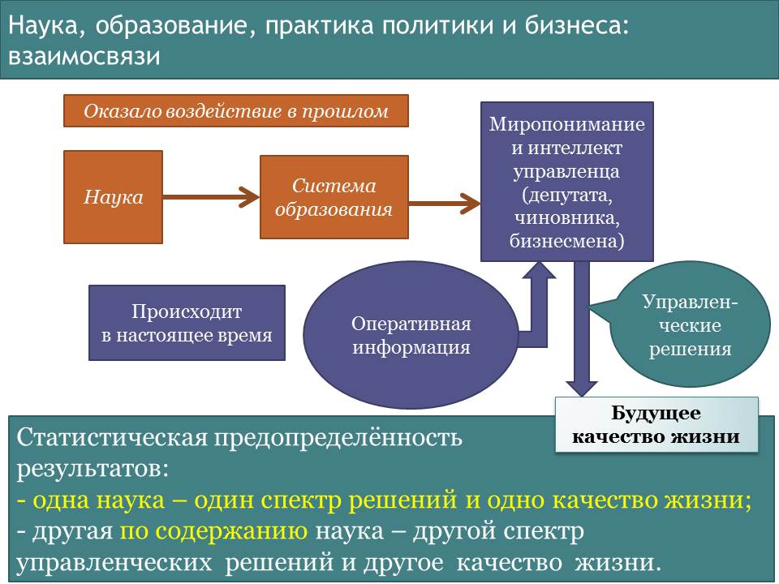
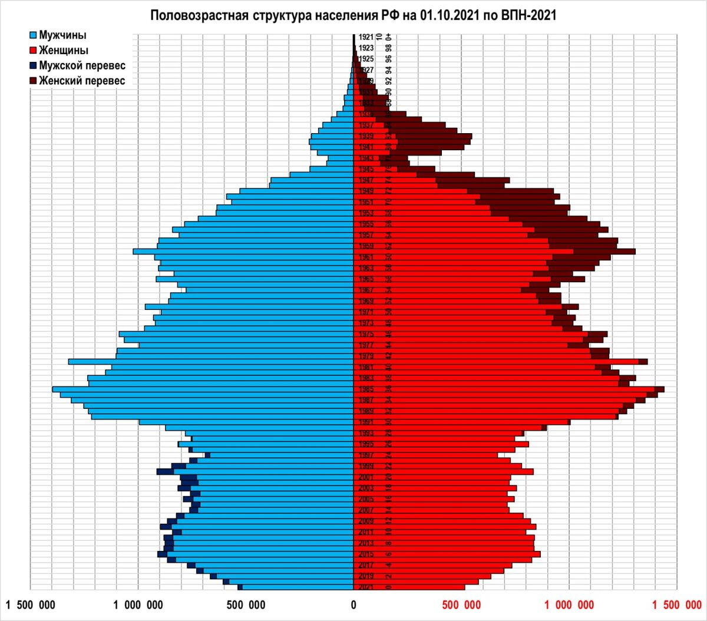

> **Первичный текст.** Экономика инновационного развития в условиях глобализации — редакция ред. 2025 г..
> Источник: `dotu.ru:c9a90c8251d8df1f.doc` sha256 `1ba5942f8be1d32c…`; [страница на dotu.ru](https://dotu.ru/books/ekonomika-innovatsionnogo-razvitia-red-2025/).
> Автоматическая транскрипция DOC→Markdown; смысл и формулировки не правились.
> Контрольные суммы и статус проверки — в [NOTICE.md](../../NOTICE.md).
> Содержание передаёт позицию авторов; утверждения не верифицированы библиотекой.

---

# Введение

Первые две редакции предлагаемой вниманию читателя работы начинались со слов «Россия переживает затяжной общекультурный кризис». Однако постсоветская эпоха показала, что это была неправильная оценка процесса, в который втянулась Россия. Россия втянулась не в кризис, а в общекультурный коллапс. Кризис и коллапс — это разные явления.

- Кризис — эпизод в циклическом процессе, в котором имеет место чередование нарастания каких-либо характеристических параметров и их снижения. Это чередование обусловлено системообразующими принципами, порождающими внутреннюю динамику процесса в его взаимодействии с объемлющей его средой.

- Коллапс — это прогрессирующие снижение характеристических параметров процесса, обусловленное системообразующими принципами, порождающими внутреннюю динамику процесса в его взаимодействии с объемлющей его средой.

Из этого различия кризисов и коллапсов проистекает важное следствие:

- **кризис можно перетерпеть**, поскольку с течением времени процесс войдёт в новый цикл и *под воздействием системообразующих принципов самого́ процесса* начнётся рост характеристических параметров;

- **КОЛЛАПС НЕВОЗМОЖНО ПЕРЕТЕРПЕТЬ**, поскольку выход из коллапса требует:

<!-- -->

- отказа от системообразующих принципов, действие которых породило коллапс,

- и активизации иных системообразующих принципов, действие которых выведет процесс из режима коллапса и обеспечит в дальнейшем его желательное течение.

**Одна из составляющих этого общекультурного коллапса — экономические проблемы государства и подавляющего большинства населения, которые не удаётся разрешить на протяжении более четверти века.** Поскольку жизнь каждого человека и общества в целом, политика государства нуждаются в экономическом обеспечении, то в связи с необходимостью преодоления этого общекультурного кризиса на совещании Госсовета по развитию отечественного бизнеса и повышению его конкурентоспособности ещё 18 сентября 2014 г. Президент РФ В.В. Путин заявил: «Хочу подчеркнуть, за предстоящие полтора-два года необходимо совершить настоящий рывок в повышении *конкурентоспособности* российского реального сектора, сделать то, на что раньше потребовались бы, может быть, даже годы» \[118\].

Фактически был поставлен вопрос о новой модернизации и выведении экономики страны в режим устойчивого инновационного развития. Однако, как известно, прошлая модернизация, курс на которую был провозглашён ещё 8 февраля 2000 г. зашла в тупик: *«перед Россией стоит стратегическая задача — стремительная модернизация экономики»* \[107\]. В конце августа 2009 г. крах этой попытки модернизировать экономику был признан тогдашним президентом РФ Д.А. Медведевым: «Мы её просто провалили, мы ничего не *сделали в этом направлении…»* \[82\]. Курс на новую модернизацию Д.А. Медведев провозгласил в Послании Президента Федеральному Собранию 12.11.2009 г., но и она тоже не состоялась.

Модернизация российской экономики, обеспечение устойчивости экономического развития страны отнесены и к числу важнейших задач и «Концепцией общественной безопасности в Российской Федерации» \[61\], утверждённой Президентом РФ В.В. Путиным 20 ноября 2013 г.

Однако, характеристические показатели экономики России в их натуральном (а не стоимостном) выражении и в 2025 г. говорят о том, что модернизация экономики и переход к инновационному развитию не состоялись.

Соответственно успех развития в обозримой перспективе реального сектора экономики нашей страны на инновационной основе, о необходимости чего на протяжении уже нескольких десятилетий говорят разные должностные лица, требует выявления и устранения ошибок, прежде всего, ошибок в системообразующих принципах, которые не позволили перевести экономику на путь инновационного развития в период с 2000 по 2025 г.

Если рассматривать процессы общественного самоуправления и государственного управления на исторически продолжительных интервалах времени, охватывающих сроки активной жизни нескольких поколений, то можно выявить закономерность, представленную на рис. В‑1[^2].

Суть этой закономерности может быть изложена в следующих словах:

- научные теории, вошедшие в систему образования несколько десятилетий тому назад, сформировали миропонимание и культуру мышления ныне взрослых поколений общества, включая и представителей управленческого корпуса наших дней в государственном управлении и в экономике;

- поток оперативной информации люди, включая управленцев-профессионалов, большей частью соотносят с тем, чему они научились в школах и вузах, и на основе такого соотнесения вырабатывают управленческие решения разного уровня (от личностного до общегосударственного и глобального), *принципиально новые решения, порождённые переосмыслением изученного ранее и творчеством, — ОЧЕНЬ редки;*

- проведение в жизнь выработанных управленческих решений формирует будущее качество жизни, и при этом последствия проводимых в жизнь управленческих решений распределяются в интервале времени от нескольких долей секунды до нескольких столетий, а то и тысячелетий (продолжительность последствий принятия и осуществления управленческих решений зависит от их характера и тех процессов, которые они затрагивают и порождают).

Соответственно, в процессе реализации этой закономерности в жизни, продолжительностью от нескольких десятилетий до нескольких столетий (если считать от момента появления научной теории до проявления её в *качестве жизни общества),* выражается статистическая предопределённость результатов:

- «одна наука ⇒ один менталитет (миропонимание и культура мышления) ⇒ один обусловленный наукой и менталитетом спектр управленческих решений ⇒ одно качество жизни»;

- **«другая по содержанию наука ⇒ другой менталитет (миропонимание и культура мышления) ⇒ другой обусловленный наукой и менталитетом спектр управленческих решений ⇒ другое качество жизни».**

Действие этой закономерности обусловлено двумя обстоятельствами:

- Никто не может проверить на достоверность все те мнения по разным вопросам и факты, которые в качестве истинных преподносят в учебных курсах по всем дисциплинам, начиная от детского сада до высшей школы, — просто времени жизни на это не хватит.

- Всеобщее образование ныне начинается с освоения навыков чтения и письма, хотя жизненно состоятельное образование должно начинаться с выработки личностной культуры чувств (восприятия действительности как таковой), на основе которой далее должна строиться личностная культура осмысления воспринятого и памятного и соображения прочитанного. Как следствие учащиеся осваивают «слова», а образные представления, которые они связывают с освоенными «словами», далеко не всегда сообразны объективной реальности.

Именно по этим причинам очень важно очистить и систематически очищать учебные программы от заведомой лжи и *заблуждений, унаследованных от прошлого*.

Соответственно этой закономерности социолого-экономические теории, вошедшие в систему образования несколько десятилетий тому назад, сформировали менталитет управленческого корпуса наших дней в государственном управлении и в сфере управления финансово-экономическими процессами, и этот менталитет не позволил осуществить модернизацию страны в 2000 — 2025 гг. Иначе говоря, социолого-экономические теории, на основе которых строилось управление социально-экономической системой страны в прошлые десятилетия, — главный фактор, сделавший модернизацию страны в 2000 — 2025 гг. невозможной; более того, есть основания полагать, что и общекультурный коллапс, начало которому положила политика группы во главе Н.С. Хрущёвым и которая была продолжена группой, олицетворяемой М.С. Горбачёвым в годы перестройки, сама является результатом некритично-доверчивого отношения к неадекватным социолого-экономическим теориям, положенным в основу реформ.

Соответственно закономерности, представленной на рис. В‑1, *успех будущей модернизации с переводом страны в режим устойчивого инновационного развития* может быть только следствием внедрения в систему образования управленчески состоятельных социолого-экономических теорий, на основе которых будет возможна выработка и проведение в жизнь управленческих решений, обеспечивающих общественное развитие в объективном смысле слов «общественное развитие».

К настоящему же времени образовательные стандарты высшего профессионального образования в области экономики и финансов, государственного и муниципального управления, юриспруденции ориентированы на обслуживание либерально-рыночной экономической модели. И это обстоятельство остаётся вне осознания многими. Поэтому проблема вытеснения либерально-рыночной модели из системы образования и политико-экономической практики не обсуждается, хотя приверженность ей обрекает Россию первоначально на статус криптоколонии[^3], а в дальнейшем — на расчленение и переход её обломков под власть транснациональных корпораций (ТНК), чьи коммерческие интересы связаны с эксплуатацией природных ресурсов тех или иных регионов не только нашей страны, но и всей планеты. Чтобы не быть голословным в утверждении о несостоятельности социолого-экономического образования, ориентированного на обслуживание либерально-рыночной экономической модели, сошлёмся на реальный факт.

Студентам второкурсникам, обучающимся по специальности «государственное и муниципальное управление», было предложено написать «сочинение» по тематике организации управления в жизни общества. Среди вопросов, которые им предлагалось осветить, был такой: «Экономика (народное хозяйство) как ОБЪЕКТ управления». В группе из 25 человек 7 человек написали, что «экономика это — СУБЪЕКТ управления», обосновывая это утверждение тем, что от неё в жизни общества якобы «зависит всё»[^4]. *Остальные написали по этому вопросу нечто невнятное (своего мнения не было, но надо было что-то написать, если преподаватель просит, или побоялись выразить несогласие с постановкой вопроса преподавателем)*. И хотя все они успешно сдали такой предмет как теория управления, предложенное им задание выявило, что они не способны взглянуть на народное хозяйство страны как на объект управления и не способны мыслить управленчески по отношению к задаче инновационного развития народного хозяйства в интересах страны.

Студенты, обучающиеся по специальностям финансово-экономического профиля вряд ли напишут лучше, поскольку в стандартных курсах экономической теории, предлагаемых Министерством науки и образования РФ в качестве обязательных, *задача управления биосферно-социально-экономической системой государства по полной функции управления*[^5] *(тем более в условиях глобализации) не рассматривается*.

Соответственно, став с таким миропониманием, сформированным системой образования, госчиновниками, менеджерами в бизнесе, они не смогут обеспечить финансово-экономический[^6] суверенитет РФ и её инновационное развитие: не по злому умыслу, а потому, что их этому не научили, а выработать с нуля знания и навыки, необходимые для решения задачи, поставленной Президентом РФ на Госсовете ещё 18 сентября 2014 г., будучи загруженными делами по месту будущей работы, в подавляющем большинстве они не смогут.

Тем более не поможет этому и отдание предпочтения при назначении на должности тем, кто получил финансово-экономическое, управленческое (в области так называемого «менеджмента») и юридическое образование в престижных вузах Запада. Вопреки этому среди «индикаторов решения поставленных задач»[^7], предлагаемых в проекте «Стратегии инновационного развития Российской Федерации на период до 2020 года» «Инновационная Россия — 2020» \[54\], опубликованном Минэкономразвития в 2010 г.[^8], есть и такие.

| **Наименование индикатора** | **2010** | **2016** | **2020** |

|:---|:--:|:--:|:--:|

| Доля государственных служащих, получающих ежегодно дополнительное образование за рубежом | 0,1 % | 1 % | 3 % |

| Доля лиц, занимающих должности руководителей высшей и главной групп должностей государственной гражданской службы, получивших высшее профессиональное образование за рубежом | \> 0,5 % | 4 % | 12 % |

При этом обратим внимание на то, что в приведённом выше фрагменте таблицы «индикаторов решения поставленных задач» в первой строке речь идёт о получении госслужащими за рубежом *дополнительного* образования[^9], а во второй — о получении *профессионального* высшего образования за рубежом, что по умолчанию подразумевает отдание предпочтения тем кандидатам на должности «высшей и главной групп должностей государственной гражданской службы», которые получили первое высшее *профессиональное* образование за рубежом. Остаётся только предполагаемые *12 % зарубежных агентов влияния,* получивших профессиональное образование за рубежом, продвинуть на наиболее значимые должности и — о реальном суверенитете России можно будет на некоторое время забыть по причине целесообразности полученного ими образования по отношению к решению вполне определённых задач, не соответствующих интересам народов России. Они будут агентами влияния на основе некритичного восприятия ими учебных курсов даже в том случае, если спецслужбы иных государств никого из них не завербуют с целью продвижения на высокие руководящие должности в дальнейшем. Это же во многом касается и повышения квалификации в зарубежных вузах действующими должностными лицами[^10]. Т.е. нельзя жить чужим умом: *живущие чужим умом обречены стать жертвами чужих ошибок и злоумышлений*.

Это означает, что задача модернизации страны с выходом в режим устойчивого инновационного развития в настоящее время не обеспечена прежде всего кадровой политикой, которой подчинена и деятельность Министерства науки и образования, поскольку образовательные стандарты в области социально-экономического управления де-факто ориентированы на решение прямо противоположной задачи — поддержание режима криптоколониальной эксплуатации России с целью её последующего расчленения и сдачи её регионов под власть ТНК соответственно их коммерческим интересам[^11].

Прямо противоположную позицию по отношению к зарубежному образованию заняли Япония и Китай. В Японии в июне 2015 г. ввели запрет на преподавание ряда гуманитарных дисциплин в вузах страны.

«Министр образования Хакубун Шимомура направил в 86 государственных университетов Японии письмо, в котором призвал их сосредоточиться на областях знаний, «лучше отвечающих потребностям общества», то есть — сократить или и вовсе отменить учебные программы по гуманитарным и социальным наукам. Лучшие университеты страны — Токийский и Киотский — отказались подчиняться декрету, однако издание Times Higher Education сообщает, что 17 вузов объявили о закрытии гуманитарных программ, а еще девять согласились их сократить; университеты не будут готовить юристов, экономистов, политологов, социологов и других специалистов-гуманитариев»[^12].

В России журналистика восприняла сообщение о запрете Японии преподавания всей западной «гуманитарщины» иронично (дескать, страну хотят погрузить в невежество и мракобесие), а политический официоз и аналитики спецслужб вообще пропустили это сообщение, не придав ему никакой политической значимости, тем более значимости глобально-политической. Однако, это решение выражает не устремлённость к насаждению невежества, если его анализировать, соотносясь с закономерностью, представленной на рис. В‑1.

Кроме того, этому решению государственной власти Японии предшествовало появление стратегического документа *«Внутренняя граница: развитие личностей и лучшее управление в двадцать первом веке» (Комиссия по целям Японии в 21 веке. Япония, 2000)*[^13]*.*

А ещё ранее в интервью Урмасу Отту, показанном по первому каналу российского телевидения 07.07.1993 г., глава правительства Японии в 1982 — 1987 гг. Ясухиро Накасоне (1918 — 2019) сказал, что главным из того, что он сделал на посту премьер-министра, является создание в Японии *Института изучения глобальных проблем*.

Создание финансируемого государством института такой направленности деятельности имеет смысл, если Япония признаёт за собой глобальный уровень значимости своей политики, и вне зависимости от деклараций объективно следует глобальной концепции решения изучаемых этим Институтом проблем. И он будет вполне работоспособен и соответствовать своему назначению в системе самоуправления Японии, если у её политиков хватит понимания, что:

- в обязанности института входит изучение глобальных проблем с целью их разрешения,

- а не создание глобальных проблем подведением фундамента наукообразной видимости под уже предопределённую в готовом виде неизвестно как появившуюся определённую политику, как это имело место в системе науки СССР (партийной, академической и отраслевой) и как это имеет место во взаимоотношениях государственной власти и научного официоза в постсоветской России.

В том же интервью, говоря о надеждах на будущее, Ясухиро Накасоне огласил намерение Японии «создать в Азии “общеазиатский дом”, в котором должна принять участие и Россия». При этом Ясухиро Накасоне категорически отрицал возможность устремлённости Японии к военному реваншу и говорил о необходимости «создания структуры сотрудничества государств бассейна Японского моря». Т.е. это ориентация на делание политики средствами управления / оружия более высокими, чем шестой — грубая военная сила (об этом см. гл. 11).

А введённый в 2015 г. запрет на преподавание западной «гуманитарщины» в ведущих вузах страны — шаг к восстановлению чувственно-интеллектуального суверенитета Японии, т.е. **суверенитета в его полноте, представляющего собой осознанно-целесообразные действия государственной власти и общества, проистекающие из самостоятельного восприятия действительности и самостоятельного осмысления и переосмысления воспринятого и памятного** (об этом см. гл. 11).

Аналогично в июне 2021 г. пришло сообщение, что «с нового учебного года власти Китая запретят использовать иностранные программы обучения, начиная с детского сада и вплоть до девятого класса. Кроме того, иностранным организациям запретили владеть частными школами на ступени обязательного 9-летнего обучения» (<https://rg.ru/2021/06/03/v-kitae-zapretiat-inostrannye-shkolnye-programmy-i-repetitorov.html>). — Это тоже шаг по защите и восстановлению чувственно-интеллектуального суверенитета Китая.

В постсоветской России за всё время её существования по настоящее время (2025 г.) государственная власть вообще не задумывается о том, что такое полнота суверенитета и как в кратчайшее время возродить полноту суверенитета общества и государства, и ничего не делает в этом направлении.

Однако на фоне криптоколониального характера правления и прогрессирующего коллапса в России в октябре 2024 г. было опубликовано следующее сообщение, которое должно свидетельствовать якобы об успехах экономической политики государственной власти.

«Доля ВВП России в мировом[^14] по паритету покупательной способности[^15] в 2024 году составляет 3,55 %, что делает её четвертой экономикой мира, подсчитали в МВФ. Фонд также улучшил прогноз по росту экономики на 0,4 п.п. — до 3,6 %.

Международный валютный фонд (МВФ) опубликовал новый [доклад](https://www.imf.org/en/Publications/WEO/Issues/2024/10/22/world-economic-outlook-october-2024#Projections) по динамике ВВП стран мира. Из него следует, что в 2024 году ВВП России составляет 3,55 % мирового по паритету покупательной способности.

Доли в мировой экономике пересчитаны исходя из результатов нового раунда Программы международных сопоставлений (ICP), экстраполированных на 2024 год. Самые существенные пересмотры — плюс 0,7 п.п. относительно прежнего раунда ICP — получили Индия и Россия. Доля последней в мировом ВВП в 2024 году прежде оценивалась в 2,9 %.

По доле в мировом ВВП по паритету покупательной способности Россия обогнала Японию (3,38 %). Первые строчки в рейтинге по этому показателю занимают Китай, США и Индия».[^16]

Но это — всего лишь слова, от которых следует перейти к непосредственному рассмотрению *экономической реальности как таковой*.

Экономическая реальность включает в себя два аспекта:

- производство и распределение продукции и природных благ с целью их потребления среди физических и юридических лиц;

- финансовый аспект, т.е. характеристики денежного обращения, финансовые показатели, характеризующие кредитно-финансовую систему в целом и жизнь её пользователей — физических и юридических лиц.

Первый аспект в постсоветские времена публично не обсуждается, поскольку его обсуждение — помеха манипулированию общественным мнением путём рисования картинки экономического благополучия посредством демонстрации растущих финансовых показателей и процентов, которые люди не в состоянии быстро соотнести с экономической реальностью как таковой. Поэтому рассмотрим первый аспект в его существе.

**Во-первых**, *в экономике действует общефизический закон сохранения энергии.* И это выражается в том, что количество продукции, которую может дать производственная система страны, обусловлено количеством энергии, которое может быть направлено в производство[^17], и коэффициентами полезного действия (КПД) технологий, применяемых во всех отраслях, включая складское хозяйство и транспорт.

Разница между промышленностью и сельским хозяйством в том, что промышленность наших дней работает большей частью на техногенной энергии, а в сельском хозяйстве растениеводство производит продукцию на основе солнечной энергии, животноводство, птицеводство и рыбоводство производят продукцию на основе биогенной энергии, техногенная энергия в сельском хозяйстве используется только в процессах обслуживания технологий непосредственного производства продуктов питания и сырья для их производства, в основе которых лежат биологические процессы, и потому она не может заменить солнечную и биогенную энергию при достигнутом уровне развития науки.

Производительность труда обусловлена полезной энерговооружённостью одного занятого, т.е. обусловлена количеством энергии и КПД.

**Во-вторых**, вся производимая продукция делится на три группы:

- конечная продукция, которая включает в себя две группы:

<!-- -->

- 1) конечная продукция непроизводственного характера[^18], ради производства и потребления которой людьми и государством ведётся вся хозяйственная деятельность;

- 2) конечная продукция производственного характера — средства производства (включая и ту долю сельхозпродукции, которая обеспечивает жизнь и размножение растений, животных, птиц и рыб) и инфраструктуры, без создания и работы которых производство новых средств производства, производство конечной продукции, доставка её потребителям и потребление невозможны либо вообще, либо в необходимых объёмах;

<!-- -->

- 3) продукция, обеспечивающая текущее производство, — то, что потребляется в процессе производства конечной продукции (это называется производственное потребление, которое включает в себя потребление сырья, энергоносителей и энергии, ингредиентов и конструкционных материалов, комплектующих и услуг разного рода).

Соответственно этим аспектам объективной реальности в СССР по завершении пятилеток и при планировании будущих пятилеток основными отчётными и плановыми показателями состояния и развития экономики были:

- объём производства первичных энергоносителей и электроэнергии;

- объёмы производства средств производства и инфраструктурных объектов;

- объёмы производства разнородной конечной продукции, потребляемой населением и государственной властью[^19];

- при этом темпы роста производства конечной продукции непроизводственного характера обусловлены:

<!-- -->

- в первую очередь, ростом энерговооружённости сферы производства и транспорта (ростом объёмов производства энергии и ростом коэффициентов полезного действия техники и процедур) и,

- во вторую очередь, темпами введения в действие новых производственных мощностей и замены уже существующих более высокопроизводительными, что требует опережающего инновационного развития производства средств производства по отношению к производству конечной продукции непроизводственного характера.

По этим характеристикам, в первую очередь, — в их натуральных показателях, и во вторую очередь, — в их финансовом выражении и в процентах роста оценивалось состояние и динамика экономики СССР в сопоставлении её с экономиками других стран и, прежде всего, США.[^20]

Соответственно такому подходу, если экономика России заняла в 2024 г. четвёртое место в мировом рейтинге, то мы — четвёртые по потреблению энергии в сфере производства (за вычетом расходов энергии на отопление зимой и кондиционирование летом), а КПД наших технологий и процедур — на мировом уровне и выше; мы занимаем 5 — 3 места и выше по объёмам производства средств производства всех отраслей и инфраструктурных объектов; мы занимаем 5 — 3 места и выше по объёмам производства разнородной конечной продукции. И вся эта продукция находится на мировом уровне, а лучшие её *массово производимые (а не единичные экспериментальные) образцы* — задают мировой уровень в соответствующих сферах деятельности.

Однако, если мы посмотрим на предприятия реального сектора России наших дней, то на них производственное оборудование либо старое советское либо импортное (отечественное надо выискивать, чем и занимаются пропагандисты, повествуя об успехах экономической политики государственной власти России); на стройках техника не наша; инструменты — не наши; комплектующие (особое место в их перечне занимают электромоторы, подшипники, трубы, кабели, метизы, кабельная и трубная арматура), технологические жидкости, часть конструкционных материалов во всех отраслях большей частью импортные или производимые в России филиалами зарубежных фирм или по лицензиям; на дорогах наших автомобилей[^21] почти не видно (их доля приблизительно на уровне 5 %); в аэропортах самолёты зарубежного производства, лётную годность которых мы поддерживать сами не в состоянии[^22]; электроника и её программное обеспечение[^23] не наши; в магазинах бытовая техника не наша; продукты питания — это особая тема, если рассматривать её от производства сельскохозяйственной «первички» (семян, поголовья породистых животных и птиц): см. рис. «Смертность от болезней органов пищеварения (на 100 тыс. чел)» в разделе 9.3. Качество же всего производимого в России также оставляет желать много лучшего. **Оправдание такого положения дел ссылками на глобализацию — неуместно, поскольку по умолчанию при таком положении дел в реальном секторе это — всего лишь оправдание отказа от *суверенитета России в его полноте, включающей и финансово-экономический суверенитет***[^24]***.***

Однако, если обратиться к самому́ упомянутому выше Докладу МВФ (<https://www.imf.org/en/Publications/WEO/Issues/2024/10/22/world-economic-outlook-october-2024#Projections>), то он включает в себя несколько блоков. Первый блок озаглавлен «World Output. Advanced Economies» («Мировой выпуск. Развитые экономики»), и в нём нет России. Второй блок озаглавлен «Emerging Market and Developing Economies» («Страны с формирующимся рынком и развивающиеся экономики»), и в нём Россия действительно помещена в четвёртую строку. Т.е. МВФ в общем-то не врёт, но те, кто сослался на доклад МВФ представив экономику России как якобы четвёртую в мировом рейтинге, — врут, распространив в общем-то достоверную информацию, но при этом не пояснив, что такое «паритет покупательной способности» и на основе какой именно корзины он был рассчитан для этого доклада.

Характеристика МВФ российской экономики как четвёртой в мировом рейтинге основывается на финансовых показателях, происхождение которых неизвестно для подавляющего большинства граждан России (включая и большинство политиков). И эта её характеристика находится в жутком противоречии с оценкой той же самой российской экономики на основе производственно-потребительских показателей в их натуральном виде. Т.е. политика СМИ направлена на формирование у граждан России заведомо ложного представления об экономической реальности. Т.е. **характеристика экономики РФ отечественными пропагандистами как четвёртой в мировом рейтинге — ещё одна иллюстрация на тему, как опасно жить чужим умом и тем более — не воспринимать и не соображать того, что реально в жизни стоит за любыми словами.**

Не лучше обстоит дело и с главной характеристикой общества — демографией и с демографической политикой во всех трёх её аспектах[^25]:

1.  Демографическая пирамида России похожа на гриб (рис. слева), а не на пирамиду, т.е. страна вымирает.

2.  Медико-биологические статистики ухудшились и продолжают ухудшаться на протяжении нескольких десятилетий для всех возрастных групп.

> Обратимся к данным научных исследований, проводившихся НИИ гигиены и охраны здоровья детей и подростков ФГАУ «Научный центр здоровья детей Минздрава России» в четырёх школах Москвы с первого по одиннадцатый класс, представленных д.м.н., профессором Ириной Калмановной Рапопорт в Общественной Палате г. Москвы 29 февраля 2016 г.

>

> Далее на рисунке — распределение учащихся по группам здоровья[^26] в зависимости от класса (%). Как видно по представленным данным, выпускников школы, обладающих первой группой здоровья, вообще нет. Но если даже в первой группе здоровья по медицинским стандартам России допускаются единичные проявления кариеса, то это означает, что количество полностью здоровых первоклассников (т.е. не имеющих единичных проявлений кариеса) — находится в пределах погрешности сбора статистических данных, поскольку кариесных школьников из первой группы здоровья следует исключить потому, что **кариес — одно из проявлений общесистемных нарушений физиологии организма и это обстоятельство не позволяет отнести поражённых им к категории здоровых людей**. 2/3 выпускников школ относятся к третьей и четвёртой группам здоровья, т.е. они — носители тех или иных хронических заболеваний. Обратим внимание, что представителей первой группы здоровья в первых классах всего 4,3 % (даже при том, что у некоторых из них есть единичные проявления кариеса), а далее их доля снижается и колеблется в пределах оценки статистической погрешности, стремясь к нулю. Зато четвёртая группа нарастает и к выпуску превосходит долю первой группы, наличествовавшей 11 лет тому назад на момент поступления в первый класс.

>

> При этом старшеклассники в их большинстве не в состоянии сдать нормы комплекса «Готов к труду и обороне» 1930‑х гг. для своей возрастной группы, зато появились и узаконены никчёмные «киберспортсммены» — в большинстве своём психически нездоровые игроманы, а не состоявшиеся и будущие гении информационно-алгоритмических технологий.

3.  Показатели культурной состоятельности вступающих в жизнь новых поколений, мягко говоря, оставляют желать лучшего.

Кроме того по состоянию на конец 2024 — начало 2025 гг., «Россия занимает одно из лидирующих мест в Восточной Европе по числу зарегистрированных случаев самоубийств. Из 100 тыс. наших соотечественников 19,9 принимают решение самостоятельно оборвать жизнь. Об этом стало известно по результатам исследования, опубликованного в научном журнале The Lancet Public Health.

Таким образом, РФ в настоящее время находится на втором месте в топе стран Восточной Европы по количеству эпизодов суицида, в то время как первое место в Восточной Европе заняла Литва. В бывшей союзной республике в настоящее время совершается 20,6 самоубийств на 100 тыс. человек.

При этом исследователи подчеркнули, что в целом в мире за 30 лет (с 1991 по 2021 год) смертность от попыток суицида упала примерно на 40 % — с 15 до девяти случаев на 100 тыс. населения планеты»[^27].

Но Россия, уступив только Литве, обогнала по статистике самоубийств даже Украину, в отношении которой ведёт специальную военную операцию (СВО).

Тут одно из двух:

- либо страна успешно развивается, как в этом систематически на протяжении нескольких десятилетий уверяет государственная власть;

- либо страна в числе лидеров по статистике самоубийств потому, что многие люди не видят смысла жить, и потому, что показатели психического здоровья населения оставляют желать много лучшего…

Особый вопрос — какова в этой статистике самоубийств доля самоубийств детей, подростков, молодёжи ныне? В недавнем прошлом положение дел был таким:

«Статистикой отмечается рост числа детско-юношеского суицида, отметили в ведомстве. За последние годы количество детских суицидов и попыток самоубийств увеличилось на 35 — 37 %.

Наибольшая частота суицидов наблюдается у подростков и молодежи в возрастном диапазоне 15 — 35 лет. У этой категории суицидентов на 1 смерть приходится до 200 нереализованных суицидальных попыток. Официальная статистика фиксирует явные случаи суицидов. В действительности масштабы подростковых самоубийств в России могут быть гораздо выше в силу ряда субъективных и объективных факторов, приводящих к недоучету потерь, обусловленных подростковыми самоубийствами»[^28].

————————

**Одна из главных причин такого течения биосферно-социально-экономических процессов в России — жизненная несостоятельность научно-методологического обеспечения государственного управления и управления в экономике на всех её уровнях.**

Тем не менее, вне зависимости от позиции мафии приверженцев либерально-рыночной экономической модели в государственной власти РФ и действий Министерства науки и образования, решать задачу возрождения страны и модернизации экономики с выходом в режим устойчивого инновационного развития необходимо: иначе можно лишиться не только суверенитета в его полноте (как это имеет место ныне), но и государства в его нынешних границах.

Поэтому предлагаемая вниманию читателей работа освещает проблематику управления биосферно-социально-экономическими системами с позиций достаточно общей теории управления (ДОТУ) \[46\] в русле решения задачи построения социально-ориентированной экономики, устойчиво развивающейся на инновационной основе в преемственности поколений и обеспечивающей полноту суверенитета, экологическую и экономическую безопасность государства и общества на наивысшем уровне в условиях глобализации.

1. Порочность\

либерально-рыночной экономической модели

*[В оригинальном издании здесь расположены иллюстрации (4 объекта). Иллюстрации опущены: см. реестр графического слоя работы.]* <!-- figs:экономика-инновационного-развития-в-условиях-глобализации-ред-2025-год--unbound-image319,экономика-инновационного-развития-в-условиях-глобализации-ред-2025-год--unbound-image320,экономика-инновационного-развития-в-условиях-глобализации-ред-2025-год--unbound-image321,экономика-инновационного-развития-в-условиях-глобализации-ред-2025-год--unbound-image322 -->

========================================

[^2]: В настоящей работе принят следующий принцип нумерации рисунков, таблиц, математических формул. Символы слева от дефиса (в данном случае буква «В» — Введение) обозначают раздел, в котором находится рисунок, таблица или формула. Цифры справа от дефиса обозначают порядковый номер соответствующего объекта в разделе.

[^3]: Термин «криптоколония» введён в лексикон политологии Дмитрием Галковским. Термин указывает на фактическую колонизацию государства при наличии у него всех формальных атрибутов суверенитета, осуществляемую в обход контроля сознания большинства представителей этого общества и, прежде всего, — решающего большинства его правящей «элиты». В этом случае политика государства-криптоколонии, включая экономическую, при наличии всех формальных атрибутов суверенитета, будет подчинена интересам иностранных государств или интересам собственников и директоратов транснациональных корпораций точно так же, как и в том случае, если бы страна юридически была колонией, а её государственность была административно подчинена тем или иным внешнеполитическим или транснациональным силам.

[^4]: Выдержки из сочинений, в которых высказано и обосновывается это мнение:

    «Мне кажется, что экономика является субъектом, а не объектом управления над народом. Ведь большая часть экономики — это нефть, газ и прочие полезные ископаемые, от которых зависит рынок страны, на котором находится потребитель, т.е. народ».

    «Экономика является субъектом управления. Всё государство и вся предпринимательская деятельность держится на экономике. Экономика является составной частью управления. Не мы правим экономикой, а экономика правит нами».

    «Мне кажется, что экономика как объект — это вымысел людей. Максимум, человек может немного направить экономику в нужное ему русло. Но на самом деле экономика — это субъект управления, который правит НАМИ, со своими законами, со своими правилами».

    «Экономика является субъектом управления. Вся предпринимательская деятельность и деятельность государства держится на экономике».

    «Экономика является субъектом управления. Вся предпринимательская деятельность и деятельность государства держится на экономике. Без экономики у нас многого бы не было. Не мы правим экономикой, а экономика правит нами».

    «Экономика тоже управляет людьми, поэтому я не совсем согласна, что экономика является объектом. У нас есть природные ископаемые. И благодаря им наша экономика процветает. От экономики зависит рост цен на продукты, и это также управляет людьми».

    «Экономика — субъект управления. Экономика диктует рост цен, а значит, экономика правит обществом, а не наоборот. От экономики зависит материальное положение страны в целом».

    Т.е. авторы этих сочинений психологически, мировоззренчески состоялись как невольники и заложники неподвластной им экономики, управляемой другими. Кроме того, как видно по текстам, некоторые авторы списывали у других, т.е. не думали сами. И в перспективе все они, а также и те, кто уклонился от освещения этой темы, — выпускники факультета государственного и муниципального управления, т.е. — будущие госслужащие, многие из которых будут делать административную карьеру на основе миропонимания, сформированного учебными программами, навязанными системе высшего образования Министерством образования и науки.

[^5]: Полная функция управления — термин достаточно общей теории управления (ДОТУ): см. далее раздел 4 и более обстоятельно — постановочные материалы учебного курса ДОТУ \[46\]. Полная функция управления включает в себя следующие этапы её реализации в управленческой практике: 1) выявление проблем, 2) целеполагание в отношении их разрешения, 3) выработку концепции достижения намеченных целей, 4) внедрение концепции в жизнь, 5) текущее правление в соответствии с принятой концепцией, 6) совершенствование концепции по мере необходимости, 7) высвобождение ресурсов из завершённых процессов управления по достижении целей либо после краха соответствующего процесса управления.

[^6]: Термин «финансово-экономический суверенитет» проистекает из того обстоятельства, что по отношению к экономике общества (производству, распределению и потреблению природных благ и продукции) кредитно-финансовая система государства является инструментом управления (об этом далее в гл. 7). Т.е. хозяйственная деятельность подчинена «финансовому климату», формируемому параметрами настройки кредитно-финансовой системы государства. Пока в обществе существуют деньги, многое в его жизни (хотя и не всё) программируется тем, кому, за что, в каком объёме и как платят деньги, и у кого, в каком объёме, как и для чего их изымают.

[^7]: Контрольных параметров социально-экономической системы РФ.

[^8]: В это время главой Минэкономразвития была Э.С. Набиуллина, впоследствии помощник президента РФ и ныне (2025 г.) глава центробанка РФ.

[^9]: Это полезно при условии, что базовое образование в Отечестве — жизненно состоятельно, что подтверждается не знающим исключений принципом «практика — критерий истины». В этом случае получение дополнительного образования за рубежом необходимо для того, чтобы понимать менталитет партнёров, противников и конкурентов. С другой стороны одно из направлений продвижения собственной глобальной политики — обучение иностранцев у себя по своим собственным тематическим учебным планам.

[^10]: Кто из прошлых и действующих чиновников разного уровня «повысил квалификацию» за рубежом на специально созданных для этого зарубежными государствами курсах? — желающие могут поискать информацию по этому вопросу сами: получится интересный список. В частности в него входят бывший министр экономического развития А.В. Улюкаев и Э.С. Набиуллина, успевшая сменить множество постов на федеральном уровне.

    Какая стране от этого «повышения квалификации» польза? — никакой, поскольку за рубежами нет социолого-экономических теорий, которые позволяют разрешить и профилактировать проблемы нашей страны. Зато есть угроза в виде вербовки «повышающих квалификацию» спецслужбами государств-«просветителей»… И при этом только ЦРУ и другие спецслужбы точно знают, кто именно был завербован в период учёбы за рубежом. Но если кто-то из обучающихся просто некритично восприняли всю ту либерально-рыночную чушь и заведомую ложь, что им поднесли на лекциях и в учебниках под видом передового научного знания, то и такие по факту завербованы в том смысле, что *наилучшая вербовка — когда завербованный даже не подозревает о том, что его успешно завербовали*.

    Поэтому значение имеет то, что пока кадры для высших уровней государственной власти готовят спецслужбы зарубежных государств (пусть даже под вывеской престижных университетов и программ дополнительного образования для граждан других стран), у России нет возможностей развития.

[^11]: Именно такую политику и проводят ТНК и государства Запада в отношении Украины после государственного переворота в феврале 2014 г., целью осуществления которого было — обеспечить доступ ТНК к сланцевому газу и нефти, к чернозёмам, редкоземельным металлам и т.п., а НАТО — к базированию военно-морских сил и авиации на территории Украины, включая Крым, и удаление из Крыма ВС России.

    Номинально суверенитет сохраняется, но госаппарат и в особенности спецслужбы наводнены консультантами-иностранцами, финансово-экономический суверенитет утрачен по причине искусственно организованного краха реального сектора и назревшего банкротства государственности вследствие разрушения внутреннего денежного обращения и отрицательного сальдо внешней торговли.

    В 1990‑е годы в России в кремлёвских кабинетах тоже были зарубежные «консультанты» — в какой роли выступали и кадровые сотрудники ЦРУ. См., например: «Шохин рассказал, как агенты ЦРУ участвовали в приватизации в 90-х» (<https://ria.ru/20211210/shokhin-1763166731.html?ysclid=m49jxy1ugv323423831>); Манолис Чахкиев, «Поименный список американских советников 90-х или с кем единиться?» (Публикация в авторском блоке газеты «Завтра» от 05.11.2015 г.: <https://zavtra.ru/blogs/poimennyij-spisok-amerikanskih-sovetnikov-90-h-ili-s-kem-edinitsya?ysclid=m49kyr81nw115464702>); «Действия Гарвардского института были постыдными». Дипломат США о шпионах и реформах 90-х в России» (<https://rtvi.com/stories/bolshe-vsego-raspada-sssr-ne-khoteli-amerikanskie-voennye-amerikanskiy-diplomat-rasskazal-o-posleds/?ysclid=m49l8ogo6r758316451>).

    При этом необходимо отметить, что для реформаторов 1990‑х «нашим всем» был нобелевский лауреат по экономике (1976 г.) Милтон Фридман (1912 — 2006). Если бы для них «нашим всем» был другой нобелевский лауреат (1973 г.) В.В. Леонтьев (1905 — 1999), то в полном соответствии с закономерностью, представленной на рис. В‑1, проводимые ими реформы носили бы иной характер в силу иного научно-методологического обеспечения их проведения, и их результаты были бы иными — 1990‑е гг. могли бы не получить характеристику «лихие», но могли бы стать годами свершения «экономического чуда».

    Однако, как сообщает «Википедия», «в начале 1990-х годов Леонтьев приезжал в Российскую Федерацию с предложением помощи в реформировании российской экономики. Вернувшись в Америку, он сказал: *«Я туда больше не поеду. Они ничего не слушают».* До этого В.В. Леонтьев консультировал проведение успешных (по результатам) реформ экономики Южной Кореи и Гонконга, в результате которых эти государства из нищих превратились в экономически успешные.

[^12]: Соломонова И. «Япония отменила гуманитарные науки. Почему это важно?» // \[Электронный ресурс\]. Режим доступа: <https://republic.ru/posts/56806>. Дата обращения: 30.01.2018.

[^13]: См. аналитическую записку ВП СССР «Япония и Русь: «прожектёрство»? — либо «предиктор-корректор» в действии?» из серии «О текущем моменте» № 6 (54), 2006 г.

[^14]: Какое-то слово в цитируемом источнике пропущено, возможно должно быть «доля ВВП России в мировом рейтинге».

[^15]: «ВВП по паритету покупательной способности (ППС) на душу населения — это рыночная стоимость всех конечных товаров и услуг (с учетом паритета покупательной способности), произведенных в стране за определенный год в среднем одним человеком (на душу населения). ВВП по ППС на душу населения рассчитывается как в текущих ценах, так и в постоянных — также как номинальный и реальный ВВП» (<https://www.rbc.ru/quote/news/article/6273353d9a7947534ca8d991>).

    «Паритет покупа́тельной способности (ППС, англ. purchasing power parity) — соотношение двух или нескольких денежных единиц, валют разных стран, устанавливаемое по их покупательной способности применительно к определённому набору товаров и услуг.

    Концепция паритета покупательной способности исходит из идеи, что в идеале рыночные курсы валют должны стремиться к неким равновесным значениям, при которых на одну и ту же сумму денег, пересчитанную по текущим рыночным курсам в национальные валюты, в разных странах мира можно приобрести одно и то же количество одинаковых товаров и услуг при отсутствии транспортных издержек и ограничений по перевозке.» («Википедия»: <https://ru.wikipedia.org/wiki/Паритет_покупательной_способности>).

[^16]: «РосБизнесКонсалтиннг», публикация от 22.10.2024: «МВФ признал Россию четвертой экономикой мира»: <https://www.rbc.ru/economics/22/10/2024/6717ac329a79478792f175ec?ysclid=m2t4wa1wfe680983934>.

[^17]: Это, в свою очередь, обусловлено с одной стороны — объёмом производства и импорта энергии в государстве, и с другой стороны — наличием соответствующих потребителей энергии в производственных отраслях, складском хозяйстве и на транспорте.

[^18]: В состав конечной продукции, производимой на рассматриваемом производственном цикле, в балансовых моделях продуктообмена входят средства производства, которые предполагается использовать на последующих производственных циклах.

[^19]: К конечной продукции, потребляемой исключительно государством, в СССР относились вооружения и соответствующие инфраструктурные объекты, но отчёты об этом не были публичными.

[^20]: И в общем-то до середины 1970‑х гг., когда искусственно созданный «застой» стал проявляться в жизни общества в реальных фактах, рост экономики СССР выражался в росте спектра потребления подавляющего большинства населения.

    Здесь и далее «спектр» (производства, потребления) — номенклатура и объёмы по каждой позиции номенклатуры. Т.е. рост спектра потребления включает в себя как расширение номенклатуры, так и рост объёмов по каждой позиции номенклатуры.

[^21]: «Россия не закрывает более половины своей потребности в критически важных автокомпонентах, о чем пишет No Limits со ссылкой на заявление главы Минпромторга Антона Алиханова.

    «В целом могу сказать, что из 740 позиций критической номенклатуры, которая была сформирована в 2022 году, около 330 закрыты российскими поставщиками», — отметил он на выставке Kazan Truck Expo в Казани» («Прошло 3 года, но Россия не смогла закрыть и половины потребности в критически важных автокомпонентах»: <https://www.yaplakal.com/forum11/topic2899823.html>).

[^22]: «Российские перевозчики приостановили полеты на 34 из 66 самолетов Airbus A320neo и А321neo из-за проблем с двигателями производства США и Франции, пишет «Ъ». Источники газеты допускают вывод самолетов из эксплуатации к 2026-му» («Коммерсантъ» узнал о приостановке полетов половины Airbus neo в России: <https://www.rbc.ru/business/21/11/2024/673eabf99a79472d40025941?ysclid=m3sykmxvqw30516380>).

    Для сопоставления. В СССР в течение 5 — 10 лет неоднократно создавались эпохальные самолёты мирового уровня (Ту‑95, Ту‑114, Ил‑62, Ан‑22) и вертолёты (Ми‑6, Ми‑10, Ми‑8, В‑12). В постсоветские времена за 20 лет не смогли довести до ума Ил -112 (заурядный транспортник грузоподъёмностью 5 т) и двигатель для него, после чего проект был закрыт. И с 2022 г. (после начала СВО и введения санкций) осуществляется попытка возобновить производство Ту-214, который был разработан ещё в СССР, совершил первый полёт в 1993 г., но не был запущен в серию правительством РФ, отдавшим предпочтение Боингам и Эирбасам. Так же бюрократы не пустили в серийное производство полностью отечественный Ту-334, отдав предпочтение *«Суперджету-100» (SSJ‑100), который создавался в расчёте на международную кооперацию при его производстве и был ориентирован на экспорт,* но не смог состояться как серийный самолёт из-за введения странами Запада санкций в отношении России, разрушивших международную кооперацию при его производстве и обслуживании в ходе эксплуатации.

[^23]: «После ухода международных поставщиков программного обеспечения (ПО) в российской экономике образовался провал «импортозамещенных» типов индустриального софта. В отрасли насчитали 837 «белых пятен» в разных отраслях, пишет Cnews со ссылкой на руководителя Центра компетенций в сфере ИТ (ЦКИТ) Илью Массуха. Для 412 потребностей экономики российские аналоги полностью отсутствуют, а в 425 случаях отечественные решения по софту нуждаются в существенной доработке, рассказал Массух во время кросс-отраслевого демо-дня индустриальных центров компетенций (ИЦК).

    Больше всего «белых пятен» (172) в агропромышленном комплексе — причем для 159 потребностей российских решений не существует — и в автомобилестроении (101 — при 56 необеспеченных российскими аналогами). В ИЦК «Электроника и микроэлектроника» зафиксировано 47 незакрытых потребностей, в 35 из них российских решений нет, а 12 требуют доработки. В разделе «Общее машиностроение» — 62 «белых пятна», для 14 из которых необходимо разрабатывать ПО с нуля» («В России не смогли заменить почти 1000 видов иностранного ПО»: <https://www.yaplakal.com/forum2/topic2883279.html>).

[^24]: Тем не менее В.В. Путин, выступая на пленарном заседании форума «Инвестиционный форум «Россия зовёт!», огласил следующее:

    «Развивается технологический, производственный, логистический потенциал России. Укрепляются связи с перспективными партнёрами.

    В прошлом году валовой внутренний продукт России вырос на 3,6 процента, это хорошо известно, а за январь — октябрь текущего года он увеличился на 4,1 процента. Причём главным образом рост сосредоточен в обрабатывающих отраслях производства, в секторах с высокой добавленной стоимостью. Так, за 10 месяцев наша обрабатывающая промышленность прибавила более восьми процентов, а точнее, 8,1 процента. В том числе опережающие темпы демонстрирует автопром и машиностроение. В высокотехнологичный сектор с высокой добавленной стоимостью и квалифицированными рабочими местами увеличивается и приток специалистов. В сентябре количество занятых в IТ-сфере выросло на 8,1 процента по сравнению с предыдущим годом, в обрабатывающей промышленности — почти на четыре процента, на 3,9 процента.

    О структурных изменениях на рынке труда говорит снижение безработицы в регионах, где она была традиционно высока, а также увеличение занятости среди молодёжи до 25 лет. Но мы знаем, что молодёжная безработица — это проблема в очень многих странах мира. У нас тоже такая проблема существует, или, точнее сказать уже, существовала. Здесь уровень безработицы ниже девяти процентов, хотя в определённое время и даже совсем недавно он зашкаливал за 20 — 25 процентов в некоторых регионах страны. В целом в России рекордно низкий уровень безработицы — всего 2,3 процента. На фоне большинства ведущих экономик мира и развивающихся стран этот показатель является минимальным.

    Для примера: во многих государствах Европы он составляет семь процентов и выше, а у нас, повторю, чуть больше двух процентов. Для сравнения, чтобы не быть голословным: в Италии 7,6 процента, во Франции — 7,3, в Канаде поменьше — 5,4, в Греции — 11, в Бразилии — 8, в Швеции — 7,6 процента» (<http://www.kremlin.ru/events/president/news/75751>).

    Также надо понимать, что зарубежные «партнёры» (а это — реальные враги, конкуренты и временные союзники) оценивают состояние России не по таким словам, а по состоянию и перспективам реального сектора, а они плохие и не улучшаются на протяжении многих лет.

    *«Население России сокращается, экономика увядает, она не проживёт следующие 15 лет»* (это мнение Дж.Р. Байдена, бывшего 47‑го президента США, высказанное им ещё в бытность вице-президентом США в администрации Б.Х. Обамы: The Wall Street Journal. 25 июля 2009). — Эта оценка, во многом состоятельная, лежала в основе политики США в отношении России как объекта колонизации со времён задолго до её оглашения, с начала 1990‑х гг..

    По вступлении в должность президента США Д.Ф. Трамп в январе 2025 г. заявил следующее: *«Я не хочу навредить России. Я люблю русский народ, и у меня всегда были очень хорошие отношения с президентом Путиным — и это несмотря на то, что радикальные левые утверждают: «Россия, Россия, Россия».*

    > *Мы никогда не должны забывать, что Россия помогла нам выиграть Вторую мировую войну, потеряв при этом почти 60 000 000 жизней. Учитывая все это, я собираюсь оказать России, чья экономика терпит крах, и президенту Путину очень большую услугу. Договоритесь сейчас и прекратите эту нелепую войну! Она станет только хуже.*

    >

    > *Если мы не заключим «сделку», причем в ближайшее время, у меня не останется другого выбора, кроме как ввести высокие налоги, тарифы и санкции на все, что Россия продает Соединенным Штатам и другим странам-участницам. Давайте покончим с этой войной, которая никогда бы не началась, будь я президентом! Мы можем сделать это легким или трудным путем — и легкий путь всегда лучше. Пришло время «заключить сделку». Больше не должно быть потеряно ни одной жизни!!!»* — И это тоже высказано на основе оценок состояния реального сектора экономики России и его перспектив. Такого не могло быть сказано в отношении великой державы, чей реальный сектор задаёт мировой уровень по характеристикам многих видов продукции, в первую очередь — наукоёмкой, высокотехнологичной, как мирного так и военного назначения.

    Не надо обольщаться и в отношении российско-китайских взаимоотношений. Безусловно, Китай заинтересован в доступе к природным ресурсам России, к достижениям советского научно-технического наследия, пока ещё сохраняющегося в России, но он помнит, когда, кого и как Российская империя — СССР — Россия предали, нарушив ранее заключённые договора или злоупотребив слабостью партнёра, и не желает быть заложником политики де-факто несуверенного Кремля, поддерживая взаимоотношения, исходя из своих интересов и ви́дения перспектив, включая и *некоторые* глобальные.

[^26]: «Группы здоровья представляют собой шкалу, по которой определяется состояние организма, развития растущего человека. Каждый пункт этой шкалы также учитывает факторы риска, влияющие или влиявшие ранее на состояние здоровья. В соответствии с этой шкалой делается предварительный прогноз на будущее. Определённую группу здоровья выставляет обычно участковый педиатр, либо медицинский работник в дошкольном учреждении с учётом здоровья ребёнка, при наличии всех обследований» (<https://zdravbud.net/new/gruppy-zdorovya>. © [ZDRAVBUD.NET](https://zdravbud.net/)).

    Первая группа — здоровые дети, хотя реально это может быть не так, поскольку в первой группе здоровья допускаются единичные поражения зубов кариесом, что является объективным показателем уже состоявшегося хронического разнообразного нездоровья в слабой форме, коли нет прочей симптоматики: т.е. *детей с единичными проявлениями кариеса следовало бы отнести ко «второй А» группе здоровья, поскольку кариес и последствия его «профилактики» (посредством не всегда безвредных зубных паст) и лечения — недооценённая проблема здравоохранения*.

    Вторая группа условно здоровые дети, с некоторыми нарушениями и рисками развития тех или иных хронических патологий. Третья — пятая группы — дети, в той или иной мере нездоровые. Показатели ухудшения здоровья нарастают от второй к пятой, пятая — инвалиды и на грани инвалидности. Развёрнутые характеристики каждой из групп здоровья см. по ссылке, приведённой в начале этой сноски.

[^27]: «Известия», 21.02.2025, «Россия вошла в топ по числу самоубийств в Восточной Европе»: <https://iz.ru/1842576/2025-02-21/rossiia-voshla-v-top-po-chislu-samoubiistv-v-vostochnoi-evrope>).

[^28]: «Роспотребнадзор: Россия занимает 1-е место в Европе по самоубийствам подростков» — публикация от 11 марта 2013 г. (<https://www.newkaliningrad.ru/news/community/1866635-rospotrebnadzor-rossiya-zanimaet-1e-mesto-v-evrope-po-samoubiystvam-podrostkov.html>).

    **Данные о подростково-молодёжных самоубийств последующих лет найти весьма не просто, что в сочетании с данными, опубликованными «Известями» 21.02.2025 г., наводит на мысли о том, что статистика, как минимум не стала кардинально лучше, если не стала хуже.**

    Ниже фрагменты публикации о положении дел в Челябинской области от октября 2024 г.

    «Статистика по детским суицидам засекречена

    Власти не любят публично обсуждать тему подростковых суицидов, а статистика и вовсе оказалась засекреченной. Последний раз официальные данные по региону в начале 2023 года озвучивала бывший заместитель губернатора Ирина Гехт. В этот раз добиться конкретики журналисту 74.RU не удалось. Мы направляли запросы в полицию, Следственный комитет, Министерство социальных отношений, уполномоченному по правам ребенка, но все структуры лишь пеняли друг на друга: в Минсоце ответили, что эти данные концентрирует у себя уполномоченный по правам ребенка, омбудсмен — что «случаи суицида регистрируются следственными органами и полицией», в СК просто сказали, что данные предоставить не могут, а из полиции перенаправили в межведомственную комиссию по делам несовершеннолетних при правительстве области. Власти не любят публично обсуждать тему подростковых суицидов, а статистика и вовсе оказалась засекреченной. Последний раз официальные данные по региону в начале 2023 года [озвучивала](https://74.ru/text/incidents/2023/02/01/72021878/) бывший заместитель губернатора Ирина Гехт. В этот раз добиться конкретики журналисту 74.RU не удалось. Мы направляли запросы в полицию, Следственный комитет, Министерство социальных отношений, уполномоченному по правам ребенка, но все структуры лишь пеняли друг на друга: в Минсоце ответили, что эти данные концентрирует у себя уполномоченный по правам ребенка, омбудсмен — что «случаи суицида регистрируются следственными органами и полицией», в СК просто сказали, что данные предоставить не могут, а из полиции перенаправили в межведомственную комиссию по делам несовершеннолетних при правительстве области.

    Это неудивительно, ведь даже врачи-психиатры в последнее время не могут получить доступ к цифрам. В итоге считать нам пришлось самостоятельно. Мы не претендуем на точность, потому что знаем не обо всех случаях подростковых суицидов в регионе (например, в январе 2023 года официально их было четыре, а в новостную повестку попали лишь два), но все-таки это дает возможность хоть немного получить представление о происходящем.

    Итак, по данным Ирины Гехт, в 2020 году в регионе было зарегистрировано 26 суицидов подростков, в 2021 году — 22, в 2022-м — 17. В полиции уверяют, что число трагедий продолжает снижаться (без конкретики). Мы пересчитали наши публикации на эту тему и получилось, что в 2023 году произошло минимум 16 случаев самоубийств подростков, а за неполные 10 месяцев 2024-го — 12. Хочется надеяться, что это окончательные цифры и положительная динамика на самом деле есть. Но в любом случае работать еще есть над чем» «Мы не можем сделать МРТ души»: врачи бьют тревогу из-за подростковых суицидов. Разбираем их причины»: <https://74.ru/text/health/2024/10/25/74249786/>).

    «Статистика за 2023 год кабинета медико-психологической помощи СПБ ГКУЗ ЦВЛ имени С.С. Мнухина

    71 % обращений — семейная дезадаптация / хронические семейные конфликты, развод родителей, острые семейные конфликты, раздел ребенка.

    42 % обращений — школьная дезадаптация, неуспеваемость, конфликты со сверстниками, конфликты с педагогами.

    43 % детей с суицидоопасным поведением (высказывания и самоповреждающее поведение) были госпитализированы в стационар, отмечен рост суицидных попыток среди девочек в возрасте старше 15 лет (на 93,75 %), девочки с суицидными попытками обращаются чаще, по сравнению с мальчиками» (<http://ppms.kirov.spb.ru/images/doc/Родителям/Профилактика_суицидального_поведения_у_детей_и_подростков._Основные_группы_и_факторы_риска.pdf>). Это данные по Кировскому району Санкт-Петербурга общегородского центра детской психиатрии им. С.С. Мнухина.
---

[К произведению](README.md) · [Каталог](../../CATALOG.md)
