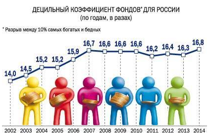
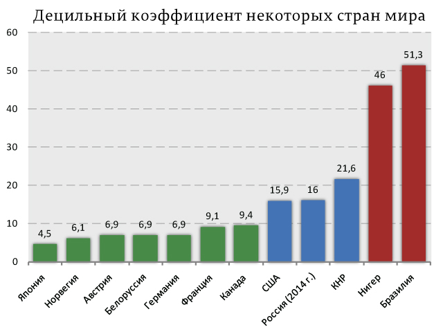

> **Первичный текст.** Экономика инновационного развития в условиях глобализации — редакция ред. 2025 г..
> Источник: `dotu.ru:c9a90c8251d8df1f.doc` sha256 `1ba5942f8be1d32c…`; [страница на dotu.ru](https://dotu.ru/books/ekonomika-innovatsionnogo-razvitia-red-2025/).
> Автоматическая транскрипция DOC→Markdown; смысл и формулировки не правились.
> Контрольные суммы и статус проверки — в [NOTICE.md](../../NOTICE.md).
> Содержание передаёт позицию авторов; утверждения не верифицированы библиотекой.

---

# 12. Глобализация, Россия и Русские люди

Уповать на то, что *постсоветская государственная власть России в её исторически сложившемся виде* освоит **суверенитет в его полноте**, выведет Россию из коллапса и сделает её лидером цивилизационного развития человечества, — нет никаких оснований: архитектура государственной власти[^612], научно-методологическое обеспечение государственного управления и управления в экономике, на основе которого готовятся кадры; кадровая политика, в результате которой отвергаются одни кандидаты на должности и продвигаются другие; действующее законодательство, начиная от конституции, — всё это «заточено» под обслуживание либерально-рыночной экономической модели в криптоколониальном её варианте, а не под осуществление реального суверенитета страны в его полноте в условиях глобализации, представляющей собой «гибридную войну» за безраздельное мировое господство и порабощение человечества.

При этом:

- Представители государственной власти в своих публичных выступлениях положение дел в стране и в мире в наиболее значимых аспектах оценивают ошибочно и лживо.

- Но поскольку коллапс прогрессирует, а эффективные меры по выводу страны из коллапса государственной властью не вырабатываются и не реализуются, то это означает, что и внутренняя (не предназначенная для публикации) аналитика государственной власти не вырабатывает адекватного представления о реальности и тенденциях её дальнейшего изменения, и как следствие — не вырабатывает мер, способных вывести страну из коллапса.

- Кроме того внутренние мафии в государственной власти и в обслуживающих её общественных институтах (в науке, в системе образования, в СМИ, в сфере искусств) целенаправленно работают на игнорирование, извращение и подавление инициатив, направленных на вывод страны из коллапса и её развитие, исходящих из подвластного общества, и продвигают идеи, реализация которых наносит прямой или опосредованный вред государству и его гражданам — в том числе и *вред, протяжённый в будущее на сроки жизни нескольких поколений*.

- Наряду с этим государственная власть невосприимчива к критике и убеждена в своей исключительной компетентности, интеллектуальной состоятельности и правоте и, как следствие, она необучаема и не способна к самообучению.

Поэтому:

Исторически сложившаяся постсоветская власть вполне соответствует характеристике В.О. Ключевского: **«У них нет совестливости, но страшно много обидчивости: они не стыдятся пакостить, но не выносят упрёка в пакости»**. И представители власти массово делают то, от чего предостерегал М.Е. Салтыков-Щедрин: *«… ничто так не подрывает власть, как некоторая выдающаяся или заметная для всех гнусность»*.

Также надо понимать, что зарубежные политические субъекты разного рода оценивают Россию не на основе заявлений российской государственной пропаганды и не на основе публикаций МВФ о том, что экономика России — четвёртая в мире по паритету покупательной способности. Они оценивают Россию по демографической динамике и по тому факту, что научно-внедренческие циклы в России не осуществляются или осуществляются настолько медленно, что научно-технический прогресс как социально-экономическое явление в ней отсутствует; кроме того, реальный сектор экономики России на протяжении всей постсоветской эпохи не в состоянии обеспечить импортонеуязвимость страны, а кредитно-финансовая система не обеспечивает финансово-экономического суверенитета. Неспособность России к массовой реализации научно-внедренческих циклов и неспособность обеспечить импортонеуязвимость по отношению к решению задач обеспечения её обороноспособности в будущем означает, что если в России даже будут создаваться единичные образцы новых видов оружия, то она не сможет перевооружать свои вооружённые силы в необходимом темпе, а в случае интенсивных военных действий не сможет обеспечить восполнение выбывающих из строя вооружений; а при неразвитости в ней субкультуры стандартизации и сертификации продукции и разного рода процедур, Россия не сможет построить свои вооружённые силы как суперсистему, в которой все её компоненты взаимно соответствуют друг другу.

Кроме того, при оценке России и перспектив сотрудничества с нею, потенциальные союзники могут вспомнить историю и составить список тех государств и политических движений, в отношении которых Российская империя, СССР, постсоветская Россия злоупотребила их временной слабостью либо обманула их или предала. Соответственно, оценивая перспективы сотрудничества с несуверенной постсоветской Россией, для них целесообразно не становиться *заложником российских обещаний* в качестве действительных союзников России, а ограничиваться минимальным сотрудничеством: 1) в аспекте доступа к её природным и социокультурным ресурсам (включая и разного рода идеи и разработки военно-технического характера) и 2) в аспекте экспорта своей продукции в Россию с целью увеличения политической зависимости России от стран-экспортёров и с целью улучшения показателей собственного экспортно-импортного баланса[^613].

И даже если бы кто-то из числа зарубежных и транснациональных политических субъектов пожелал бы помочь России в разрешении её проблем, то это оказалось бы невозможным вследствие нравственно-этической порочности постсоветской правящей «элиты» и её необучаемости.

Поэтому возрождение страны в качестве полноценно суверенной великой державы, лидера цивилизационного развития человечества возможно только на основе личностных и коллективных общественных инициатив разного рода.

—————————

Будущее во многом определяется показателями культурной состоятельности активных взрослых поколений и вступающих в жизнь поколений молодёжи. Если оценивать характеристики культурной состоятельности этих групп населения, то ныне стартовые условия для возрождения России в качестве полноценно суверенного успешно развивающегося государства гораздо хуже, чем были в прошлом:

- В 1985 г. при объявлении М.С. Горбачёвым перестройки и до начала гайдаровских реформ Б.Н. Ельциным в январе 1992 г.:

<!-- -->

- мы были государством с наиболее образованным населением — как по качеству образования, так и по охвату образованием разных групп населения;

- экономика страны была близка к обеспечению импортонеуязвимости, и научно-технический потенциал позволял её достичь в сроки в пределах 10 — 15 лет *при соответствующем этой задаче государственном управлении;*

- плюс к этому у многих была надежда на то, что провозглашаемые реформы пойдут на благо стране, что порождало моральную готовность работать и работать хорошо[^614].

> Это всё в совокупности образовывало потенциал развития, который был уничтожен в постсоветское время государственной властью при *попустительстве общества (голосовали за те политические силы, которые могли обеспечить только деградацию страны, и не пожелали самоорганизоваться, чтобы породить политические силы, которые обеспечили бы развитие страны).*

- В 1945 г. после разгрома третьего рейха и Японии, не менее нацистской, чем гитлеровский рейх:

<!-- -->

- мы победили, в народном хозяйстве было мощное инновационное ядро (оно было почти полностью уничтожено в хрущёвско-брежневские времена);

- в обществе была готовность самоотверженно работать на возрождение мощи СССР и строительство коммунизма,

- и было *доверие руководству страны во главе с И.В. Сталиным, которое было оправдано жизнью и поддерживалось тем, что на протяжении длительного времени становились реальностью те обещания, которые ранее давала государственная власть;*

<!-- -->

- В 1922 г., когда завершилась гражданская война:

<!-- -->

- была массовая неграмотность простонародья, унаследованная от Российской империи (в этой связи ещё раз вспомним главу Синода РПЦ К.П. Победоносцева, внёсшего в это свой немалый вклад);

- имели место эмиграция представителей образованных сословий рухнувшей Российской империи и саботаж многих из тех, кто не смог эмигрировать;

- экономика была в разрухе до такой степени, что для скорейшего восстановления локомотивного парка и межрегионального продуктообмена в производственно-потребительской системы страны пришлось заказать паровозы *отечественной разработки* серии Э в Германии и в Швеции, передав им техническую документацию и заплатив за эти паровозы втридорога золотом;

- но в простонародье у большинства была вера в светлое будущее и готовность работать на его осуществление — именно по этой причине простонародье поддержало большевиков, а не *белых, которых лживо искусственно облагораживает государственная пропаганда в постсоветские времена*.

<!-- -->

- в 1913 г.:

<!-- -->

- качество и распространённость образования не отвечали потребностям развития страны (в 1911 г. 61 % новобранцев не умели ни читать, ни писать[^615], только 10 % новобранцев в 1912 г. имели законченное начальное образование, т.е. учились в каких-то школах, а не освоили навыки чтения и письма дома[^616]), т.е. большинство населения было культурно несостоятельным;

- официальные опросы общественного мнения в том виде, как они проводятся ныне ВЦИОМ и показывают уровень доверия населения государственной власти и её представителям персонально близким к 80 %[^617], в российской империи не проводились, но празднование 300-летия дома Романовых в 1913 г. неоспоримо показывало «верноподданность» (на фото слева встреча царя в Москве; множество точек в левой части снимка на фоне брусчатки Красной площади — не дефект старой фотографии, а брошенные в верх шапки восторженных верноподданных, «сподобившихся лицезреть обожаемого государя-императора») *подавляющего* большинства населения во всех социальных группах, которая внезапно исчезла с началом февральской революции 1917 г.;

- производственно-потребительская система страны была неспособна производить *самостоятельно (т.е. без помощи иностранных фирм)* наукоёмкую высокотехнологичную продукцию подчас даже в единичных экземплярах, а не то, что массово (т.е. импортонеуязвимость Российской империей не была достигнута);

- власть не имела за душой проекта развития страны и, соответственно, не знала средств, необходимых для осуществления развития, но слабоумно старалась поддерживать «стабилизец» в полном соответствии с рекомендациями умершего в 1907 г. К.П. Победоносцева[^618], на протяжении 25 лет (с 1880 г.) возглавлявшего идеологическую власть империи — Синод Русской православной церкви. **Вклад К.П. Победоносцева в крах Российской империи неоценён**.

Ныне в России всё примерно на уровне 1913 г., но хуже потому, что:

- С 2006 г. эмиграция из России растёт год от года, и в потоке *уезжающих из страны навсегда* велика доля молодёжи с высшим образованием, которые не видят в России:

<!-- -->

- путей для реализации своего творческого потенциала в науке, в инженерном деле, в медицине, в государственном строительстве и в работе *«элитарно»-корпоративной несуверенной государственной власти, которую они не воспринимают как свою, народную*[^619]*,* поскольку породить культуру, в которой научно-внедренческие циклы массово осуществляются в разумные сроки, постсоветская государственная власть не способна;

- возможностей профинансировать из доходов, получаемых в этих сферах деятельности, построение, жизнь и развитие семьи[^620].

<!-- -->

- Изрядная доля молодёжи и взрослых, остающихся в России, не умеет хорошо работать и не желает ни учиться хорошо работать по причине неверия в светлое будущее под властью «элиты», какое неверие среди всего прочего стимулируется тем фактом, что якобы обузданная центробанком инфляция пожирает их накопления быстрее, нежели они зарабатывают деньги.

> Снова стала актуальной характеристика российского общества В.О. Ключевским: *«В России нет средних талантов, простых мастеров, а есть одинокие гении и миллионы никуда негодных людей. Гении ничего не могут сделать, потому что не имеют подмастерьев, а с миллионами ничего нельзя сделать, потому что у них нет мастеров. Первые бесполезны потому, что их слишком мало; вторые беспомощны потому, что их слишком много»*.

- На фоне всего этого **четвёртое место РФ в мире по паритету покупательной способности в 2024 г. по оценкам МВФ — вовсе не достижение постсоветской государственной власти, а *«отступные» в стиле «Вселенной 25»,* которые «элитарно»-корпоративная власть платит *коммерчески успешной части простонародья***, дабы:

<!-- -->

- более или менее потребительски благополучные (в сопоставлении с лихими девяностыми) группы населения не проявляли интереса к политике и не встревали в неё;

- а те, кто не относится к этой более или менее потребительски благополучной группе, деградировали и вымирали либо боролись за выживание, работая и подрабатывая на нескольких работах, и не имели времени и сил, чтобы заниматься самообразованием, вникать в политику и тем более — оказывать воздействие на неё.

Это подтверждается и тем, что на протяжении всего постсоветского времени Россия входит в число мировых лидеров по величине децильного коэффициента (при этом отметим, что Яндекс не находит графиков изменения децильного коэффициента в России после 2017 г. по всей видимости потому, что олигархов в России официально нет и, как видно по левому графику, с начала 2000‑х годов децильный коэффициент устойчиво рос[^621], обеспечивая *(либо уничтожая?)* тем самым «народное единство»).

Также отметим, что после 1913 г. был 1914 г., в который британское масонство развязало первую мировую войну ХХ века с целью уничтожения империй геополитических конкурентов Великобритании.

Россия встретила вступление в войну эмоциональным порывом верноподданности. На фото слева верноподданные на Дворцовой площади во время оглашения манифеста Николая II о вступлении России в войну[^622]. Далее ход войны и прочих событий показал, что качество управления наследственно-клановой «элитой» ведением боевых действий, снабжением армии и флота вооружениями[^623] и прочим, качество управления жизнью страны в целом было такими низкими, что первоначальный энтузиазм верноподданных исчез уже к концу сентября 1914 г.[^624] и, как следствие, 1 (14) ноября 1916 г. в Думе прозвучал вопрос **«Это глупость или измена?»**, который в ходе своего выступления неоднократно повторял *политикан*-либерал П.Н. Милюков (1859 — 1943). Спустя два месяца с небольшим режим Николая II и династия Романовых рухнули. При этом необходимо признать следующий факт:

Февральская революция 1917 г. — результат, прежде всего, собственной государственно-управленческой несостоятельности режима Николая II, вследствие которой возник и был успешно осуществлён *заговор* внутрироссийской пробританской периферии либерально-буржуазной ветви масонства[^625], *в руководстве которым приняли участие посольства Великобритании и Франции*[^626]. И благодаря созданному режимом Николая II массовому недовольству ходом войны и жизнью в тылу февральский переворот первоначально был воспринят с одобрением большинством тех, кто в Российской империи интересовался политикой.

Конечно, специальная военная операция (СВО), начатая 24 февраля 2022 г. постсоветской Россией с целью денацификации[^627] и демилитаризации постсоветской Украины, — не третья мировая война, *если ограничиваться рассмотрением применения оружия только уровня шестого приоритета*. Воздействие СВО на жизнь России не столь мощно, как воздействие первой и второй мировых войн ХХ века. Тем не менее, за время проведения СВО как у непосредственных её участников, так и в остальном обществе возникли и продолжают возникать вопросы к государственной власти в целом, к Министерству обороны, к Генштабу и ко многим другим властным структурам и должностным лицам федерального уровня персонально по поводу СВО. Однако, эти вопросы для государственной власти в целом и для её публично выступающих представителей *как бы* не существуют, вследствие чего они не дают на них ответа ни в стиле «заболтать», ни делом — т.е. в виде разрешения проблем, вызывающих недовольство. *Ответы же на них по существу, даваемые гражданами страны, в том числе с указанием достоверно реальных фактов, в России наших дней могут юридически квалифицироваться как «фейки», дискредитирующие ВС РФ, за распространение которых введена уголовная ответственность, поскольку **официально таких вопросов и ответов на них не существует***[^628].

А кроме поставленных вопросов и у многих участников СВО, и в остальном обществе есть ещё большой перечень *неверноподданнических* вопросов, связанных как с СВО, так и с другими событиями нескольких прошедших десятилетий. И хотя мы воспроизводить их не будем, но они объективно «висят» в психодинамике российского общества и в ноосфере Земли в целом и ждут своего разрешения: умолчать о них и их заболтать не удастся — ноосферу и Бога не обманешь.

Если такого рода вопросы возникают в сознании людей, а государственная власть на протяжении длительного времени не даёт на них ответы ни словом, подкрепляемым результативно успешным делом, ни результативно успешным делом без слов, то она утрачивает поддержку *в первую очередь думающих людей и людей, начинающих задумываться* о смысле жизни своём собственном, общества, человечества в целом. Думающие люди и люди, начинающиеся задумываться, находят на них ответы сами. Эти ответы бывают разными: от желания убрать с должностей или из жизни тех или иных должностных лиц персонально — до понимания необходимости работать на то, чтобы государство обрело реальный суверенитет в его полноте на основе нравственно-этического единства *общества, которое тоже должно быть суверенным*. В любом из вариантов ответов на такого рода вопросы познавательно-творческий потенциал общества начинает работать против исторически сложившейся государственной власти.

**Но если люди при этом не выходят на понимание необходимости выработки *суверенитета в его полноте как носителя собственного проекта глобализации,* то все недовольные режимом обречены быть объектом манипулирования со стороны врагов и геополитических конкурентов государства, в котором они живут.** Поэтому последствия такого рода самодовольства государственной власти могут быть разнообразными: от катастрофы культуры и ухода общества в историческое небытиё до возрождения суверенитета общества и государства в его полноте.

Верить безусловно государственной власти и её представителям, соглашаться с чушью и ложью, которые они выплёскивают в общество, возводя их в ранг Правды-Истины, — это одно из требований к верноподданным рабам, которое точно выразил М.Е. Салтыков-Щедрин: *«… нет задачи более достойной истинного либерала, как с доверием ожидать дальнейших разъяснений»*. Но обязанность свободного человека-гражданина — быть всегда проводником Правды-Истины в жизнь, и альтернатив этому нет.

Поэтому вопрос о доверии государственной власти России и *о последствиях недоверия ей в обозримой перспективе* — ещё более острый, чем был в 1913 — 1917 гг.

Возвращаясь от рассмотрения параллелей с 1913 г. в наши дни, отметим, что ещё более глупо надеяться на то, что если ещё потерпеть, то *исторически сложившаяся постсоветская государственная власть, сохраняя верность либерально-рыночной экономической модели и «рыночным методам» («рыночным решениям»*[^629]*), спустя некоторое время явит экономическое чудо, за которым последует чудо преображения России в лидера мирового цивилизационного развития в соответствии с многочисленными предсказаниями православно-воцерковленных и прочих прорицателей*.

Такое чудо не может свершиться потому, что системообразующие принципы, на которых основывается социально-экономическая организация жизни постсоветской России, работают на прогрессирующий коллапс вплоть до гибели страны. Развитие этого коллапса мы и видим на протяжении всей постсоветской истории. На развитие они работать не могут в силу их соотношения с объективными закономерностями, в которых выразилось Божье Предопределение бытия Мироздания, в котором мы живём.

Практика — критерий истины:

За время, прошедшее с момента начала гайдаровских реформ (с 1 января 1992 г.), и за время, прошедшее с момента принятия ныне действующей конституции РФ (30 лет с лишним с 12 декабря 1993 г.), ничего кроме поддержания режима прогрессирующего коллапса государственная власть постсоветской России не явила.

Сколько времени ещё надо власти для того, чтобы явить такого рода «чудо» на основе –либерально-рыночных бредней и её собственного неумения управлять национальными проектами и государством в целом в интересах развития общества? — *Не надо думать, что систематическое применение неправильных объективно несостоятельных методов может, в конце концов, привести к получению правильных желательных результатов*[^630]*: так думать — идиотизм, безнадёжное слабоумие*.

—————————

Однако, выводить из прогрессирующего коллапса необходимо и Россию, и глобальную цивилизацию в целом. Ответ на вопрос «как это сделать?» обусловлен ответами на два предшествующих ему вопроса:

- с чем конкретно предстоит взаимодействовать?

- кто это сможет сделать?

**ПЕРВЫЙ ВОПРОС** — это вопрос о структуре глобальной цивилизации и о процессах управления ею и в ней.

Глобальная цивилизация — это иерархия взаимодействующих друг с другом вплоть до взаимопроникновения самоуправляющихся систем (в терминах ДОТУ — замкнутых систем).

**Уровень первый** — региональные цивилизации, в совокупности образующие глобальную цивилизацию. Региональные цивилизации отличаются друг от друга идеалами, которые в преемственности поколений несут живущие в них народы, точнее — генетические ядра народов. «Коллективный Запад», Россия (многонациональный «Русский мир»), мусульманский мир за пределами России, Латинская Америка, Ведический Восток, Китай, культурно пёстрая Африка — это региональные цивилизации. Региональные цивилизации — самоуправляющиеся системы.

**Уровень второй** — государства в составе региональных цивилизаций. В каждой региональной цивилизации есть некоторая совокупность государств, которые также являются самоуправляющимися системами. Но в этой системе взаимоотношений обоих названных уровней есть особенность: Россия и Китай — региональные цивилизации в границах государств, общих для всех народов каждого из них, что и отличает их от всех прочих государств и региональных цивилизаций.

В пределах каждого государства самоуправляющимися системами третьего уровня являются сферы общественной деятельности (наука, искусства и т.п.), провинции, населённые пункты, предприятия, семьи, люди персонально и разного рода объединения людей. Кроме названных самоуправляющихся систем есть ещё разного рода транснациональные образования — культурно своеобразные диаспоры, разного рода бизнес-корпорации в экономике и сфере финансов, разнородные мафии (они распределяются по уровням иерархии приоритетов обобщённых средств управления[^631]). Всё упомянутое в предыдущем предложении может присутствовать на нескольких уровнях иерархии систем самоуправления.

Это всё, если не вдаваться в более мелкие детали, и есть то, чем управляет так называемая *«мировая закулиса», осуществляющая глобализацию как проект порабощения человечества на основе мафиозной транснациональной монополии на ростовщичество и разнообразного культурного обеспечения этой монополии*.

В терминах ДОТУ «это всё» — суперсистема с *виртуальной структурой, образуемой взаимодействием взаимно вложенных в неё суперсистем, многие из которых тоже обладают виртуальной структурой*.[^632]

Но управление «этим всем» осуществляется большей частью не так, как процессы управления в обществе представляет себе большинство: большинство понимает только *управление на основе развёрнутой «административной сети», в которой всем установлены зоны ответственности, полномочия и т.п.,* т.е. управление, осуществляемое исключительно структурным способом. Но реально это управление осуществляет не *«иерархия начальников», каждый из которых регулярно отдаёт приказания своим подчинённым, регулярно отчитывается об исполнении перед своими начальниками, и всё это также административно подчинено единому центру управления — мировому правительству, по отношению к которому региональные цивилизации и государства являются «провинциями»*[^633]*.*

**Управление процессами самоуправления** — это изменение алгоритмики, на основе которой строится процесс самоуправления, и настройка алгоритмики на решение определённых политических и прочих задач. И это изменение и настройка алгоритмики самоуправления носят упреждающий характер по отношению к течению событий под управлением (властью) этой алгоритмики.

Т.е. это аналогично обновлению программного обеспечения в технических автоматически самоуправляющихся системах. Аналогом такого программного обеспечения автоматического самоуправления в социальных системах является культура обществ и субкультуры. Обновление «программного обеспечения» — культуры и субкультур — в социальных системах происходит поэтапно:

- внедрение в культуру каких-либо идей уровня значимости, соответствующего задачам предполагаемой в будущем политики;

- популяризация и распространение этих идей в обществе в целом или в каких-то его социальных группах;

- взращивание на основе этих идей социальных групп, прежде всего — подростково-молодёжных, представители которых будут критически-нигилистически относиться к исторически сложившемуся образу жизни общества и искать в жизни место для своей самореализации, альтернативной по отношению к тому, как самореализовывались представители старших поколений;

- подбор и продвижение на управленчески значимые места в социальной организации персон, освоивших эти идеи и устремлённых к тому, чтобы их применять в жизни общества, тем самым изменяя её — по умолчанию в интересах тех, кто дал команду внедрить в общество те идеи, которые движут этими персонами.

Как такого рода процессы протекают в исторической конкретике, можно изучить на примере истории «мраксизма», гитлеризма, организации краха СССР в перестройку.

Частный случай реализации процесса внедрения *политически необходимых «мировой закулисе» идей* в общества — внедрение в культурно своеобразное общество необходимых идей посредством организации миграции в него носителей этих идей из других регионов и последующая интеграция мигрантов и их потомков вместе с идеями в принявшее их общество, либо замещение коренного населения государств мигрантами и их потомками — как чистокровными, так и потомками от смешанных браков. В любом из названных вариантов миграция *при поддержке государственной властью определённой культурной политики* приводит к замене одних идей другими в жизни общества спустя одно или несколько поколений, и соответственно — к изменению алгоритмики самоуправления этого общества, включая и изменение характера государственного управления.

Описанный процесс реализует закономерность, представленную ниже на рис. 12‑1. Её частным случаем является закономерность, рассмотренная ранее во Введении в пояснениях к рис. В‑1. Исторически реально процесс изменения алгоритмики самоуправления социальных систем носит в глобальной цивилизации управляемый характер на протяжении всей обозримой истории — это дело носителей концептуальной власти, в рассматриваемом случае — власти самовластно-знахарской, а не боговдохновенной — жреческой.

*[В оригинальном издании здесь расположен рисунок/схема. Иллюстрация не включена в данный выпуск: ожидает визуальной и правовой проверки. Файл источника: image421.jpeg]*Управление этим процессом, обеспечивающее быстрое по историческим меркам внедрение идей в жизнь обществ, осуществляет предварительно внедрённая в общество и развёрнутая в нём сеть деловой коммуникации идейных или купленных социальных активистов, т.е. политическая мафия. Если такой заранее развёрнутой мафии нет, то она формируется в процессе социально-стихийного распространения идей в обществе. В библейском проекте порабощения человечества такой давно развёрнутой в обществах политической мафией является «идеологически всеядное» масонство в его различных ветвях.

Эта система мафиозно организованной деловой коммуникации решает управленческие задачи, но при этом надо понимать, что она не может обеспечивать и не обеспечивает решение управленческих задач в постоянно действующем режиме «ручного управления» текущими событиями — это задача тех, кого эта сеть вырастила на основе внедрённых с её помощью в прошлом идей, кого она отобрала для того, чтобы продвинуть на необходимые позиции в социальной организации — в сфере искусств, в СМИ, в органах государственной власти, в финансово-экономической сфере, не допустив при этом продвижение на те же самые позиции приверженцев других идей, которые бы реализовали на их основе качественно иной режим самоуправления соответствующих сфер деятельности и государства в целом. Через эту мафиозную сеть в «ручном режиме» управления реализуются только решения, переводящие в точках бифуркации или в окнах возможностей социальную систему из одного режима самоуправления в другой режим самоуправления. А в перерывах между такими эпизодическими актами активности сети занимаются сбором и анализом информации с целью выработки стратегических по масштабу управленческих решений на будущее[^634].

В «этом всём» протекает множество процессов управления и самоуправления, к большинству из которых в решении задачи замены библейской концепции глобализации Русской концепцией глобализации надо относиться как к данности, как к процессам в среде, поскольку непосредственное управление ими на данном этапе для нас невозможно. Нас будут интересовать в первую очередь два процесса.

Первый — поведение «мировой закулисы». Второй — глобальная экспансия либерально-рыночного капитализма.

————————

**О «мировой закулисе».**

Либеральная идеология и порождённый на её основе либерально-рыночный капитализм возникли в Европе при поощрительном отношении *в прошлом* к ним «мировой закулисы» в русле библейского проекта глобализации как инструмент сокрушения какого ни на есть суверенитета европейских монархий[^635] и наследственных аристократических мафий, которые вершили политику во всех европейских государствах во времена феодализма. Заместившие абсолютистские монархии либерально-буржуазные «наёмные государства», находящиеся на содержании транснациональной ростовщической мафии, в силу действия принципа *«кто деньги платит — тот и «девочку танцует»,* не могут обладать суверенитетом в его полноте (это касается и США) — см. раздел 7.1 и гл. 11.

Но после того, как «джин (дух) всеобщей продажности» был выпущен «мировой закулисой» из бутылки и сделал предназначенное для него дело, загнать его снова в бутылку, ликвидировать или преобразовать его «мировая закулиса» не смогла. И потому История показывает, что «мировая закулиса» с середины XIX века по настоящее время решает задачу ликвидации либерально-рыночного капитализма и замены его плановым хозяйством в глобальных масштабах, в котором не будет главной генератора экологического самоубийства глобальной цивилизации — гонки безудержного потребления.

- С середины XIX века (1848 г., издан «Манифест коммунистической партии») до публикации в 1952 г. работы И.В. Сталина «Экономические проблемы социализма в СССР» инструментом решения этой задачи был марксизм и обслуживавшие его продвижение в общества инструменты культуры — большей частью художественные произведения прокоммунистического толка, которые производили в разных странах деятели искусств, которым было стыдно за беспросветно-бедственную жизнь простонародья.

- После того, как в работе «Экономические проблемы социализма в СССР» И.В. Сталин вынес смертный приговор «мраксизму», указав на метрологическую несостоятельность его политэкономии, был 30-летний период глобального «соревнования двух систем» (социализма СССР и капитализма США). В этом «соревновании» смерть Ю.В. Андропова сделала невозможным осуществление каких-то иных глобально-политических сценариев и открыла возможности к *безнаказанной* активизации в СССР либерально-буржуазной ветви масонства[^636], которая и привела СССР к краху культуры, расчленению страны и криптоколонизации «коллективным Западом» всех его обломков без исключения, что было предусмотрено Директивой СНБ США 20/1 от 18.08.1948 г. «Цели США в отношении России»[^637] (пресловутый «План Даллеса»).

- После краха марксистского проекта, краха СССР и «мировой системы социализма» «мировая закулиса» не сняла задачу ликвидации в глобальных масштабах либерально-рыночного капитализма с его гонкой потребления, разрушающей биосферу Земли, но стала решать её другими средствами:

<!-- -->

- *организация массовой миграции в либерально-рыночные государства представителей культур, которые предпочитают жить по шариату и не желают осваивать либеральную культуру принявших их обществ;*

- *стимулирование деградационных процессов в обществах, несущих либерально-рыночные культуры, в результате чего коренное население этих государств в преемственности поколений вымирает и замещаются приверженцами шариата из числа мигрантов и их потомков;*

- *либерально-буржуазная ветвь масонства обеспечивает подчинение культурной политики и государственного управления в целом решению этой задачи (поэтому СМИ, полиция, правоохранительная система в целом, система образования подавляют коренное население и игнорируют антисоциальное — вплоть до нагло-уголовного — поведение мигрантов и их детей).*

  ***Всё это имеет место и в постсоветской России.***

**Об экспансии либерально-рыночного капитализма.**

И вследствие того, что «мировая закулиса» с середины XIX до настоящего времени не смогла решить задачу ликвидации либерально-буржуазного капитализма, его экспансия продолжается, и она — тоже процесс, с которым приходится иметь дело в России.

Экспансия либерально-рыночного капитализма в его криптоколониальной версии осуществляется путём:

- вовлечения в либерально-буржуазную ветвь масонства интеллектуально более или менее развитых и амбициозных представителей молодёжи аборигенов[^638], которые недовольны исторически сложившимся образом жизни их стран и которые могут (из «лучших побуждений») согласиться с альтернативой в виде подчинения их Родины «коллективному Западу» и интеграции в него на том основании, что «коллективный Запад» — лидер цивилизационного развития, научно-технического прогресса и обеспечивает более высокий уровень потребления разнородных благ хотя бы для продажной «элиты» порабощаемых им стран;

- мафиозно организованного продвижения представителей этой политической мафии на ключевые посты во всех сферах жизни туземных обществ и прежде всего — в государственную власть;

- трансформации *социально-стихийно более или менее суверенных государств* в **наёмные государства**, чьи политики прямо или опосредованно находятся на содержании транснациональной ростовщической мафии и подчинены её заправилам и хозяевам через:

<!-- -->

- боязнь потерять доходы и социальный статус и

- мафиозную дисциплину масонства;

<!-- -->

- реорганизации системы образования для достижения двух целей:

<!-- -->

- Первая — *подавление и вытеснение совести из психики и воспитание законопослушности (при этом подавляется способность к самоорганизации),* формирование ориентации на успех в гонке потребления и безынициативности в вопросах политики.

- Вторая — формирование ложной картины мира в аспекте всемирной и собственной истории, социологии, политологии, экономики и финансов, какой эффект закрепляется поддержанием режима массовой гносеологической и управленческой несостоятельности выпускников общеобразовательной и высшей школы[^639], для чего подавляется творческий потенциал или же задаются ложные направления для его применения.

> Ложная картина мира, формируемая общеобразовательной школой, является основой для *высшего профессионального образования в области государственного и муниципального управления, экономики и финансов, международных отношений, заточенного под обслуживание либерально-рыночной экономической модели и осуществления проекта глобализации на её основе*.

Это и есть война с целью безраздельного мирового господства и порабощение человечества в идеальном рабовладении, осуществляемая методом «культурного сотрудничества», в которой каждый в меру своего понимания и добросовестности работает на себя, а в меру разницы в понимании происходящего и своей бессовестности, — на тех, кто понимает больше[^640]. Больше всех понимает Бог и соответственно, есть надобность подумать над словами Корана: *«Бог написал: **«Одержу победу Я и Мои посланники!»** Поистине, Бог — сильный, могучий!»*

**Процессы в России и к чему они ведут (т.е. некоторые варианты будущего).**

Россия со времён крещения выживает в разного рода войнах и внутренних неурядицах, *преодолевая (большей частью не осознавая этого) библейский проект порабощения человечества от имени Бога в ходе глобализации,* издревле управляемой «мировой закулисой» — наследниками скурвившегося[^641] жречества древнего Египта[^642].

В 1917 г. со взятием власти в свои руки временным союзом большевиков во главе с В.И. Лениным и истинных марксистов во главе с Л.Д. Бронштейном (Троцким) Россия[^643] в первый раз отвергла библейскую псевдорелигиозную версию этого проекта порабощения человечества. В 1952[^644] — 1991 гг. Россия отвергла светскую «мраксистскую» версию того же самого проекта порабощения человечества. С 1991 г. доныне Россия выживает в процессе, двояком по смыслу:

- либо это прогрессирующий коллапс, ведущий к её гибели — Россия будет убита агрессией либерального Запада, после чего:

<!-- -->

- её территория будет как-то поделена между соседями, отдалёнными государствами, способными своею военной силой осуществить интервенцию и посадить марионеточные режимы, и конечно же — транснациональными корпорациями;

- а «мировая закулиса» по-прежнему будет как-то решать проблему ликвидации либерально-рыночного капитализма[^645];

<!-- -->

- либо это процесс, ведущий к краху проекта порабощения человечества на основе либерально-рыночной экономической модели, после чего начнётся новый этап всемирной истории: в этом случае Россия отвергнет либерализм, породит качественно иной образ жизни многонационального общества и станет лидером цивилизационного развития всего человечества.

Какой из этих двух вариантов и как реализуется в будущем, — зависит в первую очередь от само́й России.

Пока же в переживаемом Россией коллапсе:

- либерально-рыночная криптоколониальная экономика и либеральные политики, деятели культуры и аполитичные обыватели, погрязшие в «потреблятстве» — от либерально-буржуазной ветви масонства «коллективного Запада»;

- а наплыв **отвергнувших Ислам по своей озлобленности мигрантов, интенсивно размножающихся и образующих криминальные антисоциальные мафии, порабощённых мечтами о диктатуре шариата и всеобщем *пятикратном на день поклонении молитвенному коврику***[^646] **во всём мире и поголовном уничтожении «неверных»,** — от «мировой закулисы», которая решает задачу ликвидации либерально-буржуазной культуры, под властью которой живёт и постсоветская Россия в результате: 1) непротивления решениям ХХ съезда КПСС, оклеветавшего сталинскую эпоху[^647], 2) перестройки и 2) реформ «лихих девяностых».

> При этом «мировая закулиса» вовлекла в решение задачи ликвидации либерально-буржуазной культуры либерально-буржуазную ветвь масонства, эксплуатируя в своих интересах слабоумие и невежество *«вольных братанов» (масонов)* и мафиозную дисциплину невольников, вовлечённых в масонство. Поэтому либерально-буржуазная ветвь масонства во всех государствах с либерально-рыночным капитализмом проводит политику стимулирования биологической и культурной деградации коренного населения, его вымирания за счёт сокращения рождаемости и разрушения института семьи и замещения коренного населения приверженцами шариата и геноцида в от ношении «неверных». Это касается и периферии либерально-буржуазной ветви масонской политической мафии, действующей в России.

Если ничего не делать и оставаться под властью либеральной политической мафии и парадигмы общественно-государственных взаимоотношений, выраженной Иосифом Волоцким, то первый вариант (крах России) реализуется автоматически, поскольку алгоритмику его воспроизводства издавна несёт психодинамика российского общества.

Если обратиться к истории России, то она носит цикличный характер. Цикличность истории порождается алгоритмикой психодинамики общества. Полный цикл течения истории России включает в себя две фазы:

- Начало очередному циклу и первой его фазе даёт завершение социальной катастрофы, которой окончился предшествующий этап истории. В первой фазе имеет место попытка построения общенародного государства, в котором все (начиная от *«последнего» по значимости* простолюдина и кончая главой государства) так или иначе работают на достижение общего блага, в котором есть доля блага каждого. В конце первой фазы возникает «элита», которая занимает позицию *«мы лучше, чем они, и потому мы имеем права на разного рода преимущества перед ними, а они должны это воспринимать как должное, быть покорны нам и не роптать»*. «Элите» с такой нравственностью общенародное государство — помеха для реализации её *нравственно обусловленных — по их сути сатанинских — устремлений*[^648]. Поэтому первая фаза цикла завершается государственным переворотом и уничтожением государственной власти, изначально претендовавшей на то, что она — общенародная, т.е. действует *в интересах всего народа, суть которых — развитие общества и человечества*.

- Вторая фаза цикла начинается после завершения «элитарного» государственного переворота. В ней «элита» выстраивает «элитарно»-корпоративное государство. Под его властью страна идёт к новой социальной катастрофе, которой завершается вторая фаза цикла и цикл в целом. Причина катастрофы — кадровая политика «элитарно»-корпоративного государства, характерная для родоплеменного строя:

<!-- -->

- Если индивид принадлежит к достаточно «элитарному» клану по факту рождения в нём или по факту приобщения к нему, то он имеет право на занятие высокодоходных должностей, на поборы с высокодоходного бизнеса «холопов» и на прочие злоупотребления, соответственно статусу клана. При этом для занятия должностного или иного статуса от него не требуется ни знаний, ни профессионализма — этим должны заниматься «холопы».

- «Холопы» же обязаны самоотверженно трудиться, решая задачи, поставленные перед ними «элитой» и её представителями; довольствоваться тем, что им по остаточному принципу предоставит «элита»; безропотно терпеть все злоупотребления «элиты» и её представителей персонально.

> Как следствие такой кадровой политики качество управления в преемственности поколений падает, «элита» и общество в целом перестают быть культурно состоятельными, вследствие чего и происходит новая социальная катастрофа, в которую вносят свой вклад и зарубежные интервенты.

Цикл истории, в котором мы сейчас живём, начался в 1917 г., когда рухнуло «элитарно»-корпоративное государство — Российская империя — и при поддержке внутренней мафией Генштаба[^649] союза большевиков (во главе с В.И. Лениным) и марксистов (во главе с Л.Д. Бронштейном — Троцким) было сметено пробританское временное правительство. Первая фаза этого цикла — это становление Советской власти именно как общенародной государственной власти. Первая фаза цикла завершилась убийством И.В. Сталина и Л.П. Берии, после чего ползучий государственный переворот с целью построения «элитарно»-корпоративного государства продолжался сорок лет. Государственный переворот при идейном руководстве со стороны либерально-буржуазной ветви масонства в полном соответствии с Директивой СНБ США 20/1 от 18.08.1948 г. «Цели США в отношении России» был поэтапным и завершился в 1993 г. принятием ныне действующей *конституции, обслуживающей либерально-рыночную экономическую модель в её криптоколониальной версии*. Вследствие этого мы живём во второй фазе очередного цикла, в котором «элитарно»-корпоративная государственная власть неспособна обеспечить ни воспроизводство в преемственности поколений здорового населения в пределах ёмкости экологической ниши, ни культурную состоятельность новых поколений, ни построить инновационную импортонеуязвимую экономику, обеспечивающую полносуверенное развитие страны и осуществление ею собственного проекта глобализации. Единственное, что она может делать и что у неё получается, — создавать и наращивать потенциал новой социальной катастрофы[^650].

Соответственно, для этого «элитарно»-корпоративного режима нормально, когда:

- «дешёвый труд — это такое конкурентное преимущество»[^651] (т.е. издержки на содержание рабов должны быть минимальными, а рабы должны быть убеждены в том, что такое «конкурентное преимущество» идёт им на пользу),

- «справедливость выражается в том, что все получают не ниже **прожиточного минимума»**[^652]**, на который, однако, жить и развивать семью невозможно**[^653]**,**

- децильный коэффициент на протяжении десятилетий достигает значений 15 и более,

- потребительски-бытовая инфляция для большинства населения порядка 20 % и выше, и соответственно не надо печалиться тому, что на рубль сегодня можно купить меньше, чем вчера, но надо радоваться тому, что сегодня на рубль можно купить больше чем завтра, и за это надо быть благодарным центробанку.

——————————

Однако в процессе нагнетания постсоветской властью потенциала социальной катастрофы прослеживается составляющая, которую следует оценивать как целенаправленное нагнетание *недовольства в обществе действующей властью*. Т.е. это целенаправленно умышленно нагнетаемое недовольство дополняет то социально-стихийное недовольство, которое есть во всех обществах и которое порождается такими социально-стихийными факторами, как массовый непрофессионализм, халатность, самодурство, коррупция, в большей или меньшей мере свойственные государственной власти во всех толпо-«элитарных» культурах.

Целенаправленное нагнетание недовольства государственной властью в наши дни аналогично тому, что имело место в Российской империи в период первой мировой войны ХХ века. Тогда недовольство было реализовано как массовое одобрение свержения монархии и первоначальная массовая поддержка временного правительства после так называемой «февральской буржуазно-демократической революции».

Некоторые эпизоды из политики недавнего прошлого и наших дней, которые следует расценивать именно как целенаправленное нагнетание недовольства:

- Повышение пенсионного возраста в 2018 г. вопреки многократным обещаниям не повышать пенсионный возраст. Действительная причина его повышения — не демографические проблемы, якобы унаследованные Россией от СССР, а хроническая неспособность постсоветской государственной власти на протяжении трёх десятилетий осуществить модернизацию экономики, обеспечив рост производительности общественного труда, который позволил бы сократить и пенсионный возраст, и *продолжительность рабочего дня и рабочей недели*[^654].

- Поведение государственной власти РФ в период официально объявленной ВОЗ пандемии COVID‑19 вызвало множество вопросов, главные из которых:

<!-- -->

- несуверенная реакция России на пандемию — всё было сделано в полном соответствии с диктатом *ВОЗ, профессиональная и этическая состоятельность которой вызывает неприятие у многих врачей и политических аналитиков;*

- принудительная (под давлением шантажа уволить, не допустить до предоставления государственных услуг[^655] и т.п.) массовая вакцинация **неведомо чем**[^656] населения страны, от которой весьма трудно было уклониться (аллергиков и онкологических больных вакцинировали вопреки *медицинским противопоказаниям, на подтверждение которых врачами в ряде случаев налагался недокументированный запрет);*

- смертность вакцинированных как от побочных эффектов вакцинации (которые официально *бездоказательно*[^657] списали на другие причины по принципу «после — не значит вследствие»), так и от COVID‑19;

- убийственный характер предписанных протоколов лечения заболевших COVID‑19 (множество людей умерло от внутрибольничных инфекций и от *«лечения», не соответствующего поражающим факторам COVID‑19, которые система здравоохранения России не смогла своевременно выявить,* а не от COVID‑19 как такового);

- кроме того (это не слух, а собственные наблюдения) смартфоны воспринимали вакцинированных как неопознанные bluetooth-устройства, и это приводит к вопросу: «Что и с какими целями было проведено под видом вакцинации в глобальных масштабах, в том числе и в России при содействии её государственной власти?».

<!-- -->

- С конца 2023 г. в русскоязычном сегменте интернета регулярно появляются публикации о жестоких преступлениях, совершаемых «иностранными специалистами» (мигрантами большей частью из бывших республик СССР) и их детьми по одиночке и бандами в отношении представителей коренного населения. Их дополняют публикации не только о бездействии правоохранительных органов на местах в связи с такого рода криминальной деятельностью мигрантов и их детей, но и публикации о подавлении правоохранительными органами представителей коренного населения, когда они выражают недовольство и тем более реализуют право на необходимую самооборону. Наряду с этими публикациями идут публикации о том, что государственная власть принимает меры к тому, чтобы упростить мигрантам приезд, пребывание в России и принятие российского гражданства, и это при том, что в среде мигрантов есть сети псевдоисламских террористов, чьи структуры уже властны над некоторыми местами заключения в России, а законспирированные в обществе сети, имеют схроны оружия и в принципе готовы начать террористическую деятельность во многих регионах, когда им будет такая команда.

- После удаления некомпетентного в военном деле С.К. Шойгу с поста министра обороны, на котором он ничего не сделал для обеспечения эффективности вооружённых сил РФ ни до начала СВО, ни в её ходе, выяснилось, что ряд его заместителей и подчинённых более низких уровней в иерархии власти в минобороны погрязли во взяточничестве и казнокрадстве. И мало кто в России верит в то, что С.К. Шойгу сам не причастен к этому или что он пребывал в хроническом неведении о том, что творят его подчинённые или не мог поверить в достоверность сообщений об их преступно-изменническом поведении, зная их исключительно с хорошей стороны[^658]. То же касается и отношения людей к позволению сбежать от уголовного преследования А.Б. Чубайсу и некоторым другим в прошлом высокопоставленным должностным лицам.

> А наряду с публикациями о необъяснимой неподсудности ряда должностных лиц регулярно появляются публикации о *неправосудных приговорах (как формально-юридически безупречных, так и по сфабрикованным делам),* выносимых гражданам России, а также о саботаже правоохранителями своих обязанностей, когда требуется возбуждать уголовные дела в отношении представителей диаспор внешних и внутренних мигрантов и должностных лиц разного уровня. Все такого рода факты (как доказанные в ходе расследований, так и не доказанные и вымышленные), касающиеся должностных лиц разного уровня и граждан, в отношении которых вынесены неправосудные (если признавать достоверным сообщаемое в публикациях) приговоры, а также саботаж правоохранителей, подрывают доверие граждан России власти в полном соответствии с предостережением М.Е. Салтыкова-Щедрина: *«… ничто так не подрывает власть, как некоторая выдающаяся или заметная для всех гнусность»*.

- Как было показано ранее, даже при ставке рефинансирования центробанка в 10 % годовых развитие реального сектора невозможно, но ставка была поднята на уровень выше 20 % годовых, что при ограничении объёма денежной массы в обращении неизбежно приведёт к ухудшению положения дел в реальном секторе, и вызовет рост недовольства как в среде предпринимателей, так и в среде наёмного персонала. В этом повышении ставки не было необходимости, если решается задача криптоколониальной эксплуатации России при безучастности медленно вымирающего её населения; но если решается задача нагнетания недовольства, то оно вполне уместно.

- Введение новых налогов на имущество физических лиц — на хозпостройки (бани, теплицы, погреба, туалеты и прочие постройки, обладающие признаками «капитальных строений»[^659]).

- Ошибки, совершённые в прошлом, которые можно объяснить некомпетентностью и действительно плохой предсказуемостью последствий осуществления принимаемых решений, не изучаются и не устраняются, а должностные лица, инициировавшие в прошлом принятие и проведение вредоносных решений в жизнь, ушли на повышение по должности и никак не отвечают за последствия этих ошибочных решений. А те, кто в прошлом был против этих решений, не востребованы властью или не восстановлены в должностях, с которых их устранили как противников принятых в прошлом вредоносных решений. Это в первую очередь касается всех реформ в сфере образования и здравоохранения, но не только их (выше один из примеров на эту тему из интернета).

Всё это ведёт к тому, что действующая по умолчанию концепция государственной пропаганды *«царь — хороший, но некоторые бояре иногда оказываются плохими»* утрачивает поддержку в обществе вопреки официальным отчётам ВЦИОМ о высоком уровне доверия граждан государственной власти.

Но если недовольство нагнетается целенаправленно, то это кому-то нужно, т.е. нагнетание недовольства носит управляемый характер. Если анализировать и классифицировать нарастающее в обществе недовольство, то выявится три политически различных потока недовольных:

- Первый поток — **либералы-прозападники**, убеждённые в том, что коррумпированный режим во главе с В.В. Путиным, постоянно нарушающий действующее законодательство и испортивший свои отношения с «передовыми» либеральными государствами «коллективного Запада» попранием международного права, извратил «светлые идеи» и дело Б.Н. Ельцина и демократов-антисоветчиков первой волны, что и вызвало проблемы в стране и недовольство либерализмом и либералами невежественного простонародья, не понимающего, что В.В. Путин и его команда — не либералы, а извратители идей и дела либерализма. Многие такие либералы мечтают о реванше, т.е. о свержении режима В.В. Путина и суде над ним и многими представителями режима, о возрождении России как цивилизованного вполне либерального государства, успешно развивающегося (как ФРГ, США, Швеция, Япония), в котором «права человека — высшая ценность».

> При этом надо понимать, что если индивид вышел из подросткового возраста и провозглашает идеи либерализма как норму жизни, то одно из трёх:

- это благонамеренный идиот, который не знает Истории и текущей жизни ни своего общества, ни человечества в целом, ни причинно-следственных связей, действующих в биосферно-социально-экономических системах;

- это мошенник типа Бендера и Чичикова, который желает пошарить в «закромах Родины», в кошельках и в карманах граждан под защитой закона и наёмной (несуверенной) государственной власти;

- предатель, который право пошарить в «закромах Родины», в кошельках и в карманах граждан передаёт иностранным государствам и транснациональным мафиям и корпорациям.

> В любом из трёх вариантов либерал представляет собой более или менее сильную угрозу безопасности общественного развития, которое для него ценностью не обладает, либо суть которого он на основе своей дефективной картины мира понимает жизненно несостоятельным образом.

>

> Таких благонамеренных либералов-идиотов много (их массово производит система образования всех государств «коллективного Запада» и России). Они образуют собой своего рода «кокон», под покровом которого и посредством представителей которого действует мафиозно организованная периферия либерально-буржуазной ветви масонства во всех странах, куда она смогла проникнуть, включая и Россию. Такие либералы убеждены в неуправляемом, т.е. социально-стихийном течении глобального исторического процесса; убеждены в том, что Директива Совета национальной безопасности США 20/1 и аналогичные ей документы — фальшивки, которые массово производил КГБ[^660]; что «гибридная война» заправил «коллективного Запада» за безраздельное мировое господство — выдумка и плод пропаганды путинского режима, но наряду с этим обвинения в адрес путинского режима в том, что он ведёт «гибридную войну» против государств Запада, которые выдвигают политики этих государств, — справедливы.

- Второй поток — **мечтатели о возрождении СССР**. В большинстве своём это люди, не приемлющие капитализм вообще и российский криптоколониальный капитализм — в особенности и конкретно. Они хотели бы жить при социализме и большинство из них безосновательно убеждены в том, что марксизм-ленинизм — жизненно состоятельная научно-методологическая основа построения социализма и коммунизма, поскольку он якобы достоверно показывает причинно-следственные связи в жизни культурно своеобразных обществ и человечества в целом.

> Однако в своём большинстве они не обладают сколь-нибудь детальными знаниями марксисткой философии, политэкономии, учения об общественно-экономических формациях и их смене под воздействием классовой борьбы в ходе развития производительных сил и производственных отношений. Кроме того, за всё постсоветское время они не смогли самоорганизоваться и построить систему деловой коммуникации, которая бы подчинила себе общественные институты: государственность, систему образования, науку. Хотя часть таких мечтателей вобрала в свои ряды КПРФ, однако КПРФ не создала системы партийной учёбы, а её руководство просто паразитирует на идеалах социализма и коммунизма. Они якобы за социализм и коммунизм, но ведут себя так, будто социализм и коммунизм в России и в мире построить должен кто-то другой, а потом их пригласить жить в нём. В силу такого по сути паразитического отношения к социализму и коммунизму мечтателей — их мечты о возрождении СССР в настоящее время не имеют под собой той внутриобщественной силы, которая могла бы их воплотить в жизнь.

>

> Т.е. в России переход к социализму для последующего строительства коммунизма ныне невозможен потому, что нет минимально необходимого количества людей, готовых посвятить этому свои жизни, т.е. самоотверженно (бескорыстно) работать на воплощение в жизнь этой мечты.

>

> Это яркая иллюстрация правоты Христа, принять которую к исполнению лжекоммунисты не способны:

- «Не можете служить Богу и мамоне[^661]» (Матфей, 6:24; Лука, 5:16). — *Но они декларируя свою приверженность идеалам коммунизма, а реально работают по способности на обеспечение **исключительно своего** потребительского благополучия в условиях криптоколониального капитализма России, приспосабливаясь в нему*. Показательный пример такого «служения идеалам коммунизма» — руководство КПРФ. В сталинские времена таких лжекоммунистов называли «приспособленцами».

- «31. Итак не заботьтесь и не говорите: что нам есть? или что пить? или во что одеться? 32. потому что всего этого ищут язычники, и потому что Отец ваш Небесный знает, что вы имеете нужду во всем этом. 33. Ищите же прежде Царства Божия и правды Его, и это все приложится вам» (Матфей, гл. 6). — *Т.е. если человек бескорыстен и работает на преображение глобальной цивилизации, то Бог найдёт способ, как удовлетворить жизненные потребности его самого и его семьи, если человек отдаёт всего себя заведомо коммерчески неэффективной в условиях капитализма деятельности в русле Промысла Всевышнего*.

<!-- -->

- Третий поток — **монархисты, мечтающие о возрождении Российской империи. Это проект «Третий Рим», в продвижении которого соучаствует руководство РПЦ**. По сути они представляют собой политическую мафию, сохранившуюся и действующую в России и за её пределами с 1917 г. — со времени февральской революции. На протяжении всего этого времени они большей частью были в оппозиции к действующей государственной власти по разным причинам — от неприятия социализма и Советской власти до неприятия несуверенности в 1917 г. временного правительства, а после 1991 г. — постсоветской либерально-буржуазной России. Социальным коконом этой политической мафии является всё множество православно воцерковленных никониан[^662] и, в первую очередь, те воцерковленные, кто оказался под властью ереси царебожия[^663].

Мафия монархистов достаточно влиятельна в России, в частности, венчание претендента на российский престол Георгия Михайловича Романова[^664] с его супругой Ребеккой Беттарини было проведено 1 октября 2021 г. в Исаакиевском соборе в Санкт-Петербурге. Это событие некоторые комментаторы представляют как частное семейное мероприятие, оплаченное из семейного бюджета за 20 000 рублей (столько стоит обряд венчания в Исаакиевском соборе), что за эту сумму доступно всем. Однако в этом мероприятии приняли участие не только приглашённые частные лица, но и государственные структуры России: празднование проходило во дворцах — Константиновском, находящемся в ведении администрации президента, и в Доме учёных[^665], находящемся в ведении Министерства образования и науки; Министерство иностранных дел обеспечило прибытие зарубежных гостей в Санкт-Петербург; МВД обеспечило перекрытие улиц Санкт-Петербурга в районе проведения мероприятия; возобновлённый Преображенский полк (в Российской империи это первый из полков лейб-гвардии), из состава которого был выделен почётный караул, находится в ведении Министерства обороны[^666]. А это уже доступно не всем, и потому это двусмысленное мероприятие стало знаковым, бросающимся в глаза эпизодом в истории постсоветской России.

Но есть и постоянно текущие процессы, инициированные и поддерживаемые мафией монархистов, которая работает на осуществление сценария перехода к царизму — монархо-православному фашизму при поддержке масонства и РПЦ. Надо понимать, что РПЦ отказалась от *возможности вернуться к истинному учению Христа, предоставленной ей И.В. Сталиным при возобновлении патриаршества в 1943 г.* И потому РПЦ — не церковь Христова, а «церковь кесаря» — не имеет за душой никаких социальных идей, кроме двух:

- **«Рабы, повинуйтесь господам…»** — апостол Павел, «К Ефесянам», 6:5; **Ибо то угодно Богу, если кто, помышляя о Боге, переносит скорби, страдая несправедливо»** (1‑е послание апостола Петра, 2:19).[^667] *И эта идея рабовладения и безропотного повиновения рабовладельцам на протяжении веков вытесняет из жизни воцерковленных заповеди Любви*.

- **Единственный наместник Божий на Земле — это царь**. **Все прочие служат Богу только тем, что служат царю и никак и никогда не противятся его повелениям, включая ошибочные, и смиренно переносят несправедливости с его стороны.**[^668]

Это — идейная основа фашизма, и обвинения режима Александра III — Николая II в построении православно-монархического фашизма не голословны.

«Из отчёта за 1912 год против слов: «Почти каждый десятый крестьянский ребёнок из числа осмотренных являет собой различные признаки умственной недостаточности. Но недостаточность эта не есть только прирожденная. Значительная доля ее проистекает от того, что родители, занятые трудом, не имеют времени хотя бы как-то развивать его, умственно и двигательно, соответственно возрасту. А также даже с ним достаточно разговаривать и поощрять ласками, дабы ребёнок в положенные сроки обучался говорить, ходить и проч.» Рукой царя написано: «Не важно» — и проставлена высочайшая подпись».[^669]

Фашизм в его сути это — отказ от общественного развития[^670] и подавление инициатив людей, направленных на то, чтобы все достигали человечного типа строя психики а началу юности, т.е. были бы *субъектами, реализующими данный каждому из них Богом творческий потенциал осознанно волевым порядком под властью диктатуры совести.* А как фашизм препятствует общественному развитию и как гнобит и убивает приверженцев развития, — это уже культурно-историческая конкретика того или иного общества, оказавшегося во власти фашизма.

Фото ниже сделано в Екатеринбурге в «Музее святой Царской Семьи»[^671], посвящённом её истории и гибели. На представленной фотографии ниже иконы с изображением царской семьи плакат с мнением о возрождении России И.А. Ильина — идеолога фашизма, в 1933 г. одобрившего приход гитлеровцев к власти и после 1945 г. не отказавшегося от идеологии фашизма. Однако при всём этом он — публично почитаемый В.В. Путиным «философ», и в честь него по инициативе «философа» А.Г. Дугина[^672] назван возглавляемый А.Г. Дугиным же научно-учебный центр РГГУ.

А когда депутат от КПРФ Д.А. Парфёнов в своём выступлении 21 мая 2024 г. охарактеризовал *доказательно* И.А. Ильина как фашиста, возражая против создания научно-учебного центра им. И.А. Ильина в РГГУ, — спикер Госдумы В.В. Володин и вице-спикер Госдумы П.О. Толстой порицали его как якобы подрывающего единство общества[^673]. При этом В.В. Володин, П.О. Толстой и позднее Н.С. Михалков в программе «Бесогон» (24.05.2024 г.) нагло врали, замалчивая фашистские и профашистские высказывания И.А. Ильина, представляя его истинным патриотом России, но с трудной судьбой, и великим философом (хотя вклад И.А. Ильина в философию как науку — нулевой: он — графоман-публицист, десятилетиями изливавший свою обиду на Советскую власть и не понятый им Промысел Божий, какого-либо научного знания после себя он не оставил)[^674].

**Кроме того у монархистов, принадлежащих библейской культуре, всегда была проблема сакрализации власти монарха.** Однако, эта проблема оказывается либо вне их восприятия, либо они лицемерны, и потому они никогда не соотносили изложенное в Первой книге царств (Библия, Ветхий завет) с жизнью монархий. Если кратко, то, как можно понять из Первой книги царств, монархический способ правления — *не милость Божия, вопреки САМО-титулованию многих монархов*[^675]*,* а Божье попущение людям жить под властью инстинктов стадно-стайного поведения обезьян с никакой врождённой моралью.

И вопреки мнению монархистов — *даже в том случае, если православно-монархической мафии удастся протащить реставрацию царизма*[^676]*,* — возрождение России в православно-монархическом виде невозможно по следующим причинам:

- Сообщаемое в Первой книге царств касается не только древних евреев, но и всех прочих культурно своеобразных обществ во все эпохи, поскольку за сообщаемым в ней стоят объективные закономерности, которым подчинена жизнь людей, в первую очередь закономерности социокультурной и религиозно-ноосферной групп (в религиозном миропонимании они являются составной частью Предопределения Божиего бытия этого Мироздания);

- Бог не ошибся, отстранив династию Романовых от власти и передав государственную власть большевикам, которые предотвратили криптоколонизацию или даже полное уничтожение России к середине ХХ века транснациональными корпорациями и государствами, ведущими глобализацию на основе либерально-рыночной экономической модели, сохранись в России монархия и сословно-кастовый по сути фашистский строй;

- У РПЦ, как и у либералов, за душой нет жизненно состоятельного научно-методологического обеспечения государственного управления и управления экономикой[^677] и, соответственно, она не подготовила управленческие кадры для возрождения России в качестве мирового лидера на основе православно-монархической идеологии. **Либерально-рыночная экономическая модель как средство служения мамоне, а не Богу, РПЦ более чем устраивала в прошлом на протяжении веков и устраивает ныне;**

- **Церковное таинство помазания на царство — акт социально-эгрегориальной магии** и не более того, и потому, как показывает история династии Рюриковичей и Романовых, а также истории других династий в библейской культуре,

<!-- -->

- «помазание на царство» не гарантирует благоденствия и развития общества под властью «помазанника божьего», 

- «помазание на царство» не является альтернативой жизненно состоятельному научно-методологическому обеспечению государственного управления, которым должны владеть не только глава государства, но и все работники государственного аппарата, а также кадровый резерв, из которого черпаются кадры для работы в государственном аппарате[^678].

Но, кроме того, монархия монархии — рознь, если рассматривать архитектуру государственности и функции её подразделений. **И РПЦ предлагает всем наихудшую её разновидность, реализующую парадигму государственно-общественных взаимоотношений, выраженную Иосифом Волоцким.**

**Отступление от темы 12‑1:\**

О династическом способе правления и истинном народовластии

Термин «династический способ правления» употребляется редко. Общепринятым термином является термин «монархия», который подразумевает в большинстве случаев именно династический способ правления. Статья о монархии на сайте «Ответы Mail» сообщает:

«Монархия (греч. μοναρχία — единовластие) — 1) форма правления, при которой верховная государственная власть принадлежит одному лицу — монарху (королю, царю императору, султану, эмиру...) и обычно передаётся по наследству.

Монархия — 2) это форма государственного правления, в которой источником власти является Бог (самодержавие) или сам носитель государственной власти (самовластие), а основанием власти служат её нравственный авторитет в обществе и традиция, в силу чего власть наследственна и неотторжима.

**Виды монархий**

Абсолютная монархия — монархия, предполагающая почти неограниченную власть монарха. При абсолютной монархии правительство или другие органы власти ответственны лишь перед монархом как главой государства, а парламент в ряде случаев вообще отсутствует или является лишь совещательным органом.

Конституционная монархия — монархия, при которой власть монарха ограничена конституцией. При конституционной монархии реальная законодательная власть принадлежит парламенту, а исполнительная — правительству. Конституционная монархия существует в двух формах: дуалистическая монархия и парламентарная монархия.

Дуалистическая монархия (лат. Dualis — двойственный) — конституционная монархия, в которой власть монарха ограничена конституцией, но монарх формально и фактически сохраняет обширные властные полномочия.

Парламентарная монархия — конституционная монархия, в которой монарх выполняет свои функции чисто номинально. При парламентарной монархии правительство ответственно перед парламентом, которому принадлежит формальное верховенство среди других органов государства.

Теократическая монархия — монархия, при которой политическая власть принадлежит главе церкви или религиозному лидеру»[^679].

Однако, если соотноситься с полной функцией управления, то общепринятая типология монархий несостоятельна.

Прежде всего отметим, что единовластие как реализация высшей государственной власти не обязательно может быть наследственным.

Кроме того, поскольку культура — информационно-алгоритмическая система, а вероучения в историческом прошлом — скелетная основа всех культур, то власть главы абсолютной монархии реально ограничена и обусловлена заповедями исторически сложившейся традиции вероисповедания. Т.е. «абсолютизм» — это жизненно несостоятельный миф: если в основе культуры общества «пять столпов ислама» и шариат, то будет один «абсолютизм»; если католицизм — то качественно иной «абсолютизм»; если одна из версий православия, то будет «абсолютизм», соответствующий этой традиции вероисповедания; своеобразие монархий Японии, а в прошлом Китая и Индии, также обусловлено вероисповеданием этих стран.

Соответственно, поскольку власть монархов в «абсолютных монархиях» ограничена традицией вероисповедания, даже при вспышках демонизма монархов, то «абсолютные монархии» правильнее называть «вероисповедально обусловленными монархиями». И в эту же категорию попадают и так называемые «теократические монархии», поскольку в них власть монарха — вероисповедального («религиозного») лидера — тоже ограничена традицией вероисповедания.

Конституционные монархии характеризуются тем, что вероисповедально обусловленные ограничения на власть монарха дополняются социально обусловленными юридически кодифицированными ограничениями. Эти ограничения выражают баланс интересов династии, которая представляет собой легализовавшуюся публичную политическую мафию, и тех или иных непубличных политических мафий, которые сложились в обществе, обрели устойчивость в преемственности поколений и посредством кодификации своих взаимоотношений с династической мафии начинают соучаствовать в осуществлении общегосударственной власти: государственное управление невозможно осуществлять в одиночку, это всегда коллективная деятельность. Поэтому даже если конституционные ограничения возникают как результат завершения конфликта «абсолютистской» династической мафии и оппозиционной политической мафии, то с течением времени конфликт исчерпывается, и начинается режим сотрудничества династической мафии и нединастических политических мафией, в котором управленческие функции распределены между ними тем или иным образом. Такова история становления нынешней монархии в Великобритании, в которой монархия и «конституционная»[^680], и «теократическая».

Но наряду с этим:

- Северная Корея — Корейская народно-демократическая республика, в которой верховную власть в течение трёх поколений осуществляют представители династии Кимов: Ким Ирсен (1912 — 1994, возглавлял КНДР в 1948 — 1994 гг.), Ким Ченир (1941 — 2011, возглавлял страну в 1994 — 2011 гг.), Ким Ченын (1983 г.р., возглавляет страну с 2011 гг.). Т.е. де факто КНДР — в терминах исторически сложившейся политологии конституционная монархия, хотя юридически таковой не является.

> В этой же связи следует вспомнить и роман шведского писателя Бьорна Густавсона «Неизвестная подводная лодка»[^681], сюжет которого разворачивается в некой «монархо-социалистической республике», в которой узнаётся Швеция, на протяжении многих десятилетий (с 1962 г.) обеспокоенная проникновением в её территориальные воды неизвестных подводных лодок. Но термин «монархо-социалистическая республика» в лексикон политологии не вошёл.

- Наряду с этим в Речи Посполитой, когда она была великой европейской державой (во времена Ивана Грозного и смутного времени на Руси), королей избирала шляхта, т.е. формально-юридически Польша была монархией, поскольку её возглавляли короли, а по факту — аристократической республикой.

- Аристократической монархией-республикой была и Венеция, где её аристократия избирала дожа, который по факту был монархом.

- Если бы третий рейх выжил, то для того, чтобы он мог существовать в преемственности поколений, в нём должна была бы возникнуть практика подготовки кандидатов в будущие фюреры и транзита власти от одного фюрера к фюреру-преемнику. Поскольку в власть фюрера в третьем рейхе по своему характеру была близка к власти «абсолютного» монарха (монарха, власть которого ограничена вероучением), то рейх тоже был бы «монархией» в исходном понимании смысла этого слова — высшую власть осуществляет один человек, который не отвечает ни за что перед подвластным ему обществом, но монархия в третьем рейхе могла бы быть не наследственной, а польско-венецианского образца, когда некая политическая мафия так или иначе назначает нового главу государственной власти — «абсолютного» монарха.

Поэтому для правильной оценки перспектив «православно-монархического ренессанса» в России следует говорить не о *«монархии», подразумевая династический способ правления,* а о династическом способе правления как таковом, который при его реализации вариативен как в аспекте структуры алгоритмики управления и несущих её органов власти, так и в аспекте кодификации алгоритмики в конституции и прочем законодательстве.

Если обратиться к истории, то единственной государственностью, архитектура структуры которой обеспечивала реализацию полной функции управления по схеме предиктор-корректор и соответственно суверенитет, близкий к полному, был Египет в эпоху фараонов: см. схему устройства древнеегипетской государственности на рис. 12‑2 ниже.

*[В оригинальном издании здесь расположен рисунок/схема. Иллюстрация не включена в данный выпуск: ожидает визуальной и правовой проверки. Файл источника: image426.jpeg]*На ней две группы высших посвящённых представлены блоками «Предиктор 1» и «Предиктор 2», название которых проистекают из главной функции, которую должна нести жреческая власть в обществе — предвидеть будущее, вариативно предопределённое: возможностями, тенденциями, свершившимися изменениями 1) во внешней среде, 2) в самом объекте управления, 3) управлением, поскольку такого рода предвидение ключ к организации управления. Два верховных «жреца» обладали одинаковым статусом и равными полномочиями. Эта структура высшей «жреческой» власти поддерживалась в Египте в преемственности поколений на протяжении многих веков. Если обе команды высших посвящённых расходились во мнениях по одному и тому же вопросу, то решение вырабатывалось в тандемном или политандемном режиме путём выявления причин расхождения во мнениях[^682]. В основе эффективности этих режимов лежат: 1) познавательно-творческая личностная культура высших посвящённых, 2) их отказ от персональных авторских прав на результат или на какую-то его долю. На схеме этот процесс преодоления разногласий и выработки приемлемого для обеих команд решения локализован в блоке «Тандем». Любое решение может быть выработано единолично или коллективно, но его реализация требует единоличной персональной ответственности за результат. Соответственно этому принципу концепция управления, выработанная высшими посвящёнными, передавалась фараону, который возглавлял государственный аппарат и организовывал его работу, будучи при этом сам носителем достаточно высокого посвящения, чтобы работать совместно с высшими посвящёнными «Предиктора 1» и «Предиктора 2». **Т.е. недоучек и «кое-какеров»**[^683] **в этой системе власти не было**.

*[В оригинальном издании здесь расположен рисунок/схема. Иллюстрация не включена в данный выпуск: ожидает визуальной и правовой проверки. Файл источника: image427.jpeg]*Подавляющее большинство других государств прошлого и все без исключения государства современности имеют архитектуру системы органов государственной власти, неспособную к осуществлению всех этапов полной функции управления на профессиональной основе вследствие того, что в архитектуре их систем органов государственной власти отсутствуют блоки, несущие 1‑й — 5‑й этапы полной функции управления — концептуальную власть, осуществляемую на профессиональной основе блоками «Предиктор 1» («десятка севера» — десять человек и 11-й руководитель) и «Предиктор 2» («десятка юга» — десять человек и 11-й руководитель) на схеме рис. 12‑2. При отсутствии в государстве структур, несущих концептуальную власть на профессиональной основе, получается архитектура государственной власти, представленная на рис. 12‑3 слева.

Структура государственной власти Царства Московского и Российской империи тоже соответствует схеме на рис. 12‑3. Т.е. это заведомо несуверенная государственность. Даже если династический способ правления представляется монархистам как «абсолютная монархия», а не «конституционная», то она фактически является монархией, чей суверенитет ограничен заповедями вероучений и традицией истолкования действительности на их основе. Применительно к возможностям «монархического ренессанса» в России это означает, что Россия останется под властью хозяев и заправил библейского проекта порабощения человечества от имени Бога, поскольку РПЦ не воспользовалась возможностью вернуться к истинному Христианству, предоставленной ей И.В. Сталиным в 1943 г., и находится под властью заправил библейского проекта порабощения человечества, а монархисты и претенденты на престол — под идейной властью РПЦ. Эта оценка справедлива по отношению к любому варианту «монархического ренессанса» — хоть абсолютистского, хоть конституционного.

Разница между РПЦ и высшими посвящёнными древнего Египта в том, что:

- РПЦ (как и все прочие церкви имени Христа и синагога) существует и действует под властью заповедей, данных им внешними силами под решение глобально политических и регионально политических задач этих внешних сил.

- Высшие посвящённые сами давали обществу заповеди и формировали традицию истолкования жизни на их основе, т.е. они не были под властью данных ими же заповедей и традиции, они были программистами культуры как информационно-алгоритмической системы.

И в тот период Всемирной истории, когда жречество Египта ещё не скурвилось, политика его высших посвящённых, и соответственно Египетского государства, лежала в русле Промысла[^684].

Политика всех (включая РПЦ и отечественных воцерковленных монархистов), кто живёт под властью заповедей, веруя в них и тем самым отвергая веру Богу по совести, лежит в пределах попущения Божиего людям ошибаться, и потому по исчерпании попущения она всегда приводит к краху.

Однако, показанное выше в настоящем Отступлении от темы, не является намёком на то, что в России следует воспроизвести архитектуру государственности Египта времён фараонов. Такая попытка имела место в прошлом: миссия Г.Е. Распутина при дворе состояла в том, чтобы подчинить династию знахарской мафии России. Однако он с этой миссией не справился, вследствие чего Российская империя, исчерпав попущение препятствовать личностному развитию людей, потерпела крах.

Парламентские и президентские республики, сложившиеся на основе концепции «разделения властей», тоже уступают по эффективности структуре государственной власти Египта времён фараонов по той же причине — в концепции «разделения властей» нет ни слова о власти концептуальной, которая должна быть жреческой и осуществлять Божией Промысел в соответствии со словами А.С. Пушкина *«Волхвы не боятся могучих владык, / А княжеский дар им не нужен; / Правдив и свободен их вещий язык / И Волей Небесною дружен».*

Кроме того, **одна из проблем, для решения которой у монархов и претендентов на престолы прошлого и настоящего нет знаний, — обеспечение превосходства представителей новых поколений над прошлыми, поскольку в противном случае за биологическим вырождением неизбежно идёт культурная деградация и культурная несостоятельность**. Это — проблема всех обществ, но в пределах любой династии она носит более острый характер. Для монархов в порядке вещей выпивка, курение, нездоровое питание деликатесами и т.п., к этому добавляется запрет на «неравные браки», вследствие которых в европейских династиях близкородственные междинастические браки и браки внутри правящего династического клана стали нормой. Как следствие биологическая и культурная деградация, и порождаемая ими культурная несостоятельность членов династий становятся неизбежными со всеми последствиями, вытекающими из этого для возглавляемых ими государств.

————————

**И только государственность типа «Советская власть» может превзойти государственность Египта времён фараонов в способности осуществлять полную функцию управления в русле Богодержавия в отношении общества в условиях неизбежной глобализации.** Но при этом надо понимать, что работают не организационно-штатные структуры, не своды должностных обязанностей, не законодательство, определяющее функции, права и ответственность органов государственной власти, а конкретные люди. И если люди не соответствуют требованиям, которые Жизнь предъявляет к ним при работе в структурах государственной власти, то её структуры, своды должностных обязанностей, законодательство, не будут работать должным образом. По этой причине несоответствия управленцев требованиям Жизни рухнула Российская империя, потом — временное правительство, а в 1991 г. — СССР.

Структура государственной власти СССР по сути повторяла структуру государственной власти Египта времён фараонов. Функции «Предиктора 1» и «Предиктора 2» возлагались на двухпалатный Верховный Совет СССР, в котором одна палата называлась «Совет Союза», а вторая «Совет национальностей». Решение признавалось принятым, если за него проголосовали обе палаты. Если хотя бы одна из палат проголосовала против решения, вынесенного на обсуждение, то Конституция СССР предписывала сформировать согласительную комиссию (аналог блока «Тандем» на схеме рис. 12‑2). И если голосование обеих палат по переработанному согласительной комиссией решению не приводило к его одобрению, то Конституция СССР предписывала распустить Верховный Совет и провести новые выборы. Правительство СССР управляло в соответствии с решениями Верховного Совета СССР. Высшее партийное руководство в сталинские времена отслеживало текущую политику и вырабатывало реакцию на неё — это была ещё одна ветвь надгосударственной власти, которая в сталинские времена была концептуальной.

Но эта структура государственной власти и алгоритмика её работы могут быть эффективно работоспособными единственно при условии, что знания и навыки, необходимые для осуществления жреческой власти, доступны для освоения всем. В этом случае достигается истинное народовластие в русле Богодержавия, а носители высшей внутрисоциальной надгосударственной власти — жреческой власти, — если кто из них скурвится, то все прочие носители жреческой власти это увидят, и скурвившиеся будут беспроблемно заменены праведными добросовестными. Но это в СССР не было достигнуто ни к 1936 г., ни к началу перестройки, в которой прозападная политическая мафия привела страну к краху, реализовав Директиву СНБ США 20/1 от 18.08.1948 г.

Это качество не было достигнуто по двум причинам:

- первопричина — общество не вышло из-под власти парадигмы государственно-общественных взаимоотношений, выраженной Иосифом Волоцким — в сознании людей священной стала не особа государя-императора, а личность И.В. Сталина, возглавившего партию и государство;

- вторая причина — марксизм в силу атеизма его философии с неработоспособной гносеологией, подменившей диалектику познавательно-творчески бесплодной логикой Г.В.Ф. Гегеля, и метрологической несостоятельности его политэкономии — не является научно-методологической основой для становления и воспроизводства в преемственности поколений в обществе общенародной жреческой власти, надгосударственной по её сути.

Кроме того, Конституция СССР содержала две принципиальных ошибки в аспекте построения структуры государственной власти и кадрового обеспечения её работы.

- Первая — обе палаты Верховного Совета избирались прямым голосованием граждан. Если это уместно по отношению к Совету Союза, то неуместно по отношению к Совету национальностей. Совет национальностей должен был бы называться «Совет регионов», и в него должны были бы избираться действующие депутаты Советов регионального уровня (союзных и автономных республик, областей), которые предметно знают положение дел на местах по факту работы в региональных органах власти.

- Вторая — прежде, чем приступить к работе, избранные кандидаты в депутаты должны были бы проходить обучение, только по завершении которого они бы становились действующими депутатами. Программа их обучения должна была бы включать:

<!-- -->

- психологию (личностную и коллективную, а также — теорию познания),

- достаточно общую (универсальную) теорию управления,

- социологию (включая её биологические аспекты),

- основы теории вероятностей и математической статистики и их применение в социологии и экономике,

- экономическую теорию, математические модели государственного планирования и их метрологическое обеспечение,

- государственное устройство СССР, структуру действующего законодательства и социологическое обоснование его положений,

- всемирную историю и историю страны,

- физическую и экономическую географию СССР и сопредельных стран[^685],

- практику хозяйственной деятельности на уровнях от предприятия до государства в целом. [^686]

> Если бы избранник посчитал, что эта программа для него тяжела, то он мог бы отказаться от депутатского мандата, и в его избирательном округе проводились бы повторные выборы. Зная об этом, какие-то люди изначально отказывались бы от выдвижения их в кандидаты в депутаты, что способствовало бы формированию качественно лучшего управленческого корпуса. Кроме того, необходимо понимать, что **представленная выше тематика *ОБЯЗАТЕЛЬНОЙ учебной программы для депутатов* и «мраксизм», который был тоталитарно-безальтернативной идеологией в СССР, несовместимы**.

Соответственно изложенному в настоящем Отступлении от темы монархистам наших дней следует вспомнить известный афоризм *«история повторяется дважды, первый раз как трагедия, второй раз как фарс»,* одуматься, подучиться и перестать суетиться и интриговать, чтобы не стать жертвами фарса.

Далее продолжение основного текста.

\* \*\

\*

Ещё один вариант политического освоения нагнетаемого потенциала недовольства — условно можно назвать «ГКЧП‑2», т.е. государственный переворот и образование правящей «хунты». Если «ГКЧП‑2» сложится, а у его участников хватит ума, решимости и воли, то:

- функционирование нынешней либерально-буржуазной криптоколониальной государственности прекратится и повлечёт за собой какие-то неприятные последствия для кого-то из числа депутатов, сенаторов, госчиновников разного уровня, кто поработал на втягивание России в коллапс, препятствовал выводу страны на путь развития или просто погряз в коррупции и иных злоупотреблениях властью;

- начнётся реорганизация структуры государственной власти и построение хозяйственной системы, ориентированной на экономическое обеспечение политики государства — глобальной, внешней и внутренней, включая экономическое обеспечение демографической и культурной политики нового государства во всех её трёх аспектах (демографическая пирамида, здоровье, культурная состоятельность);

- обществу будет дана некая общенародно-государственническая идеология, не подчинённая той или иной традиции вероисповедания, выражающая идею *справедливости как развития страны на основе личностного развития всех,* альтернативную идее «справедливость — это когда все получают не ниже прожиточного минимума», что лишит либералов кадровой базы в среде подрастающих поколений, по крайне мере в той их части, которая проявляет интерес к построению будущего России и человечества;

- сфера государственного управления будет зачищена от профессионально несостоятельных недоучек и носителей идей либерализма;

- система образования также будет зачищена от носителей идей либерализма и учебных курсов, сложившихся на основе либерально-буржуазных бредней;

- сфера искусств также будет зачищена приверженцев потреблятства и носителей идей либерализма;

- безыдейный шоу-бизнес как средство убийства смыслов жизни прежде всего подрастающих поколений будет искоренён;

«ГКЧП‑2» приведёт к государственности переходного периода, которая характеризуется словами «диктатура самовластной хунты», поскольку фальшь-демократия с её манипулированием политически некомпетентным электоратом и якобы свободными выборами депутатов и каких-то должностных лиц — это тоже одна из политтехнологий либерализма, скрывающая тиранию разного рода политических мафий и их хозяев.

Становление «самовластной хунты» также профилактирует попытки осуществления сценариев «правослано-монархического ренессанса».

И самое забавное состоит в том, что описанный выше вариант течения событий вследствие возникновения «ГКЧП‑2» полностью соответствует тому, что писал в 1928 г. в статье «Русский фашизм»[^687] почитаемый многими представителями нынешнего политического официоза «философ» и «патриот России с трудной судьбой» И.А. Ильин:

«Когда государству грозит гибель, особенно от морального и политического разложения массы[^688]; и когда наличная государственная власть оказывается безвольною, или бездарною, или со своей стороны дезорганизованною и деморализованною — то спасение состоит именно в том, чтобы патриотическое меньшинство в стране, белое по духу и волевое по характеру, соорганизовалось, взяло власть в свои руки и осуществило бы всё то, что необходимо для отрезвления массы и для спасения родины. Горе тому народу, который в критический момент окажется неспособным к выполнению этого священного, почётного и в высшей степени ответственного, патриотического долга!..»

Но переходные периоды — имеют ограниченную продолжительность. Поэтому вопрос в том, чем завершится переходный период к новой социальной организации в случае возникновения «ГКЧП‑2», его победы и становления «хунты». Вариантов два:

- возникнет некая разновидность фашизма;

- произойдёт переход общества к *Советской власти как устойчивой в преемственности поколений общенародной государственности, представляющей собой истинное народовластие добросовестных людей, осуществляющей праведный проект глобализации в русле Божьего Промысла*.

Что получится по завершении переходного периода, зависит от общекультурной политики «хунты», учебных курсов, на освоении которых будет строиться система всеобщего и высшего профессионального образования, а также от функционирования института семьи — главного общественного института, обладающего наибольшей властью, если рассматривать жизнь общества на исторически продолжительных интервалах времени.

Если в основу образования будет положена тематика обучения депутатов, представленная в Отступлении от темы 12‑1, а школа не будет школой зомбирования и муштры, и будет помогать детям осваивать познавательно-творческий потенциал и обеспечивать освоение знаний, позволяющих осуществлять жреческую власть, то переходный период власти «хунты» завершится перерождением её власти в Советскую власть как власть общенародную.

При этом надо понимать, что вариант «ГКЧП‑2» может возникнуть и реализоваться не в результате какого-то тайного заговора[^689], а в результате ноосферного и вседержительного управления на основе виртуальных структур. В этом случае участники возможного «ГКЧП‑2», ныне занятые какими-то своими делами по работе или службе, внезапно «пробудятся», активизируются, самоорганизуются и сделают всё, что могут, на основе личностно-эгрегориального взаимодействия в русле психодинамики российского общества и ноосферы Земли.

\* \* \*

- Представленное выше рассмотрение вариантов возможной разрядки потенциала целенаправленного нагнетания недовольства не следует юридически квалифицировать как призывы к насильственному свержению конституционного строя, поскольку самый предпочтительный вариант выхода из коллапса — эволюционное развитие общества без государственных переворотов и попыток государственных переворотов[^690];

- но сама возможность эволюционного развития прежде всего прочего обусловлена государственным управлением, которое, к сожалению, при «элитарно»-корпоративной государственности некомпетентно, безответственно по отношению к обществу и неподотчётно ему;

- и если государственная власть не справляется с задачей развития, а поддерживает «стабилизец» исходя из интересов сиюминутного своекорыстия, то гибель такой государственности неизбежна, и вопрос только в том, как эта гибель реализуется Вседержительностью, и выживут ли общество, породившее эту государственность и ничего не сделавшее для её преображения в Богодержавие…

11 декабря 2014 г. — 08 мая 2015 г.\

Уточнения добавления (первая редакция): 11.05.2015.

Уточнения (вторая редакция): 30 декабря 2016 г.

ПРИЛОЖЕНИЕ:\

Бухгалтерский учёт и балансовые модели\

во многоотраслевых производственно-потребительских системах

===========================================================

Одной из составляющих системы стандартизации и сертификации в обществе (в широком понимании смысла слова «стандартизация», как общепринятого и *во многом обязательного для всех*[^691] единства процедур и критериев правильности профессиональных действий) является система бухгалтерского учёта. Но мы живем в обществе, в котором даже минимальная бухгалтерская грамотность не входит в стандарт не только всеобщего обязательного образования, но и в стандарт большинства видов высшего образования, включая и управленческие специальности разного рода. Однако именно системы осуществления единообразного учёта и анализа являются тем мостом, по которому возможен переход от общеэкономических теорий и благонамеренных разговоров о «демократии», «социально ориентированной экономике», «социализме», «коммунизме» и т.п., к осуществлению реальной власти людей над хозяйственной деятельностью государств и земной цивилизации в целом[^692].

Без самого слова «бухгалтерия», привнесенного из немецкого языка или из идиша («бух» — книга, «галтер» — держатель), можно было обойтись, поскольку в русском языке оно вытеснило слово «счетоводство», общепонятно именующее *по её существу* определённый вид работы в сфере управления хозяйственной деятельностью. Но без системы единообразного учёта в хозяйстве обойтись невозможно, поскольку учёт и контроль — основа управления общественно-экономическим развитием на всех уровнях от домашнего хозяйства и административно обособленного предприятия до многоотраслевых производственно-потребительских систем, включая и системы надгосударственного трансрегионального уровня. Любая деятельность, за редкими исключениями, выражается в расходах. Эффективность деятельности, прежде чем выразиться в её рентабельности (если это коммерческая деятельность), выражается в минимизации расходов, обеспечивающих получение намеченного результата, но с оговоркой — без потери показателей качества этой деятельности[^693].

Счетоводческая грамотность подразумевает прежде всего остального, что человек способен дать определённые ответы на вопросы:

- Что подлежит учёту при ведении хозяйства как *ценность в силу того, что это необходимо для получения результата деятельности?*

- Как алгоритмически обеспечивается “автоматическая” объективность учёта, лежащая в основе управления хозяйственной деятельностью на микро- и макроуровне рассмотрения?

И на наш взгляд, существо ответов на эти вопросы и образует тот минимумом грамотности, который должен освоить каждый политик, журналист, социолог, конструктор, технолог, и вообще, — всякий здравомыслящий гражданин для того, чтобы ему было невозможно задурить голову на общественно-экономические темы так, как дурят головы россиянам на протяжении всего послесталинского времени.

**Ответ на первый вопрос** прост. Реально учёту в общественном объединении труда *людей* подлежит всё, что рассматривается в качестве объектов, на которые распространяются чьи-либо *права собственности, понимаемые в настоящем контексте как права управления производством и распределением произведенного тем или иным способом*. Иными словами, в обществе, не являющемся рабовладельческим хотя бы де-юре, бухгалтерский учёт охватывает всё, вовлеченное в систему производства и распределения продукции, за исключением персонала[^694] и клиентов.

Персонал учитывается в системе отдела кадров или, если пользоваться пришедшей с Запада терминологией, — в системе «управления персоналом»; а наиболее значимые клиенты учитываются «службой маркетинга».

**Ответ на второй вопрос** не столь краток и *вообще не однозначен,* поскольку *необходимо содержит* как информацию, не зависящую от общественного устройства и действующего законодательства и неписаных традиций, так и информацию, прямо обусловленную исторически сложившимся своеобразием всякого общества.

Все известные нам учебники и руководства по бухгалтерскому учёту не разделяют эти две категории информации и описывают практику бухгалтерского учёта такой, какой она успела сложиться в конкретном обществе к моменту их издания. С другой стороны, экономисты-теоретики, занимаясь общей проблематикой производства, распределения и потребления продукции и природных благ обществами, умалчивают в своём большинстве о том, как их теории могут быть связаны (и могут ли быть связаны?)[^695] с практической бухгалтерий.

Вследствие этого бухгалтер обращён по существу в робота, запрограммированного на выполнение определённых операций бухгалтерских проводок, который не видит и не понимает влияния деятельности его фирмы на состояние общества и его макроэкономики, описываемых общеэкономическими теориями. В свою очередь и экономические «теории» и общеэкономические исследования, выполняемые на основе «теорий», оказываются бесплодными, если они не могут быть связаны с алгоритмикой практической бухгалтерии, принятой в обществе.

Всеми названными выше обстоятельствами и объясняется то, что мы обратились к принципам построения систем бухгалтерского учёта, и рассмотрим в них то, что объективно не зависит от исторически сложившегося своеобразия того или иного общества, ведущего хозяйственную деятельность.

Учёт сопровождал хозяйственную деятельность и до появления системы взаимных расчётов на основе денежного обращения (см. гл. 7). Становление денежного обращения придало учёту совершенно новое качество: *учёт в стоимостной форме* выделился из хозяйственного учёта вообще, как инструмент анализа участия предпринимателя или фирмы в общественном объединении труда, а равно и в паразитизме на нём.

Учёт в натуральной форме, естественно, сохранился, но отошёл на исторически продолжительное время на второй план, что было обусловлено подчинением администрации предприятий их владельцам, которых больше интересовали прибыли на вложенный капитал, а не процесс производства продукции как таковой. Кроме того появление коммерческой тайны (в том смысле, что можно показать денежные суммы, но нежелательно показывать каждому откуда и как они получены) также способствовало разделению и разграничению систем учёта в натуральной и в стоимостной форме.

С той поры норма жизни технократической цивилизации — полная конструкторско-технико-технологическая безграмотность большинства финансистов и полная финансово-экономическая безграмотность большинства разработчиков продукции и технологов. А при рассмотрении макроэкономической деятельности общества, практически безраздельно господствующей формой учёта на многие столетия стал **учёт в стоимостной форме на основе *золотого* *инварианта* прейскуранта**, *обеспечивавшего* автоматическую сопоставимость учёта в разных регионах и в разные времена[^696]. С момента обособления учёта в стоимостной форме, его алгоритмы включают в себя только ссылки на документы натурального учёта, позволяющие по номеру бухгалтерской операции узнать, какой конкретно акт хозяйственной деятельности за нею стоит.

Учёт в стоимостной форме и развился в современный бухгалтерский учёт, который, в силу специфики своего исторического происхождения и развития, так и не обрёл на уровне рассмотрения *<u>многоотраслевых производственно-потребительских систем как единого целого</u>* **метрологически состоятельных** связей с математическим аппаратом анализа и планирования межотраслевых балансов продуктообмена в общественном производстве.

Обычно наставления по бухгалтерскому делу начинаются с объяснения того, что такое «баланс» и какого рода сведения его составляют и как они в нём упорядочены. Мы же начнём с того, что отметим: бухгалтерский баланс и межотраслевой баланс — это разные вещи, даже если рассматривать их на уровне многоотраслевой производственно-потребительской системы как единого целого.

В терминологии, сложившейся к настоящему времени в бухгалтерской практике, бухгалтерский баланс этого уровня значимости назвали бы термином «консолидированный[^697] баланс». «Консолидированный баланс» хозяйственной системы региона, концерна или государства содержит определённые обобщённые показатели, но он — по содержащейся в нём информации — непригоден для анализа, планирования и управления балансами продуктообмена как межотраслевых, так и обменных балансов регионов и концернов между собой вследствие того, что выражает финансово-счётный подход.

То, что в бухгалтерской практике принято называть балансом (обычным, а не консолидированным), относится к уровню микроэкономики и представляет собой финансовое выражение деятельности одного из множества участников *рынка, на основе которого функционирует многоотраслевая производственно-потребительская система*.

Мы же начнём рассмотрение учёта в стоимостной форме на уровне многоотраслевой производственно-потребительской системы как единого целого, поскольку, во-первых, без рассмотрения этого уровня невозможно увидеть, какие составляющие учёта микроуровня и как связаны с макроуровнем, а, во-вторых, алгоритмический характер перемещения средств платежа на уровне микро- и макроэкономики в общем-то один и тот же.

*[В оригинальном издании здесь расположен рисунок/схема. Иллюстрация не включена в данный выпуск: ожидает визуальной и правовой проверки. Файл источника: image428.wmf]*

Рис. П‑1. Финансовый обмен между предприятиями\

во многоотраслевой производственно-потребительской системе.

Как многоотраслевая производственно-потребительская система выглядит при рассмотрении продуктообмена и финансового обмена, ясно из рис. 9.4‑1, а также из вывода и обсуждения смысла математической модели межотраслевых балансов (см. гл. 6). Но финансовый учёт как таковой не видит различий предприятий разных отраслей. С его точки зрения все они — и физические, и юридические лица — вне зависимости от их отраслевой принадлежности — однородные финансовые лица, обладающие какой-то платёжеспособностью. Те кто, платёжеспособностью не обладает или её утрачивает, для него не существуют. При взгляде с позиций финансового учёта всё будет похоже на то, что изображено на рисунке П‑1, но при гораздо большем числе участников обменных операций (во многоотраслевой производственно-потребительской системе не все предприятия не взаимодействуют друг с другом, что на рисунке П‑1 показано как отсутствие обменных операций между предприятиями № 2 и № 4).

Иначе это можно представить как несколько столов, на каждом из которых лежит открытка с изображением торговой марки соответствующей фирмы. На каждой карточке лежит стопка монет. Когда фирма (финансовое лицо) что-то покупает, часть монет снимается с её карточки и переносится на карточку той фирмы, у которой она это купила. Когда фирма (финансовое лицо) что-то продаёт, на её карточку переносится какое-то количество монет с карточки фирмы-покупателя. Новые монеты возникают сами собой “из воздуха” вне сделок купли-продажи только на карточках фирм фальшивомонетчиков и на карточке с надписью «Официальный эмиссионный центр», но фальшивомонетчики преследуются по закону и потому можно пренебречь их активностью в общем потоке переноса средств платежа с карточки на карточку. Общая покупательная способность монет на всех карточках равна величине*,* введённой в теории подобия многоотраслевых производственно-потребительских систем (см. раздел 7.2). У каждого финансового лица имеется либо только кубышка (сейф, кошелек), либо расчётный счёт в банке и кубышка (сейф) в конторе; но до тех пор, пока переток платёжеспособности со счёта в сейф и из сейфа на счёт осуществляется без проблем, разницы между платёжеспособностью на счёту и платёжеспособностью в кубышке нет.

К организации документального и однозначного учёта предпринимателя, а равно и администратора, в обществе вынуждают четыре основных обстоятельства:

- собственная плохая память большинства (недоступность части информации вообще и подмена собственным воображением достоверных воспоминаний);

- коллективный характер руководства большими предприятиями, по какой причине разные сотрудники должны иметь единообразное представление об истинном положении дел по мере того, как в этом возникает необходимость;

- вороватость части персонала и клиентов фирмы;

- необходимость доказательства представителям государства, что больше налогов, чем уже уплачено, заплатить без разорения невозможно, и все законные выплаты уже совершены.

Если под давлением этих обстоятельств начать учёт изменения платёжеспособности фирмы и вести запись сделок в порядке их очередности, то получится нечто подобное следующему:

“переходящий остаток от предшествующего учётного периода, имеющийся в наличии на начало учётного периода” + “приход от сделки № 1” + “приход от сделки № 2” — “расход в сделке № 3” и т.п. мешанина следующих друг за другом чисел со знаком плюс либо минус перед ними, завершающаяся величиной “переходящего остатка, имеющегося в наличии на конец учётного периода”.

*[В оригинальном издании здесь расположен рисунок/схема. Иллюстрация не включена в данный выпуск: ожидает визуальной и правовой проверки. Файл источника: image429.emf]*

Рис. П‑2. «Т-образный» счёт — основная форма осуществления хозяйственного учёта.

Все помнят, как в школе и вузе при последовательной записи вычислительных операций в строчку постоянно ошибались в знаках « + » и « − ». Кроме того такая форма учёта, в которой сделки, увеличившие платёжеспособность, перемешаны со сделками, её уменьшившими, неудобна. Вся эта информация нуждается в некотором упорядочивании. И первым шагом упорядочивания явилось объединение всех операций со знаком « + » в одну группу, а со знаком « ‑ » — в другую. В результате такого упорядочивания несколько веков назад появился «Т-образный» счёт (рис. П‑2), ставший основной формой, в которой протекает весь бухгалтерский учёт. Даже если практически учёт ведётся не форме стопки Т-образных счетов, а в журналах, книгах, а ныне в компьютерных файлах, то всё равно Т-образная форма счёта подразумевается, а все иные формы учёта ссылаются на компоненты Т-образного счёта. Поэтому без рассмотрения Т‑образного счёта не обойтись.

Как та же самая информация, описывающая последовательность сделок купли-продажи на каком-то интервале времени, упорядочена в структуре Т-образного счёта, — показано на рис. П‑2.

Назначение строки заголовка говорит само за себя. В неё записывают информацию, идентифицирующую счёт: Название фирмы, номер счёта, его назначение и т.п. Под нею расположены два столбца: столбец, в котором фиксируются поступления того, что подлежит учёту, а в другом столбце фиксируется убыль того же самого.

Левые столбцы всех Т-образных счетов называются «Дéбет» (от латинского «он должен»). Правые столбцы всех Т-образных счетов называются «Крéдит» (от латинского «верит»), которые говорят о характере деятельности основоположников этой учётной формы. Наименования столбцов Т-образного счёта в бухгалтерских записях обычно сокращаются до первых букв. При сокращении употребляются заглавные буквы.

В один из столбцов записываются все увеличения количества учитываемого на этом счету хозяйственного фактора. В другой записываются все уменьшения. В зависимости от назначения и положения конкретного счёта в *системе счетов бухгалтерского учёта* (в России она называется «План счетов бухгалтерского учёта»), столбец, в котором фиксируются поступления учитываемого фактора (на рис. П‑2 он помечен надписью в скобках «Увеличение»), размещается в Т-образной структуре либо слева, либо справа. Но вне зависимости от этого, он всегда начинается переходящим остатком того, что учитывается на этом счету, унаследованным от учётного периода, предшествующего периоду, к которому относится данный счёт. Соответственно в конце учётного периода столбец, в который заносятся поступления, завершается переходящим на следующий учётный период остатком, который при открытии аналогичного по назначению счёта в новом учётном периоде станет начинающим его переходящим остатком. Эти переходящие с периода на период остатки учитываемых средств называются сальдо: начальным и конечным — соответственно тому, какое место они занимают в счёте. В зависимости от назначения конкретного счёта и расположения столбца «Увеличение» слева либо справа, счета бухгалтерского учёта могут иметь дебетовое либо кредитовое сальдо.

Структура Т-образного счёта, образует алгоритм, удобный для учёта в общем-то всего в пределах избранной категории однокачественности, определённость которой придаёт смысл арифметическим операциям сложения и вычитания.

Если это расчётный счёт фирмы «Имярек», то в банковской системе ему присвоен номер и прочие реквизиты однозначно идентифицирующие фирму. А дубликат, точная его копия, наличествует в бухгалтерии фирмы. Хотя ведение расчётного счёта позволяет видеть динамику платёжеспособности финансового лица, тем не менее ведения только этого счёта недостаточно для эффективного управления предприятием, поскольку в структуре расчётного счёта стерто функционально обусловленное различие между разного рода приходами и расходами. Ведение только расчётного счёта не обеспечивает учёт всего вовлеченного в хозяйственную деятельность предприятия, а введение такого рода информации в структуру Т-образного расчётного счёта её разрушает. Это приводит к необходимости построения системы учёта на основе разнофункциональных взаимосвязанных Т-образных счетов, при опоре на которую можно вести единообразный и алгоритмически безошибочный анализ деятельности предприятия и строить планы его развития на будущее. Такая система учёта получила название бухгалтерского баланса.

Слово «баланс» в переводе на русский означает «равновесие», «уравновешивание». Название «баланс» обусловлено тем, что он состоит из двух частей, в каждую из которых собраны показатели деятельности предприятия в их финансовом выражении, а итоговое суммирование в каждой из двух частей должно давать один и тот же результат. Соответственно этому бухгалтерский баланс структурно сходен с Т-образным счётом и позволяет включать в себя множество Т-образных счетов, являясь их предельным (в границах предприятия) обобщением.

Совокупности функционально ориентированных счетов, на основе которых строится бухгалтерский баланс, отличаются друг от друга в разные времена и в разных государствах. Руководства и учебники по бухгалтерскому учёту сосредотачивают внимание именно на исторически обусловленных особенностях системы счетов и допустимости либо недопустимости перечислений с одного счёта на все остальные счета в этой системе. Эти вопросы мы оставим без детального рассмотрения, поскольку они описаны в специальной литературе поведению бухгалтерского учёта и анализу бухгалтерской отчётности. Мы рассмотрим только то, что остаётся неизменным, вне зависимости от конкретного состава системы счетов, включаемых в баланс.

По отношению к бухгалтерскому балансу терминологического единства Запада и России нет. В русской терминологии одна часть баланса называется «Актив», другая — «Пассив». В западной терминологии «Актив» это — левая часть баланса и называется «Средства», «Пассив» это — правая часть баланса и называется «Обязательства и капитал». Не смотря на терминологические различия содержательно бухгалтерский баланс содержит по существу одни и те же сведения, а различия в статьях баланса в разных странах обусловлены детальной классификацией того, что относится к «Средствам», «Обязательствам» и «Капиталу». Познакомимся с тем, что включается в левую («Актив») и правую («Пассив») части баланса.

Соответственно действующей отечественной практике бухгалтерского учёта:

«Актив баланса состоит из трех больших групп.

Первая группа — «Основные средства и прочие внеоборотные активы». Сюда входят собственно внеоборотные средства (здания, оборудование, машины, различная техника и др.), нематериальные активы (оценённые в денежном выражении имеющиеся у Вас собственные научные или технические разработки, авторские \<скорее: приобретенные права на\>[^698] изобретения, ноу-хау и т.п.), средства, вложенные в капитальное строительство, реконструкцию, а также вклады фирмы в ценные бумаги (акции. облигации) других предприятий, акционерных обществ и т.п.

Вторая группа активов называется «Запасы и затраты». Она отражает наличие в фирме остатков готовой продукции по её фактической себестоимости (если фирма занята производством) и товаров (если фирма занята торговлей), а также производственных запасов (сырья, материалов, топлива, запасных частей, тары и т.п.)

Третья группа актива — «Денежные средства, расчёты и прочие активы» — показывает наличие у фирмы финансовых средств (наличие в кассе, безналичные на расчётном счёту в банке), стоимость сберегательных сертификатов, приобретенных у банков. Здесь же отражаются финансовые отношения фирмы и различных партнеров (суммы средств, которые Вы должны за выполненные работы, отгруженную продукцию, предоставленный \<Вами другим\> кредит и т.п.). Завершает актив баланса информация об убытках за отчётный период»[^699].

То же самое в западной практике бухгалтерского учёта именуется не «Актив», а «Средства» и разделяется на две группы:

«**Оборотные средства:**

Денежные средства.

Рыночные ценные бумаги.

Счета дебиторов, “нетто”[^700].

Товарно-материальные средства.

Предоплаченные расходы.

**Основные средства:**

Здания, сооружения, оборудование.

Инвестиции.

Патенты и торговые марки[^701].

Гудвил[^702]»[^703].

Е.Я. Морозова продолжает пояснение принципов отнесения тех или иных показателей к левой либо правой части баланса:

«Пассив баланса также состоит из трех групп показателей. Первая группа называется «Источники собственных средств». В ней отражаются изменения, происходящие с величиной уставного фонда, размеры прибыли.

Вторая группа, «Долгосрочные пассивы», раскрывает дополнительные источники средств, образующиеся в фирме за счёт получения долгосрочных кредитов и других заемных средств (мы становимся таким образом должниками банка или другой фирмы, но получаем дополнительные финансовые средства).

Третья группа, «Расчёты и прочие пассивы», отражает Ваши взаимоотношения с различными кредиторами. Здесь показываются средства, которые вы “высвободили” для производства, своевременно не заплатив заработную плату работникам, не перечислив в бюджет различные налоги или отчисления по социальному страхованию. Дополнительные средства могут образоваться и в том случае, если Вы не расплатились в отчётном периоде с другими фирмами за выполненные работы или полученную продукцию. Таким образом, дополнительные источники хозяйственных средств фирм могут быть образованы за счёт временного нарушения обязательств (по объективной или субъективной причине) перед государством, партнерами, собственными работниками[^704]» (“Менеджеру о бухгалтерском учёте”[^705].).

Р.Н. Антони о содержимом правой части баланса сообщает следующее:

«**Краткосрочные обязательства:**

Счета кредиторов.

Банковские ссуды к оплате.

Накопившиеся обязательства.

Обязательства по ожидаемым налоговым платежам.

Текущая часть долгосрочного долга.

**Долгосрочные обязательства:**

Оставшаяся часть долгосрочного долга.

Отсроченный налог на прибыль.

**Капитал:**

Обычные акции.

Прочий оплаченный акционерный капитал[^706].

Нераспределённая прибыль»[^707].

«Пассив» показывает, на какие средства существует предприятие, а «Актив» — как эти средства использованы. Как видно из приведённого, левая и правая части бухгалтерского баланса, а также и разделы каждой из них в западной терминологии названы по существу, в то время как в российской терминологии их названия ничего не говорят тем, кто не имеет специального бухгалтерского образования. В остальном разницы нет. Поэтому основное балансовое уравнение мы дадим в западной формулировке:

Средства = Обязательства + Капитал

Это равенство соблюдается всегда и нарушается только, если в бухгалтерском учёте допущены ошибки: либо арифметические, либо структурно-алгоритмические при переносе показателей, отражающих хозяйственную деятельность, со счёта на счёт. Иными словами, инструмент балансового учёта организован так, что защищает правильность учёта от многих ошибок, т.е. от искажений отчётности, совершенных без умысла.

С бухгалтерским балансом связаны и все функционально ориентированные Т-образные счета, в структуре которых ведётся весь учёт в стоимостной форме на предприятии. Стоимостная форма учёта обеспечивает возможность единообразно складывать количества “чугуна” и “яблок” и вычитать их друг из друга и гарантирует сопоставимость результатов учёта в разные отчётные периоды на предприятии, но… *при соблюдении двух условий на уровне макроэкономики многоотраслевой производственно-потребительской системы в целом:*

- неизменности на протяжении отчётного периода инварианта прейскуранта (т.е. не должно быть ситуаций, когда период начинается при золотом инварианте, а завершается при электроэнергетическом, а на всём его протяжении ведётся сложение и вычитание финансовых величин, связанных с хозяйственной деятельностью в её натуральном учёте);

- поддержании неизменным стандарта обеспеченности средств платежа по обеспеченности платежной единицы продуктом, исполняющим роль инварианта прейскуранта.

Функционально-ориентированная специализация каждого из Т-образных счетов в системе учёта обеспечивает возможность однозначного соотнесения финансового учёта с натуральным в пределах предприятия. “План счетов бухгалтерского учёта” — общегосударственный документ, определяющий перечень специализированных счетов и функциональное назначение каждого из них, имеющий силу закона, обеспечивает однозначное соотнесение финансового и натурального учёта на всех предприятиях, где бухгалтерский учёт ведётся на его основе при соблюдении тех же двух условий в отношении инварианта прейскуранта и стандарта обеспеченности платежной единицы. Чем интенсивнее эти два условия нарушаются, тем менее полезна система бухгалтерского учёта для осуществления руководства предприятием, работающим в системе рынка. Но, как было отмечено ранее при рассмотрении теории подобия многоотраслевых производственно-потребительских систем, соблюдение этих условий не зависит ни от кого из руководителей предприятий поодиночке. Если же названные условия нарушаются, то соотношения теории подобия многоотраслевых производственно-потребительских систем позволяют придать смысл и такой номинальной бессмысленной бухгалтерской отчётности,

Счета, обслуживающие бухгалтерский баланс, соответственно делению баланса на «Актив» и «Пассив» разделяются на две категории: «активные» и «пассивные». Отнесение конкретного счёта к той либо иной категории определяется тем, какой раздел “Плана счетов бухгалтерского учёта” конкретный счёт обслуживает. В активных счетах столбец записи прихода учитываемых параметров хозяйственной деятельности расположен слева и все активные счета имеют дéбетовые сальдо (на рис. П‑2 показан активный счёт с дебетовым сальдо). В пассивных счетах столбец записи прихода учитываемых параметров хозяйственной деятельности расположен справа и все пассивные счета имеют крéдитовые сальдо.

Некоторые из счетов могут быть как активными, так и пассивными, что определяется тем в дебет либо в кредит попадает на предшествующем учётном периоде его конечное сальдо, если его записать со знаком « + ». Таков, например, счёт «Прибыли и убытки». Он может открыться в начале отчётного периода с дебетовым начальным сальдо, а завершиться в конце отчётного периода кредитовым конечным сальдо, вследствие чего на следующем отчётном периоде этот счёт будет пассивным. Если бы его конечное сальдо записать в дебет, то пришлось бы поставить знак минус.

Бухгалтерский баланс и система Т-образных счетов построена так, чтобы исключить чередование знаков « + » и « − », открывающее возможность ошибки в знаке. Поэтому все числа считаются положительными, но результаты с алгебраически разными знаками записываются в разные столбцы счетов. Соответственно, если при вычислении сальдо алгоритмически безупречно получается отрицательный результат, то он со сменой знака переходит на другую половину Т-образного счёта либо баланса.

В повседневной жизни имеет место бессознательная тенденция оценивать «пассивное» как худшее, а «активное» — как лучшее. По отношению к бухгалтерскому учёту от таких бессмысленных оценок следует отказаться. В частности, структура бухгалтерского баланса построена так, что кредитовое сальдо счёта «Прибыли и убытки» является прибылью и попадает в «Пассив» баланса, если же этот счёт завершается дебетовым сальдо, то это убытки и они попадают в «Актив» баланса.

Балансовая система бухгалтерского учёта на основе Т-образных счетов основана на двукратном учёте одного и того же акта хозяйственной деятельности предприятия. Всякая операция записывается по дебету одного счёта и по кредиту другого, либо по кредиту одного и дебету другого.

Чтобы понять, как система Т-образных счетов и двукратного учёта в них связана с балансом, обратимся к рис. П‑3, на котором изображен бухгалтерский баланс и некоторые функционально специализированные счета. Названия счетов условные, но что-то подобное есть в реальных сводах (планах) счетов бухгалтерского учёта.

*[В оригинальном издании здесь расположен рисунок/схема. Иллюстрация не включена в данный выпуск: ожидает визуальной и правовой проверки. Файл источника: image430.emf]*

Рис. П‑3. Бухгалтерский баланс и система двукратного учёта\

по дебету и кредиту Т-образных счетов

Предположим, что настало время выплаты заработной платы персоналу. Этот процесс в бухгалтерии выглядит так:

- начислить зарплату — учётная запись: “К «Зарплата» 1500”;

- себестоимость продукции, произведённой, но ещё не переданной заказчику, в результате начисления зарплаты возросла — учётная запись: “Д «Продукция» 1500”;

- наличные деньги необходимо снять с расчётного счёта, общего для финансового учёта на микроуровне (предприятие) и макроуровне (производственно-потребительская система) и поместить в кассу предприятия — учётные записи: “К «Расчётный счёт» 3000”; “Д «Касса» 3000”;

- выдача зарплаты персоналу на руки: “К «Касса» 1500”; “Д «Зарплата» 1500”.

В этих записях заглавные буквы «К» и «Д» обозначают кредиты и дебеты счетов, названия которых указаны после них, далее идут суммы учётные суммы.

В реальных бухгалтерских документах обычно запись осуществляется в несколько иной форме: “Д № счёта, К № корреспондирующего[^708] счёта, сумма перечислений” либо “К № счёта, Д № корреспондирующего счёта, сумма перечислений” в зависимости от характера операции. Например, учредители предприятия решили 2000 из 3000 нераспределённой прибыли направить на увеличение уставного капитала: “Д «Н. прибыль», К «Уст. капитал», 2000”.

Каждая такая запись в западной терминологии называется «трансакцией», а в русской — «бухгалтерской проводкой».

На вопрос, в чём разница между бухгалтерским балансом и совокупностью всех счетов, обслуживающих баланс? — ответ следующий:

Счета ведутся непрерывно, в них фиксируется каждый акт хозяйственной деятельности предприятия. Обратившись к счёту, можно узнать всю историю хозяйственной деятельности предприятия, связанную с этим счётом, на протяжении всего времени, пока вёлся счёт. Баланс же составляется эпизодически и отражает мгновенное — итоговое финансовое и хозяйственное положение предприятия на дату его составления. В баланс попадают не бухгалтерские проводки, а только остатки (конечные сальдо) по обслуживающим баланс счетам на дату составления баланса.

Если говорить о соотношении баланса и счетов в терминах теории управления, то в балансе выражается вектор состояния предприятия по параметрам, определённым “Планом счетов бухгалтерского учёта”. А на основании счетов, предусмотренных этим “Планом счетов”, можно вычислить траекторию перехода предприятия от одного вектора состояния к другому.

В российской практике обычно балансы составляются ежеквартально. Кроме того, балансы могут составляться по особым случаям: банкротство фирмы, собрание акционеров, продажа фирмы, реорганизация. Сумма всех «Средств», а равно и сумма «Обязательства + Капитал» в балансе называется «Валюта» баланса. Валюта баланса остаётся неизменной, если проводки протекают либо только в пределах его «Актива», либо только в пределах его «Пассива»; валюта изменяется, если перечисления происходят между «Активом» и «Пассивом».

Баланс и счета содержат в себе множество показателей, на основе которых можно анализировать прошлую финансовую и хозяйственную деятельность предприятия и его перспективы и строить планы в отношении его будущего. Как и что анализируется на основе бухгалтерского учёта, обстоятельно освещено в специальной литературе, которая обладает, тем не менее, общим для неё недостатком: всё, что касается состоятельности сопоставления учёта и анализа на фоне: быстрых значительных изменений нормирующего множителя теории подобия многоотраслевых производственно-потребительских систем *,* и  (величины оттока платежеспособности из общества в собственность корпорации ростовщиков) в бухгалтерской литературе обходится молчанием.

Мы ознакомились с алгоритмической системой бухгалтерского учёта. Стандартные формы-бланки документов, в которых эта алгоритмическая система выражается в практике бухгалтерского учёта, документы, разрешающие или запрещающие корреспонденцию двух любых счетов по дебету или кредиту, нормы отчислений и перечислений, правила амортизации, переоценки и т.п. определяются совокупностью законов о финансовой и хозяйственной деятельности. Многообразие вариантов запретных и разрешенных проводок делают бухгалтерское дело искусством, поскольку неоднозначность проводок во внутреннем обороте фирмы при одном и том же внешнем её обороте позволяет показать разные значения налогооблагаемых показателей, что может существенно сказаться на величине необлагаемых налогами доходов фирмы, которые идут на выплату дивидендов акционерам, развитие и реконструкцию фирмы, на развитие её собственной системы социального обеспечения и т.п. По этой причине высококвалифицированные бухгалтеры и аудиторы[^709] в странах, где рынок является основным регулятором экономической деятельности общества, принадлежат к числу наиболее высокооплачиваемых работников. Но всё это относится к исторически обусловленным особенностям бухгалтерского учёта.

Из общего и не обусловленного исторически, остаётся рассмотреть только принципы, на основе которых описанная алгоритмическая система обретает однозначную метрологическую состоятельность.

- Весь алгоритм основан на стоимостном измерении учитываемых хозяйственных и финансовых параметров.

- Однозначность стоимостному учёту придаёт принцип учёта по себестоимости. Это означает, что всё, что предприятие купило, учитывается по фактической цене приобретения. Учётная стоимость всего, что предприятие производит, определяется как себестоимость производства, на счёт которой в системе бухгалтерского учёта, в соответствии с действующим законодательством, переносятся фактические стоимости расходуемых в производстве приобретенных сырья, комплектующих, физически и морально устаревающего оборудования, многие другие расходы (прежде всего факторные расходы), связанные с выпуском продукции. Изменения рыночных цен ни коим образом не сказываются на балансовой стоимости всего вовлеченного в систему учёта.

- Всякая учётная запись, перечисление и т.п. операции в учёте, должны иметь документальное обоснование: слово к делу не подошьёшь.

- Учёт сопровождает хозяйственную деятельность непрерывно.

- Учёт ведётся по свершившемуся факту. Намерения, ожидания, возможности в бухгалтерскую отчётность не включаются (но они могут рассматриваться с привлечением методов бухгалтерского учёта при анализе перспектив и планировании развития предприятия).

Если несколько фирм, каждая из которых является самостоятельным юридическим лицом, образуют некую хозяйственную систему (финансово-промышленную группу), то рассмотренная алгоритмическая система бухгалтерского учёта может быть применена и для анализа её деятельности либо дублируя бухгалтерский учёт в каждой из них, либо на основании учёта, осуществляемого каждым из участников, порождая консолидированную отчётность группы. В зависимости от того, как распределены долевые права собственности (разделы «Капитал» в балансе каждого участника) в консолидированной системе, поскольку долевыми правами собственности в некоторых фирмах могут обладать и фирмы, сторонние по отношению к рассматриваемой группе, этот алгоритм будет давать разные результаты. Но неизменным будет принцип исключения из консолидированной отчётности оборотов по счётам между участниками группы и стоимостей, принадлежащих сторонним физическим и юридическим лицам, и объединение в консолидированной отчётности оборотов фирм группы со сторонними участниками рынка.

Но на уровне рассмотрения многоотраслевой производственно-потребительской системы как хозяйственной целостности, консолидированная отчётность, построенная на упорядоченности разделов “Плана счетов бухгалтерского учёта” и бухгалтерского баланса вида «Средства = Обязательства + Капитал», на основе которых осуществляется учёт на одном предприятии, принадлежащем какой-то отрасли, бессмысленна.

Чтобы понять характер возникновения бессмысленности такого рода рассмотрения бухгалтерского баланса по отношению к задачам управления многоотраслевыми производственно-потребительскими системами рассмотрим вопрос о соотнесении государственного бюджета с межотраслевым балансом продуктообмена в общественном производстве.

Разновидностью бухгалтерского баланса (причем не консолидированного) является государственный бюджет, который имеет свой «Пассив» — доходы бюджета (акцизы, госпошлины, таможенные сборы, поступления от продажи госимущества и продукции предприятий госсектора, налоги и др.), и свой «Актив» — расходные статьи бюджета.

Разница между балансом предприятия и государственным бюджетом в том, что бухгалтерский баланс предприятия отражает финансовые итоги деятельности предприятия на момент завершения отчётного периода, а государственный бюджет рассматривается и утверждается, по крайней мере, дважды:

- предварительно — в качестве плана-сценария государственных доходов и расходов на предстоящий отчётный период;

- в течение отчётного периода и по его завершении рассматривается реальное исполнение бюджета в сравнении с предварительно утвержденным планом-сценарием доходов и расходов.

В такого рода *якобы самодостаточной структуре* государственного бюджета выражается взгляд на государственность как на одного из многих участников рынка. От прочих участников рынка государственность отличается одним единственным, но важным свойством: в силу того, что смысл существования государственности — профессиональное решение проблем общества в целом, и такое решение проблем требует оплаты труда людей и оплаты поставок продукции для нужд государства, то «рэкет» со стороны государственности в отношении всех прочих участников рынка не считается преступлением, а рассматривается как общественно необходимое явление и именуется «налоги».

Преступлением является неэффективное и антиобщественное управление, которое может выражаться и в том, что государство оказалось в заведомо неоплатной долговой кабале у международной корпорации ростовщических банковских кланов, вследствие чего оно не способно наполнить доходные статьи бюджета и душит налогами потребителей и производителей.

Разница между выплатой процентов по кредиту ростовщической банковской корпорации и выплатой налогов государству состоит в том, что:

- налоги представляют собой долю реально произведённой продукции или полученных доходов, которые отчуждаются на общественные в целом нужды по итогам завершённого отчётного периода (см. в разделе 6.1 освещение темы о факторных затратах как источниках финансирования потребления конечного продукта);

- проценты же по кредиту определяются до того, как что-либо произведено или получены какие-либо доходы, вследствие чего, если ожидаемые доходы не получены в объёме, необходимом для расплаты с кредитором, то должник расплачивается с заимодавцем из своего имущества либо бесплатным трудом на него.

  Такая ситуация возникает предопределённо неизбежно, когда ставка ссудного процента по кредиту превышает темпы роста производительности труда в хозяйстве должников, учитываемые в неизменных ценах. Если и в этих условиях должник расплатился с кредитором, то это означает, что он завысил цены на свою продукцию и услуги и обобрал в пользу кредитора третьих лиц, не участвовавших в сделке кредитования.

И на создание именно таких отношений между должниками и кредиторами-ростовщиками настроен институт международного кредитования по библейской концепции. Всякий режим согласный с таким положением вещей — антинародный и подлежит ликвидации.

Но поскольку всякая сделка кредитования под процент нарушает права собственности третьих лиц, в ней не участвующих, то это является юридическим основанием для признания её недействительной. Это положение вполне может быть относимо и к сделкам международного кредитования государств.

От других участников рынка государство отличается также и тем, что может обладать правом эмиссии средств платежа. Но это не обязательное право государственности, поскольку банковская корпорация может отторгнуть его у государственности в свою пользу и утвердить такую его узурпацию в законодательстве того же государства явно или по умолчанию.

Если обратиться к рис. 9.4‑1, то можно увидеть, как госбюджет связан с системой общественного производства, распределения и потребления продукции и услуг. Блок 20 ГА это — государственный аппарат. Поступление доходов в бюджет показано линиями со стрелками, входящими в блок 20 ГА, которые помечены аббревиатурами «НЛГ» (налоги) и составляющей 25 ГЗНО, соответствующей натуральному налогообложению.

Кроме того в блоке 19 РСП присутствуют предприятия государственного сектора, часть доходов от продажи продукции которых тоже поступает в бюджет государства (некоторая часть остаётся в распоряжении директоратов государственных предприятий).

Расходные статьи бюджета на рис. 9.4‑1 большей частью не отражены, но показаны эмиссия, дотации, инвестиции, государственный кредит (стрелка от блока 20 ГА в блок 19 РСП с надписью «ЭМ, ДОТ, ИНВ, ГКР). Кроме того из государственного бюджета финансируется значительная доля фондов общественного потребления (блок ФОП на рис. 9.4‑1).

Как было показано в разделе 6.1, госбюджет — один из множества фондов-посредников, из которых финансируется потребление конечного продукта на основе платежей предприятий отраслей по факторным затратам. Поскольку все факторные затраты предприятий отражены в бухгалтерской отчётности предприятий, то системное единство многоотраслевой производственно-потребительской системы требует, чтобы номенклатура функционально обусловленных расходов предприятий (микроуровень экономики), номенклатура факторных затрат в балансовых моделях (макроуровень экономики) были бы управленчески состоятельны на уровне «макро-» и были идентичны друг другу, что должно обеспечиваться «Планом счетов бухгалтерского учёта» (относящегося к уровню «микро-»).

Внутренний Предиктор СССР\

Третья редакция, с добавлением Приложения:\

21 ноября 2024 г. — 22 марта 2025 г.\

Исправление опечаток 25 марта 2025  г.

[^612]: Архитектура государственной власти — это набор органов государственной власти общегосударственного, регионального и местного уровней и их реальные функциональные взаимосвязи.

    Здесь важно то, что имеет место в реальности, а не то, что декларируется, но в реальности места не имеет.

[^613]: В частности, Китай убеждён в том, что Россия во времена Николая I, злоупотребив временной слабостью Китая, присвоила себе земли, ныне являющиеся Приморским краем. Кроме того, продукция, поставляемая Китаем России в наши дни, во многом уступает по качеству той же самой продукции, поставляемой Китаем в другие государства.

[^614]: Только единицы с 1985 г. и до погружения в «лихие девяностые» предостерегали от демонтажа плановой экономики и перехода к рынку, но их никто не слушал и в смысл их предостережений не вникал. Это — одно из следствий власти над обществом парадигмы общественно-государственных взаимоотношений Иосифа Волоцкого.

[^615]: «Народное образование в России начала ХХ века — Новобранцы»: <https://zapravdu.ru/istoriya-rossii/309-narodnoe-obrazovanie-v-rossii-nachala-khkh-veka.html?start=1>.

[^616]: «Оценка грамотности населения Российской Империи по данным царской статистики»: <https://aftershock.news/?q=node/1393110&full>.

[^617]: В аспекте социального управления этот результат вовсе неоднозначен как положительный, поскольку в условиях прогрессирующего коллапса в него вложились:

    те, кто коллапса не видит;

    те, кто лицемерит, опасаясь за своё будущее, которое может испортить власть в ответ на то, что он выразит её недоверие, а тем более — порицание.

    В таких условиях интерес представляют 20 % тех, кто не выразил доверия власти. Причины недоверия — их политические идеалы и невозможность их осуществления ныне действующей властью.

    **Соответственно надо понимать, что в условиях коллапса наиболее умные и компетентные граждане не могут доверять власти, которая систематически на протяжении нескольких десятилетий поддерживает режим прогрессирующего коллапса, не предпринимая при этом никаких действенных мер к выводу из него страны в будущем. В этом выражается их реальный патриотизм, хотя они безусловно не верноподданные.**

[^618]: Есть не одно свидетельство, что в начале 1990‑х гг. К.П. Победоносцев заявил Николаю II: «Я сознаю, что продление существующего строя зависит от возможности поддерживать страну в замороженном состоянии. Малейшее дуновение весны — и всё рухнет».

    Ранее К.П. Победоносцев был воспитателем умершего в юности старшего сына Александра II — цесаревича Николая Александровича и императоров — Александра III и Николая II.

[^619]: В 1913 г. из России эмигрировали большей частью по политическим мотивам и по причине желания вырваться из беспросветной бедности.

    Люди же с высшим образованием в большинстве своём были аполитичны, надвигающейся катастрофы не предвидели и работали в России по своим профессиями. Они стали массово эмигрировать только после октябрьского переворота 1917 г. — отчасти по причине непонимания ими задач Великой октябрьской социалистической революции, а отчасти под давлением злоупотреблений новой власти в период её становления, имевших место как по причине интернацистской сущности марксизма, так и по другим причинам.

    См. работы ВП СССР: «Разрешение проблем национальных взаимоотношений в русле Концепции общественной безопасности. О ликвидации системы эксплуатации «человека человеком» во многонациональном обществе», «Русский мир»: что стоит в Жизни за этими словами в прошлом, в настоящем и в будущем», аналитическую записку «1917 год — начало преображения человечества» из серии «О текущем моменте» № 4 (132), октябрь 2017 г., аналитическую записку «К 100-летию завершения боевых действий первой мировой войны ХХ века» из серии «О текущем моменте» № 6 (138), ноябрь 2018 г.

[^620]: В 2023 — 2025 гг. доходы инженера со 5-10-летним стажем работы (50 — 70 тыс. руб., ведущий инженер в Роскосмосе — 80 — 90 тыс. руб.), врачей (50 — 80 тыс. руб.) в разы меньше, чем доходы курьера доставщика заказов (100 — 250 тыс. руб.). Тех, кто получает официальную «среднюю зарплату» и выше, — в кругу своего общения большинству россиян не сыскать.

[^621]: В экономике постсоветской России неоспорим рост только двух показателей — накапливаемой на протяжении всего этого времени инфляции и децильного коэффициента.

[^622]: Однако, сказать, что площадь переполнена «верноподданными» до такой степени, что «яблоку упасть негде», — нельзя.

[^623]: Так за всё время первой мировой войны Россия произвела 28 тыс. пулемётов, а Германия — 280 тыс. Также надо понимать, что пулемёты сами по себе бесполезны — к ним необходимы патроны в *соответствующем* количестве. Миномёты в России не производились вообще, хотя именно в России они были изобретены и применялись в ходе обороны Порт-Артура. Превосходство Германии и Австро-Венгрии в количестве тяжёлых артиллерийских орудий (калибром более 152 мм) и в численности авиации — также известно.

[^624]: Т.е. в течение полутора месяцев с начала войны, когда восточно-прусская наступательная операция завершилась разгромом русских армий.

[^625]: См. книгу: Н.Н. Яковлев. «1 августа 1914», которая была написана по инициативе председателя КГБ СССР Ю.В. Андропова и опубликована в 1974 г. Потом она неоднократно переиздавалась.

[^626]: До настоящего времени в официозе исторической науки России они числятся «союзниками» России в той войне.

[^627]: В этой связи необходимо ответить, что в учебниках социологии, политологии и культурологии, а также в монографиях и статьях научного официоза России нет текстов, в которых была бы показана *суть фашизма и нацизма как таковая:* в них речь идёт только о проявлениях сути в тех или иных культурно своеобразных обществах в те или иные эпохи. Поэтому реально денацификацию Украины Россия не способна осуществить даже в случае интеграции Украины в границы России просто потому, что государственная власть и призванные её консультанты от научного официоза не знают, что такое фашизм и что такое нацизм и интернацизм как порождения фашизма, что является их генераторами в обществе. Они даже не понимают того, что в царствование идеализируемого ими императора Александра III Россия вступила на путь построения церковно-православного фашизма, какая тенденция была пресечена Свыше передачей власти большевикам 7 ноября (25 октября) 1917 г.

[^628]: Одна из тем для такого рода вопросов — события в Курской области, начавшиеся в августе 2024 г.:

    А что, кроме генштаба Украины и его наставников из НАТО больше никто не знал, что Россия граничит с Украиной по Брянской, Курской, Белгородской областям, а не только по зоне непосредственного проведения СВО?

    Как на третьем году проведения СВО *(три года — более, чем достаточный срок для того, чтобы наладить систему разведки, анализа поступающих сведений, планирования операций и боевого управления)* могли произойти внезапное успешное вторжение группировки вооружённых сил Украины в Курскую область и продолжительная оккупация части её территории, повлекшая жертвы среди жителей, оказавшихся под оккупацией?

    Что полезного для обороноспособности страны сделал *С.К. Шойгу (человек, знающий военное дело только по кинофильмам, не имеющий военного образования ни базового, ни высшего, ни опыта службы на высоких командных должностях)* на посту министра обороны за десять лет до начала СВО и что хорошего он сделал для победного завершения СВО в короткие сроки с минимальными потерями — до того времени, как НАТО успеет втянуться в конфликт на стороне Украины и в аспекте поддержки её поставками вооружений, и в аспекте прямого участия в конфликте своих военнослужащих?

    С какими иными целями (кроме обеспечения обороноспособности страны) С.К. Шойгу был назначен на должность министра обороны и смог ли он обеспечить достижение этих — иных — целей ?

    Может быть СВО — это даже не «договорнячок», в котором *«партнёры» снова обманули «наивно-доверчивое» российское руководство (как об этом было официально заявлено РФ в отношении итогов Минских соглашений 2014 г. и неких договорённостей в Стамбуле в апреле 2022 г.),* а **война, предписанная двум несуверенным государствам заправилами либерально-буржуазной ветви масонства с целью окончательного решения «Русского вопроса» (т.е. с целью расчленения России, геноцида населения и искоренения Русской культуры), сценарий которой до участников войны не доведён, но в соответствии с которым на участников налагаются ограничения и по мере надобности хозяева сценария «спускают» им предписания, что следует немедленно сделать, от которых те отойти не решаются**?

    — Т.е. в связи с этими событиями, начавшимися летом 2024 г. в Курской области, и в связи с СВО в целом мало-мальски думающими людьми невольно вспоминается вопрос П.Н. Милюкова от 1 (14) ноября 1916 г. Но этот же вопрос невольно вспоминается и в связи со многими другими событиями внутри- и внешнеполитической жизни постсоветской России.

[^629]: Термин, который употребляет бывший глава минпромторга (2012 — 2024 гг.) и вице-премьер правительства РФ (с мая 2024 г.) Д.В. Мантуров.

    Ещё раз отметим, что *«рыночные методы», «рыночные решения», если речь не идёт о настройке рыночного механизма на решение определённых задач политики государства,* — это пустые слова, за которыми нет ни жизненно состоятельной теории, ни ноу-хау, ни работающих практик-традиций, позволяющих управлять производственно-потребительской системой государства в интересах обеспечения общественного развития. «Рыночные методы», «рыночные решения» и разговоры об их применении с целью обеспечения развития хозяйства страны и общества — пустой трёп, прикрывающий прогрессирующий коллапс.

[^630]: Приписывается А. Эйнштейну, хотя он этого не говорил: «Самая большая глупость — делать то же самое и надеяться на другой результат». (<https://pikabu.ru/story/govoril_li_yeynshteyn_samaya_bolshaya_glupost__delat_to_zhe_samoe_i_nadeyatsya_na_drugoy_rezultat_8432127?ysclid=m61zb2s170224314901>). Тем не менее, кто бы это ни сказал, сказанное соответствует действительности.

[^631]: Вследствие этого те, кто думает, что мафии — это только бандиты и прочий криминальный бизнес, не воспринимают в качестве мафий *мафиозные — по принципам их организации и деятельности — группировки,* действующие на уровне третьего — первого приоритетов обобщённых средств управления. Обстоятельно эта тема освещена в пояснительной записке ВП СССР «Об этике и её роли в жизни» (2019 г.).

[^632]: Понимание этой фразы требует развитого воображения и знания ДОТУ.

[^633]: Термин из масонского лексикона. С ним связано понятие «Вашингтонский обком», которое подразумевает, что где-то есть и некий «Центральный комитет», которому подчинены все «обкомы», включая и «Вашингтонский».

[^634]: Более обстоятельно см. работу ВП СССР «Справочник по межкультурному взаимодействию», т. 1, раздел 4.3. «Политтехнология стратегического уровня управления жизнью обществ».

[^635]: Английское слово «sovereign» имеет значения — суверенный, владыка, повелитель, верховный, независимый, полновластный, наивысший, превосходный, и… ВЫСОКОМЕРНЫЙ. **Высокомерие** и есть характеристика деклараций о суверенитете многих государств наших дней.

[^636]: В этой связи ещё раз вспомним, что Ю.В. Андропов, будучи председателем КГБ СССР, инициировал написание и издание книги «1 августа 1914» Н.Н. Яковлевым, в которой:

    показана антигосударственная деятельность либерально-буржуазной ветви масонства в Российской империи перед началом и в ходе первой мировой войны ХХ века, роль либерально-буржуазного масонства в организации февральской революции и связь российского масонства с масонством Европы;

    но при этом ни слова не сказано: 1) об «идеологической всеядности» масонства и 2) о прокоммунистической ветви масонства, будто её не было и нет.

    Т.е. в отношении либерально-буржуазной ветви масонства Ю.В. Андропов нарушил *«первое правило бойцовского клуба» — никогда и никому не говорить о существовании «бойцовского клуба»,* а в отношении прокоммунистической ветви масонства он его исполнил, хотя вряд ли не знал, что IV конгресс Коминтерна (ноябрь — декабрь 1922 г.) обязал всех членов коммунистических партий выйти из состава масонских лож.

    Кроме того, один из его наставников — Отто Вильгельмович Куусинен (1881 — 1964, один из руководителей Коминтерна) — что-то должен был ему рассказывать об истории мирового марксистского движения из того, что не было включено в общедоступные и обязательные учебные курсы истории ВКП (б) — КПСС и не отражалось в официальной партийной документации и печати.

    Вряд ли Ю.В. Андропов не был знаком и с собранием сочинений И.В. Сталина. В нём в томе 8 есть «Ответ на приветствия рабочих главных железнодорожных мастерских в Тифлисе 8 июня 1926 г.» (<https://c21ch.newcastle.edu.au/stalin/t8/t8_13.htm>). В этом ответе И.В. Сталин пишет о своём революционном пути, что сначала он был «учеником от революции», потом он стал «подмастерьем от революции», а в конце концов «под руководством Ленина стал одним из мастеров от революции». Слова «ученик», «подмастерье», «мастер» — двусмысленны: их можно понимать, как ничего не значащую метафору, а можно понимать и как публичное признание И.В. Сталина в том, что он создан и признан масонством в качестве вождя Советского Союза. Том 8 вышел из печати в 1948 г., и Ю.В. Андропов (в 1948 г. — второй секретарь ЦК КП (б) Карело-Финской ССР) должен был ознакомиться с 8‑м томом и — как минимум — увидеть иносказательность этого сталинского текста.

    И Г.М. Димитров (1882 — 1949), тоже в прошлом один из руководителей Коминтерна, а по завершении второй мировой войны — глава Болгарии, в 1946 г. опубликовал статью «Масонские ложи — национальная опасность»: *«Часто общественность удивляется, что известные государственные деятели быстро и совершенно необоснованно на вид меняют свои позиции по весьма существенным вопросам относительно нашего государства и нашей нации или говорят одно, а делают совершенно противоположное. Для поверхностного наблюдения это нечто нелогичное и совершенно непонятное. Для тех же, кто знаком с действиями разных масонских лож, вопрос ясен. Указанные деятели как члены масонских лож обыкновенно получают внушения и директивы от соответствующей ложи и подчиняются ее дисциплине вразрез с интересами народа и страны. Такие болгары перестают иметь свою болгарскую волю, теряют самостоятельность и пренебрегают обязанностями перед своим народом и своей родиной. Имеется много данных, из которых видно, что у нас восстанавливаются масонские ложи. Они собирают старых масонов-болгар и усердно вербуют среди государственных и общественных деятелей новых масонов. Масонские ложи в настоящее время — это чужая шпионская и предательская агентура. Она представляет опасность для свободы и независимости нашего народа и нашей страны. Мы бьем тревогу против этих антинародных гнезд. Народ должен проявлять особенную бдительность по отношению к масонским ложам. Органы народной власти должны принимать меры против этих зловредных тайных организаций. Нужно, чтобы каждый понял, что это несовместимо — быть болгарским государственным и общественным деятелем — министром, депутатом, руководителем политической партии или общественной организации, и в то же время быть масоном, зависимым от чужой воли и чужой дисциплины. Масонские ложи — это национальная опасность для нашей родины, и их, безусловно, нужно ликвидировать».* (Источник: <https://historylib.org/historybooks/pod--red--S--Glushko_Za-kulisami-vidimoy-vlasti/5>). Не знать об этом мнении Г.М. Димитрова Ю.В. Андропов вряд ли мог — тем более, что после того, как он возглавил КГБ, он должен был узнать многое, что не освещалось в общедоступной исторической литературе.

    И нет причин, чтобы предполагать, что сообщаемое Г.М. Димитровым в 1946 г. *(Имеется много данных, из которых видно, что у нас восстанавливаются масонские ложи. Они собирают старых масонов-болгар и усердно вербуют среди государственных и общественных деятелей новых масонов)* касалось только Болгарии, а не всех социалистических государств, включая СССР, или было плодом жизненно неоправданной подозрительности тяжело больного человека.

    Издание и переиздания книги «1 августа 1914» — один их показателей того, что Ю.В. Андропов знал о том, что такое масонство и чем оно занимается, и что он работал на иной глобально-политический сценарий, а не на тот, который после его смерти реализовала либерально-буржуазная мафия, олицетворяемая М.С. Горбачёвым и А.Н. Яковлевым. Иначе бы у Ю.В. Андропова не было бы надобности дискредитировать либерально-буржуазную ветвь масонства, умалчивая при этом о прокоммунистической его ветви.

    «… что сулили стране и миру перемены, которые начал Андропов, продлись они достаточно долго?

    На этот вопрос отвечал в интервью Александр Бовин:

    Вопрос: — Я читал, что реальным отцом перестройки был не Горбачёв, а Андропов. И если бы продлились его дни, страна пошла бы тем же самым путём.

    Бовин: — Нет, это совсем не так. Страна пошла бы тем путём, каким пошли китайцы: реформы в экономике при полном сохранении руководящей роли партии, при отсутствии демократии. Китайцам это пока удаётся, хотя не знаю, что у них будет дальше…» (А. Майсурян. «Загадка Андропова и её разгадка»: <https://dzen.ru/a/ZzM_UbUdrDYy1Goa>).

[^637]: Директива СНБ США 20/1 от 18.08.1948 г. опубликована на сайте: <http://www.sakva.ru/Nick/NSC_20_1R.html>. В СССР обширные выдержки из неё были впервые опубликованы в книге Н.Н. Яковлева «ЦРУ против СССР» (первое издание вышло в свет в 1979 г.), после чего книга неоднократно переиздавалась на русском языке, на языках народов СССР, а также была издана на английском языке. Общий тираж её составил несколько миллионов экземпляров. Создание этой книги также инициировал Ю.В. Андропов и её содержание также указывает на то, что её издание имело смысл только в русле осуществления сценария глобальной политики, в котором СССР должен был сохраниться и развиваться как социалистическое государство, а либерально-рыночный капитализм должен был уйти в историческое небытиё.

    Книга «ЦРУ против СССР» настолько неприятна и неприемлема заправилам либерально-рыночной глобализации, что «Википедия» и спустя почти полвека после её выхода в свет уделила ей внимание и посвятила ей отдельную демагогически-клеветническую статью, но опровержения фактологии, представленной Н.Н. Яковлевым при содействии КГБ, до настоящего времени нет и в будущем не будет.

[^638]: Это — то, на опасность чего в 1946 г. прямо указывал Г.М. Димитров.

[^639]: Исключение — узкая профессиональная группа «технарей», чья деятельность должна быть направлена на создание и обеспечение функционирования систем автоматического управления разного рода и на поддержку техническими средствами управления, осуществляемого людьми. Но их управленческая грамотность носит узкоспециализированный характер и не охватывает полной функции управления даже в области профессиональной деятельности. А в силу гносеологической несостоятельности они не могут сами выйти на освоение универсальных закономерностей управления и на применение их к решению задач вне своей профессиональной сферы. Кроме того, войти в общественно полезную политическую деятельность им не позволяет узость гуманитарного кругозора — незнание Истории в её управленчески значимых деталях, незнание социологии, политологии и экономических теорий.

[^640]: Соответственно широко известному афоризму Карла Клаузевица (1780 — 1831) *«Война есть не что иное, как продолжение государственной политики иными средствами»* сопутствует умолчание, о котором подавляющее большинство, включая и политиков, не подозревает: *Политика «мирного времени» — это ведение войны иными средствами.* **И в пределе — это война за безраздельное господство на планете.**

[^641]: Скурвиться в прямом значении слова — стать на сторону Кривды, т.е. отступиться от Правды Божией, от Истины. В латиноязычных культурах от корня «curv» (курв) производятся все слова, со смыслом наличия в обозначаемом ими явлении той или кривизны, отсутствием прямоты или прямизны. Наиболее близкое к смыслу, выраженному русским языком «приверженец кривды», — польское слово «curva», судя по всему изначально аналогичное по смыслу древнерусскому слову «блядь», которым именовали индивида, для которого беспринципность — это главный принцип его взаимодействия с другими людьми и Богом, т.е. беспредельная лживость и вседозволенность для него — норма жизни.

[^642]: Об этом см. работы ВП СССР «Синайский «турпоход», «Печальное наследие Атлантиды. Троцкизм — это «вчера», но никак не «завтра», «Сад» растёт сам?..».

[^643]: Обоснование этого утверждения см. в работе ВП СССР «Русский мир»: что в Жизни стоит за этими словами в прошлом, в настоящем и в будущем», гл. 11.

[^644]: Год публикации работы И.В. Сталина «Экономические проблемы социализма в СССР», в которой иносказательно вынесен смертный приговор «мраксизму».

[^645]: Наиболее возможные варианты решения этой задачи без России:

    либо при опоре на Китай и Северную Корею, в которых реализован «национал-социализм» (хотя этот термин, дискредитированный третьим рейхом, по отношению к этим государствам не употребляют), осуществить глобализацию на основе плановой экономики;

    либо при опоре на приверженцев шариата «откат» глобальной цивилизации в эпоху, когда техногенная энергия практически не использовалась.

    Второй вариант невозможен без краха Китая как успешного в научно-техническом отношении государства, обладающего суверенитетом в пределах, обеспечиваемом миропониманием, корни которого в глубокой древности. Поэтому организация войны США и Китая для «мировой закулисы» — одно из средств избавиться и от США как от локомотива либерально-рыночной глобализации, и подорвать суверенитет Китая, чтобы подчинить его себе полностью, и потом при необходимости начать осуществлять проект глобализации на основе подчинения всех шариату.

[^646]: Ислам не сводится и не может быть сведён к ритуальной безупречности. Суна гласит «раб Божий получает от молитвы только то, что он понял». Т.е. если «молился» и ничего не понял, то это была не молитва, не общение с Богом, а пустой ритуал, разновидность атеизма, а в терминах мусульманской культуры — лицемерие. Соответственно приверженцы ритуальной дисциплины, отгородившиеся ею от смысла Корана и *сути религии (диалога с Богом о смысле жизни по совести)*, — «мунафики» (лицемеры), а не мусульмане при всей ритуальной безупречности многих из них. А шариат к Исламу не имеет никакого отношения, в частности потому, что в Коране нет предписания породить шариат.

    От этого же ритуально безупречного лицемерия и Христос предостерегал людей в притче о мытаре и фарисее: см. Лука, гл. 18, 9 — 14.

[^647]: См. работу ВП СССР «Иудин грех ХХ съезда».

[^648]: А начале сатанизма Коран сообщает следующее:

    «11. Мы создали вас, потом придали вам форму, потом сказали ангелам: "Поклонитесь Адаму!" — и поклонились они, кроме Иблиса; он не был из поклонившихся.

    12\. Он сказал: "Что удержало тебя от того, чтобы поклониться, раз Я приказал тебе?" Он сказал: "Я — лучше его: Ты создал меня из огня, а его создал из глины".

    13\. Сказал Он: "Низвергнись отсюда; не годится тебе превозноситься там! Выходи же: ты — среди оказавшихся ничтожными!"» (Сура 7. «Преграды»).

    Из этого однозначно можно понять, что сатанизм начинается с самооценки «я (мы) — лучше, чем они…».

[^649]: О событиях 1914 — 1918 гг. см. работу ВП СССР «Русский мир»: что стоит в Жизни за этими словами в прошлом, в настоящем и в будущем», гл. 11.

[^650]: «Теория пассионарности» Л.Н. Гумилёва этой циклики не видит, а в силу метрологической несостоятельности является культовой чушью, которой восторгается начитанная, но слабоумная отечественная интеллигенция.

[^651]: © В.А. Васильев, член политсовета партии «Единая Россия», лидер фракции «Единой России» в Госдуме в 2013 г., когда он произнёс эти слова в программе «Персона грата» «Радио России» 18 декабря.

[^652]: © В.В. Путин, 14 июня \<2020 г.\> в программе «Москва. Кремль. Путин» в эфире телеканала «Россия-1» (<https://rossaprimavera.ru/news/ddc43be7>)

[^653]: Минимальные значения величины прожиточного минимума на 2025 г. установлены правительством РФ: «для трудоспособных людей — 19 329 руб.; для детей — 17 201 руб.; прожиточный минимум в 2025 году для пенсионеров достигнет 15 250 руб.» («Прожиточный минимум в России в 2025 году: таблица по регионам РФ»: <https://www.rnk.ru/article/218633-projitochnyy-minimum-v-rossii-v-2025-godu-tablitsa-po-regionam-rf>). В разных регионах России он может быть разным, но не ниже указанных величин.

    Четырёхкратный олимпийский чемпион по биатлону А.И. Тихонов в интервью газете «Спорт-Экспресс» заявил: «Я нищий! На три пенсии живу. Олимпийская — 52 тысячи. Офицерская как у подполковника в отставке — 62. И 26 — от родного региона». В этой же публикации сообщается: «По данным Росстата, в конце 2024 года средний размер пенсий в России составлял 21 083 рубля» (<https://dzen.ru/a/Z5zU09ZRjhRfVtjE?ysclid=m6oqwb91vp914668840>). Если А.И. Тихонов нищий со 140 тыс. ежемесячного дохода, то что же говорить о пенсионерах с пенсией в 12 тыс. рублей, которые должны платить за коммунальные услуги порядка 4 — 6 тыс. в месяц?

[^654]: Сокращение продолжительности рабочего дня и рабочей недели — полезно для того, чтобы увеличить время общения родителей с детьми и тем самым повысить качество семейного воспитания и укрепить институт семьи.

[^655]: В качестве примера: обмен и получение водительского удостоверения только по предъявлении сертификата о прохождении полного курса вакцинации от COVID‑19.

[^656]: Сроки, в течение которых были применявшиеся вакцины были допущены к применению, многократно меньше времени, необходимого для реализации стандартной процедуры разработки и испытаний вакцин. К тому же это время многократно превосходит сроки, в течение которых происходят мутации вируса и появляются его новые штаммы, что означает, что кампания по вакцинации была просто коммерческой аферой, на которой некая мафия обогатилась.

    Также отметим, что в последующие годы за рубежом появилось множество публикаций, в которых приводились данные о вредоносном воздействии применявшихся там вакцин, но Роспотребнадзор, Минздрав и ФСБ отмолчались по этому вопросу, либо не имея данных по последствиям вакцинации в России, либо сокрыв их для того, чтобы защитить от уголовной ответственности виновных в попытке осуществления геноцида медицинскими средствами (если один из побочных эффектов вакцинации — бесплодие или более высокая статистика рождения нездоровых детей у вакцинированных, то это — геноцид, осуществляемый медицинскими средствами).

[^657]: Доказательная база для этого утверждения — сопоставление *нефальсифицированных* статистик заболеваемости и смертности вакцинированных и не вакцинированных от всех причин, включая разнородный травматизм (изрядная доля статистики травматизма обусловлена ошибками психики как получивших травмы, так и тех, по чьей вине другие люди получили травмы).

[^658]: Шутка из интернета: «Всё-таки Шойгу — кремень. Ни одного честного человека в окружении, а он выстоял, не поддался» (один из многих сайтов, где она представлена: <https://gigi.click/picture/MjcxOTU3Mg?ysclid=m6nhncwrp6669931494>).

[^659]: Возможно, что это — одна из реакций на проблемы формирования государственного бюджета, возникшие вследствие повышения ставки рефинансирования центробанком. В связи с этим вспоминается эпизод, когда римский император Веспасиан ввёл налог на нужники, а на упрёки сына ответил «деньги не пахнут».

    На сайте Федеральной налоговой службы вопрос о налогообложении построек поясняется следующим образом:

    «К таким хозпостройкам могут относиться вспомогательные строения, сооружения, предназначенные для бытовых и иных нужд: сараи, бани, теплицы, навесы, погреба, колодцы и т.д.

    Для внесения в ЕГРН и государственной регистрации права частной собственности на хозпостройку она должна отвечать признакам недвижимости: быть прочно связанной с землей, а ее перемещение без несоразмерного ущерба ее назначению невозможно, т.е. фактически иметь характер капитального строения» (<https://www.nalog.gov.ru/rn77/news/activities_fts/15800404/>).

[^660]: Примером тому оценка книги Н.Н. Яковлева «ЦРУ против СССР» в «Википедии»: «ЦРУ против СССР — пропагандистская книга, написанная историком Н.Н. Яковлевым по просьбе КГБ СССР для формирования определённого общественного мнения в СССР в семидесятых — восьмидесятых годах XX века. (…) В 1970-х годах историк-американист доктор исторических наук Н.Н. Яковлев был завербован КГБ для проведения «идеологических операций». Согласно свидетельству Яковлева, беседовал с ним лично председатель КГБ Ю.В. Андропов, а позже необходимыми материалами, в том числе и *явно сфальсифицированными (это тоже «по свидетельству Н.Н. Яковлева? — ВП СССР),* его снабжал начальник 5-го управления КГБ генерал Ф.Д. Бобков. Андропов убедил Яковлева участвовать в идеологических операциях, сообщив ему, что в прежние времена с разведкой сотрудничали Иван Тургенев, Виссарион Белинский и Фёдор Достоевский».

[^661]: «Мамона (в другом варианте написания — маммона) — арамейское слово, встречающееся в Евангелии от Матфея (Мф **6**:24) и Луки (Лк **16**:13). Означает оно «богатство» и заимствовано, вероятно, из иврита, где слово «мамон» имеет то же значение. В иврит оно попало, предположительно, из ханаанских языков. Было предположение, что Мамоной назывался сирийский бог богатства, но современные ученые эту версию оспаривают». («Что значит «служить мамоне»?»: <https://foma.ru/chto-znachit-sluzhit-mamone.html?ysclid=m6yr45tnwh294892677>).

[^662]: Никониане — «новообрядцы» — Русская православная церковь Московской патриархии и потому все причисленные к лику святых ранее устроенного Никоном раскола (1656 г.) — не её святые; её историю правомерно отсчитывать только со времени раскола.

[^663]: Надпись на тыльной стороне постамента памятника Николаю II в г. Калуга:

    *«Прости нас Государь!*

    *Если православный человек не любит царя и Россию, он никогда не полюбит Бога. Без истинного покаяния в России нет истинного прославления Царя. Никогда не забывайте, что Царь Николай своими страданиями спас нас.*

    *Старец Николай Гурьянов»*.

    ———————

    Годы жизни Николая Гурьянова — 1909 — 2002. «Будучи сам великим старцем, архимандрит Иоанн (Крестьянкин) говорил о протоиерее Николае Гурьянове, что он является «единственным по-настоящему прозорливым старцем на территории бывшего СССР» («Будьте всегда радостны! Старец Николай Гурьянов в воспоминаниях современников»: <https://pravoslavie.ru/81520.html?ysclid=m7ep5pt4xr987868319>).

    ———————

    — Ересью царебожия надпись на постаменте памятнику Николаю II не попахивает? либо всё в полном соответствии с канонами и догматами РПЦ? И в трёх сотнях метров от памятника «святому страстотерпцу» стоит кафедральный собор местной епархии и, соответственно, местный «высокопреосвященный владыко» должен быть в курсе того, что на постаменте памятника написано, тем более, что сам же освятил памятник 31 июля 2016 г.

    **Вопрос о том, как церковные иерархи в марте 1917 г. отрекались от верноподданности и благословляли свою паству на верность временному правительству, трогать не будем.**

    Староверы порицают ересь царебожия и причисление к лику святых Николая II и его семьи:

    *«При жизни императора Николая II мы молились о здравии царя по заповеди апостольской.*

    *После подписания Николаем II указа «Об укреплении начал веротерпимости» в 1905 г. все верующие были преисполнены благодарности монарху за долгожданное дарование свободы, возможности строить храмы, совершать крестные ходы и т.д. Мы и сейчас вспоминаем это с благодарностью, и ежегодно особо торжественно празднуем праздник святых Жен-Мироносиц в память распечатания алтарей храмов Рогожского кладбища. Казаки-старообрядцы служили царю в его гвардии до последних дней.*

    *В то же время мы никогда не считали царя и его домочадцев святыми, прежде всего, по той причине, что они не были чадами Христовой Церкви. Канонизация царя сначала РПЦЗ, а потом и РПЦ вызывает массу вопросов, недоумений и откровенного неприятия не только среди старообрядцев, но и среди здравомыслящих людей, принадлежащих к московскому патриархату. Чего стоит одно только Кровавое воскресенье! А отречение от престола? Интересно, что в 1917 г. ни один архиерей синодальной церкви не выступил в защиту императора. Сегодня Николая II называют царем-страстотерпцем, но на момент расстрела он уже не являлся цар\`м. Эти недоумения можно продолжать и продолжать.*

    *Безусловно, убийство Николая II и его семьи — тяжкий грех. Но нам глубоко чужды явления так называемого «царебожничества», вера в царя-искупителя, мифологизация истории и личности последнего русского императора».*

    Иерей Иоанн Курбацкий Настоятель храма Знамения Пресвятой Богородицы в Калуге, РПСЦ.

[^664]: «Российское гражданство Георгий и его мать Мария Владимировна получили в 1991 году по решению тогдашнего президента Бориса Ельцина. До получения российского паспорта фамилия Георгия была Гогенцоллерн, так как он является потомком прусского династического дома, сыном принца Прусского Франца Вильгельма. Его прапрадедушка, немецкий император Вильгельм II, когда-то объявил Российской империи войну — Первую мировую. Его дед по отцу — принц Карл Франц Прусский — в годы Великой Отечественной войны служил в Вермахте и был награжден Железным крестом» (<https://dzen.ru/a/YV20kmmDpF3XHJC7?ysclid=m6owh3f519743069517>).

    Кроме того, что Георгий Михайлович потомок императора всероссийского Александра II и германского императора Вильгельма II, он также потомок британской королевы Виктории, что делает его кандидатуру на российский престол наиболее предпочтительной для определённой европейской политической мафии.

[^665]: Бывший дворец великого князя Владимира Александровича (брат императора Александра III, бывший наследником престола в царствование Николая II после смерти его младшего брата Георгия и до рождения цесаревича Алексея Николаевича). Великий князь Владимир Александрович — один из предков Г.М. Романова-Гогенцоллерна, причастен к организации расстрела крестного хода к царю 9 января 1905 г.

[^666]: «6 октября \<2021 г.\> стало известно, что министр обороны РФ Сергей Шойгу лично распорядился о привлечении к дисциплинарной ответственности должностных лиц Западного военного округа, отправивших военнослужащих на церемонию венчания» (<https://dzen.ru/a/YV20kmmDpF3XHJC7?ysclid=m6owh3f519743069517>).

[^667]: В связи с этой социальной идеей необходимо указать, что РПЦ клевещет на большевиков, обвиняя их в том, что они преследовали людей за их религиозные убеждения. Большевикам первой половины ХХ века не было дела до богословских вопросов, поскольку они в большинстве своём были убеждены в том, что Бога нет, а все вероучения — продукт вымысла людей, не знавших естествознания, и ориентированный правящими «элитами» на решение задачи угнетения народных масс. Поэтому Советская власть искореняла не религиозные убеждения как таковые, в чём всех пытаются уверить воцерковленные и иерархия РПЦ, а искореняла политическую по её сути социальную идею «рабы, повинуйтесь господам, это угодно Богу», которую несли все исторически сложившиеся традиции вероисповедания, поскольку социальная идея, провозглашённая Великой октябрьской социалистической революции периода становления СССР, — «рабы — не мы, мы — не рабы». А на реализацию в жизни этой социальной идеи работал другой лозунг «всякая кухарка должна учиться управлять государством», который подкреплялся соответствующими дисциплинами в системе образования (проблема была только в том, что «мраксизм» не обеспечивал воплощения идеи этого лозунга в жизнь общества в силу его метрологической и гносеологической несостоятельности — см. Отступление от темы 3‑1 О причинах необходимости отказаться от «мраксизма»).

[^668]: См. писания о царской власти Иосифа Волоцкого.

[^669]: «Специально для хулителей Страны Советов». Газета «К барьеру!» — бывшая «Дуэль» — № 33 (63) 17 августа 2010 г.: <http://www.duel.ru/201033/?33_6_2>, <http://www.krasnoetv.ru/node/5847>.

[^670]: Одно из зловреднейших положений Нового завета, программирующее остановку личностного и, как следствие, общественного развития: **«Ученик не выше учителя, и слуга не выше господина своего: довольно для ученика, чтобы он был, как учитель его, и для слуги, чтобы он был, как господин его»** (Матфей, гл. 10: 24, 25).

    Т.е. в хронологически преемственной последовательности *«учитель 🡪 ученик учителя 🡪 ученик ученика учителя 🡪 …»* достижения всех её участников связаны соотношениями ≥ : «учитель ≥ ученик учителя ≥ ученик ученика учителя ≥ … 0», и соответственно предел этой последовательности «достижений» учеников, становящихся учителями в преемственности поколений, подчинённых статистическим предопределённостям, равен нулю. **Т.е. это — программа беспредельной деградации.**

    Реально же плох тот учитель, чьи ученики (хотя бы некоторые) не превзошли его, поскольку только это наращивание дееспособности в преемственности поколений обеспечивает развитие общества. И соответственно прав Д.И. Менделеев: **«Вся гордость учителя в учениках, в росте посеянных им семян».** А также: лучшее украшение родителей — их дети и внуки, превосходящие их в праведной дееспособности и благодетельности.

[^671]: «Культурно-просветительский центр «Царский» был открыт 18 апреля 2010 года Патриархом Московским и всея Руси Кириллом. Он назван в честь семьи Императора Николая II, которая была убита в ночь с 16 на 17 июля 1918 года в подвале Ипатьевского дома в Екатеринбурге. Центр находится при Храме-Памятнике на Крови во имя Всех Святых в Земле Российской Просиявших, воздвигнутом на месте мученической кончины Императора Николая II, Его Августейшей Семьи и Их верных слуг, и подчиняется Екатеринбургской Митрополии Русской Православной Церкви. Здесь же находится Екатеринбургская резиденция Святейшего Патриарха Московского и всея Руси» (<https://center-tsarsky.ru/история/>).

[^672]: Кандидат философских наук, доктор политических наук, доктор социологических наук. Профессор, в 2009-2014 годах — и. о. заведующего кафедрой социологии международных отношений социологического факультета МГУ им. М.В. Ломоносова. Директор Высшей политической школы имени Ивана Ильина при РГГУ. («Википедия»).

[^673]: В.В. Володин Д.А. Парфёнову: «…не надо сюда выходить на эту трибуну с лозунгами, которые нас разъединяют».

[^674]: Обстоятельно об этом см. аналитическую записку ВП СССР «Ещё одна «мина», заложенная В.И. Лениным под будущее России…» (2024 г.)

[^675]: «Божиею милостью, Мы, Николай Вторый, Император и Самодержец Всероссийский, Царь Польский, Великий Князь Финляндский и прочая, и прочая, и прочая» — краткий титул императора Николая II.

[^676]: На фото выше: на левом — наиболее разрекламированный и поддерживаемый *транснациональной* монархической политической мафией претендент на российский престол Георгий Михайлович Гогенцоллерн-Романов и патриарх Алексий II (А.М. Ридигер, 1929 — 2008), на правом повзрослевший Георгий Михайлович и патриарх Кирилл (В.М. Гундяев, 1946 г.р.).

[^677]: Это явное выражение того, что Дух Святой для РПЦ — не наставник на всякую истину (см. Иоанн, 16:13).

    Кроме того, в Премудрости Соломона (Ветхий завет), гл. 1 читаем: «4. В лукавую душу не войдет премудрость и не будет обитать в теле, порабощенном греху, 5. ибо святый Дух премудрости удалится от лукавства и уклонится от неразумных умствований, и устыдится приближающейся неправды».

[^678]: В этой связи приведём ещё один фрагмент воспоминаний великого князя Александра Михайловича — дяди и друга с детства императора Николая II:

    «Как и его отец, Император Александр III, Император Николай II не был предназначен для царствования. Стройная линия преемственности от отца к старшему сыну была нарушена преждевременной кончиной старшего сына Императора, Александра II, Цесаревича Николая, и таким образом Великий Князь Александр Александрович сделался Наследником, затем Императором Александром III, а его сын Николай Александрович — Наследником Цесаревичем.

    Будущий Император Николай II рос в напряженной атмосфере вечных разговоров о заговорах и неудавшихся покушениях на жизнь ею деда Императора Александра II. Пятнадцати лет он присутствовал при его мученической кончине, что оставило неизгладимый след в его душе.

    Николай II был мальчиком общительным и веселым. Детство его протекало в скромном Гатчинском дворце в семейной обстановке, среди природы, которую он очень любил. Его воспитатели были сухой, замкнутый генерал, швейцарец-гувернер и молодой англичанин, более всего любивший жизнь на лоне природы. Ни один из них не имел представления об обязанностях, которые ожидали будущего Императора Всероссийского. Они учили его тому, что знали сами, но этого оказалось недостаточным.

    Накануне окончания образования, перед выходом в Лейб-Гусарский полк, будущий Император Николай II мог ввести в заблуждение любого оксфордского профессора, который принял бы его, по знанию английского языка, за настоящего англичанина, Точно также знал Николай Александрович французский и немецкий языки.

    **Остальные его познания сводились к разрозненным сведениям по разным отраслям, но без всякой возможности их применять в практической жизни. Воспитатель генерал внушил, что чудодейственная сила таинства миропомазания во время Св. Коронования способна была даровать будущему Российскому Самодержцу все необходимые познания.** (Выделено нами жирным при цитировании — ВП СССР) (…)

    20 октября 1894 г. Никки и я стояли на веранде чудесного Ливадийского дворца с мешками кислорода в руках: мы присутствовали при последних минутах Александра III.

    Даже соленое дыхание южного моря не могло вернуть к жизни человека, поставившего себе целью жизни предотвратить беспощадный ход революции. Кончина Александра III была подобна его жизни. Являясь убежденным врагом звучных фраз и мелодраматических эффектов. Царь при приближении последней минуты, лишь пробормотал короткую молитву и простился с Императрицей.

    Люди умирают ежеминутно, и мы не должны были бы придавать особого значения смерти тех, кого мы любим. Но тем не менее смерть Императора Александра III окончательно решила судьбу России. Каждый в толпе присутствовавших при кончине Aлeксандра III родственников, врачей, придворных и прислуги, собравшихся вокруг его бездыханного тела, сознавал, что наша страна потеряла в лице Государя ту опору, которая препятствовала России свалиться в пропасть. Никто не понимал этого лучше самого Никки. В эту минуту в первый и в последний раз в моей жизни я увидел слезы на его голубых глазах. Он взял меня под руку и повел вниз в свою комнату. Мы обнялись и плакали вместе. Он не мог собраться с мыслями. Он сознавал, что он сделался Императором, и это страшное бремя власти давило его.

    — Сандро, что я буду делать! — патетически воскликнул он. — Что будет теперь с Россией? Я еще не подготовлен быть Царем! Я не могу управлять Империей. Я даже не знаю, как разговаривать с министрами. Помоги мне, Сандро!

    Помочь ему? Мне, который в вопросах государственного управления знал еще менее чем он! Я мог дать ему совет в области дел военного флота, но в остальном...

    Я старался успокоить его и перечислял имена людей, на которых Николай II мог положиться, хотя и сознавал в глубине души, что его отчаяние имело полное основание, и что все мы стояли пред неизбежной катастрофой» (гл. XI. Император Николай II).

    **Т.е. Александр III не справился с задачей подготовки наследника престола к служению России и Богу. Но и в семьях великих князей положение дел было не лучше: они в большинстве своём тоже не были подготовлены к государственному управлению, поскольку их готовили исключительно к военной службе и исполнению воли государя-императора, а не к соучастию в государственном управлении жизнью Российской империи совместно с государем-императором. Это одно из следствий парадигмы государственно-общественных взаимоотношений, выраженной Иосифом Волоцким. См. также сноску 30 в гл. 11 и воспоминания великого князя Александра Михайловича (гл. IX. Царская семья).**

    Не лучше обстоит дело и с образованием, которое получил наиболее разрекламированный претендент на российский престол Георгий Михайлович Романов (Гогенцоллерн) — бакалавриат юридического факультета Оксфорда (<https://euro-royals.livejournal.com/2630618.html?ysclid=m7954q2j5l103327502>):

    не даёт знаний, необходимых для того, чтобы **стать и быть самодержцем, т.е. собрать команду профессионалов, которые смогут сотрудничать друг с другом в деле выявления проблем общества и их разрешения, чьи нравы и этика таковы, что на них можно положиться: *в этом и есть социально-управленческая суть самодержавия, а равно суверенитета в его полноте****;*

    но юридический бакалавриат многократно более чем достаточен для того, чтобы на публике уверенно демонстрировать, надетые на себя регалии царской власти (для этого вполне достаточно церковно-приходской школы).

    **И не надо тешить себя иллюзорными надеждами, что Георгий Михайлович получил некое «сакральное» домашнее образование, недоступное «простым смертным»: если бы такого рода знания и навыки накапливались и развивались в династии Романовых, передавались бы в ней от поколения к поколению, то мы бы по-прежнему жили в Российской империи, и в остальном мире давно бы уже сформировалась очередь государств на право войти в состав Российской империи на правах её культурно своеобразных провинций.**

    Если бы такого рода знания и навыки были в династии Гогенцоллернов, то не было бы первой мировой войны, и Германская империя успешно развивалась бы и ныне, вбирая в себя государства с невежественной государственной властью.

    Но обе империи остались в историческом прошлом не столько по причине происков их внешних и внутренних врагов, сколько по причине неадекватного управления со стороны их «самодержцев».

[^679]: <https://otvet.mail.ru/question/4470560>.

[^680]: Хотя конституции как единого документа в Великобритании нет. «Конститу́ция Великобрита́нии (англ. Constitution of the United Kingdom) — собрание законов, прецедентов и конституционных обычаев Великобритании, которые определяют порядок формирования и полномочия органов государства, принципы взаимоотношений государственных органов между собой, а также государственных органов и граждан. В отличие от других государств, конституция Великобритании некодифицирована и не представляет собой один конкретный писанный документ» («Википедия»).

[^681]: Журнал "Звезда" № 7, 1981 г., Юрий Герман, Густавсон «Неизвестная подлодка».

[^682]: О тандемном и политандемном режимах см. работы ВП СССР «Диалектика и атеизм: две сути несовместны» или «Основы социологии» (часть 1).

[^683]: «Мы все училось понемногу чему-нибудь и как-нибудь…» — А.С. Пушкин. Но чему и как учить для осуществления полноценно суверенного государственного управления, — большинство, включая политиков России, об этом не задумается.

[^684]: Козьма Прутков об этом: «И египтяне были в своё время справедливы и человеколюбивы!»

[^685]: Физическая география должна давать представление о природных условиях в разных регионах страны и сопредельных стран и имеющихся в них биоценозах. Экономическая география должна давать представление о производственной деятельности в разных регионах и об их производственных и потребительских взаимосвязях, включая и практику экспортно-импортного обмена с другими странами.

[^686]: Это — всё то, чего не знают депутаты Думы, сенаторы, госчиновники постсоветской России. Хотя в вузах ведётся подготовка по специальности «государственное и муниципальное управление», однако дипломы по этой специальности — государственно узаконенные фальсификаты об образовании.

[^687]: Выдержки из неё приводятся по интернет-публикации сканов страниц журнала «Русский колокол»: <https://ilya-prosto.livejournal.com/108636.html>.

[^688]: Было бы правильно, если бы он упомянул ещё моральное разложение и интеллектуальную деградацию прежней правящей «элиты».

[^689]: Такой заговор практически невозможен в обществе, где широчайше распространены доносительство, болтливость, зависть, осознанный и не осознанный отказ от исполнения принятых на себя обязательств.

    В 1993 г. перед тем, как бывший вице-президент А.В. Руцкой был заключён под стражу, он успел сказать на камеру и его слова ушли в телеэфир: «Ты, Саша, начни, а мы поддержим...», — т.е. всё было согласовано с руководителями силовых ведомств того времени, но обещавшие поддержать А.В. Руцкого сначала остались пассивны, выжидая «чья возьмёт?», а потом выступили на стороне Б.Н. Ельцина.

    Как показывает историческая практика, для того, чтобы в России заговор сложился и был успешен, необходимо, чтобы внутренние мафии спецслужб дали своим подчинённым команду его игнорировать либо его возглавили…

[^690]: Это — самый предпочтительный вариант потому, что, как показывает История:

    организовать и осуществить государственный переворот (тем более в условиях недееспособности исторически сложившейся государственной власти) — дело относительно простое;

    а вот восстановление государственного управления и решение проблем, которые предшествующая власть не смогла решить или не пожелала решать, — это очень не простое дело, о сути и трудностях которого зачинатели и активисты переворотов, даже не подозревают в их большинстве, покуда не станут сами носителями власти.

[^691]: Отступления от требований общегосударственных стандартов могут быть только в сторону улучшения качества продукции, организации и технологий её производства, хранения и сбыта. Но такие отступления в момент появления инноваций не могут быть массовыми, а спустя какое-то время должны сами ложиться в основу новых стандартов, обязательных для всех.

[^692]: Это касается как «мраксизма», так и псевдоэкономических теорий, обслуживающих капитализм во всех его разновидностях: в мире капиталократии экономику как науку о ведении хозяйства в целях удовлетворения потребностей людей вытеснила хрематистика — учение о том, как обогатиться за счёт остального общества, которое стали называть «экономикой».

[^693]: См. работу ВП СССР «Философия управления качеством».

[^694]: Казалось бы само собой разумеется, что персонал не подлежит бухгалтерскому учёту, однако в книге «Основы бухгалтерского учёта» (автор профессор Школы бизнеса Гарвардского университета Роберт Н. Антони. Русское издание «Триада НТТ» совместно с «Монтажспецстрой», М., 1992 г.) дважды подчеркивается прямо, что работники предприятия не подлежат бухгалтерскому учёту, поскольку предприятие не владеет ими (пункты 1-10 и 2-27). Как видно из этого, хотя рабство в США уже отменено де-юре более ста лет, но де-факто оно существует и ныне, вследствие чего стремление студентов включить персонал в систему бухгалтерского учёта профессорам приходится сдерживать прямыми оговорками.

[^695]: Так марксистская политэкономия не может быть связана с бухгалтерского учёта в силу её метрологической несостоятельности. См. Отступление от темы 3‑1.

[^696]: Неразделимость *инварианта* *прейскуранта* и **средства платежа** при эмиссии средств платежа, ограниченной количеством золота, доступного обществу, автоматически обеспечивала сопоставимость учёта в стоимостной форме на исторически длительных интервалах времени. Так продолжалось до момента введения в обращение кредитных денег, воображаемых в неограниченном количестве, и краха золотого стандарта, уничтоженного тем, что инвариантом прейскуранта де-факто стал килоВатт×час электроэнергопотребления. После этого автоматическая сопоставимость учёта в стоимостной форме была утрачена, а для сопоставления учёта разных стран и разных времён необходимо сопоставление на основе теории подобия многоотраслевых производственно-потребительских систем, в которой инварианты прейскуранта вводятся явно, а разные инварианты могут быть однозначно соотнесены друг с другом.

[^697]: То есть объединенный баланс нескольких фирм, каждая из которых ведёт свой бухгалтерский учёт и имеет свой собственный изолированный баланс.

[^698]: Здесь и далее в \<…\> наши пояснения при цитировании.

[^699]: Е.Я. Морозова. “Менеджеру о бухгалтерском учёте”, СПб, 1993, стр. 6.

[^700]: Т.е. должников. Термин «Счета дебиторов» “нетто” = «Счета дебиторов» “брутто” - «Платежи, возврат которых вызывает сомнения».

[^701]: Т.е. авторские права как собственные, так и приобретенные.

[^702]: «Goodwill» — специфически западный термин, поясняемый Р.Н. Антони так: «Относится к неосязаемым средствам и отражает сумму, затраченную на приобретение хорошей репутации и/либо месторасположения компании. Гудвил можно отнести к средствам только после акта купли-продажи», — “Основы бухгалтерского учёта”, п. 2.57 — 2.58.

[^703]: Антони Р.Н. Основы бухгалтерского учета. Самоучитель по современному бух. учету. Пер. с англ. Науч. ред. Т. Крылова. Первое изд. на рус. яз. М. Триада НТТ 1992 г. 318 с. — С. 241.

[^704]: Разного рода задолженности, отражаемые в балансе, могут иметь место и по причине дискретного характера платежей и длительного времени накопления необходимых для платежей сумм.

[^705]: Цитируемое издание вышло в свет в 1993 г. С того времени «План счетов бухгалтерского учёта» в России дважды изменялся (в 1994 и 2000 гг.).

[^706]: Эти две первые группы в разделе «Капитал» объединяются итогом «Оплаченный акционерный капитал», что соответствует «Уставному капиталу» фирмы в российской терминологии. Сам «Капитал», в бухгалтерском определении этого термина, определяется соотношением: «Уставный капитал» + «Нераспределённая прибыль».

[^707]: “Основы бухгалтерского учёта”, стр. 241.

[^708]: «Корреспондирующим» называется счёт, к которому первый счёт адресуется при перечислении учитываемого на нём хозяйственного фактора.

[^709]: Специалисты бухгалтеры, занимающиеся не бухгалтерским учетом на том или ином предприятии, а по существу ревизорской деятельностью в интересах как администрации и учредителей предприятия, так и третьих лиц, которые заинтересованы в достоверном знании о положении того или иного предприятия (например перед тем, как вступить с ним в деловые отношения). Аудиторство принадлежит к числу профессий, подлежащих государственному лицензированию. Кроме независимых аудиторов-единоличников существуют фирмы, специализирующиеся на аудите.
---

[К произведению](README.md) · [Каталог](../../CATALOG.md)
