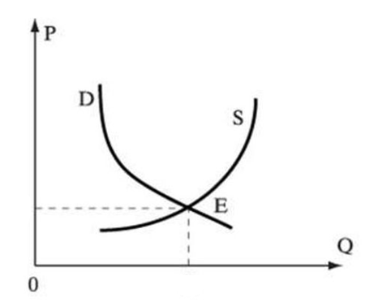

> **Первичный текст.** Экономика инновационного развития в условиях глобализации — редакция ред. 2025 г..
> Источник: `dotu.ru:c9a90c8251d8df1f.doc` sha256 `1ba5942f8be1d32c…`; [страница на dotu.ru](https://dotu.ru/books/ekonomika-innovatsionnogo-razvitia-red-2025/).
> Автоматическая транскрипция DOC→Markdown; смысл и формулировки не правились.
> Контрольные суммы и статус проверки — в [NOTICE.md](../../NOTICE.md).
> Содержание передаёт позицию авторов; утверждения не верифицированы библиотекой.

---

# Литература

1.  Агапова И. **История экономической мысли.** Лекция 2. — «Библиотека Гумер»: <http://www.gumer.info/bibliotek_Buks/Econom/agap/02.php>.

2.  Алешкина Т. **Банки назвали проблемой нежелание россиян брать кредиты.** — Интернет-ресурс — Сайт РБК: <http://top.rbc.ru/finances/02/12/2014/547ded21cbb20fc2fd9077c4#xtor=AL->.

3.  Ананьин О., Хаиткулов Р., Шестаков Д. **Вашингтонский консенсус: пейзаж после битв**. — Мировая экономика и международные отношения (МЭМО). 2010, № 12. — С. 15-27.

4.  Аникин А.В. **Золото. Международный экономический аспект.** / Изд. 2, переработанное и дополненное. — М.: Международные отношения. 1988.

5.  **Антибабкин.** **Разбор доклада Путину «о невозможности производства в России»**. Интернет-ресурс: <http://maxpark.com/community/5625/content/2455020>.

6.  **Аральское море и причины его гибели.** — Без указания авторства. Интернет-ресурс: <http://lifeglobe.net/blogs/details?id=484>.

7.  **Аральское море.** — Без указания авторства. Интернет-ресурс: <http://enrin.grida.no/htmls/aralsoe/aralsea/russian/arsea/arsea.htm>.

8.  **Архитектура как форма социально-психологического воздействия.** — Без указания авторства. Интернет-ресурс: <http://www.psyinart.info/socialjnaya_psihologiya/arhitektura_kak_forma_socialjnopsihologicheskogo_vozdejstviya.htm>.

9.  Афанасьев Л.Л., Островский Н.Б., Цукерберг С.М. **Единая транспортная система и автомобильные перевозки.** — М.: Транспорт. 1984.

10. Бабкин К.А. **Почему тракторный завод останется в Канаде**. — Интернет-ресурс: <http://babkin-k.livejournal.com/182898.html>.

11. Байбаков Н.К. **Сорок лет в правительстве**. — М.: Республика. 1993.

12. **Барак Обама поддержал легализацию марихуаны в США.** — Интернет-ресурс: <http://www.ridus.ru/news/176889>.

13. Белкин В.Д., Ивантер В.В. **Плановая сбалансированность: установление, поддержание, эффективность.** — М.: Экономика. 1983.

14. **Беспёрые куры.** — Интернет-ресурс: <http://www.zooblog.ru/photo/birds/3964-besperye-kuricy.html>.

15. **Библия**. — Издание Московской Патриархии.

16. Быков П. **Долой иллюзии. Первые итоги кризиса.** — ж. «Эксперт». № 20 (658). 2009.

17. Варга Е.С.  **Вскрыть через 25 лет**. — Публикация в журнале «Полис», № 2, 1991 г. См. также: <http://library.rksmb.org/text/e4a96086501947c1955be017ff782b88.rtf>.

18. **Вашингтонский консенсус как «мыслеобразующий механизм нового этапа глобализации»**. — Без указания авторства. Интернет-ресурс «Литература для студентов»: <http://www.libsib.ru/sovremennie-problemi-globalizatsi/sovremennie-problemi-globalizatsi/vashingtonskiy-konsensus-kak-misleobrazuiuschiy-mechanizm-novogo-etapa-globalizatsii>.

19. **Введение в конституционное право.** — Без указания авторства. — М.: Концептуал. 2013.

20. Величко М.В. **Архитектурная парадигма модернизации и возрождения России — ландшафтно-усадебная урбанизация.** — Агропромышленный комплекс как основа модернизации страны. Материалы международной научной конференции 3-4 июня 2010 г. — СПб - Пушкин: Копи-Парк. 2010. — С. 24-28.

21. Величко М.В. Ефимов В.А. **Пути совершенствования управления инновационным развитием и модернизацией страны.** (Раздел в коллективной монографии). / Управление социально-экономическими системами в условиях модернизации (коллективная монография в 2-х частях под ред. А.Н. Плотникова). — Часть 2. — Саратов: издательство ЦПМ «Академия Бизнеса». 2010. — 384 с. / — С. 311-353.

22. Величко М.В. **Система образования как генератор «кризиса фрагментации обществознания».** Известия Санкт-Петербургского государственного аграрного университета. № 36, 2014. — СПб: СПбГАУ, 2014. — С. 285-289.

23. Величко М.В., Ефимов В.А. Зазнобин В.М. **Востребованность и развитие идей ноосферизма научно-педагогическим сообществом в наши дни как объективная необходимость.** — Человек, общество, природа (К 150-летию со дня рождения В. И. Вернадского : материалы международной научно-практической конференции / Мин. — во образования и науки РФ, С.-Петерб. гос. архитектур.-строит. ун-т, Каф. философии. — СПб: \[б. и.\], 2013. — 344 с.

24. Величко М.В., Ефимов В.А. **Использование уравнений равновесных цен в экономико-математическом моделировании функционирования налогово-дотационного механизма.** — Известия Международной академии аграрного образования. Вып. 14 (2012), том. 2. — С. 80-85.

25. Величко М.В., Ефимов В.А. **Организационно-технологический подход к макроэкономическим системам — ключ к успеху экономического и общекультурного развития общества.** — Альманах «Ключъ». Вып. 2. — СПб — Пушкин. 2010. — С. 70-83.

26. Величко М.В., Ефимов В.А., Зазнобин В.М. **Проблемы научно-методологического обеспечения общественного развития.** / Россия перед лицом глобализации: материалы международной научной конференции, 20-21 июня 2013 г., г. Пушкин. — СПб. 2013. — 152 с. — С. 3-9.

27. Величко М.В., Ефимов В.А., Солонько И.В. **Современная эпоха и система образования.** Современные проблемы высшей школы (к 200-летию Царскосельского лицея). / Материалы международной научной конференции 23-24 июня, г. Пушкин. Санкт-Петербург, Пушкин. 2011. — С. 3-6.

28. **Влияние интерьера на психику и здоровье.** — Без указания авторства. Интернет-ресурс: <http://architecturez.org/disint/vliyanie-interera-na-psixiku-i-zdorove>.

29. Волков В. **Экономическая теория относительности.** — Интернет-ресурс: <http://www.newsru.com/columnists/03jun2011/volkov_print.html>.

30. **Встреча Владимира Путина с ректором Санкт-Петербургского государственного университета Николаем Кропачевым.** — Информационно-аналитический журнал «Политическое образование». 18.01.2013 г. — Интернет-ресурс: [lawinrussia.ru/node/221407](http://lawinrussia.ru/node/221407).

31. Гатто Дж.Т. **Фабрика марионеток. Исповедь школьного учителя.** — Интернет-ресурс: <http://bodhi.ru/book/gatto-school.html>.

32. Гоголь Н.В. **Выбранные места из переписки с друзьями.**

33. Гоголь Н.В. **Мёртвые души.**

34. Гончаров И.А. **Обломов.**

35. **Городские дети имеют IQ ниже, чем деревенские.** — «Московский комсомолец», 18.02.2008 со ссылкой на Национальный инфоцентр по науке и инновациям. — Интернет-ресурс: <http://www.mk.ru/old/article/2008/02/18/54461-gorodskie-deti-imeyut-iq-nizhe-chem-derevenskie.html>

36. **Государственная система стандартизации.** — Без указания авторства, интернет-ресурс: <http://studopedia.ru/1_126629_gosudarstvennaya-sistema-standartizatsii.html>.

37. Гранберг А.Г. **Динамические модели народного хозяйства.** — М.: Экономика. 1985. — 240 с.

38. Гуляев В.И. **Загадки погибших цивилизаций.** — М.: Просвещение. 1992. — 160 с., 8 л. илл.

39. Гэлбрейт Дж. К. **Экономика невинного обмана: правда нашего времени**. — М.: Европа. 2009. — 88 с. (J.K. Galbraith. «The Economics of Innocent Fraud: Truth for Our Time». 2004).

40. Гэлбрейт Дж. К. **Экономические теории и цели общества**. — М.: Прогресс. 1976. (J.K. Galbraith. «Economics and the Public Purpose». 1973).

41. Деннинг Стив. **Провал Boeing: 7 уроков, которые следовало бы извлечь бизнесу**. — Forbes. 18.01.2013. Интернет-ресурс: <http://www.forbes.ru/sobytiya/kompanii/232224-proval-boeing-7-urokov-kotorye-sledovalo-izvlech-biznesu>.

42. **Деньги, обезьяны и … Интереснейший эксперимент.** — Интернет-ресурс: <http://www.darchik.ru/mobile_soft/1489-dengi-obezyany-i-prostituciya-interesnejshij-yeksperiment.html>.

43. **Деньги, обезьяны и … проституция.** — Интернет-ресурс: <http://a-sviryaev.livejournal.com/27037.html><u>.</u>

44. Димиев А. **Классная Америка — Шокирующие будни американской школы. Записки учителя.** — Казань: Парадигма. 2008.

45. Дорожин Я. **Влияние среды на психику.** — Бизнес-ключ. Деловой журнал. Интернет-ресурс: <http://www.bkworld.ru/archive/y2007/n05-2007/n05-2007_314.html>.

46. **Достаточно общая теория управления**. Постановочные материалы учебного курса факультета прикладной математики — процессов управления Санкт-Петербургского государственного университета (1997-2003). — Новосибирск, 2007. — 408 с.; а также интернет-ресурс: <http://dotu.ru/2004/06/23/20040623-dotu_red-2004/>.

47. Дубинин Н.П. **Вечное движение (О жизни и о себе).** — М.: Политиздат. 1989.

48. Ефимов В.А., Солонько И.В. **Ландшафтно-усадебная урбанизация и перспективы устойчивого развития России в XXI веке.** Альманах «Ключ». Вып. 1. — СПб - Пушкин. 2009. — С. 103-110.

49. Ефимов В.А. **Методология экономического обеспечения демографической политики устойчивого развития**. — СПб: Изд-во СЗАГС. 2007. — 184 с.

50. **Жадность «Боинга» сгубила. Хотели сэкономить — получилось как с российским «Суперджетом».** — Московский комсомолец. 13.07.2013. — Интернет-ресурс: <http://www.mk.ru/economics/article/2013/07/13/883572-zhadnost-boinga-sgubila.html>.

51. Зайченко Ю.П. **Исследование операций.** — Киев: Вища школа. 1979.

52. **Зональные типы биомов России: антропогенные нарушения и естественные процессы восстановления экологического потенциала ландшафтов.** Под ред. доктора геогр. наук, профессора К.М. Петрова. Санкт-Петербургский государственный университет. — СПб. 2003.

53. Иванникова Н. **Сигарета убивает с первой затяжки.** Интернет-ресурс: <http://www.utro.ru/articles/2011/01/17/949651.shtml>.

54. **«Инновационная Россия — 2020» /** Проект «Стратегии инновационного развития Российской Федерации на период до 2020 года». Интернет-ресурс: [<u>http://www.economy.gov.ru/minec/activity/sections/innovations/doc20101231_016#</u>](http://www.economy.gov.ru/minec/activity/sections/innovations/doc20101231_016).

55. **Как воевали с “оборотнями” в СССР.** — Интернет-ресурс: <http://news.bbc.co.uk/hi/russian/russia/newsid_3022000/3022210.stm>.

56. Каменская Е.В. **Демографическая политика в Псковской области: факты и пути решения** \[Текст\] / Е.В. Каменская, И.А. Степанова // Молодой ученый. — 2014. — № 4. — С. 530-537. — Интернет-ресурс: <http://www.moluch.ru/archive/63/9392/>.

57. Карганов С.А. **Об ошибочности использования в народнохозяйственном планировании экономико-математической модели В.Леонтьева и межотраслевых балансов «Затраты — Выпуск».** — Интернет-ресурс: <http://www.aup.ru/articles/economics/12.htm>.

58. Киссинджер Г. **О Китае.** — М.: Астрель. 2013.

59. Клачихина Ю. **Стросс-Кан призвал к «капитальному ремонту» мировой экономики**. — «РБК daily». 6 апреля 2011. Интернет-ресурс: <http://www.rbcdaily.ru/2011/04/06/world/562949980006062>.

60. **Кодекс Хаммурапи.** — Интернет-ресурс: <http://www.hist.msu.ru/ER/Etext/hammurap.htm> со ссылками на следующие источники: Волков И.М. Законы вавилонского царя Хаммурапи. М., 1914; Дьяконов И.М. Законы Вавилонии, Ассирии и Хеттского царства // Вестник древней истории. 3. 1952. С. 225-303; История древнего Востока. 1/1. — М., 1983; Klengel H. Hammurapi von Babylon und seine Zeit. B., 1978; Driver G., Miles J.C. The Babylonian laws. 1 — 2. Oxford, 1955-1956.

61. **Концепция общественной безопасности в Российской Федерации.** — Утверждена Президентом РФ 20 ноября 2013 г. Интернет-ресурс: [www.kremlin.ru/acts/news/19653](http://www.kremlin.ru/acts/news/19653).

62. **Кооперативное движение в СССР в период административно-командной системы управления.** — Без указания авторов. — Интернет-ресурс: <http://www.bestreferat.ru/referat-211040.html>.

63. **Коран.** Перевод и комментарии И.Ю. Крачковского. Изд. 2‑е. М. Главная редакция восточной литературы издательства «Наука». 1986.

64. **Краткий курс…** — Без указания авторства. Журнал «Бизнес и учёт в России». № 5-6, 1994; а также отдельное издание: — М.: НОУ «Академия управления». 2010. — 458 с.

65. **Кризис автомобильной промышленности.** — Сайт Aftershock: <http://aftershock.su/?q=node/281731>.

66. **Кто защитит права некурящих.** — Интернет-ресурс: <http://www.vitasite.ru/articles/depende-article/no-tabak/>

67. Кузина С. **Мир за окном спальни. У людей начинают меняться гены.** — Интернет-ресурс: <http://blog.kp.ru/community/3052273/post142164988/>.

68. Кузнецова Н.В. **Снижение розничных цен и материальный уровень жизни населения СССР в 1947 — 1952 годах**. Вестник ВолГУ. Серия 4, 2008. № 1 (13). — С. 32-42. (см. также: <http://cyberleninka.ru/article/n/snizhenie-roznichnyh-tsen-i-materialnyy-uroven-zhizni-naseleniya-sssr-v-1947-1952-godah>).

69. **Курящая беременная женщина может сделать своего будущего сына бесплодным.** — Интернет-ресурс: <http://health.sumy.ua/16592-kurjashhaja-beremennaja-zhenshhina-mozhet-sdelat.html>.

70. **Курящие женщины рожают преступников.** — Интернет-ресурс: <http://asfera.info/news/one-46458.html>, со ссылкой на [The Daily Telgraph](http://www.utro.ru/cgi-bin/go?http://www.telegraph.co.uk/health/8134439/Smoking-in-pregnancy-breeds-criminals.html).

71. Лебедев А.А. **Петровский линейный корабль «Ингерманланд» в судьбах Российского флота**. — Интернет-ресурс: <http://www.reenactor.ru/ARH/PDF/Lebedev_07.pdf>.

72. Ленин В.И. **Государство и революция.**

73. Леонтьев В.В. **Экономическое эссе.** — М.: Политиздат. 1990.

74. Лесгафт П.Ф. **Семейное воспитание и его значение.**

75. Лесков С. **Орангутаны — культурное племя.** — Газета «Известия» от 8 января 2003 г. (<http://izvestia.ru/news/271439>).

76. Лиетар Б.А. **Душа денег.** — М.: Олимп: АСТ: Астрель, 2007. — 365 с. См. также электронный альманах «Арт&Факт», № 1, 2006: <http://artifact.org.ru/detalirovka-voprosov-globalnoy-teorii/lietar-b-dusha-deneg.html>.

77. **Лодочные прогулки у старинной усадьбы.** — Министерство спорта, туризма и молодёжной политики Калужской области. Интернет-ресурс: <http://visit-kaluga.ru/eto_interesno/lodochnye_progulki_u_starinnoy_usadby/>.

78. Лопатников Л. И. **Динамические модели межотраслевого баланса.** / Экономико-математический словарь: Словарь современной экономической науки. — 5-е изд., перераб. и доп. — М.: Дело, 2003. — 520 с. — Интернет-ресурс: [https://slovari.yandex.ru/~книги/Лопатников/Динамические модели межотраслевого баланса/](https://slovari.yandex.ru/~книги/Лопатников/Динамические%20модели%20межотраслевого%20баланса/).

79. Маслов О. **Долг США, слабый доллар и легитимность доллара перед Первой глобальной Великой депрессией.** — Еженедельное независимое аналитическое обозрение. 06.02.2008. Интернет-ресурс: <http://www.polit.nnov.ru/2008/02/08/dollarglobdolg/>.

80. **Математическая экономика на персональном компьютере**. / Редактор М. Кубонива. Пер. с японского. — М.: Финансы и статистика. 1991. (Японское изд. 1984 г.).

81. **Мегаполисы «съедают» 5 лет жизни.** — Интернет ресурс «Российская фармацевтика»: <http://pharmapractice.ru/16826>.

82. **Медведев сообщил о провале модернизации экономики России**: <http://lenta.ru/news/2009/08/31/innovation/>.

83. Менделеев Д.И. **С думою о благе российском. Избранные экономические произведения**. — Новосибирск: Наука. 1991.

84. Менделеев Д.И. **Нефтяная промышленность в Северо-Американском штате Пенсильвании и на Кавказе**.

85. **Мера в урбанистике.** — Материал с сайта «Малоэтажная планета»: <http://www.lowriseplanet.net/>.

86. **Методы обоснования программ устойчивого развития сельских территорий**: моногр. / Под ред. В.И. Фролова. СПб гос. архитект.-строит. ун-т.; — СПб. 2011. — 464 с. А также — интернет-ресурс: <http://ruidea.org/index.php?option=com_docman&task=doc_details&gid=163&Itemid=218>).

87. Момджян К.Х. **Кризис** **фрагментации современной социальной философии.** — Вестник Московского университета. Серия 7. Философия. 2012. № 1. — С. 61-72.

88. Момджян К.Х. **О кризисе фрагментации в современной социальной философии.** 16 апреля 2013 г. — Интернет-ресурс — сайт Института философии РАН: <http://iph.ras.ru/uplfile/socep/momdgyan.pdf>.

89. Момджян К.Х. **О кризисе фрагментации в современной социальной философии и путях выхода из него.** (Тезисы выступления в Институте философии РАН). — Интернет-ресурс — сайт Института философии РАН: <http://iph.ras.ru/uplfile/socep/krisis.pdf>.

90. **Не заглядывай в карман начальства.** — Инженерная газета. № 45, 1992.

91. **Низкий IQ детей связан с городским смогом.** — Интернет-ресурс: <http://detkalin.ru/internet-news/nizkiy-iq-detey/>

92. Никитенко П.Г. **Ноосферная экономика как планетарная жизнедеятельностная хозяйственная сфера цивилизационного развития.** — «Экономические и социальные перемены: факты, тенденции, прогноз». № 3 (11) 2010. (Издание Института социально-экономического развития территорий РАН, Вологда).

93. **О стратегическом прогнозировании и планировании социально-экономического развития.** — Модельный закон Межпарламентской Ассамблеи государств — участников Содружества Независимых государств. Принят на сессии МПА СНГ 28 ноября 2014 г. Постановление МПА СНГ от 28.11.2014 № 41-10. — Официальный сайт МПА СНГ: <http://www.iacis.ru/upload/iblock/861/prilozhenie_k_postanovleniyu_10.pdf>.

94. **Об итогах Всероссийской переписи населения 2002 года.** — Интернет-ресурс: <http://www.gks.ru/PEREPIS/report.htm>.

95. Обама Б.Х. **Дерзость надежды. Мысли о возрождении американской мечты.** — СПБ: «Азбука-классика». 2008.

96. **Обезьяны-капуцины спешат на помощь.** — Интернет-ресурс: <http://dom-krasnodar.ru/119-obezyany-kapuciny-speshat-na-pomoshh.html>.

97. Опарин Г. **К.Э. Циолковский о втором начале термодинамики.** — ж. «Русская мысль», изд. «Общественная польза», г. Реутов, 1991.

98. **Павел Дуров развлекся, разбрасывая пятитысячные купюры из окна офиса “В контакте” на Невском**. — «Комсомольская правда» 28 мая 2012 г.: <http://www.kp.ru/online/news/1161860>.

99. Пархоменко В.,  Пелевин Ю.  **Особенности акустической защиты атомных подводных лодок ВМС США**. / Зарубежное военное обозрение. № 7. 1988 г. (Либо интернет-ресурс: journal-club.ru/?q=node/13752.

100. **Паспорт специальности 09.00.01 Социальная философия.** — Документ ВАК РФ.

101. Пастернак П.П. **Оценки на ресурсы в экономике.** — СПб: Проспект Науки. 2009. — 150 с.

102. **Пермакультура Зеппа Хольцера.** Часть 1. / Перевод с нем. Э.А. Шек. — Орёл: С.В. Зенина. 2009. — 160 с.: илл.

103. Покатович Г. **Перебои в работе серверов Yahoo связаны с отключениями электричества в Калифорнии.** — Интернет-ресурс: <http://compulenta.computerra.ru/archive/net/121244/>.

104. **Предварительные итоги Всероссийской переписи населения 2010 года.** — Интернет-ресурс — официальный сайт переписи населения РФ: <http://www.perepis-2010.ru/results_of_the_census/results-inform.php>.

105. **Проститутки завели Европу. Проститутки и наркоторговля внесены в подсчет ВВП Евросоюза**. — Газета.ru, 04.05.2014. — Интернет-ресурс: <http://www.gazeta.ru/business/2014/04/18/5997165.shtml>.

106. Путин В.В. **Выступление на пленарном заседании «Форума действий» «Общероссийского народного фронта» 18.11.2014.** — Официальный сайт Президента РФ: <http://kremlin.ru/transcripts/47036>.

107. Путин В.В. [Из выступления на встрече с научно-технической общественностью 8 февраля 2000 г.](http://archive.kremlin.ru/appears/2000/02/08/0000_type63376type63378_28418.shtml) \[Электронный ресурс\]. — Режим доступа: <http://archive.kremlin.ru/priorities/31004.shtml>.

108. **Разрешение проблем национальных взаимоотношений в русле Концепции общественной безопасности.** — Без указания авторства. — М.: Концептуал. 2012.

109. Рузвельт Ф.Д. **Беседы у камина**. — М.: ИТРК. 2003. 408 с.

110. Рэнд Айн. **Атлант расправил плечи.** — М.: Альпина Паблишерс. 2010.

111. Рэнд Айн. **Концепция эгоизма.** — СПб: Макет. 1995.

112. **Саквояж.** Журнал для пассажиров Российских железных дорог. № 2/2014. — С. 22.

113. **Самый большой автомобильный двигатель за всю историю.** — Интернет-ресурс: <http://www.delfi.lv/avto/na-kolesah/ekonomiya-net-ne-slyshal-10-samyh-bolshih-motorov-v-mire.d?id=43440215&page=9>; <http://veddro.com/2014/12/turinskoe-chudovishhe-prosnulos-voskreshenie-fiat-s76-record/>

114. **Сергей Глазьев. Лесть — это древний способ «разводки лохов».** — Интернет-ресурс: <http://politikus.ru/articles/47998-sergey-glazev-lest-eto-drevniy-sposob-razvodki-lohov.html>.

115. Сидоров В.М. **Пятая лекция о марксизме. Социализм. Преображение мира.** — Интернет-ресурс: <http://valentin-aleksy.livejournal.com/7252.html?thread=528212>.

116. Смит А. **Исследование о природе и причинах богатства народов** (англ. название: An Inquiry into the Nature and Causes of the Wealth of Nations).

117. Смолин О.Н.  **Вступительное и заключительное слово на общественных слушаниях «Закон о добровольности единого государственного экзамена. Какой человек нужен России».** — Интернет-ресурс: [www.smolin.ru/duma/audition/2008-03-05.htm](http://www.smolin.ru/duma/audition/2008-03-05.htm).

118. **Совещание Госсовета по развитию отечественного бизнеса и повышению его конкурентоспособности 18.09.2014. —** Путин потребовал совершить рывок в экономике за полтора года. — «Интерфакс»: <http://www.interfax.ru/business/397436>.

119. Солонько И. В. **Феномен концептуальной власти: социально-философский анализ: монография.** — 3-е изд., перераб. и доп. **—** М., 2011.

120. Сталин И.В. **Марксизм и вопросы языкознания.** Сталин И.В. Сочинения. — Т. 16. — М.: Издательство «Писатель». 1997. С. 104 — 138.

121. Сталин И.В. **Экономические проблемы социализма в СССР**. — М.: отд. изд., Государственное издательство политической литературы. 1952.

122. Сталин И.В.  **Беседа с председателем газетного объединения Роем Говардом 1 марта 1936 г.** Сочинения. — Т. 14. — Москва: Писатель. 1997.

123. **Сталинская экологическая революция.** — Пролетарская газета. Интернет-версия: <http://pgazeta.narod.ru/4_1999_7_.html>.

124. **Стандартизация**. — Без указания авторства. Интернет-ресурс: <http://www.znaytovar.ru/s/Standartizaciya.html>.

125. Стефанек Т. Неакустические методы обнаружения подводных лодок. / В мире науки. № 5, 1988.  Либо см.: <http://www.wrk.ru/forums/attachment.php?item-69376>.

126. Талеб Н.Н. **Чёрный лебедь. Под знаком непредсказуемости.** / Пер. в англ. В. Сонькина, А. Бердичевского, М. Костиновой, О. Попова под ред. М. Тюнькиной. — М.: КоЛибри. 2009. — 528 с.

127. Тимонин Ю.А. **Основы экономической кибернетики**. — Учебное пособие. Житомир: ИПСТ. 2001. В электронном виде: <http://www.bestreferat.ru/referat-186792.html>. Составлено по материалам книги: Экономическая кибернетика: Учебное пособие; Донецкий гос. ун-т. — Донецк. ДонГУ, 1999. — 397 с.

128. Трофимова Г.К. **Краткий курс экономической теории.** Учебное пособие. — М.: ФАИР-ПРЕСС. 2003. — 224 с.

129. Трубицын А.К. **О Сталине и предпринимателях**. — Интернет-ресурс: <http://anticomprador.ru/publ/a_k_trubicyn_o_staline_i_predprinimateljakh/29-1-0-1065>.

130. **У высотного страха глаза велики.** — Деловой Петербург. 13.10.2008. — Интернет-ресурс: <http://ppt.ru/news/57411>.

131. **Уровень IQ жителей Запада снизился за 100 лет.** — Интернет-ресурс: <http://russian.rt.com/article/9801>.

132. **Ученые: из-за неработающего естественного отбора человечество начало глупеть.** — Интернет-ресурс: <http://russian.rt.com/article/4738>.

133. Форд Г. **Моя жизнь, мои достижения.** — Л.: Время, 1924. Перевод под редакцией инженера-технолога В.А. Зоргенфрея. — Интернет-ресурс: <http://n-t.ru/ri/fr/mz.htm>.

134. Форд Г. **Сегодня и завтра (Today and Tomorrow, 1926).** — М.: Финансы и статистика. 1992. См. также интернет-ресурс: about-ford.at.ua/index/0-33.

135. **Форд и Сталин: о том, как жить по-человечески. Альтернативные принципы глобализации.** — Без указания авторства. — М.: Академия управления. 2007. См. также интернет-ресурс: <http://dotu.ru/2003/03/22/20030322-ford_i_stalin/>.

136. **Фурсенко: высшая математика убивает креативность.** — Интернет-ресурс: <http://www.rosbalt.ru/main/2009/02/11/617365.html>.

137. Хазин М.Л. **Конец Бреттон-Вудского мира.** — Интернет-ресурс: <http://www.km.ru/economics/2015/01/25/mezhdunarodnyi-valyutnyi-fond-mvf/753930-konets-bretton-vudskogo-mira>.

138. Хазин М.Л. **Современная монетаристская школа является тоталитарной сектой**. — Интернет-ресурс: <http://fintimes.km.ru/valyutnyi-rynok/monetarnaya-politika/15945>.

139. Хелвиг Тина. **Биосфера-2. Миф или реальность?** — Интернет-ресурс: Часть 1 — <http://shkolazhizni.ru/archive/0/n-41296/>; Часть 2 — <http://shkolazhizni.ru/archive/0/n-41338/>.

140. Хольцер Зепп. **Аграрий-революционер.** / Зепп Хольцер; пер. с нем. Э.А. Шек. — Орёл: С.В. Зенина. 2008. — 176 с., илл.

141. Хомяков А.С. **Мнение русских об иностранцах. — О старом и новом. Статьи и очерки.** — М.: Современник. 1988.

142. **Хулиганов рожают только курящие.** — Интернет-ресурс: <http://yka.kz/blog/khuliganov_rozhajut_tolko_kurjashhie/2009-11-04-1332>

143. Циолковский К.Э. **Второе начало термодинамики**. — Калуга, 1914.

144. Циолковский К.Э. **Продолжительность лучеиспускания Солнца**. — «Научное обозрение», № 7, 1897, с. 46 — 61.

145. **Через год 1 % населения Земли будет богаче оставшихся 99 %.** — Сайт NEWSru.com 19.01.2015 г.: <http://www.newsru.com/finance/19jan2015/oxfamreport.html>.

146. **Чиновников поймали на плагиате.** Комсомольская правда. 19.01.2011: <http://www.kp.ru/daily/25622/789764/>.

147. **Швейцарские учёные вычислили, кто тайно правит миром.** — Интернет-ресурс: <http://www.bb.lv/bb/all/6098/>

148. Шихирев П.П. **Жить без алкоголя.** — М. 1988.

149. **Эдвардс Деминг и философия управления качеством.** — Без указания авторства. Интернет-ресурс: <http://quality.eup.ru/MATERIALY/deming.htm>.

150. **“Экономическая обезьяна” похожа на “экономического человека”.** — Интернет-ресурс: <http://elementy.ru/news/25731><u>.</u>

151. **Электроснабжение на юго-западе США обещают полностью восстановить уже завтра.** — Интернет-ресурс: <http://elektroas.ru/elektrosnabzhenie-na-yugo-zapade-ssha-obeshhayut-polnostyu-vosstanovit-uzhe-zavtra>.

152. Энгельс Ф. **Анти-Дюринг.** — М.: Политиздат. 1983.

153. Эпперсон Р. **Невидимая рука (Введение во взгляд на Историю как на Заговор)**. — М.: Образование-Культура. 1996.

154. Эрхард Л. **Благосостояние для всех.** Пер. с нем. — М.: Начала-пресс. 1991.

155. **3 цилиндра, 1,5 литра, 40 килограмм и 400 л.с.! Новый супер-мотор от Nissan**. — Интернет-ресурс: <http://www.mihelson.tv/post/3_tsilindra_15_litra_40_kilogramm_i_400_ls_Novyy_super_motor_ot_Nissan_VIDEO>.

156. **British Petroleum: США завысили в два раза объёмы разлива нефти в Мексиканском заливе.** — Интернет-ресурс: <http://news.finance.ua/ru/~/1/0/all/2010/12/05/219371>.

157. Dubner S.J., Levitt S.D. **Monkey Business.** — New-York Times Magazine. June 5, 2005. <http://www.nytimes.com/2005/06/05/magazine/05FREAK.html?pagewanted=all&_r=3&>; либо: <http://freakonomics.com/2005/06/05/freakonomics-in-the-times-magazine-monkey-business/> .

158. **Edsel — незаживающая рана Ford Motor**. — Интернет-ресурс: <http://www.cars.ru/articles/note/37728/>.

159. Maxwell J.C. **Philosophical Transaction of the Royal Society of London**. London, Vol. 157, 1867, pp. 49 — 88.

160. Vitali S., Glattfelder J.B., Batiston S. **The network of global corporate control.** — Интернет-ресурс: <http://arxiv.org/PS_cache/arxiv/pdf/1107/1107.5728v2.pdf>.

[^1]: Настоящий © Copyright при публикации книги не удалять, поскольку это противоречит его смыслу. При необходимости после него следует поместить ещё один © Copyright издателя. ЭТУ СНОСКУ ПРИ ПУБЛИКАЦИИ УДАЛИТЬ.

[^2]: В настоящей работе принят следующий принцип нумерации рисунков, таблиц, математических формул. Символы слева от дефиса (в данном случае буква «В» — Введение) обозначают раздел, в котором находится рисунок, таблица или формула. Цифры справа от дефиса обозначают порядковый номер соответствующего объекта в разделе.

[^3]: Термин «криптоколония» введён в лексикон политологии Дмитрием Галковским. Термин указывает на фактическую колонизацию государства при наличии у него всех формальных атрибутов суверенитета, осуществляемую в обход контроля сознания большинства представителей этого общества и, прежде всего, — решающего большинства его правящей «элиты». В этом случае политика государства-криптоколонии, включая экономическую, при наличии всех формальных атрибутов суверенитета, будет подчинена интересам иностранных государств или интересам собственников и директоратов транснациональных корпораций точно так же, как и в том случае, если бы страна юридически была колонией, а её государственность была административно подчинена тем или иным внешнеполитическим или транснациональным силам.

[^4]: Выдержки из сочинений, в которых высказано и обосновывается это мнение:

    «Мне кажется, что экономика является субъектом, а не объектом управления над народом. Ведь большая часть экономики — это нефть, газ и прочие полезные ископаемые, от которых зависит рынок страны, на котором находится потребитель, т.е. народ».

    «Экономика является субъектом управления. Всё государство и вся предпринимательская деятельность держится на экономике. Экономика является составной частью управления. Не мы правим экономикой, а экономика правит нами».

    «Мне кажется, что экономика как объект — это вымысел людей. Максимум, человек может немного направить экономику в нужное ему русло. Но на самом деле экономика — это субъект управления, который правит НАМИ, со своими законами, со своими правилами».

    «Экономика является субъектом управления. Вся предпринимательская деятельность и деятельность государства держится на экономике».

    «Экономика является субъектом управления. Вся предпринимательская деятельность и деятельность государства держится на экономике. Без экономики у нас многого бы не было. Не мы правим экономикой, а экономика правит нами».

    «Экономика тоже управляет людьми, поэтому я не совсем согласна, что экономика является объектом. У нас есть природные ископаемые. И благодаря им наша экономика процветает. От экономики зависит рост цен на продукты, и это также управляет людьми».

    «Экономика — субъект управления. Экономика диктует рост цен, а значит, экономика правит обществом, а не наоборот. От экономики зависит материальное положение страны в целом».

    Т.е. авторы этих сочинений психологически, мировоззренчески состоялись как невольники и заложники неподвластной им экономики, управляемой другими. Кроме того, как видно по текстам, некоторые авторы списывали у других, т.е. не думали сами. И в перспективе все они, а также и те, кто уклонился от освещения этой темы, — выпускники факультета государственного и муниципального управления, т.е. — будущие госслужащие, многие из которых будут делать административную карьеру на основе миропонимания, сформированного учебными программами, навязанными системе высшего образования Министерством образования и науки.

[^5]: Полная функция управления — термин достаточно общей теории управления (ДОТУ): см. далее раздел 4 и более обстоятельно — постановочные материалы учебного курса ДОТУ \[46\]. Полная функция управления включает в себя следующие этапы её реализации в управленческой практике: 1) выявление проблем, 2) целеполагание в отношении их разрешения, 3) выработку концепции достижения намеченных целей, 4) внедрение концепции в жизнь, 5) текущее правление в соответствии с принятой концепцией, 6) совершенствование концепции по мере необходимости, 7) высвобождение ресурсов из завершённых процессов управления по достижении целей либо после краха соответствующего процесса управления.

[^6]: Термин «финансово-экономический суверенитет» проистекает из того обстоятельства, что по отношению к экономике общества (производству, распределению и потреблению природных благ и продукции) кредитно-финансовая система государства является инструментом управления (об этом далее в гл. 7). Т.е. хозяйственная деятельность подчинена «финансовому климату», формируемому параметрами настройки кредитно-финансовой системы государства. Пока в обществе существуют деньги, многое в его жизни (хотя и не всё) программируется тем, кому, за что, в каком объёме и как платят деньги, и у кого, в каком объёме, как и для чего их изымают.

[^7]: Контрольных параметров социально-экономической системы РФ.

[^8]: В это время главой Минэкономразвития была Э.С. Набиуллина, впоследствии помощник президента РФ и ныне (2025 г.) глава центробанка РФ.

[^9]: Это полезно при условии, что базовое образование в Отечестве — жизненно состоятельно, что подтверждается не знающим исключений принципом «практика — критерий истины». В этом случае получение дополнительного образования за рубежом необходимо для того, чтобы понимать менталитет партнёров, противников и конкурентов. С другой стороны одно из направлений продвижения собственной глобальной политики — обучение иностранцев у себя по своим собственным тематическим учебным планам.

[^10]: Кто из прошлых и действующих чиновников разного уровня «повысил квалификацию» за рубежом на специально созданных для этого зарубежными государствами курсах? — желающие могут поискать информацию по этому вопросу сами: получится интересный список. В частности в него входят бывший министр экономического развития А.В. Улюкаев и Э.С. Набиуллина, успевшая сменить множество постов на федеральном уровне.

    Какая стране от этого «повышения квалификации» польза? — никакой, поскольку за рубежами нет социолого-экономических теорий, которые позволяют разрешить и профилактировать проблемы нашей страны. Зато есть угроза в виде вербовки «повышающих квалификацию» спецслужбами государств-«просветителей»… И при этом только ЦРУ и другие спецслужбы точно знают, кто именно был завербован в период учёбы за рубежом. Но если кто-то из обучающихся просто некритично восприняли всю ту либерально-рыночную чушь и заведомую ложь, что им поднесли на лекциях и в учебниках под видом передового научного знания, то и такие по факту завербованы в том смысле, что *наилучшая вербовка — когда завербованный даже не подозревает о том, что его успешно завербовали*.

    Поэтому значение имеет то, что пока кадры для высших уровней государственной власти готовят спецслужбы зарубежных государств (пусть даже под вывеской престижных университетов и программ дополнительного образования для граждан других стран), у России нет возможностей развития.

[^11]: Именно такую политику и проводят ТНК и государства Запада в отношении Украины после государственного переворота в феврале 2014 г., целью осуществления которого было — обеспечить доступ ТНК к сланцевому газу и нефти, к чернозёмам, редкоземельным металлам и т.п., а НАТО — к базированию военно-морских сил и авиации на территории Украины, включая Крым, и удаление из Крыма ВС России.

    Номинально суверенитет сохраняется, но госаппарат и в особенности спецслужбы наводнены консультантами-иностранцами, финансово-экономический суверенитет утрачен по причине искусственно организованного краха реального сектора и назревшего банкротства государственности вследствие разрушения внутреннего денежного обращения и отрицательного сальдо внешней торговли.

    В 1990‑е годы в России в кремлёвских кабинетах тоже были зарубежные «консультанты» — в какой роли выступали и кадровые сотрудники ЦРУ. См., например: «Шохин рассказал, как агенты ЦРУ участвовали в приватизации в 90-х» (<https://ria.ru/20211210/shokhin-1763166731.html?ysclid=m49jxy1ugv323423831>); Манолис Чахкиев, «Поименный список американских советников 90-х или с кем единиться?» (Публикация в авторском блоке газеты «Завтра» от 05.11.2015 г.: <https://zavtra.ru/blogs/poimennyij-spisok-amerikanskih-sovetnikov-90-h-ili-s-kem-edinitsya?ysclid=m49kyr81nw115464702>); «Действия Гарвардского института были постыдными». Дипломат США о шпионах и реформах 90-х в России» (<https://rtvi.com/stories/bolshe-vsego-raspada-sssr-ne-khoteli-amerikanskie-voennye-amerikanskiy-diplomat-rasskazal-o-posleds/?ysclid=m49l8ogo6r758316451>).

    При этом необходимо отметить, что для реформаторов 1990‑х «нашим всем» был нобелевский лауреат по экономике (1976 г.) Милтон Фридман (1912 — 2006). Если бы для них «нашим всем» был другой нобелевский лауреат (1973 г.) В.В. Леонтьев (1905 — 1999), то в полном соответствии с закономерностью, представленной на рис. В‑1, проводимые ими реформы носили бы иной характер в силу иного научно-методологического обеспечения их проведения, и их результаты были бы иными — 1990‑е гг. могли бы не получить характеристику «лихие», но могли бы стать годами свершения «экономического чуда».

    Однако, как сообщает «Википедия», «в начале 1990-х годов Леонтьев приезжал в Российскую Федерацию с предложением помощи в реформировании российской экономики. Вернувшись в Америку, он сказал: *«Я туда больше не поеду. Они ничего не слушают».* До этого В.В. Леонтьев консультировал проведение успешных (по результатам) реформ экономики Южной Кореи и Гонконга, в результате которых эти государства из нищих превратились в экономически успешные.

[^12]: Соломонова И. «Япония отменила гуманитарные науки. Почему это важно?» // \[Электронный ресурс\]. Режим доступа: <https://republic.ru/posts/56806>. Дата обращения: 30.01.2018.

[^13]: См. аналитическую записку ВП СССР «Япония и Русь: «прожектёрство»? — либо «предиктор-корректор» в действии?» из серии «О текущем моменте» № 6 (54), 2006 г.

[^14]: Какое-то слово в цитируемом источнике пропущено, возможно должно быть «доля ВВП России в мировом рейтинге».

[^15]: «ВВП по паритету покупательной способности (ППС) на душу населения — это рыночная стоимость всех конечных товаров и услуг (с учетом паритета покупательной способности), произведенных в стране за определенный год в среднем одним человеком (на душу населения). ВВП по ППС на душу населения рассчитывается как в текущих ценах, так и в постоянных — также как номинальный и реальный ВВП» (<https://www.rbc.ru/quote/news/article/6273353d9a7947534ca8d991>).

    «Паритет покупа́тельной способности (ППС, англ. purchasing power parity) — соотношение двух или нескольких денежных единиц, валют разных стран, устанавливаемое по их покупательной способности применительно к определённому набору товаров и услуг.

    Концепция паритета покупательной способности исходит из идеи, что в идеале рыночные курсы валют должны стремиться к неким равновесным значениям, при которых на одну и ту же сумму денег, пересчитанную по текущим рыночным курсам в национальные валюты, в разных странах мира можно приобрести одно и то же количество одинаковых товаров и услуг при отсутствии транспортных издержек и ограничений по перевозке.» («Википедия»: <https://ru.wikipedia.org/wiki/Паритет_покупательной_способности>).

[^16]: «РосБизнесКонсалтиннг», публикация от 22.10.2024: «МВФ признал Россию четвертой экономикой мира»: <https://www.rbc.ru/economics/22/10/2024/6717ac329a79478792f175ec?ysclid=m2t4wa1wfe680983934>.

[^17]: Это, в свою очередь, обусловлено с одной стороны — объёмом производства и импорта энергии в государстве, и с другой стороны — наличием соответствующих потребителей энергии в производственных отраслях, складском хозяйстве и на транспорте.

[^18]: В состав конечной продукции, производимой на рассматриваемом производственном цикле, в балансовых моделях продуктообмена входят средства производства, которые предполагается использовать на последующих производственных циклах.

[^19]: К конечной продукции, потребляемой исключительно государством, в СССР относились вооружения и соответствующие инфраструктурные объекты, но отчёты об этом не были публичными.

[^20]: И в общем-то до середины 1970‑х гг., когда искусственно созданный «застой» стал проявляться в жизни общества в реальных фактах, рост экономики СССР выражался в росте спектра потребления подавляющего большинства населения.

    Здесь и далее «спектр» (производства, потребления) — номенклатура и объёмы по каждой позиции номенклатуры. Т.е. рост спектра потребления включает в себя как расширение номенклатуры, так и рост объёмов по каждой позиции номенклатуры.

[^21]: «Россия не закрывает более половины своей потребности в критически важных автокомпонентах, о чем пишет No Limits со ссылкой на заявление главы Минпромторга Антона Алиханова.

    «В целом могу сказать, что из 740 позиций критической номенклатуры, которая была сформирована в 2022 году, около 330 закрыты российскими поставщиками», — отметил он на выставке Kazan Truck Expo в Казани» («Прошло 3 года, но Россия не смогла закрыть и половины потребности в критически важных автокомпонентах»: <https://www.yaplakal.com/forum11/topic2899823.html>).

[^22]: «Российские перевозчики приостановили полеты на 34 из 66 самолетов Airbus A320neo и А321neo из-за проблем с двигателями производства США и Франции, пишет «Ъ». Источники газеты допускают вывод самолетов из эксплуатации к 2026-му» («Коммерсантъ» узнал о приостановке полетов половины Airbus neo в России: <https://www.rbc.ru/business/21/11/2024/673eabf99a79472d40025941?ysclid=m3sykmxvqw30516380>).

    Для сопоставления. В СССР в течение 5 — 10 лет неоднократно создавались эпохальные самолёты мирового уровня (Ту‑95, Ту‑114, Ил‑62, Ан‑22) и вертолёты (Ми‑6, Ми‑10, Ми‑8, В‑12). В постсоветские времена за 20 лет не смогли довести до ума Ил -112 (заурядный транспортник грузоподъёмностью 5 т) и двигатель для него, после чего проект был закрыт. И с 2022 г. (после начала СВО и введения санкций) осуществляется попытка возобновить производство Ту-214, который был разработан ещё в СССР, совершил первый полёт в 1993 г., но не был запущен в серию правительством РФ, отдавшим предпочтение Боингам и Эирбасам. Так же бюрократы не пустили в серийное производство полностью отечественный Ту-334, отдав предпочтение *«Суперджету-100» (SSJ‑100), который создавался в расчёте на международную кооперацию при его производстве и был ориентирован на экспорт,* но не смог состояться как серийный самолёт из-за введения странами Запада санкций в отношении России, разрушивших международную кооперацию при его производстве и обслуживании в ходе эксплуатации.

[^23]: «После ухода международных поставщиков программного обеспечения (ПО) в российской экономике образовался провал «импортозамещенных» типов индустриального софта. В отрасли насчитали 837 «белых пятен» в разных отраслях, пишет Cnews со ссылкой на руководителя Центра компетенций в сфере ИТ (ЦКИТ) Илью Массуха. Для 412 потребностей экономики российские аналоги полностью отсутствуют, а в 425 случаях отечественные решения по софту нуждаются в существенной доработке, рассказал Массух во время кросс-отраслевого демо-дня индустриальных центров компетенций (ИЦК).

    Больше всего «белых пятен» (172) в агропромышленном комплексе — причем для 159 потребностей российских решений не существует — и в автомобилестроении (101 — при 56 необеспеченных российскими аналогами). В ИЦК «Электроника и микроэлектроника» зафиксировано 47 незакрытых потребностей, в 35 из них российских решений нет, а 12 требуют доработки. В разделе «Общее машиностроение» — 62 «белых пятна», для 14 из которых необходимо разрабатывать ПО с нуля» («В России не смогли заменить почти 1000 видов иностранного ПО»: <https://www.yaplakal.com/forum2/topic2883279.html>).

[^24]: Тем не менее В.В. Путин, выступая на пленарном заседании форума «Инвестиционный форум «Россия зовёт!», огласил следующее:

    «Развивается технологический, производственный, логистический потенциал России. Укрепляются связи с перспективными партнёрами.

    В прошлом году валовой внутренний продукт России вырос на 3,6 процента, это хорошо известно, а за январь — октябрь текущего года он увеличился на 4,1 процента. Причём главным образом рост сосредоточен в обрабатывающих отраслях производства, в секторах с высокой добавленной стоимостью. Так, за 10 месяцев наша обрабатывающая промышленность прибавила более восьми процентов, а точнее, 8,1 процента. В том числе опережающие темпы демонстрирует автопром и машиностроение. В высокотехнологичный сектор с высокой добавленной стоимостью и квалифицированными рабочими местами увеличивается и приток специалистов. В сентябре количество занятых в IТ-сфере выросло на 8,1 процента по сравнению с предыдущим годом, в обрабатывающей промышленности — почти на четыре процента, на 3,9 процента.

    О структурных изменениях на рынке труда говорит снижение безработицы в регионах, где она была традиционно высока, а также увеличение занятости среди молодёжи до 25 лет. Но мы знаем, что молодёжная безработица — это проблема в очень многих странах мира. У нас тоже такая проблема существует, или, точнее сказать уже, существовала. Здесь уровень безработицы ниже девяти процентов, хотя в определённое время и даже совсем недавно он зашкаливал за 20 — 25 процентов в некоторых регионах страны. В целом в России рекордно низкий уровень безработицы — всего 2,3 процента. На фоне большинства ведущих экономик мира и развивающихся стран этот показатель является минимальным.

    Для примера: во многих государствах Европы он составляет семь процентов и выше, а у нас, повторю, чуть больше двух процентов. Для сравнения, чтобы не быть голословным: в Италии 7,6 процента, во Франции — 7,3, в Канаде поменьше — 5,4, в Греции — 11, в Бразилии — 8, в Швеции — 7,6 процента» (<http://www.kremlin.ru/events/president/news/75751>).

    Также надо понимать, что зарубежные «партнёры» (а это — реальные враги, конкуренты и временные союзники) оценивают состояние России не по таким словам, а по состоянию и перспективам реального сектора, а они плохие и не улучшаются на протяжении многих лет.

    *«Население России сокращается, экономика увядает, она не проживёт следующие 15 лет»* (это мнение Дж.Р. Байдена, бывшего 47‑го президента США, высказанное им ещё в бытность вице-президентом США в администрации Б.Х. Обамы: The Wall Street Journal. 25 июля 2009). — Эта оценка, во многом состоятельная, лежала в основе политики США в отношении России как объекта колонизации со времён задолго до её оглашения, с начала 1990‑х гг..

    По вступлении в должность президента США Д.Ф. Трамп в январе 2025 г. заявил следующее: *«Я не хочу навредить России. Я люблю русский народ, и у меня всегда были очень хорошие отношения с президентом Путиным — и это несмотря на то, что радикальные левые утверждают: «Россия, Россия, Россия».*

    > *Мы никогда не должны забывать, что Россия помогла нам выиграть Вторую мировую войну, потеряв при этом почти 60 000 000 жизней. Учитывая все это, я собираюсь оказать России, чья экономика терпит крах, и президенту Путину очень большую услугу. Договоритесь сейчас и прекратите эту нелепую войну! Она станет только хуже.*

    >

    > *Если мы не заключим «сделку», причем в ближайшее время, у меня не останется другого выбора, кроме как ввести высокие налоги, тарифы и санкции на все, что Россия продает Соединенным Штатам и другим странам-участницам. Давайте покончим с этой войной, которая никогда бы не началась, будь я президентом! Мы можем сделать это легким или трудным путем — и легкий путь всегда лучше. Пришло время «заключить сделку». Больше не должно быть потеряно ни одной жизни!!!»* — И это тоже высказано на основе оценок состояния реального сектора экономики России и его перспектив. Такого не могло быть сказано в отношении великой державы, чей реальный сектор задаёт мировой уровень по характеристикам многих видов продукции, в первую очередь — наукоёмкой, высокотехнологичной, как мирного так и военного назначения.

    Не надо обольщаться и в отношении российско-китайских взаимоотношений. Безусловно, Китай заинтересован в доступе к природным ресурсам России, к достижениям советского научно-технического наследия, пока ещё сохраняющегося в России, но он помнит, когда, кого и как Российская империя — СССР — Россия предали, нарушив ранее заключённые договора или злоупотребив слабостью партнёра, и не желает быть заложником политики де-факто несуверенного Кремля, поддерживая взаимоотношения, исходя из своих интересов и ви́дения перспектив, включая и *некоторые* глобальные.

[^25]: О трёхаспектности демографической политики государственная власть России даже не подозревает, если судить по долговременным результатам её политике и перспективам.

    Первый аспект — полововозрастная структура населения, т.е. состояние демографической пирамиды.

    Второй аспект — медико-биологические статистики, связанные с распределением населения по социальным группам, представляющим интерес для политики.

    Третий аспект — статистики, характеризующие распределение населения по социальным группам, представляющим интерес для политики, и культурную состоятельность населения в этих социальных группах.

[^26]: «Группы здоровья представляют собой шкалу, по которой определяется состояние организма, развития растущего человека. Каждый пункт этой шкалы также учитывает факторы риска, влияющие или влиявшие ранее на состояние здоровья. В соответствии с этой шкалой делается предварительный прогноз на будущее. Определённую группу здоровья выставляет обычно участковый педиатр, либо медицинский работник в дошкольном учреждении с учётом здоровья ребёнка, при наличии всех обследований» (<https://zdravbud.net/new/gruppy-zdorovya>. © [ZDRAVBUD.NET](https://zdravbud.net/)).

    Первая группа — здоровые дети, хотя реально это может быть не так, поскольку в первой группе здоровья допускаются единичные поражения зубов кариесом, что является объективным показателем уже состоявшегося хронического разнообразного нездоровья в слабой форме, коли нет прочей симптоматики: т.е. *детей с единичными проявлениями кариеса следовало бы отнести ко «второй А» группе здоровья, поскольку кариес и последствия его «профилактики» (посредством не всегда безвредных зубных паст) и лечения — недооценённая проблема здравоохранения*.

    Вторая группа условно здоровые дети, с некоторыми нарушениями и рисками развития тех или иных хронических патологий. Третья — пятая группы — дети, в той или иной мере нездоровые. Показатели ухудшения здоровья нарастают от второй к пятой, пятая — инвалиды и на грани инвалидности. Развёрнутые характеристики каждой из групп здоровья см. по ссылке, приведённой в начале этой сноски.

[^27]: «Известия», 21.02.2025, «Россия вошла в топ по числу самоубийств в Восточной Европе»: <https://iz.ru/1842576/2025-02-21/rossiia-voshla-v-top-po-chislu-samoubiistv-v-vostochnoi-evrope>).

[^28]: «Роспотребнадзор: Россия занимает 1-е место в Европе по самоубийствам подростков» — публикация от 11 марта 2013 г. (<https://www.newkaliningrad.ru/news/community/1866635-rospotrebnadzor-rossiya-zanimaet-1e-mesto-v-evrope-po-samoubiystvam-podrostkov.html>).

    **Данные о подростково-молодёжных самоубийств последующих лет найти весьма не просто, что в сочетании с данными, опубликованными «Известями» 21.02.2025 г., наводит на мысли о том, что статистика, как минимум не стала кардинально лучше, если не стала хуже.**

    Ниже фрагменты публикации о положении дел в Челябинской области от октября 2024 г.

    «Статистика по детским суицидам засекречена

    Власти не любят публично обсуждать тему подростковых суицидов, а статистика и вовсе оказалась засекреченной. Последний раз официальные данные по региону в начале 2023 года озвучивала бывший заместитель губернатора Ирина Гехт. В этот раз добиться конкретики журналисту 74.RU не удалось. Мы направляли запросы в полицию, Следственный комитет, Министерство социальных отношений, уполномоченному по правам ребенка, но все структуры лишь пеняли друг на друга: в Минсоце ответили, что эти данные концентрирует у себя уполномоченный по правам ребенка, омбудсмен — что «случаи суицида регистрируются следственными органами и полицией», в СК просто сказали, что данные предоставить не могут, а из полиции перенаправили в межведомственную комиссию по делам несовершеннолетних при правительстве области. Власти не любят публично обсуждать тему подростковых суицидов, а статистика и вовсе оказалась засекреченной. Последний раз официальные данные по региону в начале 2023 года [озвучивала](https://74.ru/text/incidents/2023/02/01/72021878/) бывший заместитель губернатора Ирина Гехт. В этот раз добиться конкретики журналисту 74.RU не удалось. Мы направляли запросы в полицию, Следственный комитет, Министерство социальных отношений, уполномоченному по правам ребенка, но все структуры лишь пеняли друг на друга: в Минсоце ответили, что эти данные концентрирует у себя уполномоченный по правам ребенка, омбудсмен — что «случаи суицида регистрируются следственными органами и полицией», в СК просто сказали, что данные предоставить не могут, а из полиции перенаправили в межведомственную комиссию по делам несовершеннолетних при правительстве области.

    Это неудивительно, ведь даже врачи-психиатры в последнее время не могут получить доступ к цифрам. В итоге считать нам пришлось самостоятельно. Мы не претендуем на точность, потому что знаем не обо всех случаях подростковых суицидов в регионе (например, в январе 2023 года официально их было четыре, а в новостную повестку попали лишь два), но все-таки это дает возможность хоть немного получить представление о происходящем.

    Итак, по данным Ирины Гехт, в 2020 году в регионе было зарегистрировано 26 суицидов подростков, в 2021 году — 22, в 2022-м — 17. В полиции уверяют, что число трагедий продолжает снижаться (без конкретики). Мы пересчитали наши публикации на эту тему и получилось, что в 2023 году произошло минимум 16 случаев самоубийств подростков, а за неполные 10 месяцев 2024-го — 12. Хочется надеяться, что это окончательные цифры и положительная динамика на самом деле есть. Но в любом случае работать еще есть над чем» «Мы не можем сделать МРТ души»: врачи бьют тревогу из-за подростковых суицидов. Разбираем их причины»: <https://74.ru/text/health/2024/10/25/74249786/>).

    «Статистика за 2023 год кабинета медико-психологической помощи СПБ ГКУЗ ЦВЛ имени С.С. Мнухина

    71 % обращений — семейная дезадаптация / хронические семейные конфликты, развод родителей, острые семейные конфликты, раздел ребенка.

    42 % обращений — школьная дезадаптация, неуспеваемость, конфликты со сверстниками, конфликты с педагогами.

    43 % детей с суицидоопасным поведением (высказывания и самоповреждающее поведение) были госпитализированы в стационар, отмечен рост суицидных попыток среди девочек в возрасте старше 15 лет (на 93,75 %), девочки с суицидными попытками обращаются чаще, по сравнению с мальчиками» (<http://ppms.kirov.spb.ru/images/doc/Родителям/Профилактика_суицидального_поведения_у_детей_и_подростков._Основные_группы_и_факторы_риска.pdf>). Это данные по Кировскому району Санкт-Петербурга общегородского центра детской психиатрии им. С.С. Мнухина.

[^29]: О глобальной политике, т.е. о политике, ориентированной на достижение целей в отношении глобальной цивилизации в целом, речи нет и быть не может, поскольку глобальный исторический процесс в либеральном понимании представляет собой заведомо неуправляемый процесс «конкуренции самобытных культур».

[^30]: Отметим, что соцобеспечение по старости и инвалидности в этот перечень не входит. Это подразумевает: каждый должен заботиться о себе сам либо уповать на *не гарантированные* помощь родных и близких и частную благотворительность. То же касается медицинского обслуживания и получения образования сверх некоего обязательного для всех минимума. Нет в этом перечне и науки — ни фундаментальной, ни прикладной, которые не способны к непосредственной самоокупаемости на принципах коммерческой деятельности.

[^31]: То есть речь идёт о стимулировании импорта компонентов более сложных продуктов, технологического оборудования, технологий для удовлетворения интересов внешних потребителей за счёт производственного потенциала страны, но не о развитии производства в целях обеспечения собственного социально-экономического развития.

[^32]: Для приверженцев буржуазного либерализма и свойственной ему либерально-рыночной экономической модели это — аксиома, не требующая ни доказательств, ни критериальной базы для подтверждения её состоятельности на практике.

[^33]: Это можно понять из выступления В.В. Путина на «Форуме действий» «Общероссийского народного фронта» 18.11.2014 г.: «Потому что доходы бюджета не страдают. Понимаете, дело в том — я уж, чтобы закончить с этим и, может быть, не возвращаться, с другой стороны, к этому вопросу, — если нам закупать нужно по импорту, то да, нам нужно теперь больше рублей, для того чтобы конвертировать в доллары или в евро и закупить. Но, **когда мы продаём единицу товара за доллар или за евро, то теперь у нас получается больше рублей. Вот мы раньше продали товар за доллар, а ввезли в страну 35 рублей. Вроде как один доллар, но это 35 рублей. Сегодня продали за тот же доллар, но в страну ввезли уже не 35, а 47 — 49 рублей** (выделено нами при цитировании: полностью соответствует принципу currency board, кроме того оборот речи «**в страну ввезли уже не 35, а 47 — 49 рублей»** неуместен по отношению к денежной единице реально суверенного государства: реально суверенное государство эмитирует деньги, соответственно выработанной им же эмиссионной политике — ВП СССР). И поэтому при необходимости конвертировать назад, мы можем это сделать. Это во-первых.

    То есть у нас доходы бюджета не изменились. Они даже, я могу вам сказать, они даже увеличились на курсовой разнице. И поэтому для тех, кто живёт у нас в стране, в рублёвой зоне, пользуется рублями и покупает в наших магазинах наши товары, вообще ничего не должно меняться. Там, где надо по импорту покупать, надо что-то переоценить, где-то больше обратиться к возможностям внутреннего рынка, что хорошо по очень многим соображениям. А там, где не обойтись без импорта, будем покупать. Мы ничего не сокращаем. Ни одной из наших программ социального плана» (Официальный сайт Президента РФ: <http://kremlin.ru/transcripts/47036> \[106\]).

[^34]: Блеф — это заведомая ложь, предназначение которой — ввести в заблуждение, создать ложные представления о реальности.

[^35]: Алиса Розенбаум, получив образование, эмигрировала из СССР в США в 1926 г. Тиражи её книг о сущности буржуазно-либерального капитализма и его морально-этическом оправдании на протяжении нескольких десятилетий ХХ века уступали в США только Библии. На произведениях Айн Рэнд сформировалось миропонимание политического неолиберального истэблишмента США конца ХХ — начала ХХI веков. В частности, о ней в таком качестве вспоминают Алан Гринспен (возглавлял Федеральную резервную систему США с 1987 по 2006 г.) и Хилари Клинтон (супруга бывшего президента США Уильяма Дж. Клинтона, а в период президентства Барака Х. Обамы в 2008 — 2012 гг. — госсекретарь США).

    Однако произведения Айн Рэнд следует относить к жанру «фэнтези», поскольку в придуманном ею мире, объективные закономерности нашего мира не действуют, вследствие чего переносить её рецепты из придуманного ею мира в наш — создавать проблемы обществу. Это показано в аналитической записке ВП СССР «О романе Айн Рэнд «Атлант расправил плечи» (2018 г.).

[^36]: Типичная трактовка этого графика в учебниках экономической «теории». В данном случае цитируется учебное пособие ИТМО (СПб): Васюхин О.В. «Основы ценообразования» (<https://books.ifmo.ru/file/pdf/734.pdf>).

[^37]: Приведённая выше трактовка графика как зависимости «цена — спрос» уводит от рассмотрения этой проблематики, не говоря уж о том, что она извращает представления о действительности. Потребности как таковые порождаются обществом (физиологией и культурно обусловленной психологией людей) и политикой государства, именно они и есть — потенциальный спрос как данность. Потенциальный спрос подрезается платёжеспособностью общества, которую общество способно выделить для покупок на рассматриваемом специализированном рынке. И только после этого вступают в дело цены, регулирующие не спрос покупателей, а ограничивающие сбыт продукции и природных благ на этом рынке покупательной способностью потенциальных потребителей.

    Т.е. не цена является причиной спроса или, если в терминах математики, спрос на любую продукцию не описывается функцией, единственным аргументом которой могла бы быть цена на неё. И цена также не является функцией, единственным аргументом которой является платёжеспособный спрос.

    Также вздорен и график, показывающий формирование так называемой «равновесной цены» под воздействием спроса и предложения благ: см. рис. ниже. На нём P — цена, Q — объём предложения.

    Обычно его трактуют так: *Цена формируется в результате взаимодействия спроса D и предложения S. Наложив друг на друга графики кривых спроса и предложения мы получаем точку их пересечения (точку Е), которая соответствует равенству спроса и предложения.*

    При этом по умолчанию предполагается, что у продавцов неограниченный запас товара, а поставки ими товара на рынок обусловлены исключительно ценой, т.е. согласием потенциальных продавцов либо их несогласием продать товар при той или иной цене, сложившейся на рынке.

    Но если мы обратимся к реальности, то: в каком соотношении находятся фактическая цена рынка и точка Е? как пролегают кривые D и S? а в ряде случаев и какой объём блага Q выставлен или может быть выставлен на продажу? — никто сказать не может.Тестовые поставки товара и тестовые закупки тоже не могут дать ответа на этот вопрос в силу того, что диапазон изменения параметров Q и P может быть большим, вследствие чего его невозможно пройти путём «малых экспериментов». Кроме того любая сделка «купли — продажи» удовлетворяет чьи-то потребности, по какой причине при сколь-нибудь массовых тестовых поставках и закупках конъюнктура рынка изменится, и положение ранее неведомых кривых D и S снова станет неведомым.

    Т.е. эта модель — фикция, которую невозможно наполнить реальным содержанием в силу её изначальной метрологической (и как следствие — управленческой) несостоятельности. Но за незнание этой ахинеи или за несогласие с нею студент может получить двойку…

    Эти два графика («цена — спрос» и «формирование равновесной цены») и соотнесение их с жизнью — одна из многих возможных иллюстраций того, что в экономической науке Запада всё, что касается макроэкономики и управления ею, — либо вздор, либо злоумышленная ложь, предназначенная для того, чтобы манипулировать людьми, по разным причинам не желающими или не умеющими вникать в суть дела. Мало-мальски мыслящие люди, если они отрицают чушь и вздор, предлагаемый им в учебных курсах, имеют шансы быть отчисленными из вузов или иметь трудности в карьере, пребывая в среде тех, кто не сомневается достоверности навязываемого в учебных курсах в качестве «научной истины».

[^38]: Ф.Д. Рузвельт, выводя США из «великой депрессии», прошёл по минимуму. Большевики в СССР прошли. Остальные, включая постсоветских российских политиков, — в ауте.

[^39]: **«Рыночные методы», «рыночные механизмы» — слова, которые политики произносят, когда им надо оправдать своё нежелание и неумение управлять производственно-потребительской системой государства, и они не желают этому учиться.** Если в интернет-поисковиках задать поиск по словам «рыночные методы», «рыночные механизмы», то они найдут много текстов, в которых эти слова встречаются, но не найдут ни одного текста, в котором был бы представлены: 1) перечень этих «рыночных методов» («рыночных механизмов», «рыночных решений»), 2) метрологически состоятельное описание каждого из них, 3) рекомендации по пользованию ими для решения задач экономического обеспечения развития общества и политики государственной власти, 4) подтверждение практикой случаи результативности применения этих методов к решению экономических задач.

[^40]: Финансовый климат — «financial climat» — система правовых и экономических условий осуществления финансовой деятельности в стране отдельными субъектами хозяйствования, существенно влияющих на уровень доходности и риска финансовых операций.

[^41]: Ныне уже забытый большинством политиков, экономистов и финансистов (2025 г.): «Sic transit gloria mundi» — «Так проходит мирская (земная) слава».

[^42]: «Гомеоста́з (др.-греч. ὁμοιοστάσις от ὅμοιος «одинаковый, подобный» + στάσις «стояние; неподвижность») — саморегуляция, способность открытой системы сохранять постоянство своего внутреннего состояния посредством скоординированных реакций, направленных на поддержание динамического равновесия. Стремление системы восстанавливать утраченное равновесие, преодолевать сопротивление внешней среды, воспроизводить себя» («Википедия»).

[^43]: Винер Н. «Кибернетика, или управление и связь в животном и машине», гл. VII. «Информация, язык и общество». — Дальнейший текст, в котором Н. Винер обосновывает эту оценку, мы не приводим.

[^44]: Об этом в руководствах по управлению качеством продукции ничего не говорится. Обстоятельно тематика обеспечения качества продукции и его воздействия на качество жизни общества освещена в работе ВП СССР «Философия управления качеством». Эта тематика не сводится к стандартам серии ISO 9000 и пользованию ими.

[^45]: Вследствие фактической или юридической невозможности вторжения в чужие фактические права собственности или в административные права либо вследствие разрушения директивно-адресного управления по причине затруднительности эффективного обмена информацией в процессе управления в очень больших административных структурах («жалует царь, да не жалует псарь»), а также в удалённых «филиалах», где местные директораты оказываются фактически более властными, нежели центральный («до Бога высоко, до царя далеко»).

[^46]: «Промежуточные продукты» — всё то, что используется в производстве других промежуточных продуктов и конечного продукта — всего того, ради потребления чего ведётся хозяйственная деятельность. «Инвестиционные продукты» — термин для обозначения средств производства, капитальных сооружений и т.п., принятый в западной экономической науке.

[^47]: Т.е. предприятие не обладает способностью к *обеспечению своих работников и членов их семей всеми необходимыми им в жизни продуктами и услугами* в изоляции от внешних (по отношению к «юрисдикции» директората предприятия) обстоятельств и деятельности других предприятий.

    Это отличает каждое из таких предприятий базисного уровня (микроуровня) от «натурального хозяйства», характеризующегося *экономической самодостаточностью* в аспекте обеспечения его участников всем им жизненно необходимым, которым жило подавляющее большинство сельского и некоторая часть городского населения до того, как капитализм, сложившийся на основе специализации частного, большей частью, массового производства, породил в обществе интенсивный торговый обмен, в котором просто не было необходимости в эпоху господства «натурального хозяйства».

[^48]: Культура — вся информация и алгоритмика (знания и навыки), которые передаются от поколения к поколению помимо генетического аппарата биологического вида. Субкультуры — компоненты культуры, несомые теми или иными социальными группами (классами, профессиональными, подростками и т.п.). Личностная культура — та часть культуры общества, которую индивид освоил, плюс к тому его собственные наработки.

    Т.е. культура представляет собой информационно-алгоритмическую систему, вследствие чего её должно рассматривать в двух аспектах:

    средство самоуправления культурно своеобразного общества;

    объект программирования с целью порождения в будущем желательного режима самоуправления общества.

[^49]: Как повествует Библия, строительство Вавилонской башни, что бы она ни представляла собой в проекте, было остановлено утратой языковой общности участников проекта.

[^50]: Кодифицированное законодательство и *правоприменительная практика, обусловленная не только самим кодифицированным законодательством, но и нравственно обусловленными миропониманием и реально действующей (а не декларативной) этикой*.

[^51]: Гайку с дюймовой резьбой не навернуть на болт с метрической резьбой и т.п.

[^52]: Государственность — субкультура *управления на профессиональной основе* делами общественной значимости на местах и в масштабах общества в целом.

[^53]: Работа И.В. Сталина «Марксизм и вопросы языкознания» (газета «Правда», 20 июня 1950 г.) — не о марксизме и не о языкознании, а о том, что в научном сообществе СССР сложились, по сути мафиозные, группировки, которые узурпировали право решать, что есть истина, и подавляют свободу дискуссий в научном сообществе, без чего развитие науки невозможно; кроме того, во власти этих по их сути мафиозных группировок оказалась и кадровая политика в науке, поскольку для занятия ряда должностей юридически обязывающие требования — обладать той или иной учёной степенью или званием.

    М.Л. Хазин, отнеся приверженцев монетаризма к числу тоталитарных сект, подтвердил правоту И.В. Сталина о неуместности в научном сообществе по сути *мафиозных группировок, узурпировавших право решать, что есть истина, и подавляющих свободу научных дискуссий, возводящих лженаучные доктрины в ранг достоверного научного знания; а кроме того* — *проводящих определённую кадровую политику в науке*.

    Это интервью И.В. Сталина, по всей видимости, — первая в истории публикация, в которой прямо указано на действие фактора мафиозности в жизни всех без исключения обществ во всех социальных сферах на примере проявления этого фактора в советской науке. Однако, И.В. Сталин не стал вдаваться в его рассмотрение по существу, а только указал на одно из его вредоносных проявлений.

    Если же обратиться без предубеждений к рассмотрению жизни общества, то необходимо признать, что людям свойственно порождать системы деловой коммуникации с динамическим перераспределением полномочий, обязанностей и подконтрольных ресурсов. Такие системы деловой коммуникации строятся и функционируют на основе общих и взаимно дополняющих друг друга интересов разных людей (подчас даже не знакомых друг с другом и живущих в разных местах), обусловленных их нравственностью, миропониманием и этикой.

    **Это и есть фактор мафиозности как таковой. Он представляет собой видовое свойство биологического вида «Человек разумный». Если бы эта способность была утрачена, то человечество как биологический вид давно бы вымерло — все бы гибли по одиночке, сталкиваясь в проблемами, разрешение которых требует осмысленной коллективной деятельности и которые невозможно разрешить в одиночку. Именно поэтому он *не всегда вредоносный в своих проявлениях*** *(в частности потому, что если его проявления не носят вредоносного характера в понимании людей, то люди не обращают на него внимания и порождаемые им «мафии» остаются безымянными и как бы невидимыми или именуются какими-то другими словами).*

    Фактор мафиозности — специфическая разновидность реализации способности людей к самоорганизации, характеризуемая именно динамичностью перераспределения полномочий, обязанностей, подконтрольных ресурсов. Динамичность перераспределения обуславливается обстоятельствами и персональным составом участников (их личностными качествами) каждой такой системы деловой коммуникации. Однако, при этом исторически реально:

    главное требование рабовладельцев к рабам — рабы должны быть не способны к самоорганизации (неспособность к самоорганизации делает их зависимыми от рабовладельцев и надсмотрщиков, выполняющих функцию организации деятельности рабов; а бунты рабов ВСЕГДА обречены на неудачу именно вследствие их неспособности превзойти рабовладельцев в организационной деятельности);

    **главное качество, которое отличает свободных людей от рабов, — эффективная реализация навыка самоорганизации во всех случаях, когда люди сталкиваются с проблемами, которые невозможно разрешить в одиночку или которые государственная или бизнес-власть по каким-то причинам не решают либо даже создают.**

    *Поэтому, политика, направленная на подавление и искоренение фактора мафиозности в обществе, по сути своей в действительности направлена на порабощение человечества, что в последующем ведёт к самоликвидации цивилизации по причине невозможности управлять выявлением и разрешением проблем из какого-то одного центра власти.*

    Жизненно состоятельная политика должна быть направлена на личностное развитие людей, чтобы в их способности к самоорганизации выражались не антисоциальные интересы, а интересы развития человечества. В этом случае в обществе будут формироваться и распространяться системы деловой коммуникации, в которых все реализуют свой познавательно-творческий потенциал осознанно волевым порядком под властью диктатуры совести и осуществляется истинное народовластие. **Истинное народовластие (демократия) выражается в том, что государственность (субкультура управления на профессиональной основе делами общественной в целом значимости) опирается на самоорганизацию людей и поддерживает её в тех случаях, когда это необходимо.**

    Такая система деловой коммуникации, в которой все действуют по совести, в Русской культуре получила название «соборность». В соборности все действуют по совести, вследствие чего деятельность каждого из них бесконфликтно поддерживается такой же самодеятельностью других.

    Но при искоренении способности к самоорганизации в обществе — соборность становится невозможной, а общество превращается в общество зомби-биороботов, отрабатывающих те или иные поведенческие программы в ситуациях раздражителях.

    Обстоятельно тема фактора мафиозности в жизни общества и в политике освещена в работах ВП СССР: «Об этике и её роли в жизни» (2019 г.); «Философия управления качеством» (раздел 8.5). **Если социология и политология оставляют фактор мафиозности в умолчаниях, без рассмотрения его по существу, или описывают только криминальные и антисоциальные его проявления, то по названным выше причинам они лженаучны.**

[^54]: Библейская глобализация — построение глобальной системы анонимизированного финансового рабовладения на основе предписанной Ветхим заветом транснациональной монополии на ростовщичество.

    «Не отдавай в рост брату твоему ни серебра, ни хлеба, ни чего-либо другого, что возможно отдавать в рост; иноземцу отдавай в рост, чтобы господь бог твой благословил тебя во всём, что делается руками твоими на земле, в которую ты идёшь, чтобы владеть ею», — Второзаконие, 23:19, 20. «...и будешь давать взаймы многим народам, а сам не будешь брать взаймы \[и будешь господствовать над многими народами, а они над тобой господствовать не будут\]. Сделает тебя господь \[бог твой\] главою, а не хвостом, и будешь только на высоте, а не будешь внизу, если будешь повиноваться заповедям господа бога твоего, которые заповедую тебе сегодня хранить и исполнять», — Второзаконие, 28:12, 13. «Тогда сыновья иноземцев (т.е. последующие поколения, чьи предки влезли в заведомо неоплатные долги к племени ростовщиков-единоверцев) будут строить стены твои и цари их будут служить тебе; ибо во гневе моём я поражал тебя, но в благоволении моём буду милостив к тебе. И будут отверсты врата твои, не будут затворяться ни днём, ни ночью, чтобы было приносимо к тебе достояние народов и приводимы были цари их. Ибо народы и царства, которые не захотят служить тебе, погибнут, и такие народы совершенно истребятся», — Исаия, 60:10 — 12.

    По сути это программа скупки мира со всеми его обитателями и их собственностью на основе надгосударственной транснациональной кланово-корпоративной мафиозно организованной монополии на ростовщичество, также предполагающая уничтожение всех с нею не согласных или оказавшихся никчёмными для её хозяев.

    Иерархии всех исторически сложившихся так называемых «христианских церквей», включая и иерархию Православия в России, настаивают на боговдохновенности этой концепции, а канон Нового завета провозглашает её от имени Христа, безо всяких к тому оснований, до скончания веков в качестве благого Божьего Промысла:

    «Не думайте, что Я пришёл нарушить закон или пророков (Закон и Пророки — это то, что ныне называется «Ветхий завет»: наше пояснение при цитировании). Не нарушить пришёл Я, но исполнить. Истинно говорю вам: доколе не прейдёт небо и земля, ни одна иота или ни одна черта не прейдёт из закона, пока не исполнится всё», — Матфей, 5:17, 18. «Рабы, повинуйтесь господам…» — апостол Павел, К Ефесянам, 6:5; «18. Слуги, со всяким страхом повинуйтесь господам, не только добрым и кротким, но и суровым. 19. Ибо то угодно Богу, если кто, помышляя о Боге, переносит скорби, страдая несправедливо» — 1‑е послание Петра, гл. 2.

    Это — доктрина скупки мира и его обитателей вместе с их собственностью на основе монополии на ростовщичество с целью порабощения человечества от имени Бога. Но в Коране отвергается боговдохновенность этой доктрины, а ростовщичество прямо характеризуется как один из атрибутов сатанизма. В неприятии сатанистами этого коранического вразумления причина подмены в мусульманских обществах Ислама шариатом при попустительстве самих мусульман и причина нагнетания ненависти к Исламу в остальном мире, осуществляемая также при попустительстве самих мусульман, подменивших Ислам ритуалом, смысла которого они не чувствуют и не понимают.

[^55]: Репрезентативная выборка — подмножество во множестве, исследуемом с применением аппарата теории вероятностей и математической статистики. Будучи относительно небольшой по объёму долей исследуемого множества, репрезентативная выборка обладает тем свойством, что её статистические характеристики идентичны (с приемлемой для практики точностью) статистическим характеристикам полного множества.

[^56]: Само по себе название раздела математики «теория вероятностей» не соответствует жизни. Было бы правильнее этот раздел назвать «математическая теория мер статистических предопределённостей». Дело в том, что мистика — тоже часть реальности. И есть люди, которым «везёт», а есть те, кому «не везёт», хотя они действуют в обстоятельствах, обусловленных одними и теми же статистическими предопределённостями; а кроме того есть люди которые осознанно управляют «везением — невезением» (в отношении себя или же в отношении третьих лиц или объектов), и также есть люди, через которых осуществляется управление «везением — невезением» (в отношении них самих или же в отношении третьих лиц или объектов). Т.е. вероятность включает в себя некую личностную (субъективную) составляющую, которая в качестве управленца так или иначе реализует некую статистическую предопределённость. Но это — вне компетенции математики. Это — в компетенции ноосферной и Вседержительной алгоритмики управления жизнью: *«Случай — мощное мгновенное орудие Провидения»* (А.С. Пушкин).

    Но для носителей атеистического миропонимания сказанное в этой сноске — вздор, хотя сказанное — один из аспектов проявления в жизни религиозно-ноосферных закономерностей (см. далее рис. 6.1‑1 и начало раздела 9.1).

[^57]: В этом случае модели автомобилей нумеруются, и в каждый столбик, соответствующий номеру модели, попадает общее количество автомобилей этой модели в городе. Вероятность того, что случайный автомобиль будет представителем определённой модели, определяется отнесением численности представителей этой модели к общему количеству машин. Но в силу того, что модели — логические переменные и порядок их расположения на оси *x* не обусловлен ничем, кроме нашего произвола, общепринятое определение функции «распределение случайной величины» (о нём в основном тексте далее) в данном случае работать не будет.

[^58]: Также отметим, что в распределение случайной величины существует всегда, если существует сама случайная величина. А функция плотность распределения случайной величины может не существовать, если функция распределения случайной величины недифференцируема при каких-то значениях аргумента (т.е. случайной величины), т.е. производная от распределения случайной величины не существует. То обстоятельство, что в настоящем разделе мы начали рассмотрение темы с задачи о построении функции плотности распределения, а не от рассмотрения функции распределения, обусловлено нашим желанием объяснить, что такое статистика, не вдаваясь в абстракционизм и терминологическую строгость математики.

[^59]: Элементы множества большинстве случаев описываются некоторым определённым набором характеристик. С каждой характеристикой в этом наборе может быть связанна статистика. В наборе статистик, описывающих множество, могут быть как независимые, так и взаимосвязанные статистики.

    Кроме того, теория вероятностей и математическая статистика знают многомерные статистические распределения. Но вопрос о многомерных статистических распределениях и моделях на их основе мы затрагивать не будем. По этой тематике есть специальная литература.

[^60]: Х.Т.Е. Херцберг, один из авторитетнейших американских исследователей в области физической антропологии. Приведено по публикации: Курбацкая Т.Б., Добротворская С.Г. Эргономика. Часть 4. — Набережные Челны. Набережночелнинский институт (филиал) Казанского (Приволжского) федерального университета. 2014. (<http://dspace.kpfu.ru/xmlui/bitstream/handle/net/20399/ergonomics_p4-1.pdf?sequence=1&isAllowed=y>). В основе приведённого вывода лежат факты такого рода:

    «В конце 1940-х годов внутри американских ВВС началась череда бесконечных аварий. Самолеты при этом были полностью исправны, пилоты категорически отрицали ошибки в управлении, но аварии не прекращались. Для исследования причин руководство ВВС пригласило 23-летнего ученого Гилберта Дэниэлса, который до того никогда не был внутри самолета. Он специализировался на анатомии и антропологии, а его работа состояла в том, чтобы измерять конечности летчиков — ведь кабины самолетов были спроектированы на так называемого среднего летчика.

    Измерения Дэниэлса показали, что никакого среднего лётчика, как и среднего размера конечностей, не существует. Ни один из замеренных молодым ученым пилотов не соответствовал всем 10 показателям, якобы свойственным среднему пилоту. У одного были средней длины кисти, но короткие ноги, у другого — широкая грудная клетка, но узкие бедра. Дэниэлс сделал вывод: нет такого понятия, как средний летчик. Кабины, спроектированные под него, на самом деле не соответствуют никому. Прислушавшись к его доводам, руководство ВВС обязало инженеров внести изменения в размеры кабины, так, чтобы в ней было удобно всем» (Конец эпохи усреднённости. Спринт бестселлера Тодда Роуза «The End of Average»: <http://makeright.ru/library/konec-epohi-usrednennosti/?read=indesign>).

[^61]: С оговоркой, что речь идёт об автомобилях одного и того же предназначения, одной и той же эпохи, созданных на основе общей для них базы знаний, конструкционных материалов, технологий.

[^62]: Так за «великую депрессию» 1929 — 1941 гг. никто из её организаторов не ответил в уголовном порядке. В постсоветской России за экономический геноцид и *действительно лихие* девяностые (их вдова Б.Н. Ельцина назвала «святыми») тоже никто не ответил в уголовном порядке.

[^63]: Наукообразные фикции от научных абстракций отличаются именно тем, что фикции невозможно наполнить реальным содержанием, а абстракции можно, решив задачу об обеспечении метрологической состоятельности *построенных на основе тех или иных абстракций моделей реальных объектов или процессов*.

[^64]: Кроме названных И.В. Сталиным в политэкономии марксизма есть и другие метрологически несостоятельные понятия, одно из них — «перенос стоимости со средств производства на продукцию»: перенос стоимости — это не экономическое явление, существующее объективно, а бухгалтерская операция, подчинённая действующему законодательству, определяющему нормативы амортизационных отчислений. Стоимость в природе не существует, стоимость — порождение субъективизма людей, будь он индивидуальным, будь он социально массовым. А кроме метрологической несостоятельности в политэкономии марксизма есть и другие несуразности.

[^65]: Об этом см. работу ВП СССР «Диалектика и атеизм: две сути несовместны».

[^66]: В китайской версии этот ряд продолжает Мао Цзедун:

    Кто из них — действительно продолжатель дела К. Маркса и Ф. Энгельса и хозяев «мраксизма», а кто употреблял марксистскую фразеологию, решая проблемы народов своей страны и противоборствуя делу хозяев «мраксизма» и прикрываясь принципом «марксизм не мёртвая догма, не какое-либо законченное, готовое, неизменное учение, а живое руководство к действию» (В.И. Ленин, ПСС, изд. 5, т. 20, с. 88), — **решайте сами, предварительно изучив фактологию Истории и осмыслив её управленчески состоятельным образом**.

[^67]: Процитировать произведения К. Маркса и Ф. Энгельса, где были бы даны определения этих терминов невозможно, потому что они их не дали таких определений. Поэтому определения обоих терминов приводятся в том виде, как их дали марксисты-последователи, прочитавшие труды основоположников и выразивших своё их понимание, ставшее традиционным в марксизме, в результате чего эти определения и попали в энциклопедии и словари.

    «У Маркса в «Капитале» есть подглавка «Прибавочный продукт», но нет подглавки «Необходимый продукт». Он вскользь упоминает о «той части продукта, в которой выражается необходимый труд» (Маркс, 1960. С. 240), но не называет её необходимым продуктом. Так же у него нет понятия «необходимая стоимость», которое он заменяет кажущимся ему тождественным понятием «стоимость рабочей силы» или «стоимость, возмещающая стоимость рабочей силы». Наряду с понятиями прибавочного продукта и прибавочной стоимости, если есть понятия необходимого труда и необходимого времени, было бы логично ввести понятия необходимого продукта и необходимой стоимости, но Маркс этого не делает. Данное обстоятельство наталкивает на мысль, что, если это и не сделано им специально, тем не менее объективно способствует отвлечению от возможного вопроса о том, что, может быть, зарплата работника представляет собой плату за произведённый необходимый продукт, а вовсе не за рабсилу. В некоторых учебниках политэкономии («от греха подальше»?) не упоминается даже прибавочный продукт, а говорится сразу о прибавочной стоимости (пример: Политическая экономия. Учебник. (1954) Под ред. К.В. Островитянова. М.: Госполитиздат)» («Возвращаемся к основам. "Две интерпретации Марксовой формулы стоимости. Рабочая сила не товар"»: <https://aftershock.news/?q=node/1219381&full&ysclid=m7u9s8v39h130303949>) .

[^68]: Большая Советская энциклопедия. Приводится по интернет-публикации: <https://gufo.me/dict/bse/Необходимый_продукт>.

[^69]: Большая Советская энциклопедия. Приводится по интернет-публикации: <https://gufo.me/dict/bse/Прибавочный_продукт>.

[^70]: «Совокупный общественный продукт представляет собой не что иное, как общественный капитал (с приращением в виде прибавочной стоимости), вышедший из процесса производства в товарной форме.

    Чтобы производство могло продолжаться, общественный продукт должен быть реализован, то есть продан. Реализация общественного продукта есть смена его товарной формы на денежную». (Островитянов К.В., Шепилов Д.Т., Леонтьев Л.А., Лаптев И.Д., Кузьминов И.И., Гатовский Л.М. «Политическая экономия. Учебник». 1954 г. Глава XV Воспроизводство общественного капитала. Общественный капитал. Состав совокупного общественного продукта. Приводится по интернет-публикации: <https://istmat.org/node/33628>).

[^71]: Один из ленинских текстов, на основе которых возник приведённый тезис: «…начиная социалистические преобразования, мы должны ясно поставить перед собой цель, к которой эти преобразования, в конце концов, направлены, именно цель создания коммунистического общества, не ограничивающегося только экспроприацией фабрик, заводов, земли и средств производства, не ограничивающегося только строгим учетом и контролем за производством и распределением продуктов, но идущего дальше к осуществлению принципа: от каждого по способностям, каждому по потребностям» («Доклад о пересмотре программы и изменении названия партии», 8 марта на VII экстренном съезде РКП (б). ПСС, изд. 5, том 36, с. 44).

[^72]: См. в частности работы Александра Павловича Рещикова.

    Рещиков Александр Павлович — капитан 1 ранга, кандидат технических наук, доцент. Род. в 1929 г. Выпускник Училища связи ВМС, участник Великой Отечественной войны, почетный радист СССР. Работал начальником кафедры радиопередающих устройств ВВМУРЭ им. А.С. Попова (1973-1977 гг.). Жил в Петродворце, Ленинград. В 1984 г. исключен из КПСС и уволен с работы за реферат "Об ошибках в экономической теории Маркса". Решением Петродворцового районного народного суда от 20.09.1988 г. восстановлен на работе, бюро Ленинградского обкома партии восстановлен в КПСС. Преподаватель кафедры боевого применения средств связи ВВМИРЭ им. А.С. Попова» (<https://arch2.iofe.center/person/32746?ysclid=m3zkiup4g7120610907>).

    Он подготовил к защите докторскую диссертацию на тему «Противоречия и ошибки экономической теории» (<https://search.rsl.ru/ru/record/01000075527>).

[^73]: Как это имеет место в физике, химии, других отраслях естествознания.

[^74]: Определение термина «толпа» В.Г. Белинским: «Толпа есть собрание людей, живущих по преданию и рассуждающих по авторитету» (статья «Стихотворения М. Лермонтова»).

    Это основа, на которую могут наслаиваться дополнительные факторы. Так если толпа локализована, т.е. люди находятся в пределах осознанного восприятия ими друг друга посредством их органов чувств, то толпа движима инстинктами стадно-стайного поведения, хотя объекты и характер её примитивной деятельности задают те, кто манипулирует авторитетными для толпы «вожаками». Если индивид оказывается под властью инстинктов стадно-стайного поведения, то он утрачивает индивидуальное своеобразие, осмысленность и волю и становится частью некоего «мы», порождаемого инстинктами стадно-стайного поведения, к на которые могут опираться смыслы предания и авторитетов.

[^75]: Это большей частью трактаты на темы «менеджмента».

[^76]: Их специфическим смыслом, который может в чём-то не совпадать в разных версиях теории управления.

[^77]: Достаточно общая теория управления (ДОТУ) в первой редакции была изложена в 1991 г. в ходе выполнения факультетом прикладной математики — процессов управления Ленинградского государственного университета им. А.А. Жданова научно-исследовательской работы *«Разработка концепции стратегической стабильности и динамики развития сценариев возможного взаимодействия при условии сохранения паритета перспективных стратегий мировых держав на период до 2005 года»,* заказчиком которой был Институт США и Канады АН СССР.

    ДОТУ возникла вследствие того, что аппарат теории игр не пригоден для моделирования ряда социально обусловленных процессов, поскольку он не отражает их далеко *не случайную сущность, которая не описывается аппаратом теории вероятностей и математической статистики* (на основе которого строится аппарат теории игр) *вообще либо описывается с уймой допущений, ограничивающих возможности применения построенных моделей на практике для решения реальных задач (попытки игнорировать такого рода ограничения неизбежно ведут к ошибкам и ущербу)*.

[^78]: Вопрос о метрологической состоятельности и её обеспечении в деятельности пояснён далее в настоящем разделе. Обеспечение метрологической состоятельности — один из ключевых вопросов практики управления любой деятельностью, в любых масштабах — от сиюминутно-бытового до судьбоносного глобально-цивилизационного.

[^79]: Эта оговорка подразумевает, что если явлению соответствует некий иной набор признаков, то это либо иное явление, либо исходный набор признаков ошибочен. Но надо иметь в виду, что при одном и том же наборе признаков однородные явления могут отличаться характеристическими значениями каждого из них.

    В качестве примера метрологически состоятельных описаний, построенных на основе наборов признаков, можно привести «определители растений», используемые в ботанике. Последовательно отвечая на вопросы «определителя», в конце цепочки «вопрос ⇨ ответ ⇨ отсылка к следующему вопросу и т.д.» можно узнать, как называется растение, ставшее объектом внимания. А после определения точного научного названия растения можно обратиться к специальной литературе, где оно, его жизнь и способы употребления описаны обстоятельно.

[^80]: В контексте настоящей работы это — определение термина «оценка».

[^81]: Наиболее широко известным примером решения задачи об устойчивости в смысле предсказуемости поведения и организации на этой основе соответствующего управления, придающего устойчивость заведомо неустойчивому процессу, является вся история конструирования и строительства вертолётов одновинтовой схемы. Вертолёт одновинтовой схемы имеет:

    один несущий винт, который вращается вокруг вертикальной оси, — он создаёт подъёмную силу и силу тяги в направлении полёта;

    один рулевой винт, расположенный на хвостовой балке, который вращается вокруг горизонтальной оси, перпендикулярной плоскости симметрии вертолёта, — он предназначен для компенсации реактивного момента от вращения несущего винта и тем самым — для предотвращения вращения фюзеляжа вертолёта в направлении, противоположном направлению вращения несущего винта, а также — для изменения ориентации вертолёта по курсу.

    Но если вращающийся винт перемещается в направлении, перпендикулярном оси своего вращения, то воздушный поток по разные стороны от оси вращения набегает на лопасти винта с разными скоростями. Вследствие этого на лопастях винта (если углы атаки лопастей одинаковые) возникают разные по величине аэродинамические силы, которые порождают кренящий момент. По этой причине вертолёт с таким несущим винтом во время полёта обречён завалиться на один из бортов и после этого, потеряв подъёмную силу, «упасть камнем»; практически же он вообще оказался бы не способен взлететь. В терминах теории управления это означает, что желательный режим функционирования объекта управления объективно неустойчив.

    Для того чтобы вертолёт одновинтовой схемы мог летать, требуется непрестанно обнулять кренящий момент. Наиболее эффективный способ достичь этого — изменять угол атаки лопастей несущего винта в процессе его вращения так, чтобы лопасть, перемещающаяся в направлении полёта, имела меньший угол атаки, нежели лопасть, перемещающаяся в направлении, обратном направлению полёта: в этом случае там, где скорость набегающего на лопасть потока выше, — угол атаки лопасти меньше и возникает подъёмная сила меньшей величины, чем была бы при фиксированном закреплении лопасти в ступице винта; а там, где скорость набегающего на лопасть потока ниже, — угол атаки лопасти больше и возникает подъёмная сила большей величины, чем была бы при фиксированном закреплении лопасти в ступице винта; вследствие этого, управляя соотношением углов атаки при

    прохождении лопастями несущего винта разных секторов ометаемого ими круга, можно управлять величиной кренящего момента и направлением его действия (последнее позволяет вертолёту лететь носом вперёд или боком, зависать на месте и т.п.).

    Задача управления углами атаки лопастей при вращении несущего винта вертолёта была решена инженером Борисом Николаевичем Юрьевым (1889 — 1957) в 1911 г. Изобретение им *«автомата перекоса» — устройства, обеспечивающего управление изменением угла атаки лопастей несущего винта при его вращении,* (на схеме слева) *—* открыло пути к тому, чтобы вертолёт одновинтовой схемы с управляющим винтом на хвостовой балке стал реальностью. И ныне именно эта схема вертолёта получила наиболее широкое распространение благодаря своей простоте, надёжности и превосходству по весовой отдаче в сопоставлении её с другими схемами.

[^82]: Качество управления — это оценка вектора ошибки управления. В процессе осуществления управления в случае, если размерность вектора ошибки велика, то деятельность на основе контроля оценки может быть предпочтительнее, нежели деятельность на основе контроля всех компонент вектора ошибки при условии, что управление протекает в пределах допустимых отклонений от идеала.

[^83]: Пусть даже не мгновенной взаимозаменяемости, а взаимозаменяемости на основе подготовки в течение некоторого времени элементов суперсистемы к новым для них функциям.

[^84]: До появления ДОТУ в понятие «замкнутая система» прямые и обратные связи, через которые протекает обмен информацией и алгоритмикой с внешней средой, не включались. Включение ДОТУ в понятие «замкнутая система» прямых и обратных связей, через которые протекает обмен информацией и алгоритмикой с внешней средой, открывает возможности к более широкому пониманию процессов управления и к постановке и решению управленческих задач.

[^85]: Т.е. метрологически состоятельно описать в терминах ДОТУ.

[^86]: «**Меркантилизм** (франц. mercantilisme, от итал. mercante — торговец, купец) …

    Ранний М. (последняя треть 15 — середина 16 вв.) охарактеризован К.Марксом как монетарная система (см. К. Маркс и Ф. Энгельс. Соч., 2 изд., т. 24, с. 71). Представители — У. Стаффорд (Англия), Де Сантис, Г. Скаруффи (Италия). Главным в раннем М. являлась теория денежного баланса, обосновывавшая политику, направленную на увеличение денежного богатства чисто законодательным путём. В целях удержания денег в стране запрещался их вывоз за границу, все денежные суммы, вырученные от продажи, иностранцы были обязаны истратить на покупку местных изделий.

    Поздний М. развивается со 2-й половины 16 в. и достигает расцвета в 17 в. Его главные теоретики — Т. *Мен* (Англия), А. Серра (Италия), А. Монкретьен (Франция). Для позднего М. характерна система активного торгового баланса, который обеспечивается путём вывоза готовых изделий своей страны и при помощи посреднической торговли, в связи с чем разрешался вывоз денег за границу. При этом выдвигался принцип: покупать дешевле в одной стране и продавать дороже в другой» (Большая советская энциклопедия, 1969 — 1978).

    «… представители меркантилизма утверждают, что нация тем богаче, чем больше золота и серебра она имеет. Накопление же богатства (естественно, в денежной форме) происходит в процессе внешней торговли или в ходе добычи благородных металлов. Отсюда следует утверждение, что только труд, занятый в сфере добычи благородных металлов является производительным. Впрочем, сугубо теоретические исследования мало интересуют представителей школы меркантилистов. Основной акцент в их исследованиях сделан на вопросах экономической политики и лежит в области рекомендаций по увеличению притока золота и серебра в страну» \[1\].

    Аналогом этого меркантилистского воззрения в эпоху после отмены золотого обращения и тем более, после отмены золотого стандарта, явилось бы утверждение о том, что богатство нации (государства) это — результат и выражение денежной эмиссии, и только она является производительным трудом.

[^87]: **Физиократы** (франц. physiocrates, от греч. phýsis — природа и krátos — сила, власть, господство) — представители направления политэкономии, возникшего во второй половине XVIII века во Франции. Считали, что единственным самостоятельным фактором производства является плодородие почвы и соответственно этому полагали, что *весь* прибавочный продукт создаётся *исключительно* в сельском хозяйстве, вследствие чего именно оно и является источником богатства народа. Исходя из этого утверждения, физиократы анализировали хозяйственные и финансовые связи сельского хозяйства с другими производственными отраслями и прочими сферами общественной деятельности, расценивая эти связи как пути перераспределения между ними прибавочного продукта, произведённого сельским хозяйством. Физиократы были правы в том смысле, что сельское хозяйство — это единственная отрасль так называемого «материального производства», в которой (нормально) извлекаемая из технологического цикла продукция по своей массе превосходит вкладываемые в него ресурсы» \[1\].

    Действительно, если соотноситься с реальностью, то во всех сферах профессиональной деятельности общества, самодостаточного в аспекте производства и потребления, может быть занято людей не больше, чем способно прокормить его сельское хозяйство, основой которого является растениеводство.

[^88]: В книгах «Капитализм и свобода» и «Свобода выбирать» М. Фридман настаивал на нежелательности государственного вмешательства в экономику, отдавая тем самым по умолчанию монополию на экономическую власть транснациональной ростовщической корпорации, заправилы которой представляются обществу как частные предприниматели, вследствие чего стоят вне процедур демократии и вне этики гражданского общества.

[^89]: Спектр потребностей (а также — производства, потребления и т.п.) — номенклатура потребностей (продукции, производимой либо потребляемой и т.п.) и объёмы по каждой позиции номенклатуры.

[^90]: План счетов бухгалтерского учёта — принятый в государстве перечень счетов бухгалтерского учёта, обязательный для всех предприятий на территории государства. То обстоятельство, что он и связанное с ним законодательство являются средствами макроэкономического управления, — большинством людей, включая и профессиональных политиков и учёных экономистов, не осознаётся.

[^91]: Примером тому кейнсианство, основанное на оценках «труд» и «капитал», и обе они выражаются в финансовых показателях.

[^92]: К сожалению, об этом в России законодатели, Минэкономразвития, Минфин и центробанк и *политически активная часть общества* даже не задумываются, не говоря уж о том, чтобы они имели ясные представления о том, как это сделать.

[^93]: Он даже не сможет понять, когда его обманывают «советники-профессионалы», а когда они некомпетентны.

[^94]: Хотя формально математически продолжительность цикла может быть любой, но поскольку деятельность ряда отраслей (например, сельского хозяйства, строительства, водного транспорта) в большей или меньшей мере подчинена ритмике смены сезонов, то технологически обусловленные значения $`\Delta T`$ равны или кратны году, а при анализе продуктообмена в пределах годового производственного цикла, начала и завершения рассматриваемых интервалов $`\Delta T`$желательно привязывать к датам разграничения сезонов. Т.е. древнеславянское начало года 1 сентября, приуроченное к завершению большинства летних сельскохозяйственных работ, предпочтительнее, нежели нынешнее начало года 1 января, приходящееся на завершение первой трети календарной зимы.

[^95]: Т.е. инвестиционные продукты, если они производятся отраслью «$`i`$», вовсе не обязательно реализуются в ней самой как прирост её собственных производственных мощностей.

[^96]: Есть такая шутка, что матрично-векторная запись экономит место на бумаге и напрягает мозги.

    Но не надо бояться матрично-векторной записи. За каждой такой записью стоит множество структурно-идентичных друг другу строк, элементами которых являются «пронумерованные» математические объекты разного рода. Поэтому вопрос в том, как за матрично-векторной записью увидеть структуру стоящих за нею строк и их очерёдность. Для выработки этого навыка вполне достаточно статей в «Википедии» и других публикаций на тему матрично-векторное исчисление из серии «для чайников» либо первых глав учебников по разделу математики «линейная алгебра».

[^97]: Фактически это условный показатель (в отличие от реального показателя $`a_{\text{НУij}}`$), поскольку в большинстве отраслей стоимость единиц учёта производимой ими продукции многократно превосходит покупательную способность сопровождающей продуктообмен платёжной единицы: 1 рубля, 1 доллара, 1 евро и т.п. Так автомобиль стоит тысячи платёжных единиц, но коэффициент $`a_{\text{СУij}}`$ приводит расходы, связанные с производством этого автомобиля, к одной платёжной единице, представляющей собой некоторую долю в стоимости как автомобиля (единицы учёта валового выпуска автомобильной промышленности), так и в самом валовом выпуске.

[^98]: См., например: Математическая экономика на персональном компьютере \[80, разделы 4.1.4 (с. 176), 4.2.4 (с. 184)\].

[^99]: Термин возник как выражение управленчески несостоятельного финансово-счётного подхода; в русле организационно-технологического подхода он не нужен, поскольку управленческим значением обладает другой термин — факторные затраты и их перечень. То же касается и термина «промежуточная стоимость».

[^100]: Здесь необходимо иметь в виду следующее: в ряде случаев продукция производится на основе частичной или полной предоплаты; есть отрасли с длительными производственными циклами, в течение которых заказчик продукции осуществляет авансовые платежи производителям продукции по мере завершения очередных этапов работ (например, в судостроении, в промышленном и дорожном строительстве). В результате этого данные финансового учёта объёмов производства до некоторой степени расходятся с данными натурального учёта вследствие того, что всё, что оплачено, предстаёт при финансовом учёте как продукция, производство которой завершено и которая передана заказчику. Примером тому судостроение и строительство капитальных объектов, когда на протяжении ряда лет выпуск готовой продукции при натуральном учёте может быть нулевым, а при финансовом учёте на основе авансовых платежей, сопровождающих этапы строительства объектов, выпуск продукции может быть весьма большим.

[^101]: При этом со сбытом конечного продукта связан внефинансовый фактор, определяющий возможности либо невозможности сбыта при достаточной доле совокупной покупательной способности общества, приходящейся на соответствующий рынок: потенциальный потребитель должен быть заинтересован в получении соответствующей продукции, а для этого продукция должна быть качественной.

    Теме обеспечения качества продукции посвящена работа ВП СССР «Философия управления качеством».

[^102]: С 1955 по май 1957 — председатель Государственной комиссии Совета Министров СССР по перспективному планированию народного хозяйства, с мая 1957 по 1958 г. — председатель Госплана РСФСР, с 1965 г. до ухода на пенсию в 1986 г. — председатель Госплана СССР. В период с 1958 по 1963 г. работал на региональном уровне вследствие неприятия реформ Н.С. Хрущёва.

    К сожалению, научно-методологическое обеспечение работы Госплана СССР и Госпланов союзных республик и государственного управления народным хозяйством СССР в целом в период, когда Н.К. Байбаков возглавлял Госплан, оставляло желать много лучшего — качественно много лучшего. Однако, он не увидел этой проблемы и не предпринял никаких мер к её разрешению.

[^103]: В частности, некачественная продукция отвергается платёжеспособным покупателем при условии, что есть возможность выбора и покупки более качественной продукции.

[^104]: В частности, недопустимы коррупционные платежи, которые тоже являются разновидностью факторных затрат, хотя в силу их юридической недопустимости они не представлены в официальной бухгалтерской отчётности: либо вследствие того, что «размазываются» по официальным статьям расходов, либо вследствие того, что проходят по «чёрной» бухгалтерии, отображающей фактические приходно-расходные операции предприятия.

[^105]: Его возраста, отраслевой принадлежности, используемых технологий, специфики производимой продукции, объёмов деятельности, ориентации на те или иные рынки поставщиков и потребителей, локализации производственных мощностей предприятия, гражданства его собственников и их фактического места жительства и т.п.

[^106]: Рентабельность большинства предприятий отрасли или при размещении предприятий в том или ином регионе государства и т.п.

[^107]: Если соотноситься с этой схемой, то «нецелевое использование бюджетных средств» — создание несбалансированности каких-то статей *бюджета (один из фондов-посредников)* и товарной массы каких-то групп конечного продукта, предназначенных для решения каких-то задач в деятельности обладателя бюджета.

[^108]: Именно вследствие *неравноприоритетности потребностей в спектре потребностей каждого из множества физических и юридических лиц* ценообразование в либерально-рыночной экономической модели носит такой характер, что научно-технический прогресс (если он есть) сопровождается геноцидом в отношении некоторой доли населения, а либерально-рыночная модель устойчиво в преемственности поколений воспроизводит массовую нищету и бескультурье, биосферно-экологические проблемы, на фоне чего сверхбогатое меньшинство «бесится с жиру» и сетует на дикость, лень и озлобленность простонародья, не желающего работать на эту систему.

[^109]: В результате транспонирования строки исходной матрицы $`A`$ становятся столбцами транспонированной матрицы $`A^{T}`$.

[^110]: Здесь и далее под «финансовой политикой государства» понимается именно это — всё, что вносит основной вклад в формирование «финансового климата».

[^111]: Так в одно время в СССР в статистической отчетности количество тракторов указывалось в пересчёте на 15-сильные, т.е. 1 трактор мощностью 60 л.с. учитывался как 4 трактора мощностью 15 л.с. Насколько это было оправдано реальной производительностью тракторов разной мощности, — это другой вопрос.

[^112]: Фикции могут включаться в абстрактные модели при решении разного рода прикладных задач, если фикции представляют собой корректные оценки каких-либо реальных метрологически состоятельных параметров, как это имеет в данном случае введения в балансовую модель фиктивных отраслей и производимых ими фиктивных продуктов.

[^113]: В более общем виде: Прикладная математика — это искусство, в основе которого лежат знание абстрактной (чистой) математики и знание предметной области, в которой посредством методов математики предполагается решить какие-то практически значимые задачи. Далее вступает в дело фантазия, которая «запихивает реальность» предметной области в математические абстракции, а по завершении исполнения алгоритма математической модели — из полученных математических абстракций извлекает жизненно состоятельное решение практической задачи в соответствующей предметной области…

[^114]: При сочетании следующих условий: 1) спрос будет по-прежнему высоким и будет оцениваться высоким на перспективу и 2) «финансовый климат» таков, что наличествует инвестиционный потенциал.

[^115]: Т.е. речь идёт об экономическом обеспечении демографической политики государства, рассматриваемой как отрасль производства новых культурно состоятельных поколений. — ВП СССР: Наше пояснение при цитировании.

[^116]: Об этом приверженцы рыночного либерализма умалчивают: одни вследствие непонимания, а другие — по злому умыслу, — настаивая на том, что всё определяется эффективностью управления бизнесом.

[^117]: Президент ЗАО «Новое Содружество» и ассоциации «Росагромаш».

[^118]: Под неконкурентными условиями на рис. 6.2‑1 понимаются статьи расходов предприятия, по которым работа в Канаде коммерчески предпочтительнее, а под конкурентными — статьи расходов, по которым предпочтительнее работа предприятия в России.

    Под «бухгалтерией» на рис. 6.2‑1 понимается составление и предоставление контролирующим органам государства всевозможной отчётности. Оказывается, что это не мелочь, которой можно пренебречь.

    «Российские компании вынуждены вести учет в трёх направлениях:

    бухгалтерский учёт в соответствии с требованиями законодательства о бухгалтерском учёте;

    налоговый учёт в соответствии с требованиями налогового законодательства;

    учёт в соответствии с правилами Международных стандартов финансовой отчётности (компании, которые в соответствии с требованием федерального законодательства должны составлять консолидированную финансовую отчетность).

    В законодательстве Канады предусмотрена единая форма учёта. (…)

    Российское законодательство, регулирующее бухгалтерский и налоговый учёт, требует оформления большого количества документов на бумажных носителях, что приводит к необходимости составления 2-5 документов по одной хозяйственной операции (пачка бумаги для принтеров формата А4 объёмом 500 листов стоит от 150 рублей до 170 рублей по оптовым интернет-ценам декабря 2014 г.; в декабре 2024 г. такая же пачка бумаги стоит приблизительно от 350 до 600 рублей —центробанк успешно борется с инфляцией? — наше пояснение при цитировании).

    В Канаде количество документов, которыми оформляются хозяйственные операции значительно меньше, чем в России. (…)

    Органами контрольных мероприятий в рамках выездных, камеральных, встречных проверок запрашивается большое количество копий документов. За последний год (цитируемый материал опубликован 2 октября 2013 г.: наше пояснение при цитировании) ООО «Комбайновый завод «Ростсельмаш» фискальным органам в копиях предоставило около 41 тыс. документов (количество проверок за год — 167).

    В этой связи российские предприятия вынуждены содержать расширенный штат бухгалтерии и финансовой службы. Штат этих служб на предприятии в Ростовской области (аналогичном канадскому) составит не менее 65 человек, что в значительной степени увеличит издержки предприятия.

    По усредненным расчетам ежегодно на содержание этих служб потребуется 1 805 тыс. долларов США, что на 1 005 млн. (так в цитируемом документе: должно быть — тыс.: наше замечание при цитировании) долларов США выше текущих затрат на канадском заводе, где эти службы насчитывают 14 человек.

    Также важно отметить, что система бухгалтерского учета и сложность документооборота в России приводит к тому, что менеджеры коммерческих отделов до 50 % рабочего времени вынуждены тратить на сбор и подготовку документации. На канадском предприятии работа с документами сведена к минимуму — не более 10 % рабочего времени» \[10\].

    Кроме того, первая позиция расходов (затраты на материалы, комплектующие и прочее в объёме 286,3 млн. долларов), заявленная А.К. Бабкиным одинаковой для локализации производства в Канаде и в России, вряд ли будет одинаковой в действительности особенно при условии, что в России будет осуществляться полный технологический цикл производства, а не «отвёрточная сборка» тракторов и навесного оборудования из агрегатов и комплектующих, поставляемых из-за рубежа. Следует ожидать, что в России затраты по этой позиции будут выше заявленных.

    Этот пример — иллюстрация, если не умышленного вредительства (действие фактора мафиозности в политике, носящего транснациональный надгосударственный характер, тоже надо учитывать), то управленческой безграмотности законодателей, правительства, прочих госчиновников России, которые не подозревают, что план счетов бухгалтерского учёта и законодательство о хозяйственной и финансовой деятельности — либо инструмент осуществления государственного макроэкономического суверенитета, либо инструмент его уничтожения и криптоколонизации страны.

[^119]: По мнению Носиковой Татьяны Маджитовны — основателя и генерального директора аудиторской компании «Независимый Финансовый Клуб» — К.А. Бабкин закладывает в расчёты недостоверную информацию о России и соответственно получает недостоверные результаты. И соответственно, по мнению Т.М. Носиковой, «господин Бабкин, вместо того, чтобы сказать просто, что прибыль от производства в России будет меньше, чем от производства в Канаде (это было бы правдой, но тогда мог бы возникнуть следующий вопрос, прямо вытекающий из государственнической логики: а не мог бы господин Бабкин пожертвовать частью прибыли ради развития российской промышленности?) начал комбинировать.

    Задача была непростая: сделать так, чтобы производство в России стало неприбыльно вовсе. Для этого надо было врать много, сильно и эффектно, ярко и публицистично, так, чтобы каждый, кто стал бы ловить за руку, казался бы душителем свободы слова и рупором боящихся критики чиновников. (…)

    Проблема в том, что, имея возможность честно ответить на вопрос и таким образом озвучить реальные проблемы производств в России, такие как дороговизна кредита, нехватка квалифицированной рабочей силы, нехватка ПТУ (профессионально-технических училищ: наше пояснение при цитировании), большой объём отчётности, трудность с возвратом НДС и т.д. — бизнесмен эти проблемы оставил ради корыстного интереса в тени» \[5\].

    Но в соответствии с принципами рыночной экономики претензия к К.А. Бабкину на тему «пожертвовать частью прибыли» — неуместны: предприниматели, топ-менеджеры самими принципами организации либерально-рыночной экономики, даже при наличии в ней некоторых элементов госрегулирования, вынуждены заботиться о максимизации прибыли — как в целях расширения бизнеса и завоевания большей доли на рынке, так и в целях создания финансовых резервов, которые могут потребоваться в неизбежных случаях непредвиденного возникновения разного рода неприятностей, требующих внезапных финансовых вложений, подчас не малых.

    Кроме того, интересно, что у Т.М. Носиковой не встаёт вопрос: А почему бы государству не изменить «финансовый климат» так, чтобы реальный сектор мог устойчиво развиваться на инновационной основе?

[^120]: Расчёты, представленные в таблицах 6.2‑1 — 6.2‑4, были сделаны в 2010 г., а жизнь страны за прошедшие годы подтвердила правильность сделанных тогда выводов практически.

[^121]: Кроме того, экспоненциальный характер обесценивания денег при многолетней инфляции многократно обесценивает накопления: так за 20 лет при 5 %-ной инфляции в 2,5 раза обесценится первый взнос в накопительную часть пенсии. Т.е. *сформированный государством* (прежде всего законодателями) в 1990‑е гг. «финансовый климат» обрекает на крах и реформу пенсионной системы.

    2018 г., когда пенсионный возраст был увеличен для мужчин до 65 лет, а для женщин до 60 лет, подтвердил правоту предсказания, высказанного в предшествующем абзаце и сделанного в 2015 г.

[^122]: Эмиссия средств платежа — единственное средство частичной компенсации воздействия ссудного процента на финансовое обращение.

[^123]: «Таргет инфляции» (от английского target — цель), — намеченный уровень инфляции.

[^124]: «Жесткость не прихоть Центробанка. Почему не все согласны с риторикой регулятора по ключевой ставке»: <https://www.kommersant.ru/doc/7268077?ysclid=m2ykl97u9s707032981>.

[^125]: Т.е. в основе официальных оценок инфляции жизненно несостоятельная фикция, придуманная чиновниками.

[^126]: «Продукты в России подорожали на 50-100% за год. Аналитик Антонов: реальный рост цен на продукты питания превысил 50%» (<https://www.gazeta.ru/business/news/2024/11/18/24390997.shtml>).

[^127]: В 2024 г. в ней уже более 600 товаров.

[^128]: И. Галактионов. «Как на самом деле Росстат считает инфляцию»: <https://bcs-express.ru/novosti-i-analitika/kak-na-samom-dele-rosstat-schitaet-infliatsiiu?ysclid=m3ph21uuck811356140>.

[^129]: Отсюда: <https://ria.ru/20241119/nabiullina-1984601749.html?ysclid=m3ojg5jihr800010016>.

[^130]: В 2023 году российский ВВП вырос на 3,6 %, в 2024-м власти ожидают рост на 2,3 %. (<https://www.rbc.ru/economics/13/02/2024/65ca889f9a79476f6198efbb?ysclid=m3pjkru6by148043218>).

    Лживо-правдивое заявление российских СМИ о том, что экономика России оценивается МВФ как четвёртая в мире, мы прокомментировали ранее во Введении.

[^131]: Если соотноситься с Новым заветом, то это — служение мамоне, от какой разновидности порабощения предостерегал людей Христос (Матфей, 6:23).

[^132]: В частности:

    чтобы сократить издержки на кондиционирование помещений птицефабрик в субтропическом климате, в Израиле вывели беспёрую породу кур \[14\];

    в Калифорнии имели место случаи перебоев в подаче электроэнергии в летний период, вызванные массовым использованием кондиционеров (в 2001 г. \[103\]), (в 2010 г., \[151\]).

[^133]: Тому примером навязывание «Вашингтонского консенсуса» США и МВФ в качестве финансово-экономического аналога законов природы всем «проблемным» и развивающимся странам и подчинённой его обслуживанию системы образования, прежде всего, — в области экономики и финансов, а также — в области социологии, политологии, юриспруденции, государственного и муниципального управления.

[^134]: В формулах 6.1‑4 и 6.1‑6 мнемонический индекс «СУ» указывает на учёт в стоимостной форме, а мнемонический индекс «НУ» — на учёт продукции в натуральной форме.

[^135]: Под «административным обособлением» предприятия в настоящем контексте понимается отсутствие *управления извне* технологическими процессами предприятия *директивно-адресным способом*.

    Если к этому добавить:

    отсутствие директивно-адресного управления извне поставками продукции для нужд предприятия (т.е. предприятия сами выбирают поставщиков);

    отсутствие директивно-адресного управления извне поставками его продукции тем или иным потребителям (т.е. заказчики продукции не назначаются третьими лицами);

    отсутствие назначения внешними субъектами руководителей предприятия;

    наличие кошелька, «кубышки», сейфа с денежной наличностью или счетов в одном или нескольких банках,

    — то получится набор основных качеств, которыми характеризуется в большинстве экономик мира всякое предприятие, находящееся в частной собственности.

    Но административно обособленное предприятие может и не быть частным.

[^136]: «Вы спросите, какие у меня моральные обязанности перед человечеством? — Никаких, только обязанности перед самой собой» \[111\].

[^137]: Это происходит в силу того, что обычно есть некоторое множество альтернативных товаров, способных заменить собой товар, предлагаемый по монопольно высокой цене: даже, если у вас есть необходимая сумма денег, то можно не покупать «сверхэксклюзивнейший» автомобиль 1932 г. «Bucciali TAV8-32 Saoutchik» (на фото ниже), если его будут настойчиво предлагать вам, но купить любой более дешёвый автомобиль («Ролс-Ройс», «Кадиллак», — подержанный «ВАЗ», в коне концов) либо пользоваться услугами такси и общественного транспорта.

    Если же на рынке нет альтернативного товара замещения, но цена, заявленная монополистом, превосходит возможности совокупного покупателя (полностью или в желательном для производителя объёме сбыта), то монополист в подавляющем большинстве случаев не может сбыть товар и вынужден убавить цену или предложить рассрочку платежей.

    В частности, Г. Форд I, хотя и не вдавался в проблематику формирова- ния конъюнктуры рынка и управления этим процессом, однако прямо указывал на это обстоятельство: «Если цены на товары выше, чем доходы народа, то нужно приспособить цены к доходам» \[133, гл. 9\].

[^138]: В России это ст. 163 УК РФ (вымогательство) и ст. 179 УК РФ (при отсутствии признаков вымогательства).

[^139]: 16‑й президент США (с 1861 по 1965 г.) А. Линкольн (1809 — 1865) выразил своё понимание смысла существования государственности так: **«Законная задача правительства — делать для общества людей всё то, что им нужно, но что сами они, выступая каждый в своём индивидуальном качестве, не могут сделать совсем или не могут сделать хорошо»** \[109, с. 83\].

    Кроме того, приведённой формулировке задач государственности А. Линкольн придал уточняющее дополнение: **«Мы не поможем людям, делая за них то, что они могли бы сделать сами»** \[112, с. 22\].

[^140]: См. раздел 4 и более обстоятельно — постановочные материалы учебного курса ДОТУ \[46\].

[^141]: Она не является глобально-политическим субъектом, а представляет собой только один из инструментов власти субъектов глобальной политики.

[^142]: Общество, выступая в роли совокупного покупателя, и отчасти в роли совокупного продавца, тоже вносит свой вклад в процесс котировки всех цен, обусловленный его реальной нравственностью и нравственно обусловленным миропониманием (менталитетом).

[^143]: \[153\], гл. 12. Со ссылкой на: Martin Larson, The Federal Reserve and Our Manipulated Dollar, (Old Greenwich, Connecticut: The Devin-Adair Company, 1975), p.10.

[^144]: Благодаря существенно более высокому быстродействию она заменила в производственных отношениях прямой безденежный продуктообмен в последовательности сделок обмена, ведущих к нужному *«Товару № 2»,* эпохи безденежной меновой торговли *«Товар № 1 ⇨ Товар-посредник № 1⇨ … ⇨ Товар-посредник № ??? ⇨ Товар № 2»,* которая обладает крайне низким быстродействием и непредсказуемостью её хода и завершения (Обозначение «№ ???» подразумевает непредсказуемость количества шагов обмена, необходимых для получения желаемого «Товара № 2»). Поэтому отказ от денежного сопровождения сделок, хотя в принципе возможен и в наше время, но бартер проигрывает по быстродействию денежному сопровождению продуктообмена. Для того, чтобы бартерный обмен стал конкурентоспособным, — необходим центр-координатор, ведущий базы данных производителей, спектра предложения продукции, спектра запросов на потребление и т.п., поддержание деятельности которого тоже некоторым образом должно оплачиваться по бартеру. В наши дни построение такой системы «бартера» возможно на основе технологий «блок-чейн».

[^145]: Обменный курс валют, формируемый валютным рынком, на длительных интервалах времени сглаживает преимущества, обеспечивающие переходом к кредитованию в иной валюте, либо обращает преимущества в убытки при изменении курса.

[^146]: Юридически на внутренних рынках подавляющего большинства государств допускается обращение какой-то одной валюты и вся финансовая отчётность ведётся в её же номиналах.

[^147]: Так, например, использование «биткойна» в России — уголовное преступление (по состоянию на 2015 г.): по инициативе центробанка. Якобы это сделано с целью защиты бизнеса и граждан от возможного ущерба при пользовании денежным суррогатом, к числу которых финансисты РФ отнесли «биткойн». От их же собственной финансовой политики ни население, ни бизнес якобы не имеет никакого ущерба, а одно только улучшение благосостояния, хотя реальный сектор (включая науку и образование) вследствие финансовой политики, проводимой именно ими, деградирует, а цены на всё постоянно растут темпами, опережающими рост доходов и уничтожающими возможности накопления средств для многих групп населения и накопления оборотного капитала в реальном секторе.

[^148]: В терминах раздела математики, именуемого «теория игр».

[^149]: В XIX веке среднегодовые темы прироста добычи основного энергоносителя той эпохи — каменного угля — составляли около 3 % в год. В странах, где интенсивно развивалась промышленность в тот период, ставки по кредиту были примерно на этом же уровне, может быть за исключением каких-то краткосрочных периодов. Т.е. транснациональная корпорация ростовщиков вела кредитование с учётом «энергетического стандарта обеспеченности платёжных единиц» (об этом далее в разделе 7.1).

[^150]: Этого требует пункт 4 «Вашингтонского консенсуса» (см. раздел 1.1).

[^151]: Структура функционально обусловленных расходов ($`\text{ФОУР}`$) представлена с некоторыми уточнениями на основе монографии \[49, с. 93-96\].

[^152]: Банковское дело — это не только кредитование, тем более вовсе не обязательно кредитование под процент — узаконенное ростовщичество, ставшее системообразующим фактором для экономик многих государств и регионов планеты.

    Другие функции банков — счетоводство макроуровня и трансгосударственного уровня и перечисление денежных сумм со счётов одних пользователей кредитно-финансовой системы на счета других пользователей той же или иных кредитно-финансовых систем. Они безальтернативно необходимы, но они не являются неотъемлемыми следствиями и сопутствующими факторами института кредитования вообще, и кредитования под процент, в частности.

[^153]: Т.е. «служение мамоне» — превыше всего.

[^154]: То обстоятельство, что один из идеологов буржуазного либерализма Айн Рэнд этот принцип возвела на более высокий уровень иерархии обобщённых средств социального управления: «Кровь, кнут, дуло пулёмета — или доллар. Делай выбор!» \[111\] — существа дела (угрозы нанесения неприемлемого ущерба теми или иными средствами, а не обязательно силой оружия в традиционном понимании слова «оружие») не меняет.

[^155]: В.А. Васильев в 2013 г. был вице-спикером Госдумы, лидером фракции партии «Единая Россия» в Госдуме. Он — кандидат юридических наук. Однако, как сообщает «Википедия», «в 2013 году «[Новая газета](http://ru.wikipedia.org/wiki/Новая_газета)» опубликовала расследование сообщества «Диссернет», согласно которому 60 % текста диссертации Васильева совпадает с текстом защищённой в 2000 году диссертации депутата [С. Н. Абельцева](http://ru.wikipedia.org/wiki/Абельцев,_Сергей_Николаевич)», и даёт ссылку на публикацию в номере от 24 июля 2013 г. «Гении мыслят одинаково».

    В 2023 г. В.А. Васильев — руководитель фракции «Единая Россия» в Государственной Думе Федерального собрания Российской Федерации VIII созыва. Член Высшего совета партии «Единая Россия».

[^156]: Аудиофайл записи эфира был представлен на сайте «Радио России», но в настоящее время аудиозапись недоступна; опубликованная там же стенограмма — сокращённая, и в ней этой фразы не было. Нет этой фразы и в стенограмме, опубликованной на сайте партии «Единая Россия» (<https://er-gosduma.ru/news/62134/>). — Знают, как «улучшать» прошлое…

[^157]: «"У нас уже нет олигархов. Олигархи — это те, кто использует свою близость к власти, для того чтобы получать сверхдоходы. У нас есть крупные компании частные, есть с государственным участием. Но я уже не знаю таких крупных компаний, которые так используют какие-то преференции от близости к власти, таких у нас практически нет", — сказал российский лидер» («Путин заявил, что в России нет олигархов»: <https://tass.ru/ekonomika/6603226?ysclid=m43wjfoly9437217723>).

[^158]: Г. Форд состоялся не только как автопромышленник, о чём знают почти все, но и как железнодорожник (см. его книгу «Моя жизнь. Мои достижения»), а в годы второй мировой войны — и как авиапромышленник: приблизительно 1/3 тиража самого массового в годы второй мировой войны стратегических четырёхмоторных бомбардировщиков «Либерейтор», составившего 18 482 экземпляра, была выпущена либо на заводе Г. Форда, либо на других заводах из сборочных комплектов, поставляемых Г. Фордом.

[^159]: Г. Форд. «Моя жизнь. Мои достижения», гл. 8. «Заработная плата».

[^160]: Большинство старшеклассников наших дней не в состоянии сдать нормы советского комплекса «Готов к труду и обороне» 1930‑х гг.

    Первую группу здоровья имеют единичные выпускники общеобразовательных школ. См. И.К. Рапопорт. «Динамика показателей состояния здоровья московских детей от поступления до завершения школы (результаты научных исследований). Общественная палата Москвы 29 февраля 2016 г.»: <https://en.ppt-online.org/555332>.

    См. также материалы В.Ф. Базарного (1942 — 2022): <http://www.hrono.info/proekty/bazarny/index.php>.

[^161]: А если пенсионер работает, то его пенсия не индексируется даже на величину отчётно-показательной официальной инфляции, заниженной по отношению к потребительски-бытовой.

    Кроме того, после смерти любого российского пенсионера вложенные им в пенсионный фонд накопления не наследуются его родственниками, а по сути конфискуются (крадутся) пенсионным фондом.

[^162]: Соответственно, всё излагаемое далее — с точки зрения приверженцев первых двух задач и либерально-рыночной экономики как средства их решения — «научно несостоятельно» и вздорно.

[^163]: При осуществлении некоммерческой деятельности доходы от неё — либо в принципе отсутствуют, либо существенно ниже порога рентабельности. Поэтому *оценка объёма деятельности по расходам на неё при определённом прейскуранте* состоятельна по отношению ко всем видам деятельности в обществе.

[^164]: Фактор иерархической значимости каждого из функционально обусловленных расходов нельзя игнорировать, поскольку один и тот же набор $`\text{ФОР}`$ может быть иерархически упорядочен по-разному, и эти различия обязательно выразятся в управлении микро- и макро- уровней и в их результатах. Различные по иерархии значимости структуры $`\text{ФОР}`$ — это объективное выражение различий в векторах целей управления хозяйствующих субъектов соответствующего уровня.

[^165]: Интеграционный комплекс — технологический комплекс, выпускающий более одного вида продукции, относимых к различным отраслям в балансовых моделях. В силу линейного характера балансовых моделей интеграционный комплекс может быть выделен из объемлющей его модели, а сама модель может быть представлена как объединение некоторого количества интеграционных комплексов, взаимодействующих друг с другом.

[^166]: В гражданском обществе такое может потребоваться только в случае каких-то крупномасштабных чрезвычайных происшествий, в результате которых региональные или местные органы власти утратили дееспособность или подконтрольные им ресурсы оказываются недостаточными для разрешения возникших проблем, а население бедствует или находится на грани бедствия.

[^167]: Новый Орлеан — крупный транспортный узел и финансовый центр Юга США. 70 % территории города лежит ниже уровня моря, и от затопления его защищали дамбы.

    Ураган «Катрина» повредил дамбы, вследствие чего низины города — порядка 80 % его территории — оказались затопленными, и в некоторых районах глубины достигали 4,5 м (вода доходила до уровня вторых этажей домов). Некоторые здания в городе рухнули в результате совместного воздействия ветра и потоков воды. Хотя незадолго до удара стихии из города были эвакуированы более 400 тыс. человек (всего из района ожидаемого стихийного бедствия было эвакуировано около 1 млн. человек. Общая численность населения в этом районе — около 4 млн. человек), во время бедствия в городе оставалось около 100 тыс. человек. Когда буйство стихии утихло, то официально было сообщено о гибели 234 человек, из них 71 в Новом Орлеане. Но мэр Нового Орлеана заявил, что число жертв в городе может превысить 10 тыс. человек, однако опознать всех вряд ли удастся, поскольку в тёплой воде трупы быстро разлагаются. Кроме того, многих просто не найдут, поскольку их останки будут съедены аллигаторами, которые приплыли в затопленный город на поживу.

    Одна из причин столь тяжёлого и *к тому же не непредвидимого ущерба* (катастрофа была предсказана в деталях: см. Bourne Joel K., Jr. Gone With the Water. National Geographic. October 2004, pp. 88-105. (Боурн Джоэл К., младший. Унесённые водой. «National Geographic», октябрь 2004 г.) — «экономия» на отчислениях в фонды строительства и реконструкции дамб и расхищение предназначенных для этого средств, включая и перечисленные из федерального бюджета США.

[^168]: Тому примером безбанкротная деградация экономики СССР в послесталинскую эпоху при полном страховании Госпланом и Минфином практически всех финансовых рисков и крахов.

[^169]: В этой связи приведём мнение Г. Форда I: «На мой взгляд, акционерами имеют право быть только люди, занятые сами в деле, считающие предприятие орудием служения, а не машиной, делающей деньги. Если достигнута большая прибыль, — а работа, соответствующая принципу служения, неминуемо к этому приводит, — она должна быть, по крайней мере, частично вновь влита в дело для того, чтобы оно усилило свою службу и частично возвратило прибыль покупателям» \[133, гл. 11\].

    По сути это мнение Г. Форда соответствует обществу не с частной собственностью на средства производства, а с артельно-колхозной, при которой права на «дивиденды» в виде оплаты трудодней по итогам года имеют только «колхозники», а выход из конкретного «колхоза» означает, что долевые права собственности на колхозный капитал во всех его разновидностях остаются у «колхоза» и его правления.

[^170]: «Обращение» — это выплаты, не связанные со сделками купли-продажи.

[^171]: При этом ответа на вопрос: как может осуществляться обращение денег (вторая их функция) помимо сделок купли-продажи, в которых деньги выступают в качестве средств платежа (четвёртая функция денег)? — найти не удалось ни в цитированном издании, ни в другой литературе.

[^172]: Как уже было отмечено ранее при первом представлении этой формулы в сноске, знаки «???» обозначают непредсказуемость количества шагов обмена, необходимых для того, чтобы получить желаемый «Товар № 2».

[^173]: Об истории денег и денежного обращения см. \[4\].

[^174]: Производимого на основе потребления продуктов, производимых другими участниками рынка сферы производственного потребления и выступающих в этой схеме в роли «Товара № 2». Рентабельность производства «Товара № 1» открывает его собственнику-производителю возможность выйти в качестве покупателя на рынки сферы внепроизводственного потребления — т.е. сферы потребления конечного продукта. Всё это имеет место только в пределах макроэкономической системы, которая может быть описана уравнениями типа 6.1-3.

[^175]: Знак «\>\>» в математике означает «много больше».

[^176]: Рост цен может быть вызван:

    уменьшением на рынке количества товара, ставшего объектом спекуляций, вследствие естественной убыли ранее произведённой продукции (антиквариат всех разновидностей);

    уменьшением на рынке количества товара, ставшего объектом спекуляций, вследствие игры на повышение теми или иными собственниками этого товара (некоторые специфические виды антиквариата, ценные бумаги и др.);

    ростом денежной массы, находящейся в обращении, вследствие чего имеет место инфляция, которая неравномерно охватывает ценообразование на разных рынках, включая и рынки спекулятивного сектора.

[^177]: Так «Форд Мотор» в 1956 — 1960 гг. предприняла попытку продвинуть на рынок новую марку легкового автомобиля «Эдсел», которая должна была занять место между машинами среднего класса и роскошными. В этом проекте была развёрнута дилерская сеть, обособленная от остальной дилерской сети «Форд Мотор». Но автомобили сменивших друг друга трёх модельных рядов не пользовались спросом (в этом сыграли свою роль как конструктивно-технологические особенности моделей и эстетические предпочтения американцев, так и общее ухудшение в 1957 г. конъюнктуры рынка в сегменте автомобилей дорогих марок). Сейчас машины этой марки — автоантиквариат (к какой группе принадлежит упоминавшийся ранее автомобиль «Bucciali TAV8-32 Saoutchik»), вследствие чего их стоимость растёт год от года вопреки трудовой теории стоимости, и они могут быть объектами спекуляций. Но оптовики-дилеры всё же — не спекулянты, и в конце 1950‑х — начале 1960‑х гг. они не могли ждать десятилетиями повышения цен, поддерживая машины в товарном виде, вследствие чего множество «Эдселов» поржавели и разрушились на площадках дилеров (<http://www.youtube.com/watch?v=4hTf17ftn-4>), не будучи востребованными реальными покупателями, или были реализованы как «автолом» \[158\].

[^178]: Соответственно кредитование под процент — юридически правомерно квалифицировать как разновидность вымогательства.

[^179]: Разносторонне творческий человек — Алексей Николаевич Крылов (1863 — 1945), академик (с 1916 г.), в 1912 г. был приглашён в качестве консультанта дирекцией вновь создаваемой «Ижорской верфи» (ныне «Средне-Невский судостроительный завод»). Об этом он пишет так:

    «В первый же день моей консультационной работы я указал, что следует совершенно изменить составленный заводом проект стапелей и располагать свайную бойку не равномерно, а как бы продольными дорожками — по центровой линии, где будут установлены стапель-блоки, по линиям, где будут устроены спусковые фундаменты, и несколько реже по линиям, где при постройке будут ставиться подпоры. Расчет надо вести так, чтобы было возможно производить постройку не только заказанных миноносцев водоизмещением в 1500 тонн, но в будущем и крейсеров до 2500 — 3500 тонн.

    При указанном мною рациональном распределении свайной бойки удалось без ущерба для дела сократить число свай с 8000 до 4500. Каждая свая с забивкой в то время стоила 25 руб., таким образом достигалась экономия около 90 000 руб., проценты с этого капитала с избытком покрывали моё консультантское вознаграждение, и я в шутку сказал дирекции завода:

    — Вот я вам в первый же день навсегда окупил своё консультантство, все дальнейшее составит вам чистый барыш» (А.Н. Крылов. Мои воспоминания).

    Другой приводимый им случай: в офисе одной пароходной компании в Лондоне он увидел модель проблемного судна (пароход «ел уголь» не меряно, но не развивал контрактной скорости, будучи исправным и в хорошем техническом состоянии). Оценив модель, А.Н. Крылов рекомендовал при очередной постановке парохода в док для покраски обрезать лопасти гребного винта на 8 — 9 дюймов. Владельцы парохода, узнав, кто именно дал им совет, последовали этой рекомендации и обрезали лопасти на 9 дюймов — скорость выросла на 2,5 узла, что для грузового судна 1920‑х гг. очень хороший результат. Владельцы было довольны и сочли своим долгом уведомить А.Н. Крылова о достигнутом результате, и это уведомление он счёл вполне достаточной платой за данную им рекомендацию.

    Сколько стоят эти рационализаторские предложения в нормочасах как в России, так и в Британии согласно трудовой теории стоимости? Почему их не совершили другие профессионалы, и это при том, что эти рекомендации были выданы А.Н. Крыловым почти что мимоходом? — либо эти рекомендации — не плод труда, не плод работы? И от какого момента отсчитывать время, потребовавшееся А.Н. Крылову для того, чтобы дать каждую из них?

[^180]: Так в ноябре 2024 г. «Основатель блокчейн-проекта Tron Джастин Сан съел банан за \$6,2 млн, который он купил на аукционе Sotheby's в Нью-Йорке, сообщает канал CNA. В торгах участвовали семь возможных покупателей. Изначальная цена экземпляра — от \$1 млн до \$1,5 млн.

    Это арт-объект «Комедиант», представляющий собой банан, приклеенный скотчем к стене. Автор работы — итальянский художник Маурицио Каттелан. Сан решил съесть банан вскоре после того, как ему удалось приобрести лот.

    «Его поедание на пресс-конференции может стать частью истории самого произведения», — объяснил Сан» (<https://www.rbc.ru/life/news/674997759a79472b96608372?ysclid=m44lxo405z438985670>).

    И это при том, что цена бананов в России в то же время составляла от 160 до 300 рублей за килограмм, а в мире в марте 2024 г. бананы стоили от 0,33 долларов США (в Бангладеш) до 4,33 долларов США (Австралия) за килограмм (вес одного банана от 150 до 300 г. в зависимости от сорта).

    Но не исключено, что сделка по продаже банана за 6,2 млн. долларов — только видимая часть некой коррупционной схемы. Т.е. после того, как Джастин Сан передал указанную сумму Сотби якобы за банан, то после уплаты комиссионных посредникам, оставшаяся её часть станет взяткой, получатели которой откроют Джастину какие-то ранее закрытые для него возможности.

[^181]: Если, конечно, этот товар — не так называемый «кредитный продукт», поскольку ценообразование на рынке кредитов подчинено иным закономерностям — безальтернативной тирании мафиозно-корпоративного продавца кредитов, что было показано в разделе 6.2.

[^182]: Примером тому — «дензнаки» ушедших в историческое небытие государств, утратившие покупательную способность на рынках и представляющие специфический интерес только для весьма узкого круга нумизматов, благодаря которому они обрели некую вторичную ценность, не имеющую ничего общего с их номиналами и ныне действующими курсами обмена валют.

[^183]: Деградации фундаментальной и прикладной науки в России и производного от них реального сектора — главная причина обвала курса рубля в декабре 2014 г., неизбежно программирующая экономические неприятности и производные от них внеэкономические неприятности в будущем — до перехода экономики к развитию на основе успехов науки и массового внедрения достижений науки в жизнь.

[^184]: Уровень «макро-» локализован в пределах юрисдикции государства, уровень «мега-» в экономической теории обычно трактуется как охватывающий несколько государств, а также — как глобальный.

[^185]: По сути концепция наёмного государства извращает представление людей об иерархии обобщённых средств управления / оружия, возводя на высший приоритет деньги. Иерархия обобщённых средств управления / оружия представлена в главе 11.

[^186]: Преследует цели в отношении человечества в целом, в отношении образа жизни глобальной цивилизации.

[^187]: Конъюнктура рынка это — текущий прейскурант и тенденции его изменения, которые могут быть и управляемыми.

[^188]: В формуле 7.1‑1 прямое понимание записи $`f \geq f_{D}`$ ошибочно вследствие того, что соотношение неравенства связывает многомерные объекты. Запись неравенства в такой форме следует понимать не по отношению к векторам в целом, а по отношению к полной совокупности их компонент, т.е. в смысле $`f_{i} \geq f_{\text{D }i}`$ при $`i = 1\text{...}N`$. Это касается и всех прочих неравенств, в которых наличествуют вектора.

[^189]: См. далее: в двойственной задачи все весовые коэффициенты критерия оптимальности решения прямой задачи $`r_{\text{ФК}i}`$ предстают как предельно допустимые значения факторных затрат соответствующих отраслей в цене их продукции.

[^190]: Определение управления в учебном пособии по экономической кибернетике: «*Управление* — это целенаправленное воздействие одной системы на другую для изменения её поведения (состояния) в соответствии с изменяющимися условиями внешней среды» \[127\].

    — Сопоставьте с понятием полной функции управления, данным в разделе 4. Проблематика целеполагания, формирования вектора ошибки управления в названном учебном пособии не рассматриваются. Но при неопределённости вектора целей и вектора ошибки управления управление невозможно, вследствие чего «экономическая кибернетика» предстаёт как жизненно несостоятельная, во многом псевдонаучная, дисциплина.

[^191]: Авторы цитированной книги — далеко не рядовые учёные-экономисты. Это люди, которые почти всю свою активную жизнь работали в системе, производившей научно-методологическое обеспечение: 1) работы Госплана СССР и Госпланов союзных республик и 2) управления народным хозяйством СССР.

    Как сообщает «Википедия»:

    Виктор Данилович Белкин (3 марта 1927, Харьков — 1 сентября 2014, Московская область) — советский и российский экономист, доктор экономических наук, профессор. Главный научный сотрудник Центрального экономико-математического института РАН.

    Ви́ктор Ви́кторович Ива́нтер (14 ноября 1935, Москва — 15 сентября 2019, там же\[1\]\[2\]) — советский и российский экономист, академик РАН (26 мая 2000). Работал в Институте электронных управляющих машин, Институте экономики РАН и Центральном экономико-математическом институте РАН. В 1986 году защитил докторскую диссертацию «Методология планирования и управления сбалансированностью материальных и финансовых потоков в народном хозяйстве». В 1997—2017 годах возглавлял Институт народнохозяйственного прогнозирования РАН.

    С таким частно-собственническим миропониманием (по сути мелочно-буржуазном) они не могли создать научно-методологическое обеспечение государственного управления в ходе построения социализма и коммунизма.

[^192]: В США в годы «великой депрессии» вымерло до десяти миллионов человек.

[^193]: «Как Сталин заступился за секретаря обкома, который снизил цены, чтобы избежать убытков, а его хотели наказать за самоуправство»: <https://dzen.ru/a/YDUqhC3FeVY2glAc?ysclid=m46zs4zjru680949012>.

    Там же сообщается о «Ленинградском деле» по итогам которого суд приговорил к расстрелу Н.А. Вознесенского. До начала «Ленинградского дела» в Ленинграде в 1949 г. была проведена Всероссийская оптовая ярмарка, в ходе проведения которой сгнило большое количество сельскохозяйственной продукции. К этому был причастен Н.А. Вознесенский, бывший в тот период заместителем Председателя Совмина СССР.

    «Вознесенского действительно приговорили к высшей мере. Но не за то, что сгноил народное добро в огромных количествах, и, чтобы скрыть факт преступной бесхозяйственности, совершил еще большее преступление — задним числом "подправил" государственный план. Эти "художества" выплыли наружу, когда расследовали так называемое "**ленинградское дело"**. Не вдаваясь в подробности, поясню, речь шла о действиях, которые в итоге и были квалифицированы как госизмена. В результате проверки Госплана обнаружились куда более серьезные вещи, чем материальные убытки».

    Среди обвинений в адрес Н.А. Вознесенского — бесследное СИСТЕМАТИЧЕСКОЕ исчезновение в Госплане секретных и совершенно секретных документов, какие случаи он покрывал. «… в Госплане СССР в 1944 г. пропало 55 секретных и совершенно секретных документов, в 1945 г. — 76, в 1946 г. — 61, в 1947 г. — 23 и в 1948 г. — 21, а всего за 5 лет недосчитывается 236 секретных и совершенно секретных документов». Полный перечень исчезнувших документов см. по ссылке: <http://www.proriv.ru/articles.shtml/documents?docs5_2>. Их совокупный объём — несколько сотен страниц, что говорит о системном характере проблемы исчезновения секретных документов в Госплане СССР в период руководства им Н.А. Вознесенского. Однако в послесталинские времена Н.А. Вознесенский был причислен «к лику безвинных жертв сталинских репрессий».

    Вопрос об исчезновении секретных документов и покрытии Н.А. Вознесенским виновных следует пояснить. В системе режима секретного делопроизводства СССР вёлся учёт каждого листа, каждой единицы хранения любых объектов, которые были признаны секретными. Система учёта по своим принципам была близка к тому, что ныне именуется «блок-чейн» и реализуется на основе сетевых компьютерных технологий. Поэтому она позволяла проследить «жизненный путь» любого засекреченного объекта от создания до уничтожения.

    Нарушение режима работы влекло за собой подчас трагическими последствия. Так один из сотрудников Генштаба застрелился в своём кабинете, когда в конце рабочего дня не обнаружил у себя одного документа. Он оставил записку, в которой написал, что он не шпион и не предатель, но где находится взятый им секретный документ, он не знает. Когда прибежавшие на звук выстрела записку прочитали, другой сотрудник сказал, что документ у него, а застрелившийся передал ему документ для работы (на это он имел право), но передача была осуществлена без соответствующей записи в личном журнале учёта документов застрелившегося (на такую передачу не имели права оба), а потом факт передачи документа другому сотруднику застрелившийся в потоке дел просто забыл.

    Соотнесение этого эпизода с систематическим бесследным исчезновением на протяжении нескольких лет секретных документов в Госплане СССР говорит о том, что Н.А. Вознесенский — вовсе не безвинная жертва сталинских «маниакальной подозрительности» и произвола.

[^194]: О разграничении потребностей на демографически обусловленные и деградационно-паразитические см. далее раздел 9.2.

[^195]: Как уже отмечалось ранее, Г. Форд I прямо указывал на общественную полезность этого средства: «Если цены на товары выше, чем доходы народа, то нужно приспособить цены к доходам» \[133, гл. 9\].

[^196]: Выдержка из письма немца на имя министра экономики, которое цитирует Л. Эрхард.

[^197]: Это — вопрос из письма немца из Бад Эмса от 28 июля 1956 г. на имя министра экономики, которое цитирует Л. Эрхард. Широко известной по интернету фразы, приписываемой Л. Эрхарду: «Инфляция — не закон развития, а дело рук дураков, управляющих государством», — в переводах на русский книги Л. Эрхарда «Благосостояние для всех» нет.

[^198]: Выделено жирным при цитировании нами. Каких-либо возражений или опровержений высказанного Л. Эрхардом со стороны политического официоза постсоветской России на фоне постоянной инфляции высказано не было, и это при том, что они сами не пожелали или не смогли породить Российское экономическое чудо. Т.е. возразить Л. Эрхарду или опровергнуть его они не могут ни словом, ни РЕЗУЛЬТАТАМИ дела.

[^199]: «Текущая платёжеспособность в её номинальном исчислении» = «накопления, созданные в прошлом» + «доходы, получаемые на рассматриваемом интервале времени» – «расходы, осуществляемые на рассматриваемом интервале времени». Каждой социальной группе соответствует своя статистика текущей платёжеспособности.

[^200]: За счёт «индексации» разного рода выплат и политики повышения номинальной заработной платы.

[^201]: База прейскуранта — малочисленная группа товаров, и её задание не препятствует формированию прейскуранта на остальные товары путём рыночной саморегуляции и позволяет интерпретировать прейскурант как финансовое выражение вектора ошибки самоуправления общества. В СССР все цены задавались Государственным комитетом цен, вследствие чего официальный прейскурант не был финансовым выражением вектора ошибки самоуправления общества. Эту функцию выполнял неофициальный прейскурант «чёрного рынка», в разные периоды существования СССР охватывавшего разные сферы жизни общества в большей или меньшей мере.

[^202]: На исторически непродолжительных интервалах времени, при отсутствии социокультурных и экономических потрясений, приоритетность потребления различных видов продукции, обусловленная физиологически и нравственно-психологически (социокультурно) остаётся практически неизменной. Поэтому увеличение номинальных доходов групп населения и общества в целом, отстающее от изменений нравственности и психологии, статистически предопределённо ведёт не к возрастанию объёмов потребления определённых видов природных благ и продукции, а к росту номинальных цен на более высокоприоритетные виды природных благ и продукции.

[^203]: Энергетический стандарт обеспеченности платёжной единицы определяется отношением: *«годовой объём производства электроэнергии» / «объём средств платежа, находящийся в обращении».* Энергетический стандарт обеспеченности платёжной единицы проистекает из общефизического закона сохранения энергии, который действует и во всех без исключения технологических процессах экономики.

[^204]: Т.е. цена может быть показателем оценки качества разных сортов винограда, разных сортов сыра, но не может быть мерилом сопоставления качества винограда и сыра, винограда и помидоров — даже в пределах одного и того же агропромышленного комплекса.

[^205]: Трудовые ресурсы всех иных отраслей и сфер деятельности не могут быть больше, нежели сельское хозяйство способно гарантированно прокормить (с учётом колебаний сельскохозяйственного производства, обусловленных погодными условиями разных лет, и баланса расходования и пополнения запасов сельскохозяйственной продукции).

[^206]: См. высказывания Дж. Стэмпа и А. Цытович, приведённые в разделе 6.2. 

[^207]: Цены далеко не всегда могут быть снижены вследствие реализации управленческой функции цены на макроуровне — быть ограничителем потребления платежеспособностью потенциальных потребителей.

[^208]: IPO — Initial Public Offering.

[^209]: Золотое обеспечение доллара было отменено 15 августа 1971 г. в период правления президента Р.М. Никсона (1913 — 1994).

[^210]: Т.е. тарифы на потребление электроэнергии и энергетический стандарт обеспеченности платёжной единицы — различные явления. Ещё раз: энергетическим аналогом золотого стандарта является тариф на электропотребление.

[^211]: «Уровень цен» можно определить как среднестатистическую цену всех товаров, проданных на всех специализированных рынках общества в течение определённого срока. Уровень цен в указанном смысле формируется как под воздействием цен на товары массового спроса, производимые реальным сектором экономики, так и цен на предметы роскоши и товары спекулятивного сектора. В таком определении «уровень цен» — формальный показатель, не обладающий управленческой макроэкономической значимостью, что отличает его от стоимости некой «потребительской корзины» либо от «стоимости жизни», которые в целях обеспечения адекватного макроэкономического управления должны быть построены на основе реальных (либо жизненно необходимых) спектров потребления продукции обществом в целом и теми или иными социальными группами в его составе.

[^212]: А также изъятие из оборота средств платежа.

[^213]: Продолжительность технологического цикла — время от момента принятия к исполнению решения о производстве продукции до момента передачи продукции непосредственному заказчику или поставки на рынок. Сроки оплаты продукции (единичного изделия или партии) так или иначе связаны с началом и завершением технологического цикла и *его этапов (в случае длительных технологических циклов и большой капиталоёмкости продукции, например в судостроении, строительстве капитальных объектов, оплата может производиться поэтапно в процессе осуществления технологического цикла)*.

[^214]: Дело в том, что растениеводство — единственная отрасль, в которой выход продукции больше, нежели вложения сырья: при учёте сырья (посевного материала) и продукции (урожая) по массе. А функционирование всех остальных отраслей экономики и сфер деятельности общества обусловлено продуктивностью, прежде всего, — растениеводства.

[^215]: См. далее раздел 7.5.

[^216]: Хотя термин «финансово-экономическая система» должен быть интуитивно понятен, тем не менее, дадим его определение. Финансово-экономическая система это — многоотраслевая производственно-потребительская система, одним из инструментов регуляции в которой продуктообмена бесструктурным способом является кредитно-финансовая система.

[^217]: Цена, зарплата, сумма на счету, доходы, расходы, оборот рынка и т.п.

[^218]: В принципе, обезразмеривание КФС можно произвести и на основе отнесения всех денежных сумм к значению $`S`$, но в этом случае совокупная покупательная способность общества $`(S + K\frac{)}{S}`$ в обезразмеренной КФС перестанет быть неизменно единичной, а становится функцией от объёма кредитования $`K`$, что на наш взгляд менее удобно. В случае обезразмеривание КФС по масштабному множителю $`\frac{1}{S}`$ придётся пересчитать формулы, приводимые далее, хотя выводы останутся прежними.

[^219]: Такое видение бухгалтерского учёта — иллюстрация к математической шутке.

    Математики-абстракционисты (чистые математики) говорят, что *вообще-то два любые числа приблизительно равны (a≈b).* Математики-прикладники с ними согласны, но уточняют: *при условии, что ошибка, вносимая в расчёты таким допущением, не делает решение задачи жизненно несостоятельным*.

    Кроме того, успешность деятельности математиков-прикладников обусловлена их умением обеспечивать метрологическую состоятельность применяемых ими математических моделей.

[^220]: Т.е. скорость роста заявленной стоимости валового внутреннего продукта (ВВП) $`\sum_{i = 1}^{N}x_{i}`$, если соотноситься с таблицей 6.1‑1, представляющей межотраслевой баланс в стоимостной форме учёта продукции. Как уже отмечалось, росту заявленной номинальной стоимости спектра производства может сопутствовать деградация производственно-потребительской системы, вызванная утратой КФС способности к сборке макроэкономики из множества микроэкономик, обусловленной явлениями, сопутствующими кредитованию под процент. В этом случае «рост» ВВП будет происходить только за счёт роста номинальных цен.

[^221]: Покупательная способность — это платёжеспособность, отнесённая к стоимости того или иного товара или к стоимости той или иной совокупности товаров («корзины»).

[^222]: Если право эмиссии всё же принадлежит государству, а не независимому от него центробанку, представляющему в государстве интересы транснациональной ростовщической корпорации.

[^223]: Если соотноситься с понятийным аппаратом марксистской политэкономии, то функции $`U(t)`$, $`W(t)`$ возникают как результат трансформации постоянного капитала в переменный капитал при движении финансовых средств навстречу продуктопотоку в производственном продуктообмене ($`U(t)`$) и реакции совокупного продавца на увеличение платёжеспособности совокупного покупателя ($`W(t)`$).

[^224]: Этим центробанк РФ объясняет свою политику сдерживания денежной массы, находящейся в обращении.

[^225]: Эта проблематика освещена в работе ВП СССР «Русский мир»: что стоит в Жизни за этими словами в прошлом, в настоящем и в будущем» — главы 10 и 11.

[^226]: Так вели торговлю государства участники Совета экономической взаимопомощи (СЭВ) на основе переводного рубля СЭВ, золотое содержании которого составляло 0,987412 г. Он не обменивался на золото и на валюты капиталистических государств, но мог обмениваться на валюты государств участников СЭВ.

    Совет экономической взаимопомощи — межправительственная организация социалистических стран, созданная в 1949 г. Она прекратила своё существование вследствие краха СССР и распада «мировой системы социализма». Некоторые социалистические государства в её работе участия не принимали.

[^227]: Хотя к научно-методологическому обеспечению работы Госплана СССР и союзных республик сейчас с позиций ДОТУ можно предъявить много претензий, как и к организации производственно-потребительской системы СССР в послесталинские времена, когда была полностью подавлена составляющая бесструктурного управления продуктообменом (в этом режиме работал артельно-кооперативный сектор народного хозяйства СССР), тем не менее именно благодаря переходу к плановой экономике в СССР *Россия как региональная цивилизация* не исчезла с карты мира в ХХ веке.

[^228]: Первый шаг в этом направлении был сделан при Екатерине II, когда в собственность императорской семьи стали скупать разнородные активы, и монарх стал постепенно отделяться от государственности и утрачивать право собственности на государственную казну и кредитно-финансовую систему (смысл надписи на монетах времён киевской Руси «Владимир на престоле, а это — его деньги» («Володимир на столе, а се его серебро» / «злато»), «царская казна» — выражения, признающие права собственности на КФС государства, олицетворяемого монархом).

    В конечном итоге к 1917 г. царь был по должности главой государства, а по социальному статусу, определяемому отношением к «активам царской семьи» — таким же частным собственником, как и другие помещики и капиталисты: в частности эта утрата статуса собственника КФС выразилась в наличии вкладов в зарубежные банки в объёме, многократно превосходящем потребности туристических поездок царской семьи. И в этом тоже одна из причин десакрализации царской власти к 1917 г.

[^229]: Или их заменителей — в случае, если соответствующие распределения недифференцируемы, вследствие чего в зонах недифференцируемости распределений *плотности распределения вероятности* не существуют.

[^230]: Если анализировать структуру $`\text{ФОУР}`$ отрасли, сохраняя в ней идентификационные признаки предприятий, то структура $`\text{ФОУР}`$ предстанет в форме, аналогичной представленной на рис. 7.1‑1, с тем отличием, что идентификационные индексы «$`i`$» будут соответствовать не отраслям (как на рис. 7.1‑1), а предприятиям рассматриваемой отрасли. В случае, если предприятия отрасли существенно отличаются друг от друга по мощности, по культуре производства и управления, то такое представление сможет показать взаимосвязи $`\text{ФОУР}`$ и особенностей тех или иных предприятий отрасли, какая информация может быть использована при постановке и решении задачах оптимизации структуры отрасли.

[^231]: Запас устойчивости — термин теории управления. «Запас устойчивости замкнутой системы» (процесса управления), это — собственная характеристика замкнутой системы (процесса управления), построенная на основе какой-либо (их может быть несколько) меры возмущающего воздействия, превышение которой ведёт к выходу вектора ошибки управления за допустимые пределы или к гибели системы.

[^232]: Если в отрасли есть предприятия, которые полностью или преимущественно заняты производством уникальной продукции или малосерийной продукции по неким «эксклюзивным» стандартам и требованиям к ней, то их функционально обусловленные расходы могут очень сильно отличаться от аналогичных показателей подавляющего большинства других предприятий отрасли. В силу этого их деятельность нуждается в особом рассмотрении и они должны быть исключены из статистики отрасли, одним из инструментов какого исключения является задание соответствующих отсекающих статистических стандартов.

    Так в автопроме в категорию исключаемых из общей статистики попадают разного рода «тюнинговые ателье» и производства высококлассных лимузинов для высших должностных лиц государств и бизнеса.

    С другой стороны, если функционально обусловленные расходы казалось бы обычного предприятия не укладываются в общеотраслевую статистику, то это повод для его аудита налоговиками и прочими спецслужбами. Но в результате такого рода аудита может выявиться и такой факт, что это — единственное предприятие, чья бухгалтерская отчётность достоверна, а остальные предприятия отрасли фальсифицируют отчётность.

[^233]: Как организовать в обществе производство и распределение так, чтобы в *преемственности поколений* ВСЕ были гарантировано сыты, одеты, имели жильё, достойное человека, чтобы дети обладали лучшим здоровьем и потенциалом развития, чем их родители, и получали добротное воспитание и адекватное образование, и чтобы общество жило в гармонии с Природой?

[^234]: Именно по этой причине в рабском стаде в первую очередь уничтожался институт семьи, а действия, направленные на разрушение института семьи — одна из составляющих «холодной войны», т.е. агрессии, осуществляемой методом «культурного сотрудничества».

[^235]: Поэтому непонимание того, что представляют собой статистики, хотя бы на уровне примитивных картинок, показывающих распределения случайных величин и плотности распределения, — показатель профессиональной несостоятельности политиков всех уровней.

    Но для управленцев профессионалов реально *безальтернативно* необходимо владение аппаратом теории вероятностей и математической статистики.

[^236]: На рис.  7.5-2 (ниже по тексту) социокультурно обусловленная составляющая потребностей большей частью входит в состав категории потребностей, названных «Досуг».

[^237]: [ru.wikipedia.org](http://ru.wikipedia.org/)›[Пирамида потребностей по Маслоу](http://ru.wikipedia.org/wiki/%CF%E8%F0%E0%EC%E8%E4%E0_%EF%EE%F2%F0%E5%E1%ED%EE%F1%F2%E5%E9_%EF%EE_%CC%E0%F1%EB%EE%F3).

[^238]: В России многим это должно быть известно с детства из романа-сказки Н.Н. Носова «Незнайка на Луне»: в его сюжете есть «остров дураков», куда ссылали бродяг (тех, кто не может заработать себе на жилище и на одежду) и где они могли развлекаться на всём готовом без труда, как хотели, под воздействием чего с течением времени деградировали и превращались в баранов. На это же работает и концепция общеобразовательной школы, проведённая в жизнь в России в период, когда Министерство образования и науки возглавлял А.А. Фурсенко: готовить не человека-творца, а «квалифицированного потребителя» (что невозможно, поскольку, если индивид — не творец, то он не способен понять инструкцию и стать квалифицированным потребителем.

    Чему и как должна учить общеобразовательная школа и система образования в целом, см. аналитическую записку ВП СССР «О системе образования» (2016 г.) и работу «Основы социологии» (том 5).

[^239]: Поскольку это — начало кредитного рабства; т.е. долговой кабалы — «смысл жизни» в которой индивидов, социальных групп, обществ в целом — отработка заведомо неоплатных долгов. — Это не то, к чему следует стремиться, и не то, что следует поддерживать даже пассивным непротивлением.

[^240]: Например, не будучи чревоугодником, индивид может быть заядлым меломаном. Вследствие этого по расходам на пищу он может оказаться в нижних слоях общества (по оси ординат), а по расходам на досуг — в средних или верхних слоях (по оси ординат).

    Есть люди, длительное время живущие в «хрущёвках», но успевшие сменить несколько иномарок среднего и более высоких классов, а есть люди, живущие в коттеджах и чьи доходы позволяют регулярно менять дорогие автомобили на более новые и ещё более дорогие, но в силу разных причин они предпочитают ездить на весьма заурядных машинах. Они тоже будут попадать в разные группы населения по показателям различных функционально обусловленных уровней расходов.

[^241]: Т.е. среди наиболее высокодоходных групп лиц кто-то может иметь задолженность по кредитам, что не может быть отражено в структуре рис. 7.5-2 вследствие принципов её построения: т.е. представление статистик доходов / функционально обусловленных расходов форме рис. 7.5-2 ограниченно работоспособно, вследствие чего есть задачи анализа взаимосвязи различных социальных статистик, которые следует решать на основе иных способов их соотнесения друг с другом. Тем не менее, форма представления статистик рис. 7.5-2 даёт общее представление о взаимосвязях доходов и расходов членов общества в сфере платного потребления конечной продукции и их динамике при предположении, что жить в долг — ненормально.

    Для учёта такого социального явления как «жизнь в долг» в структуре рис. 7.5-2 можно в полосе каждого функционально обусловленного расхода выделять особую составляющую — вложенную полосу, к которой будут относиться все покупки, сделанные в кредит. Либо необходимо строить другую форму представления статистик доходов и расходов, которая бы учитывала распределение кредитной задолженности по группам доходности финансовых лиц: в этом случае должен появиться ещё один функционально обусловленный расход «Обслуживание кредитной задолженности», который вследствие особенностей законодательства государств, где жизнь в долг — норма для широких социальных слоёв, должен обладать наивысшей приоритетностью для обеспечения устойчивости социальной системы, т.е. в форме рис. 7.5‑2 функционально обусловленный расход «Обслуживание кредитной задолженности» должен образовать полосу, непосредственно примыкающую к оси абсцисс, и сдвигать полосу «Пища» на второй приоритет.

[^242]: Вопрос о жизненной состоятельности, т.е. правомочности их потребительских притязаний в форме рис. 7.5‑2 никоим образом не отображён и при его обсуждении не рассматривается.

[^243]: Они перечислены на рис. 6.1‑1 и далее в разделе 9.1.

[^244]: Термин «экономическая безопасность» по отношению к обществу и государству введён, по всей видимости, в употребление президентом США Ф.Д. Рузвельтом в период выведения США из «великой депрессии»: *«… начиная с марта этого года, правительство проводит конкретную политику восстановления уровня цен на основные сырьевые товары. Поставлена задача достичь такого уровня, который позволил бы сельскохозяйственным и промышленным предпринимателям снова дать работу оставшимся безработным, а должникам различных категорий — выплатить свои долги в долларах, близких по покупательной способности к тем, в которых эти долги делались. Необходимо восстановить такое соотношение цен, при котором фермеры могли бы на более справедливых условиях менять свою продукцию на изделия промышленности. От выполнения этих задач в конечном итоге зависит прочное благосостояние и экономическая безопасность всех классов нашего общества»* — беседа 22 октября 1933 г. \[109\]. Тема обеспечения экономической безопасности — одна из главных тем, обсуждаемых в этом цикле выступлений Ф.Д. Рузвельта по радио.

    — Если не связывать с вопросом о сути благосостояния и сути экономической безопасности классовый конфликт интересов на тему «кому суп жидок, а кому жемчуг мелок», предполагая его успешно разрешённым или *не актуальным, вследствие отсутствия сколь-нибудь политически значимой массы недовольных классовым неравенством в аспекте реальных прав и потребления благ,* — то всё сказанное Ф.Д. Рузвельтом в приведённой выдержке правильно и актуально для всех социально-экономических систем.

[^245]: Вследствие этого многие из тех, кто не интересует политикой, вполне удовлетворены тем, что экономика России по оценкам МВФ в 2024 г. заняла четвёртое место в мире по паритету покупательной способности.

[^246]: Имеется в виду теория, изложенная в книге живущего в США математика, философа и успешного инвестора Нассима Талеба ливанского происхождения «Чёрный лебедь. Под знаком непредсказуемости» \[126\]. «Кратко суть её можно свести к тому, что любая система, в том числе экономическая, подвержена воздействию случайных непредсказуемых событий — «чёрных лебедей». Игнорирование вероятности их появления может привести к фатальным просчётам или, в приложении к рынкам, крупным убыткам» \[29\].

[^247]: 24 июля 1933 г.: «Я совершенно не разделяю мнение тех профессиональных экономистов, которые настаивают, что всё должно идти своим чередом и что вмешательство людей неспособно повлиять на экономические болезни. Мне-то известно, что эти **профессиональные экономисты с давних пор каждые пять — десять лет меняют свои формулировки экономических законов** (выделено жирным нами при цитировании: это упрёк в несостоятельности экономической науки)» (Беседы у камина. \[109, с. 52\]) .

    24 июня 1938 г.: *«*Конгресс образовал комиссию, которая будет заниматься накоплением фактологических данных, чтобы разобраться **в путанице противоречивых учений об оптимальном регулировании бизнеса** (выделено жирным нами при цитировании: это ещё один упрёк в несостоятельности экономической науки), а потом выработать более осмысленное законодательство о монополиях, фиксированных ценах и отношениях между крупным, средним и малым бизнесом» (Беседы у камина. \[109, с. 158\]).

    «Фиксирование цен», о необходимости чего говорит Ф.Д. Рузвельт, может быть полезным только, если это — задание базы прейскуранта (в терминологии настоящей работы, см. раздел 6.2).

[^248]: Как уже отмечалось в разделе 1.2, Дж.К. Гэлбрейт усматривает в экономической системе США (это касается и других экономически развитых стран Запада) две подсистемы, взаимодействующие друг с другом:

    «рыночную систему» — в которой фирмы действительно функционируют в условиях конкуренции и которая большей частью представлена мелким бизнесом (главным образом семейным), который в силу своей отраслевой принадлежности и специфики рынка не имеет перспектив когда-либо стать крупным;

    «планирующую систему» — представленную крупными корпорациями, которые подчинили себе цены на рынке своей продукции и производственные издержки, работают на основе внутрифирменного долгосрочного планирования и внутриотраслевого и межотраслевого сговора (большей частью косвенного, негласного и потому юридически не наказуемого) о ценах, объёмах производства и т.п. практически без какой-либо конкуренции за рынки и покупателей. Целью их деятельности является приемлемый уровень доходов на долгосрочных интервалах времени, а не удовлетворение потребностей общества и не разрешение его проблем.

[^249]: Паспорт специальности ВАК РФ 09.00.01 (социальная философия) п. 2 признаёт эту задачу актуальной: «Методологические функции социальной философии в системе современного обществознания. «Кризис фрагментации» современного обществознания и пути его преодоления» \[100\]. Кроме того, см. \[87, 88, 89\]. Это сведения в сноске по состоянию на 2015 г.

    В 2024 г. в Паспорте специальности ВАК РФ 5.7.7. Социальная и политическая философия, раздел «Направления исследований», п. 2: «Проблема метода в социальной философии. Методологические функции социальной философии в системе современного обществознания. «Кризис фрагментации» современного обществознания и пути его преодоления». Видение разрешения этой проблемы представлено в работе ВП СССР «Основы социологии», Часть 1 (том 1).

[^250]: Биоценоз (от греч. βίος — «жизнь» и κοινός — «общий») — это исторически сложившаяся совокупность популяций видов животных, растений, грибов и микроорганизмов, населяющих относительно однородное жизненное пространство (определённый участок суши или акватории) и взаимодействующих друг с другом в процессе своей жизнедеятельности.

[^251]: В этом отношении показательны итоги эксперимента «Биосфера 2» (давая название эксперименту, предполагали, что «Биосфера 1» — это естественная биосфера Земли). Эксперимент проводился 1986 — 1997 гг. в США в ходе исследований, связанных с подготовкой полёта человека на Марс.

    В гермоблоке площадью несколько больше 1 га и объёмом порядка 200 000 м3 (на фото слева) был организован искусственный биоценоз, включавший в себя водную и сухопутную компоненты. Его назначением было: 1) поддерживать приемлемый для человека состав атмосферы и 2) быть источником продуктов питания для людей, принявших участие в эксперименте.

    Эксперимент зашёл в тупик, поскольку атмосфера стала терять кислород. Концентрация кислорода к моменту начала его пополнения техническими средства-ми упала до 14 %, что соответствует высоте 3 500 м над уровнем моря. Как следствие, у участников эксперимента начались головные боли, и упала работоспособность. Биоценоз продолжал деградировать, и эксперимент пришлось прекратить. Если бы у участников эксперимента не было возможности покинуть «Биосферу 2» и уйти в «Биосферу 1», то они погибли бы. \[139\].

    По сути в этом эксперименте был смоделирован завершающий этап развития глобального биосферно-социального экологического кризиса, т.е. варианта процесса деградации глобальной цивилизации в случае, если человечество не сможет из него выйти.

[^252]: Иначе говоря, наилучшая концепция должна проистекать из Промысла Божиего и выражать его, но если ориентироваться на атеистический способ миропонимания, то *наилучшесть концепции* объективно характеризуется в названных выше проявлениях.

[^253]: Οἶκος — обиталище, жилище, дом, имущество.

[^254]: Этот подход реализован в модельном законе «О стратегическом прогнозировании и планировании социально-экономического развития» Межпарламентской Ассамблеи государств — участников Содружества Независимых Государств. См. Приложения 1 и 2 к закону \[93\].

[^255]: В 1960‑е гг. США и Канада совместными усилиями превратили Великие озёра в *убитые моря*, уничтожив своими промышленными стоками их естественно сложившиеся биоценозы.

[^256]: Это — определение термина «государственность».

[^257]: Им ни одно из ныне существующих государств не обладает вследствие так называемого «кризиса фрагментации обществознания», управленческой и познавательно-методологической безграмотности работников государственного аппарата, узкой специализации подавляющего большинства представителей научного сообщества.

[^258]: Германия времён «Веймарской республики», США времён «великой депрессии», Россия 1990‑х и Украина после государственного переворота 26 февраля 2014 г. — яркие подтверждения жизненной состоятельности этого утверждения.

[^259]: При условии, что государство не является метрополией колониальной империи, устойчивость которых вне рассмотрения в настоящей работе.

[^260]: То есть при задании значения $`D`$ подразумевается необходимость создания запасов, из которых покрывается недостача продовольствия в неурожайные годы; кроме того в историческом развитии обществ значение $`D`$ может меняться как вследствие изменения рациона питания населения, так и вследствие перехода к использованию техногенной энергии, сокращающему потребности общества в поголовье рабочего скота и соответственно — в продовольствии для него.

[^261]: В частности, кроме гибели «Гинденбурга», возгорание водорода после удара о землю на скорости около 20 км/час сопровождало крушение британского дирижабля R101 4 октября 1930 г. (из 54 человек, находившихся на борту, в пожаре погибли 46 и ещё двое умерли от полученных ожогов спустя несколько дней). За всю историю дирижаблестроения сгорело более 20 дирижаблей, в которых несущим газом был водород. («Катастрофы водородных дирижаблей»: <https://translated.turbopages.org/proxy_u/en-ru.ru.0060fa2d-67bd7213-392d4f95-74722d776562/https/hindenburg.fandom.com/wiki/Hydrogen_Airship_Disasters>). И это при том, что дирижабли не стали самым массовым видом летательных аппаратов.

    Но гибель «Гинденбурга» затмила все прочие пожарные катастрофы дирижаблей, наполненных водородом, и на несколько десятилетий закрыла тему .дирижаблестроения в глобальных масштабах.

[^262]: Директива СНБ США 20/1 от 18.08.1948 г. опубликована на сайте: <http://www.sakva.ru/Nick/NSC_20_1R.html>.

[^263]: Термин из времён перестройки, придуманный агитаторами за переход к рынку.

[^264]: О том, что большинство населения Земли, проживающее в странах «третьего мира» (бывших колониях великих держав), также обладающих «рыночной экономикой», из поколения в поколение влачит существование в беспросветной нищете, — умалчивалось. Умалчивалось и о том, что при всех его недостатках СССР входил в десятку мировых лидеров по качеству жизни населения и при этом не участвовал в ограблении лидерами капитализма их бывших колоний — стран «третьего мира».

[^265]: Фактология, представленная в книге А. Селянинова «Тайная сила масонства» (1911 г.) была вне публичного обсуждения, как и фактология, представленная в книге Ральфа Эпперсона «Невидимая рука. Введение во взгляд на историю как на заговор» (первое издание в США в 1985 г.). С учётом этой фактологии опровергать управляемый характер течения глобализации в несколько последних столетий — удел лжецов и доверчивых идиотов, чьи предубеждения и страх не позволяют им вникнуть во взаимосвязи фактов истории и текущей политики, игнорируемых в официозе политики, исторической науки и СМИ.

[^266]: Именно периферия транснациональных политических мафий в каждом государстве генерирует управленческие решения и манипулирует их проведением в жизнь через парламенты, аппараты правительств и прочие структуры государственной власти.

[^267]: Наука — консультанты политиков от науки — «научно обосновывает» предлагаемые управленческие решения и также соучаствует в генерации предложений по решению разного рода проблем общества.

[^268]: Готовит политиков и представителей науки, чьи убеждения будут соответствовать проводимой глобальной политике, месту и роли конкретного государства в ней. См. выдержку о роли экономических теорий в политике из книги Дж.К. Гэлбрейта «Экономические теории и цели общества» в разделе 1.2.

[^269]: («Московский комсомолец», 19.05.2022 г.: <https://www.mk.ru/politics/2022/05/19/senator-klishas-programma-importozameshheniya-provalena-polnostyu.html?utm_source=yxnews&utm_medium=desktop>).

    То обстоятельство, что антироссийские санкции оказались «дырявыми» (в том смысле, что многие из них удалось обойти) — не столько результат эффективности внешней политики России, сколько следствие того, что санкции вводились либерально-рыночным «коллективным Западом», а «мировая закулиса», которая держит монополию на глобальную политику, не заинтересована в крахе России, и усилении за её счёт «коллективного Запада», поскольку с середины XIX в. работает на ликвидацию либерально-рыночного капитализма, породившего глобальный биосферно-социальный коллапс, именуемый «экологическим кризисом». См. далее гл. 11.

[^270]: Ф.Э. Дзержинский (1877 — 1926) о недопустимости автаркии: «Я не проповедаю, что мы \[Россия\] должны изолироваться от заграницы. Это совершенный абсурд. Но мы обязаны создать благоприятный режим развития тех отраслей, которые жизненно необходимы и в которых мы можем конкурировать с ними» (О государстве. 1925 г. Председатель Высшего Совета Народного хозяйства СССР).

[^271]: Кто-то из физиков высказался в том смысле, что главный секрет атомной бомбы — в том, что её можно создать, всё остальное — мелкие детали: организация научно-исследовательских работ и создание техники и технологий на основе результатов научных исследований.

[^272]: Ф.Э. Дзержинский о стратегии развития народного хозяйства: «Вести экономическое строительство нужно под таким углом зрения, чтобы СССР из страны, ввозящей машины и оборудование, превратить в страну, производящую машины и оборудование… Широко внедрить в производство достижения научно-технического прогресса. Если эта работа не будет вестись, нам угрожает закрытие наших заводов и рабство заграничному капиталу. Если мы теперь деревянная, лапотная Россия, то мы должны стать металлической Россией...» (О государстве. Из предсмертного выступления 20 июля 1926 г.)

[^273]: В таком режиме США жили практически весь ХХ век.

[^274]: Бывший министр науки и образования РФ А.А. Фурсенко, выступая на ежегодном молодёжном форуме на Селигере 23 июля 2007 г., заявил: *«Недостатком советской системы образования была попытка формировать человека-творца, а сейчас задача заключается в том, чтобы взрастить квалифицированного потребителя, способного квалифицированно пользоваться результатами творчества других».* — Он понесёт ответственность по ст. 275 УК РФ либо по-прежнему будет числиться выдающимся отечественным государственным деятелем?

[^275]: *«Дешёвый труд — это такое конкурентное преимущество»* — бывший вице-спикер Госдумы, лидер фракции партии «Единая Россия», кандидат юридических наук, Владимир Абдуалиевич Васильев, выступая в программе «Персона Грата» «Радио России» 18.12.2013 г. — С того времени в государственной политике распределения доходов населения не многое изменилось, как результат:

    у «не-олигархов» А. Усманова и А. Мордашова (и других «не-олигархов») есть деньги на строительство океанских супер-яхт длиной порядка 150 м (больше крейсера «Аврора»), совокупная строительная стоимость которых превосходит строительную стоимость крейсера типа «Москва»;

    в бюджете же государства не нашлось денег ни на своевременную комплексную модернизацию погибшего крейсера «Москва ни на обновление корабельного состава ВМФ России в соответствии с новыми факторами ведения войны на море и задачами обороноспособности страны;

    и при этом изрядная доля населения выживает, работая на износ на нескольких работах, или деградирует и вымирает, не видя смысла в работе на эту социально-экономическую систему, в которой простонародье — не более, чем один из воспроизводимых экономических ресурсов.

[^276]: Специфические видовые закономерности лежат в основе науки, именуемой «эргономика», которая изучает проблематику соответствия объектов техносферы анатомии, физиологии и психологии человека. Однако эргономика не входит в стандарт инженерного образования.

[^277]: В 1920‑е — 1930-е гг. Владимиром Ивановичем Вернадским (1863 — 1945) и Пьером Тейяром де Шарденом (1881 — 1955) была высказана идея ноосферы — «сферы разума» планеты Земля, регулирующей всё, что происходит на планете, в русле объемлющих жизнь планеты общекосмических закономерностей. Для первой половины ХХ века идея ноосферы явилась научным достижением, разграничивающим исторические эпохи. Она обязывает людей стать действительно разумными и интегрировать цивилизацию в биосферу и гармонизировать внутрисоциальные отношения как в масштабах национальных обществ, так и в глобальных масштабах на основе новой — ноосферной — этики, которую необходимо выработать и привить обществам. Фактически В.И. Вернадским и П.Т. де Шарденом был предложен выход из кризиса глобальной цивилизации, который в предшествующие времена усугублялся на протяжении нескольких веков, когда психология индивидуализма была господствующей и определяла личностную культуру мировосприятия и мышления учёных, педагогов, политиков, предпринимателей. Однако, вся система всеобщего и вузовского образования и содержание учебных курсов естествознания и обществоведения во всех странах мира таковы, будто В.И. Вернадского и П.Т. де Шардена никогда и не было в истории человечества. Поэтому подавляющее большинство тех, кто получил высшее образование (и в особенности в области гуманитарных наук и обществоведения) в своём большинстве ничего не способны рассказать о том, что такое ноосфера и как она воздействует на жизнь индивидов и обществ.

    Если же говорить об отечественной истории, то едва ли не единственное более или менее широко известное произведение, в котором отдана дань идее ноосферы и читателю даётся представление о её роли в жизни цивилизации, — социально-философский роман «Час быка» Ивана Антоновича Ефремова (1907 — 1972), оказавший своё воздействие на формирование некоторой части ныне активных поколений. В нём И.А. Ефремов пишет как об уже достигнутом нашими потомками результате: *«Очистка ноосферы от лжи, садизма, маниакально-злобных идей стоила огромных трудов человечеству Земли».* При этом в одном из мест романа он подчёркивает: **О ноосфере надо заботиться больше, чем об атмосфере.** И это — действительно то, чем необходимо заниматься. \[23\].

[^278]: А сам кризис, если исходить из методологии ДОТУ, — замыкание на человечество подавляюще-сдерживающих обратных связей, что должно интерпретироваться как «намёк» иерархически высшего управления людям на необходимость строить жизнь в соответствии с объективными закономерностями бытия.

[^279]: Скептики могут быть не согласны с утверждением о воздействии объективных закономерностей названных групп на жизнь человечества в целом и культурно своеобразных обществ и социальных групп, поскольку в системе всеобщего и высшего профессионального образования в области социологии, политологии, государственного и муниципального управления, юриспруденции и социальной философии в общем-то ничего не говорится об объективных закономерностях 1‑й — 4‑й групп, а сведения, относящиеся к закономерностям 5‑й и 6‑й групп, носят в стандартных образовательных курсах обрывочный или неадекватный характер.

[^280]: Абсолютный биосферно-экологический показатель, однако, плохо поддающийся формализации, — устойчивость биоценозов, т.е. их устойчивость их видового состава при отсутствии «красной книги», в которую записаны исчезающие биологические виды и виды, не оказавшиеся в ситуации, когда они не способны к поддержанию своей численности в естественной среде.

[^281]: Более обстоятельно об этом см. \[86, с. 324-328\].

[^282]: Ещё один аспект «квантованности» ландшафтов состоит в том, что сокращение характеристических размеров «кванта» (двух и более его поперечников — длина и ширина и может быть размеров ещё в некоторых направлениях) ниже некоторого минимума (в угоду бытовым или хозяйственным потребностям цивилизации) будет иметь следствием деградацию сформировавшегося в пределах «кванта» биоценоза вплоть до его гибели вследствие сверхкритического падения численности некоторых из составляющих его биологических видов. Это имеет следствием разрушение трофических цепей, на основе устойчивости которых воспроизводится биомасса в биоценозе, и может оказывать воздействие на другие биоценозы. В результате, утратив площади воспроизводства, прежний биоценоз, локализованный на остаточных площадях, деградирует и гибнет (в подавляющем большинстве случаев замещается иным, более примитивным по видовому составу и объёму биомассы).

    См. также \[52\].

[^283]: Ландшафтно-усадебная урбанизация — это одно-, двухэтажная Россия небольших поселений с усадебной застройкой, интегрированных в природную среду и утопающих в зелени садов, так или иначе интегрированных в общественное объединение труда во многоотраслевой производственно-потребительской системе государства. См. далее раздел 9.3.

[^284]: Выступление Зеппа Хольцера в сентябре 2010 г. в Санкт-Петербургском государственном аграрном университете.

[^285]: Далее «большие данные» — это термин, употребляемый в том значении, которое сложилось в области IT-технологий. См., например, научно-популярную статью: Сьюзен Тиндал. «Большие данные: всё, что вам необходимо знать» (PC Week/RE № 25 (810) 2 октября 2012: <http://www.pcweek.ru/idea/article/detail.php?ID=141962>).

[^286]: По данным компании “Фаер и КО” (материалы семинара “Гроссмейстер” 2000 г.).

[^287]: «Организация Oxfam была основана в британском городе Оксфорд в 1942 году как Оксфордский комитет помощи голодающим (англ. Oxford Committee for Famine Relief). Выросшее из него объединение Oxfam International действует с 1995 года и официально зарегистрировано в Гааге. Сейчас это объединение включает 17 гуманитарных организаций из Великобритании, Ирландии, США, Канады, Австралии, Гонконга, Бельгии, Нидерландов и Франции, работающих в 90 странах по всему миру.

    Целями Oxfam являются защита прав человека, помощь беднейшим слоям населения, борьба с несправедливостью, установление справедливых правил международной торговли, а также ограничение и сокращение торговли оружием» \[145\].

[^288]: Задавать вопрос о разграничении полезной отдачи и собственных шумов и помех извне в финансово-экономической деятельности экономическим кибернетикам бесполезно. Эта тема не освещается, в частности, в упоминавшемся учебном пособии «Основы экономической кибернетики» \[127\] об этом нет ничего.

    Эта тема не освещается в зарубежной экономической литературе. В частности, в уже упоминавшейся книге «Математическая экономика на персональном компьютере» \[80\] есть целая глава, названная «Управление в экономике», но в ней нет ничего о целеполагании на макро- и микро- уровнях, о выявлении объективного выражения вектора ошибки управления, о разграничении полезной отдачи и собственных шумов и помех извне. А без этого возможны только жизненно несостоятельные разговоры об управлении, но реальное управление невозможно, тем более что один из аспектов целеполагания — ограничение предельно допустимых значений собственных шумов и помех в выходном процессе системы.

[^289]: В таких победах и поражениях в дискуссиях о нравах выражается не объективная истинность тех или иных мнений, а статистика нравов, характерная для того или иного культурно своеобразного общества или социальной группы в ту или иную эпоху.

[^290]: «Счастлив тот, кто не знает скуки, кому совершенно незнакомо вино, карты, табак, всевозможные развращающие развлечения и спорт» — П.Ф. Лесгафт (1837 — 1909) — тот самый, именем которого назван Национальный государственный Университет физической культуры, спорта и здоровья. Ещё в XIX — начале ХХ века он видел различие массовой физической культуры и спорта как в воздействии на подрастающие поколения, так и в воздействии на жизнь общества:

    с одной стороны он видел полезность массового физического воспитания детей (физкультуры), безальтернативно необходимого для формирования здорового организма и становления психики личности: только полноценно развитый организм может быть носителем полноценной в аспекте нравственности и реализации творческого потенциала личностной психики.

    с другой стороны он видел вредоносность спорта как по отношению к вовлечённым в него спортсменам, так и по отношению к обществу.

    И в своих оценках П.Ф. Лесгафт был по существу прав, что бы не болтали приверженцы «чести страны» в спорте высоких достижений.

[^291]: Выпускался с 1986 г. Его прототип — Симка-1308 1973 г., ставшая в Европе «Автомобилем 1976 г.».

[^292]: Вопрос о том, что в конце 1960‑х — первой половине 1980‑х гг. полный ассортимент наличествовал в магазинах только в Москве, Ленинграде и в ряде режимных населённых пунктов, где проводились какие-то секретные работы и в которые доступ посторонних был ограничен, — к рассматриваемой теме цен не относится. Если же оценивать качество жизни тогда и сейчас по качеству продовольствия, то тогда жили лучше, поскольку нехватку товаров в магазинах можно было компенсировать за счёт покупок на колхозных рынках, где в общем-то было всё, но цены были выше, чем в магазинах (в среднем в 2 раза выше) при более высоком качестве продовольствия, по какой причине многие семьи с высокими (по советским) меркам доходами жили, покупая продовольствие большей частью на рынке.

[^293]: В таблице 9.2‑1 представлены только демографически обусловленные потребности населения (т.е. людей, семей) без учёта в ней инфраструктурных потребностей, а также без учёта — потребностей государственности, науки, системы образования и потребностей воспроизводства и развития организационно-технологического комплекса народного хозяйства.

[^294]: Ссылка на номер таблицы изменена соответственно нумерации таблиц в настоящей работе.

[^295]: Т.е. доходы и накопления, предназначенные для инвестирования в реальный сектор, в эту категорию не попадают.

[^296]: Т.е. в нравственно здравом обществе и в социально ориентированном государстве яхта Р.А. Абрамовича, строительная стоимость которой составляла порядка двух годовых бюджетов Псковской области с населением порядка 660 000 человек (на 2014 г.), невозможна. Как следствие того, что яхта Р.А. Абрамовича — одна из многих частностей в жизни российской олигархии, Псковская область — с 1992 г. лидер в РФ по коэффициенту естественной убыли населения \[56\].

[^297]: Оригинальный текст на английском:

    <http://www.nytimes.com/2005/06/05/magazine/05FREAK.html?pagewanted=all&_r=3&> \[157\]; либо:

    <http://freakonomics.com/2005/06/05/freakonomics-in-the-times-magazine-monkey-business/>.

    Пересказ на русском существует в нескольких вариантах \[42, 43, 150\].

[^298]: Наименование К. Чэнем своей специализации — «behavioral economist». «Поведенческая экономика» — специализированная ветвь экономической науки Запада, в своих исследованиях соотносящая собственно финансово-экономическую проблематику с вопросами, традиционно относимыми к компетенции психологии, неврологии и эволюционной биологии (пояснение в статье «Обезьяний бизнес»).

[^299]: Эта оценка, скорее всего, — преувеличение, поскольку обезьяны-капуцины в некоторых странах выполняют функции помощников для инвалидов в домашних делах, конечно, после специальной дрессировки. «Подать, принести, поменять кассету, вставить в проигрыватель диск, выключить свет, перевернуть страницу книги — со всем этим капуцины прекрасно справляются. Вместе с терапевтом Джуди Зазулой Уиллард в 1979 году начала работать со своей первой обезьянкой по кличке Геллион и основала организацию под названием Helping Hands: Monkey Helpers for the Disabled» \[96\].

[^300]: Другая публикация об этом эксперименте сообщает, что для получения жетона обезьяна должна была дергать рычаг, прилагая усилие в 8 кг, что для капуцинов, учитывая их размеры и вес тела, — не самая лёгкая работа. Тем не менее, обезьяны занялись «трудовой деятельностью» — дёргали рычаг. Среди них выделились «трудоголики», но нашлись и рэкетиры-разбойники, отнимавшие «честно заработанные» жетоны у других.

[^301]: Городской праздник в честь основания Санкт-Петербурга.

[^302]: «Нестандартным образом День города отметил Павел Дуров. Вместе с вице-президентом социальной сети Ильей Перекопским, он прикреплял пятитысячные купюры к бумажным самолетикам и запускал из окна офиса “В контакте” на Невском проспекте (над входом в «Дом книги» — наше пояснение при цитировании). Естественно, что под окнами моментально собралась толпа.

    — Кидал по одной штуке и снимал на видео, как народ бросается на эти деньги, давя и избивая друг друга, — возмущается Екатерина Абрамова, ставшая свидетелем аттракциона невиданной щедрости. — Это большое свинство. Выкинули было штук 10 купюр. Люди из толпы выходили с разбитыми носами, залазили на светофоры, в общем, вели себя, как обезьяны. Дуров от души смеялся. Позор тебе, Павел» \[98\].

    А то, что люди вели себя как обезьяны, это не позор и не суть политики государства после 1953 г.?

    В 2012 г. бензин марки АИ-95 стоил порядка 29 рублей за литр, и на 5 000 рублей можно было купить 172 л бензина. В 2024 г. бензин марки АИ-95 стоит порядка 59 рублей за литр, и на 5 000 рублей можно купить 84 л бензина.

[^303]: «…десять лет назад (в 2013 г.: наше пояснение при цитировании) на тысячу можно было разгуляться: это почти пять килограммов говядины (в среднем 244 рублей за килограмм, свинина стоила дешевле — чуть больше 200), примерно десять килограммов курицы (около ста рублей за килограмм). Масло сливочное обходилось в 308 рублей за килограмм, яйца — 56 рублей за десяток, сыр — около 320 рублей. Мороженую рыбу можно было купить в среднем за 90 рублей килограмм, копченая или солёная обходилась дороже — 252 рубля.

    Отправившись в магазин с тысячей, можно было закупить продуктов минимум на неделю: килограмм картошки стоил 23 рубля, вилок капусты, если брать трехкилограммовый, — 34 рубля, кило лука — 21 рубль, бутылка растительного масла 75 рублей. 63 рубля выходило за килограмм яблок, 50 рублей — за пачку макарон (но можно было найти и значительно дешевле), литр молока — 38 рублей, рис — 43 рубля/кг, сахар — 32 рубля, вареная колбаса выходила в среднем по 302 рубля за килограмм. За 200 граммов черного чая в среднем просили 84 рубля» («Такая разная тысяча: что можно было купить на эти деньги 10 лет назад»: <https://www.vladimir.kp.ru/daily/27550/4873440/>). Минимальная зарплата в РФ в 2012 г. была 4 611 руб., медианная зарплата составлял 16 000 руб., средняя — 26 629 руб. (По данным «Яндекса»). — Так что П. Дуров, разбрасывая 5-тысячные купюры на Невском проспекте, вовсе не мелочился, если соотноситься с их покупательной способностью и доходами большинства россиян в то время.

    ? Со времени гибели в планетарной катастрофе предшествующей глобальной цивилизации.

    С этой гипотезой следует считаться, поскольку в противном случае исторически невозможны средневековые карты с точно изображёнными на них очертаниями берегов Южной Америки, Антарктиды, Южной Африки и ряд других артефактов и объектов, интерпретация которых невозможна в рамках культовой концепции истории.

[^304]: Город был разрушен до фундаментов, промышленность и транспорт в нём не работали, и среда обитания мушки была идентичной среде обитания сельских популяций.

[^305]: Город был уже частично восстановлен, и в нём стали работать промышленные предприятия и транспорт, тем самым изменив среду́ обитания и её воздействие на живые организмы.

[^306]: «Американские учёные выяснили, что сигарета пагубно влияет на человеческий организм с первой же затяжки. Раньше эксперты считали по-другому: для того чтобы нанести непоправимый вред здоровью, нужно курить в течение нескольких лет.

    Новые выводы были опубликованы в журнале Chemical Research in Toxicology. В нем говорится, что если человек курит даже несколько минут, в его организме образуются вещества, нарушающие генетику и способствующие возникновению раковых опухолей.

    “Самый страшный вывод нашего доклада заключается в том, что он показывает, как быстро начинается путь к раку — он занимает не 30 лет, а полчаса после первой сигареты”, — рассказал автор исследования, профессор Стивен Хехт из Университета Миннесоты.

    Учёные провели эксперимент на 12 добровольцах. В их крови проверили содержание полициклических ароматических углеводородов (ПАУ), которые разрушают ДНК. Эти вредные вещества попадают в организм вместе с табачным дымом. Оказалось, что их уровень в крови может зашкалить уже через 15 — 30 минут после выкуренной сигареты» \[53\].

[^307]: «В исследовании приняли участие 63 здоровых человека, которые работали на литейном производстве в районе Милана, Италия. Образцы крови и ДНК были забраны утром первого дня работы, и ещё через три дня. Сравнение образцов позволило зафиксировать значительные изменения в четырёх генах, связанных с суппрессией опухоли.

    «Изменения проявились уже после трёх дней воздействия. Это говорит о том, что для генного перепрограммирования экологическим факторам не нужно много времени. А значит, высока и вероятность быстрого развития опасных и смертельных заболеваний», сказала доктор Баккарелли» \[67\].

[^308]: По окончательным итогам переписи 2010 г. городское население составило 74 %, а сельское — 26 % от общей численности населения. — По данным сайта Федеральной службы государственной статистики: <http://www.gks.ru/free_doc/new_site/perepis2010/croc/Documents/Vol1/pub-01-01_02.pdf>.

[^309]: IQ — показатель развитости интеллекта, принятый в психологической науке Запада и выявляемый на основе специальных тестов.

[^310]: «Руководитель американской исследовательской группы доктор Шакира Франко Суглия из Гарвардского университета считает, что загрязненная автотранспортом окружающая среда оказывает такой же негативный эффект на интеллект детей, как если бы их матери выкуривали по десять сигарет ежедневно во время беременности.

    По её словам, влияние загрязнения воздуха на состояние сердечнососудистой и дыхательной систем организма изучены подробно, но меньше известно о влиянии плохой экологии города на умственные способности, отмечает Ш. Суглия и её коллеги.

    В исследовании, которое провели учёные, приняли участие 202 ребёнка в возрасте 8 — 11 лет, живущих в Бостоне. Учёные с помощью тестов сопоставили познавательные функции детей и выяснили, что результаты интеллектуальных тестов ниже у тех детей, которые дышат загрязнённым от автомобильных выхлопов воздухом. Учёные приняли во внимание такие факторы, как образование родителей, язык общения в семье, вес при рождении, а также подверженность табачному дыму, но результаты остались прежними.

    Исследование показывает, что из-за загрязненного выхлопными газами воздуха коэффициент интеллекта IQ в среднем падает на 3,4 пункта. Дышащие загрязненным воздухом дети также хуже прошли тесты по словарному запасу, памяти и эрудиции. Учёные намерены проводить дальнейшие исследования в этой сфере, включая выявление влияния автомобильных выхлопов на возникновение разного рода заболеваний» \[35\].

    «Исследователи впервые связали загрязнение воздуха с низким IQ у детей, подтвердив предположение о том, что смог может нанести вред развивающемуся мозгу.

    Ученые обследовали 249 нью-йоркских матерей и детей. Женщины в течение двух суток на последних месяцах беременности носили с собой устройства, отслеживающие состав воздуха. Как правило, это были мамы с низким уровнем дохода, живущие в северной части Манхэттена и в Южном Бронксе. Атмосфера загрязняется здесь так же, как в любом большом городе, — в основном выхлопными газами.

    Затем дети в возрасте до пяти лет выполнили IQ-тесты. Те, что до рождения находились в наиболее загрязненных районах, получили в среднем на 4 — 5 очков меньше, чем дети, меньше других испытавшие воздействие вредных веществ. Это довольно большая разница, которая может отразиться на школьной успеваемости.

    Примерно такие же результаты были зарегистрированы ранее при изучении влияния паров свинца на развитие мозга. Кроме того, предыдущие исследования показали, что загрязнение воздуха повышает риск рака и астмы у детей» \[91\].

[^311]: «США давно занимают первое место в мире по количеству психических больных. В 2010 году резко выросло число психически больных американцев (по некоторым экспертным данным почти в 2 раза и достигло 63 миллионов человек). Только среди американских школьников 17 млн. человек регулярно принимают антидепрессанты. За последние 40 лет в американских психиатрических заведениях умерло больше американцев, чем погибло во всех войнах с участием США, начиная с 1776 года» (Панарин И.Н. Россия как центр духовно-нравственного притяжения Евразии. — Итоги пресс-конференции с участием лидера Международного “Евразийского движения” Александра Дугина, декана факультета Международных отношений Дипломатической академии МИД России Игоря Панарина и декана социологического факультета МГУ им. М.В. Ломоносова Владимира Добренькова. Москва, пресс-центр “Аргументы и факты”. 15.12.2010. — Интернет-ресурс: <http://oko-planet.su/politik/politiklist/53891-rossiya-kak-centr-duxovno-nravstvennogo.html>).

[^312]: Исследования показывают, что курящие матери доминируют в статистике психической неуравновешенности их детей и в статистике совершаемых ими преступлений. «В крупномасштабном исследовании в Великобритании изучили более 14 тысяч матерей с детьми, рождёнными в 2000 — 2001 году. (…)

    По словам авторов, специалистов Йоркского университета (University of York) Джейн Хитчинсон (J. Hutchinson) и Кейт Пиккет (K.E. Pickett), Великобритания, выяснилось, что мальчики, матери которых курили на протяжении всей беременности, в два раза чаще остальных вырастали трудными в поведении, с симптомами гиперактивности и нарушения внимания. Кроме того, у сыновей “лёгких” курильщиц (тех, кто выкуривал менее десяти сигарет в день) на 80 % чаще встречался дефицит внимания. Даже девочки курящих матерей к трём годам отличались проблемным поведением.

    “Курение во время беременности повреждает структуру и функции развивающейся нервной системы у эмбриона. Внутриутробное развитие мальчиков, в свою очередь, более чувствительно к разного рода химическим воздействиям, поэтому у мальчиков проблемное поведение встречается чаще, чем у девочек, — поясняют авторы. — Табакокурение заметно повышает чувствительность и матери, и плода к различным генетическим и экологическим факторам, сопровождающим развитие ребенка и участвующим в формировании его поведения” \[142\].

    Аналогичные исследования были проведены в США. Они показали, что «среди сыновей и дочерей курящих дам оказалось на 30 % больше уголовников, чем у некурящих. (…) По словам профессора Джеймса Уолкера (вице-президента британского Королевского колледжа акушерства и гинекологии: наше пояснение при цитировании — авт.), курение вредит беременным женщинам и влияет на развитие плода. В том числе, им угрожают преждевременные роды и даже рождение мёртвого ребёнка» \[70\].

[^313]: См. многочисленные работы доктора медицинских наук, профессора В.Ф. Базарного, посвящённые анализу этой проблематике и разработке альтернативной системы здоровьесберегающей системы всеобщего образования.

[^314]: Сыновья курящих матерей достаточно часто оказываются обречены на бесплодие. «… исследование, одним из основных факторов, влияющих на фертильность мужчины, является комплекс воздействий, которым подвергалась его мать во время беременности. Наибольшее значение, заключил Шарпи, имеют курение и ожирение матери, а также её контакт с пестицидами и выхлопными газами автомобилей.

    Учёный также отмечает, что возврат мужчины к здоровому образу жизни может восстановить качество спермы, если оно ухудшилось из-за его дурных привычек. Если, однако, нарушения были спровоцированы поведением матери во время внутриутробного развития младенца, увеличить число сперматозоидов в его сперме уже не удастся.

    «Особую тревогу вызывает сочетание низкого количества сперматозоидов у молодых мужчин Европы, которое отчётливо наблюдается в последнее время, общего снижения женской фертильности и позднего наступления первой беременности у женщин, которые рожают первенца во все более старшем возрасте», — пишет профессор Шарпи» \[69\].

    И сами курящие женщины в 8 раз чаще оказываются бесплодными, в сопоставлении с некурящими \[66\].

    Кроме того есть ещё одно чисто биологическое различие мужчин и женщин:

    организм мужчины вырабатывает новые сперматозоиды регулярно, поэтому если он выходит из-под воздействия генетически вредоносных факторов, то спустя несколько месяцев после этого его организм будет вырабатывать генетически здоровые сперматозоиды, насколько это позволяет его исходная генетика (срок полного обновления спермы в организме мужчины составляет 68 — 78 суток);

    фолликулы, из которых организм женщины производит яйцеклетки, закладываются в ходе внутриутробного развития организма девочки и не обновляются на протяжении всей последующей жизни, вследствие чего весь генетический ущерб, который получили будущие яйцеклетки под воздействием разного рода вредоносных факторов (выпивка, курение, техногенные излучения, чуждые биохимии организма химические вещества и т.п.), безальтернативно передаётся ей яйцеклеткам и вопрос только в том, что именно из этого ущерба достанется конкретной яйцеклетке, которая передаст свои гены и митохондриальную ДНК после зачатия зиготе — первой клетке нового организма.

    **Именно по этой причине девочки и женщины нуждаются в государственной политике защиты их генетики в целях обеспечения улучшения медико-биологических характеристик будущих поколений. Кроме того, Жизнь предъявляет более жёсткие требования к женщине в аспекте её поведения и более жёсткие требования к мужчине в аспекте выбора матери их детей.**

[^315]: Ноосфера — не выдумка В.И. Вернадского и П.Т. де Шардена, а одна из компонент объективной реальности, с которой так или иначе взаимодействует каждый индивид, и которая является иерархически более высоким уровнем в иерархии систем управления, нежели любой индивид, социальная группа, государство.

[^316]: В силу того, что информация и алгоритмика её переработки — объективные составляющие бытия Вселенной и каждого из её фрагментов.

[^317]: Евангелие от Луки, гл. 11, ст. 29, 30.

[^318]: Об этом см. работу ВП СССР «Биологические основы развития цивилизации».

[^319]: По разным оценкам к моменту закупоривания аварийной скважины из неё вытекло от 4 до 5 млн. баррелей нефти, из которых по данным правительства США до 74 % удалено из экосистемы путём сбора. \[156\]

    Высказывались мнения, что нефтяная плёнка, покрывшая огромную акваторию в Мексиканском заливе и Атлантическом океане оказала такое воздействие на процессы обмена океана и атмосферы теплом и водой, что едва не погиб Гольфстрим, что могло повлечь за собой изменение климата в районах, примыкающих к Атлантике, как в Америке, так и в Европе. Такое изменение могло бы стать и необратимым.

    1 американский нефтяной баррель — единица измерения объёма нефти, равная 42 галлонам, или 158,983 л. 1 т нефти в зависимости от её плотности содержит от 7,1210 до 7,9448 барреля: <http://neft.tatcenter.ru/market/15682.htm>.

[^320]: «Мегаполис, несмотря на наличие цивилизационных удобств, может «съедать» до 5 лет жизни. Об этом 7 апреля \<2010 г.\> на пресс-конференции, посвящённой Всемирному дню здоровья, заявил главный санитарный врач России Геннадий Онищенко. Правда, он уточнил, что точного суммарного показателя вреда мегаполисов пока не существует. (…) При этом оптимальным с санитарной точки зрения Онищенко назвал город с населением не более 500 тыс. человек» \[81\]. Хотя, на наш взгляд, эта оценка завышена: не более 300 тыс. человек.

[^321]: Это подтверждают результаты исследований взаимосвязей статистик проживания людей на определённых этажах во многоэтажках мегаполисов и их здоровья. Такие данные приводит, в частности Владимир Кузьмич Линов, доцент Санкт-Петербургского архитектурно-строительного университета, эксперт Градостроительного совета Петербурга: «В 1980-е годы я в течение 7 — 8 лет работал в научно-исследовательской части института ЛенНИИпроект. И в процессе разработки концепции жилищного строительства в Ленинграде мы обнаружили, что существует огромное количество исследований врачей-гигиенистов о резком ухудшении здоровья у жителей верхних этажей жилых домов, начиная с пятого.

    Вернее, формулировалось так: начиная с пятого — заметное ухудшение здоровья, а начиная с девятого этажа и выше, оно ухудшается резко и в разы. Врачи-гигиенисты, сделавшие подобные выводы, изучали статистику заболеваемости по карточкам в поликлиниках — самым простым способом.

    Они брали подряд без всякой особой выборки медицинские карточки жителей и увязывали частоту и характер заболеваний с местом их жительства — с высотой проживания, этажом. И очень быстро обнаружилась связь.

    Однако эти исследования были закрыты и запрещены, как только появились результаты в открытой печати, потому что общая политика государства была направлена на рост этажности жилых зданий, а эти данные прямо противоречили подобной политике. (…)

    Все наши выводы нашли подтверждение в иностранных и даже советских источниках. Исследования, проведенные ещё в начале и середине ХХ века в Европе и Америке, установили прямую зависимость: чем выше человек живет, тем хуже у него здоровье. А на симпозиуме 1971 года в Москве «Многоэтажные здания» прямо указывалось на связь между здоровьем и этажностью: «К терапевтам живущие в высотках люди обращаются на 50 % чаще, к невропатологам и психиатрам — в 3 раза чаще тех, кто живет в малоэтажных домах».

    Но если в нашей стране эти исследования были запрещены и забыты, то на Западе они имели большое значение. Все районы многоэтажного строительства, которые были в Европе в 1960-е годы довольно популярны, в настоящее время почти все реконструированы со сносом. Их заменили: либо на секционные дома в четыре этажа, либо на блокированную застройку в два-три этажа, либо на застройку с меньшей плотностью. И это государственная политика. У нас таких программ, по сути дела, нет.

    Например, наша программа реконструкции и развития хрущёвок имеет прямо противоположную тенденцию — сносятся пятиэтажные дома, на их месте собираются строить дома значительной этажности. Те условия проживания, о которых мы говорили, ухудшаются» \[130\].

[^322]: Примером тому — многие заброшенные города в США, деградация Детройта и ряда других некогда процветавших промышленных центров. Поэтому коттеджные посёлки, в которых с начала 1990‑х начали селиться наиболее обогатившиеся граждане РФ, и где нет возможности для трудоустройства прежде всего новых поколений, — социокультурный тупик при сохранении и впредь их «ночлежно-курортного» статуса.

[^323]: Однако госчиновники, занимающие должности «высшей и главной группы должностей государственной гражданской службы», имеют иное мнение о политике дальнейшего разрушения России. Так, выступая на пленарном заседании Урбанистического форума в Москве 8 декабря 2011 г. в бытность свою главой Минэкономразвития, Э.С. Набиуллина заявила следующее:

    «Всё большее число людей в мире живёт в городах. Роль городов на планете стремительно растёт. Сегодня уже 53 % населения планеты — городское. Россия — значительно более урбанизированная страна, чем мир в целом. Уже 73 % наших граждан являются горожанами. Это немногим менее уровня урбанизации США (80 %).

    Согласно недавнему исследованию McKinsey, 600 крупнейших городов мира сегодня создают более половины ВВП мира, а в 2025 году их доля в экономике планеты приблизится к 60 %.

    Изменения происходят и в структуре городов. Растёт население крупных городов, отбирая жителей, в том числе, у городов малых и средних.

    В России ситуация очень похожа. 20 крупнейших городов страны формируют 50 % нашего ВВП, и в дальнейшем тенденция к росту их удельного веса сохранится. **Это естественный ход вещей** (выделено жирным при цитировании), следующий шаг в развитии пространственной экономики и мира, и России.

    Вторая половина 20 века выявила города-лидеры, которые теперь с каждым годом концентрируют на себе всё больший экономический результат и всё большее население. Рост крупных городов и России и мира идёт наряду с процессом убывания малых и средних городов, который мы хорошо видим. Миграционный переток из малых городов в большие — сегодня это основной миграционный тренд в нашей стране, который мы должны учитывать в своей экономической, демографической, инфраструктурной и социальной политике. (…)

    Очевидно, что в перспективе нескольких десятков лет сохранить жизнеспособность всех этих образований будет проблематичным. К сожалению, **убывание городов небольшого размера является непреодолимой глобальной тенденцией** (выделено жирным при цитировании), и мы не можем не принимать её во внимание.

    Более того, существуют заслуживающие внимания оценки, что сохранение любой ценой экономически неэффективных малых городов и препятствование перетоку трудоспособного населения в крупные города может стоить нам 2-3 % экономического роста. Потому что крупные города в современном мире — заведомо более экономически эффективные и устойчивые субъекты по сравнению с теми, что завязаны на судьбу 1-2-3 предприятий. Не только экономика услуг и знаний, но и современная промышленность тяготеет к городам, рядом с которыми растут современные промпарки. Понятно, и опыт других стран это подтверждает, что, тем не менее, многие — но не все — малые и средние города находят свои ниши конкурентоспособности и, значит, жизнеспособности.

    Есть оценки, что в течение ближайших 20 лет из малых городов России может высвободиться порядка 15-20 миллионов человек. Вопрос в том, готовы ли наши крупные города принять и качественно использовать этот ресурс? Или это станет для них неподъёмным вызовом? Многие из них уже сейчас задыхаются из-за:

    1\) сложности принятия решений о территориальном расширении;

    2\) низких темпов развития городской транспортной, коммунальной инфраструктуры;

    3\) уровня социальных услуг, не соответствующих требованиям ни в целом «среднего класса», ни, в частности, «инновационного класса»;

    4\) низкого уровня обеспечения личной безопасности;

    5\) плохой экологии.

    Эти пять проблем развития городов с точки зрения соответствия потребностям «новой экономики» уже сейчас являются барьером.

    При дополнительном притоке людей в города эти проблемы будут только обостряться.

    Необходимо задуматься о способах достаточно быстрой модернизации городской среды крупнейших городов страны, или, по крайней мере, 12 «миллионников». Необходимо выделить приоритеты, не забывая о других, для ускоренного, опережающего их развития» (Тезисы выступления Министра Э.С. Набиуллиной на пленарном заседании Московского Урбанистического форума «Глобальные решения для российских городов», Москва, 8 декабря 2011 г. — Публикация на сайте Минэкономразвития РФ: <http://www.economy.gov.ru/minec/press/news/doc20111208_004>).

    Так Э.С. Набиуллина расписалась с собственной некомпетентности — деловой несостоятельности: как решать названные проблемы, Э.С. Набиуллина не знает, в Йельском университете (где она «повышала квалификацию») её этому не научили, поскольку учили другому. Это выступление показывает, что она — проводник политики геноцида, осуществлять который предполагается методом мегаполисной урбанизации России. Именно этот вывод следует из другой публикации об этом выступлении Э.С. Набиуллиной, которая сообщает о деталях, отсутствующих в цитированных выше тезисах выступления, возможно, потому, что устное выступление несколько отличалось от опубликованного на сайте Минэкономразвития текста:

    «Глава МЭР отметила, что сохранить жизнеспособность всех малых и средних городов вряд ли удастся. **Их исчезновение с карты России — это непреодолимая глобальная тенденция, которую можно замедлить, но не повернуть вспять** (выделено нами жирным при цитировании)» (С карты России исчезнут сотни городов. — Интернет-ресурс: <http://www.utro.ru/articles/2011/12/08/1015717.shtml>).

[^324]: Всесоюзная выставка достижений народного хозяйства СССР (первоначально Всесоюзная сельскохозяйственная выставка).

[^325]: Первое значение: виварий — здание или помещение в здании, где обеспечивается жизнь лабораторных животных, употребляемых в биологических и медицинских исследованиях.

    Второе значение: виварий — многоярусный, как правило, многосекционный шкаф, ячейками которого являются клетки, каждая из которых предназначена для хранения-проживания одного или более экземпляров лабораторных животных: мышей, крыс и т.п.

[^326]: В Москве такие «жил-ячейки» в начале 2024 г. составляли порядка 18 % общего объёма предложений. С 1 апреля 2024 г. Москва ввела ограничение, согласно которому площадь однокомнатной квартиры не может быть меньше 28 кв. м, а двухкомнатной не может быть меньше 44 кв. м. («В Москве не будут строить слишком маленькое жилье. Что это значит»:

    <https://realty.rbc.ru/news/6645e2299a7947392fdc758b?ysclid=m4gr5fxbg5216319212&from=copy>). С 1 января 2025 г. аналогичный запрет вводится на территории Московской области. А в остальных регионах России можно будет строить клетушки для рабов до тех пор, пока на это не наложит запрет федеральная или местная власть.

[^327]: Сайт Василия Львова: <https://levbuldozer.ru/ne-vsyo-polezno-chto-v-rot-prolezlo/>.

[^328]: В этой связи обратим внимание ещё на один фактор, появившийся в культуре России в постсоветские времена. Это — реклама всевозможных продуктов фармацевтики (как претендующих на то, чтобы быть лекарствами, так и остающихся в статусе «биологически активных добавок» к рациону, а также реклама всевозможной медтехники (как диагностической — глюкометры, так и претендующей на оказание физиотерапевтического благотворного воздействия), медицинских услуг. По сути поток этой рекламы — вредоносное воздействие на психосоматику множества людей, поскольку психосоматика многих психологически не защищённых на момент соприкосновения с рекламой и тем более людей мнительных и впечатлительных людей реагирует на поток такого рода рекламы генерацией соответствующих заболеваний, если к ним в организме есть хоть малейшие предпосылки. Но как гласит медицинская шутка, «здоровых людей нет: есть недообследованные».

    **Поэтому реклама всевозможных продуктов фармацевтики, медтехники, медицинских услуг — это государственное преступление против здоровья народа, поскольку под воздействием такого рода рекламы статистика заболеваемости растёт, как растут и доходы обогащающихся в сфере оказания медицинских услуг.**

[^329]: См. раздел 5.

[^330]: В этой же связи упомянем и вред перехода на пятидневную рабочую неделю в 1967 г. с двумя выходными днями. С 1956 по 1960 г. в СССР был осуществлён переход на 7-часовой рабочий день (а в некоторых отраслях и на 6-часовой) при укороченном рабочем дне в субботу. Это давало возможность детям общаться с родителями ежедневно. В результате перехода на 5-дневку рабочий день был увеличен до 8 часов, что с учётом обеденного перерыва и роста в народном хозяйстве сверхурочных работ существенно сократило время общения детей с родителями на протяжении рабочей недели. Этот результат не мог быть компенсирован появлением дополнительного выходного дня в субботу, поскольку детей необходимо воспитывать каждый день, а не интенсивно в выходные дни, в остальные дни предоставляя их самим себе.

[^331]: Агафонов А.Ю., сотрудник УКЦ УП СПб ГАСУ. Принципы архитектурно-планировочных решений для сельских поселений XXI века. — Доклад 27 ноября 2009 г. на III съезде ассоциации деревянного домостроения по архитектурно-планировочным решениям и строительным материалам для поселений XXI века.

[^332]: В этой же связи упомянем и вред перехода на пятидневную рабочую неделю в 1967 г. с двумя выходными днями. С 1956 по 1960 г. в СССР был осуществлён переход на 7-часовой рабочий день (а в некоторых отраслях и на 6-часовой) при укороченном рабочем дне в субботу. Это давало возможность детям общаться с родителями ежедневно. В результате перехода на 5-дневку рабочий день был увеличен до 8 часов, что с учётом обеденного перерыва и роста в народном хозяйстве сверхурочных работ существенно сократило время общения детей с родителями на протяжении рабочей недели. Этот результат не мог быть компенсирован появлением дополнительного выходного дня в субботу, поскольку детей необходимо воспитывать каждый день, *а не интенсивно исключительно в выходные дни, в остальные дни предоставляя их самим себе*.

[^333]: «**С.-ПЕТЕРБУРГ, 2 фев - РИА Новости.** Губернатор Петербурга Валентина Матвиенко предлагает сбивать сосульки с крыш городских домов лазером или паром, чтобы предотвратить повреждение крыш.

    "Срезать лазером или паром сосули. Если ученые Петербурга разведут руки и скажут, что сосули можно только ломом сбивать, то будем сбивать ломом", — сказала губернатор во вторник на совещании, посвященном уборке города после снегопада.

    Матвиенко напомнила, что Петербург является центром инновационных технологий и имеет высокий научный потенциал» (<https://ria.ru/20100202/207342340.html>).

[^334]: «Количество самосвалов, которые вывозят с улиц Петербурга снег, на ночь увеличат вдвое» (<https://tvspb.ru/news/2021/11/30/kolichestvo-samosvalov-kotorye-vyvozyat-s-ulic-peterburga-sneg-na-noch-uvelichat-vdvoe>).

[^335]: Amatciems. — Интернет-ресурс: <http://www.amatciems.lv/rus/ideja.html>.

[^336]: Так производство алкогольных напитков (начиная от пива и кончая «питьевым спиртом») — производство продукции по деградационно-паразитическому спектру потребностей. С точки зрения медицины изрядная доля сердечно-сосудистых заболеваний и инсультов, иных поражений головного мозга, вызывающих старческое слабоумие и немощь разного рода, смертей от них — вызвана регулярным употреблением алкогольных напитков, т.е. так называемым «культурным питиём», когда не возникает физиологическая или психологическая зависимость от алкоголя. Но в официальной медицинской статистике такие больные и умершие не считаются жертвами алкоголя, а учитываются как «сердечники», «инсультники» и т.п. Соответственно деградационно-паразитическая потребность в употреблении алкогольных напитков, поддерживаемая и воспроизводимая культурой, порождает вторичные потребности в виде необходимости производства всевозможных лекарств, наличия дополнительных мест в больницах и домах престарелых.

    Кроме того, поскольку большая доля преступлений совершается в состоянии алкогольного опьянения, то производство и потребление алкогольных напитков порождает дополнительные потребности в наращивании мощностей правоохранительной системы и службы исполнения наказаний, что ложится бременем на общество, поскольку требует по сути бесполезного расходования всевозможных ресурсов общества.

[^337]: Сетевая модель — основа сетевого планирования, одного из методов управления проектами, в реализации которых участвует множество подразделений одного предприятия или множество предприятий. См. специальную литературу.

    Для того, чтобы построить сетевую модель любого процесса, необходимо научиться мыслить процессами, а не состояниями, в которых в сетевой модели завершаются одни работы, и которые открывают возможности начать последующие работы в технологической цепочке соответствующего фрагмента сети.

    От блок-схем алгоритмов сетевые модели отличаются тем, что блок-схемы могут содержать в себе циклы; а сетевые модели циклов содержать не могут, поскольку требуют определённости в отношении продолжительности каждой из работ. Поэтому, если в деятельности имеются циклы, выход из которых обусловлен результатами очередного прохождения соответствующего цикла, то это предполагает построение нескольких вариантов сетевой модели, в каждом из которых количество и продолжительность работ в каждом из циклов задана, исходя из тех или иных предположений о возможностях их реализации. Соответственно, циклы в сетевых моделях могут быть представлены только в скрытом виде как работы определённой продолжительности, что предполагает достижение результата таких работ за определённое количество циклов. И соответственно в сетевых моделях скрытые циклы должны некоторым образом маркироваться, чтобы они были на особом учёте и под контролем.

[^338]: Кроме того, сетевые модели, в которые включены операции, производимые работниками персонально, могут использоваться для выявления неоправданных потерь времени, что необходимо для совершенствования эргономики труда сотрудников и повышения производительности труда каждого из них и коллектива на этой основе.

[^339]: Пример, подтверждающий необходимость именно такого подхода.

    «Программа по очистке Волги, начатая в 2018 году по инициативе президента Путина, завершилась бесславно. 127 миллиардов рублей, выделенных на строительство очистных сооружений, растворились в мутных волжских водах.

    В 2024 году вредные стоки в реку должны были сократиться в три раза. Но они не сократились. Глава комитета Госдумы по экологии Дмитрий Кобылкин рассказал, что депутаты и эксперты посетили 98 очистных сооружений и 23 станции очистки вод. В результате выяснилось, что только 6 очистных сооружений дотягивают до нормы.

    В Счетной палате сообщили, что выделенные на проект деньги потрачены на 99,85 %. При этом регионы чудесным образом отчитались о выполнении плановых показателей.

    Несмотря на несоответствие отчетов властей реальному положению дел и исчезновение 127 млрд. бюджетных рублей, комитет Госдумы по экологии пропавшие деньги искать не стал. А сам нацпроект по решению главы государства продлили до 2030 года…

    С 2002 года объявляется уже пятая или шестая программа очистки Волги (…)

    По оценке ученых Калифорнийского университета, опубликованной в журнале Conservation Letters, устье Волги входит в первую десятку списка самых загрязненных береговых зон мира. И она уже который год возглавляет список самых загрязнённых рек России.

    «Волга сегодня — это, по сути, не река, а сеть заболоченных водоемов-водохранилищ: каскад из 13 гидроузлов, включающий 12 гидроэлектростанций. То есть Волга утратила свои речные качества и изменила климат для более, чем 60 млн человек, проживающих по её берегам. Река накопила сбросы от более, чем половины промышленности страны», — говорит кандидат геолого-минералогических наук, генеральный директор ООО «Геолэкспертиза» Сергей Якуцени» («Мутная» Волга очень подводит Путина. Цена вопроса — 127 млрд.: <https://svpressa.ru/society/article/421951/?ysclid=m5ws3lqsdh588079759>).

[^340]: «Власти объяснили, почему возврат к Госплану в России невозможен»: <https://www.rbc.ru/economics/13/05/2022/627e0cae9a79476c07e97dde>.

[^341]: Кроме того, в 2013 — 2018 гг. он был заведующим кафедрой социальных технологий социологического факультета МГУ. Доктор экономических наук (2022). Действительный государственный советник Российской Федерации 1-го класса.

    Его базовое образование — факультет социологии МГУ, т.е. образование в стиле «ни о чём», только некие слова. Дело в том, что если к социологии относиться как к науке, то она должна знать объективные закономерности, которым подчинена жизнь человечества в целом, культурно своеобразных обществ, социальных групп, индивидов. При этом социология является наиболее общей наукой в том смысле, что любая другая наука (как и она сама) может быть предметом её исследований. Соответственно социология должна давать достаточно работоспособное представление и о хозяйственной деятельности людей и её взаимосвязях с биосферой Земли в целом и биоценозами регионов. Однако, социология в том виде, в каком она исторически сложилась на Западе и в России, такого рода знаний не даёт. Соответственно сам Д.В. Мантуров, если признавать безуспешность его деятельности в аспекте развития реального сектора экономики страны, — одна из многих иллюстраций того, что представляет собой культурная несостоятельность индивида в практической деятельности.

[^342]: «Очень надеюсь, что сегодняшняя ситуация подействует отрезвляюще»: <https://www.kommersant.ru/doc/5410216?ysclid=luay38srjr776347205>.

[^343]: Настройка рыночного механизма, а равно формирование финансового климата — это распределение налогов, дотаций производителям продукции и субсидий потребителям.

[^344]: Научные и научно-педагогические школы государственной властью РФ были введены в режим деградации и самоликвидации путём блокирования в них процесса обновления поколений.

[^345]: Именно это характерно для рыночной саморегуляции вне русла плана функционирования экономической системы.

[^346]: Предиктор-корректор (предуказатель-поправщик) — схема управления, в которой прогнозирование поведения объекта управления под воздействием внешней среды, внутренних изменений и управления осуществляется в ходе самого́ процесса управления. В этом случае часть обратных связей в контурах циркуляции информации в процессе управления замыкается не через свершившееся прошлое, а через прогнозируемое будущее. Т.е. система управления реагирует не на уже свершившиеся события, а упреждает наступление прогнозируемо ожидаемых событий. Благодаря этому в схеме предиктор-корректор может быть обеспечено наиболее высокое качество управления, поскольку управляющее воздействие может упреждающе реагировать на негативные внешние воздействия и внутренние изменения. Это позволяет в ряде случаев профилактировать не только последствия негативных воздействий, но и сами негативные воздействия, и даже открытие возможностей негативного воздействия. Более обстоятельно об этом см. «Достаточно общая теория управления. Постановочные материалы учебного курса факультета прикладной математики — процессов управления Санкт-Петербургского государственного университета» \[46\].

[^347]: Древняя поговорка «хочешь мира — готовься к войне» об этом.

[^348]: Так с началом Великой Отечественной войны макаронные фабрики стали производить порох: макаронное тесто было заменено на иную смесь ингредиентов, хотя изрядная доля оборудования осталась прежней.

[^349]: Количество чугуноплавильных до́мен, коксовых батарей, электрогенераторов, конвейерных линий, стапелей и много чего ещё может быть только целочисленным, но никак не дробным.

[^350]: Тем более государственное управление не должно своею политикой инициировать разрушение производственных мощностей. Так в советские времена было принято решение о прекращении строительства атомных ледоколов типа «Арктика». На основании этого решения Балтийский завод ликвидировал разбивку чертежа корпуса в натуральную величину на плазе и уничтожил за ненадобностью многое из технологической оснастки, которая обеспечивает резку и гибку металла при производстве корпусных конструкций по конкретному проекту. После того, как это было сделано, было принято решение о продолжении строительства серии атомных ледоколов по этому проекту. В результате такой управленческой ошибки строительная стоимость очередного ледокола выросла почти что до величины строительной стоимости головного корабля серии за счёт повторной разбивки чертежа корпуса на плазе в натуральную величину и создания технологической оснастки для резки и гибки металла.

[^351]: См. работу ВП СССР «Философия управления качеством», гл. 8.

[^352]: Outsourcing (англ.): от слов «out» — внешний и «source» — источник, т.е. пользование внешними источниками.

[^353]: Примером тому кафедра «прикладной механики, физики и инженерной графики» в Санкт-Петербургском государственном аграрном университете. Они что: *эпюры распределения напряжений в бозоне Хиггса при его деформации в гравитационном поле должны рисовать в трёх проекциях?*

[^354]: Обратим внимание, что в данном случае смысл идентификатора $`x_{k}`$ отличается от смысла идентификатора $`x`$ при выводе уравнений 6.1‑3, где идентификатор $`x`$ обозначал валовой выпуск продукции в течение производственного цикла $`\Delta T`$, т.е. представлял собой среднее значение валовых производственных мощностей на протяжении цикла $`\Delta T`$.

[^355]: Как известно из Библии (книга Ионы), пророк Иона первоначально по своему произволу уклонился от возлагавшейся на него миссии — проповеди в Ниневии (в столице древней Ассирии). Он попытался уплыть куда-то на корабле, но начался шторм. Корабельщики решили задобрить «морских богов» и принести кого-то им в жертву. Жребий, естественно, пал на Иону. Его выбросили за борт. Однако он не утонул, а его поглотил некий кит. Иона провёл три дня в его ротовой полости, после чего одумался под давлением обстоятельств и решил исполнить предложенное ему Богом. В ответ на согласие Ионы кит подплыл к берегу, выплюнул Иону, и Иона пошёл в Ниневию. Под воздействием его проповеди жители Ниневии покаялись, и город не был уничтожен за прежнее злочестие его населения.

[^356]: Чертёж детали плюс технологическая карта — это «план» работ по её изготовлению. Деталь должна быть сделана в точном соответствии с чертежом с заранее оговоренными допусками на отклонения от всех заданных контрольных размеров, а ошибками, находящимися в пределах заданных допусков можно пренебречь.

    В наборе выкроек выражен стиль костюма, размеры выкроек должны соответствовать обмерам фигуры заказчика, костюм должен быть выполнен в точном соответствии с выкройками, а на примерках должны быть устранены неточности изготовления.

    В нецифровой (плёночно-пластиночной, химической) фотографии для получения негатива, с которого будут потом печататься фотографии, надо составить растворы реактивов, необходимые для обработки фотоплёнки, в точном соответствии с их рецептурой (с точностью в пределах нескольких миллиграмм на литр воды, желательно дистиллированной), а потом, — выдерживая температурный режим (с точностью в пределах полуградуса), обработать плёнку или пластинку всеми растворами в определённой последовательности, контролируя время обработки (с точностью в пределах 10 — 15 секунд).

    И так в подавляющем большинстве дел.

[^357]: Его создателем и первым директором был академик А.И. Анчишкин (1933 — 1987).

[^358]: Взятое в кавычки — обрывочная формулировка основного экономического закона социализма, который неоднократно редактировался на протяжении истории СССР и был представлен во всех вузовских учебниках политической экономии.

    Изначально И.В. Сталин сформулировал основной экономический закон социализма так:

    «Существует ли основной экономический закон социализма? Да, существует. В чём состоят существенные черты и требования этого закона? Существенные черты и требования основного экономического закона социализма можно было бы сформулировать примерно таким образом: обеспечение максимального удовлетворения постоянно растущих материальных и культурных потребностей всего общества путем непрерывного роста и совершенствования социалистического производства на базе высшей техники» \[121\].

    Там же он сформулировал и основной экономический закон капитализма:

    «Главные черты и требования основного экономического закона современного капитализма можно было бы сформулировать примерно таким образом: обеспечение максимальной капиталистической прибыли путём эксплуатации, разорения и обнищания большинства населения данной страны, путём закабаления и систематического ограбления народов других стран, особенно отсталых стран, наконец, путём войн и милитаризации народного хозяйства, используемых для обеспечения наивысших прибылей» \[121\].

[^359]: В данном случае обозначение $`\Delta A`$ означает не определитель (детерминант) матрицы $`A`$, а матрицу, структурно аналогичную $`A`$, в которую собраны некие «добавки» к соответствующим элементам матрицы $`A`$.

[^360]: Как гласит шутка математиков-прикладников, любые два числа всегда приблизительно равны, вопрос только в том, допустима ли ошибка приближённого равенства «$``$» в конкретно сложившихся обстоятельствах при реализации полученного решения на практике.

[^361]: В середине 1980‑х ветераны производства одного из машиностроительных заводов рассказывали следующую историю. По завершении Великой Отечественной войны пленные немцы работали токарями на этом заводе. Их обвинили во вредительстве, поскольку с их станков сходили даже не дефективные детали, не соответствовавшие чертежам, а какие-то недоделки, нуждавшиеся в дополнительной обработке.

    Немцы возражали и настаивали на том, что они всё делали честно в полном соответствии с технологическими картами. Были проведены контрольные работы с фиксацией хронометража и режимов обработки. Выяснилось, что немцы действительно всё делали в полном соответствии с технологическими картами, вследствие чего и получались недоделанные детали; а со станков советских токарей, работающих в том же цеху и получавших аналогичные заготовки и технологические карты, выходили детали, соответствовавшие чертежу, потому, что советские токари произвольно нарушали режимы обработки, прописанные в технологических картах (увеличивали скорости резания, увеличивают глубину резания и т.п.). Нарушалась ли структура металла под воздействием отсебятины советских токарей, и как это сказывалось на качестве деталей в аспекте их ресурсных характеристик — осталось не известным.

    Но в условиях производства, основанного на коллективном труде профессионалов, позиция пленных немцев в этом конфликте организационно-технологически безупречна, поскольку в таких условиях принципы, обеспечивающие управляемость системы (и прежде всего — в аспекте качества продукции), следующие:

    разработчик технологической карты отвечает за то, чтобы в результате выполнения всех операций, заданных в карте, получилась деталь, соответствующая чертежу и качественная по другим параметрам контроля, кроме геометрии, если это предусмотрено конструкторами (сохранение или модификация микроструктуры металла и т.п.);

    токарь отвечает за выполнение всех предписанных ему операций с соблюдением режимов резания (скорость, подача, глубина резания, типы резцов и т.п.) в пределах допусков технологической карты и чертежа;

    в случае, если выясняется, что работы выполнены в соответствии с чертежами и технологической картой, но детали не соответствуют техническим требованиям, то служба технического контроля, мастер участка или кто-то ещё из числа управленческого персонала должны уведомить об этом разработчиков технологической карты, чтобы они изменили технологию. Но изменить технологию это — не обязанности токаря, поскольку он не всегда может обладать знаниями, необходимыми для разработки и изменения технологии, гарантирующей качество продукции: это обязанности конструкторов и технологов. Если токарь проявляет инициативу такого рода, то его предложения должны быть рассмотрены и утверждены технологами и после утверждения новой технологии технологи несут за неё ответственность, а не токарь.

[^362]: В итоге первая модель ЕС ЭВМ — ЕС-1020 (20 000 операций / сек, 1973 г.) вследствие особенностей архитектуры IBM-360/370 по производительности втрое уступала «Минску-32» (65 000 операций / сек, 1968 г.), которому она пришла на смену. Главный конструктор обеих ЭВМ — один и тот же: Виктор Владимирович Пржияловский (родился в 1930 г.). Следующая машина ЕС-1022 (40 000 операций / сек.) тоже уступала уже снятому с производства в 1975 г. «Минску‑32».

[^363]: Была и такая, но о ней мало кто знает, в отличие от «стратегической оборонной инициативы» США в области противоракетной обороны и создания потенциала первого обезоруживающего ядерного удара.

[^364]: В сталинские времена она была иной, в частности государственное планирование предусматривало плановое выделение ресурсов для кооперативно-колхозного сектора, в котором было место для проявления и реализации предпринимательской инициативы, в том числе и сфере научно-технического прогресса. См., в частности, \[62, 129\].

[^365]: Соотношение 9.4.3‑1 — может быть включено в задачу оптимизации межотраслевого баланса для производственного цикла $`{\Delta T}_{k}`$ на основе метода линейного программирования: см. формулу 7.1‑1 либо на основе иных математических методов оптимизации решения математически формализованных задач.

[^366]: Запас устойчивости — термин теории управления. «Запас устойчивости замкнутой системы» (процесса управления), это — собственная характеристика замкнутой системы (процесса управления), построенная на основе какой-либо (их может быть несколько) меры возмущающего воздействия, превышение которой ведёт к выходу вектора ошибки управления за допустимые пределы или к гибели системы.

[^367]: Термин «оценка снизу» предполагает, что фактические возможности производства несколько выше, чем значение «оценки снизу».

[^368]: Напомним: рис. 9.4.3‑1 показывает управленчески грамотное соотношение планов и реального производства на основе планов.

[^369]: Его компоненты становятся нулевыми или отрицательными, но их отрицательные значения в модели утрачивают смысл как компоненты вектора ошибки управления, поэтому в этом случае значения компонент вектора ошибки управления принимаются в модели не отрицательными, а нулевыми.

[^370]: Для решения задачи оптимизации хронологически преемственной последовательности производственных циклов может использоваться алгоритм, реализующий метод динамического программирования.

[^371]: Инновационное развитие многоотраслевой производственно-потребительской системы общества в перспективе ведёт к тому, что 5 — 10 % населения при продолжительности рабочего дня 4 — 5 часов смогут обеспечить и себя, и остальные 90 — 95 % населения всем необходимым для жизни и развития общества по самым высоким стандартам качества (в смысле надежности, эргономичности и безопасности). В этом случае возникнет вопрос: чем занять эти 90 — 95 % населения?

    В либерально-рыночном сатанинском подходе необходимо искусственно создать занятость, наращивать всевозможное потребительство без пользы и смысла, а тех, кто и в этом случае попадёт в категорию экономически избыточного населения, — уничтожить какими-то «гуманными» способами (например, утопив в скоростных приятно-деградационных процессах, к числу которых ныне относится наркомания) либо негуманным способом.

    В праведном подходе вывод экономики на этот уровень позволяет начать переход к качественно иной цивилизации, в которой люди будут целенаправленно работать на освоение своего генетического потенциала, в результате чего человечество перейдёт к биологической цивилизации, которая будет не защищаться от природной среды искусственной средой обитания, а будет жить в гармонии с биосферой, реализовав себя как особой царство в ней (см. далее Отступление от темы 9.4.3-1).

[^372]: В данном случае под «моральным устареванием» понимается не «выход из моды», а отставание от новых образцов по показателям безопасности пользования (включает в себя два аспекта: безотказность в работе и эргономичность), экологической нагрузки на среду обитания (загрязнение веществами и полевое воздействие) и т.п.

[^373]: Возможная продолжительность цикла *«заказ конечным потребителем продукции — получение продукции в соответствии с заказом»* будет достаточно короткой для того, чтобы не вызывать у заказчика дискомфорта.

[^374]: При взгляде на экономику общества с позиций ДОТУ прейскурант интерпретируется как финансовое выражение всех ошибок, допускаемых в обществом в процессе его самоуправления. Т.е. прейскурант — финансовое выражение вектора ошибки управления.

[^375]: Об этом строки В.В. Маяковского из его поэмы «Хорошо»: *«Моя фамилия в поэтической рубрике / **Радуюсь я — это мой труд вливается в труд моей республики.** (*Выделено при цитировании нами*)/ Пыль взбили шиной губатой — в моём автомобиле мои депутаты. / В красное здание на заседание. / Сидите, не совейте в моем Моссовете»*.

    Эту поэму полезно прочитать, чтобы понимать эпоху большевизма в истории СССР и мира.

[^376]: Этология — раздел биологии, изучающий психологию и поведение животных, его обусловленность генетическими факторами и средой обитания.

[^377]: Текст приводится по публикации в интернете: <http://www.liveinternet.ru/users/3387964/post345277169/>. По ссылке иллюстрации, там же видео.

[^378]: В советском прошлом именовавшийся «коммунизмом», а ещё ранее «утопией».

    Слово «утопия» в оборот ввёл Томас Мор (1529 — 1632) в 1615 г., когда представил книгу под названием «Utopia or The Island of Nowhere» («Утопия или остров Нигде»), в которой описал не существовавший в его эпоху образ жизни общества, который считал идеальным и в котором не было частной собственности и места деспотизму. Слово «утопия» буквально означает «место, которого нет» (от греч. οὐ — «не», нет и τόπος — «место»). В итоге словом утопия стали именовать разного рода предложения реформ, которые обосновано либо же нет считались невозможными.

[^379]: В литературе описан аналогичный по сути эксперимента с крысами, который привёл к другому результату. «И. Якименко из Новосибирска рассказывает о таком эксперименте. Крыс посадили в громадную клетку с убежищами, вкусной пищей, питьём, всеми «жизненными благами» крысиного «рая». В конце концов, крысам надоело жить в «раю». Они прогрызли дырку в деревянном днище клетки и все до одной удрали!» (Лабас Ю.А., Седлецкий И.В. Этот безумный, безумный мир глазами зоопсихологов. / Учебное пособие для властьимущих, нынешних и грядущих. Этнопсихологические очерки. 1992 г. приведено по публикации на сайте: <http://www.etologia.narod.ru/chapter11.html>).

[^380]: Алертность — состояние максимальной готовности к действию на фоне внутреннего спокойствия. Это физическая и душевная собранность, подтянутость, бдительность, способность моментального перехода к активному действию.

    По-русски «алертность» называется САМООБЛАДАНИЕ, а отсутствие самообладание характеризуется словами «потерять себя», и соответственно, вопрос только в том, кто найдёт потерявшего себя и как его употребит либо поможет найти себя и восстановить самообладание.

[^381]: Одна из книг об образе жизни нынешней цивилизации названа «Потреблятство» (Дэвид Ванн, Джон де Грааф, Томас Найлор, «ПОТРЕБЛЯТСТВО: Болезнь, угрожающая миру»; перевод с английского Н. Макаровой, издательство «Ультра», 2004 г., 392 с.; название на языке оригинала «Affluenza. The all — Consuming Epidemic», «Affluenza» — игра слов, основанная на созвучии «affluence» — достаток, изобилие; богатство; наплыв, стечение; приток, скопление и «influenza» — грипп, инфлюэнция: по-русски «affluence»-потреблятство называется «с жиру бесятся»):

    *«Что такое потребительство — образ жизни или заразная болезнь? Зачем люди покупают вещи: потому что они в них нуждаются, или потому, что в них нуждается пожирающий их микроб потреблятства? Группа американских журналистов создала телевизионное шоу, в котором изучала поведение своих соотечественников — самых оголтелых и безудержных потребителей современности. На основе этого цикла передач и возникла книга, рассказывающая о механизмах, вгоняющих общество в штопор безудержного потребительского азарта, удовлетворяемого за счёт всего остального человечества»* (из анонса на выход книги в переводе на русский язык).

    Хотя игру слов языка оригинала в названии книги на русский не перевести, но её русское название — ещё более эффективно в смысле вызова порицающих «потреблятство» ассоциаций и эмоций, характеризующих его как зло.

[^382]: Культурная деградация это, когда новые поколения не способны не то, что развивать культуру, но и освоить культурные достижения прошлых поколений. Культурная деградация может быть вызвана разными причинами, одна из которых — биологическое вырождение.

[^383]: Этот вариант гибели цивилизации американцы смоделировали в ходе эксперимента «Биосфера 2», проведённого в 1986 — 1997 гг., хотя сами вряд ли поняли, что именно они смоделировали. см. раздел 8 или более обстоятельную публикацию «Аризонский Ноев ковчег. Как провалился эксперимент по созданию замкнутой экосистемы «Биосфера-2» об этом эксперименте по ссылке: <https://tech.onliner.by/2018/07/26/eksperiment-biosfera-2>.

    Ещё один пример такого рода реализации возможности гибели цивилизации — история острова Пасхи, на котором потомки первых жителей уничтожили биоценоз, в результате чего деградировали — вплоть до ведения войн с целью людоедства. Одна из публикаций на эту тему «Постапокалипсис на отдельно взятом острове»: <https://dzen.ru/a/YqfGiGs833_1B5UF>.

[^384]: О её управлении глобальным историческим процессом см. работы ВП СССР «Основы социологии», т. 2; «Печальное наследие Атлантиды. Троцкизм — это «вчера», но никак не «завтра»; «Сад» растёт сам?..», а также — Р. Эпперсон «Невидимая рука. Введение во взгляд на историю как на заговор».

[^385]: Для этого надо систему образования наполнить «комиксами», вытеснив из неё научные теории и разного рода задачи и практические задания, решая и выполняя которые дети (прежде всего) учатся и научаются думать и применять знания к действиям в жизненных ситуациях.

[^386]: Биологические царства: Бактерии, Грибы, Растения и Животные. Отдельно также выделяют пятое — Вирусы как неклеточную форму жизни

[^387]: Приведено по интернет-публикации: <https://philolog.petrsu.ru/vdahl/projects/slovar/index.php?word_text=между&last_frag=490&mode=findfrags>.

[^388]: «ВОЛЯ ж. данный человеку произвол действия; свобода, простор в поступках; отсутствие неволи, насилования, принуждения. Творческая деятельность разума, Хомяков. Всякому своя воля. Своя воля, своя и доля. Своя воля (своеволье) царя боле. У человека воля, у животного побудка.

    Власть или сила, нравственная мочь, право, могущество. На это ваша воля. Ваша воля — наша доля. В поле две воли, т. е. кто осилит. Дай ему волю, он все перевернет. Дай уму (ему) волю, а он и две возьмет. Дай боли волю, полежав, да умрешь.

    Желанье, стремление, хотенье, похоть, хоть, вожделение, вся нравственная половина человеческого духа, противопол. умственная, разум. Разум сягает, да воля не берет. Разум количественная собь души, воля качественная. На волю поволька. Разум отвечает истине и лжи, воля добру и злу.

    Независимость, свобода, неподвластность, простор в действиях; самоволие, произвол; свобода от рабства, от крепостного состояния. Волк на воле, да и воет доволе. Волька моя, волюшка, горькая долюшка. (…)».

    «СОВЕСТЬ ж. нравственное сознание, нравственное чутье или чувство в человеке; внутреннее сознание добра и зла; тайник души, в котором отзывается одобрение или осуждение каждого поступка; способность распознавать качество поступка; чувство, побуждающее к истине и добру, отвращающее ото лжи и зла; невольная любовь к добру и к истине; прирожденная правда, в различной степени развития. Робка совесть, поколе не заглушишь ее. От человека утаишь, от совести (от Бога) не утаишь. (…)».

    «СТУД, стыд м. студа пск. стыдоба, стыдобушка ж. костр. чувство или внутреннее сознание предосудительного, уничиженье, самоосужденье, раскаянье и смиренье, нутреная исповедь перед совестью; срам, позор, посрамленье, поругание, униженье в глазах людей; застыванье крови от унизительного, скорбного чувства. Первое знач. более относится к слову стыд, второе к обоим. (…)»

[^389]: Его В.И. Даль охарактеризовал словами «человек духовный» и «человек благодатный».

[^390]: Поединки в стиле «один на один».

[^391]: Это проявляется в подростковой групповой преступности.

[^392]: В армейской «дедовщине» эта же алгоритмика выработки иерархии в стаде-стае решает ту же самую задачу: обеспечение функциональной целостности подразделений. Методы «дедовщины» — зверские, а не человеческие, но в условиях обилия маменькиных сынков в призывном контингенте дедовщина неизбежна, поскольку указанная задача иными способами в отношении множества молодых людей, не состоявшихся в качестве человека, не решается; хотя такое решение задачи, статистически неизбежно сопровождается «издержками» в виде убийств и увечий, изнасилований (поза покорности у стадно-стайных обезьян идентична позе, в которой самка подставляется по секс), жертвами которых становятся как наиболее слабые новобранцы, так и наиболее обнаглевшие в своём беспределе «деды» и офицеры низового уровня.

[^393]: Психодинамика общества (социальной группы) — это когда все делают, что хотят или с чем согласны или чего не замечают, и не делают того, чего не хотят, не умеют или могут саботировать и извращать в случае принуждения, а в результате получается то, что получается. Носителями алгоритмики и информационного обеспечения работы психодинамики общества являются биополевые образования, порождаемые людьми, именуемые «эгрегорами».

    Отрицать излучение людьми биополей и их взаимодействие друг с другом посредством биополей — это шизофрения: физику признают, а её проявления в биологии и в жизни обществ — отрицают.

[^394]: Более обстоятельно о соотношении животного и божественного начал см. в работе ВП СССР «Биологические основы развития цивилизации».

[^395]: Обстоятельно о вредности исторически сложившейся системы образования и возможной ей альтернативе см. работы доктора медицинских наук, профессора Владимира Филипповича Базарного (1942 — 2022), например, на сайте: <http://www.hrono.ru/proekty/bazarny/>.

[^396]: Так, уровень шума в кабине наиболее массового советского грузовика 1960‑х — 1980‑х гг. ЗиЛ-130 и его модификаций — запредельный. Уровень шума в кабине трёхосного седельного тягача «Фрейтлайнер» (США) ниже, чем в «Ниве» (ВАЗ-2121, ВАЗ-2131) при том, что трансмиссия «Фрейтлайнера» передаёт на колёса не 80 — 83 л.с., как в «Ниве», а 465 — 550 л.с. (в зависимости от модификации).

[^397]: Но скупой платит дважды и вдвое. Один из примеров. СССР заказал в ФРГ строительство корабля — рыбопромысловой базы с размещением на борту рыбоконсервного завода. По исходному проекту, предложенному исполнителем, некоторая часть экипажа должна была размещаться в одноместных каютах. Советский чиновник-заказчик посчитал, что это — роскошь, и в целях снижения строительной стоимости пожелал убрать верхний ярус надстройки, избыточный при уплотнённом размещении экипажа. Исполнитель пошёл навстречу заказчику, но «дьявол скрывается в мелочах»: заказчик при этом проигнорировал понижение центра масс корабля при модификации проекта относительно исходного варианта. В итоге, когда корабль был построен, выяснилось, что в результате понижения центра масс корабля качка его стала резкой, и под её воздействием технологические линии размещённого на борту консервного завода заклинивает в процессе работы; стеллажи с консервными банками рассыпаются, банки при падении мнутся, и продукция утрачивает товарный вид, вследствие чего экспорт производимых консервов становится невозможным. В итоге советскому заказчику пришлось заказывать дополнительные работы по успокоению качки уже построенного корабля. В итоге убытки, вызванные невозможностью экспорта продукции и выведением корабля из эксплуатации для проведения дополнительных работ, оплатой дополнительных работ по проектированию и размещению на корабле системы успокоения качки, превысили экономию при постройке от ликвидации одного яруса надстройки и уплотнённого размещения экипажа.

[^398]: Сейчас проще выпустить достаточное количество радиоприёмников, нежели построить проводную сеть от принимающего радиоузла к домашним громкоговорителям (радиоточкам). А когда в 1920‑е гг. в СССР развёртывалась радиофикация городов и сёл, производство радиоприёмников в количестве, необходимом для обеспечения радиоприёмником каждой семьи, было невозможно, и радиофицирование происходило на основе размещения на территории страны принимающих радиоузлов, от которых исходила проводная сеть, соединявшая приёмник радиоузла с громкоговорителями в домах.

[^399]: Советский телевизор УЛПЦТ-61 (унифицированный лампово-полупроводниковый цветной телевизор, диагональ экрана 61 с.; телевизоры разных серий УЛПЦТ с диагональю экрана 59 и 61 см производились с 1972 по 1989 г.) имел габариты 796×550×545 мм. Вес — 60 кг (в багажник седана такси «Волга» ГАЗ-24 в заводской упаковке он не вмещался, его с трудом можно было втиснуть через заднюю дверь только на сиденье машины или необходимо было заказывать для его перевозки машину большей вместимости). Потребляемая им мощность — около 250 Вт (1/4 мощности утюга или электрочайника наших дней). Цена во второй половине 1970‑х гг. была установлена на уровне 650 — 680 рублей в зависимости от модификации, т.е. — почти шесть 130-рублёвых зарплат инженера. С конца 1970‑х цена неоднократно увеличивалась: 715, 755, 780 руб. главным образом под воздействием инфляции рубля, имевшей место вследствие эмиссии, опережавшей в послесталинские времена рост производства в неизменных ценах.

    Плазменные и жидкокристаллические телевизоры наших дней потребляют в 3 — 4 раза меньше энергии, а их цены (диагональ экрана — 61 см) от примерно 8 000 до 16 000 рублей, что в 4 — 2 раза меньше средней зарплаты, которая в сентябре 2014 г. составляла в России 31 071 рублей (по данным Федеральной службы государственной статистики). Правда УЛПЦТ-61 СССР производил сам, а в наши дни Россия телевизоры импортирует. При этом следует отметить, что цветное телевещание в СССР начало распространяться с 1967 г. и представляло собой освоение французской системы SECAM по договорённости с Францией 1965 г., а разработка конструкции и технологий производства отечественных цветных телевизоров осуществлялась при участии французской стороны. Цветное телевидение стало широко распространённым с середины 1970‑х гг., но только к 1987 г. оборудованием для цветного вещания были оснащены все телецентры СССР. При этом до 15 % выпуска цветных телевизоров разных моделей стандарта УЛПЦТ, производимых в СССР, экспортировались.

    О том же на примере развития автопрома:

    «В 1910 — 1911 годах Fiat построил два автомобиля с четырехцилиндровыми двигателями объемом 28,3 литра и мощностью около 300 л.с. Автомобиль Fiat Blitzen Benz оснащался самым большим 4-х цилиндровым двигателем в мире» \[113\]. Данных о расходе топлива найти не удалось. См. видео по ссылке: <http://autoservice.ltd.ua/watch/9ooiZeYmYjE>.

    С 1930 г. по 1940 г. «Кадиллак» производил автомобили с 16-цилиндровыми двигателями, рабочим объёмом 7,4 л. Модель «Кадиллак‑452» 1930 г. с 16-цилиндровым двигателем мощностью 165 — 180 л.с. имела средний расход топлива 28 л. на 100 км. В 2015 г. 8-цлиндровый двигатель Мерседес AMG V8, рабочим объёмом 6,3 л, развивает мощность 487 л.с. и имеет расход топлива от 9,4 до 13 л на 100 км в разных режимах на различных моделях, которые им комплектуются.

    Советский лимузин ЗиС-110, появившийся в 1945 г. и выпускавшийся до 1958 г., имел 8-цилиндровый двигатель рабочим объёмом 6 л мощностью 140 л.с. и потреблял 23 л бензина (октановое число 66 — на тот период наиболее высокосортный бензин в СССР) на 100 км пути (его бронированная версия ЗиС-115 имела форсированный двигатель мощностью 162 л.с., который потреблял 27,5 л бензина на 100 км).

    ВАЗ заявляет технические характеристики далеко не самой передовой по мировым рейтингам технического совершенства «Приоры» (2007 г.): она, имея двигатель рабочим объёмом 1,7 л и мощностью 98 л.с., в городском цикле расходует 8,5 л бензина АИ‑95 (октановое число — 95) на 100 км, а в загородном цикле — 6,7 л.

    В начале 2014 г. «уникальный трехцилиндровый гибридный двигатель представил Nissan. При объеме всего в полтора литра его мощность составляет невероятные 400 лошадиных сил, а вес всего 40 килограммов. Кроме бензинового мотора, в состав гибридной силовой установки входит электрический двигатель, пятиступенчатая трансмиссия и система рекуперации кинетической энергии при торможении, которая позволит автомобилю значительную часть времени передвигаться исключительно на электротяге. Турбогибрид ещё и очень компактен. В Nissan подчеркивают, что мотор подходит под требования ручной клади большинства авиакомпаний. Откатывать инновационную силовую установку будут на гоночном прототипе ZEOD RC, который в этом году дебютирует в гонках «24 часах Ле-Мана» \[155\].

    КПД лучших советских магистральных паровозов серий ЛВ и П‑36 (разработаны и выпускались после завершения Великой Отечественной войны, главный конструктор Лев Сергеевич Лебедянский (1898 — 1968)) был близок к 9,3 %, на одном из экспериментальных паровозов СССР 1953 г. ожидали получить КПД около 11 %, КПД большинства паровозов первой половины ХХ века был в диапазоне примерно от 7 до 8 %. КПД тепловоза порядка 25 — 30 %. КПД электровозов доходит до 88 — 91 %, а КПД всей системы электрической тяги на железных дорогах достигает примерно 30 % (при питании преимущественно от тепловых электростанций) и до 50 — 60 % (при питании от гидроэлектростанций).

[^400]: Если не вдаваться в её детализацию, то она неизменна: см. пирамиду потребностей Маслоу и её соотнесение в выдержкой из ветхозаветной книги Сирах (см. раздел 7.5), что лежит в основе её предсказуемости на десятилетия вперёд (см. рис. 9.2‑2 и пояснения к нему) в русле общественно необходимой циклики решения задач государственного управления, представленной на рис. 9.1‑1.

[^401]: Конечно, если не культивировать бюрократию, которая, злоупотребляя компьютерной техникой и не умея пользоваться безбумажным делопроизводством, в состоянии уничтожить бумаги больше, чем её потребляет полиграфическая промышленность в глобальных масштабах.

    1 тонна бумаги — это от 12 до 24 зрелых дерева (5 — 6 кубометров древесины), около 250 — 350 кубометров воды, которая подлежит последующей очистке (это отдельная тема) и до 2000 кВт×час электроэнергии.

[^402]: При её построении стоимостной учёт может осуществляться:

    в номинальных ценах некоего базового года, которые принимаются неизменными для всей последовательности производственных циклов;

    в энергоинвариантных ценах, получаемых в результате отнесения всех цен, на основе которых строится балансовая модель, к стоимости единицы учёта энергопотребления, которые также принимаются неизменными для всей последовательности производственных циклов (этот подход может быть реализован как в номинальной, так и в обезразмеренной по $`S + K`$ кредитно-финансовой системе).

[^403]: Т.е. это не более, чем 2 производственных цикла продолжительностью по 5 лет, и не более 10 циклов продолжительностью по 1 году.

[^404]: Иные аспекты обеспечения безопасности общественного развития — это применение достижений научно-технического прогресса к выявлению проблем, постановке и решению разного рода задач в жизни общества и человечества в целом.

[^405]: В основе этого лежит формируемая рынком статистика распределения долей добавленной стоимости в цене готового наукоёмкого высокотехнологичного продукта по технологическим звеньям его производства, «склеиваемым» в единый технологический процесс рыночным механизмом. Закономерности рыночного ценообразования таковы, что чем дальше от добычи сырья и энергоносителей и их первичной обработки и чем ближе к завершению технологического цикла, — тем больше доля добавленной стоимости.

    **Научные исследования в области фундаментальной науки (в том числе социально-философской) и опытно-конструкторские разработки не способны к непосредственной самоокупаемости ни в короткие, ни в продолжительные сроки,** вследствие того, что получаемое в их ходе знание, рассматриваемое как продукт их деятельности, входит в состав коммерческих продуктов большей частью опосредованно, а не непосредственно, например, в форме «консалтинговой услуг». Эти работы окупаются опосредованно — *и только в масштабах всего народного хозяйства в целом, —* когда научно-внедренческие циклы завершаются выпуском массово потребляемой продукции.

[^406]: Тогда сообщалось, что порядка 50 % и более изобретений, сделанных и зарегистрированных в СССР, возвращается в страну в виде импортируемой наукоёмкой высокотехнологичной продукции или созданных за рубежом технологий и реализующего технологии промышленного оборудования. Примером тому — технология непрерывной разливки стали.

[^407]: Подводные лодки стали оружием в ходе первой мировой войны ХХ века; вертолёты стали оружием и транспортом в 1950‑е гг.

[^408]: Например, из арабского языка в прошлом в мировую науку пришла изрядная доля терминологии математики, химии, астрономии, что было бы невозможно без лидерства арабской культуры в развитии науки в прошлые времена.

[^409]: Рыбопромысловый флот СССР был второй по тоннажу в мировом рейтинге.

[^410]: Это подобно тому, что если некий электроагрегат требует питания трёхфазным током, но запитана только одна фаза, то электроагрегат работать не будет.

[^411]: Самые простые примеры.

    В СССР на протяжении многих десятилетий выпускались электрические чайники и самовары, однако ни один завод-изготовитель не ввёл в их конструкцию автоматику, которая выключала бы чайник, когда вода в нём начинает кипеть. Но если бы такое указание дал Генеральный секретарь ЦК КПСС, то все заводы-изготовители в течение месяца ввели бы в конструкцию электрочайников и самоваров автоматику такого назначения.

    Так же и для того, чтобы построить ВАЗ с помощью «Фиата» или начать производить с технической помощью «Рено» изначально морально устаревший «Москвич-2141» (последняя модель АЗЛК, на основе переработки «Симки-1308» 1973 г.), потребовалось решение Политбюро ЦК КПСС. Решить такого рода вопросы на уровне хотя бы Минавтопрома было невозможно, хотя в экономике развитых капиталистических стран они решаются на уровне директората фирмы без привлечения высшего руководства страны.

    Т.е. в СССР явно не соблюдались высказанные А. Линкольном жизненно состоятельные принципы взаимоотношений государства и общества, в которых выражается динамика разграничения компетенций (включая и хозяйствующих субъектов):

    «Законная задача правительства — делать для общества людей всё то, что им нужно, но что сами они, выступая каждый в своём индивидуальном качестве, не могут сделать совсем или не могут сделать хорошо»;

    «Мы не поможем людям, делая за них то, что они могли бы сделать сами».

[^412]: В этом одна из причин хронической научно-технической отсталости России-СССР-России, в которой всё делается только во исполнение «царёва указа». И научно-технический прогресс во времена Петра I и И.В. Сталина имел место во многом вследствие того, что «цари» лично тянули его на себе и проталкивали в общество.

    В этом же одна из причин близких к нулю темпов научно-технического прогресса в КНДР.

[^413]: Если верить бывшему министру образования и науки РФ А.А. Фурсенко, такое снижение оценок — неоспоримое благо, поскольку «высшая математика убивает креативность» \[136\].

[^414]: При поступлении надо было выдержать 4 экзамена: 1) математика письменно, 2) физика письменно, 3) физика устно, 4) сочинение (письменный экзамен по русскому языку и литературе). Учитывался также и средний балл школьного аттестата зрелости. Поэтому максимальное количество баллов, которые абитуриент мог набрать, составляло 25.

    При этом контрольные работы по физике и математике в таких вузах, как МГУ, МФТИ (5 вступительных экзаменов — математика и физика письменно и устно и 5‑й — сочинение), МИФИ, ЛЭТИ и некоторых других ведущих отраслевых вузах по сложности существенно превосходили уровень большинства прочих вузов СССР. Поэтому в МГУ, МФТИ, МИФИ и ещё в нескольких вузах вступительные экзамены проводились на месяц раньше, чем в остальных вузах для того, чтобы дать возможность поступить в другие вузы наиболее хорошо подготовленным выпускникам школ, которые, однако, не смогли поступить в названные наиболее престижные вузы. И как показывает практика, многие из тех, кто получал на вступительных экзаменах в МГУ, МФТИ, МИФИ двойки и тройки, успешно поступали в вузы уровнем пониже и успешно окончили их.

[^415]: Олег Сергеев. «Эвристическая модель прорыва России в новый технологический уклад» (публикация от 17.08.2014 г.): <http://www.za-nauku.ru/index.php?option=com_content&task=view&id=8693&Itemid=39>.

[^416]: Информация на тему воздействия образования на дальнейшие судьбы страны:

    В 1868 г. в ходе реставрации Мейдзи японский император заявил: *«Знания будут заимствоваться у всех наций мира, и устои императорской власти, таким образом, будут укрепляться»* \[58, с. 97\]. Этому сопутствовало провозглашение равенства всех японцев перед императорским домом.

    В России в целях поддержания и в дальнейшем сословно-кастового строя и правового неравенства сословий в 1887 г. указом о «кухаркиных детях» («Доклад о сокращении гимназического образования» — официальное название, получил одобрение Александра III) существенно был ограничен доступ простонародья к получению среднего и высшего образования.

    В итоге судьбы Российской и Японской империй оказались различны: Япония более или менее *успешно управляется* со всеми возникающими проблемами — Российская империя рухнула в результате того, что наследственно-клановая «элита» оказалась неспособна выдвинуть из своих рядов достаточное количество профессионально состоятельных управленцев, а энергия многих из тех, кому закрыли доступ к образованию указом о «кухаркиных детях», реализовалась в революционной активности. Это — иллюстрация того факта, что открытие одних возможностей — это всегда закрытие других; и наоборот: закрытие одних возможностей — это открытие других. И соответственно, процессами надо управлять, начиная с этапа анализа, выбора и открытия либо закрытия *определённых* возможностей из числа выявленных.

[^417]: Занимал этот пост в 2004 — 2012 гг.

[^418]: В изложении депутата Госдумы, первого зампреда Комитета Госдумы по образованию О.Н. Смолина по публикации «Вступительное и заключительное слово на общественных слушаниях «Закон о добровольности единого государственного экзамена. Какой человек нужен России» \[117\].

[^419]: «Задача из прошлого: зачем студенты МФТИ решали задания экзамена 1973 года»: <https://rg.ru/2025/03/05/v-mfti-sravnili-znaniia-nyneshnih-studentov-i-abiturientov-1970-h-godov.html?ysclid=m7ypf9q1k104362325>; <https://dzen.ru/a/Z8h1qKJGCVUE-7PE>.

[^420]: Так, в соответствии с постановлением Правительства РФ от 25 мая 2019 года № 662, допустимая статистическая погрешность в социологических исследованиях в целях оценки уровня коррупции в субъектах РФ должна составлять не более 5% по установленным характеристикам (административно-территориальное деление, пол, доля городского и сельского населения).

    При этом надо отметить что статистическая погрешность — это один из показателей, которым характеризуется выявленная в исследованиях статистика. Значение этого показателя может быть либо приемлемым для того, чтобы пользоваться результатами исследований в решении каких-то задач, либо неприемлемым.

[^421]: Общеобразовательные школы, в которых курсы физики и математики были несколько шире и глубже, а требования к их освоению строже, чем в обычных средних школах.

[^422]: Так на протяжении жизни авиаконструкторов, вошедших в профессию в 1910‑е — 1920‑е гг. и продолжавших работать в 1960‑е — 1970‑е, успело смениться несколько поколений авиационной техники, методов её проектирования и технологий производства и сервисного обслуживания: 1) «этажерки» на основе деревянного каркаса и тканевой обтяжки крыльев и органов управления; 2) «настоящие» аэродинамически «вылизанные» самолёты из дерева и фанеры с металлическими и тканевыми элементами в конструкции; 3) самолёты из сплавов алюминия с поршневыми двигателями; 4) самолёты из сплавов алюминия с турбинными двигателями; сверхзвуковые самолёты из спецсплавов; 5) самолёты, практически не способные летать без разного рода электронных систем управления (при этом на смену системам управления на основе «аналоговых» устройств и технологий в 2000‑е гг. пришли системы управления на основе «цифровых» устройств и технологий).

[^423]: «Коэффициент умственного развития за прошедшие сто лет снизился на 14,1 пункта» \[131\]. См. также \[132\].

[^424]: Кано́н (греч. κανών) — неизменная (консервативная) традиционная, не подлежащая пересмотру совокупность законов, норм и правил в различных сферах деятельности и жизни человека. (Википедия).

[^425]: Так один из трактатов средневекового врача Ибн Сины (Ави-Цены) (980 — 1037) прямо называется «Канон врачебной науки».

[^426]: Потом об этом позоре предпочитали не вспоминать в течение нескольких столетий. Нашли корабль на дне моря в 1961 г., подняли, обработали консервантами, в течение 30 лет вели реставрационные работы, и с 1990 г. он экспонируется в музее своего имени в Стокгольме.

    См. интернет-ресурсы: <http://webmandry.com/evropa/shvetsiya/muzei-stokgolma.-korabl-muzey-vasa-vaza-edinstvennyy-v-mire-sohranivshiysya-parusnyy-korabl-nachala-xvii-stoletiya.html>; <http://stockholm-info.ru/index.php/museums/vasa.html> и др.

[^427]: Слово «университет» происходит от латинского «universus» — «всё», иначе говоря, — «всеобщность».

[^428]: На рис. 9.1-1 по сути представлен «канон» организации общественно необходимого социального управления на основе объективных закономерностей всех шести групп на обозримую перспективу.

[^429]: Икебана — традиционное японское искусство составления композиций из срезанных растений, помещаемых в специальные сосуды.

    Но кто, как и с какими целям создаёт «икебану» образовательных стандартов? — этот вопрос не обсуждается, хотя ответ на этот вопрос — ключевой в формировании последствий действия закономерности, представленной на рис. В‑1 во Введении.

[^430]: Так в литературе попадалось сообщения, что в 1970‑е гг. в США существовала рекомендация: если стоимость разработки оценивается менее, чем в 50 000 долларов, то поиск аналогов производить не следует — в подавляющем большинстве случаев было быстрее и дешевле осуществить разработку с нуля.

[^431]: В данном контексте:

    мировоззрение — совокупность информационных модулей в психике индивида, не связанных с лексикой;

    миропонимание — мировоззрение в его лексическом выражении.

[^432]: Советский энциклопедический словарь. — М.: Советская энциклопедия. 1987.

[^433]: Параметры работоспособности сознания большинства людей в состоянии бодрствования в «не изменённых состояниях»: быстродействие — 15 бит/сек, 7 — 9 объектов одновременно.

[^434]: Исключения из этого могут быть, но фактически такого рода исключения подтверждают сказанное, поскольку в этих случаях создавались зоны информационного обмена участников проекта друг с другом с минимумом ограничений, но такие зоны практически полностью изолировались от остального общества на весь период проведения работ. В близком к этому режиме в США и в СССР осуществляли проекты по созданию своих ядерных вооружений и некоторые другие проекты. Кроме того и режим материально-технического обеспечения таких проектов тоже был особый, весьма отличный от режима материально-технического обеспечения прочих проектов, в том числе и секретных, за которыми признавалась меньшая значимость.

[^435]: Он сложился к концу 1940‑х гг. и в целом соответствовал обстоятельствам той эпохи. Но к началу 1970‑х гг. он перестал соответствовать обстоятельствам новой эпохи и стал реальным фактором торможения развития СССР.

[^436]: Есть задача, ярко иллюстрирующая роль слаженного коллектива профессионалов в жизни. Это — иллюстрация к первому тезису (аксиоме) в разделе 2:

    *Приходит грузовик, гружёный кирпичом. 10 человек выстраиваются в цепочку и начинают перекидывать кирпичи из кузова грузовика к месту складирования. Вероятность того, что каждый из них не уронит и не разобьёт очередной кирпич, равна 0,9. Спрашивается: сколько кирпича уцелеет?*

    Если проект требует определённого количества целого кирпича, а уцелевшая доля меньше этого количества, то проект считается сорванным. Практика показывает, что многие студенты не в состоянии решить эту задачу даже после того, как успешно сдали теорию вероятностей и математическую статистику.

    Печально также и то, что многие понимают значимость этой задачи исключительно в прямом смысле и настаивают на неправомочности её постановки вследствие жизненной несостоятельности, мотивируя свою позицию тем, что если речь не идёт о лицевой кладке, то кирпич может быть и колотым и это делает задачу жизненно неактуальной. Но если любой реальный проект (например, создание с нуля аэробуса) представить сетевой моделью, образуемой некоторым множеством взаимосвязанных цепочек последовательно выполняемых работ, и для каждой цепочки рассмотреть аналог задачи о разгрузке кирпича, то станет ясна роль слаженной работы профессионалов в коллективе и разных коллективов при осуществлении больших проектов: научно-внедренческих циклов в их полноте, этапов научно-внедренческих циклов, инновационных проектов, производственных программ и т.п. В ряде случаев одной неумышленной ошибки или единичного акта недобросовестности при исполнении служебных обязанностей либо единичного проявления непрофессионализма может оказаться достаточно для краха проекта или возникновения катастрофы.

    Примером такого рода катастрофических единичных ошибок является катастрофа межконтинентальной баллистической ракеты Р‑16 на космодроме Байконур 24 октября 1960 г., в результате которой были уничтожены сама ракета, стартовый комплекс и погибли главнокомандующий РВСН СССР главный маршал артиллерии М.И. Неделин (1902 — 1960) и ещё 77 человек. Причиной катастрофы стал ошибочный запуск на стартовом столе двигателя второй ступени ракеты-носителя вследствие ошибки автоматики или грубого нарушения процедуры предстартовой подготовки ракеты.

    В минимальном, относительно безопасном, виде неслаженность коллективов, массовые недобросовестность и непрофессионализм в труде выражаются в низком качестве массово выпускаемой продукции, в которой наличествует множество конструктивных пороков и производственных дефектов. Так в России ВАЗ и другие предприятия автопрома производят множество моделей автомобилей, но при наличии возможностей россияне предпочитают покупать иномарки — даже подержанные. Поэтому управление качеством — один из факторов обеспечения экономической безопасности в широком смысле на высшем уровне. Однако, проблема в том, что достижения в этой области, полученные в одной культуре, плохо поддаются переносу в другую культуру. Главные причины этого следующие:

    В сложившейся на Западе традиции управления качеством эта проблематика рассматривается вне преемственной последовательности этапов полной функции управления жизненным циклом продукции, вследствие чего многое, что оказывает прямое и опосредованное воздействие на качество продукции и качество жизни, связанное с жизненным циклом продукции, просто не попадает в рассмотрение.

    Все достижения в области управления качеством, образно говоря, — не «теорема Пифагора» в том смысле, что процессы и результаты, полученные в определённых условиях, могут быть описаны в разной последовательности, в разной терминологии, с акцентированием внимания на разные аспекты процесса управления качеством и с оставлением в умолчаниях других аспектов. Вследствие этого тексты, обобщающие наработки в этой области, полученные в определённых условиях, оказываются в той или иной мере метрологически несостоятельными, что делает построение системы управления качеством на их основе искусством, а не процессом, целенаправленно развиваемым на основе определённого научно-методологического обеспечения.

    Примером последнего является применение принципов управления качеством, представленных одним из западных классиков этой сферы деятельности Уильямом Эдвардсом Демингом (1900 — 1993):

    «1. Сделайте так, чтобы стремление к совершенствованию товара или услуги стало постоянным. Ваша главная цель — стать конкурентоспособным, остаться в бизнесе и обеспечить рабочие места.

    2\. Усвойте новую философию. Управляющие должны осознать свою ответственность и взять на себя руководство, чтобы добиться перемен.

    3\. Исключите зависимость от контроля при достижении качества. Устраните необходимость в массовом контроле, в первую очередь сделав качество неотъемлемой характеристикой товара.

    4\. Прекратите практику предоставления заказов на основании ценовых показателей.

    5\. Постоянно и неизменно совершенствуйте систему производства и обслуживания, чтобы повышать качество и производительность и таким образом постоянно снижать затраты.

    6\. Создайте систему подготовки кадров на рабочих местах.

    7\. Создайте систему эффективного руководства. Целью инспектирования должна быть помощь людям, станкам и устройствам работать лучше.

    8\. Уничтожьте страх, чтобы дать возможность эффективно работать на компанию.

    9\. Разрушайте барьеры между отделами.

    10\. Откажитесь от лозунгов, проповедей и заданий для рабочих, призывающих к нулевому браку и достижению новых уровней производительности. Подобные проповеди вызывают только противодействие, поскольку в большинстве случаев низкое качество и низкая производительность вызваны системой, и, следовательно, вне власти рабочих.

    11\. Откажитесь от управления, ориентирующегося на количественные показатели.

    12\. Устраните препятствия, которые не позволяют кадровому рабочему, администрации и инженерным работникам гордиться своим мастерством. Должна быть ответственность не за голые цифры, а за качество.

    13\. Внедрите обширную программу повышения квалификации и самосовершенствования.

    14\. Сделайте так, чтобы каждый в компании участвовал в программе преобразований. Преобразования — дело каждого» \[149\].

    Поэтому рынок консалтинговых услуг в области управления качеством ныне — неиссякаемый источник доходов для тех, кто не только владеет терминологией «менеджмента качества», но сверх того способен выявить реальные проблемы предприятий и пути их решения и донести это понимание до директората предприятия в терминах той или иной «философии управления качеством».

    Но задача управления качеством — одна из многих задач управления, вследствие чего теория управления качеством должна строиться на основе методологии ДОТУ и рассматривать жизненный цикл продукции в соотнесении с преемственными этапами полной функции управления. Эта тематика освещена в работе ВП СССР «Философия управления качеством».

[^437]: «Росфиннадзор проверил расходы федеральных министерств на научно-исследовательские и опытно-конструкторские [работы](javascript://) (НИОКР). В 2009 году власти заключили более 1,5 тысяч таких контрактов на 6,2 млрд. рублей. Что же страна получила в результате такой кипучей научной деятельности? Как следует из результатов проверки, в итоге было создано... две компьютерные программы стоимостью 30 млн. рублей, но и те не были запатентованы. А большая часть исследований так и вообще не имеет никакой научной ценности.

    Авторы докладов часто и густо используют чужие тексты, не утруждаясь даже делать ссылки на авторов. Так же с маниакальным рвением эксперты цитируют российское законодательство: от 5 до 58 % текстов — выдержки из нормативных актов. В итоге расходы на оплату откровенного плагиата, как подсчитали в Росфиннадзоре, составили 173,2 млн. рублей.

    «НИОКРы для министерств и ведомств — зачастую служат лишь способом получения дополнительного дохода: институт, победивший в конкурсе, платит откат», — рассказывает директор департамента стратегического [анализа компании](http://click02.begun.ru/click.jsp?url=O5t5NIqNjI2zrb0lk*WOzTnrHsGDjnvEIWQpA2OAHU4mL-zcn9w3bQSVSYKBbeGwk9UzNY3VevQ5PWucrYitxalsVnkxNISv6hsEcSypCqp7QpWKIMf7xwP4F8IZWZX-53-tvkfGIzQ2Ix2s4o6T6ohBthT0SgoRXNY0IlTa30kbAsuSJ0BB-mlNYq0XP8szJAb4PIq2SuW7qlQ*SuzpnwB5CwUycl3fAcnknAtTbDdXWIOR50r9o3uyOSO1FIsw-ygEGT8G703Exl7Z4cKBACXXXqTBdmQl8wARPYZ3fh*AHaPG&eurl%5B%5D=O5t5NKqrqqsqeUXUWypPPkt*X-9YYjB7n3Vfzrx8juM*lbjU) ФБК Игорь Николаев. — «Поэтому чиновники закрывают глаза на низкое качество заказанных ими исследований. Можно сдать научный труд на трёх страницах, а получить за него несколько миллионов. Или ежегодно подавать один и тот же отчёт, меняя лишь титульную страницу. Подобных фактов предостаточно».

    Как борются с коррупционными конкурсами в развитых странах? Чиновники обязаны публиковать результаты исследований в интернете. Проигравшие в конкурсе имеют возможность изучить каждую строчку в докладе более удачливого коллеги. Эксперты подотчётны научному сообществу. Подобные порядки предлагалось ввести и в России, но проблема не решена до сих пор» \[146\].

[^438]: Управление научно-техническим прогрессом принципиально отличается от управления всеми иными процессами. Непредсказуемость научно-технического прогресса означает, что возможно управление не им, а только «социокультурным климатом», в котором протекают разнородные процессы, порождающие научно-технический прогресс. Если прогресс есть — то управление «социокультурным климатом» правильное, если прогресса нет — то управление либо ошибочное, либо чуждое и враждебное. А управление наукой и опытно-конструкторскими разработками протекает в условиях сформированного «социокультурного климата», и хотя оно определённо по целям, путям и средствам их достижения, но его возможности обусловлены (в том числе и ограничены) «социокультурным климатом».

[^439]: Один из такого рода случаев достаточно широко известен в кругах математиков.

    Джордж Бернард Данциг (1914 — 2005) — американский математик, один из основоположников линейного программирования. В 1939 году он учился по докторской программе (в нашей терминологии — в докторантуре) в университете Беркли (Калифорния). Как-то раз Данциг опоздал на одну из лекций профессора фон Неймана (1903 — 1957) и увидел на доске две задачи. Решив, что это домашнее задание, он переписал их. Задачи оказались “немного сложнее, чем обычно”, но через несколько дней Данциг справился с ними и сдал решение профессору. Через полтора месяца к Данцигу пришел взволнованный профессор фон Нейман и рассказал, что “домашним заданием” опоздавшего аспиранта были две самые известные нерешённые задачи в статистической науке. Через год, когда Данциг задумался о теме диссертации, фон Нейман пожал плечами и посоветовал аспиранту переплести решение этих задач, которое и было принято в качестве докторской диссертации. Годы спустя эта история стала использоваться как пример позитивного мышления и нашла отражение в фильме “Умница Уилл Хантинг” (Good Will Hunting) (<http://www.peoples.ru/science/mathematics/george_dantzig/>).

[^440]: В 1866 г. Д.К. Максвелл рассматривал температурное равновесие вертикального столба газа в гравитационном поле в стационарном состоянии. Д.К. Максвелл пришёл к выводу, что для отсутствия противоречий со вторым началом термодинамики необходимо, чтобы в стационарном состоянии в гравитационном поле для различных газов температура не зависела от высоты, т.е. вертикальный температурный градиент (изменение температуры с высотой) любого вещества должен быть в стационарном состоянии в гравитационном поле равен нулю, иначе второе начало термодинамики будет нарушено.

    С 1897 по 1914 г. К.Э. Циолковский также рассматривал газ в стационарном состоянии в гравитационном поле. При этом он теоретически показал, что гравитационное поле порождает в газовом столбе, находящемся в стационарном состоянии, вертикальный температурный градиент — перепад температур на разных высотах. Этому теоретически корректно полученному результату противоречит «второе начало термодинамики».

    То есть второе начало термодинамики — не общевселенский фундаментальный принцип, а ограниченный частный физический закон, применимый ***исключительно*** в случаях, когда в пределах локализации рассматриваемого объекта силовым воздействием общеприродных, известных и неизвестных нам полей можно пренебречь. И этот теоретический вывод Д.К. Максвелла и К.Э. Циолковского (который вряд ли был знаком с публикацией Д.К. Максвелла) подтверждается практикой — наличием температурного градиента по высоте в атмосферах Земли, Венеры, Марса и других планет.

    Более подробно смотри:

    Г. Опарин. “К.Э. Циолковский о втором начале термодинамики” в ж. “Русская мысль”, изд. “Общественная польза”, г. Реутов, 1991.

    Maxwell J. C. Philosophical Transaction of the Royal Society of London. London, Vol. 157, 1867, pp. 49 — 88.

    К.Э. Циолковский. Продолжительность лучеиспускания Солнца. — “Научное обозрение”, № 7, 1897, стр. 46 — 61.

    К.Э. Циолковский. Второе начало термодинамики. — Калуга, 1914. \[64\].

    По существу говоря, уже полтора века прошло со времени, как фундаментальной наукой было показано, что возможна энергетика, работающая «в обход» второго начала термодинамики, одна из формулировок которого — «вечный двигатель второго рода невозможен». Тем не менее, на протяжении всего времени, прошедшего с момента публикации работ Д.К. Максвелла и К.Э. Циолковского, в энергетике господствуют машины, реализующие энергетические циклы типа цикла С. Карно (1796 — 1832), что является первичным генератором загрязнения среды. А названные публикации Д.К. Максвелла и К.Э. Циолковского расцениваются как «игры ума» гениев на досуге, а не как научное достижение, открывшее новые возможности развития техники. И в каких рейтингах цитирования можно найти эти по сути эпохальные работы?

[^441]: А в ряде случаев они вообще не могут быть опубликованы в «авторитетных» изданиях и издательствах, поскольку будут отвергнуты редакциями и рецензентами, сложившимся *неоспоримым* предубеждениям которых они противоречат.

    С другой стороны известно несколько случаев, когда рецензенты пропускали заведомо бессмысленные тексты, в том числе и произведённые компьютерными программами. Так в России «в сентябре — октябре 2008 года получила [широкую известность история](http://www.polit.ru/science/2008/09/30/erunda.html) с публикацией в псевдонаучном «Журнале научных публикаций аспирантов и докторантов» (ЖНПАД) статьи *«Корчеватель: алгоритм типичной унификации точек доступа и избыточности».* Журнал входил по ряду дисциплин в рекомендательный список ВАК, и опубликованные в нём статьи предоставляли их авторам право подачи документов на защиту диссертации. После скандала, когда оказалось, что опубликованная статья была сгенерирована компьютером, но прошла научное "рецензирование", журнал исключили из списка ВАК» (<http://polit.ru/article/2009/04/01/erunda/>).

    Как сообщает Википедия, «SCIgen — компьютерная программа, генерирующая случайный текст, напоминающий научную статью, содержащую иллюстрации, графики и примечания. Заявленное назначение: «автоматически генерировать тезисы для конференций, подозреваемых в низком цензе приёма».

[^442]: См., например, весьма ироничный очерк «Константин Эдуардович Циолковский», автором которого является далеко не заурядный человек своей эпохи — академик А.Н. Крылов (1863 — 1945) — кораблестроитель, механик, математик. Этот очерк входит в сборник Крылов А.Н. «Мои воспоминания» (есть и интернете).

[^443]: Какой индекс цитирования в мейн-стриме у ранее упомянутых работ Д.К. Максвелла (полуторавековой давности) и К.Э. Циолковского (столетней давности) при том, что альтернативной циклу С. Карно (1796 — 1932) энергетики как не было в их времена, так и нет ныне, хотя они показали, что её создание «в обход» второго начала термодинамики возможно? Не говоря уж о том, что в любом учебнике физики второе начало термодинамики подаётся как общевселенский принцип, а не как ограниченный обстоятельствами закон, и о работах Д.К. Максвелла и К.Э. Циолковского на эту тему нет ни строчки.

[^444]: Именно по этой причине, для того, чтобы не отвлекать эффективных разработчиков на поглощающую время и силы без пользы делу формалистику, в СССР была предусмотрена процедура присуждения учёных степеней кандидатов и докторов наук без защиты диссертаций: по совокупности достижений — в форме научного доклада, которая, к сожалению, не стала наиболее массовой процедурой присвоения квалификационных званий ни в СССР, ни в постсоветской России. Зато требования к формалистике производства диссертаций стали обширнее, детальнее и ужесточились.

[^445]: Юрист по образованию.

[^446]: Сленговое наименование национального исследовательского университета «Высшая школа экономики», имеющего филиал в Санкт-Петербурге (наше пояснение при цитировании).

[^447]: <http://news.rambler.ru/29021701/>.

[^448]: Бюджет факультета и зарплаты сотрудников. — Официальный сайт физического факультета МГУ: [http://www.phys.msu.ru/rus/about/sovphys/ISSUES-2012/05(96)-2012/14232](http://www.phys.msu.ru/rus/about/sovphys/ISSUES-2012/05(96)-2012/14232)).

[^449]: В ряде случаев требования к количеству публикаций вносятся в контракты (трудовые договора) в прямой форме, вследствие чего их несоблюдение может стать формальным основанием для увольнения, понижения в должности, лишения премиальных выплат или персональных надбавок.

[^450]: Газета «Правда», орган ЦК ВКП (б).

[^451]: В конце 1950‑х гг. КБ А.Н. Туполева создало сверхзвуковой бомбардировщик-ракетоносец Ту-22. Он, будучи принят на вооружение, доводился до «ума» с 1962 до середины 1980‑х гг. (снят с вооружения в 1994 г.). Из 330 построенных машин к 1975 г. было потеряно в авариях и катастрофах 70 (более 21 % от числа построенных, за что в СССР Ту-22 был прозван «людоедом»). При этом система катапультирования выбрасывала членов экипажа вниз, что гарантировало их убийство на высотах от нуля до некоторого минимума (официально установленный минимум — 350 м в горизонтальном полёте), и случаи убийства экипажей при катапультировании имели место. Чем и о чём думал генеральный конструктор и представители ВВС, утвердившие и принявшие проект этого самолёта, — неизвестно. Кроме того история службы Ту-22 насчитывает несколько случаев отказа строевых лётчиков летать на этом типе самолётов. На фоне таких «успехов» Ту-22 был закрыт проект альтернативного ракетоносца сходного назначения Т‑4 («сотка») КБ П.О. Сухого. Публикации о нём сообщают, что закрытие проекта Т‑4 произошло под закулисным давлением охранявшего свою монополию на проектирование бомбардировщиков А.Н. Туполева, который препятствовал работам над Т‑4 доступными ему средствами с того момента, как П.О. Сухой выиграл конкурс, в котором КБ А.Н. Туполева и КБ А.С. Яковлева проиграли.

    А был ещё и Ту-104, высокая аварийность которого (за всё время эксплуатации было потеряно 18 % от числа построенных самолётов, что является худшим показателем для серийных пассажирских самолётов СССР, при этом в катастрофах погибло 1140 человек) была следствием пороков конструкции самолёта. Когда выявились проблемы с пилотированием *серийных* машин, КБ (т.е. генеральный конструктор А.Н. Туполев лично) поначалу отказывалось признать наличие конструктивных дефектов, вследствие которых самолёт был подвержен «аэродинамическому подхвату». Подхват — самопроизвольный рост угла тангажа (угла атаки), не обусловленный действиями пилота, является следствием неустойчивости летательного аппарата по углу атаки; подхват, развиваясь, завершается сваливанием самолёта (в лучшем случае) либо срывом в штопор; при этом не все самолёты способны выходить из штопора. Признать пороки конструкции Ту-104 пришлось после катастрофы, вызванной подхватом, происшедшей 17.10.1958 г., в которой командир экипажа лётчик Г.Д. Кузнецов по радио рассказывал о поведении потерявшего управляемость самолёта и о своих действиях до момента столкновения падающего самолёта с землёй. После этого в конструкцию самолёта и в правила его пилотирования были внесены изменения.

    Но и последующий Ту-154, ставший одним из наиболее массовых авиалайнеров СССР, как утверждают некоторые эксперты не без пробивных усилий А.Н. Туполева, тоже был подвержен подхвату и сваливанию в плоский штопор, из которого его невозможно вывести, в результате чего погибли два самолёта со всеми находившимися на борту (в 1985 г. в районе Учкудука в Узбекистане — 200 человек, в 2006 г. под Донецком на Украине — 170 человек). А порождённый другой инженерной школой Ил-62, имевший сходную аэродинамическую компоновку, был свободен от этого и от некоторых других конструктивных пороков Ту-154.

    Есть мнение, что аэродинамическая компоновка и положение центра масс пассажирских авиалайнеров должны исключать возможность аэродинамического подхвата, но было ли это обязательным требованием к авиалайнерам в период проектирования Ту-104 и Ту-154, — нам неизвестно.

[^452]: Если обратиться к публикации в журнале «В мире науки» № 5, 1988 г. (русскоязычная версия американского журнала «Scientific American») Тома Стефанека «Неакустические методы обнаружения подводных лодок» \[125\] (<http://www.wrk.ru/forums/attachment.php?item-69376>), в которой приведены данные о шумности атомных подводных лодок (АПЛ) ВМС США и ВМФ СССР, воспользовавшись при этом также открытой публикацией «Особенности акустической защиты атомных подводных лодок ВМС США» в журнале «Зарубежное военное обозрение» № 7, 1988 г. \[99\] (авторы — капитан 1 ранга В. Пархоменко и капитан 1 ранга Ю. Пелевин: journal-club.ru/?q=node/13752), то станет ясно: советские АПЛ к началу 1990-х гг. проигрывали по шумности американским минимум 30 дБ.

    30 дБ (дециБелл) для большинства читателей — это абстрактные, ничего не говорящие цифры. Практически же они означают, что на скоростях хода порядка 6 — 8 узлов (1 узел = 1,852 км/час) шумность всех американских подводных лодок третьего поколения ниже уровня шумов моря, а шумность всех отечественных подводных лодок третьего поколения выше уровня шумов моря. При этом отечественные стратегические ракетоносцы — самые шумящие, а американские — самые бесшумные. В этом диапазоне 30 дБ, разделяющем стратегические ракетоносцы с баллистическими ракетами обоих государств, под уровнем шумов моря расположились американские многоцелевые (торпедные) лодки, а над шумами моря — многоцелевые (торпедные) отечественные лодки. При таком разрыве в показателях акустической скрытности, АПЛ СССР практически перестали быть видом морских вооружений, применение которого с высокой вероятностью возможно за пределами оперативной зоны своего флота.

    Пока развивалась эта военно-техническая катастрофа, возглавляемое И.Д. Спасским КБ тоже было монополистом со всеми вытекающими из этого факта последствиями для ВМФ СССР (в частности, в статистике аварийности и гибели, преобладали лодки, спроектированные этой фирмой).

    В тот период времени сложилась парадоксальная трагикомичная ситуация:

    В СССР адмиралы и Минсудпром были заинтересованы в том, чтобы отечественные политики были уверены, что «советские лодки — на уровне американских и лучше», поскольку такая убеждённость политиков была залогом получения адмиралами и минсудрпромовцами очередных званий, наград, государственных премий и т.п. благ.

    В США адмиралы и кораблестроители тоже были заинтересованы в том, чтобы их политики тоже были убеждены, что «советские лодки превосходят американские», поскольку такая убеждённость тамошних политиков была предпосылкой к тому, чтобы они наращивали финансирование программ развития ВМС США, от которых кормились адмиралы и кораблестроители.

    Поэтому в СССР виновных в этой военно-технической, *по существу, катастрофе* *Флота* не было, а сам факт катастрофы Флота на протяжении нескольких лет отрицался представителями высшего командования ВМФ и Минсудпрома, вследствие чего были только «выдающиеся»: главкомы ВМФ С.Г. Горшков и его преемники, деятели кораблестроительной науки и промышленности — орденоносцы и лауреаты государственных премий.

    КГБ оказался не в состоянии профилактировать эту научно-техническую катастрофу Флота. А упомянутая статья Т. Стефанека, которая не осталась не замеченной в военно-морских и кораблестроительных кругах СССР, была воспринята как своего рода скандальное нарушение американцами устоявшихся за десятилетия «правил игры», и все причастные к этой катастрофе пытались «замять вопрос». Но это не было нарушением «правил игры», поскольку в США посчитали, что «игра сделана» и настало время предъявить проигравшей стороне *счета к оплате.* И в этом глобально-политическом контексте статья Т. Стефанека стала одним из ультиматумов, предъявленных в годы перестройки руководству СССР руководством США, под давлением которых СССР был сдан недалёкими и потому неумелыми политиками во главе с М.С. Горбачёвым.

[^453]: Примером тому и упоминавшаяся ранее история создания ЕС ЭВМ под авторитетным давлением академика А.А. Дородницына.

[^454]: Industrial and organization psychology, I-O psychology, work psychology.

[^455]: Например, вследствие психологической подавленности, уныния, депрессии и т.п.

[^456]: Например: где добыть денег для решения своих и семейных проблем? — см. статистику о физфаке МГУ; производство неимоверного количества вздорной документации для обязательной отчётности перед властными бюрократами; преодоление пороков системы организации труда, не позволяющей работать эффективно; решение задач, которые в нормальной организации работ должны решать не разработчики проблем, а «технический персонал», которого реально нет, поскольку за нищенскую зарплату никто не идёт работать на технические должности, либо соответствующие должности сокращены в целях экономии средств «мудрейшими» бюрократами (приходилось видеть, как доктора наук сидели дежурными при телефоне или печатали тексты двумя пальцами на пишущих машинках, выискивая буквы на клавиатуре, в то время, как для получения оценки «удовлетворительно» (3) девочка, обучающаяся в профессионально-техническом училище по специальности «машинопись и делопроизводство», должна была печатать со скоростью не менее 140 ударов в минуту, допуская не более 3 опечаток на страницу); «работа» на обеспечение собственного рейтинга на основе формальных показателей типа высоких индексов цитирования и т.п.

[^457]: Графоманство на научно-технические темы, исходящее из устремлений обрести социальный статус и сделать карьеру в науке и технике, которые представляют собой паразитизм на общественных институтах, названных «Наука» и «Система образования» (см. таблицу 7.5‑1 и пояснения к ней), — мы из рассмотрения исключаем.

[^458]: Их могут закрыть войны, социальные катастрофы, стихийные бедствия, эпидемии и т.п., пришедшиеся на период жизни людей — потенциальных творцов научно-технического прогресса.

[^459]: Этому могут препятствовать юридические запреты, обстоятельства, порождаемые социальными катастрофами и войнами, родственные связи, личностная психологическая неготовность интегрироваться в чужую изначально чуждую культуру и т.п.

[^460]: Иллюзия того, что похвалы, отвечающие запросам честолюбия, являются стимулом к тому, чтобы ребёнок осваивал свой творческий потенциал и реализовывал его, возникает вследствие того, что некоторый творческий потенциал к моменту поощрения честолюбия уже освоен. Обещание поощрения переориентирует творческий потенциал с тех интересов, которые свойственны ребёнку, на интерес достижения поощрения и не более того.

    Пример такого рода переориентации творческого потенциала. На новогоднем празднике, малыш в возрасте менее 3 лет, получив подарок от Деда Мороза после того, как рассказал честно выученный стишок, для того, чтобы получить ещё один подарок, не отходит от ёлки, но стоя перед Дедом Морозом, начинает лепетать нечто невнятное, но в ритмике стиха. Дед Мороз его гладит по голове и хвалит. Но то, что малыш хитрит и имитирует чтение стиха, понимает только его мама, которая знает, что умеет, а чего не умеет её ребёнок. Она его отводит от Деда Мороза в сторону.

    Осваивается же и реализуется творческий потенциал только тогда, когда сам процесс творчества *непосредственно интересен* и доставляет радость. Поэтому, если удовольствие доставляет поощрение, то освоение и развитие творческого потенциала как такового блокируется, а его переориентированные на получение поощрения останки употребляются на обеспечение доступа к поощрению в обход достижений целей, поощрение за достижение которых обещано. Истинное же творчество всегда независимо от обещаний поощрения и факта поощрения, хотя и нуждается в том или ином обеспечении ресурсами.

[^461]: «Честолюбцы соперников не терпят и всеми мерами устраняют их, а если возможно, то и уничтожают; для большего контраста они окружают себя лицами забитого типа и даже явными лицемерами («забитый» и «лицемер» — элементы типологии личностей по П.Ф. Лесгафту: наше пояснение при цитировании). Обыкновенных людей они вообще мало ценят и по возможности пользуются ими для выполнения своих замыслов и потребностей; по достижении же своей цели они оставляют их без всякого внимания. Разговоры их всегда типичны, они всегда спорят чужими словами, всё решают изречениями авторитетов. Несмотря на то, что у них обыкновенно нет собственных мнений и что они совершенно не в состоянии творчески проявиться, они очень любят блеснуть мудрым словом или изречением, которые удержаны только памятью, но высказываются ими с большим апломбом и якобы самостоятельно.

    Становясь взрослым и являясь общественным деятелем, честолюбец в лучшем случае может быть внешне деловым, исполнительным, знающим человеком, всегда отличающимся самоуверенностью, отсутствием оригинальности и творческих идей. Это — хороший буржуа, действующий по расчёту и высоко ценящий свою деятельность: он живёт для себя и в своё удовольствие и отвлечёнными идеалами не занимается. (…) Честолюбивый тип развивается по-видимому, при двух различных условиях: во-первых, вследствие соревнования, это собственно и есть более чистый тип, во-вторых, вследствие постоянных похвал и восхищения достоинствами ребёнка» \[74, раздел «Честолюбивый тип»\].

[^462]: Напомним декларацию кумира либерального истэблишмента США наших дней — Айн Рэнд: *Никаких моральных обязанностей перед человечеством. Единственная цель человека — его собственное счастье. Деньги — корень добра*.

[^463]: Так в результате эксперимента на себе по переливанию крови погиб А.А. Богданов (Малиновский, 1873 — 1928) — в прошлом марксист, отошедший от РСДРП, автор «Тектологии» (всеобщей организационной науки, опередившей и своё время, и «созданную» Н. Винером в 1948 г. «кибернетику»), создатель (1926 г.) и первый директор первого в мире Института переливания крови (ныне Гематологический научный центр Минздрава РФ), благодаря трудам которого многие раненые выжили и выздоровели в годы Великой Отечественной войны.

[^464]: Отец Андрея Штольца, Иван Богданович Штольц, напутствует своего сына перед его отъездом из Обломовки в Петербург: «Образован ты хорошо: перед тобой все карьеры открыты; можешь служить, торговать, хоть сочинять, пожалуй, — не знаю, что ты изберёшь, к чему чувствуешь больше охоты…

       — **Да я посмотрю, нельзя ли вдруг по всем**, — сказал Андрей.

       Отец захохотал изо всей мочи и начал трепать сына по плечу так, что и лошадь бы не выдержала. Андрей ничего.

       — Ну, а если не станет уменья, не сумеешь сам отыскать вдруг свою дорогу, понадобится посоветоваться, спросить — зайди к Рейнгольду: он научит. **О! — прибавил он, подняв пальцы вверх и тряся головой. Это… это (он хотел похвалить и не нашёл слова)… Мы вместе из Саксонии пришли. У него четырёхэтажный дом.** Я тебе адрес скажу…

       **— Не надо, не говори, — возразил Андрей, — я пойду к нему, когда у меня будет четырёхэтажный дом, а теперь обойдусь без него…**» — выделенное нами в диалоге отца и сына жирным, — выражение ориентации обоих на самоутверждение, не взирая на обстоятельства.

    В частности, там, где было крепостное право, типичное жилище крестьянина — домишко в два окошка в фасаде (см. рис. 9.3-4), а дворцы и особняки «преуспевших» могли существовать только за счёт *системно организованных* угнетения и эксплуатации крепостных именно «преуспевшими». Причём из контекста романа можно понять, что и отец Штольца, и друг отца Рейнгольд пришли в Россию из Саксонии самоутверждаться потому, что в Саксонии такие возможности для них были закрыты либо самореализоваться в условиях конкурентной среды Саксонии для них было существенно труднее.

[^465]: Типа попытки сварить яйцо в микроволновке или высушить в ней после помывки собачку: первое заканчивается взрывом яйца, второе гибелью собачки под воздействием сверхвысокочастотного электромагнитного излучения.

[^466]: Гибель в Мексиканском заливе в 2010 г. нефтедобывающей платформы «Deepwater Horizon», бывшей в аренде у компании «British Petroleum», что сопровождалось разгерметизацией скважины и разливом нефти, в результате чего изменился характер обменных процессов между океаном и атмосферой во всей Северной Атлантике, едва не погиб Гольфстрим и на несколько лет изменилась погода в Северном полушарии. По официальным оценкам США в результате катастрофы в мировой океан вытекло порядка 780 тыс. куб. м нефти.

[^467]: Д.П. Рябушинский, о котором речь пойдёт далее, — исключение, а не правило.

[^468]: Так в 1898 г. на Путиловском заводе в Петербурге инженером Густавом Васильевичем Тринклером (1876 — 1957) был построен первый в мире *бескомпрессорный* дизельный двигатель, работающий на нефти (Рудольф Дизель, получивший патент в 1993 г. на двигатель, названный его именем, в качестве топлива своих первых двигателей употреблял угольную пыль). И «дизеля» наших дней, конструктивно ближе к двигателю Г.В. Тринклера, нежели к двигателю Р. Дизеля, и кроме того изначально двигатели Г.В. Тринклера и Р. Дизеля отличались рабочими термодинамическими циклами, т.е. это по сути были разные двигатели. Однако в 1902 г. директор Путиловского завода наложил прямой запрет на проведение Г.В. Тринклером дальнейших исследований под давлением Людвига Нобеля (брат Альфреда — учредителя Нобелевской премии), который в 1897 г. успел купить патент на двигатель Р. Дизеля и организовывал производство двигателей на своём заводе «Людвиг Нобель» (впоследствии получившем название «Русский дизель»). После этого Г.В. Тринклер уехал за границу, где и организовал производство двигателей своей конструкции. Потом вернулся в Россию и работал на Сормовском заводе в Нижнем Новгороде. Доктором наук он стал уже в СССР в 1930 г. без защиты диссертации.

    Сейчас именем Г.В. Тринклера названа кафедра эксплуатации судовых энергетических установок Волжской государственной академии водного транспорта (Нижний Новгород).

    И это не единственный случай такого рода. Как сообщает «Википедия» в статье о Д.И. Менделееве, даже уникальный для того времени пироколодиевый бездымный порох, созданный в России группой исследователей во главе с Д.И. Менделеевым, чтобы сэкономить на инвестициях в отечественную науку, был признан отечественными бюрократами «идентичным» французскому пороху, лицензия на производство которого уже была куплена; а пироколодиевый порох был запатентован в 1900 г. американским разведчиком младшим лейтенантом ВМС США Д. Бернаду, который некоторое время жил в Петербурге и в своих публикациях воспроизвёл работы Д.И. Менделеева. И даже спустя 15 лет после этого в годы первой мировой войны ХХ века Россия закупала пироколодиевый порох в США.

[^469]: Примером тому ЦАГИ, основанный 1 декабря 1918 г. Н.Е. Жуковским (1847 — 1921) на базе аэродинамической лаборатории МВТУ и авиационного расчётно-испытательного бюро. Потом к ЦАГИ был присоединён и Аэродинамический институт, созданный Д.П. Рябушинским (1882 — 1962) на его собственные средства (он был сыном российского купца-миллионера П.М. Рябушинского) в его имении Кучино под Москвой в 1905 г. при консультациях Н.Е. Жуковского. В 1918 г. Д.П. Рябушинский уехал из Советской России, предварительно передав институт государству. До отъезда за рубеж, уже после национализации Аэродинамического института, он успел побывать под арестом в Петроградской ЧК. В эмиграции Д.П. Рябушинский продолжал работать в области аэродинамики, стал член-корреспондентом академии наук Франции. Когда он умер, при репринтном воспроизведении журнала «Доклады Парижской академии наук» в СССР, опубликованный в нём некролог был удалён цензурой, умолчала о нём «Большая советская энциклопедия», и не сказано о нём ни слова в специальном томе «Авиация» «Большой российской энциклопедии».

[^470]: Некоторые из числа таких эмигрантов, реализовавших себя вне России:

    И.И. Сикорский (1889 — 1972) — авиаконструктор, эмигрировавший в США, создатель американской школы вертолётостроения;

    А.И. Прокофьев-Северский (1894 — 1974) — авиаконструктор, эмигрировавший в США, создатель одного из лучших и массовых истребителей ВВС США времён второй мировой войны P‑47 Thunderbolt (в соавторстве с А.М. Картвели, который создал штурмовик А‑10 — создан в 1972 г., стоит на вооружении ВВС США до настоящего времени);

    В.К. Зворыкин (1888 — 1982) — один из пионеров телевидения, работал в США;

    В.И. Юркевич (1885 — 1964) — кораблестроитель, до краха Российской империи участвовал в проектировании линейных крейсеров типа «Измаил», в одном из вариантов проекта которого (отвергнутом), по всей видимости, впервые в мире предложил носовой бульб как средство снижения волнового сопротивления; в эмиграции — руководитель проектирования французского лайнера «Нормандия», обладателя «Голубой ленты Атлантики» в 1935 и 1937 гг.; с 1939 г. жил и работал в США, где его инженерно-конструкторский талант не был востребован;

    П.А. Сорокин (1889 — 1968) — создатель научных школ социологии и культурологи США, был выслан из СССР в 1922 г. по постановлению коллегии ГПУ;

    В.В. Леонтьев (1905 — 1999) — экономист, один из разработчиков и *успешных* пользователей балансового метода «затраты — выпуск», за какие работы стал нобелевским лауреатом по экономике в 1973 г., на протяжении многих лет консультировал правительство США и правительства некоторых других стран;

    С.П. Тимошенко (1878 — 1972) — один из выдающихся учёных-механиков ХХ века, внёс вклад в развитие теории упругости, автор одного из наиболее серьёзных учебников по курсу «сопротивление материалов», с 1922 г. работал в США, в 1964 г. — переехал в ФРГ.

    Но поставщиком интеллектуальной мощи для развития науки и техники США на протяжении всего времени их существования является не только Россия. Германия, Австро-Венгрия, Польша, Китай, Япония тоже внесли свой немалый вклад в развитие науки и техники США, и соответственно — в наращивание их экономической мощи, поскольку экономическая мощь — это не только деньги, но прежде всего — реальный сектор, основанный на передовой для своего времени технике, технологиях и организации. Без этого конфетные фантики могут стать дороже денег.

[^471]: Из числа вернувшихся и продолживших работать в СССР — академик А.Н. Крылов (1863 — 1945, кораблестроитель, механик и математик), академик В.И. Вернадский (1863 — 1945, геолог, минеролог, один из создателей учения о ноосфере), будущий академик и нобелевский лауреат П.Л. Капица (1894 — 1984, физик).

[^472]: В частности, И.И. Сикорский, как сообщают его биографы, был предупреждён о том, что предстоит его арест ВЧК, после чего он не стал испытывать судьбу: предпочёл нелегально покинуть Россию и в конечном итоге осел в США. Но не всем повезло так, как ему. Были жертвы среди учёных и интеллигенции в целом. Так называемое «Таганцевское дело» (по имени одного из обвиняемых), по которому были расстреляны 61 человек, — одно из наиболее известных, поскольку в нём погиб поэт Н.С. Гумилёв (участник реального заговора). Кроме него среди расстрелянных были учёные и их супруги: ходатайство о сохранении их жизней со стороны президента Академии наук А.П. Карпинского (1847 — 1936, геолог) и некоторых других учёных перед В.И. Лениным — не помогло: было признано целесообразным «пугнуть» нелояльную и потенциально нелояльную интеллигенцию.

[^473]: Среди погибших в репрессиях и великий князь Николай Михайлович (1859 — 1919). Он был не только членом императорской семьи, но и работал в области лепидоптерологии (отрасль биологии, изучающая бабочек) и в исторической науке. Он также был расстрелян по решению ВЧК: ходатайство Академии наук и А.М. Горького о сохранении ему жизни *как учёному* не помогло.

    ? В частности, стоящий до сих пор на вооружении стратегический ракетоносец Ту-95 совершил свой первый полёт ещё при жизни И.В. Сталина — 12 ноября 1952 г. После доводки он был принят на вооружение в апреле 1956 г., и с той поры по настоящее время и в обозримой перспективе он — основная боевая машина отечественной стратегической авиации.

[^474]: Хотя это качество было достигнуто на основе самообразования, а не на основе учёбы в отечественных и зарубежных университетах, с чем пустоцветы, окончившие университеты, смириться не могут.

[^475]: Освоение достижений других культур — необходимая предпосылка к тому, чтобы в дальнейшем начать развиваться в аспекте научно-технического прогресса самостоятельно.

[^476]: Эта печать Ислама до сих пор лежит на науке Западной цивилизации и мировой науке в виде общепринятых научных терминов, пришедших из арабского языка много веков тому назад: зенит, надир, алгебра, ал-химия и химия, алкоголь — только некоторые из них, наиболее широко известные.

[^477]: Магазины, в которых право на покупку имели только представители номенклатуры — по спискам. В спецраспределителях без очередей и т.п. неудобств представители «элиты» могли по ценам на грани «символических» купить то, что вообще не попадало в сеть розничной торговли (например, икра лососевых и осетровых рыб, прочие деликатесы), либо было в ней дефицитом (сложная бытовая техника, какие-то виды мебели и т.п.)

[^478]: По данным различных источников советских времён.

[^479]: Даже некоторые представители профессионального криминалитета советской эпохи сожалели о том, что эти явления в обществе существуют, вследствие чего при их наличии им самим противно честно работать, поскольку это означает быть рабом советской «элиты», а им это неприемлемо.

[^480]: Кто непосредственно стрелял в людей: спецвойска КГБ СССР или войска Северо-Кавказского военного округа? — вопрос открытый.

[^481]: Примером тому высказывание У. Черчилля из речи, произнесённой им в палате общин 11 ноября 1947 г.: *«Демократия — наихудшая форма правления до тех пор, пока вы не сравните её с остальными» — «Democracy is the worst form of government unless you compare it to all the rest»* ([www.vy-narod.ru/quotes.shtml](http://www.vy-narod.ru/quotes.shtml)). Либо в упрощённом пересказе, со ссылками опять же на У. Черчилля: «Демократия плоха, но ничего лучшего человечество не придумало». При этом мафиозная диктатура масонства, действует за кулисами формальной демократии, осталась в умолчаниях, хотя реально в государствах Запада именно она является проводником политики в систему публичного как бы демократического правления.

[^482]: Причины несостоятельности марксизма в освещении этой тематики следующие:

    невнятность марксизма в освещении проблематики управления и проистекающей из этого бессодержательности марксистских понятий «собственность на средства производства», «частная собственность вообще», «общественная собственность вообще», «частная» и «общественная собственность на средства производства»;

    управленческая несостоятельность политэкономии марксизма вследствие метрологической несостоятельности трудовой теории стоимости, возведённой в марксизме в абсолют;

    уклонения марксизма от рассмотрения проблематики личностной психологии и процесса становления личности на пути от предыстории зачатия до вступления во взрослость и воздействия на этот процесс культурной среды, в которой он протекает.

[^483]: Эта идея нашла своё выражение и в «Беседах у камина» Ф.Д. Рузвельта \[109\]:

    «… нам важно понять, что существует и ещё один способ ослабить страну в самой её основе, нарушить весь наш образ жизни. Этот способ прост и заключается прежде всего в том, чтобы сеять раздоры. Какую-нибудь сравнительно небольшую часть населения — социальный слой, расовое меньшинство или политическое течение — фальшивыми лозунгами и эмоциональными призывами подстрекают занять крайние, предвзятые позиции. Цель такого подстрекательства — породить разброд мнений и нерешительность в общественных институтах, вызвать политический паралич, а в конечном итоге — панику. В результате здравая общенациональная политика начинает восприниматься с заведомым недоверием, политические решения рождаются уже не в процессе честной и свободной дискуссии, а в интригах агентов зарубежных государств.

    Эта вражеская деятельность внутри страны может привести к тому, что осуществление программы производства вооружений опасно замедлится. Страна может утратить единство цели. Люди потеряют доверие друг к другу, а как следствие — и веру в результативность своих объединенных действий. Вера и мужество уступят место сомнениям и страху. Государство будет так расшатано, что лишится всей своей силы.

    Все это — не пустые фантазии. За последние два года такая судьба постигла многие страны. К счастью, американцы не такие простаки, чтобы дать себя заморочить. Попытки посеять ненависть между группами населения, разжечь классовую борьбу у нас никогда не имели большого успеха и не имеют успеха сейчас. Однако в действие вступили новые силы, ведется целенаправленная пропаганда, чтобы разделить и ослабить нас перед лицом опасности — как до нас это было сделано с другими народами. Без преувеличения, семена раздора смертельно опасны для нации. Мы не должны дать им распространиться в Новом Свете, как это произошло в Старом. Мы должны, как никогда, напрячь свои моральные и умственные силы, чтобы противостоять тем, кто нам застит глаза дымовой завесой.

    (…) Уже более трех веков мы, американцы, созидаем на этом континенте свободное общество — такое, в котором духовные идеалы человека нашли бы полное воплощение. Наш народ соединил в себе кровь и гений всех народов мира, мечтавших о таком обществе» (26 мая 1940 г.).

    Сказанное в этом выступлении Ф.Д. Рузвельтом соответствует действительности, но при условии, что государственная власть проводит в жизнь политику выявления и разрешения проблем, вызывающих недовольство, а не создаёт проблемы и не пытается убедить население в том, что проблемы — безальтернативная норма жизни, которую надо принять как данность и смириться с ними, стойко перенося тяготы и лишения и восхищаясь более преуспевшими создателями проблем.

    В частности, Российская империи рухнула потому, что государственность не проводила сколь-нибудь состоятельной политики выявления и разрешения социальных проблем (так Сергея Васильевича Зубатова (1864 — 3 (16) марта 1917), который работал в этом направлении, оклеветали и устранили со службы: см. воспоминания А.И. Спиридовича «Записки жандарма»: [www.hist.msu.ru/er/etext/gendarm.htm](http://www.hist.msu.ru/er/etext/gendarm.htm)), пытаясь при этом уверить и себя, и население в том, что династия правит милостью Божией и на всё «Господня воля», не разграничивая в конкретике общественно-политической практики в Высшей воле две её составляющих:

    милость Божию, в которой выражается то или иное Божие соучастие в делах людей,

    и Его же попущение, в котором выражается Божья отстранённость от людских дел и предоставление впавших в попущение самим себе и объективным закономерностям бытия.

[^484]: Далее этот вопрос освещается на основе раздела 3.2 работ ВП СССР «Разрешение проблем национальных взаимоотношений в русле Концепции общественной безопасности» \[108\] и «Введение в конституционное право» \[19\].

[^485]: Значение слова «эксплуатация» в русском языке в хронологической последовательности его истолкования в разных словарях:

    «ЭКСПЛУАТАЦИЯ жен., [франц.](http://dic.academic.ru/dic.nsf/enc2p/380817) нележанье чего впусте, извлеченье из чего промышленых (у В.И. Даля это слово с одной буквой «н»: наше пояснение при цитировании) выгод, доходов; слово крайне неуклюжее: открытие, пущенье в ход, в дело; добыча, добыванье, разработка; пользованье, корыстованье. Не лучше того гл. эксплуатировать: добывать, промышлять, наживать и -ся с чего; пускать в ход, в оборот, в дело; разрабатывать» — В.И.Даль. *«Толковый словарь живого великорусского языка», т. 4, с. 664 (1863 — 1866).*

    «ЭКСПЛУАТАЦИЯ, ЭКСПЛУАТИРОВАНИЕ (фр. exploitation, от exploit — подвиг). 1) извлечение возможных выгод из чьего-либо труда, предмета или какого-нибудь производства, особенно, если это связано с ущербом самому лицу или предмету. 2) вообще пользование чем-либо, разработка чего-либо, извлечете из чего промышленных выгод. 3) в виде укоризны, употребляется в значении злоупотребления этим пользованьем во вред делу или лицу». — *Словарь иностранных слов, вошедших в состав русского языка. — Чудинов А.Н., 1910* (<http://dic.academic.ru/dic.nsf/dic_fwords/383/ЭКСПЛУАТАЦИЯ>)*.*

    «Эксплуата́ция (*фр.* exploitation) 1) присвоение продуктов чужого труда частными собственниками средств производства в досоциалистических общественно-экономических формациях; 2) разработка, использование природных богатств; использование земли, промышленных предприятий, средств транспорта, зданий и т.д.» — *Новый словарь иностранных слов. — by EdwART, 2009* (по той же ссылке).

[^486]: «Игра с ненулевой суммой» — термин раздела математики, именуемого «теория игр». Обозначает игру, правила которой построены таким образом, что выигрыш возможен только для одного из множества участников игры (индивидуального или корпоративного) вне зависимости от того, какие стратегии игры выбирают и реализуют другие участники общей игры. Если культуру общества рассматривать как информационно-алгоритмическую систему, то во многих культурах можно выявить «игры с ненулевыми суммами». Некоторая часть из них является естественными, обусловленными статистикой разнообразия качеств организмов людей, врождённых способностей. Другие игры с ненулевыми суммами являются порождением самих людей в процессе формирования и поддержания функционирования социальной организации *в преемственности поколений*, когда социальный статус определяет возможности воспитания и образования детей, а также — работы и прав на получение тех или иных благ.

[^487]: Для сведения: все, кто принимал участие в золочении куполов Исаакиевского собора в Санкт-Петербурге (около 60 человек: <http://www.spbin.ru/encyclopedia/temples/isaac.htm>), вскорости умерли вследствие отравления парами ртути — неотъемлемого компонента технологии золочения тех лет.

[^488]: В XIX веке одним из немногих, кто прямо указал на этот аспект жизни «элиты» Российской империи и порицал его, обстоятельно указывая на вред, наносимый развитию общества этим явлением, был Н.В. Гоголь: см. «Выбранные места из переписки с друзьями». Но как всегда «умная», «прагматически мыслящая» «элита» не вняла «юродивому»…

[^489]: Во многом благодаря Ф.Энгельсу, который высмеял Е.Дюринга за то, что тот высказал приводившееся уже мнение: *«Человеческие потребности как таковые имеют свою естественную закономерность, и росту их поставлены известные границы; временно переступать эти границы может только противоестественная извращённость, да и то лишь до тех пор, пока в результате этого не последуют отвращение, пресыщенность жизнью, дряхлость, социальная искалеченность и, наконец, спасительная гибель…»* (Анти-Дюринг, отд. II, гл. V).

    Ф.Энгельс назвал это «пошлейшими пошлостями» и тем самым отверг необходимость разделения спектров демографически обусловленных и деградационно-паразитических потребностей в качестве исходного положения развёртывания политэкономической теории вообще и социализма и коммунизма, в особенности.

[^490]: Искусственно организованные такого рода «игры» издавна называются «мошенничеством».

[^491]: Каждый в меру понимания работает на себя, а в меру недопонимания — на понимающих больше. Это — универсальный принцип.

[^492]: См. книгу Г. Форда «Моя жизнь, мои достижения».

[^493]: Из последнего обстоятельства, касающегося распределения деградационно-паразитического спектра потребностей между угнетателями и угнетёнными и доступа в сферу управления (безотносительно национальной или конфессиональной принадлежности тех и других), — проистекают слова Христа: *«… говорю вам, если праведность ваша не превзойдёт праведности книжников и фарисеев, то вы не войдёте в Царствие Божие»* (Матфей, 5:20).

    В каноническом тексте Нового завета в этой фразе вместо слов «Царствие Божие» стоят слова «Царство Небесное»: цензоры и редакторы канона постарались. Это явное искажение слов Христа: должно быть Царствие Божие, возможность осуществления которого на Земле *усилиями самих людей по их доброй воле* Христос проповедовал и какое учение церкви имен Его объявили ересью, дав ей название «милленаризм» (по латыни) и «хилиазм» (по-гречески).

[^494]: Стоимость государственного обеспечения быта должностных лиц, приходящаяся на одного «номенклатурного» чиновника.

[^495]: Т.е. это не касается множества «клерков», которые ведут делопроизводство, анализируют развитие ситуаций и вырабатывают проекты управленческих решений, утверждаемые впоследствии высокооплачиваемыми «элитарно-номенклатурными» должностными лицами.

[^496]: Парижской Коммуны, 1871 г. (Наше пояснение при цитировании).

[^497]: Парламент — от французского «parle» — говорить, т.е. парламент — говорильня, в большинстве случаев — пустая (наше пояснение при цитировании).

[^498]: С 30 декабря 1922 г. по конец декабря 1991 г., когда М.С. Горбачёв предал доверившееся ему население страны и «отрёкся» от должности президента СССР.

[^499]: Разве что за исключением руководителей Государственного импортного управления Смелякова и Павлова, которые были расстреляны в андроповские времена по обвинению во взяточничестве (за каждый заключённый с иностранцами контракт брали взятки в размере от одного до трёх процентов от суммы контракта). Тогда же был расстрелян и один из заместителей министра рыбной промышленности СССР. Под суд попали и начальник Управления торговли Мосгорисполкома Трегубов и 130 его сотрудников \[55\].

[^500]: Об этом см. записки академика экономиста АН СССР Е.С. Варги (1879 — 1964) «Вскрыть через 25 лет» (публикация в журнале «Полис», № 2, 1991 г.) \[17\].

[^501]: Б.Х. Обама сообщает, что кратность соотношения доходов топ-менеджеров и средней зарплаты выросла в США за последние десятилетия: в 1980 г. она составляла 42, в 2005 составляет 262 \[95, с. 73\]. Эти данные отличаются от ранее приведённых данных, сообщаемых «Инженерной газетой» (№ 45, 1992) \[90\], возможно, потому, что в их основе лежат разные исследования.

[^502]: Эксплуатация «человека человеком» в сфере экономики выражается в условиях труда, в статистике занятости и в статистике доходов людей и социальных групп.

[^503]: Он обычно честен до неполиткорректной прямолинейности, крепкий хозяйственник, к которому его крепостные не выдвигают никаких претензий — ни экономического, ни политического характера: они сыты, одеты, быт их обустроен, барин никчёмной барщиной и непомерным оброком не донимает, живёт сам и даёт жить им, для досуга у них есть балалайка, гармонь, пиво и водка (но их пить надо «в меру», однако, есть подвох: мера — единица объёма, равная 26,4 л.), карты, а других интересов кроме потребительских у них в общем-то и нет и быть не может потому, что воспитание и отсутствие должного образования не позволяет; а потребление «батюшка-барин» Михаил Семёнович обеспечит своим управлением — только служи «батюшке-барину». Главное чтобы наследник-преемник не подкачал, а то вот Александр III (во многом воплощение психотипа Собакевича на царском троне) воспитал наследника Николая II (во многом воплощение психотипа Манилова), и всё пришло к краху.

[^504]: Конституция СССР 1936 г., ст. 143: «Государственный герб Союза Советских Социалистических Республик состоит из серпа и молота на земном шаре, изображенном в лучах солнца и обрамленном колосьями, с надписью на языках союзных республик: «Пролетарии всех стран, соединяйтесь!». Наверху герба имеется пятиконечная звезда».

[^505]: <http://www.democracy.ru/library/history/laws/> — по этой ссылке представлены тексты всех Конституций СССР (1918 — Конституция РСФСР, 1924, 1936, 1977 гг.).

[^506]: В орфографии 1936 г. допускалось и такое написание этого слова.

[^507]: Почти цитата из апостола Павла: *«если кто не хочет трудиться, тот и не ешь»* (2-е послание Павла Фессалоникийцам, 3:10). Это — тонкий намёк церквям имени Христа, содержащийся в Конституции СССР 1936 г., о необходимости их отказа от исторически сложившихся вероучений, ставших одним из факторов воспроизводства системы эксплуатации «человека человеком», и возврата их к истинному Христианству: «… если пребудете в слове Моём, то вы истинно Мои ученики, и познаете истину, и истина сделает вас свободными» (Иоанн, 8:31 — 32).

[^508]: И.В. Сталин к делу разработки новой Конституции СССР отнёсся очень серьёзно. В частности, были переведены на русский и проанализированы конституции всех, по крайней мере, наиболее развитых государств той эпохи, а кроме того — и правовые документы более ранних эпох. И.В. Сталин является автором более десятка статей новой Конституции и именно он настоял на закреплении в ней за гражданами права отзыва депутатов. Итоговая редакция проекта Конституции СССР 1936 г., в котором были учтены мнения членов конституционной комиссии и мнения граждан, принявших участие во всенародном обсуждении исходного проекта, также принадлежит И.В. Сталину.

[^509]: Конституция не предназначена для того, чтобы в ней было обстоятельно прописано всё, что должно излагаться в курсах биологии, обществоведения, экономики. Но смысл употребляемых в ней терминов должен быть однозначно понимаем всеми гражданами, и прежде всего — юристами, госслужащими, политическими деятелями и журналистами, и это должно достигаться на основе изучения соответствующих учебных курсов в общеобразовательной школе и в вузах, в которых должно быть прописано всё необходимое для обеспечения эффективного государственного и общественного самоуправления, обеспечивающего устойчивость и безопасность общественного развития. Безусловно, что кроме того должна изучаться не только сама конституция страны, но и то как государственное управление и общественное самоуправление обеспечивают практическую реализацию в жизни общества провозглашаемых в конституции положений.

[^510]: Поэтому правы те, кто говорит, что у диссидентов-антисоветчиков в хрущёвско-брежневские времена конфликт был не с КГБ (ведомством, отвечавшим за сохранение конституционного строя СССР, но с начала послесталинских времён тщательно взращивавшего всяческую антисоветчину), а с ОБХСС (подразделение МВД, на которое возлагалась задача борьбы с хищениями социалистической собственности). Это касается и таких «бессребреников», как А.И. Солженицын, М.Л. Ростропович, его супруга Г.П. Вишневская, академик А.Д. Сахаров и его супруга Е.Г. Боннер, «правозащитница», одна из основательниц Московской хельсинской группы Л.М. Алексеева и все прочие, кого «пиарили» в таковом качестве.

[^511]: Точнее — не повышает качество управления общественной собственностью.

[^512]: Т.е. производственные мощности могут быть либо полностью загружены плановыми заданиями, либо свободные от плана производственные мощности могут использоваться в инициативном порядке для решения общественно полезных задач, решение которых в силу разных причин не нашло отражения в государственном плане. Такого рода причинами могут быть:

    планово-нормативная недогрузка производственных мощностей, обеспечивающая запас устойчивости плана;

    научно-технический и организационный прогресс, который во многом носит непредсказуемый характер и реализуется на основе инициативы (она может быть выявлена и впоследствии включена в план, но может реализовываться и в пределах той свободы использования ресурсов, которые нормативно не учитываются в плане);

    внезапно выявившиеся (вследствие стихийных бедствий и т.п.) потребности в производстве тех или иных видов продукции, не предусмотренные планом.

[^513]: «К концу 1950-х годов в её системе (кооперативно-колхозном секторе: наше пояснение при цитировании) насчитывалось свыше 114 тысяч мастерских и других промышленных предприятий, где работали 1,8 миллиона человек. Они производили 5,9 % валовой продукции промышленности, например, до 40 % всей мебели, до 70 % всей металлической посуды, более трети верхнего трикотажа, почти все детские игрушки. В систему промысловой кооперации входило 100 конструкторских бюро, 22 экспериментальные лаборатории и два научно-исследовательских института.

    [14 апреля](https://ru.wikipedia.org/wiki/14_апреля) [1956 года](https://ru.wikipedia.org/wiki/1956_год) появилось [постановление ЦК КПСС и СМ СССР](https://ru.wikipedia.org/wiki/Постановление_ЦК_КПСС_и_Совета_Министров_СССР) "О реорганизации промысловой кооперации", в соответствии с которым к середине 1960 года промысловую кооперацию полностью ликвидировали, а её предприятия передали в ведение государственных органов. При этом, паевые взносы подлежали возврату в 1956 году согласно уставам артелей. Вместо выборного управляющего, управлять предприятиями стали назначенные директора — представители партноменклатуры». («Википедия», статья «Кооператив»:

    <https://ru.wikipedia.org/wiki/Кооператив>). — Так послесталинское руководство КПСС целенаправленно уничтожало социализм и Советскую власть, оправдывая новую аббревиатуру *партии, отвергшей идеалы большевизма:* КПСС — капитулянтская партия самоликвидации социализма.

[^514]: О том, как это работало, см. в книге: Галушка А.С., Ниязметов А.К., Окулов М.О. «Кристалл роста. К русскому экономическому чуду» — М., 2021: <https://crystalbook.ru/>.

[^515]: По отношению к постсоветской России это касается «свободы бомжей», которых политическая практика буржуазного либерализма опустила по социальной иерархии до уровня «отбросов общества».

[^516]: Управленцы постсоветской эпохи, работающие в государственном аппарате, — в своём большинстве гуманитарии по базовому образованию, вследствие чего некомпетентны в вопросах управления техносферой и её развитием.

[^517]: Выделенное выше курсивом — это демагогия, последующий текст — передаёт некоторое содержание и выражает определённое, но недостаточное, подчас извращённое понимание тех или иных вопросов, связанных со стандартизацией. Вследствие этого мы вынуждены прокомментировать некоторые аспекты в последующем тексте в сносках.

[^518]: Информация о товаре может быть и недостоверной даже при наличии стандартов и сертификатов о соответствии товаров стандартам. Но стандарт при этом может прямо или опосредованно задавать единообразную форму для сопоставления друг с другом некоторого множества товаров.

[^519]: Что касается конкуренции, то она имела место и во времена, когда стандартизация была в зачаточном состоянии и выражалась в том, что на торговой площади города находились только «контрольные весы» и в какую-то из стен был вмурован общий для всех аршин или локоть. Объективное сопоставление различных продуктов — это иллюзия, в том числе и при наличии стандартов, в силу того, что и стандарты и возведённая в ранг стандарта процедура сопоставления выражают определённые субъективные предпочтения. Если такого рода субъективизм возведён в ранг обязывающего стандарта, то на выходе получается тоталитаризм. Если этот тоталитаризм выражает объективные закономерности, которым подчинена жизнь людей и обществ (всех шести групп), или не противоречит им, то всё нормально. Если же такого рода тоталитаризм противоречит этим объективным закономерностям, то следование стандарту будет вести к более или менее тяжёлым неприятностям — вплоть до катастрофы общества.

[^520]: Этот абзац — иллюстрация того, что управленческие возможности стандартизации понимаются большинством (даже профессионалов в области стандартизации и сертификации) предельно узко: только в аспекте управления качеством продукции, производимой на одном предприятии.

[^521]: Вопрос о соответствии требований стандартов объективным закономерностям всех шести групп (см. рис. 6.1‑1 и раздел 9.2), которым подчинена жизнь людей и обществ, — лежит вне стандартизации как таковой, вследствие чего стандарты могут задавать ошибочные и вредительские требования к продукции, технологиям и т.п. объектам стандартизации.

[^522]: Эту фразу следует изложить в другой редакции: Стандартизация ДОЛЖНА основываться на достижениях науки и передового опыта, ПОСКОЛЬКУ ОНА определяет основу не только настоящего, но и будущего развития. *Кроме того, в стандартизации всегда наличествует и политическая составляющая, выражающая интересы тех или иных политических сил*.

[^523]: В категорию «и т.п.» по умолчанию попали организационные процедуры и алгоритмы деятельности (постановки и решения задач) — важнейшее множество объектов стандартизации в жизни высоко цивилизованного общества.

[^524]: Эта формулировка проистекает из управленческой безграмотности: оптимальное решение в одной области стандартизации может иметь весьма ущербные последствия, если рассматривать сферы деятельности, в которых сочетаются несколько областей стандартизации.

[^525]: По сути некоторые стандарты и совокупности стандартов наших дней претендуют на ту роль, которую в прошлом играли каноны (см. раздел 10.3). «Кано́н (греч. κανών) — неизменная (консервативная) традиционная, не подлежащая пересмотру совокупность законов, норм и правил в различных сферах деятельности и жизни человека» (Википедия).

[^526]: К этому необходимо добавить, что тексты стандартов должны быть метрологически состоятельны, т.е. должны обеспечивать возможность однозначного соотнесения положений, высказанных в текстах, с реальностью независимыми профессионалами соответствующих отраслей деятельности.

[^527]: Согласие сторон может быть положено в основу стандарта, но его может и не быть, — если рассматривать стандартизацию как инструмент государственного управления. Положения стандартов носят обязывающий характер («несоблюдение стандарта преследуется по закону» — уведомление, присутствовавшее во всех государственных стандартах СССР и сохранившееся во многих стандартах постсоветских государств), которые может проистекать из потребности общества в подавлении и искоренении того или иного ведомственного или иного корпоративного эгоизма.

[^528]: Эта фраза должна быть в иной редакции: «Стандартизация ДОЛЖНА БЫТЬ направлена на достижение следующих основных целей…», поскольку в противном случае она обретает декларативный характер, вовсе не обязательно подтверждаемый жизненной практикой.

[^529]: Перечень необходимо дополнить задачами поддержания устойчивости биоценозов в регионах государства и планеты, а также и биосферы в целом.

[^530]: В показатели качества продукции должны включаться ресурсные характеристики, требования к ремонтопригодности и сервисному обслуживанию. О необходимости управления ими см. раздел 9.4.

[^531]: Выделенное нами курсивом в этом абзаце — только один аспект государственного управления научно-техническим прогрессом.

[^532]: Обязательность этого требования в ряде случаев может тормозить научно-технический прогресс.

[^533]: Обязательность этого требования в ряде случаев может тормозить научно-технический прогресс.

[^534]: НИР — научно-исследовательская работа, ОКР — опытно-конструкторская работа.

[^535]: Обязательность этого требования в ряде случаев может тормозить научно-технический прогресс, а по отношению к разного рода управленческим и организационным процедурам — может вести к утрате государством суверенитета в тех или иных его аспектах. В частности, последнее касается:

    международных стандартов бухгалтерской отчётности и международных стандартов ведения социально-экономической статистики, которые созданы под обслуживание либерально-рыночной экономической модели со всеми свойственными ей пороками и порождаемыми ею социальными и экологическими бедствиям;

    образовательных стандартов всеобщего и высшего профессионального, в особенности социолого-политического, финансово-экономического, юридического, организационно-управленческого характера.

[^536]: Именно такой подход, порицаемый в этом абзаце Г. Фордом, обслуживал Госстандарт СССР в послесталинские времена со всеми сопутствующими ему негативными побочными эффектами и вытекающими из него последствиями.

[^537]: Стало очень актуально для либерально-буржуазных обществ, спустя без малого столетие после написания Г. Фордом приведённых строк. В последней фразе возможно ошибка: контексту более соответствует оборот речи «развитие исчезает».

[^538]: По существу об этой же цели социально-экономического развития, хотя и в других словах, И.В. Сталин говорил Рою Говарду 10 лет спустя после того, как Г. Форд опубликовал цитируемую книгу (см. окончание раздела 10.6).

[^539]: И соответственно — наилучших способов управления производством по полной функции управления.

[^540]: Фраза выделена жирным нами: именно такой взгляд на стандартизацию характерен для большинства.

[^541]: После приведённого нами фрагмента, в котором изложена философия *стандартизации как* *средства управления в интересах общества*, далее в гл. 7. Г. Форд описывает стандартизацию, осуществлявшуюся под его руководством в пределах «Форд Мотор Компании». Это — конкретика американского автопрома тех лет, которую мы приводить не будем.

[^542]: Матрица возможностей — это совокупность объективных закономерностей, которые в нашем Мироздании задают возможные устойчивые состояния разного рода природных, социальных и технических систем, а также задают пути (в том числе и множественно) перехода систем из одних состояний в другие.

[^543]: Как устойчивых формах, так и в переходных, изменяющихся формах.

[^544]: В этой связи также отметим, что именно Д.И. Менделеев — один из основоположников метрологии как науки, создатель Главной палаты мер и весов России (1893 г., ныне Всероссийский научно-исследовательский институт метрологии им. Д.И. Менделеева), без создания и работы которых стандартизация как отрасль деятельности и система стандартов в принципе невозможны.

[^545]: Fortran IV — один из наиболее широко распространённых языков программирования тех лет, предназначенный для решения инженерных и математических задач. Казалось бы стандарт языка есть, поскольку утверждён соответствующей международной конференцией. Однако в СССР Fortran IV, на котором работает хорошая для тех времён ЭВМ «Минск‑32» (выпуск 1968 — 1975, одна из наиболее массовых больших ЭВМ общего назначения в СССР, тираж около 3000 экз.), не работает на ещё более хорошей для тех времён ЭВМ «БЭСМ‑6» (выпуск 1967 — 1981 гг., тираж 367 экз.). Малая ЭВМ «Наири» (Ереван) работает на своём уникальном языке. Телетайп (функционально — принтер и клавиатура в одном лице) от «Наири» подходит только к ней, телетайп к малой ЭВМ «МИР» — только к соответствующей модификации «МИРа» (разработчик — Институт кибернетики АН УССР, который возглавлял академик В.М. Глушков) и т.п.

[^546]: Как сообщает «Википедия» в статье, посвящённой ЕС ЭВМ:

    Последние ЭВМ серии ЕС, «выпускались под лицензией и с использованием оборудования IBM».

    Кроме того: «Посетивший в конце 1970-х СССР классик программирования Э. Дейкстра сказал в своём публичном выступлении в Большом зале Академии наук в Ленинграде, что он считает крупнейшей победой США в холодной войне тот факт, что в Советском союзе производятся компьютер фирмы IBM».

[^547]: Во второй половине 1980‑х гг. на одном из кораблей ВМФ СССР пришлось столкнуться со следующей ситуацией:

    Есть ЭВМ, обслуживающая решение навигационных задач штурманами.

    Есть ЭВМ, обслуживающая решение тактических задач боевого маневрирования и применения оружия.

    Понятно, что для решения задач второй ЭВМ необходимы данные, вырабатываемые первой, а первой в каких-то ситуациях могут потребоваться данные, вырабатываемые второй.

    Поэтому для осуществления обмена данными в посту боевого управления стоит ещё и «шкаф» объёмом с двухкамерный холодильник наших дней, набитый электроникой (сколько он весил?), который на уровне «железа» («hard ware») осуществляет процесс обмена данными между упомянутыми ЭВМ потому, что одна обсчитывает свои задачи в 8-ричном коде, а другая обсчитывает свои — в 16-ричном…

    Но если со стандартизацией в стране всё в порядке, то этот шкаф-обменник невозможен, поскольку для обмена данными вполне хватит стандартного разъёма на каждой ЭВМ, кабеля, соединяющего разъёмы обеих машин, и стандартного протокола обмена данными, не говоря уж о том, что обе ЭВМ были бы программно совместимы друг с другом и c прочими ЭВМ на борту корабля.

[^548]: Как первый мобильный телефон, созданный в СССР в 1957 г. Л.И. Куприяновым ([www.opoccuu.com/pervyj-mobilnik.htm](http://www.opoccuu.com/pervyj-mobilnik.htm)).

[^549]: Примером тому ВАЗ-2121 («Нива», ныне «Lada 4×4», начало массового производства — 1977 г.), ставшая родоначальником нового класса легковых автомобилей в мировом автомобилестроении, хоть и ставшая серийной машиной, но в силу морального устаревания объектов техносферы быстро превзойдённая по показателям технического совершенства её более поздними зарубежными аналогами.

[^550]: Как это имеет место в постсоветской России на основе конституции 1993 г., определяющей архитектуру государственной власти и её взаимоотношения с центробанком. Единственная обязанность центробанка по конституции РФ: *«Защита и обеспечение устойчивости рубля — основная функция Центрального банка Российской Федерации, которую он осуществляет независимо от других органов государственной власти»* (ст. 75, ч. 2). Но что такое «устойчивость рубля» — вопрос дискуссионный:

    Стабильность курса рубля по отношению к иностранным валютам — не может быть контрольным параметром «устойчивости рубля», поскольку изменение курса рубля — это один из инструментов регулирования экспортно-импортного обмена продукцией и финансами.

    Если же под устойчивостью рубля понимать неизменность или рост его покупательной способности, то встаёт вопрос: по отношению к какой по составу потребительской корзине? — она не определена, а инфляция на протяжении всего времени существования ныне действующей конституции и федерального закона о центробанке такова, что вывод одни — **центробанк РФ не выполняет своей единственной конституционной обязанности и никак не отвечает за инфляционное обворовывание подавляющего большинства населения России**.

[^551]: Это снижает себестоимость производства, поскольку в противном случае пришлось бы с нуля организовывать производство каких-то уникальных видов сырья, конструкционных материалов, технологических сред и комплектующих, что легло бы издержками на себестоимость. Это может быть оправдано только в том случае, если в результате опоры на некую уникальность в аспекте сырья, конструкционных материалов, технологических сред и комплектующих, достигается коммерчески окупаемый результат, недостижимый на основе стандартных сырья, конструкционных материалов, технологических сред и комплектующих: т.е. потребитель готов и будет платить дороже за некое новое качество, которое не могут предоставить ему конкуренты на основе стандартных решений.

[^552]: В автопроме эту функцию выполняют концепт-кары.

    Уже неоднократно упоминавшиеся советские ЭВМ «Наири» и «МИР» — своего рода «вещи в себе» и «для себя» — в эту категорию не попадают.

[^553]: Например супергрузоподъёмный монтажный кран.

[^554]: Такие научно-исследовательские аппараты, как сверхмощные телескопы, андронный коллайдер и т.п., даже если не ставить вопрос о том, что из устройств этой категории действительно служит развитию науки, а что служит графоманству на околонаучные темы.

[^555]: См. сноску 11 в разделе 2.

[^556]: В интернете были публикации о том, что есть несколько реликтовых племён, смешанные браки с представителями которых бесплодны — в них дети не зачинаются.

[^557]: И хотя есть люди, настаивающие на том, что так называемое «человечество» — это несколько биологических видов, сосуществующих в симбиозе друг с другом, однако, это сути дела не меняет: «симбиоз» носит глобальный характер, а «межвидовые гибриды» дают плодовитое потомство, продолжающее участвовать в жизни этого глобального «симбиоза».

[^558]: В религиозном миропонимании не управляемом со стороны людей, поскольку Бог — Вседержитель, т.е. управляет всем.

    В атеистическом миропонимании глобализация — социально-стихийный неуправляемый процесс, поскольку управление им путём выдачи команд представляется и контроля за их исполнением представляется невозможным, и потому «теории заговоров», в которых глобализация представляется как управляемый процесс стремления к мировому господству тех или иных социальных групп, — это удел психически ненормальных людей.

[^559]: Вследствие этого все учебники культурологии и политологии, которые ныне есть в России, бесполезны для получения знаний о том, как следует вести демографическую и культурную политику, строить систему образования, организовывать взаимодействие представителей различных культур в русле политики государства, и как политика государства связана с исторически сложившейся культурой в государстве и культурой человечества в целом.

[^560]: Нюрнбергским международным трибуналом (1945 — 1949 гг.) все верные гитлеровцы были осуждены именно за это: за бессовестное исполнение возложенных на них «системой» служебных обязанностей, за сдачу своей воли и творческого потенциала «в аренду» «фюреру», его хозяевам и кукловодам и построенной ими системе.

    Также полезно подумать о том, почему Гитлер не был обвинён Нюрнбергским трибуналом ни заочно, ни посмертно, тем более, что *был опознан не труп Гитлера, а «штаны и штиблеты», в которые был одет труп похожего на Гитлера индивида, чьи зубы стоматологи привели в состояние, идентичное состоянию зубов Гитлера, но у которого было только одно яичко (дефект развития — односторонний криптархизм), что вызвало удивление одной из любовниц Гитлера, которая никогда не замечала у настоящего Гитлера такой особенности*.

[^561]: **1.** Творческий потенциал не освоен или заблокирован. **2.** Совесть и стыд подавлены или вытеснены из психической деятельности. **3.** Воля подавлена, «сдана в аренду» либо так или иначе бессовестно подчинена вышестоящим в социальной иерархии должностей и личностей.

[^562]: Примером тому — император Александр III, умерший в возрасте всего 49 лет, вследствие введённого им в действие «указа о кухаркиных детях» (1887 г.: см. «Аргументы и факты» Федеральный АИФ «Кухаркины дети». Как закон в сфере образования привёл к крушению империи»: <https://aif.ru/society/history/kuharkiny_deti_kak_zakon_v_sfere_obrazovaniya_privyol_k_krusheniyu_imperii?ysclid=m5s1nc53ye551881735>) и ориентации политики на построение в России церковного «православного» фашизма с целью поддержания сословно-кастовой социальной организации, препятствующей личностному развитию сотен миллионов людей в нескольких поколениях. Эта направленность течения исторического процесса в России была пресечена и Всевышний не ошибся, передав власть большевикам, которые реально спасли Россию от катастрофы в столкновении с Западом в первой половине ХХ века. Причина пресечения жизни Александра III и власти династии Романовых — «мистическая»: это «Указ о кухаркиных детях» — грубое нарушение объективных закономерностей религиозно-ноосферной группы (нравственно-этических по их существу), а равно — заповедей Христа о Любви (препятствовать личностному развитию десятков миллионов людей — устранять заповедь Божию отсебятиной вероучителей и политиков).

[^563]: О безальтернативной необходимости выработки и распространения педагогической субкультуры, жизненно состоятельным образом отвечающей на эти вопросы, Николай Иванович Пирогов (1810 — 1881) в своей первой педагогической статье «Вопросы жизни» писал ещё в 1856 г., на основе понятийного аппарата той эпохи. Он объяснял своим современникам, что безальтернативно необходимо: 1) воспитывать детей так, чтобы они становились человеками, смысл какого понятия необходимо определить жизненно состоятельным образом, и 2) давать всем детям образование — как общее, так и профессиональное, которое обеспечит их культурную состоятельность и позволит им плодотворно работать на благо России и человечества в целом. Но современники Н.И. Пирогова ему не вняли, а император-реформатор Александр II отверг его кандидатуру на пост министра просвещения.

    Статья Н.И. Пирогова начинается с диалога, актуального и полтора века спустя:

    «К чему вы готовите вашего сына? — кто-то спросил меня.

    — Быть человеком, — отвечал я.

    — Разве вы не знаете, — сказал спросивший, — что людей собственно нет на свете; это одно отвлечение, вовсе не нужное для нашего общества. Нам необходимы негоцианты, солдаты, механики, моряки, врачи, юристы, а не люди.

    Правда это или нет? (…)

    Несмотря, однако, на преобладающую в массе силу инерции, у каждого из нас осталось еще столько внутренней самостоятельности, чтобы напомнить нам, что мы, живя в обществе и для общества, живем еще и сами собой и в самих себе.

    Но узнав по инстинкту или по опыту, что общество приняло известное направление, нам все-таки ничего не остается более делать как согласовать проявления нашей самостоятельности как можно лучше с направлением общества. Без этого мы или разладим с обществом и будем терпеть, и бедствовать, или основы общества начнут колебаться и разрушаться.

    Итак, как бы ни была велика масса людей, следующих бессознательно данному обществом направлению, как бы мы все ни старались для собственного блага приспособлять свою самостоятельность к этому направлению, всегда останется еще много таких из нас, которые сохранят довольно сознания, чтобы вникнуть в нравственный свой быт и задать себе вопросы: в чем состоит цель нашей жизни? Какое наше назначение? К чему мы призваны? Чего должны искать мы?

    Как мы принадлежим к последователям христианского учения, то, казалось бы, что воспитание должно нам класть в рот ответы. (…)

    Остается третий путь. Он труден, но возможен: избрав его, придется многим воспитателям сначала перевоспитать себя.

    Приготовить нас с юных лет к этой борьбе — значит именно:

    "Сделать нас людьми", т. е. тем, чего не достигнет ни одна наша реальная школа в мире, заботясь сделать из нас с самого нашего детства негоциантов, солдат, моряков, духовных пастырей или юристов».

    Т.е. вопрос в том: общество должно производить биороботов, запрограммированных исключительно на какую-то профессиональную деятельность, либо общество должно в преемственности поколений воспитывать человеков, которые будут заниматься той или иной профессиональной деятельностью, не утрачивая в деятельности качеств человека и реализуя свой познавательно-творческий потенциал в деле развития человечества?

    Названная статья впервые была опубликована в журнале «Морской сборник» в 1856 г. (июльская книга, № 9, с. 559 — 597). Она включена сборник: Пирогов Н.И. «Избранные педагогические сочинения» (Москва: Педагогика, 1985), доступный по ссылке: <http://pedagogic.ru/books/item/f00/s00/z0000052/index.shtml>. Выше она цитируется по публикации: <http://pedagogic.ru/books/item/f00/s00/z0000052/st004.shtml>.

    Оба сына Н.И. Пирогова — Николай Николаевич Пирогов (старший сын, 1843 — 1891) и Владимир Николаевич Пирогов (младший сын, 1846 — 1914) стали учёными, Николай — физиком, Владимир — историком. См. П.М. Гунько и др. «Научная деятельность Н.Н. и В.Н. Пироговых» («Социология науки и технологий», 2016, т. 7, с. 44: <https://cyberleninka.ru/article/n/nauchnaya-deyatelnost-n-n-i-v-n-pirogovyh/viewer>).

[^564]: И.В. Гёте (1749 — 1832): **«Нет рабства безнадёжнее, чем рабство тех рабов, кто мнит себя свободным от оков»**.

[^565]: Как такого рода предубеждения, поработившие людей, работают в жизни, точно описал М.Ю. Лермонтов в стихотворении «Пророк»: … *старцы детям говорят / С улыбкою самолюбивой: / «Смотрите: вот пример для вас! // Он горд был, не ужился с нами: / Глупец, хотел уверить нас, / Что Бог гласит его устами! // Смотрите ж, дети, на него: / Как он угрюм, и худ, и бледен! / Смотрите, как он наг и беден, / Как презирают все его!*» (завершающий фрагмент).

    Хуже судьбы такого общества — только судьба общества, убивающего пророков и людей, приказывающих справедливость по совести своею волей: «Тех, которые не веруют в знамения Бога и избивают пророков без права, и избивают тех из людей, которые приказывают справедливость, обрадуй мучительным наказанием!» (Коран, 3:21).

[^566]: См. Отступление от темы 3-1.

[^567]: См. работу ВП СССР «Диалектика и атеизм: две сути несовместны».

[^568]: От того, что в прошлом именовалось термином «холодная война», «гибридная война» отличается тем, что «холодная война» исключала государственное и блоковое сколь-нибудь массовое применение обобщённого оружия шестого приоритета (военно-силового), хотя допускала осуществление разовых «точечных» диверсионно-террористических операций спецслужбами и единичные боестолкновения по недоразумению или спланированные и осуществлённые в целях оказания морально-психологического давления на политиков и военных противника. Такие спецоперации могли осуществляться на территории противника или третьих государств, в их территориальных водах и воздушном пространстве либо в нейтральных водах и воздушном пространстве над ними.

    «Гибридная война», в отличие от «холодной», свободна от этого ограничения, поскольку в ней открытое применение вооружённых сил государства — вопрос оценки ущерба от ответного воздействия, а вооружение оппозиционеров в государстве-противнике и применение на его территории якобы самодеятельных наёмников — норма.

[^569]: Об этом способе реакции на агрессию в Коране, сура 41: «34. Не равны доброе и злое. Отклоняй же \<зло\> тем, что лучше, и вот — тот, с которым у тебя вражда, точно он — горячий друг. 35. Но не даровано это никому, кроме тех, которые терпели; не даровано это никому, кроме обладателя великой доли».

[^570]: Внутренняя политика — целеполагание и достижение целей в пределах юрисдикции своего государства. Внешняя политика — целеполагание и достижение целей в отношении других государств. Глобальная политика — целеполагание и достижение целей в отношении всего человечества, в отношении всей глобальной цивилизации. Глобальная политика — реализация того или иного проекта глобализации, определённого как по целям, так и по путям и способам их достижения.

    Нормально внешняя политика действительного суверенного государства должна опираться на внутреннюю, и обе они должны быть подчинены глобальной политике и быть её следствиями. Если это требование не выполняется, то государство обречено стать объектом чужой глобальной политики, т.е. несуверенным вообще либо ограниченно суверенным. Будет ли это хорошо для него — зависит от субъекта, осуществляющего глобальную политику, от его нравственности и целей, на которые он работает. Но в любом случае отсутствие жизненно состоятельной глобальной политики — утрата суверенитета в его полноте.

[^571]: Лишение агрессора кадровой базы, прежде всего, — в своём собственном обществе лишает агрессора возможности сформировать «пятую колонну» в государстве, а лишение его кадровой базы за пределами своего государства лишает его возможности создать корпус зарубежных кураторов «пятой колонны» в его государстве, а также — «пятые колонны» в других государствах.

[^572]: Именно по этой причине слова министра иностранных дел РФ С.В. Лаврова *«дебилы, б…»,* обронённые им в прямой эфир на пресс-конференции в Эр-Рияде 11.08.2015 г., стали широко востребованы и обрели статус популярного «мема», который многое объясняет не только в контексте той пресс-конференции.

[^573]: Скелетная основа «картины мира» — совокупность выявленных субъектом причинно-следственных связей в Жизни. Причинно-следственные связи связывают друг с другом как факты, так и возможности, что позволяет моделировать различные варианты течения событий в темпе, опережающем их реальное течение. Это открывает возможности к тому, чтобы из множества вариантов выбрать тот, который желательно реализовать, целесообразно организовав управление течением событий. Прогностика тем точнее, чем меньше ошибок и неполноты в воспринятой субъектом системе причинно-следственных связей и чем шире и детальнее его кругозор (наполнение картины мира фактами и возможностями). В основе **адекватного** восприятия причинно-следственных связей — чувство меры и совесть, из которых проистекает жизненно состоятельная личностная культура чувственно-психической деятельности.

[^574]: Слова «с Волей Небесною дружен» означают — действуют в русле Вседержительности Божией, исполняя каждый свою долю в общей миссии наместничества Божиего на Земле. Именно поэтому их слово, высказанное в соответствующем настроении, обладает властью в смысле «как сказал — так и будет».

[^575]: Что может произойти, если владения такого рода знаниями нет, показано в американском фильме-комедии «Брюс всемогущий» (2003 г.). Одна из ссылок, по которой его можно посмотреть: https://yandex.ru/video/preview/?text=брюс всемогущий фильм 2003&path=wizard&parent-reqid=1641119932359043-32237658294776662-vla1-1515-vla-l7-balancer-8080-BAL-3860&wiz_type=vital&filmId=3080711520054477043/.

[^576]: Рояль в прямом значении слова «royal» — королевский инструмент, т.е. инструмент властителя.

[^577]: Пользы-то от перестроечных и постсоветских деклараций о суверенитете России, если:

    СССР был разрушен в полном соответствии с Директивой Совета национальной безопасности США 20/1 от 18.08.1948 г. «Цели США в отношении России» (опубликована на сайте: <http://www.sakva.ru/Nick/NSC_20_1R.html>).

    Если центробанк России ни за что перед Россией не отвечает и отвечать не желает («Первый зампред Центробанка Сергей Швецов выступил против закрепления за регулятором ответственности за рост российской экономики. Об этом он сказал на заседании комитета Совета Федерации по бюджету и финансовым рынкам, передает «Интерфакс» — Тимур Батыров. «ЦБ выступил против закрепления за ним ответственности за рост экономики»: <https://www.forbes.ru/biznes/440655-cb-vystupil-protiv-zakreplenia-za-nim-otvetstvennosti-za-rost-ekonomiki?ysclid=ltu9t0v4cn216457076>).

    Если учебные курсы истории и курсы обществоведческого и политологического характера, начиная с общеобразовательной школы и кончая вузами и аспирантурой, основываются на якобы передовой, но реально лживой науке «высокоцивилизованного» Запада (см. рис. В‑1 и пояснения к нему).

    Если ряд должностных лиц, общественных деятелей, журналистов получили некое образование на Западе, которое они критически не переосмыслили, не говоря уж о том, что они могли быть завербованы в период обучения за границей спецслужбами государств Запада.

[^578]: В.И. Даль. «Словарь живого великорусского языка»: «Богодержавие ср. управление Божие, боговластие, теократия; -жавный, Богом правимый». (В статье «Богодвижимый»).

[^579]: Слово жрец — однокоренное не со словом «жрать», а со словом «жизнеречение», аналогом которого является нерусское слово *«социология» (в прямом значение — слово об обществе)*.

    Жречество от знахарства отличается тем, что жречество действует всегда в русле Божиего Промысла, а знахарство, обладая знаниями и навыками, во многом идентичными знаниям и навыкам жречества, действует по отсебятине — временами в чём-то русле Промысла, а временами в чём-то в пределах попущения Божиего людям ошибаться и творить отсебятину, которой нет места в Промысле.

[^580]: Т.е. таблица 7.5‑1 и рис. В‑1 взаимно дополняют друг друга.

[^581]: Исходя из этого положения, верноподданные неизбежно порождают ересь царебожия — обожествление царя и царской власти, которая в разные эпохи обладает своеобразием, отличающим царебожие одной эпохи от царебожия другой.

    По отношению к Николаю II царебожие — это пропаганда идеи, что он своим непротивлением злу и мученической смертью искупил грехи народов России.

[^582]: Один из упрёков Христа в адрес евреев той эпохи: «…вы устранили заповедь Божию преданием вашим» (Матфей, 15:6). Аналогично у Марка (гл. 7), с добавлением: «и делаете многое сему подобное» (7:13), т.е. отсебятина, отвергающая Промысел — системообразующий принцип построения культуры. В этой же связи отметим, что в молитве «Верую» (Символ веры христианских церквей) нет ни единой фразы, высказанной Христом, а учение Христа о становлении Царствия Божиего на земле усилиями самих людей («… благовествовать Я должен Царствие Божие, ибо на то Я послан» — Лука, 4:43. «Закон и пророки до Иоанна; с сего времени Царствие Божие благовествуется, и всякий усилием входит в него» — Лука, 16:16) объявлено церквями имени Христа ересью (её название на латыни — милленаризм, на греческом — хилиазм).

[^583]: Приоритет совести, а не заповедей, унаследованных от прошлого (тем более после многократных переводов заповедей с одного языка на другие и их редактирования), это — должно быть главным в жизни всех, а не только царя (главы государства): СОВЕСТЬ, БУДУЧИ ВРОЖДЁНННЫМ РЕЛИГИОЗНЫМ ЧУВСТВОМ, подтвердит истинность истинных заповедей и отвергнет недостоверные.

[^584]: В этой связи приведём фрагменты воспоминаний великого князя Александра Михайловича (Вел. Кн. Александр Михайлович. Книга воспоминаний. // «Иллюстрированная Россия», 1933 (Прил.), здесь и далее выдержки приводятся по интернет-публикации: <http://militera.lib.ru/memo/russian/a-m/index.html>), гл. IV. Княгиня Юрьевская:

    «… мы все — верноподданные нашего Государя. Мы не имеем права критиковать его решения. Каждый Великий Князь должен так же исполнять его приказы, как последний рядовой солдат» — это слова его отца, сына императора Николая I, брата императора Александра II. Они были сказаны по поводу предстоявшего венчания на царство Екатерины Долгорукой — бывшей любовницей Александра II, с которой он намеревался вступить в брак после смерти своей первой супруги, что вызвало неодобрение в обществе и в царской семье».

    Ещё один фрагмент:

    «У Императора Николая II было трое внучатых дядей, братьев его деда Императора Александра II: Великий Князь Константин Николаевич, который к этому времени удалился в свое поместье в Крыму и проводил время в обществе своей второй жены, бывшей балерины; Великий Князь Николай Николаевич старший, занимавший пост генерала-инспектора русской кавалерии, который был очень популярен среди офицерства, но не мог, в виду своего преклонного возраста, принимать близкое участие в государственных делах; Великий Князь Михаил Николаевич, мой отец — бывший председателем Государственного Совета и генерал-инспектором артиллерии.

    Из них трех наиболее опытным был мой отец, так как его двадцатидвухлетняя служба во главе администрации на Кавказе научила его искусству управления. Он был бы идеальным советником молодого Императора, если бы не был столь непреклонным сторонником строгой дисциплины. Ведь его внучатый племянник был его Государем, и как таковому, ему, надлежало оказывать беспрекословное повиновение. Когда Николай II говорил ему: «Я полагаю, дядя Миша, что необходимо последовать совету министра иностранных дел», мой отец кланялся и «следовал совету» министра иностранных дел. Привыкнув видеть во главе России людей зрелого ума и непреклонной воли, Великий Князь Михаил Николаевич никогда не сомневался в конечной мудрости решений своего внучатого племянника, что аннулировало потенциальную ценность его всестороннего понимания вопросов управления Империей» (гл. IX. Царская семья).

    Ещё один фрагмент воспоминаний Александра Михайловича:

    «Наступил 1916 год. Я перенес мой штаб в Киев. Я готовился оказывать содействие главнокомандующему нашим юго-западным фронтом генералу Брусилову в его проектировавшемся наступлении против австрийцев.

    Императрица Мария Федоровна (мать Николая II — наше пояснение при цитировании: ВП СССР) приехала в Киев к своей младшей дочери Великой Княгине Ольге Александровне, которая с 1915 г. стояла во главе своего госпиталя в Киеве. Вырвавшись из атмосферы Петербурга в строгую военную обстановку Киева, Императрица чувствовала себя хорошо. Каждое воскресенье мы встречались втроем в её Киевском дворце, старинном доме, построенном на правом берегу Днепра. После завтрака обычно, когда все посторонние уходили, мы оставались в ее будуаре, обсуждая события истекшей недели. Нас было трое — мать, сестра и шурин Императора. **Мы вспоминали его не только как родственники, но и как верноподданные. Мы хотели служить ему всем, чем могли. Мы сознавали все его недостатки и положительные стороны, чувствуя, что гроза надвигается, и все же не решались открыть ему глаза**» (гл. XVII. Война и революция, текст выделен жирным нами при цитировании).

[^585]: В сюжете приведённого выше анекдота производители свистков для монгольских чабанов из белорусской глины только работают на производство конечного продукта (шуб), но доступа к их потреблению вообще не имеют не имеют. Т.е. они — рабы-невольники.

[^586]: В постсоветской России заправилы глобализации запретили его со времени убийства И.В. Сталина.

[^587]: Это к вопросу о перспективах «среднего класса» в либерально-рыночной экономике.

[^588]: В эпоху первой промышленной революции в Великобритании экономически избыточное население уничтожалось на основании законов о бродяжничестве — бродяг просто вешали; ныне на это же работают деградационно-паразитические субкультуры (как легальные, так и криминальные), а также хроническое недоедание и нездоровое питание, стимулирующие эмоциональную подавленность, болезни и биологически преждевременные смерти.

[^589]: *«На территории СССР экономически оправдано существование 15 миллионов человек», — так в своё время заявила бывший премьер Великобритании М. Тэтчер.*

    «Это было её выступление по внешней политике. Я слышал его в звукозаписи. Там прямо не говорилось, что в СССР надо оставить 15 миллионов человек, а говорилось более хитро: дескать, советская экономика совершенно неэффективна, есть лишь небольшая эффективная часть, которая, собственно, и имеет право на существование. И в этой-то эффективной части занято всего 15 миллионов человек нашего населения. Таков смысл высказывания Тэтчер, которое потом интерпретировали по-разному. Но суть в том, что с точки зрения современных политиков, которые не всегда высказываются столь откровенно, как “железная леди”, оправдано существование только тех людей, которые заняты в эффективной экономике. И для нас это очень нехороший звоночек, потому что по западным критериям наша экономика неэффективна» (Сколько в России лишних людей. — Интервью с Андреем Паршевым. — Интернет-ресурс: <http://www.pravoslavie.ru/guest/parshev.htm>).

    Тем, кто убеждён в том, что А. Паршев положил начало кампании клеветы в отношении Великобритании и её политиков, приведём высказывание другого премьера (в 1990 — 1997 гг.) правительства «её величества» Джона Мейджера: «...задача России после проигрыша холодной войны — обеспечивать ресурсами благополучные страны. Но для этого им нужно всего 50 — 60 миллионов человек». — Интернет-ресурс: <http://www.alfar.ru/smart/4/1078/>. Соответственно между гитлеровским режимом с его планом «Ост» уничтожения порядка 110 миллионов граждан СССР и режимом современной «Великобратании» нет принципиальной разницы, и соответственно этому необходимо строить политику в отношении «соединённого королевства» и представителей династии и правящей «элиты» персонально.

    М. Тэтчер и Дж. Мейджер — мерзавцы, идентичные У. Черчиллю. У. Черчилль своею фултоновской речью 5 марта 1946 г. да старт «холодной войне». Так У.Черчилль и его хозяева украли у человечества примерно 100 лет времени, потерянных для выявления и разрешения проблем человечества, поэтому он — первейший мерзавец и злодей ХХ века среди публичных политиков.

    Главная тайна ХХ века — договорённости И.В. Сталина и Ф.Д. Рузвельта, достигнутые ими, когда Ф.Д. Рузвельт жил в Советском посольстве во время проведения Тегеранской конференции в 1943 г. Ф.Д. Рузвельт и И.В. Сталин не были идиотами-фанатиками, которые были тупо убеждены в совершенстве социально-экономической организации возглавляемых каждым из них государств, но понимали, что оба общества отягощены проблемами и нуждаются в развитии, в результате которого возникнет культура и социально-экономическая организация, свободная от пороков США и СССР и обладающая благими качествами, которые не могли быть реализованы в каждом из двух государств при достигнутом ими к тому времени качестве развития культуры. Тем более, они понимали, что и все прочие общества отягощены разнородными проблемами и нуждаются в их разрешении. Именно **под решение задачи преображения глобальной цивилизации при поддержке развития всех нардов мощью сотрудничающих друг с другом США и СССР был написан Устав ООН.** *Устав ООН написан не под ведение «холодной войны» и балансирование двух военных блоков во главе с США и СССР на грани мировой ядерной войны.*

[^590]: Как можно узнать из интернета себестоимость производства купюры номиналом 1000 руб. составляет 2 рубля, соответственно, центробанк, выпустив в обращение одну такую купюру, получает доход 998 руб. То же имеет место и при эмиссии доллара (себестоимость эмиссии порядка нескольких центов — покупательная способность при сложившемся прейскуранте соответственно номиналу купюры или *сумме, возникшей на банковском счету «из ничего»* в результате эмиссии.

[^591]: В полном соответствии с тем, что было записано в проекте «Стратегии инновационного развития Российской Федерации на период до 2020 года» «Инновационная Россия — 2020», опубликованном Минэкономразвития в 2010 г. \[54\] в период, когда минэкономразвития возглавляла Э.С. Набиуллина, сама прошедшая дополнительную подготовку в Йельском университете в США в 2007 г. по программе обучения лидерству иностранцев — IVLP (International Visitor Leadership Program).

[^592]: При всём том вредном, что принесли реформы Петра I в жизнь многонационального Русского мира, они профилактировали реализацию такого же сценария вскрытия России заправилами Запада в XVIII — XIX вв.

[^593]: Даже в почвах национальных парков США, занимающих огромные заповедные территории, находят микрочастицы резины автомобильных шин (100 км пробега автомобиля — 20-30 мГ микрочастиц резины, выброшенные в природную среду); микрочастицы синтетических волокон, производимые стиральными машинами, находят в водах Тихого океана; инсектицид ДДТ (дуст, гексахлоран и его изомеры), применение которого запрещено в подавляющем большинстве стран уже как несколько десятков лет, но который активно применялся в 1950‑е — 1960‑е гг. чуть ли не повсеместно как в сельском хозяйстве, так и в домашнем быту, обнаруживается даже во льдах Антарктики.

[^594]: В этой же связи отметим, что православные отвергают Концепцию общественной безопасности вплоть до того, что оценивают её как сатанизм, но при этом они, при всей их догматической и ритуальной дисциплинированности, сами реально ничего не делают для того, чтобы изменить характер глобализации и качество жизни всех народов человечества в лучшую сторону. Дескать, это сделает Христос после своего второго пришествия.

[^595]: Но для приверженцев авраамических вероучений в их исторически сложившемся виде сказанное — ересь, хотя именно этому — заботе о планете и людях — учили основоположники всех авраамических вероучений. Им полезно подумать над словами Христа:

    «… благовествовать Я должен Царствие Божие, ибо на то Я послан» (Лука, 4:43). «Закон и пророки до Иоанна; с сего времени Царствие Божие благовествуется, и всякий усилием входит в него» (Лука, 16:16).

    «Что вы зовете Меня: Господи! Господи! — и не делаете того, что Я говорю?» (Лука, 6:46).

    «22. Многие скажут Мне в тот день: Господи! Господи! не от Твоего ли имени мы пророчествовали? и не Твоим ли именем бесов изгоняли? и не Твоим ли именем многие чудеса творили? 23. И тогда объявлю им: Я никогда не знал вас; отойдите от Меня, делающие беззаконие» (Матфей, гл. 7).

    И как заметил апостол Павел: «… Бог не есть Бог неустройства, но мира. Так бывает во всех церквах у святых» (Павел, 1‑е послание Коринфянам, 14:33).

[^596]: Не называй человеком того, у кого нет ни стыда, ни совести (китайская поговорка).

    И альтернативное мнение приверженцев либеральной культуры: «У меня всё в порядке: ни стыда, ни совести — ничего лишнего!»

[^597]: В эпоху большевизма этот идеал развития культуры выражался в словах «культура должна быть социалистической по содержанию и национальной по форме». Это означало, что эксплуатация человека человеком должна быть искоренена, в обществе должна быть единая для всех этика, но национальное своеобразие культур должно не только сохраняться, но и развиваться.

[^598]: Они же резерв: в случае, если рухнет нынешняя научно-промышленная цивилизация, их потомки могут стать биологической основой будущей цивилизации, поскольку «дети асфальта и супермаркетов» в большинстве своём вымрут.

[^599]: Однако, в настоящее время политики всех стран в силу свойственного им невежества и лояльности нормам *мафиозно-корпоративной дисциплины (иначе бы они не состоялись в качестве политиков)* не способны к осуществлению этого режима мультисуверенного регионального и глобального управления. В этом главная причина, почему с политиками «коллективного Запада» вести какие-либо обсуждения бесполезное дело: они не только игнорируют объективные закономерности, но многие из них даже не подозревают об их существовании и действии. Кроме того, в России с таких позиций выступать некому. Причины те же.

[^600]: Ещё раз: стихотворение Ф.И. Тютчева «*Эти бедные селенья, эта скудная природа…» (1855 г.),* достоверно описывая качество жизни большинства населения России, ошибочно, если его воспринимать в качестве описания нормы жизни, и потому А.К. Толстой в своём ответе ему *«Одарив весьма обильно нашу землю…» (1869 г.)* — прав. Однако воцерковленные представители правящей «элиты» России умиляются именно упомянутому стихотворению Ф.И. Тютчева, а ответ ему А.К. Толстого не воспринимают как обличение их неправоты и руководство к действию.

[^601]: «Социальная справедливость выражается в том, что все получают не ниже прожиточного минимума, заявил президент России Владимир Путин 14 июня \<2020 г.\> в программе «Москва. Кремль. Путин» в эфире телеканала «Россия-1» (<https://rossaprimavera.ru/news/ddc43be7>).

[^602]: «Демографически обусловленный минимум» от «прожиточного минимума» отличается тем, что он обусловлен объективными закономерностями и потребностями общественного развития, а «прожиточный минимум», как показывает практика, выражает только слабоумие невежественных законодателей, прислуживающих превознёсшейся над обществом «элите» и её хозяевам.

[^603]: Ещё раз: работают не конституция и законодательство сами по себе, не оргштатные структуры, а люди — носители определённой нравственности, этики, культуры чувств и мышления, знаний (миропонимания) и навыков.

[^604]: Обратим внимание, что «правозащитники» либерального толка об этом праве и о его подавлении и извращении в либерально-буржуазной культуре помалкивают: кто по слабоумию, а кто по лицемерию и лживости — это уже другой вопрос.

[^605]: Как во времена сталинского большевизма не редки были случаи, когда лауреаты сталинских премий не тратили их на себя, а инвестировали в те сферы деятельности, развитие которых считали актуальным.

[^606]: Конституция РФ, ст. 7:

    1\. Российская Федерация — социальное государство, политика которого направлена на создание условий, обеспечивающих достойную жизнь и свободное развитие человека.

    2\. В Российской Федерации охраняются труд и здоровье людей, устанавливается гарантированный минимальный размер оплаты труда, обеспечивается государственная поддержка семьи, материнства, отцовства и детства, инвалидов и пожилых граждан, развивается система социальных служб, устанавливаются государственные пенсии, пособия и иные гарантии социальной защиты.

[^607]: Обстоятельно об этом см. в работе ВП СССР «Русский мир»: что стоит в Жизни за этими словами в прошлом, в настоящем и в будущем».

[^608]: После революций 1917 г. и завершения гражданской войны, в 1920‑е гг. корпуса этих уже морально устаревших кораблей были проданы на слом в Германию.

[^609]: В наши дни кроме кораблестроения интегрирующими отраслями в указанном смысле являются также авиационная промышленность, автомобилестроение, отчасти — гражданское строительство.

[^610]: Как сообщает «Википедия», в ходе его разработки в консорциум во главе с Lockheed Martin вошли также Northrop Grumman Corporation, Pratt & Whitney, Rolls-Royce plc, Allison и British Aerospace; в разработке отдельных узлов приняли участие Skunk works и Aeronautical Systems.

[^611]: На фото слева — «лимузин» испанского короля Альфонсо XIII, автомобиль марки «Испано-Сюиза» (1913 г.). Развивал скорость до 130 км/час.

[^612]: Архитектура государственной власти — это набор органов государственной власти общегосударственного, регионального и местного уровней и их реальные функциональные взаимосвязи.

    Здесь важно то, что имеет место в реальности, а не то, что декларируется, но в реальности места не имеет.

[^613]: В частности, Китай убеждён в том, что Россия во времена Николая I, злоупотребив временной слабостью Китая, присвоила себе земли, ныне являющиеся Приморским краем. Кроме того, продукция, поставляемая Китаем России в наши дни, во многом уступает по качеству той же самой продукции, поставляемой Китаем в другие государства.

[^614]: Только единицы с 1985 г. и до погружения в «лихие девяностые» предостерегали от демонтажа плановой экономики и перехода к рынку, но их никто не слушал и в смысл их предостережений не вникал. Это — одно из следствий власти над обществом парадигмы общественно-государственных взаимоотношений Иосифа Волоцкого.

[^615]: «Народное образование в России начала ХХ века — Новобранцы»: <https://zapravdu.ru/istoriya-rossii/309-narodnoe-obrazovanie-v-rossii-nachala-khkh-veka.html?start=1>.

[^616]: «Оценка грамотности населения Российской Империи по данным царской статистики»: <https://aftershock.news/?q=node/1393110&full>.

[^617]: В аспекте социального управления этот результат вовсе неоднозначен как положительный, поскольку в условиях прогрессирующего коллапса в него вложились:

    те, кто коллапса не видит;

    те, кто лицемерит, опасаясь за своё будущее, которое может испортить власть в ответ на то, что он выразит её недоверие, а тем более — порицание.

    В таких условиях интерес представляют 20 % тех, кто не выразил доверия власти. Причины недоверия — их политические идеалы и невозможность их осуществления ныне действующей властью.

    **Соответственно надо понимать, что в условиях коллапса наиболее умные и компетентные граждане не могут доверять власти, которая систематически на протяжении нескольких десятилетий поддерживает режим прогрессирующего коллапса, не предпринимая при этом никаких действенных мер к выводу из него страны в будущем. В этом выражается их реальный патриотизм, хотя они безусловно не верноподданные.**

[^618]: Есть не одно свидетельство, что в начале 1990‑х гг. К.П. Победоносцев заявил Николаю II: «Я сознаю, что продление существующего строя зависит от возможности поддерживать страну в замороженном состоянии. Малейшее дуновение весны — и всё рухнет».

    Ранее К.П. Победоносцев был воспитателем умершего в юности старшего сына Александра II — цесаревича Николая Александровича и императоров — Александра III и Николая II.

[^619]: В 1913 г. из России эмигрировали большей частью по политическим мотивам и по причине желания вырваться из беспросветной бедности.

    Люди же с высшим образованием в большинстве своём были аполитичны, надвигающейся катастрофы не предвидели и работали в России по своим профессиями. Они стали массово эмигрировать только после октябрьского переворота 1917 г. — отчасти по причине непонимания ими задач Великой октябрьской социалистической революции, а отчасти под давлением злоупотреблений новой власти в период её становления, имевших место как по причине интернацистской сущности марксизма, так и по другим причинам.

    См. работы ВП СССР: «Разрешение проблем национальных взаимоотношений в русле Концепции общественной безопасности. О ликвидации системы эксплуатации «человека человеком» во многонациональном обществе», «Русский мир»: что стоит в Жизни за этими словами в прошлом, в настоящем и в будущем», аналитическую записку «1917 год — начало преображения человечества» из серии «О текущем моменте» № 4 (132), октябрь 2017 г., аналитическую записку «К 100-летию завершения боевых действий первой мировой войны ХХ века» из серии «О текущем моменте» № 6 (138), ноябрь 2018 г.

[^620]: В 2023 — 2025 гг. доходы инженера со 5-10-летним стажем работы (50 — 70 тыс. руб., ведущий инженер в Роскосмосе — 80 — 90 тыс. руб.), врачей (50 — 80 тыс. руб.) в разы меньше, чем доходы курьера доставщика заказов (100 — 250 тыс. руб.). Тех, кто получает официальную «среднюю зарплату» и выше, — в кругу своего общения большинству россиян не сыскать.

[^621]: В экономике постсоветской России неоспорим рост только двух показателей — накапливаемой на протяжении всего этого времени инфляции и децильного коэффициента.

[^622]: Однако, сказать, что площадь переполнена «верноподданными» до такой степени, что «яблоку упасть негде», — нельзя.

[^623]: Так за всё время первой мировой войны Россия произвела 28 тыс. пулемётов, а Германия — 280 тыс. Также надо понимать, что пулемёты сами по себе бесполезны — к ним необходимы патроны в *соответствующем* количестве. Миномёты в России не производились вообще, хотя именно в России они были изобретены и применялись в ходе обороны Порт-Артура. Превосходство Германии и Австро-Венгрии в количестве тяжёлых артиллерийских орудий (калибром более 152 мм) и в численности авиации — также известно.

[^624]: Т.е. в течение полутора месяцев с начала войны, когда восточно-прусская наступательная операция завершилась разгромом русских армий.

[^625]: См. книгу: Н.Н. Яковлев. «1 августа 1914», которая была написана по инициативе председателя КГБ СССР Ю.В. Андропова и опубликована в 1974 г. Потом она неоднократно переиздавалась.

[^626]: До настоящего времени в официозе исторической науки России они числятся «союзниками» России в той войне.

[^627]: В этой связи необходимо ответить, что в учебниках социологии, политологии и культурологии, а также в монографиях и статьях научного официоза России нет текстов, в которых была бы показана *суть фашизма и нацизма как таковая:* в них речь идёт только о проявлениях сути в тех или иных культурно своеобразных обществах в те или иные эпохи. Поэтому реально денацификацию Украины Россия не способна осуществить даже в случае интеграции Украины в границы России просто потому, что государственная власть и призванные её консультанты от научного официоза не знают, что такое фашизм и что такое нацизм и интернацизм как порождения фашизма, что является их генераторами в обществе. Они даже не понимают того, что в царствование идеализируемого ими императора Александра III Россия вступила на путь построения церковно-православного фашизма, какая тенденция была пресечена Свыше передачей власти большевикам 7 ноября (25 октября) 1917 г.

[^628]: Одна из тем для такого рода вопросов — события в Курской области, начавшиеся в августе 2024 г.:

    А что, кроме генштаба Украины и его наставников из НАТО больше никто не знал, что Россия граничит с Украиной по Брянской, Курской, Белгородской областям, а не только по зоне непосредственного проведения СВО?

    Как на третьем году проведения СВО *(три года — более, чем достаточный срок для того, чтобы наладить систему разведки, анализа поступающих сведений, планирования операций и боевого управления)* могли произойти внезапное успешное вторжение группировки вооружённых сил Украины в Курскую область и продолжительная оккупация части её территории, повлекшая жертвы среди жителей, оказавшихся под оккупацией?

    Что полезного для обороноспособности страны сделал *С.К. Шойгу (человек, знающий военное дело только по кинофильмам, не имеющий военного образования ни базового, ни высшего, ни опыта службы на высоких командных должностях)* на посту министра обороны за десять лет до начала СВО и что хорошего он сделал для победного завершения СВО в короткие сроки с минимальными потерями — до того времени, как НАТО успеет втянуться в конфликт на стороне Украины и в аспекте поддержки её поставками вооружений, и в аспекте прямого участия в конфликте своих военнослужащих?

    С какими иными целями (кроме обеспечения обороноспособности страны) С.К. Шойгу был назначен на должность министра обороны и смог ли он обеспечить достижение этих — иных — целей ?

    Может быть СВО — это даже не «договорнячок», в котором *«партнёры» снова обманули «наивно-доверчивое» российское руководство (как об этом было официально заявлено РФ в отношении итогов Минских соглашений 2014 г. и неких договорённостей в Стамбуле в апреле 2022 г.),* а **война, предписанная двум несуверенным государствам заправилами либерально-буржуазной ветви масонства с целью окончательного решения «Русского вопроса» (т.е. с целью расчленения России, геноцида населения и искоренения Русской культуры), сценарий которой до участников войны не доведён, но в соответствии с которым на участников налагаются ограничения и по мере надобности хозяева сценария «спускают» им предписания, что следует немедленно сделать, от которых те отойти не решаются**?

    — Т.е. в связи с этими событиями, начавшимися летом 2024 г. в Курской области, и в связи с СВО в целом мало-мальски думающими людьми невольно вспоминается вопрос П.Н. Милюкова от 1 (14) ноября 1916 г. Но этот же вопрос невольно вспоминается и в связи со многими другими событиями внутри- и внешнеполитической жизни постсоветской России.

[^629]: Термин, который употребляет бывший глава минпромторга (2012 — 2024 гг.) и вице-премьер правительства РФ (с мая 2024 г.) Д.В. Мантуров.

    Ещё раз отметим, что *«рыночные методы», «рыночные решения», если речь не идёт о настройке рыночного механизма на решение определённых задач политики государства,* — это пустые слова, за которыми нет ни жизненно состоятельной теории, ни ноу-хау, ни работающих практик-традиций, позволяющих управлять производственно-потребительской системой государства в интересах обеспечения общественного развития. «Рыночные методы», «рыночные решения» и разговоры об их применении с целью обеспечения развития хозяйства страны и общества — пустой трёп, прикрывающий прогрессирующий коллапс.

[^630]: Приписывается А. Эйнштейну, хотя он этого не говорил: «Самая большая глупость — делать то же самое и надеяться на другой результат». (<https://pikabu.ru/story/govoril_li_yeynshteyn_samaya_bolshaya_glupost__delat_to_zhe_samoe_i_nadeyatsya_na_drugoy_rezultat_8432127?ysclid=m61zb2s170224314901>). Тем не менее, кто бы это ни сказал, сказанное соответствует действительности.

[^631]: Вследствие этого те, кто думает, что мафии — это только бандиты и прочий криминальный бизнес, не воспринимают в качестве мафий *мафиозные — по принципам их организации и деятельности — группировки,* действующие на уровне третьего — первого приоритетов обобщённых средств управления. Обстоятельно эта тема освещена в пояснительной записке ВП СССР «Об этике и её роли в жизни» (2019 г.).

[^632]: Понимание этой фразы требует развитого воображения и знания ДОТУ.

[^633]: Термин из масонского лексикона. С ним связано понятие «Вашингтонский обком», которое подразумевает, что где-то есть и некий «Центральный комитет», которому подчинены все «обкомы», включая и «Вашингтонский».

[^634]: Более обстоятельно см. работу ВП СССР «Справочник по межкультурному взаимодействию», т. 1, раздел 4.3. «Политтехнология стратегического уровня управления жизнью обществ».

[^635]: Английское слово «sovereign» имеет значения — суверенный, владыка, повелитель, верховный, независимый, полновластный, наивысший, превосходный, и… ВЫСОКОМЕРНЫЙ. **Высокомерие** и есть характеристика деклараций о суверенитете многих государств наших дней.

[^636]: В этой связи ещё раз вспомним, что Ю.В. Андропов, будучи председателем КГБ СССР, инициировал написание и издание книги «1 августа 1914» Н.Н. Яковлевым, в которой:

    показана антигосударственная деятельность либерально-буржуазной ветви масонства в Российской империи перед началом и в ходе первой мировой войны ХХ века, роль либерально-буржуазного масонства в организации февральской революции и связь российского масонства с масонством Европы;

    но при этом ни слова не сказано: 1) об «идеологической всеядности» масонства и 2) о прокоммунистической ветви масонства, будто её не было и нет.

    Т.е. в отношении либерально-буржуазной ветви масонства Ю.В. Андропов нарушил *«первое правило бойцовского клуба» — никогда и никому не говорить о существовании «бойцовского клуба»,* а в отношении прокоммунистической ветви масонства он его исполнил, хотя вряд ли не знал, что IV конгресс Коминтерна (ноябрь — декабрь 1922 г.) обязал всех членов коммунистических партий выйти из состава масонских лож.

    Кроме того, один из его наставников — Отто Вильгельмович Куусинен (1881 — 1964, один из руководителей Коминтерна) — что-то должен был ему рассказывать об истории мирового марксистского движения из того, что не было включено в общедоступные и обязательные учебные курсы истории ВКП (б) — КПСС и не отражалось в официальной партийной документации и печати.

    Вряд ли Ю.В. Андропов не был знаком и с собранием сочинений И.В. Сталина. В нём в томе 8 есть «Ответ на приветствия рабочих главных железнодорожных мастерских в Тифлисе 8 июня 1926 г.» (<https://c21ch.newcastle.edu.au/stalin/t8/t8_13.htm>). В этом ответе И.В. Сталин пишет о своём революционном пути, что сначала он был «учеником от революции», потом он стал «подмастерьем от революции», а в конце концов «под руководством Ленина стал одним из мастеров от революции». Слова «ученик», «подмастерье», «мастер» — двусмысленны: их можно понимать, как ничего не значащую метафору, а можно понимать и как публичное признание И.В. Сталина в том, что он создан и признан масонством в качестве вождя Советского Союза. Том 8 вышел из печати в 1948 г., и Ю.В. Андропов (в 1948 г. — второй секретарь ЦК КП (б) Карело-Финской ССР) должен был ознакомиться с 8‑м томом и — как минимум — увидеть иносказательность этого сталинского текста.

    И Г.М. Димитров (1882 — 1949), тоже в прошлом один из руководителей Коминтерна, а по завершении второй мировой войны — глава Болгарии, в 1946 г. опубликовал статью «Масонские ложи — национальная опасность»: *«Часто общественность удивляется, что известные государственные деятели быстро и совершенно необоснованно на вид меняют свои позиции по весьма существенным вопросам относительно нашего государства и нашей нации или говорят одно, а делают совершенно противоположное. Для поверхностного наблюдения это нечто нелогичное и совершенно непонятное. Для тех же, кто знаком с действиями разных масонских лож, вопрос ясен. Указанные деятели как члены масонских лож обыкновенно получают внушения и директивы от соответствующей ложи и подчиняются ее дисциплине вразрез с интересами народа и страны. Такие болгары перестают иметь свою болгарскую волю, теряют самостоятельность и пренебрегают обязанностями перед своим народом и своей родиной. Имеется много данных, из которых видно, что у нас восстанавливаются масонские ложи. Они собирают старых масонов-болгар и усердно вербуют среди государственных и общественных деятелей новых масонов. Масонские ложи в настоящее время — это чужая шпионская и предательская агентура. Она представляет опасность для свободы и независимости нашего народа и нашей страны. Мы бьем тревогу против этих антинародных гнезд. Народ должен проявлять особенную бдительность по отношению к масонским ложам. Органы народной власти должны принимать меры против этих зловредных тайных организаций. Нужно, чтобы каждый понял, что это несовместимо — быть болгарским государственным и общественным деятелем — министром, депутатом, руководителем политической партии или общественной организации, и в то же время быть масоном, зависимым от чужой воли и чужой дисциплины. Масонские ложи — это национальная опасность для нашей родины, и их, безусловно, нужно ликвидировать».* (Источник: <https://historylib.org/historybooks/pod--red--S--Glushko_Za-kulisami-vidimoy-vlasti/5>). Не знать об этом мнении Г.М. Димитрова Ю.В. Андропов вряд ли мог — тем более, что после того, как он возглавил КГБ, он должен был узнать многое, что не освещалось в общедоступной исторической литературе.

    И нет причин, чтобы предполагать, что сообщаемое Г.М. Димитровым в 1946 г. *(Имеется много данных, из которых видно, что у нас восстанавливаются масонские ложи. Они собирают старых масонов-болгар и усердно вербуют среди государственных и общественных деятелей новых масонов)* касалось только Болгарии, а не всех социалистических государств, включая СССР, или было плодом жизненно неоправданной подозрительности тяжело больного человека.

    Издание и переиздания книги «1 августа 1914» — один их показателей того, что Ю.В. Андропов знал о том, что такое масонство и чем оно занимается, и что он работал на иной глобально-политический сценарий, а не на тот, который после его смерти реализовала либерально-буржуазная мафия, олицетворяемая М.С. Горбачёвым и А.Н. Яковлевым. Иначе бы у Ю.В. Андропова не было бы надобности дискредитировать либерально-буржуазную ветвь масонства, умалчивая при этом о прокоммунистической его ветви.

    «… что сулили стране и миру перемены, которые начал Андропов, продлись они достаточно долго?

    На этот вопрос отвечал в интервью Александр Бовин:

    Вопрос: — Я читал, что реальным отцом перестройки был не Горбачёв, а Андропов. И если бы продлились его дни, страна пошла бы тем же самым путём.

    Бовин: — Нет, это совсем не так. Страна пошла бы тем путём, каким пошли китайцы: реформы в экономике при полном сохранении руководящей роли партии, при отсутствии демократии. Китайцам это пока удаётся, хотя не знаю, что у них будет дальше…» (А. Майсурян. «Загадка Андропова и её разгадка»: <https://dzen.ru/a/ZzM_UbUdrDYy1Goa>).

[^637]: Директива СНБ США 20/1 от 18.08.1948 г. опубликована на сайте: <http://www.sakva.ru/Nick/NSC_20_1R.html>. В СССР обширные выдержки из неё были впервые опубликованы в книге Н.Н. Яковлева «ЦРУ против СССР» (первое издание вышло в свет в 1979 г.), после чего книга неоднократно переиздавалась на русском языке, на языках народов СССР, а также была издана на английском языке. Общий тираж её составил несколько миллионов экземпляров. Создание этой книги также инициировал Ю.В. Андропов и её содержание также указывает на то, что её издание имело смысл только в русле осуществления сценария глобальной политики, в котором СССР должен был сохраниться и развиваться как социалистическое государство, а либерально-рыночный капитализм должен был уйти в историческое небытиё.

    Книга «ЦРУ против СССР» настолько неприятна и неприемлема заправилам либерально-рыночной глобализации, что «Википедия» и спустя почти полвека после её выхода в свет уделила ей внимание и посвятила ей отдельную демагогически-клеветническую статью, но опровержения фактологии, представленной Н.Н. Яковлевым при содействии КГБ, до настоящего времени нет и в будущем не будет.

[^638]: Это — то, на опасность чего в 1946 г. прямо указывал Г.М. Димитров.

[^639]: Исключение — узкая профессиональная группа «технарей», чья деятельность должна быть направлена на создание и обеспечение функционирования систем автоматического управления разного рода и на поддержку техническими средствами управления, осуществляемого людьми. Но их управленческая грамотность носит узкоспециализированный характер и не охватывает полной функции управления даже в области профессиональной деятельности. А в силу гносеологической несостоятельности они не могут сами выйти на освоение универсальных закономерностей управления и на применение их к решению задач вне своей профессиональной сферы. Кроме того, войти в общественно полезную политическую деятельность им не позволяет узость гуманитарного кругозора — незнание Истории в её управленчески значимых деталях, незнание социологии, политологии и экономических теорий.

[^640]: Соответственно широко известному афоризму Карла Клаузевица (1780 — 1831) *«Война есть не что иное, как продолжение государственной политики иными средствами»* сопутствует умолчание, о котором подавляющее большинство, включая и политиков, не подозревает: *Политика «мирного времени» — это ведение войны иными средствами.* **И в пределе — это война за безраздельное господство на планете.**

[^641]: Скурвиться в прямом значении слова — стать на сторону Кривды, т.е. отступиться от Правды Божией, от Истины. В латиноязычных культурах от корня «curv» (курв) производятся все слова, со смыслом наличия в обозначаемом ими явлении той или кривизны, отсутствием прямоты или прямизны. Наиболее близкое к смыслу, выраженному русским языком «приверженец кривды», — польское слово «curva», судя по всему изначально аналогичное по смыслу древнерусскому слову «блядь», которым именовали индивида, для которого беспринципность — это главный принцип его взаимодействия с другими людьми и Богом, т.е. беспредельная лживость и вседозволенность для него — норма жизни.

[^642]: Об этом см. работы ВП СССР «Синайский «турпоход», «Печальное наследие Атлантиды. Троцкизм — это «вчера», но никак не «завтра», «Сад» растёт сам?..».

[^643]: Обоснование этого утверждения см. в работе ВП СССР «Русский мир»: что в Жизни стоит за этими словами в прошлом, в настоящем и в будущем», гл. 11.

[^644]: Год публикации работы И.В. Сталина «Экономические проблемы социализма в СССР», в которой иносказательно вынесен смертный приговор «мраксизму».

[^645]: Наиболее возможные варианты решения этой задачи без России:

    либо при опоре на Китай и Северную Корею, в которых реализован «национал-социализм» (хотя этот термин, дискредитированный третьим рейхом, по отношению к этим государствам не употребляют), осуществить глобализацию на основе плановой экономики;

    либо при опоре на приверженцев шариата «откат» глобальной цивилизации в эпоху, когда техногенная энергия практически не использовалась.

    Второй вариант невозможен без краха Китая как успешного в научно-техническом отношении государства, обладающего суверенитетом в пределах, обеспечиваемом миропониманием, корни которого в глубокой древности. Поэтому организация войны США и Китая для «мировой закулисы» — одно из средств избавиться и от США как от локомотива либерально-рыночной глобализации, и подорвать суверенитет Китая, чтобы подчинить его себе полностью, и потом при необходимости начать осуществлять проект глобализации на основе подчинения всех шариату.

[^646]: Ислам не сводится и не может быть сведён к ритуальной безупречности. Суна гласит «раб Божий получает от молитвы только то, что он понял». Т.е. если «молился» и ничего не понял, то это была не молитва, не общение с Богом, а пустой ритуал, разновидность атеизма, а в терминах мусульманской культуры — лицемерие. Соответственно приверженцы ритуальной дисциплины, отгородившиеся ею от смысла Корана и *сути религии (диалога с Богом о смысле жизни по совести)*, — «мунафики» (лицемеры), а не мусульмане при всей ритуальной безупречности многих из них. А шариат к Исламу не имеет никакого отношения, в частности потому, что в Коране нет предписания породить шариат.

    От этого же ритуально безупречного лицемерия и Христос предостерегал людей в притче о мытаре и фарисее: см. Лука, гл. 18, 9 — 14.

[^647]: См. работу ВП СССР «Иудин грех ХХ съезда».

[^648]: А начале сатанизма Коран сообщает следующее:

    «11. Мы создали вас, потом придали вам форму, потом сказали ангелам: "Поклонитесь Адаму!" — и поклонились они, кроме Иблиса; он не был из поклонившихся.

    12\. Он сказал: "Что удержало тебя от того, чтобы поклониться, раз Я приказал тебе?" Он сказал: "Я — лучше его: Ты создал меня из огня, а его создал из глины".

    13\. Сказал Он: "Низвергнись отсюда; не годится тебе превозноситься там! Выходи же: ты — среди оказавшихся ничтожными!"» (Сура 7. «Преграды»).

    Из этого однозначно можно понять, что сатанизм начинается с самооценки «я (мы) — лучше, чем они…».

[^649]: О событиях 1914 — 1918 гг. см. работу ВП СССР «Русский мир»: что стоит в Жизни за этими словами в прошлом, в настоящем и в будущем», гл. 11.

[^650]: «Теория пассионарности» Л.Н. Гумилёва этой циклики не видит, а в силу метрологической несостоятельности является культовой чушью, которой восторгается начитанная, но слабоумная отечественная интеллигенция.

[^651]: © В.А. Васильев, член политсовета партии «Единая Россия», лидер фракции «Единой России» в Госдуме в 2013 г., когда он произнёс эти слова в программе «Персона грата» «Радио России» 18 декабря.

[^652]: © В.В. Путин, 14 июня \<2020 г.\> в программе «Москва. Кремль. Путин» в эфире телеканала «Россия-1» (<https://rossaprimavera.ru/news/ddc43be7>)

[^653]: Минимальные значения величины прожиточного минимума на 2025 г. установлены правительством РФ: «для трудоспособных людей — 19 329 руб.; для детей — 17 201 руб.; прожиточный минимум в 2025 году для пенсионеров достигнет 15 250 руб.» («Прожиточный минимум в России в 2025 году: таблица по регионам РФ»: <https://www.rnk.ru/article/218633-projitochnyy-minimum-v-rossii-v-2025-godu-tablitsa-po-regionam-rf>). В разных регионах России он может быть разным, но не ниже указанных величин.

    Четырёхкратный олимпийский чемпион по биатлону А.И. Тихонов в интервью газете «Спорт-Экспресс» заявил: «Я нищий! На три пенсии живу. Олимпийская — 52 тысячи. Офицерская как у подполковника в отставке — 62. И 26 — от родного региона». В этой же публикации сообщается: «По данным Росстата, в конце 2024 года средний размер пенсий в России составлял 21 083 рубля» (<https://dzen.ru/a/Z5zU09ZRjhRfVtjE?ysclid=m6oqwb91vp914668840>). Если А.И. Тихонов нищий со 140 тыс. ежемесячного дохода, то что же говорить о пенсионерах с пенсией в 12 тыс. рублей, которые должны платить за коммунальные услуги порядка 4 — 6 тыс. в месяц?

[^654]: Сокращение продолжительности рабочего дня и рабочей недели — полезно для того, чтобы увеличить время общения родителей с детьми и тем самым повысить качество семейного воспитания и укрепить институт семьи.

[^655]: В качестве примера: обмен и получение водительского удостоверения только по предъявлении сертификата о прохождении полного курса вакцинации от COVID‑19.

[^656]: Сроки, в течение которых были применявшиеся вакцины были допущены к применению, многократно меньше времени, необходимого для реализации стандартной процедуры разработки и испытаний вакцин. К тому же это время многократно превосходит сроки, в течение которых происходят мутации вируса и появляются его новые штаммы, что означает, что кампания по вакцинации была просто коммерческой аферой, на которой некая мафия обогатилась.

    Также отметим, что в последующие годы за рубежом появилось множество публикаций, в которых приводились данные о вредоносном воздействии применявшихся там вакцин, но Роспотребнадзор, Минздрав и ФСБ отмолчались по этому вопросу, либо не имея данных по последствиям вакцинации в России, либо сокрыв их для того, чтобы защитить от уголовной ответственности виновных в попытке осуществления геноцида медицинскими средствами (если один из побочных эффектов вакцинации — бесплодие или более высокая статистика рождения нездоровых детей у вакцинированных, то это — геноцид, осуществляемый медицинскими средствами).

[^657]: Доказательная база для этого утверждения — сопоставление *нефальсифицированных* статистик заболеваемости и смертности вакцинированных и не вакцинированных от всех причин, включая разнородный травматизм (изрядная доля статистики травматизма обусловлена ошибками психики как получивших травмы, так и тех, по чьей вине другие люди получили травмы).

[^658]: Шутка из интернета: «Всё-таки Шойгу — кремень. Ни одного честного человека в окружении, а он выстоял, не поддался» (один из многих сайтов, где она представлена: <https://gigi.click/picture/MjcxOTU3Mg?ysclid=m6nhncwrp6669931494>).

[^659]: Возможно, что это — одна из реакций на проблемы формирования государственного бюджета, возникшие вследствие повышения ставки рефинансирования центробанком. В связи с этим вспоминается эпизод, когда римский император Веспасиан ввёл налог на нужники, а на упрёки сына ответил «деньги не пахнут».

    На сайте Федеральной налоговой службы вопрос о налогообложении построек поясняется следующим образом:

    «К таким хозпостройкам могут относиться вспомогательные строения, сооружения, предназначенные для бытовых и иных нужд: сараи, бани, теплицы, навесы, погреба, колодцы и т.д.

    Для внесения в ЕГРН и государственной регистрации права частной собственности на хозпостройку она должна отвечать признакам недвижимости: быть прочно связанной с землей, а ее перемещение без несоразмерного ущерба ее назначению невозможно, т.е. фактически иметь характер капитального строения» (<https://www.nalog.gov.ru/rn77/news/activities_fts/15800404/>).

[^660]: Примером тому оценка книги Н.Н. Яковлева «ЦРУ против СССР» в «Википедии»: «ЦРУ против СССР — пропагандистская книга, написанная историком Н.Н. Яковлевым по просьбе КГБ СССР для формирования определённого общественного мнения в СССР в семидесятых — восьмидесятых годах XX века. (…) В 1970-х годах историк-американист доктор исторических наук Н.Н. Яковлев был завербован КГБ для проведения «идеологических операций». Согласно свидетельству Яковлева, беседовал с ним лично председатель КГБ Ю.В. Андропов, а позже необходимыми материалами, в том числе и *явно сфальсифицированными (это тоже «по свидетельству Н.Н. Яковлева? — ВП СССР),* его снабжал начальник 5-го управления КГБ генерал Ф.Д. Бобков. Андропов убедил Яковлева участвовать в идеологических операциях, сообщив ему, что в прежние времена с разведкой сотрудничали Иван Тургенев, Виссарион Белинский и Фёдор Достоевский».

[^661]: «Мамона (в другом варианте написания — маммона) — арамейское слово, встречающееся в Евангелии от Матфея (Мф **6**:24) и Луки (Лк **16**:13). Означает оно «богатство» и заимствовано, вероятно, из иврита, где слово «мамон» имеет то же значение. В иврит оно попало, предположительно, из ханаанских языков. Было предположение, что Мамоной назывался сирийский бог богатства, но современные ученые эту версию оспаривают». («Что значит «служить мамоне»?»: <https://foma.ru/chto-znachit-sluzhit-mamone.html?ysclid=m6yr45tnwh294892677>).

[^662]: Никониане — «новообрядцы» — Русская православная церковь Московской патриархии и потому все причисленные к лику святых ранее устроенного Никоном раскола (1656 г.) — не её святые; её историю правомерно отсчитывать только со времени раскола.

[^663]: Надпись на тыльной стороне постамента памятника Николаю II в г. Калуга:

    *«Прости нас Государь!*

    *Если православный человек не любит царя и Россию, он никогда не полюбит Бога. Без истинного покаяния в России нет истинного прославления Царя. Никогда не забывайте, что Царь Николай своими страданиями спас нас.*

    *Старец Николай Гурьянов»*.

    ———————

    Годы жизни Николая Гурьянова — 1909 — 2002. «Будучи сам великим старцем, архимандрит Иоанн (Крестьянкин) говорил о протоиерее Николае Гурьянове, что он является «единственным по-настоящему прозорливым старцем на территории бывшего СССР» («Будьте всегда радостны! Старец Николай Гурьянов в воспоминаниях современников»: <https://pravoslavie.ru/81520.html?ysclid=m7ep5pt4xr987868319>).

    ———————

    — Ересью царебожия надпись на постаменте памятнику Николаю II не попахивает? либо всё в полном соответствии с канонами и догматами РПЦ? И в трёх сотнях метров от памятника «святому страстотерпцу» стоит кафедральный собор местной епархии и, соответственно, местный «высокопреосвященный владыко» должен быть в курсе того, что на постаменте памятника написано, тем более, что сам же освятил памятник 31 июля 2016 г.

    **Вопрос о том, как церковные иерархи в марте 1917 г. отрекались от верноподданности и благословляли свою паству на верность временному правительству, трогать не будем.**

    Староверы порицают ересь царебожия и причисление к лику святых Николая II и его семьи:

    *«При жизни императора Николая II мы молились о здравии царя по заповеди апостольской.*

    *После подписания Николаем II указа «Об укреплении начал веротерпимости» в 1905 г. все верующие были преисполнены благодарности монарху за долгожданное дарование свободы, возможности строить храмы, совершать крестные ходы и т.д. Мы и сейчас вспоминаем это с благодарностью, и ежегодно особо торжественно празднуем праздник святых Жен-Мироносиц в память распечатания алтарей храмов Рогожского кладбища. Казаки-старообрядцы служили царю в его гвардии до последних дней.*

    *В то же время мы никогда не считали царя и его домочадцев святыми, прежде всего, по той причине, что они не были чадами Христовой Церкви. Канонизация царя сначала РПЦЗ, а потом и РПЦ вызывает массу вопросов, недоумений и откровенного неприятия не только среди старообрядцев, но и среди здравомыслящих людей, принадлежащих к московскому патриархату. Чего стоит одно только Кровавое воскресенье! А отречение от престола? Интересно, что в 1917 г. ни один архиерей синодальной церкви не выступил в защиту императора. Сегодня Николая II называют царем-страстотерпцем, но на момент расстрела он уже не являлся цар\`м. Эти недоумения можно продолжать и продолжать.*

    *Безусловно, убийство Николая II и его семьи — тяжкий грех. Но нам глубоко чужды явления так называемого «царебожничества», вера в царя-искупителя, мифологизация истории и личности последнего русского императора».*

    Иерей Иоанн Курбацкий Настоятель храма Знамения Пресвятой Богородицы в Калуге, РПСЦ.

[^664]: «Российское гражданство Георгий и его мать Мария Владимировна получили в 1991 году по решению тогдашнего президента Бориса Ельцина. До получения российского паспорта фамилия Георгия была Гогенцоллерн, так как он является потомком прусского династического дома, сыном принца Прусского Франца Вильгельма. Его прапрадедушка, немецкий император Вильгельм II, когда-то объявил Российской империи войну — Первую мировую. Его дед по отцу — принц Карл Франц Прусский — в годы Великой Отечественной войны служил в Вермахте и был награжден Железным крестом» (<https://dzen.ru/a/YV20kmmDpF3XHJC7?ysclid=m6owh3f519743069517>).

    Кроме того, что Георгий Михайлович потомок императора всероссийского Александра II и германского императора Вильгельма II, он также потомок британской королевы Виктории, что делает его кандидатуру на российский престол наиболее предпочтительной для определённой европейской политической мафии.

[^665]: Бывший дворец великого князя Владимира Александровича (брат императора Александра III, бывший наследником престола в царствование Николая II после смерти его младшего брата Георгия и до рождения цесаревича Алексея Николаевича). Великий князь Владимир Александрович — один из предков Г.М. Романова-Гогенцоллерна, причастен к организации расстрела крестного хода к царю 9 января 1905 г.

[^666]: «6 октября \<2021 г.\> стало известно, что министр обороны РФ Сергей Шойгу лично распорядился о привлечении к дисциплинарной ответственности должностных лиц Западного военного округа, отправивших военнослужащих на церемонию венчания» (<https://dzen.ru/a/YV20kmmDpF3XHJC7?ysclid=m6owh3f519743069517>).

[^667]: В связи с этой социальной идеей необходимо указать, что РПЦ клевещет на большевиков, обвиняя их в том, что они преследовали людей за их религиозные убеждения. Большевикам первой половины ХХ века не было дела до богословских вопросов, поскольку они в большинстве своём были убеждены в том, что Бога нет, а все вероучения — продукт вымысла людей, не знавших естествознания, и ориентированный правящими «элитами» на решение задачи угнетения народных масс. Поэтому Советская власть искореняла не религиозные убеждения как таковые, в чём всех пытаются уверить воцерковленные и иерархия РПЦ, а искореняла политическую по её сути социальную идею «рабы, повинуйтесь господам, это угодно Богу», которую несли все исторически сложившиеся традиции вероисповедания, поскольку социальная идея, провозглашённая Великой октябрьской социалистической революции периода становления СССР, — «рабы — не мы, мы — не рабы». А на реализацию в жизни этой социальной идеи работал другой лозунг «всякая кухарка должна учиться управлять государством», который подкреплялся соответствующими дисциплинами в системе образования (проблема была только в том, что «мраксизм» не обеспечивал воплощения идеи этого лозунга в жизнь общества в силу его метрологической и гносеологической несостоятельности — см. Отступление от темы 3‑1 О причинах необходимости отказаться от «мраксизма»).

[^668]: См. писания о царской власти Иосифа Волоцкого.

[^669]: «Специально для хулителей Страны Советов». Газета «К барьеру!» — бывшая «Дуэль» — № 33 (63) 17 августа 2010 г.: <http://www.duel.ru/201033/?33_6_2>, <http://www.krasnoetv.ru/node/5847>.

[^670]: Одно из зловреднейших положений Нового завета, программирующее остановку личностного и, как следствие, общественного развития: **«Ученик не выше учителя, и слуга не выше господина своего: довольно для ученика, чтобы он был, как учитель его, и для слуги, чтобы он был, как господин его»** (Матфей, гл. 10: 24, 25).

    Т.е. в хронологически преемственной последовательности *«учитель 🡪 ученик учителя 🡪 ученик ученика учителя 🡪 …»* достижения всех её участников связаны соотношениями ≥ : «учитель ≥ ученик учителя ≥ ученик ученика учителя ≥ … 0», и соответственно предел этой последовательности «достижений» учеников, становящихся учителями в преемственности поколений, подчинённых статистическим предопределённостям, равен нулю. **Т.е. это — программа беспредельной деградации.**

    Реально же плох тот учитель, чьи ученики (хотя бы некоторые) не превзошли его, поскольку только это наращивание дееспособности в преемственности поколений обеспечивает развитие общества. И соответственно прав Д.И. Менделеев: **«Вся гордость учителя в учениках, в росте посеянных им семян».** А также: лучшее украшение родителей — их дети и внуки, превосходящие их в праведной дееспособности и благодетельности.

[^671]: «Культурно-просветительский центр «Царский» был открыт 18 апреля 2010 года Патриархом Московским и всея Руси Кириллом. Он назван в честь семьи Императора Николая II, которая была убита в ночь с 16 на 17 июля 1918 года в подвале Ипатьевского дома в Екатеринбурге. Центр находится при Храме-Памятнике на Крови во имя Всех Святых в Земле Российской Просиявших, воздвигнутом на месте мученической кончины Императора Николая II, Его Августейшей Семьи и Их верных слуг, и подчиняется Екатеринбургской Митрополии Русской Православной Церкви. Здесь же находится Екатеринбургская резиденция Святейшего Патриарха Московского и всея Руси» (<https://center-tsarsky.ru/история/>).

[^672]: Кандидат философских наук, доктор политических наук, доктор социологических наук. Профессор, в 2009-2014 годах — и. о. заведующего кафедрой социологии международных отношений социологического факультета МГУ им. М.В. Ломоносова. Директор Высшей политической школы имени Ивана Ильина при РГГУ. («Википедия»).

[^673]: В.В. Володин Д.А. Парфёнову: «…не надо сюда выходить на эту трибуну с лозунгами, которые нас разъединяют».

[^674]: Обстоятельно об этом см. аналитическую записку ВП СССР «Ещё одна «мина», заложенная В.И. Лениным под будущее России…» (2024 г.)

[^675]: «Божиею милостью, Мы, Николай Вторый, Император и Самодержец Всероссийский, Царь Польский, Великий Князь Финляндский и прочая, и прочая, и прочая» — краткий титул императора Николая II.

[^676]: На фото выше: на левом — наиболее разрекламированный и поддерживаемый *транснациональной* монархической политической мафией претендент на российский престол Георгий Михайлович Гогенцоллерн-Романов и патриарх Алексий II (А.М. Ридигер, 1929 — 2008), на правом повзрослевший Георгий Михайлович и патриарх Кирилл (В.М. Гундяев, 1946 г.р.).

[^677]: Это явное выражение того, что Дух Святой для РПЦ — не наставник на всякую истину (см. Иоанн, 16:13).

    Кроме того, в Премудрости Соломона (Ветхий завет), гл. 1 читаем: «4. В лукавую душу не войдет премудрость и не будет обитать в теле, порабощенном греху, 5. ибо святый Дух премудрости удалится от лукавства и уклонится от неразумных умствований, и устыдится приближающейся неправды».

[^678]: В этой связи приведём ещё один фрагмент воспоминаний великого князя Александра Михайловича — дяди и друга с детства императора Николая II:

    «Как и его отец, Император Александр III, Император Николай II не был предназначен для царствования. Стройная линия преемственности от отца к старшему сыну была нарушена преждевременной кончиной старшего сына Императора, Александра II, Цесаревича Николая, и таким образом Великий Князь Александр Александрович сделался Наследником, затем Императором Александром III, а его сын Николай Александрович — Наследником Цесаревичем.

    Будущий Император Николай II рос в напряженной атмосфере вечных разговоров о заговорах и неудавшихся покушениях на жизнь ею деда Императора Александра II. Пятнадцати лет он присутствовал при его мученической кончине, что оставило неизгладимый след в его душе.

    Николай II был мальчиком общительным и веселым. Детство его протекало в скромном Гатчинском дворце в семейной обстановке, среди природы, которую он очень любил. Его воспитатели были сухой, замкнутый генерал, швейцарец-гувернер и молодой англичанин, более всего любивший жизнь на лоне природы. Ни один из них не имел представления об обязанностях, которые ожидали будущего Императора Всероссийского. Они учили его тому, что знали сами, но этого оказалось недостаточным.

    Накануне окончания образования, перед выходом в Лейб-Гусарский полк, будущий Император Николай II мог ввести в заблуждение любого оксфордского профессора, который принял бы его, по знанию английского языка, за настоящего англичанина, Точно также знал Николай Александрович французский и немецкий языки.

    **Остальные его познания сводились к разрозненным сведениям по разным отраслям, но без всякой возможности их применять в практической жизни. Воспитатель генерал внушил, что чудодейственная сила таинства миропомазания во время Св. Коронования способна была даровать будущему Российскому Самодержцу все необходимые познания.** (Выделено нами жирным при цитировании — ВП СССР) (…)

    20 октября 1894 г. Никки и я стояли на веранде чудесного Ливадийского дворца с мешками кислорода в руках: мы присутствовали при последних минутах Александра III.

    Даже соленое дыхание южного моря не могло вернуть к жизни человека, поставившего себе целью жизни предотвратить беспощадный ход революции. Кончина Александра III была подобна его жизни. Являясь убежденным врагом звучных фраз и мелодраматических эффектов. Царь при приближении последней минуты, лишь пробормотал короткую молитву и простился с Императрицей.

    Люди умирают ежеминутно, и мы не должны были бы придавать особого значения смерти тех, кого мы любим. Но тем не менее смерть Императора Александра III окончательно решила судьбу России. Каждый в толпе присутствовавших при кончине Aлeксандра III родственников, врачей, придворных и прислуги, собравшихся вокруг его бездыханного тела, сознавал, что наша страна потеряла в лице Государя ту опору, которая препятствовала России свалиться в пропасть. Никто не понимал этого лучше самого Никки. В эту минуту в первый и в последний раз в моей жизни я увидел слезы на его голубых глазах. Он взял меня под руку и повел вниз в свою комнату. Мы обнялись и плакали вместе. Он не мог собраться с мыслями. Он сознавал, что он сделался Императором, и это страшное бремя власти давило его.

    — Сандро, что я буду делать! — патетически воскликнул он. — Что будет теперь с Россией? Я еще не подготовлен быть Царем! Я не могу управлять Империей. Я даже не знаю, как разговаривать с министрами. Помоги мне, Сандро!

    Помочь ему? Мне, который в вопросах государственного управления знал еще менее чем он! Я мог дать ему совет в области дел военного флота, но в остальном...

    Я старался успокоить его и перечислял имена людей, на которых Николай II мог положиться, хотя и сознавал в глубине души, что его отчаяние имело полное основание, и что все мы стояли пред неизбежной катастрофой» (гл. XI. Император Николай II).

    **Т.е. Александр III не справился с задачей подготовки наследника престола к служению России и Богу. Но и в семьях великих князей положение дел было не лучше: они в большинстве своём тоже не были подготовлены к государственному управлению, поскольку их готовили исключительно к военной службе и исполнению воли государя-императора, а не к соучастию в государственном управлении жизнью Российской империи совместно с государем-императором. Это одно из следствий парадигмы государственно-общественных взаимоотношений, выраженной Иосифом Волоцким. См. также сноску 30 в гл. 11 и воспоминания великого князя Александра Михайловича (гл. IX. Царская семья).**

    Не лучше обстоит дело и с образованием, которое получил наиболее разрекламированный претендент на российский престол Георгий Михайлович Романов (Гогенцоллерн) — бакалавриат юридического факультета Оксфорда (<https://euro-royals.livejournal.com/2630618.html?ysclid=m7954q2j5l103327502>):

    не даёт знаний, необходимых для того, чтобы **стать и быть самодержцем, т.е. собрать команду профессионалов, которые смогут сотрудничать друг с другом в деле выявления проблем общества и их разрешения, чьи нравы и этика таковы, что на них можно положиться: *в этом и есть социально-управленческая суть самодержавия, а равно суверенитета в его полноте****;*

    но юридический бакалавриат многократно более чем достаточен для того, чтобы на публике уверенно демонстрировать, надетые на себя регалии царской власти (для этого вполне достаточно церковно-приходской школы).

    **И не надо тешить себя иллюзорными надеждами, что Георгий Михайлович получил некое «сакральное» домашнее образование, недоступное «простым смертным»: если бы такого рода знания и навыки накапливались и развивались в династии Романовых, передавались бы в ней от поколения к поколению, то мы бы по-прежнему жили в Российской империи, и в остальном мире давно бы уже сформировалась очередь государств на право войти в состав Российской империи на правах её культурно своеобразных провинций.**

    Если бы такого рода знания и навыки были в династии Гогенцоллернов, то не было бы первой мировой войны, и Германская империя успешно развивалась бы и ныне, вбирая в себя государства с невежественной государственной властью.

    Но обе империи остались в историческом прошлом не столько по причине происков их внешних и внутренних врагов, сколько по причине неадекватного управления со стороны их «самодержцев».

[^679]: <https://otvet.mail.ru/question/4470560>.

[^680]: Хотя конституции как единого документа в Великобритании нет. «Конститу́ция Великобрита́нии (англ. Constitution of the United Kingdom) — собрание законов, прецедентов и конституционных обычаев Великобритании, которые определяют порядок формирования и полномочия органов государства, принципы взаимоотношений государственных органов между собой, а также государственных органов и граждан. В отличие от других государств, конституция Великобритании некодифицирована и не представляет собой один конкретный писанный документ» («Википедия»).

[^681]: Журнал "Звезда" № 7, 1981 г., Юрий Герман, Густавсон «Неизвестная подлодка».

[^682]: О тандемном и политандемном режимах см. работы ВП СССР «Диалектика и атеизм: две сути несовместны» или «Основы социологии» (часть 1).

[^683]: «Мы все училось понемногу чему-нибудь и как-нибудь…» — А.С. Пушкин. Но чему и как учить для осуществления полноценно суверенного государственного управления, — большинство, включая политиков России, об этом не задумается.

[^684]: Козьма Прутков об этом: «И египтяне были в своё время справедливы и человеколюбивы!»

[^685]: Физическая география должна давать представление о природных условиях в разных регионах страны и сопредельных стран и имеющихся в них биоценозах. Экономическая география должна давать представление о производственной деятельности в разных регионах и об их производственных и потребительских взаимосвязях, включая и практику экспортно-импортного обмена с другими странами.

[^686]: Это — всё то, чего не знают депутаты Думы, сенаторы, госчиновники постсоветской России. Хотя в вузах ведётся подготовка по специальности «государственное и муниципальное управление», однако дипломы по этой специальности — государственно узаконенные фальсификаты об образовании.

[^687]: Выдержки из неё приводятся по интернет-публикации сканов страниц журнала «Русский колокол»: <https://ilya-prosto.livejournal.com/108636.html>.

[^688]: Было бы правильно, если бы он упомянул ещё моральное разложение и интеллектуальную деградацию прежней правящей «элиты».

[^689]: Такой заговор практически невозможен в обществе, где широчайше распространены доносительство, болтливость, зависть, осознанный и не осознанный отказ от исполнения принятых на себя обязательств.

    В 1993 г. перед тем, как бывший вице-президент А.В. Руцкой был заключён под стражу, он успел сказать на камеру и его слова ушли в телеэфир: «Ты, Саша, начни, а мы поддержим...», — т.е. всё было согласовано с руководителями силовых ведомств того времени, но обещавшие поддержать А.В. Руцкого сначала остались пассивны, выжидая «чья возьмёт?», а потом выступили на стороне Б.Н. Ельцина.

    Как показывает историческая практика, для того, чтобы в России заговор сложился и был успешен, необходимо, чтобы внутренние мафии спецслужб дали своим подчинённым команду его игнорировать либо его возглавили…

[^690]: Это — самый предпочтительный вариант потому, что, как показывает История:

    организовать и осуществить государственный переворот (тем более в условиях недееспособности исторически сложившейся государственной власти) — дело относительно простое;

    а вот восстановление государственного управления и решение проблем, которые предшествующая власть не смогла решить или не пожелала решать, — это очень не простое дело, о сути и трудностях которого зачинатели и активисты переворотов, даже не подозревают в их большинстве, покуда не станут сами носителями власти.

[^691]: Отступления от требований общегосударственных стандартов могут быть только в сторону улучшения качества продукции, организации и технологий её производства, хранения и сбыта. Но такие отступления в момент появления инноваций не могут быть массовыми, а спустя какое-то время должны сами ложиться в основу новых стандартов, обязательных для всех.

[^692]: Это касается как «мраксизма», так и псевдоэкономических теорий, обслуживающих капитализм во всех его разновидностях: в мире капиталократии экономику как науку о ведении хозяйства в целях удовлетворения потребностей людей вытеснила хрематистика — учение о том, как обогатиться за счёт остального общества, которое стали называть «экономикой».

[^693]: См. работу ВП СССР «Философия управления качеством».

[^694]: Казалось бы само собой разумеется, что персонал не подлежит бухгалтерскому учёту, однако в книге «Основы бухгалтерского учёта» (автор профессор Школы бизнеса Гарвардского университета Роберт Н. Антони. Русское издание «Триада НТТ» совместно с «Монтажспецстрой», М., 1992 г.) дважды подчеркивается прямо, что работники предприятия не подлежат бухгалтерскому учёту, поскольку предприятие не владеет ими (пункты 1-10 и 2-27). Как видно из этого, хотя рабство в США уже отменено де-юре более ста лет, но де-факто оно существует и ныне, вследствие чего стремление студентов включить персонал в систему бухгалтерского учёта профессорам приходится сдерживать прямыми оговорками.

[^695]: Так марксистская политэкономия не может быть связана с бухгалтерского учёта в силу её метрологической несостоятельности. См. Отступление от темы 3‑1.

[^696]: Неразделимость *инварианта* *прейскуранта* и **средства платежа** при эмиссии средств платежа, ограниченной количеством золота, доступного обществу, автоматически обеспечивала сопоставимость учёта в стоимостной форме на исторически длительных интервалах времени. Так продолжалось до момента введения в обращение кредитных денег, воображаемых в неограниченном количестве, и краха золотого стандарта, уничтоженного тем, что инвариантом прейскуранта де-факто стал килоВатт×час электроэнергопотребления. После этого автоматическая сопоставимость учёта в стоимостной форме была утрачена, а для сопоставления учёта разных стран и разных времён необходимо сопоставление на основе теории подобия многоотраслевых производственно-потребительских систем, в которой инварианты прейскуранта вводятся явно, а разные инварианты могут быть однозначно соотнесены друг с другом.

[^697]: То есть объединенный баланс нескольких фирм, каждая из которых ведёт свой бухгалтерский учёт и имеет свой собственный изолированный баланс.

[^698]: Здесь и далее в \<…\> наши пояснения при цитировании.

[^699]: Е.Я. Морозова. “Менеджеру о бухгалтерском учёте”, СПб, 1993, стр. 6.

[^700]: Т.е. должников. Термин «Счета дебиторов» “нетто” = «Счета дебиторов» “брутто” - «Платежи, возврат которых вызывает сомнения».

[^701]: Т.е. авторские права как собственные, так и приобретенные.

[^702]: «Goodwill» — специфически западный термин, поясняемый Р.Н. Антони так: «Относится к неосязаемым средствам и отражает сумму, затраченную на приобретение хорошей репутации и/либо месторасположения компании. Гудвил можно отнести к средствам только после акта купли-продажи», — “Основы бухгалтерского учёта”, п. 2.57 — 2.58.

[^703]: Антони Р.Н. Основы бухгалтерского учета. Самоучитель по современному бух. учету. Пер. с англ. Науч. ред. Т. Крылова. Первое изд. на рус. яз. М. Триада НТТ 1992 г. 318 с. — С. 241.

[^704]: Разного рода задолженности, отражаемые в балансе, могут иметь место и по причине дискретного характера платежей и длительного времени накопления необходимых для платежей сумм.

[^705]: Цитируемое издание вышло в свет в 1993 г. С того времени «План счетов бухгалтерского учёта» в России дважды изменялся (в 1994 и 2000 гг.).

[^706]: Эти две первые группы в разделе «Капитал» объединяются итогом «Оплаченный акционерный капитал», что соответствует «Уставному капиталу» фирмы в российской терминологии. Сам «Капитал», в бухгалтерском определении этого термина, определяется соотношением: «Уставный капитал» + «Нераспределённая прибыль».

[^707]: “Основы бухгалтерского учёта”, стр. 241.

[^708]: «Корреспондирующим» называется счёт, к которому первый счёт адресуется при перечислении учитываемого на нём хозяйственного фактора.

[^709]: Специалисты бухгалтеры, занимающиеся не бухгалтерским учетом на том или ином предприятии, а по существу ревизорской деятельностью в интересах как администрации и учредителей предприятия, так и третьих лиц, которые заинтересованы в достоверном знании о положении того или иного предприятия (например перед тем, как вступить с ним в деловые отношения). Аудиторство принадлежит к числу профессий, подлежащих государственному лицензированию. Кроме независимых аудиторов-единоличников существуют фирмы, специализирующиеся на аудите.
---

[К произведению](README.md) · [Каталог](../../CATALOG.md)
