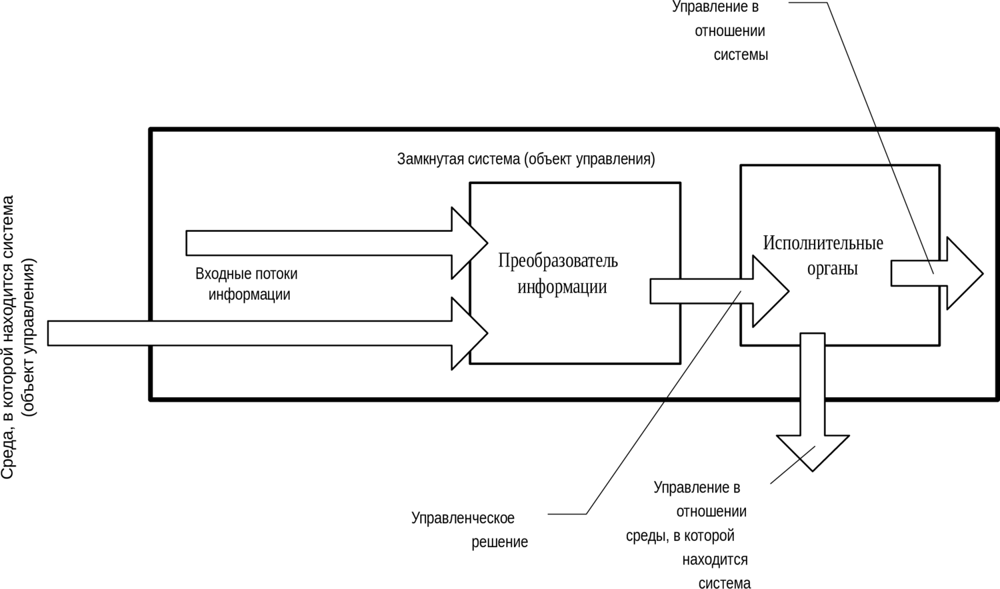
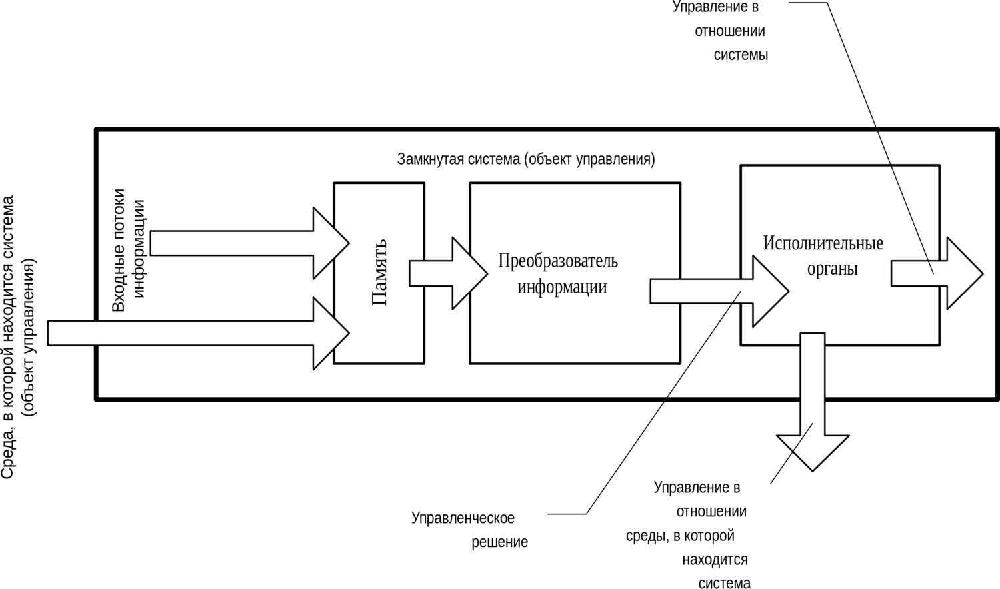

> **Первичный текст.** «Основы социологии», том 1. Страница издания: стр. 243 PDF — кандидатная привязка, требует сверки.
> Источник: файл издания `osnovy-sociologii-tom-1.pdf` (PDF в выпуск не включён). Контрольные суммы и статус проверки — в [NOTICE.md](../../NOTICE.md).
> Содержание передаёт позицию авторов издания; утверждения не верифицированы библиотекой.

---

## 5.4. Различные схемы обработки информации в процессе взаимодействия индивида с жизненными обстоятельствами

В состоянии бодрствования в процессе взаимодействия индивида с потоком событий в его жизни работа личностной психики состоит в следующем:

- некоторым образом воспринимается поток информации, приносимой органами чувств;

- на основе сложившегося мировоззрения и потока информации, поступающей через органы чувств, в темпе, опережающем реальное течение событий, многовариантно моделируется развитие ситуации и участие в нём самого индивида;

- один из вариантов кладётся в основу линии поведения индивида и его воздействия на дальнейшее развитие ситуации;

- в дальнейшем избранная линия поведения:

<!-- -->

- либо корректируется соответственно той информации, которую продолжают приносить органы чувств, и её воплощение в жизнь осуществляется более или менее успешно;

- либо происходит отказ от выработанной линии поведения, причинами чего могут быть как объективная невозможность её реализации, так и разочарование самого субъекта в получаемых в ходе реализации результатах.

Главное состоит именно в этом:

В состоянии бодрствования поток информации, приносимой органами чувств (как вещественными, так и биополевыми), сопоставляется с мировоззренческой моделью, на основе какого соотнесения вырабатывается линия поведения, которая в дальнейшем в процессе воплощения её в жизнь корректируется либо от которой субъект отказывается под воздействием объективных или субъективных причин.

И описанное имеет место при всех типах строя психики, при всех разновидностях эмоционально-смыслового строя, при всех вариантах взаимодействия личности и эгрегоров.

Хотя всё названное налагает свою печать на процесс обработки информации в психике в состоянии бодрствования, тем не менее можно выявить некие основные схемы организации потоков информации в психике в процессе её обработки, не обусловленные всеми названными и не названными особенностями.

Если мы строим самоуправляющуюся систему (а психика каждого из нас является таковой системой в объемлющих её процессах и системой управления по отношению ко многим процессам), то мы имеем возможность организовать в ней выработку управленческих решений и алгоритмов поведения в среде несколькими способами.

Ниже показаны три схемы организации обработки информации в самоуправляющихся информационно-алгоритмических системах. Эти схемы в силу того, что информация и алгоритмика — объективные категории бытия, носят общий, универсальный характер[^202], вследствие чего интересующие нас варианты организации обработки информации в психике индивида могут быть представлены с их помощью.

На каждой из схем:

- Прямоугольник с надписью «Замкнутая система (объект управления)» обозначает организм индивида вместе с его психикой как информационно-алгоритмической системой.

- Показаны два входных потока информации: один имеет начало в пределах прямоугольника (организма индивида), а второй имеет начало во внешней среде. Они соответствуют потоку самочувствия и потоку информации, поступающей из окружающей среды.

- Надпись «Преобразователь информации» обозначает интеллект уровней психики сознания и бессознательного.

- Через «Исполнительные органы» проистекает два потока действий (управления): один — воздействие на самого себя; второй — воздействие на внешнюю среду.

**Первый способ** представлен на схеме 1 ниже. Поток воспринимаемой информации, поступающей из организма и из внешней среды, обладает наивысшей приоритетностью. Он *непосредственно* подаётся на вход алгоритма выработки управленческого решения. Соотнесение его с содержимым памяти *— мировоззрением и миропониманием —* в процессе обработки носит настолько поверхностный характер, что им в рассмотрении можно пренебречь. По этой причине память — мировоззрение и миропонимание — на схеме 1 не показаны.

*Схема 1. Чувства → интеллект → действия*

**Второй способ** представлен на схеме 2 ниже. Информация, поступающая из внешней среды, загружается *непосредственно в долговременную память,* т.е. в мировоззрение и миропонимание, а алгоритм выработки управленческого решения черпает информацию из долговременной памяти, и в самóм процессе выработки решения сопоставляет входные потоки информации с информацией, уже наличествующей в памяти.

**Третий способ** представлен на схеме 3 ниже. Информация, поступающая из внешней среды, достоверность которой сомнительна, алгоритмом-сторожем загружается в *«буферную память» временного хранения* (на схеме она обозначена надписью «Карантин»). Некий алгоритм-ревизор в «Преобразователе информации», выполняя в данном варианте роль *защитника мировоззрения и миропонимания от внедрения в них недостоверной информации,* анализирует информацию в буферной памяти «Карантина» и присваивает ей значения: «ложь» — «истина» — «требует дополнительной проверки» и т.п. Только после этого определения и снабжения информационного модуля соответствующим маркером («ложь» — «истина» и т.п.) алгоритм-ревизор перегружает информацию из «Карантина» в долговременную память, информационная база которой обладает более высокой значимостью для алгоритма выработки управленческого решения, чем входные потоки информации. Также «Преобразователь информации» осуществляет совершенствование алгоритма-сторожа, распределяющего входной поток информации между «Карантином» и остальной памятью.

*Схема 2. Чувства → память → интеллект → действия*

*Схема 3. Чувства → алгоритм-сторож → память с «карантином» → интеллект с алгоритмом-ревизором → действия*

Управленческое решение строится, как и при втором способе в процессе сопоставления информации, уже наличествующей в долговременной памяти (мировоззрении и миропонимании), с информацией входных потоков. Однако информация, помещённая в «Карантин», не может стать основой выработки управленческих решений, по крайней мере, — особо значимых решений, неосуществимость которых неприемлема. При прочих равных условиях, время реакции системы на поступление информации из внешней среды растёт от первой схемы к третьей; т.е. быстродействие, оцениваемое по времени реакции на воздействие, падает.

Однако, если в информационном потоке, поступающем в систему из внешней среды, присутствует помеха типа «бессмысленный шум» или помеха типа *«наваждение», в котором выражается целенаправленная попытка извне изменить самоуправление нашей системы* в соответствии с чуждыми нам целями и концепцией управления ею, то устойчивость процесса самоуправления растёт от первой схемы к третьей, поскольку растёт помехозащищённость выработки управляющего воздействия, которое строится на основе стабильной или медленно изменяющейся информационной базы долговременной памяти в целом.

- **В первой схеме** «шум» и «наваждения» *(т.е. недостоверная информация)* являются непосредственной информационной базой выработки управленческого решения. При этом «шумы» и «наваждения» могут представлять собой целенаправленный поток управления извне, если реакция системы на различные варианты внешнего воздействия предсказуема для внешних субъектов.

- **Во второй схеме** «шум» и «наваждения» включаются в информационную базу выработки управленческого решения и по мере того, *как ими замусоривается долговременная память, они бесконтрольно вовлекаются в алгоритм выработки управленческого решения в качестве достоверной информации,* на основе которой оно вырабатывается.

- **В третьей схеме** «шум» и «наваждения», прежде чем войти в информационную базу, на основе которой вырабатывается управленческое решение и строится поведение системы, *должны обмануть* алгоритм-сторож и алгоритм-ревизор, перегружающий информацию из буферной памяти временного хранения в долговременную память и определяющий принадлежность информации к взаимно непересекающимся категориям «ложно», «истинно», «требует дополнительной проверки».

Соответственно, если система самоуправляется по третьей схеме, то чтобы навязать ей чуждое внешнее управление[^203], следует либо загрузить информацию в долговременную память «контрабандой» в обход алгоритма-сторожа; либо остановить алгоритм-сторож и алгоритм-ревизор — и тем самым перевести систему на вторую схему управления; либо подать на вход системы информационный поток «шумов» и «наваждений» такой интенсивности, чтобы управление по третьей или второй схеме потеряло устойчивость вследствие недостаточного быстродействия и система перешла на управление по первой схеме, которой свойственна скорейшая реакция на информацию, непосредственно поступающую из внешней среды, при практически полной утрате памяти в процессе выработки управленческих решений. Но и первая схема обладает своими пределами устойчивости. В алгоритмике психики людей потеря устойчивости самоуправления по первой схеме проявляется либо в форме ступора (отсутствие какой-либо реакции на течение событий: это ещё одно состояние, которое может быть охарактеризовано поговоркой «башню клинит») либо в форме истерики (эмоционального срыва, в котором реакция несообразна и несоразмерна течению событий, т.е неадекватна им).

С точки зрения обеспечения информационно-алгоритмической безопасности в смысле устойчивости самоуправления по определённой концепции, *в которой определены цели управления и средства их достижения*, **нормальной является третья схема самоуправления и обработки информации в психике**. Первая схема управления допустима для управления в чрезвычайных ситуациях, в которых предпочтительнее хоть какое-то управление, чем полный отказ от управленческого воздействия на течение событий. Вторая схема — это ущербная третья схема.

Человеческая психика, если это психика нормального человека (т.е. достигшего человечного типа строя психики), генетически настроена на осуществление третьей схемы самоуправления на основе мозаичного мировоззрения и миропонимания, развиваемых в направлении «от общего к частностям».

Соответственно:

**Второй по приоритетности задачей** в психической деятельности индивида является поддержание осмысленно-волевым порядком обработки информации в своей психике по третьей схеме на основе мозаичного мировоззрения и миропонимания триединства материи-информации-меры и возвращение себя к ней в случае перехода процесса психической деятельности к менее помехозащищённым схемам.

[^202]: Они взяты из постановочных материалов учебного курса «Достаточно общая теория управления», где рассматриваются в более широком значении.

[^203]: В том числе и чужое, готовое к употреблению, «авторитетное мнение», что в толпо-«элитарной» культуре большинством не воспринимается в качестве внешнего управляющего воздействия в отношении их поведения.
---

[← Назад](05-03.md) · [Оглавление тома 1](../README.md) · [Вперёд →](05-05.md)
