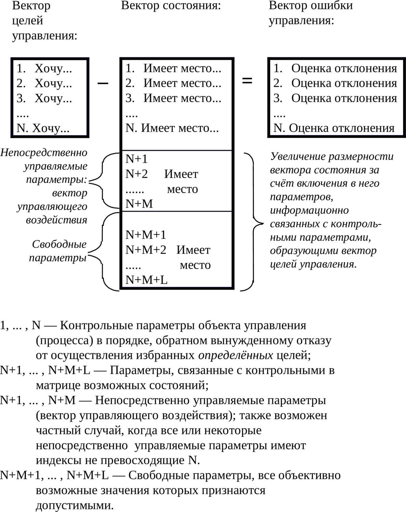

> **Первичный текст.** «Основы социологии», том 1. Страница издания: стр. 342 PDF — кандидатная привязка, требует сверки.
> Источник: файл издания `osnovy-sociologii-tom-1.pdf` (PDF в выпуск не включён). Контрольные суммы и статус проверки — в [NOTICE.md](../../NOTICE.md).
> Содержание передаёт позицию авторов издания; утверждения не верифицированы библиотекой.

---

## 6.5. Вектора: целей, состояния, ошибки управления, их соотношение

Для осознанной постановки и решения каждой из названных ранее или обеих задач теории управления совместно (когда одна сопутствует другой или они некоторым образом взаимно проникают друг в друга) необходимы три набора информации: вектор целей, вектор состояния, вектор ошибки управления.

*Вектор*[^264] *целей управления* (а равно — самоуправления, где не оговорено отличие), представляющий собой описание идеального режима функционирования (поведения) объекта (процесса).

Вектор целей управления строится *по субъективному произволу* как иерархически упорядоченное множество частных целей управления, которые должны быть осуществлены в случае идеального (безошибочного) управления. Порядок следования частных целей в нём — обратный порядку последовательного вынужденного отказа от каждой из них в случае невозможности осуществления полной совокупности целей. Соответственно на первом приоритете вектора целей стоит самая важная цель, на последнем — самая незначительная, отказ от которой допустим первым.

Образно говоря, вектор целей — это список, перечень того, чего желаем, с номерами, назначенными в порядке, обратном порядку вынужденного отказа от осуществления каждого из этих желаний. Если несколько целей представляются равнозначными, то они в совокупности образуют интегральную цель на соответствующем приоритете вектора целей.

Одна и та же совокупность целей, подчинённых разным иерархиям приоритетов (разным порядкам значимости для управленца), образует разные вектора целей, что ведёт и к возможному различию в управлении, в том числе и вследствие возникновения различий в построении критериев оптимальности управления и расчёте их значений.

Дефективность вектора целей может быть возможной причиной низкого качества управления (вплоть до полной потери управления). Основные типы дефектов вектора целей приведены ниже:

- выпадение из вектора некоторых целей, *объективно необходимых для управления процессом;*

- выпадением всего вектора или каких-то его фрагментов из объективной матрицы возможных состояний объекта;

- наличие в нём целей, объективно и субъективно взаимно исключающих друг друга;

- наличие целей, неустойчивых в процессе управления (способных исчезать в процессе управления или утрачивать актуальность);

- ошибки в иерархической упорядоченности целей в составе вектора:

<!-- -->

- ошибочное задание приоритетов целей, в результате чего цели, приоритеты которых для успешного решения задачи управления должны быть ниже, обладают более высокими приоритетами, чем действительно значимые цели (один из вариантов — привязка низкоприоритетных по их существу целей к высокоприоритетным, в результате чего приоритеты каких-то целей могут быть занижены, а каких-то завышены, и на каком-то из приоритетов вектора целей образуется дефективная интегральная цель);

- наличие нескольких экземпляров одних и тех же целей на разных приоритетах;

- «закольцованность» иерархии значимости целей (либо её фрагментов)[^265].

Вектор целей управления может изменяться в процессе управления, будучи функцией времени (в обыденном понимании этого явления) либо функцией матрицы возможностей течения процесса управления (объективной меры бытия, как составляющей триединства материи-информации-меры) и субъективно избранной алгоритмики управления процессом. В этом случае вектор целей, строго говоря, не является «вектором» в математическом понимании этого термина, поскольку представляет собой *множество векторов, характеризующих разные этапы процесса управления,* упорядоченное в соответствии: 1) с матрицей возможностей и 2) разветвлениями алгоритмики управления процессом. Эта тема поясняется далее в комментариях к рис. 6.13-4 (в разделе 6.13). Памятуя об этом несоответствии терминологии ДОТУ нормам математики, мы, тем не менее, распространим и на этот случай употребление термина «вектор целей управления».

————————

В некоторых версиях теории управления по отношению к этому случаю употребляется термин «дерево целей», что подразумевает наличие преемственной последовательности целей, которая может разветвляться в процессе управления, и которые должны быть осуществлены в ходе реального управления на разных этапах процесса. Однако и вариант с «деревом целей» не отвечает требованию универсальности терминологии, поскольку, как показывает практика применения аппарата сетевого планирования, процесс управления может не только разветвляться, но и разного рода частные процессы управления могут сливаться воедино по достижении каких-то общих промежуточных для них целей. В этом случае можно было бы именовать совокупность целей термином «сеть целей», однако он интуитивно непонятен. Поэтому мы отдаём предпочтение расширительному толкованию термина «вектор целей управления», включая в него и тот случай, когда вектор целей может изменяться в процессе управления, будучи функцией времени либо функцией матрицы возможностей течения процесса управления и субъективно избранной алгоритмики управления процессом.

————————

*Вектор (текущего) состояния* имеет более сложную структуру, нежели вектор целей. Первый его блок — блок *контрольных параметров,* который вбирает в себя информацию, характеризующую реальное поведение объекта по параметрам, *входящим в вектор целей*.

Каждый из контрольных параметров в этом блоке может быть представлен в виде суммы трёх составляющих: первая характеризует «полезную отдачу» замкнутой системы (процесса управления), вторая представляет собой «собственные шумы» замкнутой системы, а третья — помехи, наводимые в ней извне. Собственные шумы системы и помехи, наводимые в ней извне, так или иначе снижают качество управления и потому их можно выделить в отдельные компоненты вектора текущего состояния, что породит соответствующие им компоненты в составе вектора целей. такой подход потребует и соответствующих управленческих мер, направленных на снижение уровней собственных шумов и помех в контрольных параметрах.

Либо при другом подходе к структурированию информации собственные шумы и помехи могут быть перенесены в правую часть уравнения на схеме рис. 6.5-1 — в состав вектора ошибки управления.

Названные два вектора (целей и состояния) образуют взаимосвязанную пару, в которой каждый из этих двух векторов представляет собой упорядоченное множество информационных модулей, описывающих те или иные параметры объекта, *определённо* соответствующие частным целям управления. Упорядоченность информационных модулей в векторе состояния повторяет иерархию вектора целей. Образно говоря, вектор состояния это — список, как и первый, но того, что воспринимается в качестве состояния объекта управления, реально имеющего место в действительности.

В подавляющем большинстве случаев непосредственное воздействие на параметры, входящие в вектор целей управления, оказывается невозможным. Именно это обстоятельство и вызывает потребность в организации управления путём решения задачи об устойчивости в смысле предсказуемости поведения и выявления параметров, на которые возможно оказать непосредственное воздействие, следствием которого будет желательное изменение контрольных параметров, входящих в вектор целей.

Реализация такого подхода (в подавляющем большинстве случаев неизбежного) приводит к тому, что размерность вектора состояния больше, чем размерность вектора целей за счёт включения в него параметров, связанных в матрице возможных состояний с параметрами, включёнными в вектор целей. Эти дополнительные параметры можно разделить на две группы:

- В первую входят параметры, которые поддаются непосредственному изменению. Из их перечня выбираются параметры, на которые в процессе управления будет оказываться управляющее воздействие. Это — непосредственно управляемые параметры, изменение которых влечёт за собой изменение параметров, включённых в вектор целей. Эти параметры образуют вектор управляющего воздействия. В ряде случаев непосредственно управляемые параметры могут входить в состав вектора целей (например, на кораблях при больших скоростях хода, чтобы предотвратить недопустимый крен в процессе поворота, а то и опрокидывание корабля, могут налагаться ограничения на угол перекладки руля, который в задачах управления маневрированием, *в отличие от угла курса, скорости хода, координат,* обычно не входит в перечень контрольных параметров).

- Во вторую группу входят так называемые «свободные параметры», любые возможные значения которых в процессе управления признаются допустимыми (если бы на них накладывались какие-либо ограничения, то они с этими ограничениями вошли бы в вектор целей).

Поскольку восприятие субъектом состояния объекта не идеально (во-первых, в силу искажения информации, исходящей от объекта, «шумами» среды, через которую проходят информационные потоки; во-вторых, оно носит характер, обусловленный особенностями субъекта в восприятии и переработке информации), вектор состояния всегда содержит в себе некоторую ошибку в определении истинного состояния, которой соответствует некоторая объективная неопределённость для субъекта управленца. Неопределённость *объективна, т.е. в принципе не может быть устранена усилиями субъекта*. Другое дело, что объективная неопределённость может быть как допустимой, так и недопустимой для осуществления целей *конкретного процесса управления*.

*Вектор ошибки управления* представляет собой «разность» (в кавычках потому, что разность не обязательно привычная алгебраическая): *«вектор целей» − «вектор состояния».* В него могут входить как измеримые отклонения вектора состояния от вектора целей, так и оценки (как это показано на схеме рис. 6.5-1 — ниже по тексту), необходимость в которых может возникать вследствие того, что вектор текущего состояния включает в себя некоторую неопределённость. Вектор ошибки управления описывает отклонение реального процесса от предписанного вектором целей идеального режима и также несёт в себе некоторую неопределённость, унаследованную им от вектора состояния. Образно говоря, вектор ошибки управления это — перечень неудовлетворённых желаний соответственно перечню вектора целей с какими-то измерениями или оценками степени неудовлетворённости каждого из них. Оценки могут быть построены на основе соизмеримых друг с другом численно уровней, либо численно несоизмеримых уровней, но упорядоченных ступенчато дискретными целочисленными индексами предпочтительности каждого из уровней в сопоставлении его со всеми прочими уровнями.

Помимо исходного различия вектора целей и вектора состояния в момент начала управления источниками ошибок управления реально являются: 1) алгоритмика выработки управляющего воздействия системой управления, которая в принципе не может гарантировать идеального управления с нулевыми компонентами вектора ошибки, 2) собственные шумы в замкнутой системе[^266], 3) помехи извне, включающие в себя воздействие среды, а также и целенаправленные попытки перехвата управления со стороны иных субъектов.

Структура и соотношение информации, входящей в перечисленные вектора, характеризующие процесс управления, показаны на схеме рис. 6.5-1, приведённой ниже.

Если эту форму не удаётся заполнить метрологически состоятельной информацией, то это — показатель того, что задача управления не может быть даже поставлена, а не то, что решена.

Рис. 6.5-1. Структурирование информации,  
характеризующей процесс управления

Задача управления в своём существе — достичь целей, а равно — обнулить вектор ошибки управления.

Реально вектор ошибки не может быть сделан идеально нулевым как вследствие объективных причин, так и вследствие разного рода неточностей и запаздываний в процессе управления, которые обусловлены субъективными причинами в ходе организации управления. Соответственно этому обстоятельству реальное управление может протекать в одном из трёх режимов:

- Нормальное управление — в нём реально ненулевые значения компонент вектора ошибки управления оцениваются как вполне приемлемые (они могут при этом находиться в пределах погрешности измерений — в этом случае достигаются значения так называемого «технического нуля» либо могут считаться *приближённо равными нулю*[^267]*).*

- Допустимое управление — в нём реально ненулевые значения компонент вектора ошибки находятся в пределах, признаваемых допустимыми, но допустимое управление по своим характеристикам хуже, чем нормальное.

- Аварийное управление — в нём те или иные компоненты вектора ошибки выходят за допустимые пределы, но *катастрофа управления (необратимая потеря управления, повреждения, разрушение объекта управления или нанесение им ущерба элементам внешней среды)* ещё не наступила. В режиме аварийного управления главной целью управления становится возвращение объекта хотя бы в режим допустимого управления.

Аварийное управление — один из тех случаев, в которых иерархическая упорядоченность компонент вектора целей и его состав могут изменяться в процессе управления, что влечёт за собой изменение и всей структуры информации в задаче управления.

Разграничение нормального и допустимого управления носит либо субъективно обусловленный характер, либо диктуется самой задачей управления.

Также надо понимать, что в силу субъективизма управленцев, формула взаимосвязи трёх названных векторов, приведённая на схеме рис. 6.5-1 *(«вектор целей» − «вектор состояния» = «вектор ошибки управления»),* допускает обмен местами в ней «вектора целей» и «вектора ошибки управления»: т.е. возможны ситуации, в которых вектор состояния, который с точки зрения одного субъекта-управленца — ошибка управления, для другого — успешно достигнутая цель.

[^264]: В наиболее общем случае под термином «вектор» подразумевается — не отрезок со стрелочкой, указывающей направление, а упорядоченный перечень (т.е. с номерами) разнокачественной информации. В пределах же каждого качества должна быть определена хоть в каком-нибудь смысле мера качества. Благодаря этому сложение и вычитание векторов обладают некоторым смыслом, определяемым при построении векторного пространства параметров. Именно поэтому вектор целей — не дорожный указатель «туда», хотя смысл такого дорожного указателя и близок к понятию «вектор целей управления». Кроме того компонентами вектора целей могут быть не константы, а функции одного или более аргументов.

[^265]: «Закольцованность» рангов имеет место в некоторых карточных играх: самая слабая карта — шестёрка, но только она бьёт туза. Аналогично этому может иметь место «закольцованность» иерархической упорядоченности по значимости целей в их полном перечне. Если «закольцованность» — неизбежность, то возможно разделение управленческой задачи на последовательные этапы, на каждом из которых «закольцованность» разрывается и иерархия вектора целей обретает определённость.

[^266]: Замкнутая система — объект управления и система управления им, связанные друг с другом каналами обмена информацией.

[^267]: Однако при этом надо помнить, что с точки зрения вычислительной математики два ЛЮБЫХ числа *приближённо* равны, и потому практически вопрос только в том: можно ли в осуществляемом процессе управления ненулевые компоненты вектора ошибки считать *приближённо нулевыми?*
---

[← Назад](06-04.md) · [Оглавление тома 1](../README.md) · [Вперёд →](06-06.md)
