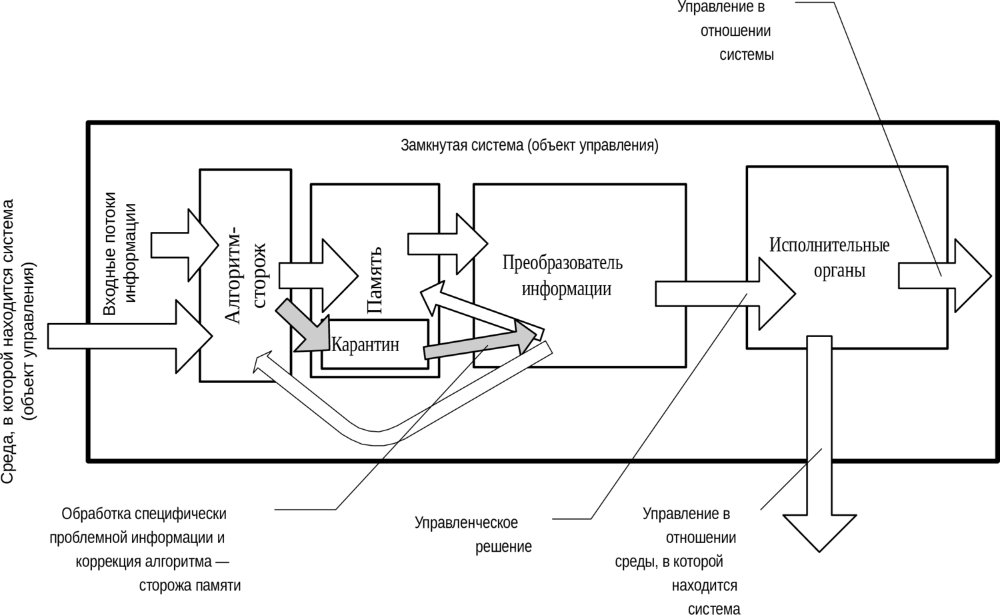

> **Первичный текст.** «Основы социологии», том 1. Страница издания: стр. 383 PDF — кандидатная привязка, требует сверки.
> Источник: файл издания `osnovy-sociologii-tom-1.pdf` (PDF в выпуск не включён). Контрольные суммы и статус проверки — в [NOTICE.md](../../NOTICE.md).
> Содержание передаёт позицию авторов издания; утверждения не верифицированы библиотекой.

---

## 6.11. Информационно-алгоритмическая безопасность — устойчивость управления под воздействием целенаправленно создаваемых помех

Термин «информационная безопасность» в последнее десятилетие стал довольно широко употребляться к месту и не к месту. При этом, мало кто из его употребляющих прямо говорит, как и какие процессы в жизни общества и в техносфере он связывает с этим термином. Т.е. в большинстве случаев его смысл при употреблении не определён.

При взгляде с позиций достаточно общей теории управления:

Информационная безопасность (а точнее — информационно-алгоритмическая безопасность) это — устойчивое течение процесса управления объектом (самоуправления объекта), в пределах допустимых отклонений от идеального предписанного режима, в условиях ЦЕЛЕНАПРАВЛЕННЫХ сторонних или внутренних попыток вывести управляемый объект из предписанного режима: от помех до перехвата управления им либо попыток уничтожения.

Таким образом термин «информационно-алгоритмическая безопасность» («информационная безопасность») всегда связан с конкретным объектом управления, находящимся в определённых условиях (среде). И соответственно он относится к полной функции управления, представляющей собой совокупность разнокачественных действий, осуществляемых в процессе управления, начиная от выявления факторов, требующих управленческого вмешательства и формирования целей управления, и кончая ликвидацией управленческих структур, выполнивших своё предназначение.

Это общее в явлении, именуемом «информационная безопасность», по отношению к информационно-алгоритмической безопасности как са́мого мелкого и незначительного дела, так и по отношению к информационно-алгоритмической безопасности *человечества в целом* в глобальном историческом процессе.

Разные схемы управления и разные концепции управления обеспечивают разный уровень информационно-алгоритмической безопасности.

При этом программная схема управления обладает парадоксальными характеристиками обеспечения информационно-алгоритмической безопасности вследствие своей полной неспособности воспринимать информацию извне:

- так артиллерийский снаряд, летящий по баллистической траектории, запрограммированной параметрами наведения орудия и энергообеспеченностью выстрела, по помехозащищённости процесса попадания в цель превосходит любую самонаводящуюся ракету.

- в других ситуациях программная схема управления, реализованная в отношении каких-то иных объектов (процессов), оказывается полностью неработоспособной, если в конфликте управлений противник навязывает ситуацию, в которой программа, заложенная в систему, становится неадекватной. Пример тому — разгром войском под руководством Александра Невского немецких рыцарей на льду Чудского озера: немецкая тактика оказалась несоответствующей обстоятельствам её реального боевого применения, предложенных Александром немцам.

Программно-адаптивная схема менее парадоксальна, но абсолютной помехоустойчивостью тоже не обладает: примерами тому всевозможные успешные хитрости военных на тему о том, как самонаводящиеся средства поражения (ракеты, торпеды, мины) увести на ложные цели, заставить сработать их взрыватели ложно, либо вообще заставить не сработать в тех ситуациях, когда их программы обязывают их срабатывать.

Наиболее высокий уровень информационно-алгоритмической безопасности обеспечивает организация процессов обработки информации в интеллектуальной модификации схемы управления предиктор-корректор, показанная в разделе 5.4 и повторяемая ниже.

В ней информация, поступающая из внешней среды, достоверность которой сомнительна, алгоритмом-сторожем загружается в *«буферную память» временного хранения* (на схеме она обозначена надписью «Карантин»). Некий алгоритм-ревизор в «Преобразователе информации», выполняя в данном варианте роль *защитника мировоззрения и миропонимания от внедрения в них недостоверной информации,* анализирует информацию в буферной памяти «Карантина» и присваивает ей значения: «ложь» — «истина» — «требует дополнительной проверки» и т.п. Только после этого определения и снабжения информационного модуля соответствующим маркером («ложь» — «истина» и т.п.) алгоритм-ревизор перегружает информацию из «Карантина» в долговременную память, информационная база которой обладает более высокой значимостью для алгоритма выработки управленческого решения, чем входные потоки информации. Также «Преобразователь информации» осуществляет совершенствование алгоритма-сторожа, распределяющего входной поток информации между «Карантином» и остальной памятью.

*Схема 3.* *Алгоритм управления с защитой  
от целенаправленных помех извне*

Управленческое решение строится в процессе сопоставления информации, уже наличествующей в долговременной памяти, с информацией входных потоков. При этом информация, помещённая в «Карантин», не может стать основой выработки управленческих решений, по крайней мере, — *особо значимых решений, неосуществимость которых неприемлема*.

Обеспечение информационно-алгоритмической безопасности и обеспечение режима секретности — не одно и то же:

Хотя это может показаться парадоксальным, но в ряде случаев создание режима секретности и его поддержание может быть вредным для обеспечения информационно-алгоритмической безопасности управления[^278].

[^278]: Эта проблематика рассмотрена в работе «Мёртвая вода»: т. 2, раздел «Процесс 2. Глобальная циркуляция информации, режим секретности и обеспечение информационной безопасности управления». См. так же аналитическую записку «Четыре ступени информационной безопасности» 1997 г. в материалах Концепции общественной безопасности.
---

[← Назад](06-10.md) · [Оглавление тома 1](../README.md) · [Вперёд →](06-12.md)
