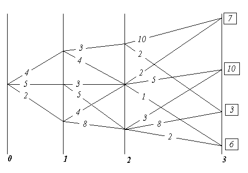
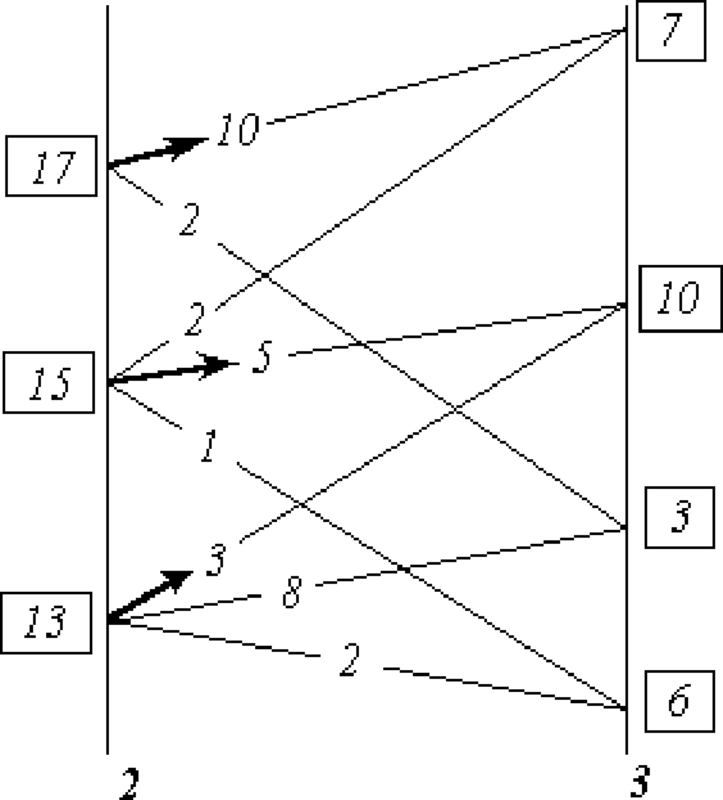
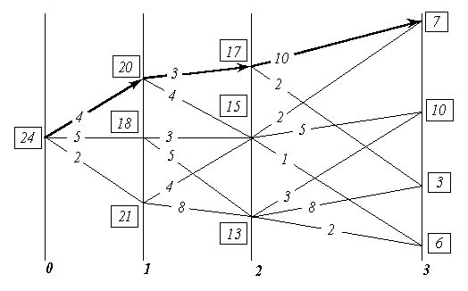
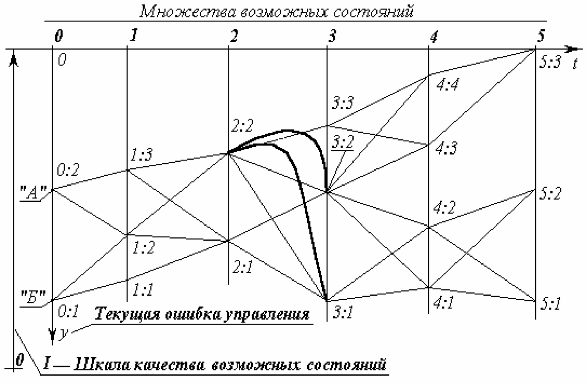

> **Первичный текст.** «Основы социологии», том 1. Страница издания: стр. 401 PDF — кандидатная привязка, требует сверки.
> Источник: файл издания `osnovy-sociologii-tom-1.pdf` (PDF в выпуск не включён). Контрольные суммы и статус проверки — в [NOTICE.md](../../NOTICE.md).
> Содержание передаёт позицию авторов издания; утверждения не верифицированы библиотекой.

---

## 6.13. Метод динамического программирования: как таковой, его символизм и вхождение в практику управления 

Метод динамического программирования — один из формально-алгоритмических методов оптимизации управления и решения иного рода задач, интерпретируемых в качестве задач управления. В изложении существа метода динамического программирования мы опираемся на книгу «Курс теории автоматического управления» (автор Палю де Ла Барьер: французское издание 1966 г., русское издание — «Машиностроение», 1973 г.), хотя и не повторяем его изложения. Отдельные положения взяты из курса «Исследование операций» Ю.П. Зайченко (Киев, «Вища школа», 1979 г.).

Метод динамического программирования работоспособен, если формальная интерпретация реальной задачи позволяет выполнить следующие условия:

1. Рассматриваемая задача может быть представлена как *N*‑шаговый процесс, описываемый соотношением:

*Xn + 1 = f(Xn, Un, n)*, где *n* — номер одного из множества возможных состояний системы, в которое она переходит по завершении *n*-ного шага; *Xn* — вектор состояния системы, принадлежащий упомянутому *n*-ному множеству; *Un *— управление, выработанное на шаге *n* (шаговое управление), переводящее систему из возможного её состояния в *n*-ном множестве в одно из состояний (*n + 1*)‑го множества. Чтобы это представить наглядно, следует обратиться к рис. 6.13-1, о котором речь пойдёт далее.

2. Структура задачи не должна изменяться при изменении расчётного количества шагов *N.*

3. Размерность пространства параметров, которыми описывается состояние системы, не должна изменяться в зависимости от количества шагов *N.*

4. Выбор управления на любом из шагов не должен отрицать выбора управления на предыдущих шагах. Иными словами, оптимальный выбор управления в любом из возможных состояний должен определяться параметрами рассматриваемого состояния, а не параметрами процесса, в ходе которого система пришла в рассматриваемое состояние.

Чисто формально, если одному состоянию соответствуют разные предыстории его возникновения, влияющие на последующий выбор оптимального управления, то метод позволяет включить описания предысторий в вектор состояния, что ведёт к увеличению размерности вектора состояния системы. После этой операции то, что до неё описывалось как одно состояние, становится множеством состояний, отличающихся одно от других компонентами вектора состояния, описывающими предысторию процесса.

5. Критерий оптимального выбора последовательности шаговых управлений *Un *и соответствующей траектории в пространстве формальных параметров имеет вид:

*V = V0(X0, U0) + V1(X1, U1) + *…*+ VN — 1(XN- 1, UN — 1) + VN(XN) .*

Критерий *V* принято называть *полным выигрышем,* а входящие в него слагаемые — *шаговыми выигрышами*. В задаче требуется найти *последовательность шаговых управлений* *Un* и траекторию, которым соответствует максимальный из возможных *полных выигрышей*. По своему существу полный выигрыш *V* — мера качества управления *процессом в целом*. Шаговые выигрыши, хотя и входят в меру качества управления процессом в целом, но *в общем случае* не являются мерами качества управления на соответствующих им шагах, поскольку метод предназначен для оптимизации процесса управления в целом, а *эффектные шаговые управления* с большим шаговым выигрышем, но лежащие вне *оптимальной траектории,* интереса не представляют. Структура метода не запрещает при необходимости на каждом шаге употреблять критерий определения шагового выигрыша *Vn,* отличный от критериев, принятых на других шагах. Кроме того, критерий оптимальности может быть построен и как произведение шаговых выигрышей, которые однако в этом случае не должны принимать отрицательных значений.

С индексом *n* — указателем-определителем множеств возможных векторов состояния — в реальных задачах может быть связан некий изменяющийся параметр, например: *время, пройденный путь, уровень мощности, мера расходования некоего ресурса* и т.п. То есть метод применим не только для оптимизации управления процессами, длящимися во времени, но и к задачам оптимизации многовариантного одномоментного или нечувствительного ко *времени* решения, если такого рода «безвременные», «непроцессные» задачи допускают их многошаговую интерпретацию.

Теперь обратимся к рис. 6.13-1 — рис. 6.13-3, повторяющим взаимно связанные рис. 40, 41, 42 из курса теории автоматического управления П. де Ла Барьера, хотя в нём они иначе озаглавлены.

На рис. 6.13-1 показаны начальное состояние системы — «0» и множества её возможных последующих состояний — «1», «2», «3», а также возможные переходы из каждого возможного состояния в другие возможные состояния. Всё это вместе похоже на карту настольной детской игры, по которой перемещаются фишки: каждому переходу-шагу соответствует свой шаговый выигрыш, а в завершающем процесс третьем множестве — каждому из состояний системы придана его оценка, помещенная в прямоугольнике. Принципиальное отличие от игры в том, что гадание о выборе пути, употребляемое в детской игре, на основе бросания костей либо вращения волчка и т.п., в реальном управлении недопустимо, поскольку это — передача целесообразного управления тем силам, которые способны управлять выпадением костей, вращением волчка и т.п., т.е. тем, для кого избранный в игре «генератор случайностей» — достаточно эффективно (по отношению к их целям) управляемое устройство.

Рис. 6.13-1. К существу метода динамического программирования.  
Матрица возможностей.

Если выбирать оптимальное управление на первом шаге, то необходимо предвидеть все его последствия на последующих шагах. Поэтому описание алгоритма метода динамического программирования часто начинают с описания выбора управления на последнем шаге, ведущем в одно из завершающих процесс состояний. При этом ссылаются на «педагогическую практику», которая свидетельствует, что аргументация при описании алгоритма от завершающего состояния к начальному состоянию легче воспринимается, поскольку опирается на *как бы уже сложившиеся* к началу рассматриваемого шага условия, в то время как возможные завершения процесса также определены.

В соответствии с этим на рис. 6.13-2 анализируются возможные переходы в завершающее множество состояний «3» из каждого возможного состояния в ему предшествующем множестве состояний «2», будто бы весь предшествующий путь уже пройден и осталось последним выбором оптимального шагового управления завершить весь процесс. При этом для каждого из состояний во множестве «2» определяются ***все*** *полные выигрыши как сумма = «оценка перехода» + «оценка завершающего состояния».* Во множестве «2» из полученных для каждого из состояний, в нём возможных полных выигрышей, определяется и *запоминается* максимальный полный выигрыш и соответствующий ему переход (фрагмент траектории). Максимальный полный выигрыш для каждого из состояний во множестве «2» взят в прямоугольную рамку, а соответствующий ему переход отмечен стрелкой. Таких оптимальных переходов из одного состояния в другие, которым соответствует одно и то же значение полного выигрыша, в принципе может оказаться и несколько. В этом случае все они в методе неразличимы и эквивалентны один другому в смысле построенного критерия оптимальности выбора траектории в пространстве параметров, которыми описывается система.

Рис. 6.13-2. К существу метода динамического  
программирования. Анализ переходов.

После этого множество «2», предшествовавшее завершающему процесс множеству «3», можно рассматривать в качестве завершающего, поскольку известны оценки каждого из его возможных состояний (максимальные полные выигрыши) и дальнейшая оптимизация последовательности шаговых управлений и выбор оптимальной траектории могут быть проведены только на ещё не рассмотренных множествах, предшествующих множеству «2» в оптимизируемом процессе (т.е. на множествах «0» и «1»).

Таким образом, процедура, иллюстрируемая рис. 6.13-2, работоспособна на каждом алгоритмическом шаге метода при переходах из *n*-го в *(n — 1)*-е множество, начиная с завершающего *N*‑ного множества до начального состояния системы.

В результате последовательного попарного перебора множеств, при прохождении всего их набора, определяется оптимальная последовательность преемственных шаговых управлений, максимально возможный полный выигрыш и соответствующая им траектория. На рис. 6.13-3 утолщённой линией показана оптимальная траектория для рассматривавшегося примера.

В рассмотренном примере критерий оптимальности — сумма шаговых выигрышей. Но как было отмечено ранее, критерий оптимальности может быть построен и как произведение *обязательно неотрицательных* сомножителей.

Рис. 6.13-3. К существу метода динамического программирования.  
Оптимальная траектория.

Поскольку результат (сумма или произведение) не изменяется при изменении порядка операций со слагаемыми или сомножителями, то алгоритм работоспособен и при переборе множеств возможных состояний в порядке, обратном рассмотренному: т.е. от исходного к завершающему множеству возможных состояний.

Если множества возможных состояний упорядочены в хронологической последовательности, то это означает, что расчётная схема может быть построена как из реального настоящего в прогнозируемое *определённое* будущее, так и из прогнозируемого *определённого* будущего в реальное настоящее. Это обстоятельство говорит о двух неформальных соотношениях реальной жизни, лежащих вне алгоритма метода:

1.  Метод динамического программирования формально алгоритмически нечувствителен к характеру причинно-следственных обусловленностей (в частности, он не различает причин и следствий). По этой причине каждая конкретная интерпретация метода в прикладных задачах должна строиться на неформальном учёте реальных обусловленностей следствий причинами.

2.  Если прогностика в согласии с иерархически наивысшим всеобъемлющим управлением, а частное управление, вложенное во всеобъемлющее управление, осуществляется квалифицировано, в силу чего процесс частного управления протекает в ладу с иерархически наивысшим всеобъемлющим управлением, то *НЕ СУЩЕСТВУЕТ УПРАВЛЕНЧЕСКИ ЗНАЧИМОЙ РАЗНИЦЫ МЕЖДУ **РЕАЛЬНЫМ НАСТОЯЩИМ И ИЗБРАННЫМ БУДУЩИМ**.*

    Процесс целостен, по какой причине ещё не свершившееся, но уже нравственно избранное и объективно не запрещённое Свыше будущее, в свершившемся настоящем защищает тех, кто его творит на всех уровнях: начиная от защиты психики от наваждений до защиты от целенаправленной «физической» агрессии. То есть, если матрица возможных состояний (она же матрица возможных переходов) избрана в ладу с иерархически наивысшим всеобъемлющим управлением, то она сама — защита и оружие, средство управления, на которое замкнуты все шесть приоритетов средств обобщённого оружия и управления (см. раздел 8.5).

Объективное существование *матриц возможных состояний и переходов* проявляется в том, что в слепоте можно «забрести» в некие матрицы перехода и прочувствовать на себе их объективные свойства. Последнее оценивается субъективно, в зависимости от отношения к этим свойствам, как полоса редкостного везения либо как нудное «возвращение на круги своя» или полоса жестокого невезения.

Но для пользования методом динамического программирования и сопутствующими его освоению неформализованными в алгоритме *жизненными проявлениями матриц перехода*, необходимо СОБЛЮДЕНИЕ ГЛАВНОГО из условий:

В задачах оптимизации процессов управления метод динамического программирования \<реального будущего средствами матрично-эгрегориального характера: — по умолчанию\> работоспособен только, если определён вектор целей управления, т.е. должно быть избрано завершающее процесс *определённое состояние*.

В реальности это завершающее определённое состояние должно быть заведомо устойчивым и приемлемым процессом, объемлющим и несущим оптимизируемый методом частный процесс. Но выбор и определение определённых характеристик процесса, в который должна войти управляемая система по завершении алгоритма метода, лежит вне этого метода — в области «мистики» или в области методов, развитых в нематематических по своему существу науках и ремёслах.

Это означает, что применение метода динамического программирования к практическому решению задач в жизни (и прежде всего — к решению задач матрично-эгрегориального управления социальными и общеприродными процессами) основывается на интуиции и искусстве диалектики, обусловленных реальными нравственностью и религиозностью индивида (см. Часть 1 настоящего курса). Причина этого в том, что, решение задачи о гарантированной устойчивости и приемлемости конечного состояния процесса, оптимизируемого методом динамического программирования, предполагает постановку и получение ответов на вопросы:

1.  А для чего необходимо достичь именно этого конечного состояния — вектора целей и каждой из входящих в его состав целей? — т.е. достижение каких целей высшего порядка обеспечивается в перспективе достижением частных целей, характеризующих конечное состояние оптимизируемого процесса?

2.  Лежат ли эти цели высшего порядка в русле Промысла?

Второе значимое объективное ограничение возможностей практического применения связано с выявлением начального состояния и проистекает из следующего положения:

«Каково бы ни было состояние системы перед очередным шагом, надо выбирать управление на этом шаге так, чтобы выигрыш на данном шаге плюс оптимальный выигрыш на всех последующих шагах был максимальным», — Е.С. Вентцель, «Исследование операций. Задачи, принципы, методология». (Москва, «Наука», 1988 г., с. 109).

Неспособность определить вектор целей управления (достижением которого должен завершиться оптимизируемый в методе процесс) и (или) неспособность выявить исходное состояние объекта управления и хотя бы одного пути перехода из начального состоянии в завершающее не позволяет последовать этой рекомендации, что *объективно закрывает* возможности к использованию метода динамического программирования, поскольку начало и конец процесса, матрица переходов должны быть определены в пространстве параметров, на которых построена математическая (или иная) *модель метода (она должна быть метрологически состоятельной, что является основой её соотнесения с реальностью)*. Причём определённость *завершения* оптимизируемого процесса и принадлежность его устойчивому приемлемому объемлющему процессу имеет управленчески большее значение, чем ошибки и некоторые неопределённости в идентификации (выявлении) начального состояния объекта управления.

Это тем более справедливо для последовательных многовариантных шаговых переходов, если матрица возможных состояний вписывается в пословицу *«Все дороги ведут в “Рим”»,* *<u>а которые не ведут в “Рим”, — ведут в небытие</u>*. Для такого рода процессов, если избрана *устойчивая во времени* цель и к ней ведут множество траекторий, то при устойчивом пошаговом управлении «расстояние»[^290] между оптимальными траекториями, идущими к одной и той же цели из различных исходных состояний, от шага к шагу сокращается, вплоть до полного совпадения оптимальных траекторий, начиная с некоторого шага. Это утверждение тем более справедливо, чем более определённо положение завершающего процесс вектора целей в пространстве параметров. По аналогии с математикой это можно назвать <u>асимптотическим множеством траекторий</u>: асимптотичность множества траекторий выражается в том, что «все дороги ведут в “Рим”…»

И в более общем мировоззренческом случае, рекомендации Нового завета и Корана утверждают возможность обретения благодати, милости Вседержителя вне зависимости от начального состояния (греховности человека) в тот момент, когда он очнулся и увидел свои дела такими, каковы они есть.

Другое замечание относится уже к практике — к вхождению в матрицу перехода. Если начальное состояние системы определено с погрешностью, большей, чем необходима для вхождения в матрицу перехода из реального начального состояния в избранное конечное, то управление на основе самого по себе безошибочного алгоритма метода динамического программирования приведёт к совсем иным результатам, а не расчётному оптимальному состоянию системы. Грубо говоря, не следует принимать за выход из помещения на высоком этаже открытое в нём окно.

То есть метод динамического программирования, необходимостью как определённости в выборе конечного состояния-процесса, так и выявления истинного начального состояния, *сам собой* защищён от применения его для наукообразной имитации оптимизации управления при отсутствии такового.

Однако главная полезность в ДОТУ метода динамического программирования не в его возможностях и особенностях, о которых было сказано выше. *ВАЖНО ОБРАТИТЬ ВНИМАНИЕ И ПОНЯТЬ:* Если в математике видеть науку об объективной общевселенской мере (через «ять»), а в её понятийном, терминологическом аппарате и символике видеть одно из предоставленных людям средств описания объективных частных процессов, выделяемых ими из некоторых объемлющих процессов, то *всякое описание метода динамического программирования есть краткое изложение <u>всей</u> ранее изложенной <u>достаточно общей теории управления</u>, включая и её мистико-религиозные аспекты; но — на языке математики и формальной логики.*

Чтобы пояснить это, обратимся к рис. 6.13-4 (ниже по тексту), памятуя о сделанном ранее замечании об определённости начального состояния с достаточной для вхождения в матрицы перехода точностью.

На нём показаны два объекта управления «А» и «Б» в начальном состоянии; три объективно возможных завершающих состояния (множество «5»); множества («1» — «4») промежуточных возможных состояний; и пути объективно возможных переходов из каждого состояния в иные.

Рис. 6.13-4. Динамическое программирование, его символизм  
и вхождение в управление

Рис. 6.13-4 можно уподобить некоторому фрагменту общевселенской меры развития (многовариантного предопределения бытия) — одной из составляющих в триединстве материя-информация-мера.

Если принять такое уподобление рис. 6.13-4, то объективно возможен переход из любого начального состояния «0:1» или «0:2» в любое из завершающих состояний «5:1», «5:2», «5:3». Но эта объективная возможность может быть ограничена субъективными качествами управленцев, намеревающихся перевести объекты «А» и «Б» из начального состояния в одно из завершающих состояний.

Если Свыше дано Различение, то управленец «А» (или «Б») снимет с объективной меры «кальку»[^291], на которой будет виден хотя бы один из множества возможных путей перевода объекта из начального состояния во множество завершающих. Если Различение не дано, утрачено или отвергнуто в погоне за вожделениями, или бездумной верой в какую-либо традицию, но не Богу по совести, то на «кальке» будут отсутствовать какие-то пути и состояния, но могут «появиться» объективно невозможные пути и состояния, объективно не существующие в истинной Богом данной мере — Предопределении бытия. Кроме того, по субъективному произволу управленца выбирается и желанное определённое завершающее состояние из их множества. Соответственно следование отсебятине или ошибка в выборе предпочтительного завершающего состояния может завершиться катастрофой с необратимыми последствиями.

Но матрица возможных состояний, показанная на рис. 6.13-4, *вероятностно предопределяет* только частный процесс в некой взаимной вложенности процессов. По этой причине каждое из начальных состояний «0:1», «0:2» может принадлежать либо одному и тому же, либо различным объемлющим процессам, в управленческом смысле иерархически высшим по отношению к рассматриваемому; то же касается и каждого из завершающих состояний «5:1», «5:2», «5:3» в паре «исходное — завершающее» состояния. Каждый из объемлющих процессов обладает их собственными характеристиками и направленностью течения событий в нём.

Может оказаться, что цель «5:1» очень привлекательна, если смотреть на неё из множества начальных неудовлетворительных состояний. Но не исключено, что объемлющий процесс, к которому завершающее состояние «5:1» принадлежит, как промежуточное состояние, в силу взаимной вложенности процессов, на одном из последующих шагов завершается полной и необратимой катастрофой. Например, цель «5:1» — не опоздать на «Титаник», выходящий в свой первый рейс, … ставший трагическим и последним. Чтобы не выбирать такую цель из множества объективно возможных, необходимо быть в ладу с иерархически *наивысшим* всеобъемлющим управлением, которое удержит частное ладное с ним управление от выбора такой цели, принадлежащей к обречённому на исчезновение процессу.

Но если рис. 6.13-4 — «калька» с объективной меры, то может статься, что какое-то завершающее состояние, являющееся вектором целей — отсебятина, выражающая желание «сесть на два поезда сразу». Иными словами, разные компоненты вектора целей принадлежат к двум или более взаимно исключающим друг друга иерархически высшим объемлющим процессам протекающим одновременно.

Это один из случаев неопределённости и дефективности вектора целей, делающий метод динамического программирования неработоспособным, а реальный процесс «управления» неустойчивым, поскольку одна и та же «лодка» не может пристать и к правому, и к левому берегу одновременно, даже если привлекательные красоты на обоих берегах реки, при взгляде издали — из-за поворота реки — совмещаются, создавая видимость подходящего для пикника весьма уютного места. Чтобы не выбрать такого вектора целей, также необходимо, чтобы Свыше было дано Различение правого и левого «берегов» потока бытия.

То есть алгоритму динамического программирования, даже если его можно запустить, сопутствует ещё одно внешнее обстоятельство, которое тоже очевидно, «само собой» разумеется, но в большинстве случаев игнорируется: *завершающее частный оптимизируемый процесс состояние должно принадлежать объемлющему процессу, обладающему <u>заведомо</u> приемлемыми собственными характеристиками течения событий в нём.*

После избрания цели, принадлежащей во взаимной вложенности к *объемлющему процессу* с приемлемыми характеристиками устойчивости и направленностью течения событий в нём, необходимо увидеть пути перехода и выбрать оптимальную последовательность преемственных шагов, ведущую в избранное завершающее частный процесс состояние; т.е. необходимо избрать концепцию управления.

Концепция управления в объективной мере, обладает собственными характеристиками, которые совместно с субъективными характеристиками субъекта-управленца порождают вероятностную предопределённость осуществления им концепции управления. Значение **вероятностной предопределённости** успешного завершения процесса — объективная иерархически высшая мера, оценка замкнутой системы «объект + управленец + концепция», в отличие от *вероятности, как этот термин понимается в теории вероятностей,* — объективной меры системы «объект + объективно существующая концепция управления».

Поэтому, чем ниже вероятность перевода объекта в желательное завершающее состояние, тем выше должна быть квалификация управленца, повышающая значение вероятностной предопределённости успешного завершения процесса управления.

Соответственно сказанному, для администратора признание им некой концепции управления может выражаться в его уходе с должности по собственной инициативе, проистекающей из осознания им своей неспособности к осуществлению признанной им концепции управления; а неприятие концепции может выражаться, как заявление о её принятии и последующие искренние ревностные, *но неквалифицированные* усилия по её осуществлению. Они приведут к тому, что концепция будет дискредитирована, поскольку квалифицированные управленцы, способные к её осуществлению, не будут допущены до управления по личной ревности, жажде славы, зарплаты или ещё чего-то со стороны благонамеренного самонадеянного неквалифицированного недочеловека.

Вследствие нетождественности *вероятности (математической)* и *вероятностной* *предопределённости (жизненного явления)* очень хорошая концепция может быть загублена плохими исполнителями её: на двухколёсном велосипеде ездить лучше, чем на трехколёсном, но не все умеют; но некоторые ещё будут доказывать, что на двухколёсном и ездить-то нельзя, поскольку он падает и сам по себе, а не то что с сидящим на нём человеком, тем более на ходу, — если они ранее не видели, как ездят на двухколесном; а третьи, не умея и не желая учиться ездить самим, из ревности не отдадут велосипед тем, кто умеет.

Поэтому после принятия концепции к исполнению необходимо придерживаться концептуальной самодисциплины самому и взращивать концептуальную самодисциплину в окружающем обществе. То есть необходимо поддерживать достаточно высокое качество управления на каждом шаге всеми средствами, чтобы не оказаться к началу следующего шага в положении, из которого в соответствии с избранной концепцией управления перевод объекта в избранное завершающее состояние невозможен. Этот случай — уклонение с избранного пути «2:2» → «3:3» показан: дуга «2:2» → «3:1» — необратимый срыв управления, после которого невозможен переход в состояние «5:3»; дуга «2:2» → «3:2» — обратимый срыв управления, в том смысле что требуется корректирование концепции, исходя из состояния «3:2», рассматриваемого в качестве начального.

Если на рис. 6.13-4 объективной иерархически высшей мере качества состояний, в которых могут находиться объекты субъектов-управленцев «А» и «Б», соответствует шкала качества возможных состояний «***I***», то для их блага целесообразен переход из множества состояний «0» в состояние «5:3». Но выбор ими направленности шкалы оценки качества состояний нравственно обусловлен и субъективен: либо как показано на рис. 6.13-4 «***I***», либо в противоположном «***I***» направлении.

Если на рис. 6.13-4 возможные состояния сгруппированы во множества «1», «2», «3», «4», «5» по признаку синхронности, то в координатных осях *0ty,* при шкале качества состояний «***I***» расстояние от оси *0t* до любой из траекторий — текущая ошибка управления при движении по этой траектории. Площадь между осью *0t* и траекторией — интеграл по времени от текущей ошибки. Он может быть использован как критерий-минимум оптимальности процесса управления в целом, т.е. в качестве полного выигрыша, являющегося в методе динамического программирования мерой качества, но не *возможных состояний,* не *шагов-переходов* из одного состояния в другое, а всей траектории перехода. Но в общем случае метода шаговые выигрыши могут быть построены и иначе.

Если принят критерий оптимальности типа минимум[^292] значения *интеграла по времени от текущей ошибки управления* (на рис. 6.13-4 это — площадь между осью *0t* и траекторией перехода), то для субъекта «А» оптимальная траектория — «0:2» → «1:3» → «2:2» → «3:3» → «4:4» → «5:3»; а для субъекта «Б» оптимальная траектория — «0:1» → «1:2» → «2:2» → «3:3» → «4:4» → «5:3».

Срывы управления «1:2» → «2:1» → «3:1»; «2:2» → «3:1»; «2:2» → «3:2» → «4:1»; «3:2» → «4:2» — полная необратимая катастрофа управления по концепции, объективно возможной, но не осуществлённой по причине низкого качества текущего управления в процессе перевода объекта в избранное конечное состояние «5:3». Все остальные срывы управления обратимы в том смысле, что требуют коррекции концепции и управления по мере их выявления.

То есть метод динамического программирования в схеме управления «предиктор-корректор» работоспособен, а сама схема развертывается, как его практическая реализация.

Возможны интерпретации метода, когда в вектор контрольных параметров (он является подмножеством вектора состояния) не входят какие-то характеристики объекта, которые тем не менее, включены в критерий выбора оптимальной траектории. Например, если в состоянии «0:2» различные субъекты не различимы по их исходным энергоресурсам, а критерий выбора оптимальной траектории чувствителен к энергозатратам на переходах, то такому критерию может соответствовать в качестве оптимальной траектория «0:2» → «1:2» → «2:1» → «3:2» → «4:3» → «5:3» или какая-то иная, но не траектория «0:2» → «1:3» → «2:2» → «3:3» → «4:4» → «5:3», на которой достигается минимум интеграла от текущей ошибки управления.

Это означает, что управленец, в распоряжении которого достаточный энергопотенциал, может избрать траекторию «0:2» → «1:3» → «2:2» → «3:3» → «4:4» → «5:3»; но если управленец с недостаточным для такого перехода энергопотенциалом не видит траектории «0:2» → «1:2» → «2:1» → «3:2» → «4:3» → «5:3», для прохождения которой его энергопотенциал достаточен, то состояние «0:2» для него субъективно тупиковое, безвыходное, хотя объективно таковым не является. Это говорит о первенстве Различения, даваемого Свыше непосредственно каждому, перед всем прочими способностями, навыками и знаниями.

Кроме того, этот пример показывает, что на одной и той же «кальке» с матрицы возможных состояний, соотносимой с полнотой реальности, можно построить набор критериев оптимальности, каждый из частных критериев в котором употребляется в зависимости от конкретных обстоятельств осуществления управления. И каждой компоненте этого набора соответствует и своя оптимальная траектория. Компоненты этого набора критериев, так же как и компоненты в векторе целей, могут быть упорядочены по предпочтительности вариантов оптимальных траекторий. Но в отличие от вектора целей, когда при идеальном управлении реализуются все без исключения входящие в него цели, несмотря на иерархическую упорядоченность критериев оптимальности, один объект может переходить из состояния в состояние только по единственной траектории из всего множества оптимальных, в смысле каждого из критериев в наборе, траекторий. Критерии оптимальности выбора, входящие в иерархически организованный набор критериев, не обязательно могут быть удовлетворены все одновременно. Для управления необходимо, чтобы процесс отвечал хотя бы одному из множества допустимых критериев.

Может сложиться так, что один субъект реализует концепцию «0:2» → «1:2» → «2:1» → «3:2» → «4:3» → «5:3», а другой «0:2» → «1:3» → «2:2» → «3:3» → «4:4» → «5:3» в отношении одного и того же объекта. Хотя конечные цели совпадают, но тем не менее, если управленцы принадлежат к множеству управленцев одного и того же уровня в иерархии взаимной вложенности процессов, то это — конкуренция, «спортивная» гонка или концептуальная война; если они принадлежат к разным иерархическим уровням в одной и той же системе, то это — антагонизм между её иерархическими уровнями, ведущий как минимум к падению качества управления в смысле, принятом на её иерархически наивысшем уровне, а как максимум — к распаду системы. Тем более, если завершающие цели различны, то это — концептуальная война, обостряющаяся по ходу процесса. В такого рода конфликтах арбитр — иерархически высшее по отношению к ним обоим объемлющее управление — вплоть до иерархически наивысшего управления — Вседержительности.

Из сказанного следует, что алгоритм динамического программирования и рис. 6.13-4, иллюстрирующий некоторые аспекты его приложений, является довольно прозрачным намёком на весьма серьёзные жизненные обстоятельства.

В целом же метод динамического программирования в его абстрактной постановке (т.е. не привязанной к какой-либо практической задаче) позволяет сформировать систему образно-логических представлений о процессах управления вообще, и вписывать в эту схему все практические жизненные управленческие потребности как одной личности, так и общества. Это необходимо для осознанного вхождения в управление даже в том случае, если управление реально строится на основе каких-то других моделей.

Собственно по этой причине метод динамического программирования включён в курс ДОТУ и связан в ней с проблематикой, относимой к компетенции *философии как своего рода «камертона» для настройки мировоззрения и миропонимания,* что предопределяет результативность всякой деятельности.

[^290]: В пространстве формальных параметров, описывающих процесс.

[^291]: Калька — полупрозрачная бумага либо пропитанная восковым составом тонкая ткань (батист) — самое простое средство копирования штриховых изображений до появления ксероксов, компьютеров и сканеров: калька накладывалась на изображение и фиксировалась на нём. После этого на кальке вручную прорисовывалось (карандашом, чернилами или тушью) копируемое изображение.

[^292]: Хотя в каноническом виде метода присутствует критерий-максимум, но использование критерия-минимум также возможно, поскольку в практике переход к канонической форме задачи достигается умножением на «минус единицу» соответствующих значений и выражений.
---

[← Назад](06-12.md) · [Оглавление тома 1](../README.md) · [Вперёд →](06-14.md)
