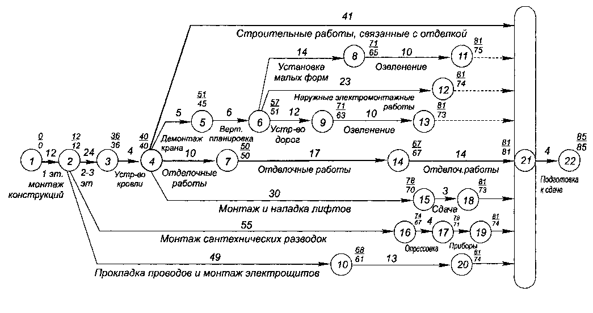

> **Первичный текст.** «Основы социологии», том 1. Страница издания: стр. 426 PDF — кандидатная привязка, требует сверки.
> Источник: файл издания `osnovy-sociologii-tom-1.pdf` (PDF в выпуск не включён). Контрольные суммы и статус проверки — в [NOTICE.md](../../NOTICE.md).
> Содержание передаёт позицию авторов издания; утверждения не верифицированы библиотекой.

---

## 7.2. Представление проекта в форме сетевой модели и аппарат сетевого планирования

Любой проект может быть представлен в форме сетевой модели. В качестве примера на рис. 7.2-1 представлена сетевая модель строительства и сдачи некоего объекта заказчику.

Сетевая модель (сетевой график) всякого проекта в предельно укрупнённом виде, лишённом какой бы то ни было детальности, представляет собой:

Рис. 7.2-2. Пример представления в виде сетевой модели комплекса работ по строительству и сдаче объекта заказчику.

- два кружочка, которыми обозначены события — начало и завершение проекта,

- и линию, соединяющую эти два кружочка, которая обозначает всю совокупность работ, в их взаимосвязях составляющих проект в целом.

Начало и завершение проекта по своему существу представляют собой *рубежи дискретного контроля*[^295] состояния дел *по факту «выполнено — не выполнено»:* в данном случае «начат — не начат», «завершён — не завершён» проект — соответственно.

Но управление проектом требует большей детализации. Всякая дальнейшая детализация сетевой модели представляет собой замену *линии, соединяющей два соседних опорных рубежа дискретного контроля по факту «выполнено — не выполнено»,* эквивалентной сетью, образуемой при более детальном рассмотрении проекта:

- дополнительно выявленными рубежами, на которых объективно возможен дискретный контроль составляющих проект работ по факту «выполнено — не выполнено» на интервалах между двумя соседними опорными рубежами дискретного контроля при прежней степени детализации;

- линиями, по которым в этой эквивалентной сети осуществляется переход от начального опорного рубежа к завершающему опорному рубежу дискретного контроля через систему промежуточных рубежей дискретного контроля, выявленных между опорными рубежами.

При этом на некоторых рубежах дискретного контроля могут иметь место разветвления единой работы на несколько технологически и организационно не обуславливающих друг друга потоков-фрагментов, которые могут выполняться одновременно, параллельно друг другу разными людьми или разными коллективами. Соответственно, на некоторых рубежах дискретного контроля могут завершаться несколько параллельно выполняемых технологически и организационно не обуславливающих друг друга фрагментов проекта в целом[^296].

К сказанному выше иллюстраций за исключением рис. 7.2-1 не будет, поскольку изложенные принципы построения сетевой модели просты, и каждый, кто того пожелает, может представить в форме сетевого графика любое дело, которое он хорошо знает: **это следует сделать самостоятельно для лучшего понимания дальнейшего**.

Сетевые графики сопровождаются текстовыми данными:

- Всякий РУБЕЖ ДИСКРЕТНОГО КОНТРОЛЯ подразумевает завершение каждой из ведущих к нему работ, и в этом смысле (завершения работ) он именуется «**событие**» (это в сетевом планировании — термин), и характеризуется:

<!-- -->

- моментом времени (дата, время суток) — реального или идеального технологического времени, отсчитываемого от предыдущего рубежа дискретного контроля или отсчитываемого от начала проекта в целом по «критическому пути» (смысл этого термина поясняется ниже), ведущему к этому рубежу;

- идентификационными данными (номером и т.п.), позволяющими устанавливать взаимно однозначное соответствие дискретно контролируемых событий в реальном технологическом процессе и их символических образов — событий-дубликатов в сетевой модели.

<!-- -->

- Всякий ЭТАП (ФАЗА) ПРОЕКТА В ЦЕЛОМ, обозначаемый в сетевой модели как линия, соединяющая два преемственных рубежа дискретного контроля («события»), именуется «**работа**» (это — тоже термин в сетевом планировании) и характеризуется:

<!-- -->

- своей продолжительностью в реальном, в запланированном или в идеальном технологическом времени, отсчитываемой от рубежа дискретного контроля, с которого начинается рассматриваемая работа;

- идентификационной информацией по технологическому и организационному существу соответствующей работы, а также номером и другими параметрами, позволяющими соотнести информацию с сетевым графиком и реальной деятельностью.

При замене предельно укрупнённой сетевой модели более детальной эквивалентной сетью выясняется, что общая продолжительность проекта (или его какого-то фрагмента) от его начала до определённого рубежа дискретного контроля, к которому ведёт несколько параллельно выполняемых цепей последовательных этапов работ, вычисляемая на основе идеального технологического времени, накапливающегося в каждой цепи из нескольких, определяется неоднозначно. В этом случае однозначность определения времени выполнения проекта (или его фрагмента, завершаемого рассматриваемым рубежом дискретного контроля) вносится в сетевые модели в соответствии со следующей аналогией:

На местности есть несколько путей, каждый из которых ведёт из пункта «А» в пункт «Б», и продолжительность прохождения каждого из них разная. Если большая группа путешественников в пункте «А» разделяется на мелкие партии, каждая из которых идёт своим путём в пункт «Б», то спрашивается: когда вся группа соберётся в пункте «Б»?

— Когда придёт та партия, которая движется в пункт «Б» самым продолжительным по времени путём.

Так и в сетевых моделях: всякий рубеж дискретного контроля характеризуется наибольшей продолжительностью технологического времени, отсчитываемого по каждой из ведущих к этому рубежу цепочек преемственных работ от начала проекта в целом (а равно от какого-то иного опорного рубежа дискретного контроля, из которого выходят несколько цепей), поскольку только завершение последней работы в сáмой продолжительной из нескольких цепочек позволяет начать последующие этапы проекта. Эта цепочка (последовательность), представляющая собой подмножество работ в пределах сети, в терминах приведённой выше аналогии называется «критическим путём»[^297], по той причине, что запаздывание сроков выполнения составляющих её работ влечёт за собой запаздывание срока наступления события, соответствующего рассматриваемому рубежу дискретного контроля.

Все остальные «пути», ведущие к рассматриваемому рубежу дискретного контроля, имеют некоторый запас времени на задержку, определяемый разностью продолжительности «критического пути» и продолжительности каждого из них. Поэтому, если необходимо ускорить наступление события, соответствующего рассматриваемому рубежу дискретного контроля, то необходимо ускорить (насколько это возможно) проведение работ, лежащих на критическом пути; и при этом не разорвать их преемственности, чтобы между работами не возникало пауз, когда одна завершена, а ей преемствующая не может быть начата по причине организационной или технологической неготовности. Это касается как проекта в целом, так и отдельных его фрагментов.

Также необходимо сделать одну принципиальную оговорку:

Сетевой график — в общем случае — не является аналогом графического изображения алгоритма выполнения соответствующего им обоим проекта (работы), поскольку — в отличие от алгоритма — сетевой график не может включать в себя в явном виде циклы.

Сказанное означает, что если некоторый из этапов проекта в целом, представляет собой замкнутую в кольцо последовательность действий, а параметры выхода из этого цикла определяются результатами, достигнутыми в очередном прохождении кольца, то такой цикл может содержаться в сетевой модели только в «скрытом виде».

Например, если в алгоритме выполнения проекта в целом встречается последовательность работ типа: *«1) разработка конструкции устройства “А”, 2) изготовление устройства “А”, 3) испытания опытных экземпляров устройства “А”, 4) анализ результатов испытаний, 5) принятие решения: либо 5.1) о доработке конструкции устройства “А” (т.е. передача управления к п. 1), либо 5.2) начало следующего этапа проекта с использованием устройства “А”»,* — то такая последовательность может быть включена в сетевую модель только в скрытом виде, например, как работа с условным названием *«создание устройства “А”»,* а завершением её может быть по существу только п. 5.2 исходного для построения сетевого графика алгоритма: *«приёмка устройства “А”, дающая начало следующему этапу проекта с использованием устройства “А”»*.

Т.е. разработчики сетевой модели и те, кто опирается на неё в процессе управления, должны знать, какие именно работы, соединяющие подобно прочим работам два последовательных рубежа дискретного контроля, в действительности представляют собой «скрытые циклы». Соответственно планирование и контроль работ, представленных в сетевом графике как «скрытые циклы», — особая подзадача в сетевом планировании и управлении проектами на основе сетевых моделей.

[^295]: Этот термин будет пояснён далее в разделе 7.3.

[^296]: Собственно такого рода разветвления и слияние фрагментов работ на некоторых рубежах дискретного контроля и порождают <u>*образ* некой сети *как графическое представление проекта в целом*</u>.

[^297]: Критический путь и его параметры выявляются в сети с помощью алгоритма Форда. Об этом см. специальную литературу. Мы опускаем этот вопрос, поскольку алгоритм Форда это — частность в аппарате сетевого планирования, работоспособность которого в решении тех или иных практических задач организации управления обусловлена пониманием управления как явления. И потому освещение взаимосвязей ДОТУ и аппарата сетевого планирования представляется нам более значимым, чем рассмотрение алгоритмов сетевого планирования и работы с сетевыми моделями.
---

[← Назад](07-01.md) · [Оглавление тома 1](../README.md) · [Вперёд →](07-03.md)
