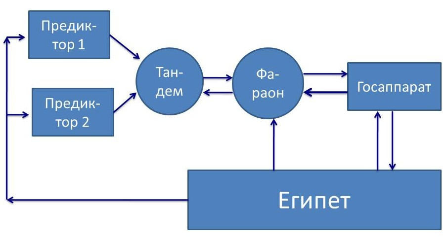
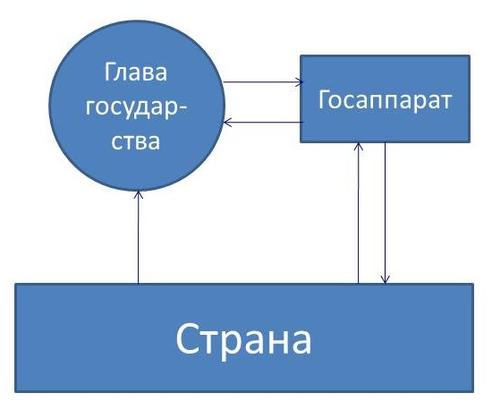

> **Первичный текст.** «Основы социологии», том 2. Страница издания: стр. 100 PDF — кандидатная привязка, требует сверки.
> Источник: файл издания `osnovy-sociologii-tom-2.pdf` (PDF в выпуск не включён). Контрольные суммы и статус проверки — в [NOTICE.md](../../NOTICE.md).
> Содержание передаёт позицию авторов издания; утверждения не верифицированы библиотекой.

---

## 8.5. Полная функция управления в отношении общества: специализированные виды власти, обобщённые *средства управления / оружия* и «игры с ненулевыми суммами»

Полная функция управления (см. раздел 6.3) включает в себя следующие этапы:

1.  Выявление фактора среды, который «давит на психику», чем и вызывает *субъективную* потребность в управлении. *Управление по полной функции начинается именно с этого.*

2.  Формирование навыка (стереотипа) распознавания фактора среды на будущее и распространение его в культуре общества.

3.  Целеполагание в отношении выявленного фактора.

    По своему существу целеполагание представляет собой формирование вектора целей управления в отношении данного фактора и внесение этого вектора целей в общий вектор целей субъекта-управленца. Целеполагание может включать в себя решение задачи об устойчивости частных целей и вектора целей в целом в смысле предсказуемости, хотя это может быть отнесено и к этапу 4 полной функции управления.

4.  Формирование генеральной концепции управления и частных концепций управления в отношении каждой из целей в составе вектора целей (т.е. целевых функций управления, составляющих в совокупности генеральную концепцию) на основе *решения задачи об устойчивости в смысле предсказуемости поведения объекта (процесса) под воздействием: внешней среды, собственных изменений объекта, управления*.

5.  Внедрение генеральной концепции управления в жизнь — организация новых или реорганизация существующих управляющих структур, несущих целевые функции управления.

6.  Контроль (наблюдение) за деятельностью структур в процессе управления, осуществляемого ими, и координация взаимодействия разных структур.

7.  Ликвидация существующих структур в случае ненадобности либо поддержание их в работоспособном состоянии до следующего использования.

Поскольку всякое общество некоторым образом самоуправляется или управляемо извне, то естественно рассмотреть, как в процессах общественного управления реализуется полная функция и как она в идеале должна реализовываться в жизни общества.

Если рассматривать с позиций ДОТУ жизнь культурно своеобразных обществ, то все они отличаются друг от друга тем, как в каждом из них реализуется полная функция управления, либо, как полная функция управления в отношении рассматриваемого общества реализуется из-за его пределов внешнеполитическими субъектами, а также и тем — как в этом участвует государственность, под властью которой живёт общество: т.е. какие этапы полной функции управления государственность реализует *на профессиональной основе* и в каких организационных формах, а какие этапы полной функции управления в отношении этого государства реализуются вне государственности, в том числе — и из-за пределов этого государства.

Рассматривать, как полная функция управления реализуется в первобытных культурах, — это узко специальная область интересов, хотя этнография реликтовых культур, зафиксировавшая многие факты к концу XIX в.[^107], может сообщить об этом поучительные сведения, не утратившие актуальности и в наши дни. Так упоминавшийся ранее в связи с вопросом о философии истории и её задачах английский этнограф второй половины XIX в. Эдвард Бёрнет Тайлор (1832 — 1917) в своей книге «Первобытная культура» (Москва, 1989 г., с. 485, 486) сообщает о жизни племён североамериканских индейцев, в культуре которых были ритуально оформленные процедуры, направленные на то, чтобы из числа подростков выбрать тех, кто в будущем сможет эффективно осуществлять в жизни народа разнородные по своей сути управленческие функции — шаманов, вождей, знахарей и т.п.

«Очень интересен рассказ, сообщённый Скулькрафту Чингауком, одним из алгонкинских предводителей, посвящённых в мистическую мудрость и рисуночное письмо своего народа: “Чингаук начал рассказ с того, что древние индейцы считали пост[^108] делом очень почётным. Они постились шесть, иногда семь дней, пока тело и дух их не делались лёгкими и светлыми, что приготовляло их ко снам. Стремлением древних духовидцев было увидеть во сне солнце, так как они думали, что этот сон делал их способными видеть всё на земле. И они обыкновенно преуспевали в этом путём долгого поста и долгих размышлений о предмете своих желаний. Посты и сны практиковались с раннего возраста. Всё, что юноша видит и испытывает во время поста и снов, считается им за истину и становится руководящим началом в его последующей жизни. За советом в делах он обращается к этим откровениям. Если посты были для него благоприятны и народ уверует в его способность прозревать будущее, то для него открыт путь к высшим почестям. Пророк, продолжал рассказчик, испытывает свою силу сначала втайне, в присутствии одного лишь лица, свидетельство которого необходимо в случае удачи. Начав подвизаться на этом поприще, он отмечает образы своих снов и откровений знаками на древесной коре или другом материале, хотя бы для этого ему потребовалось целая зима, и таким образом сохраняет память о своих главнейших откровениях. Если его предсказания сбываются, то свидетель заявляет об этом, а памятные заметки служат дальнейшим доказательством его пророческой силы и искусства. Время увеличивает его силу. Наконец его таблички представляются в совет стариков, которые совещаются об этом предмете, так как весь народ верит в эти откровения. Старики решают дело и объявляют, что человек одарён пророческим даром — вдохновлён мудростью и способен быть духовным водителем своего народа. Таков был, по словам рассказчика, древний обычай, и знаменитые древние воины-предводители достигали власти таким путём.”»

Ныне проблематика формирования кадрового состава управленческого корпуса и его общекультурной и профессиональной подготовки не волнует «высокоцивилизованные» общества вообще вопреки тому, что в цивилизации, основанной на технике и коллективном специализированном профессиональном труде, качество жизни каждого определяется не столько его собственными умом, трудоспособностью, разносторонностью профессионализма и его уровнем, сколько:

- во-первых, — действующей концепцией управления делами общества в целом, включая и его экономику, и,

- во-вторых, — качеством управления по проводимой в жизнь концепции как на макроуровне (общегосударственном и глобальном), так и на микроуровне (на предприятии, где человек работает, и в населённом пункте, где он проживает).

Как результат отсутствия интереса к воспроизводству кадрового корпуса управленцев — качество управления делами общественной в целом значимости закономерно соответствующее: недопустимо низкое, если его оценивать, исходя из интересов общественного развития и обеспечения всеобщего благоденствия.

По сути же в приведённом выше отрывке из «Первобытной культуры» речь идёт о поддержании в преемственности поколений субкультуры психо-физиологических практик, которая интегрировалась в процесс самоуправления древнеиндейского общества по схеме предиктор-корректор, обеспечивающей при прочих равных условиях наиболее высокое качество и эффективность управления в сопоставлении её с другими схемами.

Теперь обратимся к рассмотрению вопроса о том, как полная функция управления реализуется фактически и *как она должна реализовываться в интересах* *общественного развития* в цивилизованных обществах, которые породили, поддерживают и развивают в преемственности поколений ту или иную **государственность.**

Государственность и государство — не одно и то же явление, якобы обозначенное разными, хотя и однокоренными словами:

«Признаками государства являются: 1) наличие системы особых органов и учреждений (механизм государства), осуществляющих функции государственной власти; 2) право, закрепляющее определённую систему норм, санкционированных государством; 3) определённая территория, на которую распространяется юрисдикция данного государства» («Советский энциклопедический словарь», Москва, «Советская энциклопедия», 1987 г., с. 330).

Первое и второе из этого списка представляет собой формализованные компоненты государственности. Ещё одна компонента государственности — законы не писаные, т.е. некодифицированные этика и практика выработки, принятия и осуществления управленческих решений госчиновниками. Всё это вместе — **государственность, как субкультура управления на профессиональной основе делами общественной в целом значимости.**

Под делами общественной в целом значимости в данном случае понимаются дела, которые:

- прямо или опосредованно затрагивают если не всё общество, то достаточно многочисленные группы людей,

- однако люди не в состоянии управиться с этими делами либо вообще, либо с желательным уровнем качества управления ни поодиночке, ни на основе эпизодической самоорганизации по причинам нехватки необходимых ресурсов, отсутствия навыков, времени и т.п.

В сути государственности — главное это: управление делами общественной в целом значимости на профессиональной основе; а классовое угнетение — это специфика соответствующей общественно-экономической формации.

Если к государственности добавить территорию, на которой живёт население, несущее государственность, как *субкультуру управления на профессиональной основе делами общественной значимости,* то это и будет государство. Т.е. **государство это — государственность + население + территория, акватория и воздушное пространство, на которые распространяется власть государственности**. Кроме того государство — субъект международного права и глобальной политики.

30 сентября 1934 г. в одной из радиопередач из серии «Беседы у камина» президент США Ф.Д. Рузвельт затронул вопрос о роли государственности в жизни общества:

«Я разделяю убеждение Авраама Линкольна, который говорил: *“Законная задача правительства — делать для сообщества*[^109] *людей всё то, что им нужно, но что сами они, выступая каждый в своём индивидуальном качестве, не могут сделать совсем или не могут сделать хорошо”*» (Рузвельт Ф.Д. «Беседы у камина», Москва, ИТРК, 2003 г., с. 83, выделено курсивом нами при цитировании).

Кроме того, приведённой формулировке задач государственности А. Линкольн придал уточняющее дополнение: *«Мы не поможем людям, делая за них то, что они могли бы сделать сами»* (Журнал для пассажиров Российских железных дорог «Саквояж» № 2/2014. — С. 22).

Так А. Линкольн выразил жизненно состоятельные принципы взаимоотношений государства и общества, в которых выражается динамика разграничения компетенций (включая и компетенции хозяйствующих субъектов). Это мнение А. Линкольна соответствует предназначению государственности, обусловленному объективными потребностями общества в управлении его делами на профессиональной основе, в отличие от марксистского учения о том, что сутью государства является угнетение правящим классом остального общества, вследствие чего в бесклассовом коммунистическом обществе якобы не будет государства.

Пока существует общественная потребность в управлении на профессиональной основе делами общественной значимости в целом и на местах, государственность — как субкультура управления и несущие её институты — будет существовать и развиваться.

В действительности угнетение большинства правящим меньшинством, в котором государственный аппарат соучаствует, — не выражение сути государственности, а сопутствующий эффект деятельности государства в толпо-«элитарном» обществе, обусловленный порочностью господствующей в нём нравственности и этики.

Иными словами необходимо выявить рассогласование исторической практики и идеала совершенства общественной жизни, чтобы можно было думать о путях и средствах воплощения совершенства в жизнь.

———————

Понятно, что ресурсов и мощностей индивидуальной психики любого человека недостаточно для осуществления полной функции управления в отношении общества с должной для управленческой практики детальностью и быстродействием[^110]; не говоря уж о том, что никто из людей не способен предстать во множестве ипостасей («дублей», «клонов»), которые в совокупности составили бы в обществе корпус управленцев, действующий «как один человек» и в структурах государственного аппарата, и в структурах бизнеса. Вследствие наличия этих объективных факторов управление делами общественной значимости в целом и на местах, осуществляемое на профессиональной основе, предполагает:

- специализацию профессионалов и

- координацию их деятельности в русле *полной функции управления в отношении общества* на основе некоторой субкультуры взаимодействия *разнородных по специализации* управленцев-профессионалов друг с другом.

В ходе исторического развития миропонимания эти принципы организации процессов управления выражаются в политической практике и описывающих её социологических теориях — в частности в разделе юриспруденции, получившем название «теория государства и права».

Отметим ещё раз, что **научный подход**, в отличие от публицистики и бытовых разговоров на темы «понемногу обо всём», **обязывает** к однозначно понимаемому разграничению *объективно различных* явлений и субъективных *понятий о них, каждое из которых должно соответствовать тому или иному объективному явлению в жизни или взаимосвязям каких-то явлений*. Это — проблематика обеспечения метрологической состоятельности теорий, включая и «теорию государства и права».

Из теории государства и права, если не вдаваться в излишнюю детальность, можно узнать, что в основе деятельности государственного аппарата так называемых «передовых стран» лежит *принцип разделения властей — принцип разграничения компетенции (прав и обязанностей) нескольких видов специализированных видов власти, каждая из которых в своих функциях обособлена от других видов власти и не подчиняется им*. Этот принцип, дополненный представительной демократией[^111], основанной на избирательных процедурах и многопартийности, считается высшим достижением в организации обществом своего государственного аппарата.

И различные учебники по теории государства и права единообразно перечисляют специализированные виды власти, функции которых понятны из их названий:

- законодательная — создаёт систему законодательства, на основе которой формируются и действуют государственные институты, осуществляется хозяйственная деятельность и быт людей;

- исполнительная власть (административный аппарат государства) — на основе действующего законодательства осуществляет управление делами общественной значимости как в отношении общества в целом, так и на местах на территории юрисдикции государства;

- судебная власть (фактически — надзорно-следственно-судебная власть, если перечислить все её функции) — осуществляет:

<!-- -->

- контроль за соблюдением действующего законодательства,

- выявление фактов его нарушения,

- выявление и наказание виновных в его нарушении.

Такого рода система разделения властей в древнем мире достигла наивысшего развития в Риме. В последующем в эпоху феодализма в Европе она была в той или иной степени подавлена или искажена. С переходом к капитализму на основе идей буржуазного либерализма она была возобновлена в государствах Европы и Америки, в которых она сочетается с представительной *буржуазной* демократией. А с начала эпохи империализма и, в особенности со второй половины ХХ века, эта система вместе с представительной демократией проталкивается так называемыми «передовыми странами» Запада в другие регионы планеты как наиболее «продвинутый» политический продукт.

Так под давлением «передовых стран» Запада она была внедрена в Японии в период времени, начиная с реставрации Мэйдзи[^112], и окончательно закреплена в её конституции, продиктованной США после разгрома Японии во второй мировой войне ХХ века. Так же её внедряли и во все бывшие колонии «передовых стран» Запада, когда им предоставлялся государственный суверенитет.

В истории нашего Отечества на всём её протяжении (древняя языческая Русь — конгломерат княжеств эпохи удельной раздробленности и княжеских усобиц — Московское царство — Российская империя — СССР) она не была свойственна нашей политической культуре, которая строила государственность на иных принципах, менявшихся в разные эпохи. После краха Советской власти и СССР эта общезападная система разделения властей и представительной демократии стала внедряется и во всех постсоветских государствах на территории СССР, а также и в бывших социалистических странах.

Главный довод в пользу её внедрения в нашем Отечестве состоит в том, что мы — якобы *«отстали в развитии политической культуры общества, а система разделения властей, многопартийность и избирательные процедуры существуют во всех «передовых странах» и прекрасно зарекомендовали себя в обеспечении их благоденствия. Так США на протяжении всей своей истории, хотя и не бескризисно, но в целом успешно развивались, преодолевая кризисы, на основе системы разделения властей и действия представительной демократии»*.[^113]

С такого рода доводами можно было бы согласиться, если бы историческая практика показывала, что переход к этой системе организации деятельности государственности и её взаимодействия с обществом *автоматически влечёт за собой достижение благоденствия в исторически непродолжительные сроки — от 20 до 50 лет.*

Однако историческая практика (а она — критерий истины) показывает, что в мире есть государства, которые перестали быть колониями и обрели статус суверенных государств ещё в первой половине XIX, но за прошедшие более, чем полтора столетия так и не поднялись до уровня культурного и хозяйственного развития так называемых «передовых стран», хотя в них изначально была учреждена и система разделения властей, и какая ни на есть представительная демократия. Такова судьба большинства бывших испанских и португальских колоний в Южной и Центральной Америке. Да и другие бывшие колонии, которые обрели государственный суверенитет после завершения второй мировой войны ХХ века и распада колониальной системы эпохи становления империализма, в большинстве своём тоже весьма далеки от уровня развития культуры и хозяйства «передовых стран», хотя в большинстве из них с момента обретения ими государственного суверенитета тоже была учреждена система разделения властей и некая представительная демократия.

Наряду с этим из истории нашей Родины известно, что:

- Советская власть без системы разделения властей в её западном понимании в течение одной пятилетки восстановила всё, что было разрушено в ходе Великой Отечественной войны, и вывела хозяйство страны на довоенный уровень производства; а карточная система распределения продукции была в послевоенном СССР отменена раньше, чем в Великобритании, в которой система разделения властей и какая ни на есть представительная многопартийная демократия существуют веками. Кроме того, в период между первой и второй мировыми войнами ХХ века Советская власть без системы разделения властей в течение двух десятилетий осуществила модернизацию страны на основе культурного преображения общества (культурной революции), что собственно и обеспечило Победу в Великой Отечественной войне и последующее в *общем-то безбедное житьё* населения СССР на протяжении сорока лет до начала режимом М.С. Горбачёва перестройки в 1985 г.

- В противоположность этому постсоветская Россия с учреждённой в ней системой разделения властей, представительной демократией и многопартийностью в течение 20 лет своего существования не смогла к 2011 г. достичь показателей производства жизненно важных видов продукции в расчёте на душу населения, которые были в СССР в 1989 г.[^114] — в период *его целенаправленного демонтажа режимом М.С. Горбачёва;* и на протяжении всего этого времени средства массовой информации и система обязательного и высшего образования выполняют миссию не просвещения, а оболванивания подрастающих поколений, что исключает возможность модернизации страны при продолжении впредь такой политики в области образования и культуры, а тем более — исключает возможность модернизации страны в ближайшей перспективе*.*

Ну а возникновение фашистского режима в Германии в 1933 г. — прямое следствие недееспособности представительной демократии и системы разделения властей «веймарской республики» *в политической обстановке, возникшей в результате Версальского мирного договора, который подвёл юридические итоги первой мировой войне ХХ века*. При этом обязательно следует отметить следующее:

- многие современники, включая и некоторых участников выработки условий Версальского мирного договора, были убеждены в том, что этот «мирный» договор, подписанный в 1919 г., программирует новую мировую войну[^115] лет, примерно, через 20, и в этом они оказались правы;

- государственный аппарат стран-победительниц, выработавших и навязавших Германии этот «мирный договор», был воплощением принципов представительной демократии и разделения властей.

В связи с особенностями Версальского мирного договора необходимо отметить, что вторая мировая война ХХ века фактически была начата не 1 сентября 1939 г., чему учат историки-традиционалисты, а годом раньше — мюнхенским сговором (29 — 30 сентября 1938 г.): санкцией представительных демократий и систем разделения властей Великобритании (премьер-министр Н. Чемберлен) и Франции (премьер-министр Э. Даладье) гитлеровскому режиму на расчленение Чехословакии, тогдашние границы которой были определены Версальским (1919 г.), Сен-Жерменским (1919 г.) и Трианонским (1920 г.) договорами держав-победительниц в первой мировой войне с Германией, Австрией и Венгрией соответственно.

После этого 2 января 1939 г., американский журнал «Тайм», начавший в 1937 году долгосрочный (продолжающийся по сей день) проект — «Человек года», по итогам 1938 года назвал «Человеком года» А. Гитлера. При этом журнал пожелал «герру Гитлеру» и «1939 год сделать таким, о котором ещё долго вспоминать будут». — Гитлер таким его и сделал — при поддержке «демократий» с их системами разделения властей: США (их финансовый капитал кредитовал рейх, благодаря чему возродилась военная промышленность Германии), Великобритании и Франции (мюнхенский сговор)…

На основании мюнхенского сговора Германия, Польша (в культовой версии истории — первая «безвинная» жертва второй мировой войны ХХ века) и Венгрия, отторгли от Чехословакии 1/3 её территории *под предлогом защиты прав соответствующих национальных меньшинств* — немецкого, польского, венгерского. То, что осталось в результате этого от Чехословакии, с середины марта 1939 г. стало германским протекторатом Богемии и Моравии и подконтрольной Германии формально-юридически независимой Словакией, вышедшей из остатков Чехословакии по наущению из Берлина.

А если настаивать на том, что буржуазная демократия и её система разделения властей — жизненно состоятельная государственность, отвечающая потребностям общества, что А. Гитлер и его партия пришли к власти в результате демократических выборов, в которых формально-процедурных нарушений почти не было (т.е. выборы были «честными»[^116]), то следует сделать вывод: *немцы в 1933 г. со знанием дела, **т.е. предвидя последствия своего выбора**, проголосовали за вторую мировую войну ХХ века, разгром и безоговорочную капитуляцию Германии в 1945 г.*

Так непредвзятое рассмотрение результатов функционирования системы представительной демократии и разделения властей, достигаемых ею как во внутренней, так и во внешней политике разных государств, заставляет предположить, что *в реальной политике, весьма отличной от того, что сообщают учебники по «теории государства и права»,* имеют место ещё некие факторы, которые оказывают воздействие на практическую работоспособность этой системы в каждой стране и обесценивают все декларации о её совершенстве и дееспособности.

Соотнесение системы представительной демократии и разделения властей в её исторически известном виде с полной функцией управления позволяет выявить эти факторы и ответить на вопрос, почему система представительной демократии и разделения властей в её описанном выше виде *сама по себе* не гарантирует ни мирных межгосударственных взаимоотношений, ни благоденствия обществ в лоне этой *политической культуры, неоправданно представляемой в качестве если и не <u>безальтернативно наилучшей</u>, то наименее плохой из множества возможных*[^117].

Соответственно этому, если функции названых ранее специализированных видов власти соотнести с этапами полной функции управления, то выяснится следующее:

- на профессиональной основе в государственности, основанной на системе разделения властей в её описанном выше виде, осуществляются только 5‑й (за исключением фазы внедрения концепции управления в жизнь) — 7‑й этапы полной функции управления;

- а о том, как осуществляются 1‑й — 4‑й этапы полной функции управления и внедрение концепции управления в жизнь (относимое к 5‑му этапу полной функции) в процессе самоуправления общества при построении государственности на основе принципа разделения властей, *общезападная «теория государства и права», насаждаемая после 1991 г. и в России, вообще ничего сказать не может, прежде всего, потому, что ничего не знает о полной функции управления*.

И это — главная претензия к курсам социологии и политологии российских и зарубежных вузов, включая наиболее престижные «Оксбриджи», «Стэнфорды», «Гарварды», «Сорбонны», МГУ и т.п.

Из этого порока проистекают и конфликт студентов и руководства факультета социологии МГУ в 2007 г. (о котором речь шла в одной из сносок раздела 1.7), и забастовка студентов Гарвардского университета (США) в конце 2011 г., недовольных безальтернативностью и вздорностью навязываемого им стандартного учебного курса «Economics 10».[^118]

Как было отмечено в изложении ДОТУ (разделы 6.3 и 6.7), полная функция управления может осуществляться только в **интеллектуальной схеме управления,** которая представляет собой разновидность схемы управления предиктор-корректор. Там же было отмечено, что схема управления предиктор-корректор может быть условно представлена как сочетание предиктора и программно-адаптивного модуля: работе предиктора соответствуют 1‑й — 4‑й этапы полной функции управления, а работе программно-адаптивного модуля соответствуют 5‑й — 7‑й этапы полной функции управления, хотя предиктор контролирует в ходе своей деятельности и их, а также отчасти соучаствует в их реализации.

Т.е. государственность на основе системы разделения властей в её описанном выше виде, представляет собой всего лишь программно-адаптивный модуль в схеме управления предиктор-корректор и — *сама по себе* — управленчески несамодостаточна, во многом **безынтеллектуальна**, и потому неспособна к обеспечению самоуправления общества по полной функции управления.

И это приводит к вопросу: *Как в жизни общества могут осуществляться функции предиктора и как предиктор может быть связан с программно-адаптивным модулем системы управления?*

История человечества даёт на этот вопрос разные ответы в разных культурах.

\* \* \*

Так, по сообщению Э.Б. Тайлора, приведённому в начале этого раздела, индейцы-алгонкины в развитие социологических теорий не вдавались, а просто выявляли среди подростков тех, кто мог предвидеть будущее, после чего воспитывали их так, чтобы они становились *эффективными (по отношению к требованиям того образа жизни)* управленцами по полной функции.

Схема управления Египтом во времена фараонов, представленная на рис. 8.5‑1 слева, в некоторых аспектах своего функционирования была рассмотрена в разделе 5.10 (том 1). Здесь она приводится в повторно в связи тем, что на её основе в государственном управлении древнего Египта ещё в эпоху фараонов реализовывалась полная функция управления. Египет управлялся по схеме предиктор-корректор, которая в данном случае может быть представлена в виде двух модулей: предиктора, который вырабатывает концепцию управления, и программно-адпитивного, который её реализует. В древнем Египте государственный аппарат — программно-адаптивный модуль схемы управления предиктор-корректор, осуществлявший 5‑й — 7‑й этапы полной функции управления, — возглавлял фараон. 1‑й — 4-й этапы полной функции управления осуществляли два параллельно действующих предиктора — две группы высшего «жречества» (их именовали «иерофантами», что означает «знающие судьбу», «читающие будущее») по 11 человек на севере страны и на юге[^119]. Если оба предиктора в ходе параллельной работы выдавали взаимно исключающие друг друга результаты, то выработка управленческого решения осуществлялась на основе тандемного принципа деятельности (раздел 5.10), после чего для воплощения в жизнь оно передавалось в программно-адаптивный модуль (государственный аппарат), руководимый *фараоном, который в большинстве случаев сам входил в состав высшего «жречества»*.[^120]

*Рис. 8.5-1. Реализация полной функции управления*

*в Египте времён фараонов.*

Это качественно отличается от современности, когда все государства управляются по схеме, представленной на рис. 8.5-2 (далее по тексту), в которой полная функция управления не реализуется в явной форме.

Дельфийский оракул, судя по ориентации на Дельфы множества сооружений эпохи «каменного века» (о чём речь шла в разделе 8.1 со ссылкой на публикации Э. фон Дэникена), своею прогностикой и рекомендациями накрывал всю Европу, и кроме того историки древности сообщают, что к его «консалтинговым услугам» прибегали и властители государств Азии. Т.е. это был надгосударственный и трансцивилизационный (по отношению к региональным цивилизациям той эпохи) предиктор древности, у которого впоследствии заправилы библейского проекта смогли перехватить управление в этом регионе (либо управляемо «погасили его», поскольку и он изначально был создан как орудие и действовал под их контролем на более ранних этапах истории)[^121].

В тибетской цивилизации-государстве[^122] издревле культура строилась на основе ламаистской версии буддизма. Корпорация лам несла функции предиктора, и под её контролем находился государственный аппарат, в работе которого ламы принимали непосредственное участие. Специфику на работу этой системы самоуправления общества налагало буддистское учение о «карме»[^123], согласно которому будущее почти однозначно обусловлено прошлым и потому в настоящем возможности его изменить крайне ограничены: все должны неизбежно отработать свою прошлую «карму» и, отрабатывая прошлую «карму», должны стараться не испортить в непрестанно текущем настоящем свою будущую «карму».

В жизни докрещенской Руси волхвы (одна из профессиональных корпораций, если пользоваться терминологией наших дней), осуществляли функции предиктора в схеме предиктор-корректор, а княжеско-боярская социальная группа (другая профессиональная корпорация) осуществляла функции программно-адаптивного модуля, хотя государственности в нынешнем понимании этого термина (с прописанным законодательством, обязательным и скрупулёзным документированием деятельности и архивами), а тем более системы разделения властей, в докрещенские времена на Руси не было[^124].

\* \*  
\*

И если анализировать организацию управления в разных культурах древнего мира, то для большинства из них характерно разделение власти в обществе:

- на «жреческую», осуществлявшую функцию предиктора в схеме предиктор-корректор,

- и распорядительную (при появлении документирования — государственную), прямо или опосредованно подчинённую «жреческой власти» и осуществлявшую функции программно-адаптивного модуля[^125] (как это представлено на рис. 8.5-1 для Египта времён фараонов и иерофантов).

Иначе говоря, общества древнего мира на основе исторически устойчивых культур более или менее эффективно управлялись по полной функции управления по схеме предиктор-корректор.

В наши дни термин «жреческая власть» для большинства людей непонятен, поскольку в их миропонимании слово «жрец» представляется однокоренным со словом *«жрать», т.е. набивать своё брюхо пищей без какой бы то ни было <u>меры</u>* <u>— *порядка поедания, качества и количества пищи*</u>.

В действительности слово «жрец» — сложное слово, и одна из его составляющих — смысловая основа слова «речь». Если вспомнить старинные названия буков древнерусской азбуки, то «Ж» имела название «живёте», «Р» имела название «рцы». «Рцы» — форма повелительного наклонения, аналогичная по смыслу нынешнему «реки́», «изрекай». Из этого анализа смысла структурных компонент слова «жрец» можно понять, что социальная функция жречества — жизнеречение, т.е. *властно* *(в том смысле, что слова не должны оставаться без соответствующих их смыслу последствий)* «говорить» о том, как должно жить общество и как оно должно решать возникающие в его жизни проблемы, и что будет, если оно будет жить иначе и не будет решать проблемы, унаследованные от прошлого, и тем более — если будет порождать новые проблемы для себя и потомков. В этом и состоит суть того социального явления, которое может быть названо словами «жреческая власть».

Если соотноситься с этапами полной функции управления, то «жреческая власть» по своей управленческой сути является концептуальной властью. Т.е. именно она должна выявлять факторы, которые вызывают общественную потребность в управлении, осуществлять целеполагание в отношении них, вносить новые цели в вектор целей управления, формировать генеральную и частные концепции управления в отношении общества и внедрять концепции управления в жизнь общества и деятельность государственного аппарата (если государственный аппарат есть). А кроме того — она должна принимать на себя весь спектр обратных связей.

Если она этого не делает, то жречество перестаёт быть жречеством *автоматически — вне зависимости от знаний, навыков, прошлых достижений и текущих притязаний на соответствующий статус в обществе и деклараций о своём статусе*.

Наши дни характеризуются тем, что притязаний на «жреческую власть» много и, кроме того, — само общество возводит в своём миропонимании в ранг жречества те или иные социальные группы или профессиональные корпорации: духовенство традиционных конфессий, журналистов и средства массовой информации (СМИ) в целом (эти даже обрели титул «четвёртая власть»), деятелей искусств (особенно некоторых поэтов[^126]), науку как отрасль деятельности.

Однако при этом никто — ни простые обыватели, ни журналисты и прочие представители СМИ, ни наука, и прежде всего, её обществоведческие и человековедческие отрасли — ничего не могут сказать по существу о том, на чём основывается «жреческая власть», или иначе — какие личностные качества выражаются в жреческой власти — власти концептуальной.

По существу невнятность общественного мнения в ответе на вопрос, что по своей сути представляет собой «жреческая власть» и какие личностные качества в ней выражаются, означает, что нынешние общества концептуально безвластны: напомним, что «власть», «волость», «воля» — в русском языке однокоренные слова, и что воля в психике человека всегда действует с уровня сознания, а один из инструментов сознания — миропонимание.

В действительности жреческая власть основывается:

1.  На совершенствуемой и потому эффективной личностной культуре познания и творчества.

2.  На осознании Промысла Божиего (оно может быть в чём-то и ошибочным, но это не беда, если есть первое и четвёртое).

3.  На искреннем желании строить жизнь — свою собственную, общества и человечества в целом — в русле Промысла Божиего.

4.  На воле[^127].

5.  И всему этому должен сопутствовать достаточно широкий кругозор.

Если второго и третьего нет, то жречество становится знахарством, которое действует в угоду своекорыстию — своему или кого-то ещё, сохраняя однако концептуальную властность хотя и ограниченную эгоизмом[^128]. Занимая в структуре общества положение жречества, знахарство может сохранять за собой название «жречество», но ориентировано в своей деятельности на воплощение в жизнь не Промысла, а своекорыстия, чем само же и низводит слово «жречество» в отношении себя до однокоренного со словом «жрать».

Если нет первого, то начитавшись всякого, можно стать многознайкой-«теоретиком»; таких А.И. Солженицын высокомерно назвал «образованщиной», представителем которой был и он сам, поскольку первого за душой у него не было, как не было второго и третьего.

Если же нет воли, то невольник в институтах (органах) власти может быть только техническим исполнителем чужой воли при всей сколь угодно широкой его информированности и высоких профессиональных навыках.

И соответственно притязания на жреческий статус со стороны журналистики, деятелей искусств в большинстве своём объективно безосновательны. Не может быть жречеством и духовенство традиционных конфессий, поскольку оно, будучи профессиональной корпорацией, *коммерчески эксплуатирующей соответствующий религиозный культ,* отгородилось от жизни и от Бога своими писаниями и традициями истолкования жизни на основе писаний. Так же не может быть жречеством и современная наука, поскольку большинство её представителей — узкие специалисты в своих областях, а её «обществоведы» и «человековеды» («гуманитологи») не выявили сами сути жреческой власти в жизни общества и её проявлений в истории — всемирной и региональной. Как максимум некоторые представители науки и некоторые деятели искусств дотягивают до статуса знахарей[^129].

Не состоялись в качестве жречества и спецслужбы: того, что они наиболее информированы по многим вопросам жизни общества и знают то, чего не знают простые обыватели, для осуществления жреческой власти недостаточно[^130].

В таком понимании характера жреческой власти как власти, обусловленной осознанием Промысла и искренним желанием строить жизнь своего общества и глобальной цивилизации в русле Промысла, библейский проект порабощения человечества предстаёт как проект знахарский — какая ни на есть культура познания и творчества была, воля была, но Промысел решили подменить своею отсебятиной и возвести в миропонимании людей свою отсебятину в ранг Промысла.

Т.е. концептуальная власть может быть по своему характеру либо жреческой, либо знахарской, хотя при этом жречество может совершать ошибки, а знахарство, вследствие ограниченности своего миропонимания, не ведая, что творит, может в каких-то аспектах своей деятельности работать на Промысел.

При этом термин «концептуальная власть» вбирает в себя два смысла:

- во-первых, это — личностная власть людей, которые в состоянии выработать концепцию организации жизни общества и внедрить её в реальный процесс общественного самоуправления;

- во-вторых, это — власть самой концепции над обществом, не обусловленная персонами тех или иных людей.

Как было отмечено ранее (раздел 1.6), социология может решать одну из двух задач.

**Первая задача**: *Как в интересах того или иного паразитического меньшинства в отношении остального общества эффективно осуществить рабовладение — лучше всего с минимумом насилия на основе воплощения в жизнь принципа «дурака работа любит и дурак работе рад»?*

**Вторая задача**, которую может решить социология, но качественно иная по своей нравственной мотивации и во многом по содержанию, состоит в том: *Как ликвидировать организованный паразитизм тех или иных меньшинств на труде и жизни большинства, чтобы в преемственности поколений все люди жили свободно, а склонность к паразитизму, тем более в организованных формах, не воспроизводилась в новых поколениях?*

По сути каждой из этих задач соответствует своя генеральная концепция организации жизни общества, не совместимая с ей альтернативной, а каждая из задач является следствием соответствующей концепции. И каждая из концепций представляет собой концепцию осуществления глобализации и построения одной из двух взаимоисключающих друг друга культур будущего человечества.

Поскольку мы выявили библейскую концепцию осуществления глобального рабовладения, то обратимся к рассмотрению вопроса о том, как с нею связана система разделения властей.

История знает разные системы рабовладения:

- Самые примитивные — носят явный, принудительный характер, озлобляют рабов, вследствие чего рабы работают плохо, а системы рабовладения кроме того оказываются не безопасными и для самих рабовладельцев (саботаж и бунты рабов, став массовыми, могут обрушить систему).

- Идеал рабовладения — осуществление принципа «дурака работа любит и дурак работе рад» — система, в которой бы рабы не осознавали факта рабовладения в отношении них[^131], но если бы даже и осознали, то почитали бы его естественным законом природы, а их миропонимание и закрепощённый и извращённый творческий потенциал не позволили бы им смести *систему воспроизводства порабощения в преемственности поколений.* Этот идеал реализует библейская концепция порабощения всего человечества от имени Бога, а также и её светская версия — марксизм.

Если говорить о том социальном прогрессе, который осуществляется на протяжении обозримой истории под концептуальной властью библейского проекта и его заправил, то это — прогресс перехода от «примитива» к «идеалу» рабовладения в том смысле, как эти понятия определены выше.

Потребность решения задачи осуществления «идеального рабовладения» порождает ещё один специализированный вид власти — власть идеологическую.

Функция **идеологической власти** — облечь поработительную по своему характеру концепцию в такие идеологические формы, в которых она предстала бы во мнении людей благообразной и потому приемлемой, в которых концепция не вызвала бы отторжения, а тем более — целенаправленного активного противодействия внедрению концепции в управленческую практику вплоть до выработки и воплощения в жизнь альтернативной ей концепции.

Как работает и каких результатов достигает идеологическая власть, множество примеров даёт история проведения библейского проекта порабощения человечества в жизнь. Подавляющее большинство убеждено в том, что заповеди «не убий», «не укради», «не лжесвидетельствуй» и другие вошли в культуру человечества благодаря Библии. И такого рода убеждения существуют вопреки тому, что у всех народов в те времена, когда они ещё ничего не знали о Библии, эти заповеди в той или иной форме поддерживались культурой общества, а их нарушение так или иначе каралось.

Но вот, когда людям, чьё миропонимание и этика сформированы под властью *библейской концепции, представленной в неких благообразных идеологических оболочках,* предъявляется содержащийся в *милой их миропониманию Библии* фашистский проект порабощения человечества от имени Бога, — то сформированные идеологической властью предубеждения ввергают большинство таких людей в ступор (замешательство), в истерику, в депрессию, либо они делают вид, что ничего не произошло, либо впадают в оторванные от реальных фактов жизни рассуждения на тему о неисповедимости Промысла, боговдохновенности Библии, и о том, что понимание истинного смысла библейских текстов требует благословения легитимных («сертифицированных») священнослужителей конфессии, вероучение которой они по некогда сформированному в их психике предубеждению почитают истинным и т.п.

Т.е. люди при предъявлении им к осмыслению и нравственной оценке *библейской концепции порабощения человечества от имени Бога в её обнажённом виде,* лишённом каких бы то ни было благообразных идеологических оболочек, ведут себя как роботы, программное обеспечение которых дало сбой, либо демонстрируют свою неспособность выйти из-под власти программ, сформированных в их психике идеологической властью. **Исключения крайне редки**.

Упоминавшийся ранее английский этнограф Э.Б. Тайлор ещё в XIX веке писал по существу об идеологической власти в библейской цивилизации, хотя и не употреблял этих терминов:

«…нужно ещё принять в расчёт направления науки и искусства, прямо противодействующие культуре[^132].

Уметь распространять отраву незаметно, но верно, доводить вредную литературу до пагубного совершенства, составлять успешные планы против свободы исследования и свободы слова — всё это такие проявления знания и искусства, усовершенствование которых едва ли ведёт к общему благу» («Первобытная культура», Москва, «Политиздат», 1989 г., с. 37).

А уже упоминавшиеся «Беседы у камина» президента США Ф.Д. Рузвельта[^133] это — один из шедевров в деле осуществления идеологической власти так, как выше были определены её функции.

В современных обществах, живущих под концептуальной властью библейского проекта глобализации, идеологическая власть представлена: в их большинстве — деятелями искусств, вероучителями и служителями культов традиционных конфессий, обществоведческими науками, системой образования на их основе и журналистикой.

Потребность в организации идеологической власти в толпо-«элитарных» обществах как инструмента внедрения концепции в жизнь общества обусловлена двумя обстоятельствами:

- невозможностью открытого оглашения неправедной концепции в обществе, поскольку концепция будет как минимум обществом отвергнута, а как максимум вызовет в нём целенаправленное противодействие её продвижению в жизнь, выработку и воплощение в жизнь альтернативы (кроме того, кто-то может начать подражать поработителям из зависти к их успехам и тем самым станет более или менее ощутимой помехой в их деятельности);

- желанием носителей неправедной концептуальной власти стать невидимыми для порабощаемого ими общества, что позволяет им быть безответственными перед людьми.

Т.е. идеологическая власть не нужна, если действительные намерения носителей концептуальной власти совпадают с провозглашаемыми ими открыто идеалами.

Как следствие культового непонимания роли концептуальной власти и различия жреческой власти и власти знахарской, роли идеологической власти в реализации полной функции управления, современные государства управляются по схеме представленной на рис. 8.5-2, в которой полная функция управления не может быть реализована в явной форме. Иначе говоря, в этом случае концептуальная власть может реализовываться в некоторой скрытой форме или *в* *структурно не оформленном виде в само́м обществе*[^134]; либо общество может быть концептуально безвластным и соответственно — не самостоятельным, а концептуальная власть в отношении него реализуется из-за его пределов. Последнее характерно для всех обществ, как только они оказывались под властью библейского проекта.

*Рис. 8.5-2. Государственное управление*

*при отсутствии действующего*

*на профессиональной основе блока концептуальной власти*

Так было и в Российской империи, в которой бремя жреческой власти возлагалось на монарха, который был не способен её нести вследствие раздавленности Библией, что и привело империю в конце концов к краху. По схеме, представленной на рис. 8.5-2, управляется и постсоветская Россия. А её главная проблема — в возрождении жреческой власти глобального уровня ответственности и подчинения ей государственности как системы управления делами общественной в целом значимости.

Так анализ организации управления в жизни общества показывает, что полная функция управления в отношении толпо-«элитарного» общества осуществляется пятью специализированными видами власти:

1.  Концептуальная власть — власть людей, которые в состоянии выработать концепцию организации жизни общества в преемственности поколений и внедрить её в реальный процесс общественного самоуправления. Она — самовластна по своей природе, поскольку проистекает из личностных качеств людей. Кроме того концептуальная власть это и власть самой концепции над обществом.

2.  Идеологическая власть, подчинённая власти концептуальной в обоих смыслах этого термина. Она облекает концепцию в идеологические формы, приемлемые для общества, не вызывающие отторжения и противодействия, которые однако могут не соответствовать содержанию концепции как таковой.

3.  Законодательная власть выражает концепцию в законодательстве — в логически более или менее строгих юридических формах.

4.  Исполнительная (а по существу — распорядительная, административная) власть осуществляет непосредственное управление делами общества в целом и на местах на основе законодательства.

5.  Судебная (а по существу полного набора её функций — надзорно-следственно-судебная власть) осуществляет: контроль за соблюдением действующего законодательства, выявление фактов его нарушения, выявление и наказание виновных в его нарушении.

При этом концептуальная власть как власть людей — ключевой по отношению к качеству жизни общества вид власти. Она — начало и конец всех *внутрисоциальных* контуров прямых и обратных связей в процессе управления.

Все прочие специализированные виды власти обусловлены концепцией управления, которая проистекает от носителей власти концептуальной. Все концепции в их конкретике, соответственно двум задачам социологии, о которых речь шла ранее, могут быть отнесены к одному из двух классов:

- **Первые** — ориентированы на то, чтобы то или иное меньшинство могло беспрепятственно паразитировать на труде и жизни большинства.

  **В памятной истории нынешней глобальной цивилизации концепции, относимые к первому классу, были и являются повсеместно политической реальностью.** Различие между ними только в том, какие именно меньшинства паразитируют на труде и жизни остального общества, и как именно организована система их власти и паразитизма. В зависимости от того, как именно решены эти вопросы, перед глазами историков и политологов предстают общественно-экономические формации (родоплеменной строй, рабовладение, феодализм, капитализм, псевдосоциализм — марксистско-интернацистский либо нацистский и т.п.) и типы государственности (монархии либо республики, в которых власть той или иной олигархии либо открыта и возведена в общенародный культ, либо прикрывается институтами фальшдемократии и декларациями о всеобщем и всевозможном равенстве «прав граждан»).

- **Вторые** — ориентированы на то, чтобы искоренить целенаправленно организованный паразитизм тех или иных меньшинств на труде и жизни большинства и *закрыть возможности к его возобновлению в будущем* (о чём недопустимо забывать).

  **Концепции, относимые ко второму классу, в историческом прошлом были мечтой, которая представлялась и представляется многим несбыточной, *вопреки Откровениям Свыше о том, что именно они и есть выражение предопределения Божиего в отношении бытия человечества*.**

Мечта о построении общества, в котором все люди свободны, в котором нет места системно организованному паразитизму и угнетению большинства паразитическим меньшинством, в истории нынешней глобальной цивилизации достаточно успешно вошла в *политическую практику государства* один единственный раз — в СССР, когда большевизм под руководством И.В. Сталина, устранил из властных структур правящей партии и государства идейных марксистов — троцкистов-интернацистов — и подчинил на некоторое время себе склонную к паразитизму принципиально безыдейную бюрократию, для представителей которой «смысл жизни» — пребывать во власти, паразитируя на процессах управления и жизни остального общества[^135]. Но в силу бюрократического характера государственного аппарата строительство общества справедливости в СССР сопровождалось массовыми злоупотреблениями властью и ошибками, что в конце концов и привело СССР к краху.

Принципиальное различие нравственности и нравственно обусловленных идеалов, лежащих в основе каждого из двух выше названных классов *концепций организации жизни общества,* приводит ко взгляду на законодательную власть и законодательство общества, о котором речь пойдёт далее, но которому нет места в сложившейся традиции юридического образования. Не зная, что такое полная функция управления, «теория государства и права» в её сложившемся на Западе виде, замалчивает проблематику обусловленности законодательства и законодательной власти властью концептуальной и властью идеологической. Но если с позиций достаточно общей теории управления смотреть на жизнь обществ и законодательства разных обществ, то во всяком законодательстве можно выделить три основных составляющих:

- Законы, в которых выражается стандартная нормальная алгоритмика самоуправления общества по господствующей над ним концепции. Эта составляющая законодательства необходима, чтобы дела шли «на автомате», а творческий потенциал управленцев мог бы сосредоточиться на выявлении и разрешении действительно актуальных проблем общественного развития.[^136]

- Законы, в которых выражается разрешение конфликтов частных управлений (включая заведомую уголовщину) в пределах господствующей концепции.[^137]

- Законы, которые направлены на защиту управления по господствующей над обществом концепции *от управления, проистекающего из альтернативных концепций, несовместимых с господствующей (в прошлом запреты на профессии в ФРГ в 1970‑е гг. по признаку принадлежности к коммунистической и другим «левым партиям»*[^138] *— пример такого рода законов в якобы «свободном мире» Запада).*

- Кроме названного в законодательстве могут наличествовать «шумы».

  «Шумы» представляют собой законы или отдельные статьи законов, которые в силу концептуальной неопределённости законодателей и непонимания ими сути концепций управления, каждого из двух взаимоисключающих классов, выражают нормы, которые уместны в альтернативных концепциях, несовместимых с господствующей, а также и бестолковые законы вне зависимости от их концептуальной обусловленности. К юридическим «шумам» можно отнести и толкования в ходе осуществления правоприменительной практики неоднозначных по смыслу формулировок законов, написанных под одну концепцию, в соответствии с нормами ей альтернативных концепций. Неоднозначные же по смыслу и противоречащие друг другу нормы законов — если они не являются плодом злонравного умысла, представляют собой результат крайне низкой культуры мышления и словоупотребления законодателей.

  Отношение к юридическим «шумам» в разных концепциях может быть разным: от целенаправленного выявления и устранения (в концепциях, ориентированных на воплощение в жизнь справедливости и искоренения паразитизма) до приспособления их к нуждам господствующей концепции (в концепциях порабощения с их разнообразием двойственных нравственно-этических стандартов). В последнем случае «юридические шумы» могут стать системообразующим фактором, поскольку при их доминировании в законодательстве люди при нечеловечных типах строя психики, столкнувшиеся с юридической системой общества, психологически ломаются под давлением взаимоисключающих норм законов и, не желая идти на конфликт с законодательством, становятся покорными невольниками государственной власти и обслуживающей её корпорации юристов-профессионалов.

Сказанное по существу означает, что если общество не знает, как в нём порождается концептуальная власть; жреческий либо знахарский характер носит, — то такое общество не властно над собой, т.е. это общество — общество невольников и заложников хозяев господствующей над ними концепции управления. И соответственно соотнесению полной функции управления и организации управления в жизни общества:

Система представительной демократии и разделения властей при наличии в ней только тех видов власти, которые соответствуют программно-адаптивному модулю схемы управления предиктор-корректор при реализации полной функции управления, — представляет собой один из инструментов порабощения этого общества чуждой ему концептуальной властью.

В силу того, что концептуальная власть как власть людей носит характер, обусловленный личностными качествами, она автократична — самовластна. Именно это объективное свойство концептуальной власти обнажает несостоятельность всякой «политологии», не знающей явления концептуальной власти, и формируемых ею *представлений и о демократии вообще, и о представительной демократии в частности, и о пресловутом «тоталитаризме»*.

Реализация полной функции управления в жизни общества ставит перед вопросом о средствах управления жизнью обществ в глобальном историческом процессе. Поскольку всякое общество *так или иначе* управляется, то глобальный исторический процесс можно рассматривать в качестве глобального процесса управления, во-первых, объемлющего множество процессов региональных управлений (политик региональных государств и международных, государственно не оформленных сил: мафии, еврейство диаспоры) и, во-вторых, протекающего в иерархически высших по отношению к нему процессах жизни Земли и Космоса.

Соответственно этому, при взгляде с позиций ДОТУ на жизнь обществ на исторически длительных интервалах времени (сотни и более лет), средствами воздействия на общество, осмысленное применение которых позволяет управлять его жизнью и *смертью*, являются:

1. Информация мировоззренческого характера[^139] — методология познания и творчества[^140], осваивая которую, люди строят — индивидуально и общественно — свои «стандартные автоматизмы» распознавания частных процессов в полноте и целостности Мироздания и определяют в *своём восприятии* иерархическую упорядоченность их во взаимной вложенности. Она является основой *культуры мышления, концептуальной властности* и полноты управленческой деятельности, включая и *внутриобщественное полновластие* как в пределах региона, так и в глобальных масштабах*.*

2. Информация летописного, *хронологического,* характера всех отраслей Культуры[^141] и всех отраслей Знания. Она позволяет видеть направленность течения процессов и соотносить друг с другом частные отрасли *Культуры в целом* и отрасли Знания, выявляя алгоритмику управления, которая реализовалась в историческом процессе. При владении сообразным Мирозданию *мировоззрением*, на основе *чувства меры*, она позволяет выделить частные процессы, воспринимая «хаотичный» поток фактов и явлений в *мировоззренческое «сито» — субъективную человеческую меру распознавания.*

3. Информация *факто-описательного* характера: <u>описание частных процессов и их взаимосвязей — существо информации третьего приоритета</u>, к которому относятся вероучения религиозных культов, светские идеологии, технологии и фактология *всех отраслей* науки.

4. Экономические процессы, как средство воздействия, подчинённые чисто информационным средствам воздействия первых трёх приоритетов через финансы (деньги), являющиеся предельно обобщённым видом информации экономического характера.

5. Средства воздействия на генетику человека. Исторически реально это средства геноцида, поражающие не только живущих, но и последующие поколения, уничтожающие *генетически обусловленный потенциал* освоения и развития ими культурного наследия предков: ядерный шантаж — угроза применения[^142]; алкогольный, табачный и прочий наркотический геноцид[^143], пищевые добавки, все экологические загрязнители, некоторые медикаменты, города мегаполисы типа «каменные джунгли» — реальное применение; «генная инженерия» и «биотехнологии» — потенциальная опасность.

Но наряду с этой весьма печальной исторической практикой существует точка зрения, что следующий шаг в своём эволюционном развитии люди сделают осознанно целенаправленно на основе своего личностного развития — при освоении ныне наличествующего генетического потенциала.

6. Прочие средства воздействия, главным образом силового, — *оружие* в традиционном понимании этого слова, убивающее и калечащее людей, разрушающее и уничтожающее материально-технические объекты цивилизации, вещественные памятники культуры и носителей их духа.

Хотя однозначных разграничений между названными выше средствами воздействия нет, поскольку многие из них обладают качествами, позволяющими отнести их к разным приоритетам, но приведённая *иерархически упорядоченная* их классификация позволяет выделить доминирующие факторы воздействия, которые могут применяться в качестве средств управления и, в частности, в качестве средств подавления и уничтожения управленчески-концептуально неприемлемых явлений в жизни общества.

При применении этого набора внутри одной социальной системы это — обобщённые средства управления ею. А при применении их же одной социальной системой (социальной группой) по отношению к другим, при несовпадении концепций управления в них, это — *обобщённое оружие*, т.е. средства ведения *войны*, в самом общем понимании этого слова; или же — средства поддержки самоуправления в иной социальной системе, при отсутствии концептуальной несовместимости управления в обеих системах.

Приоритетам обобщённых средств управления / оружия можно дать краткие названия:

1.  Методологический (подразумевается методология познания и творчества).

2.  Хронологический, а по существу — матрично-алгоритмический[^144].

3.  Фактологический.

4.  Экономический.

5.  Генетический.

6.  Силовой.

Указанный порядок определяет приоритетность названных классов средств воздействия на общество, поскольку изменение состояния общества под воздействием средств высших приоритетов имеет куда большие последствия, чем под воздействием низших. То есть:

На *исторически длительных* интервалах времени быстродействие растёт от первого к шестому, а необратимость результатов их применения, во многом определяющая эффективность осуществления намеченных целей в жизни общества в смысле *<u>раз и навсегда</u>*, — падает так же в направлении от первого к шестому. То же касается в большинстве случаев и «заметности» их применения в толпо-«элитарном» обществе: заметность низших приоритетов для человека толпы выше, нежели заметность высших.

И соответственно:

- для того, чтобы быть сильной на шестом приоритете, страна должна иметь трезвое население и личный состав вооружённых сил (пятый приоритет), поскольку «окосевшим» и биологически неполноценным воякам будет не до боевой подготовки, а при нападении врага они протрезвеют уже «на том свете» либо в плену (не говоря уж о том, что и в мирное время «окосевшие» как в вооружённых силах, так и на гражданке являются одним из главных источников разнородных бед);

- должна обеспечить вооружённые силы экономически (четвёртый приоритет), а для этого надо не только открыть финансирование разного рода программ и уметь управлять денежным обращением в соответствии с целями политики,

- но кроме того — ещё необходимо иметь за душой передовые идеи разного рода (военно-организационные, стратегические и тактические, технико-технологические), поскольку без наличия идей (третий приоритет) финансирование программ выльется не в прогресс науки и техники, включая военную, а в показуху и отчёты о благополучии, как это было в эпоху брежневского «застоя»;

- идеи же проистекают из знания прошлого (второй приоритет), его негативного опыта и неудовлетворённости наличием проблем, унаследованных от прошлого; кроме того, систематически «окосевающие» и их потомки (пятый приоритет) в силу деградации, как биологической, так и социальной, едва в состоянии освоить культуру предков, не говоря уж о том, чтобы генерировать новые идеи и развивать культуру;

- а сами по себе новые идеи являются выражением устремлённости в будущее и эффективности личностной познавательно-творческой культуры (первый приоритет) и её распространённости в обществе;

- и это всё в совокупности требует соответствующей социальной организации, чтобы обобщённые средства управления / оружия взаимно поддерживали друг друга в их совокупном применении в соответствии с намеченными целями политики[^145] (это предполагает всеобщую управленческую грамотность, которая является следствием освоения первого приоритета).

В основе паразитизма индивидов и разного рода меньшинств на труде и жизни окружающего большинства лежат разного рода «игры с ненулевыми суммами». Институт кредита со ссудным процентом, о котором речь шла в разделе 8.4, — только одна из множества «игр с ненулевыми суммами» в жизни общества (там же в сноске было дано и определение этого термина). Часть «игр с ненулевыми суммами» общество порождает само независимо от намерений людей — их можно назвать объективно возникающими «играми»; а часть порождается людьми умышленно с целью паразитизма на труде и жизни остального общества — это умышленно организованные «игры».

В прошлом паразитизм в жизни общества не описывался в терминах теории игр, тем не менее, он существовал, и его характеризовали такие определения как взимание «статусной ренты», в чём бы она ни выражалась в ту или иную эпоху; а если соотноситься с системой общественного объединения труда, то «статусная рента» представляет собой монопольно высокие цены на продукт «элитарного» труда, никоим образом не оправданные его качеством, если оценивать качество, исходя из интересов общественного развития.

Прежде всего прочего это касается труда управленческого: в толпо-«элитарных» обществах, начиная с некоторого уровня в «вертикали власти», доступ к должностям в большей или меньшей степени обусловлен клановой принадлежностью или лояльностью индивида тем или иным иерархически высшим в составе «элиты» клановым группировкам, и работа на них прямо или опосредованно оплачивается по монопольно высоким ценам, ни коим образом не обусловленным качеством управления, *если оценки качества давать, ориентируясь на интересы общественного развития,* а не на удовлетворение эгоизма того или иного паразитирующего меньшинства

Если говорить об «играх с ненулевыми суммами» в обществе, то:

- **Объективно возникающие «игры»** представляют собой искушение, главная из которых возникает как результат неравнозначности разнородных знаний и навыков как средств обеспечения положения в обществе и экономического благополучия индивидов — носителей соответствующих знаний и навыков. Об этом в Коране говорится прямо (сура 39. «Толпы»):

«49. И когда постигнет человека зло, он взывает к Нам. Потом, когда обратим Мы это в милость от Нас, он говорит: “Мне это даровано по знанию”. Нет, это — искушение, но большая часть из них не знает!»[^146]

Соответственно объективной неизбежности возникновения разного рода «игр с ненулевыми суммами» в жизни общества и соответственно — *неизбежности некоторого распределения выигрышей и проигрышей в них между членами общества,* — все Богооткровенные вероучения обязывают возвращать избыточное обществу, а именно — нуждающимся, обделённым в этих «играх с ненулевыми суммами», для того, чтобы в обществе не было обездоленных и общество могло успешно развиваться.

И за отказ следовать этой рекомендации предстоит дать ответ: *«… И от всякого, кому дано много, много и потребуется, и кому много вверено, с того больше взыщут»* (Лука, 12:48).

- **«Игры с ненулевыми суммами», умышленно организованные** с целью паразитизма на труде и жизни окружающих, издревле называются просто — МОШЕННИЧЕСТВОМ. Главными видами мошенничества — умышленно организованных «игр с ненулевыми суммами» — в нынешней глобальной цивилизации являются:

<!-- -->

- система оболванивания людей под видом их просвещения и образования, начиная от всеобщего обязательного вплоть до высшего профессионального и присуждения учёных степеней и званий[^147], а также и дополняющие систему публичного образования системы посвящений в области всевозможного реального и мнимого «эзотеризма» (система образования в совокупности экзотерической и эзотерических её ветвей, взращивая неадекватное миропонимание, формирует социальную основу для системы власти, эксплуатирующей принцип «каждый в меру понимания работает на себя, а в меру непонимания — на тех, кто понимает больше»; невежественный или ложнообразованный индивид обречён быть в зависимости от более адекватно образованных — о различной эффективности мировоззрения и миропонимания различных типов речь шла в разделе 2.3)[^148];

- институт кредита со ссудным процентом и связанный с ним «спекулятивный сектор экономики», в котором деньги делают даже не «из воздуха», а из ничего, обездоливая и тем самым порабощая тружеников — делателей разных дел, а не «делателей» денег[^149];

- азартные игры[^150] (владельцы «игорного бизнеса» всегда в выигрыше, часть которого достаётся и небольшой доле из числа обречённых на совокупный проигрыш игроков);

- достижение организационно-технологического преимущества хозяйственной системой общества над хозяйственными системами иных обществ за счёт искажения управления в них в интересах своекорыстия;

- политика пропаганды и насаждения алкоголизма и других видов наркомании[^151] (приобщившиеся к дурманам деградируют психологически и физически, впадают в биохимическую зависимость от дурманов, и как следствие, — оказываются зависимыми от социально властных распространителей дури);

- достижение военно-экономического преимущества с целью шантажа угрозой войны или реального осуществления агрессии.

Т.е. на каждом приоритете обобщённых средств управления объективно возникают, а кроме того могут быть организованы разнородные «игры с ненулевой суммой».

Но наряду с тем, что «игры с ненулевыми суммами» являются инструментами паразитизма индивидов и меньшинств на труде и жизни большинства, «игры с ненулевой суммой» являются средствами воплощения в жизнь целей политики, которая вовсе не обязательно должна быть неправедной. И в частности:

Самой мощной «игрой с ненулевой суммой» является деятельность людей, направленная на выработку эффективной личностной познавательно-творческой культуры и её распространение в обществе. По своей сути она такова, что в силу её личностно-религиозной обусловленности[^152], её характеристическим свойством является освобождение индивидов и обществ от прежде свойственной им неправедности, в силу чего этой «игрой с ненулевой суммой» объективно невозможно злоупотребить.

———————

Понимая изложенное выше, обратимся к рассмотрению некоторых особенностей государственности США, объясняющих их устойчивое превосходство в дееспособности над подавляющим большинством им современных государств, даже при том, что система разделения властей в них *структурно не поддерживает* полную функцию управления. Обратимся к книге «Дерзость надежды. Мысли о возрождении американской мечты»[^153] Барака Хусейна Обамы — бывшего сенатора от штата Иллинойс, избранного 44‑м президентом США 5 ноября 2008 г. (сноски по тексту выдержек — наши).

«Почему же … наша собственная республика не только оказалась жизнеспособной, но и стала, так сказать, типовой моделью для многих процветающих ныне государств?

Ответ, к которому я прихожу и который отнюдь не оригинален, требует некоторого сдвига метафор, **чтобы** **демократия представлялась** не домом, который надо построить, а **беседой, которую необходимо провести**. Под этим углом зрения гениальность замысла Мадисона[^154] не в том, что он снабдил нас расписанным некоторым порядком действий, наподобие того, как архитектор последовательно создаёт проект дома. Он наметил лишь общие контуры, дал общие правила, и следование этим правилам совершенно не гарантирует построение справедливого общества и единодушного мнения о том, что верно, а что нет.[^155] (…).

**Рамки, установленные нашей Конституцией, лишь упорядочивают те МЕТОДЫ** (выделено заглавными нами при цитировании)**, которые мы используем в спорах о будущем**[^156]**. Весь хитроумный механизм — разделение властей, сдержанность и уравновешенность, федеративные принципы и “Билль о правах”, — волей неволей вынуждают нас к беседе, к “совещательной демократии”, в которых все граждане вовлекаются в процесс проверки своих идей жизнью,** убеждения других в своей точке зрения, создания союзов. Так как власть в нашем обществе сильно размыта, процесс законотворчества в Америке вынуждает нас принять как данность, что мы не всегда бываем правы, и иногда необходимо поменять решение; он заставляет нас постоянно пересматривать наши мотивы и наши интересы и предполагает, что как отдельное, так и общее мнение одновременно и точны, и весьма ошибочны» (с. 106).

«Отцы-основатели выступали не только против абсолютной власти. В самой структуре, в самой идее упорядоченной свободы содержится отказ от абсолютной истины[^157], от непогрешимости любой идеи, идеологии, теологии или “-изма”, тиранического общества, которое повернёт будущие поколения на единый неизменный курс, подтолкнёт большинство и меньшинство к инквизиции, погромам, тюрьмам, джихаду. Основатели, конечно же верили в Бога[^158], но в согласии с духом Просвещения верили в разум и чувства, которыми Бог наделил их[^159]. Они **с подозрением относились к любой абстракции и любили задавать вопросы**[^160]**, поэтому в нашей ранней истории теория всегда поверялась фактом и целесообразностью**» (с. 107, все выделения жирным наши при цитировании[^161]).

Приведённый фрагмент показывает, что Б. Обама адекватно освещает проблематику, относящуюся к уровню первого приоритета обобщённых средств управления, и вопрос только в том, насколько эффективна личностная культура диалектического познания и творчества его самого и других политиков США высших эшелонов власти.

Заодно в приведённом фрагменте он дал и ответ на вопрос о причинах наиболее устойчивой в истории дееспособности государственности США (в сопоставлении их с другими современными государствами) как в выявлении и разрешении их проблем, так и в проведении в жизнь их политических решений: **Конституцией США запрограммированы процедуры, выражающие *диалектическую по её существу* культуру познания и творчества** (именно к этой теме относятся выделения жирным текста в приведённом выше фрагменте). Кроме того, как явствует из последней приведённой фразы, принцип «практика — критерий истины» в той или иной форме также находит своё место в политическом процессе США.

Соответственно запрограммированности процедур, выражающих диалектическую культуру познания и творчества, США имеют преимущество на первом приоритете и, как следствие, — на более низких приоритетах обобщённых средств управления / оружия в сопоставлении их с культурами общественного самоуправления, в которых диалектичность восприятия и осмысления жизни и творчества подавляется как в работе государственного аппарата, так и в жизни остального общества.

Т.е. США — отчасти концептуально властное государство, но их концептуальная власть ограничена библейским проектом порабощения человечества и не выходит из его ограничений. Иными словами, США являют собой тот тяжёлый случай рабовладения, о котором писал И.В. Гёте в приводившейся ранее цитате: *«Самое большое рабство — не обладая свободой, считать себя свободным»*.

Великобритания и США являют собой пример государств, чья внутренняя и внешняя политика являются следствием глобальной политики, направленной на реализацию библейского проекта. Поэтому в их истории не просматривается как устойчивое явление конфликт их внутренней и внешней политики и глобальной политики, реализующей библейский проект порабощения человечества от имени Бога.

Единственный исторический период, по отношению к которому США сами же признают более или менее ярко выраженную недееспособность их государственности во внешней политике, — период с 1933 по 1948 г., когда большевизм в СССР под руководством И.В. Сталина тоже был субъектом, оказывавшим существенное воздействие на течение глобальной политики: «Мы слишком натерпелись за последние 15 лет», — так Директива Совета национальной безопасности США 20/1 от 18.08.1948 г. «Цели США в отношении России»[^162], характеризует период после 1933 г., когда безраздельная власть троцкистов-интернацистов, изначально финансировавшихся заправилам Уолл-Стрита, в СССР была прервана сталинским большевизмом. Это был период, когда одна глобальная политика (выражавшая библейский проект), лидерами в которой были Великобритания и США, противостояла другой глобальной политике — политике большевизма (направленной на искоренение библейского проекта и освобождение человечества), субъектом которой был СССР.

Причина этого *вынужденного* *обстоятельствами* признания эффективности политики СССР в том, что И.В. Сталин с юности был носителем достаточно эффективной личностной культуры диалектического познания и творчества[^163], что выражалось как во внутренней, так и во внешней политике СССР под его руководством.

Т.е. мощь и дееспособность государства на исторически длительных интервалах времени обусловлена устойчивостью в преемственности поколений той составляющей культуры общества, которая может быть отнесена к первому приоритету обобщённых средств управления / оружия.

———————

В разделе 8.5 мы рассмотрели наиболее значимые общие принципы реализации полной функции управления в жизни общества. Зная их можно перейти к рассмотрению конкретики организации управления библейским проектом в целом на их основе.

[^107]: Прежде, чем реликтовые культуры были уничтожены либо в них стали проникать элементы культуры библейской цивилизации. Радиоприёмники, телевизоры, батарейки и фонарики, стальные ножи и пластиковые бутылки в быту племени, европейская одежда, «гуманитарная помощь» и т.п., что стало нормой к концу ХХ века в жизни уцелевших реликтовых культур, — исказили их суть, неизменную в прошлом на протяжении многих веков. Однако в работах этнографов и географов XVII — XIX вв. зафиксировано многое, что в наши дни ушло из жизни и не может быть изучено *непосредственно*.

[^108]: Пост — то или иное ограничение себя в еде, питье, физиологических удовольствиях и развлечениях (наше пояснение при цитировании), — представляет собой основу или предпосылку многих психо-физиологических практик в разных культурах. Т.е. пост имеет смысл вне налагаемых им ограничений, и потому, если ограничения вводятся ради ограничений, то это не пост, а суеверие. Ограничение поста — средство создания предпосылок, основы для реализации существенно более значимых жизненных смыслов.

[^109]: Хотя следовало сказать не «для сообщества людей», а «для общества», поскольку *сообщество* — это нечто, существующее наряду с *обществом*.

[^110]: В силу этого надежды тех, кто уповает на монархическое возрождение России, объективно неосновательны. Кроме того «монархический фасад» может быть прикрытием иной по её существу власти, как это имеет место в Великобритании на протяжении нескольких столетий.

[^111]: Современная политология различает два вида демократии:

    представительная, в которой обладающие правом голоса члены общества (это не обязательно всё население государства) избирают своих представителей в постоянно действующие органы власти, осуществляющие непосредственное управление делами общества большей частью на профессиональной основе;

    непосредственная (прямая), в которой полноправные члены общества некоторым образом вырабатывают управленческие решения, утверждают их, после чего они становятся обязательными для постоянно действующих органов власти и законопослушных членов общества или осуществляются их принявшими на основе деятельности разного рода общественных организаций.

[^112]: «Мейдзи» («мэйдзи») — по-японски «просвещённое правление», официальное название в истории Японии периода правления (с 1868 г.) императора Муцухито (родился в 1852 г., возглавлял государство с 1867 по 1912 г.). До реставрации Мейдзи Японией от имени императора правили «сёгунаты» — «хунты» военных, возглавляемые «сёгуном». В ходе революции Мейдзи сегунат был устранён и восстановлена правильная (с точки зрения японцев) императорская власть. Поскольку «правильная императорская власть» существовала в Японии до эпохи сёгунатов, то буржуазно-демократическая революция, положившая конец власти сёгунатов, получила в официальной истории Японии название «реставрация», а не «революция».

[^113]: Вопросу о том, как возникли США и как в них *в действительности* реализуется полная функция управления, посвящена работа ВП СССР 2009 г. «“Сад” растёт сам?..».

[^114]: А показатели 1989 г. заметно ниже, чем показатели 1986 г. — первого года после завершения Великой Отечественной войны, когда даже по официальной статистике экономический рост СССР оказался нулевым.

[^115]: «Маршал Фош, услыхав о подписании Версальского мирного договора, удивительно верно сказал: “Это не мир. Это перемирие на двадцать лет”» (Черчилль У. Вторая мировая война. Книга 1: <http://lib.ru/MEMUARY/1939-1945/CHURCHILL/world_war_ii-1.txt>. Фердинанд Фош — маршал Франции, командующий союзными войсками на западном фронте с весны 1918 г.).

    В.И. Ленин оценил Версальский мир следующими словами: «международный строй, порядок, который держится Версальским миром, держится на вулкане».

    Главными предпосылками к тому, чтобы Версальские договорённости стали генератором потенциала новой мировой войны, были:

    Возложение на Германию репараций в таком объёме, что их выплата в установленные сроки обрекала население Германии на длительную и беспросветную нищету. В авантюрной попытке преодолеть этот тупик гитлеровский режим набрал займов и неизбежно шёл к рубежу выбора: либо расплата по кредитам, на которых Германия преодолевала последствия войны и версальского мира, и крах финансовой системы со всеми сопутствующими социально-политическими последствиями, либо война, победа в которой спишет все прошлые долги. Причём в вопросе выбора войны тоже был выбор: либо война против кредиторов (США и других государств Запада), либо война в интересах кредиторов (против СССР).

    Границы новых государств, возникших в результате краха Российской, Германской и Австро-Венгерской империй, были нарезаны в ряде случаев без учёта исторически сложившихся межэтнических границ, и кроме того эти границы рвали сложившиеся в прошлом экономические и культурные связи разных регионов *империй, уничтожение которых и было целью инициаторов первой мировой войны ХХ века*.

[^116]: Вопрос о технологиях манипулирования «электоратом» вообще, и в Германии, в частности, для того, чтобы Гитлер пришёл к власти, — это особая тема.

[^117]: Уинстон Черчилль: *«Демократия — худшая форма правления до тех пор, пока вы не сравните её с остальными» — «Democracy is the worst form of government unless you compare it to all the rest»* ([www.vy-narod.ru/quotes.shtml](http://www.vy-narod.ru/quotes.shtml)). Либо в упрощённом пересказе, со ссылками опять же на У. Черчилля: «Демократия плоха, но ничего лучшего человечество не придумало».

    Причину этого пояснил Бернард Шоу: *«Демократия — это такое устройство, которое гарантирует, что нами будут управлять не лучше, чем мы того заслуживаем». «Демократия не может стать выше уровня того человеческого материала, из которого составлены её избиратели»* (<http://www.democracy.ru/quotes.php>). Но это же касается и всех прочих способов организации институтов профессиональной власти и иных общественных институтов: *они не могут быть выше нравов и этики общества, поскольку нравы и этика общества выражаются во всех социальных институтах и никто, сколь бы праведен и мудр он ни был, не способен подменить своей персоной всё общество и все его институты*.

    И соответственно в России ещё до «откровения Черчилля» о демократии было высказано более глубокое суждение об укладе жизни обществ: *«Существующий порядок, пока он существует, не есть лучший из многих возможных, а единственно возможный из многих лучших. Не то, что он лучший из мыслимых, сделало его возможным, а то, что он оказался возможным, делает его лучшим из мыслимых»* (В.О. Ключевский. Сочинения в 9 томах. Москва, «Мысль», 1990 г., т. 9, «Афоризмы и мысли об истории», с. 369). Этот афоризм В.О. Ключевского — иная форма выражения высказанного нами ранее утверждения: Всевышний не ошибается, и всё свершается в русле Его Вседержительности наилучшим возможным образом *при тех нравах, этике и миропонимании, которые свойственны людям*.

[^118]: Открытое письмо организаторов забастовки профессору Грегори Мэнкью, читавшему курс, опубликовано по ссылке: <http://www.kislorod-books.ru/journal/obschestvo/stati/zabastovka-studentov-garvarda-ne-zhelajuschih-izuchat-standartnyj-kurs-ekonomiks.html> (В. Катасонов. Забастовка студентов Гарварда, не желающих изучать стандартный курс «Экономикс». — Интернет-журнал «Кислород»).

    В своём письме студенты пишут:

    «Уважаемый профессор Мэнкью!

    Сегодня мы уходим с ваших занятий по «Экономикс 10», для того, чтобы выразить свое недовольство предвзятостью, присущей этому вводному курсу экономики. Мы глубоко обеспокоены тем, что эта предвзятость влияет на студентов, университет, и на все общество.

    Как студенты Гарварда, мы выбрали курс «Экономикс 10», надеясь получить широкие вводные основы экономической теории, которая поможет нам в наших интеллектуальных занятиях и различных дисциплинах, которые варьируются от экономики до управления, наук об окружающей среде и публичной политики. Вместо этого, мы получили курс, демонстрирующий специфический и ограниченный взгляд на экономику, который, мы считаем, увековечивает проблематичную и неэффективную систему экономического неравенства в нашем обществе сегодня.

    Правильное изучение экономики должно включать критическое обсуждение как преимуществ, так и недостатков различных экономических моделей. Так как ваши занятия не включают в себя первичные источники и редко публикуемые статьи из научных журналов, у нас очень ограниченный доступ к альтернативным подходам в экономике».

    В названной статье В.Ю. Катасонов, комментируя недовольство студентом Гарварда, сообщает и о других случаях протеста студентов в разных университетах мира против преподавания им заведомо неадекватных учебных курсов социально-экономического характера. При этом он отмечает:

    «К большому сожалению, подобных примеров публичных протестов со стороны студентов, изучающих экономику в российских ВУЗах, я привести не могу. В университете, где я лично преподаю (МГИМО), некоторые студенты в личных беседах со мной высказывают недовольство и неудовлетворенность тем, как преподаются некоторые экономические дисциплины. Однако это лишь “глухое недовольство”».

    И далее продолжает:

    «На протяжении всего ХХ века мировая финансовая олигархия предавала особое значение экономическому образованию как способу сохранения и укрепления своей власти. Экономическое образование было поделено на две неравные части. Первая часть — «штучная» подготовка финансовой элиты, которую посвящали в тайны финансов и бизнеса, «эзотерическое» знание. Это так называемая «экономика хозяев». Вторая часть — массовая подготовка всех остальных, плебса. Это так называемая «экономика клерков». Эта «экономика клерков» на 10 % предполагала (и предполагает) изучение прикладных дисциплин типа бухгалтерского учета, а на 90 % состоит из разного рода «идеологических дисциплин», направленных на «промывку мозгов». В своей книге «О проценте: ссудном, подсудном, безрассудном» (М., 2011) я утверждаю, что такое «экономическое образование» фактически формирует новый тип религиозного сознания. А сами учебники по экономике — различные «катехизисы» всемирной «религии денег» — религии, носящей ярко выраженный деструктивный и антихристианский характер»

    Одна из главных идеологических (религиозных) дисциплин — курс «экономикс», против которого взбунтовались студенты Гарварда. Системе нужны биороботы, а не творческие и думающие личности. Я постоянно говорю: самым ценным ресурсом так называемой «рыночной экономики» (кодовое название капитализма) являются дураки (в «экономикс» они носят кодовое название homo economicus). Поскольку число дураков (умственно отсталых) от общего количества рождающихся составляет доли процента, то мировая финансовая олигархия в ХХ веке поставила их производство на массовую, конвейерную основу. Основные предприятия по производству этого товара – университеты, особенно экономические факультеты и разного рода экономические школы при университетах».

[^119]: О взаимоотношениях жреческой власти и государственности см., в частности: Шевелев И.Ш., Марутаев М.А., Шмелев И.П. Золотое сечение. — М.: 1990.

[^120]: Эта система устойчиво работала на протяжении веков и была упразднена в Египте после того, как именно древнеегипетский предиктор породил библейский *проект управления глобализаций — порабощения человечества от имени Бога* и приступил к его осуществлению (об этом см. работу ВП СССР «Синайский “турпоход”» в сборнике «Интеллектуальная позиция» № 1/97 (2), а так же Приложение 1 в настоящём томе). В библейском проекте схема управления предиктор-корректор стала представляться его заправилам неуместной в любом государстве, и потому Египет должен был быть опущен до уровня всех прочих государств, что и было осуществлено.

    За всё время добиблейской истории Египта эта схема имела единственный серьёзный сбой — в период царствования фараона Аменхотепа IV (1368 — 1351 гг. до н.э. — годы царствования даны по «Советскому энциклопедическому словарю», 1987 г.; в другой версии хронологии 1375 — 1358 гг. до н.э.; ещё в одном варианте хронологии начало его царствования датируется 1419 г. до н.э.), вступившего на престол в 14-летнем возрасте и вошедшего в историю под именем Эхнатон. Он стал первым вероучителем единобожия среди политиков и предпринял попытку перехода к иным религиозным и нравственно-этическим принципам организации жизни общества, в которой потерпел крах вследствие отсутствия в обществе понимания и соответственно — поддержки его политики. В ходе предпринятых им реформ он отстранил от государственной власти корпорацию служителей культа Амона-Ра, включая и её верхушку — иерофантов. Однако после его смерти иерархи взяли реванш и восстановили функционирование прежней системы управления, а вскорости затеяли библейский проект порабощения человечества на основе монополии на ростовщичество и *имитации религии единобожия (об этом речь пойдёт в разделах 10.4 и 10.5 — том 3 настоящего курса).*

[^121]: См. аналитическую записку ВП СССР 2009 г. «Оракул: социальный институт и политтехнология».

[^122]: С 1950 г. — часть Китайской народной республики. КНР расценивает этот факт как восстановление территориальной целостности китайского государства, некогда в древности нарушенной, а несогласные с этим *по разным причинам* — как агрессию Китая, поглощение им независимого государства и подавление Пекином коренного населения и его самобытной культуры. Одним из элементов этой самобытности было крепостное право, отменённое в Тибете только в 1959 г. в результате того, что он оказался именно под властью КНР.

[^123]: «Карма (на санскрите — деяние, действие, плод действия), одно из центральных понятий индийской философии, дополняющее учение о перевоплощении. Появляется уже в [ведах](http://www.rubricon.com/partner.asp?aid=%7BC88F6375-A8ED-4A38-9CDE-3AF29B95A9C2%7D&ext=0) и в дальнейшем входит почти во все инд. религиозно-философские системы, является существенной частью [индуизма](http://www.rubricon.com/partner.asp?aid=%7B6EB03725-D546-45CB-A342-4CD8E67963AA%7D&ext=0), [буддизма](http://www.rubricon.com/partner.asp?aid=%7BA199A2BC-B95E-4672-802C-BB6A1D7A799B%7D&ext=0) и [джайнизма](http://www.rubricon.com/partner.asp?aid=%7B0159D5ED-F557-44B3-8592-0197E5C8C032%7D&ext=0). В широком смысле К. — это общая сумма совершённых всяким живым существом поступков и их последствий, которые определяют характер его нового рождения, т.е. дальнейшего существования. В узком смысле К. называют вообще влияние совершённых действий на характер настоящего и последующего существования. В обоих случаях К. предстаёт как невидимая сила, причём лишь общий принцип её действия полагается ясным, внутренний же механизм её остаётся совершенно скрытым. К. определяет не только благоприятные или неблагоприятные условия существования (здоровье — болезнь, богатство — бедность, счастье — несчастье, а также пол, срок жизни, социальный статус индивида и т.д.), но в конечном счёте — прогресс или регресс по отношению к главной цели человека — освобождению от пут “профанического” существования и подчинения законам причинно-следственных связей. В отличие от понятия судьбы или рока, существенным для понятия К. является его этическая окрашенность, поскольку обусловленность настоящего и будущего существования имеет характер возмездия или воздаяния за совершенные поступки (а не воздействия неотвратимых божественных или космических сил).

    Лит.: Радхакришнан С., Индийская философия, пер. с англ., т. 1, М., 1956; Rutter О., The scales of Karma, L., 1940; Humphreys C., Karma and rebirth, L., 1943» («Большая советская энциклопедия», изд. 3, т. 11, с. 442).

    «Профан»: 1. Невежественный, не осведомлённый человек — общеупотребительные значения. 2. Не допущенный до ритуала посвящения в некое «эзотерическое знание» или тот, кто не смог пройти через ритуал — специфическое значение, употребительное в различных тайных обществах.

[^124]: Этот фактор (отсутствие общедоступной письменной истории докрещенской Руси) наложил определённую печать на всю последующую историю Русской цивилизации, которая проявляется и в современный период её развития. Своеобразие этого фактора в следующем:

    всякая письменная история представляет собой отбор, отражение и преломление исторических мифов, унаследованных от прошлого, в нравственности и мировоззрении авторов соответствующей версии истории;

    в толпо-«элитарном» обществе всякий авторитетный текст становится средством зомбирования людей, ограничивая их мировосприятие и осмысление жизни, вследствие чего неадекватная версия истории, зафиксированная письменно, становится серьёзным препятствием для дальнейшего развития общества, нравственности и мировоззрения.

    Соответственно наличие продолжительной письменной истории, исторических хроник является преимуществом только при их адекватности реально имевшим место событиям. Поэтому один из парадоксов политологии состоит в том, что лучше не иметь письменной истории вообще и анализировать культуру общества, его жизнь и проблематику как таковые, нежели осуществлять анализ проблематики, находясь под властью неадекватного исторического мифа, в котором неверно отражены и события, и их причинно-следственные взаимосвязи. Это положение соответствует одному из принципов метода динамического программирования: для воплощения в жизнь избранных целей не имеет значения, в результате каких процессов объект управления оказался в том состоянии, в котором он принимается под управление.

    И как это многим не покажется странным, именно отсутствие письменной истории докрещенской Руси позволило людям именно в Русской многонациональной цивилизации выйти из-под власти библейского исторического мифа и рабовладельческой библейской концепции управления процессом глобализации и начать осуществление альтернативного проекта глобализации.

[^125]: Если быть точным в словоупотреблении, то программно-адаптивный модуль должен называться «исполнительной властью», поскольку именно он *исполняет концепцию управления —* проводит её в жизнь; а то, что ныне именуется «исполнительной властью» в его составе, может называться «распорядительной» или «административной» властью (соответственно последнему и появился термин «административный ресурс»). Но современное общество не чувствует ошибочности словоупотребления.

[^126]: «Поэт в России больше, чем поэт». Но это утверждение справедливо только по отношению к весьма немногим из множества поэтов: в частности, по отношению к А.С. Пушкину, М.Ю. Лермонтову, Ф.И. Тютчеву, А.К. Толстому.

[^127]: *Воля как жизненное явление* представляет собой способность индивида подчинять себя самого и течение событий вокруг себя осуществлению осознанной им целесообразности.

[^128]: Эгоисты обречены быть и умирать рабами.

[^129]: В русской культуре есть исключение — А.С. Пушкин состоялся в качестве жреца всея Руси и положил начало возрождению жречества.

[^130]: Если бы КГБ был концептуально властен, то СССР стал бы к началу 1980‑х гг. единственной «сверхдержавой» и учителем в деле разрешения социальных и прочих проблем для народов всех других стран. То же касается и постсоветской ФСБ. До «Дома жизни», обслуживавшего власть знахарской корпорации в древнем Египте, им далеко, как далеко до уровня «Дома жизни» и их зарубежным коллегам и конкурентам.

[^131]: «Самое большое рабство — не обладая свободой, считать себя свободным» (И.В. Гёте: <http://www.democracy.ru/quotes.php>).

[^132]: Было бы точнее сказать не «культуре», а «общественному развитию» (наше замечание при цитировании).

[^133]: Текст названной книги доступен в интернете по адресу: <http://fictionbook.ru/author/franklin_ruzvelt/besediy_u_kamina/read_online.html?page=1>.

[^134]: На этот способ реализации концептуальной власти была ориентирована Конституция СССР 1936 г.: см. работу ВП СССР «Введение в конституционное право. О реализации в жизни общества закона взаимного соответствия системы управления и объекта управления» (2013 г.).

[^135]: О деятельности И.В. Сталина и большевиков под его руководством в материалах Концепции общественной безопасности см. работы: «Время: начинаю про Сталина рассказ…» (1999 — 2001 г.) «Форд и Сталин: о том, как жить по-человечески» (2003 г.) и «Иудин грех ХХ съезда» (2006 г.).

[^136]: Однако, при бюрократическом способе правления дела, хотя и идут «на автомате», но бюрократы — вместо выявления проблем общества и организации их разрешения — «творчески» решают другие задачи: как набить кошельки и повысить социальный статус себе, родственникам и приятелям: в этом и состоит паразитизм бюрократии.

[^137]: В этом аспекте противоречивое законодательство — неиссякаемый источник судебных тяжб и генератор взяточничества, обеспечивающие паразитизм юридической корпорации, по какой причине в толпо-«элитарных» обществах сами юристы заинтересованы не в его ликвидации, а в дальнейшем развитии и распространении противоречивости законодательства.

[^138]: **«На Западе профессии могут лишить за политику, нескромную одежду и лук.**

    Базы данных, которыми может воспользоваться работодатель для получения информации по новому сотруднику (о его судимости, запрете заниматься профессиональной деятельностью и т.д.), существуют во всех странах Западной Европы и США. Достаточно отправить официальный запрос. Скоро в ЕС появится и единый реестр. Гла́вы МВД и министры юстиции стран — членов альянса постановили: отныне у правоохранительных органов будет взаимный доступ к национальным базам данных на преступников и подозреваемых в терроризме. А в США предполагается создать интернет-базу данных лиц, совершивших сексуальные преступления в отношении несовершеннолетних.

    Граждане могут быть лишены права на определённые виды деятельности и по политическим мотивам. Ещё в начале 1970-х в ФРГ был принят закон о запрете на профессии Berufsverbot. Согласно ему, на работу в госорганы не могут быть приняты люди, “ставящие своей целью свержение конституционного строя”. В Польше запрещено занимать высокие посты тем, кто ранее сотрудничал с советскими спецслужбами. В Турции такие ограничения касаются осуждённых за радикальный исламизм. Бывшие чиновники — в основном это касается законодателей — могут быть лишены права в течение определённого времени занимать должности в коммерческих предприятиях. В Италии такой запрет действует в отношении министров (срок запрета — год), в Канаде — в отношении всех чиновников (от года до двух). Существуют и забавные ограничения. В мексиканской провинции Гвадалахара женщинам, которые “носят нескромную одежду”, запрещено работать в госучреждениях. В городе Ватерлоо (Небраска, США) людям, которые употребляют в пищу лук, запрещено быть парикмахерами»  
    (<http://www.finiz.ru/economic/article1165011/?print>).

[^139]: Различным типам мировоззрения посвящены главы 2 и 3.

[^140]: Методологии познания и творчества посвящена глава 5.

[^141]: Ещё раз повторим: в настоящем контексте под культурой понимается всё информационно-алгоритмическое обеспечение поведения людей, не передаваемое в преемственности поколений на основе генетического механизма биологического вида «Человек разумный».

[^142]: Наличие страха в психике родителей передаётся через духовное наследие потомкам, т.е. портит их генетику. Т.е. даже, когда ядерное оружие просто лежит в арсеналах и находится на боевом дежурстве, оно, возбуждая страхи, портит генетику людей.

[^143]: «[<u>The Wall Street Journal</u>](http://online.wsj.com/article/SB124596608045456377.html) передаёт результаты нового исследования международной команды исследователей о влиянии алкоголя на здоровье россиян: выяснилось, что именно чрезмерное употребление спиртных напитков стало причиной более, чем половины смертей в России в возрастной категории с 15 до 54 лет после распада Советского Союза.

    В России 52 % всех смертей связано со злоупотреблением алкоголем, тогда как общемировой показатель — 4 %. Сообщается, что в исследовании принимали участие российские, британские и французские специалисты в области здравоохранения. В его основу были положены данные по смертности в 1991 — 2001 годах в трёх промышленных городах Западной Сибири» (26 июня 2009 г.: <http://www.inopressa.ru/wsj/2009/06/26/11:10:00/alco> со ссылкой на «Associeted Press»).

[^144]: Так как в хронологии событий выражается алгоритмика течения процессов в пределах, обусловленных матрицей возможных состояний и переходов, то в работах ВП СССР, выпущенных ранее 2010 г., он именовался «хронологическим», что не вполне точно, ибо характеризует его только по внешним проявлениям, а не внутренней по сути.

[^145]: И как показывает практика, с их совокупностью отечественная «элита» совладать не может на протяжении всего обозримого исторического прошлого.

[^146]: Обратим внимание, что этим аятом Коран указал на источник, создающий предпосылки к «эксплуатации человека человеком», — монополию на знания, открывающую возможность извлекать монопольно высокие цены на продукт своей деятельности в продуктообмене в общественном объединении труда, — за 1 300 лет до «основоположников научного коммунизма». И это указание куда как точнее, нежели разглагольствования «мраксизма» о частной собственности.

[^147]: Эта проблематика будет рассмотрена далее в гл. 10. Кроме того, об этом в материалах Концепции общественной безопасности см. работу ВП СССР «Нам нужна иная школа» (Аналитический сборник по вопросам педагогики. Рабочие материалы к выработке «Стратегии реформы системы образования») и аналитическую записку из серии «О текущем моменте» № 4 (64), 2007 г. «Российская академия наук против лженауки? — “Врачу”: исцелися сам…».

[^148]: С этим же следует соотнести и рассмотренное ранее (раздел 3.1) возмущение Александра Македонского по поводу опубликования некоторых философских учений Аристотелем. По сути в их переписке речь идёт о построении и поддержании «игры с ненулевой суммой» на уровне первого — третьего приоритетов обобщённых средств управления.

[^149]: В материалах Концепции общественной безопасности об этом говорилось неоднократно. См., в частности, работы ВП СССР: «Мёртвая вода», «Краткий курс…», «“Грыжу” экономики следует “вырезать”», тезисы «К пониманию макроэкономики государства и мира».

[^150]: Государство их поощряет и даже создаёт особые «зоны» для их культивации — пусть у нас всё будет как у «цивилизованных», а мы будем владельцев игорного бизнеса облагать налогом, которые пойдут в том числе и на решение проблемы борьбы с бедностью. То есть государство участвует в узаконенном воровстве, чтобы потом часть украденного раздать тем, кто с помощью игорного бизнеса обворован.

[^151]: Поскольку к табаку, алкоголю в основном привержены психически неустойчивые и слабые индивиды, то даже получая налоги в казну с этой дури, тем самым государство признаёт, что строит «свободное» общество, угнетая психически неустойчивых и слабых. Не говоря уж о том, что в бытность СССР — при куда более низком, чем в постсоветской России уровне потребления алкоголя в расчёте на душу населения и государственной монополии на производство и продажу алкоголя — на один рубль доходов бюджета от продажи алкоголя приходилось от 3 до 5 рублей ущерба, поддающегося бухгалтерскому учёту. Об ущербе, не поддающемся бухгалтерскому учёту (который однако возникает и существенно влияет на жизнь общества), речь вообще никогда не идёт.

[^152]: Об этом речь шла в главах 4 — 5. Кроме того, в Коране об этом говорится прямо: «Бог написал: “Одержу победу Я и Мои посланники!” Поистине, Бог — сильный, могучий!» (сура 58. «Препирательство», 21), — поскольку только Бог властен над Различением, то это утверждение неопровержимо для тех, для кого бытие Бога — не выдумка, а жизненный факт.

[^153]: СПБ, издательство «Азбука-классика», тираж 25 000 экз. Подписана в печать 29.09.2008 г. Как и упомянутая ранее книга А.З. Романенко «О классовой сущности сионизма», издание этой книги Б. Обамы в России достаточно массовым тиражом — своеобразный тест российского общества и его политической «элиты» на интеллектуальность и развитость миропонимания: по крайней мере, в переводе на русский, она имеет подзаголовок: «Книга человека, который может изменить Америку и весь мир» (слова «и весь мир» подразумевают, что и Россию в составе «всего мира» тоже предполагается изменить). Более обстоятельно об этой книге в материалах Концепции общественной безопасности см. в аналитической записке из серии «О текущем моменте» № 11 (83), 2008 г. «Бюрократическая безнадёга в России и глобальный проект “Обама”».

[^154]: Джеймс Медисон (James Madison, также Мадисон, Мэдисон) (16 марта 1751, Порт-Конуэй, Виргиния — 28 июня 1836, Монтпилиер, там же), американский государственный деятель, четвёртый президент США (1809 — 1817), участник Американской революции, один из авторов Конституции США и Билля о правах. Фактически он разработал основные конституционные принципы, за что снискал славу «отца американской конституции». В честь Мэдисона назван один из городов США. (<http://www.c-cafe.ru/days/bio/12/085_12.php>).

    Основной текст Конституции США принят 17 сентября 1787 г. С ним можно ознакомиться в интернете по адресу:  
    <http://www.pseudology.org/state/Cons_usa.html>.

    «Билль о правах» — первые десять поправок к основному тексту Конституции США, ратифицированные 15 декабря 1791 г. С ним можно ознакомиться в интернете по адресу:  
    <http://www.pseudology.org/state/Cons_usaAM.htm>.

[^155]: Если точнее: то дал методы, которые сами по себе не гарантируют результата, подобно тому, как в строительстве талант архитектора только опирается на методы инженерного дела, которые сами по себе не гарантируют ни эстетических ни функциональных достоинств строения.

[^156]: В основе управления — многовариантная предсказуемость будущего и определённость выбранного к реализации варианта прогноза, который должен быть жизненно состоятельным. Поэтому упоминание Б. Обамой споров о будущем весьма значимо.

[^157]: Точнее было бы сказать: отказ от догматизации мнений.

[^158]: Но главный вопрос, это не вопрос веры в Бога, а вопрос веры Богу, поскольку вопрос о бытии Бога — не вопрос веры, а вопрос знания, так как Бог даёт доказательства своего бытия и они состоят в том, что Он отвечает смыслу *сокровенной* молитвы как через внутренний мир людей, так и течением событий в их жизни. После получения ответа такого рода индивид волен сам решить, продолжать ли ему диалог с Богом по жизни и жить в соответствии с его смыслом, либо продолжать жить, как и прежде либо того хуже.

[^159]: Да и всех прочих тоже.

[^160]: Контекст подразумевает уточнение: *конкретные* вопросы.

[^161]: Мы специально выделили те фрагменты текста Б.Х. Обамы, из которых видно, что он несёт в себе по крайней мере зачатки определённой культуры диалектичности восприятия мира и осмысления жизни, хотя ни разу не упоминает терминов типа «диалектика», «методология познания» и т.п. В жизни этого может быть вполне достаточно для успешной деятельности.

[^162]: Директива СНБ США 20/1 от 18.08.1948 г. в составе Информационной базы Концепции общественной безопасности включена в раздел «Других авторов»; выдержки из неё приводятся в работе «Мёртвая вода». В интернете она опубликована на сайте «Интернет против телеэкрана» в статье «Откуда взялся План Даллеса» (<http://www.contr-tv.ru/print/2015/>).

[^163]: У И.В. Сталина есть работа «Анархизм или социализм?», написанная им в возрасте 29 лет (1907 г.: согласно церковным книгам записи актов гражданского состояния И.В. Сталин родился 6 декабря 1878 г., а не 21 декабря 1879 г.), которая завершает первый том собрания его сочинений. После краткого введения в работу, начинается раздел, озаглавленный «Диалектический метод». За ним следуют ещё два раздела: «Материалистическая теория» и «Пролетарский социализм».

    Сам порядок следования разделов однозначно указывает на то, что высказывать мнения о Природе и обществе для И.В. Сталина имело смысл только после того, как внесена полная определённость в понимание тех методов познания и осмысления происходящего, на основе которых получены мнения о Природе и обществе. То есть уже этот, чисто формальный, показатель свидетельствует, что И.В. Сталин уже в молодые годы относился к марксизму как к методологической мировоззренческой системе, а не как к окончательной догме, не подлежащей переосмыслению.

    В разделе «Диалектический метод» он об этом пишет прямо:

    «Диалектика говорит, что в мире нет ничего вечного, в мире всё преходяще и изменчиво, изменяется природа, изменяется общество, меняются нравы и обычаи, меняются понятия о справедливости, меняется сама истина, — поэтому-то она и отрицает раз и навсегда установленную истину, следовательно она отрицает и отвлечённые «догматические положения, которые остаётся только зазубрить, раз они открыты» (см. Ф. Энгельс, «Людвиг Фейербах»)» (И.В. Сталин, Сочинения, т. 1, с. 304).

    Понятно, что если человек уже в юные годы освоил некую методологическую культуру познания и творчества, то далее на протяжении всей своей жизни он может в ней только совершенствоваться и совершенствовать самою методологическую культуру.
---

[← Назад](ch-08-s08-04.md) · [Оглавление тома 2](../README.md) · [Вперёд →](ch-08-s08-06.md)
