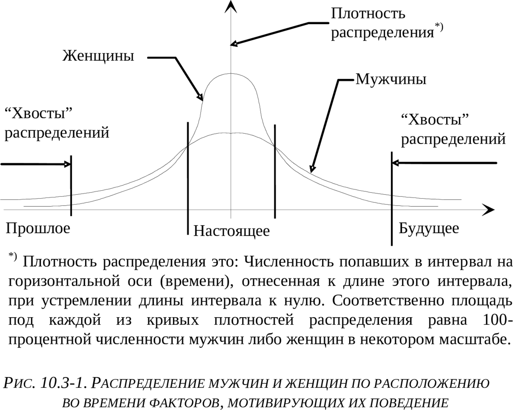

> **Первичный текст.** «Основы социологии», том 3. Страница издания: стр. 109 PDF — кандидатная привязка, требует сверки.
> Источник: файл издания `osnovy-sociologii-tom-3.pdf` (PDF в выпуск не включён). Контрольные суммы и статус проверки — в [NOTICE.md](../../NOTICE.md).
> Содержание передаёт позицию авторов издания; утверждения не верифицированы библиотекой.

---

## 10.3. Культурологические оболочки животного типа строя психики[^116]

Начнём с публикации Светланы Кузиной в «Комсомольской правде» от 16.11.2002 г. «В душе мы по-прежнему обезьяны. *Так утверждает психолог Дмитрий Азаров»:*

«Как это ни прискорбно, Дарвин всё-таки был прав. Мы — не от Бога, мы — из джунглей.[^117] Оказывается, мы любим, завоёвываем авторитет, подчиняемся и ссоримся, в общем, строим свои отношения с окружающими по-обезьяньи. Миром до сих пор правит древний язык тела, жестов и мимики, на котором говорили когда-то наши лохматые предки. На уровне подсознания мы ему по-прежнему следуем.

**Чтобы бизнес пошёл, нужно вести его, как горилла**

*— Дмитрий Александрович, так с чего вы вдруг взяли, что мы недалеко ушли от своих диких сородичей?*

— Всё началось с того, что мы с коллегами однажды решили провести любопытный эксперимент. Мы собрали группу московских бизнесменов, у которых не очень ладились дела. И превратили их на время в обезьян. Две недели мы учили их азам древнего языка жестов и мимики, которые использовали наши далёкие предки. И в итоге через некоторое время у наших подопытных стало всё получаться! Бизнес пошёл в гору. Один из участников эксперимента с удивлением признался, что, оказывается, просто добиться уважения и доверия у окружающих людей: надо только посмотреть на мир через «обезьяньи очки».

*— И что же через них видно?*

— Как известно, Дарвин сегодня не в фаворе. Люди предпочитают думать о своём инопланетном или божественном происхождении. Но исследователи, анализируя повадки обезьян, неизбежно приходят к выводу: если мы и не являемся дальними родственниками мартышек, то своими манерами очень мало отличаемся от них. Например, вот как самец обезьяны назначает свидание самке? Это, как правило, происходит на поляне с одиноко стоящим посередине деревом или камнем, за которым можно спрятаться в случае опасности. Самец приходит чуть раньше и начинает нервно расхаживать по кругу, время от времени производя мочеиспускание — метит территорию. Самка же тем временем сидит в ближайших кустах — ждёт, когда самец подготовит поляну для свидания.

*— Так это же похоже на встречу влюблённых под часами или у памятника!*

— Вот именно. И также мужчина приходит раньше, а женщина вроде бы опаздывает, а на самом деле выжидает за углом, наблюдая за ходящим кругами возлюбленным. При этом он, сам не понимая почему, ужасно хочет в туалет. В этот момент в его организме (физиологи проверяли) температура мочевого пузыря поднимается на несколько градусов. А секрет прост — инстинкт повелевает самцу пометить территорию.

**10 минут глаза в глаза**

*— Обидны эти ваши аналогии…*

— Против фактов не пойдёшь. Мы провели ещё один эксперимент, в результате которого нам удалось сократить число бракоразводных процессов в семьях дальневосточных рыбаков. Об этом нас попросило местное начальство, которое было обеспокоено частыми семейными неурядицами, что отражалось на работе. Мы попросили мужей и жён каждый вечер смотреть друг другу в глаза не менее 10 минут. И что вы думаете: в семьях рыбаков наступили мир и благодать!

*— Только из-за детской игры «кто кого переглядит»?!*

— Секрет — в той же обезьяньей природе. Среди самцов пристальный и долгий взгляд означает вызов, а в сочетании с улыбкой (оскалом) ещё и угрозу. Поэтому рыбаки, находящиеся долгое время на корабле в мужском коллективе, инстинктивно выбирают максимально неконфликтную манеру поведения: глаза при встрече сразу отводятся в сторону. За месяцы плавания и путины это входит в привычку. И, вернувшись домой, мужчины продолжали отводить глаза, что жёнами расценивалось как сокрытие правды (изменил) или нелюбовь. И действительно, такое «поведение глаз» противоречит природе, поскольку любящий обезьяний самец при встрече с самкой смотрит ей в глаза. А у моряков просто выработалась привычка опускать глаза. Поэтому мы и предложили этим семьям поиграть в «гляделки».

**Вожак должен раздвигать ноги**

*— Ну в личной жизни мы все похожи на четырёхлапых. Но у нас есть интеллект, и мы посылаем корабли в космос. Как можно поставить знак равенства между нами и теми, кто сидит в зоопарке?*

— Большую роль в поведении людей играет психология, а не IQ[^118]. Высокоинтеллектуальны всего 10 процентов населения. Они же занимают большинство руководящих постов[^119]. И они же больше всего походят повадками на обезьян. Крутых обезьян. Например, «альфа-самец» — вожак обезьяньего стада — так же хорошо узнаваем среди своих «подчинённых», как и президент крупной фирмы. Его легко узнать, потому что он держится прямо, чтобы казаться более высоким, издаёт громкие звуки и подолгу смотрит собеседнику в глаза, не моргая.

*— Но одно дело — управлять хвостатыми, а другое — гомо сапиенс!*

— Нет никакой разницы! Правда, у разных пород обезьян методы управления сильно разнятся.

ВОЖАК ГОРИЛЛА относится к членам своего стада как к родным. Придя в ярость из-за бестолковости подопечных, он способен наорать. Но он не мстителен. Среди начальников таких людей сколько угодно.

ВОЖАК МАКАКА — страшный деспот, который занимает своё место благодаря физической силе и соблюдает жёсткую дистанцию в отношении с подчинёнными. Такого типа шефы обычно руководят большими концернами с пирамидальной структурой.

ВОЖАК ШИМПАНЗЕ наиболее способен манипулировать массами, так как умеет проводить гибкую политику. Менее заметный, чем другие обезьяньи вожди, более любезный и общительный шимпанзе правит благодаря своим союзникам и сообщникам. Напоминает это вам некоторых политических лидеров?

**ИЗ АРХИВА «КП»**

**Мы чешем голову, как шимпанзе**

В своей книге «Голая обезьяна. Человек с точки зрения зоолога» известный американский учёный Десмонд Моррисон доказывает, что человеческий вид не сильно отличается от обезьян. У нас, как и у них:

- Социальная иерархия: группой подчинённых управляет вожак. Когда он становится стар или слаб, его свергает молодой и сильный. И, несмотря на постоянную занятость, он неизменно остаётся самым ухоженным и сексуальным.

- Угрожая кому-то, мы стараемся казаться как можно выше ростом и мощнее. А желая продемонстрировать подчинение, отвешиваем поклоны.

- В моменты сильного волнения шимпанзе отчаянно чешет голову и лапы. Мы ведём себя точно так же, принимаясь приглаживать себя, поправлять одежду, причёску, кусаем ногти, пощипываем бороду или усы, чтобы забыть о волнении» (<http://www.kp.ru/daily/22676/22026/>).

Эта публикация, уведомляя, что нечто специфически обезьянье не чуждо казалось бы и высокоцивилизованному человеку, дополняет цитированную ранее в сноске в разделе 10.1.1 публикацию «Орангутаны — культурное племя», в которой речь шла о том, что нечто казалось бы специфически человеческое не чуждо и некоторым видам обезьян.

Но выявленные зоологами и психологами факты — объективная данность, и против них в таковом их качестве действительно «не попрёшь». Но осмысление фактов многовариантно в силу обусловленности субъективизмом, однако и при всей многовариантности возможного осмысления действует принцип «практика — критерий истины»:

Эта публикация — ещё одно подтверждение тому, что «Человек разумный» — принадлежит биосфере планеты, и то, что издревле именовалось «животным началом» и связывает его с биосферой Земли, человеку не чуждо и не является клеветническим измышлением, имеющим целью низвести человека до состояния животного. Вопрос только в том, какое место в психике индивида и в культуре общества должно занимать «животное начало», чтобы Земля стала планетой людей и перестал быть «планетой обезьян».

Т.е. низвести Человека до состояния животного способно только не подобающее место, которое «животное начало», свойственное «Человеку разумному», может занимать в организации психики индивида и в культуре общества.

В жизни всякого биологического вида главный комплекс инстинктов — инстинкты, на основе программ которых происходит воспроизводство вида в преемственности поколений. Это касается и двуполого биологического вида «Человек разумный». В его жизни функциональное назначение каждого из полόв различно, и это биологически-функциональное различие полόв находит своё выражение в особенностях врождённых инстинктов мужчин и женщин, о чём речь шла в разделе 9.4. Как следствие, это различие биологических функций обоих полόв некоторым образом должно выражаться и в культуре общества.

Культура, будучи порождением разума многих поколений людей, несёт в себе как «бесполые» составляющие, так и *обусловленные половыми особенностями людей составляющие, многие из которых по их существу являются <u>гибким многовариантным продолжением</u> инстинктивных однозначно-жёстких программ поведения*.

Известно, что в биосфере в воспроизводстве поколений видов на основе полового различия особей не последнюю роль играют инстинктивные программы привлечения особей противоположного пола и конкуренция среди особей одного и того же вида за лучшего партнёра по половым отношениям и территорию обитания; а также и инстинктивные программы охраны своей территории от особей своего же вида, но не принадлежащих своей семье (прайду), стае, стаду.

У разных видов активная роль в привлечении особей иного пола для продолжения рода, принадлежит либо самцам, либо самкам. Если искать аналоги такого рода в жизни человеческого общества, то практически всю историю Запада сопровождает история *женской* моды, *женской* косметики и парфюмерии и *женской* галантереи*.* Мужская мода, мужская косметика и парфюмерия и мужская галантерея не являются таким предметом обсуждения и внимания общества, как женские. (По крайней мере так было до начала XXI века).

Функционально по своему существу весь арсенал женской моды, косметики, парфюмерии и галантереи — продолжение в культуру инстинктивных программ привлечения партнёра для продолжения рода[^120]. По своему существу всё это взывает к половым инстинктам мужчин, в чём *неоспоримо* смогли убедиться многие жертвы изнасилований, которые своим видом, созданным ими же при помощи арсенала моды, косметики, парфюмерии и галантереи, смогли возбудить в ком-то из самцов поведение на основе половых инстинктов, которые те не смогли сдержать (либо же вообще не привыкли сдерживать, поскольку вся их психика подчинена инстинктам).

Для животного строя психики женщин характерно стремление к тому, чтобы выделиться на фоне других самок и привлечь к себе внимание как можно большего количества самцов. О том, какими личностными качествами обладают те, чьё внимание они объективно своим внешним видом и поведением способны привлечь, подавляющее большинство модниц не задумывается, слепо и бездумно следуя моде и её, — казалось бы неуправляемым, — капризам[^121]. Требования эстетики и функциональности в женской моде вторичны по отношению к задаче привлечения к себе внимания мужчин и возбуждения в них половых инстинктов.

По существу же в безудержном следовании моде (далеко не всегда функциональной в других отношениях, кроме как обратить на себя внимание, выделиться на фоне остальных самок) выражается инстинктивное, безумное и бессмысленное поведение многих женщин; то есть это — животное, а не осмысленно-человеческое целесообразно ориентированное поведение, либо же вообще одержимость.

В отличие от женщины-обезьяны, женщина-человек должна уметь вести себя и должна вести себя так, чтобы быть желанной только любимому ею, в ком она уже с самого начала их взаимоотношений предвидит будущего достойного отца их детей, оставляя равнодушными к себе всех — даже сексуально озабоченных — самцов в окру́ге. Аналогичным образом должен уметь вести себя и должен вести себя и мужчина, если он не человекообразный «обезьян».

Исторически реально женская мода, а тем более «высокая» мода, превратилась в порнодейство, с которым все свыклись. Это не нежный эрос.

———————

Отличие порнодейства от эроса в том, что:

- порнодейство персонально-безадресно ориентировано на возбуждение половых инстинктов в толпе;

- а эрос персонально-адресно *обращён единственно* к любимому человеку, **обязательно иного пола**.

———————

Этот критерий отличия позволяет утверждать, что порнодейство может быть эстетически обворожительным и чарующе совершенным, но не перестанет быть от этого порнодейством; а одно и то же действие, в зависимости от сопутствующих ему обстоятельств, может быть как гнусной порнухой, направленной на уничтожение достоинства человека, так и эросом, возносящим чету, преисполненную Любви, над суетой этого Мира.

———————

Назначение различных порнодейств в шоу- и порно-бизнесе в современной политической культуре толпо-«элитаризма» простое — возбуждая половые инстинкты у множества людей в неуместной для их проявлений обстановке, сбрасывать их в животный тип строя психики, что поддерживает толпо-«элитаризм» и упрощает управление массой человекообразных, поскольку носители животного типа строя психики наименее дееспособны в отношении продолжительных процессов, которые составляют основу и суть политики.

———————

Женщина-модница, тем более под покровом утончённой культуры (в особенности «элитарной»), конечно не столь явное животное как откровенно похотливая неотёсанная потаскуха, но при определённом взгляде отличие между ними только в культурологических оболочках и продолжениях одних и тех же половых инстинктов, не подвластных осмысленной воле их обеих.

Если кто-то поймёт всё сказанное так, что безвинные мужики страдают от тайной власти над их психикой дурных женщин, то в действительности он ничего не понял: представители обоих полов в их бездумной подчинённости поведения животным инстинктам порочны, а по своему существу представляют собой недолюдков.

Если кто-то, ознакомившись с высказанными воззрениями на сложившийся институт моды, решит, что нашим идеалом является одеть всех в кое-как сработанную серую униформу, например в ватники, то он тоже ничего не понял. Красота одежды, внешнего вида и поведения человека — это одно, а порнодейство моды — это совсем другое.

Соответственно, если мужчина через половые инстинкты подчинён женщине с животным типом строя психики, в поведении которой преобладают животные инстинкты и их культурные продолжения и оболочки (типа женской моды), то его поведение также весьма далеко от человеческого. И так под гнётом животных женских инстинктов живёт на протяжении веков вся библейская цивилизация — Запад: Европа, обе Америки и Австралия[^122].

Ведический (Индия, государства, где распространён буддизм) и коранический Восток живут несколько иначе. Ведический Восток несёт древнюю культуру воспитания разного рода самодисциплин, которые не допускают разгула животных инстинктов и социально обусловленных страстей, но они ориентированы главным образом *на высшие в структуре толпо-«элитаризма» сословия и касты, если в них действует культ принципа «положение обязывает…»*[^123].

В коранической же культуре дело обстоит сложнее.

Во времена пророка Мухаммада, женщины не носили ни чадры, ни паранджи, и не были узницами гаремов, как это сложилось в исторически реальных мусульманских культурах разных стран в течение последующих веков. Коран не предписывает ничего такого. Но чадра, паранджа, затворничество в гаремах и то исторически реальное бесправие женщины, низведённой до положения вещи-собственности мужчины, которое воспроизведено в художественных образах фильма «Белое солнце пустыни», это — доведение до своей абсурдной противоположности действительно существующей коранической рекомендации, чтобы каждая девушка и женщина вела себя скромно и не стремилась обратить на себя внимание *множества мужчин* обилием драгоценностей, броской косметикой и одеждой, тем самым возбуждая в них половые инстинкты, неуместные вне ситуаций уединения супругов, и подчиняя себе мужчин через них и низводя общество людей до положения человекообразных. Чтобы не быть голословным, приведём прямо сказанное в Коране:

«И скажи \[женщинам\] верующим: пусть они потупляют свои взоры, и охраняют свои члены, и пусть не показывают своих украшений, разве только то, что видно из них, пусть набрасывают свои покрывала на разрезы на груди, пусть не показывают своих украшений, разве только своим мужьям, или своим отцам, или отцам своих мужей, или своим сыновьям, или сыновьям своих мужей, или своим братьям, или сыновьям своих братьев, или сыновьям своих сестёр, или своим женщинам, или тем, чем овладели их десницы[^124], или слугам из мужчин, которые не обладают желанием, или детям, которые не постигли наготы женщин; и пусть не бьют своими ногами, так чтобы узнавали, какие они скрывают украшения. Обратитесь все к Богу, о верующие, — может быть, вы окажетесь счастливыми!» (сура 24. «Свет», аят 31, в переводе И.Ю. Крачковского с заменой арабского слова «Аллах» русским словом «Бог»).

То есть по существу Коран изначально порицал разнородные порнодейства и рекомендовал, чтобы культура общества была по-человечески осмысленной, чтобы она не строилась в ублажении несдерживаемого разгула половых инстинктов женщин, довлеющих через половые инстинкты над психикой мужчин, а тем самым подчиняющих животным инстинктам культуру и жизнь всего общества в целом.

Однако в условиях, когда обрядность подменила собой смысл религии, мир исторически реального ислама тоже живёт под диктатом инстинктов. В противном случае было бы невозможно то, о чём сообщалось в разделе 9.4, как Венеция в средние века провела не одну успешную операцию, в которых дочери семей венецианской «элиты» якобы случайно попадали в плен к туркам во время морских путешествий, после чего продвигались на должность «любимой жены» турецкого султана, со всеми вытекающими из этого факта последствиями, как то: утечка из Стамбула стратегической информации, важной для Венеции, и воздействие Венеции на политику Турции — кадровую, торговую, внешнюю и т.п.

Конкуренция и борьба за наилучшую территорию между особями многих видов, в животном мире запрограммированная в соответствующие инстинкты, в обществе также имеет свои культурологические оболочки и продолжения и выглядит как конкуренция за обладание собственностью, за обеспеченность жилища разными природными и произведёнными благами.

Рукотворное жилище — аналог территории обитания в природе и место пребывания матери и подрастающих поколений. Так обустройство жилища оказалось в ведении женщины. Соответственно и гонка безудержного стяжания, в которой на протяжении веков лидирует Западная цивилизация, поскольку в ней она подхлёстывается ростовщичеством, предписанным Библией расовой еврейской международной «элите»[^125], является культурным продолжением также преимущественно женских инстинктов. Превосходство над роднёй, знакомыми и друзьями в обустройстве и убранстве жилища и т.п. гораздо более интересует женщин, чем мужчин, и гораздо более ценимо ими, нежели мужчинами. И это — один из генераторов гонки потребления и глобального биосферно-экологического кризиса.

Кроме специфики инстинктивных программ поведения мужчин и женщин оба пола отличаются статистически по хронологической ориентации своего поведения.

Обратимся к рис. 10.3-1 (ниже по тексту). На нём показано распределение мужчин и женщин по привязке мотивов их поведения к хронологической оси; ориентируясь на свойственную каждому из них хронологическую привязку этих мотивов, мужчины и женщины строят своё поведение вне зависимости от того, осознают они хронологическую обусловленность их деятельности или нет. Рисунок — схематичный, а не масштабный: то есть на нём показаны только характерные отличия статистик, описывающих типы *<u>психики мужской и женской составляющих</u>* человеческого общества, но не численные значения каждой из групп мужчин и женщин, ориентирующих своё поведение на тот или иной интервал, расположенный на оси времени. На оси времени от глубокого прошлого до весьма отдалённого будущего также нет единиц измерения.

Тем не менее, на рисунке можно видеть три интервала на оси времени, весьма отличных один от другого по численному преобладанию в них мужчин и женщин. Назовём их условно «Прошлое», «Настоящее», «Будущее».

«Настоящее» — это та область, в которой сосредоточились те, кто, метафорически говоря, «живёт сейчас»: сегодня доделывает то, что следовало завершить ещё вчера; что-то делает сегодня насегодня и «ищет зонтик назавтра потому, что пообещали дождь».

Среди этой категории довольно много людей, которые в «Настоящем» не думают о том, что ныне они пожинают плоды своих прошлых поступков и бездействия; а также не думают о том, что совершаемое ими ныне *неизбежно* принесёт свои плоды в будущем. Это бессмысленное отношение к прошлому и к будущему приводит к тому, что многие из них *по своему дурному нраву* в прошлом посеяли то, что неприемлемо для них сейчас, а сейчас сеют и взращивают то, что будет неприемлемо для них в будущем.

При этом — в силу *общности и целостности мира для всех людей* — с дурными последствиями их безоглядности и непредусмотрительности так или иначе приходится сталкиваться не только им самим, но и многим другим.

В общественной жизни эта полоса «Настоящее» на оси времени занимает интервал примерно от «две недели тому назад» до «спустя две недели» и включает в себя разного рода оперативную реакцию на поступающую житейскую информацию, которая утрачивает значимость примерно в течение двух — трёх недель для подавляющего большинства людей.

Интервалы «Прошлое» и «Будущее» математически идентичны в том смысле, что это — «хвосты» статистических распределений. В правом и левом «хвостах» в совокупности сосредоточена весьма малая доля статистики: в общей сложности в пределах 3 — 5 % от общего количества наблюдаемых единичных явлений. Но, как заметил К. Прутков, от малых причин бывают большие последствия.

В «Прошлое» попали те, кого А.С. Грибоедов в «Горе от ума» охарактеризовал словами: *«Сужденья черпают из забытых газет времён очаковских и покоренья Крыма»*[^126]. Это те люди, которые пытаются втащить в настоящее не то, что нормы вчерашнего дня, а нормы прошлого века или даже позапрошлых тысячелетий. В политике они являются действительными реакционерами и ретроградами.

В «Будущее» попали те, в чьём поведении преобладает индивидуальная и коллективная деятельность, плоды которой возможны в весьма *отдалённом — по меркам бытовой повседневности* — будущем: спустя годы, десятилетия, столетия, тысячелетия.

Следует сделать особую оговорку: распределения представлены в привязке мотивов поведения ко временны́м интервалам, а не по критериям Добра и Зла, Хорошо либо Плохо. Опыт истории показывает, что в прошлом не всё было плохо, в сопоставлении с настоящим, и в будущем не всё будет столь хорошо, как это представляется ныне, опять же с точки зрения осуществления сегодняшних идеалов. И хотя, известно утверждение: «Что ни делается — всё к лучшему», — тем не менее в обществе есть и дальновидные злодеи[^127], которые по характеру их деятельности попадают в группу «Будущее». То есть от бессознательного и во многих смыслах правильного автоматизма восприятия «Будущее» = «хорошо», «Прошлое» = «плохо» по отношению к рассматриваемому рисунку следует отстроиться. Есть и те, кто помнит благие достижения прошлого и против того, чтобы они были утрачены или искоренены в настоящем и будущем.

Рис. 10.3-1 интересен тем, что показывает качественные различия в мотивации поведения, обусловленные свойствами психики мужской и женской составляющих общества: то есть в мотивации поведения множества мужчин и множества женщин, а не в мотивации поведения конкретного отдельно рассматриваемого человека, который вне зависимости от его пола может реально принадлежать всякому интервалу на оси времени разные периоды своей жизни может смещаться вдоль хронологической оси в ту либо в иную сторону. В полосе «Настоящее» женщины численно преобладают над мужчинами, а в «хвостах» распределений наоборот: мужчины численно преобладают над женщинами. Но эти особенности распределений полов по хронологической мотивации поведения их представителей выражаются во множественных явлениях жизни общества.

Те, кто ориентируется в своём поведении на полосу «Настоящее», не воспринимают течения продолжительных процессов или не осознают их значимости и потому не способны управлять ими, хотя в ряде случаев способны интуитивно бессознательно найти в них своё место, в котором им комфортно.

Эти особенности психологии полов проявляются как в общественной жизни в целом, так и в политике. Политика, если это политика устойчивого при смене поколений общества, предполагает памятливость о далёком прошлом и дальновидность в отношении будущего. Если этого нет, то общество сталкивается с непредвиденными ситуациями или повторением уже забытых прежних, к которым оно оказывается не готово, вследствие чего терпит ущерб вплоть до исчезновения его из последующей истории.

Если эту необходимость памятливости и дальновидности в политике рассматривать, соотнося с рис. 10.3-1, то понятно и численное преобладание мужчин среди политиков исторически устойчивых культур, и исчезновение локальной цивилизации амазонок, о которых сообщают мифы древних греков. Тем не менее, если традиции и законодательство общества налагают запрет на публичную политическую деятельность женщин, то женщины, численно уступающие мужчинам в «хвостах» распределений («Прошлое» и «Будущее» на рис. 10.3-1), порождают исключительно женские субкультуры: гетеры древней Греции, хозяйки великосветских салонов феодальной и ранне-капиталистической Европы и Америки, гейши Японии и т.п. Во всех этих специфически женских субкультурах секс вне супружества, если и имел место, то не был целью их существования: главным было поговорить о серьёзных вещах в жизни общества, в том числе — и вне официального протокола государственной деятельности. И такого рода исключительно женская субкультура в полноте культуры породившего её общества дополняет *безымянную субкультуру мужчин*, принадлежащих тем же самым «хвостам» распределений.

Круг интересов и деятельность малочисленной группы мужчин и женщин, по своей хронологической мотивации поведения оказавшихся в «хвостах» распределений, чужд подавляющему большинству общества, сконцентрировавшемуся в полосе «Настоящее» и вокруг неё, поскольку с их точки зрения вся деятельность тех, кто сосредоточился в «хвостах» распределений, весьма далека от реальных жизненных проблем, т.е. от «прямо сейчас ± две недели». Поэтому не каждая женщина и не каждый мужчина из полосы «Настоящее» способны преодолеть мировоззренческую пропасть и войти в субкультуру, свойственную крайностям распределений, что и объясняет своеобразие и *неподражаемость* женских субкультур гетер, хозяек салонов, гейш, дополняющих безымянные мужские субкультуры того же хронологического диапазона мотивации поведения, существующие казалось бы в явном «патриархате».

Эта особенность статистик распределения мужчин по хронологической привязке мотивов и целей их деятельности, связана и с инстинктивными программами «борьбы за лучшее место под солнцем», заложенными в психику женщин. Если женщина невольница своих инстинктов, то преобладающая среди женщин ориентация поведения на полосу «Настоящее» на рис. 10.3-1, в этом случае обретает конкретное выражение: *«У них есть — у нас нет... Хочу сейчас... Ты не можешь обеспечить семью всем необходимым, чтобы нам жить не хуже, чем другие люди*[^128] *живут...»* Это не обязательно выговаривать вслух — достаточно, чтобы этот смысл вкачивался в эгрегор семьи, и под воздействием животного типа строя психики женщины, главенствующей в семье, он действительно вкачивается.

При этом, если деятельность мужчины направлена на поддержание долгосрочных процессов, то с точки зрения сиюминутного инстинктивно обусловленного женского деспотизма эта деятельность в «прямо сейчас» — лишение «ейным» *мужчиной, которым она обладает как собственностью,* и её самой, и также *собственной её* семьи чего-то желанного ЕЙ прямо сейчас, но никак не забота о будущем благополучии всех и в том числе и её самой, и семьи в целом.

В массовой статистике такого рода инстинктивно обусловленный близорукий диктат в отношении мужчин, обеспечивающих жизнь семьи, но в то же время и невольников половых инстинктов, подчиняющих их женщине, выливается в безоглядно беззаботное обгладывание ЖИВОЙ ПЛАНЕТЫ на протяжении многих веков. В итоге — глобальный биосферно-экологический кризис, порождённый Западной региональной цивилизацией скрытного матриархата, обглодавшей всю планету, исходя из сиюминутного агрессивно-паразитического вожделения одних самок превзойти в потребительстве других самок трудами подневольных им через инстинкты самцов.

И подчинённость поведения именно женщины *животным инстинктам конкуренции* за лучшее место в среде обитания не знает ни меры самоограничения, ни благодарности: **«Воротись, поклонися рыбке. Не хочу быть вольною царицей, хочу быть владычицей морскою, чтобы жить мне в Окияне-море, чтоб служила мне рыбка золотая и была у меня на посылках»**.

Это тоже не выдумано А.С. Пушкиным, а взято из жизни подобно многим сюжетам сказок про старуху и старика, через инстинктивные связи раздавленного женским слепым деспотизмом, которые когда одиноки, а когда им сопутствуют в их жизни дети: «Золушка», «Морозко», «Сестрица Алёнушка и братец Иванушка» и многие другие сказки содержат аналогичные сюжеты в культурах разных народов, живущих в разных регионах планеты и вряд ли когда-либо до ХХ века общавшихся друг с другом.

Персонажи-мужчины, с такими слепыми в отношении будущего и при этом деспотичными характерами, просто не выпирают и не запоминаются во всём обилии персонажей сказок, выражающих многовековые обобщения народами статистики своего жизненного опыта, хотя такие типы подчас тоже встречаются в жизни.

Ещё одна проблема — конфликты свекровей и невесток. Если обе женщины живут под властью инстинктов, то один и тот же мужчина:

- для одной — *исключительно её собственный* сын, которого она старается удержать в своей власти на основе комплекса инстинктивных программ материнско-детских взаимоотношений,

- а для другой — *исключительно её собственный* муж, которого она старается удержать в своей власти на основе комплекса инстинктивных программ размножения биологического вида.

Конфликт возникает, когда обе женщины инстинктивно претендуют (осознанно или бессознательно — не принципиально) на то, чтобы занять пост «главы рода», и может быть завершён либо победой одной из них в борьбе за этот пост[^129], либо обретением власти над своими инстинктами хотя бы одной из них на основе перехода к демоническому или человечному типу строя психики. При этом неразрешённый конфликт взаимоотношений «свекровь — невестка» настолько психологически гнетущ и тёмен, что про него нет даже анекдотов типа анекдотов про взаимоотношения тёщи и зятя.

Конфликт между невестками, ссорящими братьев, обусловлен тем же: инстинктивно обусловленной борьбой невесток за статус «главы рода».

Но в культуре современного общества имеются продолжения не только женских инстинктов привлечения партнёра, удержания его и борьбы «за лучшее место под солнцем», но и продолжения и оболочки половых инстинктов самцов. Так, в стаде павианов иерархия их «личностей» выстраивается на основании того, кто кому безнаказанно показывает половой член. Соответственно, бездумно привычный общероссийский мат, в прошлом атрибут преимущественно мужской субкультуры: «Я тебя …»; «А вот тебе …»; «Я на вас всех ... положил» — продолжение стадно-обезьяньего, животно-инстинктивного в культуру общества тех, кому Свыше дано быть людьми — наместниками Божьими на земле. Обезьянам не дано быть людьми; россиянам же дано — в этом разница.

И «Человеку разумному» — вне зависимости от пола — не дόлжно унижаться в организации своей психики до уровня организации психики обезьян. Соответственно, матерщина — внешне видимое выражение психики, свойственной недолюдкам обоих полов[^130].

Но, если кто-то захочет поупражняться в связи со сказанным в расизме в отношении русских и россиян, то ему следует знать, что специфически русско-татарский мат — не единственное продолжение в культуру животных инстинктов. Посостязаться между собой на глазах женщин в разного рода достоинствах (физическая сила, толстый кошелёк[^131], «блеснуть умом» и т.п.) — часто встречающееся во всех культурах мужское занятие, но также обусловленное половыми инстинктами и психологической зависимостью через них от женского одобрения.

В прошлом в цивилизованной Европе это выражалось в рыцарских турнирах, а потом в спортивных состязаниях, до конца XIX века бывших преимущественно мужскими по составу участников. Массовый же обоеполый спорт как одна из составляющих физической культуры и здорового образа жизни — это уже достижение ХХ века, — как и трансформация физической культуры в профессиональный спорт, ставший весьма вредоносной отраслью шоу-бизнеса.

И вся внутриобщественная иерархия личностных взаимоотношений и угнетения одних людей другими — продолжение в культуру того же рода животных инстинктов, на основе которых в стаде павианов выстраивается иерархия их «личностей»: кто кому безнаказанно демонстрирует половой член, а кто согласен с этим или по слабости вынужден принимать это как должное, а равно — и как якобы неизбежное. Это стадно-стайное обезьянье *«я на всех вас член положил» + подневольность психики «член положивших» весьма узкому кругу самок, вертящих их «членами»,* продолжаясь с инстинктивного уровня психики в более или менее свободно (деятельностью разума) развиваемую культуру тех, кому Свыше дано быть людьми, обретает в ней свои оболочки, которые только и меняются на протяжении исторического развития общества человекоподобных носителей нечеловечного строя психики.

К такого рода оболочкам принадлежат большей частью нормы этикета как молчаливо традиционные, так и прописанные юридически, а также — вся совокупность «статусных предметов и *знаков*[^132]*»,* главное назначение которых — обозначать положение индивида (или группы) в иерархии личностей в организации общества, хотя наряду с этим они могут выполнять и другие функции. Потребность в этом возникает вследствие того, что если все обезьяны в стаде знают друг друга и знают свой и чужой статус, то в толпо-«элитарном» обществе, где друг друга все не знают, общение ранее незнакомых индивидов начинается с выяснения социального статуса. В процессе выявления статуса — наличие статусных предметов и знаков, этикета избавляет человекообразных от необходимости вступать в тот или иной поединок с целью определения статуса. Но инстинктивная подоплёка при наличии этикета и системы «статусных предметов и знаков» никуда не исчезает.

В частности посвящение в рыцари во времена средневековья сопровождалось возложением меча на правое плечо возводимого в рыцарское достоинство. В менее возвышенных формах, обнажающих инстинктивную подоплёку внешне торжественного ритуала, всё посвящение в рыцари сводится к одной фразе: *«Я на вас меч положил и ваш долг служить мне»,* — в которой осталось одно слово из трёх букв заменить другим словом из четырёх букв (либо из трёх), после чего «элитарный» ритуал посвящения будет неотличим от наведения порядка «главным» павианом в его стаде.

Все законы «об оскорблении его императорского (или королевского) величества» — аналогичны репрессиям со стороны «главного» павиана в стаде в отношении тех, на кого демонстрация им члена не производит ожидаемого впечатления, не вызывает в них прилива верноподданности, и кто не прочь при случае продемонстрировать член и самомý «главному павиану» (или «главной павианихе») или же надругаться над ними фактически, тем самым опустив их по иерархии стаи.

Эпизод с утверждением своего главенства, аналогичным павианьему, находим и в «Словаре живого великорусского языка» В.И. Даля в статье «СОРОМЪ»:

«Болеслав, городу взяшу, ятровь свою облупи (обнажил) и учини соромоту велику брату своему Кондратови» (издание 1882 г. и репринтные переиздания на его основе: т. 4, с. 275, 276, — В.И. Даль приводит цитату из не названной им летописи).

Ятровь — жена брата, деверя, шурина. Т.е. в данном случае «главный павиан» глумится над супругой своего брата, показывая всем, что именно он — «хозяин и повелитель» всех самок стада, а остальные самцы могут выступать в таковом качестве только с его соизволения и под его покровительством, а самки тоже должны знать, кто их истинный «хозяин и повелитель». Это полностью соответствует поведению «альфа-самца» в обезьяньем стаде (стае).

Продолжения в культуру и культурологические оболочки такого рода инстинктивных программ поведения изменялись в ходе развития цивилизации. В частности, законоуложения времён обнажённо силового рабовладения древности отличаются от законоуложений высокоцивилизованного «гражданского общества» наших дней, живущего в системе финансового рабовладения и законодательства об «авторских и смежных правах» (см. раздел 8.6): рабские ошейники, кандалы и клейма, которыми рабы тяготились, а свободные боялись увидеть их на себе в случае поражения в войне либо утраты социального статуса по иным причинам, — давно вышли из массового употребления; но в обиход входят кредитные карты, иметь которые вместе с по возможности большей суммой на счёте — желают многие.

Т.е. при сохранении преобладания в статистике животного типа строя психики и его надстроечных модификаций (типов строя психики зомби и демонического) в жизни толпо-«элитарного» общества изменяются только средства и способы построения иерархии личностного угнетения и перераспределения продукта, производимого в общественном объединении труда.

Иными словами, в основе толпо-«элитаризма» лежит «животное начало», не обузданное осмысленной волей *человека, устремлённого воплотить в жизнь избранную им самим для себя долю Промысла Божьего,* и сопутствующие «животному началу» разного рода культурологические скрепы.

Наличие разнородных культурологических скреп, их смена и воспроизводство в ходе исторического развития обществ приводит к вопросу о сути вероучений и религий на их основе, под властью которых живут общества, — в частности потому, что большинство вероучений:

- с одной стороны — провозглашают, что человек по сути его — не животное;

- а с другой стороны — исторически реальные общества под властью этих вероучений живут так, что объективно свойственное людям «животное начало» выражает себя в толпо-«элитарной» организации общества, в которой нет места Человеку — носителю человечного типа строя психики.

Это обстоятельство даёт основание полагать, что:

Вероучения, господствующие над жизнью толпо-«элитарных» обществ, порождают псевдорелигии идеалистического атеизма, разрывающие жизненный диалог человека и Бога о смысле Промысла и миссии человека и человечества в Промысле и подменяющие его чем-то иным. И потому необходимо выявить и понять суть псевдорелигий и их отличие от истинной религиозности.

[^116]: Этот раздел написан с использованием фрагментов работы «От человекообразия к человечности…».

[^117]: Об этом же парадоксе бытия человечества в нынешнюю эпоху сказано и в Коране: «И вот, сказал Господь твой ангелам: “Я установлю на Земле наместника”. Они сказали: “Разве Ты установишь на ней того, кто будет там производить нечестие и проливать кровь, а мы возносим хвалу Тебе и святим Тебя?” Он сказал: “Поистине, Я знаю то, чего вы не знаете!”» (сура 2:30).

    Но главное: ссылки атеистов в этом вопросе на Ч. Дарвина — клевета на него, и проистекает она из того, что его фундаментальный труд *«О происхождении видов путём естественного отбора или сохранении благоприятствуемых пород в борьбе за жизнь»* мало кто читал; а из тех, кто читал, большинство не обратило внимание на ключевые для понимания вопроса «мелочи». С «дарвинизмом» большинство знакомо в пересказе «популяризаторов» — вульгаризаторов и извратителей.

    Хотя этические нормы научного сообщества к середине XIX века уже не допускали в работах по естествознанию писать о Боге и проявлениях Его воли в жизни Природы, тем не менее Ч. Дарвин *в нескольких местах* названного выше труда пишет о Боге, как о Творце, власти которого в Мире подчинено всё, в том числе и эволюционный процесс биосферы планеты. В частности: «тот, кто верит, что каждый вид лошадей был создан независимо от остальных, будет, вероятно, утверждать: во-первых, каждый вид был создан с наклонностью варьировать как в естественных условиях, так и при доместикации в указанном специальном направлении, так что часто становился полосатым, подобно другим видам этого рода; и, во-вторых, каждый вид был создан с сильно выраженной наклонностью к тому, чтобы при скрещивании с видами, живущими в отдалённых частях света, образовать гибриды, сходные по своей полосатости не со своими родителями, а с другими видами того же рода. Допустить такой взгляд значило бы, как мне кажется, отказаться от действительной причины ради мнимой или, по крайней мере, неизвестной. Он превращает **творения бога** (выделено нами жирным при цитировании: хотя в советском издании слово «Бог» начато строчной буквой, но смысл однозначен: Бог — Творец) в насмешку и обман; я мог бы почти с таким же успехом согласиться с невежественными творцами древних космогоний в том, что ископаемые раковины никогда не были живыми, но созданы из камня в подражание моллюскам, живущим на морском берегу» (приводится по интернет-публикации на основе издания: Ч. Дарвин. Сочинения, т. 3. Изд-во АН СССР, Москва, 1939:).

    При более широком взгляде, чем это свойственно всем тем, кто понимает библейский рассказ о сотворении Мира буквально, теория эволюции и учение о сотворения мира — не альтернативы. Ещё в 1872 г. А.К. Толстой (по всей видимости один из немногих, кто понял произведение Ч. Дарвина адекватно) писал в «Послании М.Н. Лонгинову о дарвинисме»: *«Способ, как творил Создатель, / Что считал Он боле кстати — / Знать не может председатель / Комитета по печати // Ограничивать так смело / Всесторонность Божьей власти — / Ведь такое, Миша, дело / Пахнет ересью отчасти! // Ведь подобные примеры / Подавать — неосторожно, / И тебя за скудость веры / В Соловки сослать бы можно!».*

    12 февраля 2009 г. исполнилось 200 лет со дня рождения Ч. Дарвина. В преддверии этой даты Ватикан фактически согласился с мнением А.К. Толстого: «Эволюционная теория Чарльза Дарвина не противоречит христианскому вероучению, признал Ватикан накануне 200-летия со дня рождения великого учёного. Основы эволюционизма можно проследить у святого Августина и Фомы Аквинского, заявил глава Понтификального совета по культуре Джанфранко Равази. (…) Равази отметил, что теория Дарвина никогда не подвергалась официальному осуждению со стороны Римско-католической церкви. “Я утверждаю, что идее эволюции есть место в христианской теологии, — согласился с ним Джузеппе Танцелла-Нитти, профессор теологии из понтификального Университета Санта-Кроче в Риме.

    В марте под эгидой Святого престола пройдёт знаковая конференция, посвященная 150-летию выхода в свет дарвиновского “Происхождения видов”. Изначально даже ставился вопрос об исключении обсуждения доктрины креационизма из повестки дня. В итоге она будет рассмотрена лишь как “культурный феномен” на одном из непленарных заседаний» (<http://www.newsru.com/world/11feb2009/darwin.html>).

[^118]: IQ — intelligence quotient, коэффициент интеллекта. Оценка развитости интеллекта индивида относительно уровня интеллекта среднестатистического человека такого же возраста, выявляемая на основе специальных тестов. Порождение психологической науки Запада (наше пояснение при цитировании). Главная проблема IQ в том, что согласно «уровень интеллекта среднестатистического индивида того же возраста» — не абсолютная, а относительная: если население в целом глупеет, то она будет снижаться относительно некоего не выявленного абсолютного уровня оценки интеллектуальной мощи.

[^119]: Это — весьма сомнительное утверждение, в особенности в России, где массовая глупость представителей правящей «элиты» — норма на протяжении веков (наше пояснение при цитировании).

[^120]: Приведём курьёз, подтверждающий правоту сказанного. Журнал «Человек и закон» некогда опубликовал сообщение, что в Великобритании суд удовлетворил иск мужа о разводе на том основании, что до вступления в брак его супруга так интенсивно употребляла косметику, что создала у него ложное представление о своей привлекательности в качестве женщины.

    О том же анекдот:

    *— Папа, скажи, как ловят сумасшедших?*

    *— С помощью обворожительных улыбок, причёсок, помады, духов, модных платьев и красивого белья, сынок.*

[^121]: Кроме того, мода не безопасна для здоровья. Один из примеров — статья Юлии Ларионовой «Красивые губы — больная печень» в еженедельнике «Курьер», № 28 от 20 — 26 июля 2000 г.:

    «Когда выбираете помаду, стоит обратить внимание не только на её оттенок, но и на состав. Медики и экологи предупреждают: многие помады делают на основе вредных синтетических веществ. Из них приготовит помаду гораздо проще, чем из натуральных масел, работа с которыми требует большого мастерства, времени. Вот химики придумали много синтетических заменителей, которые действительно придают помаде улучшенные качества. Но если растительные средства безвредны, то минеральные масла, а также нефтепродукты оседают в печени, почках и лимфатических узлах, а это чревато многими болезнями, плохим самочувствием, способствует появлению синдрома повышенной усталости.

    А при длительном попадании используемого в средствах для губ кристаллического парафина начинаются воспалительные процессы в сердечных клапанах.

    Это относится не только к дешевой помаде, что продаётся на каждом углу, но и к продукции многих известных производителей косметики. Посмотрите на состав своей помады. Нефтяные продукты и химические жиры могут «прятаться» под видом парафина, микрокристаллического воска, петролатума (это вазелин, получаемый из нефтяных остатков), минеральных масел, церезита, methicon и других.

    Несколько лет назад Всемирная организация здравоохранения даже установила предельную норму — ежедневно человек может получать не более 0,01 миллиграмма минеральных масел на каждый килограмм своего веса. Но, используя губные помады, карандаши, блеск для губ, женщины невольно «съедают» гораздо больше и причиняют ущерб своему здоровью. (А при поцелуях до 70 % всей этой дряни поедают и мужчины: добавим мы при цитировании).

    Экологи и врачи считают, что фирмам надо полностью отказаться от использования вредных нефтепродуктов и идти по пути использования натуральных продуктов. Но фирмам это не выгодно».

    А кроме губных помад есть ещё и иные средства макияжа, шампуни, кремы, лосьоны, краски для волос, дезодоранты, зубные пасты и т.п., синтетические ткани и краски в белье в зонах потовыделения тела, разлагающиеся или растворимые пóтом, после чего они впитываются через поры в тело.

    Пресса сообщала — и это не противоречит возможностям химии и биохимии — о том, что выявлена обусловленность онкологической статистики бюстгальтерами из некоторых видов синтетических тканей; а всевозможные прокладки и тампоны, содержащие в себе химически реактивные составляющие, представляют собой ещё один фактор химического риска, а также генетического риска для будущих детей, воздействующий непосредственно на кожные покровы и слизистые оболочки половых органов девушек и женщин.

[^122]: Хотя к концу ХХ века выявилась и стала активно продвигаться в жизнь альтернативная тенденция: новой глобальной политической и бизнес- «элитой» должны стать гомосексуалисты и примкнувшие к ним прочие извращенцы всех стран. См. Приложение 9 — том 6 настоящего курса.

[^123]: Если положение не обязывает к тому, что до́лжно, то оно же и убивает…

[^124]: Подразумеваются служанки-рабыни. Но и это не заповедь рабовладения, а дань нравам эпохи.

[^125]: Рассеяние евреев — не печальное следствие «антисемитизма» древних римлян, а способ завоевания и управления Миром хозяевами библейского проекта порабощения человечества от имени Бога. См. Приложения 1 и 2.

[^126]: «Горе от ума» (первоначальное название «Горе уму») написано А.С. Грибоедовым в период с 1816 по 1828 г. Присоединение Крыма к Российской империи произошло в 1783 г., турецкая крепость Очаков была взята русскими войсками в 1788 г. и по завершении русско-турецкой войны 1787 — 1791 г. с 1792 г. стал русской крепостью.

[^127]: Но приведённое утверждение всё же справедливо, поскольку сопутствующие деятельности злодеев заранее непредсказуемые для них «побочные» и «сопутствующие» эффекты обесценят для них даже достигнутый результат, если они вообще смогут его достичь. Поэтому действительно, всё, что ни делается, — к лучшему.

[^128]: Вопрос о том, животный или человеческий строй психики у объектов подражания, т.е. являются ли действительно людьми объекты подражания, — в этом случае обычно не встаёт.

[^129]: Победа может выражаться как в достижении подчинения соперницы себе, так и в изгнании соперницы из своей семьи или в её физическом уничтожении (хотя смерть может представляться с точки зрения медицины и юриспруденции естественной, однако эта «естественность» имеет свою основу в доведении до смерти алгоритмикой семейно-родовых эгрегоров, в которой взаимодействуют друг с другом обе женщины).

[^130]: Мистико-сакральные аспекты матерщины мы оставим в стороне, отметив, что в повседневности им нет места. Они, если и бывают уместны, то только в условиях некой чрезвычайщины. Однако человек — т.е. индивид, пребывающий при человечном типе строя психики, — и в условиях чрезвычайщины способен обойтись без сквернословия.

[^131]: **«С богатыми мужчинами женщины испытывают больше оргазмов.**

    Учёные пришли к выводу, что удовольствие, получаемое женщиной от занятий сексом, напрямую зависит от размеров банковского счёта партнера, пишет [The Times](http://www.timesonline.co.uk/tol/news/uk/science/article5537017.ece).

    Они заключили, что чем состоятельней мужчина, тем чаще его партнёрша испытывает оргазм.

    “Частота женских оргазмов увеличивается вместе с доходами партнёра”, — утверждает психолог, проводивший исследование, доктор Томас Поллет из Университета Ньюкасла.

    Доктор Поллет и его соавтор, профессор Дэниэл Неттл полагают, что феномен “эволюционной адаптации”, присущий женщинам, заставляет их выбирать мужчин на основе их положения в обществе.

    Учёные использовали Китайское исследование по вопросам семьи и здоровья, созданное на основе откровенных интервью пяти тысяч человек. Как отмечает Джонатан Лик, данные исследования подтвердились предыдущими опросами, проведёнными в Германии и Америке» (Источник: [The Times](http://www.timesonline.co.uk/tol/news/uk/science/article5537017.ece) 19.01.2009 г.;  
    <http://www.inopressa.ru/article/19Jan2009/times/men.html>).

[^132]: Социально-функционально аналогичных нанесению определённых татуировок в первобытных обществах, живущих в тёплом климате. Атавизм этого в цивилизованных обществах — татуировки в криминальной среде, выполняющие функцию маркеров-идентификаторов, обозначающих статус их носителей для «коллег по цеху».
---

[← Назад](../subsections/ch-10-s10-02-02.md) · [Оглавление тома 3](../README.md) · [Вперёд →](ch-10-s10-04.md)
