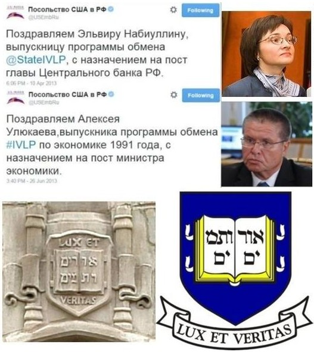

> **Первичный текст.** «Основы социологии», том 4. Страница издания: стр. 263 PDF — кандидатная привязка, требует сверки.
> Источник: файл издания `osnovy-sociologii-tom-4.pdf` (PDF в выпуск не включён). Контрольные суммы и статус проверки — в [NOTICE.md](../../NOTICE.md).
> Содержание передаёт позицию авторов издания; утверждения не верифицированы библиотекой.

---

# Приложение 4. Криптоколонизация: как это делается

Поскольку многие формально суверенные государства существуют в режиме криптоколоний на протяжении многих десятилетий, а то и нескольких веков, без проявления каких-либо тенденций к тому, чтобы обрести реальный суверенитет, включая и экономический. Во многих из них на протяжении всего времени их существования действуют и развиваются демократические институты: широкое избирательное право, многопартийность, свобода слова и т.п., которые однако не избавляют их общества от криптоколониального характера экономики.

Это обстоятельство ставит нас перед вопросом о том, как осуществляется и поддерживается криптоколониальный режим. Ещё раз обратимся к статье руководителя Центра по разработке комплексных экономических программ «Модернизация» Евгения Гильбо «Технократия должна выдвинуть компетентных национальных лидеров» (журнал «МОСТ», № 25, 1999 г.). В преамбуле к статье Е. Гильбо пишет:

«Существует две системы знаний о мире, а значит — и две системы образования. Первая система знаний предназначена для широких масс. Вторая — для узкого круга, призвание которого — управлять.

Исторически это различение[^327] прослеживается во всех типах культур, с системой образования которых мы знакомы. Уже в Древнем Египте образование для чиновников и низших жреческих каст значительно отличалось от того, во что посвящали узкий круг избранных, составлявших верхушку жреческой касты и окружение фараонов. В древней Месопотамии мы видим подобное же различение».

В самой же статье Е. Гильбо затрагивает вопрос и о содержании экономического образования наших дней:

«В экономическом образовании … существует фундаментальное отличие “экономики для клерков” и “экономики для хозяев”. Такие разделы последней, как косвенное управление на уровне правил, структура денежного обращения, косвенное стимулирование, макроуправление и т.п., в принципе остаются за пределами базового экономического образования. **Причина этого проста — функция “экономики для клерков” заключается в навязывании определённых стереотипов (часто близких к чистой мифологии), которые в сумме программируют предсказуемое поведение экономических субъектов. Аналогична, собственно, и функция публичной экономической науки. Существование предсказуемого поведения этих ребят обеспечивает условия для игры в системе тем, кто обладает знаниями из сферы высшей экономики** (выделено нами жирным при цитировании).

Аналогично обстоит дело во многих областях знания. (…) она (система подготовки клерков: наше пояснение при цитировании) не даёт никакого доступа к тем знаниям, на основе которых подлинные хозяева западного мира обеспечивают эффективное управление экономикой и устойчивое процветание своих стран»[^328].

Соответственно утверждению, высказанному Е. Гильбо:

Содержание социолого-экономического образования, предназначенного для обеспечения самоуправления *реально суверенного*[^329] государства во всех аспектах его жизни, включая и управление его хозяйственной системой, должно отличаться от содержания образования, предназначенного *сторонними политическими силами* для обеспечения эксплуатации криптоколонии, номинально управляемой её собственными общественными институтами. В противном случае перед криптоколонией откроются возможности достижения ею реального, а не формального суверенитета, в том числе и реального экономического суверенитета.[^330]

Но предположению о криптоколониальном характере социолого-экономического образования на основе достижений экономической науки «для клерков», развитой на Западе, неизбежно сопутствует вопрос: *А почему оно не осознаётся в таковом качестве ни научно-преподавательским сообществом, ни студентами?*

Ответ на этот вопрос уже был дан в части 3 настоящего курса (раздел 10.7, том 3), когда речь шла о зомбирующем характере образования. Здесь же, мы повторим честь текста раздела 10.7, чтобы показать глобально-политические последствия такого образования.

Дело в том, что в основе системы современного образования лежат тексты (большей частью — тексты учебников, написанных в соответствии с образовательными стандартами и традиционными воззрениями), а не практическая работа обучаемых (а также и многих преподавателей) в соответствующей отрасли деятельности на разных уровнях иерархии управления, в которой они на основе результатов своей работы могли бы судить о достоверности теорий, описывающих эту сферу жизни общества.

«Производственная практика» в период обучения носит краткосрочно-эпизодический характер и только отчасти дополняет освоение текстового материала. Она даёт обучаемым весьма общее и поверхностное представление о сфере деятельности, к работе в которой их готовит вуз, к тому же даёт представление с низовых уровней государственной иерархии должностей и компетенции, а *задачи криптоколонизации решаются на надгосударственном уровне управления, о котором в курсах социолого-экономического образования и истории не говорится ничего;* а такие трактаты как «Протоколы сионских мудрецов» дают заведомо ложное представление о процессах этого уровня, что тоже не позволяет обрести реальный и полный суверенитет на основе такого рода трактатов.

Поскольку никто в темпе освоения учебной программы не в состоянии проверить на истинность все мнения, высказываемые в учебниках в качестве достоверно установленных научных фактов, то изрядную долю учебного материала, хотим мы того либо же нет, сначала школьник, а потом — студент, принимает *без сомнений* и **без соотнесения с жизнью** в качестве научно установленной истины. Как показывает история развития науки и образования, это справедливо и в отношении жизненно состоятельных утверждений, и в отношении всевозможных научных заблуждений и заведомой лжи, в истинности которых могут быть убеждены на протяжении длительного времени целые общества.

При этом **подавляющее большинство программ профессиональной подготовки не включает в себя освещение проблематики выработки критериев истинности теорий, на которых основывается соответствующая профессиональная деятельность**.[^331] Эта проблематика остаётся в умолчаниях, что подразумевает «очевидность» нахождения ответов на вопрос «что есть истина?» или же *полную неактуальность этого вопроса (последнее в социальное статистике толпо-«элитарных» обществ более весомо)*.

Кроме того, учебные планы не оставляют свободного времени для того, чтобы студенты могли бы самостоятельно выйти за рамки учебных программ, выработать и освоить какие-то знания и навыки, программами не предусмотренные, но с позиций которых они могли бы взглянуть на учебные программы со стороны и задать преподавателям разного рода неудобные вопросы, на которые в учебных программах ответов нет, либо ответы — вздорны, если их соотнести *с жизнью как таковой*.

В отечественных учебных программах нет и обязательного для изучения перечня литературы, которую студенты обязаны прочитать помимо учебников, что необходимо для расширения их кругозора и формирования собственного представления о том, что писали *основоположники и классики тех или иных направлений развития науки, техники, иных сфер деятельности,* а так же — участники и современники тех или иных событий.

Став по окончании вуза дипломированным профессионалом, бывший студент соотносит поступающую в ходе работы оперативную информацию с теми теориями, которые ему стали известны из вузовского курса (см. рис. 13.1-1). На основе такого соотнесения оперативной информации и теорий вырабатывается и проводится в жизнь подавляющее большинство решений во всех сферах профессиональной деятельности. И если цель *социолого-экономического образования криптоколониального характера* — обеспечить эксплуатацию страны руками и «интеллектом» её же населения, то достижение этой цели запрограммировано и характером процесса обучения, и содержанием учебных программ.

Вследствие этого государственное управление, основанное на социолого-экономическом образовании криптоколониального характера, представляет собой большую опасность для общества и его развития, поскольку развитие требует реального суверенитета в его полноте, в том числе и экономического[^332]. А социолого-экономическое образование криптоколониального характера нацелено на то, чтобы в интересах криптоколонизаторов обесценить (сделать нерентабельным, не востребованным) любой сколь угодно высокий профессионализм во всех отраслях деятельности, развитие которых в этом обществе криптоколонизаторы сочтут неуместным.

Соответственно модернизация страны, её дальнейшее инновационное развитие и социолого-экономическое образование криптоколониального характера — явления не совместимые.

Сказанное об образовании криптоколониального характера имеет прямое отношение к теме национальных взаимоотношений, поскольку национальный характер, который выражается в культуре, некоторым образом выражается и в науке. А наука — сфера коллективной деятельности людей, выросших в той или иной национальной или многонациональной культуре, а не частное дело тех или иных интеллектуалов, не имеющих каких-либо национальных корней. Система же образования и содержание образования — следствие той или иной демографической политики и основывается на науке, «заточенной» под задачу проведения в жизнь той или иной политики.

Соответственно уничтожение самобытной системы образования и замещение её заимствованной извне может быть не только инструментом модернизации действительно отставшего в своём самобытном развитии общества, но и инструментом угнетения и порабощения общества, подавления и уничтожения в нём национальных культур — либо всех, либо некоторых избирательно.

Это к вопросу о том, что Д.А. Медведев, действуя в качестве президента РФ, принял решение запустить образовательные программы, целью которых является массовая подготовка кадров «руководителей бизнеса и политиков — модернизаторов России» за рубежом[^333] — в «передовых странах», какому процессу сопутствует и способствует государственная *политика целенаправленного искоренения наследия Российско-имперской и советской школы — как общеобразовательной, так и высшей,* в основе которых была ориентация на осуществление самодержавия — т.е. реального, а не юридически формального суверенитета — России*.*

В связи с этим приведём выдержки из проекта «Стратегии инновационного развития Российской Федерации на период до 2020 года» «Инновационная Россия — 2020», подготовленного Минэкономразвития в 2010 г. и опубликованного на сайте этого министерства  
([<u>http://www.economy.gov.ru/minec/activity/sections/innovations/doc20101231_016#</u>](http://www.economy.gov.ru/minec/activity/sections/innovations/doc20101231_016)):

«… будет обеспечено максимально полное распространение международных стандартов на области образования, науки, техники и управления, эффективное стимулирование международной и внутристрановой академической мобильности студентов и преподавателей. Характеристики международной мобильности будут включаться в рейтинги образовательных учреждений. В той же степени будет поощряться мобильность студентов, преподавателей и административных работников внутри страны, практика смены мест учёбы и работы в вузах. При этом наличие опыта работы в других вузах, в том числе за рубежом, должно стать одним из критериев при аттестации и определении уровня оплаты труда преподавателей и научных работников»[^334].

Среди контрольных параметров социально-экономической системы РФ — «индикаторов решения поставленных задач» — Минэкономразвития предлагает такие:

|                                                                                                                                                                              |          |          |          |
|------------------------------------------------------------------------------------------------------------------------------------------------------------------------------|----------|----------|----------|
| **Наименование индикатора**                                                                                                                                                  | **2010** | **2016** | **2020** |
| Доля государственных служащих, получающих ежегодно дополнительное образование за рубежом                                                                                     | 0,1 %    | 1 %      | 3 %      |
| Доля лиц, занимающих должности руководителей высшей и главной групп должностей государственной гражданской службы, получивших высшее профессиональное образование за рубежом | \> 0,5 % | 4 %      | 12 %     |

При этом обратим внимание на то, что в приведённом выше фрагменте таблицы «индикаторов решения поставленных задач» в первой строке речь идёт о получении госслужащими за рубежом *дополнительного* образования[^335], а во второй — о получении *профессионального* высшего образования за рубежом, что по умолчанию подразумевает отдание предпочтения тем кандидатам на должности «высшей и главной групп должностей государственной гражданской службы», которые получили первое высшее *профессиональное* образование за рубежом.

Остаётся только предполагаемые 12 % **зомби**, получивших профессиональное образование за рубежом, продвинуть на наиболее значимые должности. Примером такого рода «продвиженцев» стал советник президента РФ Д.А. Медведева по вопросам экономики А.В. Дворкович[^336], имеющий один российский, один как бы российский и один американский дипломы в области экономики[^337], но мало чего смыслящий в управлении хозяйством страны, тем более — в общественно полезном управлении[^338]. И он — не единственный такого рода «образованец»:

«Массачусетский технологический институт (MIT) 25-26 января \<2010 г.\> специально для российских чиновников высшего ранга организовал семинар по инновациям. Обучение прошли первый вице-премьер Игорь Шувалов, вице-премьер — министр финансов Алексей Кудрин, вице-премьер Сергей Собянин, министр экономического развития Эльвира Набиуллина, первый замглавы администрации президента Владислав Сурков, помощник президента Аркадий Дворкович, президент “Сбербанка” Герман Греф, глава “Роснано” Анатолий Чубайс, ректор Академии народного хозяйства Владимир Мау и гендиректор Российской венчурной компании Игорь Агамирзян, пишет газета [<u>"Ведомости"</u>](http://www.vedomosti.ru/newspaper/article/2010/01/29/224155)» («Российские чиновники высшего ранга прошли обучение в США»: [<u>http://www.newsru.com/finance/29jan2010/gov.html</u>](http://www.newsru.com/finance/29jan2010/gov.html)).

Кроме того, Э.С. Набиуллина[^339] и А.В. Улюкаев[^340] в своё время тоже прошли некие курсы «повышения квалификации» в Йельском университете США.

Но простому россиянину пользы от этого «обучения» нет и не предвидится.

*Рис. П4-1. Политическая практика РФ 2012 г.:*

*их учили в Йельском университете не для того, чтобы Россия свободно развивалась…*

Однако мотивация стимулирования получения зарубежного образования госслужащими и кандидатами на госслужбу в её представлении чиновниками Минэкономразвития иная:

«По словам Фомичёва, получение госслужащим образования за рубежом приведёт к «идеологическому повороту» в представлениях людей о чиновниках. «Мы будем говорить не о том, что у нас в РФ чиновник — это такое что-то угрюмое и замкнутое, сидящее в плохо отремонтированном кабинете, а что это — нормальный, адекватный человек», — заявил замглавы Минэкономразвития» («Минэкономразвития: Имидж чиновника улучшит образование за рубежом». «Взгляд», деловая газета, 13.01.2011 г.: [<u>http://vz.ru/news/2011/1/13/460919.html</u>](http://vz.ru/news/2011/1/13/460919.html)).

Но в свете изложенного встаёт вопрос: *А нормален и адекватен ли многонациональным интересам развития России сам Фомичёв и прочие приверженцы госпрограммы «Инновационная Россия — 2020»?* — поскольку из его слов и текста проекта госпрограммы «Стратегии…» следует, что алгоритмики осуществления криптоколонизации РФ в Минэкономразвития одни не понимают, а другие работают на неё с полной отдачей сил против интересов народа, что подразумевает их осознанную целеустремлённость к поддержанию режима криптоколонизации РФ.

Тем не менее, в 2013 г. администрация президента РФ В.В. Путина притормозила проект «Глобальное образование», который является одним из инструментов криптоколонизации РФ:

«Запуск программы “Глобальное образование”, инициированной во время президентства Дмитрия Медведева и одобренной впоследствии его “сменщиком” Владимиром Путиным, откладывается на неопределенный срок. Проект стоимостью 4,5 млрд. рублей, согласно которому власти собирались оплатить учебу трёх тысяч россиян за границей, раскритиковали в администрации главы государства, пишет ["Коммерсант"](http://www.kommersant.ru/doc/2259325).

Там посчитали, что проект, рассчитанный на 2014 — 2016 годы, “не отвечает целям и задачам инновационного развития”, и отправили его на доработку, пишет газета, ссылаясь на письмо и. о. начальника Государственно-правового управления президента РФ Сергея Пчелинцева, направленное замруководителя аппарата правительства РФ Денису Молчанову. При этом 1,5 млрд. рублей, уже выделенных на проект, пошли на другую программу.

Если “Глобальное образование” не утвердить в сентябре, её участники не успеют оформить документы для учебы в следующем году, отмечают авторы проекта. Между тем в администрации президента говорят, что в этом году программу точно не подпишут, хотя бы потому, что часть денег уже потрачена.

Сейчас разработчики планируют обратиться за помощью к правительству, которое возглавляет инициатор идеи — Дмитрий Медведев. Он выступил с ней ещё в 2010 году в свою бытность президентом. Позднее, в 2011-м, программу одобрил Путин, однако с тех пор реализация проекта неоднократно переносилась»[^341].

Относить притормаживание проекта «Глобальное образование» к результатам управления политикой государства матрично-эгрегориальными средствами (см. раздел 13.2.2 в настоящем томе) по своему произволу либо же нет, — каждый пусть решает сам. Но вне зависимости от такого рода мнений в работе ВП СССР «Разрешение проблем национальных взаимоотношений в русле Концепции общественной безопасности» (О ликвидации системы эксплуатации «человека человеком» во многонациональном обществе) (2012 г.) был показан механизм криптоколонизации России и высказано к нему крайне отрицательное отношение. И настоящее Приложение 4 сформировано на основе соответствующего фрагмента названной работы.

Приложение 4 в редакции от 01.08.2015 г.

[^327]: Следовало употреблять слово «различие», а не «различение», имеющее другой смысл: см. Часть 1 настоящего курса.

[^328]: Фраза прямо-таки просит продолжения: за счёт других стран и в ущерб им.

[^329]: Культура которого обеспечивает воспроизводство его внутренней концептуальной власти.

[^330]: Более обстоятельно о роли науки и системы образования в общественном самоуправлении и управлении обществами извне вопреки их интересам см. разделы 10.6 и 10.7 настоящего курса (Часть 3, том 3).

[^331]: О критерии истинности см. Часть 1 настоящего курса.

    С сожалением приходится констатировать, что студенты третьего — четвёртого курсов, уже сдавшие некий философский минимум, на вопрос «что является критерием истинности теорий и обнажает их несостоятельность?» — не могут ответить даже после наводящих вопросов.

[^332]: Выступая в Госдуме 20.04.2011 г. с ежегодным докладом о работе правительства РФ, В.В. Путин, будучи в тот период времени в ранге премьер-министра, затронул тему суверенитета:

    «Урок для всех нас заключается в том, что экономическая и государственная немощь, неустойчивость к внешним шокам неизбежно оборачиваются угрозой для национального суверенитета. И все мы с вами прекрасно понимаем, будем откровенны, в современном мире, если ты слаб, обязательно найдётся кто-то, кто захочет приехать или прилететь и посоветовать, в какую сторону двигаться, какую политику проводить, какой путь выбирать для своего собственного развития. И такие с виду вполне доброжелательные ненавязчивые советы в общем-то казались и неплохими, но за ними на самом деле стоят грубый диктат и вмешательство во внутренние дела суверенных государств. И все мы это прекрасно с вами понимаем. Знаю, что в этом вопросе все парламентские партии занимают консолидированную позицию. Признателен вам за такое отношение к делу.

    Хочу вновь повторить: надо быть самостоятельными и сильными. И ещё — это, конечно, самое главное — **необходимо проводить политику, отвечающую интересам граждан своей собственной страны, и тогда они будут поддерживать нас в наших с вами начинаниях** (выделено нами при цитировании)» (Официальная стенограмма выступления, которая была опубликована в тот период на сайте премьер-министра: <http://premier.gov.ru/events/news/14898/>).

    Но как сделать реальностью то, что мы выделили в цитате жирным, при криптоколониальном характере образования в области социологии и экономики? — премьер не сказал, а Дума его не спросила потому, что за «мозговыми трестами» всех её партий стоит одна и та же социологическая наука криптоколониального характера (см. рис. 13.1-1).

[^333]: «На последнем Петербургском экономическом форуме (в цитируемом источнике речь идёт о форуме, прошедшем в июне 2010 г.: наше пояснение при цитировании), который войдёт в историю беспрецедентным количеством государственных инициатив, включая создание иннограда «Сколково», президент Дмитрий Медведев поручил правительству разработать программу, в рамках которой из бюджета будет финансироваться обучение российских студентов в лучших иностранных университетах. На эти нужды государство планирует направить до 45 млрд. рублей. (…)

    В список президента войдут 65 зарубежных университетов, куда за счёт государства отправятся около 200 человек. Позже количество таких студентов должно вырасти до 30 тыс. человек в год. Конкурса не предусмотрено. Абитуриенту необходимо самостоятельно поступить в вуз, после этого он сможет обратиться за финансированием. Деньги будут выделяться через иностранные банки под гарантии российского правительства, чтобы кредитор мог контролировать заёмщика. При этом если студент решит остаться за рубежом навсегда, ему придётся вернуть кредит. **Если он согласится трудоустроиться на госслужбе в России, кредит полностью погасит правительство** (выделено нами жирным при цитировании). Если же выпускник вернётся на родину, но пойдёт на работу в частную компанию, ему придётся выплатить половину потраченных средств» (<http://www.dailyj.ru/articles/2010/08/24/68430.html>).

    Спустя полгода в своей речи на открытии Давосского экономического форума 26 января 2011 г. Д.А. Медведев сказал следующее:

    «В ближайшее десятилетие, я надеюсь, не менее десятка тысяч наших молодых учёных, инженеров, **чиновников** и профессионалов в других областях получат магистерские и докторские степени в ведущих университетах мира. Надеюсь, потом **они займут ключевые позиции** в российском бизнесе, **в государственном управлении**, *в* науке и *образовании*. Наша задача — сделать Россию более привлекательным местом для лучших умов мира. Я считаю, что это реалистичная задача — привлечь к нам на работу тысячи лучших учёных и инженеров со всего мира. Приток зарубежных специалистов нужен прежде всего для того, чтобы перенять опыт, создать питательную среду для творчества наших специалистов (на наш взгляд, обилие проблем в стране — это уже вполне достаточная предпосылка к творчеству наших специалистов, а изучение мнений зарубежных коллег, хотя и полезно, но не является ключевым фактором: наше замечание при цитировании). Именно поэтому **мы готовы пойти и на одностороннее признание, автоматическое признание дипломов и учёных степеней, полученных в ведущих университетах мира**, сейчас такой проект прорабатывается. Хотел бы также отметить, что мною упрощён миграционный режим для приезжающих к нам высококвалифицированных специалистов. Представители бизнеса просили меня об этом, я это сделал» (<http://www.kremlin.ru/transcripts/10163>. — Все выделения в тексте жирным и курсивом — наши при цитировании: в общем, это вариации на тему «страна у нас обильна, наряда (т.е. эффективной власти) только нет»: придите, правьте нами…).

    И Д.А. Медвдеев ни публично, ни приватно-кулуарно никогда не высказывал каких-либо претензий *к управленческой состоятельности* и **адекватности интересам общественного развития** западного образования в области социологии, экономики, политологии и социально-экономического управления. Соответственно и реакция на его выступление заинтересованных лиц на Западе — положительная:

    «…речь Медведева на экономические темы была очень тепло принята участниками форума. Вопросы развития экономики России Медведев поднял где-то в середине речи, заявив, что хочет остановиться на кратком списке таких вопросов — всего десяти. Конечно, многие участники форума в этот момент немного заскучали. Но сам факт, что президент посвятил этому столько времени и показал детальное понимание «скучных» экономических вопросов и заинтересованность в их обсуждении, — это второй важный сигнал для инвесторов. Третий сигнал — в порядке экономических тем. Первой и самой важной темой была приватизация. Почему? Очень просто — послекризисной России будут нужны деньги. Медведев сказал, что приватизация может и не принести больших доходов. Но тем не менее важность приватизации сейчас в том, что для того чтобы хорошо продать государственные активы, государство будет вынуждено улучшать инвестиционный климат. Проблема экономических реформ в России заключается в том, что элита часто не заинтересована в них. Поэтому, если необходимость приватизации приведёт к реформам, улучшающим инвестиционную привлекательность России, — это действительно хорошо. **Для меня особенно важной новостью стали меры по улучшению «человеческого капитала» России — подтверждение президентом программы обучения за рубежом россиян, включая и государственных чиновников, и упрощение процедуры выдачи виз для иностранцев с высоким уровнем квалификации** (выделено нами при цитировании)» (О. Цывинский. «Какие сигналы подаёт Медведев инвесторам в Давосе» — автор профессор Йельского университета. Публикация 27.01.2011 г. на сайте русской версии журнала «Forbes» по поводу выступления Д.А. Медведева на Давосском форуме 26 января 2011 г.: <http://www.forbes.ru/ekonomika-column/vlast/62595-kakie-signaly-medvedev-podaet-investoram-v-davose>).

    Однако есть в этом стремлении государственной власти России и *международного сообщества* вторично европеизировать (первый раз это было сделано Петром I) образование в России и положительная составляющая: не все выезжающие для получения образования за рубеж идиоты, которые в низкопоклонстве перед Западом воспримут весь вздор западной социологии и экономики в качестве истины: многие поймут, что их обманули и вместо действительного образования предоставили доступ к фальсификату, сертифицированному в качестве достоверного знания и адекватных навыков. И это будет иметь необратимые последствия.

[^334]: При цитировании исправлены некоторые опечатки и несогласованность падежей оригинального министерского текста.

[^335]: Это полезно при условии, что базовое образование в Отечестве — жизненно состоятельно, что подтверждается не знающим исключений принципом «практика — критерий истины».

[^336]: После избрания в 2012 г. президентом РФ В.В. Путина и назначения Д.А. Медведева на должность премьер-министра А.В. Дворкович стал вице-премьером правительства РФ с претензиями курировать весь реальный сектор экономики страны.

[^337]: Диплом МГУ — по специальности «экономическая кибернетика» и диплом магистра «Российской экономической школы» (негосударственное образовательное учреждение, организованное в 1994 г. профессором Иерусалимского университета Гуром Офером: т.е. «российским» его можно считать только условно — по месту потрошения кошельков «образованцев») и один американский — университета Дюка (Duke — этот университет входит в десятку наиболее престижных вузов США). (Г.Гарин. «Советчик из Duke. Кто и как «помогает» президенту России» — газета «Завтра», № 6 (899) от 09.02.2011 г.:  
    <http://zavtra.ru/cgi//veil//data/zavtra/11/899/51.html>).

[^338]: Об этом А.В. Дворкович проболтался по недомыслию сам во время выступления перед студентами Московской финансово-промышленной академии в июне 2009 г.:

    «Я прежде всего экономист. Экономисты любят задавать вопросы, но **не любят отвечать. Поскольку ответов не знают** — знают только варианты ответов. То, что сегодня кажется правильным, завтра становится совершенно неправильным. По этому поводу существует шутка: **экономистов придумали для того, чтобы на их фоне хорошо выглядели синоптики**.

    Конечно, есть экономисты, которые предсказали кризис, происходящий сейчас во всём мире. Но они скорее всего это сделали случайно. Выбирая среди разных вариантов прогнозов небольшое количество экспертов попало в точку. А процентов 80 не угадали и не ожидали, что такое произойдёт» (приводится по публикации Александра Зюзяева в газете «Комсомольская правда» от 11.06.2009 г.:  
    <http://spb.kp.ru/daily/24309.4/502853/> — Все выделения в тексте жирным — наши при цитировании). Выделенное жирным обязывает вспомнить одно из высказываний академика А.Н. Крылова (1863 — 1945, математик, кораблестроитель): «Есть две группы наблюдательных наук, именуемых «точными» — астрономия, физика, химия и пр., и есть другая — белая и черная магия, астрология, графология, хиромантия и пр. К этой второй группе принадлежит и метеорология» (Крылов А.Н. Мои воспоминания. — М.: изд-во АН СССР. 1963. / Глава «Избрание в действительные члены Академии наук. Назначение директором Главной физической обсерватории»; приводится по публикации на сайте «Военная литература» <http://militera.lib.ru/memo/russian/krylov_an/05.html>). Соответственно, А.В. Дворкович, сам того не ведая, поместил известную ему «экономику» в самый хвост перечня «неточных наук» А.Н. Крылова после метеорологии…

[^339]: В 2007 — 2012 гг. — глава министерства экономического развития РФ, в 2012 —2013 гг. — помощник президента РФ, с 24 июня 2013 г. — глава Центробанка РФ. Рассмотренный ранее проект «Стратегии инновационного развития Российской Федерации на период до 2020 года» «Инновационная Россия — 2020» был разработан в период её руководства министерством экономического развития.

[^340]: Как сообщает «Википедия»:

    В 1991—1992 годах — экономический советник правительства России. Член «команды» Егора Гайдара.

    В 1992—1993 годах — руководитель группы советников председателя правительства России.

    В 1993—1994 годах — помощник первого заместителя председателя правительства России Егора Гайдара.

    В 2000—2004 годах — первый заместитель министра финансов России Алексея Кудрина.

    С апреля 2004 года по июнь 2013 года — первый заместитель председателя Центрального банка Российской Федерации Сергея Игнатьева.

    C 24 июня 2013 года министр экономического развития Российской Федерации.

    В январе 2015 года выдвинут правительством РФ в члены наблюдательного совета банка ВТБ.

[^341]: <http://www.newsru.com/russia/20aug2013/globeducation.html>.
---

[← Назад](../sections/ch-14-s14-02.md) · [Оглавление тома 4](../README.md)
