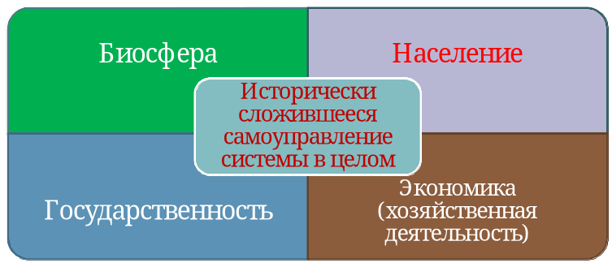
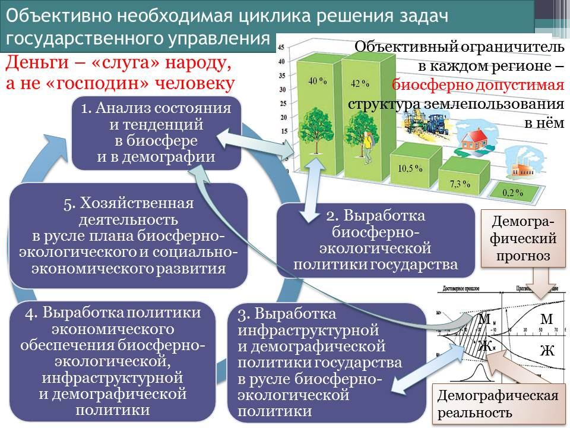
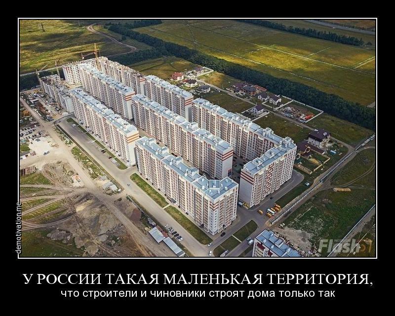

> **Первичный текст.** «Основы социологии», том 4. Страница издания: стр. 120 PDF — кандидатная привязка, требует сверки.
> Источник: файл издания `osnovy-sociologii-tom-4.pdf` (PDF в выпуск не включён). Контрольные суммы и статус проверки — в [NOTICE.md](../../NOTICE.md).
> Содержание передаёт позицию авторов издания; утверждения не верифицированы библиотекой.

---

## 13.1. Проблемы научно-методологического обеспечения общественного развития и государственного управления 

Цивилизация вышла на такой уровень развития, при котором качество жизни любого человека, семьи, социальных групп и культурно своеобразных общества в целом обусловлено двухуровнево:

- во-первых, концепцией, которой подчинено государственное управление;

- во-вторых, качеством управления, достигаемым по отношению к целям этой концепции, путям и средствам их достижения.

Ошибки и злоупотребления властью со стороны государственности и её представителей таковы, что их последствия не в состоянии компенсировать *(в исторически короткие сроки — в пределах нескольких лет)* ни люди по одиночке, ни неправительственные организации инициативных граждан; а в ряде случаев и само государство в силу того, что если некий неуместный для развития общества процесс запущен государством и «пошёл», то пока он не выработает свой потенциал, — его не остановить.

В силу этой особой роли государственности в русском языке существует поговорка «народ согрешит, царь умолит (Бога), а царь согрешит, народ не умолит»[^152]. Т.е. исторически выработанные склонности населения к тому, чтобы делать глупости и греховодничать, в значительной мере могут быть сдержаны и с течением времени искоренены политикой государства; а вот если глупости и греховодство творит государство, то такую политику в исторически короткие сроки никто в обществе сдержать и погасить не может. Эта задача может быть решена только на исторически продолжительных интервалах времени путём целенаправленного воздействия на культуру общества со стороны тех людей, которые понимают суть проблем и не уклоняются от того, чтобы заниматься их решением в порядке осуществления личностной инициативы. Кроме того, неправедная политика государства может профилактироваться самим обществом, если в обществе сложилась достаточно эффективная субкультура воспроизводства и осуществления концептуальной властности.

И это делает вопрос о научно-методологическом обеспечении государственного управления одним из наиболее острых вопросов современности и обозримого будущего, поскольку экологический кризис — кризис биосферно-социальный — порождён цивилизацией, неотъемлемый атрибут которой — государственность; а, прогрессируя, этот кризис обрёл за последнее столетие глобальный характер.

Разные его лики представлены на иллюстрациях ниже.

*[В оригинальном издании здесь расположен рисунок/схема «Иллюстрация из исходного DOC: image9.jpeg». Иллюстрация не включена в данный выпуск: ожидает визуальной и правовой проверки. Файл источника: assets/media/image9.jpeg]*

*[В оригинальном издании здесь расположен рисунок/схема «Иллюстрация из исходного DOC: image10.jpeg». Иллюстрация не включена в данный выпуск: ожидает визуальной и правовой проверки. Файл источника: assets/media/image10.jpeg]*

В глобальном биосферно-социальном экологическом кризисе деградируют и биосфера, и культура обществ в разных государствах, и её носители — сами люди, составляющие общества, деградируют как по медико-биологическим показателям, так и по личностно-культурным. Реальность такова, что биологический вид «Человек разумный» — часть биосферы и не может существовать вне биосферы. Техносфера не способна заменить собой биосферу в качестве полноценной *среды* *обитания человека (т.е. среды, в которой возможно воспроизводство биологического вида в преемственности здоровых и культурно состоятельных поколений).*

Деградация биосферы по своим тенденциям такова, что если нынешняя биосфера рухнет в ходе дальнейшего обострения глобального экологического кризиса, то в остаточной биосфере планеты Земля для «Человека разумного» может не оказаться экологической ниши.

В этом отношении показательны итоги эксперимента «Биосфера 2» (давая название эксперименту, предполагали, что «Биосфера 1» — это естественная биосфера Земли)[^153]. Эксперимент проводился 1986 — 1997 гг. в США.

«Биосфера-2 представляла собой монументальную конструкцию из стекла и стали. Она занимала площадь чуть больше 1 гектара. Общий объём сооружения составлял около 200 тысяч кубометров. Оно было полностью покрыто стеклянным колпаком, пропускающим 50 % солнечного света. В высоких стеклянных сферах разместились несколько экологических систем в миниатюре: тропический лес, океан, соленый марш, луг, саванна, пустыня. Там были также бассейны для рыб, инсектариум, где обитало свыше 200 видов насекомых, сельскохозяйственная ферма для содержания животных и выращивания различных растений. Кроме того были предусмотрены: жилая часть — комнаты для сотрудников, мастерские и информационно-вычислительный центр, который осуществлял мониторинг за всеми процессами в биосфере».

*[В оригинальном издании здесь расположена иллюстрация. Не воспроизводится до правовой проверки и решения владельца; см. запись в FIGURES.md.]* <!-- figs:osnovy-sociologii-tom-4--image11 -->

Комплекс «Биосфера 2»

Назначением этой искусственной системы биоценозов было: 1) поддерживать приемлемый для человека состав атмосферы и 2) быть источником продуктов питания для людей, принявших участие в эксперименте.

Эксперимент зашёл в тупик. Спустя два месяца после того, как в 1991 г. завершился подготовительный период и блок был изолирован от внешней среды, в его атмосфере начала расти концентрация углекислого газа и снижаться доля кислорода. Концентрация кислорода к моменту начала его пополнения техническими средствами упала до 14 %, что соответствует высоте 3 500 м над уровнем моря. Как следствие у участников эксперимента к этому времени начались головные боли и упала работоспособность. Биоценоз продолжал деградировать и после того, как состав атмосферы стали корректировать с помощью техники. Искусственно созданный биоценоз оказался не в состоянии обеспечить пищей участников эксперимента (4‑х мужчин и 4‑х женщин), вследствие чего и их тоже пришлось подкармливать извне.

В итоге эксперимент пришлось прекратить, но если бы у участников эксперимента не было возможности покинуть «Биосферу 2» и уйти в «Биосферу 1», то они погибли бы.

Один из вариантов интерпретации этого эксперимента: **американцы смоделировали завершающий этап глобального биосферно-социального экологического кризиса**.[^154]

Такие перспективы при сохранении исторически сложившихся тенденций неприемлемы ни для одного общества, ни для человечества в целом. И они приводят к вопросу: *Что и как генерирует глобальный биосферно-социальный экологический кризис?*

Если искать ответ на этот вопрос без унаследованных от прошлого предубеждений, ограничивающих, извращающих и закрепощающих в состоянии неадекватности миропонимание множество людей, то выяснится, что генератором глобального биосферно-социального экологического кризиса является глобализация, осуществляемая на основе экспорта «передовыми» государствами Запада в другие регионы планеты либерально-рыночной экономической модели и обслуживающих её либеральной идеологии и псевдоэкономических теорий[^155].

Всё это — порождёния библейской, а не какой-то иной культуры, поскольку в библейской культуре научно-технический прогресс, определяющий развитие техносферы, «обогнал» прогресс нравственно-этический.

Если с позиций достаточно общей теории управления (ДОТУ[^156]) анализировать функционирование «свободного рынка»[^157], на котором так или иначе, легально либо нелегально, прямо или опосредованно продаётся всё, на что есть платёжеспособный спрос, и в ценообразовании выражается некий баланс интересов продавца и покупателя, то неоспоримо следующее:

- Деятельность всего множества субъектов рынка подчинена максимизации их ЧАСТНЫХ доходов и сокращению издержек каждого из них любыми путями и способами, в том числе и биосферно недопустимыми и вредными в социокультурном отношении.

- Рынок не способен к целеполаганию в отношении образа жизни страны и развития её культуры и экономики.

<!-- -->

- То же касается и рынков международной торговли вплоть до глобального рынка, но уже в отношении целеполагания регионального (по отношению к планете) и глобального уровней и жизни региональных цивилизаций и человечества в целом.

<!-- -->

- Рынок не содержит в себе механизма самонастройки хозяйственной системы государства на экономическое обеспечение достижения провозглашаемых политиками целей или жизненных идеалов народа, вследствие чего обещания обречены быть неосуществимыми, а идеалы недостижимыми.

<!-- -->

- Вследствие этого на планетарно-региональном и глобальном уровне многие декларации ООН и других международных институтов также оказываются несбыточными.

<!-- -->

- Есть **виды деятельности, — общественно необходимые, —** но не осуществимые на принципах самоокупаемости в условиях либерально-рыночной саморегуляции вообще или не осуществимые в объёмах, необходимых для устойчивого и безопасного развития общества в преемственности поколений, потому, что на результат этих видов деятельности нет платёжеспособного спроса и он не может сформироваться «сам собой» в условиях либерально-рыночной саморегуляции.

- Научно-технический прогресс в условиях действия либерально-рыночной экономической модели сопровождается «производством» «экономически избыточного» населения, которое *при складывающейся конъюнктуре рынков труда, природных благ и продукции* избыточно — как в качестве тружеников, так и в качестве потребителей.

> Экономически избыточное население исторически реально уничтожается теми или иными способом под ни к чему не обязывающие разговоры о «прогрессе», «гуманизме» и «правах человека».

Разные государства и разные эпохи отличаются друг от друга только тем, как уничтожается экономически избыточное население: применением законов против бродяжничества, за которое полагалась смертная казнь в Англии в период первой промышленной революции; либо экономическим геноцидом, в том числе и под воздействием «анестезии» наркотиков и шоу-бизнеса, как это делается ныне в большинстве государств.

В условиях глобализации в категорию экономически избыточного населения может попадать изрядная доля населения целых государств, и постсоветская Россия принадлежит к этой категории[^158] наряду с Грецией, Испанией и многими другими странами.

- В рыночной экономике деньги становятся одним из товаров. Цена денег — ссудный процент. **После того, как общество допускает в своей кредитно-финансовой системе ссудный процент, его государство утрачивает экономический суверенитет и становится заложником и невольником хозяев транснациональной корпорации ростовщиков, узурпировавшей банковское дело (счетоводство макроуровня) в глобальных масштабах.**

  Дело в том, что институт кредита со ссудным процентом — в терминах теории игр — игра с ненулевой суммой, в которой всегда в выигрыше совокупный ростовщик, даже если кто-то из членов корпорации ростовщиков обанкротится, а кто-то из числа к ней не принадлежащих успешно обогатится.

- В государствах — лидерах научно-технического и экономического развития, которые пропагандируют либерально-рыночную экономическую модель и навязывают её в качестве обязательной «отсталым» и «проблемным» странам, принципы рыночного либерализма не действуют в полной мере, поскольку они ограничены государственными системами планирования социально-экономического развития и регулирования рынков[^159].

  Однако эти системы сложились на основе практики, они не описаны в общедоступных (и тем более — в культовых) теориях, и их изучение лежит вне стандартных курсов экономического образования, что в ряде случаев приводит к недовольству студентов, которые осознают несоответствие преподаваемых им культовых теорий реально протекающим социально-экономическим процессам. Это имеет место даже в таких «элитарно»-престижных вузах, как Гарвард[^160].

Подводя итог, можно сказать, что:

Законы либерально-рыночного ценообразования таковы, что либерально-рыночная экономика из поколения в поколение воспроизводит массовую нищету и бескультурье, геноцид, запустение и биологическое опустошение территорий, на фоне чего сверхбогатое меньшинство «бесится с жиру» и сетует на лень, дикость, озлобленность и тупость простонародья; а общество под властью либерально-экономической модели становится невольником и заложником хозяев транснациональной корпорации ростовщиков, узурпировавшей банковское дело в глобальных масштабах в полном соответствии с библейским проектом порабощения человечества от имени Бога.

Всё это (кроме глобальной тирании ростовщического сообщества, о которой не принято говорить публично) в «экономической науке» Запада в совокупности принято называть «провалами рынка». И следует обратить внимание на следующее обстоятельство:

Реформаторы 1990‑х обязаны были знать в силу избранной ими профессиональной специализации о существовании «провалов рынка», и соответственно обязаны были подумать о профилактировании и компенсации воздействия провалов рынка в ходе осуществляемых ими внутренних реформ и интеграции России в мировое хозяйство на принципах, отличных от интеграции в него СССР, дабы Россия не понесла разнородного ущерба в их ходе.

Фразы типа, что кто-то «не вписался в рынок», не являются оправданием, а представляют собой признание в профессиональной несостоятельности политиков и консультирующих их экономистов и покрывают злоумышленное вредительство с признаками измены Родине[^161].

Это так именно потому, что о «провалах рынка» и необходимости профилактирования и компенсирования их воздействия на общество, хозяйственную систему страны и экологию они обязаны были знать, тем более, что ещё в 1973 г. фактически об этом же писал выдающийся американский экономист и политик, иностранный член АН СССР (1988 г.), а позднее — РАН (с 1991 г.) Дж. К. Гэлбрейт (1908 — 2006):

«…экономикой нужно управлять. Проблема состоит в том, чтобы управлять не одной экономикой, а двумя: одна из них подчинена рынку, а другая планируется фирмами, из которых она состоит[^162]. Подобное управление представляет собой последний шаг при определении общей стратегии реформ»[^163].

При этом реальность такова, что никто из участников рынка в одиночку либо на основе корпоративного сговора не способен к профилактированию и компенсации воздействия «провалов рынка»[^164], на экономику, общество и биосферу, поскольку для этого надо подняться над рынком[^165] и*, непрестанно реагируя на изменение обстоятельств,* систематически задавать и перезадавать правила его функционирования и контролировать их соблюдение всеми участниками рынка.

Сказанное в предшествующем абзаце заставляет вспомнить слова президента США А. Линкольна (1809 — 1865). Он выразил своё понимание предназначения государственности так:

«Законная задача правительства — делать для общества людей всё то, что им нужно, но что сами они, выступая каждый в своём индивидуальном качестве, не могут сделать совсем или не могут сделать хорошо»[^166].

Этой формулировке задач государственности А. Линкольн придал уточняющее дополнение: «Мы не поможем людям, делая за них то, что они могли бы сделать сами»[^167].

Эти две взаимно дополняющих друг друга мысли — одно из наиболее внятных определений задач государства из числа данных когда-либо в истории. И соответственно, государственность — субкультура управления делами общественной в целом значимости на профессиональной основе на местах и в масштабах всего общества. Государство это — субъект международного права, включающий в себя: государственность, население, территорию и акваторию, воздушное пространство и недра, на которые распространяется власть этой государственности.

И соответственно, **профилактировать и компенсировать воздействие «провалов рынка» на общество и биосферу — одна из обязанностей государственности, поскольку кроме государственности этим заниматься некому**.

Если же государственность с этим не справляется и «лежит» под рынком (и в особенности, если она «лежит» под кредиторами-ростовщиками[^168] и заправилами прочих финансовых и спекулятивных рынков), то она становится никчёмной для общества со всеми вытекающими из этого факта — в перспективе — последствиями.

Но любая деятельность требует информационно-алгоритмического обеспечения, адекватного целям и обстоятельствам этой деятельности. И это приводит к вопросу о процессе формирования информационно-алгоритмического обеспечении государственного управления. Ответ на него представлен на рис. 13.1‑1 ниже.

Статистическая предопределённость качества жизни общества в будущем обусловленностью спектра управленческих решений в работе государственного аппарата и менеджмента бизнеса на всех уровнях иерархии власти на исторически продолжительных интервалах времени наукой и полученным на её основе образованием — объективная данность. И это означает, что:

Если общество сталкивается с проблемами, и проблемы не разрешаются, а разрастаются, то ошибочно сводить как проблемы, так и возможности их разрешения (большей частью иллюзорные) к личностям тех или иных политиков и доминированию в парламентах тех или иных партий, а в государственном аппарате — тех или иных кланово-мафиозных группировок.

Преодоление проблем надо начинать с выявления разного рода **«неадеквата» — ошибок и заведомой лжи — в научных теориях**, на которых основывается высшее профессиональное образование в области социальной философии, социологии, политологии, экономики и финансов, юриспруденции, государственного и муниципального управления и управления в экономике[^169].

При таком подходе выясняется, что наука, обслуживающая практику буржуазного либерализма в политике, в хозяйственной и финансовой деятельности, — не интересуется объективными закономерностями, которым подчинена представленная на рисунке 13.1-2 система, составными частями которой являются биосфера, население, экономика, государственность.

*Рис. 13.1-1. Обусловленность спектра управленческих решений*

*и будущего качества жизни наукой и системой образования*

Сказанное не означает, что фундаментальная наука вообще ничего не знает по этой проблематике; она знает много чего, что необходимо знать для преодоления глобального биосферно-социального экономического кризиса, но эти знания не востребованы сегментом прикладной науки, обслуживающей буржуазный либерализм, т.е. обслуживающей функционирование его политической системы, хозяйственной и кредитно-финансовой систем, по какой причине эти знания не попадают в учебные курсы, на основе которых получают образование будущие политики, экономисты, менеджеры разного уровня, юристы, журналисты. А далее — *в наихудшем для общества —* *варианте* реализуется статистическая предопределённость результатов государственного управления, представленная на рис. 13.1-1.

*Рис. 13.1-2. Объект ответственности человека перед людьми и Богом*

Соответственно преодоление биосферно-социального экологического кризиса и переход к жизни на основе *концепции устойчивого и безопасного развития человечества*[^170] требует отказа от прикладной науки, обслуживающей буржуазный либерализм во всех его разновидностях, и выработки науки и системы образования, на основе которых всякое государство с учётом местной физико-географической и культурно-исторической специфики могло бы проводить свою политику в соответствии с объективно необходимой для безопасного развития общества в преемственности поколений цикликой решения управленческих задач, представленной на рисунке 13.1-3.

Этот рисунок нуждается в пояснениях. Соответственно требованию обеспечить устойчивость биосферы, в каждом регионе планеты можно выявить предельную биосферно допустимую структуру землепользования[^171], *некоторым образом локализованную на местности*[^172]. На рис. 13.1-3 (верхний правый сегмент) представлена структура, предложенная на основании исследований проблем экологии греческим архитектором К.А. Доксиадисом ещё в 1974 г. Она включает в себя (соответственно упорядоченности слева на право рис. 13.1-3): 1) заповедные территории, на которых посторонние люди могут находиться только в сопровождении сотрудников заповедников, не нарушая биоритмики воспроизводства биоценозов; 2) территории, на которых люди могут отдыхать по своему усмотрению, но на которых не ведётся систематическая хозяйственная деятельность; 3) сельхозугодья; 4) территории населённых пунктов; 5) территории промышленных предприятий, а также полигонов и предприятий по переработке и утилизации отходов. Представленную структуру можно детализировать и далее.

*Рис. 13.1-3. Взаимная обусловленность частных управленческих задач*

*в ходе реализации концепции устойчивого и безопасного развития*

Предельная структура землепользования определяет ёмкость и распределение по территории экологической ниши, которую может занимать общество в каждом регионе, обладающем физико-географическим своеобразием. Физико-географическое своеобразие наряду с административными и государственными границами определяет принципы разграничения регионов, для которых следует соответствующие предельные структуры землепользования. В соответствии с налагаемыми такого рода предельными структурами ограничениями государство должно для каждого своего региона вырабатывать жизненно состоятельную (т.е. обоснованную достоверным научным знанием) *биосферно-экологическую, инфраструктурную и демографическую политику*.[^173]

Все три названных специфических вида политики нуждаются в экономическом обеспечении. Последнее означает, что именно государство (поскольку кроме него — некому этим заниматься) должно выработать план экономического обеспечения названных видов политики, а также план развития организационно-технологического комплекса страны (т.е. план инвестирования в развитие отраслей и регионов, подготовки и переподготовки кадров). Этот план может представлять собой только управленчески целесообразное системное сочетание межотраслевых и межрегиональных балансов продуктообмена и финансового обмена, а также — балансов потребления и возобновления природных ресурсов и переработки *отходов и выбывающей из пользования продукции во вторичное сырьё*[^174]. В ходе разработки такого рода хронологически преемственной последовательности балансов, ведущей к осуществлению целей политики государства, должны определяться параметры эмиссионной, кредитной, страховой политик и политики распределения налогов, дотаций производителям продукции и политики распределения субсидий потребителям продукции, которые бы обеспечили осуществление рыночной саморегуляции в русле плана биосферно-социально-экономического развития.

При этом как предприятия государственного сектора, так и предприятия частного сектора должны быть элементами одной системы, различие которых только в том, что миссию[^175] предприятий государственного сектора определяет государство, а миссию предприятий частного сектора — владельцы предприятий. Далее государство осуществляет мониторинг и коррекцию течения хозяйственной деятельности в русле плана[^176], т.е. настраивает рыночный механизм на осуществление государственного плана биосферно-социально-экономического развития.

Реализация представленной на рисунке 13.1-3 циклики решения управленческих задач в политической практике государства требует, чтобы на всех уровнях осуществления разнородной власти госчиновники, депутаты, собственники предприятий и менеджеры — знали объективные закономерности, которым подчинена жизнь человеческого общества как в аспекте обеспечения безопасности, так и в аспекте разного рода угроз безопасности и заведомой вредоносности тех или иных видов деятельности (а также — и бездеятельности).

Дабы общество могло действенно контролировать государственность, т.е. быть и гражданским и демократическим, те же самые объективные закономерности должно знать и всё остальное население.

Эти закономерности можно разделить на 6 групп. В каждой из них закономерности оказывают то или иное воздействие друг на друга, а также — *и на закономерности других категорий, поскольку Мир един и целостен:*

1.  Человечество — часть биосферы, и существуют объективные закономерности, регулирующие: 1) взаимодействие биосферы и Космоса, 2) формирование биоценозов и 3) взаимодействие биологических видов друг с другом в пределах биосферы.

2.  Человечество — специфический биологический вид, и существуют специфические биологические (физиологические и психологические) видовые закономерности, регулирующие его жизнь[^177].

3.  Существуют нравственно-этические (религиозные и *ноосферные, иначе говоря — эгрегориальные*) закономерности, регулирующие взаимоотношения обладателей разума и воли. И вопреки мнению многих закономерности этой категории выходят за пределы человеческого общества, а этика, диктуемая с иерархически более высоких уровней в организации разного рода систем, — обязательна для иерархически низших уровней и отступление от её норм наказуемо. Соответственно отступничество от праведности — нравственности, свойственной Всевышнему, — главная нравственно-мировоззренческая причина биосферно-социального экологического кризиса.[^178]

4.  Культура, которую генетически предопределённо несёт человечество, вариативна, и существуют социокультурные закономерности, следование которым гарантирует устойчивость общества в преемственности поколений, а их нарушение способно привести к его исчезновению в течение жизни нескольких поколений под воздействием деградационных процессов.

5.  Исторически сложившаяся культура всех обществ нынешней глобальной цивилизации такова, что мы вынуждены защищаться от природной среды техносферой. Техносфера воспроизводится и развивается в ходе хозяйственной и финансовой деятельности, и существуют финансово-экономические закономерности, предопределяющие как развитие общественно-экономических формаций, так и их деградацию и крах.

6.  Всё это в совокупности может приводить к конфликтам интересов и конфликтам разных видов деятельности, разрешением которых необходимо управлять. И существуют объективные закономерности управления, единые для всех процессов управления, будь то езда малыша на трёхколёсном велосипеде либо комплексный проект, осуществляемый несколькими государствами на принципах частно-государственного партнёрства.

Понятно, что в их основе закономерностей первой и второй групп лежат закономерности физики и химии, в том числе и общевселенского масштаба, а все последующие группы закономерностей являются своего рода надстроечными по отношению к физическим и химическим закономерностям.

Что можно узнать из обязательных для изучения в школах и вузах России и зарубежья курсов социальной философии, социологии, политологии, юриспруденции, экономики, предназначенных для подготовки специалистов управленческого профиля для работы в государственном аппарате и в бизнесе?

1.  Об общебиосферных закономерностях — НИЧЕГО.

    Но именно нарушение тех из них, которые действуют в случае переполнения экологической ниши, порождает главные проблемы так называемых развитых государств. Сосредоточение населения в мегаполисах приводит к тому, что их жители видят постоянно множество незнакомых лиц, а скученность в транспорте, очереди и т.п. бессознательно автоматически выдают в биосферу из психики каждого из этих людей сигнал о переполнении экологической ниши городской популяцией вида «Человек разумный». Реакция биосферы на такого рода видовые сигналы выражается:

- в блокировании видовых механизмов воспроизводства новых поколений,

- в ухудшении показателей здоровья новых поколений,

- в усилении и ужесточении внутривидовой конкуренции за «место под солнцем», в ходе которой безжалостно и беспощадно уничтожаются наиболее слабые,

- в усилении давления на популяцию биологического вида, переполнившего экологическую нишу, со стороны других биологических видов (начиная от микроорганизмов), которые могут выполнить миссию эффективного истребителя по отношению к сверх меры расплодившейся популяции.

  В жизни городов всё это в совокупности выражается как: сокращение рождаемости, общий рост статистики заболеваемости, и в особенности — рост статистики утраты репродуктивного здоровья, включая и принадлежность к ЛГБТ-сообществу[^179], рост статистики уголовных преступлений и, в особенности — жестоких немотивированных убийств, рост статистики суицидов.

> Эти бедствия в принципе неустранимы в мегаполисах, поскольку являются выражением общебиосферных закономерностей, а не являются следствием исключительно пороков воспитания и образования жителей городов, хотя последнее тоже имеет место.

К нарушениям закономерностей этой же категории принадлежит и то обстоятельство, что «юридическое время» в РФ «благодаря» инициативе (8 февраля 2011 г.) и последующей «принципиальности» в этом вопросе Д.А. Медведева на 2 часа опережает астрономическое время[^180] на протяжении нескольких лет, с которым объективно связана биоритмика всех живых организмов в биосфере Земли. В ряде регионов положение усугубляется тем, что Д.А. Медведев объединил и некоторые часовые пояса на территории РФ. И при этом следует отметить, что ни в обществе, ни в государственном аппарате не нашлось сил, которые смогли бы профилактировать и пресечь это вредительство. Но и после этого ни президент, ни Дума, ни Верховный суд, ни сам Д.А. Медведев не в состоянии (либо не находят нужным) исправить эту дурость, а равно — **акт** **тирании**. И это при том, что есть оценки, согласно которым весенне-осеннему переводу стрелок сопутствовала преждевременная смерть порядка 75 — 150 тыс. человек ежегодно, не говоря уж об экономических потерях вследствие снижения работоспособности, роста статистики ошибок людей, влекущих производственный травматизм, повреждения техники, катастрофы и т.п.[^181]

2.  О специфических закономерностях биологического вида «Человек разумный» — НИЧЕГО.

    Они касаются прежде всего раскладки инстинктивных программ поведения мужчин, женщин, детей. В биологическом виде «Человек разумный» при нечеловечных типах строя психики генетически-инстинктивно запрограммирована психологическая зависимость мужчины от женщины и подчинённость мужчины — женщине. Вследствие этого во всех языках существуют поговорки типа «никто не герой перед своею женой». Но точно также генетически-инстинктивно запрограммирована и привязанность матери к детям, и в особенности — к последнему, самому младшему ребёнку. Ей соответствует и привязанность детей, особенно в раннем возрасте, к матерям, отчасти инстинктивно запрограммированная, а отчасти являющаяся следствием импринтинга[^182]. При этом необходимо отметить, что борьба за «лучшее место под солнцем» — прежде всего для детей, а потом уж для себя самой — заложена в женские инстинкты, а не в мужские. Мужчина борется за «лучшее место под солнцем» вследствие инстинктивно обусловленной подчинённости женщине — спутнице жизни.

    При нечеловечных типах строя психики взрослых изрядная доля конфликтов в семье (в системе «мать — её сын, он же — муж невестки — жена сына, она же невестка — их дети-внуки») проистекает из конфликтности инстинктивных программ, когда один и тот же индивид в разных инстинктивных программах должен одновременно исполнять взаимоисключающие роли. И *эти конфликты созидательно неразрешимы, если взрослые оказываются неспособными перейти к человечному типу строя психики*.

    Всем инстинктивным программам поведения сопутствуют те или иные культурные оболочки и надстройки. И всё это также необходимо учитывать в политике государства, прежде всего — в социокультурной и демографической политике.

    Кроме того, личностное становление мальчиков и девочек протекает по-разному: генетическая программа развития девочки такова, что девочка сначала должна освоить интуицию, а потом интеллект; у мальчиков последовательность иная — сначала освоение интеллекта и навыков осмысленного самообладания, а потом освоение интуиции[^183]; и при этом у девочек и мальчиков половые инстинкты пробуждаются в разном возрасте с разницей в несколько лет. Соответственно с учётом особенностей генетических программ развития организмом и личностного становления мальчиков и девочек должна строиться система всеобщего обязательного образования. В нашем же обществе школа работает в режиме «бесполости» учащихся, что не соответствует действительности и наносит колоссальный урон обществу, как в аспекте телесного и психического здоровья выпускников школ, так и в аспекте снижения качества образования и качества жизни общества в целом.

3.  О нравственно-этических закономерностях в их ноосферных, эгрегориальных и религиозных (т.е. внесоциальных) аспектах и проявлениях в жизни — НИЧЕГО.

    Этой тематике практически полностью была посвящена Часть 1, а также гл. 12 и Приложения 1, 2, 3 в настоящем курсе.

4.  О социокультурных закономерностях — НИЧЕГО, кроме демагогии на тему «человек — существо биосоциальное».

    Но многие обезьяны — тоже «существа биосоциальные». Так у орангутанов выявлена культура — поведенческие навыки, передаваемая от особи к особи в процессе их общения (исследования университета Дюка, США[^184]). А 6 июля 2005 г. в «New-York Times Magazine» была опубликована статья «Обезьяний бизнес»[^185].

    Она сообщает о результатах исследований поведения обезьян вида «Капуцины», проведённых в Йельском университете (США) «поведенческим экономистом»[^186] китайского происхождения Китом Чэнем и психологом Лори Сантос.

    По словам К. Чэня, капуцины имеют небольшой по объёму мозг, а в своём поведении в значительной мере сосредоточены на еде и сексе[^187]. К. Чэнь и Л. Сантос выдали группе подопытных обезьян металлические жетоны, которые должны были принять на себя роль денег в обезьяньем сообществе[^188]. Исследователям удалось донести до сознания обезьян тот факт, что эти жетоны могут быть обменены на лакомства (зефир, виноград, яблоки, фруктовое желе и т.п.) и что количество того или иного лакомства, которое обезьяна может получить за один жетон — разное. Обезьянам было предоставлено право выбора покупок. После чего исследователи занялись изучением их реакции на изменение конъюнктуры рынка: т.е. как меняются предпочтения обезьян в случае абсолютных и относительных изменений цен на предлагаемые им товары. Результаты этого эксперимента — «говоря языком экономиста, капуцины придерживались правил «максимизации полезности» и «теории цен»: когда цена на что-то падает, люди обычно покупают больше». Они вели себя также. «Данные, полученные из анализа поведения обезьян-капуцинов, — как говорит Чэнь, — делают их (обезьян-капуцинов) статистически неотличимыми от большинства биржевых инвесторов».

    Кроме того, исследователи наблюдали попытку фальшивомонетничества. Как-то раз, случайно, огурцы для капуцинов были нарезаны кружочками, а не кубиками, как обычно. Одна из обезьян, посчитав, что круглая форма кусочка огурца при такой нарезке, идентична круглой форме жетона, попробовала употребить такой кусочек огурца в качестве жетона для покупки более предпочтительного для неё лакомства.

    Обезьян удалось вовлечь и в две азартные игры на основе подбрасывания жетона и рассмотрения результатов его падения. Первая игра основывалась на том, что обезьянка видела в руке экспериментатора один фрукт, но, обменивая на него жетон, примерно в каждом втором случае она получала не один фрукт, а сразу два. Правила второй игры были противоположными: вместо видимых двух фруктов примерно в каждом втором случае обезьянка получала только один. Таким образом, капуцины могли выбрать — обменять свой жетон на один фрукт, но с возможностью при этом получить два фрукта, или же обменять жетон на два фрукта, но при этом была вероятность получить только один. Хотя правила обеих игр были построены так, что итоговый результат в них был статистически один и тот же, но обезьяны отдали значительное предпочтение игре на выигрыш (гарантированное получение одного фрукта при возможности получения второго), что свойственно и большинству людей, играющих в азартные игры и не вникающих в правил игры и распределение в ней выигрышей и проигрышей.

    Один из капуцинов в процессе получения порции жетонов от исследователей, схватил весь поднос и выбросил его содержимое в общую клетку. Среди обезьян начался массовый психоз на тему «завладеть как можно большим количеством жетонов». Исследователи охарактеризовали происшедшее словом «хаос», и им пришлось совершить «акт коррупции», как они сами охарактеризовали свои действия, выкупая у обезьян жетоны лакомствами разного рода, что стало для обезьян стимулом к новым кражам жетонов.

    По сути это стало первым в истории обезьяньего сообщества «ограблением банка». А реакция обезьян на щедрость обезьяньего «Робина Гуда» была по сути такой же, как и в случае, когда П. Дуров (основатель интернет-сообщества «В контакте») разбрасывал пятитысячные купюры в толпу на Невском проспекте из окна своего офиса в День города[^189] в 2012 г.[^190]

    Шоком для исследователей стало, когда один из самцов в ходе хаоса, возникшего вслед за вбросом обезьяной «грабителем банка» в общую клетку захваченных жетонов, купил секс у самки, а та, получив за услугу жетон, почти сразу же употребила его для покупки одного из лакомства. Т.е. исследователи стали свидетелями акта проституции — предоставления сексуальных услуг за деньги с целью последующей траты денег на какие-то свои нужды.

    Полученные в ходе исследования поведения обезьян-капуцинов результаты, показали, что поведение обезьян под воздействием финансов, появившихся в их культуре, статистически идентично поведению людей в исторически сложившемся толпо-«элитарном» обществе, где финансы издревле — один из факторов культуры, которому подчинены массы людей.

    Эти результаты были обнародованы как курьёз, который никого и ни к чему не обязывает, т.е. эти результаты не были адекватно интерпретированы (осмыслены) ни публицистами, ни научным официозом.

    Можно указать только на одно единственное отличие финансового обращения у обезьян и людей, и оно состоит в том, что «финансовое обращение» в группе лабораторных капуцинов из Йельского университета, живущих на всём готовом под опёкой исследователей, не содержит инвестиционной составляющей: т.е. у них нет надобности в оплате труда и поставок производственного оборудования, которое также является продуктом труда. В финансовом же обращении человеческого общества инвестиционная составляющая есть, и она играет решающую роль в экономическом обеспечении жизни техносферно развитого общества, поскольку людям приходится трудиться и, соответственно, — оплачивать труд, разработку и поставку производственного оборудования.

    Кроме того, некоторые идентичные и для обезьян, и для людей реакции на финансы (проституцию, ограбления, воровство) в культуре общества принято оценивать как пороки.

    Но по сути результаты этих исследований показали, что, если вывести из рассмотрения развитие техносферы, то за 13 тысяч лет[^191] истории нынешней глобальной цивилизации и в аспекте рассмотрения функционирования психики индивида, и в аспекте рассмотрения коллективной психики толпы — человечество в общем-то не ушло от обезьян: реакции на идентичные финансовые ситуации статистически идентичны и у тех, и у других.

> Иначе говоря, развитие техники — это не достижение цивилизации на фоне того, что психология общества, как и на заре цивилизации, близка к психологии обезьяньей стаи, хотя прошло уже порядка 13 000 лет развития культуры нынешней глобальной цивилизации, если отсчитывать время от глобальной катастрофы, уничтожившей прошлую глобальную цивилизацию.

Причина неспособности осмыслить результаты этих экспериментов адекватно жизни, а не как курьёзное совпадение статистик реакций людей и обезьян на одни и те же финансовые ситуации и стимулы — в том, что люди в большинстве своём не знают, чем человек отличается от обезьяны, хотя и те, и те реально — «существа биосоциальные», а биологически — приматы. Не знают, хотя этот вопрос поставлен более двух тысяч лет тому назад.

И хотя некоторые полагают, что публикации об этом эксперименте — «фейк», т.е. умышленная выдумка с претензиями на достоверность, тем не менее и приверженность этому мнению не освобождает от необходимости ответить на вопрос о сути человека в полноте его достоинства и его отличии от прочих приматов.

*[В оригинальном издании здесь расположен рисунок/схема «Иллюстрация из исходного DOC: image19.jpeg». Иллюстрация не включена в данный выпуск: ожидает визуальной и правовой проверки. Файл источника: assets/media/image19.jpeg]*Существует легенда, согласно которой Диоген Синопский, живший в IV в. до н.э., на определение Платона (по другой версии некоего псевдо-Платона) «Человек есть животное о двух ногах, лишённое перьев», ощипал курицу и принёс к нему в школу, объявив: «Вот платоновский человек!»[^192]. Вследствие этого Платон к своему определению вынужден был добавить «…и с широкими ногтями»[^193].

Другое предание сообщает, что тот же Диоген Синопский, как то раз вышел на улицы города днём с зажжённым фонарём. На недоумённые вопросы сограждан «для чего ему днём фонарь?» Диоген отвечал им не менее загадочно: «Ищу человека»[^194].

Но возможно, что и **Платон**, видя, что большинство его современников не состоялось в качестве человека, в действительности дал не определение того, что есть человек, а в форме этого «определения» **выразил своё презрение к человекообразным людям**. Но не состоявшиеся в качестве человеков человекообразные, считая себя <u>настоящими человеками</u>[^195], насмешки Платона над ними не поняли, вследствие чего цитируют и опровергают его «определение» *вполне серьёзно.* О Диогене же они предпочитают *не вспоминать на публике*, поскольку если заняться содержательным рассмотрением поднятого им вопроса об идеале человека, который должно воплотить в жизни, то можно узнать о себе многое такое, что будет неприятно для болезненно обидчивого себялюбия и собьёт спесь; однако и забыть Диогена *в своём узком кругу «профессиональных философов»* — не могут, предпочитая рассказывать о нём, как о потешном курьёзе в истории философии (т.е. «Зелен виноград», — если вспомнить известную басню).

Эти предания не находят *научно состоятельных (в аспекте биологии и психологии)* комментариев ни в одном учебнике (см. Часть 1 настоящего курса: излагаемое в гл. 4 — это исключение из общего правила) и приводятся в них только как своего рода «курьёзы». Если же судить по истории и состоянию официальной науки Запада, то она и в наши дни по умолчанию придерживается воззрений, аналогичных платоновским (либо псевдо-платоновским), что выражается, в частности, в регулярном возникновении разного рода расистских теорий, в которых признание за индивидом достоинства человека либо отказ в таковом полностью определяются биологическими признаками — анатомией и происхождением от определённых предков. Из числа такого рода расистских теорий иудаизм и ведизм с его кастовой системой имеют наиболее продолжительное действие в истории.

Из этих преданий можно понять, что Диоген, во-первых, показал Платону, что нет принципиальной анатомической разницы между человеком и курицей, и во-вторых, отказывал своим соотечественникам и современникам в полноте достоинства человека, т.е. он не признавал, что достаточно родиться в биологическом виде «Человек разумный» для того, чтобы быть человеком. Родиться — это только необходимое условие, но не достаточное. Чтобы быть человеком, необходимо что-то ещё. Но что именно необходимо и как этого достичь, — Диоген не сказал. Он просто в иносказательно-метафорической эпатажной форме указал на проблему «Как жизненно состоятельно ответить на вопрос: *что значит — состояться человеком?».*

Нарушению же социокультурных закономерностей благодатной жизни, проистекающему из неспособности дать жизненно состоятельный ответ на этот вопрос и из нереализованности потенциала личностного и общественного развития, полностью посвящена Часть 3 настоящего курса.

5.  В экономическом образовании всё, кроме бухгалтерского учёта и математики[^196], — либо ОТ ЛУКАВОГО (т.е. «игра в напёрстки» в особо крупных размерах с признаками измены Родине и Богу), либо ВЗДОР И ПУСТОСЛОВИЕ. «Экономика похожа на женщину. Разве её поймёшь?» — признание А.Я. Лившица[^197] (1946 — 2013) именно об этом, хотя оно из серии «а сам-то понял, что сказал?».

    В частности, в России на протяжении всей её обозримой истории систематически нарушается главный закон, обеспечивающий **экономическую безопасность общества** (во всех смыслах этого термина), а также и все аспекты безопасности общества, производные от экономической:

> Первоприоритетен не выпуск продукции для нужд потребления и не достижение положительного сальдо внешнеторгового баланса, а достаточное для нужд и *безопасности общества (во всех смыслах)* воспроизводство производственных мощностей на основе новейших достижений фундаментальной науки, воплощаемых в технике, в технологиях и в организации социальных процессов.

И есть только два исторически непродолжительных периода в истории нашей страны, когда этот закон соблюдался. Это — эпоха Петра Великого и эпоха И.В. Сталина. Причём И.В. Сталин сформулировал этот экономический закон в прямой форме в 1952 г. следующим образом:

> «Существует ли основной экономический закон социализма? Да, существует. В чём состоят существенные черты и требования этого закона? Существенные черты и требования основного экономического закона социализма можно было бы сформулировать примерно таким образом: **обеспечение максимального удовлетворения постоянно растущих материальных и культурных потребностей всего общества путём непрерывного роста и совершенствования социалистического производства на базе высшей техники** (выделено нами жирным при цитировании)» («Экономические проблемы социализма в СССР»).

И кроме того, И.В. Сталин пояснил эту формулировку на примере рассмотрения одного из возражений, высказанного Лукой Даниловичем Ярошенко (1896 — 1995)[^198]:

> «“Главным в этом определении является "обеспечение максимального удовлетворения... потребностей всего общества". Производство показано здесь как средство для достижения этой главной цели — удовлетворения потребностей. Такое определение даёт основание полагать, что формулированный Вами основной экономический закон социализма исходит не из примата[^199] производства, а из примата потребления”.
>
> Очевидно, что т. Ярошенко совершенно не понял существа проблемы и не видит того, что разговоры о примате потребления или производства совершенно не имеют отношения к делу. Когда говорят о примате тех или иных общественных процессов перед другими процессами, то исходят обычно из того, что оба эти процесса являются более или менее однородными. Можно и нужно говорить о примате производства средств производства перед производством средств потребления, так как и в том и в другом случае мы имеем дело с производством, следовательно, они более или менее однородны. Но нельзя говорить, неправильно было бы говорить о примате потребления перед производством или производства перед потреблением, так как производство и потребление представляют две совершенно различные области, правда, связанные друг с другом, но всё же различные области. Тов. Ярошенко очевидно не понимает, что речь идёт здесь не о примате потребления или производства, а о том, какую *цель* ставит общество перед общественным производством, какой *задаче* подчиняет оно общественное производство, скажем, при социализме. Поэтому совершенно не относятся к делу также разговоры т. Ярошенко о том, что "основу жизни социалистического общества, как и всякого другого общества, составляет производство". Тов. Ярошенко забывает, что люди производят не для производства, а для удовлетворения своих потребностей. Он забывает, что производство, оторванное от удовлетворения потребностей общества, хиреет и гибнет» («Экономические проблемы социализма в СССР»).

Но не вняли…[^200]

6.  Курсы кибернетики, теории управления[^201], менеджмента в их исторически сложившемся виде (за исключением ДОТУ: см. Часть 2 настоящего курса — том 1) не дают ясного представления ни об объективных закономерностях *управления вообще,* ни о конкретике проявлении их в жизни обществ и в работе государственного аппарата[^202], ни об организации управления по полной функции управления в обществе и в экономике ни на микро-, ни на макро- уровнях. Эти *псевдоуправленческие* «учебные» курсы не позволяют сформировать образные представления о том, что такое управление, и не давая НИЧЕГО полезного для осуществления управленческой практики, представляют собой демагогию на темы «управление как искусство» и «управление как наука».

И какого «экономического чуда», инновационного развития и качества жизни при *государственном управлении и управлении хозяйственной деятельностью и финансами, проистекающих (в соответствии с рис. 13.1‑1) из таких «научных» основ,* мы хотим?

— На этих «основах» возможно только то качество жизни, и катастрофическое нарастание тех тенденций деградации биосферы и обществ, которые есть, и которые всех (может быть кроме олигархов) утомили, погрузив многих в безрадостность, уныние, пьянство и прочие деградационные пороки.

«Образование» на основе такой «науки» является государственно узаконенным *фальсификатом образования* и представляет собой одну из предпосылок к коррупции и прочим злоупотреблениям властью.

\* \* \*

Дело в том, что:

- Коррупция и злоупотребления властью не требуют владения какими бы то ни было общественно полезными знаниями и навыками: достаточно двух факторов — 1) корпоративной сплочённости желающих злоупотреблять властью в государственном аппарате и в сфере бизнеса и 2) наличия *благоприятной социокультурной среды*[^203].

- А вот выявление и разрешение социально значимых проблем, противодействие коррупции и злоупотреблениям властью в управленческой деятельности в государственном аппарате и в экономике, а также — в процессе осуществления контроля граждан за деятельностью государства и бизнеса — **требует** *кроме НЕПОДКУПНОЙ*[^204] *политической воли* и **владения адекватными знаниями, обеспечивающими дееспособность**.

Но их-то система образования в области обществоведения и его прикладных отраслей в толпо-«элитарных» культурах, предоставить никому не может. А вырабатывать с нуля необходимые знания и навыки люди, постоянно занятые той или иной работой, не могут: у них на это не остаётся ни свободного времени, ни сил; а кроме того, *личностная познавательно-творческая культура большинства в условиях толпо-«элитаризма» оставляет желать много лучшего*. И отсутствие в обществе достаточно многочисленного слоя носителей *знаний и навыков, объективно необходимых для решения задач общественного развития,* — является одним из факторов, создающих благоприятную социальную среду для процветания коррупции и прочих злоупотреблений властью.

\* \*  
\*

Однако в большинстве случаев положение всех без исключения государств современности ещё хуже, поскольку фальсифицирование образования в области социальной философии, социологии, политологии, экономики и финансов, государственного и муниципального управления не бесцельно. Т.е. оно — не порождение дурости, как это может показаться при поверхностном анализе, а целенаправленно подчинено решению задачи эксплуатации государств заправилами библейского проекта порабощения человечества. Это явление носит глобальный характер, и имеет место не только России. Вследствие этого практически все государства современности не управляются по полной функции управления, т.е. не обладают полнотой реального суверенитета. А многие из них, включая и Россию, являются «криптоколониями»[^205].

«Криптоколониальное хозяйство» характеризуется тем, что государство, на территории которого его удалось сформировать криптоколонизаторам, имеет все формальные атрибуты суверенного государства: границы, в пределах которых действует исключительно его юрисдикция, административная неподотчётность его высших должностных лиц и органов власти должностным лицам и органам власти иностранных государств, своя кредитно-финансовая система и т.п. Но вместе с тем, оно — как и беззастенчиво колониальное хозяйство — работает на интересы внешних и транснациональных политических сил. Поэтому, если анализировать структуру его валового внутреннего продукта (ВВП), экспортно-импортный обмен и оборот внутренней розничной торговли, то они будут аналогичны параметрам хозяйства беззастенчиво колониального типа. В силу этого основная масса населения криптоколоний влачит существование в беспросветной бедности «на правах» экономического ресурса, а наряду с этим большинством существует некая малочисленная правящая «элита» аборигенов, потребительские стандарты которой соответствует мировому «элитарному» уровню либо близки к нему (как минимум, они на уровне потребительских стандартов так называемого «среднего класса» экономически развитых стран).

Если говорить о современной *мировой экономике как о системе,* то в неё входят несколько *концептуально ограниченно суверенных*[^206] государств[^207] и множество государств-криптоколоний (колонии, административно подчинённые государствам-метрополиям, в своём большинстве остались в прошлом).

Причём многие формально суверенные государства существуют в режиме криптоколоний на протяжении многих десятилетий, а то и нескольких веков, без проявления каких-либо тенденций к тому, чтобы обрести реальный суверенитет, включая и экономический. Во многих из них на протяжении всего времени их существования действуют и развиваются так называемые «демократические институты»: широкое избирательное право, многопартийность, свобода слова и т.п., которые однако не избавляют их общества от криптоколониального характера экономики.[^208]

Тем не менее мечты сбываются. Наша Земля, наши города и сёла могут стать и такими, как показано на рисунке ниже. И в них будет уютно и радостно жить всем[^209].

*[В оригинальном издании здесь расположен рисунок/схема «Иллюстрация из исходного DOC: image20.jpeg». Иллюстрация не включена в данный выпуск: ожидает визуальной и правовой проверки. Файл источника: assets/media/image20.jpeg]*Изменятся и те мегаполисы, которые оправдают себя как культурные и научно-промышленные центры. Многоэтажки в них не будут лепиться друг к другу, как на левом фото (ниже), а будут выглядеть так, как на правом фото (ниже) — «висячие сады» станут нормой для мегаполисов.

*[В оригинальном издании здесь расположены иллюстрации (2 объекта). Иллюстрации опущены: см. реестр графического слоя работы.]* <!-- figs:osnovy-sociologii-tom-4--image21,osnovy-sociologii-tom-4--image22 -->

\* \* \*

*Рис. 13.1-4. Застройка мегаполисов тоже может быть разной:*

*слева — «виварии-клетушки» для рабов-невольников,*

*справа — «висячие сады», которыми можно застроить город-сад*

Отождествление на рис. 13.1‑4 многоэтажки и лабораторного вивария[^210] это — не литературная гипербола. Ниже представлен рис. 13.1-5 в жанре «найдите хотя бы одно отличие»: если вывести из рассмотрение различие в размерах и специфику инженерных сетей (водопровода, канализации и т.п.) внутри сооружений, он показывает, что такое отождествление правомочно.

*Рис. 13.1-5. Вверху — жилой квартал новостроек наших дней, как бы для блага народа. Внизу — типовой проект вивария для биологической лаборатории. — Найдите хотя бы одно архитектурно-стилистическое отличие, не считая размеров и инженерных сетей.*

И нет никаких оснований полагать, что если особи биологического вида «Человек разумный» помещены в соответствующие их размерам клетушки вивария-многоэтажки, то они не станут жертвами процесса биологической деградации в преемственности поколений под воздействием: гиподинамии; однообразия неестественной среды обитания и «застеночной» близости соседей, угнетающих психику; эргономических пороков конструкции дома — негармоничной геометрии помещений, негативного воздействия техногенных полей и химического состава воздуха, так или иначе свойственных для антиэргономичных сооружений; нарастающей оторванности от поверхностных полей Земли по мере удаления этажей от уровня грунта и т.п.

\* \*  
\*

«Сначала мы создаём архитектуру, а потом архитектура формирует нас» — Уинстон Черчилль.

Но всё это потребует содержательно иной социологической науки и образования в области обществоведения и его прикладных отраслей и может стать реальностью только в результате:

- искоренения нравов и этики: «великих комбинаторов» типа Остапа Бендера и Павла Чичикова, прочих Собакевичей, Коробочек, Плюшкиных и подвластных им безвольных крохоборов, влачащих существование по принципам: 1) «моя хата с краю — ничего не знаю, и знать не хочу» и 2) «не учите меня жить — лучше дайте безвозвратную ссуду и побольше»;

- и нашего общего добросовестного Труда на совесть, а не ради той или иной своей мелкой корысти, реализуемой в ущерб Природе, современникам и потомкам.

[^152]: В.И. Даль. Словарь живого Великорусского языка. Статья «Согрешить».

[^153]: Более обстоятельно см.: Хелвиг Тина. Биосфера-2. Миф или реальность? — Интернет-ресурс «Школа жизни.ру»:

    Часть 1 — <http://shkolazhizni.ru/archive/0/n-41296/>;

    Часть 2 — <http://shkolazhizni.ru/archive/0/n-41338/>.

    Другое описание этого эксперимента см. в иллюстрированной публикации «Провалившийся рай — невероятно отрезвляющий эксперимент» по ссылкам: <http://vsevolod30.livejournal.com/636594.html>; <http://zagopod.com/blog/43213546064/Provalivshiysya-ray---neveroyatno-otrezvlyayuschiy-eksperiment?utm_campaign=transit&utm_source=main&utm_medium=page_8&domain=mirtesen.ru&paid=1&pad=1>.

[^154]: При этом следует заметить, что среди участников эксперимента не было «экологических террористов», которые бы своими действиями осознанно либо на основе бессознательных автоматизмов поведения наносили бы ущерб «Биосфере 2». Это обстоятельство в принципе отличает описанный эксперимент от реальной жизни глобальной цивилизации, в которой именно деятельность разнородных *экологических террористов, большей частью не осознающих, что в действительности они творят,* оказывает решающее воздействие на облик планеты и её регионов.

[^155]: Один из наиболее ярких тому примеров — приход к власти в Чили хунты во главе с Аугусто Пиночетом. См. аналитическую записку ВП СССР «Чили: репетиция захвата России» из серии «О текущем моменте» № 12 (60), 2006 г.

[^156]: См. Часть 2 настоящего курса (том 1).

[^157]: Т.е. рынка, никем не регулируемого в русле какого-либо плана экономического обеспечения жизни общества.

[^158]: Высказывание, приписываемое Маргарет Тэтчер в бытность её премьер-министром Великобритании: *«На территории СССР экономически оправдано существование 15 миллионов человек».*

    «Это было её выступление по внешней политике. Я слышал его в звукозаписи. Там прямо не говорилось, что в СССР надо оставить 15 миллионов человек, а говорилось более хитро: дескать, советская экономика совершенно неэффективна, есть лишь небольшая эффективная часть, которая, собственно, и имеет право на существование. И в этой-то эффективной части занято всего 15 миллионов человек нашего населения. Таков смысл высказывания Тэтчер, которое потом интерпретировали по-разному. Но суть в том, что с точки зрения современных политиков, которые не всегда высказываются столь откровенно, как “железная леди”, оправдано существование только тех людей, которые заняты в эффективной экономике. И для нас это очень нехороший звоночек, потому что по западным критериям наша экономика неэффективна» (Сколько в России лишних людей. — Интервью с Андреем Паршевым. — Интернет-ресурс: <http://www.pravoslavie.ru/guest/parshev.htm>).

    Тем, кто убеждён в том, что А. Паршев положил начало кампании клеветы в отношении Великобритании и её политиков, приведём высказывание другого премьера (в 1990 — 1997 гг.) правительства «её величества» Джона Мейджера: «...задача России после проигрыша холодной войны — обеспечивать ресурсами благополучные страны. Но для этого им нужно всего 50 — 60 миллионов человек». — Интернет-ресурс: <http://www.alfar.ru/smart/4/1078/>. Соответственно **между гитлеровским режимом с его планом «Ост» уничтожения порядка 110 миллионов граждан СССР и режимом современной «Великобратании» нет принципиальной разницы, и соответственно этому необходимо строить политику в отношении «соединённого королевства» и представителей династии и правящей «элиты» персонально**.

[^159]: Они стали складываться в процессе выхода из «великой депрессии» 1929 — 1930‑х гг. на основе метода проб и ошибок.

    В США об этом президент Ф.Д. Рузвельт об этом говорил прямо:

    24 июля 1933 г.: «Я совершенно не разделяю мнение тех профессиональных экономистов, которые настаивают, что всё должно идти своим чередом и что вмешательство людей неспособно повлиять на экономические болезни. Мне-то известно, что **эти профессиональные экономисты с давних пор каждые пять — десять лет меняют свои формулировки экономических законов** (выделено жирным нами при цитировании: это упрёк в несостоятельности экономической науки)» (Рузвельт Ф.Д. Беседы у камина. — М.: ИТРК. 2003. 408 с. — С. 52).

    24 июня 1938 г.: «Конгресс образовал комиссию, которая будет заниматься накоплением фактологических данных, чтобы **разобраться в путанице противоречивых учений об оптимальном регулировании бизнеса** (выделено жирным нами при цитировании: это ещё один упрёк Ф.Д. Рузвельта в несостоятельности экономической науки), а потом выработать более осмысленное законодательство о монополиях, фиксированных ценах и отношениях между крупным, средним и малым бизнесом» (Беседы у камина. — С. 158).

[^160]: В. Катасонов. Забастовка студентов Гарварда, не желающих изучать стандартный курс «Экономикс». — Интернет-журнал «Кислород»: <http://www.kislorod-books.ru/journal/obschestvo/stati/zabastovka-studentov-garvarda-ne-zhelajuschih-izuchat-standartnyj-kurs-ekonomiks.html>. См. также сноску с выдержками из этой статьи в разделе 8.4 — т. 2 настоящего курса. (В.Ю. Катасонов — доктор экономических наук, профессор, место работы — МГИМО, кафедра международных финансов).

[^161]: «В. Полеванов рассказывает: “Когда я пришёл в Госкомимущество и попытался изменить стратегию приватизации, Чубайс заявил мне открытым текстом: “Что вы волнуетесь за этих людей? Ну, вымрет тридцать миллионов. Они не вписались в рынок. Не думайте об этом — новые вырастут”. Это уже — обыкновенный фашизм”» (А.Чубайс: «Ну, вымрет тридцать миллионов. Они не вписались в рынок»  
    <http://www.pravda.ru/politics/parties/sps/14-01-2004/46126-chubais-1/>) .

    И кроме того, как заявил В.В. Путин 25 апреля 2013 г., отвечая на вопросы граждан страны в прямом телеэфире, «в окружении Анатолия Борисовича в качестве советников, как выяснилось сегодня, работали кадровые сотрудники ЦРУ США. Но смешнее то, что по возвращении в США их привлекали к суду за то, что они в нарушение законов своей страны обогащались в ходе приватизации в Российской Федерации и не имели на это права как действующие офицеры разведки».

    **А ещё «смешнее», то что А.Б. Чубайс в постсоветской РФ неподсуден…**

[^162]: Дж. К. Гэлбрейт усматривает в экономической системе США и других капиталистических стран, развитых в научно-техническом отношении, две подсистемы, взаимодействующие друг с другом:

    «рыночную систему» — в которой фирмы действительно функционируют в условиях конкуренции и которая большей частью представлена мелким бизнесом (главным образом семейным), который в силу своей отраслевой принадлежности и специфики рынка, на который он работает, не имеет перспектив когда-либо стать крупным;

    «планирующую систему» — представленную крупными корпорациями, которые подчинили себе цены на рынке своей продукции и производственные издержки, работают на основе внутрифирменного долгосрочного планирования и внутриотраслевого и межотраслевого сговора (большей частью косвенного, негласного и потому юридически не наказуемого) о ценах, объёмах производства и т.п. практически без какой-либо конкуренции за рынки и покупателей. Целью их деятельности является приемлемый уровень доходов на долгосрочных интервалах времени, а не удовлетворение потребностей общества и не разрешение его проблем.

    «Рыночная подсистема», будучи только частью экономики общества, служит культу блефа о свободе частного предпринимательства и благодатной роли конкуренции в экономике в целом; при этом о наличии «планирующей подсистемы» со всеми её особенностями, не позволяющими отнести её к «рыночной подсистеме», — умалчивают. Дж. К. Гэлбрейт именует «планирующую подсистему» «социализмом для крупных фирм» (типа «Дженерал Моторс», «Локхид» и др.), поскольку они (даже при полном провале проводимой ими научно-технической политики) практически полностью гарантированы от банкротства и своим положением на рынке, и своими взаимоотношениями с государственным аппаратом, что и отличает их от фирм, отнесённых Дж. К. Гэлбрейтом к «рыночной подсистеме», которые действительно борются за своё выживание в конкурентной борьбе, и в которой социальная защищённость и наёмного персонала, и предпринимателей-собственников находится на несопоставимо более низком уровне, нежели в «планирующей системе».

[^163]: Гэлбрейт Дж. К. Экономические теории и цели общества. — М.: Прогресс. 1976. (J.K. Galbraith. «Economics and the Public Purpose». 1973). — Гл. XXI.

[^164]: Хотя это не «провалы», т.е. не сбои в работе, а неотъемлемые свойства рынка самого по себе, т.е. рынка функционирующего вне системы государственного регулирования в русле плана биосферно-социально-экономического развития.

[^165]: Т.е. и над тем, что Дж. К. Гэлбрейт называет «рыночной системой», и над тем, что он называет «планирующей системой».

[^166]: Рузвельт Ф.Д. Беседы у камина. — М.: ИТРК. 2003. — С. 83.

[^167]: Журнал для пассажиров РЖД «Саквояж» № 2/2014, с. 22.

[^168]: «Сэр Josiaph Stamp, бывший президент Bank of England, также предостерегал относительно власти банковского истеблишмента: “Если вы хотите остаться рабами банкиров и оплачивать издержки собственного рабства, позвольте им продолжать создавать деньги и управлять кредитом страны”» (Эпперсон Ральф. Невидимая рука. Введение во взгляд на историю, как на Заговор. — СПб. 1999. — С. 140).

    Первое американское издание вышло в свет в 1985 г. В РФ был осуществлён перевод 13‑го американского издания. Одна из его интернет-публикаций доступна по ссылке:  
    <http://modernlib.ru/books/epperson_ralf/nevidimaya_ruka_vvedenie_vo_vzglyad_na_istoriyu_kak_na_zagovor/read>.

[^169]: Наука и система образования создают свою систему игр с ненулевой суммой: см. разделы 10.6 и 10.7 (Часть 3, том 3 настоящего курса).

[^170]: Именно это и подразумевает название «Концепция общественной безопасности».

[^171]: См.: Методы обоснования программ устойчивого развития сельских территорий: моногр. / под ред. В.И. Фролова; СПб гос. архитект.-строит. ун-т.; — СПб. 2011. — 464 с. — С. 324 — 328. (Либо см. одну из интернет-публикаций: <http://pactum.ru/files/spbgau-mon-ust-rasv-sel.pdf>).

[^172]: О том, что структура землепользования локализована на местности определённым образом, а не является только цифрами в таблице, — забывать вредно для общества и управленчески безграмотно.

[^173]: А для сопредельных территорий и акваторий нескольких государств проблематика экологии, не знающая государственных границ, должна быть предметом их общих интересов, общих договорённостей и коллективной политики.

[^174]: Разрешение экологических проблем требует расширения спектра замкнутых циклов использования первичного природного сырья.

[^175]: Миссия — это цели деятельности и способы их достижения.

[^176]: Этой тематике посвящена монография: Величко М.В., Ефимов В.А., Зазнобин В.М. Экономика инновационного развития. Управленческие основы экономической теории. — М.-Берлин: Директ-Медиа, 2015. — 648 с.

    Страница издательства «Директ-Медиа» для скачивания файла или заказа печатного экземпляра: <http://www.directmedia.ru/book_364343_ekonomika_innovatsionnogo_razvitiya/>.

    Ссылка для скачивания pdf-файла в формате А4 для распечатки на принтере: <http://www.kpe.ru/files/pdf/2015/Ekonomika_innovatsionnogo_razvitia_Velichko_Efimov_Zaznobin.pdf>.

[^177]: Специфические видовые закономерности лежат в основе науки, именуемой «эргономика», которая изучает проблематику соответствия объектов техносферы анатомии, физиологии и психологии человека, которая однако не входит в стандарт инженерного образования.

[^178]: А сам кризис — замыкание Свыше на человечество обратных связей: подавляюще-сдерживающих обратных связей — см. ДОТУ (том 1 настоящего курса) и разделы 11.3.1 (о знамении Ионы пророка в глобальных масштабах) и 12.2.5 (том 3 настоящего курса).

[^179]: ЛГБТ — аббревиатура, обозначающая сообщество, в которое входят лесбиянки, гомосексуалисты-пидорасы, бисексуалы, трансгендеры и т.п. субъекты, не определённой или извращённой половой принадлежности.

[^180]: Полдень, 12.00 астрономического времени — момент прохождения солнцем меридиана. В силу этого обстоятельства точное астрономическое время — всегда местное. Чтобы не было бесконечного количества «местных времён», введено 24 астрономических часовых пояса, в пределах каждого из которых местное время считается одним и тем же, соответствующим местному времени срединного меридиана этого часового пояса. Поскольку государственные границы и административные границы регионов в пределах государств не совпадают в большинстве случаев с астрономическими часовыми поясами, то вводятся административные часовые пояса, границы которых совпадают с административными границами регионов и государственными границами, а время соответствует времени астрономического часового пояса, в пределах которого расположена бо́льшая часть территории административного часового пояса.

[^181]: «Медведевское время»: обман продолжается. См.: <http://maxpark.com/community/4797/content/2105935>. См. также «Медицина и власть. Опасная игра продолжается». «Медицинская газета» № 87 от 15.11.2013: <http://www.mgzt.ru/article/3330/>.

[^182]: Импринтинг — впечатление (нечто запечатлившееся в личностной психике), в большинстве случаев, связанное с первым попаданием в определённые ситуации, в результате чего в психике формируется тот или иной автоматизм восприятия действительности и отношения к ней или соответствующий навык. Импринтинговая составляющая психики формируется большей частью в раннем возрасте, а отчасти — в пренатальный период, вследствие чего психологи в большинстве своём имеют с нею дело не в процессе её формирования, а когда она, сформировавшись, уже действует в психике личности. Последствия импринтинга психологией оцениваются как в большинстве своём необратимые. Иначе говоря, они не всегда исправимы, т.е. не всегда могут быть «стёрты», заблокированы, переоценены и замещены другими информационно-алгоритмическими модулями. Причины этого могут лежать отчасти в природе (механизме) самого импринтинга, а отчасти — в неумении людей выявить и изменить его последствия.

    Если соотноситься с вопросом о типах строя психики, то импринтинговая составляющая — своего рода связующее звено между врождённой и культурно обусловленной составляющими психики каждого индивида: с одной стороны импринтинг запрограммирован генетически, т.е. это — врождённая способность (хотя и реализуется большей частью в определённый возрастной период, а не на протяжении всей жизни), с другой стороны — та информация и алгоритмика, которая становится импринтинговой составляющей психики личности, — обусловлена культурой (понимаемой как информационно-алгоритмическая система), в которой происходит становление личностное становление индивида, на одном из этапов которого и формируется импринтинговая составляющая его психики. По этой причине мы не стали выделять импринтинговую составляющую психики как особую и связывать с нею какой-то особый тип строя психики, дополнительный по отношению к четырём базовым: животному, зомби, демоническому, человечному.

[^183]: Об этом см. в работах ВП СССР «Диалектика и атеизм: две сути несовместны» (Раздел 7.2. «Жизненный алгоритм становления личности») и «Разрешение проблем национальных взаимоотношений в русле Концепции общественной безопасности» (2013 г.) (Раздел 6. «Культура и личность» и раздел 8.2. «С чего начинается Родина? — благословите женщину и помогите ей стать Женщиной и Матерью»).

[^184]: Орангутаны — культурное племя. — Газета «Известия» от 8 января 2003 г. (<http://izvestia.ru/news/271439>). См. также Часть 1 настоящего курса, раздел 4.7.

[^185]: Оригинальный текст на английском:

    <http://www.nytimes.com/2005/06/05/magazine/05FREAK.html?pagewanted=all&_r=3&>; либо:

    <http://freakonomics.com/2005/06/05/freakonomics-in-the-times-magazine-monkey-business/>.

    Пересказ на русском существует в нескольких вариантах:

    под названием «Деньги, обезьяны и … проституция»: <http://a-sviryaev.livejournal.com/27037.html>.

    более содержательный под названием «“Экономическая обезьяна” похожа на “экономического человека”» представлен по ссылке: <http://elementy.ru/news/25731>.

    «Деньги, обезьяны и … Интереснейший эксперимент» по ссылке: <http://www.darchik.ru/mobile_soft/1489-dengi-obezyany-i-prostituciya-interesnejshij-yeksperiment.html>.

[^186]: Наименование К. Чэнем своей специализации — «behavioral economist». «Поведенческая экономика» — специализированная ветвь экономической науки Запада, в своих исследованиях соотносящая собственно финансово-экономическую проблематику с вопросами, традиционно относимыми к компетенции психологии, неврологии и эволюционной биологии (пояснение в статье «Обезьяний бизнес»).

[^187]: Эта оценка, скорее всего, — преувеличение, поскольку обезьяны-капуцины в некоторых странах выполняют функции помощников для инвалидов в домашних делах, конечно, после специальной дрессировки. «Подать, принести, поменять кассету, вставить в проигрыватель диск, выключить свет, перевернуть страницу книги — со всем этим капуцины прекрасно справляются. Вместе с терапевтом Джуди Зазулой Уиллард в 1979 году начала работать со своей первой обезьянкой по кличке Геллион и основала организацию под названием Helping Hands: Monkey Helpers for the Disabled» («Помогающие руки: обезьянки-помощницы для инвалидов» — см. «Обезьяны-капуцины спешат на помощь»: <http://dom-krasnodar.ru/119-obezyany-kapuciny-speshat-na-pomoshh.html>).

[^188]: Другие публикации об этом эксперименте (например: <http://malpme.ru/dengi-portyat-dazhe-obezyan/>; <http://bubr.ru/post/view/700/>) сообщают, что для получения жетона обезьяна должна была дергать рычаг, прилагая усилие в 8 кГ, что для капуцинов, учитывая их размеры и вес тела, — не самая лёгкая работа. Тем не менее, обезьяны занялись «трудовой деятельностью» — дёргали рычаг. Среди них выделились «трудоголики», но нашлись и рэкетиры-разбойники, отнимавшие «честно заработанные» жетоны у других.

[^189]: Городской праздник в честь основания Санкт-Петербурга.

[^190]: «Нестандартным образом День города отметил Павел Дуров. Вместе с вице-президентом социальной сети Ильей Перекопским, он прикреплял пятитысячные купюры к бумажным самолетикам и запускал из окна офиса “В контакте” на Невском проспекте (над входом в «Дом книги» — наше пояснение при цитировании). Естественно, что под окнами моментально собралась толпа.

    — Кидал по одной по одной штуке и снимал на видео, как народ бросается на эти деньги, давя и избивая друг друга, — возмущается Екатерина Абрамова, ставшая свидетелем аттракциона невиданной щедрости. — Это большое свинство. Выкинули было штук 10 купюр. Люди из толпы выходили с разбитыми носами, залазили на светофоры, в общем, вели себя, как обезьяны. Дуров от души смеялся. Позор тебе, Павел» («Павел Дуров развлекся, разбрасывая пятитысячные купюры из окна офиса “В контакте” на Невском». «Комсомольская правда» 28 мая 2012 г.: <http://www.kp.ru/online/news/1161860>).

    П. Дуров, конечно, не ангел во плоти, но те, кто в погоне за купюрами устроили давку и потасовку, — всё же структурно-алгоритмической организацией своей психики действительно близки к стадно-стайным обезьянам: соответственно — позор и им.

    См. видео: <http://www.youtube.com/watch?v=rcvRquOoEyc>;

    <http://www.youtube.com/watch?v=hBfg3jr6dM8>.

[^191]: Со времени гибели в планетарной катастрофе предшествующей глобальной цивилизации.

[^192]: В достоверности этой легенды мы сомневаемся, поскольку думаем, что Диоген не был настолько жесток к некой птице: вполне мог поставить Платона (псевдо-Платона) на место, ограничившись словами. Тем не менее, на фото слева — генно-модифицированный петушок наших дней, который полностью соответствует этому первичному определению Платоном (псевдо-Платоном) человека.

    Порода же беспёрых кур действительно выведена израильскими генетиками с целью сокращения издержек на кондиционирование помещений в условиях тропиков, исключения технологической операции ощипывания и экономии на кормах при промышленном производстве куриного мяса (<http://www.zooblog.ru/photo/birds/3964-besperye-kuricy.html>).

[^193]: О жизни, учениях и изречениях знаменитых философов, на сайте psylib.ukrweb.net по книге: \[Пер. М. Л. Гаспарова; Ред. тома и авт. вступ. ст. А.Ф. Лосев\]; АН СССР, Ин-т философии. — 2-е изд., испр. — М.: Мысль, 1986.

[^194]: «Словарь крылатых слов» (Plutex. 2004) сообщает следующее об источнике, откуда стало известно это предание: «Греческий писатель III в. н.э. Диоген Лаэртский в 4-й книге своего сочинения "Жизнь, учение и мнения знаменитых философов" рассказывает, что греческий философ Диоген (IV в до. н.э.) однажды зажег днем фонарь и, расхаживая с ним, говорил: "Я ищу человека". Возникшее отсюда выражение "искать с фонарем Диогена" употребляется в значении: упорно, но тщетно стремиться найти кого или что-либо». Приводится по публикации в интернете: <http://dic.academic.ru/dic.nsf/dic_wingwords/2884/Фонарь>.

    В представлении этой истории автором статьи в «Словаре крылатых слов» она предстаёт нереалистичной: Диоген, появившись на улицах города с фонарём днём, не мог приставать к согражданам с декларацией «ищу человека» подобно тому, как это делают коммивояжёры разных фирм, включая «свидетелей Иеговы». Но сограждане, у которых его поведение вызвало удивление, могли задавать ему вопросы и получали ответ, приводимый в «Словаре крылатых слов».

[^195]: Название “Повесть о настоящем человеке” Б.Полевого о лётчике-истребителе А. Маресьеве, лишившемся в ходе боёв Великой Отечественной войны обеих ног, но вернувшемся в строй и получившем звание Героя Советского Союза за сбитые им самолёты врага, а не за то, что научился летать без ног, тоже подразумевает, что в обществе есть и не <u>настоящие человеки</u>, а *возомнившие себя человеками* человекообразные.

[^196]: Математика является одним из языков описания и моделирования явлений во многих сферах жизни общества и в силу этого к экономическому образованию как к таковому не имеет отношения.

[^197]: Доктор экономических наук, профессор. В прошлом: с 1992 г. — зам. руководителя Аналитического центра администрации президента; с марта 1994 по август 1996 г. — помощник президента РФ по вопросам экономики; с августа 1996 по март 1997 г. — министр финансов и вице-премьер; с марта 1997 по август 1998 г. заместитель руководителя администрации президента РФ; с июля 1997 г. — представитель президента РФ в Национальном банковском совете; с августа 1998 года — руководитель фонда «Экономическая политика»; с июня 1999 г. — министр РФ, спецпредставитель президента РФ в «большой восьмёрке» (наиболее развитых стран); с 2000 г. — председатель правления банка «Российский кредит»; с июля 2001 до своей смерти — заместитель генерального директора ОАО «Русский алюминий», директор по международным и специальным проектам. И шарлатан на всех этих должностях — за зарплату и премии заметно выше среднестатистических при полной безответственности за результат.

    Приведённое высказывание — из его интервью газете «Финансовые известия» 05.10.2005. Более полная цитата представлена в разделе 10.6.1 настоящего курса (см. Часть 3, том 3).

    Знаменательно и то, что одного из душителей реального сектора экономики РФ убила острая сердечная недостаточность.

[^198]: На тот период зам. начальника отдела Госплана СССР. После того, как он не согласился с критикой своих воззрений И.В. Сталиным, был репрессирован. Вышел на свободу в конце 1953 г. уже после смерти И.В. Сталина. О Л.Д. Ярошенко и его воспоминания о дискуссии по поводу учебника «Политэкономии социализма» см.: Ярошенко А.Ф. Судьба родовая. (1905 — 2010). 2-е изд., испр. и доп. / А.Ф. Ярошенко. — Новосибирск: 2011. — 298 с., илл. ISBN 978-5-900-152-04-5; интернет-публикация: <http://www.proza.ru/2011/04/01/1055>.

    Если судить с позиций КОБ о том, что он пишет, — то прав был не он (он сам был марксистом, из под власти которого не вышел), а И.В. Сталин, указавший в этой работе на метрологическую несостоятельность политэкономии марксизма (см. гл. 1 настоящего курса), чего Л.Д. Ярошенко так и не понял до конца своих дней; что касается репрессий в отношении него — то в толпо-«элитарных» культурах холуи всегда непомерно инициативны и усердны в своём желании угодить носителям высшей по отношению к ним власти самым простым способом: травлей или уничтожением тех, кто не согласен с мнением вышестоящих, или мешает «жить» самим холуям.

[^199]: Слово «примат» в контексте работы И.В. Сталина «Экономические проблемы социализма в СССР» означает «более высокий приоритет», «первоприоритетность». (Наше пояснение при цитировании).

[^200]: Зато другие понимают, в чём дело.

    «Рукопожатные филологи в Сахаровском центре разбирали на «научном» семинаре вопрос «Сталинская аберрация: почему русские не справляются с наследием тирана». Участники семинара с горечью констатировали, что теоретически сталинисты со временем должны были исчезнуть, а они, наоборот, наплодились в невероятных количествах.

    «*Появилось очень много 20 — 30-летних сталинистов*», — заявил доктор филологических наук, профессор ВШЭ, писатель **Гасан Гусейнов**. Привели статистику. Оказалось, что только 11 % населения России против возвращения сталинизма. Из оставшихся 89 % половина с восторгом этого ждёт, а второй половине всё равно. Итого, численный перевес сторонников Сталина по отношению к его противникам — в четыре раза.

    Это, по мнению участников семинара, должно побудить руководство России к принятию срочных мер. Первое, что решили либерализаторы русского сознания — в законодательном порядке необходимо заменить «***Сталин***» на «***Джугашвили***». Поскольку слово «сталь» для русского человека олицетворяет собой силу, мощь, чистоту, поэтому звучание слова «Сталин» приятно для русского уха. Собираются ли десталинизаторы инициировать введение уголовной ответственности за произнесение имени Сталина — не сообщается.

    Характерно, что исследование проходило в рамках семинара из цикла «Язык в поле социального взаимодействия». Из чего мы можем понять, что ведётся последовательное изучение языковых кодов для возможности их перепрограммирования (…)

    Показателен и состав участников мероприятия. Так, среди тех, кто собрался переформатировать сознание русских через смену языковых кодов, нам так и не удалось найти ни одного русского:

    Михаил Горбаневский, д. фил. н., проф., председатель гильдии лингвистов-экспертов по документационным и информационным спорам (ГЛЭДИС) — на основании выводов которых и ведутся судебные дела, в т. ч. по 282 статье;

    Денис Драгунский, политолог;

    Ирина Левонтина, к.ф.н., ст. научн. сотрудник Института русского языка им. Виноградова РАН;

    Марек Радзивон, д.и.н., директор польского культурного центра в Москве;

    Евгений Штейнер, профессор НИУ ВШЭ» (Сайт «Института высокого коммунитаризма»:

    <http://communitarian.ru/novosti/kultura/upotreblenie_imeni_stalina_zapretyat_zakonodatelno_chtoby_russkie_spravilis_s_naslediem_tirana_08112013/>).

[^201]: Включая и прикладные технические версии.

[^202]: «Государство это концентрированное выражение идеи политического» — фраза из учебника политологии для вузов РФ: Тавадов Г.Т. Политология: Учебное пособие. — М.: ФАИР-ПРЕСС. 2001. — 416 с. — С. 85. Вопросы, на которые в учебнике нет ответов:

    в чём и как измеряется «концентрация идеи» в процессе её выражения?

    как феномен «политического» трансформируется в «идею политического»?

    каким набором характеристических параметров характеризуется феномен «политического»?

    — Но эти вопросы естественны для подхода к тексту с позиций естествознания, требующего от научных текстов метрологической состоятельности, хотя эти же вопросы обидны для гуманитариев. Всё остальное в учебнике — такая же наглая беспредметная демагогия, как и приведённая фраза. Сопоставьте её бессмысленную высокопарность с приведённым выше полным смысла определением задач государственности А. Линкольном. Но это — не единственная глупость, которую можно было бы вычеркнуть и тем самым решить проблему образования в области политологии: **дурость учебников социологии и политологии является системообразующим фактором по отношению к становлению и деятельности постсоветской государственности РФ**.

[^203]: Студенты в системе фальсифицированного образования в области обществоведения и его прикладных отраслей — в большинстве своём не идиоты, чтобы не понимать, что под видом социолого-экономических теорий им предлагают *заведомую ложь,* демагогию и вздор. Реакция на это различна:

    Одни ориентируются на то, чтобы сдать «предмет», получить оценку и забыть о нём, поскольку не намереваются работать в органах государственной власти и в сфере управления экономикой.

    А другие понимают, что освоение лексикона лженаучных социологии, политологии, финансово-экономических псевдотеорий, юриспруденции и наличие диплома о соответствующем «образовании» — своего рода допуск к работе в органах государственной власти и в бизнесе, даже при отсутствии реальных знаний (конкурентоспособной альтернативы-то в пределах «официоза» нет: царит монополия *Минобразования и науки*). Но поскольку псевдознания, полученные в вузе, не позволяют решать проблемы общества, то когда выпускники вузов приходят на работу в органы государственной власти или в сферу управления экономикой, им остаётся одно из двух:

    либо отбывать время в офисе,

    либо злоупотреблять властью на мафиозно-корпоративных принципах. Терпения и *боевой устойчивости*, чтобы не начать злоупотреблять самим, а тем более организовать сопротивление злоупотреблениям, — хватит не у всех…

[^204]: В том числе и не подвластной честолюбию.

[^205]: Термин «криптоколония» введён в лексикон политологии Дмитрием Галковским.

    Вне зависимости от трактовки этого термина в «элитарной» политической аналитике, мы понимаем его так: термин указывает на колонизированный характер жизни общества, поддерживаемый в обход контроля сознания большинства представителей этого общества и прежде всего — основной массы членов его правящей «элиты» (за исключением посвящённых братанов-масонов и прочих «вербанутых», которые знают, что изменили Родине и предали её поработителям).

[^206]: В том смысле, что они концептуально безвластны, вследствие чего их суверенитет реализуется в пределах концепции, под властью которой они исторически реально влачат существование.

[^207]: Некоторые из них (включая США) концептуально ограниченно суверенны только потому, что они являются базой ведущих мировых корпораций, в силу чего границы между администрацией этих корпораций и структурами органов государственной власти весьма условны.

[^208]: О том, как формируется и поддерживается криптоколониальный режим см. Приложение 4 (в настоящем томе).

[^209]: На рисунке ниже представлена проработка интеграции в ландшафт населённого пункта — из материалов сайта «Малоэтажная планета»:  
    <http://www.lowriseplanet.net/>. Это — одна из иллюстраций в работе «Мера в урбанистике», в которой анализируются возможности осуществления демографической политики в русле циклики решения управленческих задач, представленной на рис. 13.1-3. Кому не нравится — просчитывайте и рисуйте альтернативу.

[^210]: Первое значение: виварий — здание или помещение в здании, где обеспечивается жизнь лабораторных животных, употребляемых в биологических и медицинских исследованиях.

    Второе значение: виварий — многоярусный, как правило, многосекционный шкаф, ячейками которого являются клетки, каждая из которых предназначена для хранения-проживания одного или более экземпляров лабораторных животных: мышей, крыс и т.п.
---

[← Назад](../chapters/ch-13.md) · [Оглавление тома 4](../README.md) · [Вперёд →](ch-13-s13-02.md)
