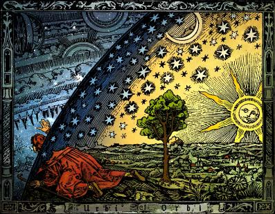

> **Первичный текст.** «Основы социологии», том 4. Страница издания: стр. 61 PDF — кандидатная привязка, требует сверки.
> Источник: файл издания `osnovy-sociologii-tom-4.pdf` (PDF в выпуск не включён). Контрольные суммы и статус проверки — в [NOTICE.md](../../NOTICE.md).
> Содержание передаёт позицию авторов издания; утверждения не верифицированы библиотекой.

---

### 12.2.4. Любовь не терпит лжи

Теперь обратимся к «Писанию», но не для того, чтобы цитатами из него что-то доказывать или опровергать, а чтобы показать весьма специфическую конкретность проявлений Любви и «нелюбви». Сначала определимся в отношении ко лжи (кривде) и правде. В «Последнем Завете» читаем:

«… тот, кто ищет неправду найдёт её во всём, и даже там, где царит одна только правда. Ибо ложь от тьмы берёт, а во тьме все цвета одинаковы и видимые очертания предметов теряют истинность. Посему ложь накладывается на всё и легко способна извратить даже правду. Правда же никогда не способна покрывать ложь» (Последний Завет. Послесловие, 285 — 288).

- Действительно, «тот кто ищет неправду, найдёт её во всём», т.е. представит Правду-Истину кривдой, неправдой и ложью и измыслит всё, необходимое ему для этого (такова «дьявольская логика»).

- Но Правда никогда не покрывает ложь, ни при каких обстоятельствах, а обличает ложь всегда.

Определившись именно так в ответе на вопрос о взаимоотношениях Правды-Истины, людской лживости и лжи, обратимся к Новому завету.

«21. … Иисус удалился в страны Тирские и Сидонские.

22\. И вот, женщина Хананеянка, выйдя из тех мест, кричала Ему: помилуй меня, Господи, сын Давидов, дочь моя жестоко беснуется.

23\. Но Он не отвечал ей ни слова. И ученики Его, приступив, просили Его: отпусти её, потому что кричит за нами.[^79]

24\. Он же сказал в ответ: Я послан только к погибшим овцам дома Израилева.

25\. А она, подойдя, кланялась Ему и говорила: Господи! помоги мне.

26\. Он же сказал в ответ: нехорошо взять хлеб у детей и бросить псам.

27\. Она сказала: так, Господи! но и псы едят крохи, которые падают со стола господ их.

28\. Тогда Иисус сказал ей в ответ: о, женщина! велика вера твоя; да будет тебе по желанию твоему. И исцелилась дочь её в тот час» (Матфей, гл. 15).

И есть притча — ответ на вопрос «Кто мой ближний?», которую приводит Лука[^80]:

«30. … некоторый человек шёл из Иерусалима в Иерихон и попался разбойникам, которые сняли с него одежду, изранили его и ушли, оставив его едва живым.

31\. По случаю один священник шёл тою дорогою и, увидев его, прошёл мимо.

32\. Также и левит, быв на том месте, подошёл, посмотрел и прошел мимо.

33\. Самарянин же некто, проезжая, нашёл на него и, увидев его, сжалился

34\. и, подойдя, перевязал ему раны, возливая масло и вино; и, посадив его на своего осла, привёз его в гостиницу и позаботился о нём;

35\. а на другой день, отъезжая, вынул два динария, дал содержателю гостиницы и сказал ему: позаботься о нём; и если издержишь что более, я, когда возвращусь, отдам тебе.

36\. Кто из этих троих, думаешь ты, был ближний попавшемуся разбойникам?

37\. Он сказал: оказавший ему милость. Тогда Иисус сказал ему: иди, и ты поступай так же» (Лука, гл. 10).

В первом эпизоде Иисус ведёт себя как расист, как не способный Любить, и оказывает помощь дочери Хананеянки не потому, что она, уверовав, просто обратилась к нему «помилуй меня, Господи!», и не потому, что она своими криками досаждала его ученикам и мешала «учебному процессу», *а потому, что она признала своё положение равным пёсьему, по отношению к «господам мира» — иудеям,* единственно для спасения которых из заблуждений якобы и был послан Иисус.

И нечего прикрываться отговорками, что «после того и по причине того — это разные вещи», поскольку *Божий Промысел никогда не создаёт двусмысленных ситуаций, дающих основание кому бы то ни было упрекнуть Бога в творении зла.*

Во втором эпизоде Иисус порицает иудейский расизм как ложное убеждение, и тем самым порицает своё же поведение в эпизоде с Хананеянкой, в котором он, как показывает Новый завет, покрыл *ложь о расовом превосходстве иудеев над якобы псам подобными остальными народами* своим авторитетом и новой ложью.

Нам ясно, что тексты Нового завета извратили Правду-Истину, некоторым образом противопоставив друг другу эти два эпизода.

Высказав это, обратимся к «Последнему Завету» «Виссариона»:

«35. Много приходилось говорить ранее, и ныне говорю вам: какой толк говорить о вере Господу своему, если вы не поверили Сыну Его, пришедшему Вам во благо ваше?

36\. Сколь редко приходилось и приходится отметить веру достойную!

37\. Так коснитесь ещё раз одного из ключиков таинства сего, который был запечатлён для вас в Писании Завета Нового! Ну а имеющий уши — да услышит!

38\. Однажды в то далёкое время приходилось идти землями стран соседних.

39\. И вот одна из жён Хананейских, уверовав, стала молить Учителя о помощи дочери своей, пребывающей в недуге тяжёлом.

40\. Долго вопрошала она, двигаясь во след Иисусу, так что и ученики стали просить за неё.

41\. Искренне проливая слёзы, женщина та не теряла надежды своей.

42\. Но когда ей довелось подойти к Учителю, она услышала суровый ответ: “Я пришёл только к погибающим овцам дома Израилева.

43\. Не хорошо взять хлеб у детей и бросить пасам”.

44\. Сей ответ не привёл в недоумение идущих следом учеников, ибо они во многом и без того считали, что Спасение даровано только им.

45\. Хотя, прозвучи сие слово во времена нынешние, оно привело бы всех вас к великому замешательству.

46\. А вот женщина та вопросившая достойно проявила веру свою, ибо, уверовав, что пред нею — Слово Божие, она смиренно восприняла сказанное как должное,

47\. Так как поверила, что ежели звучит Слово сие, то через Него говорит с нею Бог.

Есть ли что-либо больше минуты сей?

48\. Вера её умерила гордыню, которой обладала она в не меньшей степени, нежели окружающие.

49\. После сего смиренно ответила: “Но ведь и псы питаются крохами, которые падают со стола господ их”.

50\. Великая радость вспыхнула в сердце Учителя, и Он отпустил её словом спасительным» (Последний Завет. Книга обращений, гл. 26).

Вот так. И приведённые эпизоды из Нового и «Последнего» заветов мы поясним не от Писаний, а от души — по совести. Наш Господь — Бог — Творец и Вседержитель, Которому мы верим и доверяем свою жизнь и в этом мире, и по смерти. Вследствие этого проблема «спасения души» не актуальна[^81].

Бог на протяжении всей жизни человечества, в процессе восхождения к истине после первого из грехов людей, поддерживает в культуре общества Единый Завет и в повседневной жизни поддерживает всех, кто ему следует и устремляется к тому, чтобы жить в согласии с ним. Но **Единый Завет** — не догма и не основа веры, а только **напоминание о необходимости для человека верить Богу и жить в согласии с Ним на основе диалога, воплощая Его Промысел по совести**[^82]**, будучи наместником Божиим**.

Единственная истинная религия — это диктатура совести, а человек состоявшийся — осмысленная воля, подчинённая диктатуре совести.

Поскольку восхождение всего человечества к этой норме — процесс исторически длительный, а не мгновенный акт, то Бог до определённых Им сроков попустительствует заблуждениям людей, действующих по их разумению, но *никогда не поддерживает эти заблуждения*[^83]*, оказывая помощь сторонникам заблуждений либо провозглашая людские заблуждения в Своих Откровениях как истину,* но поддерживает усилия тех, кто стремится к Правде-Истине, освобождаясь от плена заблуждений и помогает в этом другим.

Иисус — воплощённое Божье Слово, Его посланник ко всем людям и потому, *он не был в праве и не мог молчанием понуждать Хананеянку, **шантажируя её бедой дочери (а шантаж — Зло),** к отказу от достоинства человека и признанию ею своего, якобы равного псу, положения* по отношению к заблудшим «ослам» из дома Израилева — тем, кому при Моисее было дано нести истинную Тору, но они не понесли её, позволили извратить Откровение и согласились с извращёнными текстами «Торы»: дабы приспособить их в извращённой редакции для осуществления господства над миром и другими народами от имени Бога[^84]. Если бы Бог нашёл, что достоинство души Хананеянки равно пёсьему, то Он и дал бы ей пёсью плоть. Однако она была воплощена в тело человека!

Всё было не так, как описывают тексты Нового и «Последнего» заветов.

\* \* \*

Иисус и ученики шли по дороге после проповеди, при которой присутствовали большей частью иудеи с расистскими представлениями о том, кто есть ближний, а кто — человекообразный рабочий скот — домашние животные, предназначенные иудеям — «господам мира сего» — в услужение. Проповедь, как это бывало уже не раз, накалила страсти в толпе, и та женщина, будучи чужеродной иудеям Хананеянкой, опасаясь ещё более возбудить в них злобу, не посмела при всех обратиться к Посланнику Божиему с просьбой о помощи в её бедах, но уверовала. Она пошла за Иисусом и его учениками, чтобы обратиться к нему уединённо, не озлобляя своим обращением толпу. И поскольку это было правильно с её стороны, такая возможность была предоставлена ей Свыше в пути Иисуса и учеников его.

Услышав зов её, Иисус, обратил шаги свои вспять, пойдя ей навстречу, а ученики остановились на дороге и потому были в стороне от их беседы. Видя веру женщины, Иисус молвил ей ласковое праведное слово о том, что дочь её исцелилась, и пусть она ступает себе с Богом и пусть живёт себе далее с верой, которую обрела.

Когда же он вернулся к ученикам своим, то застал их спорящими о том, чему свидетелями они стали: они пытались объяснить себе действия Учителя, которому уже верили, но понимали принесённое им учение пока мало и поверхностно вследствие того, что были отягощены не переосмысленным ещё грузом прошлых заблуждений иудейской культуры[^85]. Кто-то недоумевал: “Как же так? Она — Хананеянка, а Он — Мессия, послан только к заблудшим овцам дома Израилева?!![^86] Нехорошо взять хлеб у детей и бросить псам…” Другой, соглашаясь с ним, но сдерживаемый верой в то, что действия Иисуса безупречны, даже если они и непонятны и противны на первый взгляд закону, с пылом возражал, пытаясь развеять его и своё собственное недоумение словами: “Но ведь и псы питаются крохами, которые падают со стола господ их…”

Слыша всё это, недостойное Любви и человечности, порочащее и Божью Правду-Истину, и воплощённое Его Слово, Иисус остановил их спор, успокоил и рассказал им притчу о путнике, разбойниках, священнике, левите и *Самарянине, чуждом иудейскому миру,* но единственно проявившему к пострадавшему от разбойников (о национально-культурной принадлежности разбойников ничего не говорится) должные милосердие и Любовь. И все сомнения учеников развеялись, и часть пут изолганного закона пала с их душ потому, что пришло понимание: *свой — это тот, с кем самоотверженно по совести делаешь жизненное общее дело в русле Промысла Божиего*, а не тот, кто попирает это дело ногами как недостойный мусор либо паразитирует под его сенью, будь он хоть родственник тебе или единоплеменник, или соотечественник или кто-либо ещё.

\* \*  
\*

Но потом, когда очевидцы покинули этот мир, цензоры и редакторы библейских текстов — «Священного Писания» — разорвали сюжет и противопоставили друг другу в каноне Нового завета его начало и завершение, сохранив большей частью слова, но вложив некоторые из них в уста, которые их не произносили, дабы в будущем, призывая к вере приходившему воплощённому Слову Божию, подавить разум людей и Любовь взаимоисключающим смыслом разных фрагментов библейского «Писания», и тем самым подчинить обезумевшие и впавшие в бездумье толпы своей власти, противопоставившей себя Богодержавию, к которому призывали все пророки Божии, возобновляя Единый Завет по мере того, как его извращали живущие на Земле — кто по злому умыслу, а кто по недоразумению и беззаботной склонности к фантазированию. Так и получилось, что начало рассмотренного сюжета в двух версиях легло в основу текстов Матфея (15:21 — 28) и Марка (7:24 — 30), а завершение — в основу текстов Луки (10:30 — 37).

А какое толкование истинно: приведенное нами, либо данное С.А. Торопом, либо какое-то иное — знает только Бог. Мы же на Земле можем только отдать предпочтение одному из них, либо отказаться ото всех, что обусловлено совестью, сложившейся нравственностью и верой тому, кто для отдающего предпочтение той либо иной версии — господь, хотя — возможно — что и не Бог.

Бог предопределил для человека быть наместником Своим, и потому для человека предопределено не только то, чтобы он верил Богу и посланным Им, но и то, чтобы человек по возможностям своим понимал Высший Промысел, который и исповедим, и неисповедим одновременно в каждый момент:

- то, что может вместить в себя верующий, — исповедимо для него,

- а то, что не может вместить, — свершится как неисповедимое таинство, не отрицая исповедимого, но превзойдя его, и верующие Богу будут рады тому.

И не бывает так, чтобы в Божьем Промысле смысл того, что оглашено явно и потому исповедимо, отрицался бы смыслом того, что явно не оглашено и осталось в неисповедимых таинствах (в умолчаниях). Если Вы такое выявляете, но Вы эгоист, пекущийся только о себе, то смело можете отрицать такое учение; а если Вы не эгоист и принимаете на себя некоторую долю в наместничестве Божием на Земле, то вы обязаны это обличить — такие штучки не от Бога.

Бог даёт возможность человеку испытать свою веру Богу жизнью самого́ человека, но не периодическим ниспосланием взаимно исключающих предписаний: сегодня верить в то-то, а завтра прежде ниспосланное почитать ложью, заблуждением, а не истиной и начать верить в противоположное тому по смыслу.

И неуместны разнородные прикрытия отговорками в том духе, что, дескать, прежде вы не доросли до понимания некоторых истин, и потому пришлось дать вам ложные их заменители, которые, однако, способствовали вашему развитию, а теперь — доросли, и потому от прежнего надо отказаться и верить новым ниспосланным «истинам».

В этом случае исчезла бы разница между Богом и Сатаной, а «дьявольская логика» стала бы неотличима от диалектики познания, предопределённой для человека Свыше в качестве нормы.

И в Коране об этом говорится прямо: *«Не меняется слово у Меня, и не тиран Я для рабов»* (сура 50:28 (29)).

Бог способен сказать одну и ту же истину так, *чтобы её поняли сообразно самой себе и в начале пути развития, и на последующих его этапах*[^87]*,* вследствие чего по достижении более высокого уровня развития прежнее Откровение, раскрывая новый смысл, начнёт сверкать новыми гранями Правды-Истины и откроет новые глубины миропонимания, которые были прежде недоступны восприятию при прежнем уровне развития.

Примером тому коранический запрет на ростовщичество (Коран, 2:276 (275), в частности). Этот запрет выражает не только порицание ростовщика персонально как паразита, что понятно во все эпохи всем труженикам. **Он представляет собой системное средство защиты общества и его экономики от порабощения корпорацией ростовщиков, что для многих нуждается в доказательствах и в наши дни.** В эпоху, когда был ниспослан Коран, уровень развития науки не позволял показать этот результат бухгалтерски строго: математика не была развита настолько, чтобы с её помощью можно было построить модели обменных процессов в сетях, включая торговые сети. И прошло более 1 200 лет до того времени, когда математика развилась настолько, что балансовые модели, построенные на основе матрично-векторного исчисления, позволили показать именно этот аспект коранического запрета на ростовщичество.

Да и сами Вы способны ребёнку правдиво рассказать о чём-то, снисходя к его уровню развития, а взрослому о том же самом — соотносясь с его уровнем развития. Так с какой целью отрицать за Богом такую способность? — Она присуща Ему в наиболее совершенном и безупречном виде.

А если от Промысла кому-то достаётся только неисповедимая часть его, тем более приносящая неприятности, которые до́лжно осознать как некие адресованные тебе лично намёки Свыше, то это признак проблем той веры и религии, которые несёт в себе тот, кто полагает себя поистине верующим и религиозным человеком, но захлёбывается в неисповедимом Промысле: Бог не садист[^88].

Бог достаточно могуч, чтобы не нуждаться во лжи при осуществлении Своего Промысла[^89]. Он способен сказать всякую Правду-Истину, снизойдя к уровню развития того, к кому Он обращается, на понятном тому Языке (в самом общем смысле этого слова, как средства передачи информации). Если бы это было не так, то во многих обстоятельствах исчезало бы различие между тем, что от Бога, и тем, что от Сатаны, и вера Богу и вера Сатане стали бы единой нераздельной верой. В «Последнем» же завете читаем:

«Если твоя неправда несёт зло, то душа твоя у врат великих страданий.

Если неправда несёт разочарование, то сие будет злом.

Неправда, покрывающая зло, — ещё большее зло.

Но неправда, несущая благо, есть мудрость» (Последний Завет. Заповеди, заповедь № 3).

Мудрость земная для человека состоит в том, чтобы ни при каких обстоятельствах не лгать и не делать неправды-кривды (осознанной лжи), а найти ту правду, которую до́лжно сказать и сделать; **и найти в себе силы, чтобы в любых обстоятельствах изрекать и творить Правду**. Но эта способность обретается в бесстрашии Любви.

Если человек не способен вести себя так *во всех без исключения обстоятельствах,* то он **объективно** делает не то дело, о приверженности которому заявляет открыто, а какое-то другое дело, даже в том случае, если он не осознаёт того — другого — дела.

Лжи «во спасение» не бывает. Всякая ложь — дань Сатане и прямой путь к одержимости[^90], ибо Бог оставляет в Своём попущении тех, *кто* *порочит Его тем, что осознанно лжёт,* *поддерживает заблуждения и вводит в заблуждение других.* Кроме того, ложь, излитая в информационную среду общества (в культуру) якобы «во спасение», закрепившись в ней, может лечь в основу управленческих решений в качестве неоспоримой истины, вследствие чего таким управленческим решениям неизбежно будут сопутствовать те или иные пороки и бедствия. Людям дано Свыше чувствовать всё это через совесть и интуицию, и потому приведённая заповедь «Виссариона» вызывает настороженность у многих, и эта настороженность — праведна.

В качестве примера благодетельной лжи С.А. Тороп приводит пример, как сосед Василий изображает Деда Мороза.

«3. … “Виссарион! Неправда, несущая благо, есть мудрость! Объясни эту заповедь. Разве обман — это не порок?”

4\. “Когда к вашему ребёнку приходит Дед Мороз, вы же не объясняете чаду, что это пришёл сосед Василий. Вы оставляет ребёнка в сказке.

5\. Помните! Обман во имя себя — невероятное горе.

6\. Обман во имя человека, во имя развития души его — благо.

7\. Вырывать отдельные заповеди из единого целого нельзя. Необходимо исполнить все заповеди до единой, безмерно открывая душу свою пред Отцом!”» (Последний завет. Повествование от Вадима, часть 2, гл. 13).

Это хороший пример — однако совсем другого явления потому, что в описанном случае пресловутый «сосед Василий» не лжёт, не творит обман; он творит некий новый аспект реальности (сказочной), которая существует как матрица и как полевая структура. Когда «сосед Василий» творит сказку для ребёнка, и ребёнок в неё входит, то они вместе *некоторое время* живут в сотворённой «соседом Василием» реальности[^91], которая однако доступна не для всех и потому воспринимается ими как обман. Произведения творчества, в том числе и художественного, и ложь — это в принципе разные явления, хотя творчество — даже гениальное — может быть и лживым, и убийственным[^92]. В данном примере обман может возникнуть только тогда, когда «сосед Василий» творит сказочную реальность неумело, вследствие чего ребёнок не может в неё войти, и вместо пришедшего к нему Деда Мороза видит придуривающегося «соседа Василия», который пытается его обмануть. Но о том же и слова К.С. Станиславского (1863 — 1938) — «не верю!», которыми он характеризовал дурную игру актёров и дурную режиссуру. В этом смысле художественное творчество и магия — родственны, что в прошлом неоднократно вызывало неудовольствие ханжей и фанатиков от всех вероучений и порождаемых ими *эгрегориальных религий*[^93]: в частности, РПЦ в прошлом искореняла скоморошество, которое резало правду-матку, неприемлемую «элите».

[^79]: Из этого сообщения неоспоримо ясно, что ученикам Христа Любовь не была свойственна. Они просто хотели, чтобы женщина не мешала им жить, и по своекорыстию такого рода просили Христа, чтобы он удовлетворил её мольбу, дабы она не досаждала им своими воплями. Не свойственна в этом эпизоде Любовь и Христу. Исцеление по просьбе апостолов — в этом случае было подачкой, а не выражением Любви; исцеление в ответ на признание своего достоинства равным пёсьему — было бы самопревознесением в демонизме, угнетающем окружающих, а не выражением Любви.

    Т.е. описываемая в каноне Нового завета ситуация во многом аналогична эпизоду из «Двенадцати стульев» И. Ильфа и Е. Петрова, когда отец Фёдор на даче у инженера Брунса домогается стульев («не корысти ради, а токмо волею пославшей мя жены»), чем доводит Брунса до полной прострации, под воздействием которой Брунсы были вынуждены отдать стулья настырному вымогателю за бесценок.

[^80]: В изложении событий Лукой эта притча продолжает диалог Христа с законником, который вопрошал о вечной жизни и которому было предложено вспомнить, что написано в законе о *заповедях Любви*. Об этом речь шла ранее разделе 12.2.2. После провозглашения заповеди Любви исключительно к Богу законник задал Христу вопрос о том, кто есть его «ближний», и получил ответ в виде этой притчи.

[^81]: Проблема «спасения души» актуальна, если Вы пока ещё эгоист, но всё же стремитесь приобрести для себя благую долю в Вечности.

[^82]: В этом контексте напомним ещё раз: совесть — врождённое религиозное чувство, «подключённое» к бессознательным уровням психики личности, и которое должно быть осознанно в таковом качестве для того, чтобы человек состоялся Человеком.

[^83]: «Неужели станете вы учить Бога вашей вере, когда Бог знает то, что в небесах и что на земле? И Бог знает о всякой вещи!» (Коран, сура 49:16).

[^84]: «Те, кому было дано нести Тору, а они её не понесли, подобны ослу, навьюченному книгами. Скверно подобие людей, которые посчитали ложью знамения Божии! Бог не ведёт людей неправедных!» (Коран, сура 62:5).

[^85]: См. Часть 1 настоящего курса, посвящённую личностной психологии, формированию мировоззрения и миропонимания под воздействием культуры, роли нравственности в работе личностной психики и взаимодействии личностной психики и эгрегоров.

[^86]: Так гласило их Писание, отрицающее Откровение Единого Завета, данное им через Моисея.

[^87]: Даже если вспомнить пресловутую «твердь небесную», то в одной из моделей Мироздания науки наших дней *«эфир» (физический вакуум) — представляет собой кристаллическую структуру* (т.е. может быть вполне оправданно уподоблен твёрдому веществу в кристаллическом агрегатном состоянии), и в кристаллической структуре «эфира» распространяются разного рода волны (и волновые пакеты), которые мы воспринимаем как объекты микро- и макро- миров и их движение; характер волн определяется тем набором степеней свободы элементов кристаллической решётки, которые задействованы в соответствующих излучениях.

    Именно в силу того, что эфир — кристаллическая структура, частью которой является и волновой пакет под названием «планета Земля», эксперименты по поиску «эфирного ветра» при движении планеты (которое представлялось аналогичным движению твёрдого тела в жидкости) показали его отсутствие, что было интерпретировано наукой как подтверждение объективного факта несуществования «эфира». Но вне осознания осталось, что эти эксперименты подтвердили факт несуществования *«эфира» как жидкости,* в которой движутся отличающиеся от «эфира» по своей природе макротела (включая планеты и планетные системы) подобно тому, как отдельные корабли и эскадры движутся в воде; но эти эксперименты и их интерпретации никоим образом не затронули концепцию «эфира» как кристалла.

    И соответственно «твердь небесная» — вполне адекватная метафора, которая соответствует реальности бытия Вселенной, но понимание которой в смысле существования «тверди небесной» в виде «хрустального свода небес над плоской землёй», «хрустальных небесных сфер» с прикреплёнными к ним планетами и звёздами и т.п. — неадекватно ни метафоре, ни объективной реальности. К тому же «кристалл» и «хрусталь» — изначально одно и то же слово, обретшее разные звучания и новые смыслы при переходе из древнегреческого языка в другие языки. Т.е. и метафора «хрустальный свод небес» тоже адекватна представлениям об «эфире» как о кристаллической структуре. Но это — другая физика, а не та, которую мы все изучали в общеобразовательной и в высшей школе.

    Но «альтернативной физике» должны соответствовать иные нравственность и этика человечества, поскольку при тех нравах и этике, что воспроизводится толпо-«элитарными» культурами на протяжении нескольких тысячелетий, остаётся открытой возможность повредить «хрустальный свод небес» и обрушить его обломки на головы не только себе, но и другим обитателям Вселенной: *«А если бы истина последовала за их страстями, тогда бы пришли бы в расстройство небо, и земля, и те, кто в них»* (Коран, 23:73 (71)).

[^88]: И согласие с *клеветническим* анекдотом про неудачника, который якобы взмолился Богу и получил ответ Свыше: «Да просто не люблю я тебя…» — богохульство.

    Если есть поток неудач, то его причины в особенностях личности: в её нравственности, в её культуре чувств, интеллектуальной и психической в целом деятельности. Но и в этом случае неудачник живёт в Любви Божией, которая включает в себя и ту составляющую Вседержительности, которая получила наименование — попущение Божие. Однако в нём Любовь реализуется своеобразно: в нём люди развиваются (если развиваются) под давлением обстоятельств, а не исходя из несомой ими Любви. Об этом речь пойдёт далее.

[^89]: «Что откроет Бог людям из Своей милости, — для этого не будет удерживающего, что Он сдержит, — тому нет посылающего после Него. Он — великий, мудрый!» (Коран, 35:2 (2)).

[^90]: Коран, сура 26: «221. Не сообщить ли Мне вам, на кого нисходят сатаны? 222. Нисходят они на *всякого (выделено курсивом нами при цитировании: т.е. нет исключений)* лжеца, грешника».

[^91]: В творчестве создаётся реальность, пусть даже не воплощённая в веществе, но реальность — матрично-полевая. Именно по этой причине накапливается статистика, согласно которой многие актёры и писатели повторяют судьбы персонажей, которых они сыграли или сопереживали. Поскольку действие происходит в реальности, порождаемой актёрами и режиссёром на основе определённого сценария, то прав был выдающийся русский актёр Георгий Михайлович Вицин (1917 — 2001), говоря, что *«в роль надо не только уметь войти, но надо уметь выйти из неё»*. Но, к сожалению, этот аспект актёрского мастерства избыточно часто упускают из вида, что влечёт за собой подчас весьма печальные последствия для актёров (и реже — для режиссёров), когда трагические события из сюжетов, к художественному представлению которых они приложили свои таланты, начинают воплощаться в их жизни, подчас обрывая её…

[^92]: Примером тому «Страдания юного Вертера» (И.В. Гёте, 1774 г.), выход в свет которых повлёк за собой эпидемию самоубийств среди *беззаботно и безответственно* читающей молодёжи Европы, вследствие чего в некоторых государствах роман был запрещён на протяжении некоторого времени.

[^93]: См. Часть 3 настоящего курса, том 3, раздел 10.5.
---

[← Назад](ch-12-s12-02-03.md) · [Оглавление тома 4](../README.md) · [Вперёд →](ch-12-s12-02-05.md)
