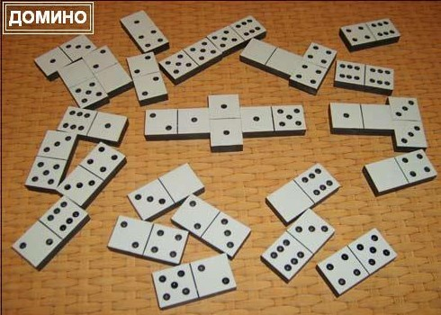

> **Первичный текст.** «Основы социологии», том 4. Страница издания: стр. 189 PDF — кандидатная привязка, требует сверки.
> Источник: файл издания `osnovy-sociologii-tom-4.pdf` (PDF в выпуск не включён). Контрольные суммы и статус проверки — в [NOTICE.md](../../NOTICE.md).
> Содержание передаёт позицию авторов издания; утверждения не верифицированы библиотекой.

---

### 13.2.3. Не будь «костяшкой» в чужих «играх» в «домино»

Если говорить о том же самом, но в терминологии, принятой в современной психологии Запада, то всякое множество людей (толпа и народ, в том числе) несёт *коллективное бессознательное*[^242] и управляется им: т.е. порождает эгрегоры[^243] и управляется ими, в свою очередь оказывая на них воздействие соответственно эгрегориальному статусу каждого. Но о том, что эгрегориальная алгоритмика (коллективное бессознательное и множество индивидуальных сознаний участников соответствующего коллектива) работает в русле Вседержительности, исторически сложившаяся психологическая наука Запада умалчивает вследствие своей неспособности поставить исходный вопрос психологии как науки[^244], причиной чего является приверженность атеизму в той или иной его форме.

Коллективное бессознательное представляет собой информационно-алгоритмическую систему, т.е. несёт в себе модули определенного смысла и функционального назначения, распределённые своими различными фрагментами по психике каждого из множества разных людей[^245], а также локализованные в полевых телах соответствующих эгрегоров. Эти модули предопределяют (многовариантно) процесс самоуправления коллектива[^246], поскольку *людям в их множестве* помимо биологической общности свойственна общность, во-первых, культуры[^247], а во-вторых, по энергетическим характеристикам их биополей. То есть информационно-алгоритмический обмен, являющийся сутью процессов управления и самоуправления, в обществе носит двухуровневый характер: 1) на уровне биополевой общности людей и 2) на уровне культуры (виды искусств, средства массовой информации, наука и образование и их вещественные носители и связанные с ними общественные институты).

Коллективное бессознательное и спектр осознаваемых людьми мнений в таком понимании функционирования коллективной психики, будучи объективно существующим информационно-алгоритмическим процессом, поддаётся целенаправленному сканированию[^248] и анализу, поскольку обрывки информационных модулей так или иначе находят своё выражение в произведениях культуры разного рода: от ахинеи «жёлтой прессы» до фундаментальных научных монографий, в ряде случаев понятных только самим авторам и нескольким их наиболее «продвинувшимся» коллегам.

Один человек или аналитическая группа в состоянии систематически сканировать множество публикаций и высказываний разных людей по разным вопросам, выбирая из этого множества фрагменты функционально-ориентированных информационных модулей, принадлежащих коллективному бессознательному и управленчески значимому множеству сознаний участников соответствующего коллектива.

Кроме того, при определённых навыках, осуществимо и осознание информационно-алгоритмического содержания эгрегоров без посредничества памятников культуры.

При этом, если процесс идёт в русле Промысла, то его участникам Богом даётся Различение, а ноосферная алгоритмика сама приводит аналитиков к необходимой информации либо приносит её им через СМИ, других людей, сны и т.п. Это избавляет от необходимости стремиться просмотреть как можно больший объём разнородной информации и высвобождает время, поскольку нахождение необходимой для деятельности информации со стороны выглядит как всегда безошибочный процесс, описываемый поговоркой «ткнуть пальцем в небо», в котором промахнуться весьма затруднительно.[^249]

В такого рода перекачке информации из коллективного бессознательного в индивидуально осознаваемое — одна из множества сторон процесса общественной жизни, развития в обществе культуры — как овеществленной в «артефактах» (памятниках культуры), так и духовной (биополевой). Если этот процесс протекает устойчиво и бесконфликтно между индивидуальным сознанием и бессознательным (как индивидуальным, так и коллективным) в русле Промысла, то это можно назвать *устойчивым личностным развитием* в соответствии со схемой 3 (см. раздел 5.4 — Часть 1).

После анализа состояния коллективного бессознательного и соответствующего ему управленчески значимого множества сознаний участников коллектива, на коллективное бессознательное и сознания его участников возможно оказать воздействие в *субъективно* избранном направлении их изменения, преследуя определённые цели, если «сгрузить» в эгрегоры или культурную среду информацию, объективно соответствующую, во-первых, целям и во-вторых, информационно-алгоритмическому состоянию общества. Это действие соответствует стрелочке, идущей из блока 4 в блок 1 на рис. 13.2.2‑2.

Однако, такое воздействие может быть произведено и вопреки долговременным жизненным интересам большинства; вопреки тому, как большинство понимает и выражает свои жизненные интересы; но сделать это возможно, если люди не умеют, а *главное и не желают*[^250], защитить свое коллективное бессознательное (ноосферу) и его воздействие на их коллективное поведение от всего дурного (во всех смыслах этого слова[^251]), что свойственно обществу, и от воздействия враждебных им или безучастных к их судьбам сторонних эгоистичных сил.

Коллективное бессознательное и соответствующая ему *совокупность индивидуальных сознаний,* если признавать в качестве объективной данности триединство *материи-информации-меры*, — своего рода информационно-алгоритмическое «домино» (см. рис. 13.2.3-1).

*Рис. 13.2.3-1. Эгрегориальная алгоритмика — своего рода «домино»*

Каждая мысль (в большинстве случаев мыслительной деятельности людей) имеет начало и конец (направленность), и в этом аспекте она аналогична костяшке домино. Перед нею может встать[^252] иная мысль, которую первая объективно будет продолжать; но может найтись и мысль, продолжающая первую. И каждая из них может принадлежать разным людям. И есть некий «информационно-алгоритмический магнетизм»[^253], вследствие которого, как и в настольном домино, в информационно-алгоритмическом «домино» коллективного бессознательного и соответствующей совокупности индивидуальных сознаний участников коллектива есть возможные и невозможные взаимные соответствия завершений и начал мыслей (т.е. не каждая мысль может продолжить другую или ей предшествовать). Отличие только в том, что возможные соответствия «завершение информационного одного модуля — продолжение его иным информационным модулем» в информационно-алгоритмическом «домино» эгрегоров не однозначно (т.е. продолжить мысль или предшествовать ей может не какая-то одна мысль, а мысли из некоего множества, допускаемого матрицей бытия Мироздания). Но кроме того неоднозначность продолжений в информационно-алгоритмическом «домино» эгрегоров вызвана и тем, что в этом сплетении мыслей и их обрывков участвует множество людей одновременно, оттесняя своими мыслями мысли других: как в аспекте статистического преобладания, так и в аспектах превосходства по энергетической мощи и соответствия «формата» энергии мысли «формату» системы кодирования информации, свойственной тому или иному эгрегору конкретно. И в отличие от настольного домино, где определённая по составу группа игроков плетёт только одну информационную цепь, в коллективном бессознательном и соответствующей ему совокупности сознаний участников коллектива плетётся множество *информационно-алгоритмических выкладок*[^254] одновременно как из завершённых мыслей, так и из обрывочных, порождаемых разными людьми на уровне биополевой общности и на уровне средств культуры.

Какие-то информационные выкладки могут замкнуться концом на своё же начало, иллюстрацией чего является известное многим повествование: *«У попа была собака. Он её любил. Она съела кусок мяса — он её убил, вырыл яму, закопал, крест поставил, написал: “У попа была собака... и т.д.”».* Если построенное таким образом кольцо недоброй информационно-алгоритмической выкладки коллективного бессознательного и соответствующей совокупности индивидуальных сознаний участников коллектива устойчиво, то оно может работать в режиме нескончаемых кругов ада, вовлекая в себя всех, у кого есть соответствующие «костяшки», чтобы к нему подключиться.

В других случаях кольцо информационно-алгоритмической выкладки может поддерживаться относительно немногочисленным подмножеством людей, и процессы, в нём происходящие, будут не способны увлечь остальное большинство, если в это кольцо нет открытых входов для завершений чужих мыслей и открытых окончаний, ему свойственных, к которым могли бы пристроиться сторонние начала мыслей и завершения. Либо же открытые входы-выходы есть, но в информационной среде общества отсутствуют необходимые проставочные информационные модули (информационные мосты между данным информационным кольцом-цепью и другими иерархически взаимовложенными информационными кольцами), которые могли бы соединить открытые входы-выходы со всеми прочими информационными выкладками коллективного бессознательного и соответствующей совокупности сознаний участников коллектива.

Именно по этой причине заглохли «демократизаторские» буржуазно-либеральные преобразования в России: узок круг «демократизаторов»; страшно далеки либералы от пахарей, рабочих и прочих работящих, которым до «демократизаторов» нет конкретного дела; и варятся «демократизаторы»-либералы в собственном соку и грызутся между собой...

*Узок и круг нацистов в России... И им — только на символике да на не переосмысленных идеях, некогда внедрённых в чужое государство, разгромленное прошлыми поколениями россиян и всех русских (по признаку цивилизационной принадлежности), — не объединиться с пахарями, рабочими и прочими работящими*[^255]*.*

Но может случиться и так, что какая-то информационная выкладка, поддерживаемая также весьма небольшим числом людей, содержит в себе множество завершений собственных, открытых для присоединения чужих начал, и ответных продолжений чужих завершенных мыслей и их обрывков (аналогом этого в настольном домино являются кости-дуплеты, лежащие поперек цепи костяшек). Такая информационная выкладка может замкнуть на себя каждодневную деятельность почти всего общества. И направленность общественного развития, свойственная такого рода выкладке информационных модулей в коллективном бессознательном и соответствующей совокупности сознаний участников коллектива, определит дальнейшую жизнь общества. Вне этого процесса останутся разве что те, кто поддерживает *кольцевые информационно-алгоритмические темницы для самих себя*[^256], в которые нет открытых входов, и из которых нет открытых выходов для завершений и начал мыслей остального большинства людей.

Может случиться так, что в какой-то информационно-алгоритмической выкладке есть разрыв и не достаёт всего лишь одного доброго слова, чтобы она стала благодатной программой управления общественным развитием со стороны коллективного бессознательного или соответствующей управленчески значимой совокупности сознаний участников коллектива.

Но может случиться и так, что одного неосторожного обрывка мысли окажется достаточно, чтобы в коллективном бессознательном и соответствующей ему совокупности сознаний участников коллектива заполнить разрыв в какой-то информационно-алгоритмической выкладке, и тем самым дать старт действию какой-то программы общественного самоуправления, которая способна уничтожить плоды многих тысячелетий развития культуры.

Поэтому, памятуя об информационно-алгоритмическом «домино» коллективного бессознательного и соответствующей ему совокупности сознаний участников коллектива, их управляющем воздействии на течение событий, человеку должно быть аккуратным даже в собственных обрывках *сонных* мыслей, а не то что в мысленных монологах перед своим «Я» или в громогласной работе на публику в кампании друзей или в средствах массовой информации.

Если не ходить вокруг, да около, то:

Духовная культура общества — это культура формирования информационно-алгоритмических выкладок в коллективном бессознательном и соответствующей ему совокупности сознаний участников коллектива. Какова культура — духовная — такова и жизнь общества.

Нынешнее состояние России и история её последних нескольких столетий при таком взгляде говорит о господстве в повседневности крайне извращенной и загрязненной духовной культуры. Впрочем, это относится и к остальным модификациям толпо-«элитарной» культуры в ближнем и дальнем зарубежье, хотя там иная проблематика.

Кто не согласен с этим утверждением о реальной духовности России, пусть опровергнет слова апостола Павла: *«И духи пророческие послушны пророкам, потому что Бог не есть Бог неустройства, но мира. Так бывает во всех церквах у святых»* (1‑е послание Коринфянам, 14:32, 33). Реальное состояние страны не отрицает хранимых ею высоких идеалов[^257] и зёрен праведной духовности под грудой мусора и извращений, но является выражением распущенности, беззаботности и безответственности при известных высоких идеалах и притязаниях когда-нибудь воплотить их в жизнь.

В нашей стране одним из немногих, кто не только понял значимость учения о ноосфере для формирования будущего глобальной цивилизации, но и содействовал ознакомлению широких масс с этими идеями, и в особенности — подрастающих поколений, был Иван Антонович Ефремов (1907 — 1972) — выдающийся русский палеонтолог и писатель. Повествуя о светлом будущем Земли в философско-социологическом романе «Час быка», он пишет как об уже достигнутом нашими потомками результате: *«Очистка ноосферы от лжи, садизма, маниакально-злобных идей стоила огромных трудов человечеству Земли».*

Но для нас **выделенное курсивом в предшествующем абзаце это — та работа, которую предстоит сделать**. За нас её никто делать не будет.

И главное — И.А. Ефремов прав: **О ноосфере надо заботиться больше, чем об атмосфере** («Час быка»), поскольку все экологические — биосферно-социальные проблемы и бедствия — следствие нерешённости проблем взаимоотношений в русле Божиего Промысла множества людей и ноосферы.

Коллективное бессознательное и соответствующая ему совокупность сознаний участников коллектива иерархически организованы: от семьи и группы сотрудников на работе до наций и человечества в целом. Эта иерархическая организованность имеет место в системе объемлющих взаимных вложений, каждомоментно меняющих свою структуру и иерархичность. Это подобно матрёшке, но отличие от реальной матрёшки в том, что, если вскрыть самую маленькую «матрёшку» в коллективном сознательном и бессознательном, то в ней может оказаться любая из её объемлющих больших со всеми другими, поскольку человек — часть Мироздания, отражающая в себя всю Объективную Реальность в её полноте и целостности с той или иной — субъективно обусловленной — мерой детальности.

Возможно, что кто-то, после прочтения работ классиков западного психоанализа конца XIX — первой половины ХХ века, задастся вопросом, а следует ли отходить от их воззрений на коллективное и индивидуальное бессознательное и сознательное, как разгула стихии эмоций и инстинктов в поведении отдельных людей и их множеств?

При ответе на этот вопрос следует иметь в виду, что отказ от понятийного и терминологического аппарата, свойственного традиционным школам психологии, совершён не вследствие воинствующего невежества, встревающего со своим мнением в дискуссию профессионалов.

Во-первых, «эмоциональные оценки»[^258] — по их существу примитивизированные отображения на уровень сознания больших по объёму информационных модулей, свойственных иным — более мощным уровням психики, которые просто не вмещаются в сознание как целостность в темпе течения событий, и которые тем не менее несут определённый смысл и предопределяют направленность поведения[^259]. Поскольку инстинкты и эмоции в конечном итоге это — определённая информация и алгоритмика, лежащие в основе поведения каждого индивида и множеств людей, то сохранение эмоционально-инстинктивной терминологии при обсуждении коллективного бессознательного и сопутствующей ему совокупности сознаний участников коллектива это — молчаливое уклонение от вопроса о смысле управленческой алгоритмики и информации, на основе которой эгрегоры воздействуют на общество и на людей персонально.

Во-вторых, исторически сложившиеся под властью библейского проекта школы психологической науки, рассматривающие общественные процессы исходя из вопроса о воздействии на их течение коллективного бессознательного и «общественного сознания», которое реально не существует (сознание всегда индивидуально), сформировались до того, как в жизни глобальной цивилизации произошло одно важное качественное изменение. Оно прошло вне их поля зрения и понимания, поэтому попытка понять и предвидеть общественные процессы в современности на основе взглядов классиков психологии и психоанализа, выраженных в конце XIX — первой половине ХХ века — предопределенно обречена на ошибочные выводы.

Дело в том, что все прикладные психологические тесты, построенные на основе воззрений исторически сложившихся психологических школ, не учитывают объективно свершившегося изменения соотношения эталонных частот биологического и социального времени[^260], которое произошло во второй половине ХХ века, и в результате чего культурно-своеобразные общества и глобальная цивилизация в целом обрели новые свойства. Эти новые свойства возникают именно под давлением изменившегося соотношения эталонных частот биологического и социального времени, вследствие чего меняется мотивация и логика поведения множества людей, а также — и характер ответного воздействия среды обитания на общества и индивидов. Соответственно, прежние психологические тесты оказываются не чувствительными ко многим общественно опасным психологическим явлениям, но на их основе выдаются ошибочные рекомендации, прежде всего в области подбора и расстановки кадров.

С проблематикой коллективного бессознательного и соответствующей ему совокупностью сознаний связана ещё одна сторона функционирования информационных систем. Из теории управления известно, что в функционировании больших информационных систем проявляется взаимная дополнительность: 1) принципов, реализующихся в них по оглашению (это определено непосредственно так...), и 2) принципов, реализующихся в них же по умолчанию (это — само собой разумеется, и хотя определённо не оглашено, но введено опосредованно и определено, через объективные причинно-следственные обусловленности, реализованные при построении системы в ней самой, и причинно-следственные обусловленности существования системы в окружающей её среде[^261]).

При этом возможны системы, представляющие собой своего рода «троянского коня»: провозглашаемые при их построении принципы в реальном их функционировании подавляются принципами, введёнными в них же по умолчанию и не провозглашёнными в явной форме прямо: они «само собой разумеются», но... по-разному создателями системы, её пользователями, а по отношению к социальным системам — их «элементной базой», т.е. членами того или иного культурно своеобразного общества[^262].

В силу ограниченной информационной ёмкости носителей и ограниченной мощности средств передачи и обработки информации невозможно построить информационную систему, в которой бы не было информации, введённой в неё по разного рода умолчаниям. Заказчик любой системы должен это понимать и позаботиться о том, чтобы система умолчаний, принятая разработчиком, не противоречила *«само собой разумению» — умолчаниям* заказчика. По отношению же к социальным системам разного рода это означает, что и умолчания, и оглашения, должны лежать в русле соблюдения всех шести категорий объективных закономерностей бытия человечества (см. раздел 13.1), обеспечивающих устойчиво-бескризисное развитие общества в преемственности поколений в гармонии взаимоотношений с Природой и Богом.

Человеческое общество в своём историческом развитии представляет собой также систему, информационно-алгоритмическим процессам в которой свойственна взаимная дополнительность информации по оглашению и информации по умолчанию. Причём взаимное соответствие информации по умолчанию и информации по оглашению в суперсистемах, к классу которых принадлежит общество, определено не однозначно, а множественно и описывается статистическими закономерностями.

Но распределение информационного обеспечения самоуправления общества по категориям «умолчания» и «оглашения» в человеческом обществе определяют взаимоотношения совокупности сознаний членов общества, в которое попадают все оглашения, и коллективного бессознательного, в которое попадают не только все оглашения, но и все умолчания. Вследствие этого многие оглашения проявляют себя не однозначно, попадая в те или иные информационно-алгоритмические выкладки ноосферного «домино».

Кроме того следует иметь в виду, что как в психике каждого человека существует внеязыковой уровень обработки информации в неких субъективных образах, так и в коллективном бессознательном и соответствующей ему совокупности сознаний участников коллектива также существует внеязыковой уровень, также принадлежащий к умолчаниям и при определённых обстоятельствах управляющий оглашениями, а при других обстоятельствах — подчинённый им.

[^242]: Как уже отмечалось, «коллективное бессознательное» — термин, введённый К.Г. Юнгом в 1916 г.

[^243]: См. раздел 4.8 (Часть 1 настоящего курса).

[^244]: Исходный вопрос психологии как науки: *Самодостаточен ли индивид в способности выделить «сигнал», несущий ему информацию, от фона всевозможных «шумов» и помех?* См. раздел 5.1 (Часть 1 настоящего курса).

[^245]: При этом некий функционально-целостный информационный модуль может оказаться не сосредоточенным в психике одного человека, а рассредоточенным в психике множества людей своими разными фрагментами. В этом случае, он — как информационная целостность — недоступен осознанному восприятию отдельной личности, но если все его носители встретятся и, выделив его фрагменты в своей индивидуальной психике, выразят их на уровне сознания, то он станет доступным осознанному восприятию в целом и для индивидуального сознания — и их самих, и остальных членов общества.

[^246]: За исключением осмысленно волевых аспектов деятельности участников, которые не являются продолжением эгрегориальной алгоритмики.

[^247]: Культура по её сути — информационно-алгоритмическая система, передаваемая в обществе в преемственности поколений помимо генетического механизма биологического вида на основе социальной организации и общения индивидов.

[^248]: «Сканировать» в переводе на русский — *непрерывно* просматривать с определёнными целями, в том числе и в целях проверки и выявления проблем, новизны и т.п.

[^249]: Т.е. ноосферная алгоритмика не только уничтожает тех, кто исчерпал Божие попущение; не только сдерживает тех, кто пытается что-то сделать вне русла Промысла, но попущение ещё не исчерпал; созидание тоже протекает в русле ноосферной алгоритмики, и оно ею поддерживается, т.е. созидателям, действующим в русле Промысла, «везёт» в осуществлении их деятельности, а их оппонентам — нет.

[^250]: В этом и проявляются отговорки «один в поле — не воин», «я — человек маленький, от меня ничего не зависит». Именно они реализуются в том, что с молчаливого одобрения равнодушных, «маленьких» недочеловеков и «один в поле не-воинов» в Мире — в пределах попущения Божиего — систематически творятся всевозможные злодейства.

[^251]: Дурное — и нравственно порочное, и глупость.

[^252]: Равно: возможно умышленно вставить.

[^253]: В его основе — мера, общевселенская матрица возможных состояний материи и путей перехода из одного состояния в другие; по отношению к информации (смыслу), мера — система её кодирования. См. раздел 3.7 (Часть 1 настоящего курса).

[^254]: Это — термин в настоящем контексте, указующий на то, что в отличие от цепи костяшек в домино, информационной выкладке объективно свойственна направленность чтения, т.е. воспроизведения информации в действиях людей.

[^255]: Но политические амбиции есть, и из них проистекают попытки неонацистов «профильтровать» КОБ и модифицировать «фильтрат» так, чтобы получилась версия «русского» нацизма. В частности, из этого процесса проистекают утверждения о том, что в «Майн кампф» высказано порядка 60 % мыслей, которые в КОБ выражены в иной терминологии. И, соответственно, КОБ — развитие идеологии «национал-социализма».

    Но точно также и интернацисты «выводят» КОБ из марксизма, настаивая, что КОБ — дальнейшее развитие марксизма.

    В действительности же КОБ проистекает из Единого Завета, о чём говорится в «Мёртвой воде» ещё в первой редакции (1991 г.), хотя и не в прямой форме:

    «Обратим внимание: Коран — единственное Писание, которое прямо говорит о ниспослании Различения: “И вот, Мы дали Мусе (Моисею — авт.) Писание и Различение, — может быть, вы пойдёте прямым путём!» (сура 2:50 (53)). В суре 25, названной «Различение», в аяте 2 сказано, что Бог “создал всякую вещь и размерил её мерой». Придерживаясь этого Различения, пойдём дальше» («Мёртвая вода», Введение).

    Коран же — запись последнего из Откровений Единого Завета. А неадекватность «мраксизма» и «Майн кампф» и проистекающих из них политических практик задачам развития СССР и человечества — в 1991 г., когда формировался текст «Мёртвой воды» и разрабатывалась редакция ДОТУ, для участников ВП СССР была вполне очевидна.

    И то, что и в литературе «мраксизма», и в «Майн кампф», и в программе НСДАП далеко не всё вздор, но есть и соответствующие действительности *отдельные* жизненно состоятельные утверждения, — естественно, поскольку в противном случае на основе «мраксизма» и гитлеризма невозможно было бы собрать массовку интернационал-«социалистов» и национал-«социалистов» для того, чтобы они сработали в политических проектах, направленных против становления глобальной цивилизации человечности.

[^256]: Об этом далее в разделе 13.2.4.

[^257]: Народы и региональные цивилизации характеризуются не тем, каковы они есть на данной стадии исторического развития, а теми идеалами, которым они несут через века, даже если в силу разных причин эти идеалы оказываются не воплощёнными в жизнь.

[^258]: А тем более — «попытки эмоционального анализа»: подзаголовок книги В.Р. Соловьёва «Мы — русские! С нами Бог» — «попытка эмоционального анализа».

    Прочитали: книга написана «живенько» (в том смысле, что легко читается — без приложения интеллектуальных усилий), но лживенько (в том смысле, что помалкивает о том, о чём жертвы библейского проекта порабощения человечества от имени Бога знать не должны…).

[^259]: См. главу 4 настоящего курса в целом и разделы 4.3 и 4.5, в частности (том 1).

[^260]: См. раздел 11.3 настоящего курса (Часть 3, том 3).

[^261]: Например оглашению «треугольник — прямоугольный» сопутствуют умолчания: «сумма квадратов катетов равна квадрату гипотенузы», «гипотенуза лежит на диаметре окружности, которую можно описать вокруг треугольника» и т.д.

[^262]: Так в библейской культуре заповеди «не укради» и «не лги» в реальной жизни подавляются заповедью ростовщичества с целью скупки мира и его обитателей со всем их имуществом.
---

[← Назад](ch-13-s13-02-02.md) · [Оглавление тома 4](../README.md) · [Вперёд →](ch-13-s13-02-04.md)
