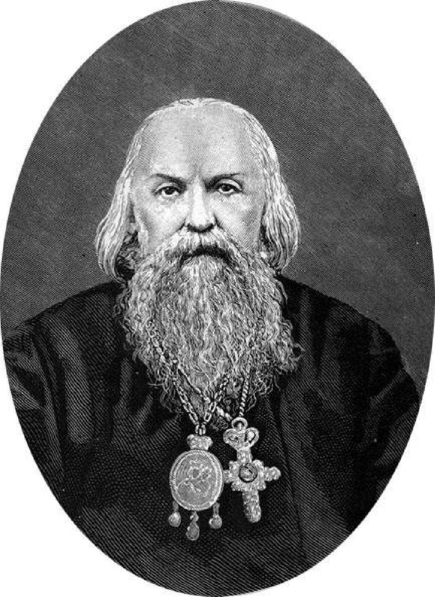
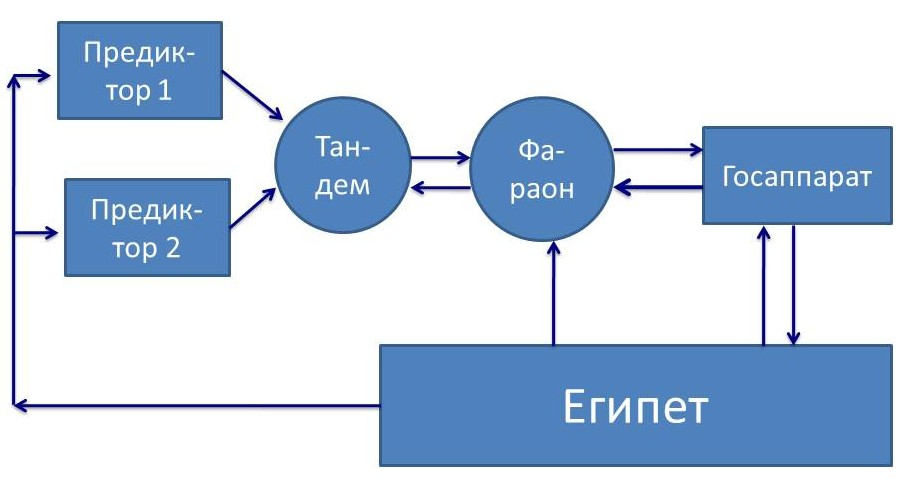
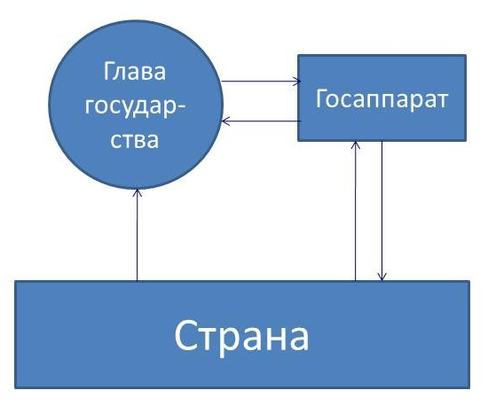

> **Первичный текст.** «Основы социологии», том 5. Страница издания: стр. 200 PDF — кандидатная привязка, требует сверки.
> Источник: файл издания `osnovy-sociologii-tom-5.pdf` (PDF в выпуск не включён). Контрольные суммы и статус проверки — в [NOTICE.md](../../NOTICE.md).
> Содержание передаёт позицию авторов издания; утверждения не верифицированы библиотекой.

---

## 19.2. Государственность

**ГОСУДАРСТВЕННОСТЬ** это — субкультура[^230] *осуществляемого на профессиональной основе управления* делами общественной значимости на местах и в масштабах общества в целом.

Всё остальное, что характеризует ту или иную исторически сложившуюся конкретную государственность (угнетение одним классом других классов, национальное и конфессиональное неравенство, сопутствующее ему угнетение одних народов «элитами» других народов или «элитами» тех или иных диаспор коренного населения и т.п.), — только приложения к этому исторически непреходящему её сущностному качеству.

Как уже сообщалось, А. Линкольн (1809 — 1865), 16‑й президент США (с 1861 по 1865 г.), выразил своё понимание смысла существования государственности так:

«Законная задача правительства — делать для общества людей всё то, что им нужно, но что сами они, выступая каждый в своём индивидуальном качестве, не могут сделать совсем или не могут сделать хорошо»[^231].

Кроме того, приведённой формулировке задач государственности А. Линкольн придал уточняющее дополнение:

«Мы не поможем людям, делая за них то, что они могли бы сделать сами»[^232].

С поправкой на то обстоятельство, что правительство (орган исполнительной власти) — только часть государственности, определение А. Линкольна — одно из наиболее точных определений назначения государственности, когда-либо данных в истории. На основе этого определения, если понимать, что такое *управление вообще,* и задумываться о том, как оно должно осуществляться в жизни общества *в преемственности поколений*, можно:

- вести анализ исторически сложившейся конкретики потребностей общества в государственном управлении теми или иными сферами деятельности и соответственно этой конкретике потребностей в каждую эпоху разграничивать компетенции государственности, представителей и организаций предпринимательского сообщества, некоммерческих общественных организаций, семей, индивидов и т.п.;

- и на этой основе можно строить и модифицировать государственность в соответствии с текущими и перспективными потребностями общества в государственном управлении.[^233]

**ГОСУДАРСТВО** это — государственность в указанном выше смысле плюс население, а также территория, акватория, воздушное пространство и недра, находящиеся под властью соответствующей государственности. Кроме того в таковом качестве государство в его признанных (или оспариваемых границах), а не государственность, с точки зрения юриспруденции — субъект международного права[^234], что де-факто не всегда соответствует действительности, поскольку государство может быть и криптоколонией, реально подчинённым какому-то внешнему государству-манипулятору, транснациональным корпорациям, тем или иным диаспорам.

В основе управленческого профессионализма во всех сферах общественной жизни лежат два фактора:

1.  Управленческие навыки как таковые.[^235]

2.  Достаточно детальное знание специфики само́й предметной области (включая её прошлое, сформировавшее в ней тенденции, имеющиеся в настоящем, из которых сложится её будущее), на которую распространяется власть того или иного управленца, а также — знание её взаимосвязей с другими предметными областями и внешним миром в целом.

Соотношение между этими двумя компонентами *личностной* управленческой культуры (а равно — управленческого профессионализма[^236]) таково, что, **пока люди будут нуждаться в профессиональном управлении делами общественной значимости, государство не «отомрёт»**, как то обещал марксизм вследствие ложного понимания в нём сути государства как исключительно инструмента угнетения и эксплуатации одними общественными классами других.

Причина в том, что **накопление индивидом знаний, не относимых к теории управления, но обеспечивающих его управленческую состоятельность в той или иной предметной области (сфере ответственности), и ВЫРАБОТКА НА ИХ ОСНОВЕ СООТВЕТСТВУЮЩИХ НАВЫКОВ, требует существенно бо́льшего времени, нежели те сроки, которые может предоставить для их освоения реальная скоротечность подавляющего большинства процессов управления делами общественной значимости**[^237]. А *быстродействие системы управления — один из факторов, на основе которого во многих случаях строятся оценки качества управления*, и оно во многом обусловлено компетентностью управленцев в соответствующих предметных областях.

Кроме того быстродействие, точнее его недостаточность, — объективный ограничитель пригодности системы управления для решения тех или иных управленческих задач. Системы, обладающие более высоким быстродействием, в принципе способны решать те задачи, которые системы с более низким быстродействием решать не в состоянии. А в силу меньших затрат времени, необходимого для решения какой-либо одной задачи, обладают большей производительностью во многозадачных режимах.

Положение усугубляется в случаях, если последствия управленческих решений и реализующих их действий воплощаются в жизнь спустя длительное время после того, как управленческие действия были начаты: в этих случаях с результатами управленческих действий, включая и сопутствующие эффекты, будут иметь дело не сами управленцы и их современники, а их потомки — подчас весьма отдалённые. При этом каждое управленческое решение является корнем «древа последствий», разнообразных по своему характеру и удалённости от «корня» по пространственной локализации и по времени. Так России ещё длительное время предстоит преодолевать последствия управленческой деятельности императоров Александра III и Николая II и их «администраций», имевшей место более столетия тому назад: см. рис. 13.1‑1. А состояние России и происходящее в ней так или иначе затрагивает и всё человечество. И это — только один пример весьма отдалённых последствий управленческих решений, имеющих место в жизни государств и человечества в целом. Кроме того, в истории России и мира до сих пор сказываются последствия неадекватной реакции местного жречества на информацию, принесённую на Русь Андреем Первозванным. И всё человечество по-прежнему — заложник библейского проекта порабощения человечества от имени Бога, старт которому дал Египет примерно 3,5 тысячи лет тому назад (по общепринятой хронологии).

Но сказанное в предшествующих абзацах о двух составляющих управленческого профессионализма касается и управленческой деятельности на профессиональной основе вне сферы государственного управления, и прежде всего — в управлении хозяйственной деятельностью на основе коллективного труда.

Что касается освоения теории управления, то практика показывает: ДОТУ можно освоить[^238] примерно за полгода, и этот срок тоже существенно меньше времени, необходимого для детального изучения сфер деятельности, подвластных государственному управлению даже непосредственно, в их взаимосвязях, не говоря уж об изучении сфер деятельности, подчинённых государственному управлению опосредованно — на это могут потребоваться годы, а в каких-то сферах деятельности и на каких-то уровнях иерархии органов государственной власти — и десятилетия. И при этом необходимо изучать в порядке следования приоритетов:

1.  Жизнь как таковую.

2.  Тексты, эту жизнь описывающие и претендующие на объяснение в ней причинно-следственных связей событий, соотнося их с жизнью как таковой.

Поэтому даже при обеспечении всеобщей управленческой грамотности взрослого населения, *управленческий профессионализм, невозможный без детального знания предметной области сферы ответственности управленца,* будет одним из общественно необходимых видов профессионализма. Вследствие этого государственность и профессиональное управление вне сферы государственности не «отомрут» и не будут вытеснены неким абстрактным, но практически не осуществимым по причине некомпетентности его участников «общественным самоуправлением», в котором неведомо как соучаствуют все или почти все члены общества одновременно либо по очереди, превосходя при этом в эффективности управленцев-профессионалов государственного аппарата и директоратов предприятий[^239].

Тем не менее, в зависимости от того, насколько широко доступны для освоения знания и навыки специфически управленческого характера, — в обществе возникает та или иная *обладающая своеобразием* сфера управления, включающая в себя государственность и управление разного рода коллективной деятельностью (хозяйственной, оборонной и т.п.), которые определяют всю систему должностных[^240] (профессиональных) статусов всех членов общества.

При этом *по достижении некоторого уровня развития цивилизации по техносферному пути на основе профессиональной специализации единоличного и коллективного труда* качество жизни индивидов и их семей становится обусловленным прежде всего прочего государственным управлением:

- во-первых, лежащей в его основе концепцией организации <u>жизни *общества как единого целого, обладающего внутренней непрестанно изменяющейся структурой,* в преемственности поколений</u> (1‑й — 5‑й этапы полной функции управления, которые могут осуществляться и вне общества, над которым властна государственность), и,

- во-вторых, качеством текущего государственного правления (6‑й и 7‑й этапы полной функции управления) в соответствии с господствующей над государственностью концепцией.

При этом ошибки и злоупотребления в политике, допускаемые государственностью, и их последствия по своему характеру таковы, что их в подавляющем большинстве случаев невозможно исправить и компенсировать на основе индивидуальной самодеятельности или на основе самоорганизации дилетантов, застигнутых врасплох дурной политикой государства. В русской культуре это обстоятельство нашло выражение в поговорках: «Народ согрешит — царь умолит; царь согрешит — никто не умолит», «за царское прогрешение Бог всю землю казнит, за угодность милует», «коли царь Бога знает, то и Бог и царя, и народ знает». Это всё о том, что нормальная государственность должна в своей политике выражать Богодержавие, а уклонившись от него, — должна сама возвращаться в его русло, и соответственно должна строить политику, опираясь на объективные закономерности всех шести групп, которым подчинена жизнь людей.

Именно изложенное выше и лежит в основе жизненной состоятельности определения А. Линкольном задач государственности и характера её взаимоотношений с обществом.

Вследствие этого даже доскональное знание тех или иных предметных областей оказывается недостаточным для осуществления управленческих функций, если претенденты на власть (на управленческие должности) не обладают специфически управленческими знаниями и навыками.

Это обстоятельство делает общество управленчески безграмотных людей зависимым от профессиональной корпорации носителей специфически управленческих знаний и навыков, поскольку такое общество не способно выдвинуть из своей среды альтернативный управленческий корпус, если прежний управленческий корпус оказывается недееспособным и не может адекватно ответить на «вызовы времени» либо, если сложившийся управленческий корпус злоупотребляет властью в отношении остального общества, как то имеет место во всех без исключения толпо-«элитарных» культурах.

Соответственно, один из факторов, создающих предпосылки для общественно ощутимых злоупотреблений властью *(включая эксплуатацию «человека человеком» и коррупцию* *— как системообразующие факторы),* — управленческая безграмотность и узость кругозора (и круга интересов) подавляющего большинства населения, в том числе и многих представителей самого управленческого корпуса.

Всё остальное в явлении злоупотребления властью — результат нравственной порочности правящей «элиты», так или иначе узурпировавшей *разнородную* власть в обществе: вопреки широко известному афоризму[^241] — **власть никого не развращает**, *но только даёт возможность проявиться ранее сформировавшейся нравственной порочности* по мере того, как с продвижением по ступеням иерархии власти открываются всё бо́льшие реальные или иллюзорные возможности избежать ответственности за злоупотребления властью и социальным статусом.

Поэтому общественная безопасность в целом (а также её компоненты — *реальный, а не декларативный суверенитет государства и служение государственности развитию народов Земли, биосферно-социальная безопасность, т.е. экономическая, экологическая, техносферная и внутрисоциальная безопасность*) и осуществление реальной (а не формально-процедурной) демократии требуют воспитания: 1) социальной ответственности глобального уровня всякого индивида, 2) достижения всеобщей управленческой грамотности и 3) профессиональной состоятельности в избранной человеком сфере деятельности.

Т.е. цель общественного развития в нынешнюю эпоху — не построение бесклассового общества (на чём настаивал «мраксизм»), а построение нравственно-этически однородного общества и соответствующей культуры, в которой необратимо человечного типа строя психики и познавательно-творческой состоятельности все бы достигали к началу юности вне зависимости от классовой принадлежности или иного социального статуса. В аспекте взимоотношений государственной власти и общества это предполагает ликвидацию их исторически сложившегося разлада, доходящего до конфликта.

Если рассматривать с позиций ДОТУ жизнь культурно своеобразных обществ, то все они отличаются друг от друга тем, как в каждом из них реализуется полная функция управления, либо, как полная функция управления в отношении рассматриваемого общества реализуется из-за его географических или культурных границ внешними по отношению к нему политическими субъектами, а также и тем — как в этом участвует государственность, под властью которой живёт общество: т.е. какие этапы полной функции управления государственность реализует *на профессиональной основе* и в каких организационных формах, а какие этапы полной функции управления в отношении этого государства реализуются вне государственности, в том числе — и из-за пределов этого государства.

Практически это означает, что в жизни всякого культурно своеобразного исторически сложившегося общества, *устойчивого в преемственности поколений,* всегда некоторым образом реализуется взаимное соответствие государственности (системы управления) и подвластного государственности общества (объекта управления)[^242].

Если этого соответствия нет или его не удаётся выработать в исторически непродолжительные сроки (в пределах активной жизни одного — двух поколений), то общество обречено либо исчезнуть из истории под воздействием внутренних затяжных неурядиц, либо продолжить своё развитие под властью государственности, порождённой другим культурно своеобразным обществом.

В силу определённого своеобразия всякого общества (объекта управления) внедрение извне в общество государственности (системы управления — информационно-алгоритмической системы), порождённой в историческом развитии другим обществом, всегда влечёт за собой более или менее ярко выраженное взаимное несоответствие системы управления объекту управления.

Это может повлечь за собой негативные последствия: от непродолжительного (по историческим меркам) кризиса взаимной адаптации общества и заимствованной государственности (вплоть до отторжения чуждой государственности и построения собственной) до исчезновения культурно-своеобразного общества, оказавшегося под властью не соответствующей ему государственности.

В условиях толпо-«элитаризма», можно говорить об эффективности государственности в одном из двух взаимоисключающих смыслов:

- насколько эффективно государственность обеспечивает воспроизводство устойчивого в преемственности поколений толпо-«элитаризма» в подвластном ей обществе в том числе и путём модификации культуры и социальной организации, отвечая на «вызовы времени» в меняющемся мире;

- насколько эффективна государственность в решении задачи становления *глобальной* цивилизации человечности с учётом исторически выработанного культурного своеобразия породившего её толпо-«элитарного» общества, *локализованного в границах соответствующего государства*.

Но в любом из двух вариантов понимания «эффективности государственности» эффективная государственность может опираться только на функционально состоятельные *по отношению к каждой из названных взаимоисключающих задач* общественные институты: семью, науку и систему образования.[^243]

«Сильное государство» — это эффективное государство, а не тирания, хотя тирания тоже может быть по-своему эффективной и, соответственно, — «сильной». Эффективность государства выражается практически в том, что оно способно воплотить в жизнь провозглашаемые им цели политики (внутренней, внешней, глобальной); но не просто воплотить, а воплотить без сопутствующих эффектов, обесценивающих достижение ранее провозглашённых целей.

Эффективное государство при любом из двух выше приведённых смыслов понимания эффективности невозможно без концептуальной определённости, выражающей себя в государственном управлении. Один из аспектов концептуальной определённости — это государственная идеология, т.е. некий минимум сведений о целях политики государства, путях и способах их достижения, который должен быть известен всем работникам государственного аппарата, вырабатывающим, принимающим и проводящим в жизнь управленческие решения.

Если понимать такого рода азы управленческой грамотности, то **ныне действующая конституция РФ 1993 г. по сути в прямой форме запрещает эффективное государственное управление**. Рассмотрим только одну из множества её очевидных для управленца глупостей, которые юристы-правоведы, включая депутатов Думы, сенаторов и членов Конституционного суда РФ либо не могут осознать на протяжении 20 с лишним лет её действия, либо такое положение их вполне устраивает. Статья 13, часть 2 конституции РФ 1993 г. гласит:

«Никакая идеология не может устанавливаться в качестве государственной или обязательной».

\* \* \*

Предположим, что глава государства или парламент провозглашают определённые цели политики, описывают пути и средства их достижения. После этого глава государства и глава правительства, а также прокуратура и прочие контрольные органы начинают требовать от должностных лиц в государственном аппарате на всей территории страны на всех уровнях «вертикали власти», чтобы их деятельность соответствовала провозглашённым целям, путям и средствам их достижения. А если кто-то из чиновников саботирует провозглашённую политику или, злоупотребляя властью, дискредитирует государственность в обществе, то он подвергается тем или иным репрессиям в соответствии с действующим законодательством (от «постановки на вид» и предложения в дальнейшем действовать в русле провозглашённой политики до осуждения по обвинению в измене Родине — в зависимости от того, что он совершил или не совершил и в чём соучаствует).

\* \*  
\*

Описанное в предыдущем, отделённом от основного текста, абзаце —

- нормальный порядок работы государственного аппарата в любом здравом в интеллектуальном отношении обществе;

- но это же — нарушение ст. 13.2 конституции РФ, поскольку представляет собой провозглашение государственной идеологии и установление её в качестве обязательной.

Одного этого достаточно, чтобы презирать и авторов этой «конституции», и её саму как словоблудие и политиканство, как юридически ничтожный текст, на основе которого ОБЪЕКТИВНО невозможно осуществлять государственное управление потому, что она противоречит ОБЪЕКТИВНЫМ закономерностям управления как таковым.

И не надо возражать, что в данном случае мы якобы не понимаем специфического юридического значения терминов «государство» и «государственная идеология», якобы известного только профессиональным юристам; что в действительности в ст. 13.2 конституции РФ 1993 г. подразумевается идеологическая свобода, понимаемая как свобода граждан в выборе идеологии, подкреплённая запретом государству избирать какую-то одну идеологию в качестве обязательной для всех граждан.

Такого рода возражения не могут быть приняты потому, что свобода всякого гражданина в избрании им идеологии провозглашается в ст. 13.1, расположенной строчкой выше в тексте той же конституции:

«В Российской Федерации признаётся идеологическое многообразие».

И провозглашение этого права людей иметь своё мнение о жизни общества и желательном будущем, естественно, подразумевает запрет государству на навязывание какой-либо идеологии в качестве обязательной для всех граждан: иначе провозглашённое ст. 13.1 право не может быть реализовано.

Поэтому формулировка ст. 13.1 даёт основание полагать, что в ст. 13.2 речь идёт не о Российской Федерации как о государстве и праве его граждан придерживаться любой идеологии[^244], а именно о государственном аппарате и о запрете государственной идеологии, назначение которой — обеспечить слаженность работы государственного аппарата на основе описания предполагаемой политики государства однозначно понимаемым образом.

Т.е. в статье 13.2 налагается запрет на создание и развитие общедоступного для изучения информационно-алгоритмического обеспечения работы государственного аппарата, необходимого для единообразия и слаженности работы органов государственной власти на всех уровнях во всех регионах страны.

В противном случае ст. 13.1 и ст. 13.2 — две равнозначные редакции изложения одного и того же положения. Т.е. они представляют собой нарушение принципа «экономии правового материала»[^245], что свидетельствует о низком профессионализме разработчиков текста конституции именно в качестве юристов.

В силу, во-первых, необходимости обеспечения взаимного соответствия объекта управления системе управления и, во-вторых, своеобразия толпо-«элитаризма» в его национальных, конфессиональных и диаспоральных проявлениях — унификация субкультур государственного управления в разных регионах планеты возможна в двух вариантах, соответствующих двум вариантам понимания эффективности государства:

- Построение глобального античеловечного фашистского толпо-«элитарного» режима, устойчивого в преемственности поколений, путём стирания национально и конфессионально обусловленного культурного своеобразия во всех регионах планеты. Государством лидером-координатором этого процесса являются США, подконтрольные библейскому масонству и его хозяевам.

- Переходом всех национальных и конфессиональных культур в их развитии к устойчивой в преемственности поколений культуре человечности, обеспечивающей достижение необратимо человечного типа строя психики (как основы дальнейшего личностного, и соответственно, общественного развития) всеми к началу юности. СССР вступил на этот путь под руководством И.В. Сталина, но не достиг успеха по разным причинам, главной из которых было концептуальное безвластье широких масс населения.

Объективные закономерности всех ранее названных шести групп, которым подчинена жизнь людей и обществ, человечества в целом — едины для всей планеты. Поэтому и во втором варианте глобализации необходимость обеспечения взаимного соответствия объекта управления и системы управления тоже выразится в унификации культур государственного управления в разных регионах планеты, хотя некоторая своеобразная составляющая культуры государственного управления, обусловленная физико-географическими особенностями каждого региона и условиями жизни в нём, сохранится и в этом случае.

Во втором варианте развития глобализации процессу унификации культур государственного управления, протекающему под воздействием необходимости обеспечить взаимное соответствие объекта и системы управления, может сопутствовать интеграция исторически сложившихся государств в объединения путём передачи в соответствии с интересами общественного развития каждого из них части полномочий (тех или иных составляющих государственного суверенитета) координационным органам соответствующих объединений нескольких государств: т.е. возникновение некой общей государственности и подчинение ей всех регионов планеты в этом случае также неизбежны, но не за счёт подавления свободы людей и уничтожения национального своеобразия, а путём их праведного развития. Это — путь реализации *концепции добросовестной глобализации,* альтернативной библейской концепции порабощения человечества от имени Бога.

Глобальный биосферно-социальный (экологический) кризис порождает проблемы, затрагивающие все общества, вследствие чего необходимость его преодоления будет стимулировать образование и развитие объединений государств по их инициативе, с формированием общей для их государственности более высокого порядка, поскольку ресурсов и правомочности отдельных государств будет недостаточно для решения экологических и ряда иных проблем в интересах каждого из народов, проживающих в каждом из них[^246].

К порождению обществом государственности и обретению ею полномочий в тех или иных сферах общественной жизни относится ещё одно обстоятельство: *общество, обременённое техносферой и необходимостью её воспроизводства,* нуждается в стандартизации и документировании своей деятельности вообще и в основанной на писаном законодательстве юридической системе, — в частности.

Причина в том, что в условиях обременённости техносферой и процессами её воспроизводства и развития — не вся информация, необходимая для эффективного взаимодействия людей в сфере общественного объединения труда и семейного быта, построения объектов техносферы, их стыковки и взаимодействия друг с другом, оказывается доступной индивиду через поток событий его собственной жизни (т.е. помимо текстов и иных памятников культуры). Вследствие этого выявление и разрешение проблем во взаимодействии с другими людьми на основе собственного потока чувств и своего собственного разумения в силу разных причин[^247] не всегда оказывается эффективным, а во многих случаях — в принципе невозможным. Т.е. **без стандартизации, документирования и документооборота ПРИ ИХ ОБЯЗЫВАЮЩЕМ (во многих случаях) ХАРАКТЕРЕ**[^248] **техносферный образ жизни общества, включая и его сферу управления, оказывается невозможным**, поскольку с одной и той же информацией необходимо ознакомление разных людей, в разное время, подчас вне возможностей прямого личностного общения носителей той или иной информации; а объединение частей в единое органично целое требует безальтернативного для всех участников соблюдения тех или иных норм, которые становятся обязательными для всех.

При этом в историческом прошлом по мере роста зависимости людей от техносферы и от общественного объединения труда как средства её воспроизводства — *унаследованная от «догосударственной» эпохи исторически сложившаяся **система обычаев (закон неписаный)** в ходе развития государственности перетекает в **писаное — кодифицированное — право** и возникает юридическая система*.

\* \* \*

Юридическая система это — неотъемлемый атрибут *техносферно цивилизованного* *общества*[^249] и порождённой им государственности*.* Она включает в себя:

1.  Тексты законов и тексты официально признаваемых ею же комментариев к ним, разъясняющих особенности применения законов в реальной жизни (официально не признаваемые комментарии игнорируются в правоприменительной практике). Одной из составляющих писаного законодательства де-факто (а в ряде государств и де-юре) является система стандартизации и порождённая ею система стандартов, представляющая собой описание матрицы, в которой существует и развивается техносфера и связанные с нею области общественной жизни.

2.  Профессиональных юристов, госчиновников и иных профессиональных управленцев разного профиля деятельности, взаимодействующих друг с другом и с остальным обществом не только на основе текстов законов (включая стандарты), комментариев к ним и соотнесения с ними жизни, но и под воздействием иных факторов, не отображённых в законах и комментариях к ним.

Юридическая система выражает себя в жизни в определённой правоприменительной практике, которая может осуществляться как в согласии с оглашениями законов и официально признанных комментариев к ним, так и в большей или меньшей мере отрицать и подавлять оглашения.

Законотворческую деятельность мы не относим к юридической системе как таковой, поскольку юридическая система в определённом выше значении термина порождается в результате законотворчества, в котором принимают участие не только юристы. То, что юридические системы подавляющего большинства государств современности регламентируют порядок осуществления законотворчества, это — результат исторического развития юридических систем, а не изначальный фактор их «самозарождения».

Кроме того, законодательство всегда подчинено задаче реализации определённой концепции организации жизни общества в преемственности поколений, а концептуальная власть носит самовластный, надзаконный (по отношению к юридическим законам) и надгосударственный характер, вследствие чего стоит над юридической системой, будучи главным фактором порождения юридических систем в истории[^250].

Потребность в государственности вместе с её неотъемлемым атрибутом — юридической системой — объективное следствие развития культуры на основе общественного объединения *узкоспециализированного профессионального труда* на техносферном пути развития цивилизации.

\* \*  
\*

Юридическая система — одна из безальтернативно необходимых подсистем в системе общественного самоуправления техносферно цивилизованного общества, поскольку функционирование, воспроизводство и развитие техносферы, требует документирования и стандартизации в том числе и в сфере управления делами общества на профессиональной основе. Поэтому:

Всякое законодательство (как и юридическая система в целом) является одним из атрибутов государственности и представляет собой текстуальное выражение принципов и алгоритмики самоуправления общества и <u>государственного управления, осуществляемого в русле *определённой концепции*</u>[^251].

Иначе говоря, поскольку управление ВСЕГДА носит концептуально обусловленный характер, то всякое законодательство выражает *определённую концепцию* **государственного управления** жизнью общества. И соответственно ***назначение законодательства:***

***1) обеспечение стандартного управления в русле определённой концепции в пределах юрисдикции и дееспособности соответствующего государства;***

***2) разрешение конфликтов вложенных частных управлений, которые могут возникать в границах господствующей над обществом концепции управления;***

***3) защита управления по господствующей концепции от управления на основе альтернативных, — не совместимых с нею, — концепций***[^252]***.***

И в законодательстве каждого государства можно выявить компоненты, направленные на решение каждой из трёх названных выше задач в их совокупности.

Кроме того, исторически реально ***во всяком законодательстве присутствуют «юридические шумы»*** — демагогия, политиканство, глупость[^253] и законы, неоднозначные в аспекте соотносимости их положений с реальной жизнью[^254], а также — некоторые законы и положения, в силу разных причин проистекающие из чуждых концепций, не совместимых с той, которую выражают три вышеназванные компоненты, в силу чего положения законов, проистекающие из чуждых концепций, в большинстве своём не реализуются на практике, хотя могут употребляться в политиканстве в качестве деклараций о благонамеренности[^255].

Эти обстоятельства приводят к вопросам:

- Если законодательство обусловлено *определённой* концепцией организации жизни общества в преемственности поколений и в этом смысле не является произвольным, то как обстоит дело с концепцией, которую выражает законодательство? — т.е. насколько может быть произвольна и вариативна концепция?

- Есть ли во множестве разнообразных концепций объективно наилучшая концепция?

Ответы на эти вопросы[^256] лежат вне сферы компетенции юристов, поскольку знания, необходимые для жизненно состоятельного ответа на них, не входят в тематику учебных курсов, освоение которых необходимо для получения юридического диплома в любой стране мира. Освоение этих знаний требует более широкого кругозора, далеко выходящего за пределы юриспруденции, охватывающего как естествознание и его прикладные отрасли (технические дисциплины и т.п.), так и гуманитарные дисциплины, изучающие человека и его проявления в обществе и в Природе.

Именно проистекающее из этого факта невежество в проблематике, находящейся за пределами области *юридической текстологии и правоприменительной практики,* и делает юристов в их большинстве биороботами-зомби (исключения из этой характеристики крайне редки), тупо применяющими действующее законодательство *в одном из двух вариантов правоприменительной практики* или в виде некоего «коктейля» из них обоих (об этом несколько далее по тексту).

Наиболее ярко эта юридическая тупость выразилась в поговорке, восходящей к древнему Риму, одной из причин гибели которого стала неадекватная[^257] юридическая кодификация жизни общества и государственного управления и приверженность принципу, выражаемому этой поговоркой: ***Пусть рухнет мир, но восторжествует закон.***[^258]

Даже если её понимать как гиперболу (т.е. преувеличение), назначение которой — всего лишь подчеркнуть значимость законодательства и его соблюдения в жизни общества, однако и в этом случае она допускает возможность разрушения Мироздания по той причине, что юридический закон противоречит *объективным закономерностям, на реализации которых основывается устойчивость процесса функционирования Мироздания как системы и устойчивость бескризисной жизни общества,* вследствие чего неукоснительное проведение юридического закона в жизнь влечёт за собой крах Мироздания[^259]. Этой возможностью и её практической реализацией юристы и подавляющее большинство законотворцев, как показывает История, никогда не интересовались ранее и не интересуются ныне[^260].

Иначе говоря, это означает:

Объективная данность такова, что концепция, которую выражает кодифицированное право, — тоже не может быть произвольной: субъективизм выразителей *концепции жизнеустройства общества в преемственности поколений* должен адекватно выражать объективные закономерности бытия в Природе людей, культурно своеобразных обществ и человечества в целом[^261] — как в оглашениях, так и в умолчаниях, и не должен противоречить им. То же касается и правоприменительной практики.

В противном случае общество окажется под давлением этих объективных закономерностей, которое вынудит его отказаться от пагубной концепции либо уничтожит его в случае, если оно будет настаивать на безальтернативности той концепции, под властью которой оно так или иначе оказалось[^262]; а тем более, если оно будет *по сути богохульно настаивать* на боговдохновенности объективно порочной и потому пагубной концепции[^263].

Соответственно этому обстоятельству открыта и возможность к тому, что законотво́рцы, находясь и действуя под властью пагубной концепции, породят законодательство, проведение которого в жизнь приведёт общество к *катастрофе, от которой его может избавить только осмысленный боговдохновенный произвол*[^264] *— попрание норм кодифицированного права, выработка праведной концепции, альтернативной по отношению к пагубной, и непреклонное проведение её в жизнь*.

Хотя с точки зрения кодифицированных норм пагубной концепции, такого рода деятельность может квалифицироваться как тяжкие и особо тяжкие составы преступлений (преступления, предусматриваемые третьей составляющей законодательства — защита управления по господствующей над государственностью концепцией от несовместимых с нею концепций). Юристы об этом, как показывает История, тоже не задумываются, в большинстве своём бездумно отдавая предпочтение проведению в жизнь пагубной концепции, власть которой обеспечивает им социальный статус и потребительское благополучие.

Описанные выше возможности, связанные с вариативностью концепций и выражением каждой из них в кодифицированном праве, приводят к вопросу об объективности различий Добра и Зла в конкретике их проявлений в жизни человечества и культурно своеобразных обществ. По своей сути это — иная формулировка вопроса о бытии Божием, Его Вседержительности, смысле (целях) Промысла Божиего и характере *Божиего попущения людям искренне заблуждаться и ошибаться или «со знанием дела» работать против воплощения в жизнь целей Промысла*.

Однако в исторически сложившейся культуре наших дней вопрос о бытии Бога — «вопрос дискуссионный»[^265]. Одни верят в то, что Бог есть, другие верят в то, что Бога нет, но мало кто из верующих в Бога верит Богу и живёт под властью диктатуры совести (последнее касается не только верующих в Бога, но и осознанных атеистов). Но вне зависимости от мнений, высказываемых в спорах о бытии Бога, как писал святитель Игнатий Брянчанинов[^266] (фото слева), «природа возвещает Бога»[^267].

И соответственно он считал необходимым преподавать естественные науки не только в светских, но и в особенности — в духовных учебных заведениях[^268]:

«Особливо нужно знание естественных наук, потому что в наше время нигилисты утверждают своё учение якобы на естественных науках. Нужно знать, что они утверждают здание нигилизма не на естественных науках, а на произвольных, нелепых гипотезах, т.е. предположениях или вымыслах, которых нет возможности доказать теми доказательствами, при которых единственно наука признаёт познание верным и без которых все блестящие гипотезы остаются при достоинстве игры воображения, при достоинстве бреда»[^269].

В оценке, высказанной в последней фразе, святитель Игнатий Брянчанинов был прав[^270]. Прошло уже полтора века, как он высказал приведённое выше мнение, которое подразумевает, что и для *верующих Богу,* и для атеистов (верующих в Бога либо не верующих в Бога) объективность различий Добра и Зла в конкретике их проявлений — независимо от субъективных представлений людей об этом и о бытии Бога, — выражается в том, что жизнь общества (и соответственно, концепция жизнеустройства и выражающее её законодательство):

- либо противоречит им, *вследствие чего общество терпит разного рода неурядицы:* внутрисоциальные конфликты, рост статистики заболеваемости, экологические и экономические бедствия и т.п. — всё это закономерные следствия нарушения объективных закономерностей *бытия человеческого общества в гармонии с Природой (в понимании атеистов), а равно — в русле Божиего Промысла;*

- либо опирается на объективные закономерности и поддерживается ими, подтверждая практически истинность высказывания апостола Павла *«…Бог не есть Бог неустройства, но мира. Так бывает во всех церквах у святых»* (1-е послание апостола Павла Коринфянам, 14:33).

Т.е. необходимость соответствия концепции жизнеустройства общества в преемственности поколений и выражающего её законодательства и правоприменительной практики *объективным закономерностям бытия в Природе людей, культурно своеобразных обществ и человечества в целом* — объективная необходимость. Эта объективная данность едина и безальтернативна как для носителей атеистического миропонимания, которые признают объективность законов Природы, так и для носителей религиозного миропонимания, для которых в объективных законах Природы выражается Божие предопределение бытия Мироздания[^271]. И определение *свободы как осознанной необходимости* жизненно состоятельно только в том случае, если под необходимостью понимать эту — названную выше — необходимость жить, опираясь на объективные закономерности всех шести групп под властью диктатуры совести.

И соответственно юридическая система как атрибут государственности (и в аспекте законодательства, и в аспекте правоприменительной практики) должна работать на воплощение в жизнь объективного Добра и искоренение из жизни исторически наличествующего Зла и его генераторов.

Наличие объективных закономерностей, отнесённых нами к шести выше названным группам (раздел 13.1 настоящего курса — том 4), означает, что во всём множестве возможных концепций организации жизни общества в преемственности поколений можно выделить три класса:

- концепции, выражающие беззастенчивый сатанизм, включая и обнажённый атеизм, как одну из маскировочных оболочек сатанизма;

- концепции, которые можно охарактеризовать словами *«ни Богу свечка, ни чёрту кочерга»* в силу того, что их оглашения и умолчания, объективно сопутствующие оглашениям, таковы, что часть из них лежат в русле Промысла Божиего, а часть — в области попущения Божиего искренне заблуждаться и ошибаться или осознанно сатанеть со знанием дела;

- вариации концепции, выражающей Промысел, отличающиеся друг от друга детальностью проработки и лексически-символьными оболочками выражения смысла, общего для всех вариаций.

Первые два класса концепций — пагубные в случае стойкой приверженности им.

Концепции, отнесённые к последнему классу, могут содержать ошибки, но они содержат в себе **непреходяще безошибочное ядро**, которое позволяет освобождаться от ошибок в ходе исторического развития обществ, живущих под их властью. Суть этого ядра состоит в том, что **единственная истинная религия — диктатура совести**, вследствие чего *человек в молитвенном диалоге с Богом по совести, развивая личностную диалектическую культуру познания и творчества, способен освободиться от власти над ним ошибок и заблуждений и обязан помочь в этом деле другим людям*.

Следствие из этого — никто не может быть господином человеку, кроме Бога, поскольку единственная объективно безальтернативная власть в Мироздании[^272] — это Божья Вседержительность, а предназначение человека — быть наместником Божьим. Соответственно, слова «Бог» и «господь» не во всех контекстах — синонимы, поскольку «го́сподом», — отрицая в таковом качестве Бога, — индивид может избрать для себя сотворённого им же бездушного кумира-идола, другого представителя биологического вида «Человек разумный», беса, Сатану и т.п., но не Бога. [^273]

Однако вне зависимости от обусловленности законодательства определённой концепцией, которая может принадлежать к одному из трёх названных классов, возможны два варианта применения законодательства в жизни общества.

**Вариант первый — нормальный:**

1.  Анализ реальной или возможной ситуации в её конкретике.

2.  Подбор законов и статей, которые соответствуют ситуации.

3.  Принятие решения в соответствии с положениями законодательства в отношении сложившейся в жизни ситуации или перспектив её развития.

4.  Если нет соответствующего положения закона, то выработка произвольного решения, которое, однако, не должно нарушать существующих статей законодательства, а при необходимости — доработка законодательства.

Назовём этот порядок действий для определённости «нормальным порядком».

Поскольку **юридические законы, в отличие от законов Природы не действуют автоматически помимо людей**, то для того, чтобы законодательство реализовывалось в политической практике общества нормальным порядком, необходимы два фактора:

- **во-первых**, в обществе должна быть политически активная часть,

<!-- -->

- как максимум, охватывающая всё общество[^274], а как минимум, — достаточная по численности и достаточно широко распределённая в обществе для того, чтобы быть в нём генератором процессов автосинхронизации[^275],

- обладающая интеллектом и некоторой осведомлённостью (уровнем образованности), необходимыми для того, чтобы выработать содержательно определённую политическую инициативу[^276],

- и обладающая политической волей, необходимой, чтобы инициативу воплотить в жизнь, в том числе, и при опоре на процессы автосинхронизации, общественную самоорганизацию и юридическую систему, а также — и на внесоциальные факторы[^277];

<!-- -->

- **во-вторых**, эта политически активная часть общества должна обладать правосознанием, т.е. она должна понимать: 

<!-- -->

- что законодательство — это один из инструментов общественного самоуправления (один из инструментов осуществления бесструктурного управления),

- как в действующем законодательстве выражаются её жизненные интересы.

Если **первое** и **второе** наличествует в обществе во всех составляющих каждого из них, то любое не только систематическое, но и разовое нарушение законодательства будет иметь следствием проявление политической инициативы носителей правосознания, направленной на соблюдение норм законности и наказание виновных в её нарушении и попрании законных прав граждан. Причём **это предполагает не только политическую активность именно тех граждан, чьи законные права были нарушены, но и ПОЛИТИЧЕСКУЮ АКТИВНОСТЬ ТЕХ ГРАЖДАН, КТО СТАЛ ЭТОМУ СВИДЕТЕЛЕМ ЛИБО УЗНАЛ ОБ ЭТОМ И ПОВЕРИЛ В ДОСТОВЕРНОСТЬ СООБЩАЕМЫХ ЕМУ СВЕДЕНИЙ О ПОПРАНИИ ГОСУДАРСТВЕННОЙ ВЛАСТЬЮ ПРАВ ТРЕТЬИХ ЛИЦ**.

Т.е. в основе нормального порядка применения законодательства лежит правосознание в определённом выше значении термина, объединяющее и представителей государственной и бизнес- властей, и политически активную и ответственную часть остального общества. Если этот порядок действует, то общество можно характеризовать как гражданское, а государство — как правовое.

При этом правоприменительная практика, выражающая этот нормальный порядок, становится основой для совершенствования законодательства и правоприменительной практики как *системы* *обезличенного управления*[^278]*, перед которой равны все физические и юридические лица.* А термин «совершенствование законодательства» следует понимать как в аспекте его совершенствования в пределах господствующей концепции, так и в аспекте совершенствования самой концепции, т.е. модификация её в направлении перехода к безальтернативному выражению праведности на основе всех ранее названных шести групп объективных закономерностей.

Если в обществе нет правосознания в указанном смысле этого термина, то законодательство не будет применяться нормальным порядком, даже если есть политически активная часть общества.

Освоение профессионального юридического образования не гарантирует автоматически выработку правосознания индивидом, вследствие чего юридическому сообществу в целом правосознание может быть и не свойственно, хотя при этом могут быть отдельные личности-исключения[^279].

Если бы это было не так, то не могли бы существовать пословицы: *«закон — что дышло*[^280]*: куда повернул — туда и вышло», «с сильным не борись, с богатым не судись», «неправдой суд стоит»*[^281]*;* и не было бы причин говорить о втором варианте применения законодательства.

**Вариант второй — «антинормальный».** Менталитет отечественного чиновничества, представителей «правоохранительных» органов, работников прокуратуры и судейского корпуса *при неразвитости правосознания в обществе в целом*[^282] на протяжении нескольких последних веков по настоящее время порождает иную алгоритмику применения законодательства:

1.  Анализ ситуации и выяснение социального статуса участников (с целью выявления их возможностей оказать эффективное противодействие злонравному произволу).

2.  Выработка произвольного решения в отношении ситуации, в котором выражается ощущение (или понимание) разработчиками решения целесообразности тем, кому предстоит утвердить проект решения или того, в чьих интересах должно быть принято решение, подлежащее исполнению.

3.  Поиск статей законодательства, ссылками на которые можно придать юридическую силу и *видимость законности* произвольно принятому решению.

4.  Оглашение решения со ссылками на закон и проведение решения в жизнь на «законных основаниях» при фактическом игнорировании и попрании норм законодательства и законных прав граждан и прочих физических и юридических лиц.

Этот порядок действий назовём «антинормальным», но именно он является господствующим в нашей стране[^283] (по крайней мере, с момента становления крепостного права при идеологической поддержке РПЦ[^284]) на протяжении нескольких последних веков по настоящее время включительно. И изменение концептуальной обусловленности законодательства в эпоху Советской власти и большевизма, олицетворяемого И.В.Сталиным, с «рабы повинуйтесь господам…» на концепцию общества свободных людей, живущих по совести[^285], не изменило этого порядка — в силу нравственно-психической инерционности общества, которая не подчинена кодифицированному праву и не изменяется сама собой синхронно с изменением юридической системы и кодифицированного права.

Для того, чтобы антинормальный порядок применения законодательства действовал, необходимо отсутствие политической активности и правосознания в обществе, или чтобы они не были достаточно широко распространёнными явлениями.

- Мы говорим о господстве в России и в наши дни именно этого антинормального порядка применения законодательства на том основании, что:

<!-- -->

- сталкивались с его проявлениями сами, причём не однократно;

- с ним сталкивался почти каждый взрослый россиянин сам либо с ним сталкивались его друзья и близкие.

<!-- -->

- А вот случаи увольнения и уголовного наказания представителей юридической системы за такого рода попрание законодательства — носят единичный характер, и о них если кому и становится известно, то в «подавляющем большинстве такого рода случаев» — из редкостных сообщений СМИ, а не из жизненного опыта их самих, их друзей и близких, и не из ежегодных официальных отчётов государственной власти о том, что *по её инициативе и на основании жалоб граждан* (в том числе и за преступления против правосудия — гл. 31 действующего УК РФ) предано суду и осуждено столько-то должностных лиц, и это составляет столько-то процентов от общего числа госслужащих.

- Господство именно этого порядка применения законодательства косвенно выражается в статистике:

<!-- -->

- если в пресловутом 1937 г. суды в СССР вынесли порядка 13 % оправдательных приговоров,

- то по данным, оглашённым в 2013 г., суды постсоветской России выносят порядка 0,8 % оправдательных приговоров.

  Такое соотношение статистик разных эпох показатель:

- не того, что качество досудебных расследований и работы судов в постсоветской России выросло в сопоставлении с 1937 г.,

- а того, что суды придают законную силу напраслине, возводимой следствием на обвиняемых, как минимум на порядок чаще, чем это имело место в период «ежовщины».

  Различие эпох только в том, что в 1937 г. в период «ежовщины» на пустом месте массово фабриковались обвинения и признания по расстрельным статьям, а ныне действует мораторий на применение смертной казни, которому сопутствует и мораторий на вынесение судами смертных приговоров. Если бы не этот мораторий, то борьба клановых группировок «элит» и сведение счётов «сознательными» гражданами друг с другом могли породить волну репрессий и смертных казней, в сопоставлении с которой 1937 г. показался бы образцом правопорядка и соблюдения законности.

Если у некоторой части общества есть правосознание, но она убеждена, что действующее законодательство противоречит интересам её представителей, а *государственная власть настаивает на безальтернативности именно этого законодательства и проистекающей из него правоприменительной практики либо молча подменяет законность произволом (т.е. законодательство применяется по второму варианту),* то эта часть населения будет саботировать соблюдение этого законодательства и распоряжения власти, будет поддерживать саботаж со стороны других лиц и организовывать его; а её действия, направленные на ликвидацию этого законодательства и правоприменительной практики, могут быть действительно «экстремистскими»: начиная от единичных преступлений против представителей господствующей юридической системы в стиле Веры Фигнер, Веры Засулич, народовольцев и эсеров (в имперском прошлом) и сценария фильма «Ворошиловский стрелок» (в настоящем) и массовых бунтов (перекрытие федеральных автотрасс населением «моногородов», где экономической политикой постсоветского государства убито единственное кормившее всех предприятие; бунт в колонии в Копейске в конце ноября 2012 г. по поводу злоупотреблений персонала в отношении заключённых; «дальневосточные партизаны», целенаправленно убивавшие сотрудников МВД в феврале 2010 г. и заявлявшие в своём видеообращении в интернете, что они вершат самосуд в отношении «оборотней в погонах» из МВД, безнаказанно злоупотреблявших властью[^286]) — и кончая организацией государственного переворота или революции.

Если носители альтернативного действующему законодательству правосознания политически активны в том смысле, как это определено выше, то они способны выработать и реализовать стратегию уничтожения действующей государственности (включая и порождённую ею юридическую систему) в их обществе и замены её другой — выражающей их интересы — «мирными средствами»: т.е. без бунтов и революций. В этом случае прежняя юридическая система на протяжении некоторого времени может быть «декоративной ширмой», которой они прикрывают свою политику, направленную на её свержение, *по мере того, как они проникают в наличествующие в обществе институты власти и захватывают в них ключевые посты*. Если вывести из рассмотрения исторически короткий период становления государственности СССР, то после убийства И.В. Сталина и Л.П. Берии в 1953 г. противники Советской власти и социализма именно так *— способом проникновения во власть, захвата ключевых постов и продвижения идиотов на те должности, с которых сторонникам реставрации капитализма могло быть оказано сопротивление*[^287]*,* — уничтожили СССР. Хотя этот процесс занял несколько десятилетий (с убийства И.В. Сталина в 1953 г. до принятия буржуазно-либеральной *криптоколониальной* конституции в 1993 г.), однако метод эффективен.

То же касается и возможной реакции политически активных носителей правосознания на антинормальный порядок применения законодательства государственной властью, захваченной «сильными»[^288] (безотносительно к вопросу о выражении их интересов в действующем законодательстве и обусловленности законодательства и правоприменительной практики той или иной концепцией жизни общества в преемственности поколений).

Государственность как субкультура порождает систему органов государственной власти. Если соотноситься с полной функцией управления, то в отношении общества эта система органов государственной власти (вместе с юридической системой) обеспечивает:

- реализацию тех или иных этапов полной функции управления (в зависимости от развитости и распространённости в обществе политически ориентированной познавательно-творческой культуры);

- является инструментом осуществления структурного способа управления;

- является одним из многих генераторов и координаторов бесструктурного управления[^289] как в само́м обществе, локализованном в пределах границ государства, так и в остальном мире.

Как следствие первого возникает вопрос о распределении функциональной нагрузки среди элементов системы органов государственной власти, о соответствии нагрузки каждого из них этапам полной функции управления и принципам обеспечения эффективности управления и построения работоспособных организационно-штатных структур. Это соответствие необходимо поддерживать в процессе осуществления государственного управления в потоке обстоятельств: внутриполитических, внешнеполитических, глобальнополитических и природных. Т.е. всё изложенное ранее в гл. 7 (том 1 настоящего курса) должно применяться к построению и модификации архитектуры структур государственной власти в процесс осуществления государственного управления.

Если обратиться к истории, то единственной государственностью, архитектура структуры которой обеспечивала реализацию полной функции управления по схеме предиктор-корректор, был Египет в эпоху фараонов (см. повторно воспроизведённый рис. 8.5‑1: пояснения к нему — в томе 2 настоящего курса).

*Рис. 8.5-1. Реализация полной функции управления*

*в Египте времён фараонов.*

Подавляющее большинство других государств прошлого и все без исключения государства современности имеют архитектуру системы органов государственной власти, не способную к осуществлению всех этапов полной функции управления на профессиональной основе вследствие того, что в архитектуре их систем органов государственной власти отсутствуют блоки, несущие 1‑й — 5‑й этапы полной функции управления — концептуальную власть, осуществляемую на профессиональной основе (см. повторно воспроизведённый рис. 8.5‑2 и пояснения к нему — в томе 2 настоящего курса).

*Рис. 8.5-2. Государственное управление*

*при отсутствии действующего*

*на профессиональной основе блока концептуальной власти*

Отчасти исключением из этого был СССР. С одной стороны в его системе управления были Политбюро[^290] и Госплан, которые по сути возлагаемых на них функций должны были быть концептуально властными. Однако реально они были концептуально безвластными по следующим причинам:

- профессионалы-революционеры — создатели СССР — сами были в своём большинстве концептуально безвластны вследствие свойственной им веры в правоту и жизненную состоятельность «мраксизма»[^291];

- созданная ими в СССР система образования также не обеспечивала освоения знаний и навыков, необходимых для осуществления концептуальной власти[^292], вследствие чего **сами Советы депутатов трудящихся были концептуально безвластны**;

- психика подавляющего большинства населения в преемственности поколений в силу разных причин соответствовала толпо-«элитарной» организации общества, вследствие чего большинство граждан СССР уповали на «вождя» и его сподвижников («элиту» советского общества) и уклонялись от того, чтобы принять на себя заботу и ответственность за судьбы СССР и человечества, выработать и освоить необходимые для этого знания и навыки. При этом, поскольку основатели СССР (В.И. Ленин, И.В. Сталин, Л.Д. Бронштейн-Троцкий) сами были идеологами строительства социализма и коммунизма, т.е. были не только «великими вождями», но и «великими учителями»[^293] («великими раввинами»[^294]), то претензии со стороны представителей толпы советского простонародья ко всем последующим руководителям партии и государства включали в себя и такую составляющую, как недовольство тем, что миссию учительства (наставничества) они не выполняют[^295].

Наряду с этим и в архитектуре системы государственной власти СССР была и функциональная ошибка: Госплан (орган, планировавший экономическое развитие) характеризовался словами «при Совете Министров СССР», что выражает его подчинённость органу исполнительной власти — Правительству СССР: в частности председатель Госплана обычно был в ранге первого заместителя председателя Совета Министров — правительства СССР. Если же соотноситься с полной функцией управления, то прогностико-планирующий орган государственной власти может быть подчинён только тому органу, который осуществляет целеполагание и вырабатывает курс глобальной, внутренней и внешней политики государства, чтобы все направления политики государства были заведомо экономически обеспечены. Такими органами власти в СССР были *постоянно действующие аппараты* Политбюро, Центрального комитета (ЦК) коммунистической партии, Верховного Совета СССР, а также периодически созываемые пленумы ЦК, съезды партии (высший орган власти в партии — съезд) и сессии Верховного Совета СССР. После того, как план экономического обеспечения политики государства разработан и утверждён, он должен быть законодательной основой для Правительства (органа исполнительной власти) при проведении им экономической политики, которая должна привести к достижению целей, намеченных государственным планом, который в СССР после его утверждения обладал статусом закона.

Государственное устройство СССР в соответствии с Конституцией 1936 г. на уровне общесоюзной государственности было близко к схеме, представленной на рис. 8.5‑1. Т.е. государственность СССР была в принципе способна нести полную функцию управления. Если на ней в блоках «Предиктор 1» и «Предиктор 2» надписи заменить на «Совет Союза» и на «Совет Национальностей», и поместить внутрь блока «Верховный Совет СССР», а надпись «Фараон» заменить на «Председатель Совета Народных комиссаров», то мы получим архитектуру государственности СССР общесоюзного уровня. Блок, обозначенный на рис. 8.5‑1 как «Тандем» имеет свой аналог в Конституции СССР 1936 г.:

- Ст. 37 гласит: *«Обе палаты Верховного Совета СССР: Совет Союза и Совет Национальностей равноправны»*.

- Ст. 39 гласит: *«Закон считается утвержденным, если он принят обеими палатами Верховного Совета СССР простым большинством каждой»*.

- Ст. 47 определяла действия в случаях, если мнения обеих палат Верховного Совета по одному и тому же вопросу расходятся: *«В случае разногласия между Советом Союза и Советом Национальностей вопрос передается на разрешение согласительной комиссии, образованной на паритетных началах. Если согласительная комиссия не приходит к согласному решению или если ее решение не удовлетворяет одну из палат, вопрос рассматривается вторично в палатах. При отсутствии согласного решения двух палат, Президиум Верховного Совета СССР распускает Верховный Совет СССР и назначает новые выборы»*.

Соответственно пониманию закономерностей управления и психодинамики общества, представленным в настоящем курсе, государственность, описываемая Конституцией СССР 1936 г., в целом управленчески состоятельна и выражает реальное (а не фиктивное) народовластие по отношению к обществу, в котором:

- система семейного и школьного воспитания обеспечивает достижение к началу юности человечного типа строя психики всеми детьми;

- система образования обеспечивает достижение всеобщей управленческой грамотности и освоение знаний и навыков, необходимых для осуществления концептуальной власти и непосредственной власти людей над течением событий, осуществляемой через ноосферу (см. рис. 13.2.2‑1 — повторно воспроизведён в гл. 15 — в настоящем томе);

- наука как общественный институт интегрирована в процесс выработки политики государства и управленческих решений и прежде всего обеспечивает функционирование концептуальной власти в обществе на основе познания объективных закономерностей всех шести групп, которым подчинена жизнь людей, культурно своеобразных обществ и человечества в целом.

Государственность, описываемая Конституцией СССР 1936 г., при соблюдении трёх выше названных условий, лучше древнеегипетской потому, что она — общенародная, в отличие от древнеегипетской государственности, полностью подчинённой корпорации знахарей, по отношению к которой остальное общество — заложники и невольники, объект эксплуатации наравне с природными ресурсами.

Однако, как уже было отмечено, она как система управления не соответствовала обществу СССР (объекту управления)[^296] — его нравственности и этике, культурному развитию.

Но вне зависимости от особенностей той или иной государственности, необходимо понимать, что вся совокупность органов государственной власти — структура, каждый из элементов которой несёт определённую функциональную нагрузку. Перечень такого рода функций (вопросов, которые они должны решать и полномочий) любого органа государственной власти конечен, вследствие чего в жизни неизбежно возникают вопросы, которые не могут быть отнесены к компетенции или функциональным обязанностям ни одного из элементов этой структуры или кого-либо из должностных лиц. Таковы особенности структурного способа управления. Поэтому при структурном способен управления из управления выпадают информационные модули следующего характера:

- то, что не входит в функциональные и должностные обязанности подчинённых подразделений и должностных лиц;

- сокрытие подчинёнными своих ошибок и злоупотреблений или же представление их в качестве достижений и успехов.

Поэтому возникает вопрос о том, как государственность и её элементы должны реагировать на такого рода проблемы. Ответ на этот вопрос связан с функциями таких подразделений государственного аппарата и хозяйственной власти, которые можно условно назвать «собственная его императорского величества канцелярия». Это название условное, потому, что на каждом уровне иерархии структур государственной и хозяйственной власти у всякого руководителя в его непосредственном подчинении есть подразделение, которое можно охарактеризовать этим термином, даже если оно представлено единственно его секретарём или он сам выполняет функции секретаря. Главная функция этого подразделения — осуществлять сортировку множества обращений на имя соответствующего руководителя.

**Во всём потоке обращений «собственная его императорского величества канцелярия» должна выявлять обращения, в которых речь идёт:**

- **о реальных проблемах, решение которых не входит в круг обязанностей ни одного из подразделений сложившейся структуры государственной власти, но которые необходимо решить в интересах безопасного общественного развития;**

- **об ошибках и злоупотреблениях властью подчинённых подразделений и должностных лиц.**

Далее в зависимости от характера такого рода информации руководитель того органа власти, чья «собственная канцелярия» выявила такого рода вопросы, обязан принять меры к разрешению такого рода проблем самостоятельно либо уведомить о проблемах и необходимости их разрешения вышестоящие органы власти в случае, если его полномочий и подвластных ему ресурсов недостаточно для самостоятельного решения вопросов.

Эффективность государственности СССР в период руководства страной И.В. Сталиным была во многом обусловлена тем, что «собственные канцелярии» руководителей органов государственной и хозяйственной власти на всех уровнях и во всех сферах жизни общества довольно успешно выявляли в потоке обращений граждан реальные «бесхозные» проблемы и адекватно реагировали на них, начиная с уровня секретариата самого́ И.В. Сталина, которым длительное время с 1930 по 1952 г. руководил Александр Николаевич Поскрёбышев (1891 — 1965).

С этой же функцией «собственных канцелярий» связан и один из аспектов кадровой политики. Дело в том, что среди обращений по поводу «бесхозных» и не решаемых по иным причинам проблем есть обращения тех людей, которые знают проблемы, в связи с которыми они обращаются в органы государственной власти и к должностным лицам персонально, и имеют некоторое представление о том, как их следует решать. Такие люди могут быть привлечены к работе органов власти в качестве экспертов-консультантов, способных помочь управленцам решить эти проблемы, а могут быть назначены руководителями существующих или созданных с нуля структур, на которые возлагается решение этих проблем. В СССР сталинских времён так делалось, и можно было «сделать карьеру», т.е. получить полномочия, обязанности и ответственность за результат, обратившись по существу проблем в те или иные органы власти, но в послесталинские времена это исчезло из практики кадровой политики СССР и постсоветской РФ.

Но эффективная работа «собственных канцелярий» в обоих описанных выше аспектах их деятельности (выявление не решаемых проблем и привлечение компетентных людей к их решению) может осуществляться только в том, случае если управление носит сущностный, а не *формально-бюрократический характер, при котором документооборот, отчётность, формальные квалификационные признаки подавляют дело как таковое*. В бюрократическом же стиле правления реакция на такого рода обращения лежит в очень широком диапазоне: игнорировать обращения, будто их и не было вовсе — «спасибо, ваше обращение принято к сведению и будет учтено в дальнейшей работе» — репрессии под любым предлогом, осуществляемые большей частью на основе антинормального способа применения законодательства (от неуплаты налогов до обвинений в подрыве государственного строя и государственной измене — вплоть до смертной казни или убийства без суда и следствия).

Но бюрократический стиль правления не возникает «из ничего» и «без причин»: его генераторами являются ошибки воспитания и образования, порождаемые институтом семьи и системой образования — об этом далее см. раздел 19.3.2.

Ещё один вопрос, связанный с функционированием государственности, — это вопрос о воспроизводстве государственности в преемственности поколений. По сути это вопрос о воспроизводстве в преемственности поколений *управленческого корпуса*[^297] *и развития научно-методологического обеспечения государственного управления и сферы управления в целом,* поскольку все обществоведческие воззрения (как адекватные, так и неадекватные) и все этапы полной функции управления выражаются в жизни только через деятельность определённых людей.

Понятно, что государственность для того, чтобы поддерживать профессионализм управленческого корпуса, должна вбирать в себя новых людей по мере того, как ранее работавшие в государственном управлении люди в силу разных причин[^298] покидают эту сферу деятельности, а также по мере того, как *у общества возникают потребности в создании новых профессионально-управленческих структур и должностей под воздействием усложнения техносферы и иных жизненных обстоятельств, требующих совершенствования управления в том числе и путём перевода его на профессиональный уровень*[^299].

Это приводит к вопросу о *кадровой базе управленческого корпуса*[^300]*.* Соответственно это — вопрос о реализации полной функции управления в кадровой политике общества по формированию управленческого корпуса вообще и кадрового корпуса государственности, в частности.

Кадровая политика общества в указанном смысле начинается с ответа на вопрос о составе кадровой базы управленческого корпуса. Вариантов ответа на этот вопрос два, и они взаимоисключающи на уровне концепций организации жизни общества:

- кадровой базой управленческого корпуса, включая его номинально властное подразделение, должно быть всё общество;

- кадровой базой управленческого корпуса и, в особенности, его номинально властного подразделения должны быть только определённые социальные группы, но никак не всё общество.

Ответ на вопрос о кадровой базе управленческого корпуса во втором смысле может допускать и дифференциацию как в отношении должностей, так и в отношении социальных групп[^301]: в этом случае занятие определённых должностей в государственном аппарате может быть запрещено для представителей определённых социальных групп или определённые должности могут занимать только представители определённых социальных групп (либо какой-то одной группы[^302]). Дифференциация такого рода может осуществляться как на основе кодифицированного права, так и на основе по сути мафиозного сговора, не оглашаемого публично, который может породить традицию, а традиция в последующем может стать нормой писаного закона. Традиции может сопутствовать некоторая система «игр с ненулевой суммой» (см. раздел 8.5 — том 2 настоящего курса), на основе которой традиция будет воспроизводить самою себя в автоматическом режиме и казаться объективно безальтернативной.

Поскольку национально и конфессионально своеобразные культуры и субкультуры социальных групп являются информационно-алгоритмическими системами, то именно они являются носителями систем «игр с ненулевой суммой». Поэтому неоднородность сферы управления в аспекте несоответствия статистики занятости в ней представителей различных социальных групп и статистики распределения населения по соответствующим социальным группам может возникать как автоматическое следствие различия информационно-алгоритмического содержания культур и субкультур (этнических, конфессиональных, классовых и т.п.). В этом случае психодинамика общества такова, что представители одних социальных (этнических, конфессиональных, классовых и т.п.) групп статистически преобладают в одних сферах жизни общества, а представители других — в других сферах в силу формирования у них определённых интересов (смыслов жизни) той культурной средой, в которой они выросли[^303].

Эти информационно-алгоритмические различия культур и субкультур являются одним из генераторов фактического неравноправия индивидов в обществе, отсутствия равных возможностей (стартовых условий) личностного развития, создают предпосылки к построению систем эксплуатации «человека человеком», включая, классовое национальное и конфессиональное угнетение и эксплуатацию одних другими.

Однако такого рода выражения психодинамики, обусловленные своеобразием культур и субкультур в аспекте несомой ими информации и алгоритмики, оказывающих то или иное воздействие на формирование круга интересов и жизненной устремлённости представителей каждой из них, возможностей получения того или иного образования, невозможно подавлять ни юридически на основе кодификации и правоприменительной практики, ни на основе мафиозного сговора[^304]. Требуется соответствующее целенаправленное модифицирование соответствующих этнических и конфессиональных культур и субкультур для того, чтобы изменить психодинамику общества (см. рис. 13.2.2-1 — повторно воспроизведён в гл. 15 настоящего тома), т.е. включая и статистику распределения по интересам и жизненной устремлённости индивидов, вырастающих в каждой из них[^305]. Но это процесс медленный, охватывающий жизнь нескольких поколений, его носителем является психодинамика общества.

Если задаваться вопросом: *что требуется для того, чтобы общество имело наилучший из возможных по персональному составу управленческий корпус?* — то возникает вторичный вопрос: *сколько обществу требуется управленцев профессионалов, и обладает ли исторически сложившаяся кадровая база управленческого корпуса необходимой производительностью, позволяющей выбрать из предоставляемых ею кандидатов достаточное количество здоровых, способных освоить необходимые знания и навыки претендентов на должности, чьи нравственно-этические качества позволят им работать хотя бы честно (а лучше — добросовестно) в сфере управления с уровнем профессионализма, необходимым для того, чтобы управленческий корпус эффективно отвечал на «вызовы времени»?*

Если понимать суть этого вопроса, то выяснится, что главная внутренняя причина краха Российской империи — узость кадровой базы управленческого корпуса, не позволившая сформировать дееспособный управленческий корпус необходимой численности, который смог бы выявить и разрешить все внутриполитические и внешнеполитические проблемы империи созидательным образом и тем самым позволил бы избежать социальной катастрофы в 1917 г.

Соответственно наилучшие условия для формирования дееспособного управленческого корпуса обеспечиваются в случае, если:

- кадровой базой управленческого корпуса, и прежде всего его номинально властного подразделения, де-факто является всё общество;

- общество однородно в нравственно-этическом отношении и такие слова, как честь, совесть и стыд — не пустые слова для всех без исключения, а неотъемлемые свойства каждого[^306];

- все дети получают образование, позволяющее им быть концептуально властными, и, освоив специфические для работы в сфере профессионального управления знания и навыки, способны войти в неё в качестве дееспособных управленцев по своему желанию либо по просьбе других людей.

И только после того, как эти *три названых выше условия*[^307] реализованы, встают вопросы о том:

- как в обществе осуществляется вхождение в сферу управления новых людей?

- как из неё уходят ранее в ней работавшие?

- как осуществляется продвижение по иерархии должностей?

Ответы на эти вопросы выражаются практически в социальной организации и процедурах её воспроизводства и модификации. В них выражается нравственно обусловленная психодинамика общества в её исторически сложившемся виде.

В исторически сложившейся политологии практически вся проблематика, связанная с воспроизводством государственности в преемственности поколений, обозначается терминами «ротация элит», «свободные демократические выборы», «наследственное право членов династий» и т.п., и никоим образом не соотносится с полной функцией управления ни в отношении общества, ни в отношении кадровой политики, направленной на воспроизводство профессионально состоятельного управленческого корпуса в государственном аппарате и в хозяйственной системе.

США как государство успешны[^308] прежде всего потому, что проблемы воспроизводства управленчески состоятельной государственности в преемственности поколений в них решены достаточно эффективно.

Проблемы послекрещенской Руси — Московского царства — российской империи — СССР — постсоветской России одни и те же. Они проистекают прежде всего из того, что кадровая база управленческого корпуса в нашей региональной цивилизации на протяжении всего обозримого исторического времени формируется исключительно на принципах родоплеменного строя:

- Если человек родился в определённом номенклатурном «элитарном» роду́ (либо номенклатурный «элитарный» род принял постороннего в свой состав), то он имеет *безусловное* право на занятие должностей, соответствующих статусу его рода, в государственном аппарате или бизнесе. При этом он может быть идиотом, может не обладать необходимым профессионализмом, может быть негодяем. Для занятия должности или права быть в определённом бизнесе вполне достаточно принадлежности к определённому роду.

- Если человек родился в роду́, не принадлежащем к «элитарной» номенклатуре, то при всех своих творческом потенциале, талантах, профессионализме и прочих достоинствах — он не имеет права на занятие такого рода должностей ни в государственном аппарате, ни в бизнесе.

  В лучшем случае ему «милостиво» позволят быть холопом-профессионалом, в обязанности которого входит своим профессионализмом страховать от ошибок номенклатурно-«элитарного» барина-дурня, занимающего должность. Доходы профессионала в этом случае будут определяться тем минимум, который сложился на рынке труда «быдла» для этой категории должностей: хотя они могут при этом превосходить нищенские доходы в массовых профессиях, но вряд ли будут выше низового уровня так называемого «среднего класса» в составе номенклатурной «элиты». «Элитарные» же профессионально не состоятельные баре-дурни, занимающие номенклатурные должности, будут при этом многократно обгонять в доходах обслуживающих их блядство холопов-профессионалов и будут иметь иной социальный статус.

Принципы кадровой политики родоплеменного строя не позволяют воспроизводить эффективную государственность в преемственности поколений, вследствие того, что:

- даже если в первом поколении деятелей *государственной власти и бизнеса, возникших после очередной социальной катастрофы,* более 90 % занимающих социально значимые должности в государственном аппарате и в сфере управления экономикой профессионально состоятельны,

- то спустя 2 — 3 поколения в силу биологического вырождения «элиты», огрехов воспитания и образования, несовпадения личностных интересов с должностными обязанностями подавляющего большинства представителей новых поколений «элиты» — 90 % и более «элитариев» в новых поколениях не соответствуют занимаемым ими должностям ни по своему профессионализму, ни по своим нравственно-этическим качествам.[^309]

Вследствие этого кадровая политика, выражающая принципы родоплеменного строя в деле формирования управленческого корпуса государственности и экономики, обрекает общество на катастрофу. Приход катастрофы — вопрос времени. Она возникает под воздействием системообразующих принципов родоплеменной социальной организации, к которым вследствие объективности процесса глобализации присоединяются извне действующие факторы, ускоряющие развитие катастрофы и управляющие процессами посткатастрофического становления новых социальных систем: так рухнула Византия, так рухнула Российская империя, так рухнул СССР, и постсоветская Россия воспроизводит этот же алгоритм в новых исторических декорациях.

Профилактировать такого рода социальную катастрофу номенклатурная правящая «элита», приверженная принципам родоплеменного строя, не способна именно в силу приверженности принципам кадровой политики родоплеменного строя, непрестанно наращивающим потенциал катастрофы. Профилактировать её могут только институт семьи и личностная инициатива не-холопов, стремящихся к построению культуры человечности, проявляющая себя в сфере общественных наук, в системе образования и политико-публицистической деятельности: см. рис. 13.1‑1 и рис. 13.2.2-1 — повторно воспроизведённые в гл. 15 в настоящем томе. И только они могут дать обществу тех людей, которые смогут ответить на «вызовы времени» и решить проблемы общества, включая и искоренение процессов воспроизводства толпо-«элитаризма», и подчинить государственный аппарат обществу — обществу граждан, т.е. концептуально властных людей, каждый из которых несёт свою, избранную им по совести долю в осуществлении Промысла Божиего.

Государственность должна служить задаче общественного развития, а не тем или иным социальным группам, которые расценивают остальное общество в качестве одного из природных ресурсов, подлежащих эксплуатации. Поскольку *нескончаемый, постоянно действующий митинг* не способен к управлению, а корпоративная государственность, подчинённая знахарям-профессионалам, как показывает пример древнего Египта не защищена от того, чтобы не деградировать нравственно и не начать относиться к остальному обществу как инструменту достижения своих узкокорпоративных целей и объекту эксплуатации. Это означает что контроль общества над государственностью может реализовываться только в организационных формах представительной демократии. Представительная демократия это прежде всего прочего процедуры, выражающие алгоритмику формирования управленческого корпуса во всех узко специализированных видах власти — законодательной, исполнительной, судебно-следственной.

Проблемы представительной демократии состоят в том, что квалифицированное большинство[^310], мнение которого открывает одни возможности течения политического процесса и закрывает другие, — должно быть компетентными, т.е.: 1) быть дальновидным в аспекте предвидения последствий принятия решения в смысле «квадрата Декарта»[^311] и 2) нести ответственность перед собой и другими за последствия принятого по их воле решения.

Если юридически квалифицированное большинство этими качествами не обладает, то оно под воздействием разнородных политтехнологий[^312] способно отдать государственную власть в руки некомпетентных или нравственно-этически порочных людей, после чего пребывать в уверенности, что они — безвинные жертвы политического манипулирования или избранных ими людей, которые внезапно превратились в злодеев. Именно в таком режиме живут все либерально-буржуазные фальшь-демократии (включая не только СССР и постсоветскую Россию, но и США и другие «демократические» государства), и именно так они порождают беззастенчиво фашистские диктатуры (примером чему возникновение третьего рейха).

Выход из ловушки некомпетентности представительной демократии — не в том, чтобы ввести образовательный и этический ценз (отсутствие правонарушений, наличие семьи и т.п.), дающий в ней право избирать и право быть избранным. И тот и другой цензовый статус может быть результатом корпоративного манипулирования, имеющего целью обеспечить управляемость фальшь-демократии со стороны реально самовластной или марионеточной непубличной корпорации.

Реальная демократия — это не только процедуры, но и определённая культура граждан.

Выход из ловушки некомпетентности представительной фальшь-демократии в реальное народовластие — в том, чтобы политически активная часть общества вышла на уровень миропонимания, позволяющий ей осуществлять жреческую — концептуальную власть. Только в этом варианте общество способно подчинить себе государственность, а не быть заложником и невольником корпорации, узурпировавшей или подчинившей себе государственную власть. Это — задачи института семьи и института системы образования.

В случае выхода из ловушки некомпетентности представительной демократии, процедуры реальной демократии должны обеспечивать:

- выдвижение обществом кандидатов на должности в законодательной, исполнительной и судебно-следственной власти, которые могут быть заняты на основе избрания во всеобщем голосовании граждан государства или жителей того или иного региона или населённого пункта в государстве;

- отрешение от должностей тех, кто утратил доверие, до истечения законных сроков их полномочий;

- отрешение от должностей тех, кто был назначен на разного рода должности в государственном аппарате в соответствии с процедурами представительной демократии, но не был избран на эти должности в результате всеобщего голосования граждан;

- депутатский корпус на всех уровнях «вертикали власти» должен обладать не только полномочиями законодательной власти, но и полномочиями контроля деятельности любых должностных лиц как в среде депутатов всех уровней, так и в органах исполнительной и судебно-следственной власти, и наряду с обществом — обладать полномочиями, чтобы отрешать от должности лиц, компрометирующих государственную власть своим непрофессионализмом или нравственно-этической порочностью, и / либо выносить такого рода вопросы на всеобщее голосование в масштабах государства, региона или населённого пункта[^313].

Пока же в нашем обществе, носители государственной власти — это сообщество превознёсшихся над обществом недолюдков (персональные исключения крайне редки и не определяют лицо государственной власти), а подавляющее большинство подвластного государству общества — это либо аполитичные «бандерлоги», либо иждивенцы, беспричинно уповающие на то, что во главе государства неким чудом внезапно окажется старик Хоттабыч или Золотая Рыбка и единолично своею властью реализует все их желания о потребительском рае, в котором они в лучшем случае отвечают за исполнение должностных инструкций в режиме зомби, не проявляя никакой благой инициативы и самоотверженности, но живут в своё удовольствие. И изменить такое положение дел могут только те семьи, которые понимают, что необходимо воспитать поколения, которые будут ДОБРОСОВЕСТНО И НЕПРЕКЛОННО стоять на принципе «государство — это мы, какие мы — таково и государство».

А общество в целом не способно к реальной демократии потому, что нет компетентного квалифицированного большинства, вследствие чего оно управляемо посредством разного рода «политтехнологий».

В силу того, что мы живём в переходном процессе от толпо-«элитаризма» к цивилизации человечности, и должно обеспечиваться взаимное соответствие с одной стороны — государственности (системы управления) и общества (объекта управления) и обстоятельств его жизни — с другой стороны, то идеальное государство эпохи человечности не может быть функционально состоятельным ни в переходную эпоху, ни ранее — в эпоху устойчивого толпо-«элитаризма». Поэтому мы и не пытаемся его конструировать и предлагать его модель к внедрению. А далёкая от норм цивилизации человечности государство, подчинённое правящей «элите» — в принципе не функционально по отношению к задаче перехода к цивилизации человечности. По этой причине целесообразно предоставить его государственности возможность быть такой, как её формирует «элита». Эта «элитарная» государственность всё равно неизбежно либо рухнет, либо преобразится, если общество само продвигается в направлении к цивилизации человечности; это произойдёт в силу той же самой управленческой закономерности, требующей взаимного соответствия системы управления и объекта управления. Рухнет она либо преобразится зависит не от «элиты», а от темпов изменения самого общества. Поэтому главный фактор, позволяющий избежать социокультурного краха — личностная работа надо собой, как можно более широкого круга людей, и реализация наработок в целесообразном произвольном воздействии на все общественные институты.

[^230]: Т.е. государственность это — люди, занятые в сфере государственного управления, и несомые ими знания и навыки, которые они реализуют в процессе управления.

[^231]: Рузвельт Ф.Д. Беседы у камина. — М.: ИТРК. 2003. 408 с. — С. 83.

    В оригинале цитаты в русском переводе здесь стоит слово «сообщества». Слово «сообщество» заменено на слово «общество», поскольку одно из значений слова «сообщество» — нечто, противопоставившее себя обществу и существующее параллельно с ним.

[^232]: Журнал для пассажиров Российских железных дорог «Саквояж» № 2/2014, с. 22.

[^233]: Именно этого не позволяют делать «определения» из отечественных учебников политологии типа: *«государство — это концентрированное выражение идеи политического»* (Тавадов Г.Т. Политология: Учебное пособие. — М.: ФАИР-ПРЕСС. 2001. — 416 с. — С. 85).

    И это различие в понимании предназначения и сути государства и государственности объясняет разницу в эффективности государственного управления (в соответствии с концепцией, на которую работает государственность), с одной стороны — в США, а с другой стороны — в Российской империи, в послесталинском СССР и в постсоветской России. Более обстоятельно о том, как в США реализуется полная функция управления и в чём их отличие от постсоветской России, см. работу ВП СССР «“Сад” растёт сам?..» (2009 г.).

[^234]: Исключение — Мальтийский орден, существующий с 1048 г., которому когда-то принадлежал остров Мальта, по которому и дано название ордену: рыцарский «суверенный военный орден госпитальеров св. Иоанна Иерусалимского Родоса и Мальты», за которым в международном праве традиционно признаётся статус государства. Это «государство» практически без территории, поскольку ему принадлежат всего лишь одно здание в исторической части Рима и один особняк на Мальте.

[^235]: То есть навыки, не обусловленные конкретикой предметной области их применения и с которыми в процессе управления соотносится конкретика той предметной области, с которой взаимодействует управленец.

[^236]: Носителями профессионализма всегда являются личности — по одиночке или коллективом.

[^237]: Это аналогично тому, что пассажиры не способны вести авиалайнер по очереди, поскольку этот вид деятельности требует *предварительного освоения* определённых профессиональных знаний и выработки соответствующих навыков, которые не входят в общеобразовательный стандарт, и на освоение которых требуется не несколько минут сидения в кресле второго пилота в качестве наблюдателя за действиями первого, а существенно большее время и кураторство состоявшихся лётчиков — инструкторов и наставников.

    И соответственно госслужащие прежде, чем вступить в должность, должны пройти теоретическую и практическую подготовку как по специальным программам обучения в вузах и в системе поствузовского образования, так и на должностях дублёров (заместителей) или на должностях, более низких в иерархии государственной власти.

    В случае ликвидации неприемлемой по тем или иным причинам государственности, общество, в котором нет носителей соответствующих знаний, на основе которых можно построить новую дееспособную государственность, обречено воспроизвести сюжет новеллы Проспера Мериме «Таманго» в отношении своего государства. Вопрос только в том, насколько далеко оно зайдёт в реализации этой сюжетной матрицы.

[^238]: Под освоением ДОТУ понимается:

    Владение её терминологией (т.е. выработка понятий, в том смысле, как термин «понятие» определён в разделе 2.1 настоящего курса), и соответственно — выработка образных представлений о том, что такое управление вообще.

    Навык постановки управленческих задач на основе интерпретации процессов разного рода как процессов управления или самоуправления. «Интерпретировать процессы» в данном контексте означает — описывать их в терминологии ДОТУ, обеспечив метрологическую состоятельность описания и связанных с описанием моделей (математических и иных моделей). Иначе говоря, навык постановки управленческой задачи подразумевает способность *метрологически состоятельно*, во-первых, заполнить форму рис. 6.5‑1 (том 1 настоящего курса) и, во-вторых, описать процесс обнуления вектора ошибки управления.

[^239]: Это утверждение подразумевает, что бюрократы, а также те юристы, для которых тексты и документооборот — главное, а дело — нечто второстепенное или даже — помеха документообороту, не являются высококвалифицированными управленцами-профессионалами. По отношению к делу как таковому управленческий профессионализм сколь угодно высококвалифицированного бюрократа (а также и юриста) может быть запредельно низким, хотя его деятельность может быть безупречной в аспекте соблюдения юридических норм документооборота и исполнения должностных обязанностей и прочих формальностей.

[^240]: Или социальных — при отождествлении в обществе личности и должности.

[^241]: «Власть развращает, а абсолютная власть развращает абсолютно» — британский историк, барон, лорд Джон Актон (1834 — 1902). Полезно заметить, что этот афоризм богохулен: абсолютная власть — это Вседержительность Божия.

[^242]: Так постсоветская Украина не смогла в течение 23 лет выработать функционально состоятельную государственность и обречена пожинать плоды своей измены Русской многонациональной цивилизации — русскому миру.

[^243]: Вследствие наличия такого рода взаимосвязей некоторые аспекты функционирования государственности в процессе осуществления обществом самоуправления мы рассмотрим в последующих разделах (19.3 и 19.4) при освещении функций системы образования и науки, рассматриваемых в качестве общественных институтов.

[^244]: Хотя при соотнесении с жизнью и статья 13.1 — глупость, поскольку допускает право на то, чтобы придерживаться и проводить в жизнь разного рода идеологии пагубные — как для их приверженцев, так и для окружающих. И если на приверженность индивида идеологии пагубности в отношении себя ещё можно признать некоторое право (хотя склонные к суициду — обычно помещаются под опёку психиатров), приверженные пагубным идеологиям в отношении других представляют реальную опасность для общества (примером чему либералы в России, справедливость чего подтверждается всею практикой жизни СССР времён перестройки и постсоветских государств).

[^245]: «Экономия правового материала» — юридический термин, смысл которого может быть выражен обычным русским языком так: требование предельно возможной краткости текстов законов при обеспечении однозначности их понимания в процессе соотнесения их положений с жизнью как таковой, а также исключение повторов одного и того же как в одном, так и в разных юридических текстах и их фрагментах. Это достигается путём построения системы ссылок в одних законодательных актах на положения других законодательных актов в случае необходимости.

[^246]: Одна из **множества** такого рода многогранных проблем, решение которой неподвластно ни одному из затронутых ею государств по одиночке, — биосферно-социальная катастрофа в Приаралье.

[^247]: К числу такого рода причин относятся:

    субъективные — особенности личностной нравственности, различная информированность при выработке решений (включая и различие знаний и навыков профессионального характера), различия личностных культур психической деятельности в целом и *интеллектуальной деятельности, в особенности;*

    объективные — общественное объединение труда основывается на стандартизации продукции и организационно-управленческих процедур; без стандартизации ни объединение труда, ни организационно-управленческие процедуры невозможны, поскольку и то, и другое распадается на несовместимые друг с другом фрагменты.

[^248]: И соответственно — теми или иными карами за отступничество от обязывающих норм.

[^249]: Общества, не развившие техносферы (реликтовые культуры, сохранившие до наших дней первобытный уклад), не нуждаются в государственности и юридической системе по двум причинам: 1) свод разного рода поведенческих норм в его полноте (большей частью разного рода племенных «табу» — запретов) не настолько объёмен, как своды законов государств, и потому известен всем и 2) общение с природой и другими людьми в жизни таких обществ всегда уникально, вследствие чего оно не поддаётся кодификации, а требует развитой культуры чувств и навыка адекватного осмысления действительности, соответствующего обстоятельствам. В качестве иллюстрации сказанного приведём мнение одного из индейских «святых людей» о «цивилизации белых»:

    «Прежде, чем наши белые братья прибыли, чтобы сделать нас цивилизованными людьми, у нас не было тюрем. Из-за этого у нас не было преступников. Без тюрьмы не может быть никаких преступников. У нас не было ни замко́в, ни ключей, и поэтому среди нас не было никаких воров. Когда кто-то был так беден, что он не мог позволить себе лошадь, палатку или одеяло, он в этом случае получал всё это как подарок. Мы были слишком нецивилизованными, чтобы придавать большое значение частной собственности. Мы не знали вида денег, и соответственно ценность человека не определялась его богатством. У нас не было изданных установленных законов, никаких адвокатов, никаких политиков, поэтому мы не могли обманывать друг друга. Мы действительно находились в плохой форме прежде, чем белые прибыли, и я не знаю, как мы могли жить без этих фундаментальных вещей, которые (как они нам сказали) необходимы для цивилизованного общества» — John Fire Lame Deer (выражение смысла его имени русским языком: подстрочник — Иван Огонь Хромой Олень; годы жизни 1900 либо 1903 — 1976).

[^250]: Но об этом юристы в их большинстве даже не подозревают…

[^251]: Концепция общественного самоуправления и концепция государственного управления в жизни толпо-«элитарных» обществ могут не совпадать друг с другом.

[^252]: Это не только деятельность инквизиции и пресловутая статья 58 в уголовных кодексах советских республик сталинских времён, но и идеологически мотивированные запреты на профессии в *«неоспоримо демократической»* (для либералов) ФРГ и аналогичные прямые и опосредованные ограничения прав в других обществах.

[^253]: Так есть байка о том, что в 1897 г. в штате Индиана (США) долгое время мурыжили законопроект, согласно которому число π на территории штата должно было быть равным 3,2: это значение «π» не задавалось в прямой форме, но получалось из формулы вычисления площади круга, которую законодатели намеревались возвести в ранг юридически обязательной на территории штата. Законопроект прошёл палату представителей штата, но был остановлен в Сенате штата, пригласившем для консультаций профессионального математика. (Одна из публикаций об этом: <http://lllolll.ru/pi>).

    Для сведения: в древнем Египте аналогом π была простая дробь 22/7 = 3,142857… (другие источники возводят это значение к Архимеду), обеспечивающая достаточную для большинства технических и бытовых надобностей точность вычислений (точное значение π = 3,1415926535…, но в большинстве случаев, пользуясь десятеричной позиционной системой счисления мы принимаем значение π ≈ 3,14).

    Хотя отечественные законодатели на сакральные числа математиков не посягают, но возбуждение дискуссии на тему запрета изображения голого Аполлона на 100‑рублёвой купюре как порнографии — из той же области, которая должна курироваться профессиональной психиатрией. (2014 г., инициатор рассмотрения вопроса — депутат Госдумы от ЛДПР Роман Худяков — одна из публикаций на эту тему: <http://www.bbc.co.uk/russian/russia/2014/07/140708_russia_money_design>)

[^254]: «Юридические шумы» — важная составляющая в деле обеспечения финансового благополучия профессиональной корпорации юристов (и прежде всего — адвокатов), которые в толпо-«элитарных» культурах создали и поддерживают свою исключительную монополию на истолкование законов в правоприменительной практике и стремятся к тому, чтобы никто не мог шага ступить без соответствующего юридического сопровождения профессионалами «правоведами» и оплаты их услуг по далеко не низким расценкам. Судя по публикации «Французское правосудие», в этом наибольшего успеха юристы достигли именно там:

    <http://www.contrtv.ru/print/3655/>.

    На эту заинтересованность юристов в формировании системы зависимости общества от них обратил внимание и В.В. Путин. «Для юристов чем больше законов, тем лучше: дороже обслуживание клиентов, потому что клиент совсем запутается во всех этих законах» (Встреча со студентами юридических вузов Москвы 3 декабря 2013 г. Приводится по официальной стенограмме, опубликованной на сайте президента РФ:

    <http://www.kremlin.ru/transcripts/19778>).

[^255]: Примером тому — ныне действующая конституция РФ 1993 г., в которой декларации о демократии и свободе предназначены исключительно для сокрытия умолчаний о том, что она обслуживает надгосударственную тиранию транснациональной ростовщической корпорации, узурпировавшей банковское дело (кредитование и счетоводство макроуровня) в глобальных масштабах, и хозяев этой корпорации. Обоснование этого утверждения см. в работе ВП СССР «Введение в конституционное право» (2013 г.).

[^256]: Особо рьяные несогласные с изложенным могут возражать: *Какая* *может быть обусловленность законодательства концепцией управления? — если теории управления в древности не было; терминов «полная функция управления», «концептуальная власть», «концепция управления» не было; законы писали по произволу «сильных» мира сего.*

    Ответ на это возражение можно дать в чисто юридическом стиле: *незнание закона не освобождает от ответственности по нему*. Но в данном случае речь идёт не о юридическом законе, а об объективных закономерностях бытия (всех шести групп — см. раздел 13.1, том 4 настоящего курса), которым подчинена жизнь людей, культурно своеобразных обществ и человечества в целом.

    Если же пояснять этот вопрос по существу, то иллюзия необусловленности законодательства какой бы то ни было концепцией организации жизни общества в преемственности поколений порождается тем обстоятельством, что вне зависимости от концепций управления — их особенностей и различий — все люди имеют одинаковые потребности и интересы, обусловленные их принадлежностью к одному и тому же биологическому виду; все государства — также решают одинаковые задачи, обусловленные как одинаковостью потребностей и интересов людей, так и общностью задач, которые должна решать государственность для удовлетворения потребностей и интересов людей и поддержания устойчивости самого государства в преемственности поколений. Такого рода общности потребностей, интересов людей и задач государственного управления действительно существуют и концепции управления при всей их вариативности в себя вбирают и эти общности потребностей, интересов и задач, придавая им некоторое своеобразие. Но кроме этого и сами концепции управления в силу нравственно обусловленной вариативности этики и выражающей их культуры обладают своеобразием целей, путей и способов их достижения, что находит соответствующее выражение в принципах и алгоритмике управления, которые выражаются в законодательстве.

[^257]: Неадекватная как в аспекте избыточности множества законов («Чем ближе государство к падению, тем многочисленнее его законы» — Публий Корнелий Тацит, годы жизни: примерно 55 — примерно 120 гг. до н.э.), так и в аспекте жизненной несостоятельности многих из них: законодательство, ориентированное на воспроизводство и охрану рабовладельческого строя, — объективно жизненно несостоятельно. Это — объективная данность, подтверждаемая Историей, а не предмет спора о нравах, о «праве силы» и силе Правды-Истины.

[^258]: Исходное выражение на латыни *«Pereat mundus, et fiat justitia»* означает несколько иное: *«Пусть погибнет мир, но да свершится правосудие».* Но культура древнего Рима была такова, что под свершением правосудия подразумевалось торжество законности, что подтверждается и другой древнеримской поговоркой: *«Dura lex sed lex»* — *«Закон суров, но это закон»*. Поэтому формулировка *«пусть рухнет мир, но восторжествует закон»* не только не искажает духа исходного древнеримского выражения *«Pereat mundus, et fiat justitia»,* но в большей мере выражает его, нежели прямой перевод *«Пусть погибнет мир, но да свершится правосудие»,* поскольку в Риме был сформулирован и такой юридический принцип: *«Supervacuum esset leges condere, nisi esset qui leges tueretur»* — *«Излишне издавать законы, если эти законы, будучи изданными, не будут проводиться в жизнь»:* но законодатели РФ об этом принципе не подозревают и успешно графоманствуют на поприще законотворчества.

[^259]: Как следствие «высшие силы» в этом случае предпочитают уничтожить общество, несущее порочную культуру и не желающее образумиться: в целях профилактирования гибели Мироздания. Это — тоже тот случай, который характеризуется юридическим принципом «незнание законов не освобождает от ответственности по ним», но действующим не в отношении юридических законов, порождённых людьми, а в отношении объективных закономерностей бытия, которым подчинена жизнь Мироздания и культурно своеобразных обществ.

[^260]: Иначе бы ростовщичество, являющееся одним из генераторов биосферно-социлаьного (экологического) кризиса было бы давно уже юридически запрещено во всех странах мира.

[^261]: См. раздел 13.1 настоящего курса (том 4).

[^262]: Ещё раз: мы рискуем оказаться там, куда направляемся, если не изменим направления своего движения.

[^263]: В этом причины краха прошлой глобальной цивилизации, а также и крахов региональных цивилизаций и государств в истории нынешней глобальной цивилизации, включая древний Рим, Византию, Российскую империю.

[^264]: Богу не грешен — царю не виновен.

[^265]: См. раздел 5.7 настоящего курса (том 1).

[^266]: В миру Дмитрий Александрович Брянчанинов (1807 — 1867). В 1822 г. по настоянию отца поступил в Николаевское военно-инженерное училище (располагалось в Михайловском замке, получившем вследствие этого название «Инженерный»), которое окончил в 1826 г. В то время, если говорить языком наших дней, это был один из лучших вузов России. Но ещё до окончания училища подал прошение об отставке, которое не было удовлетворено, и он отправился к месту службы в Динабургскую крепость (ныне г. Даугавпилс, Латвия).

    Однако в 1827 г. по болезни он вышел в отставку, после чего жил по монастырям, пока в 1831 г. не принял монашество. С течением времени он стал одним из выдающихся русских мыслителей XIX века, мнениям которого по судьбоносным вопросам жизни и развития России его современники не вняли. Причислен к лику святителей на поместном соборе РПЦ в 1988 г.

[^267]: Брянчанинов И. Слово о человеке. — М. 1997. Либо см.: <http://www.pravbeseda.ru/library/index.php?page=author&id=2>.

    Аналогичного мнения придерживался и М.В. Ломоносов: «… натура есть некоторое Евангелие, благовествующее неумолчно творческую силу, премудрость и величие \<Бога\>. Не токмо небеса, но и недра земные поведают славу Божию».

[^268]: В наши дни это касается не только «духовных» учебных заведений, но прежде всего — обучения по специальностям юриспруденции, государственного и муниципального управления, экономики и финансов.

    Биологию биоценозов, биологию человека, психологию личности и психологию коллективов, теорию вероятностей и математическую статистику и её приложения к решению разного рода социально-политических и экономических задач, теорию управления — все обучающиеся по этим специальностям обязаны знать и уметь соотносить с реальностью жизни. В противном случае они обречены быть профессионально несостоятельными при наличии дипломов о сколь угодно высоком образовании и профессиональном статусе.

    Во вторую очередь это касается прочих так называемых «гуманитарных дисциплин», поскольку это необходимо для того, чтобы гуманитарное образование перестало быть противоестественным.

[^269]: Брянчанинов И. Слово о человеке.

[^270]: В частности, Ч. Дарвин в «Происхождении видов путём естественного отбора…» по крайней мере трижды пишет о Боге, как о Творце и Вседержителе, однако вопреки этому бессовестно вульгаризированный «дарвинизм» — одна из основ «научного атеизма».

[^271]: Особое положение занимают атеисты-агностики, настаивающие на том, что Мир непознаваем, либо убеждённые в том, что объективных закономерностей не существует, а жизнь — калейдоскоп случайностей, не связанных друг с другом причинно-следственными обусловленностями. Но с такими воззрениями — под опёку психиатра.

[^272]: Господство — власть господина, безальтернативная для подчиняющегося господству. В господстве могут наличествовать и объективная, и субъективная составляющие, каждая из которых может затрагивать как внешние возможности осуществления господства, так и ответное подчинение господству.

[^273]: Эта классификация концепций вызвала непонимание у некоторых читателей после публикации двух первых разделов работы ВП СССР «Русское правоведение: “юридическая чума” на Руси — вылечим» (2014 г.), осуществлённой до завершения названной работы в целом. Поэтому поясним.

    Концепции, выражающие беззастенчивый сатанизм, проистекают из уклонения людей от миссии наместничества Божиего на Земле, признания ими Сатаны «князем мира сего» и подчинения ему своей жизни по их собственному выбору «господина» над ними. Поскольку в толпо-«элитарных» культурах социальное управление может быть организовано на основе сочетания субкультуры некоего эзотеризма (учения для посвящённых) и экзотеризма (учения для толпы), то в своей экзотерической составляющей, сатанизм может маскироваться атеизмом, чтобы не раздражать толпу, которой свойственна та или иная благонамеренность и сопутствующее ей неприятие беззастенчивого сатанизма, а в эзотерической составляющей, по достижении некоторого уровня посвящения, представать в явном виде.

    Концепции, характеризуемые словами «ни Богу свечка, ни чёрту кочерга», проистекают из приверженности благонамеренности и атеизму, который может реализовывать себя в одной из двух форм: 1) материалистический, настаивающий на том, что Бог и Сатана — выдумки невежественных людей; 2) идеалистический, настаивающий на том, что Бог (боги) есть, а общаться с Сатаной (Чернобогом) — это плохо, но при этом отгораживающегося от жизни и Бога, догмами вероучения. Из благонамеренности проистекает та составляющая такого рода концепций, которая соответствует Промыслу, из атеизма и сопутствующих ему наваждений, проистекает та составляющая, которая лежит в пределах попущения Божиего.

    Концепции третьего класса, более или менее полно и детально выражающие Промысел, проистекают из личностной религиозности, из диктатуры совести. Но поскольку всякая личность приходит в некую исторически сложившуюся культуру, в которой есть какие-то ошибки и заблуждения, то через личность эти унаследованные ошибки и заблуждения могут попадать в концепцию. Однако, поскольку ядро концепции — утверждение, что единственная истинная религия — диктатура совести, то с течением времени власть диктатуры совести над приверженцами концепции очищает её от унаследованных от прошлого ошибок и заблуждений.

    В силу того, что все концепции существуют в одном и том же общем для всех людей мире, то концепции разных классов могут содержать общие для них положения. Поэтому отнесение их к тому или иному классу на основе содержания каждой из них может быть взаимоисключающим в силу особенностей субъективизма занимающихся этим разных людей. А выявить источник и механизм генерации тоже не все способны в силу особенностей личностного субъективизма. Однако вопрос не том, чтобы безошибочно классифицировать, а в том, чтобы научиться жить в Любви под властью диктатуры совести.

[^274]: В этом случае общество перестаёт быть толпо-«элитарным».

[^275]: Явление в суперсистемах, состоящее в том, что если некое меньшинство элементов суперсистемы начинает совершать некое действие синхронно, то в него вовлекаются и другие элементы, чьё информационно-алгоритмическое обеспечение поддерживает эти действия, если это информационно-алгоритмическое обеспечение активизируется примером поведения, подаваемым им элементами-генераторами автосинхронизации.

    Общество с точки зрения достаточно общей теории управления — суперсистема. Пример явления автосинхронизации в человеческом обществе — генерация овации в аудитории несколькими «подсадными утками». Построив систему генерации автосинхронизации, можно устроить биржевую панику, выиграть выборы либо сорвать их, устроить обструкцию результатам выборов и т.п.

    Как уже сообщалось в разделе 9.1 (том 2 настоящего курса), эксперимент психологов Лидского университета показал, что в человеческом обществе “информированное меньшинство”, составляющее всего лишь 5 %, задаёт образец поведения для остальных 95 %, которые не информированы, но успешно бессмысленно подражают информированным («Учёные выяснили, что людям свойственно быть “баранами” и слепо идти за тем, кто стал лидером»:

    <http://www.newsru.com/world/15feb2008/sheep_print.html>).

    Главная функция СМИ в толпо-«элитарных» культурах — формировать это «информированное меньшинство» в соответствии с задачами политики, намеченной к проведению в жизнь. Эта функция СМИ реализуется тем эффективнее, чем у́же распространена в обществе достаточно эффективная познавательно-творческая культура, обнажающая ложь и технологии манипулирования толпой.

[^276]: Оголтелый нигилизм в стиле *«этого не хотим, а чего конкретно хотим — не знаем»* — не только бесплоден, но и вреден потому, что разрушает существующее, ничего не созидая взамен. Именно в такого рода нигилизме — неустранимый порок Координационного совета антипутинской оппозиции (создан 21.10.2012 г., распался в 19.10.2013 г. вследствие утраты кворума) и его массовки; во второй половине 1980‑х гг. этим же пороком были заражены приверженцы лозунга «Партия, дай порулить!» в годы перестройки, а ныне — вся «болотная оппозиция» и националистическая оппозиция, несущие в себе тенденцию к порождению интернацизма (болотно-площадники) и нацизма (националисты).

[^277]: См. рис. 13.2.2-1 (гл. 15 в настоящем томе) и рис. 13.2.2-2 и пояснение к ним в разделе 13.2.2 настоящего курса (том 4).

[^278]: В данном случае «обезличенное управление» подразумевает симбиоз структурного и бесструктурного управления в процессе применения законодательства обществом и государственностью.

[^279]: В прошлом к числу такого рода исключений принадлежал Анатолий Фёдорович Кони (1844 — 1927).

[^280]: Дышло — конструктивный элемент пароконной повозки, связывающий переднюю поворотную ось с упряжью лошадей либо связывающий упряжь с одноосной повозкой-двуколкой.

[^281]: Последняя пословица взята из Словаря живого Великорусского языка В.И. Даля, статья «Неправда».

[^282]: Подавление правосознания было одной из целей внутренней политики государства Российского на протяжении всей эпохи царствования династии Романовых, взрастивших крепостное право из унаследованных ими предпосылок более ранних времён (отмена Юрьева дня в 1597 г. в царствование Бориса Годунова и т.п.). Династии требовались верноподданность, иначе именуемая «благонадёжностью», которую М.Е. Салтыков-Щедрин охарактеризовал словами: *«Благонадёжность — это клеймо, для приобретения которого необходимо сделать какую-нибудь пакость».* И это — едва ли не единственная цель, которую Романовы смогли достичь, что послужило одной из причин краха империи и гибели большёй части членов императорской семьи. 2 (15) марта 1917 года — в день отречения (было ли оно, — вопрос особый, поскольку подлинника, подписанного Николаем II, нет) — Николай II записал в дневнике: *«Кругом измена и трусость, и обман!»* И хотя эти управленческие кадры на должности назначал сам Николай II на протяжении 23 лет царствования, однако не только он виновен в таком результате: выбирать было по сути не из кого. О несостоятельности дворянства как основы управленческого корпуса Российской империи В.О. Ключевский высказался так: *«Благородное росс\[ийское\] дворянство разменяло свой сословный долг на долги госуд\[aрственному\] банку».*

[^283]: Этот порядок полностью соответствует «конституции по понятиям»:

    **«Статья 1.** Сильный может всё. Вся власть в стране принадлежит сильным, власть сильных не может быть ограничена ничем, кроме силы.

    **Статья 2.** Закон существует для слабых. Слабые обязаны исполнять законы, которые написаны сильными. Сильные не обязаны исполнять законы, которые они пишут для слабых.

    **Статья 3.** Сильный не равен слабому. У сильного всегда виноват слабый. В отношении сильных действует презумпция невинности.

    **Статья 4.** Сильные имеют права, слабые имеют обязанности. Сильные могут нарушать закон. Слабые тоже могут нарушать закон, но только в отдельных случаях и если это не наносит ущерба сильным.

    **Статья 5.** Сильные не могут злоупотреблять своими правами в отношении более сильных, чем они сами. Если сильный злоупотребил правом в отношении более сильного, чем он сам, он считается слабым, и к нему применяется закон.

    **Статья 6.** Ни один сильный не может быть привлечён к ответственности за преступление, которое он совершил, за исключением случаев, когда он нарушил право более сильного, чем он сам.

    **Статья 7.** Слабые могут быть привлечены к ответственности за преступления, которые они совершили, за преступления, которые совершили сильные, и даже за преступления, которые вообще никто не совершал.

    **Статья 8.** Слабый не имеет права на защиту от сильного. Слабый является сильным по отношению к более слабому, чем он сам. Попытка слабого защититься от сильного является преступлением.

    **Статья 9.** Собственность принадлежит сильным. Сильные владеют собственностью с разрешения самого сильного. Слабые обязаны отдать свою собственность сильному по его первому требованию. Право сильного на собственность слабого защищено государством.

    **Статья 10.** Реальным гражданством обладают сильные. Сильные рождаются от сильных, либо становятся сильными в силу родства или знакомства, а также в случае признания таковым другими сильными.

    **Статья 11.** Споры между сильными разрешаются по понятиям. Понятия имеют силу традиции. Понятия выше законов. В случае если понятия и законы противоречат друг другу, законы применяются в той части, в которой они не противоречат понятиям.

    **Статья 12.** Власть сильных от Бога. Монопольное право объяснять, почему властью должны обладать сильные, принадлежит Церкви. Церковь принадлежит сильным — наряду с государством. Слабые должны ходить в Церковь.

    **Статья 13.** Сильными руководит самый сильный. Самый сильный не избирается и не назначается, а самоопределяется. Выборы необходимы для того, чтобы заранее известный результат выглядел правдоподобным.

    **Статья 14.** Сильные на местах сами управляются со слабыми. Одни сильные не вмешиваются в дела других сильных, если соблюдаются приличия. Вмешательство в дела других сильных допускается в пределах, необходимых для восстановления приличий. Пока сильные разбираются между собой, слабые обязаны молчать.

    **Статья 15.** Право сильных распространяется на всю территорию страны. Слабые могут съехать, если успеют. Кто не успел, тот опоздал.

    **Статья 16.** Законы сильных действует до тех пор, пока слабые сами не станут сильными» (<http://www.forum-volgograd.ru/archive/index.php?t-242611-1>).

    Авторство этой «конституции по понятиям» приписывается В.Б. Пастухову, профессору Оксфордского университета. Кроме того Владимир Борисович Пастухов (1963 г.р.) — член Московской городской коллегии адвокатов и Международной коллегии адвокатов, член Совета по развитию Правительства Москвы, советник председателя Конституционного суда РФ.

    Вне зависимости от авторства «конституция по понятиям» написана юридически профессионально и со знанием реального положения дел в постсоветской России.

[^284]: «Рабы, повинуйтесь господам…» — апостол Павел, К Ефесянам, 6:5; «18. Слуги, со всяким страхом повинуйтесь господам, не только добрым и кротким, но и суровым. 19. Ибо то угодно Богу, если кто, помышляя о Боге, переносит скорби, страдая несправедливо» — 1‑е послание апостола Петра, гл. 2.

[^285]: Первые статьи Конституции СССР 1936 г. и Конституция в целом выражают именно эту концепцию безальтернативно:

    **Статья 1**. Союз Советских Социалистических Республик есть социалистическое государство рабочих и крестьян.

    **Статья 2**. Политическую основу СССР составляют Советы депутатов трудящихся, выросшие и окрепшие в результате свержения власти помещиков и капиталистов и завоевания диктатуры пролетариата.

    **Статья 3**. Вся власть в СССР принадлежит трудящимся города и деревни в лице Советов депутатов трудящихся.

    **Статья 4**. Экономическую основу СССР составляют социалистическая система хозяйства и социалистическая собственность на орудия и средства производства, утвердившиеся в результате ликвидации капиталистической системы хозяйства, отмены частной собственности на орудия и средства производства и уничтожения эксплоатации (в соответствии с нормами орфографии той эпохи слово можно было писать и так: наше пояснение при цитировании) человека человеком.

[^286]: О состоятельности либо ложности выдвинутых ими обвинений против убитых ими сотрудников МВД достоверных сведений нет. Однако поскольку злоупотребления со стороны сотрудников МВД носят в постсоветской России не единичный характер, а наказания за такого рода преступления наоборот — имеют характер редкостный, то доля тех, кто в интернете выразил поддержку «партизанам», оказалась выше, чем доля тех, кто их порицал. Государственная власть была обескуражена таким результатом, но выводов о необходимости искоренения правового нигилизма, прежде всего, в своей среде — не сделала и эффективных мер к его искоренению не приняла.

[^287]: Если своих кадров не хватает либо кого-то предстоит принести в жертву политическому процессу, то идиоты (особенно из стана политических противников) — наиболее удобный для этого материал, поскольку ими проще всего манипулировать на основе принципа «каждый в меру понимания работает на себя, а в меру разницы пониманий — на понимающих больше».

[^288]: Термин из приведённой ранее «конституции по понятиям».

[^289]: Кроме неё в этом качестве могут выступают и другие внутрисоциальные образования, вследствие чего могут возникать конфликты потоков бесструктурного управления, проистекающих от разных генераторов и координаторов. Поскольку структурное управление в общем случае рождается из бесструктурного, то система органов государственной власти может оказаться менее эффективной (в том числе и вследствие бюрократизации управления), нежели прочие генераторы и координаторы бесструктурного управления в том же обществе, и может рухнуть под воздействием альтернативного бесструктурного управления.

[^290]: Хотя формально юридически Политбюро и Центральные комитеты КПСС (союзный и республиканские) не были органами государственной власти, но не учитывать их при рассмотрении системы управления в СССР недопустимо.

[^291]: «Учение Маркса всесильно, потому что оно верно» (В.И. Ленин. Три источника, три составные части марксизма. — 1913 г.).

[^292]: Она опиралась на древнеегипетский набор предельных обобщений (первичных) различий (пространство, время, вещество, физические поля), как это было ранее в Российской империи и продолжает иметь место во всём мире по настоящее время (2016 г.).

    Как следствие отсутствия информации и алгоритмики среди объективных категорий бытия она по-прежнему не давала ответа на вопрос Диогена, поставленный им в форме эпатажа (днём с фонарём — ищу человека!). — См. Часть 1 настоящего курса, а также раздел 10.7 (том 3 настоящего курса) и раздел 19.3 далее в настоящем томе.

[^293]: По отношению к И.В. Сталину слова «великий вождь и учитель» — стандартный пропагандистский оборот речи той эпохи.

[^294]: Если соотносить архитектуру структур партийно-государственной власти в СССР с масонской традицией, то КПСС — организационно самая большая в мире масонская ложа, которой была подконтрольна иерархия органов Советской власти, структурно идентичная иерархии лож, принятых в масонстве. Поэтому в марксистском проекте по отношению к главе партии и государства употребление словосочетания «великий раввин» — вполне уместно.

    Ненавистникам «жидомасонства» впадать в истерику по этому поводу не следует, поскольку объективные закономерности управления (6‑я группа) — одинаковы и для масонства, и для его ненавистников: различие народовластия и диктатуры мафии, подчинившей себе государственность, может быть только в следовании объективным религиозно-ноосферным закономерностям (нравственно-этическим по их существу — 3‑я группа объективных закономерностей).

[^295]: В этом же состоит и одна из претензий к В.В. Путину. Но эта миссия не соответствует актуальным задачам развития общества, которое должно само быть носителем концептуальной власти и подчинить себе государственность.

[^296]: Более обстоятельно об этом см. работу ВП СССР «Введение в конституционное право» (2013 г.).

[^297]: Управленческий корпус — это те люди, которые профессионально заняты управлением, в том числе и государственным управлением.

[^298]: Такими причинами могут быть:

    исчерпание права занимать определённые должности в связи с достижением определённого возраста или в связи с ограничением сроков пребывания в должности одного и того же лица — такого рода ограничения могут быть средством защиты общества от «геронтократии» (власти старцев), от «профессионального выгорания» и средством обновления кадрового состава управленческого корпуса с целью повышения его профессионализма за счёт притока новых более дееспособных кадров (но в толпо-«элитарных» обществах эти же ограничения — средство устранения из системы государственной власти тех, чья деятельность не соответствует политическому курсу, который избрала «элитарная» не публичная политическая мафия);

    принудительное отстранение от должностей вследствие выявленного служебного несоответствия или злоупотреблений властью;

    добровольный уход с должностей в случае, если человек сам тяготится исполнением должностных обязанностей в силу каких-либо причин (осознание собственной некомпетентности, усталость, семейные обстоятельства и т.п.);

    болезни, травмы, биологически преждевременные смерти и гибель.

[^299]: Это по сути отлично от создания искусственной занятости в сфере государственного управления и его бюрократизации, хотя и бюрократизация, и создание искусственной занятости выражаются в росте численности персонала.

[^300]: Кадровая база управленческого корпуса — это те социальные группы, из которых в состав действующего управленческого корпуса общества приходят новые люди.

    Управленческий корпус — это те люди, которые работают в сфере государственного и бизнес- управления на профессиональной основе. «Управленческий корпус» включает в себя два подразделения должностных лиц: 1) «номинально властные» — те, чьи слово и подпись придают властную силу проектам управленческих решений, и 2) «технический аппарат» — те, кто готовит проекты управленческих решений.

    Кадровые базы обеих групп могут быть различными, но может быть и общая кадровая база обеих групп, что определяется социальной организацией общества и правовым (де-юре и де-факто) положением различных социальных групп в нём.

[^301]: Один из примеров такого рода дифференцированного подхода находим в законодательстве США. Согласно их конституции: *«Ни одно лицо, кроме гражданина Соединённых Штатов по рождению и гражданина Соединённых Штатов на момент принятия настоящей Конституции, не подлежит избранию на должность Президента; равно как не подлежит избранию на эту должность лицо, не достигшее возраста тридцати пяти лет и не проживавшее в течение четырнадцати лет в Соединённых Штатах»*

    (<http://www.pseudology.org/state/Cons_usa.html>).

    Поэтому Арнольд Шварценеггер, родившийся в Австрии в 1947 г., не может стать президентом США до принятия соответствующей поправки к конституции (в США есть борцы за её принятие), хотя мог быть губернатором одного из штатов (Калифорнии в 2003 — 2011 гг.) даже при том, что в конце 1960‑х — начале 1970‑х был нелегальным иммигрантом (получил гражданство США только в 1983 г., сохранив при этом гражданство Австрии).

    Также и недовольные правлением администрации Б.Х. Обамы поднимали вопрос о том, действительно ли Б.Х. Обама родился на территории США, поскольку в противном случае избрание Обамы на пост президента незаконно, а сам он подлежит отрешению от должности со всеми вытекающими из этого факт юридическими последствиями для него самого и для многих из тех, кто содействовал его продвижению на пост президента, зная и скрывая факт его рождения вне территории США.

[^302]: Так в монархиях должность главы государства в праве занимать только представители одного рода (клана) в порядке, определяемом волей действующего монарха, или в порядке, определяемом действующим законом о престолонаследии.

    В каких-то других случаях занятие определённых должностей требует принадлежности претендента (а в ряде случаев и его предков в нескольких поколениях) к определенной этнической группе или к определённому вероисповеданию.

[^303]: Этому так или иначе сопутствует неравенство представителей разных социальных групп в аспектах потребления природных и производимых обществом благ, наличия свободного времени, возможностей личностного развития. Это является генератором внутрисоциальной напряжённости и конфликтов.

[^304]: Именно в силу этого обстоятельства во многонациональных и многоконфессиональных обществах не могут работать без вреда для общества ни законы о национально-пропорциональном представительстве в органах власти и «престижных» профессиях, ни некодифицированные инициативы такого рода тех или иных групп населения.

    По этой причине попытка Российской империи защититься от политической активности иудаизма созданием режима черты осёдлости оказалась в конечном итоге провальной. По этой же причине практика продвижения на руководящие должности в союзных республиках СССР местных кадров соответственно разнарядке тоже не привела ни к чему хорошему как в аспекте управления предприятиями народно-хозяйственного комплекса, так и в аспекте гармонизации национальных взаимоотношений.

[^305]: Обстоятельно эта проблематика рассмотрена в работе ВП СССР «Разрешение проблем национальных взаимоотношений в русле Концепции общественной безопасности. О ликвидации системы эксплуатации “человека человеком” во многонациональном обществе» (2012 г.).

[^306]: «Бесценное русским сокровище честь, / Их клятва: “Да будет мне стыдно!”» — А.К. Толстой. Змей Тугарин. Оборот речи «да будет мне стыдно» фактически был на Руси «юридической формулой», оглашение которой признавалось всеми членами общества в качестве залога истинности намерения что-либо сделать и благости самих намерений. Ну а в обществе, отягощённом проблемами, в котором большинство забыло, когда в последний раз они краснели от стыда, это — пустые и ни к чему не обязывающие слова. В этом и есть прогресс цивилизационного развития на принципах толпо-«элитаризма».

[^307]: Государственность, описываемая Конституцией СССР 1936 г., в меру понимания в ту эпоху этих социально-управленческих закономерностей работала на этот идеал.

[^308]: Успешны с оговоркой о том, что сами они концептуально безвластны и успешны в реализации порочной библейской концепции порабощения человечества.

[^309]: Более обстоятельно о том, как полная функция управления реализуется в США и на Руси на протяжении истории каждой из культур, см. работу ВП СССР «“Сад” растёт сам?..» (2009 г.).

[^310]: «Квалифицированное большинство» — минимум проголосовавших за то или иное решение, необходимый для того, чтобы оно обрело законную силу. В каждом конкретном случае этот минимум устанавливается законодательно. Наиболее широко распространённые варианты — 50 % + 1 голос, 2/3 голосов, 3/4 голосов, 100 % голосов.

[^311]: «Квадрат Декарта» — таблица 2×2, форма представления вопросов, необходимых для разрешения неопределённостей в решении задачи об устойчивости объекта управления в смысле предсказуемости его поведения. Содержит в себе следующие вопросы:

    1\. Что произойдёт, если будет принято это решение?2. Чего не произойдёт, если будет принято это решение?3. Чего не произойдёт, если это решение не будет принято?4. Что произойдёт, если это решение не будет принято?

    Но ситуация «решение принято» не означит, что оно будет реализовано: возможен и саботаж. И это умолчание тоже надо иметь ввиду, анализируя ситуацию выбора альтернатив в форме «квадрата Декарта».

[^312]: См. лекцию Алексея Петровича Ситникова в Гуманитарной зимней школе для поступающих в Высшую школу экономики (<http://video.yandex.ru/users/u-okay/view/2/>; <http://www.youtube.com/watch?v=x2i0p7RElJw>), в которой он рассказывает, как С.М. Дарькин *был сделан* губернатором Приморья в 2001 г. при начальном рейтинге около 1 % и слухах о его высоком статусе в местном криминалитете (примерно с 1 часа 20 мин), как Б.Н. Ельцин был приведён к власти в 1996 г. под видом демократических выборов, хотя на начало избирательной кампании его рейтинг был явно непроходной — всего около 3 % (с 1 часа 23 мин).

    О том, как политтехнологии использовались в приведении Гитлера к власти, см. Лабас Ю.А., Седлецкий И.В. Этот безумный, безумный мир глазами зоопсихологов. / Учебное пособие для властьимущих, нынешних и грядущих. Этнопсихологические очерки. 1992 г. — раздел 8.7 «Чахотинская наука побеждать» (<http://www.etologia.narod.ru/chapter8.html>).

[^313]: Т.е. чиновник может быть назначен «сверху», но если он не справляется с обязанностями, его можно отрешить от должности «снизу» решением соответствующего собрания депутатов либо в результате всеобщего голосования граждан.
---

[← Назад](ch-19-s19-01.md) · [Оглавление тома 5](../README.md) · [Вперёд →](ch-19-s19-03.md)
