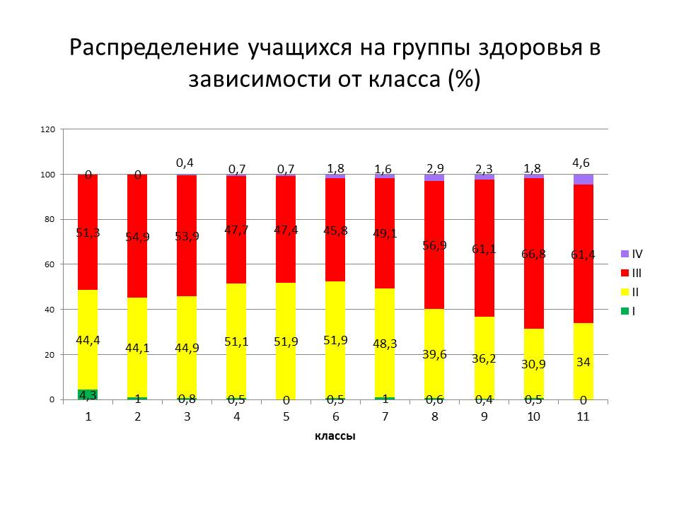
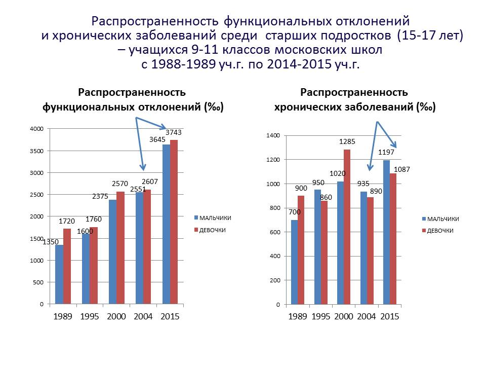
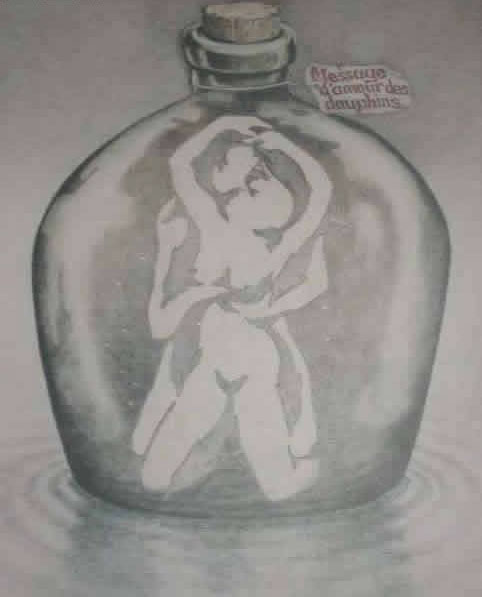

> **Первичный текст.** «Основы социологии», том 5. Страница издания: стр. 358 PDF — кандидатная привязка, требует сверки.
> Источник: файл издания `osnovy-sociologii-tom-5.pdf` (PDF в выпуск не включён). Контрольные суммы и статус проверки — в [NOTICE.md](../../NOTICE.md).
> Содержание передаёт позицию авторов издания; утверждения не верифицированы библиотекой.

---

### 19.3.2. Какой должна быть школа

Системы образования всех цивилизованных обществ большей частью оказывают воздействие на тело и психику человека в тот период жизни людей, когда *в соответствии с генетической программой развития особи вида «Человек разумный»* идёт процесс формирования структур организма и *психики личности как информационно-алгоритмической системы*.

Но **генетическая программа развития организма и психики личности — не автономная (не самодостаточная) программа**, т.е. она не способна полноценно отработать в изоляции организма и психики от внешнего мира; это интерактивная программа, которая обладает некоторой вариативностью и может *отрабатываться полноценно* только в процессе *определённого* воздействия внешней среды как на организм, так и на психику растущего человека, а также в процессе ответного воздействия растущего человека на воздействие среды. Эта программа — часть судьбы человека[^444], её стартовая основа, задающая начальные условия и первичные тенденции дальнейшей жизни[^445].

Поскольку Мироздание и все его фрагменты, включая и организмы людей как носители их душ, это — триединство материи-информации-меры (см. главу 3 — Часть 1 настоящего курса), то воздействие среды на индивида носит комплексный характер и включает в себя три составляющие:

- воздействие материальных факторов внешней среды (вещества и разного рода потоков энергий) на организм как на материальный объект;

- воздействие информационных потоков, характерных для внешней среды, на физиологию и психическую деятельность индивида и производную от них разнородную активность индивида;

- мерные параметры воздействия материальных факторов и информационных потоков по отношению к достигнутому индивидом качеству (мере) развития организма и мере развития *психики как информационно-алгоритмической системы*.

Интерактивность и вариативность программы означает, что реакция личности на воздействие среды может соответствовать генетическим возможностям дальнейшего *полноценного* развития, а может и не соответствовать им. В последнем случае человек может оказаться ограниченным в развитии либо необратимо; либо на некоторое время — в случае, если генетическая программа развития допускает реализацию первоначально отвергнутых, невостребованных или неудачно осуществлённых возможностей в течение некоторого последующего времени.

То обстоятельство, что генетическая программа развития полноценно отрабатывается только во взаимодействии организма и психики с внешней средой, означает, что система образования, будучи фактором внешней среды, с которой интерактивная генетическая программа развития организма и психики личности неизбежно будет взаимодействовать, должна строиться так, чтобы:

- её воздействие на организм и психику соответствовало уже́ достигнутым показателям качества развития структур организма и психики человека;

- это воздействие в отношении реализации генетической программы личностного развития было:

<!-- -->

- полноценно (т.е. разносторонне) стимулирующим;

- но никак не угнетающим, не тормозящим и не извращающим по отношению к процессам формирования организма и психики.

Именно этим требованиям, *проистекающим из биологии вида «Человек разумный»,* системы образования всех толпо-«элитарных» обществ (как образования для «элиты», так и образования для «простонародья») не удовлетворяют, чем наносят подчас непоправимый ущерб каждому вступающему в жизнь человеку, что не проходит без негативных последствий и для всей нынешней глобальной цивилизации.

Как уже было отмечено ранее (раздел 17), генетические программы взросления девочек и мальчиков различны: различны как по темпам развёртывания структур организмов, так и по последовательности некоторых этапов формирования психики, не говоря уж об анатомическом, физиологическом, биоритмическом и психологическом своеобразии девочек и мальчиков и соответственно — биологически полноценных и культурно-состоятельных взрослых представителей обоих полов.

Из этнографии известно, что детские субкультуры мальчиков и девочек, начиная с возраста примерно 4 — 5 лет, при семейном (характерном для кочевья) и общинном (характерном для земледелия, особенно в трудных природных условиях) экономическом укладах[^446] обособляются друг от друга[^447], и взаимный интерес друг к другу их представителей возобновляется только спустя несколько лет — уже в подростковом возрасте, когда начинается интенсивное половое созревание, начинают пробуждаться половые инстинкты и под их воздействием подростки вовлекаются в процесс выбора будущего спутника (спутницы) дальнейшей жизни.

В этом обособлении детских субкультур выражается различие и своеобразие генетических программ развития организмов и психики мальчиков и девочек, различие и своеобразие их возрастной физиологии и психологии, особенности мировосприятия и осмысления жизни; а также в нём выражается видова́я алгоритмика взаимной защиты развития девочек и мальчиков от не соответствующего генетическим программам развития организмов и психики каждого из полов влияния представителей противоположного пола.

Это объективное различие является фактором, обязывающим к тому, чтобы обучение мальчиков и девочек было раздельным по большинству предметов как в целях повышения качества самого́ образования, так и в целях формирования характеров будущих взрослых мужчин и женщин[^448].

При этом качество образования и тех, и других должно позволять им по окончании общеобразовательной школы учиться по единым программам в системе высшего и среднего профессионального образования, чтобы стать полноценными профессионалами в общественном объединении труда.

Соответственно:

Раздельное обучение должно начинаться с дошкольных учреждений, т.е. уже в детских садах обучающие игры и занятия для мальчиков должны быть — одни, а для девочек — другие, и они должны быть ориентированы на выполнение определённых функций представителями обоих полов во взрослой жизни[^449].

Кроме того, различие биологических и социокультурных функций взрослых представителей обоих полов предполагает, что в дальнейшем при изучении в школе биологии человека, социологии, медицины и гигиены — внимание мальчиков и внимание девочек необходимо акцентировать на разных аспектах жизни индивидов обоих полов и общества, и соответственно детальность проработки определённых тем мальчиками и девочками должна быть различной, хотя учебные курсы при этом должны быть тематически общими, что необходимо для обеспечения культурного единства общества и, в особенности, нравственно-мировоззренческого единства.

Но наряду с этим полная взаимная изоляция школьников обоих полов друг от друга также недопустима, поскольку система образования должна готовить и мальчиков, и девочек к взаимной поддержке деятельности друг друга во взрослой жизни как в общественной деятельности и на работе, так и в семье — во всех случаях на основе реализации схемы управления предиктор-корректор. Соответственно система образования должна включать в себя и цикл совместных занятий мальчиков и девочек по учебным дисциплинам художественного, общегуманитарного, досугово-развивающего и *педагогического*[^450] характера, чтобы обеспечить нравственно-этическое и культурное единство общества.

Однако уроки физкультуры для мальчиков и для девочек должны быть раздельными, в частности, потому, что:

- для правильного развития организма мальчика ему требуется в пять — шесть раз более интенсивная двигательная активность (включая и её силовые аспекты), нежели для правильного развития организма девочки;

- а при избыточной двигательной и в особенности силовой нагрузке организм девочки в процессе развития обретает мужские признаки как в аспекте анатомии (скелет и мышечная система формируются с отклонениями в сторону мужского типа), так и в аспекте физиологии (гормональный фон[^451] также смещается в сторону мужского типа)[^452];

- занятия физкультурой в подростковом возрасте тем более должны быть раздельными, поскольку, если они — общие, то превращаются во взаимные «смотрины» и неуместный активатор пробуждающихся половых инстинктов.

- недостаток же движения (гиподинамия) одинаково вредны и для развития мальчиков, и для развития девочек как в аспекте телесной организации и физиологии организма, так и в аспекте развития психики как информационно-алгоритмической системы.

Последнее же и есть — главный порок исторически сложившейся системы образования: она калечит всех, кто в неё попадает, обездвиженностью и гиподинамией.

Однако, мы живём в культуре, в которой подавляющее большинство не чувствует и не осознаёт негативного воздействия обездвиженности и гиподинамии на их организмы (в том числе и на систему чувств) и психику вследствие того, что большинство населения — выросли под их воздействием, опьянены «комфортом» жизни в «благоустроенной» цивилизации, позволяющей много чего делать без какой-либо двигательной (и тем более — силовой) активности организма.

Вопреки такому способу самочувствия и самоосознания, негативное воздействие обездвиженности и гиподинамии это — множество поражающих факторов, воздействующих на организм и на уровне тела и макробиополя организма в целом, и на уровнях их систем и органов; как в аспекте физиологии организма в целом, так и в аспекте нарушения течения процессов на клеточном и внутриклеточном уровнях, вплоть до повреждений генетического механизма[^453]. А поскольку организм является носителем психики, то и психика, рассматриваемая как информационно-алгоритмическая система, под воздействием обездвиженности и гиподинамии функционирует в режиме, весьма далёком от наилучшего.

Сказанное о воздействии обездвиженности и гиподинамии касается всех взрослых без исключения, но в ещё большей мере оно касается детей, полноценному телесному, биополевому и психическому развитию которых обездвиженность и гиподинамия в исторически сложившейся культуре препятствуют с первых же минут после рождения — как только новорождённого запеленали и обездвижили, превратив в подобие запелёнатой в погребальном обряде древнеегипетской мумии[^454]; причём взрослые норовят запеленать потуже, чтобы малыш не распеленался сам, поскольку, распеленавшись, он может простудиться; далее — «прогулки» в коляске, игры в тесноте квартиры и просмотр всевозможных видео в позах *«кривобоко» лёжа и сидя*.

И хотя настоящая работа посвящена не обездвиженности и гиподинамии, но о некоторых аспектах их воздействия на организм и психику сказать необходимо для того, чтобы было понятно, почему *систему образования надо **кардинально** изменить*.

Воздействие на организм обездвиженности и гиподинамии носит двоякий характер.

**Во-первых**, обездвиженность и гиподинамия лишают организм внешних и внутренних стимулов (раздражителей) к развитию скелетно-мышечной и сосудистой систем, следствием чего оказывается нарушение кровоснабжения всех органов и систем организма[^455], что приводит к невозможности их полноценного развития, включая развитие нервной системы в целом и головного мозга, в частности (для них движение — тоже непосредственный стимул к развитию); кроме того, в условиях обездвиженности и гиподинамии нервная и эндокринная системы в конечном итоге оказывается управленчески несостоятельными по отношению к управлению телом как в аспекте физиологии, так и в аспекте двигательной активности.[^456]

Кроме того, падение мышечного тонуса брюшной стенки ниже некоторого критического уровня влечёт за собой смещение внутренних органов под воздействием гравитации относительно их анатомически идеального положения, вследствие чего взаимное биополевое воздействие органов друг на друга становится *хронически* ненормальным. По этой причине нарушается биополевая физиология органов и организма в целом, что влечёт за собой и нарушение физиологии обмена веществ, и эти хронические нарушения физиологии имеют следствием разнородные хронические болезни, поражающие все без исключения органы и системы организма, но от которых свободны представители нецивилизованных обществ, культура которых основа на разнородной двигательной активности. Негативное воздействие падения мышечного тонуса на физиологию организма во всех её аспектах усиливается, если ему сопутствует ожирение, при котором жировые отложения вторгаются в пространство между органами и изменяют их расположение относительно друг друга.

**Во-вторых**, обездвиженность и гиподинамия — это не только пребывание организма в состоянии расслабленности мышц при обездвиженности или при весьма незначительных и непродолжительных динамических механических нагрузках при гиподинамичном образе жизни. Один из аспектов обездвиженности и гиподинамии — локальные длительные напряжения тех или иных мышц или групп мышц на фоне общей расслабленности или малоподвижности при пребывании организма в тех или иных статичных (неизменных на протяжении десятков минут и более продолжительных сроков времени) позах, вызванные большей частью врождёнными рефлекторными реакциями организма на специфические при обездвиженности внешние раздражители, а отчасти — неразвитостью личностных навыков произвольного управления мышечной системой и, прежде всего, тонусом мышц[^457].

В этом случае постоянно напряжённые мышцы длительное время сжимают проходящие сквозь них кровеносные и лимфатические сосуды, вследствие чего нарушается кровоснабжение и физиология обмена веществ не только самих напряжённых мышц, но и тех структур организма, с которыми связаны пережатые сосуды. Эти нарушения затрагивают ткани организма, расположенные как выше, так и ниже по течению физиологических жидкостей в сосудах. Вследствие этого нарушение транзита крови и лимфы через статически напряжённые на протяжении длительного времени мышцы негативно сказывается практически на всём организме, имея следствием невозможность развития и деградацию его структур.

Кроме того, под воздействием статически напряжённых на протяжении более или менее длительного времени мышц оказываются и проходящие сквозь них нервные волокна, что не несёт ничего хорошего для развития, состояния и функционирования нервной системы. Поскольку нервная система — одна из систем управления физиологией организма[^458], то нарушения в её структуре и в работе так или иначе сказываются непосредственно на физиологии тех или иных органов и опосредованно — на физиологии организма в целом.

Длительные статические напряжения мышц в сочетании с нарушением кровотока и лимфотока сквозь них имеют следствием интоксикацию самих мышц и организма в целом, поскольку продукты распада биологических энергоносителей, выделяющиеся в процессе поддержания мышц в напряжённом состоянии, не выводятся из них должным образом. Такая интоксикация оказывает своё поражающее воздействие на организм, начиная с процессов внутриклеточного уровня, и затрагивает так или иначе весь организм, включая нервную систему и головной мозг.[^459]

Поскольку организм является носителем психики личности, рассматриваемой как информационно-алгоритмическая система, то всё негативное непосредственное воздействие на организм обездвиженности и гиподинамии, опосредованно — через нарушения в функционировании организма — оказывает негативное воздействие и на психическую деятельность. Это касается и развития личностной психики на всём протяжении от младенчества до завершения формирования взрослого организма, если образу жизни ребёнка свойственна гиподинамия и обездвиженность как достаточно часто и продолжительно действующие факторы.

Но есть и прямое, непосредственное негативное воздействие гиподинамии на психику, в том числе и в процессе развития организма. Это воздействие протекает через систему органов чувств человека, которая поставляет информацию, необходимую как для обеспечения функционирования организма, так и для функционирования и развития психики. Прежде всего: исследования показывают, что развитие личностной психики становится более интенсивным, как только малыш переходит от лежания и ползания на четвереньках к прямохождению.

Прямохождение на двух ногах при свободных руках — генетически запрограммированная норма бодрствования для человека.

И соответственно в организме, в алгоритмике его автоматического управления, есть по крайней мере два потока информации, связанной с различием режимов:

- прямохождение, стояние, сидение на корточках;

- лёжка или *сидение при принятии веса организма на ягодичные мышцы* (сидение «на попе»).

Это информационные потоки, порождаемые: 1) вестибулярным аппаратом, реагирующим на положение тела относительно направления действия гравитационных сил, и 2) осязательными рецепторами на стопах.

- Если потоки информации от вестибулярного аппарата и рецепторов стоп при прямохождении, стоянии или сидении на корточках есть, — то для «автоматики управления организмом» это сигнал выработки и поддержания физиологической готовности к максимальной работоспособности во всех её проявлениях.

- Если потоков информации от вестибулярного аппарата и рецепторов стоп, генерируемых при прямохождении, стоянии или сидении на корточках, нет, — то для «автоматики управления организмом» это сигнал о погружении в режим отдыха и подготовки к той или иной активности в последующем.

Активность организма в лежачем или сидячем «на попе» положениях тоже может иметь место, но в подавляющем большинстве случаев это физиологически не нормально для двигательной активности. Такое положение организма может быть характерным для тех или иных психофизиологических практик[^460], ориентированных на решение определённых задач, но не является нормой для состояния бодрствования.

Особый вопрос — это пребывание более или менее продолжительное время в позе сидения «на попе». Один из аспектов такого сидения уже был затронут выше: это — сдавливание мягких тканей, кровеносных сосудов и нервных волокон и его последствия. Хотя в ягодичных мышцах при сидении «на попе» оно вызвано не статической напряжённостью мышц, а сдавливанием расслабленных мышц под воздействием веса организма, но последствия те же, что и при длительном напряжении мышц в статичных позах. И эти последствия затрагивают весь организм, на всех уровнях вплоть до внутриклеточного.

«Выполненные совместно с учеными СО РАМН (кандидатом биологических наук В.П. Новицкой и кандидатом медицинских наук В.А. Гуровым) исследования позволили вскрыть и следующий чрезвычайно важный факт. Спустя два года «книжно-седалищного» обучения у детей в 2,3 раза угасает флуоресценция (свечение) клеток крови (катехоламинов в лимфоцитах). В конце концов мы пришли к следующему глубокому убеждению: угасание чувства живой многоцветной образной жизни на фоне угасания свечения клеток и есть научное раскрытие центральной идеи всех священных писаний — «изгнание людей из РА’я», а также гибели «от познания добра и зла» (книжного познания жизни. — *В.Б.*)»[^461].

Или иначе — в другом дополняющем аспекте:

«Совместно с В.П. Новицкой и В.А. Гуровым установлено, что в условиях телесной вертикали и произвольно-волевой активности тела происходит утилизация в нашем теле особой фотонно-торсионной энергии. Это проявилось, в частности, в том, что при организации обучения детей в режиме телесной вертикали (прямостояния и прямохождения) спустя 2 года флуоресценция (свечение) клеток крови было в 2,3 раза мощнее по сравнению с детьми, учебный процесс которых строился в традиционном моторно-закрепощенном «седалищном» режиме»[^462].

Спектр последствий этого выявленного нарушения в энергетике клеток организма под воздействием многолетнего каждодневного сидения «на попе» на протяжении многих часов в полной мере не изучены. Но общенаучная практика показывает, что чем глубже локализовано нарушение в иерархии уровней структур Мироздания, — тем более разнообразны и тяжки последствия такого рода нарушений.

Но есть ещё один аспект, связанный с кинематикой тела, с его биомеханикой.

Можно ввести такое понятие «видовая грациозность движения». Она характерна для всех биологических видов, хотя в каждом из них обладает своеобразием вследствие видовой специфики анатомии организмов и решаемых представителями разных видов двигательных — кинематических, биомеханических задач. Тем не менее, для «видовой грациозности движения» во всех биологических видах характерно следующее:

- в режиме «видовой грациозности» движется весь организм, все его части, все его мышцы так или иначе активны в соответствующих фазах движения в целом (либо одновременно, либо в определённой очерёдности);

- параметры движения частей организма в режиме движения «видовой грациозности» соразмерны друг другу и обусловлены: 1) анатомически (организмом в целом) и 2) движением в целом (полной совокупностью траекторий всех точек тела).

Эта видовая грациозность движения наиболее ярко проявляется в плавании рыб, китообразных, ластоногих. У видов с развитыми, массивными в сопоставлении с туловищем конечностями (опорными и хватательными) подвижность конечностей относительно туловища, большая вариативность подвижности конечностей — отчасти скрывают эту видовую грациозность, создавая иллюзию, что конечности движутся сами по себе независимо от туловища. Хотя такое возможно и является даже нормальным в каких-то специфических режимах двигательной активности, но вне этих специфических режимов — это результат утраты видовой грациозности.

Описанная выше видовая грациозность свойственна всем позвоночным биологическим видам, хотя параметры движения частей тела в режиме видовой грациозности у каждого вида — свои.

Общим является то, что волна двигательной активности частей тела (и соответственно — циклов сокращения и расслабления мышц) в режиме видовой грациозности пробегает по всему организму. **При этом основной кинематический режим организма — ритмичная цикличность сокращений (напряжения) и расслабления всех мышц БЕЗ ИСКЛЮЧЕНИЯ.** В большинстве случаев зонами, из которых распространяются волны двигательной активности частей тела, являются зоны, которыми организм осуществляет силовое взаимодействие с твёрдыми и жидкими объектами внешней среды: для китообразных и рыб это — лопасти хвоста; для человека это в большинстве случаев — стопы (опираются на поверхность) и ладони (что-то находится в захвате или в ином взаимодействии при работе руками).

Иначе движение организма в режиме видовой грациозности можно назвать «целостным движением»[^463].

Двигательная активность мышц в состоянии покоя (лежания, сна) — связанная с перекачкой крови и лимфы скелетными мышцами и переменой локализации областей сдавливания тканей организма под воздействием веса тела и ответной реакции опорной поверхности[^464] — тоже относятся к этой видовой грациозности, являются разновидностью целостного движения, в которой волновой характер целостного движения проявляется наиболее ярко.

И во всех «макродвижениях» режима видовой грациозности волновой характер «микродвижений», определяющий тонус мышц и их готовность к макродвижениям, сохраняется[^465]; «макродвижения» в режиме видовой грациозности выстраиваются так, чтобы не нарушить физиологически необходимые волновые «микродвижения».

Видовая грациозность — множество возможных движений организма в целом и его частей, не нарушающих нормальную физиологию организма (прежде всего в аспекте кровотока и функционирования нервной системы, отсутствия продолжительного сдавливания мягких тканей). Это — генетически заложенное потенциальное свойство представителей биологического вида, осваиваемое в большей или меньшей мере либо отвергаемое в процессе индивидуального развития особей биологического вида.

Обладание ею — следствие взаимодействия генетической программы развития организма и воздействия на организм внешней среды.

Видовая грациозность проявляется в жизни сама собой, если в окружающей среде нет факторов, её искажающих или подавляющих в процессе развития организма и психики особи.

К сожалению, культура толпо-«элитарных» обществ, антиэргономичность техносферы в целом и подавляющего большинства её объектов таковы, что человек в процессе взросления не вырабатывает должную видовую грациозность. А сидение «на попе» на протяжении длительного времени — один из факторов культуры, под воздействием которого развитие видовой грациозности подавляется или извращается вследствие того, что:

- ягодичные мышцы, приняв в таком сидении на себя миссию восприятия реакции опорной поверхности, разделяют организм на три более или менее самостоятельных в аспекте возможностей движения фрагмента — две ноги и всё остальное, расположенное выше попы;

- будучи сдавленными в состоянии расслабления, они не пропускают через себя волны двигательной мышечной активности;

- сопутствующая зажатости ягодичных мышц сдавленность нервных волокон порождает множественные искажения видовой грациозности в ногах и в возвышающейся над попой верхней части тела при их движении как в статике, так и в динамике тела в целом[^466].

Последнее проявляется в неправильной осанке подавляющего большинства школьников при сидении за рабочими столами и партами[^467] (фото ниже: взято из книги В.Ф. Базарного «Перьевое письмо»), в непроизвольном статическом напряжении мышц в районе шейного отдела позвоночника и плечевого пояса[^468].

*[В оригинальном издании здесь расположен рисунок/схема «Иллюстрация из исходного DOC: image45.wmf». Иллюстрация не включена в данный выпуск: ожидает визуальной и правовой проверки. Файл источника: assets/media/image45.png]*Расслабленность мышц брюшной стенки при таком сидении является фактором, способствующим смещению внутренних органов под воздействием гравитации от их анатомически идеального положения, о последствиях чего было сказано ранее; если же ребёнок склонен к ожирению, то обездвиженность и расслабление мышц брюшной стенки способствуют образованию жировых отложений в пространстве между внутренними органами, что дополнительно усугубляет проблемы биополевой физиологии организма и наносит вред здоровью и развитию организма и психики.

Наряду с этим, если ребёнок «растёт», проводя порядка 1/3 суток и более в положении сидя «на попе»[^469], то при этом не только нарушается кровообращение в области таза, следствием которого являются недоразвитость и заболевания органов репродуктивной системы и мочевыделения как мальчиков, так и девочек, но кроме того в процессе роста организма таз деформируется относительно анатомически идеальной формы под воздействием веса более высоких отделов тела и восприятия реакции опоры (сиденья парты, поверхности стула) костями таза (седалищными буграми), а не вертлужными впадинами (чашами) тазобедренных суставов как это имеет место при стоянии и прямохождении. В результате школьницы вырастают с узкими тазами неправильной формы и анатомически неправильными родовыми путями[^470]. Ущерб от такого школьного «обучения» прямой — нарушение способности к вынашиванию плода и к родам будущих матерей, т.е. **школа фактически стала средством осуществления геноцида**.

Последнее обстоятельство — **деформация таза в процессе вырастания в положении сидя «на попе»** — даёт основания охарактеризовать министерство образования и науки РФ (по крайней мере до вступления в должность министра 19.08.2016 Ольги Юрьевны Васильевой) как легализовавшуюся банду компрачикосов[^471], поскольку их, начиная ещё с советских времён, *с медицинской статистикой в руках* неоднократно уведомляли о разрушении школой здоровья детей, но министерство образования и науки не предпринимает на протяжении всего этого времени никаких мер, к тому чтобы школа стала школой здоровья и человечности. А **проводимые им на протяжении десятилетий реформы ухудшают как качество образования, так и медицинскую статистику показателей здоровья школьников и выпускников школ**.

Ниже на рис. 19.3.2-1 представлена статистика, характеризующая состояние здоровья школьников на протяжении учёбы в школе с 1 по 11 класс. На рис. 19.3.2-2 представлены динамика утраты здоровья школьниками в период с 1989 по 2015 г. Рис. 19.3.2-1 и рис. 19.3.2-2 взяты из материалов выступления в «Общественной палате РФ» доктора медицинских наук И.К. Рапопорт 29 февраля 2016 г. (По данным «НИИ гигиены и охраны здоровья детей и подростков ФГАУ «Научный центр здоровья детей Минздрава России»).

**Пояснение**: I группа здоровья — наилучшие показатели телесного и психического здоровья, IV — наихудшие; показатели представлены в процентах от общей численности обследованных школьников. Исследования проводились в четырёх школах г. Москва.

*Рис. 19.3.2-1. Динамика потери здоровья школьниками четырёх школ*

*Москвы в процессе учёбы от 1-го класса до 11-м класса*

При этом банда компрачикосов в минобрнауке не внемлет критике и тупо делает своё вредительское дело[^472] под руководством вдохновителей и манипуляторов, остающихся за кулисами событий[^473].

*Рис. 19.3.2-2. Динамика утраты здоровья школьниками с 1989 по 2015 г.*

Но кроме того, психическая деятельность неразрывно связана с микро- и макро- движениями организма:

- утрата целостности психикой выражается в утрате видовой грациозности осознанно мотивированного движения на макроуровне, а так же — и в непроизвольных судорожных движения микро- и макро- уровней;

- утрата видовой грациозности, в свою очередь, искажает психическую деятельность практически во всех аспектах: чувственном (сенсорном), интеллектуальном, в аспекте формирования памяти и обеспечения произвольного доступа к хранимым разнородной (по локализации её носителей в организме) памятью массивам информации.

Всё изложенное выше о воздействии гиподинамии и обездвиженности на развитие организма и психики личности — объективные показатели того, что генетическая программа развития организма и психики не автономная программа, что дети могут полноценно развиваться только во взаимодействии с внешней средой при достаточной подвижности их организмов.

\* \* \*

Если бы генетическая программа развития организма и психики была автономной, то детство могло бы быть иным — например таким: 20 лет летаргического сна после рождения и в итоге по пробуждении — взрослый человек, телесно развитый на уровне олимпиоников древней Эллады[^474], совершенный в чувствах и в психической в целом деятельности, хорошо осведомлённый, т.е. культурно и профессионально состоятельный во всех аспектах предстоящей ему жизни.

И именно вследствие того, что генетическая программа развития организма и психики личности — программа интерактивная, навязываемые ребёнку культурой толпо-«элитарных» обществ гиподинамия и обездвиженность — факторы, не позволяющие ей полноценно отработать.

В результате мы все — практически без каких-либо персональных исключений — образуем цивилизацию недочеловеков, уклоняющихся под разными предлогами-отговорками от того, чтобы приложить усилия и состояться в качестве человеков самим и помочь в этом деле поколениям наших детей, внуков и правнуков.

\* \*  
\*

Теперь этот краткий и далеко не детальный обзор воздействия гиподинамии и практически полной обездвиженности на организм и психику соотнесите с тем, что **ребёнок, который должен развиваться**, проводит — *на фоне общей гиподинамии при сложившемся образе жизни нынешней цивилизации* — в возрасте от 6 до 17 лет (а студенты вузов — до 23 лет) в состоянии обездвиженности в позе «сидя на попе» от 4 часов (в первом классе) до 8 и более часов ежедневно: в школе и в вузе на занятиях и дома при выполнении домашних заданий.

И этого многолетнего воздействия многочасовой ежедневной обездвиженности и общей гиподинамии не могут полностью компенсировать никакие, даже ежедневные, уроки физкультуры и занятия детей в спортивных секциях[^475].

Чтобы школа не калечила подрастающие поколения обездвиженностью и гиподинамией, необходимо **повсеместно внедрять в качестве федерального стандарта** *систему обучения на основе вариативной, функционально целесообразной стимулирующей подвижности детей на уроках, разработанную под руководством В.Ф. Базарного*[^476]*,* о чём уже неоднократно говорилось в настоящем курсе.

\* \* \*

Для особо тупых и безвольных чиновников минобрнауки, прочих работников сферы образования, депутатов всех уровней и сенаторов, поясним — «повсеместно внедрять в качестве федерального стандарта» означает:

- под эту систему надо целенаправленно готовить педагогические кадры;

- под эту систему необходимо проектировать, строить и реконструировать здания детских садов, школ и вузов;

- по мере строительства и реконструкции зданий и способности укомплектовать штаты детских садов, школ и вузов педагогическими кадрами — переводить на новую систему подготовленные образовательные учреждения в целом (а не их подразделения) — дошкольные учреждения, школы и вузы;

- поскольку средством реализации любой педагогической субкультуры являются кадры, несущие эту субкультуру, — реформа системы образования не может идти быстрее, чем педагогические вузы осуществляют подготовку и переподготовку кадров для её успешного осуществления; и соответственно — темпы *эффективного* проведения реформы определяются темпами подготовки и переподготовки кадров.

А родители — со своей стороны — должны понимать, что нынешнее поколение чиновников и депутатов к общественно полезной деятельности, включая и создание человечной, здоровье преумножающей школы, можно только принудить и то только в тех пределах, которые допускают их невежество и слабоумие.

Поэтому для построения правильной системы образования — родители должны проявлять инициативу, в том числе и учиняя судебные иски в отношении представителей системы образования по поводу уничтожения здоровья их детей школой.

\* \*  
\*

А кроме того, саму систему обучения на основе стимулирующей развитие подвижности необходимо развивать.

В частности, если соотноситься с проблематикой видовой грациозности, её утраты под воздействием исторически сложившейся культуры, её обоюдосторонне направленных взаимосвязей с *личностной культурой чувств, интеллектуальной и психической в целом деятельности,* то для того, чтобы в ходе реформ получить полноценную школу человечности и преумножения здоровья, необходимо развить ещё одну педагогическую специальность, представители которой должны работать в детских садах и в младших классах школы. Это — детский тренер по целостному движению и психофизиологическим практикам.

Это утверждение необходимо пояснить, поскольку его содержание выходит далеко за пределы понимания проблем системы образования большинством.

Давно известно: *«Всё бесконечное разнообразие внешних проявлений мозговой деятельности сводится окончательно к одному лишь явлению — мышечному движению»* (И.М. Сеченов, 1947). Это — одна из формулировок принципа единства тела и психики в каждый момент времени жизни индивида.

Иначе говоря, вся психическая деятельность выражается в мимике лица, непроизвольных и произвольных движениях, возникновении статической напряженности мышц, их расслаблении и т.п.

Т.е. практически вся психическая деятельность некоторым образом кодируется на «языке тела», который мы разучились воспринимать на уровне сознания, хотя бессознательные уровни психики многих людей его воспринимают и «понимают» однозначно[^477].

И соответственно:

- в одном аспекте тело[^478] это — индикатор, своего рода монитор, в котором так или иначе отображаются все без исключения процессы психической деятельности — как успехи, так и её пороки;

- в другом аспекте тело и организм в целом это — носитель всех процессов психической деятельности, характер течения которых во многом обусловлен состоянием организма и его функционированием в процессе психической деятельности.

В Части 1 настоящего курса была рассмотрена вариативность организации психики (как информационно-алгоритмической системы) взрослого индивида. Неоднократно речь шла о необходимости настройки психики как информационно-алгоритмической системы на тот или иной вид деятельности, которой намеревается заниматься индивид. В разделе 4.6 («Процессно-образное и дискретно-логическое мышление», том 1 настоящего курса) было показано (на примере решения школьных задач по стереометрии), что многие, казалось бы, неразрешимые проблемы обучения школьников и освоения ими учебных программ, *традиционно, но большей частью безосновательно относимые к врождённой неспособности, к врождённым гуманитарному или математическому складу ума,* — во многом следствие того, что учащиеся даже выпускных классов (и как следствие — студенты гражданских вузов и курсанты военных училищ) не умеют произвольно создать настроение (организацию психики), позволяющее быстро и эффективно решать задачи и осваивать учебную программу; если же школьника научить произвольным порядком создавать настроение (выстраивать организацию психики), соответствующую той работе, которой он намеревается заняться, то многие проблемы уходят как бы сами собой в течение одной — двух недель, которые требуются для выработки навыка создания настроения. **Однако делать это следует не в 10 — 11 классах, а с этого должно начинать обучение в первом классе.**

Но опять же: носителем настроения является организм. И в основе способности организма нести то или иное настроение лежат: 1) биоритмика (сезонная, лунно-месячная, недельная, суточная), которой подчинена физиология, и отклонения реального образа жизни от свойственного каждому индивиду биоритмического оптимума, 2) рацион питания, 3) курение и алкоголь либо свобода от них и от прочих психотропов[^479], 4) двигательная активность.

Все выше названные четыре фактора хотя и проявляются с жизни индивида, но их проявления во многом обусловлены образом жизни культурно своеобразного общества и внутренней культурой семьи, в которой растёт или вырос индивид. Однако в отличие от первых трёх факторов характер двигательной активности — неотъемлемое и при том <u>*не вариативное свойство* индивида в каждый период его жизни</u> в том смысле, что его двигательная активность:

- либо выражает видовую грациозность во всех своих проявлениях,

- либо в его двигательной активности выражаются некие нарушения психической деятельности как на уровне сознания, так и на бессознательных уровнях психики, вследствие чего видовая грациозность в той или иной мере не достигается.

Сказанное касается естественно-здорового организма, т.е. организма:

- не имеющего врождённых деформаций и предпосылок к деформации скелета[^480] и иных врождённых анатомических пороков (отсутствия тех или иных органов, их недоразвитость и т.п.), так или иначе оказывающих воздействие на врождённую составляющую информационно-алгоритмического обеспечения жизни индивида и на его потенциал формирования в процессе жизни личностно-своеобразной составляющей информационно-алгоритмического обеспечения;

- обладающего здоровой физиологией обмена веществ (включая гормональный фон) и биополевых процессов, и соответственно — не имеющего больных органов и систем (в том числе кариесных каверн и пломб[^481] в зубах, что при имеющейся широкой распространённости стоматологических проблем уже воспринимается многими как безальтернативная «норма здоровья»[^482]);

- не утратившего те или иные органы (в том числе и зубы) и конечности вследствие травм или болезней;

- не знавшего вывихов и переломов, хирургических вмешательств (включая и вмешательство стоматологов) и связанных с ними болевых шоков, побочных воздействий средств местной анестезии на психику и пребывания в бессознательных состояниях под общим наркозом[^483].

Если тело не является естественно-здоровым в указанном смысле, то все врождённые и приобретённые нарушения анатомического и физиологического идеала — так или иначе выражаются в нарушениях структуры биополей соответствующего уровня (клеток, тканей, органов, организма в целом).

В частности шрамы, в том числе и последствия хирургических вмешательств (прежде всего глубоких при полостных операциях и операциях на скелете), могут наносить неустранимые повреждения системе энергетических меридианов[^484] (волноводов), проходящих по кожным покровам тела, и тем самым вызывать более или менее сильные нарушения биополевой физиологии и оказывать через неё воздействие на функционирование тела, его систем и органов, а также и на психическую деятельность.

Все такого рода повреждения тела организм в целом некоторым образом помнит, и эта память так или иначе выражается в нарушениях видовой грациозности дополнительно к тому, как видовая грациозность нарушалась бы при прочих равных условиях только под воздействием культуры и образа жизни индивида, если бы его организм был естественно-здоров в ранее определённом смысле.

Иначе говоря, видовая грациозность это — генетически заданная программой развития организма видовая норма, которую до́лжно осваивать во взаимодействии со средой в процессе развития естественно-здорового организма на пути от зиготы[^485] до взрослости; а её нарушения — всегда своеобразны и включают в себя две составляющие: 1) культурно-обусловленную и 2) болезненно-травматическую, формируемые на протяжении жизни своеобразием «биографии организма», начиная от предыстории зачатия до момента, когда встаёт вопрос о возвращении к норме видовой грациозности, насколько это позволяет ущерб, понесённый организмом в процессе предшествующей жизни.

Для индивида, чья пластика далека от норм видовой грациозности вследствие воздействия культуры, болезней и травм, психологически комфортна та ставшая привычной для него пластика движений, что ему свойственна. Она для него безальтернативно-«естественна» даже при всей своей противоестественности[^486]. **Сам по себе такой индивид не способен двигаться иначе при том состоянии его психики, которая имеется.** И это обстоятельство приводит к вопросу: *Что будет, если его с помощью куратора вернуть к видовой грациозности биологического вида «Человек разумный»?*

Ответ на этот вопрос двоякий:

- с одной стороны, сначала индивид испытает дискомфорт чисто телесного характера,

- а с другой стороны, *— как показывает практика тренеров по целостному движению,* — ошибки в работе психики, которые имеют следствием те или иные нарушения видовой грациозности (т.е. вызывают разорванность движения тела, разобщённость движений разных частей тела, их несоразмерность[^487]), могут быть осознаны и ликвидированы в результате возвращения к видовой грациозности.

Результатом такой проработки в спортзале (а не на кушетке в состоянии обездвиженности в кабинете «психоаналитика») личностно-психологических проблем является:

- снижение статистики психологически предопределённого травматизма, являющегося следствием несоответствия движений обстоятельствам;

- общее улучшение состояния здоровья, поскольку механизм возникновения практически всех болезней (кроме генетических[^488]) включает в себя психически обусловленную составляющую[^489];

- повышение эффективности работы психики как информационно-алгоритмической системы в решении разного рода больших и малых житейских задач (соответственно обусловленности нравственностью круга его интересов), в которых двигательная активность — не главное.

Проблема однако в том, что в тексте могут быть описаны принципы целостного движения и принципы построения психофизиологических практик восстановления видовой грациозности. Но реализация этих принципов в жизни требует:

- Осознания индивидом различия потоков чувств в режиме утраты видовой грациозности и в режиме видовой грациозности. Однако, поскольку для такого индивида «естественным» является движение вне режима видовой грациозности, в подавляющем большинстве случаев он не в состоянии самостоятельно вернуться к видовой грациозности.

- И соответственно ему необходимо кураторство со стороны тренера по целостному движению, в основе которого лежит диалог тренера и подопечного ему индивида.

И то, и другое в тексте плохо описуемо вследствие уникальности потока чувств каждого и, кроме того, обладает своеобразием как в аспекте культурно-обусловленных, так и в аспекте болезненно-травматических причин нарушения видовой грациозности в каждом конкретном случае.

Кроме того, в видовой грациозности движений (если она свойственна индивиду), выражается его внутренняя раскрепощённость, т.е. целостность его психики, отсутствие в ней страхов (как осознаваемых, так и бессознательных), запретных тем, внутренних конфликтов «с самим собой» и т.п., что расщепляет психику как информационно-алгоритмическую систему на более или менее изолированные друг от друга фрагменты, каждый из которых может «жить своею жизнью» более или менее независимо от других.

Поэтому если задать некий тестовый набор упражнений, которые индивид должен выполнить, чтобы показать некой «квалификационной комиссии» освоение им навыка видовой грациозности движений, то вариантов прохождения через такой тест три:

- не освоив видовую грациозность движения, индивид не пройдёт тест;

- индивид пройдёт тест, *если его натаскать на определённую кинематику движений в тренировочно-тестовых упражнениях нарастающей сложности*[^490]*,* но вне постановочного теста его движения будут по-прежнему вне видовой грациозности, а если ему предложат другой по составу набор тестовых упражнений, то он завалит тест, вследствие того, что *видовая грациозность, в которой выражается **свобода творчества движений в определённой обстановке,*** ему не свойственна в силу того, что самостоятельно творить движение в согласии с физиологией организма и внешней обстановкой он не умеет[^491];

- индивид пройдёт тест даже без репетиций тестовых упражнений, если ему свойственна видовая грациозность.

Поэтому:

Ничего типа учебно-методических комплексов, рабочих программ, фондов оценочных средств, столь полюбившихся бесчувственным и интеллектуально тупым бюрократам из министерства образования и науки РФ, которыми они насилуют педагогов всех уровней системы образования, — по дисциплине «Освоение видовой грациозности и навыков создания настроения» разработать невозможно.

Но вопрос не только в возвращении школьников (прежде всего первоклассников) к видовой грациозности, хотя это и само по себе полезно. Построение человечной системы образования требует создания телесно-биополевой личностной базы, фундамента, на основе которого учащийся может войти в учебный процесс. Эта база включает в себя навык чувствования своего организма, т.е. своих тела и биополя, поскольку это необходимо для выработки других навыков, необходимых для успешной учёбы:

- навыка произвольной саморегуляции физиологии организма (с ним связаны произвольное управление мышечным тонусом, «беспричинные» утомляемость и снижение иммунитета);

- навыка создания настроения (т.е. поддержания эмоционально-смыслового строя и работы психики в алгоритмике третьей схемы обработки информации);

- навыка повторного произвольного переживания событий прошлого, представляющего собой произвольный вызов в настоящем потока чувств, имевшего место в прошлом, — это реальная память, не помрачённая играми воображения, моделирующего прошлое, исходя из нравственно обусловленных предпочтений настоящего, и подменяющего память.

Психофизиологические практики возвращения к видовой грациозности способны решить и эту задачу выработки навыков, необходимых для эффективной учёбы, не только не наносящей вреда организму и психике, но и развивающей их полноценно.

И собственно ради решения этой задачи детские сады и школы нуждаются в том, чтобы была развита ещё одна педагогическая специальность — **детский** **тренер по целостному движению и психофизиологическим практикам**. Он необходим для того, чтобы ребёнок мог не только эффективно учиться без вреда для здоровья, но и полноценно развиваться и телесно, и в аспекте биополя (духа), и в аспекте выработки эффективной личностной культуры психической деятельности.

Кроме того на него же должна быть возложена задача выявления характера ребёнка на момент его прихода в школу соответственно типологии характеров, о необходимости выявления которой речь шла в разделе 19.3.1 при обсуждении роли наследия П.Ф. Лесгафта в деле формирования характеров выпускников школ. Без этого задача формирования полноценных характеров взрослых людей решена быть не может.

Подготовка педагогов этого профиля в настоящее время — большая проблема, поскольку система образования ориентирована на программирование психики обучаемых неким набором слов и шаблонных навыков, а **детский** **тренер по целостному движению и психофизиологическим практикам** должен быть человеком не затюканным шаблонами, а человеком, свободно[^492] творчески действующим по отношению к каждому ребёнку со всеми его проблемами, которые он должен чувствовать, чтобы находить способы их устранения.

В детском дошкольном и младшеклассном возрасте возращение к видовой грациозности и выработка навыков создания настроения могут быть организованы в форме игр.

Ещё одна проблема, связанная с видовой грациозностью, — это почерк, его выработка и сопутствующие этому иные результаты. В настоящее время (2015 г.) среди студентов обладатели просто разборчивого почерка — редки, а разборчивого и красивого почерка — уникальны. И если исходить из того, что студенты — такие, какие они есть, всё же — лучшие выпускники школ[^493], то это тоже один из показателей деградации общества. Дело в том, что в XVII — XIX веках принтеров, графопостроителей, пишущих машинок не было, но чертежи в инженерном деле применялись, и на них были пояснительные надписи. Надписи были выполнены обычным рукописным почерком, и этот почерк был однозначно-разборчивым, а не гадательно-предположительным. В 1920‑е гг. в СССР ликвидировали неграмотность, и одним из следствий этого стала неразборчивость почерков некоторой части населения, в том числе и будущих студентов. В итоге на утрату разборчивого и красивого почерка значительной долей населения инженерное дело отреагировало появлением ГОСТ-овских чертёжных шрифтов: т.е. в своих конспектах и в письмах родным студенту было предоставлено право писать любыми каракулями, но в чертежах — никакой отсебятины в шрифтах: все буквы и цифры по ГОСТу, а потом на работе — одна не по ГОСТу написанная буква или цифра, и нормоконтроль имел полное законное право отвергнуть весь чертёж, как не соответствующий требованиям ГОСТа, что влекло за собой потерю времени на исправление чертежей, снижение заработной платы и другие неприятности.

Тем не менее такой предмет как чистописание сохранялся в начальной школе, и до конца 1960‑х гг. школьникам предлагалось осваивать почерк, стандартное написание букв в котором представлено на рисунке 19.3.2‑3 слева. А справа на этом же рисунке представлен стандарт «улучшенного» почерка, пришедший на смену этому «архаичному почерку» в 1970‑е гг.

В чём разница?

*Рис. 19.3.2-3. Стандарты почерка: Слева — 1960‑е гг.;*

*справа — с начала 1970‑х гг. и по наши дни*

**Внешне видимая разница:**

- *[В оригинальном издании здесь расположен рисунок/схема «Иллюстрация из исходного DOC: image50.jpeg». Иллюстрация не включена в данный выпуск: ожидает визуальной и правовой проверки. Файл источника: assets/media/image50.jpeg]*Прописи 1960‑х гг. предлагали осваивать навык каллиграфического письма на основе использования чернильной ручки с открытым пером (фото слева). Ранее, в 1950‑е годы наиболее распространённой была ручка со вставным пером, обмакиваемая в чернильницу; с начала 1960‑х основным пишущим средством стала перьевая ручка со встроенным резервуаром для чернил и автоматической подачей чернил на перо — авторучка.

  *[В оригинальном издании здесь расположен рисунок/схема «Иллюстрация из исходного DOC: image51.png». Иллюстрация не включена в данный выпуск: ожидает визуальной и правовой проверки. Файл источника: assets/media/image51.png]*На фото выше представлен разворот тетради первоклассника 1964 г. При движении пера вниз следовало вести линию, нажимая на ручку, в результате чего линия получалась толще; при движении пера вверх следовало вести линию без нажима, и она получалась тоньше. Это касалось и «хвостиков» букв «Ц» и «Щ». Кроме того, в заглавных буквах наличествуют завитушки-украшения, не обязательные для различения и идентификации букв. Элементы многих букв начинаются точками, которые надо было прорисовать. В прописях 1950‑х годов таких украшающих буквы элементов было несколько больше, чем на представленном выше рисунке: в частности горизонтальную палочку строчной буквы «Н» предлагалось писать как волну (как это видно на фотографии открытого пера авторучки выше и аналогично тому, как написана верхняя полочка цифры «7» и заглавной буквы «К» в левой части рис. 19.3.2‑3), а не как прямую линию. При этом стандарт почерка содержал и средства защиты информации от небрежности в написании. В частности, цифра «7» имела перечёркнутую ножку, что было дополнительным средством отличия её от цифры «1» при не очень аккуратном написании, а цифру «3» в ряде случаев рекомендовали писать так, чтобы её верхняя часть была не округлой, а угловатой (по типу цифры «7») для того, чтобы в тексте она всегда была отличима от буквы «З». Как видно по левой части рис. 19.3.2-3, ноль тоже был отличим от буквы «О» во всех вариантах её написания[^494].

- Почерк, предлагаемый к освоению прописями, начиная с 1970‑х гг., графически проще: в нём нет завитушек-украшений, которые не обязательны для того, чтобы различать разные буквы. Кроме того он ориентирован на безотрывное письмо, т.е. на то, чтобы свести к минимуму количество переносов пишущего элемента без контакта с бумагой от конца одного элемента буквы к другому её элементу или к началу другой буквы. Если говорить о средстве письма, то этот почерк, в отличие от почерка прописей более ранних времён, казалось бы, не обязывает пользоваться каким-либо определённым видом пишущих средств. Поэтому он позволяет начинать обучение письму сразу же шариковой ручкой как наиболее распространённым средством письма в наши дни. Благодаря упрощению начертания букв (отсутствию завитушек-украшений, ликвидации точек в элементах букв, ориентации на безотрывность письма и т.п.), он позволяет писать быстрее, нежели почерк из прописей 1950‑х — 1960‑х гг. Однако этому утверждению сопутствует парадокс: позволяет писать быстрее, но… только при определённой личностной культуре микродвижений кисти пишущей руки, которую этот вид почерка не позволяет выработать (особенно при начальном обучении письму шариковой ручкой), вследствие чего эта возможность оказывается не реализуемой в большинстве случаев[^495] (возникновение этого парадокса будет пояснено ниже).

  Казалось бы, налицо прогресс, если оставить без внимания тот факт, что цифры «1» и «7», ноль и буква «О», цифра «3» и буква «З» стали не всегда различимы. Однако, чтобы оценить этот «прогресс», необходимо обратиться к проблематике всё той же видовой грациозности, но уже не в аспекте макродвижений тела в целом, а в аспекте микродвижений пальцев, кисти и руки в целом и связей микродвижений с психикой. И тут выясняется, что в действительности имеет место регресс.

**Внутренние различия, не видимые непосредственно в конфигурации букв:**

- Для любой телесной деятельности человека биологически естественна ритмика сокращения и расслабления мышц. Это касается как макродвижений, когда человек идёт, бежит, выполняет какую-либо работу (копать, колоть дрова и т.п.), так и для микродвижений при осуществлении руками какой-либо мелкой работы. **Почерк, предлагаемый прописями 1950‑х — 1960‑х гг., выработанный в прошлом в течение нескольких столетий, полностью соответствует естественной биоритмике микродвижений при письме перьевой ручкой.** Что касается украшающих элементов (завитушек и точек), то *после освоения этого почерка на основе естественной биоритмики микродвижений* те, кому скорость письма представлялась недостаточной, самостоятельно избавляли свой индивидуальный почерк от лишних украшающих элементов и переходили к той или иной разновидности безотрывного письма; а когда надо было написать красиво, то писали с завитушками, в том числе и с непредусмотренными стандартом прописей.

  Собственно так кто-то и породил стандарт почерка, предлагаемый прописями 1970‑х гг. Но он породил этот стандарт на основе навыков, выработанных в прошлом при письме в стиле прописей 1950‑х — 1960‑х гг. И проблема состоит в том, что без этих навыков почерк, предлагаемый прописями 1970‑х и последующих годов, не позволяет выработать физиологически нормальную ритмику микродвижений при письме, поскольку из процесса обучения навыку письма выброшен предшествующий и безальтернативно необходимый этап личностного развития — освоение почерка, предлагаемого прописями 1950‑х — начала 1960‑х гг., ориентированного на выработку ритмики физиологически состоятельных микродвижений при длительном письме, при написании и переписывании больших по объёму текстов.

- **Почерк, предлагаемый прописями с начала 1970‑х гг. по настоящее время при начальном обучении письму, — тем более шариковыми ручками — оказывается не совместимым с биоритмикой микродвижений.** Чтобы шариковая ручка писала, на неё надо постоянно нажимать, поскольку в противном случае шарик не прокручивается и паста не переносится на бумагу в необходимых количествах. О вреде статических напряжений для физиологии и психики организма было сказано ранее при обсуждении воздействия на организм и психику гиподинамии и обездвиженности. Фактически в состоянии статического напряжения при начальном обучении письму шариковой ручкой на основе «оптимизированного» почерка прописей 1970‑х и последующих годов пребывает весь плечевой пояс и шейный отдел позвоночника. Как следствие кровоснабжение головы ухудшается, школьник скоротечно достигает состояния переутомления. А о безотрывности письма как ускорителе процесса написания текста имеет смысл говорить только после того, как освоено письмо на основе освоения ритмики «напряжения — расслабления мышц» в микродвижениях.

  Причём если говорить о самом письме, то лучшее средство для продолжительного по времени письма в аспекте минимума затрат энергии и утомляемости — чернильная перьевая ручка: чернила стекают на лист сами. У гелевой ручки паста тоже стекает на лист сама, но перо в отличие от пишущего элемента гелевой ручки, обладает упругостью, необходимой, чтобы принимать на себя микродвижения и амортизировать их. Поэтому утомляемость (и в аспекте усталости мышц, и в аспекте психологическом) при письме перьевой чернильной ручкой ниже, чем при письме карандашом, шариковой или гелевой ручкой.

  В аспекте же микродвижений мышцы, закрепощённые в статическом напряжении, спустя некоторое время реализуют *физиологическую потребность в движении* в виде судорожного дрожания переменной амплитуды и частоты относительно положения статического закрепощения. Как следствие при письме этот навык судорожного дрожания выражается в неразборчивости почерка, в несоразмерности букв в словах и строках, в неритмичности письма, в неспособности писать ровными строками без трафарета или разлиновки листа; да и при наличии разлиновки в бланках различных форм попасть в их графы, как показывает практика, могут далеко не все.

  Ответное воздействие такой судорожно-дрожащей моторики на психику не несёт ничего хорошего: последствия от более или менее ярко выраженного синдрома дефицита внимания и сопутствующей ему гиперактивности — до стойкой полноценной шизофрении, порождаемой сочетанием вредоносных факторов, свойственных организации процесса обучения; и то, и другое может свести способность школьника к учёбе практически до нуля и породить много бедствий в жизни общества (с учётом воздействия такого «обучения» на всех без исключения во вступающих в жизнь новых поколениях).

Дальнейший «прогресс» системы образования может выразиться в том, что от выработки навыка рукописного письма система вообще откажется и перейдёт к выработке навыка работы на клавиатуре слепым десятипальцевым методом. Метод, конечно, хорош и необходим во взрослой жизни цивилизованного общества в эпоху господства клавиатуры и мыши[^496], осваивать его — надо, но он не развивает мелкой моторики и структуры коры головного мозга так, как это происходит в детстве в процессе освоения каллиграфического письма в стиле прописей 1950‑х — начала 1960‑х гг.

Кроме того, каллиграфический почерк до эпохи начала массового применения пишущих машинок в документообороте (а потом и в быту многих семей) был показателем личностной культуры. Разборчивость почерка была одним из показателей уважения к человеку, читающему текст. Поэтому в наше время массового применения компьютеров и всевозможной принтерно-множительной техники навык каллиграфического письма утратил то *этическое* значение, какое он имел до начала 1920‑х гг.[^497]

Тем не менее, если мы действительно хотим снизить утомляемость школьников и студентов, то начальной школе необходимо вернуться к чернильным авторучкам с открытыми перьями и к прописям с почерком образца 1950‑х — 1960‑х гг. Переход к оптимизированному почерку типа прописей 1970‑х гг. может происходить естественным образом в 5 — 6 классе, когда прописи образца 1950‑х — 1960‑х гг. сделали своё дело в аспекте развития ритмики мелкой моторики. Клавиатурную грамотность на основе слепого 10-пальцевого метода можно осваивать параллельно.

Кроме того, в раннем детстве и в младшем школьном возрасте развитие мелкой моторики рук в разного рода занятиях (игра в бирюльки[^498], лепка, аппликация, многие народные ремёсла, рисование в детальности, каллиграфия и т.п.) имеет следствием не столько сам сиюминутный результат игры или деятельности, а развитие структур височные и лобных долей коры головного мозга. Считается, что височные доли отвечают за восприятие реальности посредством органов чувств, а лобные — за движение, постановку и решение задач, т.е. за выработку и осуществление решений. Височные и лобные доли коры головного мозга — универсальны в том смысле, что им всё равно какую информацию обрабатывать: связанную с макро- и мелкой моторикой или же связанную с какой-то иной, сугубо интеллектуальной, деятельностью[^499]. Но если они не развиты в раннем детстве и младшем школьном возрасте, то в последующие возрастные периоды в головном мозгу индивида просто нет ничего, что необходимо для высокоинтеллектуальной и, вообще, — творческой деятельности.

Теперь можно подвести некоторые итоги разделу 19.3.2.

- Требование возвращения к раздельному обучению мальчиков и девочек ориентировано:

<!-- -->

- на повышение усвоения учебных программ за счёт опоры в учебном процессе на возрастные чувственно-психологические особенности мальчиков и девочек и, соответственно, — на повышение качества образования вне зависимости от содержания учебных программ;

- на устранение из жизни школы «войны полов» за доминирование в классе, что в должно способствовать в последующих поколениях укреплению института семьи в обществе за счёт отсутствия в психике людей бессознательных автоматизмов «войны полов», выработанных в школе при совместном обучении и продолжающих действовать во взрослой жизни — на работе, в семье, в общественной деятельности.

<!-- -->

- Требование введения в систему образования специальности «детский тренер по целостному движению и психофизиологическим практикам» ориентировано на то, чтобы:

<!-- -->

- обеспечить лучшее освоение учебных программ за счёт выработки у детей уже́ в первом классе навыка произвольно создавать настроение, позволяющее эффективно осваивать учебные программы или осуществлять иные виды деятельности;

- вернуть систему образования к чувственно-интуитивной основе процесса познания и развития образного мышления и средства установления жизненно состоятельных связей абстракций и реальности.

  Реализация этого требования также не связана с содержанием учебных программ.

<!-- -->

- Требование организации учебного процесса на основе системы В.Ф. Базарного, обеспечивающей подвижность детей на уроках, ориентировано на сохранение и развитие телесного и психического здоровья школьников и выпускников школ и вузов и также во многом не связано с содержанием учебных программ.

  Прежде всего это касается тех элементов системы В.Ф. Базарного, которые ориентированы не столько на выработку тех или иных конкретных навыков и освоение той или иной фактологии учебных курсов, необходимых во взрослой жизни, сколько на развитие мелкой моторики, системы чувств, образного мышления и общего личностного телесного и психического развития детей в процессе тех или иных занятий: подвижных игр, рисования, лепки, музыкальных занятий — всего того, что делает организм и психику ребёнка способными к эффективной учёбе в аспекте освоения учебных программ.

Что касается содержания учебных программ, то в процессе работы над «Основами социологии» мы сочли за благо осветить эту проблематику в опубликованном в 2014 г. четвёртом томе — см. раздел 14: 14.1. «Каноны и научно обоснованные методы решения частных задач» и 14.2. «Эпоха и система образования».

Если кратко отвечать на вопрос: чему должна учить школа в аспекте образования? — то ответ будет таким:

- В первом классе — кроме выработки навыка произвольного создания *настроения, отвечающего потребностям деятельности* (о чём было сказано выше), вторая по значимости задача — вывести учеников на навык скорочтения (не бессмысленного проговаривания текста под секундомер, как это делается ныне), а в темпе листания, позволяющего «загрузить» текст в память для последующего осмысления прочитанного и соотнесения его с жизнью.

  Скорочтение — необходимая основа для того, чтобы процесс получения образования стал процессом творческого самообразования всех школьников на основе последующего обсуждения ими самостоятельно прочитанного в классе под руководством учителей-предметников.

- Процесс направленного самообразования должен выводить всех на уровень освоения диалектики как метода познания и творчества путём постановки вопросов, выявляющих те или иные неопределённости, и нахождения ответов на эти вопросы, жизненная состоятельность которых подтверждается на основе принципа «практика — критерий истины» (см. Часть 1 настоящего курса).

- Поскольку жизнь общества и биосферы характеризуется разнородными статистиками, то освоение математики в общеобразовательной школе должно давать представление об описании разнородных процессов в жизни аппаратом теории вероятностей и математической статистики, позволяющее оперировать статистиками в жизни и оценивать динамику течения событий на основе соотнесения статистик разного времени друг с другом, как минимум, на основе графического отображения статистик как наиболее ёмкой формы их представления.

- Учение о диалектике (гносеология) как о генетически запрограммированном для человека способе познания и творчества должно быть понятно всем в возрасте старше 13 — 14 лет на основе того, что они могут наблюдать в их собственной психической деятельности.

- Достаточно общая теория управления должна входить в стандарт всеобщего обязательного образования в силу той роли которую играет в жизни общества преодоление всеобщей управленческой безграмотности.

То государство, которое первым обеспечит всеобщую познавательно-творческую (гносеологическую) управленческую грамотность населения, — обречено стать мировым лидером.

- В сопоставлении со школой времён СССР и более раннего периода многократно должна быть увеличена иллюстративная составляющая образовательного процесса (в том числе и кино-иллюстрации), благо современная и перспективная компьютерная и мультимедийная техника это позволяет делать[^500]. Тексты, даже при развитости образного мышления учеников, недостаточны для того, чтобы понять многие изучаемые темы, понимание которых требует конкретики образов: это касается, прежде всего, истории, а также многих вопросов биологии и техники. Ну а если образное мышление не развито, а тем более подавляется системой, то текстуально-книжное образование плодит хорошо начитанных идиотов.

Ранее в разделе 10.7 (том 3 настоящего курса) было указано, что образование в своей основе может быть чувственно-интуитивным и текстуально-книжным. При этом было отмечено, что в исторически сложившихся толпо-«элитарных» культурах образование для всех (включая «элиту») строится на текстуально-книжной основе, а образование на чувственно-интуитивной основе — это образование для представителей кланов, несущих ту или иную эзотерическую традицию, а также и для тех, кого кланы «усыновят — удочерят».

Кроме того, самоучки в истории толпо-«элитарных» культур, которые смогли стать выдающимися деятелями в своих сферах деятельности, также достигали успеха, строя своё самообразование на чувственно-интуитивной основе.

Но в рассмотрение различий функционирования психики в случае освоения образовательных программ на чувственно-интуитивной основе и на текстуально-книжной, мы не вдавались, поскольку это различие должно быть понятно из Части 1 настоящего курса — см. главу 2, раздел 4.6, главу 5. Поэтому рассмотрим этот вопрос именно по отношению к задаче преображения системы образования.

Принципиальное различие обоих вариантов образования состоит в том, как работает психика в каждом из них.

- Если образование строится на чувственно-интуитивной основе, то последовательность такова:

<!-- -->

- сначала на основе информации, поступающей от чувств (включая и интуицию), психика выстраивает систему образов и мелодий, которая так или иначе доступна внутреннему взору (этот процесс носит нравственно обусловленный характер, что ярко показывает уже приводившийся рисунок, повторно воспроизведённый слева);

- потом психика — в случае надобности[^501] — сопоставляет этой системе образов и мелодий языковые (символьные) формы, работая с которыми, другой человек способен построить в своём мировоззрении систему образов и мелодий в большей или меньшей мере аналогичную системе первого;

- принцип «практика — критерий истины» позволяет и первому, и второму человеку, привести своё мировоззрение и миропонимание к состоянию адекватности объективной реальности через всё ту же процедуру активизации чувственно-интуитивной основы познания и последующую корректировки системы образов и мелодий и системы её взаимосвязей с языковыми (символьными) формами (систему выражения образов и мелодий через языковые и символьные формы).

<!-- -->

- Если образование строится на текстуально-книжной основе, то последовательность иная:

<!-- -->

- **первый этап — чувственно-интуитивное восприятие мира и построение психикой системы образов и мелодий — исключается;**

- соответственно, первым этапом становится загрузка в психику языковых и символьных форм, которым необходимо сопоставить некие образы, но с этой задачей психика не может справиться правильно, если чувственно-интуитивная основа и процессно-образное мышление не развиты или исключены из процесса;

- принцип «практика — критерий истины» оказывается недоступным при неразвитости или исключении из процесса чувственно-интуитивной основы, вследствие чего критериями истины становятся так называемые «авторитеты персонально», «авторитетные тексты» и, может быть, — какая-то логика, что вовсе не обязательно гарантирует истинность полученных результатов осмысления прочитанного текста.

Яркий пример жизненной несостоятельности текстуально-книжного образования — широко известная по интернету байка:

«Однажды современных детей-первоклашек попросили нарисовать картинку по четверостишью Пушкина:

Бразды пушисты взрывая,  
Летит кибитка удалая.  
Ямщик сидит на облучке  
В тулупе, в красном кушаке.

В результате получилось... Ну, начнем с того, что из всех слов самыми понятными оказались "тулуп" и "кушак". Кибитка в представлении детишек оказалась летательным аппаратом. Почему? Ну как, написано же "летит кибитка удалая". У некоторых она оказалась ещё и похожей на кубик (КУБитка). Летающая удалая ки(у)битка занимается весьма воинственным делом — она взрывает.

Что, или, вернее, кого? Бразды пушистые. Это зверьки такие (пушистые же!), помесь бобра с дроздом. То, что по правилам тогда должно было быть "браздов", детей не смутило — и на бедных пушистых браздов посыпались с кибитки гранаты и бомбы.

За геноцидом браздов наблюдает некая личность в тулупе и красном кушаке и с лопатой. Это ямщик. Носитель тулупа и кушака, по мнению детей, никакого отношения не имеет к кибитке и творимым ею безобразиям.

Рождённый копать — летать (на кибитке) не может!

Самым трудным словом оказался облучок. Часть детей вообще не поняла, что это такое и с чем его едят, в результате ямщик с лопатой (а чем ему ещё ямы копать, он же — ямщик!) оказался сидящим на "пятой точке".

В другом варианте ему предлагалось сесть на маленький обруч (обр(л)учок) и, балансируя лопатой, наблюдать за взрыванием браздов.

В результате нету несущейся в облаке искрящегося под солнцем снега кибитки с веселым бородатым дядькой в тулупе и кушаке на козлах.

*[В оригинальном издании здесь расположен рисунок/схема «Иллюстрация из исходного DOC: image53.png». Иллюстрация не включена в данный выпуск: ожидает визуальной и правовой проверки. Файл источника: assets/media/image53.png]*Вместо этого над землёй несется кубическая летающая хреновина, под её смертоносными ударами летят кровавые ошметки несчастных пушистых браздов, а за всем этим, балансируя на обруче на краю вырытой ямы, наблюдает люмпенская личность в тулупе и красном кушаке, с лопатой».

Вне зависимости от того, лежит в основе этой байки действительно имевшее место событие, либо она полностью выдумана, тем не менее она очень точно показывает порочность построения системы образования на текстуально-книжной основе: ребёнок может сопоставить тексту в подавляющем большинстве случаев только те образы, какие уже есть в его психике; если эти образы неадекватны той реальности, какая стоит за предлагаемым ему текстом, то текст будет понят в большей или меньшей мере извращённо, что и показывает предельно ярко эта байка. С течением времени ошибки в мировоззрении и миропонимании, формируемых образованием на текстуально-книжной основе, будут накапливаться тем в большей мере, чем сильнее подавляется чувственно-интуитивная основа освоения и производства новых знаний и навыков и образное мышление[^502].

Поэтому из системы образования, построенной на текстуально-книжной основе и подавляющей чувственно-интуитивную основу и образное мышление (в том числе и обездвиженностью) могут выходить не только масса заведомых левополушарно-«мыслящих» дебилов среднестатистического уровня тупости и творческой недееспособности, но и обстоятельно и разносторонне начитанные *выдающиеся идиоты*, которые будут восприниматься в качестве хорошо образованных умных людей[^503]. Но такими хорошо обстоятельно и разносторонне начитанными дебилами и выдающимися идиотами можно легко манипулировать потоком слов и символов точно также, как мы управляем компьютерами на языках программирования разных уровней. Как и в случае управления компьютером вопрос о соотнесении языковых и символьных форм с реальностью жизни в задаче манипулирования дебилами и выдающимися левополушарно-«мыслящими» идиотами, решается оператором, программистом и заказчиком самих программ и процедур их реализации в конкретике жизненных обстоятельств.

Распространению такого рода массового идиотизма будет способствовать и дальнейшее распространение всевозможной компьютерной техники, в «общении» с которой вырастают многие дети нашей эпохи[^504], а также интеграция в перспективе в единую систему организма человека и компьютера. Профилактировать это можно только одним путём — путём ограничения доступа детей к компьютерной технике в их свободном времяпрепровождении.

**Кроме того, система образования, подавляющая чувства, интуицию, процессно-образное мышление, является генератором бюрократизма, поскольку создаёт кадровую базу бюрократии — множество людей, воспринимающих мир исключительно как поток текстов и слов, но не способных увидеть за словами и текстами действительность. Часть из них становится профессиональными бюрократами**[^505], а другая — бо́льшая часть — подвластными бюрократам обывателями, порабощёнными тезисом «я — человек маленький, что я один могу поделать?», вследствие чего схема осуществления власти, представленная на рис.13.2.2-1[^506], остаётся вне их чувств и соображения и представляется им не реально открытой возможностью изменить жизнь, а несбыточной сказкой.

С системой образования связана и проблема коррупции:

- Для того чтобы разрешать имеющиеся в обществе проблемы и профилактировать возникновение новых проблем, необходимо знать биологию биоценозов, биологию человека и основы медицины, личностную и коллективную психологию, историю развития культуры, экономику и финансы, теорию управления и её связи с практикой общественной жизни, государственного управления и хозяйственной деятельности. Т.е. необходимо знать и видеть проявление в жизни объективных закономерностей всех шести групп, о которых речь шла неоднократно ранее.

- Для того, чтобы стать коррупционером, всё это знать не обязательно. Достаточно владеть бюрократическим профессиональным слэнгом (это даёт вузовское образование по соответствующим специальностям) и знать: кого конкретно можно безнаказанно «доить» и «стричь»? кому из вышестоящих по иерархии власти нести, причитающуюся ему долю «настриженного» и «выдоенного», и как её правильно передать? кто принадлежит к своей группировке «дояров» и «стригунов», а кто принадлежит конкурирующим группировкам?

  В таких условиях «жертвы борьбы с коррупцией», проходящие по уголовным делам, это в большинстве своём — мелкие коррупционеры, за которых некому заступиться; алчные и не волне интеллектуально здравые одиночки, не вписавшиеся в ту или иную группировку «дояров» и «стригунов»; представители конкурирующих группировок, которые так или иначе в силу разных причин «подставились» под бой в конкурентной борьбе за контроль над коррумпированной сферой деятельности или теряют свои позиции, вследствие чего целенаправленно подавляются и искореняются группировками-конкурентами или новыми поколениями своей же группировки; те, кто нарушил корпоративную дисциплину, в силу чего показательно приносится группировкой в жертву, исходя из её интересов (чтобы другим неповадно было нарушать корпоративную дисциплину, чтобы показать обществу и вышестоящему начальству успехи «в борьбе с коррупцией» и т.п.).

Если соотносить сказанное выше с жизнью, то в России наших дней главный генератор коррупции — дефективное, т.е. не адекватное реальности жизни образование в области социологии, политологии, экономики и финансов, истории развития культуры, теории государства и права, государственного и муниципального управления. Те, кто оканчивает вузы по специальностям этого профиля и хотел бы решать проблемы страны, приходя на работу в органы государственной власти и сферу управления экономикой, сталкиваются с тем, что изученные ими в вузах теории не дают ответа на вопросы о том, как общество порождает те или иные реальные проблемы? как можно реально подавить генераторы этих проблем? сталкиваются с тем, что теории, освоенные в вузе, весьма далеки от практики деятельности тех подразделений, в которые они пришли работать.

Осознав это, бывший студент оказывается перед выбором:

- найти себе другую работу, чтобы уйти из сферы управления, в которой он реально не может сделать ничего полезного для общества;

- продолжать протирать штаны и юбки, медленно делая административную карьеру и уклоняясь от какой бы то ни было криминальной деятельности;

- приобщиться к одной из внутриаппаратных группировок, которые так или иначе злоупотребляют властью и в той или иной форме коррупционны.

И некоторая доля выбирает третье, причём в ряде случаев — они делают этот выбор ещё до поступления в вузы и учатся по специальностям соответствующего профиля подготовки для того, чтобы освоить профессиональный слэнг бюрократии, владение которым открывает дорогу во власть и возможность приобщиться к корпорации коррупционеров.

В таких условиях коррупционеры, даже если они не составляют подавляющее большинство занятых в государственном управлении, вносят весомый вклад в формирование образа государственной власти во мнении подвластного общества и в отношение к власти простых людей, потому, что **оставшиеся вне коррупционной деятельности, не имея за душой после вузов знаний биологии биоценозов, биологии человека и основ медицины, личностной и коллективной психологии, экономики, истории развития культуры, теории управления и её связей с практикой общественной жизни, государственного управления и хозяйственной деятельности, — не могут сами соорганизоваться и изменить характер работы государственного аппарата и сферы управления в экономике**.

Т.е. проблема не в том, что некоторая доля госслужащих и депутатов — коррупционеры, а в том, что те, кто не желает быть коррупционером, не в состоянии самоорганизоваться для решения и профилактирования проблем, поскольку для этого необходимо владеть адекватными знаниями (освоить и переосмыслить научные теории), которых вузы страны не дают студентам и выпускникам. А в силу занятости на работе и неразвитости личностной познавательно-творческой культуры у них нет ни времени, ни сил для того, чтобы выработать знания, необходимые для решения проблем, самостоятельно с нуля.

Соответственно этому, работоспособная стратегия борьбы с коррупцией может начинаться только с проведения в жизнь политики изменения государственных стандартов высшего профессионального образования в области социологии, политологии, экономики и финансов, истории культуры, теории государства и права, государственного и муниципального управления. Вузы должны давать жизненно состоятельные знания о том, как общество порождает проблемы и как их до́лжно искоренять и профилактировать, а не заставлять зубрить наукообразные тексты, в которых наглая бессодержательная демагогия переплетена со вздором и заведомой ложью. Выявление же конкретных коррупционеров, их многоуровневых разветвлённых группировок и пресечение их деятельности — только завершающий, и притом не главный, этап в деле искоренения коррупции как социального явления.

Второй фактор, способствующей коррупции, воспроизводству коррупции — статья 13, часть 2 ныне действующей конституции РФ, которую уже затрагивали в связи с проблемами организации государственного управления:

«Никакая идеология не может устанавливаться в качестве государственной или обязательной».

К проблеме искоренения коррупции статья 13.2 имеет самое прямое и непосредственное отношение. Дело в том, что единственная защита от продажности должностного лица — его верность великой Идее — Идее общественной в целом значимости, а ещё лучше — глобальной общечеловеческой значимости. Если такой Идеи в обществе нет, а есть только демагогия на темы патриотизма, то коррупция неизбежна. Если Идея есть (третий приоритет обобщённых средств управления), то деньги могут служить ей, а если Идеи нет, то деньги (четвёртый приоритет обобщённых средств управления / оружия) — для подавляющего безыдейного большинства становятся наивысшей ценностью, стяжание — высшим смыслом жизни, и действует принцип «не пойман — не вор» и попробуй нас — организованных коррупционеров — в одиночку поймать и обвинить в воровстве. Поэтому, чтобы действительно изжить коррупцию,

- система образования должна давать адекватные жизни знания о порождении обществом проблем и о подавлении и искоренении генераторов проблем в жизни общества;

- государственная идеология должна выражать общенародную Идею глобальной значимости.

Но все знания и навыки — только приданое к типу строя психики, к характеру индивида, в основе которого лежит его тип строя психики, более или менее устойчивый на протяжении рассматриваемого периода жизни личности.

В толпо-«элитарном» обществе *задача выведения детей на человечный тип строя психики к началу юности и формирования на его основе праведного человеческого характера* не только не возлагается государством на систему образования, но и не принимается бюрократизированной системой образования в качестве живого (т.е. не форматируемого[^507]) дела, которому педагоги всех уровней системы должны служить не за страх, не за деньги, а на совесть — свободно-творчески от щедрот души; и в этом деле система не поддерживает педагогов. В истории России это неприятие выразилось в том, что наследие П.Ф. Лесгафта, А.С. Макаренко и многих других педагогов, которые были не только учителями, но и воспитателями, — не востребовано системой; тем более не востребовано оно в аспекте воспитания новых поколений учителей-наставников.

Проблема бюрократизированной системы образования при решении задачи *воспитания праведного характера на основе человечного типа строя психики, который должен достигаться к началу юности,* состоит в том, что характер формируется в реальной деятельности, а не в разного рода искусственно созданных заформализованных условиях. Разного рода «деловые игры», включая и их разновидность «метод кейсов»[^508], в которых все участники знают свои роли, могут быть полезны в деле выработки разного рода навыков (большей частью — навыков-автоматизмов деловой коммуникации, но никак не познавательно-творческих). «Мистерии» отличаются от деловых игр тем, что распределение ролей в них знают только сценаристы и организаторы-постановщики, а также некоторые из ведущих участников, задача которых быть «информированным меньшинством»[^509], т.е. внешне выглядеть «как все», но при этом вести всех прочих сквозь сценарий «мистерии», вынесенной в толпу, к её конечным целям и подведению итогов — оценке роли каждого из не посвящённых в сценарий участников. Т.е. «мистерия» — тоже «деловая игра», которая проводится в среде того или иного множества людей без оповещения всех участников о её целях и сценариях. «Мистерии» позволяют спровоцировать проявление тех или иных навыков и тех или иных особенностей нравственности и этики, раскрыть те или иные таимые или не проявляющиеся особенности характеров или таимые миссии[^510], но не могут быть средством формирования характеров. То же касается и «квестов»[^511]: с их помощью можно ограниченно вырабатывать те или иные навыки и стимулировать самостоятельное освоение фактологии учебных программ, но как средство формирования характеров они в подавляющем большинстве случаев неработоспособны.

Кроме того, если тема «квеста» неинтересна, то в нём нет стимулов к тому, чтобы вовлечь в учебный процесс учащихся: и в этом случае упрёки в адрес учителей в том смысле, что они не смогли заинтересовать учеников, — бесполезны, поскольку освоение знаний и выработка навыков — не развлекательное шоу, и не соревнование честолюбий, а — работа, которая должны быть выполнена даже в том случае, если сама по себе она — не развлечение и её полезность в настоящем для обучаемых не очевидна. Поэтому учебный процесс должен строиться на основе выработки произвольного навыка создания учащимися настроения, позволяющего работать, а не на основе возбуждения интереса или эксплуатации как-то возникших в среде учащихся интересов.

Характеры формируются в реальной жизни, а не в искусственно созданной ситуационной среде «деловых игр», «мистерий», «квестов».

Для формирования характера требуется, чтобы индивид сталкивался с результатами своей деятельности и мог бы осмыслить те качества своего характера, которые выразились именно в этих результатах, а после этого осмысленно проявить свою волю по отношению прежде всего к себе самому.

Поэтому хотя учебный процесс в общеобразовательной школе, а потом в вузе, — это тоже одна из составляющих реальной жизни, однако не очень-то подходящая для формирования характера. Дело в том, что учебный процесс, охватывающий 10 и более лет, даёт результаты, распределённые по интервалу времени, начало которого приходится на окончание учёбы, а завершение — на окончание жизни: именно в этот период в практической деятельности выражается и жизненная состоятельность учебных программ, и качество их освоения в ходе учёбы. Поэтому индивид может осмыслить результаты своей учёбы только во взрослом возрасте, и это осмысление может быть полезным для формирования характера не его самого, а для формирования характеров его детей и внуков — как в личностном общении с ними, так и в передаче им своего жизненного опыта в процессе формирования их духовного наследия (т.е. эгрегориально); свой характер он может изменить на основе такого переосмысления, но всё же во взрослую жизнь лучше входить с праведным характером, в основе которого лежит человечный тип строя психики.

Именно из того обстоятельства, что отложенность в далёкое будущее осмысления результатов учебного процесса делает учебный процесс непригодным для формирования характеров, проистекало желание Советской власти сделать школу «трудовой»[^512].

Трудовая деятельность при условии, что продолжительность цикла «начало работы — её результат» не превосходит продолжительности года (календарного, а лучше — учебного), позволяет учащимся (по крайней мере средних и старших классов) осмысленно относиться к своему участию в коллективной трудовой деятельности и к результатам коллективного труда, понять их обусловленность нравственностью и этикой его самого и других участников трудового коллектива, прочувствовать и осознать пользу трудовой деятельности и для общества, и для самих её участников.

Однако для мотивации к труду нет ничего более убийственного, нежели бесполезность предлагаемого «труда».

Именно вследствие того, что на так называемых «уроках труда» без пользы перемалывались материальные ресурсы и не производилась никакая полезная продукция, они на протяжении всего времени существования СССР были развращающе вредны, поскольку стимулировали развитие бессознательных автоматизмов делать плохо порученное дело, но не давали возможности освоить хоть какую-то профессию для участия в общественном объединении труда взрослых или индивидуальное ремесло. На этот же результат работало и насаждение показушной почти стопроцентно высокой «успеваемости» в интересах школьного чиновника, когда в тройках и двойках виноватыми оказываются учителя, а не сами двоечники: это воспитывает в ребенке безответственность и уверенность в безнаказанности, с которыми он потом начинает действовать во взрослой жизни как на работе, так и в быту. В этих случаях работают принципы: 1) посеешь поступок — пожнёшь привычку, посеешь привычку — пожнёшь характер, посеешь характер — пожнёшь судьбу; 2) учёба в юности — резьба по камню, учёба в зрелости — письмена на песке…

Задача интеграции школы и общественного производства с целью формирования у подрастающих поколений добросовестности в труде и выработки праведных характеров в СССР — так и не была решена, в том числе и потому, что фабрично-заводские училища, а потом профессионально-технические училища, расценивались как учебные заведения второго сорта, в которые большей частью попадали те, кто не смог учиться в общеобразовательной школе на «хорошо» и «отлично»; т.е. в силу каких-то причин не запоминал содержание текстов, предлагаемых учебными программами. Соответственно в вузы СССР непосредственно после получения среднего образования поступали большей частью выпускники школ, а не профтехучилищ. Попытка вовлечь школьников общеобразовательных школ в трудовую деятельность на основе создания межшкольных учебно-производственных комбинатов, которые учащиеся нескольких прикреплённых к комбинату общеобразовательных школ посещали 1 — 2 раза в неделю, тоже оказалась неэффективной именно вследствие длительных перерывов между двумя последовательными посещениями комбината, что не соответствует возрастной психологии (уровню развитости психики подростков), которая требует каждодневной трудовой деятельности как фактора, под воздействием которого формируется характер, и который сопутствует прочей учёбе.

Единственный, кому в нашей стране проблему интеграции реально общественно полезной трудовой деятельности в учебный процесс удалось решить на системном уровне (уровне — «пилотного проекта», доказавшего свою эффективность), — был уже упоминавшийся А.С. Макаренко.

Для сведения: **через его руки прошло около 3000 малолетних преступников-беспризорников, и ни один из них не вернулся в криминальную среду: все нашли своё место в трудовой жизни СССР**[^513]**.**

Именно вследствие этого система А.С. Макаренко не только давала полноценное образование, не только позволяла детям освоить их творческий потенциал, но и формировала характеры, помогая детям (в том числе и малолетним преступникам) преодолеть ошибки и пороки их прошлого воспитания и самовоспитания.

«Те самые «три кита» системы Макаренко — воспитание трудом, игра и воспитание коллективом — были у нас причудливо искажены. Вот, скажем, труд, или, как это ещё иронически называют, «трудотерапия».

Думается, многие могут повторить вслед за героем Василия Аксёнова из повести «Звёздный билет»: «Учили нас в школе труду. Это такой урок, на котором хочется всё ломать». Святая правда. Если «труд» — это такая штука, где все уныло клеят коробочки или шьют брезентовые рукавицы, то никакого «воспитания» из этого не выйдет. Кстати, сам Макаренко был с этим согласен: «Эти мастерские, сапожная, швейная и столярная, считались альфой и омегой педагогического трудового процесса. Они вызывали у меня отвращение. Я совсем не понимал, для чего они устроены. Поэтому я закрыл их через неделю».

Труд, и уже без кавычек, состоял в том, что Макаренко своим малолетним преступникам доверял. И потому они с нуля построили два высокотехнологичных завода — по производству электромеханических инструментов (австрийская лицензия) и знаменитых фотоаппаратов ФЭД (немецкая лицензия). Колонисты освоили сложнейшие технологии, успешно работали и давали хай-тек-продукцию своего времени. Это было смело до безумия. Попробуйте себе представить современную колонию для несовершеннолетних, которая наладила бы выпуск, скажем, компьютерных игр или антивирусных систем. Не бывает? А вот тогда очень даже было!

То же самое с коллективизмом. Если немцы, изучавшие и внедрявшие систему Макаренко, делали ставку на труд, то японцам очень понравилось сочетание ответственности и творчества, а также круговой коллективной поруки. В 1950-е годы работы Макаренко стали там издавать массовыми тиражами. Для руководителей предприятий. И теперь практически все японские фирмы строятся по лекалам трудовой колонии нашего педагога.

И вдвойне обидно, что эти самые принципы Макаренко теперь возвращаются к нам. В виде «корпоративных мероприятий», «тим-билдинга» и «умения работать в команде». В виде «воспитания сотрудника путём повышения его мотивации»[^514].

Но система А.С. Макаренко это — дебюрократизация школы и привлечение в неё добросовестных педагогов-творцов, поскольку всякое творчество уникально и потому не поддаётся форматированию и формализации в стиле «делай так — получи результат», «правильно заполни графы в отчётности — ты хороший педагог»; либо это — общественная инициатива, ставящая перед школой задачу формирования характера в реально общественно полезной трудовой деятельности в качестве первоприоритетной, которой задача *дать полноценное образование, соответствующее эпохе и перспективам,* — только сопутствует. И только такая расстановка приоритетов позволяет всегда поддерживать образование на уровне требований эпохи и перспектив.

[^444]: Судьба — матрица возможностей жизни индивида или некоторой общности индивидов. В общем случае судьба — многовариантная матрица, и потому в ней есть некая «программа минимум» и некая «программа максимум». Соответственно реальная биография — один из возможных вариантов жизни, предусмотренный судьбой и осуществившийся в действительности.

[^445]: Коран, сура 6:152: «Мы не возлагаем на душу ничего, кроме возможного для неё». — Генетическая программа развития индивида, являясь результатом деятельности нескольких поколений его предков и будучи частью биологии организма, во многом определяет открытые возможности будущей жизни, т.е. социокультурно обусловленную составляющую судьбы, а не только медико-биологическую составляющую.

[^446]: Семейный уклад характерен для кочевого образа жизни. Компактно-общинный уклад характерен для осёдлого образа жизни. На ранних стадиях становления культуры общества выбор уклада диктуется природными условиями региона, в котором протекает этногенез: производительность биоценозов зоны степей и пустынь диктует семейный уклад, а леса и горы — компактно-общинный.

[^447]: Формирование детских субкультур, генетически объективно необходимых для полноценного развития психики новых поколений, практически невозможно в мегаполисах. И это является одной из весомых причин для искоренения мегаполисов типа «каменные джунгли» и реализации концепции ландшафтно-усадебной урбанизации.

[^448]: Игнорирование этого объективно генетически обусловленного требования ведёт к тому, что дети в школе в процессе совместного обучения втягиваются в «войну полов» за доминирование в классе, в которой достаточно часто не благотворно соучаствуют и учителя соответственно своей половой принадлежности и неблагоустроенности их жизни. В итоге, кроме того, что педагогическая субкультура в стиле «unisex» не позволяет сформироваться правильно как мужской, так и женской психике, ко времени окончания школы бессознательные уровни психики выпускников оказываются забиты поведенческими автоматизмами «войны полов». Эти автоматизмы в последующей взрослой жизни активизируются ситуациями-раздражителями и в общественных местах, и в трудовых коллективах, и главное — в семьях, которые создают выпускники таких школ. Как следствие, «по результатам опроса, 47 % россиян не верит в прочность и долговечность брака. 27 % соотечественников считают брак устаревшим явлением. Только 70 % опрошенных считают, что заключать брачный союз нужно один раз в жизни и по большой взаимной любви. И как это ни странно, мужчины верят в возможность такого брака больше, чем женщины. (…) 1/3 опрошенных респондентов вообще не желают оформлять отношения и считают, что институт брака исчерпал сам себя. По последним данным, в Европе распадается каждый второй брак, да и в России число разводов растёт с каждым днём» (Портал статистических данных: <http://statistika.ru/naselen/2007/11/24/naselen_9363.html> — публикация 2007 г.).

    Соответственно совместное обучение — один из наиболее весомых факторов подрыва института семьи — основного социального института: см. таблицу 18-1 и комментарии к ней. Конечно, депутаты и чиновники минобрнауки в большинстве своём невежественны и даже не подозревают о сказанном выше, а их предубеждения таковы, что они не могут со сказанным согласиться, хотя и не в состоянии опровергнуть сказанного. Однако реальность жизни глобальной толпо-«элитарной» цивилизации такова, что у всякого невежества и безволия находится хозяин-манипулятор, который творит зло со знанием дела. Поэтому такое состояние отечественной системы образования — результат многолетнего целенаправленного вредительства, осуществлённого посредством манипулирования бездумьем, невежеством, продажностью чиновников и депутатов.

[^449]: Игры детей изначально — подражание взрослым и подготовка к вступлению во взрослую жизнь, а не развлечение, имеющее целью занять время и получить удовольствие-наслаждение от игры. То обстоятельство, что дети от игр получают удовольствие, не должно затенять этого главного — обучающего — предназначения игр, но **в современной капиталократической цивилизации индустрия развлечений, вторглась и в детский мир, извратила суть игр, в результате чего ИГРЫ ПЕРЕСТАЛИ БЫТЬ РАЗВИВАЮЩИМИ в их большинстве; но появилось множество растлевающих и калечащих психику и тело (за счёт обездвиженности и сопутствующих ей нарушений физиологии) компьютерных игр, которые кроме того, подавляют воображение (всё что надо было бы вообразить при чтении книги или в реальных играх с участием вымышленных персонажей и в вымышленной обстановке, уже нарисовано авторами компьютерных программ)**.

[^450]: В большинстве своём им всем предстоит стать родителями, бабушками и дедушками, а многим — прабабушками и прадедушками. И введение в школьный курс некоего минимума педагогических знаний необходимо, чтобы свести к минимуму явление, описываемое поговоркой «первый ребёнок — последняя кукла».

[^451]: Эндокринная система — тоже одна из систем регуляции организма. И создаваемый ею гормональный фон — очень тонкий инструмент воздействия на развитие организма в целом и структур головного мозга в частности. Т.е. сбой гормонального фона в детском или подростковом возрасте может привести к несоответствию пола мозга полу тела со всеми неприятностями, вытекающими из этого сбоя.

[^452]: Посмотрите в интернете фотографии девушек и женщин, преуспевших в тяжёлой атлетике и в культуризме (бодибилдинге).

[^453]: Культура — один из факторов среды обитания, который тоже оказывает воздействие на генетику, как и все прочие более или менее *постоянно действующие в преемственности поколений* факторы среды обитания. И среди всего множества факторов среды обитания есть подмножество факторов, оказывающих угнетающее воздействие или иначе вредоносных, к преодолению или нейтрализации воздействия которых генетика соответствующего биологического вида в принципе не может подстроиться.

[^454]: Возражения в том смысле, что младенец не обладает способностью к терморегуляции и потому в целях исключения переохлаждения его организма должен быть запеленат, — не принимаются: обеспечение определённого температурного режима — это одно, а лишение возможности двигаться — это уже глупость родителей, спокойствию которых двигательная активность малыша, научающегося жить вне утробы матери, мешает.

    Чтобы прочувствовать, что испытывает запеленатый малыш, если Вы не можете этого вспомнить, попросите кого-нибудь из близких туго запеленать Вас и оставить в самостоятельной лёжке на несколько часов без памперса. А потом вспомните, как малыш радуется, когда его распелёнывают и он оказывается в *ласковых* руках, тем более, если начинают ласково массировать его тело и общаться с ним — словами, визуально, посредством биополя. Это всё — внешние стимулирующие его телесное и психическое развитие воздействия, на которые он реагирует положительно, в свою очередь одаривая взрослых тем, чего они были бы лишены в его отсутствие. А пеленание вызывает у многих малышей возражение, выражающееся в казалось бы беспричинном крике.

[^455]: Порядка 30 — 40 % работы по перекачке крови в организме осуществляют мышцы. А «сердца» для перекачки лимфы в организме вообще нет, вследствие чего вся работа по перекачке лимфы — работа мышц. Для того, чтобы такая перекачка крови и лимфы протекала нормально, мышцы должны сокращаться (напрягаться) и расслабляться в циклике, характерной для того или иного режима подвижности организма.

[^456]: Соотнесите сказанное с практикой лечения переломов конечностей: продолжительная обездвиженность конечности — необходима для срастания перелома, но она имеет следствием утрату мышечной массы и прежних навыков пользования конечностью. После снятия гипса требуется более или менее продолжительное время на восстановление функциональности конечности.

[^457]: «Потягусеньки», (простонародное ласковое слово, обычно обращаемое к малышам, обозначающие цикл растяжки и напряжения всех мышц; иначе — «потягушки») — это то, что всякий нормальный кот делает сразу же, как проснётся, лёжа или став на лапы. Сделав «потягусеньки», кот поднимает мышечный тонус, и после этого он готов и к играм, и к охоте, и к прочим кошачьим делам. Малыши, когда просыпаются, тоже делают «потягусеньки», хотя их никто не учил этому, поскольку это — из арсенала врождённых автоматизмов функционирования тела всех млекопитающих. Но потом, взрослея, под воздействием будильника, сбивающего естественную биоритмику организма, и культурно обусловленной ритмики жизни общества, большинство утрачивает биоавтоматический навык делать «потягусеньки» при пробуждении, и после и пациенты, и медики этого удивляются, что со здоровьем что-то не так, как хотелось… Поэтому, если большинство людей в обществе живёт по будильнику, то культура этого общества порочна.

[^458]: Кроме неё в этом процессе участвует эндокринная система и биополе.

[^459]: Последствия воздействия сдавливания мягких тканей мы в большинстве случаев недооцениваем. Однако оно есть. Так до середины XIX века, когда пехотинцы в походах несли в своих ранцах много чего, то чтобы снизить негативное воздействие сжатия мышц лямками ранцев, новые наплечные ремни сначала вымачивались в воде, после чего пехотинец в полной выкладке маршировал на плацу на протяжении нескольких часов. Это не было издевательством над солдатом, поскольку мокрые наплечные ремни под весом груза вытягивались в соответствии с анатомическими особенностями организма конкретного солдата, и после такого вытяжения более равномерно распределяли нагрузку от ранца по площади соприкосновения с организмом в походах. Это исключало локальные сверхкритические сдавливания мягких тканей и повышало выносливость пехоты на переходах и её боеготовность.

    Кроме того, общепринятая практика — остановка кровотечения путём наложения жгута на повреждённую конечность. Но это допустимо только на ограниченное время — не более 2 часов в тепле и не более 1,5 часов на холоде. По этой причине при наложении жгута под него рекомендуется положить записку с указанием времени наложения, чтобы помочь медикам, которые потом примут раненого, в диагностике его состояния и оценке возможностей оказания дальнейшей помощи.

    Наряду с этим медицине известен синдром длительного сдавливания мягких тканей. Например, сон без движения тучного индивида может иметь последствиями ампутацию руки, если она на протяжении длительного сна была «раздавлена» весом лежащего на ней тела, либо смерть в результате некроза мягких тканей этой руки. Люди, которые в силу разных причин оказывались засыпанными землёй, иногда умирали после освобождения даже, если они не получили травм, по причине общей интоксикации организма вследствие длительного сдавливания мягких тканей. В мягкой форме последствия сдавливания мягких тканей и пережатия нервных волокон известны всем в форме «отсидел ногу», «рука затекла» и т.п.

[^460]: В лежачем положении при расслабленной мышечной системе энергетически ресурсы организма и ресурсы психики по обработке информации, высвобожденные из задач, связанных с работой мышц, могут быть сосредоточены на решении разного рода задач мировосприятия и интеллектуальной деятельности, которые будут протекать более эффективно, с лучшими результатами, нежели на фоне двигательной активности, отвлекающей на себя часть энергетических ресурсов и мощностей по обработке информации.

    «Поза лотоса» в различных йогах, в которой организм опирается на ягодичные мышцы, тоже функционально целесообразна по отношению к решению определённых задач в практике соответствующей йоги.

    Но и то, и другое — специфические режимы функционирования организма, ориентированные на решение определённых задач, а не норма для периода бодрствования в суточном цикле биоритмики.

[^461]: Базарный В.Ф. Дитя человеческое. — Гл. 11. Наука о душе. — М.: 2009. Интернет-ресурс: <http://coollib.com/b/297842/read>.

[^462]: Базарный В.Ф. Дитя человеческое. — Гл. 13. Разум и осанка. — М.: 2009. Интернет-ресурс: <http://coollib.com/b/297842/read>.

[^463]: Это — особая тема, по которой в интернете есть множество публикаций, среди которых довольно много публикаций, в большей или меньшей мере недостоверных.

[^464]: Аналогично тому, как оказываются сдавленными ягодичные мышцы при сидении на попе. Поэтому сон без смены положения тела — нездоровый сон в том смысле, что некоторые мышцы постоянно оказываются сдавленными, что в наиболее тяжёлых случаях может иметь последствия вплоть до летального исхода.

    Здоровый сон предполагает «автоматическую» периодическую смену поз на протяжении времени сна, чтобы ранее сдавленные мышцы могли отдохнуть от сдавливания.

[^465]: Эффект «дельфиньей кожи», снижающий сопротивление воды движению за счёт ламинаризации пограничного слоя и позволяющий дельфинам быть одними из наиболее быстрых и эффективных по затратам энергии пловцов в биосфере Земли, — это тоже волновые микродвижения подкожных мышц в сочетании с волновыми макродвижениями тела дельфина при плавании. Интересно и то, что организм человека тоже способен к генерации эффекта «дельфиньей кожи», однако для этого человека надо разогнать в воде до скорости, многократно превышающей достижения пловцов-рекордсменов (по результатам буксировки пловцов в опытовых бассейнах).

[^466]: В частности, опорожнение кишечника в позе «сидя на корточках» происходит проще и быстрее (в течение нескольких секунд) на основе «автоматики» видовой грациозности в соответствии с суточной биоритмикой организма. Но стоит сесть на сиденье унитаза — сразу же исчезает тонус мышц брюшной стенки и нарушается перистальтика кишечника, вследствие чего процесс затягивается на неопределённое время, и у «культурного человека» возникает надобность в том, чтобы ходить в туалет с книгой, ноутбуком или телевизором, с кофе, с сигаретой, чтобы с большей «пользой» провести время «там» (в интернете можно найти «селфи», которыми служат иллюстрациями к этому абзацу).

    Однако тем, кто «вырос на унитазе», сказанное в предыдущем абзаце об опорожнении кишечника в течение нескольких секунд непонятно, поскольку в наши дни их надо учить опорожнять кишечник в позе «сидя на корточках» потому, что соответствующий автоматизм-навык у них заблокирован культурой.

    То же касается и родов в положении лёжа: мышцы брюшного пресса в положении лёжа «автоматикой» видовой грациозности выводятся из действия, но они ею же включаются в положении «сидя на корточках», в положении стоя или при прямохождении, помогая мышцам матки исторгнуть новорождаемого.

    Когда возникла медицинская норма «рожать лёжа», противоречащая физиологически обусловленной видовой грациозности и биомеханике человека, историки медицины сказать не могут. Обычно эту норму возводят к Людовику XIV (1638 — 1715 гг., на троне с 1643 г.), которому нравилось наблюдать за родами фавориток, и в целях его удобства холуи лейб-медики ввели этот стандарт. Однако физиологически обосновать стандарт (и тем более — необходимость и предпочтительность) родов в положении лёжа медики не могут до сих пор.

    Нормальные роды во всех устойчивых культурах протекают в положениях — стоя, в ходьбе, на корточках, при вспомоществовании роженице знающими женщинами. Если роженице и позволяют лечь, то только в случае тяжёлых родов для того, чтобы она могла отдохнуть между приступами родовых схваток. Но ***противоестественного* способа рожать лёжа не было нигде** потому, что нормальные роды должны протекать быстро, чтобы мать и новорождённый не были утомлены процессом, а для этого родовые пути должны быть анатомически правильными и мышцы брюшного пресса должны содействовать мышцам матки исторгнуть новорождаемого.

[^467]: При *правильном* сидении за партами осанка школьников калечилась в меньшей мере, поскольку в конструкции парты был упор для ног (см. иллюстрации — том 3, раздел 10.7). При положении стоп на этом упоре напряжения мышц в организме распределялось так, что сутулиться было неудобно. Для того, чтобы ссутулиться, надо было снять стопы с упора и поджать ноги под сиденье парты (это поза, близкая к позе эмбриона в утробе): на фото ниже видно, что так сделал мальчик за второй партой.

    Но проблема генерации сколиоза (при такой разновидности искривления позвоночника одно плечо выше другого) при сидении за партой остаётся, потому, что всем ходячим и бегающим позвоночным свойственна диагональная активность конечностей: пары — правая нога и левая рука, левая нога и правая рука — в движении активны синхронно и движутся в противофазе ко второй паре. Соответственно биомеханике организма человека активности правой руки (пишущей) сопутствует расслабление и сползание левой руки с поверхности парты (или стола) вниз и искривление позвоночника влево, а также поворот головы, вследствие которого правый и левый глаза оказываются на разном расстоянии от кончика пера или от текста, на который глаза смотрят. Поэтому при сидении на попе за столом или партой страдает не только осанка, но и зрение, а также всё связанное в биомеханикой управления глазными яблоками. Вследствие этого утомляемость школьников намного более высокая, чем могла бы быть при ином двигательном режиме.

[^468]: Чтобы расслабить эти группы мышц в позе сидения на попе, — требуется определённый навык и волевое усилие. Но это мало кто умеет, и потому — как следствие всевозможные искривления позвоночника, остеохондроз и сопутствующие ему заболевания.

[^469]: Как показывает медицинская статистика, дети крайне медленно растут при обучении на протяжении большей части календарного года в положении сидя «на попе». При таком обучении всплески роста приходятся на каникулы.

    Если же обучение основано на обеспечении подвижности детей на уроках, при чередовании работы за партой (соответствующей росту ребёнка) и работы стоя за конторкой или в свободном движении, то дети растут на протяжении всего учебного года. Ко времени окончания школы среднестатистическая разница в росте прошедших через каждую из систем обучения может достигать 10 см, не говоря уж о том, что статистические показатели телесного и психического здоровья выпускников школ, выросших в движении, выше чем тех, кого покалечила многолетняя обездвиженность.

[^470]: В Санкт-Петербурге у малышей в возрасте до года энцефалопатия (общее название для заболеваний головного мозга, не связанных с воспалительными процессами) выявляется от 700 до 800 случаев на 1000. И это большей частью последствия родовых травм мозга, возникающих вследствие запирательного синдрома при прохождении головки ребёнка через родовые пути. Сидячий образ жизни девочек на уроках в школе и дома при выполнении домашних заданий — вносит основной вклад в статистику генерации этих патологий матерей и детей. Энцефалопатия всегда влечёт за собой *необратимую утрату* потенциала интеллектуального развития и нарушения психической деятельности в большей или меньшей мере и самого индивида, поражённого ею, — в зависимости от тяжести возникших органических нарушений и их локализации в структуре мозга; а кроме того, она как и всё прочее запечатлевается в родовых эгрегорах, создавая предпосылки для рецидивов в последующих поколениях.

[^471]: См. В. Гюго, «Человек, который смеётся» (1869). Компрачикосы скупали маленьких детей, а потом модифицировали их тело так, что они вырастали уродами. Для этого употреблялась хирургия, надевание полных или локальных «корсетов», деформировавших скелет и тело в целом или те или иные части тела в процессе роста ребёнка. Потом целенаправленно сформированного урода продавали в цирк, где на него за деньги смотрели досужие обыватели.

    В общем, компрачикосы это — субкультура, аналогичная японскому искусству «бонсай» выращивания карликовых деформированных растений из семян обычных лесных великанов, но применяемая не к растениям, а к человеку. При более широком взгляде все толпо-«элитарные» культуры, так или иначе не позволяющие освоить генетический потенциал развития Человека, — тоже культуры в стиле «бонсай», однако, применяемые не к растениям, а к человеку.

[^472]: И это вопреки тому, что Россия в научно-методологическом обеспечении разрешения *проблемы сохранения здоровья детей в школе и воспитания их Человеками* заняла лидирующие позиции в мире. Дело в том, что ещё в советские годы на базе Сибирского отделения АМН СССР под руководством д.м.н., профессора В.Ф. Базарного эта проблема была комплексно изучена, а на основе результатов исследований была разработана педагогическая практика, основанная на выявленных объективных закономерностях физиологии и психологии девочек и мальчиков разных возрастных групп. Объективные закономерности реализации интерактивной генетической программы развития свободного, творчески развитого, здорового человека стали предметом доклада В.Ф. Базарного на Комитете по науке, культуре и образованию ПАСЕ (2005). Этот послужило основанием проведения в Москве международного симпозиума «Образование в Европе для гармоничного развития учащихся» (10 — 12 октября 2010 года). На симпозиуме участникам была роздана монография проф. В.Ф.Базарного «Дитя человеческое. Психофизиология развития и регресса. — М.: 2009). По данным руководства Российского союза за здоровое развитие детей (А.А. Коробейников, В.В. Берчун) в настоящее время, несмотря на все противодействия со стороны чиновников, курирующих образование, программу свободного здорового развития детей в учебном процессе на инициативных началах внедрили более, чем в 3000 школ России и ближнего зарубежья.

    В то же время вредительство в построении российской системы всеобщего образования состоит и в том, что все базовые характеристики, определяющие свободное и здоровее развитие детей, просто изгнаны из базового учебного плана, в том числе из критериев аттестации педагогических кадров. Высшим критерием аттестации педагогической деятельности коллективов учителей на протяжении 10 лет являются результаты пресловутого ЕГЭ в форме «угадайки» — выбора правильных ответов из «меню».

[^473]: Ещё раз: в толпо-«элитарных» обществах не бывает бесхозного вредительства по невежеству и бездумью: у таких вредителей всегда есть вдохновители и манипуляторы, которые творят зло со знанием дела.

[^474]: Как считается, одним из них был Пифагор — математик, мистик, философов, победитель олимпийских игр по кулачному бою; философ Платон тоже был чемпионом олимпийских игр по «панкратиону» — боям практически без правил (в «панкратионе» запрещено было кусаться, царапаться и наносить удары по глазам).

[^475]: Занятия в секциях — при доминировании в них отбора кандидатов в профессиональный спорт «высоких достижений» — калечат детей и телесно, и психически не менее тяжко, чем калечит школа полной обездвиженностью за столами и образ жизни цивилизации (прежде всего в городах) гиподинамией.

[^476]: См.: материалы сайтов: [www.bazarny.ru](http://www.bazarny.ru/); [www.ya-kontorka.ru](http://www.ya-kontorka.ru/).

[^477]: См. раздел 10.3. «Культурологические оболочки животного типа строя психики», том 3 настоящего курса.

[^478]: Здесь и далее:

    Тело — плоть, костный скелет, физиологические жидкости.

    Организм в целом — тело (плоть, костный скелет, физиологические жидкости), биополя клеток, тканей и органов и макробиополе организма в целом.

[^479]: Кроме того, по отношению к некоторым видам деятельности, требующим весьма точной настройки организма, оказываются неуместными кофе, чай, какао, поскольку их компоненты тоже искажают физиологию высшей нервной деятельности и генетически заложенные параметры биополей всех уровней организации организма.

[^480]: Одно из возможных следствий телегонии.

[^481]: Есть научные работы, в которых показано, что химический состав пломб — за счёт процессов диффузии — оказывает влияние на физиологию обмена веществ организма, включая и физиологию высшей нервной деятельности, а через неё — на психическую деятельность индивида.

[^482]: А цивилизация деградирует так, что можно ожидать, что в перспективе и сахарный диабет станет вариацией «нормы здоровья».

[^483]: Многие хирурги предпочитают оперировать под общим наркозом даже в тех случаях, когда операцию можно провести и под местной анестезией. Предпочтение отдаётся общему наркозу, а не местной анестезии потому, что при общем наркозе тело практически полностью обездвиживается и гасится мышечный тонус, вследствие чего резать и сшивать ткани «технологически» проще, чем при местной анестезии, при которой сохраняется мышечный тонус и ответные произвольные и непроизвольные реакции мышц пациента на воздействие оператора.

    Однако пребывание без сознания под общим наркозом оказывает воздействие на психику, изменяя мировосприятие, отношение к жизни, доступ к массивам информации памяти и т.п. И такого рода изменения далеко не всегда и не во всём благотворны и могут носить в большей или меньшей мере необратимый характер. В частности, всё что бригада говорит во время пребывания пациента под общим наркозом, неосознанно запоминается пациентом и через свойственную его психике систему ассоциаций языковых конструкций и образов в тех или иных аспектах может изменить алгоритмику его психики. Поэтому после любого оперативного вмешательства под общим наркозом в правильной медицинской субкультуре должна быть предусмотрена соответствующая программа психологического восстановления пациента, назначение которой — выявить и компенсировать негативные последствия воздействия на его психику всего событийного потока, сопровождавшего оперативное вмешательство под общим наркозом.

[^484]: Термин восточной медицины, развитой в ведической культуре, не признаваемый в европейской медицинской традиции вследствие того, что она не интересуется проблематикой биополевой физиологии организма и её нарушениями.

[^485]: Зигота — первая клетка нового организма, возникающая в результате оплодотворения яйцеклетки сперматозоидом. Её образование завершает процесс зачатия.

[^486]: Например, при плавании ноги «плывут» кролем, а руки — брасом либо наоборот. Хотя это трудно вообразить и ещё труднее исполнить, однако в жизни приходилось сталкиваться и с таким нарушением видовой грациозности.

[^487]: Приведённый выше пример о плавании, когда ноги и руки «плывут» разными стилями, — один из наиболее ярких примеров такого рода разорванности движения *тела в целом*.

[^488]: Но и генетические заболевания достаточно часто — следствие неправедности предков, т.е. пороков их психики, выразившихся в том числе и в дефективном зачатии ими своих потомков, и в формировании информационно-алгоритмического наследия, доступного потомкам через их родовые эгрегоры.

[^489]: Так называемые «психосоматические заболевания». Это до 80 % и более заболеваний по мнению ряда школ европейской медицинской традиции.

[^490]: Упражнения на гимнастических снарядах на уроках физкультуры в школе, некоторые другие виды спорта, в которых точность движений — залог безопасности спортсмена (фигурное катание, прыжки с трамплина в воду, прыжки с трамплина на лыжах и др.) — в подавляющем большинстве случаев пример такого рода натаскиваний на определённую кинематику тела.

    В аспекте психической деятельности это аналогично тому, что школьник списал решение задачи у приятеля и выдаёт его за своё; причём делает он это не с первой попытки «списывания».

    То же касается и деятельности подавляющего большинства тренеров по разного рода единоборствам, художественной и спортивной гимнастике, фигурному катанию, синхронному плаванию, прыжкам в воду, прыжкам с трамплина на лыжах и некоторым другим, в которых кинематика тела определяет результат.

    В этой связи отметим, что П.Ф. Лесгафт отрицательно относился к занятиям на спортивных снарядах, спортивным соревнованиям, с чем последующие поколения «наставников по физкультуре» в большинстве своём не согласны. «Он считал, что в выборе движений человек должен исходить из осознания целесообразности каждого отдельного человека по принципу «сначала мысль — потом действие». Чтобы заставить ученика мысленно работать, он даже отказался от показа упражнений, лишь объясняя их. Кроме того, П.Ф.Лесгафт считал упражнения на гимнастических снарядах не соответствующими анатомическому строению человека и потому не пригодными для детей» (Анциферова М.Д. «Учение П.Ф. Лесгафта о физическом воспитании и его педагогическая деятельность»: <http://reftrend.ru/519194.html>).

[^491]: Именно в силу этого многие публикации в интернете по проблематике целостного движения в большей или меньшей степени недостоверны, поскольку в них выразилась практика натаскивания на определённую кинематику, а не практика помощи людям в раскрепощении их психики и выработки навыков творчества собственного целостного движения в постоянно меняющей конкретике обстоятельств.

[^492]: Ещё раз: **свобода** — **с**-овестью **во**-дительство **Бо**-гом **да**-нное.

[^493]: Поскольку те, кто набрал мало баллов по ЕГЭ, студентами не стали, и о том, какие в их статистической подгруппе почерки, сказать не представляется возможным.

[^494]: Тем не менее, в профессиональной субкультуре написания текстов программ потребовалась дополнительное средство обеспечения различения нуля и буквы «О»: ноль стали перечёркивать диагональной чертой слева направо снизу вверх.

[^495]: В частности, если до конца 1970-х гг. студенты, освоившие в младших классах школы чистописание перьевой ручкой, успешно писали конспекты, текстуально близкие к стенограмме лекции, то студенты 2010‑х гг. в своём большинстве не в состоянии написать конспект такого качества. В лучшем случае они способны записать тезисы лекции, названия затрагиваемых в ней тем. Если по тематике тех или иных лекций в учебном курсе нет подходящего учебника, то лекция по таким темам либо превращается в диктант с перерывами на пояснение записанного, либо уже́ спустя неделю студенты не в состоянии развернуть свои тезисные записи в связное внятное повествование по предмету. Это одно из следствий ориентации учебного процесса на контроль по тестам, где предлагается выбор из некоторого набора сформулированных ответов, и нет требования осветить вопрос в свободной форме так, как студент понял.

[^496]: Это может быть актуальным до тех пор, пока программы распознавания речи не вытеснят клавиатуры и мыши в качестве основных средств управления компьютером для большинства пользователей. Но и эпохе общения с машиной на основе членораздельной речи может прийти на смену эпоха управления компьютером на основе программно-аппаратного считывания и интерпретации компьютером биотоков мозга оператора.

[^497]: Хотя и в наши дни знаком особого уважения к адресату считается написать последний абзац письма, напечатанного на компьютере, от руки и собственноручно подписаться; и понятно, что если рукописное завершение письма — знак уважения, то почерк не должен быть корявым и неудобочитаемым.

[^498]: Самая простая версия игры в бирюльки такая. Из коробка́ на стол высыпаются спички так, что они образуют кучу. Эту кучу спичек надо разобрать, вынимая из неё по одной спичке так, чтобы другие спички остались неподвижным. Это даёт право на следующий ход. Если хотя бы одна спичка пошевелилась, то снимаемая спичка возвращается в кучу, а право хода переходит к другому участнику игры. Разрешается вынимать спички из кучи пальцами и ранее вынутыми спичками игрока, используя их в качестве «пинцетов» и поддержек в тех случаях, когда пальцы оказываются слишком большими для совершения операции изъятия очередной спички. Побеждает тот, кто смог вынуть большее количество спичек.

    В более сложных версиях в бирюльки играют, используя комплект «бирюлек». В его состав входят палочки, крючки (маленькие багры), лестницы, колечки, восьмёрки и прочие фигуры, длина которых не превосходит длины спички. Наличие в комплекте лестниц, багров, колечек и восьмёрок повышает меру связности бирюлек в куче друг с другом и существенно усложняет игру. **Игра в бирюльки — одно из лучших средств выработки — особенно в раннем детском возрасте — мелкой моторики пальцев, кистей, рук в целом со всеми сопутствующими последствиями в виде развития структур коры головного мозга. Кроме того, в аспекте развития психики игра в бирюльки с маленькими детьми при всей её незатейливости и внешней простоте способствует выработке психологических навыков аккуратности и продолжительной сосредоточенности на деле.**

[^499]: «Лобная доля коры, наверное, может быть названа самой загадочной областью головного мозга. Именно здесь расположена зона, называемая префронтальной корой или же корой префронтальной области полушарий большого мозга, все загадки и возможности которой до сих пор не изучены учеными. В этой области находятся зоны, отвечающие за память, способность человека к обучению и коммуникации, а также за творческие способности и мышление.

    В ходе различных экспериментов было обнаружено, что стимуляция этой области головного мозга человека дает ему мощный толчок в плане личностного роста.

    В той части, где проходит граница лобной и теменной частей коры, располагаются сенсорная и моторная полосы, которые, как следует из их названий, отвечают за функции движения и восприятия» (А. Могучий. Супертренинг IQ и памяти, чтобы жить 100 лет. Книга-тренажер для вашего мозга. — Приведено по интернет-публикации: <http://iknigi.net/avtor-anton-moguchiy/77832-supertrening-iq-i-pamyati-chtoby-zhit-100-let-kniga-trenazher-dlya-vashego-mozga-anton-moguchiy/read/page-2.html>).

[^500]: В настоящее время распространение компьютерной техники и сеть интернет позволяют создать Государственный фонд иллюстративных и видеоматериалов по всем учебным курсам школы и вузов и обеспечить к нему свободный доступ всех граждан страны. Создание такого Госфонда может решить задачу повышения качества образования на гораздо более высоком уровне, нежели это позволяла сделать программа кинофикации школ, начало которой было положено в 1930‑е гг. В нашем понимании авторы учебников и прочих учебных пособий в наши дни обязаны сопровождать текст адекватными содержанию иллюстрациями в достаточном количестве.

[^501]: Этой надобности может и не быть. Так, если Вы посмотрели без звука некое кулинарное шоу и запомнили видеоряд последовательности действий при приготовлении некоего блюда и все продукты для Вас узнаваемы (либо у Вас есть полная запись без разрывов во времени), то в принципе Вы способны произвести это блюдо и на своей кухне: если не с первого раза, то в результате нескольких попыток. Изустный рассказ или текст рецепта для этого не обязателен.

[^502]: В этой связи напомним, что в СССР ещё в 1930‑е гг. была начата программа кинофикации школ: см.: Леонтьева С. Дискуссия о «живом слове». — ж. «Неприкосновенный запас», № 2, 2008: к истории медиаобразования в советской школе (<http://www.intelros.ru/readroom/nz/nz_58/2396-diskussija-o-zhivom-slove-k-istorii.html>). Кинофикация школ, по крайней мере в столицах и областных центрах, стала реальностью в 1950‑е гг.: в школах были предусмотрены классы, в которых можно было показывать фильмы. Стандарт школьного кино тех лет был основан на киноплёнке шириной 16 мм со звуковой дорожкой, что в масштабах страны обеспечивало ощутимую экономию средств (кинотеатры работали на стандарте, основанном на киноплёнке шириной 35 мм, а широкоформатные — на 70‑миллиметровой плёнке). В то время были экранизированы многие темы из школьных учебников физики, химии, биологии, истории, литературы. Однако в 1960‑е программа съёмки фильмов для сопровождения учебного процесса в школах была придушена, а в постсоветской России не была возобновлена. Частота просмотра учебных фильмов в старших классах школ в областных центрах СССР во второй половине 1960‑х — первой половине 1970‑х гг. редко когда была выше, чем 3 — 4 киноурока по всем предметам за четверть, что было явно недостаточно, не говоря уж о том, что многие учебные фильмы оставляли желать лучшего — как в аспекте подачи материала, так и в аспекте качества изображения.

    Кроме того, с 1965 г. в СССР на специально выделенном телеканале было организовано телевещание для школьников и студентов вузов в соответствии с учебными программами: по этому каналу шли программы по разным учебным предметам, однако они не всегда совпадали с учебными планами и расписаниями уроков в конкретных школах, а видеомагнитофоны в то время в СССР были только студийные (бытовых не было). Кроме того, до конца 1970‑х гг. на большей части территории СССР был доступен только 1 канал телевещания. В годы перестройки этот образовательный телеканал прекратил своё существование, а в постсоветские времена не был возобновлён. Импорт такого рода телепрограмм из «передовых» стран Запада, не смотря на познавательную полезность многих из них, в целом является выражением криптоколонизации страны.

    Т.е. получается так, что «деспот-тиран» И.В. Сталин поддержал программу кинофикации школ, и эта программа была направлена на то, чтобы вернуть школу от текстуально-книжной основы образования к чувственно-интуитивной. Если соотноситься с рис. 8.5‑1 (см. раздел 19.2), это объективно содействовало тому, чтобы открыть всем учащимся школ возможность подняться на уровень жреческой власти (Предиктор 1, Предиктор 2 — в терминах рис. 8.5‑1), носители которой во все времена получали образование на чувственно-интуитивной основе. Т.е. кинофикация школ работала на построение истинного народовластия, в котором обретение жреческой власти доступно всем.

    А «гуманисты»-либералы «десталинизаторы», борцы со всевозможными «тираниями» в послесталинские времена построили систему образования на текстуально-книжной основе, подавляющую чувства, интуицию, процессно-образное мышление, не говоря уж о том, что обездвиженностью и гиподинамией она разрушает здоровье поколений, которая производит биороботов на биологической основе вида «Человек разумный». Т.е. «гуманисты»-либералы в действительности — пособники и проводники жесточайшей тирании, компрачикосы по отношению к другим, и сами калеки в аспекте развитости чувственно-интуитивной основы психики и процессно-образного мышления.

[^503]: Как же: они легко заполняют огромные кроссворды и побеждают в интеллектуальных телевизионных играх, знают ответы на любой вопрос, говорят и читают на нескольких языках.

    К этому типу биороботов принадлежат Е.Т. Гайдар и многие из его сподвижников.

[^504]: «В 2007 году специалисты заметили, что с каждым годом все больше детей — представителей цифрового поколения страдают расстройством внимания, потерей памяти, низким уровнем самоконтроля, когнитивными нарушениями, подавленностью и депрессией.

    Исследования показывают, что в мозгу представителей цифрового поколения наблюдаются изменения, похожие на те, что появляются после черепно-мозговой травмы или на ранней стадии деменции — слабоумия, которое обычно развивается в старческом возрасте.

    В это сложно поверить, но среднестатистический семилетний европеец уже провел у экранов больше года своей жизни (по 24 часа в сутки), а 18-летний — больше четырех лет! (…)

    Мозг нужно развивать и кормить. Все наши мысли, действия, решения сложных задач и глубокие размышления оставляют след в нашем мозгу. «Ничто не может заменить того, что дети получают от собственного, свободного и независимого мышления, когда они исследуют физический мир и сталкиваются с чем-то новым», — утверждает британский профессор психологии Таня Бирон.

    (…) с 1970 года радиус активности детей (пространства вокруг дома, в котором дети свободно исследуют окружающий мир) сократился на 90 %! Мир сжался до экрана смартфона. Дети забыли и, что еще хуже, просто не знают, каково это — бегать под дождем, пускать кораблики, лазать по деревьям или просто болтать друг с другом.

    Они часами сидят, уткнувшись в свой смартфон. А ведь им необходимо развивать свои мышцы, знать о рисках, которые приготовил для них мир, и просто взаимодействовать со своими друзьями. (…)

    Мозг формируется, когда есть внешние стимулы и чем больше их будет — тем лучше для мозга. Поэтому очень важно, чтобы дети исследовали мир физически, но не виртуально. Это нужно растущему мозгу, как и тысячу лет назад.

    Также ребенку нужен здоровый и полноценный сон. Но современные дети не способны выйти из Интернета и оторваться от компьютерных игр. Это сильно сокращает длительность их сна и ведет к нарушениям. Какое может быть развитие, когда ты уставший и у тебя болит голова, а школьные задания никак не лезут в голову?!

    Ты спросишь, как же цифровые технологии могут изменить мозг ребенка? Во-первых, количество внешних стимулов ограничивается из-за однообразного времяпровождения в Интернете. Ребенок не получает необходимого ему опыта, чтобы развить достаточно важные участки мозга, которые отвечают за сопереживание, самоконтроль, принятие решений…

    А то, что не работает, отмирает. Ведь у человека, который перестал ходить, атрофируются ноги? Дети не привыкли запоминать информацию — им проще найти ее в поисковых системах. Вот тебе и проблемы с памятью. Они ее совершенно не тренируют.

    Думаешь, что дети стали намного умнее благодаря Интернету? А знаешь ли ты, что нынешние одиннадцатилетние выполняют задания на таком уровне, который демонстрировали восьми- или девятилетние дети 30 лет назад. Исследователи отмечают, что одной из основных причин этого является жизнь в виртуальном мире.

    «Я опасаюсь, что цифровые технологии инфантилизируют мозг, превращая его в подобие мозга маленьких детей, которых привлекают жужжащие звуки и яркий свет, которые не могут концентрировать внимание и живут настоящим моментом», — говорит Сьюзен Гринфилд.

    Но ты еще можешь спасти своих детей! Достаточно просто ограничить время пользования всевозможными гаджетами. Ты будешь удивлен, но Стив Джобс, гуру цифровой индустрии, именно так и делал. Его дети не пользовались айпадом вообще, а другие гаджеты им запрещалось использовать по ночам и в выходные дни.

    Крис Андерсон, главный редактор американского журнала «Wired», один из основателей 3D Robotics, также ограничивает своих детей в использовании гаджетов. Правило Андерсона — никаких экранов и гаджетов в спальне! «Я, как никто другой, вижу опасность в чрезмерном увлечении Интернетом. Я сам столкнулся с этой проблемой и не хочу, чтобы эти же проблемы были у моих детей».  
    Сыновья создателя сервисов Blogger и Twitter могут пользоваться своими планшетами и смартфонами не больше 1 часа в день, а директор OutCast Agency, ограничивает использование гаджетов в доме 30 минутами в день. Его младшие дети совсем не имеют гаджетов».

    Вот тебе и ответ на вопрос «что нужно делать?». Позаботься о подрастающем поколении. Подумай, какое будущее их ждет через 10-20 лет, если они сегодня проводят полдня перед экранами своим суперсовременных гаджетов» (<http://hitrostigizni.ru/blog/43502167984/ZHutkie-posledstviya-tsifrovoy-eryi:-posle-etogo-tyi-zapretish-s?utm_campaign=transit&utm_source=main&utm_medium=page_3&domain=mirtesen.ru&paid=1&pad=1&mid=107C774A7B0AF13D70B934E16E7B61A8>).

[^505]: **Если исследования активности разных зон мозга позволят выявить «нейрофизиологический портрет бюрократа», то необходим законодательный безусловный запрет на работу в органах государственной и хозяйственной власти таких людей, если не вообще, то как минимум — на руководящих должностях. Т.е. среди номинально властных должностных лиц, чьи слово и подпись придают властную силу управленческим решениям, бюрократов быть не должно.**

    Тем либерально недомыслящим, кто будет настаивать, что это было бы нарушением «прав человека» в отношении не допущенных в органы власти по причине нейрофизиологически обусловленной склонности к бюрократизму, следует понять, что они занимаются демагогией, а реальные посягательства на права человека это не только дело рук тех или иных отдельно взятых тиранов, а системное качество власти бюрократов.

[^506]: См. гл. 15 или более обстоятельно раздел 13.2.2. — том 4 настоящего курса.

[^507]: Невозможность форматирования (формализации) делает любое такого рода дело для бюрократии, как минимум — «неинтересным», а как максимум — «экстремизмом, подрывающим основы системы».

[^508]: «Метод кейсов (англ. *Case method*, кейс-метод) метод конкретных ситуаций, метод ситуационного анализа) — техника обучения, использующая описание реальных экономических, социальных и бизнес-ситуаций. Обучающиеся должны исследовать ситуацию, разобраться в сути проблем, предложить возможные решения и выбрать лучшее из них. Кейсы основываются на реальном фактическом материале или же приближены к реальной ситуации» (Википедия).

[^509]: См. комментарии к публикации «Учёные выяснили, что людям свойственно быть “баранами” и слепо идти за тем, кто стал лидером»

    (<http://www.newsru.com/world/15feb2008/sheep_print.html>) в разделе 9.1 (том 2 настоящего курса).

[^510]: Сценарии многих фильмов жанра «про разведчиков и диверсантов» содержат сюжетные линии, в которых выпускников разведшкол, как бы забрасывают на территорию противника, где их якобы захватывает контрразведка, и далее выпускники либо начинают сотрудничать с нею, либо стойко переносят допросы и издевательства. Потом выясняется, что это всё было проверкой в условиях имитации. Те, кто начал сотрудничать с контрразведкой противника, уничтожаются за ненадобностью, а те, кто прошёл такую проверку, — употребляются по назначению.

[^511]: «Квест» — от английского «quest» — поиск.

    «Современное образование делает уклон на то, чтобы учащиеся овладевали определенными компетенциями, что отражено в стандартах рабочих программ школ и ВУЗов, а также в Федеральном законе об образовании РФ, в котором компетентностный подход является важным направлением обновления образования \[5. Федеральный закон от 29.12.2012 № 273-ФЗ (ред. от 05.05.2014) "Об образовании в Российской Федерации"\]. Также актуальным на сегодняшний день являются инновационные технологии в образовательном процессе, т.е. использование особых форм, методов, способов, приёмов в учебно-воспитательном процессе. Одним из таких способов является урок-квест. Это довольно новое понятие, используемое на занятиях. Данная форма уроков постепенно начинает включаться в занятия по различным дисциплинам, но требует кропотливой подготовки к разработке данного вида уроков, потому что в нём должны быть все признаки урока как учебной формы работы, и одновременно игровой формы обучения. Игровая форма уроков часто приобретает наибольшую популярность на занятиях во многих образовательных учреждениях, т.к. сейчас в интернете встречается очень много разработок, пояснительных записок учителей, которые используют особые формы уроков в том числе и игровые» (Кравков А.А. Использование урока-квеста как инновационной технологии в современном образовании с целью формирования у учащихся определенных компетенций на уроках информатики. <http://sci-article.ru/stat.php?i=1443515206> — Сайт Sci-article. Публикация научных статей).

    **«Урок-квест — это урок-приключение,** вынесенный за рамки одной аудитории. (…)

    **Основные составляющие квеста**

    **Учитель:**

    Определяет тему квеста.

    Готовит разнообразные задания для станций (кабинетов). Работа на станции происходит по такому принципу: Команда получает блиц-задание, которое выполняет всем составом, затем участники делятся на три группы и решают остальные задания в малых группах.

    Разрабатывает маршрут квеста — карту. Карта — важна, т.к. педагог-руководитель станции проверяет выполнение заданий и заносит в карту количество баллов, набранные командой на данной станции.

    Формирует команды, равные по количеству учеников и по уровню знаний.

    **Ученик:**

    Получает список тем, которые нужно повторить, или вопросов, на которые нужно найти ответы, чтобы справиться с заданиями квеста. Это поисковый этап.

    В процессе самого урока выполняет правильно как можно больше заданий за 10-13 минут. Время на прохождение станции строго лимитировано — это дисциплинирует команду и помогает поддерживать темп урока и интерес учеников» (Ахапкина М.Е., учитель английского языка гимназии «Пущино»: <http://questforstudy.ru/about>).

[^512]: О «трудовой школе» см.: [http://pedagogical_dictionary.academic.ru/3208/%D0%A2%D1%80%D1%83%D0%B4%D0%BE%D0%B2%D0%B0%D1%8F\_%D1%88%D0%BA%D0%BE%D0%BB%D0%B0](http://pedagogical_dictionary.academic.ru/3208/Трудовая_школа) (Педагогический терминологический словарь).

[^513]: Биографические справки о некоторых воспитанниках представлены на сайте: <http://www.makarenko.edu.ru/l.htm>.

[^514]: «Парадокс системы Антона Макаренко. Её внедряли во всём мире, но не у нас» (еженедельник «Аргументы и факты», № 11 от 13.03.2013 г.: <http://www.aif.ru/society/history/paradoks_sistemy_antona_makarenko_ee_vnedryali_vo_vsem_mire_no_ne_u_nas>).
---

[← Назад](ch-19-s19-03-01.md) · [Оглавление тома 5](../README.md) · [Вперёд →](../sections/ch-19-s19-04.md)
