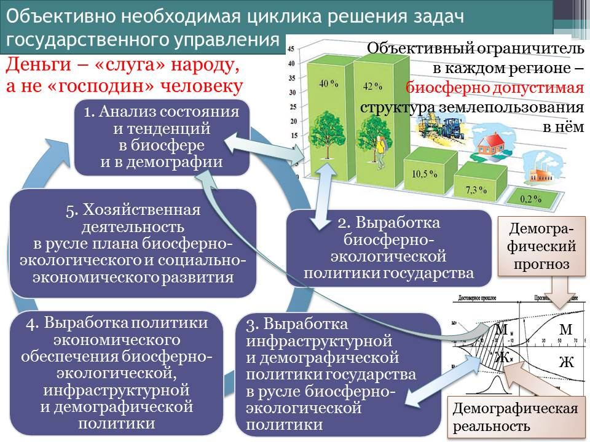
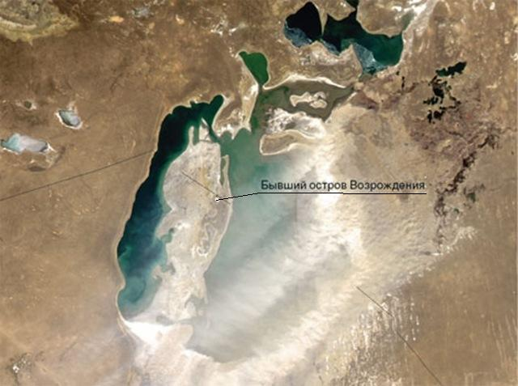
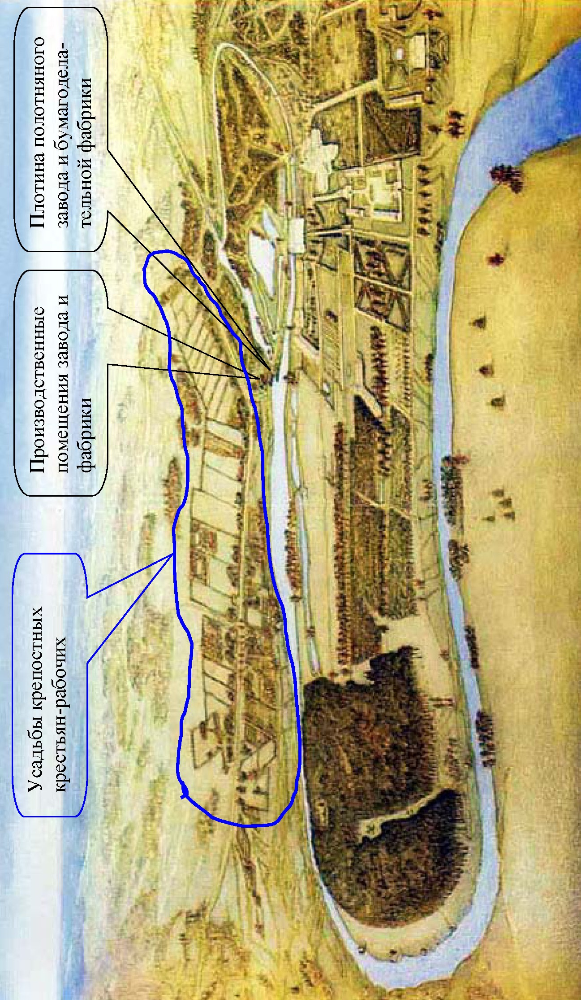
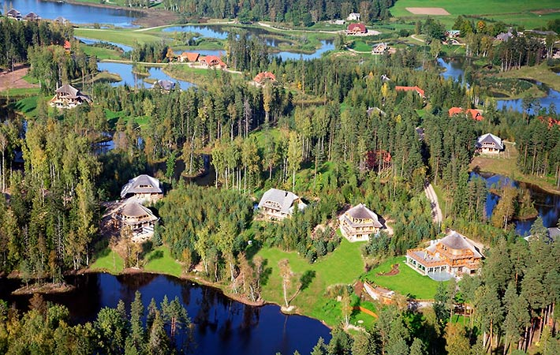
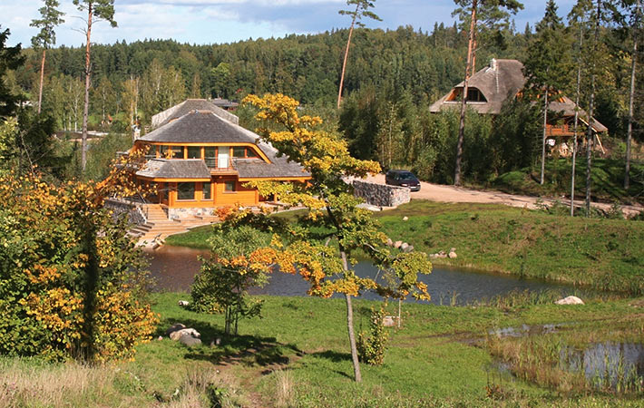

> **Первичный текст.** «Основы социологии», том 6. Страница издания: стр. 425 PDF — кандидатная привязка, требует сверки.
> Источник: файл издания `osnovy-sociologii-tom-6.pdf` (PDF в выпуск не включён). Контрольные суммы и статус проверки — в [NOTICE.md](../../NOTICE.md).
> Содержание передаёт позицию авторов издания; утверждения не верифицированы библиотекой.

---

# Глава 22. Образ жизни экотехнологической цивилизации — ландшафтно-усадебная урбанизация

Объективным закономерностям всех шести групп, которым подчинена жизнь людей, семей, социальных групп, обществ и человечества в целом, на наш взгляд наилучшим образом соответствует образ жизни экотехнологической цивилизации на основе концепции ландшафтно-усадебной урбанизации. Термин «ландшафтно-усадебная урбанизация», прямо указывая на обусловленность жизни общества ландшафтами, т.е. на необходимость сохранения и развития цивилизации в гармонии с природной средой, более точно выражает смысл предлагаемой концепции, нежели вводимые в употребление в последние годы такие термины, как «поместно-усадебная урбанизация», «экопоселения», «экополисы», «родовые поместья» и т.п.

По существу концепция ландшафтно-усадебной урбанизации направлена на разрешение биосферно-социального экологического кризиса технократической цивилизации. Это касается как глобального масштаба, так и регионов планеты и государств. Однако для того, чтобы состояться в таковом качестве, ландшафтно-усадебная урбанизация должна обладать определёнными характеристиками.

Главное требование к ней — обеспечить в преемственности поколений воспроизводство биологически здорового населения, способного развивать культуру, при сохранении и развитии биоценозов в регионах, где предполагается организация инфраструктур проживания и хозяйственной деятельности людей. Т.е. ландшафтно-усадебная урбанизация должна органически сочетать в себе два аспекта: биоценозно-экологический (с учётом хозяйственной деятельности) и социокультурный. И она не может реализоваться «сама собой» на основе либерально-рыночной экономической модели, а требует организации *научно-методологически состоятельного*[^513] государственного управления в соответствии с цикликой решения частных задач, представленных на рис. 13.1-3.

**Биоценозно-экологический аспект** обязывает выработать и осуществлять биосферно-экологическую политику государства, которая должна быть подчинена общебиосферным закономерностям, обуславливающим жизнь биоценозов, поскольку в противном случае невозможно интегрировать цивилизацию в их жизнь, а разрушив биосферу, человечество совершит самоубийство.

*Рис. 13.1-3. Взаимная обусловленность частных управленческих задач*

*в ходе реализации концепции устойчивого и безопасного развития*

Основой биоценозов на континентах являются водоёмы — болота, ручьи, реки, озёра, пруды и т.п. А динамика водного баланса территорий на протяжении смены сезонов года обуславливает продуктивность биоценозов как по общему объёму биомассы, так и по составу и многообразию биологических видов. Особую роль в поддержании водного баланса территорий в засушливые годы играют болота, не говоря уж о том, что многие из них являются местами гнездовий и отдыха при сезонных перелётах различных видов птиц.

Соответственно первый вопрос государственной биоценозно-экологической политики — концепция режима водоохранных зон: болот, берегов ручьёв (места нерестилищ), рек, озёр, искусственных водохранилищ. Её назначение двояко:

- управление водным балансом территорий в соответствии с климатическими особенностями регионов в целях поддержания и развития биоценозов[^514] и обеспечения здоровых условий жизни населения;

- поддержание химической и физико-полевой чистоты водоёмов.

При этом необходимо отметить, что климатическая система планеты в целом и климат регионов связаны с биоценозами регионов. Эта взаимосвязь носит двоякий характер: в одном направлении — изменение климата в регионе изменяет характер биоценозов в нём; в другом направлении — изменение биоценозов, и прежде всего, под воздействием цивилизации, в случае воздействия на водный баланс территории влечёт за собой изменения климата в регионе, которые могут затронуть и сопредельные регионы (и соответственно их биоценозы) и оказать воздействие на всю климатическую систему планеты[^515] и биосферу в целом по «принципу домино». Примером тому — фактически полное исчезновение Аральского моря (см. рис. 22-1) в результате хозяйственной деятельности человека, ориентированной руководством СССР на достижение сугубо потребительских результатов. Его исчезновение изменило природную среду и климат прилегающих регионов нескольких государств: Казахстана, Узбекистана, и некоторых районов Туркменистана.

«В последние 5-10 лет за счёт процесса высыхания Арала отмечается заметное изменение климатических условий Приаралья. Ранее Арал выступал в роли своеобразного регулятора, смягчая холодные ветры, приходившие осенью и зимой из Сибири и, уменьшая словно огромный кондиционер, силу жары в летние месяцы. С ужесточением климата лето в регионе стало более сухим и коротким, зимы — длинными и холодными. Вегетативный сезон сократился до 170 дней. Продуктивность пастбищ уменьшилась наполовину, а гибель пойменной растительности снизила продуктивность поймы в 10 раз.

Рис. 22-1. То, что осталось от Аральского моря к началу 2010‑х гг. Снимок из космоса.

На прибрежных территориях Аральского моря атмосферные осадки сократились в несколько раз. Их величина в среднем составляет 150 — 200 мм со значительной неравномерностью по сезонам.

Отмечается высокая испаряемость (до 1 700 мм в год) при уменьшении влажности воздуха на 10 %. Температура воздуха зимой понизилась, а летом повысилась на 2 — 3° С. В летний период отмечаются высокие температуры (до +49° С).

Характерной чертой климата Приаралья является высокая повторяемость и значительная продолжительность пыльных бурь и позёмков. Часто в районе Аральского моря дуют сильные ветры. Наиболее интенсивны и длительны они на западном побережье моря — более 50 суток. Максимальная скорость ветра может достигать 20 — 25 м/с.

Отмеченные климатические условия определили условия, при которых земледелие без орошения невозможно. Следствием этого является интенсивное накопление солей в почве, что влечёт за собой необходимость затрат воды не только для полива растений, но и для проведения промывок земель»[^516].

«Как указывают медицинские эксперты, местное население страдает от большой распространённости респираторных заболеваний, анемии, рака горла и пищевода, а также расстройств пищеварения. Участились заболевания печени и почек, не говоря уже о глазных болезнях»[^517].

Это является следствие того, что бывшее дно Аральского моря превратилось в «солончаково-сельхозхимическую» пустыню, поскольку изрядная доля употреблявшихся в Приаралье на протяжении нескольких десятилетий препаратов сельхозхимии была смыта в Арал и сохранилась в его донных отложениях.

При этом необходимо отметить, что десятилетия с 1980 г. (когда происшедшие за предшествующие 20 лет изменения стали ощутимо угрожать катастрофой в будущем) по 1990 г. (когда развитие катастрофы значительно ускорилось — см. рис. 22‑2) — было вполне достаточно для того, чтобы задуматься о тенденциях и перспективах, выработать стратегию изменения хозяйственной деятельности в прилегающих регионах, осуществить её и тем самым избежать биосферно-социальной катастрофы.

Понятно, что при верности политического руководства прилегающих к Аралу государств принципам капиталократии рыночного либерализма — биосферно-социальные проблемы Приаралья и сопредельных регионов будут только усугубляться, порождая этнополитические проблемы и для других стран.

*[В оригинальном издании здесь расположены иллюстрации (8 объекта). Иллюстрации опущены: см. реестр графического слоя работы.]* <!-- figs:osnovy-sociologii-tom-6--image39,osnovy-sociologii-tom-6--image40,osnovy-sociologii-tom-6--image41,osnovy-sociologii-tom-6--image42,osnovy-sociologii-tom-6--image43,osnovy-sociologii-tom-6--image44,osnovy-sociologii-tom-6--image45,osnovy-sociologii-tom-6--image46 -->

*Рис. 22-2. Динамика процесса гибели Аральского моря с 1960 по 2010 г. (карты), 2010 (фото).*

Однако задача возрождения биоценозов и воссоздания благоприятной для людей природной среды не сводится исключительно к политике обеспечения режима водоохранных зон, но обязывает поддерживать не только так называемые «национальные природные парки» и несколько десятков федеральных заповедников: в каждом регионе необходимо организовать не по одной заповедной зоне, в которых хозяйственная деятельность должна быть запрещена полностью, а режим туризма и отдыха в них должен быть согласован с режимом воспроизводства биологических видов в этих зонах. Назначение такого рода заповедных зон различной протяжённости — быть источником экспансии биологических видов на сопредельные территории, где хозяйственная деятельность и жизнь людей препятствует нормальному воспроизводству поколений биологических видов в биоценозах.

Нарушение режима водоохранных и заповедных зон должно рассматриваться как особо тяжкое преступление и караться безжалостно, поскольку последствиями такого рода преступлений, рассматриваемыми на исторически длительных интервалах времени, могут быть биоценозные и климатические катастрофы, наносящие необратимый ущерб обществу вплоть до того, что многие районы могут стать непригодными для жизни в них людей (примерами тому гибель Аральского моря, засоление почв Калмыкии в результате хозяйственной деятельности цивилизации и сопутствующие биосферные и социальные проблемы этих регионов).

Назначение политики поддержания режима водоохранных и заповедных зон — восстановить биоценозы и их здоровье повсеместно, вернув тем самым Природу людям, а людей — Природе.

Соответственно в основу государственной природоохранной политики должна быть положена не просто биологическая наука, а её специфическая отрасль, изучающая биоценозы как природные системы, способные к устойчивому самовоспроизводству и экспансии на сопредельные территории при наличии благоприятных условий, а так же и климатология. Т.е. государственная природоохранная политика не должна идти на поводу требования большого и малого частного бизнеса обеспечить ему безответственность и наивысшую *краткосрочную* рентабельность на основе принципа «после нас хоть трава не расти». Выработка такой политики требует осуществления соответствующей государственной программы комплексных исследований с привлечением географов, геологов, климатологов, биологов, историков, специалистов по народно-хозяйственным комплексам (макроэкономическим системам). Т.е. необходимо вернуться к тому, что было начато во времена сталинского большевизма: см. раздел. 21.4.4 — о сталинской экологической революции.

Во многом содержание такого рода программы будет обусловлено ответами на вопросы социокультурного характера. К рассмотрению этой обусловленности мы и обратимся.

Как было показано ранее, семья — «зёрнышко», из которого вырастает будущее общества, а наиболее предпочтительный в аспекте обеспечения благоустроенности жизни общества тип семьи — нравственно здравая семья нескольких взрослых поколений, живущая общим домашним хозяйством и воспитывающая детей. Поэтому главный вопрос — создание условий для жизни семьи, исходя из ориентации именно на описанное в разделе 19.1 (том 5 настоящего курса) её социокультурное предназначение.

Если обратиться к современной реальности, то условия жизни семьи в городе и в сельской местности — различные: в силу исторических особенностей развития нынешней цивилизации.

При этом **жизнь в городе характеризуется**:

- с одной стороны тем, что: домашний быт в нём проще и легче, возможности получения образования, медицинского обслуживания, разнообразие досуга (при наличии свободного времени) — выше, график труда и отдыха большинства городского населения неизменен в течение календарного года, поскольку не обусловлен сезонностью профессиональных и бытовых дел;

- с другой стороны тем, что: город — его техносфера и скученность населения — мощнейший патогенный[^518] и мутагенный фактор, вследствие чего *воспроизводство биологически здоровых поколений в нём стало практически невозможным:* чем больше город и чем выше в нём плотность населения, плотность размещения объектов техносферы и их мощь, — тем слабее физиологическое и психологическое воздействие Природы на человека, вследствие чего горожанин склонен утрачивать прежде всего психическое здоровье, а так же — физиологическое и генетическое; кроме того, по мере стихийно-коммерческого беспланового расширения городской черты и нарастания плотности застройки в её пределах население городов всё в большей мере оказывается во власти «проклятия инфраструктур»[^519], пожирающего свободное и рабочее время горожан, их здоровье, а так же снижающего экономическую эффективность городского образа жизни (бремя этих финансово-экономических издержек так или иначе перекладывается на остальное население страны, что и создаёт иллюзию некоторого специфического благополучия мегаполисов — ярче всего это видно на примере строительства за счёт федерального бюджета метрополитена, который никогда непосредственно не окупится в условиях нерегулируемого рынка и потому не может быть построен на основе частнопредпринимательской инициативы).

**Жизнь в сельской местности характеризуется**:

- с одной стороны: открытостью человека к физиологическому и психологическому воздействию Природы, минимальным уровнем патогенного и мутагенного воздействия техносферы;

- с другой стороны: большим объёмом трудозатрат по ведению быта семьи, дефицитом трудовых ресурсов в одни сезоны и невостребованностью располагаемых трудовых ресурсов в другие сезоны, привязанностью людей к хозяйству и его сезонной ритмике, худшими возможностями получения образования, медицинской помощи, бытовых услуг, отсутствием разнообразия досуга (прежде всего — личностно развивающего), доходящими вплоть до полной невозможности доступа к названным социокультурным благам в случае оторванности населённого пункта от транспортных и информационных сетей на протяжении всего года или в какие-то сезоны.

Соответственно этим обстоятельствам — цивилизации необходим иной образ жизни, в котором сочетались бы биологические преимущества сельского образа жизни и социокультурные преимущества городского при интеграции цивилизации в процессе её развития в биоценозы.

В аспекте практической политики перехода к экотехнологической цивилизации это означает, что необходимо изменить как городской, так и сельский образ жизни, исторически сложившиеся к настоящему времени.

При этом главнейший вопрос ландшафтно-усадебной урбанизации — это вопрос об архитектуре поселений (городов, деревень, посёлков). Он носит многогранный характер:

- во-первых, это вопрос о доминирующем и сопутствующих видах хозяйственной деятельности жителей поселения, поскольку всякое поселение, в котором люди живут в преемственности поколений, как показывает история, имеет свою экономическую основу и умирает, как только эта экономическая основа исчезает (примером тому — «мёртвые города» США, лидера индустриализации и мегаполисной урбанизации, которые в прошлом быстро развивались, некоторое время процветали, а потом были заброшены и разрушились[^520]) или уничтожается неадекватным государственным правлением (примером чему «моногорода»[^521] и многие сельские поселения России наших дней)[^522];

- во-вторых, это вопрос о выборе места поселения среди ландшафтов региона с учётом: 1) воздействия природных факторов на труд и быт населения, 2) сохранения сложившихся биоценозов, 3) развития инфраструктур, которые должны интегрировать поселение в социально-экономическую структуру страны (2‑й и 3‑й этапы в циклике решения задач государственного управления, представленной на рис. 13.1-3);

- в-третьих, это вопрос о структуре самого поселения, т.е. вопрос о разграничении в его пределах: 1) жилых зон, 2) зон *отдыха в контакте с природной средой*, 3) зон ведения доминирующих и сопутствующих видов хозяйственной деятельности, 4) коммутации их внутренними путями сообщения и выведения транзитных путей, связывающих поселение с остальной страной, за пределы населённого пункта.

- в-четвёртых, это вопрос о характере застройки жилых зон, а в их пределах — это вопрос об архитектуре жилища, которое должно: 1) обеспечить удобную жизнь и здоровье каждого из членов большой семьи нескольких взрослых поколений и 2) служить не менее 100 лет (в противном случае массовое строительство «времянок» будет неподъёмным для общества делом — примером чему массовая застройка городов и сёл «хрущёвками», от которых теперь надо избавляться).

По отношению к существующим поселениям этот комплексный вопрос по сути является вопросом их *реконструкционного развития,* вследствие чего к четырём названным аспектам для многих сложившихся поселений (и в особенности для крупных городов) добавляются ещё два: 1) сохранение памятников истории и культуры и интеграция их в жизнь поселения в настоящем и в перспективе и 2) вывод транзитных транспортных потоков за границы поселений (это необходимо по двум причинам: улучшение условий жизни в самом поселении и повышение эффективности транспортных инфраструктур регионов и страны в целом за счёт увеличения средней скорости перемещения грузов и пассажиров).

Так же необходимо отметить, что жизненно состоятельные ответы на каждый из поставленных выше вопросов обусловлены природно-географическими факторами региона и конкретного места, где поселение уже существует либо его предполагается построить с нуля.

Эта проблематика имеет своё лицо в городах с населением от примерно 100 000 человек и выше, и своё лицо во всех прочих населённых пунктах с меньшей численностью населения.

Стихийно сложившаяся в условиях предельной коммерционализации всех сфер деятельности ныне действующая архитектурная парадигма застройки городов должна быть изжита в исторически короткие сроки. При её господстве плотность застройки многоэтажками (в том числе уплотняющей застройки в уже сложившихся кварталах) такова, что города обречены на инфраструктурный коллапс, а люди в них — просто фактом своего присутствия — биологически и психически угнетают друг друга из-за высокой плотности населения, не говоря уж о неблаготворном воздействии иных факторов современной городской среды обитания.

*[В оригинальном издании здесь расположен рисунок/схема «Иллюстрация из исходного DOC: image47.wmf». Иллюстрация не включена в данный выпуск: ожидает визуальной и правовой проверки. Файл источника: assets/media/image47.png]*В городах, чьё существование в качестве промышленных центров, транспортных узлов и центров средоточия науки и вузов функционально оправдано, многоэтажное строительство может иметь только одну цель: сократить в черте города площадь, занятую под строениями и дорогами, чтобы природные ландшафты и биоценозы интегрировать в городскую среду.

При этом, в соответствии со сказанным ранее о роли большой семьи в жизни общества, преобладающий тип квартир должен обеспечивать жизнь семьи нескольких взрослых поколений с детьми.

В поселениях с населением в пределах нескольких десятков тысяч человек ресурсы страны позволяют обеспечить застройку преимущественно усадебного типа. Такой характер застройки имел место в большинстве деревень, сёл, посёлков и городов до начала эпохи индустриализации и массового оттока населения из сельской местности в промышленные центры. В поселениях такого типа природные ландшафты могут быть в пределах получасовой доступности.

Однако и усадебная застройка усадебной застройке — рознь, т.е. не всякая усадебная застройка может обеспечить решение поставленной выше задачи перехода к экотехнологической цивилизации. На рис. 22-3 (ниже по тексту) представлена реконструкция имения Гончаровых Полотняный завод (Калужская область) по состоянию на начало XIX в. В излучине реки Суходрев — господский парк, фруктовый сад, оранжереи, конюшни, прочие хозяйственные постройки, барский трёхэтажный дом. При Екатерине II дом получил статус «дворца», а штат прислуги только в барском доме-дворце во времена экономического расцвета клана доходил до 90 дворовых, при этом годовой доход Гончаровых был порядка 1/15 бюджета Российской империи.

Прямоугольнички, тянущиеся полосой вдоль реки в верхней части рисунка, — усадьбы *собственности* Гончаровых: крепостных рабочих полотняного завода и бумагоделательной фабрики.

С того времени прошло порядка 200 лет. 150 лет прошло с тех пор, как было отменено крепостное право. Но до сих пор Полотняный завод (как и большинство других поселений, застройка которых сложилась под давлением крепостничества) представляет собой несколько улиц, застроенных домишками «в два окошка» в фасаде. Они слишком малы, чтобы обеспечить жизнь семьи в преемственности поколений, а это — главное требование к жилищу, если общество желает искоренить безнадзорность детей, массовую преступность, одиночество стариков.

И ещё один аспект этого типа застройки, о котором практически никто не задумывается:

Одно из назначений архитектурных принципов, воплощаемых в «жилище для рабов», — воспроизводить рабскую алгоритмику личностной и коллективной психики в автоматическом режиме в преемственности поколений.

*Рис. 22-3. Полотняный завод, имение Гончаровых — панорама на начало XIX века. Реконструкция*

*архитектора А.А. Кондратьева (1942 — 2006) — 2000 г. Художник В.С. Манаенков — холст,*

*масло, 2002 г. (Пояснительные надписи — наши).*

Рабская архитектурная среда воспроизводит рабскую психологию, а та, в свою очередь, воспроизводит рабскую архитектуру в новых исторических условиях на основе новых технологий. Примером тому в советском прошлом — «хрущёвки», не пригодные для жизни семьи в преемственности поколений, о которых многие по сию пору вспоминают с благодарностью Н.С. Хрущёву: *дескать в результате люди перестали жить по съёмным углам, а так же в подвалах и коммуналках, —* не понимая того, что в действительности одни типы жилищ для рабов сменились другим типом жилищ для рабов.[^523] Но то же самое повторяется и в наши дни, когда при проектировании и строительстве новых поселений преобладает тот же тип застройки, что и в Полотняном заводе. Примером тому — жилой массив Новая Ижора[^524] (на рисунке ниже) вблизи города Колпино неподалёку от Санкт-Петербурга.

Чтобы разорвать этот порочный цикл, необходимы понимание проблемы, альтернативная архитектурная парадигма и политическая воля, направленная на воплощение альтернативы в жизнь.

Такова власть психологической инерции и отсутствия государственного разносторонне-комплексного подхода к вопросу о том, каким должно быть поселение, чтобы подавляющее большинство семей могли жить и работать в нём в преемственности поколений, не порождая социальных и экологических проблем.

*[В оригинальном издании здесь расположен рисунок/схема «Иллюстрация из исходного DOC: image49.jpeg». Иллюстрация не включена в данный выпуск: ожидает визуальной и правовой проверки. Файл источника: assets/media/image49.jpeg]*На фотографии слева — дома в составе этого жилого массива.

По сути Новая Ижора — пример воспроизводства на основе строительных технологий наших дней принципов застройки, сложившихся несколько веков тому назад под давлением крепостного права и предназначенной для рабов и воспроизводства психологии раба. Эти принципы не обеспечивают решения задачи перехода общества к здоровому образу жизни в гармонии с природной средой в преемственности поколений.

Образно говоря, поселения в архитектурном стиле «Новая Ижора», это — всё та же большая коммуналка типа «воронья слободка», элементами которой являются не комнаты, а «коттеджи» общей площадью от 113 до 140 кв. м, расположенные на участках размером от 2,2 до 5,5 соток.

Вопрос же о том, насколько месторасположение этого поселения и характер его застройки благоприятны для проживания в аспекте биоэнергетики, и какие работы надо провести для её улучшения, при разработке проекта, судя по всему, вообще не вставал: главным было обеспечить коммерческую эффективность. Но тот же тип застройки характерен и для «элитарных» коттеджных посёлков по всей России, с тою лишь разницей, что «коттеджи» в них подороже, чем в Новой Ижоре. И общая проблема таких поселений — в них невозможно обеспечить занятость населения и воспроизводство психологически и телесно здоровых поколений.

В характере застройки выражается господствующая в обществе этика, и прежде всего — нравы и этика правящей так называемой «элиты». И судя по показанному выше, постсоветская РФ совершила нравственно-этический регресс к уровню эпохи крепостного права. В частности, не прошло и 20 лет после отказа от социализма, и сенатор С. Пугачёв задекларировал доход за 2009 г. в 3 млрд. руб. Это эквивалентно тому, что он является собственником примерно 10 600 крепостных рабов, если соотносить его доход со средней заработной платой в РФ в 2009 г. Т.е. рабовладение, утратив в 1861 г. в Российской империи обнажённо беззастенчивый характер, в постсоветской России обрело характер финансовый, став юридически анонимным, поскольку простонародье — живёт на «правах» одного из многих экономических ресурсов в беспросветной бедности и нищете, будучи юридически полноправными гражданами.

Однако в тех регионах страны, где крепостного права не было и где самодурственное имперское чиновничество не особо «доставало» мужика, народ выработал иной тип застройки поселений. Для них характерны два качества.

- Во-первых, жилище обеспечивает комфортную жизнь семьи нескольких взрослых поколений одним хозяйством.

- Во-вторых, расположение соседних усадеб таково, чтобы соседи «не давили друг другу на психику», сохраняя при этом возможность быстрого обращения друг к другу по тем или иным хозяйственным или приятельским делам (достигалось это либо высокими заборами в случае плотной застройки, как это имело место во многих сибирских сёлах, либо удалением жилых домов друг от друга на расстояние порядка 50 — 100 метров и более в пределах поселения).

В качестве примера ниже повторно воспроизведена фотография дома, сохраняемого в архитектурном заповеднике Кижи (дом перенесён из деревни Ошевнево, где он был построен в 1876 для большой семьи крестьянина Нестора Максимовича Ошевнева).

*[В оригинальном издании здесь расположен рисунок/схема «Иллюстрация из исходного DOC: image50.jpeg». Иллюстрация не включена в данный выпуск: ожидает визуальной и правовой проверки. Файл источника: assets/media/image50.jpeg]*Ещё один пример (фото ниже) — дом крестьянина-середняка, сохраняющийся в архитектурном заповеднике Малые Кореллы под Архангельском.

*[В оригинальном издании здесь расположен рисунок/схема «Иллюстрация из исходного DOC: image51.jpeg». Иллюстрация не включена в данный выпуск: ожидает визуальной и правовой проверки. Файл источника: assets/media/image51.jpeg]*Оба дома в современном каталоге недвижимости именовались бы как «элитные коттеджи из отборных брёвен», хотя на момент постройки каждого из них они были в общем-то *типичным* жильём для больших семей *типичных* тружеников.

Конечно, в наши дни нет необходимости под одну крышу с жилым домом (как это делалось на Севере до начала ХХ века) заводить все те хозяйственные постройки, которые были нужны крестьянской семье в прошлом. Тем не менее, требования, сложившиеся в регионах, где не было крепостного права и определяющие размеры *семейного дома* и площадь приусадебного участка, обладают непреходящей значимостью в силу неизменности биологических и психологических потребностей людей. И именно они позволяют понять, чем отличается архитектурная парадигма ландшафтно-усадебной урбанизации от застройки поселений по господствующему ныне повсеместно принципу достижения наивысшей коммерческой отдачи с квадратного метра территории.

С проблемой несовместимости задач достижения предельной коммерческой эффективности застройки и решения социальных проблем сталкиваются все страны. Так, в статье Т. Соляной[^525], посвящённой семинару одного из ведущих европейских экспертов по жилищному строительству профессора Лондонской школы экономики Кристины Уайтхед, сообщается:

«Аналитики предупреждают, что эта мода (на дешёвое, запредельно коммерчески эффективное жильё: наше пояснение при цитировании — авт.) может дорого обойтись: в результате образуются целые районы некачественного жилья, которые со временем станут очередными «гарлемами». Но у застройщиков есть мощный заказчик — государство. Ему такие «конурки» выгодны: если их давать/продавать очередникам и льготникам, то можно и социальную норму в 18 кв. м на человека соблюсти, и отрапортовать о решении жилищных проблем. Довольны и получатели квартир: попробуйте объяснить офицеру, десяток лет проскитавшемуся по общежитиям, что его новенькая 60-метровая «трёшка» никуда не годится.

Стремление к дешевизне вызывает и другую тенденцию, с которой борются в развитых странах, — субурбанизацию, или расползание города по пригородам, что чревато ростом инфраструктурных проблем. Этому есть примеры в подмосковных новостройках, а ещё больше — в новостройках под Питером, когда дело даже не в том, что бурно растущему пригороду не хватает детсадов, школ, больниц и пожарных депо, а в том, что он оказывается «в чистом поле» ещё и в социокультурном смысле. В результате маргинализация жителей идёт ускоренными темпами — и вот вчера ещё чистенький пригород становится местом, где не рекомендуется выходить вечером на улицу».

Выход из этого биосферно-социального тупика возможен только на основе концепции ландшафтно-усадебной урбанизации. Но переход к ней подразумевает отказ от господствующего ныне принципа *«население — экономический ресурс» — собственность «элиты»* *и космополитичной «суперэлиты»* — к иному принципу *«экономика — для блага **каждого** человека»* и соответственно требует перестройки всей социально-экономической политики государства (включая финансовую), законодательства, системы стандартов.

При этом в масштабах страны демографическая политика, учитывающая описанные выше биологические и социо-культурные аспекты, должна обеспечить:

- отрицательный биологический прирост населения в городах с населением более 100 000 человек;

- депопуляцию городов-миллионников и создание путей проникновения на их современную территорию природных биоценозов соответствующих регионов, чтобы на территории городов могли быть образованы зоны отдыха горожан и уменьшено техногенное воздействие на население;

- биологический прирост населения в сельской местности, избыточный по отношению к востребованности трудовых ресурсов на месте;

- переток молодёжи из сельской местности в города как системный фактор воспроизводства и оздоровления населения городов в преемственности поколений.

По отношении к этой демографической политике **ландшафтно-усадебная урбанизация должна обеспечить в сельской местности**:

- качество быта семьи и возможности получения образования, медицинских услуг, разнообразие досуга на уровне, доступном ныне в городах, и поднять его выше, чтобы гарантировать однокачественность личностного развития людей (прежде всего в аспекте получения образования) вне зависимости от места рождения и проживания;

- сохранить физиологическое и психологическое воздействие Природы на человека с целью обеспечения воспроизводства биологически здоровых поколений, характерное ныне для жизни в сельской местности.

По отношению к городам ландшафтно-усадебная урбанизация должна изменить облик большинства городов так, чтобы на смену городу типа «каменные джунгли» пришёл город типа «город-сад» и город перестал быть средой, подавляющей и угнетающей физиологию и психику человека, калечащей его генетику.

Определившись в этих целях, можно сформулировать принципы ландшафтно-усадебной урбанизации регионального и общегосударственного масштаба. Для того, чтобы сказанное выше стало осуществимо, необходимо решение следующих задач:

- согласование водоохранных и заповедных зон с географией разработки месторождений полезных ископаемых;

- подчинение *инфраструктур транспорта, энергетики и связи страны и регионов* стратегии и режиму водоохранных и заповедных зон;

- привязка к транспортной инфраструктуре новых населённых пунктов, строительство которых должно быть осуществлено в соответствии с концепцией ландшафтно-усадебной урбанизации;

- по мере возможностей сельское хозяйство должно переводиться на технологии и организацию «пермакультуры»[^526]. Исходный принцип «пермакультуры» состоит в целенаправленном формировании искусственных биоценозов, компонентами которых являются растения, грибы, животные, птица, рыба, которые могут быть использованы людьми в пищу и быть источниками сырья для некоторых отраслей обрабатывающей промышленности. Как сообщает один из основоположников пермакультуры — австрийский крестьянин Зепп Хольцер[^527], — её производственная отдача в расчёте на единицу площади и одного занятого выше, чем производственная отдача традиционного сельского хозяйства, основанного на производстве монокультур, локализованном в одном месте. При этом в пермакультуре, вследствие взаимного влияния друг на друга компонент искусственных биоценозов, может быть сведена к нулю потребность в химикатах сельскохозяйственного назначения, что ставит продукцию пермакультуры вне конкуренции с продукцией традиционного сельского хозяйства по показателям экологичности производства и полезности для здоровья людей. Это позволит исключить и производство продовольствия на основе генномодифицированных организмов. Соответственно в рационе подавляющего большинства населения страны в этом случае могут доминировать вкусные и полезные для здоровья продукты питания, производимые в регионах его проживания, а не фальсификаты пищи, оптимизированные для сохранения товарного вида после длительной транспортировки и хранения и в большей или меньшей мере опасные для здоровья.

Кроме того переход к пермакультуре позволит восстановить природные биоценозы на территориях, где ныне осуществляется традиционная сельскохозяйственная деятельность, и тем самым улучшить состояние природной среды страны в целом.

Ландшафтно-усадебная урбанизация — это одно-, двухэтажная Россия небольших поселений с усадебной застройкой, интегрированных в природную среду и утопающих в зелени садов. По этой теме в интернете есть множество публикаций: достаточно набрать в поисковике «ландшафтно-усадебная урбанизация». Проектирование населённых пунктов в соответствии с концепцией ландшафтно-усадебной урбанизации должно исходить из следующих принципов:

1.  На первом этапе к ландшафту и инфраструктурам федерального и регионального уровня значимости привязываются зоны хозяйственной деятельности, зоны отдыха, жилые зоны.

2.  В населённом пункте всё большей частью должно быть в пределах пешеходной доступности в течение не более получаса — часа; основной внутрипоселковый транспорт — велосипеды и самокаты, веломобили, в периоды заснеженности — лыжи (средства борьбы с гиподинамией должны быть интегрированы в образ жизни населения);

3.  Участки, выделяемые под усадьбы, не должны примыкать друг к другу: их должны разделять полосы нетронутой природы или искусственных насаждений шириной порядка 10 — 20 метров; расстояние между домами менее 100 метров недопустимо психологически.

4.  Периметр участков должен быть криволинейным (природа не знает прямых углов и линий, и криволинейный периметр участка более органичен и психологически не создаёт барьера между человеком Природой).

5.  Архитектура домов и характер размещения строений на участке должны обеспечивать:

- либо изначально *комфортную* жизнь семьи нескольких поколений под одной крышей так, чтобы каждый мог уединиться и быть в то же время в пределах общения с другими;

- либо возможность модернизации и расширения дома в расчёте на перспективу роста семьи (с одной стороны — забота о стариках обязанность детей, с другой стороны — дети должны расти, видя перед собой все возрастные периоды предстоящей жизни).

Т.е. эти принципы направлены на реализацию всего, о чём было сказано в главах 16 — 19 (том 5 настоящего курса).

И в России в соответствии с ними, пока в общественно-инициативном порядке, ведётся разработка проектов поселений[^528]. Общий вид одного из поселений типа «Спираль» представлен на рисунке ниже: **Мечты сбываются — наша Земля, города и сёла могут стать и такими, но это требует нашего общего добросовестного труда**. О степени проработанности проблематики см. Пояснительную записку «Мҍра в урбанистике» на сайте «Малоэтажная планета»[^529].

*[В оригинальном издании здесь расположен рисунок/схема «Иллюстрация из исходного DOC: image52.jpeg». Иллюстрация не включена в данный выпуск: ожидает визуальной и правовой проверки. Файл источника: assets/media/image52.jpeg]*В качестве примера реализации основных принципов ландшафтно-усадебной урбанизации приведём поселение Аматциемс (Amatciems) в Латвии (рис. 22-4, рис. 22-5)[^530].

Однако в Аматциемсе концепция ландшафтно-усадебной урбанизации реализована только отчасти, поскольку рабочих мест для всего населения Аматциемса изначально не предусмотрено, и это станет проблемой в течение жизни одного — двух следующих поколений.

*Рис. 22-4. Аматциемс (Amatciems), Латвия.*

*Общий вид одного из сегментов поселения.*

Кроме того, как заметил геолог, почвовед и один из основоположников экологической географии В.В. Докучаев (1846 — 1903), «человек зонален во всех проявлениях своей жизни: обычаях, религии (особенно в нехристианских религиях), в красоте, одежде, во всей житейской обстановке; зональны домашний скот, так называемая культурная растительность, постройки, пища, питьё»[^531].

*Рис. 22-5. Аматциемс (Amatciems), Латвия. Примеры интеграции в ландшафт семейных усадеб в пределах поселения.*

Иными словами, концепция ландшафтно-усадебной урбанизации, сохраняя некие общие принципы во всех регионах, неизбежно будет обладать своеобразием при её реализации в каждом из них. Это своеобразие обуславливается природно-географическими факторами соответствующего региона, к которым человек, чтобы общество было устойчиво в преемственности поколений, должен приспосабливаться. Приведённые выше примеры относятся к регионам, для которых характерно преобладание лесов в качестве растительного покрова и относительно короткое лето с регулярным выпадением осадков. Физико-географические условия степной и лесостепной зон, гор продиктуют иной оптимум организации жилища семьи на принципах ландшафтно-усадебной урбанизации.

Вопросы занятости населения в масштабах страны при реализации концепции ландшафтно-усадебной урбанизации должны решаться на принципах, отличных от исторически-стихийно сложившихся к настоящему времени.

Занятость в сельском хозяйстве обусловлена главным образом двумя факторами: 1) относительно медленно изменяющейся ёмкостью рынка продовольствия и технических культур и 2) сезонными потребностям в трудовых ресурсах, которые колеблются в течение года.

Соответственно для использования трудовых ресурсов, высвобождающихся вследствие сезонных колебаний потребностей сельского хозяйства, промышленные производства разного рода могут располагаться в населённых пунктах сельской местности.

Поскольку в целях оздоровления населения в преемственности поколений необходимо изменение пропорций городского и сельского населения страны в сторону увеличения доли населения, проживающего в сельской местности, то размещение промышленных предприятий на селе должно пониматься не только как средство обеспечения занятости сельского населения в периоды межсезонья сельскохозяйственных работ, но и как стратегия развития науки и промышленности в целом.

Дело в том, что в подавляющем большинстве случаев собственно промышленное производство не требует для своего кадрового обеспечения городов с населением от 100 000 человек и более. Их возникновение — результат стихийно-экономического развития промышленности в условиях не управляемого обществом рынка в прошлом, и при биосферно обусловленной демографической политике их население должно сократиться, а природные биоценозы должны войти на их современную территорию и изменить качество жизни людей в них. Если ориентироваться на переход к экотехнологической цивилизации, то промышленные предприятия (целиком или их технологически специализированные подразделения) могут быть привязаны к той же транспортной инфраструктуре, что и населённые пункты, развиваемые на принципах ландшафтно-усадебной организации, и в этом случае население окрестных населённых пунктов может на них работать. Энерговооружённость и развитие транспортных инфраструктур позволяют при таком подходе обеспечить технологическую целостность и управляемость процессов производства большинства видов продукции. Средства доставки персонала к месту работы и домой после работы — личный автотранспорт и автобусы служебной развозки по расписанию.

Такая политика с течением времени увеличит долю негородского населения и восстановит достаточный для поддержания здоровья городского населения переток населения из сельской местности при общем повышении качества жизни общества. Такая система организации труда и быта может быть тем более работоспособна, чем выше общекультурный и образовательный уровень населения (вследствие чего смена места работы и профессии для большинства людей — не стресс и не проблема, а владение несколькими профессиями и готовность осваивать новые — социальная норма).

Однако всё это может быть осуществлено только при условии, если государство признаёт и выражает в политике следующие принципы нравственно-этического характера:

- смысл жизни человека не в добывании денег;

- основная масса населения — не «экономический ресурс», не средство удовлетворения потребительской и иной похоти так называемой «элиты», а действительно — носители достоинства и прав человека;

- экономическая деятельность людей — только средство обеспечения реализации смысла жизни каждым из них: иными словами человек должен жить и работать во имя некой идеи, получая при этом достойную зарплату, позволяющую ему обеспечить развитие своей семьи, воспитание детей, досуговое общение с другими людьми и т.п., а в случае утраты трудоспособности или достижения пенсионного возраста — быть обеспеченным и доходами, и заботой со стороны его родных и близких.

Но всё описанное выше нереализуемо на экономических принципах буржуазного либерализма в условиях рынка, не управляемого в интересах обеспечения безопасного общественного развития. Поэтому потребность в переходе от самоубийственной для человечества капиталократической цивилизации, порождённой буржуазным либерализмом на принципах коммерционализации всех видов деятельности без исключения, к цивилизации экотехнологической — требует опоры политики государства и общественного самоуправления на альтернативную социолого-экономическую теорию, на основе которой было бы возможно управление хозяйственной системой страны в процессе осуществления концепции ландшафтно-усадебной урбанизации как организационно-экономической основы для жизни общества и развития культуры.

Однако пока политики рисуют перспективы усугубления биосферно-социального экологического кризиса во всех его аспектах и считают это безальтернативно нормальным ходом вещей. [^532] И это представляет реальную опасность для будущего страны и человечества.

Ландшафтно-усадебеная урбанизация, основные принципы которой изложены в настоящем разделе, как органичная составляющая Концепции общественной безопасности — единственная альтернатива самоликвидации буржуазно-либеральной цивилизации вследствие попрания объективных закономерностей всех шести групп, которым подчинена жизнь людей персонально, семей, социальных групп, культурно своеобразных обществ и человечества в целом. Она — необходимая основа для перехода к экотехнологической цивилизации и дальнейшего развития культурно своеобразных обществ и человечества в целом. Но реализация концепции ландшафтно-усадебной урбанизации требует государственного управления, осуществляемого в циклике решения частных задач, представленной на рис. 13.3-1, согласованного с объективными закономерностями всех шести групп, и соответствующей общественной поддержки политики государства.

Глава 22 в редакции от 01.09.2016 г.

[^513]: Т.е. опирающегося на объективные закономерности всех шести групп в их взаимосвязях, которым подчинена жизнь людей.

[^514]: «Леса являются местом обитания большей части известных видов биоразнообразия сухопутных экосистем планеты, но на Земле осталось немногим более 55 процентов первоначального лесного покрова, причём сведён он был в основном в последнее столетие. Несмотря на предпринимаемые усилия в области лесовозобновления, площадь мирового лесного покрова продолжает интенсивно уменьшаться, особенно в тропических регионах» (Потеря биологического разнообразия. Доклад ООН. — Интернет-ресурс: <http://www.un.org/ru/events/biodiversity2010/losing.shtml>).

[^515]: «Потеря биологического разнообразия часто снижает производительность экосистем, тем самым, обедняя природную кладовую товаров и услуг, которыми мы постоянно пользуемся. Она дестабилизирует экосистемы и ослабляет их способность противостоять стихийным бедствиям, таким как наводнения, засухи и ураганы, а также стрессам антропогенного происхождения в виде загрязнения и изменения климата. Мы уже тратим огромные суммы для ликвидации последствий наводнений и ураганов, усугубленных обезлесением, причём эти объёмы с учётом глобального потепления будут только увеличиваться» (Там же).

[^516]: Аральское море. — Без указания авторства. Интернет-ресурс: <http://enrin.grida.no/htmls/aralsoe/aralsea/russian/arsea/arsea.htm>.

[^517]: Аральское море и причины его гибели. — Без указания авторства. Интернет-ресурс: <http://lifeglobe.net/blogs/details?id=484>.

[^518]: «Мегаполис, несмотря на наличие цивилизационных удобств, может «съедать» до 5 лет жизни. Об этом 7 апреля \<2010 г.\> на пресс-конференции, посвящённой Всемирному дню здоровья, заявил главный санитарный врач России Геннадий Онищенко. Правда, он уточнил, что точного суммарного показателя вреда мегаполисов пока не существует. (…) При этом оптимальным с санитарной точки зрения Онищенко назвал город с населением не более 500 тыс. человек» (Мегаполисы «съедают» 5 лет жизни. — Интернет-ресурс «Российская фармацевтика»: <http://pharmapractice.ru/16826>).

[^519]: «Проклятие инфраструктур» — иногда употребляемый термин-метафора, указывающий на то, что развитие инфраструктур, которое должно улучшить качество жизни и эффективность экономической деятельности населения больших городов, в условиях нерегулируемого рынка и коммерционализации жизни влечёт за собой дальнейшее наращивание плотности застройки, плотности населения и т.п., в результате чего вложения в развитие инфраструктур оказываются экономически и социально не оправданными, поскольку проблемы больших городов только усугубляются.

[^520]: В их число попал и Детройт — некогда «столица» автомобильной промышленности США, который в настоящее время опустевает и разрушается. Население Детройта сократилось с 1,8 млн. человек в 1950 г. до 681 тыс. человек в 2013 г.

[^521]: Населённые пункты городского типа, сложившиеся вокруг единственного промышленного предприятия, на котором работает большинство их населения.

[^522]: Поэтому коттеджные посёлки, в которых с начала 1990‑х начали селиться наиболее обогатившиеся граждане РФ, и в которых нет возможности для трудоустройства прежде всего новых поколений, — социокультурный тупик при сохранении и впредь их «ночлежно-курортного» статуса.

[^523]: В этой же связи упомянем и вред перехода на пятидневную рабочую неделю в 1967 г. с двумя выходными днями. С 1956 по 1960 г. в СССР был осуществлён переход на 7-часовой рабочий день (а в некоторых отраслях и на 6-часовой) при укороченном на 1 час рабочем дне в субботу. Это давало возможность детям общаться с родителями ежедневно. В результате перехода на 5-дневку рабочий день был увеличен до 8 часов, что с учётом обеденного перерыва и роста в народном хозяйстве сверхурочных работ существенно сократило время общения детей с родителями на протяжении рабочей недели. Этот результат не мог быть компенсирован появлением дополнительного выходного дня в субботу, поскольку детей необходимо воспитывать каждый день, а не интенсивно в выходные дни, предоставляя их самим себе в остальные дни.

[^524]: Агафонов А.Ю., сотрудник УКЦ УП СПб АГСУ. Принципы архитектурно-планировочных решений для сельских поселений XXI века. — Доклад 27 ноября 2009 г. на III съезде ассоциации деревянного домостроения по архитектурно-планировочным решениям и строительным материалам для поселений XXI века.

[^525]: Соляная Т. Дешёвое жилье станет рассадником зла. (Интернет-ресурс:  
    <http://www.utro.ru/articles/2010/05/19/894744.shtml>).

[^526]: От английского слова «permaculture» — permanent agriculture — «перманентное сельское хозяйство».

[^527]: Хольцер Зепп. Аграрий-революционер / Зепп Хольцер; Пер. с нем. Э.А. Шек. — Орёл: С.В. Зенина. 2008. — 176 с., илл.

[^528]: См. сайт проекта «Малоэтажная планета»: <http://www.lowriseplanet.net/>.

[^529]: <http://www.lowriseplanet.net/images/modeli_poselenii/01_pz/120107_pz_mp1/120107_pz_mp_1.pdf>

[^530]: Amatciems. — Интернет-ресурс: <http://www.amatciems.lv/rus/ideja.html>.

[^531]: Приводится по книге: Зональные типы биомов России: антропогенные нарушения и естественные процессы восстановления экологического потенциала ландшафтов. Под ред. доктора геогр. наук, профессора К.М. Петрова. Санкт-Петербургский государственный университет. — СПб: 2003. — С. 38.

[^532]: См. Приложение 5 — «Тезисы выступления главы минэкономразвития РФ Э.С. Набиуллиной на Московском урбанистическом форуме 8 декабря 2011 года» — том 5 настоящего курса.
---

[← Назад](../subsections/ch-21-s21-04-04.md) · [Оглавление тома 6](../README.md) · [Вперёд →](ch-23.md)
